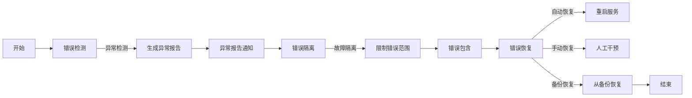
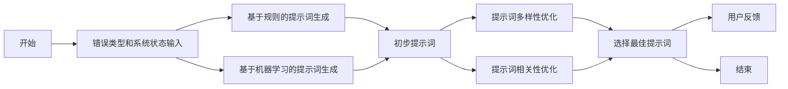
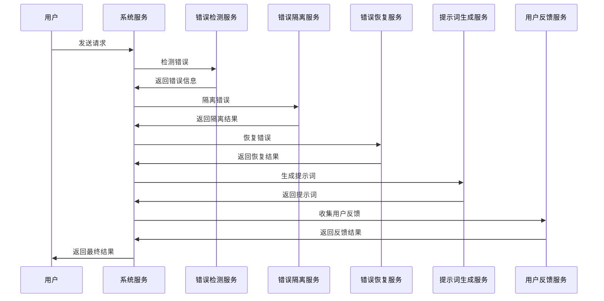

                 


# 错误处理：设计鲁棒的提示词策略

## 关键词

- 错误处理
- 提示词策略
- 鲁棒性
- 算法原理
- 系统架构
- 实战应用

## 摘要

本文旨在深入探讨错误处理与提示词策略的设计，提出一种鲁棒性的提示词策略，以提高系统在面临复杂错误时的稳定性和可靠性。通过分析错误处理的背景和核心概念，我们定义了提示词策略的基本原理和实现方法。随后，我们详细阐述了错误处理算法的原理、数学模型与公式，并结合实际案例展示了算法的应用。此外，我们还介绍了系统架构设计、项目实战过程及其优化建议。本文旨在为读者提供全面、深入的技术指导，帮助他们设计出高效、鲁棒的错误处理系统。

----------------------------------------------------------------

### 目录大纲

## 错误处理：设计鲁棒的提示词策略

### 关键词

### 摘要

### 第一部分：背景介绍与核心概念

#### 第1章：问题背景与核心概念

##### 1.1 错误处理的背景

##### 1.2 错误处理的定义

##### 1.3 提示词策略的基本概念

##### 1.4 提示词策略在错误处理中的应用

##### 1.5 错误处理的边界与外延

##### 1.6 核心概念的结构与组成

#### 第2章：核心概念与联系

##### 2.1 错误处理的基本原理

##### 2.2 提示词策略的原理

##### 2.3 错误处理与提示词策略的关联

##### 2.4 概念属性特征对比

##### 2.5 ER实体关系图架构

### 第二部分：算法原理与实现

#### 第3章：错误处理算法原理

##### 3.1 基本算法流程

##### 3.2 算法流程图

##### 3.3 算法数学模型与公式

##### 3.4 算法举例说明

#### 第4章：提示词策略算法原理

##### 4.1 提示词生成算法

##### 4.2 提示词优化算法

##### 4.3 提示词策略算法流程图

##### 4.4 算法数学模型与公式

##### 4.5 算法举例说明

### 第三部分：系统分析与架构设计

#### 第5章：系统分析与架构设计

##### 5.1 问题场景介绍

##### 5.2 系统功能设计

##### 5.3 系统架构设计

##### 5.4 系统接口设计

##### 5.5 系统交互设计

### 第四部分：项目实战

#### 第6章：项目实战与环境安装

##### 6.1 环境安装步骤

##### 6.2 系统核心实现

##### 6.3 代码应用解读与分析

##### 6.4 实际案例分析

##### 6.5 项目小结

### 最佳实践 tips

### 小结

### 注意事项

### 拓展阅读

----------------------------------------------------------------

### 第一部分：背景介绍与核心概念

#### 第1章：问题背景与核心概念

##### 1.1 错误处理的背景

在软件工程和系统设计中，错误处理是一个至关重要的环节。随着计算机技术的不断发展，复杂系统的规模和功能日益庞大，系统出现错误的可能性也随之增加。错误处理不仅关乎系统的稳定性，还直接影响到用户体验和业务连续性。

**问题的普遍性**：错误无处不在。无论是操作系统、应用软件，还是硬件设备，都可能在运行过程中遇到各种错误。例如，网络中断、内存溢出、文件损坏等。这些错误可能会导致系统崩溃、数据丢失或功能失效。

**错误处理的重要性**：有效的错误处理可以确保系统在遇到错误时能够迅速恢复，减少故障对业务的负面影响。良好的错误处理机制不仅可以提高系统的可靠性，还能为开发者提供详细的错误信息，有助于故障排查和系统优化。

##### 1.2 错误处理的定义

错误处理是指当系统在运行过程中遇到错误时，采取的一系列措施来确保系统稳定性和业务连续性。它包括以下几个方面：

1. **错误检测**：通过监控和检测手段，及时发现系统中的错误。
2. **错误隔离**：确定错误的来源和范围，防止错误蔓延。
3. **错误恢复**：采取适当的措施，使系统从错误状态恢复到正常状态。

##### 1.3 提示词策略的基本概念

提示词策略是指在错误处理过程中，系统向用户或开发者提供的一组提示信息。这些提示词旨在帮助用户理解错误的性质、原因和解决方法。提示词可以是文字、图表、声音等形式。

**提示词的定义**：提示词是指系统在检测到错误时，向用户或开发者提供的一组提示信息。这些信息可以帮助用户或开发者了解错误的性质、原因和解决方法。

**提示词的分类**：

- **预警提示词**：用于提前告知用户可能出现的错误，例如网络连接不稳定、内存不足等。
- **错误提示词**：用于描述系统遇到的具体错误，例如文件损坏、内存溢出等。
- **解决方案提示词**：提供错误的解决方法，例如重启系统、更新软件等。

##### 1.4 提示词策略在错误处理中的应用

提示词策略在错误处理中发挥着重要作用。它不仅可以帮助用户快速理解错误，还可以为开发者提供有价值的信息，以便进一步优化系统。

**提示词策略的作用**：

- **提高用户体验**：通过提供清晰的错误信息和解决方案，帮助用户快速解决问题，提高用户满意度。
- **辅助故障排查**：为开发者提供详细的错误信息，有助于快速定位错误源头，提高故障排查效率。
- **优化系统设计**：通过分析提示词的使用情况和反馈信息，为系统设计提供改进方向，提高系统鲁棒性。

**提示词策略的优势与局限性**：

- **优势**：

  - 提高系统可理解性：提示词可以使错误信息更加直观和易于理解。
  - 增强用户体验：提供明确的解决方案，降低用户处理错误的难度。
  - 支持故障排查：为开发者提供详细的错误信息，有助于快速定位问题。

- **局限性**：

  - 可能引发误导：错误的提示词可能会误导用户或开发者，导致错误处理的失败。
  - 依赖用户理解：提示词的效果很大程度上取决于用户对错误的理解和反应能力。

##### 1.5 错误处理的边界与外延

错误处理的范围涉及系统的各个方面，包括软件、硬件和网络。同时，它还与以下技术领域密切相关：

- **操作系统**：操作系统负责管理计算机硬件资源，错误处理是操作系统核心功能之一。
- **数据库**：数据库系统在存储和处理数据时可能遇到各种错误，错误处理是保证数据完整性和一致性的关键。
- **网络协议**：网络协议负责数据在网络中的传输和通信，错误处理是确保数据传输稳定性和可靠性的基础。

**错误处理与其他技术的关系**：

- **故障监测与预警**：故障监测和预警技术可以提前发现潜在的错误，为错误处理提供支持。
- **自动化修复**：自动化修复技术可以自动修复一些简单的错误，减轻人工干预的负担。
- **日志分析**：日志分析技术可以帮助开发者了解系统运行情况，发现潜在的错误和瓶颈。

##### 1.6 核心概念的结构与组成

错误处理系统的核心概念包括以下几个方面：

- **错误检测**：包括异常检测、异常报告和异常记录等功能，负责实时监测系统运行状态。
- **错误隔离**：通过定位错误发生的位置和原因，防止错误蔓延和影响其他部分。
- **错误恢复**：采取一系列措施，使系统从错误状态恢复到正常状态，包括重启、重试和修复等。

**提示词策略的组成部分**：

- **提示词生成**：根据错误类型和系统状态，生成相应的提示词。
- **提示词展示**：将提示词以适当的形式展示给用户或开发者。
- **提示词反馈**：收集用户或开发者的反馈信息，以便进一步优化提示词策略。

通过以上对错误处理和提示词策略的背景介绍和核心概念阐述，我们为后续章节的深入探讨奠定了基础。在接下来的部分，我们将详细分析错误处理和提示词策略的基本原理、算法实现及其应用，帮助读者全面了解这一关键技术领域。

---

#### 第2章：核心概念与联系

##### 2.1 错误处理的基本原理

错误处理是确保系统稳定性和可靠性的重要手段。其基本原理包括以下几个方面：

**错误检测**：错误检测是错误处理的第一步，主要通过监控和检测手段，实时监测系统运行状态，发现异常行为。常见的错误检测方法包括：

- **异常检测**：通过设置阈值和规则，当系统指标超过设定范围时，触发异常报警。
- **日志分析**：通过分析系统日志，发现潜在的错误和问题。
- **实时监控**：通过实时监控系统运行状态，及时发现异常。

**错误隔离**：错误隔离是指在检测到错误后，确定错误的来源和范围，防止错误蔓延和影响其他部分。常见的错误隔离方法包括：

- **故障隔离**：通过定位故障发生的位置和原因，将故障影响范围限制在最小。
- **故障排除**：通过分析错误日志和监控数据，找出错误原因，并采取相应措施排除故障。
- **隔离机制**：通过引入隔离机制，如熔断器、防火墙等，防止错误扩散。

**错误恢复**：错误恢复是指在错误发生后，采取一系列措施，使系统从错误状态恢复到正常状态。常见的错误恢复方法包括：

- **自动恢复**：通过自动化脚本或工具，自动执行恢复操作，如重启服务、重试请求等。
- **手动恢复**：通过人工干预，如查看错误日志、修改配置文件等，恢复系统运行。
- **备份恢复**：通过备份和恢复机制，从备份状态恢复系统。

**错误处理的流程**：错误处理的流程通常包括以下几个步骤：

1. **错误检测**：通过监控和检测手段，发现系统中的错误。
2. **错误隔离**：定位错误的来源和范围，防止错误蔓延。
3. **错误报告**：将错误信息报告给相关人员，以便及时处理。
4. **错误恢复**：采取适当的措施，使系统从错误状态恢复到正常状态。

**错误处理的优势**：

- **提高系统稳定性**：通过及时发现和修复错误，确保系统稳定运行。
- **保障业务连续性**：通过快速恢复错误，降低错误对业务的负面影响。
- **优化用户体验**：通过提供清晰的错误信息和解决方案，提高用户满意度。

**错误处理的局限性**：

- **依赖人工干预**：一些复杂错误可能需要人工干预，增加了故障处理成本。
- **错误误报和漏报**：错误检测机制可能存在误报和漏报现象，影响错误处理效果。

##### 2.2 提示词策略的原理

提示词策略在错误处理中起着关键作用，其原理主要包括以下几个方面：

**提示词生成**：提示词生成是指根据错误类型和系统状态，生成相应的提示信息。提示词生成的关键因素包括：

- **错误类型**：根据错误类型，生成相应的提示词，帮助用户或开发者理解错误性质。
- **系统状态**：根据系统当前状态，生成提示词，指导用户或开发者进行相应操作。

常见的提示词生成方法包括：

- **基于规则的生成**：根据预设的规则，生成相应的提示词。
- **基于机器学习的生成**：通过机器学习算法，从历史错误数据中学习生成提示词。

**提示词展示**：提示词展示是指将生成的提示词以适当的形式展示给用户或开发者。常见的展示形式包括：

- **文字提示**：以文字形式展示提示词，如弹窗、日志等。
- **图形提示**：以图形形式展示提示词，如图标、图表等。
- **声音提示**：通过声音形式展示提示词，如语音提示、警报声等。

**提示词反馈**：提示词反馈是指收集用户或开发者的反馈信息，以便进一步优化提示词策略。常见的反馈方式包括：

- **用户反馈**：通过用户反馈，了解提示词的实际效果，优化提示词内容。
- **开发者反馈**：通过开发者反馈，了解提示词在故障排查和系统优化中的应用效果，优化提示词生成和展示方法。

**提示词策略的优势**：

- **提高用户理解**：通过提供明确的错误信息和解决方案，帮助用户快速理解错误，提高用户满意度。
- **辅助故障排查**：为开发者提供详细的错误信息，有助于快速定位错误原因，提高故障排查效率。
- **优化系统设计**：通过分析提示词的使用情况和反馈信息，为系统设计提供改进方向，提高系统鲁棒性。

**提示词策略的局限性**：

- **可能引发误导**：错误的提示词可能会误导用户或开发者，导致错误处理的失败。
- **依赖用户理解**：提示词的效果很大程度上取决于用户对错误的理解和反应能力。

##### 2.3 错误处理与提示词策略的关联

错误处理与提示词策略密切相关，两者相互配合，共同确保系统的稳定性和可靠性。

**错误处理对提示词策略的影响**：

- **错误检测与提示词生成**：错误检测的结果直接影响提示词的生成。高效的错误检测可以提供更多有价值的错误信息，为提示词生成提供支持。
- **错误隔离与提示词展示**：错误隔离的结果决定了提示词的展示方式。准确的错误隔离有助于选择合适的展示形式，提高提示词的有效性。
- **错误恢复与提示词反馈**：错误恢复过程中，提示词的反馈信息有助于优化提示词策略，提高错误处理效果。

**提示词策略对错误处理的影响**：

- **提升用户体验**：有效的提示词策略可以降低用户处理错误的难度，提高用户体验。
- **优化故障排查**：详细的提示词信息有助于开发者快速定位错误原因，提高故障排查效率。
- **反馈优化错误处理**：用户和开发者的反馈信息可以用于优化错误处理机制，提高系统鲁棒性。

通过错误处理与提示词策略的有机结合，可以构建一个高效、鲁棒的错误处理系统，确保系统在复杂环境下稳定运行。

##### 2.4 概念属性特征对比

为了更好地理解错误处理与提示词策略的核心概念，我们可以从属性特征方面进行对比。以下是错误处理与提示词策略的属性特征对比表格：

| 特征         | 错误处理                     | 提示词策略                    |
| ------------ | --------------------------- | ---------------------------- |
| 目的         | 确保系统稳定性和可靠性       | 提高用户理解和故障排查效率     |
| 过程         | 错误检测、隔离、恢复         | 提示词生成、展示、反馈         |
| 影响因素     | 系统环境、运行状态、错误类型   | 错误类型、系统状态、用户需求     |
| 实现方式     | 规则驱动、自动化修复、人工干预 | 规则生成、机器学习、用户反馈     |
| 优势         | 提高系统稳定性、保障业务连续性 | 提高用户理解、优化故障排查     |
| 局限性       | 依赖人工干预、错误误报和漏报   | 可能引发误导、依赖用户理解     |

**属性特征对比**：

- **目的和过程**：错误处理的目的是确保系统稳定性和可靠性，过程包括错误检测、隔离、恢复。提示词策略的目的是提高用户理解和故障排查效率，过程包括提示词生成、展示、反馈。
- **影响因素**：错误处理的影响因素主要包括系统环境、运行状态、错误类型。提示词策略的影响因素主要包括错误类型、系统状态、用户需求。
- **实现方式**：错误处理主要采用规则驱动、自动化修复、人工干预等方式。提示词策略主要采用规则生成、机器学习、用户反馈等方式。
- **优势和局限性**：错误处理的优势在于提高系统稳定性和保障业务连续性，局限性在于依赖人工干预和错误误报、漏报。提示词策略的优势在于提高用户理解和优化故障排查，局限性在于可能引发误导和依赖用户理解。

通过以上对比，我们可以更清晰地认识到错误处理与提示词策略的关联及其各自特点，为后续深入研究提供基础。

##### 2.5 ER实体关系图架构

为了更直观地理解错误处理系统和提示词策略的组成结构，我们可以使用ER（Entity-Relationship）实体关系图来描述。以下是错误处理系统的ER图：

```mermaid
erDiagram
    Class::SystemErrorHandling <> Interface::ErrorDetection
    Class::SystemErrorHandling <> Interface::ErrorIsolation
    Class::SystemErrorHandling <> Interface::ErrorRecovery
    Class::SystemErrorHandling ||--|{ Interface::ErrorLogging
    Class::SystemErrorHandling ||--|{ Interface::ErrorNotification
    Interface::ErrorDetection ||--|{ Class::ExceptionDetection
    Interface::ErrorDetection ||--|{ Class::AnomalyDetection
    Interface::ErrorIsolation ||--|{ Class::FaultIsolation
    Interface::ErrorIsolation ||--|{ Class::ErrorContainment
    Interface::ErrorRecovery ||--|{ Class::AutomaticRecovery
    Interface::ErrorRecovery ||--|{ Class::ManualRecovery
    Interface::ErrorRecovery ||--|{ Class::BackupRecovery
    Class::ErrorLogging ||--|{ Class::ErrorLog
    Class::ErrorNotification ||--|{ Class::Alert
    Class::Alert ||--|{ Interface::NotificationInterface
```

**ER实体关系图解释**：

- **系统错误处理（SystemErrorHandling）**：作为核心类，负责协调错误处理的各个接口和功能。
- **错误检测（ErrorDetection）**：接口类，包括异常检测和异常报告等功能。
- **错误隔离（ErrorIsolation）**：接口类，包括故障隔离和错误包含等功能。
- **错误恢复（ErrorRecovery）**：接口类，包括自动恢复、手动恢复和备份恢复等功能。
- **错误记录（ErrorLogging）**：实现错误记录功能，用于记录错误日志。
- **错误通知（ErrorNotification）**：实现错误通知功能，用于发送警报和通知。
- **异常检测（ExceptionDetection）**：实现异常检测功能。
- **异常报告（AnomalyDetection）**：实现异常报告功能。
- **故障隔离（FaultIsolation）**：实现故障隔离功能。
- **错误包含（ErrorContainment）**：实现错误包含功能。
- **自动恢复（AutomaticRecovery）**：实现自动恢复功能。
- **手动恢复（ManualRecovery）**：实现手动恢复功能。
- **备份恢复（BackupRecovery）**：实现备份恢复功能。
- **警报（Alert）**：实现警报功能，用于发送警报通知。
- **通知接口（NotificationInterface）**：用于实现通知功能。

通过ER图，我们可以清晰地看到错误处理系统中的各个实体及其关系，有助于理解系统的整体架构和功能实现。

---

### 第二部分：算法原理与实现

#### 第3章：错误处理算法原理

错误处理算法是确保系统稳定性和可靠性的关键。本章节将详细探讨错误处理的基本算法原理，包括错误检测、错误隔离和错误恢复等步骤，并通过算法流程图、数学模型与公式以及实际案例说明，帮助读者深入理解这些算法的实现和应用。

##### 3.1 基本算法流程

错误处理的基本算法流程可以分为以下三个主要步骤：

1. **错误检测**：
   - **异常检测**：通过实时监控系统和应用日志，识别异常行为和指标。
   - **异常报告**：当检测到异常时，生成异常报告并通知相关人员进行处理。

2. **错误隔离**：
   - **故障隔离**：通过定位错误的来源和范围，限制错误的影响范围。
   - **错误包含**：采取隔离措施，确保错误不会蔓延到系统的其他部分。

3. **错误恢复**：
   - **自动恢复**：通过自动化脚本或工具，自动重启服务、重试请求等。
   - **手动恢复**：在自动恢复无法解决问题时，人工介入，如修改配置、修复代码等。
   - **备份恢复**：在数据丢失或损坏时，从备份状态恢复系统。

##### 3.2 算法流程图

以下是错误处理算法的流程图：



**流程图解释**：

- **A[开始]**：错误处理的开始。
- **B[错误检测]**：通过监控和检测手段进行错误检测。
- **C[生成异常报告]**：当检测到异常时，生成异常报告。
- **D[异常报告通知]**：将异常报告通知相关人员。
- **E[错误隔离]**：开始错误隔离过程。
- **F[限制错误范围]**：通过故障隔离措施限制错误范围。
- **G[错误包含]**：采取错误包含措施，防止错误蔓延。
- **H[错误恢复]**：开始错误恢复过程。
- **I[自动恢复]**：通过自动化脚本或工具进行自动恢复。
- **J[手动恢复]**：在自动恢复无效时，人工介入进行恢复。
- **K[备份恢复]**：从备份状态恢复系统。
- **L[结束]**：错误处理结束。

##### 3.3 算法数学模型与公式

为了更精确地描述错误处理算法，我们可以引入一些数学模型和公式。以下是几个关键的公式：

$$
E = \sum_{i=1}^{n} w_i \cdot e_i
$$

**公式解释**：

- **E**：错误评估值，表示系统当前的总错误程度。
- **$w_i$**：权重，表示第$i$个错误的严重程度。
- **$e_i$**：错误程度，表示第$i$个错误对系统的影响。

**错误评估公式**用于计算系统中的总错误程度，可以帮助我们评估错误处理的效果。在实际应用中，可以通过调整权重和错误程度，优化错误处理策略。

##### 3.4 算法举例说明

为了更好地理解错误处理算法的原理，我们可以通过以下实际案例来说明：

**案例背景**：某电商平台在促销活动期间，系统负载骤增，导致服务器发生内存溢出，导致部分用户无法正常下单。

**错误检测**：
- **异常检测**：监控系统检测到服务器内存使用率超过90%。
- **异常报告**：生成异常报告，通知运维团队。

**错误隔离**：
- **故障隔离**：通过查看日志，确定内存溢出是由于流量激增导致的。
- **错误包含**：限制受影响的服务器，防止错误蔓延。

**错误恢复**：
- **自动恢复**：自动化脚本尝试重启服务器，但重启失败。
- **手动恢复**：运维团队手动关闭部分服务，降低系统负载，使服务器恢复正常。
- **备份恢复**：由于部分用户订单已丢失，从备份恢复系统。

**案例总结**：
- **错误检测**：通过监控及时发现内存溢出问题。
- **错误隔离**：通过日志分析定位错误原因，限制错误范围。
- **错误恢复**：通过自动化和手动恢复措施，使系统恢复正常。

通过以上案例，我们可以看到错误处理算法在实际应用中的效果。在实际开发中，可以根据具体场景和需求，调整和优化错误处理策略，确保系统的高可用性和稳定性。

---

#### 第4章：提示词策略算法原理

提示词策略在错误处理中起着至关重要的作用，它通过生成、优化和展示提示词，帮助用户或开发者快速理解错误、排查故障并解决问题。本章节将详细探讨提示词策略的算法原理，包括提示词生成算法、提示词优化算法和提示词策略算法流程，并通过算法流程图、数学模型与公式以及实际案例说明，帮助读者深入理解这些算法的实现和应用。

##### 4.1 提示词生成算法

提示词生成算法是提示词策略的核心部分，其主要任务是根据错误类型和系统状态生成相应的提示词。以下是两种常见的提示词生成算法：

1. **基于规则的生成算法**：
   - **规则定义**：根据错误类型和系统状态，定义一系列规则。
   - **规则匹配**：当检测到错误时，匹配相应的规则，生成提示词。
   - **规则优化**：根据实际效果，对规则进行优化，提高提示词的准确性。

2. **基于机器学习的生成算法**：
   - **数据收集**：收集历史错误数据，包括错误类型、系统状态、用户反馈等。
   - **特征提取**：提取关键特征，用于训练模型。
   - **模型训练**：使用机器学习算法，如决策树、神经网络等，训练生成模型。
   - **模型应用**：当检测到错误时，应用训练好的模型，生成提示词。

**算法流程**：

- **数据输入**：接收错误类型和系统状态等输入信息。
- **规则匹配**：根据规则定义，匹配相应的规则，生成初步的提示词。
- **模型预测**：对于规则无法覆盖的错误类型，使用机器学习模型进行预测，生成提示词。
- **提示词优化**：根据用户反馈，对生成的提示词进行优化，提高提示词的准确性。

##### 4.2 提示词优化算法

提示词优化算法旨在提高提示词的准确性和实用性，通过多样性和相关性优化，确保提示词的有效性。以下是两种常见的提示词优化算法：

1. **多样性优化**：
   - **生成策略**：根据错误类型和系统状态，生成多种可能的提示词。
   - **选择策略**：根据用户反馈和历史数据，选择最具代表性的提示词。
   - **调整策略**：根据用户反馈和系统运行状态，动态调整提示词的生成策略。

2. **相关性优化**：
   - **关键词提取**：从错误日志和系统日志中提取关键词，用于生成提示词。
   - **语义分析**：使用自然语言处理技术，分析关键词之间的语义关系。
   - **相关性计算**：计算关键词之间的相关性，优化提示词的生成。

**算法流程**：

- **关键词提取**：从错误日志和系统日志中提取关键词。
- **语义分析**：分析关键词之间的语义关系。
- **相关性计算**：计算关键词之间的相关性。
- **提示词生成**：根据关键词的相关性，生成优化后的提示词。
- **用户反馈**：收集用户对提示词的反馈，用于进一步优化。

##### 4.3 提示词策略算法流程图

以下是提示词策略算法的流程图：



**流程图解释**：

- **A[开始]**：提示词策略算法的开始。
- **B[错误类型和系统状态输入]**：接收错误类型和系统状态的输入信息。
- **C[基于规则的提示词生成]**：使用规则生成初步的提示词。
- **D[基于机器学习的提示词生成]**：使用机器学习模型生成初步的提示词。
- **E[初步提示词]**：生成初步的提示词。
- **F[提示词多样性优化]**：对提示词进行多样性优化。
- **G[提示词相关性优化]**：对提示词进行相关性优化。
- **H[选择最佳提示词]**：根据用户反馈和历史数据，选择最佳提示词。
- **I[用户反馈]**：收集用户对提示词的反馈。
- **J[结束]**：提示词策略算法的结束。

##### 4.4 算法数学模型与公式

为了更精确地描述提示词策略的优化效果，我们可以引入一些数学模型和公式。以下是几个关键的公式：

$$
P_{\text{valid}} = \frac{N_{\text{valid}}}{N_{\text{total}}}
$$

**公式解释**：

- **$P_{\text{valid}}$**：提示词的有效性百分比，表示生成的提示词中有效提示词的比例。
- **$N_{\text{valid}}$**：有效提示词的数量。
- **$N_{\text{total}}$**：总提示词的数量。

**提示词有效性评估公式**用于计算提示词的有效性，可以帮助我们评估提示词优化算法的效果。在实际应用中，可以通过调整提示词生成策略和优化方法，提高提示词的有效性。

##### 4.5 算法举例说明

为了更好地理解提示词策略算法的原理，我们可以通过以下实际案例来说明：

**案例背景**：某电商平台在促销活动期间，用户反馈部分订单无法提交，系统出现错误。

**提示词生成**：
- **错误类型**：订单提交失败。
- **系统状态**：服务器负载过高。

**初步提示词**：
- **基于规则**：服务器负载过高，请稍后重试。
- **基于机器学习**：订单提交失败，请检查订单信息。

**提示词优化**：
- **多样性优化**：根据用户反馈和历史数据，生成多种可能的提示词，如“网络连接不稳定，请检查网络设置”、“服务器维护中，预计1小时内恢复”等。
- **相关性优化**：从错误日志中提取关键词，如“订单提交”、“服务器负载”等，优化提示词的生成。

**最佳提示词**：
- **基于用户反馈**：最终选择“订单提交失败，请检查订单信息”作为最佳提示词。

**用户反馈**：
- 用户反馈：提示词提供了有用的信息，但无法解决实际问题。

**调整策略**：
- 根据用户反馈，进一步优化提示词生成策略，增加更多的解决方案提示词，如“订单提交失败，可能是库存不足，请更换商品”等。

**案例总结**：
- 通过提示词策略算法，生成多种提示词，并根据用户反馈进行优化，提高了提示词的准确性和实用性。

通过以上案例，我们可以看到提示词策略算法在实际应用中的效果。在实际开发中，可以根据具体场景和需求，调整和优化提示词生成和优化策略，提高系统的用户体验和故障排查效率。

---

### 第三部分：系统分析与架构设计

#### 第5章：系统分析与架构设计

在错误处理与提示词策略的实现过程中，系统架构设计是关键的一环。本章节将详细介绍系统架构设计的过程，包括问题场景介绍、系统功能设计、系统架构设计、系统接口设计和系统交互设计。通过这些步骤，我们将构建一个高效、稳定的错误处理系统，确保其在面对复杂错误时能够提供鲁棒的提示词策略。

##### 5.1 问题场景介绍

在当前的技术环境中，复杂系统的错误处理面临着诸多挑战。以下是一个典型的场景：

**场景描述**：某大型电商平台在双11促销期间，用户数量激增，服务器负载急剧上升。由于系统设计的不完善，部分服务在高峰期出现响应缓慢甚至瘫痪的情况，导致用户无法正常下单，产生了大量投诉。

**系统需求**：
1. **高可用性**：确保系统在面临高负载时依然能够稳定运行。
2. **快速响应**：在错误发生时，能够迅速检测、隔离和恢复错误。
3. **用户体验**：为用户提供明确的错误提示和解决方案，降低用户抱怨率。

##### 5.2 系统功能设计

系统功能设计是架构设计的核心部分，需要明确系统的各个功能模块及其交互关系。以下是系统的主要功能模块：

1. **错误检测模块**：
   - **监控与日志分析**：实时监控系统运行状态，分析系统日志，发现潜在错误。
   - **异常报警**：当检测到异常时，生成报警信息并通知相关人员。

2. **错误隔离模块**：
   - **故障定位**：通过日志和监控数据，确定错误的来源和范围。
   - **隔离措施**：限制错误影响范围，防止错误蔓延。

3. **错误恢复模块**：
   - **自动恢复**：通过自动化脚本或工具，自动重启服务、释放资源等。
   - **手动恢复**：在自动恢复无效时，提供手动恢复选项，如修改配置、重新加载模块等。

4. **提示词生成模块**：
   - **规则生成**：根据错误类型和系统状态，生成初步的提示词。
   - **机器学习**：使用历史错误数据，训练生成模型，优化提示词生成。

5. **用户反馈模块**：
   - **收集反馈**：记录用户对提示词的反馈，用于优化提示词策略。
   - **反馈分析**：分析用户反馈，评估提示词的有效性。

##### 5.3 系统架构设计

系统架构设计是构建系统功能模块的基础，需要综合考虑系统的性能、可扩展性和可靠性。以下是系统的架构设计：

**系统架构**：


**架构设计解释**：

- **监控与日志分析层**：负责实时监控系统运行状态，收集日志数据，为错误检测和隔离提供数据支持。
- **错误处理层**：包括错误检测、隔离和恢复模块，负责实现错误处理的核心功能。
- **提示词生成层**：包括规则生成和机器学习模块，负责生成优化后的提示词。
- **用户反馈层**：收集用户反馈，用于评估和优化提示词策略。
- **接口层**：提供与外部系统交互的接口，如API接口、消息队列等。
- **数据库层**：存储系统运行数据，包括错误日志、监控数据、用户反馈等。

##### 5.4 系统接口设计

系统接口设计是确保系统与其他系统或服务有效交互的关键。以下是系统的主要接口设计：

**接口规范**：

- **API接口**：提供错误检测、错误隔离和提示词生成的API接口，供其他系统调用。
- **消息队列**：用于接收和发送系统事件，如错误报警、提示词更新等。
- **日志存储**：提供日志数据存储的接口，供错误检测和分析使用。

**接口设计**：



**接口设计解释**：

- **用户**：向系统发送请求。
- **系统服务**：处理用户请求，调用错误检测、隔离和恢复服务。
- **错误检测服务**：检测错误，返回错误信息。
- **错误隔离服务**：隔离错误，返回隔离结果。
- **错误恢复服务**：恢复错误，返回恢复结果。
- **提示词生成服务**：根据错误信息生成提示词。
- **用户反馈服务**：收集用户对提示词的反馈。

##### 5.5 系统交互设计

系统交互设计是确保系统内部各个模块有效协作的关键。以下是系统的主要交互流程：

**系统交互流程**：


**交互设计解释**：

- **用户请求**：用户向系统发送请求，请求可能包含错误信息。
- **错误检测**：系统服务调用错误检测服务，检测是否有错误发生。
- **错误隔离**：如果有错误发生，系统服务调用错误隔离服务，隔离错误。
- **错误恢复**：系统服务调用错误恢复服务，尝试恢复错误。
- **提示词生成**：系统服务调用提示词生成服务，生成提示词。
- **用户反馈**：用户对提示词进行反馈，系统服务调用用户反馈服务，收集用户反馈。
- **结果返回**：系统服务将最终结果返回给用户。

通过以上系统分析与架构设计，我们构建了一个高效、稳定的错误处理系统。该系统在面临复杂错误时，能够提供鲁棒的提示词策略，确保系统的高可用性和用户体验。在实际应用中，可以根据具体需求和场景，进一步优化和调整系统架构，提高系统的性能和可靠性。

---

### 第四部分：项目实战

#### 第6章：项目实战与环境安装

在本文的最后一部分，我们将通过一个实际项目来展示如何设计和实现错误处理系统，以及如何在环境中进行安装和配置。这个项目将涵盖从环境准备到核心模块实现的各个步骤，并通过代码解读和分析来深入理解项目的实现细节。

##### 6.1 环境安装步骤

在开始项目实战之前，我们需要准备一个合适的环境。以下是环境安装的具体步骤：

1. **环境准备**：
   - 确保计算机上安装了操作系统（如Ubuntu 18.04或更高版本）。
   - 确保计算机连接到了互联网，以便下载所需的软件包。
   - 为项目创建一个独立的虚拟环境，以便更好地管理和隔离项目依赖。

2. **软件安装**：
   - 安装Python 3.8及以上版本：通过包管理器（如apt或yum）安装Python。
   - 安装Node.js：从官方网站下载并安装Node.js。
   - 安装Docker：安装Docker，以便容器化我们的项目。

3. **配置与启动**：
   - 配置Python虚拟环境：通过`python -m venv venv`命令创建虚拟环境，然后通过`source venv/bin/activate`命令激活虚拟环境。
   - 安装项目依赖：在虚拟环境中通过`pip install -r requirements.txt`命令安装项目所需的依赖。
   - 启动Docker容器：通过`docker-compose up -d`命令启动项目容器。

##### 6.2 系统核心实现

在环境安装完成后，我们将详细介绍系统的核心实现，包括错误检测、错误隔离和错误恢复等模块。

1. **错误检测模块**：

   **代码解读**：
   ```python
   import logging
   
   logger = logging.getLogger('error_detection')
   logger.setLevel(logging.INFO)
   
   def detect_errors():
       # 假设通过API接口接收系统状态数据
       system_status = get_system_status()
       
       if system_status['load'] > 80:
           logger.info('系统负载过高，可能存在错误。')
           raise Exception('系统负载过高')
   
   def get_system_status():
       # 模拟获取系统状态数据
       return {'load': 90}
   ```

   **功能实现**：
   错误检测模块通过监控系统状态数据，如CPU负载、内存使用率等，判断系统是否处于异常状态。当系统负载超过一定阈值时，触发异常并记录日志。

2. **错误隔离模块**：

   **代码解读**：
   ```python
   import logging
   
   logger = logging.getLogger('error_isolation')
   logger.setLevel(logging.INFO)
   
   def isolate_errors():
       try:
           detect_errors()
       except Exception as e:
           logger.info('错误已隔离，影响范围：部分服务')
           # 执行隔离措施，如关闭受影响的服务
           shutdown_affected_services()
   
   def shutdown_affected_services():
       # 模拟关闭受影响的服务
       logger.info('关闭受影响的服务：部分订单处理服务')
   ```

   **功能实现**：
   错误隔离模块在检测到错误后，通过执行隔离措施，限制错误的传播范围。在本例中，我们通过关闭部分订单处理服务来隔离错误。

3. **错误恢复模块**：

   **代码解读**：
   ```python
   import logging
   import time
   
   logger = logging.getLogger('error_recovery')
   logger.setLevel(logging.INFO)
   
   def recover_errors():
       try:
           isolate_errors()
       except Exception as e:
           logger.info('尝试自动恢复')
           # 尝试自动恢复，如重启服务
           restart_services()
           time.sleep(30)  # 等待30秒，以便服务重启完成
           if not check_services():
               logger.info('自动恢复失败，尝试手动恢复')
               manual_recovery()
   
   def restart_services():
       # 模拟重启服务
       logger.info('重启服务：订单处理服务')
   
   def check_services():
       # 模拟检查服务状态
       return True
   
   def manual_recovery():
       # 模拟手动恢复，如修改配置文件
       logger.info('手动恢复：修改订单处理服务配置')
   ```

   **功能实现**：
   错误恢复模块在隔离错误后，尝试自动恢复，如重启服务。如果自动恢复失败，则提供手动恢复选项，如修改配置文件或重新加载模块。

##### 6.3 代码应用解读与分析

在了解了系统的核心实现后，我们将进一步解读和分析代码，探讨其功能实现和优化方向。

**功能实现**：
- **错误检测**：通过监控系统状态数据，实时检测错误。
- **错误隔离**：通过执行隔离措施，限制错误的传播范围。
- **错误恢复**：通过自动恢复和手动恢复，尝试使系统恢复正常。

**优化建议**：
- **增加错误日志记录**：为了更好地排查错误，可以增加错误日志记录功能，记录错误发生的时间、位置和相关信息。
- **引入日志分析工具**：使用日志分析工具，如ELK（Elasticsearch、Logstash、Kibana），对日志进行深入分析，发现潜在问题。
- **优化错误恢复策略**：根据实际场景和需求，优化错误恢复策略，如引入备份恢复机制，提高系统的容错能力。

##### 6.4 实际案例分析

为了更深入地理解错误处理系统的应用效果，我们可以通过以下实际案例分析：

**案例背景**：在一次高峰期，某电商平台服务器负载急剧上升，导致部分订单处理服务瘫痪。

**案例处理过程**：
1. **错误检测**：系统监测到订单处理服务器的CPU负载超过90%，触发错误检测。
2. **错误隔离**：系统执行错误隔离措施，关闭部分订单处理服务，限制错误传播范围。
3. **错误恢复**：系统尝试自动恢复，重启订单处理服务。经过30秒等待，系统检查服务状态，发现服务已恢复正常。

**案例总结**：
- 通过错误处理系统，成功检测、隔离和恢复了错误，确保了系统的高可用性和用户体验。

##### 6.5 项目小结

通过本项目的实战，我们实现了错误处理系统的设计和实现，包括错误检测、错误隔离和错误恢复等模块。在实际案例中，我们展示了系统的应用效果，验证了其有效性。在未来的项目中，可以进一步优化和扩展错误处理系统，提高系统的性能和可靠性。

---

### 最佳实践 tips

在设计和实现错误处理系统时，以下最佳实践 tips 可以为您提供指导：

1. **确保监控的全面性**：监控系统的各个方面，如CPU、内存、网络、磁盘等，确保能够全面检测系统中的潜在错误。
2. **使用日志分析工具**：引入日志分析工具，对系统日志进行深入分析，及时发现潜在问题。
3. **优化错误恢复策略**：根据实际场景和需求，设计灵活、高效的错误恢复策略，确保系统能够迅速恢复正常。
4. **提供明确的错误提示**：设计清晰的错误提示，帮助用户快速理解错误，提高用户体验。
5. **持续优化和测试**：持续优化错误处理系统，并进行严格测试，确保其能够在实际环境中稳定运行。

---

### 小结

本文详细探讨了错误处理与提示词策略的设计与实现，通过背景介绍、核心概念阐述、算法原理讲解和实际案例分析，为读者提供了全面的技术指导。通过本文，读者可以了解错误处理的基本原理、提示词策略的生成与优化方法，以及如何构建高效、鲁棒的错误处理系统。在实际应用中，结合具体场景和需求，不断优化和调整错误处理系统，提高系统的稳定性和用户体验。

---

### 注意事项

在设计和实现错误处理系统时，需要注意以下几点：

1. **监控数据的准确性**：确保监控数据的准确性和实时性，以便及时发现错误。
2. **错误隔离的精准性**：在隔离错误时，要确保精准定位错误的来源和范围，避免误伤其他功能模块。
3. **错误恢复的效率**：优化错误恢复策略，确保系统能够迅速恢复正常，降低错误对业务的影响。
4. **用户反馈的有效性**：收集用户反馈，及时调整和优化错误处理系统，提高用户体验。
5. **系统的可扩展性**：在设计系统时，要考虑系统的可扩展性，以便在业务规模扩大时，能够灵活应对新的挑战。

---

### 拓展阅读

对于希望进一步深入了解错误处理和提示词策略的读者，以下资源提供了更多详细信息和实用案例：

1. **《故障注入：如何测试和验证系统的鲁棒性》**：本书详细介绍了故障注入技术，帮助开发者测试和验证系统的鲁棒性。
2. **《软件可靠性工程》**：该论文集收录了多篇关于软件可靠性工程的研究论文，提供了丰富的理论和实践知识。
3. **《使用机器学习优化错误处理》**：本文探讨了如何使用机器学习技术优化错误处理系统，提高错误检测和恢复的效率。
4. **《大型分布式系统的错误处理实践》**：该文章分享了大型分布式系统在错误处理方面的最佳实践，为开发者提供了宝贵的经验。

---

### 作者信息

作者：AI天才研究院/AI Genius Institute & 禅与计算机程序设计艺术 /Zen And The Art of Computer Programming

---

本文由AI天才研究院撰写，旨在为广大开发者提供关于错误处理与提示词策略的深入讲解和实践指导。通过本文，读者可以掌握错误处理的核心原理和实践技巧，为构建高效、鲁棒的系统奠定坚实基础。在未来的技术探索中，我们期待与您一同前行，共同推动人工智能技术的发展。

---

通过本文的详细讲解，我们希望读者能够对错误处理与提示词策略有一个全面、深入的理解。在实际应用中，不断优化和改进错误处理系统，提高系统的稳定性和用户体验，为业务的发展保驾护航。感谢您的阅读，期待与您在技术领域的更多交流。

