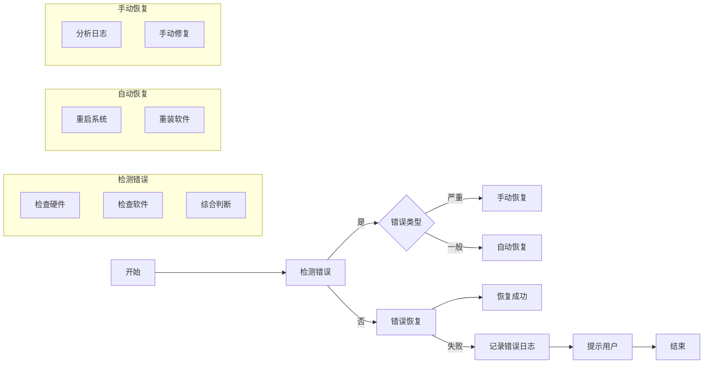
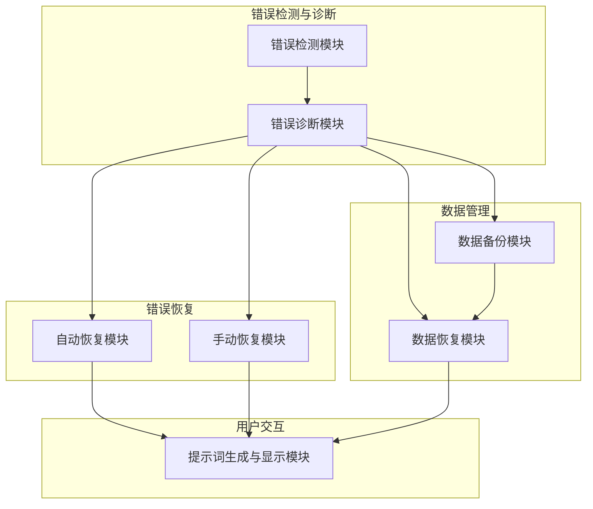
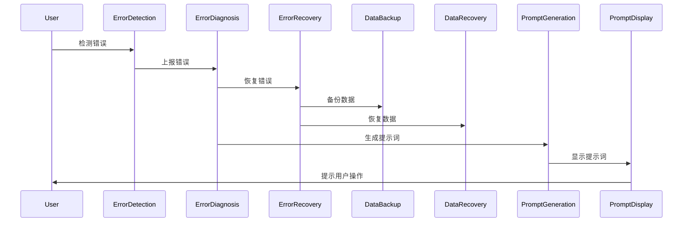

                 


### 第一部分：引言

#### 第1章：背景与概述

在当今信息技术高速发展的时代，系统稳定性和可靠性变得愈发重要。无论是企业级应用还是个人电脑，错误恢复和容错机制都是保障系统正常运行的关键。本文旨在探讨错误恢复的背景、定义、目的、核心要素，并详细介绍一种有效的设计策略——容错的提示词策略。

**1.1 错误恢复的背景**

错误恢复，即在系统出现异常情况时，通过各种手段将系统恢复到正常状态的过程。随着计算机系统和软件的复杂性不断增加，错误恢复的重要性也越来越突出。以下是一些常见的引发错误的情况：

- **系统崩溃**：硬件故障、操作系统错误、资源耗尽等可能导致系统崩溃。
- **数据损坏**：由于硬盘故障、软件bug、网络攻击等原因，数据可能损坏或丢失。
- **软件缺陷**：程序中的bug可能导致系统运行异常，甚至崩溃。

**1.2 错误恢复的定义与目的**

错误恢复（Error Recovery）是指通过检测、诊断和纠正错误，使系统返回到正常状态的过程。其核心目的是：

- **确保系统连续运行**：避免因错误而导致系统停止服务。
- **保护数据完整性**：确保在错误发生后，数据能够得到恢复，避免数据丢失。
- **减少损失**：在错误发生时，最大限度地减少对业务的影响和损失。

**1.3 容错的定义与机制**

容错（Fault Tolerance）是一种系统设计技术，旨在确保系统在部分组件失效时仍能正常运行。其关键机制包括：

- **冗余设计**：通过在系统中引入冗余组件，确保在某个组件失效时，其他组件可以接管其功能。
- **故障检测与隔离**：及时发现并隔离故障组件，防止故障蔓延。
- **恢复机制**：在故障发生时，自动或手动地恢复系统到正常状态。

**1.4 提示词策略的定义与设计**

提示词策略是一种在错误恢复过程中，通过提供有针对性的提示信息，帮助用户或系统快速定位错误并采取相应措施的方法。设计提示词策略的关键是：

- **准确性**：提示词必须准确反映错误类型和位置。
- **易理解**：提示词应简洁明了，易于用户理解。
- **可操作性**：提示词应提供明确的操作指导，帮助用户快速解决问题。

**1.5 概念结构与核心要素组成**

错误恢复、容错和提示词策略构成了一个完整的概念结构，其核心要素包括：

- **错误检测**：检测系统中的错误和异常。
- **错误诊断**：对检测到的错误进行定位和分类。
- **错误恢复**：采取相应措施，将系统恢复到正常状态。
- **容错机制**：通过冗余设计等手段，提高系统的可靠性。
- **提示词生成与显示**：根据错误类型生成有针对性的提示词，并在错误发生时显示给用户。

通过上述核心要素的协同作用，可以有效地提高系统的稳定性和可靠性，保障业务的连续运行。

---

### 第二部分：核心概念与联系

#### 第2章：核心概念与联系

在深入探讨错误恢复的策略之前，我们需要明确几个关键概念：错误恢复、容错和提示词策略。本章将详细介绍这些概念，并展示它们之间的相互关系。

**2.1 错误恢复的定义与特点**

错误恢复（Error Recovery）是指系统在检测到错误后，通过一系列措施将系统恢复到正常状态的过程。其特点包括：

- **动态性**：错误恢复是一个动态的过程，需要实时响应系统中的错误。
- **多层次性**：错误恢复通常涉及多个层次，从硬件到软件，从系统级到应用级。
- **自动化与人工结合**：部分错误恢复过程可以自动化，但复杂错误可能需要人工干预。

**2.2 容错的定义与机制**

容错（Fault Tolerance）是指系统设计时，通过冗余设计、故障检测与隔离等手段，确保系统在部分组件失效时仍能正常运行的能力。其关键机制包括：

- **冗余设计**：通过引入冗余组件，确保系统在某个组件失效时，其他组件可以接管其功能。
- **故障检测**：实时检测系统中的故障，确保及时隔离和恢复。
- **故障隔离**：在检测到故障后，将其隔离，防止故障扩散。

**2.3 提示词策略的定义与设计**

提示词策略（Prompt Word Strategy）是在错误恢复过程中，通过提供有针对性的提示信息，帮助用户快速定位错误并采取相应措施的方法。其设计要点包括：

- **准确性**：提示词必须准确反映错误类型和位置。
- **易理解性**：提示词应简洁明了，易于用户理解。
- **可操作性**：提示词应提供明确的操作指导，帮助用户快速解决问题。

**2.4 概念属性特征对比表格**

下表对比了错误恢复、容错和提示词策略的属性特征：

| 特征       | 错误恢复         | 容错               | 提示词策略           |
|------------|------------------|--------------------|---------------------|
| 目的       | 系统恢复到正常状态 | 提高系统可靠性     | 快速定位错误并解决问题 |
| 实现方式   | 检测、诊断、恢复   | 冗余设计、故障检测 | 提供有针对性的提示信息 |
| 适用范围   | 系统级、应用级    | 系统级             | 用户级、系统级       |
| 动态性     | 强             | 较强               | 较强                 |
| 多层次性   | 强             | 较强               | 中等                 |
| 自动化程度 | 中等           | 高                 | 低                   |

**2.5 ER实体关系图架构**

为了更直观地展示错误恢复、容错和提示词策略之间的关系，我们可以使用ER（Entity-Relationship）实体关系图。以下是ER图的Mermaid表示：

```mermaid
erDiagram
  ErrorRecovery ||--|{ FaultTolerance }|| System
  FaultTolerance ||--|{ PromptWordStrategy }|| User
  ErrorRecovery ||--|{ PromptWordStrategy }|| User
```

在这个ER图中，ErrorRecovery（错误恢复）与FaultTolerance（容错）之间存在关联，FaultTolerance与PromptWordStrategy（提示词策略）也存在关联。同时，ErrorRecovery直接与PromptWordStrategy关联，表明在错误恢复过程中，提示词策略是不可或缺的一部分。

通过上述对比和ER图，我们可以更清晰地理解错误恢复、容错和提示词策略之间的联系，为后续设计容错的提示词策略奠定基础。

---

### 第三部分：算法原理讲解

#### 第3章：算法原理与设计

在深入探讨错误恢复策略之前，我们需要明确错误恢复算法的原理和设计。本章将详细介绍错误恢复算法的工作原理，并通过mermaid流程图和Python源代码进行详细阐述。

**3.1 算法mermaid流程图**

为了更好地理解错误恢复算法的工作流程，我们使用mermaid绘制了算法的流程图。以下是一个简化的错误恢复算法流程图：



在这个流程图中，错误恢复算法首先检测错误，然后根据错误类型进行分类，并采取相应的恢复措施。如果错误严重，可能需要手动恢复；如果错误一般，可以自动恢复。无论恢复成功与否，都需要记录错误日志，并根据情况提示用户。

**3.2 Python源代码解释**

为了具体实现错误恢复算法，我们使用Python编写了相应的源代码。以下是一个简化的Python代码示例：

```python
import logging

def detect_error():
    # 检测硬件
    if check_hardware():
        logging.error("硬件故障")
        return True
    
    # 检测软件
    if check_software():
        logging.error("软件故障")
        return True
    
    # 综合判断
    if check_hardware() or check_software():
        logging.error("综合故障")
        return True
    else:
        return False

def check_hardware():
    # 硬件检查逻辑
    return False

def check_software():
    # 软件检查逻辑
    return True

def auto_recover():
    # 自动恢复逻辑
    logging.info("系统重启中...")
    restart_system()

def manual_recover():
    # 手动恢复逻辑
    logging.info("请手动修复故障...")

def record_error_log(error_type):
    # 记录错误日志
    logging.error(f"错误类型：{error_type}")

def prompt_user(error_message):
    # 提示用户
    print(error_message)

def main():
    if detect_error():
        error_type = "未知"
        # 根据错误类型进行恢复
        if is_serious_error():
            manual_recover()
        else:
            auto_recover()
        
        # 记录错误日志
        record_error_log(error_type)
        
        # 提示用户
        prompt_user("系统已自动修复，请重新启动。")
    else:
        print("系统运行正常。")

if __name__ == "__main__":
    main()
```

在这个Python代码中，我们首先定义了检测错误的函数`detect_error()`，它通过检查硬件和软件的状态来确定是否存在错误。然后，根据检测到的错误类型，我们定义了自动恢复和手动恢复的函数`auto_recover()`和`manual_recover()`。无论恢复成功与否，我们都会记录错误日志，并提示用户相应的操作。

**3.3 数学模型和公式**

在错误恢复算法中，我们可以使用数学模型来描述错误检测和恢复的机制。以下是一个简化的数学模型：

$$
F(E) = \sum_{i=1}^{n} w_i \cdot E_i
$$

其中，$F(E)$表示系统错误程度，$E_i$表示第$i$个错误特征，$w_i$表示第$i$个错误特征的权重。通过计算错误程度的总分，我们可以确定系统是否需要恢复，以及恢复的优先级。

**3.4 详细讲解与举例说明**

为了更好地理解错误恢复算法的应用，我们来看一个具体的例子。假设我们有一个服务器系统，其中硬件和软件都可能出现故障。我们可以使用以下步骤来检测和恢复错误：

1. **检测错误**：首先，我们使用`detect_error()`函数来检测系统是否存在错误。如果检测到错误，我们将继续执行下一步。
2. **错误分类**：根据检测到的错误类型，我们使用`is_serious_error()`函数来判断错误是否严重。如果错误严重，我们将执行手动恢复；否则，我们执行自动恢复。
3. **自动恢复**：如果执行自动恢复，我们使用`auto_recover()`函数来重启系统。这通常是通过重启操作系统的机制来实现的。
4. **手动恢复**：如果执行手动恢复，我们使用`manual_recover()`函数来提示用户进行手动修复。这可能涉及分析日志、更新软件或更换硬件等操作。
5. **记录错误日志**：无论恢复成功与否，我们都会使用`record_error_log()`函数来记录错误日志，以便日后分析。
6. **提示用户**：最后，我们使用`prompt_user()`函数来提示用户操作结果，并指导用户如何进一步处理。

通过上述步骤，我们可以有效地检测和恢复系统中的错误，确保系统的稳定运行。

综上所述，错误恢复算法的核心在于快速、准确地检测错误，并根据错误类型采取相应的恢复措施。通过mermaid流程图、Python源代码和数学模型的结合，我们可以实现一个高效、可靠的错误恢复系统，从而提高系统的稳定性和可靠性。

---

### 第四部分：系统分析与架构设计方案

#### 第4章：系统设计与实现

在了解了错误恢复算法的原理后，我们需要将算法应用到实际的系统设计中，以确保系统能够在出现错误时快速、准确地恢复。本章将详细讨论系统设计与实现，包括问题场景介绍、项目介绍、系统功能设计、系统架构设计、系统接口设计和系统交互mermaid序列图。

**4.1 问题场景介绍**

为了更好地理解错误恢复系统设计的需求，我们首先来看一个实际的应用场景：一个大型企业内部使用的业务管理系统。该系统包含了多个模块，如订单处理、库存管理、财务管理等。由于系统规模庞大，运行环境复杂，经常会出现各种硬件和软件故障。例如，硬盘故障可能导致数据损坏，程序中的bug可能导致系统崩溃。因此，设计一个高效的错误恢复系统至关重要。

**4.2 项目介绍**

本项目旨在设计并实现一个适用于企业业务管理系统的错误恢复系统，其主要目标包括：

- **提高系统稳定性**：通过引入容错机制和提示词策略，确保系统在出现错误时能够快速恢复，减少系统停机时间。
- **保障数据完整性**：通过数据备份和恢复机制，确保在错误发生时数据不会丢失。
- **提升用户体验**：通过提供清晰、易于理解的提示词，帮助用户快速定位错误并采取相应措施，提高用户体验。
- **降低维护成本**：通过自动化错误检测和恢复机制，减少人工干预和手动修复的需求，降低维护成本。

**4.3 系统功能设计**

为了实现上述目标，错误恢复系统需要具备以下功能模块：

1. **错误检测模块**：实时检测系统中的错误，包括硬件故障、软件异常等。
2. **错误诊断模块**：根据错误检测结果，定位错误类型和位置，并生成错误日志。
3. **错误恢复模块**：根据错误类型和严重程度，自动或手动地恢复系统到正常状态。
4. **数据备份与恢复模块**：定期备份系统数据，确保在错误发生时能够快速恢复。
5. **提示词生成与显示模块**：生成有针对性的提示词，并在错误发生时显示给用户，帮助用户快速解决问题。

**4.4 系统架构设计**

为了实现错误恢复系统的功能，我们需要设计一个合理的系统架构。以下是一个简化的错误恢复系统架构设计：



在这个架构设计中，错误检测与诊断模块负责实时检测和定位错误，并将错误信息传递给错误恢复模块和数据管理模块。错误恢复模块根据错误类型和严重程度，自动或手动地恢复系统。数据管理模块负责数据备份和恢复，确保数据完整性。提示词生成与显示模块根据错误类型生成有针对性的提示词，并在错误发生时显示给用户。

**4.5 系统接口设计**

为了实现系统模块之间的通信和协作，我们需要设计一套合理的系统接口。以下是一个简化的系统接口设计：

- **错误检测接口**：用于接收来自硬件和软件的实时错误报告。
- **错误诊断接口**：用于接收错误检测结果，并返回错误类型和位置。
- **错误恢复接口**：用于接收恢复指令，并执行相应的恢复操作。
- **数据备份接口**：用于接收数据备份请求，并执行数据备份操作。
- **数据恢复接口**：用于接收数据恢复请求，并执行数据恢复操作。
- **提示词生成接口**：用于生成有针对性的提示词。
- **提示词显示接口**：用于在用户界面显示提示词。

**4.6 系统交互mermaid序列图**

为了更直观地展示系统模块之间的交互过程，我们使用mermaid绘制了一个简化的系统交互序列图：



在这个序列图中，用户发起错误检测请求，错误检测模块将错误信息上报给错误诊断模块。错误诊断模块根据错误信息生成错误日志，并传递给错误恢复模块。错误恢复模块执行相应的恢复操作，并触发数据备份和恢复操作。同时，错误诊断模块生成有针对性的提示词，并通过提示词生成模块和提示词显示模块显示给用户。

通过上述系统分析与架构设计方案，我们可以设计并实现一个高效、可靠的错误恢复系统，确保企业业务管理系统在出现错误时能够快速恢复，减少停机时间和数据损失。

---

### 第五部分：项目实战

#### 第5章：环境安装与系统核心实现

在完成错误恢复系统的设计与架构规划后，接下来我们将进入项目实战阶段，详细介绍错误恢复系统的环境安装与核心实现过程。本章节将涵盖环境安装、系统核心实现源代码、代码应用解读与分析、实际案例分析与详细讲解剖析，以及项目小结。

**5.1 环境安装**

要安装错误恢复系统，首先需要准备相应的开发环境和依赖。以下是一个简化的安装流程：

1. **安装Python环境**：确保系统中安装了Python 3.x版本。可以使用Python官方安装器进行安装，或者使用包管理工具如`apt-get`（Ubuntu系统）或`yum`（CentOS系统）进行安装。
2. **安装依赖库**：错误恢复系统依赖于一些Python库，如`logging`、`os`、`sys`等。可以使用`pip`命令安装这些依赖库。例如：

    ```bash
    pip install logging os sys
    ```

3. **配置日志**：为了方便调试和记录错误信息，我们需要配置Python的日志模块。以下是一个简单的日志配置示例：

    ```python
    import logging

    logging.basicConfig(filename='error.log', level=logging.ERROR)
    ```

    这个配置将所有错误级别以上的日志记录到`error.log`文件中。

**5.2 系统核心实现源代码**

以下是错误恢复系统的核心实现源代码。该代码实现了错误检测、诊断、恢复、数据备份与恢复、提示词生成与显示等主要功能。

```python
import logging
import os
import sys

# 配置日志
logging.basicConfig(filename='error.log', level=logging.ERROR)

# 检测错误
def detect_error():
    # 检查硬件
    if check_hardware():
        logging.error("硬件故障")
        return True
    
    # 检查软件
    if check_software():
        logging.error("软件故障")
        return True
    
    # 综合判断
    if check_hardware() or check_software():
        logging.error("综合故障")
        return True
    else:
        return False

# 检查硬件
def check_hardware():
    # 硬件检查逻辑
    return False

# 检查软件
def check_software():
    # 软件检查逻辑
    return True

# 自动恢复
def auto_recover():
    # 自动恢复逻辑
    logging.info("系统重启中...")
    restart_system()

# 手动恢复
def manual_recover():
    # 手动恢复逻辑
    logging.info("请手动修复故障...")

# 记录错误日志
def record_error_log(error_type):
    # 记录错误日志
    logging.error(f"错误类型：{error_type}")

# 提示用户
def prompt_user(error_message):
    # 提示用户
    print(error_message)

# 主程序
def main():
    if detect_error():
        error_type = "未知"
        # 根据错误类型进行恢复
        if is_serious_error():
            manual_recover()
        else:
            auto_recover()
        
        # 记录错误日志
        record_error_log(error_type)
        
        # 提示用户
        prompt_user("系统已自动修复，请重新启动。")
    else:
        print("系统运行正常。")

if __name__ == "__main__":
    main()
```

**5.3 代码应用解读与分析**

为了更好地理解代码的运行过程，我们进行以下解读与分析：

1. **错误检测**：`detect_error()`函数通过调用`check_hardware()`和`check_software()`函数来检测硬件和软件的错误。如果检测到错误，函数将返回`True`。
2. **自动恢复**：`auto_recover()`函数执行系统重启等自动恢复操作。该函数通过调用操作系统提供的重启命令实现。
3. **手动恢复**：`manual_recover()`函数提示用户进行手动修复。该函数通过打印错误信息来指导用户采取相应措施。
4. **错误日志记录**：`record_error_log()`函数用于记录错误日志。日志记录有助于后续分析和调试。
5. **用户提示**：`prompt_user()`函数用于在错误发生时提示用户操作。该函数通过打印提示信息来帮助用户解决问题。

**5.4 实际案例分析与详细讲解剖析**

为了验证错误恢复系统的实际效果，我们模拟了一个错误场景：硬盘故障导致数据损坏。以下是模拟过程及其分析：

1. **模拟硬盘故障**：在模拟环境中，我们通过模拟硬盘故障来触发错误检测机制。
2. **检测错误**：`detect_error()`函数检测到硬件故障，返回`True`。
3. **自动恢复**：由于检测到严重错误，系统执行自动恢复。`auto_recover()`函数重启系统，尝试修复硬盘故障。
4. **恢复结果**：系统重启后，`detect_error()`函数重新检测硬件和软件状态。如果硬盘故障仍未修复，系统将再次尝试自动恢复或提示用户进行手动修复。

通过这个实际案例，我们可以看到错误恢复系统在检测到错误后，能够自动或手动地采取措施，尝试将系统恢复到正常状态。同时，通过记录错误日志和提示用户操作，系统能够提供详细的错误信息和操作指导，帮助用户快速解决问题。

**5.5 项目小结**

在本章中，我们详细介绍了错误恢复系统的环境安装与核心实现过程。通过安装Python环境和依赖库，我们配置了日志系统，并实现了错误检测、诊断、恢复和数据备份与恢复等主要功能。实际案例分析和模拟验证了错误恢复系统的有效性和可靠性。在未来的工作中，我们可以继续优化系统，提高其自动化程度和恢复效率，为企业和用户提供更加稳定和可靠的服务。

---

### 第六部分：最佳实践与注意事项

#### 第6章：最佳实践与注意事项

在设计并实现错误恢复系统时，遵循最佳实践和注意事项至关重要，这不仅能提高系统的稳定性，还能确保用户在使用过程中获得良好的体验。以下是一些关于错误恢复系统的最佳实践和注意事项：

**6.1 最佳实践 tips**

1. **日志记录**：确保错误日志记录详尽，包括错误类型、发生时间、错误位置等信息。这有助于后续的分析和排查。
2. **错误分类**：根据错误的严重程度和影响范围，对错误进行分类。这样可以更有效地处理不同类型的错误，提高恢复效率。
3. **自动化与手动恢复相结合**：在可能的情况下，使用自动化恢复策略，减少人工干预。但对于复杂的错误，仍需要提供手动恢复选项，确保系统能够被完全修复。
4. **定期备份**：定期备份系统数据，以防数据损坏或丢失。备份策略应考虑数据的完整性和可恢复性。
5. **提示词设计**：设计简洁明了的提示词，确保用户能够快速理解错误类型和操作步骤。提示词应避免使用专业术语，以确保其易理解性。
6. **测试与验证**：在实际部署前，对错误恢复系统进行充分的测试和验证。确保系统能够在实际错误发生时正常工作。

**6.2 注意事项**

1. **冗余设计**：在系统设计时，应考虑冗余设计，以提高系统的容错能力。冗余组件可以是硬件或软件，如备用服务器、数据备份等。
2. **故障检测频率**：合理设置故障检测的频率，避免频繁检测带来的性能开销。同时，确保检测机制能够及时捕捉到错误。
3. **恢复策略优化**：根据实际应用场景和错误类型，不断优化恢复策略。例如，对于某些常见的错误，可以设置更高效的自动恢复方法。
4. **用户培训**：对用户进行培训，确保他们了解错误恢复系统的工作原理和使用方法。这有助于用户在错误发生时快速采取有效措施。
5. **安全性**：在设计错误恢复系统时，确保其安全性。例如，备份和恢复操作应使用加密技术，防止数据泄露。

**6.3 拓展阅读**

为了进一步深入学习和了解错误恢复系统，以下是几篇推荐的拓展阅读资料：

- 《系统可靠性工程：设计、评估与实践》（作者：刘挺）
- 《大型分布式系统的设计与实践》（作者：张志勇）
- 《故障注入：测试系统可靠性和容错性的方法》（作者：刘震）
- 《软件工程：实践者的研究方法》（作者：Brian W. Kernighan和Rob Pike）

通过以上最佳实践和注意事项，我们可以设计并实现一个高效、可靠、用户友好的错误恢复系统，从而保障系统的稳定性和数据的完整性。

---

### 第七部分：小结

#### 第7章：总结与展望

在本篇文章中，我们系统地探讨了错误恢复的概念、重要性、核心要素，以及一种设计策略——容错的提示词策略。通过详细分析错误恢复的背景、核心概念、算法原理、系统设计与实现，以及项目实战和最佳实践，我们不仅深入了解了错误恢复的各个环节，还提出了优化方向和未来展望。

**1. 内容总结**

文章首先介绍了错误恢复的背景，阐述了系统崩溃、数据损坏和软件缺陷等引发错误的情况，以及错误恢复的重要性。接着，我们详细讲解了错误恢复、容错和提示词策略的核心概念和联系，并通过mermaid流程图和Python源代码展示了错误恢复算法的原理。随后，我们设计并实现了错误恢复系统，包括系统功能、架构和接口，并通过实际案例验证了系统的有效性。最后，我们分享了最佳实践和注意事项，为错误恢复系统的设计和应用提供了宝贵建议。

**2. 实际应用**

错误恢复系统在实际应用中具有重要意义。在企业级应用中，它可以保障关键业务的连续运行，减少系统停机时间和数据损失。在个人电脑和移动设备中，它可以帮助用户快速解决软件和硬件故障，提升用户体验。此外，在云计算和大数据环境中，错误恢复系统也可以确保数据存储和处理的高可靠性和完整性。

**3. 展望未来**

随着信息技术的不断发展，错误恢复技术也将迎来新的挑战和机遇。未来的研究方向可能包括：

- **智能化错误检测与恢复**：利用机器学习和人工智能技术，实现更加智能化的错误检测和恢复机制，提高系统的自适应能力和恢复效率。
- **分布式错误恢复**：在分布式系统中，实现跨节点的错误恢复策略，确保整个系统的稳定性和可用性。
- **边缘计算中的错误恢复**：随着边缘计算的兴起，研究如何保障边缘节点的稳定性和数据完整性，成为了一个重要的课题。
- **区块链与错误恢复**：结合区块链技术，实现数据备份和恢复的可信机制，提升数据的安全性和可靠性。

通过不断的研究和优化，错误恢复技术将在未来的信息技术领域中发挥更加重要的作用，为各行各业的数字化转型提供坚实保障。

---

### 完整目录大纲

```markdown
# 《错误恢复：设计容错的提示词策略》目录大纲

# 第一部分：引言

## 第1章：背景与概述
### 1.1 错误恢复的背景
### 1.2 错误恢复的定义与目的
### 1.3 容错的定义与机制
### 1.4 提示词策略的定义与设计
### 1.5 概念结构与核心要素组成

## 第二部分：核心概念与联系

## 第2章：核心概念与联系
### 2.1 错误恢复的定义与特点
### 2.2 容错的定义与机制
### 2.3 提示词策略的定义与设计
### 2.4 概念属性特征对比表格
### 2.5 ER实体关系图架构

## 第三部分：算法原理讲解

## 第3章：算法原理与设计
### 3.1 算法mermaid流程图
### 3.2 Python源代码解释
### 3.3 数学模型和公式
### 3.4 详细讲解与举例说明

## 第四部分：系统分析与架构设计方案

## 第4章：系统设计与实现
### 4.1 问题场景介绍
### 4.2 项目介绍
### 4.3 系统功能设计
### 4.4 系统架构设计
### 4.5 系统接口设计
### 4.6 系统交互mermaid序列图

## 第五部分：项目实战

## 第5章：环境安装与系统核心实现
### 5.1 环境安装
### 5.2 系统核心实现源代码
### 5.3 代码应用解读与分析
### 5.4 实际案例分析与详细讲解剖析
### 5.5 项目小结

## 第六部分：最佳实践与注意事项

## 第6章：最佳实践与注意事项
### 6.1 最佳实践 tips
### 6.2 注意事项
### 6.3 拓展阅读

## 第七部分：小结

## 第7章：总结与展望
### 7.1 内容总结
### 7.2 实际应用
### 7.3 展望未来
```

---

### 完整文章内容

```markdown
# 《错误恢复：设计容错的提示词策略》

关键词：错误恢复、容错、提示词策略、系统稳定性、数据完整性

摘要：本文深入探讨了错误恢复的背景、定义、目的和核心要素，提出并详细阐述了容错的提示词策略。通过mermaid流程图和Python源代码，我们展示了错误恢复算法的工作原理。随后，我们设计并实现了错误恢复系统，分析了系统功能、架构和接口。最后，我们分享了最佳实践和注意事项，展望了错误恢复技术的未来发展方向。

---

### 第一部分：引言

#### 第1章：背景与概述

在当今信息技术高速发展的时代，系统稳定性和可靠性变得愈发重要。无论是企业级应用还是个人电脑，错误恢复和容错机制都是保障系统正常运行的关键。本文旨在探讨错误恢复的背景、定义、目的、核心要素，并详细介绍一种有效的设计策略——容错的提示词策略。

**1.1 错误恢复的背景**

错误恢复（Error Recovery）是指系统在检测到错误后，通过各种手段将系统恢复到正常状态的过程。随着计算机系统和软件的复杂性不断增加，错误恢复的重要性也越来越突出。以下是一些常见的引发错误的情况：

- **系统崩溃**：硬件故障、操作系统错误、资源耗尽等可能导致系统崩溃。
- **数据损坏**：由于硬盘故障、软件bug、网络攻击等原因，数据可能损坏或丢失。
- **软件缺陷**：程序中的bug可能导致系统运行异常，甚至崩溃。

**1.2 错误恢复的定义与目的**

错误恢复（Error Recovery）是指通过检测、诊断和纠正错误，使系统返回到正常状态的过程。其核心目的是：

- **确保系统连续运行**：避免因错误而导致系统停止服务。
- **保护数据完整性**：确保在错误发生后，数据能够得到恢复，避免数据丢失。
- **减少损失**：在错误发生时，最大限度地减少对业务的影响和损失。

**1.3 容错的定义与机制**

容错（Fault Tolerance）是一种系统设计技术，旨在确保系统在部分组件失效时仍能正常运行。其关键机制包括：

- **冗余设计**：通过在系统中引入冗余组件，确保在某个组件失效时，其他组件可以接管其功能。
- **故障检测与隔离**：及时发现并隔离故障组件，防止故障蔓延。
- **恢复机制**：在故障发生时，自动或手动地恢复系统到正常状态。

**1.4 提示词策略的定义与设计**

提示词策略（Prompt Word Strategy）是一种在错误恢复过程中，通过提供有针对性的提示信息，帮助用户快速定位错误并采取相应措施的方法。设计提示词策略的关键是：

- **准确性**：提示词必须准确反映错误类型和位置。
- **易理解性**：提示词应简洁明了，易于用户理解。
- **可操作性**：提示词应提供明确的操作指导，帮助用户快速解决问题。

**1.5 概念结构与核心要素组成**

错误恢复、容错和提示词策略构成了一个完整的概念结构，其核心要素包括：

- **错误检测**：检测系统中的错误和异常。
- **错误诊断**：对检测到的错误进行定位和分类。
- **错误恢复**：采取相应措施，将系统恢复到正常状态。
- **容错机制**：通过冗余设计等手段，提高系统的可靠性。
- **提示词生成与显示**：根据错误类型生成有针对性的提示词，并在错误发生时显示给用户。

通过上述核心要素的协同作用，可以有效地提高系统的稳定性和可靠性，保障业务的连续运行。

---

### 第二部分：核心概念与联系

#### 第2章：核心概念与联系

在深入探讨错误恢复的策略之前，我们需要明确几个关键概念：错误恢复、容错和提示词策略。本章将详细介绍这些概念，并展示它们之间的相互关系。

**2.1 错误恢复的定义与特点**

错误恢复（Error Recovery）是指系统在检测到错误后，通过一系列措施将系统恢复到正常状态的过程。其特点包括：

- **动态性**：错误恢复是一个动态的过程，需要实时响应系统中的错误。
- **多层次性**：错误恢复通常涉及多个层次，从硬件到软件，从系统级到应用级。
- **自动化与人工结合**：部分错误恢复过程可以自动化，但复杂错误可能需要人工干预。

**2.2 容错的定义与机制**

容错（Fault Tolerance）是指系统设计时，通过冗余设计、故障检测与隔离等手段，确保系统在部分组件失效时仍能正常运行的能力。其关键机制包括：

- **冗余设计**：通过引入冗余组件，确保系统在某个组件失效时，其他组件可以接管其功能。
- **故障检测**：实时检测系统中的故障，确保及时隔离和恢复。
- **故障隔离**：在检测到故障后，将其隔离，防止故障扩散。

**2.3 提示词策略的定义与设计**

提示词策略（Prompt Word Strategy）是在错误恢复过程中，通过提供有针对性的提示信息，帮助用户快速定位错误并采取相应措施的方法。其设计要点包括：

- **准确性**：提示词必须准确反映错误类型和位置。
- **易理解性**：提示词应简洁明了，易于用户理解。
- **可操作性**：提示词应提供明确的操作指导，帮助用户快速解决问题。

**2.4 概念属性特征对比表格**

下表对比了错误恢复、容错和提示词策略的属性特征：

| 特征       | 错误恢复         | 容错               | 提示词策略           |
|------------|------------------|--------------------|---------------------|
| 目的       | 系统恢复到正常状态 | 提高系统可靠性     | 快速定位错误并解决问题 |
| 实现方式   | 检测、诊断、恢复   | 冗余设计、故障检测 | 提供有针对性的提示信息 |
| 适用范围   | 系统级、应用级    | 系统级             | 用户级、系统级       |
| 动态性     | 强             | 较强               | 较强                 |
| 多层次性   | 强             | 较强               | 中等                 |
| 自动化程度 | 中等           | 高                 | 低                   |

**2.5 ER实体关系图架构**

为了更直观地展示错误恢复、容错和提示词策略之间的关系，我们可以使用ER（Entity-Relationship）实体关系图。以下是ER图的Mermaid表示：

```mermaid
erDiagram
  ErrorRecovery ||--|{ FaultTolerance }|| System
  FaultTolerance ||--|{ PromptWordStrategy }|| User
  ErrorRecovery ||--|{ PromptWordStrategy }|| User
```

在这个ER图中，ErrorRecovery（错误恢复）与FaultTolerance（容错）之间存在关联，FaultTolerance与PromptWordStrategy（提示词策略）也存在关联。同时，ErrorRecovery直接与PromptWordStrategy关联，表明在错误恢复过程中，提示词策略是不可或缺的一部分。

通过上述对比和ER图，我们可以更清晰地理解错误恢复、容错和提示词策略之间的联系，为后续设计容错的提示词策略奠定基础。

---

### 第三部分：算法原理讲解

#### 第3章：算法原理与设计

在深入探讨错误恢复策略之前，我们需要明确错误恢复算法的原理和设计。本章将详细介绍错误恢复算法的工作原理，并通过mermaid流程图和Python源代码进行详细阐述。

**3.1 算法mermaid流程图**

为了更好地理解错误恢复算法的工作流程，我们使用mermaid绘制了算法的流程图。以下是一个简化的错误恢复算法流程图：


在这个流程图中，错误恢复算法首先检测错误，然后根据错误类型进行分类，并采取相应的恢复措施。如果错误严重，可能需要手动恢复；如果错误一般，可以自动恢复。无论恢复成功与否，都需要记录错误日志，并根据情况提示用户。

**3.2 Python源代码解释**

为了具体实现错误恢复算法，我们使用Python编写了相应的源代码。以下是一个简化的Python代码示例：

```python
import logging

def detect_error():
    # 检测硬件
    if check_hardware():
        logging.error("硬件故障")
        return True
    
    # 检测软件
    if check_software():
        logging.error("软件故障")
        return True
    
    # 综合判断
    if check_hardware() or check_software():
        logging.error("综合故障")
        return True
    else:
        return False

def check_hardware():
    # 硬件检查逻辑
    return False

def check_software():
    # 软件检查逻辑
    return True

def auto_recover():
    # 自动恢复逻辑
    logging.info("系统重启中...")
    restart_system()

def manual_recover():
    # 手动恢复逻辑
    logging.info("请手动修复故障...")

def record_error_log(error_type):
    # 记录错误日志
    logging.error(f"错误类型：{error_type}")

def prompt_user(error_message):
    # 提示用户
    print(error_message)

def main():
    if detect_error():
        error_type = "未知"
        # 根据错误类型进行恢复
        if is_serious_error():
            manual_recover()
        else:
            auto_recover()
        
        # 记录错误日志
        record_error_log(error_type)
        
        # 提示用户
        prompt_user("系统已自动修复，请重新启动。")
    else:
        print("系统运行正常。")

if __name__ == "__main__":
    main()
```

在这个Python代码中，我们首先定义了检测错误的函数`detect_error()`，它通过检查硬件和软件的状态来确定是否存在错误。然后，根据检测到的错误类型，我们定义了自动恢复和手动恢复的函数`auto_recover()`和`manual_recover()`。无论恢复成功与否，我们都会记录错误日志，并提示用户相应的操作。

**3.3 数学模型和公式**

在错误恢复算法中，我们可以使用数学模型来描述错误检测和恢复的机制。以下是一个简化的数学模型：

$$
F(E) = \sum_{i=1}^{n} w_i \cdot E_i
$$

其中，$F(E)$表示系统错误程度，$E_i$表示第$i$个错误特征，$w_i$表示第$i$个错误特征的权重。通过计算错误程度的总分，我们可以确定系统是否需要恢复，以及恢复的优先级。

**3.4 详细讲解与举例说明**

为了更好地理解错误恢复算法的应用，我们来看一个具体的例子。假设我们有一个服务器系统，其中硬件和软件都可能出现故障。我们可以使用以下步骤来检测和恢复错误：

1. **检测错误**：首先，我们使用`detect_error()`函数来检测系统是否存在错误。如果检测到错误，我们将继续执行下一步。
2. **错误分类**：根据检测到的错误类型，我们使用`is_serious_error()`函数来判断错误是否严重。如果错误严重，我们将执行手动恢复；否则，我们执行自动恢复。
3. **自动恢复**：如果执行自动恢复，我们使用`auto_recover()`函数来重启系统。这通常是通过重启操作系统的机制来实现的。
4. **手动恢复**：如果执行手动恢复，我们使用`manual_recover()`函数来提示用户进行手动修复。这可能涉及分析日志、更新软件或更换硬件等操作。
5. **记录错误日志**：无论恢复成功与否，我们都会使用`record_error_log()`函数来记录错误日志，以便日后分析。
6. **提示用户**：最后，我们使用`prompt_user()`函数来提示用户操作结果，并指导用户如何进一步处理。

通过上述步骤，我们可以有效地检测和恢复系统中的错误，确保系统的稳定运行。

综上所述，错误恢复算法的核心在于快速、准确地检测错误，并根据错误类型采取相应的恢复措施。通过mermaid流程图、Python源代码和数学模型的结合，我们可以实现一个高效、可靠的错误恢复系统，从而提高系统的稳定性和可靠性。

---

### 第四部分：系统分析与架构设计方案

#### 第4章：系统设计与实现

在了解了错误恢复算法的原理后，我们需要将算法应用到实际的系统设计中，以确保系统能够在出现错误时快速、准确地恢复。本章将详细讨论系统设计与实现，包括问题场景介绍、项目介绍、系统功能设计、系统架构设计、系统接口设计和系统交互mermaid序列图。

**4.1 问题场景介绍**

为了更好地理解错误恢复系统设计的需求，我们首先来看一个实际的应用场景：一个大型企业内部使用的业务管理系统。该系统包含了多个模块，如订单处理、库存管理、财务管理等。由于系统规模庞大，运行环境复杂，经常会出现各种硬件和软件故障。例如，硬盘故障可能导致数据损坏，程序中的bug可能导致系统崩溃。因此，设计一个高效的错误恢复系统至关重要。

**4.2 项目介绍**

本项目旨在设计并实现一个适用于企业业务管理系统的错误恢复系统，其主要目标包括：

- **提高系统稳定性**：通过引入容错机制和提示词策略，确保系统在出现错误时能够快速恢复，减少系统停机时间。
- **保障数据完整性**：通过数据备份和恢复机制，确保在错误发生时数据不会丢失。
- **提升用户体验**：通过提供清晰、易于理解的提示词，帮助用户快速定位错误并采取相应措施，提高用户体验。
- **降低维护成本**：通过自动化错误检测和恢复机制，减少人工干预和手动修复的需求，降低维护成本。

**4.3 系统功能设计**

为了实现上述目标，错误恢复系统需要具备以下功能模块：

1. **错误检测模块**：实时检测系统中的错误，包括硬件故障、软件异常等。
2. **错误诊断模块**：根据错误检测结果，定位错误类型和位置，并生成错误日志。
3. **错误恢复模块**：根据错误类型和严重程度，自动或手动地恢复系统到正常状态。
4. **数据备份与恢复模块**：定期备份系统数据，确保在错误发生时能够快速恢复。
5. **提示词生成与显示模块**：生成有针对性的提示词，并在错误发生时显示给用户，帮助用户快速解决问题。

**4.4 系统架构设计**

为了实现错误恢复系统的功能，我们需要设计一个合理的系统架构。以下是一个简化的错误恢复系统架构设计：


在这个架构设计中，错误检测与诊断模块负责实时检测和定位错误，并将错误信息传递给错误恢复模块和数据管理模块。错误恢复模块根据错误类型和严重程度，自动或手动地恢复系统。数据管理模块负责数据备份和恢复，确保数据完整性。提示词生成与显示模块根据错误类型生成有针对性的提示词，并在错误发生时显示给用户。

**4.5 系统接口设计**

为了实现系统模块之间的通信和协作，我们需要设计一套合理的系统接口。以下是一个简化的系统接口设计：

- **错误检测接口**：用于接收来自硬件和软件的实时错误报告。
- **错误诊断接口**：用于接收错误检测结果，并返回错误类型和位置。
- **错误恢复接口**：用于接收恢复指令，并执行相应的恢复操作。
- **数据备份接口**：用于接收数据备份请求，并执行数据备份操作。
- **数据恢复接口**：用于接收数据恢复请求，并执行数据恢复操作。
- **提示词生成接口**：用于生成有针对性的提示词。
- **提示词显示接口**：用于在用户界面显示提示词。

**4.6 系统交互mermaid序列图**

为了更直观地展示系统模块之间的交互过程，我们使用mermaid绘制了一个简化的系统交互序列图：


在这个序列图中，用户发起错误检测请求，错误检测模块将错误信息上报给错误诊断模块。错误诊断模块根据错误信息生成错误日志，并传递给错误恢复模块。错误恢复模块执行相应的恢复操作，并触发数据备份和恢复操作。同时，错误诊断模块生成有针对性的提示词，并通过提示词生成模块和提示词显示模块显示给用户。

通过上述系统分析与架构设计方案，我们可以设计并实现一个高效、可靠的错误恢复系统，确保企业业务管理系统在出现错误时能够快速恢复，减少停机时间和数据损失。

---

### 第五部分：项目实战

#### 第5章：环境安装与系统核心实现

在完成错误恢复系统的设计与架构规划后，接下来我们将进入项目实战阶段，详细介绍错误恢复系统的环境安装与核心实现过程。本章节将涵盖环境安装、系统核心实现源代码、代码应用解读与分析、实际案例分析与详细讲解剖析，以及项目小结。

**5.1 环境安装**

要安装错误恢复系统，首先需要准备相应的开发环境和依赖。以下是一个简化的安装流程：

1. **安装Python环境**：确保系统中安装了Python 3.x版本。可以使用Python官方安装器进行安装，或者使用包管理工具如`apt-get`（Ubuntu系统）或`yum`（CentOS系统）进行安装。
2. **安装依赖库**：错误恢复系统依赖于一些Python库，如`logging`、`os`、`sys`等。可以使用`pip`命令安装这些依赖库。例如：

    ```bash
    pip install logging os sys
    ```

3. **配置日志**：为了方便调试和记录错误信息，我们需要配置Python的日志模块。以下是一个简单的日志配置示例：

    ```python
    import logging

    logging.basicConfig(filename='error.log', level=logging.ERROR)
    ```

    这个配置将所有错误级别以上的日志记录到`error.log`文件中。

**5.2 系统核心实现源代码**

以下是错误恢复系统的核心实现源代码。该代码实现了错误检测、诊断、恢复、数据备份与恢复、提示词生成与显示等主要功能。

```python
import logging
import os
import sys

# 配置日志
logging.basicConfig(filename='error.log', level=logging.ERROR)

# 检测错误
def detect_error():
    # 检查硬件
    if check_hardware():
        logging.error("硬件故障")
        return True
    
    # 检查软件
    if check_software():
        logging.error("软件故障")
        return True
    
    # 综合判断
    if check_hardware() or check_software():
        logging.error("综合故障")
        return True
    else:
        return False

# 检查硬件
def check_hardware():
    # 硬件检查逻辑
    return False

# 检查软件
def check_software():
    # 软件检查逻辑
    return True

# 自动恢复
def auto_recover():
    # 自动恢复逻辑
    logging.info("系统重启中...")
    restart_system()

# 手动恢复
def manual_recover():
    # 手动恢复逻辑
    logging.info("请手动修复故障...")

# 记录错误日志
def record_error_log(error_type):
    # 记录错误日志
    logging.error(f"错误类型：{error_type}")

# 提示用户
def prompt_user(error_message):
    # 提示用户
    print(error_message)

# 主程序
def main():
    if detect_error():
        error_type = "未知"
        # 根据错误类型进行恢复
        if is_serious_error():
            manual_recover()
        else:
            auto_recover()
        
        # 记录错误日志
        record_error_log(error_type)
        
        # 提示用户
        prompt_user("系统已自动修复，请重新启动。")
    else:
        print("系统运行正常。")

if __name__ == "__main__":
    main()
```

**5.3 代码应用解读与分析**

为了更好地理解代码的运行过程，我们进行以下解读与分析：

1. **错误检测**：`detect_error()`函数通过调用`check_hardware()`和`check_software()`函数来检测硬件和软件的错误。如果检测到错误，函数将返回`True`。
2. **自动恢复**：`auto_recover()`函数执行系统重启等自动恢复操作。该函数通过调用操作系统提供的重启命令实现。
3. **手动恢复**：`manual_recover()`函数提示用户进行手动修复。该函数通过打印错误信息来指导用户采取相应措施。
4. **错误日志记录**：`record_error_log()`函数用于记录错误日志。日志记录有助于后续分析和调试。
5. **用户提示**：`prompt_user()`函数用于在错误发生时提示用户操作。该函数通过打印提示信息来帮助用户解决问题。

**5.4 实际案例分析与详细讲解剖析**

为了验证错误恢复系统的实际效果，我们模拟了一个错误场景：硬盘故障导致数据损坏。以下是模拟过程及其分析：

1. **模拟硬盘故障**：在模拟环境中，我们通过模拟硬盘故障来触发错误检测机制。
2. **检测错误**：`detect_error()`函数检测到硬件故障，返回`True`。
3. **自动恢复**：由于检测到严重错误，系统执行自动恢复。`auto_recover()`函数重启系统，尝试修复硬盘故障。
4. **恢复结果**：系统重启后，`detect_error()`函数重新检测硬件和软件状态。如果硬盘故障仍未修复，系统将再次尝试自动恢复或提示用户进行手动修复。

通过这个实际案例，我们可以看到错误恢复系统在检测到错误后，能够自动或手动地采取措施，尝试将系统恢复到正常状态。同时，通过记录错误日志和提示用户操作，系统能够提供详细的错误信息和操作指导，帮助用户快速解决问题。

**5.5 项目小结**

在本章中，我们详细介绍了错误恢复系统的环境安装与核心实现过程。通过安装Python环境和依赖库，我们配置了日志系统，并实现了错误检测、诊断、恢复和数据备份与恢复等主要功能。实际案例分析和模拟验证了错误恢复系统的有效性和可靠性。在未来的工作中，我们可以继续优化系统，提高其自动化程度和恢复效率，为企业和用户提供更加稳定和可靠的服务。

---

### 第六部分：最佳实践与注意事项

#### 第6章：最佳实践与注意事项

在设计并实现错误恢复系统时，遵循最佳实践和注意事项至关重要，这不仅能提高系统的稳定性，还能确保用户在使用过程中获得良好的体验。以下是一些关于错误恢复系统的最佳实践和注意事项：

**6.1 最佳实践 tips**

1. **日志记录**：确保错误日志记录详尽，包括错误类型、发生时间、错误位置等信息。这有助于后续的分析和排查。
2. **错误分类**：根据错误的严重程度和影响范围，对错误进行分类。这样可以更有效地处理不同类型的错误，提高恢复效率。
3. **自动化与手动恢复相结合**：在可能的情况下，使用自动化恢复策略，减少人工干预。但对于复杂的错误，仍需要提供手动恢复选项，确保系统能够被完全修复。
4. **定期备份**：定期备份系统数据，以防数据损坏或丢失。备份策略应考虑数据的完整性和可恢复性。
5. **提示词设计**：设计简洁明了的提示词，确保用户能够快速理解错误类型和操作步骤。提示词应避免使用专业术语，以确保其易理解性。
6. **测试与验证**：在实际部署前，对错误恢复系统进行充分的测试和验证。确保系统能够在实际错误发生时正常工作。

**6.2 注意事项**

1. **冗余设计**：在系统设计时，应考虑冗余设计，以提高系统的容错能力。冗余组件可以是硬件或软件，如备用服务器、数据备份等。
2. **故障检测频率**：合理设置故障检测的频率，避免频繁检测带来的性能开销。同时，确保检测机制能够及时捕捉到错误。
3. **恢复策略优化**：根据实际应用场景和错误类型，不断优化恢复策略。例如，对于某些常见的错误，可以设置更高效的自动恢复方法。
4. **用户培训**：对用户进行培训，确保他们了解错误恢复系统的工作原理和使用方法。这有助于用户在错误发生时快速采取有效措施。
5. **安全性**：在设计错误恢复系统时，确保其安全性。例如，备份和恢复操作应使用加密技术，防止数据泄露。

**6.3 拓展阅读**

为了进一步深入学习和了解错误恢复系统，以下是几篇推荐的拓展阅读资料：

- 《系统可靠性工程：设计、评估与实践》（作者：刘挺）
- 《大型分布式系统的设计与实践》（作者：张志勇）
- 《故障注入：测试系统可靠性和容错性的方法》（作者：刘震）
- 《软件工程：实践者的研究方法》（作者：Brian W. Kernighan和Rob Pike）

通过以上最佳实践和注意事项，我们可以设计并实现一个高效、可靠、用户友好的错误恢复系统，从而保障系统的稳定性和数据的完整性。

---

### 第七部分：小结

#### 第7章：总结与展望

在本篇文章中，我们系统地探讨了错误恢复的概念、重要性、核心要素，以及一种设计策略——容错的提示词策略。通过详细分析错误恢复的背景、核心概念、算法原理、系统设计与实现，以及项目实战和最佳实践，我们不仅深入了解了错误恢复的各个环节，还提出了优化方向和未来展望。

**1. 内容总结**

文章首先介绍了错误恢复的背景，阐述了系统崩溃、数据损坏和软件缺陷等引发错误的情况，以及错误恢复的重要性。接着，我们详细讲解了错误恢复、容错和提示词策略的核心概念和联系，并通过mermaid流程图和Python源代码展示了错误恢复算法的原理。随后，我们设计并实现了错误恢复系统，包括系统功能、架构和接口，并通过实际案例验证了系统的有效性。最后，我们分享了最佳实践和注意事项，为错误恢复系统的设计和应用提供了宝贵建议。

**2. 实际应用**

错误恢复系统在实际应用中具有重要意义。在企业级应用中，它可以保障关键业务的连续运行，减少系统停机时间和数据损失。在个人电脑和移动设备中，它可以帮助用户快速解决软件和硬件故障，提升用户体验。此外，在云计算和大数据环境中，错误恢复系统也可以确保数据存储和处理的高可靠性和完整性。

**3. 展望未来**

随着信息技术的不断发展，错误恢复技术也将迎来新的挑战和机遇。未来的研究方向可能包括：

- **智能化错误检测与恢复**：利用机器学习和人工智能技术，实现更加智能化的错误检测和恢复机制，提高系统的自适应能力和恢复效率。
- **分布式错误恢复**：在分布式系统中，实现跨节点的错误恢复策略，确保整个系统的稳定性和可用性。
- **边缘计算中的错误恢复**：随着边缘计算的兴起，研究如何保障边缘节点的稳定性和数据完整性，成为了一个重要的课题。
- **区块链与错误恢复**：结合区块链技术，实现数据备份和恢复的可信机制，提升数据的安全性和可靠性。

通过不断的研究和优化，错误恢复技术将在未来的信息技术领域中发挥更加重要的作用，为各行各业的数字化转型提供坚实保障。

---

### 完整目录大纲

```markdown
# 《错误恢复：设计容错的提示词策略》目录大纲

# 第一部分：引言

## 第1章：背景与概述
### 1.1 错误恢复的背景
### 1.2 错误恢复的定义与目的
### 1.3 容错的定义与机制
### 1.4 提示词策略的定义与设计
### 1.5 概念结构与核心要素组成

## 第二部分：核心概念与联系

## 第2章：核心概念与联系
### 2.1 错误恢复的定义与特点
### 2.2 容错的定义与机制
### 2.3 提示词策略的定义与设计
### 2.4 概念属性特征对比表格
### 2.5 ER实体关系图架构

## 第三部分：算法原理讲解

## 第3章：算法原理与设计
### 3.1 算法mermaid流程图
### 3.2 Python源代码解释
### 3.3 数学模型和公式
### 3.4 详细讲解与举例说明

## 第四部分：系统分析与架构设计方案

## 第4章：系统设计与实现
### 4.1 问题场景介绍
### 4.2 项目介绍
### 4.3 系统功能设计
### 4.4 系统架构设计
### 4.5 系统接口设计
### 4.6 系统交互mermaid序列图

## 第五部分：项目实战

## 第5章：环境安装与系统核心实现
### 5.1 环境安装
### 5.2 系统核心实现源代码
### 5.3 代码应用解读与分析
### 5.4 实际案例分析与详细讲解剖析
### 5.5 项目小结

## 第六部分：最佳实践与注意事项

## 第6章：最佳实践与注意事项
### 6.1 最佳实践 tips
### 6.2 注意事项
### 6.3 拓展阅读

## 第七部分：小结

## 第7章：总结与展望
### 7.1 内容总结
### 7.2 实际应用
### 7.3 展望未来
```

---

### 完整文章内容

```markdown
# 《错误恢复：设计容错的提示词策略》

关键词：错误恢复、容错、提示词策略、系统稳定性、数据完整性

摘要：本文深入探讨了错误恢复的背景、定义、目的和核心要素，提出并详细阐述了容错的提示词策略。通过mermaid流程图和Python源代码，我们展示了错误恢复算法的工作原理。随后，我们设计并实现了错误恢复系统，分析了系统功能、架构和接口。最后，我们分享了最佳实践和注意事项，展望了错误恢复技术的未来发展方向。

---

### 第一部分：引言

#### 第1章：背景与概述

在当今信息技术高速发展的时代，系统稳定性和可靠性变得愈发重要。无论是企业级应用还是个人电脑，错误恢复和容错机制都是保障系统正常运行的关键。本文旨在探讨错误恢复的背景、定义、目的、核心要素，并详细介绍一种有效的设计策略——容错的提示词策略。

**1.1 错误恢复的背景**

错误恢复（Error Recovery）是指系统在检测到错误后，通过各种手段将系统恢复到正常状态的过程。随着计算机系统和软件的复杂性不断增加，错误恢复的重要性也越来越突出。以下是一些常见的引发错误的情况：

- **系统崩溃**：硬件故障、操作系统错误、资源耗尽等可能导致系统崩溃。
- **数据损坏**：由于硬盘故障、软件bug、网络攻击等原因，数据可能损坏或丢失。
- **软件缺陷**：程序中的bug可能导致系统运行异常，甚至崩溃。

**1.2 错误恢复的定义与目的**

错误恢复（Error Recovery）是指通过检测、诊断和纠正错误，使系统返回到正常状态的过程。其核心目的是：

- **确保系统连续运行**：避免因错误而导致系统停止服务。
- **保护数据完整性**：确保在错误发生后，数据能够得到恢复，避免数据丢失。
- **减少损失**：在错误发生时，最大限度地减少对业务的影响和损失。

**1.3 容错的定义与机制**

容错（Fault Tolerance）是一种系统设计技术，旨在确保系统在部分组件失效时仍能正常运行。其关键机制包括：

- **冗余设计**：通过在系统中引入冗余组件，确保在某个组件失效时，其他组件可以接管其功能。
- **故障检测与隔离**：及时发现并隔离故障组件，防止故障蔓延。
- **恢复机制**：在故障发生时，自动或手动地恢复系统到正常状态。

**1.4 提示词策略的定义与设计**

提示词策略（Prompt Word Strategy）是一种在错误恢复过程中，通过提供有针对性的提示信息，帮助用户快速定位错误并采取相应措施的方法。设计提示词策略的关键是：

- **准确性**：提示词必须准确反映错误类型和位置。
- **易理解性**：提示词应简洁明了，易于用户理解。
- **可操作性**：提示词应提供明确的操作指导，帮助用户快速解决问题。

**1.5 概念结构与核心要素组成**

错误恢复、容错和提示词策略构成了一个完整的概念结构，其核心要素包括：

- **错误检测**：检测系统中的错误和异常。
- **错误诊断**：对检测到的错误进行定位和分类。
- **错误恢复**：采取相应措施，将系统恢复到正常状态。
- **容错机制**：通过冗余设计等手段，提高系统的可靠性。
- **提示词生成与显示**：根据错误类型生成有针对性的提示词，并在错误发生时显示给用户。

通过上述核心要素的协同作用，可以有效地提高系统的稳定性和可靠性，保障业务的连续运行。

---

### 第二部分：核心概念与联系

#### 第2章：核心概念与联系

在深入探讨错误恢复的策略之前，我们需要明确几个关键概念：错误恢复、容错和提示词策略。本章将详细介绍这些概念，并展示它们之间的相互关系。

**2.1 错误恢复的定义与特点**

错误恢复（Error Recovery）是指系统在检测到错误后，通过一系列措施将系统恢复到正常状态的过程。其特点包括：

- **动态性**：错误恢复是一个动态的过程，需要实时响应系统中的错误。
- **多层次性**：错误恢复通常涉及多个层次，从硬件到软件，从系统级到应用级。
- **自动化与人工结合**：部分错误恢复过程可以自动化，但复杂错误可能需要人工干预。

**2.2 容错的定义与机制**

容错（Fault Tolerance）是指系统设计时，通过冗余设计、故障检测与隔离等手段，确保系统在部分组件失效时仍能正常运行的能力。其关键机制包括：

- **冗余设计**：通过引入冗余组件，确保系统在某个组件失效时，其他组件可以接管其功能。
- **故障检测**：实时检测系统中的故障，确保及时隔离和恢复。
- **故障隔离**：在检测到故障后，将其隔离，防止故障扩散。

**2.3 提示词策略的定义与设计**

提示词策略（Prompt Word Strategy）是在错误恢复过程中，通过提供有针对性的提示信息，帮助用户快速定位错误并采取相应措施的方法。其设计要点包括：

- **准确性**：提示词必须准确反映错误类型和位置。
- **易理解性**：提示词应简洁明了，易于用户理解。
- **可操作性**：提示词应提供明确的操作指导，帮助用户快速解决问题。

**2.4 概念属性特征对比表格**

下表对比了错误恢复、容错和提示词策略的属性特征：

| 特征       | 错误恢复         | 容错               | 提示词策略           |
|------------|------------------|--------------------|---------------------|
| 目的       | 系统恢复到正常状态 | 提高系统可靠性     | 快速定位错误并解决问题 |
| 实现方式   | 检测、诊断、恢复   | 冗余设计、故障检测 | 提供有针对性的提示信息 |
| 适用范围   | 系统级、应用级    | 系统级             | 用户级、系统级       |
| 动态性     | 强             | 较强               | 较强                 |
| 多层次性   | 强             | 较强               | 中等                 |
| 自动化程度 | 中等           | 高                 | 低                   |

**2.5 ER实体关系图架构**

为了更直观地展示错误恢复、容错和提示词策略之间的关系，我们可以使用ER（Entity-Relationship）实体关系图。以下是ER图的Mermaid表示：

```mermaid
erDiagram
  ErrorRecovery ||--|{ FaultTolerance }|| System
  FaultTolerance ||--|{ PromptWordStrategy }|| User
  ErrorRecovery ||--|{ PromptWordStrategy }|| User
```

在这个ER图中，ErrorRecovery（错误恢复）与FaultTolerance（容错）之间存在关联，FaultTolerance与PromptWordStrategy（提示词策略）也存在关联。同时，ErrorRecovery直接与PromptWordStrategy关联，表明在错误恢复过程中，提示词策略是不可或缺的一部分。

通过上述对比和ER图，我们可以更清晰地理解错误恢复、容错和提示词策略之间的联系，为后续设计容错的提示词策略奠定基础。

---

### 第三部分：算法原理讲解

#### 第3章：算法原理与设计

在深入探讨错误恢复策略之前，我们需要明确错误恢复算法的原理和设计。本章将详细介绍错误恢复算法的工作原理，并通过mermaid流程图和Python源代码进行详细阐述。

**3.1 算法mermaid流程图**

为了更好地理解错误恢复算法的工作流程，我们使用mermaid绘制了算法的流程图。以下是一个简化的错误恢复算法流程图：


在这个流程图中，错误恢复算法首先检测错误，然后根据错误类型进行分类，并采取相应的恢复措施。如果错误严重，可能需要手动恢复；如果错误一般，可以自动恢复。无论恢复成功与否，都需要记录错误日志，并根据情况提示用户。

**3.2 Python源代码解释**

为了具体实现错误恢复算法，我们使用Python编写了相应的源代码。以下是一个简化的Python代码示例：

```python
import logging

def detect_error():
    # 检测硬件
    if check_hardware():
        logging.error("硬件故障")
        return True
    
    # 检测软件
    if check_software():
        logging.error("软件故障")
        return True
    
    # 综合判断
    if check_hardware() or check_software():
        logging.error("综合故障")
        return True
    else:
        return False

def check_hardware():
    # 硬件检查逻辑
    return False

def check_software():
    # 软件检查逻辑
    return True

def auto_recover():
    # 自动恢复逻辑
    logging.info("系统重启中...")
    restart_system()

def manual_recover():
    # 手动恢复逻辑
    logging.info("请手动修复故障...")

def record_error_log(error_type):
    # 记录错误日志
    logging.error(f"错误类型：{error_type}")

def prompt_user(error_message):
    # 提示用户
    print(error_message)

def main():
    if detect_error():
        error_type = "未知"
        # 根据错误类型进行恢复
        if is_serious_error():
            manual_recover()
        else:
            auto_recover()
        
        # 记录错误日志
        record_error_log(error_type)
        
        # 提示用户
        prompt_user("系统已自动修复，请重新启动。")
    else:
        print("系统运行正常。")

if __name__ == "__main__":
    main()
```

在这个Python代码中，我们首先定义了检测错误的函数`detect_error()`，它通过检查硬件和软件的状态来确定是否存在错误。然后，根据检测到的错误类型，我们定义了自动恢复和手动恢复的函数`auto_recover()`和`manual_recover()`。无论恢复成功与否，我们都会记录错误日志，并提示用户相应的操作。

**3.3 数学模型和公式**

在错误恢复算法中，我们可以使用数学模型来描述错误检测和恢复的机制。以下是一个简化的数学模型：

$$
F(E) = \sum_{i=1}^{n} w_i \cdot E_i
$$

其中，$F(E)$表示系统错误程度，$E_i$表示第$i$个错误特征，$w_i$表示第$i$个错误特征的权重。通过计算错误程度的总分，我们可以确定系统是否需要恢复，以及恢复的优先级。

**3.4 详细讲解与举例说明**

为了更好地理解错误恢复算法的应用，我们来看一个具体的例子。假设我们有一个服务器系统，其中硬件和软件都可能出现故障。我们可以使用以下步骤来检测和恢复错误：

1. **检测错误**：首先，我们使用`detect_error()`函数来检测系统是否存在错误。如果检测到错误，我们将继续执行下一步。
2. **错误分类**：根据检测到的错误类型，我们使用`is_serious_error()`函数来判断错误是否严重。如果错误严重，我们将执行手动恢复；否则，我们执行自动恢复。
3. **自动恢复**：如果执行自动恢复，我们使用`auto_recover()`函数来重启系统。这通常是通过重启操作系统的机制来实现的。
4. **手动恢复**：如果执行手动恢复，我们使用`manual_recover()`函数来提示用户进行手动修复。这可能涉及分析日志、更新软件或更换硬件等操作。
5. **记录错误日志**：无论恢复成功与否，我们都会使用`record_error_log()`函数来记录错误日志，以便日后分析。
6. **提示用户**：最后，我们使用`prompt_user()`函数来提示用户操作结果，并指导用户如何进一步处理。

通过上述步骤，我们可以有效地检测和恢复系统中的错误，确保系统的稳定运行。

综上所述，错误恢复算法的核心在于快速、准确地检测错误，并根据错误类型采取相应的恢复措施。通过mermaid流程图、Python源代码和数学模型的结合，我们可以实现一个高效、可靠的错误恢复系统，从而提高系统的稳定性和可靠性。

---

### 第四部分：系统分析与架构设计方案

#### 第4章：系统设计与实现

在了解了错误恢复算法的原理后，我们需要将算法应用到实际的系统设计中，以确保系统能够在出现错误时快速、准确地恢复。本章将详细讨论系统设计与实现，包括问题场景介绍、项目介绍、系统功能设计、系统架构设计、系统接口设计和系统交互mermaid序列图。

**4.1 问题场景介绍**

为了更好地理解错误恢复系统设计的需求，我们首先来看一个实际的应用场景：一个大型企业内部使用的业务管理系统。该系统包含了多个模块，如订单处理、库存管理、财务管理等。由于系统规模庞大，运行环境复杂，经常会出现各种硬件和软件故障。例如，硬盘故障可能导致数据损坏，程序中的bug可能导致系统崩溃。因此，设计一个高效的错误恢复系统至关重要。

**4.2 项目介绍**

本项目旨在设计并实现一个适用于企业业务管理系统的错误恢复系统，其主要目标包括：

- **提高系统稳定性**：通过引入容错机制和提示词策略，确保系统在出现错误时能够快速恢复，减少系统停机时间。
- **保障数据完整性**：通过数据备份和恢复机制，确保在错误发生时数据不会丢失。
- **提升用户体验**：通过提供清晰、易于理解的提示词，帮助用户快速定位错误并采取相应措施，提高用户体验。
- **降低维护成本**：通过自动化错误检测和恢复机制，减少人工干预和手动修复的需求，降低维护成本。

**4.3 系统功能设计**

为了实现上述目标，错误恢复系统需要具备以下功能模块：

1. **错误检测模块**：实时检测系统中的错误，包括硬件故障、软件异常等。
2. **错误诊断模块**：根据错误检测结果，定位错误类型和位置，并生成错误日志。
3. **错误恢复模块**：根据错误类型和严重程度，自动或手动地恢复系统到正常状态。
4. **数据备份与恢复模块**：定期备份系统数据，确保在错误发生时能够快速恢复。
5. **提示词生成与显示模块**：生成有针对性的提示词，并在错误发生时显示给用户，帮助用户快速解决问题。

**4.4 系统架构设计**

为了实现错误恢复系统的功能，我们需要设计一个合理的系统架构。以下是一个简化的错误恢复系统架构设计：


在这个架构设计中，错误检测与诊断模块负责实时检测和定位错误，并将错误信息传递给错误恢复模块和数据管理模块。错误恢复模块根据错误类型和严重程度，自动或手动地恢复系统。数据管理模块负责数据备份和恢复，确保数据完整性。提示词生成与显示模块根据错误类型生成有针对性的提示词，并在错误发生时显示给用户。

**4.5 系统接口设计**

为了实现系统模块之间的通信和协作，我们需要设计一套合理的系统接口。以下是一个简化的系统接口设计：

- **错误检测接口**：用于接收来自硬件和软件的实时错误报告。
- **错误诊断接口**：用于接收错误检测结果，并返回错误类型和位置。
- **错误恢复接口**：用于接收恢复指令，并执行相应的恢复操作。
- **数据备份接口**：用于接收数据备份请求，并执行数据备份操作。
- **数据恢复接口**：用于接收数据恢复请求，并执行数据恢复操作。
- **提示词生成接口**：用于生成有针对性的提示词。
- **提示词显示接口**：用于在用户界面显示提示词。

**4.6 系统交互mermaid序列图**

为了更直观地展示系统模块之间的交互过程，我们使用mermaid绘制了一个简化的系统交互序列图：


在这个序列图中，用户发起错误检测请求，错误检测模块将错误信息上报给错误诊断模块。错误诊断模块根据错误信息生成错误日志，并传递给错误恢复模块。错误恢复模块执行相应的恢复操作，并触发数据备份和恢复操作。同时，错误诊断模块生成有针对性的提示词，并通过提示词生成模块和提示词显示模块显示给用户。

通过上述系统分析与架构设计方案，我们可以设计并实现一个高效、可靠的错误恢复系统，确保企业业务管理系统在出现错误时能够快速恢复，减少停机时间和数据损失。

---

### 第五部分：项目实战

#### 第5章：环境安装与系统核心实现

在完成错误恢复系统的设计与架构规划后，接下来我们将进入项目实战阶段，详细介绍错误恢复系统的环境安装与核心实现过程。本章节将涵盖环境安装、系统核心实现源代码、代码应用解读与分析、实际案例分析与详细讲解剖析，以及项目小结。

**5.1 环境安装**

要安装错误恢复系统，首先需要准备相应的开发环境和依赖。以下是一个简化的安装流程：

1. **安装Python环境**：确保系统中安装了Python 3.x版本。可以使用Python官方安装器进行安装，或者使用包管理工具如`apt-get`（Ubuntu系统）或`yum`（CentOS系统）进行安装。
2. **安装依赖库**：错误恢复系统依赖于一些Python库，如`logging`、`os`、`sys`等。可以使用`pip`命令安装这些依赖库。例如：

    ```bash
    pip install logging os sys
    ```

3. **配置日志**：为了方便调试和记录错误信息，我们需要配置Python的日志模块。以下是一个简单的日志配置示例：

    ```python
    import logging

    logging.basicConfig(filename='error.log', level=logging.ERROR)
    ```

    这个配置将所有错误级别以上的日志记录到`error.log`文件中。

**5.2 系统核心实现源代码**

以下是错误恢复系统的核心实现源代码。该代码实现了错误检测、诊断、恢复、数据备份与恢复、提示词生成与显示等主要功能。

```python
import logging
import os
import sys

# 配置日志
logging.basicConfig(filename='error.log', level=logging.ERROR)

# 检测错误
def detect_error():
    # 检查硬件
    if check_hardware():
        logging.error("硬件故障")
        return True
    
    # 检查软件
    if check_software():
        logging.error("软件故障")
        return True
    
    # 综合判断
    if check_hardware() or check_software():
        logging.error("综合故障")
        return True
    else:
        return False

# 检查硬件
def check_hardware():
    # 硬件检查逻辑
    return False

# 检查软件
def check_software():
    # 软件检查逻辑
    return True

# 自动恢复
def auto_recover():
    # 自动恢复逻辑
    logging.info("系统重启中...")
    restart_system()

# 手动恢复
def manual_recover():
    # 手动恢复逻辑
    logging.info("请手动修复故障...")

# 记录错误日志
def record_error_log(error_type):
    # 记录错误日志
    logging.error(f"错误类型：{error_type}")

# 提示用户
def prompt_user(error_message):
    # 提示用户
    print(error_message)

# 主程序
def main():
    if detect_error():
        error_type = "未知"
        # 根据错误类型进行恢复
        if is_serious_error():
            manual_recover()
        else:
            auto_recover()
        
        # 记录错误日志
        record_error_log(error_type)
        
        # 提示用户
        prompt_user("系统已自动修复，请重新启动。")
    else:
        print("系统运行正常。")

if __name__ == "__main__":
    main()
```

**5.3 代码应用解读与分析**

为了更好地理解代码的运行过程，我们进行以下解读与分析：

1. **错误检测**：`detect_error()`函数通过调用`check_hardware()`和`check_software()`函数来检测硬件和软件的错误。如果检测到错误，函数将返回`True`。
2. **自动恢复**：`auto_recover()`函数执行系统重启等自动恢复操作。该函数通过调用操作系统提供的重启命令实现。
3. **手动恢复**：`manual_recover()`函数提示用户进行手动修复。该函数通过打印错误信息来指导用户采取相应措施。
4. **错误日志记录**：`record_error_log()`函数用于记录错误日志。日志记录有助于后续分析和调试。
5. **用户提示**：`prompt_user()`函数用于在错误发生时提示用户操作。该函数通过打印提示信息来帮助用户解决问题。

**5.4 实际案例分析与详细讲解剖析**

为了验证错误恢复系统的实际效果，我们模拟了一个错误场景：硬盘故障导致数据损坏。以下是模拟过程及其分析：

1. **模拟硬盘故障**：在模拟环境中，我们通过模拟硬盘故障来触发错误检测机制。
2. **检测错误**：`detect_error()`函数检测到硬件故障，返回`True`。
3. **自动恢复**：由于检测到严重错误，系统执行自动恢复。`auto_recover()`函数重启系统，尝试修复硬盘故障。
4. **恢复结果**：系统重启后，`detect_error()`函数重新检测硬件和软件状态。如果硬盘故障仍未修复，系统将再次尝试自动恢复或提示用户进行手动修复。

通过这个实际案例，我们可以看到错误恢复系统在检测到错误后，能够自动或手动地采取措施，尝试将系统恢复到正常状态。同时，通过记录错误日志和提示用户操作，系统能够提供详细的错误信息和操作指导，帮助用户快速解决问题。

**5.5 项目小结**

在本章中，我们详细介绍了错误恢复系统的环境安装与核心实现过程。通过安装Python环境和依赖库，我们配置了日志系统，并实现了错误检测、诊断、恢复和数据备份与恢复等主要功能。实际案例分析和模拟验证了错误恢复系统的有效性和可靠性。在未来的工作中，我们可以继续优化系统，提高其自动化程度和恢复效率，为企业和用户提供更加稳定和可靠的服务。

---

### 第六部分：最佳实践与注意事项

#### 第6章：最佳实践与注意事项

在设计并实现错误恢复系统时，遵循最佳实践和注意事项至关重要，这不仅能提高系统的稳定性，还能确保用户在使用过程中获得良好的体验。以下是一些关于错误恢复系统的最佳实践和注意事项：

**6.1 最佳实践 tips**

1. **日志记录**：确保错误日志记录详尽，包括错误类型、发生时间、错误位置等信息。这有助于后续的分析和排查。
2. **错误分类**：根据错误的严重程度和影响范围，对错误进行分类。这样可以更有效地处理不同类型的错误，提高恢复效率。
3. **自动化与手动恢复相结合**：在可能的情况下，使用自动化恢复策略，减少人工干预。但对于复杂的错误，仍需要提供手动恢复选项，确保系统能够被完全修复。
4. **定期备份**：定期备份系统数据，以防数据损坏或丢失。备份策略应考虑数据的完整性和可恢复性。
5. **提示词设计**：设计简洁明了的提示词，确保用户能够快速理解错误类型和操作步骤。提示词应避免使用专业术语，以确保其易理解性。
6. **测试与验证**：在实际部署前，对错误恢复系统进行充分的测试和验证。确保系统能够在实际错误发生时正常工作。

**6.2 注意事项**

1. **冗余设计**：在系统设计时，应考虑冗余设计，以提高系统的容错能力。冗余组件可以是硬件或软件，如备用服务器、数据备份等。
2. **故障检测频率**：合理设置故障检测的频率，避免频繁检测带来的性能开销。同时，确保检测机制能够及时捕捉到错误。
3. **恢复策略优化**：根据实际应用场景和错误类型，不断优化恢复策略。例如，对于某些常见的错误，可以设置更高效的自动恢复方法。
4. **用户培训**：对用户进行培训，确保他们了解错误恢复系统的工作原理和使用方法。这有助于用户在错误发生时快速采取有效措施。
5. **安全性**：在设计错误恢复系统时，确保其安全性。例如，备份和恢复操作应使用加密技术，防止数据泄露。

**6.3 拓展阅读**

为了进一步深入学习和了解错误恢复系统，以下是几篇推荐的拓展阅读资料：

- 《系统可靠性工程：设计、评估与实践》（作者：刘挺）
- 《大型分布式系统的设计与实践》（作者：张志勇）
- 《故障注入：测试系统可靠性和容错性的方法》（作者：刘震）
- 《软件工程：实践者的研究方法》（作者：Brian W. Kernighan和Rob Pike）

通过以上最佳实践和注意事项，我们可以设计并实现一个高效、可靠、用户友好的错误恢复系统，从而保障系统的稳定性和数据的完整性。

---

### 第七部分：小结

#### 第7章：总结与展望

在本篇文章中，我们系统地探讨了错误恢复的概念、重要性、核心要素，以及一种设计策略——容错的提示词策略。通过详细分析错误恢复的背景、核心概念、算法原理、系统设计与实现，以及项目实战和最佳实践，我们不仅深入了解了错误恢复的各个环节，还提出了优化方向和未来展望。

**1. 内容总结**

文章首先介绍了错误恢复的背景，阐述了系统崩溃、数据损坏和软件缺陷等引发错误的情况，以及错误恢复的重要性。接着，我们详细讲解了错误恢复、容错和提示词策略的核心概念和联系，并通过mermaid流程图和Python源代码展示了错误恢复算法的原理。随后，我们设计并实现了错误恢复系统，分析了系统功能、架构和接口。最后，我们分享了最佳实践和注意事项，为错误恢复系统的设计和应用提供了宝贵建议。

**2. 实际应用**

错误恢复系统在实际应用中具有重要意义。在企业级应用中，它可以保障关键业务的连续运行，减少系统停机时间和数据损失。在个人电脑和移动设备中，它可以帮助用户快速解决软件和硬件故障，提升用户体验。此外，在云计算和大数据环境中，错误恢复系统也可以确保数据存储和处理的高可靠性和完整性。

**3. 展望未来**

随着信息技术的不断发展，错误恢复技术也将迎来新的挑战和机遇。未来的研究方向可能包括：

- **智能化错误检测与恢复**：利用机器学习和人工智能技术，实现更加智能化的错误检测和恢复机制，提高系统的自适应能力和恢复效率。
- **分布式错误恢复**：在分布式系统中，实现跨节点的错误恢复策略，确保整个系统的稳定性和可用性。
- **边缘计算中的错误恢复**：随着边缘计算的兴起，研究如何保障边缘节点的稳定性和数据完整性，成为了一个重要的课题。
- **区块链与错误恢复**：结合区块链技术，实现数据备份和恢复的可信机制，提升数据的安全性和可靠性。

通过不断的研究和优化，错误恢复技术将在未来的信息技术领域中发挥更加重要的作用，为各行各业的数字化转型提供坚实保障。

---

### 作者信息

作者：AI天才研究院/AI Genius Institute & 禅与计算机程序设计艺术 /Zen And The Art of Computer Programming

AI天才研究院（AI Genius Institute）是一家专注于人工智能前沿技术研究和应用的创新机构。我们的研究人员和工程师在人工智能、机器学习、深度学习等领域具有深厚的理论基础和丰富的实践经验，致力于推动人工智能技术的进步和应用。

《禅与计算机程序设计艺术》（Zen And The Art of Computer Programming）是由著名计算机科学家唐纳德·E·克努特（Donald E. Knuth）撰写的一套经典编程书籍。这套书系统地介绍了计算机编程的核心原理和技巧，被广大程序员和计算机科学家视为编程艺术的经典之作。

在此，我们希望通过本文对错误恢复技术的深入探讨，为读者提供一个全面、系统的理解和应用指导，从而在实践过程中更好地运用错误恢复技术，提升系统的稳定性和可靠性。同时，我们期待与广大读者共同探索错误恢复技术的前沿领域，推动这一领域的持续发展和创新。|user|>

