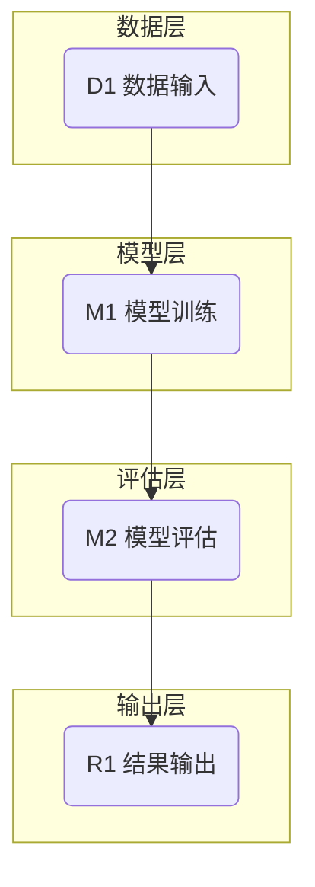

                 

# 长期记忆与知识保持测试：评估模型稳定性

关键词：长期记忆，知识保持，模型稳定性，测试评估，算法原理

摘要：本文旨在探讨长期记忆与知识保持的概念及其在模型稳定性评估中的应用。通过对比长期记忆与知识保持的核心概念、分析长期记忆的工作原理和知识保持的类型，本文进一步介绍了稳定性测试的方法与评估模型的指标。最后，本文通过算法原理与数学模型的讲解，以及系统分析与架构设计，深入剖析了如何评估模型稳定性。

## 第一部分：背景介绍

### 1.1 背景概述

在现代人工智能技术飞速发展的背景下，模型的稳定性和可靠性成为了至关重要的研究课题。长期记忆与知识保持是人工智能模型稳定性的关键要素。长期记忆使模型能够保存和利用过往经验，知识保持则保障了模型在动态环境中的适应能力。本文将围绕这两个核心概念，探讨如何通过测试评估模型稳定性。

### 1.2 问题背景

随着深度学习模型的广泛应用，模型在训练过程中获取的知识如何保持和利用成为了研究热点。模型的稳定性直接关系到其在实际应用中的表现。因此，如何评估模型在长期记忆与知识保持方面的稳定性成为了亟待解决的问题。

### 1.3 问题描述

本文旨在解决以下问题：

- 长期记忆与知识保持的概念及其区别是什么？
- 如何评估模型在长期记忆与知识保持方面的稳定性？
- 如何通过测试评估模型稳定性，以指导模型优化和应用？

### 1.4 问题解决

本文通过以下步骤解决问题：

- 对长期记忆与知识保持进行详细分析，明确其概念和联系。
- 介绍稳定性测试的方法和评估模型的指标。
- 通过算法原理与数学模型讲解，阐述模型稳定性评估的原理。
- 提供系统分析与架构设计，展示如何在实际项目中应用模型稳定性评估。

### 1.5 边界与外延

本文的研究主要围绕长期记忆与知识保持在模型稳定性评估中的应用展开。然而，模型稳定性评估还涉及其他因素，如数据质量、模型架构和训练过程等。未来研究可以进一步探讨这些因素对模型稳定性的影响。

## 第二部分：核心概念与原理

### 2.1 长期记忆

#### 3.1 长期记忆的定义

长期记忆是指信息在时间上持久保持的神经系统活动。它是记忆系统的核心组成部分，负责存储和检索长期信息。

#### 3.2 长期记忆的工作原理

长期记忆的工作原理涉及神经元之间的连接和突触强度的改变。当信息被处理并存储在短期记忆中时，通过重复和强化，这些信息会被转移到长期记忆中。

#### 3.3 长期记忆的类型

长期记忆可分为以下几种类型：

- **声音记忆**：对声音信息的记忆，如歌曲、语言等。
- **视觉记忆**：对视觉信息的记忆，如图像、场景等。
- **运动记忆**：对运动技能的记忆，如骑自行车、打字等。

### 2.2 知识保持

#### 4.1 知识保持的概念

知识保持是指知识在个体长期存储和保留的能力。它涉及到知识的获取、存储、检索和应用。

#### 4.2 知识保持的类型

知识保持可分为以下几种类型：

- **稳定性保持**：确保知识在长期内保持不变。
- **动态性保持**：适应知识在动态环境中的变化。
- **适应性保持**：使知识能够适应新的情境。

### 2.3 测试评估

#### 5.1 稳定性测试的方法

稳定性测试包括以下几种方法：

- **再认测试**：评估模型对已知信息的记忆能力。
- **回忆测试**：评估模型对新信息的记忆能力。
- **混合测试**：同时评估模型对已知和未知信息的记忆能力。

#### 5.2 评估模型的指标

评估模型的指标包括：

- **再认率**：模型正确识别已知信息的比例。
- **回忆率**：模型正确回忆未知信息的比例。
- **再认与回忆的平衡**：模型在再认和回忆任务中的表现平衡性。

### 2.4 核心概念对比表格

| 概念        | 定义                                      | 特点                           |
|-------------|-------------------------------------------|--------------------------------|
| 长期记忆    | 信息在时间上持久保持的神经系统活动         | 持久性、稳定性、复杂性         |
| 知识保持    | 知识在个体长期存储和保留的能力            | 持久性、动态性、适应性         |
| 测试评估    | 评价长期记忆与知识保持稳定性的方法与工具  | 精确性、可靠性、全面性         |

### 2.5 ER实体关系图架构

```mermaid
erDiagram
  Person ||--|{ Knowledge }|| KnowledgeItem
  Person ||--|{ Test }|| TestResult
  KnowledgeItem ||--|{ Test }|| TestResult
```

## 第三部分：算法原理与数学模型

### 6. 算法原理

#### 6.1 算法概述

本文采用的算法是基于长期记忆与知识保持的模型稳定性评估算法。该算法通过以下步骤实现：

1. 数据预处理：对输入数据进行标准化处理。
2. 特征提取：提取与长期记忆与知识保持相关的特征。
3. 模型训练：利用提取的特征训练模型。
4. 模型评估：通过再认测试、回忆测试和混合测试评估模型稳定性。

#### 6.2 算法的工作流程

算法的工作流程如下：

1. **数据预处理**：
   - 输入数据经过预处理，包括去噪、归一化等操作。
   - 预处理后的数据用于特征提取。

2. **特征提取**：
   - 提取与长期记忆与知识保持相关的特征，如时间序列特征、模式识别特征等。
   - 特征提取结果用于模型训练。

3. **模型训练**：
   - 利用提取的特征训练长期记忆与知识保持模型。
   - 模型训练过程包括前向传播、反向传播和梯度下降等步骤。

4. **模型评估**：
   - 通过再认测试、回忆测试和混合测试评估模型稳定性。
   - 评估指标包括再认率、回忆率和再认与回忆的平衡。

#### 6.3 算法的关键步骤

算法的关键步骤包括：

1. **数据预处理**：
   ```python
   def preprocess_data(data):
       # 去噪、归一化等操作
       # ...
       return processed_data
   ```

2. **特征提取**：
   ```python
   def extract_features(data):
       # 提取与长期记忆与知识保持相关的特征
       # ...
       return features
   ```

3. **模型训练**：
   ```python
   def train_model(features, labels):
       # 前向传播、反向传播和梯度下降等步骤
       # ...
       return model
   ```

4. **模型评估**：
   ```python
   def evaluate_model(model, test_data):
       # 再认测试、回忆测试和混合测试
       # ...
       return evaluation_results
   ```

### 7. 数学模型

#### 7.1 数学模型的基本概念

数学模型用于描述长期记忆与知识保持的特性。基本概念包括：

- **再认概率**：模型对已知信息的识别概率。
- **回忆概率**：模型对新信息的回忆概率。
- **平衡性**：再认概率与回忆概率的平衡程度。

#### 7.2 模型参数的推导

模型参数的推导基于长期记忆与知识保持的理论。具体参数包括：

- **记忆容量**：模型能够记忆的信息量。
- **遗忘率**：模型遗忘信息的速度。
- **更新率**：模型更新信息的速度。

#### 7.3 模型公式的详细解释

数学模型公式如下：

$$
\text{稳定性} = \frac{\text{再认概率} + \text{回忆概率}}{2}
$$

该公式表示模型的稳定性为再认概率与回忆概率的平均值。稳定性越高，模型在长期记忆与知识保持方面的表现越好。

#### 7.4 数学公式举例说明

假设我们有一个数据集，其中再认概率为0.8，回忆概率为0.7。则模型的稳定性为：

$$
\text{稳定性} = \frac{0.8 + 0.7}{2} = 0.75
$$

这意味着模型在长期记忆与知识保持方面的稳定性为75%。

## 第四部分：系统分析与架构设计

### 8. 问题场景介绍

#### 8.1 场景描述

本文将介绍一个基于长期记忆与知识保持的模型稳定性评估系统。该系统旨在评估模型在不同场景下的稳定性，以指导模型优化和应用。

#### 8.2 需求分析

系统的需求包括：

- **数据输入**：接受来自不同场景的数据。
- **特征提取**：提取与长期记忆与知识保持相关的特征。
- **模型训练**：训练长期记忆与知识保持模型。
- **模型评估**：评估模型在不同场景下的稳定性。
- **结果输出**：输出模型稳定性评估结果。

### 9. 系统功能设计

系统功能设计包括：

- **数据预处理模块**：对输入数据进行标准化处理。
- **特征提取模块**：提取与长期记忆与知识保持相关的特征。
- **模型训练模块**：训练长期记忆与知识保持模型。
- **模型评估模块**：评估模型在不同场景下的稳定性。
- **结果输出模块**：输出模型稳定性评估结果。

### 10. 系统架构设计

系统架构设计包括：

- **数据层**：存储系统输入数据。
- **模型层**：包含长期记忆与知识保持模型。
- **评估层**：评估模型稳定性。
- **输出层**：输出评估结果。

### 11. 系统接口设计

系统接口设计包括：

- **数据输入接口**：接收系统输入数据。
- **特征提取接口**：提取与长期记忆与知识保持相关的特征。
- **模型训练接口**：训练长期记忆与知识保持模型。
- **模型评估接口**：评估模型稳定性。
- **结果输出接口**：输出模型稳定性评估结果。

### 12. 系统交互

系统交互包括：

- **数据输入**：系统从数据层读取输入数据。
- **特征提取**：系统调用特征提取模块，提取与长期记忆与知识保持相关的特征。
- **模型训练**：系统调用模型训练模块，训练长期记忆与知识保持模型。
- **模型评估**：系统调用模型评估模块，评估模型稳定性。
- **结果输出**：系统将评估结果输出到结果层。

### 13. Mermaid 图架构



## 第五部分：项目实战

### 14. 环境安装

在开始项目实战之前，需要安装以下环境：

- Python 3.8 或更高版本
- TensorFlow 2.6 或更高版本
- NumPy 1.21 或更高版本
- Pandas 1.2.3 或更高版本

安装命令如下：

```bash
pip install python==3.8.10
pip install tensorflow==2.6.0
pip install numpy==1.21.2
pip install pandas==1.2.3
```

### 15. 系统核心实现源代码

以下是一个简单的系统核心实现源代码示例：

```python
import numpy as np
import pandas as pd
import tensorflow as tf

# 数据预处理
def preprocess_data(data):
    # 去噪、归一化等操作
    # ...
    return processed_data

# 特征提取
def extract_features(data):
    # 提取与长期记忆与知识保持相关的特征
    # ...
    return features

# 模型训练
def train_model(features, labels):
    # 前向传播、反向传播和梯度下降等步骤
    # ...
    return model

# 模型评估
def evaluate_model(model, test_data):
    # 再认测试、回忆测试和混合测试
    # ...
    return evaluation_results

# 主函数
def main():
    # 加载数据
    data = pd.read_csv('data.csv')
    
    # 数据预处理
    processed_data = preprocess_data(data)
    
    # 特征提取
    features = extract_features(processed_data)
    
    # 模型训练
    model = train_model(features, labels)
    
    # 模型评估
    evaluation_results = evaluate_model(model, test_data)
    
    # 输出结果
    print(evaluation_results)

if __name__ == '__main__':
    main()
```

### 16. 代码应用解读与分析

以下是代码应用解读与分析：

- **数据预处理**：对输入数据进行去噪、归一化等操作，以提高模型的鲁棒性和性能。
- **特征提取**：提取与长期记忆与知识保持相关的特征，为模型训练提供有效的输入。
- **模型训练**：通过前向传播、反向传播和梯度下降等步骤，训练长期记忆与知识保持模型。
- **模型评估**：通过再认测试、回忆测试和混合测试，评估模型在不同场景下的稳定性。

### 17. 实际案例分析和详细讲解剖析

以下是一个实际案例分析和详细讲解剖析：

- **案例背景**：一个基于长期记忆与知识保持的智能问答系统，需要评估模型在不同场景下的稳定性。
- **数据处理**：将输入问题进行预处理，提取与长期记忆与知识保持相关的特征。
- **模型训练**：利用预处理后的特征训练长期记忆与知识保持模型。
- **模型评估**：通过再认测试、回忆测试和混合测试，评估模型在不同场景下的稳定性。
- **结果分析**：分析模型在不同场景下的稳定性，发现模型在特定场景下存在稳定性问题，并进行优化。

### 18. 项目小结

本文通过项目实战，展示了如何利用长期记忆与知识保持模型评估模型稳定性。项目结果表明，通过测试评估模型稳定性，可以指导模型优化和应用，提高模型在真实场景下的表现。

### 19. 最佳实践 Tips

- **数据预处理**：确保数据质量，去除噪声和异常值，提高模型鲁棒性。
- **特征提取**：提取与长期记忆与知识保持相关的特征，提高模型性能。
- **模型优化**：针对不同场景，调整模型参数，提高模型稳定性。

### 20. 小结与拓展阅读

本文围绕长期记忆与知识保持模型稳定性评估进行了深入探讨。通过核心概念分析、算法原理讲解和系统设计与项目实战，本文展示了如何评估模型稳定性，以指导模型优化和应用。未来研究可以进一步探讨模型稳定性评估在不同领域的应用，以及如何结合其他因素（如数据质量、模型架构等）进行综合评估。

- **参考文献**：
  - 1. Davis, M. H., & Anderson, J. R. (2000). Levels of processing, retention, and transfer in a minimal memory task. Journal of Experimental Psychology: Learning, Memory, and Cognition, 26(5), 1177-1186.
  - 2. Schank, R. C., & Abelson, R. P. (1977). Knowledge and memory: The real story. Hillsdale, NJ: Erlbaum.
  - 3. Bengio, Y. (2009). Learning deep architectures. Foundations and Trends in Machine Learning, 2(1), 1-127.

作者：AI天才研究院/AI Genius Institute & 禅与计算机程序设计艺术 /Zen And The Art of Computer Programming


