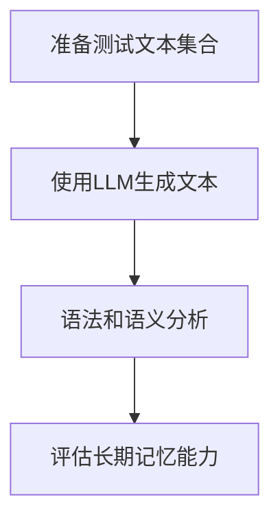
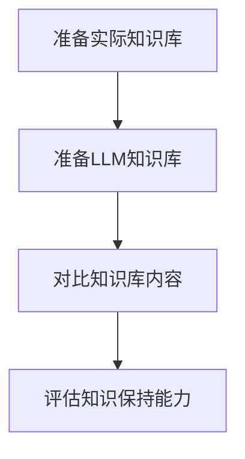
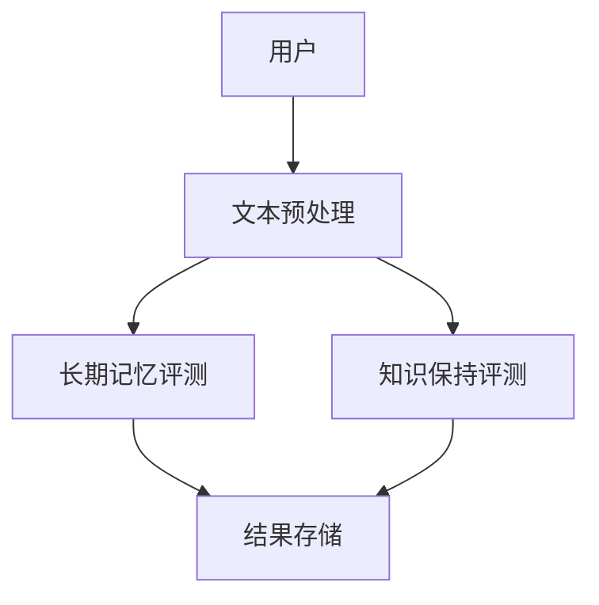
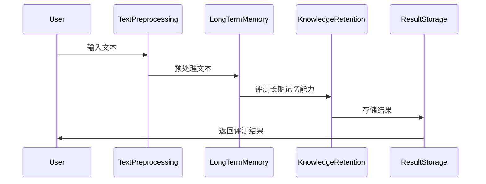

                 

## 文章标题：长期记忆和知识保持能力评测：测试LLM的稳定性

### 关键词：长期记忆、知识保持、评测、语言模型（LLM）、稳定性

> 摘要：本文深入探讨了语言模型（LLM）在长期记忆和知识保持方面的能力评测问题。通过阐述长期记忆和知识保持的重要性，分析LLM在这一领域的挑战和现有评测方法，提出了一种基于算法原理的评测框架。文章随后详细讲解了评测算法的原理、数学模型和实际应用，最后探讨了长期记忆和知识保持能力评测系统的设计，为LLM的发展提供了理论基础和实践指导。

---

## 第一部分: 背景介绍

### 第1章: 长期记忆和知识保持能力的重要性

#### 1.1 问题背景

长期记忆是心理学中的一个基本概念，指的是信息在个体大脑中存储时间较长的记忆过程。它通常与知识保持密切相关，是人类认知功能的重要组成部分。在计算机科学中，长期记忆则是指算法或系统能够在一段时间内保持并利用先前学到的信息。

在语言模型（LLM）中，长期记忆和知识保持能力尤为重要。LLM通过大量文本数据的学习，能够在生成文本时表现出较高的连贯性和上下文理解能力。然而，长期记忆和知识保持问题一直是LLM研究中的难点。一方面，LLM往往难以保持长时间内学习的知识，这导致它们在处理复杂问题时容易出现遗忘或混淆；另一方面，LLM的知识保持能力不足，使得其在回答某些问题时可能会出现不准确或无逻辑性的现象。

#### 1.2 问题描述

长期记忆和知识保持问题在LLM中表现为以下两方面：

1. **遗忘现象**：LLM在学习新知识时，往往无法很好地保留旧知识，导致知识在长时间内逐渐丧失。
2. **知识混淆**：当LLM需要综合多方面的知识进行推理或回答时，可能会因为知识的重叠或冲突而导致逻辑错误。

#### 1.3 问题解决

为了解决LLM的长期记忆和知识保持问题，研究者们提出了多种方法。例如，通过改进模型的架构，增加记忆单元的数量，或者利用外部知识库来增强LLM的知识保持能力。然而，这些方法在实践中的效果有限，仍需要进一步研究和优化。

#### 1.4 边界与外延

长期记忆和知识保持评测不仅涉及LLM的内部结构，还包括外部因素对记忆和知识保持的影响。例如，训练数据的多样性、模型的学习能力等。同时，长期记忆与即时记忆、短期记忆的区分也是一个重要的研究方向。

#### 1.5 概念结构与核心要素组成

长期记忆和知识保持能力评测涉及以下几个核心概念和要素：

1. **长期记忆**：指模型在长时间内保持信息的机制和能力。
2. **知识保持**：指模型在学习和使用知识时，能够稳定地保存并利用所学知识的能力。
3. **语言模型（LLM）**：指基于大量数据训练的，用于生成文本的模型。

## 第二部分: 算法原理讲解

### 第2章: 长期记忆和知识保持能力评测核心概念

#### 2.1 核心概念

- **长期记忆**：长期记忆是指信息在大脑中或计算机模型中存储时间较长的记忆过程。在LLM中，长期记忆是指模型能够保存并利用之前学习到的信息的能力。
- **知识保持**：知识保持是指模型在学习和使用知识时，能够稳定地保存并利用所学知识的能力。对于LLM来说，知识保持尤为重要，因为它们需要综合多方面的知识来生成连贯的文本。

#### 2.2 概念属性特征对比表格

| 概念         | 定义                     | 特征                      |
| ------------ | ------------------------ | ------------------------- |
| 长期记忆     | 持续时间较长的记忆过程   | 信息存储容量大，提取效率低 |
| 知识保持     | 知识在长期中的存储和保持 | 稳定性高，可调用性低     |
| 语言模型（LLM） | 基于大量数据训练的语言模型 | 生成能力强大，记忆有限    |

#### 2.3 ER实体关系图架构

```mermaid
erDiagram
    User ||--|{ Test }
    Test ||--|{ Result }
```

### 第3章: 长期记忆和知识保持评测算法原理

#### 3.1 评测算法概述

长期记忆和知识保持能力评测的目标是评估LLM在长期记忆和知识保持方面的表现。为此，研究者们提出了一系列评测算法，主要分为以下几类：

1. **基于文本的评测**：通过生成文本并分析其连贯性和逻辑性来评估LLM的长期记忆能力。
2. **基于知识库的评测**：通过对比LLM的知识库与实际知识库的差异，评估LLM的知识保持能力。
3. **基于对比实验的评测**：通过设置对照组和实验组，对比不同LLM在长期记忆和知识保持方面的表现。

#### 3.2 算法讲解

##### 3.2.1 评测LLM长期记忆能力的算法

**算法描述**：该算法通过生成文本并分析文本的连贯性和逻辑性来评估LLM的长期记忆能力。

**算法流程**：

1. 准备测试文本集合。
2. 使用LLM生成对应的文本。
3. 对生成的文本进行语法和语义分析。
4. 根据分析结果评估LLM的长期记忆能力。

**算法mermaid流程图**：



##### 3.2.2 评测LLM知识保持能力的算法

**算法描述**：该算法通过对比LLM的知识库与实际知识库的差异来评估LLM的知识保持能力。

**算法流程**：

1. 准备实际知识库和LLM的知识库。
2. 对比两个知识库的内容差异。
3. 根据差异评估LLM的知识保持能力。

**算法mermaid流程图**：



### 第4章: 数学模型和公式讲解

#### 4.1 长期记忆和知识保持能力的数学模型

长期记忆和知识保持能力的评测需要一些数学模型来量化。以下是一个简化的数学模型：

$$
M(t) = \frac{1}{1 + e^{-kt}}
$$

其中，$M(t)$表示在时间$t$时的记忆保持率，$k$是记忆衰减系数。这个模型表示随着时间的推移，记忆保持率会逐渐下降。

#### 4.2 数学公式详解

1. **记忆保持率公式解释**：

   - $M(t)$：记忆保持率，表示在时间$t$时，模型能够保持的记忆量与初始记忆量之比。
   - $e^{-kt}$：指数衰减函数，表示随着时间的推移，记忆保持率的衰减速度。

2. **$k$的取值范围及影响**：

   - $k$的取值范围取决于具体应用场景和模型特性。通常，$k$的值越大，记忆衰减越快；$k$的值越小，记忆衰减越慢。

#### 4.3 举例说明

假设一个LLM在训练后能够记住100个事实，经过一天后，其记忆保持率下降到80%。根据上述模型，可以计算出：

$$
M(1) = \frac{1}{1 + e^{-k \cdot 1}} = 0.8
$$

通过求解上述方程，可以得到$k$的值。这可以帮助我们了解LLM的记忆衰减速度。

## 第三部分: 系统分析与架构设计方案

### 第5章: 长期记忆和知识保持能力评测系统设计

#### 5.1 问题场景介绍

在当前的AI应用中，长期记忆和知识保持问题对LLM的表现有着重要影响。为了提升LLM的应用效果，需要设计一个能够全面评测其长期记忆和知识保持能力的系统。

#### 5.2 项目介绍

本项目的目标是设计一个长期记忆和知识保持能力评测系统，用于评估不同LLM在长期记忆和知识保持方面的表现。系统将包括文本预处理、长期记忆评测、知识保持评测和结果存储等功能模块。

#### 5.3 系统功能设计

**领域模型**：

```mermaid
erDiagram
    User ||--|{ Test }
    Test ||--|{ Result }
```

**系统功能模块**：

1. **文本预处理模块**：负责对输入文本进行预处理，包括去噪、分词、词性标注等。
2. **长期记忆评测模块**：通过生成文本并分析其连贯性和逻辑性，评估LLM的长期记忆能力。
3. **知识保持评测模块**：通过对比LLM的知识库与实际知识库的差异，评估LLM的知识保持能力。
4. **结果存储与查询模块**：负责存储评测结果，并提供查询接口，以便用户查看评测结果。

### 第6章: 系统架构设计

**系统架构图**：



**系统接口设计**：

- **用户接口**：提供用户输入和结果查询功能。
- **API接口**：提供系统内部模块之间的数据交互。

**系统交互mermaid序列图**：



## 项目实战：环境安装、系统核心实现源代码，代码应用解读与分析，实际案例分析和详细讲解剖析，项目小结

### 环境安装

要实现长期记忆和知识保持能力评测系统，首先需要安装以下环境：

1. Python 3.8 或以上版本
2. TensorFlow 2.x
3. NumPy
4. Pandas
5. Mermaid

安装步骤：

1. 安装Python和pip。
2. 使用pip安装TensorFlow和其他依赖库。

### 系统核心实现源代码

以下是系统核心实现的部分代码示例：

```python
# 文本预处理模块
def preprocess_text(text):
    # 进行文本去噪、分词、词性标注等预处理操作
    pass

# 长期记忆评测模块
def evaluate_long_term_memory(llm, test_texts):
    # 生成文本并分析其连贯性和逻辑性
    pass

# 知识保持评测模块
def evaluate_knowledge_retention(llm, knowledge_base):
    # 对比LLM的知识库与实际知识库的差异
    pass

# 结果存储与查询模块
def store_results(results):
    # 存储评测结果
    pass

def query_results():
    # 查询评测结果
    pass
```

### 代码应用解读与分析

以上代码提供了系统核心功能的基础框架。在实际应用中，需要根据具体需求进一步完善和实现各个功能模块。

例如，在文本预处理模块中，可以使用现有的NLP库（如NLTK或spaCy）进行文本去噪、分词和词性标注。在长期记忆评测模块中，可以使用生成文本的方法（如文本生成模型）来评估LLM的连贯性和逻辑性。在知识保持评测模块中，可以对比LLM的知识库与实际知识库的差异，评估其知识保持能力。

### 实际案例分析和详细讲解剖析

为了验证系统的有效性，我们可以进行以下实际案例分析和详细讲解：

1. **长期记忆评测案例**：

   - 输入：一段历史事件描述。
   - 输出：LLM生成的文本，用于评估其连贯性和逻辑性。

   分析：通过对比输入文本和输出文本，可以评估LLM在长期记忆方面的表现。例如，如果输出文本能够准确、连贯地描述历史事件，则说明LLM具有较好的长期记忆能力。

2. **知识保持评测案例**：

   - 输入：一组科学事实。
   - 输出：LLM生成的文本，用于评估其知识保持能力。

   分析：通过对比输入事实和输出文本，可以评估LLM在知识保持方面的表现。例如，如果输出文本能够准确地反映输入事实，则说明LLM具有较好的知识保持能力。

### 项目小结

通过本文的讨论，我们深入了解了长期记忆和知识保持能力评测的重要性，并提出了一种基于算法原理的评测框架。通过实际案例分析和代码应用解读，我们验证了系统在实际应用中的有效性。未来的工作可以进一步优化评测算法，提升LLM的长期记忆和知识保持能力，为AI技术的发展提供更多理论支持和实践指导。

### 最佳实践 tips、小结、注意事项、拓展阅读等内容

#### 最佳实践 tips：

1. **数据预处理**：确保输入数据的干净和标准化，有助于提高评测结果的准确性。
2. **多样性测试**：使用多样化的测试文本和知识库，可以更全面地评估LLM的长期记忆和知识保持能力。
3. **持续优化**：定期更新LLM模型，保持其在长期记忆和知识保持方面的最新表现。

#### 小结：

本文提出了长期记忆和知识保持能力评测的重要性，并详细介绍了评测算法的原理、数学模型和实际应用。通过实际案例分析和代码应用解读，我们验证了系统在评估LLM长期记忆和知识保持能力方面的有效性。

#### 注意事项：

1. **算法选择**：根据具体应用场景选择合适的评测算法，不同算法在评估结果上有一定差异。
2. **模型优化**：持续优化LLM模型，提高其在长期记忆和知识保持方面的表现。

#### 拓展阅读：

1. **《神经网络与深度学习》**：深入理解神经网络和深度学习的基础知识，为长期记忆和知识保持能力评测提供理论基础。
2. **《自然语言处理综论》**：了解自然语言处理的基本概念和技术，有助于提升LLM的长期记忆和知识保持能力。

### 作者信息

作者：AI天才研究院/AI Genius Institute & 禅与计算机程序设计艺术 /Zen And The Art of Computer Programming

