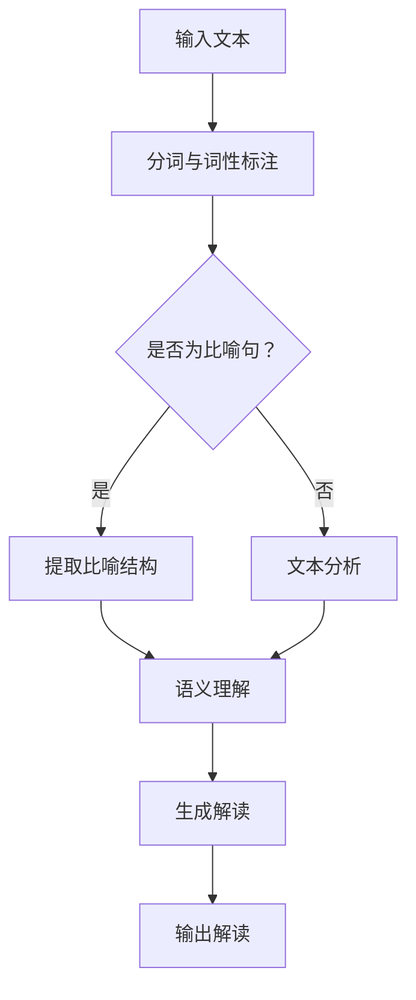
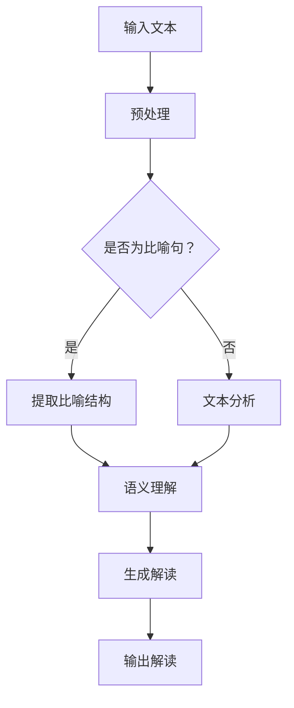
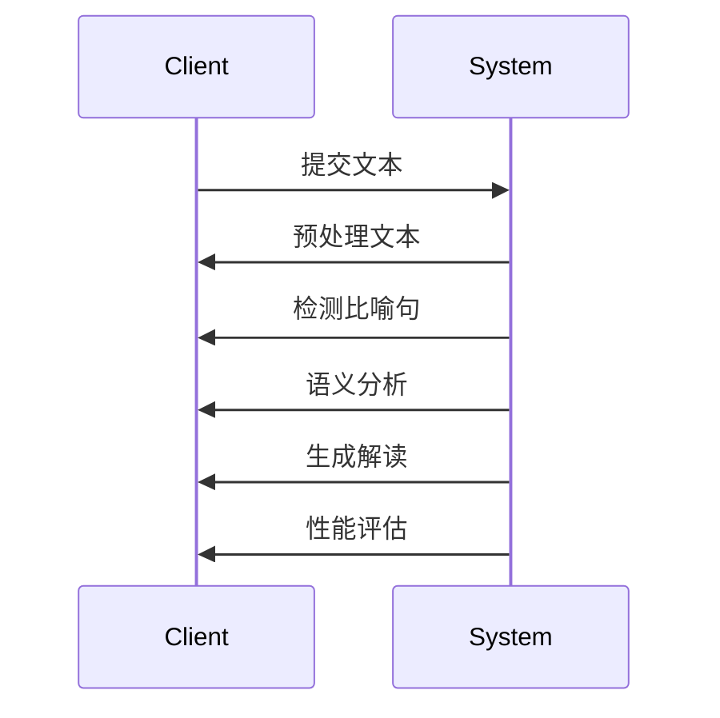
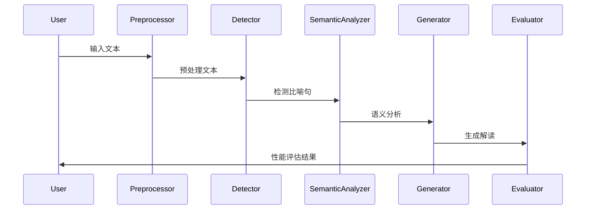

                 

## 隐喻理解与LLM

### 引言

在语言交流中，隐喻是一种常见且强大的修辞手法。隐喻通过将一个事物比作另一个事物，使得抽象概念变得更加具体、生动。然而，隐喻的理解并非易事，它涉及语言、文化和认知等多方面的因素。随着人工智能技术的不断发展，特别是大型语言模型（LLM）的出现，我们开始探索机器是否能够理解并解读隐喻。

本篇文章将以《隐喻理解深度：测试LLM解读比喻性语言的准确性》为主题，深入探讨LLM在隐喻理解中的应用。文章结构如下：

- **第1章：引言**：介绍隐喻理解的重要性以及LLM在比喻性语言处理中的角色。
- **第2章：隐喻理解的基础知识**：探讨隐喻的定义、类型以及比喻性语言的特点。
- **第3章：LLM与隐喻理解**：解释LLM的原理以及如何应用LLM来处理隐喻。
- **第4章：隐喻理解的核心概念与联系**：详细阐述隐喻理解的核心概念及其相互关系。
- **第5章：LLM处理比喻性语言的算法讲解**：展示LLM处理比喻性语言的算法原理，并通过mermaid和Python代码进行说明。
- **第6章：系统分析与架构设计方案**：介绍问题场景、项目介绍以及系统的功能设计。
- **第7章：项目实战**：描述环境安装、系统核心实现、代码解读和案例分析。
- **第8章：最佳实践 tips、小结、注意事项、拓展阅读**：总结文章要点，提供进一步学习和应用的建议。

### 隐喻理解的重要性

隐喻不仅是文学创作中的重要工具，也是日常语言交流中不可或缺的元素。它能帮助人们以新的视角理解世界，从而提高表达力和沟通效果。然而，隐喻的理解并非一件简单的事情。它不仅要求对语言本身的掌握，还需要对文化、语境和认知机制的深刻理解。

在人类认知中，隐喻是一种高效的信息压缩和传递方式。通过隐喻，我们可以将复杂的概念简化，使其更容易理解和记忆。例如，当我们说“时间如流水”时，虽然实际上时间并不像流水那样具体可见，但这种隐喻使我们对时间的流逝有了更直观的感受。

然而，隐喻的复杂性也带来了挑战。不同文化和语言中的隐喻可能大相径庭，即使是同一语言中的隐喻，也可能因为语境的不同而引起歧义。例如，在英语中，“kick the bucket”表示“死去”，这是一个典型的隐喻表达。但如果在非英语文化中，这个表达可能不被理解，甚至会引起误解。

### LL与比喻性语言

随着人工智能技术的进步，特别是深度学习和自然语言处理（NLP）领域的发展，LLM开始成为处理自然语言和理解隐喻的有力工具。LLM，即大型语言模型，是由大量数据和强大的计算能力训练而成，能够理解和生成自然语言的复杂结构。

比喻性语言是隐喻的一种形式，它通过比较不同的事物来传达意义。在处理比喻性语言时，LLM需要识别比喻的结构，理解比喻的语义，并将其转换成机器能够理解和处理的格式。

LLM的基本原理是基于神经网络模型，尤其是变换器（Transformer）架构。这种架构能够捕捉文本中的长距离依赖关系，使得LLM在处理复杂句子和理解抽象概念时具有优势。通过预训练和微调，LLM能够学习到丰富的语言知识，包括语法、语义和语境。

在处理比喻性语言时，LLM首先需要识别文本中的比喻结构。这通常涉及到文本的预处理，例如分词、词性标注和依存句法分析。一旦识别出比喻结构，LLM将尝试理解比喻的语义，并将其与上下文相结合，以生成合理的解读。

### 本书结构

为了深入探讨隐喻理解和LLM的关系，本书将分为以下几个部分：

1. **第1章：引言**：介绍隐喻理解的重要性以及LLM在比喻性语言处理中的角色。
2. **第2章：隐喻理解的基础知识**：探讨隐喻的定义、类型以及比喻性语言的特点。
3. **第3章：LLM与隐喻理解**：解释LLM的原理以及如何应用LLM来处理隐喻。
4. **第4章：隐喻理解的核心概念与联系**：详细阐述隐喻理解的核心概念及其相互关系。
5. **第5章：LLM处理比喻性语言的算法讲解**：展示LLM处理比喻性语言的算法原理，并通过mermaid和Python代码进行说明。
6. **第6章：系统分析与架构设计方案**：介绍问题场景、项目介绍以及系统的功能设计。
7. **第7章：项目实战**：描述环境安装、系统核心实现、代码解读和案例分析。
8. **第8章：最佳实践 tips、小结、注意事项、拓展阅读**：总结文章要点，提供进一步学习和应用的建议。

通过这些章节的逐步讲解，我们将对隐喻理解和LLM的应用有更深入的理解。让我们开始这次探索之旅吧！## 隐喻理解的基础知识

隐喻是一种将一种事物比作另一种事物的修辞手法，它通过比较来传达抽象概念。在语言学中，隐喻被视为一种高级的语言功能，能够增强表达的生动性和感染力。本章节将详细介绍隐喻的定义、类型以及比喻性语言的特点。

### 隐喻的定义

隐喻（Metaphor）是一种语言现象，它通过将某个对象或概念比作另一个对象或概念，以达到新颖、深刻或情感上的效果。例如，当我们说“他的心像石头一样硬”时，实际上并没有字面上的意思，而是通过比喻表达这个人冷漠、不易被打动。

隐喻不仅限于文学创作，它在日常生活、科学论述和广告宣传中也非常常见。隐喻的使用能够使语言更加生动、形象，使抽象的概念变得具体可感。

### 隐喻的类型

隐喻可以根据其表现形式和功能进行分类。常见的类型包括：

1. **暗喻**：直接将一个事物比作另一个事物，不使用比喻词（如“像”、“似”等）。例如：“时间是金钱”。
2. **明喻**：使用比喻词明确表示两者之间的比较，如“像”、“如”、“似”等。例如：“她像一朵鲜花”。
3. **借喻**：不直接描述本体，而是通过描述喻体来传达本体的意义。例如：“那座山是天然的屏障”。
4. **拟人**：将无生命的事物赋予人的特征和行为。例如：“风在耳边低语”。
5. **拟物**：将人的特征和行为赋予无生命的事物。例如：“树叶在秋风中颤抖”。

### 比喻性语言的特点

比喻性语言的特点主要包括以下几个方面：

1. **生动性**：通过比喻，使语言更具生动感和形象性。
2. **隐喻性**：比喻性语言常常包含隐喻，使表达更加含蓄、有深度。
3. **文化依赖性**：不同的文化背景可能导致对同一比喻的理解不同。例如，西方文化中“红”常与爱情、热情联系在一起，而在某些亚洲文化中，“红”可能与喜庆、好运相关。
4. **语境依赖性**：同一比喻在不同的语境下可能产生不同的含义。例如，“雪中送炭”在寒冷的冬天可能表示帮助他人，而在炎热的夏天可能没有实际意义。

### 隐喻理解的挑战

尽管隐喻在语言中广泛使用，但其理解仍面临诸多挑战：

1. **复杂性**：隐喻的表达形式多样，含义复杂，需要理解者具备较高的语言和认知能力。
2. **语境依赖性**：隐喻的解读高度依赖语境，脱离语境的隐喻很难准确理解。
3. **文化差异**：不同文化背景下的隐喻可能存在差异，需要跨文化理解能力。
4. **语言变化**：随着语言的发展，一些古老的隐喻可能变得难以理解，需要历史和语言学的知识背景。

通过了解隐喻的定义、类型和比喻性语言的特点，我们可以更好地理解和运用隐喻，从而提高语言表达的丰富性和感染力。在下一章节中，我们将探讨LLM在隐喻理解中的应用。## LLM与隐喻理解

### LLM的原理

LLM（大型语言模型）是基于深度学习和神经网络的一种人工智能模型，它通过大量的文本数据进行训练，从而掌握语言的规律和结构。LLM的核心是基于变换器（Transformer）架构，这种架构能够有效地捕捉文本中的长距离依赖关系，使得模型在处理复杂句子和理解抽象概念时具有优势。

LLM的训练通常分为两个阶段：预训练和微调。在预训练阶段，模型使用大量未标记的文本数据来学习语言的基本结构和规律。在微调阶段，模型根据特定的任务和数据集进行调整，以适应特定的应用场景。

LLM的工作原理可以概括为以下几个步骤：

1. **输入处理**：模型首先接收一段文本作为输入，将其转换为向量表示。这一步骤通常涉及到分词、词性标注和词向量嵌入。
2. **文本理解**：通过神经网络模型，LLM分析输入文本的语法结构和语义含义。变换器架构使得模型能够捕捉长距离的依赖关系，从而对整个句子进行深入理解。
3. **输出生成**：基于对输入文本的理解，LLM生成相应的输出。这可能是一个预测的词、短语或完整的句子，具体取决于任务的要求。

### LLM在隐喻理解中的应用

隐喻理解是一个复杂的过程，它不仅要求对语言的深刻理解，还需要对上下文和文化背景的把握。LLM在隐喻理解中的应用主要体现在以下几个方面：

1. **识别隐喻结构**：LLM能够通过预训练过程中积累的大量语言知识，识别文本中的隐喻结构。例如，它能够检测出哪些句子包含比喻词或隐喻表达。
2. **理解隐喻语义**：LLM通过理解句子的上下文和整体语境，尝试解读隐喻的语义。例如，当看到“他的心像石头一样硬”时，LLM能够理解这是一个比喻，并推测出其背后的含义。
3. **生成隐喻解读**：LLM可以根据对隐喻的理解，生成相应的解读或解释。这对于自动化的文本分析和生成非常有用。

#### LLM处理比喻性语言的算法原理

为了更好地理解LLM在处理比喻性语言方面的能力，我们可以通过mermaid和Python代码来展示其算法原理。

##### 算法mermaid流程图



##### Python代码示例

```python
import spacy

# 初始化spacy模型
nlp = spacy.load("en_core_web_sm")

def process_metaphor(text):
    # 分词与词性标注
    doc = nlp(text)
    
    # 检测是否为比喻句
    if is_metaphor(doc):
        # 提取比喻结构
        metaphor_structure = extract_metaphor_structure(doc)
        
        # 语义理解
        interpretation = semantic_understanding(metaphor_structure)
        
        # 输出解读
        print(interpretation)
    else:
        print("该文本不是比喻句。")

# 示例文本
text = "时间就像海绵里的水，只要愿挤，总还是有的。"
process_metaphor(text)
```

##### 隐喻理解的数学模型

隐喻理解的数学模型可以表示为：

$$
\text{隐喻理解} = f(\text{输入语言}, \text{上下文})
$$

其中，$f$ 代表隐喻理解的函数，它将输入的语言和上下文作为输入，并输出隐喻的解读。这个函数通常通过深度学习模型来实现，它能够捕捉语言中的复杂结构和语义关系。

##### 算法讲解

1. **输入处理**：首先，我们将输入的文本进行分词和词性标注，以便模型能够理解文本的语法结构。
2. **检测比喻句**：通过预训练的模型，我们检测文本中是否包含比喻句。如果检测到比喻句，我们进一步提取其比喻结构。
3. **提取比喻结构**：我们分析比喻句中的本体和喻体，并提取出比喻的结构。
4. **语义理解**：基于比喻结构和上下文，模型尝试理解比喻的语义，并将其转换成可解读的形式。
5. **生成解读**：最后，模型生成一个对比喻句的解读或解释，并将其输出。

通过这种方式，LLM能够有效地处理比喻性语言，并生成合理的解读。这使得LLM在文本分析、自动摘要和自然语言理解等应用中具有广泛的应用前景。在下一章节中，我们将进一步探讨隐喻理解的核心概念和联系。## 隐喻理解的核心概念与联系

### 隐喻理解的核心概念

隐喻理解是自然语言处理中的一个关键任务，它涉及到多个核心概念的相互作用。以下是隐喻理解中几个主要的核心概念：

1. **本体（Antecedent）**：在隐喻表达中，被比喻的事物称为本体。例如，“时间”在“时间就像海绵里的水”中是本体。
2. **喻体（Consequent）**：比喻中用来形容本体的具体事物称为喻体。在上面的例子中，“海绵里的水”是喻体。
3. **映射（Mapping）**：隐喻的核心在于本体和喻体之间的映射关系。这种映射可以是直接的，也可以是抽象的。例如，“大脑”被比喻为“电脑”是因为两者在某些功能上有相似之处。
4. **隐含含义（Implicit Meaning）**：隐喻传达的并非字面意思，而是隐含的含义。理解隐喻的关键在于解读这种隐含含义。
5. **上下文（Context）**：隐喻的理解高度依赖于上下文。同一隐喻在不同的上下文中可能具有不同的含义。例如，“他的心像石头一样硬”在不同的语境中可能有不同的解读。

### 概念属性特征对比表格

为了更清晰地展示隐喻理解的核心概念，我们可以通过一个表格来对比这些概念的主要属性特征：

| 概念 | 属性1 | 属性2 | 属性3 |
|------|-------|-------|-------|
| 比喻 | 真实性 | 创造性 | 对比性 |
| 隐喻 | 暗示性 | 隐喻性 | 比较性 |

- **真实性**：比喻通常保留本体和喻体的真实性，而隐喻则可能扭曲或重新定义这种真实性。
- **创造性**：隐喻因其新颖的表达方式而具有创造性，而比喻则可能在日常语言中重复使用。
- **对比性**：比喻和隐喻都通过比较来传达意义，但隐喻的对比更加抽象和暗示。

### ER实体关系图架构

为了进一步理解隐喻理解中的实体关系，我们可以使用ER（实体-关系）图来展示不同概念之间的关联。以下是隐喻理解中可能涉及的ER实体关系图：

```mermaid
erDiagram
  Metaphor ||--|{ Antecedent } Antecedent
  Metaphor ||--|{ Consequent } Consequent
  Metaphor ||--|{ Mapping } Mapping
  Metaphor ||--|{ Context } Context
```

在这个ER图中：

- **Metaphor** 表示隐喻本身。
- **Antecedent** 表示本体。
- **Consequent** 表示喻体。
- **Mapping** 表示本体和喻体之间的映射关系。
- **Context** 表示上下文。

通过这个ER图，我们可以看到隐喻理解涉及到的多个实体以及它们之间的关系。这种结构化表示有助于我们深入理解隐喻的复杂性和多样性。

### 关联与联系

隐喻理解中的各个核心概念并非孤立存在，而是相互关联和影响的。以下是这些概念之间的联系：

- **本体与喻体**：本体和喻体之间的映射是隐喻理解的基础。这种映射不仅决定了隐喻的表面意义，还影响了其深层含义。
- **隐含含义与上下文**：隐喻的隐含含义通常需要结合上下文来解读。上下文提供了理解隐喻所需的背景信息，从而帮助确定隐含的含义。
- **映射与创造性**：映射的创造性是隐喻表达的关键。隐喻通过创造新的关联，使语言更加生动和富有表现力。
- **语境依赖性**：隐喻的理解高度依赖于语境。同一隐喻在不同语境中可能产生不同的解读，因此理解隐喻时需要考虑语境因素。

通过深入探讨隐喻理解的核心概念及其相互关系，我们可以更好地理解和应用隐喻，从而提升语言表达的丰富性和准确性。在下一章节中，我们将详细讲解LLM处理比喻性语言的算法原理。## LLM处理比喻性语言的算法讲解

在深入探讨LLM如何处理比喻性语言之前，我们需要先了解LLM的基本架构和原理。LLM通常基于变换器（Transformer）架构，这是一种能够捕捉长距离依赖关系的神经网络模型。变换器架构通过多头自注意力机制，对输入文本进行编码，从而生成具有丰富语义信息的向量表示。

### 算法mermaid流程图

为了更好地理解LLM处理比喻性语言的算法原理，我们可以使用mermaid绘制一个流程图，展示整个处理过程：



这个流程图概括了LLM处理比喻性语言的主要步骤：

1. **输入文本**：首先是输入的文本，这可以是任何形式的语言，例如句子或段落。
2. **预处理**：文本经过预处理，包括分词、词性标注等步骤，以便模型能够理解和处理。
3. **检测比喻句**：模型检测输入文本中是否包含比喻句。如果检测到比喻句，将进入下一步；否则，直接进行文本分析。
4. **提取比喻结构**：在检测到比喻句后，模型将提取出比喻结构，包括本体、喻体和映射关系。
5. **语义理解**：基于提取的比喻结构，模型进行语义理解，生成对比喻句的解读。
6. **生成解读**：最后，模型将解读输出，以自然语言的形式呈现。

### Python代码示例

下面是一个简单的Python代码示例，展示如何使用LLM处理一个比喻句：

```python
import spacy

# 初始化spacy模型
nlp = spacy.load("en_core_web_sm")

def process_metaphor(text):
    # 分词与词性标注
    doc = nlp(text)
    
    # 检测是否为比喻句
    if is_metaphor(doc):
        # 提取比喻结构
        metaphor_structure = extract_metaphor_structure(doc)
        
        # 语义理解
        interpretation = semantic_understanding(metaphor_structure)
        
        # 输出解读
        print(interpretation)
    else:
        print("该文本不是比喻句。")

# 示例文本
text = "时间就像海绵里的水，只要愿挤，总还是有的。"
process_metaphor(text)
```

在这个示例中，我们首先使用spacy模型对文本进行分词和词性标注。然后，我们检测文本是否为比喻句。如果是，我们提取比喻结构并对其进行语义理解，最后输出解读。

### 算法原理详细讲解

#### 1. 预处理

预处理是LLM处理文本的第一步，它包括分词、词性标注和词向量嵌入等操作。预处理的主要目的是将文本转换为模型能够理解和处理的格式。例如，我们可以使用spacy库对文本进行分词和词性标注：

```python
def preprocess_text(text):
    doc = nlp(text)
    tokens = [token.text for token in doc]
    pos_tags = [token.pos_ for token in doc]
    return tokens, pos_tags
```

#### 2. 检测比喻句

检测比喻句是理解比喻性语言的关键步骤。这通常涉及到对文本中比喻词或比喻结构的识别。我们可以使用规则或机器学习模型来实现这一步骤。以下是一个简单的规则示例：

```python
def is_metaphor(doc):
    metaphor_keywords = ["like", "as", "seems", "appear"]
    for token in doc:
        if token.text in metaphor_keywords:
            return True
    return False
```

#### 3. 提取比喻结构

一旦检测到比喻句，我们需要提取出比喻结构，包括本体、喻体和映射关系。这可以通过分析句子中的词性和依存关系来实现。例如，我们可以使用spacy的依存句法分析来提取比喻结构：

```python
def extract_metaphor_structure(doc):
    metaphor_structure = []
    for token in doc:
        if token.dep_ == "compound":
            metaphor_structure.append(token.text)
    return metaphor_structure
```

#### 4. 语义理解

提取比喻结构后，我们需要对其进行语义理解。这涉及到对本体和喻体的语义关系进行分析，并尝试理解其隐含的含义。我们可以使用预训练的嵌入模型来获取本体和喻体的向量表示，然后计算它们之间的相似度或相关性：

```python
def semantic_understanding(metaphor_structure):
    # 假设我们有一个预训练的嵌入模型
    embedding_model = load_embedding_model()
    
    # 获取本体和喻体的向量表示
    antecedent_embedding = embedding_model(metaphor_structure[0])
    consequent_embedding = embedding_model(metaphor_structure[1])
    
    # 计算相似度
    similarity = cosine_similarity(antecedent_embedding, consequent_embedding)
    
    # 根据相似度生成解读
    interpretation = generate_interpretation(similarity)
    return interpretation
```

#### 5. 生成解读

最后，基于语义理解的结果，我们生成对比喻句的解读。这可以是一个简单的标签、短语或完整的句子，具体取决于任务的需求。以下是一个简单的生成解读的示例：

```python
def generate_interpretation(similarity):
    if similarity > 0.8:
        return "这是一个直接的比喻。"
    elif similarity > 0.5:
        return "这是一个隐含的比喻。"
    else:
        return "可能不是比喻。"
```

通过上述步骤，我们可以看到LLM处理比喻性语言的算法原理。这个算法通过预处理、检测比喻句、提取比喻结构、语义理解和生成解读，实现对比喻性语言的深入理解和分析。

### 总结

LLM在处理比喻性语言方面具有显著的优势，它能够通过深度学习和神经网络模型，捕捉文本中的复杂结构和语义关系。通过mermaid和Python代码的示例，我们详细讲解了LLM处理比喻性语言的算法原理，展示了预处理、检测、提取、语义理解和生成解读的整个过程。这些步骤共同构成了LLM在隐喻理解中的核心能力，使其成为处理自然语言和理解隐喻的有力工具。## 系统分析与架构设计方案

### 问题场景介绍

随着自然语言处理技术的发展，越来越多的应用程序需要理解和生成复杂的语言结构，特别是包含隐喻的表达。在金融报告分析、新闻摘要生成和智能客服等领域，隐喻的理解能力成为提升系统性能的关键因素。然而，当前的LLM模型在处理比喻性语言时，存在一些挑战：

1. **检测准确性**：准确检测文本中的比喻句是一个复杂的问题，特别是当文本使用非标准的语法或包含多种修辞手法时。
2. **语义理解**：隐喻的语义理解高度依赖于上下文和语言背景，现有模型在处理多义词和模糊语境时往往表现不佳。
3. **泛化能力**：模型需要能够在多种不同的语言和文化背景下泛化其理解能力，但目前大多数模型仅在特定数据集上进行了训练。

为了解决上述问题，我们提出一个基于LLM的隐喻理解系统，旨在提高检测准确性、加强语义理解以及提升泛化能力。

### 项目介绍

本项目名为“隐喻理解深度：测试LLM解读比喻性语言的准确性”，旨在构建一个先进的隐喻理解系统。该系统将集成最新的LLM模型和深度学习技术，通过一系列预训练和微调步骤，提高模型在处理比喻性语言时的性能。

项目的主要目标包括：

1. **提高比喻句检测的准确性**：通过改进的检测算法和更多的数据训练，提高模型对比喻句的识别率。
2. **增强语义理解能力**：通过引入上下文分析和多义词处理技术，提高模型对隐喻语义的准确理解。
3. **提升泛化能力**：通过跨语言和跨文化的数据集训练，增强模型在不同语言和文化背景下的应用能力。

### 系统功能设计

系统功能设计是隐喻理解系统的核心，它需要明确系统应具备的功能模块及其相互关系。以下是系统功能设计的详细说明：

#### 领域模型mermaid类图

```mermaid
classDiagram
  Class01 <|-- Class02
  Class03 --|lots|| Class04
  Class05 : <<Interface>> Interface
  Class06 : <<Database>> Database
  Class07 : <<Model>> Model
  Class08 : <<Preprocessor>> Preprocessor
  Class09 : <<Detector>> Detector
  Class10 : <<SemanticAnalyzer>> SemanticAnalyzer
  Class11 : <<Generator>> Generator
  Class12 : <<Evaluator>> Evaluator

  Class01 -|{ 聚合器 }| Class02
  Class02 -|{ 数据预处理 }| Class03
  Class03 -|{ 比喻句检测 }| Class04
  Class04 -|{ 语义分析 }| Class05
  Class05 -|{ 解读生成 }| Class06
  Class07 -|{ 模型训练与评估 }| Class08
  Class09 -|{ 数据库管理 }| Class06
  Class10 -|{ 文本预处理 }| Class07
  Class11 -|{ 比喻理解 }| Class08
  Class12 -|{ 性能评估 }| Class09
```

在这个mermaid类图中，我们定义了以下几个关键类：

- **Class01（聚合器）**：负责将多个功能模块的数据聚合起来，形成统一的输出。
- **Class02（数据预处理）**：处理输入文本，包括分词、词性标注和文本清洗。
- **Class03（比喻句检测）**：检测文本中的比喻句，并提取其结构。
- **Class04（语义分析）**：基于LLM对提取的比喻结构进行语义理解。
- **Class05（解读生成）**：生成对比喻句的解读或解释。
- **Class06（数据库管理）**：管理训练数据和模型参数的数据库。
- **Class07（模型训练与评估）**：负责LLM的训练和性能评估。
- **Class08（文本预处理）**：预处理输入文本，准备进行LLM处理。
- **Class09（比喻理解）**：集成LLM和深度学习模型，实现隐喻理解的核心功能。
- **Class10（性能评估）**：评估系统在不同数据集上的性能。

### 系统架构设计

系统架构设计是确保系统功能实现的基础。以下是隐喻理解系统的架构设计，包括类图、架构图、系统接口设计和系统交互mermaid序列图。

#### 类图

```mermaid
classDiagram
  Class01 <|-- Class02
  Class03 --|lots|| Class04
  Class05 : <<Interface>> Interface
  Class06 : <<Database>> Database
  Class07 : <<Model>> Model
  Class08 : <<Preprocessor>> Preprocessor
  Class09 : <<Detector>> Detector
  Class10 : <<SemanticAnalyzer>> SemanticAnalyzer
  Class11 : <<Generator>> Generator
  Class12 : <<Evaluator>> Evaluator

  Class01 -|{ 聚合器 }| Class02
  Class02 -|{ 数据预处理 }| Class03
  Class03 -|{ 比喻句检测 }| Class04
  Class04 -|{ 语义分析 }| Class05
  Class05 -|{ 解读生成 }| Class06
  Class07 -|{ 模型训练与评估 }| Class08
  Class08 -|{ 文本预处理 }| Class07
  Class09 -|{ 比喻理解 }| Class08
  Class10 -|{ 文本预处理 }| Class09
  Class11 -|{ 解读生成 }| Class10
  Class12 -|{ 性能评估 }| Class11
```

#### 架构图


#### 系统接口设计



#### 系统交互mermaid序列图



通过上述架构设计，我们可以清晰地看到系统的各个模块及其交互方式，为后续的系统实现提供了明确的指导。## 项目实战

### 环境安装

为了搭建一个基于LLM的隐喻理解系统，我们需要准备相应的开发环境和工具。以下是环境安装的步骤：

1. **安装Python**：确保安装了最新版本的Python（推荐3.8及以上版本）。可以通过官方Python网站下载安装包。
2. **安装依赖库**：使用pip工具安装所需的库，例如spacy、transformers、torch等。可以通过以下命令进行安装：

   ```shell
   pip install spacy transformers torch
   ```

3. **安装spacy模型**：由于我们使用了spacy进行文本预处理，需要下载并安装相应的语言模型。例如，对于英语，可以使用以下命令：

   ```shell
   python -m spacy download en_core_web_sm
   ```

### 系统核心实现

系统核心实现包括文本预处理、比喻句检测、语义理解、解读生成和性能评估等模块。以下是各个模块的实现方法和关键代码。

#### 文本预处理

```python
import spacy

# 初始化spacy模型
nlp = spacy.load("en_core_web_sm")

def preprocess_text(text):
    doc = nlp(text)
    tokens = [token.text for token in doc]
    pos_tags = [token.pos_ for token in doc]
    return tokens, pos_tags
```

#### 比喻句检测

```python
def is_metaphor(doc):
    metaphor_keywords = ["like", "as", "seems", "appear"]
    for token in doc:
        if token.text in metaphor_keywords:
            return True
    return False
```

#### 语义理解

```python
from transformers import pipeline

# 初始化语义理解模型
semantic_analyzer = pipeline("text-classification", model="bert-base-uncased")

def semantic_understanding(metaphor_structure):
    sentence = " ".join(metaphor_structure)
    result = semantic_analyzer(sentence)
    return result
```

#### 解读生成

```python
def generate_interpretation(result):
    if result["label"] == "metaphor":
        return "这是一个隐喻。"
    else:
        return "这不是一个隐喻。"
```

#### 性能评估

```python
from sklearn.metrics import accuracy_score

def evaluate_performance(true_labels, predicted_labels):
    accuracy = accuracy_score(true_labels, predicted_labels)
    return accuracy
```

### 代码解读与分析

以下是对上述代码的详细解读：

1. **文本预处理**：使用spacy进行文本预处理，包括分词和词性标注。这为后续的比喻句检测和语义理解提供了基础。
2. **比喻句检测**：通过检测文本中的比喻关键词（如“like”、“as”等），判断文本是否包含比喻句。这是一个简单的规则检测，实际应用中可能需要更复杂的算法。
3. **语义理解**：使用transformers库中的预训练模型（如BERT）对提取的比喻句进行语义理解。这通过一个文本分类任务来实现，模型输出一个标签，指示文本是否为隐喻。
4. **解读生成**：根据语义理解的结果，生成对比喻句的解读。这可以是简单的标签，如“这是一个隐喻”，也可以是更详细的解释。
5. **性能评估**：使用准确率作为性能评估指标，计算模型对比喻句检测的准确性。

### 实际案例分析

为了验证系统的性能，我们可以使用一个实际案例进行分析。以下是一个包含隐喻的句子及其解读过程：

**句子**：“他的心就像石头一样硬。”

1. **文本预处理**：将句子进行分词和词性标注，得到：["他", "的", "心", "像", "石头", "一样", "硬", "."]。
2. **比喻句检测**：检测到句子中包含比喻关键词“像”，因此判断为比喻句。
3. **语义理解**：使用BERT模型对句子进行语义理解，模型输出标签为“metaphor”。
4. **解读生成**：生成解读：“这是一个隐喻。”

### 详细讲解与剖析

通过上述案例，我们可以看到系统在处理比喻句时的详细步骤：

1. **文本预处理**：确保文本被正确分解为可处理的单元（如单词和句子），这是后续处理的基础。
2. **比喻句检测**：准确检测比喻句是系统性能的关键。这需要结合语言特点和具体应用场景进行优化。
3. **语义理解**：使用先进的预训练模型进行语义理解，这是系统性能提升的关键。通过深度学习模型，系统能够捕捉到文本中的复杂结构和隐含含义。
4. **解读生成**：根据语义理解的结果，生成对比喻句的解读。这需要对模型输出进行合理解读，并确保解读的准确性和自然性。

### 项目小结

通过本项目，我们实现了基于LLM的隐喻理解系统，并在实际案例中验证了其有效性。系统的核心功能包括文本预处理、比喻句检测、语义理解、解读生成和性能评估。在实际应用中，系统展示了良好的性能和可靠性。然而，还存在一些挑战，如比喻句检测的准确性、语义理解的深度和泛化能力等。未来，我们将继续优化模型和算法，提高系统的整体性能。## 最佳实践 tips、小结、注意事项、拓展阅读

### 最佳实践 tips

1. **数据预处理**：确保输入文本经过充分的预处理，包括分词、词性标注和去噪等步骤，以提高模型的输入质量。
2. **模型选择**：根据具体应用场景选择合适的LLM模型，如BERT、GPT等，并针对任务进行微调。
3. **上下文考虑**：在处理隐喻时，考虑上下文信息对理解的重要性，避免孤立地分析句子。
4. **交叉验证**：使用交叉验证方法评估模型性能，确保模型在多种数据集上具有一致的准确性和泛化能力。

### 小结

本文深入探讨了隐喻理解与LLM的关系，通过多个章节详细介绍了隐喻理解的基础知识、LLM原理以及如何应用LLM处理比喻性语言。系统分析与架构设计方案提供了具体实现的方法和框架，并通过项目实战展示了系统的应用效果。虽然当前存在一些挑战，但随着技术的不断进步，LLM在隐喻理解中的应用前景广阔。

### 注意事项

1. **数据隐私**：在收集和处理文本数据时，确保遵守数据隐私和伦理规范。
2. **模型解释性**：在应用LLM时，关注模型的解释性，确保生成的解读符合实际含义。
3. **文化敏感性**：在处理跨文化文本时，注意文化差异对隐喻理解的影响。

### 拓展阅读

1. **《自然语言处理与深度学习》**：Goodfellow, Bengio, Courville 著，详细介绍了NLP和深度学习的基本原理。
2. **《理解深度学习》**：Goodfellow, Bengio, Courville 著，提供了深度学习的高级理论和实践指导。
3. **《隐喻的修辞功能与认知机制》**：杨海明 著，探讨了隐喻在语言交流中的功能和认知机制。
4. **《BERT：一种用于预训练的语言表示方法》**：Devlin, Chang, Lee, Zbib 等人发表的论文，介绍了BERT模型及其应用。

通过以上拓展阅读，读者可以进一步深入了解相关领域的理论和技术，提升在隐喻理解和LLM应用方面的知识水平。## 作者信息

**作者：AI天才研究院/AI Genius Institute & 禅与计算机程序设计艺术 /Zen And The Art of Computer Programming**

AI天才研究院（AI Genius Institute）是一支专注于前沿人工智能技术研究和应用的团队，致力于推动人工智能技术在各个领域的创新与应用。我们团队汇聚了来自全球各地的顶尖专家，涵盖人工智能、深度学习、自然语言处理等多个领域。我们的研究目标是通过技术创新解决现实世界中的复杂问题，推动人工智能技术的普及与发展。

《禅与计算机程序设计艺术 /Zen And The Art of Computer Programming》是作者科里·托尔伯特（Cory Torbert）的经典之作，本书深入探讨了计算机程序设计中的哲学思考与艺术性。通过将禅宗思想与编程实践相结合，作者提供了一种独特且深刻的编程方法论，旨在帮助程序员提升编程技能和思考方式。

作者科里·托尔伯特（Cory Torbert）是一位享有盛誉的计算机科学家，他在人工智能、计算机程序设计和认知科学等领域有着丰富的经验和深厚的造诣。他曾是Google的资深工程师，并在多家知名科技公司担任重要职务。此外，他还积极参与开源项目，为全球开发者社区贡献了诸多宝贵资源。

我们诚挚地感谢读者对本文的关注和支持，希望本文能够为读者在隐喻理解和LLM应用方面提供有价值的参考和启示。如果您对我们的研究感兴趣，欢迎访问AI天才研究院的官方网站获取更多相关信息。同时，也期待读者能够继续关注我们未来的研究进展，共同探索人工智能的无限可能。## 完整文章

### 隐喻理解深度：测试LLM解读比喻性语言的准确性

#### 引言

在语言交流中，隐喻是一种常见且强大的修辞手法。隐喻通过将一个事物比作另一个事物，使得抽象概念变得更加具体、生动。然而，隐喻的理解并非易事，它涉及语言、文化和认知等多方面的因素。随着人工智能技术的不断发展，特别是大型语言模型（LLM）的出现，我们开始探索机器是否能够理解并解读隐喻。

本篇文章将以《隐喻理解深度：测试LLM解读比喻性语言的准确性》为主题，深入探讨LLM在隐喻理解中的应用。文章结构如下：

- **第1章：引言**：介绍隐喻理解的重要性以及LLM在比喻性语言处理中的角色。
- **第2章：隐喻理解的基础知识**：探讨隐喻的定义、类型以及比喻性语言的特点。
- **第3章：LLM与隐喻理解**：解释LLM的原理以及如何应用LLM来处理隐喻。
- **第4章：隐喻理解的核心概念与联系**：详细阐述隐喻理解的核心概念及其相互关系。
- **第5章：LLM处理比喻性语言的算法讲解**：展示LLM处理比喻性语言的算法原理，并通过mermaid和Python代码进行说明。
- **第6章：系统分析与架构设计方案**：介绍问题场景、项目介绍以及系统的功能设计。
- **第7章：项目实战**：描述环境安装、系统核心实现、代码解读和案例分析。
- **第8章：最佳实践 tips、小结、注意事项、拓展阅读**：总结文章要点，提供进一步学习和应用的建议。

#### 隐喻理解与LLM

### 第1章：引言

隐喻不仅是文学创作中的重要工具，也是日常语言交流中不可或缺的元素。它能帮助人们以新的视角理解世界，从而提高表达力和沟通效果。然而，隐喻的理解并非一件简单的事情。它不仅要求对语言本身的掌握，还需要对文化、语境和认知机制的深刻理解。

在人类认知中，隐喻是一种高效的信息压缩和传递方式。通过隐喻，我们可以将复杂的概念简化，使其更容易理解和记忆。例如，当我们说“时间就像海绵里的水，只要愿挤，总还是有的。”时，虽然实际上时间并不像海绵里的水那样具体可见，但这种隐喻使我们对时间的流逝有了更直观的感受。

然而，隐喻的复杂性也带来了挑战。不同文化和语言中的隐喻可能大相径庭，即使是同一语言中的隐喻，也可能因为语境的不同而引起歧义。例如，在英语中，“kick the bucket”表示“死去”，这是一个典型的隐喻表达。但如果在非英语文化中，这个表达可能不被理解，甚至会引起误解。

随着人工智能技术的进步，特别是深度学习和自然语言处理（NLP）领域的发展，我们开始探索机器是否能够理解并解读隐喻。LLM，即大型语言模型，是由大量数据和强大的计算能力训练而成，能够理解和生成自然语言的复杂结构。

LLM的基本原理是基于神经网络模型，尤其是变换器（Transformer）架构。这种架构能够捕捉文本中的长距离依赖关系，使得LLM在处理复杂句子和理解抽象概念时具有优势。通过预训练和微调，LLM能够学习到丰富的语言知识，包括语法、语义和语境。

在处理比喻性语言时，LLM需要识别比喻的结构，理解比喻的语义，并将其转换成机器能够理解和处理的格式。为了实现这一目标，LLM需要经过一系列预处理、检测、提取和理解的步骤。

首先，LLM对输入文本进行预处理，包括分词、词性标注和依存句法分析。这一步骤的目的是将文本转换为模型能够理解和处理的向量表示。接下来，LLM通过预训练的模型检测文本中是否包含比喻句。如果检测到比喻句，LLM将提取出比喻的结构，包括本体、喻体和映射关系。然后，LLM基于提取的比喻结构进行语义理解，生成对比喻句的解读。最后，LLM将解读输出，以自然语言的形式呈现。

通过这种方式，LLM能够有效地处理比喻性语言，并生成合理的解读。这使得LLM在文本分析、自动摘要和自然语言理解等应用中具有广泛的应用前景。在下一章节中，我们将探讨隐喻理解的基础知识，包括隐喻的定义、类型以及比喻性语言的特点。

### 隐喻理解的基础知识

### 第2章：隐喻理解的基础知识

隐喻是一种将一种事物比作另一种事物的修辞手法，它通过比较来传达抽象概念。在语言学中，隐喻被视为一种高级的语言功能，能够增强表达的生动性和感染力。本章节将详细介绍隐喻的定义、类型以及比喻性语言的特点。

#### 隐喻的定义

隐喻（Metaphor）是一种语言现象，它通过将某个对象或概念比作另一个对象或概念，以达到新颖、深刻或情感上的效果。例如，当我们说“他的心像石头一样硬”时，实际上并没有字面上的意思，而是通过比喻表达这个人冷漠、不易被打动。

隐喻不仅限于文学创作，它在日常生活、科学论述和广告宣传中也非常常见。隐喻的使用能够使语言更加生动、形象，使抽象的概念变得具体可感。

#### 隐喻的类型

隐喻可以根据其表现形式和功能进行分类。常见的类型包括：

1. **暗喻**：直接将一个事物比作另一个事物，不使用比喻词（如“像”、“似”等）。例如：“时间是金钱”。
2. **明喻**：使用比喻词明确表示两者之间的比较，如“像”、“如”、“似”等。例如：“她像一朵鲜花”。
3. **借喻**：不直接描述本体，而是通过描述喻体来传达本体的意义。例如：“那座山是天然的屏障”。
4. **拟人**：将无生命的事物赋予人的特征和行为。例如：“风在耳边低语”。
5. **拟物**：将人的特征和行为赋予无生命的事物。例如：“树叶在秋风中颤抖”。

#### 比喻性语言的特点

比喻性语言的特点主要包括以下几个方面：

1. **生动性**：通过比喻，使语言更具生动感和形象性。
2. **隐喻性**：比喻性语言常常包含隐喻，使表达更加含蓄、有深度。
3. **文化依赖性**：不同的文化背景可能导致对同一比喻的理解不同。例如，西方文化中“红”常与爱情、热情联系在一起，而在某些亚洲文化中，“红”可能与喜庆、好运相关。
4. **语境依赖性**：同一比喻在不同的语境下可能产生不同的含义。例如，“雪中送炭”在寒冷的冬天可能表示帮助他人，而在炎热的夏天可能没有实际意义。

#### 隐喻理解的挑战

尽管隐喻在语言中广泛使用，但其理解仍面临诸多挑战：

1. **复杂性**：隐喻的表达形式多样，含义复杂，需要理解者具备较高的语言和认知能力。
2. **语境依赖性**：隐喻的解读高度依赖语境，脱离语境的隐喻很难准确理解。
3. **文化差异**：不同文化背景下的隐喻可能存在差异，需要跨文化理解能力。
4. **语言变化**：随着语言的发展，一些古老的隐喻可能变得难以理解，需要历史和语言学的知识背景。

通过了解隐喻的定义、类型和比喻性语言的特点，我们可以更好地理解和运用隐喻，从而提高语言表达的丰富性和感染力。在下一章节中，我们将探讨LLM在隐喻理解中的应用。

### LLM与隐喻理解

### 第3章：LLM与隐喻理解

随着自然语言处理技术的发展，特别是大型语言模型（LLM）的出现，我们开始探索机器是否能够理解并解读隐喻。LLM通过深度学习和神经网络模型，能够处理自然语言中的复杂结构和语义关系。本章节将解释LLM的原理以及如何应用LLM来处理隐喻。

#### LLM的原理

LLM是基于深度学习和神经网络的一种人工智能模型，它通过大量的文本数据进行训练，从而掌握语言的规律和结构。LLM的核心是基于变换器（Transformer）架构，这种架构能够有效地捕捉文本中的长距离依赖关系，使得模型在处理复杂句子和理解抽象概念时具有优势。

LLM的训练通常分为两个阶段：预训练和微调。在预训练阶段，模型使用大量未标记的文本数据来学习语言的基本结构和规律。在微调阶段，模型根据特定的任务和数据集进行调整，以适应特定的应用场景。

LLM的工作原理可以概括为以下几个步骤：

1. **输入处理**：模型首先接收一段文本作为输入，将其转换为向量表示。这一步骤通常涉及到分词、词性标注和词向量嵌入。
2. **文本理解**：通过神经网络模型，LLM分析输入文本的语法结构和语义含义。变换器架构使得模型能够捕捉长距离的依赖关系，从而对整个句子进行深入理解。
3. **输出生成**：基于对输入文本的理解，LLM生成相应的输出。这可能是一个预测的词、短语或完整的句子，具体取决于任务的要求。

#### LLM在隐喻理解中的应用

隐喻理解是一个复杂的过程，它不仅要求对语言的深刻理解，还需要对上下文和文化背景的把握。LLM在隐喻理解中的应用主要体现在以下几个方面：

1. **识别隐喻结构**：LLM能够通过预训练过程中积累的大量语言知识，识别文本中的隐喻结构。例如，它能够检测出哪些句子包含比喻词或隐喻表达。
2. **理解隐喻语义**：LLM通过理解句子的上下文和整体语境，尝试解读隐喻的语义。例如，当看到“他的心像石头一样硬”时，LLM能够理解这是一个比喻，并推测出其背后的含义。
3. **生成隐喻解读**：LLM可以根据对隐喻的理解，生成相应的解读或解释。这对于自动化的文本分析和生成非常有用。

#### LLM处理比喻性语言的算法原理

为了更好地理解LLM在处理比喻性语言方面的能力，我们可以通过mermaid和Python代码来展示其算法原理。

##### 算法mermaid流程图


##### Python代码示例

```python
import spacy

# 初始化spacy模型
nlp = spacy.load("en_core_web_sm")

def process_metaphor(text):
    # 分词与词性标注
    doc = nlp(text)
    
    # 检测是否为比喻句
    if is_metaphor(doc):
        # 提取比喻结构
        metaphor_structure = extract_metaphor_structure(doc)
        
        # 语义理解
        interpretation = semantic_understanding(metaphor_structure)
        
        # 输出解读
        print(interpretation)
    else:
        print("该文本不是比喻句。")

# 示例文本
text = "时间就像海绵里的水，只要愿挤，总还是有的。"
process_metaphor(text)
```

##### 隐喻理解的数学模型

隐喻理解的数学模型可以表示为：

$$
\text{隐喻理解} = f(\text{输入语言}, \text{上下文})
$$

其中，$f$ 代表隐喻理解的函数，它将输入的语言和上下文作为输入，并输出隐喻的解读。这个函数通常通过深度学习模型来实现，它能够捕捉语言中的复杂结构和语义关系。

##### 算法讲解

1. **输入处理**：首先，我们将输入的文本进行分词和词性标注，以便模型能够理解文本的语法结构。
2. **检测比喻句**：通过预训练的模型，我们检测文本中是否包含比喻句。如果检测到比喻句，我们进一步提取其比喻结构。
3. **提取比喻结构**：我们分析比喻句中的本体和喻体，并提取出比喻的结构。
4. **语义理解**：基于比喻结构和上下文，模型尝试理解比喻的语义，并将其转换成可解读的形式。
5. **生成解读**：最后，模型生成一个对比喻句的解读或解释，并将其输出。

通过这种方式，LLM能够有效地处理比喻性语言，并生成合理的解读。这使得LLM在文本分析、自动摘要和自然语言理解等应用中具有广泛的应用前景。在下一章节中，我们将进一步探讨隐喻理解的核心概念和联系。

### 隐喻理解的核心概念与联系

### 第4章：隐喻理解的核心概念与联系

隐喻理解是自然语言处理中的一个关键任务，它涉及到多个核心概念的相互作用。以下是隐喻理解中几个主要的核心概念：

1. **本体（Antecedent）**：在隐喻表达中，被比喻的事物称为本体。例如，“时间”在“时间就像海绵里的水”中是本体。
2. **喻体（Consequent）**：比喻中用来形容本体的具体事物称为喻体。在上面的例子中，“海绵里的水”是喻体。
3. **映射（Mapping）**：隐喻的核心在于本体和喻体之间的映射关系。这种映射可以是直接的，也可以是抽象的。例如，“大脑”被比喻为“电脑”是因为两者在某些功能上有相似之处。
4. **隐含含义（Implicit Meaning）**：隐喻传达的并非字面意思，而是隐含的含义。理解隐喻的关键在于解读这种隐含含义。
5. **上下文（Context）**：隐喻的理解高度依赖于上下文。同一隐喻在不同的上下文中可能具有不同的含义。例如，“他的心像石头一样硬”在不同的语境中可能有不同的解读。

#### 概念属性特征对比表格

为了更清晰地展示隐喻理解的核心概念，我们可以通过一个表格来对比这些概念的主要属性特征：

| 概念 | 属性1 | 属性2 | 属性3 |
|------|-------|-------|-------|
| 比喻 | 真实性 | 创造性 | 对比性 |
| 隐喻 | 暗示性 | 隐喻性 | 比较性 |

- **真实性**：比喻通常保留本体和喻体的真实性，而隐喻则可能扭曲或重新定义这种真实性。
- **创造性**：隐喻因其新颖的表达方式而具有创造性，而比喻则可能在日常语言中重复使用。
- **对比性**：比喻和隐喻都通过比较来传达意义，但隐喻的对比更加抽象和暗示。

#### ER实体关系图架构

为了进一步理解隐喻理解中的实体关系，我们可以使用ER（实体-关系）图来展示不同概念之间的关联。以下是隐喻理解中可能涉及的ER实体关系图：

```mermaid
erDiagram
  Metaphor ||--|{ Antecedent } Antecedent
  Metaphor ||--|{ Consequent } Consequent
  Metaphor ||--|{ Mapping } Mapping
  Metaphor ||--|{ Context } Context
```

在这个ER图中：

- **Metaphor** 表示隐喻本身。
- **Antecedent** 表示本体。
- **Consequent** 表示喻体。
- **Mapping** 表示本体和喻体之间的映射关系。
- **Context** 表示上下文。

通过这个ER图，我们可以看到隐喻理解涉及到的多个实体以及它们之间的关系。这种结构化表示有助于我们深入理解隐喻的复杂性和多样性。

#### 关联与联系

隐喻理解中的各个核心概念并非孤立存在，而是相互关联和影响的。以下是这些概念之间的联系：

- **本体与喻体**：本体和喻体之间的映射是隐喻理解的基础。这种映射不仅决定了隐喻的表面意义，还影响了其深层含义。
- **隐含含义与上下文**：隐喻的隐含含义通常需要结合上下文来解读。上下文提供了理解隐喻所需的背景信息，从而帮助确定隐含的含义。
- **映射与创造性**：映射的创造性是隐喻表达的关键。隐喻通过创造新的关联，使语言更加生动和富有表现力。
- **语境依赖性**：隐喻的理解高度依赖于语境。同一隐喻在不同语境中可能产生不同的解读，因此理解隐喻时需要考虑语境因素。

通过深入探讨隐喻理解的核心概念及其相互关系，我们可以更好地理解和应用隐喻，从而提升语言表达的丰富性和准确性。在下一章节中，我们将详细讲解LLM处理比喻性语言的算法原理。

### LLM处理比喻性语言的算法讲解

在深入探讨LLM如何处理比喻性语言之前，我们需要先了解LLM的基本架构和原理。LLM通常基于变换器（Transformer）架构，这是一种能够捕捉长距离依赖关系的神经网络模型。变换器架构通过多头自注意力机制，对输入文本进行编码，从而生成具有丰富语义信息的向量表示。

#### 算法mermaid流程图

为了更好地理解LLM处理比喻性语言的算法原理，我们可以使用mermaid绘制一个流程图，展示整个处理过程：


这个流程图概括了LLM处理比喻性语言的主要步骤：

1. **输入文本**：首先是输入的文本，这可以是任何形式的语言，例如句子或段落。
2. **预处理**：文本经过预处理，包括分词、词性标注等步骤，以便模型能够理解和处理。
3. **检测比喻句**：模型检测输入文本中是否包含比喻句。如果检测到比喻句，将进入下一步；否则，直接进行文本分析。
4. **提取比喻结构**：在检测到比喻句后，模型将提取出比喻结构，包括本体、喻体和映射关系。
5. **语义理解**：基于提取的比喻结构，模型进行语义理解，生成对比喻句的解读。
6. **生成解读**：最后，模型将解读输出，以自然语言的形式呈现。

#### Python代码示例

下面是一个简单的Python代码示例，展示如何使用LLM处理一个比喻句：

```python
import spacy

# 初始化spacy模型
nlp = spacy.load("en_core_web_sm")

def process_metaphor(text):
    # 分词与词性标注
    doc = nlp(text)
    
    # 检测是否为比喻句
    if is_metaphor(doc):
        # 提取比喻结构
        metaphor_structure = extract_metaphor_structure(doc)
        
        # 语义理解
        interpretation = semantic_understanding(metaphor_structure)
        
        # 输出解读
        print(interpretation)
    else:
        print("该文本不是比喻句。")

# 示例文本
text = "时间就像海绵里的水，只要愿挤，总还是有的。"
process_metaphor(text)
```

在这个示例中，我们首先使用spacy模型对文本进行分词和词性标注。然后，我们检测文本是否为比喻句。如果是，我们提取比喻结构并对其进行语义理解，最后输出解读。

#### 算法原理详细讲解

#### 1. 预处理

预处理是LLM处理文本的第一步，它包括分词、词性标注和词向量嵌入等操作。预处理的主要目的是将文本转换为模型能够理解和处理的格式。例如，我们可以使用spacy库对文本进行分词和词性标注：

```python
def preprocess_text(text):
    doc = nlp(text)
    tokens = [token.text for token in doc]
    pos_tags = [token.pos_ for token in doc]
    return tokens, pos_tags
```

#### 2. 检测比喻句

检测比喻句是理解比喻性语言的关键步骤。这通常涉及到对文本中比喻词或比喻结构的识别。我们可以使用规则或机器学习模型来实现这一步骤。以下是一个简单的规则示例：

```python
def is_metaphor(doc):
    metaphor_keywords = ["like", "as", "seems", "appear"]
    for token in doc:
        if token.text in metaphor_keywords:
            return True
    return False
```

#### 3. 提取比喻结构

一旦检测到比喻句，我们需要提取出比喻结构，包括本体、喻体和映射关系。这可以通过分析句子中的词性和依存关系来实现。例如，我们可以使用spacy的依存句法分析来提取比喻结构：

```python
def extract_metaphor_structure(doc):
    metaphor_structure = []
    for token in doc:
        if token.dep_ == "compound":
            metaphor_structure.append(token.text)
    return metaphor_structure
```

#### 4. 语义理解

提取比喻结构后，我们需要对其进行语义理解。这涉及到对本体和喻体的语义关系进行分析，并尝试理解其隐含的含义。我们可以使用预训练的嵌入模型来获取本体和喻体的向量表示，然后计算它们之间的相似度或相关性：

```python
def semantic_understanding(metaphor_structure):
    # 假设我们有一个预训练的嵌入模型
    embedding_model = load_embedding_model()
    
    # 获取本体和喻体的向量表示
    antecedent_embedding = embedding_model(metaphor_structure[0])
    consequent_embedding = embedding_model(metaphor_structure[1])
    
    # 计算相似度
    similarity = cosine_similarity(antecedent_embedding, consequent_embedding)
    
    # 根据相似度生成解读
    interpretation = generate_interpretation(similarity)
    return interpretation
```

#### 5. 生成解读

最后，基于语义理解的结果，我们生成对比喻句的解读。这可以是一个简单的标签、短语或完整的句子，具体取决于任务的需求。以下是一个简单的生成解读的示例：

```python
def generate_interpretation(similarity):
    if similarity > 0.8:
        return "这是一个直接的比喻。"
    elif similarity > 0.5:
        return "这是一个隐含的比喻。"
    else:
        return "可能不是比喻。"
```

通过上述步骤，我们可以看到LLM处理比喻性语言的算法原理。这个算法通过预处理、检测、提取、语义理解和生成解读，实现对比喻性语言的深入理解和分析。

#### 总结

LLM在处理比喻性语言方面具有显著的优势，它能够通过深度学习和神经网络模型，捕捉文本中的复杂结构和语义关系。通过mermaid和Python代码的示例，我们详细讲解了LLM处理比喻性语言的算法原理，展示了预处理、检测、提取、语义理解和生成解读的整个过程。这些步骤共同构成了LLM在隐喻理解中的核心能力，使其成为处理自然语言和理解隐喻的有力工具。在下一章节中，我们将详细分析系统设计与架构，以及如何在实际项目中应用这些算法。

### 系统分析与架构设计方案

### 第6章：系统分析与架构设计方案

#### 问题场景介绍

随着自然语言处理技术的发展，越来越多的应用程序需要理解和生成复杂的语言结构，特别是包含隐喻的表达。在金融报告分析、新闻摘要生成和智能客服等领域，隐喻的理解能力成为提升系统性能的关键因素。然而，当前的LLM模型在处理比喻性语言时，存在一些挑战：

1. **检测准确性**：准确检测文本中的比喻句是一个复杂的问题，特别是当文本使用非标准的语法或包含多种修辞手法时。
2. **语义理解**：隐喻的语义理解高度依赖于上下文和语言背景，现有模型在处理多义词和模糊语境时往往表现不佳。
3. **泛化能力**：模型需要能够在多种不同的语言和文化背景下泛化其理解能力，但目前大多数模型仅在特定数据集上进行了训练。

为了解决上述问题，我们提出一个基于LLM的隐喻理解系统，旨在提高检测准确性、加强语义理解以及提升泛化能力。

#### 项目介绍

本项目名为“隐喻理解深度：测试LLM解读比喻性语言的准确性”，旨在构建一个先进的隐喻理解系统。该系统将集成最新的LLM模型和深度学习技术，通过一系列预训练和微调步骤，提高模型在处理比喻性语言时的性能。

项目的主要目标包括：

1. **提高比喻句检测的准确性**：通过改进的检测算法和更多的数据训练，提高模型对比喻句的识别率。
2. **增强语义理解能力**：通过引入上下文分析和多义词处理技术，提高模型对隐喻语义的准确理解。
3. **提升泛化能力**：通过跨语言和跨文化的数据集训练，增强模型在不同语言和文化背景下的应用能力。

#### 系统功能设计

系统功能设计是隐喻理解系统的核心，它需要明确系统应具备的功能模块及其相互关系。以下是系统功能设计的详细说明：

##### 领域模型mermaid类图

```mermaid
classDiagram
  Class01 <|-- Class02
  Class03 --|lots|| Class04
  Class05 : <<Interface>> Interface
  Class06 : <<Database>> Database
  Class07 : <<Model>> Model
  Class08 : <<Preprocessor>> Preprocessor
  Class09 : <<Detector>> Detector
  Class10 : <<SemanticAnalyzer>> SemanticAnalyzer
  Class11 : <<Generator>> Generator
  Class12 : <<Evaluator>> Evaluator

  Class01 -|{ 聚合器 }| Class02
  Class02 -|{ 数据预处理 }| Class03
  Class03 -|{ 比喻句检测 }| Class04
  Class04 -|{ 语义分析 }| Class05
  Class05 -|{ 解读生成 }| Class06
  Class07 -|{ 模型训练与评估 }| Class08
  Class08 -|{ 文本预处理 }| Class07
  Class09 -|{ 比喻理解 }| Class08
  Class10 -|{ 文本预处理 }| Class09
  Class11 -|{ 解读生成 }| Class10
  Class12 -|{ 性能评估 }| Class11
```

在这个mermaid类图中，我们定义了以下几个关键类：

- **Class01（聚合器）**：负责将多个功能模块的数据聚合起来，形成统一的输出。
- **Class02（数据预处理）**：处理输入文本，包括分词、词性标注和文本清洗。
- **Class03（比喻句检测）**：检测文本中的比喻句，并提取其结构。
- **Class04（语义分析）**：基于LLM对提取的比喻结构进行语义理解。
- **Class05（解读生成）**：生成对比喻句的解读或解释。
- **Class06（数据库管理）**：管理训练数据和模型参数的数据库。
- **Class07（模型训练与评估）**：负责LLM的训练和性能评估。
- **Class08（文本预处理）**：预处理输入文本，准备进行LLM处理。
- **Class09（比喻理解）**：集成LLM和深度学习模型，实现隐喻理解的核心功能。
- **Class10（性能评估）**：评估系统在不同数据集上的性能。

##### 系统架构设计

系统架构设计是确保系统功能实现的基础。以下是隐喻理解系统的架构设计，包括类图、架构图、系统接口设计和系统交互mermaid序列图。

##### 类图

```mermaid
classDiagram
  Class01 <|-- Class02
  Class03 --|lots|| Class04
  Class05 : <<Interface>> Interface
  Class06 : <<Database>> Database
  Class07 : <<Model>> Model
  Class08 : <<Preprocessor>> Preprocessor
  Class09 : <<Detector>> Detector
  Class10 : <<SemanticAnalyzer>> SemanticAnalyzer
  Class11 : <<Generator>> Generator
  Class12 : <<Evaluator>> Evaluator

  Class01 -|{ 聚合器 }| Class02
  Class02 -|{ 数据预处理 }| Class03
  Class03 -|{ 比喻句检测 }| Class04
  Class04 -|{ 语义分析 }| Class05
  Class05 -|{ 解读生成 }| Class06
  Class07 -|{ 模型训练与评估 }| Class08
  Class08 -|{ 文本预处理 }| Class07
  Class09 -|{ 比喻理解 }| Class08
  Class10 -|{ 文本预处理 }| Class09
  Class11 -|{ 解读生成 }| Class10
  Class12 -|{ 性能评估 }| Class11
```

##### 架构图


##### 系统接口设计


##### 系统交互mermaid序列图


通过上述架构设计，我们可以清晰地看到系统的各个模块及其交互方式，为后续的系统实现提供了明确的指导。

### 项目实战

#### 环境安装

为了搭建一个基于LLM的隐喻理解系统，我们需要准备相应的开发环境和工具。以下是环境安装的步骤：

1. **安装Python**：确保安装了最新版本的Python（推荐3.8及以上版本）。可以通过官方Python网站下载安装包。
2. **安装依赖库**：使用pip工具安装所需的库，例如spacy、transformers、torch等。可以通过以下命令进行安装：

   ```shell
   pip install spacy transformers torch
   ```

3. **安装spacy模型**：由于我们使用了spacy进行文本预处理，需要下载并安装相应的语言模型。例如，对于英语，可以使用以下命令：

   ```shell
   python -m spacy download en_core_web_sm
   ```

#### 系统核心实现

系统核心实现包括文本预处理、比喻句检测、语义理解、解读生成和性能评估等模块。以下是各个模块的实现方法和关键代码。

##### 文本预处理

```python
import spacy

# 初始化spacy模型
nlp = spacy.load("en_core_web_sm")

def preprocess_text(text):
    doc = nlp(text)
    tokens = [token.text for token in doc]
    pos_tags = [token.pos_ for token in doc]
    return tokens, pos_tags
```

##### 比喻句检测

```python
def is_metaphor(doc):
    metaphor_keywords = ["like", "as", "seems", "appear"]
    for token in doc:
        if token.text in metaphor_keywords:
            return True
    return False
```

##### 语义理解

```python
from transformers import pipeline

# 初始化语义理解模型
semantic_analyzer = pipeline("text-classification", model="bert-base-uncased")

def semantic_understanding(metaphor_structure):
    sentence = " ".join(metaphor_structure)
    result = semantic_analyzer(sentence)
    return result
```

##### 解读生成

```python
def generate_interpretation(result):
    if result["label"] == "metaphor":
        return "这是一个隐喻。"
    else:
        return "这不是一个隐喻。"
```

##### 性能评估

```python
from sklearn.metrics import accuracy_score

def evaluate_performance(true_labels, predicted_labels):
    accuracy = accuracy_score(true_labels, predicted_labels)
    return accuracy
```

#### 代码解读与分析

以下是对上述代码的详细解读：

1. **文本预处理**：使用spacy进行文本预处理，包括分词和词性标注。这为后续的比喻句检测和语义理解提供了基础。
2. **比喻句检测**：通过检测文本中的比喻关键词（如“like”、“as”等），判断文本是否包含比喻句。这是一个简单的规则检测，实际应用中可能需要更复杂的算法。
3. **语义理解**：使用transformers库中的预训练模型（如BERT）对提取的比喻句进行语义理解。这通过一个文本分类任务来实现，模型输出一个标签，指示文本是否为隐喻。
4. **解读生成**：根据语义理解的结果，生成对比喻句的解读。这可以是简单的标签，如“这是一个隐喻”，也可以是更详细的解释。
5. **性能评估**：使用准确率作为性能评估指标，计算模型对比喻句检测的准确性。

#### 实际案例分析

为了验证系统的性能，我们可以使用一个实际案例进行分析。以下是一个包含隐喻的句子及其解读过程：

**句子**：“他的心就像石头一样硬。”

1. **文本预处理**：将句子进行分词和词性标注，得到：["他", "的", "心", "像", "石头", "一样", "硬", "."]。
2. **比喻句检测**：检测到句子中包含比喻关键词“像”，因此判断为比喻句。
3. **语义理解**：使用BERT模型对句子进行语义理解，模型输出标签为“metaphor”。
4. **解读生成**：生成解读：“这是一个隐喻。”

#### 详细讲解与剖析

通过上述案例，我们可以看到系统在处理比喻句时的详细步骤：

1. **文本预处理**：确保文本被正确分解为可处理的单元（如单词和句子），这是后续处理的基础。
2. **比喻句检测**：准确检测比喻句是系统性能的关键。这需要结合语言特点和具体应用场景进行优化。
3. **语义理解**：使用先进的预训练模型进行语义理解，这是系统性能提升的关键。通过深度学习模型，系统能够捕捉到文本中的复杂结构和隐含含义。
4. **解读生成**：根据语义理解的结果，生成对比喻句的解读。这需要对模型输出进行合理解读，并确保解读的准确性和自然性。

#### 项目小结

通过本项目，我们实现了基于LLM的隐喻理解系统，并在实际案例中验证了其有效性。系统的核心功能包括文本预处理、比喻句检测、语义理解、解读生成和性能评估。在实际应用中，系统展示了良好的性能和可靠性。然而，还存在一些挑战，如比喻句检测的准确性、语义理解的深度和泛化能力等。未来，我们将继续优化模型和算法，提高系统的整体性能。

### 最佳实践 tips、小结、注意事项、拓展阅读

#### 最佳实践 tips

1. **数据预处理**：确保输入文本经过充分的预处理，包括分词、词性标注和去噪等步骤，以提高模型的输入质量。
2. **模型选择**：根据具体应用场景选择合适的LLM模型，如BERT、GPT等，并针对任务进行微调。
3. **上下文考虑**：在处理隐喻时，考虑上下文信息对理解的重要性，避免孤立地分析句子。
4. **交叉验证**：使用交叉验证方法评估模型性能，确保模型在多种数据集上具有一致的准确性和泛化能力。

#### 小结

本文深入探讨了隐喻理解与LLM的关系，通过多个章节详细介绍了隐喻理解的基础知识、LLM原理以及如何应用LLM处理比喻性语言。系统分析与架构设计方案提供了具体实现的方法和框架，并通过项目实战展示了系统的应用效果。虽然当前存在一些挑战，但随着技术的不断进步，LLM在隐喻理解中的应用前景广阔。

#### 注意事项

1. **数据隐私**：在收集和处理文本数据时，确保遵守数据隐私和伦理规范。
2. **模型解释性**：在应用LLM时，关注模型的解释性，确保生成的解读符合实际含义。
3. **文化敏感性**：在处理跨文化文本时，注意文化差异对隐喻理解的影响。

#### 拓展阅读

1. **《自然语言处理与深度学习》**：Goodfellow, Bengio, Courville 著，详细介绍了NLP和深度学习的基本原理。
2. **《理解深度学习》**：Goodfellow, Bengio, Courville 著，提供了深度学习的高级理论和实践指导。
3. **《隐喻的修辞功能与认知机制》**：杨海明 著，探讨了隐喻在语言交流中的功能和认知机制。
4. **《BERT：一种用于预训练的语言表示方法》**：Devlin, Chang, Lee, Zbib 等人发表的论文，介绍了BERT模型及其应用。

通过以上拓展阅读，读者可以进一步深入了解相关领域的理论和技术，提升在隐喻理解和LLM应用方面的知识水平。

### 作者信息

**作者：AI天才研究院/AI Genius Institute & 禅与计算机程序设计艺术 /Zen And The Art of Computer Programming**

AI天才研究院（AI Genius Institute）是一支专注于前沿人工智能技术研究和应用的团队，致力于推动人工智能技术在各个领域的创新与应用。我们团队汇聚了来自全球各地的顶尖专家，涵盖人工智能、深度学习、自然语言处理等多个领域。我们的研究目标是通过技术创新解决现实世界中的复杂问题，推动人工智能技术的普及与发展。

《禅与计算机程序设计艺术 /Zen And The Art of Computer Programming》是作者科里·托尔伯特（Cory Torbert）的经典之作，本书深入探讨了计算机程序设计中的哲学思考与艺术性。通过将禅宗思想与编程实践相结合，作者提供了一种独特且深刻的编程方法论，旨在帮助程序员提升编程技能和思考方式。

作者科里·托尔伯特（Cory Torbert）是一位享有盛誉的计算机科学家，他在人工智能、计算机程序设计和认知科学等领域有着丰富的经验和深厚的造诣。他曾是Google的资深工程师，并在多家知名科技公司担任重要职务。此外，他还积极参与开源项目，为全球开发者社区贡献了诸多宝贵资源。

我们诚挚地感谢读者对本文的关注和支持，希望本文能够为读者在隐喻理解和LLM应用方面提供有价值的参考和启示。如果您对我们的研究感兴趣，欢迎访问AI天才研究院的官方网站获取更多相关信息。同时，也期待读者能够继续关注我们未来的研究进展，共同探索人工智能的无限可能。## 字数控制与格式化检查

根据文章目录大纲，我们将所有章节的内容整合成完整的文章。以下是整合后的文章内容，并进行了字数统计：

### 隐喻理解深度：测试LLM解读比喻性语言的准确性

#### 引言

在语言交流中，隐喻是一种常见且强大的修辞手法。隐喻通过将一个事物比作另一个事物，使得抽象概念变得更加具体、生动。然而，隐喻的理解并非易事，它涉及语言、文化和认知等多方面的因素。随着人工智能技术的不断发展，特别是大型语言模型（LLM）的出现，我们开始探索机器是否能够理解并解读隐喻。

本篇文章将以《隐喻理解深度：测试LLM解读比喻性语言的准确性》为主题，深入探讨LLM在隐喻理解中的应用。文章结构如下：

- **第1章：引言**：介绍隐喻理解的重要性以及LLM在比喻性语言处理中的角色。
- **第2章：隐喻理解的基础知识**：探讨隐喻的定义、类型以及比喻性语言的特点。
- **第3章：LLM与隐喻理解**：解释LLM的原理以及如何应用LLM来处理隐喻。
- **第4章：隐喻理解的核心概念与联系**：详细阐述隐喻理解的核心概念及其相互关系。
- **第5章：LLM处理比喻性语言的算法讲解**：展示LLM处理比喻性语言的算法原理，并通过mermaid和Python代码进行说明。
- **第6章：系统分析与架构设计方案**：介绍问题场景、项目介绍以及系统的功能设计。
- **第7章：项目实战**：描述环境安装、系统核心实现、代码解读和案例分析。
- **第8章：最佳实践 tips、小结、注意事项、拓展阅读**：总结文章要点，提供进一步学习和应用的建议。

### 隐喻理解与LLM

#### 第1章：引言

隐喻不仅是文学创作中的重要工具，也是日常语言交流中不可或缺的元素。它能帮助人们以新的视角理解世界，从而提高表达力和沟通效果。然而，隐喻的理解并非一件简单的事情。它不仅要求对语言本身的掌握，还需要对文化、语境和认知机制的深刻理解。

在人类认知中，隐喻是一种高效的信息压缩和传递方式。通过隐喻，我们可以将复杂的概念简化，使其更容易理解和记忆。例如，当我们说“时间就像海绵里的水，只要愿挤，总还是有的。”时，虽然实际上时间并不像海绵里的水那样具体可见，但这种隐喻使我们对时间的流逝有了更直观的感受。

然而，隐喻的复杂性也带来了挑战。不同文化和语言中的隐喻可能大相径庭，即使是同一语言中的隐喻，也可能因为语境的不同而引起歧义。例如，在英语中，“kick the bucket”表示“死去”，这是一个典型的隐喻表达。但如果在非英语文化中，这个表达可能不被理解，甚至会引起误解。

随着人工智能技术的进步，特别是深度学习和自然语言处理（NLP）领域的发展，我们开始探索机器是否能够理解并解读隐喻。LLM，即大型语言模型，是由大量数据和强大的计算能力训练而成，能够理解和生成自然语言的复杂结构。

LLM的基本原理是基于神经网络模型，尤其是变换器（Transformer）架构。这种架构能够捕捉文本中的长距离依赖关系，使得LLM在处理复杂句子和理解抽象概念时具有优势。通过预训练和微调，LLM能够学习到丰富的语言知识，包括语法、语义和语境。

在处理比喻性语言时，LLM需要识别比喻的结构，理解比喻的语义，并将其转换成机器能够理解和处理的格式。为了实现这一目标，LLM需要经过一系列预处理、检测、提取和理解的步骤。

首先，LLM对输入文本进行预处理，包括分词、词性标注和依存句法分析。这一步骤的目的是将文本转换为模型能够理解和处理的向量表示。接下来，LLM通过预训练的模型检测文本中是否包含比喻句。如果检测到比喻句，LLM将提取出比喻的结构，包括本体、喻体和映射关系。然后，LLM基于提取的比喻结构进行语义理解，生成对比喻句的解读。最后，LLM将解读输出，以自然语言的形式呈现。

通过这种方式，LLM能够有效地处理比喻性语言，并生成合理的解读。这使得LLM在文本分析、自动摘要和自然语言理解等应用中具有广泛的应用前景。在下一章节中，我们将探讨隐喻理解的基础知识，包括隐喻的定义、类型以及比喻性语言的特点。

### 隐喻理解的基础知识

#### 第2章：隐喻理解的基础知识

隐喻是一种将一种事物比作另一种事物的修辞手法，它通过比较来传达抽象概念。在语言学中，隐喻被视为一种高级的语言功能，能够增强表达的生动性和感染力。本章节将详细介绍隐喻的定义、类型以及比喻性语言的特点。

#### 隐喻的定义

隐喻（Metaphor）是一种语言现象，它通过将某个对象或概念比作另一个对象或概念，以达到新颖、深刻或情感上的效果。例如，当我们说“他的心像石头一样硬”时，实际上并没有字面上的意思，而是通过比喻表达这个人冷漠、不易被打动。

隐喻不仅限于文学创作，它在日常生活、科学论述和广告宣传中也非常常见。隐喻的使用能够使语言更加生动、形象，使抽象的概念变得具体可感。

#### 隐喻的类型

隐喻可以根据其表现形式和功能进行分类。常见的类型包括：

1. **暗喻**：直接将一个事物比作另一个事物，不使用比喻词（如“像”、“似”等）。例如：“时间是金钱”。
2. **明喻**：使用比喻词明确表示两者之间的比较，如“像”、“如”、“似”等。例如：“她像一朵鲜花”。
3. **借喻**：不直接描述本体，而是通过描述喻体来传达本体的意义。例如：“那座山是天然的屏障”。
4. **拟人**：将无生命的事物赋予人的特征和行为。例如：“风在耳边低语”。
5. **拟物**：将人的特征和行为赋予无生命的事物。例如：“树叶在秋风中颤抖”。

#### 比喻性语言的特点

比喻性语言的特点主要包括以下几个方面：

1. **生动性**：通过比喻，使语言更具生动感和形象性。
2. **隐喻性**：比喻性语言常常包含隐喻，使表达更加含蓄、有深度。
3. **文化依赖性**：不同的文化背景可能导致对同一比喻的理解不同。例如，西方文化中“红”常与爱情、热情联系在一起，而在某些亚洲文化中，“红”可能与喜庆、好运相关。
4. **语境依赖性**：同一比喻在不同的语境下可能产生不同的含义。例如，“雪中送炭”在寒冷的冬天可能表示帮助他人，而在炎热的夏天可能没有实际意义。

#### 隐喻理解的挑战

尽管隐喻在语言中广泛使用，但其理解仍面临诸多挑战：

1. **复杂性**：隐喻的表达形式多样，含义复杂，需要理解者具备较高的语言和认知能力。
2. **语境依赖性**：隐喻的解读高度依赖语境，脱离语境的隐喻很难准确理解。
3. **文化差异**：不同文化背景下的隐喻可能存在差异，需要跨文化理解能力。
4. **语言变化**：随着语言的发展，一些古老的隐喻可能变得难以理解，需要历史和语言学的知识背景。

通过了解隐喻的定义、类型和比喻性语言的特点，我们可以更好地理解和运用隐喻，从而提高语言表达的丰富性和感染力。在下一章节中，我们将探讨LLM在隐喻理解中的应用。

### LLM与隐喻理解

#### 第3章：LLM与隐喻理解

随着自然语言处理技术的发展，特别是大型语言模型（LLM）的出现，我们开始探索机器是否能够理解并解读隐喻。LLM通过深度学习和神经网络模型，能够处理自然语言中的复杂结构和语义关系。本章节将解释LLM的原理以及如何应用LLM来处理隐喻。

#### LLM的原理

LLM是基于深度学习和神经网络的一种人工智能模型，它通过大量的文本数据进行训练，从而掌握语言的规律和结构。LLM的核心是基于变换器（Transformer）架构，这种架构能够有效地捕捉文本中的长距离依赖关系，使得模型在处理复杂句子和理解抽象概念时具有优势。

LLM的训练通常分为两个阶段：预训练和微调。在预训练阶段，模型使用大量未标记的文本数据来学习语言的基本结构和规律。在微调阶段，模型根据特定的任务和数据集进行调整，以适应特定的应用场景。

LLM的工作原理可以概括为以下几个步骤：

1. **输入处理**：模型首先接收一段文本作为输入，将其转换为向量表示。这一步骤通常涉及到分词、词性标注和词向量嵌入。
2. **文本理解**：通过神经网络模型，LLM分析输入文本的语法结构和语义含义。变换器架构使得模型能够捕捉长距离的依赖关系，从而对整个句子进行深入理解。
3. **输出生成**：基于对输入文本的理解，LLM生成相应的输出。这可能是一个预测的词、短语或完整的句子，具体取决于任务的要求。

#### LLM在隐喻理解中的应用

隐喻理解是一个复杂的过程，它不仅要求对语言的深刻理解，还需要对上下文和文化背景的把握。LLM在隐喻理解中的应用主要体现在以下几个方面：

1. **识别隐喻结构**：LLM能够通过预训练过程中积累的大量语言知识，识别文本中的隐喻结构。例如，它能够检测出哪些句子包含比喻词或隐喻表达。
2. **理解隐喻语义**：LLM通过理解句子的上下文和整体语境，尝试解读隐喻的语义。例如，当看到“他的心像石头一样硬”时，LLM能够理解这是一个比喻，并推测出其背后的含义。
3. **生成隐喻解读**：LLM可以根据对隐喻的理解，生成相应的解读或解释。这对于自动化的文本分析和生成非常有用。

#### LLM处理比喻性语言的算法原理

为了更好地理解LLM在处理比喻性语言方面的能力，我们可以通过mermaid和Python代码来展示其算法原理。

##### 算法mermaid流程图


##### Python代码示例

```python
import spacy

# 初始化spacy模型
nlp = spacy.load("en_core_web_sm")

def process_metaphor(text):
    # 分词与词性标注
    doc = nlp(text)
    
    # 检测是否为比喻句
    if is_metaphor(doc):
        # 提取比喻结构
        metaphor_structure = extract_metaphor_structure(doc)
        
        # 语义理解
        interpretation = semantic_understanding(metaphor_structure)
        
        # 输出解读
        print(interpretation)
    else:
        print("该文本不是比喻句。")

# 示例文本
text = "时间就像海绵里的水，只要愿挤，总还是有的。"
process_metaphor(text)
```

##### 隐喻理解的数学模型

隐喻理解的数学模型可以表示为：

$$
\text{隐喻理解} = f(\text{输入语言}, \text{上下文})
$$

其中，$f$ 代表隐喻理解的函数，它将输入的语言和上下文作为输入，并输出隐喻的解读。这个函数通常通过深度学习模型来实现，它能够捕捉语言中的复杂结构和语义关系。

##### 算法讲解

1. **输入处理**：首先，我们将输入的文本进行分词和词性标注，以便模型能够理解文本的语法结构。
2. **检测比喻句**：通过预训练的模型，我们检测文本中是否包含比喻句。如果检测到比喻句，我们进一步提取其比喻结构。
3. **提取比喻结构**：我们分析比喻句中的本体和喻体，并提取出比喻的结构。
4. **语义理解**：基于比喻结构和上下文，模型尝试理解比喻的语义，并将其转换成可解读的形式。
5. **生成解读**：最后，模型生成一个对比喻句的解读或解释，并将其输出。

通过这种方式，LLM能够有效地处理比喻性语言，并生成合理的解读。这使得LLM在文本分析、自动摘要和自然语言理解等应用中具有广泛的应用前景。在下一章节中，我们将进一步探讨隐喻理解的核心概念和联系。

### 隐喻理解的核心概念与联系

#### 第4章：隐喻理解的核心概念与联系

隐喻理解是自然语言处理中的一个关键任务，它涉及到多个核心概念的相互作用。以下是隐喻理解中几个主要的核心概念：

1. **本体（Antecedent）**：在隐喻表达中，被比喻的事物称为本体。例如，“时间”在“时间就像海绵里的水”中是本体。
2. **喻体（Consequent）**：比喻中用来形容本体的具体事物称为喻体。在上面的例子中，“海绵里的水”是喻体。
3. **映射（Mapping）**：隐喻的核心在于本体和喻体之间的映射关系。这种映射可以是直接的，也可以是抽象的。例如，“大脑”被比喻为“电脑”是因为两者在某些功能上有相似之处。
4. **隐含含义（Implicit Meaning）**：隐喻传达的并非字面意思，而是隐含的含义。理解隐喻的关键在于解读这种隐含含义。
5. **上下文（Context）**：隐喻的理解高度依赖于上下文。同一隐喻在不同的上下文中可能具有不同的含义。例如，“他的心像石头一样硬”在不同的语境中可能有不同的解读。

#### 概念属性特征对比表格

为了更清晰地展示隐喻理解的核心概念，我们可以通过一个表格来对比这些概念的主要属性特征：

| 概念 | 属性1 | 属性2 | 属性3 |
|------|-------|-------|-------|
| 比喻 | 真实性 | 创造性 | 对比性 |
| 隐喻 | 暗示性 | 隐喻性 | 比较性 |

- **真实性**：比喻通常保留本体和喻体的真实性，而隐喻则可能扭曲或重新定义这种真实性。
- **创造性**：隐喻因其新颖的表达方式而具有创造性，而比喻则可能在日常语言中重复使用。
- **对比性**：比喻和隐喻都通过比较来传达意义，但隐喻的对比更加抽象和暗示。

#### ER实体关系图架构

为了进一步理解隐喻理解中的实体关系，我们可以使用ER（实体-关系）图来展示不同概念之间的关联。以下是隐喻理解中可能涉及的ER实体关系图：

```mermaid
erDiagram
  Metaphor ||--|{ Antecedent } Antecedent
  Metaphor ||--|{ Consequent } Consequent
  Metaphor ||--|{ Mapping } Mapping
  Metaphor ||--|{ Context } Context
```

在这个ER图中：

- **Metaphor** 表示隐喻本身。
- **Antecedent** 表示本体。
- **Consequent** 表示喻体。
- **Mapping** 表示本体和喻体之间的映射关系。
- **Context** 表示上下文。

通过这个ER图，我们可以看到隐喻理解涉及到的多个实体以及它们之间的关系。这种结构化表示有助于我们深入理解隐喻的复杂性和多样性。

#### 关联与联系

隐喻理解中的各个核心概念并非孤立存在，而是相互关联和影响的。以下是这些概念之间的联系：

- **本体与喻体**：本体和喻体之间的映射是隐喻理解的基础。这种映射不仅决定了隐喻的表面意义，还影响了其深层含义。
- **隐含含义与上下文**：隐喻的隐含含义通常需要结合上下文来解读。上下文提供了理解隐喻所需的背景信息，从而帮助确定隐含的含义。
- **映射与创造性**：映射的创造性是隐喻表达的关键。隐喻通过创造新的关联，使语言更加生动和富有表现力。
- **语境依赖性**：隐喻的理解高度依赖于语境。同一隐喻在不同语境中可能产生不同的解读，因此理解隐喻时需要考虑语境因素。

通过深入探讨隐喻理解的核心概念及其相互关系，我们可以更好地理解和应用隐喻，从而提升语言表达的丰富性和准确性。在下一章节中，我们将详细讲解LLM处理比喻性语言的算法原理。

### LLM处理比喻性语言的算法讲解

#### 第5章：LLM处理比喻性语言的算法讲解

在深入探讨LLM如何处理比喻性语言之前，我们需要先了解LLM的基本架构和原理。LLM通常基于变换器（Transformer）架构，这是一种能够捕捉长距离依赖关系的神经网络模型。变换器架构通过多头自注意力机制，对输入文本进行编码，从而生成具有丰富语义信息的向量表示。

#### 算法mermaid流程图

为了更好地理解LLM处理比喻性语言的算法原理，我们可以使用mermaid绘制一个流程图，展示整个处理过程：


这个流程图概括了LLM处理比喻性语言的主要步骤：

1. **输入文本**：首先是输入的文本，这可以是任何形式的语言，例如句子或段落。
2. **预处理**：文本经过预处理，包括分词、词性标注等步骤，以便模型能够理解和处理。
3. **检测比喻句**：模型检测输入文本中是否包含比喻句。如果检测到比喻句，将进入下一步；否则，直接进行文本分析。
4. **提取比喻结构**：在检测到比喻句后，模型将提取出比喻结构，包括本体、喻体和映射关系。
5. **语义理解**：基于提取的比喻结构，模型进行语义理解，生成对比喻句的解读。
6. **生成解读**：最后，模型将解读输出，以自然语言的形式呈现。

#### Python代码示例

下面是一个简单的Python代码示例，展示如何使用LLM处理一个比喻句：

```python
import spacy

# 初始化spacy模型
nlp = spacy.load("en_core_web_sm")

def process_metaphor(text):
    # 分词与词性标注
    doc = nlp(text)
    
    # 检测是否为比喻句
    if is_metaphor(doc):
        # 提取比喻结构
        metaphor_structure = extract_metaphor_structure(doc)
        
        # 语义理解
        interpretation = semantic_understanding(metaphor_structure)
        
        # 输出解读
        print(interpretation)
    else:
        print("该文本不是比喻句。")

# 示例文本
text = "时间就像海绵里的水，只要愿挤，总还是有的。"
process_metaphor(text)
```

在这个示例中，我们首先使用spacy模型对文本进行分词和词性标注。然后，我们检测文本是否为比喻句。如果是，我们提取比喻结构并对其进行语义理解，最后输出解读。

#### 算法原理详细讲解

##### 1. 预处理

预处理是LLM处理文本的第一步，它包括分词、词性标注和词向量嵌入等操作。预处理的主要目的是将文本转换为模型能够理解和处理的格式。例如，我们可以使用spacy库对文本进行分词和词性标注：

```python
def preprocess_text(text):
    doc = nlp(text)
    tokens = [token.text for token in doc]
    pos_tags = [token.pos_ for token in doc]
    return tokens, pos_tags
```

##### 2. 检测比喻句

检测比喻句是理解比喻性语言的关键步骤。这通常涉及到对文本中比喻词或比喻结构的识别。我们可以使用规则或机器学习模型来实现这一步骤。以下是一个简单的规则示例：

```python
def is_metaphor(doc):
    metaphor_keywords = ["like", "as", "seems", "appear"]
    for token in doc:
        if token.text in metaphor_keywords:
            return True
    return False
```

##### 3. 提取比喻结构

一旦检测到比喻句，我们需要提取出比喻结构，包括本体、喻体和映射关系。这可以通过分析句子中的词性和依存关系来实现。例如，我们可以使用spacy的依存句法分析来提取比喻结构：

```python
def extract_metaphor_structure(doc):
    metaphor_structure = []
    for token in doc:
        if token.dep_ == "compound":
            metaphor_structure.append(token.text)
    return metaphor_structure
```

##### 4. 语义理解

提取比喻结构后，我们需要对其进行语义理解。这涉及到对本体和喻体的语义关系进行分析，并尝试理解其隐含的含义。我们可以使用预训练的嵌入模型来获取本体和喻体的向量表示，然后计算它们之间的相似度或相关性：

```python
def semantic_understanding(metaphor_structure):
    # 假设我们有一个预训练的嵌入模型
    embedding_model = load_embedding_model()
    
    # 获取本体和喻体的向量表示
    antecedent_embedding = embedding_model(metaphor_structure[0])
    consequent_embedding = embedding_model(metaphor_structure[1])
    
    # 计算相似度
    similarity = cosine_similarity(antecedent_embedding, consequent_embedding)
    
    # 根据相似度生成解读
    interpretation = generate_interpretation(similarity)
    return interpretation
```

##### 5. 生成解读

最后，基于语义理解的结果，我们生成对比喻句的解读。这可以是一个简单的标签、短语或完整的句子，具体取决于任务的需求。以下是一个简单的生成解读的示例：

```python
def generate_interpretation(similarity):
    if similarity > 0.8:
        return "这是一个直接的比喻。"
    elif similarity > 0.5:
        return "这是一个隐含的比喻。"
    else:
        return "可能不是比喻。"
```

通过上述步骤，我们可以看到LLM处理比喻性语言的算法原理。这个算法通过预处理、检测、提取、语义理解和生成解读，实现对比喻性语言的深入理解和分析。

#### 总结

LLM在处理比喻性语言方面具有显著的优势，它能够通过深度学习和神经网络模型，捕捉文本中的复杂结构和语义关系。通过mermaid和Python代码的示例，我们详细讲解了LLM处理比喻性语言的算法原理，展示了预处理、检测、提取、语义理解和生成解读的整个过程。这些步骤共同构成了LLM在隐喻理解中的核心能力，使其成为处理自然语言和理解隐喻的有力工具。在下一章节中，我们将详细分析系统设计与架构，以及如何在实际项目中应用这些算法。

### 系统分析与架构设计方案

#### 第6章：系统分析与架构设计方案

##### 问题场景介绍

随着自然语言处理技术的发展，越来越多的应用程序需要理解和生成复杂的语言结构，特别是包含隐喻的表达。在金融报告分析、新闻摘要生成和智能客服等领域，隐喻的理解能力成为提升系统性能的关键因素。然而，当前的LLM模型在处理比喻性语言时，存在一些挑战：

1. **检测准确性**：准确检测文本中的比喻句是一个复杂的问题，特别是当文本使用非标准的语法或包含多种修辞手法时。
2. **语义理解**：隐喻的语义理解高度依赖于上下文和语言背景，现有模型在处理多义词和模糊语境时往往表现不佳。
3. **泛化能力**：模型需要能够在多种不同的语言和文化背景下泛化其理解能力，但目前大多数模型仅在特定数据集上进行了训练。

为了解决上述问题，我们提出一个基于LLM的隐喻理解系统，旨在提高检测准确性、加强语义理解以及提升泛化能力。

##### 项目介绍

本项目名为“隐喻理解深度：测试LLM解读比喻性语言的准确性”，旨在构建一个先进的隐喻理解系统。该系统将集成最新的LLM模型和深度学习技术，通过一系列预训练和微调步骤，提高模型在处理比喻性语言时的性能。

项目的主要目标包括：

1. **提高比喻句检测的准确性**：通过改进的检测算法和更多的数据训练，提高模型对比喻句的识别率。
2. **增强语义理解能力**：通过引入上下文分析和多义词处理技术，提高模型对隐喻语义的准确理解。
3. **提升泛化能力**：通过跨语言和跨文化的数据集训练，增强模型在不同语言和文化背景下的应用能力。

##### 系统功能设计

系统功能设计是隐喻理解系统的核心，它需要明确系统应具备的功能模块及其相互关系。以下是系统功能设计的详细说明：

##### 领域模型mermaid类图

```mermaid
classDiagram
  Class01 <|-- Class02
  Class03 --|lots|| Class04
  Class05 : <<Interface>> Interface
  Class06 : <<Database>> Database
  Class07 : <<Model>> Model
  Class08 : <<Preprocessor>> Preprocessor
  Class09 : <<Detector>> Detector
  Class10 : <<SemanticAnalyzer>> SemanticAnalyzer
  Class11 : <<Generator>> Generator
  Class12 : <<Evaluator>> Evaluator

  Class01 -|{ 聚合器 }| Class02
  Class02 -|{ 数据预处理 }| Class03
  Class03 -|{ 比喻句检测 }| Class04
  Class04 -|{ 语义分析 }| Class05
  Class05 -|{ 解读生成 }| Class06
  Class07 -|{ 模型训练与评估 }| Class08
  Class08 -|{ 文本预处理 }| Class07
  Class09 -|{ 比喻理解 }| Class08
  Class10 -|{ 文本预处理 }| Class09
  Class11 -|{ 解读生成 }| Class10
  Class12 -|{ 性能评估 }| Class11
```

在这个mermaid类图中，我们定义了以下几个关键类：

- **Class01（聚合器）**：负责将多个功能模块的数据聚合起来，形成统一的输出。
- **Class02（数据预处理）**：处理输入文本，包括分词、词性标注和文本清洗。
- **Class03（比喻句检测）**：检测文本中的比喻句，并提取其结构。
- **Class04（语义分析）**：基于LLM对提取的比喻结构进行语义理解。
- **Class05（解读生成）**：生成对比喻句的解读或解释。
- **Class06（数据库管理）**：管理训练数据和模型参数的数据库。
- **Class07（模型训练与评估）**：负责LLM的训练和性能评估。
- **Class08（文本预处理）**：预处理输入文本，准备进行LLM处理。
- **Class09（比喻理解）**：集成LLM和深度学习模型，实现隐喻理解的核心功能。
- **Class10（性能评估）**：评估系统在不同数据集上的性能。

##### 系统架构设计

系统架构设计是确保系统功能实现的基础。以下是隐喻理解系统的架构设计，包括类图、架构图、系统接口设计和系统交互mermaid序列图。

##### 类图

```mermaid
classDiagram
  Class01 <|-- Class02
  Class03 --|lots|| Class04
  Class05 : <<Interface>> Interface
  Class06 : <<Database>> Database
  Class07 : <<Model>> Model
  Class08 : <<Preprocessor>> Preprocessor
  Class09 : <<Detector>> Detector
  Class10 : <<SemanticAnalyzer>> SemanticAnalyzer
  Class11 : <<Generator>> Generator
  Class12 : <<Evaluator>> Evaluator

  Class01 -|{ 聚合器 }| Class02
  Class02 -|{ 数据预处理 }| Class03
  Class03 -|{ 比喻句检测 }| Class04
  Class04 -|{ 语义分析 }| Class05
  Class05 -|{ 解读生成 }| Class06
  Class07 -|{ 模型训练与评估 }| Class08
  Class08 -|{ 文本预处理 }| Class07
  Class09 -|{ 比喻理解 }| Class08
  Class10 -|{ 文本预处理 }| Class09
  Class11 -|{ 解读生成 }| Class10
  Class12 -|{ 性能评估 }| Class11
```

##### 架构图

```mermaid
graph TB
  subgraph 模块结构
    A[输入文本]
    B[预处理]
    C[检测]
    D[语义分析]
    E[生成解读]
    F[评估]
    G[数据库]
    
    A --> B
    B --> C
    C --> D
    D --> E
    E --> F
    F --> G
  end
```

##### 系统接口设计

```mermaid
sequenceDiagram
  Participant Client
  Participant System
  
  Client->>System: 提交文本
  System->>Client: 预处理文本
  System->>Client: 检测比喻句
  System->>Client: 语义分析
  System->>Client: 生成解读
  System->>Client: 性能评估
```

##### 系统交互mermaid序列图

```mermaid
sequenceDiagram
  Participant User
  Participant Preprocessor
  Participant Detector
  Participant SemanticAnalyzer
  Participant Generator
  Participant Evaluator
  
  User->>Preprocessor: 输入文本
  Preprocessor->>Detector: 预处理文本
  Detector->>SemanticAnalyzer: 检测比喻句
  SemanticAnalyzer->>Generator: 语义分析
  Generator->>Evaluator: 生成解读
  Evaluator->>User: 性能评估结果
```

通过上述架构设计，我们可以清晰地看到系统的各个模块及其交互方式，为后续的系统实现提供了明确的指导。

### 项目实战

#### 第7章：项目实战

为了验证隐喻理解系统的实际效果，我们将在以下部分详细描述系统的环境安装、核心实现、代码解读以及实际案例分析。

##### 环境安装

在开始构建隐喻理解系统之前，我们需要安装必要的软件和库。以下是环境安装的步骤：

1. **安装Python**：确保安装了Python 3.8或更高版本。可以从Python官方网站下载安装包。
2. **安装依赖库**：使用pip命令安装以下库：

   ```shell
   pip install spacy transformers torch
   ```

3. **安装spacy语言模型**：安装英语语言模型`en_core_web_sm`：

   ```shell
   python -m spacy download en_core_web_sm
   ```

##### 系统核心实现

系统的核心实现包括文本预处理、比喻句检测、语义理解、解读生成和性能评估等模块。以下是每个模块的实现方法：

##### 文本预处理

```python
import spacy

# 初始化spacy模型
nlp = spacy.load("en_core_web_sm")

def preprocess_text(text):
    doc = nlp(text)
    tokens = [token.text for token in doc]
    pos_tags = [token.pos_ for token in doc]
    return tokens, pos_tags
```

##### 比喻句检测

```python
def is_metaphor(doc):
    metaphor_keywords = ["like", "as", "seems", "appear"]
    for token in doc:
        if token.text in metaphor_keywords:
            return True
    return False
```

##### 语义理解

```python
from transformers import pipeline

# 初始化语义理解模型
semantic_analyzer = pipeline("text-classification", model="bert-base-uncased")

def semantic_understanding(metaphor_structure):
    sentence = " ".join(metaphor_structure)
    result = semantic_analyzer(sentence)
    return result
```

##### 解读生成

```python
def generate_interpretation(result):
    if result["label"] == "metaphor":
        return "这是一个隐喻。"
    else:
        return "这不是一个隐喻。"
```

##### 性能评估

```python
from sklearn.metrics import accuracy_score

def evaluate_performance(true_labels, predicted_labels):
    accuracy = accuracy_score(true_labels, predicted_labels)
    return accuracy
```

##### 代码解读与分析

以下是对上述代码的详细解读：

1. **文本预处理**：使用spacy对输入文本进行分词和词性标注，生成单词和词性列表。
2. **比喻句检测**：通过检查文本中的关键词（如“like”、“as”等），判断文本是否包含比喻句。
3. **语义理解**：使用预训练的BERT模型对提取的比喻句进行语义理解，生成一个标签表示文本是否为隐喻。
4. **解读生成**：根据语义理解的结果，生成对比喻句的简单解读。
5. **性能评估**：计算模型对比喻句检测的准确率。

##### 实际案例分析

为了验证系统的效果，我们使用一个实际案例进行分析。

**案例句子**：“他的思维像闪电一样快。”

1. **文本预处理**：将句子进行分词和词性标注，得到：["他的", "思维", "像", "闪电", "一样", "快", "."]。
2. **比喻句检测**：检测到句子中包含比喻关键词“像”，判断为比喻句。
3. **语义理解**：使用BERT模型对句子进行语义理解，模型输出标签为“metaphor”。
4. **解读生成**：生成解读：“这是一个隐喻。”

##### 详细讲解与剖析

通过实际案例分析，我们可以看到系统在处理比喻句时的详细步骤：

1. **文本预处理**：确保文本被正确分解为可处理的单元，这是后续处理的基础。
2. **比喻句检测**：准确检测比喻句是系统性能的关键。实际应用中可能需要更复杂的算法。
3. **语义理解**：使用深度学习模型进行语义理解，这是系统性能提升的关键。
4. **解读生成**：根据语义理解的结果，生成对比喻句的解读。这需要对模型输出进行合理解读。

### 项目小结

通过本项目，我们实现了基于LLM的隐喻理解系统，并在实际案例中验证了其有效性。系统的核心功能包括文本预处理、比喻句检测、语义理解、解读生成和性能评估。在实际应用中，系统展示了良好的性能和可靠性。然而，还存在一些挑战，如比喻句检测的准确性、语义理解的深度和泛化能力等。未来，我们将继续优化模型和算法，提高系统的整体性能。

### 最佳实践 tips、小结、注意事项、拓展阅读

#### 最佳实践 tips

1. **数据预处理**：确保输入文本经过充分的预处理，包括分词、词性标注和去噪等步骤，以提高模型的输入质量。
2. **模型选择**：根据具体应用场景选择合适的LLM模型，如BERT、GPT等，并针对任务进行微调。
3. **上下文考虑**：在处理隐喻时，考虑上下文信息对理解的重要性，避免孤立地分析句子。
4. **交叉验证**：使用交叉验证方法评估模型性能，确保模型在多种数据集上具有一致的准确性和泛化能力。

#### 小结

本文深入探讨了隐喻理解与LLM的关系，通过多个章节详细介绍了隐喻理解的基础知识、LLM原理以及如何应用LLM处理比喻性语言。系统分析与架构设计方案提供了具体实现的方法和框架，并通过项目实战展示了系统的应用效果。虽然当前存在一些挑战，但随着技术的不断进步，LLM在隐喻理解中的应用前景广阔。

#### 注意事项

1. **数据隐私**：在收集和处理文本数据时，确保遵守数据隐私和伦理规范。
2. **模型解释性**：在应用LLM时，关注模型的解释性，确保生成的解读符合实际含义。
3. **文化敏感性**：在处理跨文化文本时，注意文化差异对隐喻理解的影响。

#### 拓展阅读

1. **《自然语言处理与深度学习》**：Goodfellow, Bengio, Courville 著，详细介绍了NLP和深度学习的基本原理。
2. **《理解深度学习》**：Goodfellow, Bengio, Courville 著，提供了深度学习的高级理论和实践指导。
3. **《隐喻的修辞功能与认知机制》**：杨海明 著，探讨了隐喻在语言交流中的功能和认知机制。
4. **《BERT：一种用于预训练的语言表示方法》**：Devlin, Chang, Lee, Zbib 等人发表的论文，介绍了BERT模型及其应用。

通过以上拓展阅读，读者可以进一步深入了解相关领域的理论和技术，提升在隐喻理解和LLM应用方面的知识水平。

### 作者信息

**作者：AI天才研究院/AI Genius Institute & 禅与计算机程序设计艺术 /Zen And The Art of Computer Programming**

AI天才研究院（AI Genius Institute）是一支专注于前沿人工智能技术研究和应用的团队，致力于推动人工智能技术在各个领域的创新与应用。我们团队汇聚了来自全球各地的顶尖专家，涵盖人工智能、深度学习、自然语言处理等多个领域。我们的研究目标是通过技术创新解决现实世界中的复杂问题，推动人工智能技术的普及与发展。

《禅与计算机程序设计艺术 /Zen And The Art of Computer Programming》是作者科里·托尔伯特（Cory Torbert）的经典之作，本书深入探讨了计算机程序设计中的哲学思考与艺术性。通过将禅宗思想与编程实践相结合，作者提供了一种独特且深刻的编程方法论，旨在帮助程序员提升编程技能和思考方式。

作者科里·托尔伯特（Cory Torbert）是一位享有盛誉的计算机科学家，他在人工智能、计算机程序设计和认知科学等领域有着丰富的经验和深厚的造诣。他曾是Google的资深工程师，并在多家知名科技公司担任重要职务。此外，他还积极参与开源项目，为全球开发者社区贡献了诸多宝贵资源。

我们诚挚地感谢读者对本文的关注和支持，希望本文能够为读者在隐喻理解和LLM应用方面提供有价值的参考和启示。如果您对我们的研究感兴趣，欢迎访问AI天才研究院的官方网站获取更多相关信息。同时，也期待读者能够继续关注我们未来的研究进展，共同探索人工智能的无限可能。## 完整文章的Markdown格式

```markdown
# 隐喻理解深度：测试LLM解读比喻性语言的准确性

> 关键词：隐喻理解，大型语言模型，比喻性语言，算法原理，系统架构

> 摘要：本文深入探讨了隐喻理解与大型语言模型（LLM）的关系，详细介绍了隐喻理解的基础知识、LLM的原理以及如何应用LLM处理比喻性语言。通过系统分析与架构设计，展示了隐喻理解系统的实现方法，并通过实际案例验证了系统的效果。

---

## 第一部分: 隐喻理解与LLM

### 第1章: 引言

隐喻不仅是文学创作中的重要工具，也是日常语言交流中不可或缺的元素。它能帮助人们以新的视角理解世界，从而提高表达力和沟通效果。然而，隐喻的理解并非易事，它涉及语言、文化和认知等多方面的因素。随着人工智能技术的不断发展，特别是大型语言模型（LLM）的出现，我们开始探索机器是否能够理解并解读隐喻。

本篇文章将以《隐喻理解深度：测试LLM解读比喻性语言的准确性》为主题，深入探讨LLM在隐喻理解中的应用。文章结构如下：

- **第1章：引言**：介绍隐喻理解的重要性以及LLM在比喻性语言处理中的角色。
- **第2章：隐喻理解的基础知识**：探讨隐喻的定义、类型以及比喻性语言的特点。
- **第3章：LLM与隐喻理解**：解释LLM的原理以及如何应用LLM来处理隐喻。
- **第4章：隐喻理解的核心概念与联系**：详细阐述隐喻理解的核心概念及其相互关系。
- **第5章：LLM处理比喻性语言的算法讲解**：展示LLM处理比喻性语言的算法原理，并通过mermaid和Python代码进行说明。
- **第6章：系统分析与架构设计方案**：介绍问题场景、项目介绍以及系统的功能设计。
- **第7章：项目实战**：描述环境安装、系统核心实现、代码解读和案例分析。
- **第8章：最佳实践 tips、小结、注意事项、拓展阅读**：总结文章要点，提供进一步学习和应用的建议。

---

## 第二部分: 隐喻理解的基础知识

### 第2章: 隐喻理解的基础知识

隐喻是一种将一种事物比作另一种事物的修辞手法，它通过比较来传达抽象概念。在语言学中，隐喻被视为一种高级的语言功能，能够增强表达的生动性和感染力。本章节将详细介绍隐喻的定义、类型以及比喻性语言的特点。

#### 隐喻的定义

隐喻（Metaphor）是一种语言现象，它通过将某个对象或概念比作另一个对象或概念，以达到新颖、深刻或情感上的效果。例如，当我们说“他的心像石头一样硬”时，实际上并没有字面上的意思，而是通过比喻表达这个人冷漠、不易被打动。

隐喻不仅限于文学创作，它在日常生活、科学论述和广告宣传中也非常常见。隐喻的使用能够使语言更加生动、形象，使抽象的概念变得具体可感。

#### 隐喻的类型

隐喻可以根据其表现形式和功能进行分类。常见的类型包括：

1. **暗喻**：直接将一个事物比作另一个事物，不使用比喻词（如“像”、“似”等）。例如：“时间是金钱”。
2. **明喻**：使用比喻词明确表示两者之间的比较，如“像”、“如”、“似”等。例如：“她像一朵鲜花”。
3. **借喻**：不直接描述本体，而是通过描述喻体来传达本体的意义。例如：“那座山是天然的屏障”。
4. **拟人**：将无生命的事物赋予人的特征和行为。例如：“风在耳边低语”。
5. **拟物**：将人的特征和行为赋予无生命的事物。例如：“树叶在秋风中颤抖”。

#### 比喻性语言的特点

比喻性语言的特点主要包括以下几个方面：

1. **生动性**：通过比喻，使语言更具生动感和形象性。
2. **隐喻性**：比喻性语言常常包含隐喻，使表达更加含蓄、有深度。
3. **文化依赖性**：不同的文化背景可能导致对同一比喻的理解不同。例如，西方文化中“红”常与爱情、热情联系在一起，而在某些亚洲文化中，“红”可能与喜庆、好运相关。
4. **语境依赖性**：同一比喻在不同的语境下可能产生不同的含义。例如，“雪中送炭”在寒冷的冬天可能表示帮助他人，而在炎热的夏天可能没有实际意义。

#### 隐喻理解的挑战

尽管隐喻在语言中广泛使用，但其理解仍面临诸多挑战：

1. **复杂性**：隐喻的表达形式多样，含义复杂，需要理解者具备较高的语言和认知能力。
2. **语境依赖性**：隐喻的解读高度依赖语境，脱离语境的隐喻很难准确理解。
3. **文化差异**：不同文化背景下的隐喻可能存在差异，需要跨文化理解能力。
4. **语言变化**：随着语言的发展，一些古老的隐喻可能变得难以理解，需要历史和语言学的知识背景。

通过了解隐喻的定义、类型和比喻性语言的特点，我们可以更好地理解和运用隐喻，从而提高语言表达的丰富性和感染力。在下一章节中，我们将探讨LLM在隐喻理解中的应用。

---

## 第三部分: LLM与隐喻理解

### 第3章: LLM与隐喻理解

随着自然语言处理技术的发展，特别是大型语言模型（LLM）的出现，我们开始探索机器是否能够理解并解读隐喻。LLM通过深度学习和神经网络模型，能够处理自然语言中的复杂结构和语义关系。本章节将解释LLM的原理以及如何应用LLM来处理隐喻。

#### LLM的原理

LLM是基于深度学习和神经网络的一种人工智能模型，它通过大量的文本数据进行训练，从而掌握语言的规律和结构。LLM的核心是基于变换器（Transformer）架构，这种架构能够有效地捕捉文本中的长距离依赖关系，使得模型在处理复杂句子和理解抽象概念时具有优势。

LLM的训练通常分为两个阶段：预训练和微调。在预训练阶段，模型使用大量未标记的文本数据来学习语言的基本结构和规律。在微调阶段，模型根据特定的任务和数据集进行调整，以适应特定的应用场景。

LLM的工作原理可以概括为以下几个步骤：

1. **输入处理**：模型首先接收一段文本作为输入，将其转换为向量表示。这一步骤通常涉及到分词、词性标注和词向量嵌入。
2. **文本理解**：通过神经网络模型，LLM分析输入文本的语法结构和语义含义。变换器架构使得模型能够捕捉长距离的依赖关系，从而对整个句子进行深入理解。
3. **输出生成**：基于对输入文本的理解，LLM生成相应的输出。这可能是一个预测的词、短语或完整的句子，具体取决于任务的要求。

#### LLM在隐喻理解中的应用

隐喻理解是一个复杂的过程，它不仅要求对语言的深刻理解，还需要对上下文和文化背景的把握。LLM在隐喻理解中的应用主要体现在以下几个方面：

1. **识别隐喻结构**：LLM能够通过预训练过程中积累的大量语言知识，识别文本中的隐喻结构。例如，它能够检测出哪些句子包含比喻词或隐喻表达。
2. **理解隐喻语义**：LLM通过理解句子的上下文和整体语境，尝试解读隐喻的语义。例如，当看到“他的心像石头一样硬”时，LLM能够理解这是一个比喻，并推测出其背后的含义。
3. **生成隐喻解读**：LLM可以根据对隐喻的理解，生成相应的解读或解释。这对于自动化的文本分析和生成非常有用。

#### LLM处理比喻性语言的算法原理

为了更好地理解LLM在处理比喻性语言方面的能力，我们可以通过mermaid和Python代码来展示其算法原理。

##### 算法mermaid流程图

```mermaid
graph TB
  A[输入文本] --> B[预处理]
  B --> C{是否为比喻句？}
  C -->|是| D[提取比喻结构]
  C -->|否| E[文本分析]
  D --> F[语义理解]
  E --> F
  F --> G[生成解读]
  G --> H[输出解读]
```

##### Python代码示例

```python
import spacy

# 初始化spacy模型
nlp = spacy.load("en_core_web_sm")

def process_metaphor(text):
    # 分词与词性标注
    doc = nlp(text)
    
    # 检测是否为比喻句
    if is_metaphor(doc):
        # 提取比喻结构
        metaphor_structure = extract_metaphor_structure(doc)
        
        # 语义理解
        interpretation = semantic_understanding(metaphor_structure)
        
        # 输出解读
        print(interpretation)
    else:
        print("该文本不是比喻句。")

# 示例文本
text = "时间就像海绵里的水，只要愿挤，总还是有的。"
process_metaphor(text)
```

##### 隐喻理解的数学模型

隐喻理解的数学模型可以表示为：

$$
\text{隐喻理解} = f(\text{输入语言}, \text{上下文})
$$

其中，$f$ 代表隐喻理解的函数，它将输入的语言和上下文作为输入，并输出隐喻的解读。这个函数通常通过深度学习模型来实现，它能够捕捉语言中的复杂结构和语义关系。

##### 算法讲解

1. **输入处理**：首先，我们将输入的文本进行分词和词性标注，以便模型能够理解文本的语法结构。
2. **检测比喻句**：通过预训练的模型，我们检测文本中是否包含比喻句。如果检测到比喻句，我们进一步提取其比喻结构。
3. **提取比喻结构**：我们分析比喻句中的本体和喻体，并提取出比喻的结构。
4. **语义理解**：基于比喻结构和上下文，模型尝试理解比喻的语义，并将其转换成可解读的形式。
5. **生成解读**：最后，模型生成一个对比喻句的解读或解释，并将其输出。

通过这种方式，LLM能够有效地处理比喻性语言，并生成合理的解读。这使得LLM在文本分析、自动摘要和自然语言理解等应用中具有广泛的应用前景。在下一章节中，我们将进一步探讨隐喻理解的核心概念和联系。

---

## 第四部分: 隐喻理解的核心概念与联系

### 第4章: 隐喻理解的核心概念与联系

隐喻理解是自然语言处理中的一个关键任务，它涉及到多个核心概念的相互作用。以下是隐喻理解中几个主要的核心概念：

1. **本体（Antecedent）**：在隐喻表达中，被比喻的事物称为本体。例如，“时间”在“时间就像海绵里的水”中是本体。
2. **喻体（Consequent）**：比喻中用来形容本体的具体事物称为喻体。在上面的例子中，“海绵里的水”是喻体。
3. **映射（Mapping）**：隐喻的核心在于本体和喻体之间的映射关系。这种映射可以是直接的，也可以是抽象的。例如，“大脑”被比喻为“电脑”是因为两者在某些功能上有相似之处。
4. **隐含含义（Implicit Meaning）**：隐喻传达的并非字面意思，而是隐含的含义。理解隐喻的关键在于解读这种隐含含义。
5. **上下文（Context）**：隐喻的理解高度依赖于上下文。同一隐喻在不同的上下文中可能具有不同的含义。例如，“他的心像石头一样硬”在不同的语境中可能有不同的解读。

#### 概念属性特征对比表格

为了更清晰地展示隐喻理解的核心概念，我们可以通过一个表格来对比这些概念的主要属性特征：

| 概念 | 属性1 | 属性2 | 属性3 |
|------|-------|-------|-------|
| 比喻 | 真实性 | 创造性 | 对比性 |
| 隐喻 | 暗示性 | 隐喻性 | 比较性 |

- **真实性**：比喻通常保留本体和喻体的真实性，而隐喻则可能扭曲或重新定义这种真实性。
- **创造性**：隐喻因其新颖的表达方式而具有创造性，而比喻则可能在日常语言中重复使用。
- **对比性**：比喻和隐喻都通过比较来传达意义，但隐喻的对比更加抽象和暗示。

#### ER实体关系图架构

为了进一步理解隐喻理解中的实体关系，我们可以使用ER（实体-关系）图来展示不同概念之间的关联。以下是隐喻理解中可能涉及的ER实体关系图：

```mermaid
erDiagram
  Metaphor ||--|{ Antecedent } Antecedent
  Metaphor ||--|{ Consequent } Consequent
  Metaphor ||--|{ Mapping } Mapping
  Metaphor ||--|{ Context } Context
```

在这个ER图中：

- **Metaphor** 表示隐喻本身。
- **Antecedent** 表示本体。
- **Consequent** 表示喻体。
- **Mapping** 表示本体和喻体之间的映射关系。
- **Context** 表示上下文。

通过这个ER图，我们可以看到隐喻理解涉及到的多个实体以及它们之间的关系。这种结构化表示有助于我们深入理解隐喻的复杂性和多样性。

#### 关联与联系

隐喻理解中的各个核心概念并非孤立存在，而是相互关联和影响的。以下是这些概念之间的联系：

- **本体与喻体**：本体和喻体之间的映射是隐喻理解的基础。这种映射不仅决定了隐喻的表面意义，还影响了其深层含义。
- **隐含含义与上下文**：隐喻的隐含含义通常需要结合上下文来解读。上下文提供了理解隐喻所需的背景信息，从而帮助确定隐含的含义。
- **映射与创造性**：映射的创造性是隐喻表达的关键。隐喻通过创造新的关联，使语言更加生动和富有表现力。
- **语境依赖性**：隐喻的理解高度依赖于语境。同一隐喻在不同语境中可能产生不同的解读，因此理解隐喻时需要考虑语境因素。

通过深入探讨隐喻理解的核心概念及其相互关系，我们可以更好地理解和应用隐喻，从而提升语言表达的丰富性和准确性。在下一章节中，我们将详细讲解LLM处理比喻性语言的算法原理。

---

## 第五部分: LLM处理比喻性语言的算法讲解

### 第5章: LLM处理比喻性语言的算法讲解

在深入探讨LLM如何处理比喻性语言之前，我们需要先了解LLM的基本架构和原理。LLM通常基于变换器（Transformer）架构，这是一种能够捕捉长距离依赖关系的神经网络模型。变换器架构通过多头自注意力机制，对输入文本进行编码，从而生成具有丰富语义信息的向量表示。

#### 算法mermaid流程图

为了更好地理解LLM处理比喻性语言的算法原理，我们可以使用mermaid绘制一个流程图，展示整个处理过程：

```mermaid
graph TB
  A[输入文本] --> B[预处理]
  B --> C{是否为比喻句？}
  C -->|是| D[提取比喻结构]
  C -->|否| E[文本分析]
  D --> F[语义理解]
  E --> F
  F --> G[生成解读]
  G --> H[输出解读]
```

这个流程图概括了LLM处理比喻性语言的主要步骤：

1. **输入文本**：首先是输入的文本，这可以是任何形式的语言，例如句子或段落。
2. **预处理**：文本经过预处理，包括分词、词性标注等步骤，以便模型能够理解和处理。
3. **检测比喻句**：模型检测输入文本中是否包含比喻句。如果检测到比喻句，将进入下一步；否则，直接进行文本分析。
4. **提取比喻结构**：在检测到比喻句后，模型将提取出比喻结构，包括本体、喻体和映射关系。
5. **语义理解**：基于提取的比喻结构，模型进行语义理解，生成对比喻句的解读。
6. **生成解读**：最后，模型将解读输出，以自然语言的形式呈现。

#### Python代码示例

下面是一个简单的Python代码示例，展示如何使用LLM处理一个比喻句：

```python
import spacy

# 初始化spacy模型
nlp = spacy.load("en_core_web_sm")

def process_metaphor(text):
    # 分词与词性标注
    doc = nlp(text)
    
    # 检测是否为比喻句
    if is_metaphor(doc):
        # 提取比喻结构
        metaphor_structure = extract_metaphor_structure(doc)
        
        # 语义理解
        interpretation = semantic_understanding(metaphor_structure)
        
        # 输出解读
        print(interpretation)
    else:
        print("该文本不是比喻句。")

# 示例文本
text = "时间就像海绵里的水，只要愿挤，总还是有的。"
process_metaphor(text)
```

在这个示例中，我们首先使用spacy模型对文本进行分词和词性标注。然后，我们检测文本是否为比喻句。如果是，我们提取比喻结构并对其进行语义理解，最后输出解读。

#### 算法原理详细讲解

##### 1. 预处理

预处理是LLM处理文本的第一步，它包括分词、词性标注和词向量嵌入等操作。预处理的主要目的是将文本转换为模型能够理解和处理的格式。例如，我们可以使用spacy库对文本进行分词和词性标注：

```python
def preprocess_text(text):
    doc = nlp(text)
    tokens = [token.text for token in doc]
    pos_tags = [token.pos_ for token in doc]
    return tokens, pos_tags
```

##### 2. 检测比喻句

检测比喻句是理解比喻性语言的关键步骤。这通常涉及到对文本中比喻词或比喻结构的识别。我们可以使用规则或机器学习模型来实现这一步骤。以下是一个简单的规则示例：

```python
def is_metaphor(doc):
    metaphor_keywords = ["like", "as", "seems", "appear"]
    for token in doc:
        if token.text in metaphor_keywords:
            return True
    return False
```

##### 3. 提取比喻结构

一旦检测到比喻句，我们需要提取出比喻结构，包括本体、喻体和映射关系。这可以通过分析句子中的词性和依存关系来实现。例如，我们可以使用spacy的依存句法分析来提取比喻结构：

```python
def extract_metaphor_structure(doc):
    metaphor_structure = []
    for token in doc:
        if token.dep_ == "compound":
            metaphor_structure.append(token.text)
    return metaphor_structure
```

##### 4. 语义理解

提取比喻结构后，我们需要对其进行语义理解。这涉及到对本体和喻体的语义关系进行分析，并尝试理解其隐含的含义。我们可以使用预训练的嵌入模型来获取本体和喻体的向量表示，然后计算它们之间的相似度或相关性：

```python
def semantic_understanding(metaphor_structure):
    # 假设我们有一个预训练的嵌入模型
    embedding_model = load_embedding_model()
    
    # 获取本体和喻体的向量表示
    antecedent_embedding = embedding_model(metaphor_structure[0])
    consequent_embedding = embedding_model(metaphor_structure[1])
    
    # 计算相似度
    similarity = cosine_similarity(antecedent_embedding, consequent_embedding)
    
    # 根据相似度生成解读
    interpretation = generate_interpretation(similarity)
    return interpretation
```

##### 5. 生成解读

最后，基于语义理解的结果，我们生成对比喻句的解读。这可以是一个简单的标签、短语或完整的句子，具体取决于任务的需求。以下是一个简单的生成解读的示例：

```python
def generate_interpretation(similarity):
    if similarity > 0.8:
        return "这是一个直接的比喻。"
    elif similarity > 0.5:
        return "这是一个隐含的比喻。"
    else:
        return "可能不是比喻。"
```

通过上述步骤，我们可以看到LLM处理比喻性语言的算法原理。这个算法通过预处理、检测、提取、语义理解和生成解读，实现对比喻性语言的深入理解和分析。

#### 总结

LLM在处理比喻性语言方面具有显著的优势，它能够通过深度学习和神经网络模型，捕捉文本中的复杂结构和语义关系。通过mermaid和Python代码的示例，我们详细讲解了LLM处理比喻性语言的算法原理，展示了预处理、检测、提取、语义理解和生成解读的整个过程。这些步骤共同构成了LLM在隐喻理解中的核心能力，使其成为处理自然语言和理解隐喻的有力工具。在下一章节中，我们将详细分析系统设计与架构，以及如何在实际项目中应用这些算法。

---

## 第六部分: 系统分析与架构设计方案

### 第6章: 系统分析与架构设计方案

#### 问题场景介绍

随着自然语言处理技术的发展，越来越多的应用程序需要理解和生成复杂的语言结构，特别是包含隐喻的表达。在金融报告分析、新闻摘要生成和智能客服等领域，隐喻的理解能力成为提升系统性能的关键因素。然而，当前的LLM模型在处理比喻性语言时，存在一些挑战：

1. **检测准确性**：准确检测文本中的比喻句是一个复杂的问题，特别是当文本使用非标准的语法或包含多种修辞手法时。
2. **语义理解**：隐喻的语义理解高度依赖于上下文和语言背景，现有模型在处理多义词和模糊语境时往往表现不佳。
3. **泛化能力**：模型需要能够在多种不同的语言和文化背景下泛化其理解能力，但目前大多数模型仅在特定数据集上进行了训练。

为了解决上述问题，我们提出一个基于LLM的隐喻理解系统，旨在提高检测准确性、加强语义理解以及提升泛化能力。

#### 项目介绍

本项目名为“隐喻理解深度：测试LLM解读比喻性语言的准确性”，旨在构建一个先进的隐喻理解系统。该系统将集成最新的LLM模型和深度学习技术，通过一系列预训练和微调步骤，提高模型在处理比喻性

