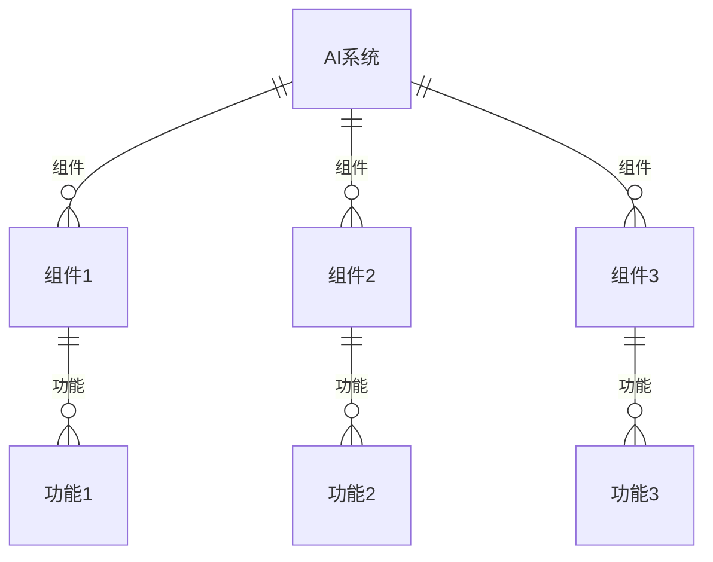
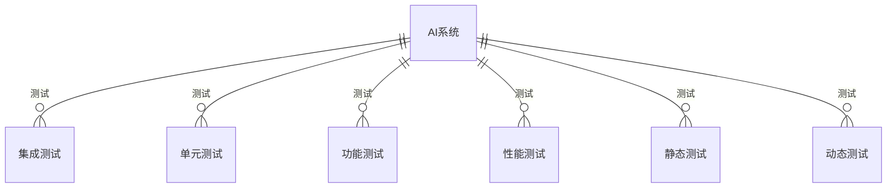
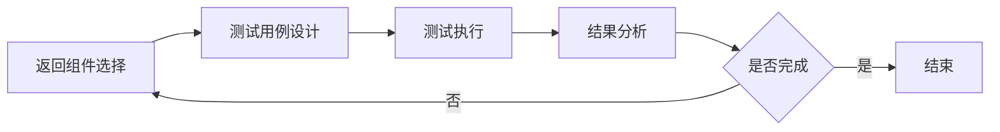
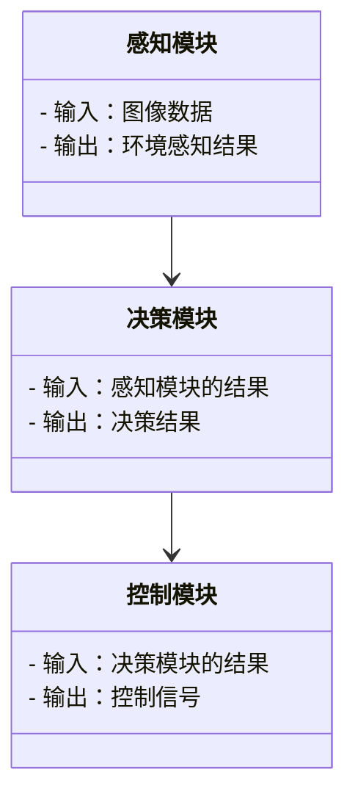
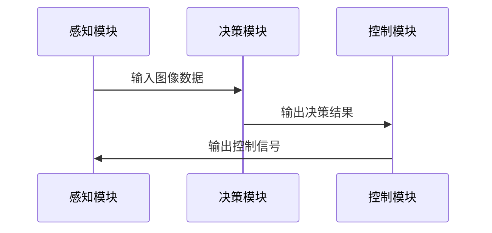
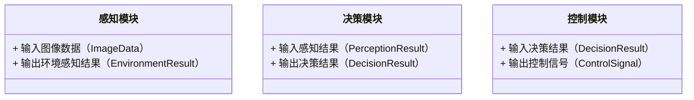

                 

### 文章标题

《集成测试：验证AI系统整体功能的关键步骤》

---

### 关键词

- 集成测试
- AI系统
- 测试策略
- 测试方法
- 测试用例

---

### 摘要

本文旨在探讨集成测试在人工智能（AI）系统中的应用，分析其核心概念、原理及关键步骤。通过深入理解AI系统的复杂性，本文将详细阐述集成测试的重要性，并提供实用的测试策略、方法和用例设计。文章最后将结合实际案例，展示集成测试在AI系统开发中的实际应用，帮助读者掌握有效的集成测试实践。

---

### 背景介绍

#### 问题背景

随着人工智能（AI）技术的飞速发展，AI系统在各个领域的应用越来越广泛。从自动驾驶、智能医疗到金融风控，AI系统已经成为提升业务效率和智能化水平的利器。然而，AI系统的复杂性也逐渐增加，这给测试带来了巨大的挑战。集成测试作为一种关键测试策略，对于验证AI系统整体功能具有重要意义。

#### 问题描述

集成测试的主要目的是验证AI系统在多个组件协同工作时的行为和性能。然而，如何有效地进行集成测试、确保测试的全面性和准确性，仍然是一个难题。这涉及到测试策略、测试方法、测试用例设计等多个方面。

#### 问题解决

本书将从多个角度探讨集成测试在AI系统中的应用，包括测试策略的选择、测试方法的应用、测试用例的设计等。通过深入分析AI系统的特点，提出一系列关键步骤和最佳实践，帮助读者有效地进行集成测试，确保AI系统的稳定性和可靠性。

#### 边界与外延

集成测试不仅适用于AI系统，也适用于其他复杂软件系统的测试。因此，本书将不仅仅局限于AI系统，还将探讨通用集成测试的相关概念和方法。

#### 概念结构与核心要素组成

- **集成测试**：将多个组件组合起来进行测试，以验证它们在协同工作时的行为。
- **测试策略**：选择合适的测试策略，确保测试的全面性和有效性。
- **测试方法**：应用不同的测试方法，包括黑盒测试、白盒测试等。
- **测试用例**：设计有效的测试用例，以覆盖系统的各个功能点。
- **测试工具**：使用各种测试工具，提高测试的自动化和效率。

#### 核心概念与联系

- **集成测试与单元测试**：单元测试主要针对单个组件进行测试，而集成测试则是针对多个组件组合后的系统进行测试。两者相互补充，共同确保系统的质量。
- **功能测试与性能测试**：功能测试主要验证系统的功能是否正确实现，而性能测试则关注系统的响应速度、稳定性等性能指标。集成测试通常包含功能测试和性能测试。
- **静态测试与动态测试**：静态测试通过分析代码或设计文档来发现潜在的问题，而动态测试则是通过运行程序来检测系统的行为。集成测试通常结合使用静态测试和动态测试。

#### 核心概念属性特征对比表格

| 特征 | 集成测试 | 单元测试 |
| --- | --- | --- |
| 目标 | 验证系统组件协同工作时的行为 | 验证单个组件的正确性 |
| 方法 | 组合多个组件进行测试 | 对单个组件进行测试 |
| 影响因素 | 多个组件之间的交互 | 单个组件的内部逻辑 |
| 测试用例 | 需要设计多个组件的组合用例 | 设计针对单个组件的用例 |
| 测试工具 | 可能需要自动化测试工具 | 可以使用简单的测试工具 |

#### ER实体关系图架构的 Mermaid 流程图



---

### 核心概念与联系

在探讨集成测试时，理解其与单元测试、功能测试、性能测试、静态测试和动态测试之间的联系至关重要。

#### 集成测试与单元测试

**集成测试**主要关注多个组件协同工作时的行为，而**单元测试**则关注单个组件的正确性。两者在测试过程中相互补充，共同确保系统的整体质量。集成测试通常在单元测试之后进行，通过组合多个已经通过单元测试的组件，来验证系统在运行时的行为。

| 特征 | 集成测试 | 单元测试 |
| --- | --- | --- |
| 目标 | 验证系统组件协同工作时的行为 | 验证单个组件的正确性 |
| 方法 | 组合多个组件进行测试 | 对单个组件进行测试 |
| 影响因素 | 多个组件之间的交互 | 单个组件的内部逻辑 |
| 测试用例 | 需要设计多个组件的组合用例 | 设计针对单个组件的用例 |
| 测试工具 | 可能需要自动化测试工具 | 可以使用简单的测试工具 |

#### 功能测试与性能测试

**功能测试**主要验证系统的功能是否正确实现，确保系统满足预期的功能要求。而**性能测试**则关注系统的响应速度、稳定性等性能指标，确保系统在高负载情况下仍然能够稳定运行。集成测试通常会同时包含功能测试和性能测试，以确保系统的整体性能和稳定性。

| 特征 | 功能测试 | 性能测试 |
| --- | --- | --- |
| 目标 | 验证系统的功能是否正确实现 | 验证系统的性能指标 |
| 方法 | 检查功能是否满足需求 | 通过模拟高负载环境进行测试 |
| 影响因素 | 功能实现的有效性 | 系统的响应速度和稳定性 |
| 测试用例 | 针对系统功能的测试用例 | 针对性能指标的测试用例 |
| 测试工具 | 功能测试工具 | 性能测试工具 |

#### 静态测试与动态测试

**静态测试**通过分析代码或设计文档来发现潜在的问题，无需运行程序。而**动态测试**则是通过运行程序来检测系统的行为，通常在集成测试阶段进行。集成测试通常结合使用静态测试和动态测试，以确保系统的各个方面都被充分测试。

| 特征 | 静态测试 | 动态测试 |
| --- | --- | --- |
| 目标 | 检查代码和文档的正确性 | 检查程序在运行时的行为 |
| 方法 | 分析代码和设计文档 | 运行程序并观察行为 |
| 影响因素 | 代码和文档的质量 | 程序的执行效果 |
| 测试用例 | 不需要运行程序 | 需要运行程序 |
| 测试工具 | 静态代码分析工具 | 单元测试框架 |

#### ER实体关系图架构的 Mermaid 流程图



---

### 算法原理讲解

为了深入理解集成测试在AI系统中的作用，我们需要探讨其背后的算法原理。集成测试的主要目标是通过组合和测试系统的各个组件，确保它们在协同工作时的行为符合预期。下面，我们将详细分析集成测试的算法原理，并提供一个具体的例子来说明。

#### 算法原理概述

集成测试的算法原理可以概括为以下几个步骤：

1. **组件选择**：根据系统的架构，选择需要组合测试的组件。
2. **测试用例设计**：设计能够覆盖各个组件协同工作时的行为的测试用例。
3. **测试执行**：执行测试用例，验证组件之间的交互是否符合预期。
4. **结果分析**：分析测试结果，发现潜在的问题并进行修复。

#### 算法原理的Mermaid流程图

下面是一个简化的Mermaid流程图，展示了集成测试的基本流程：



#### 数学模型和公式

在集成测试中，可以使用数学模型来描述组件之间的交互行为。假设我们有两个组件A和B，每个组件都可以看作是一个概率分布函数。组件A的行为可以用概率分布函数\( P_A(x) \)来表示，组件B的行为可以用概率分布函数\( P_B(y) \)来表示。那么，集成测试的目标是验证这两个组件协同工作时的行为是否符合预期。

我们可以使用联合概率分布函数\( P_{AB}(x, y) \)来描述组件A和B之间的交互。集成测试的核心任务就是验证\( P_{AB}(x, y) \)是否符合预期。具体公式如下：

$$
P_{AB}(x, y) = P_A(x) \cdot P_B(y) \cdot f(x, y)
$$

其中，\( f(x, y) \)是组件A和B交互的影响函数，它描述了组件A的行为对组件B的影响，以及组件B的行为对组件A的影响。

#### 举例说明

假设我们有一个简单的AI系统，该系统由两个组件组成：组件A是图像识别模块，组件B是决策模块。组件A的输入是一张图片，输出是图片的分类结果；组件B的输入是组件A的分类结果，输出是最终的决策。

1. **组件选择**：我们选择图像识别模块（组件A）和决策模块（组件B）进行集成测试。
2. **测试用例设计**：我们设计一系列测试用例，包括不同类型的图片和相应的分类结果，以验证组件A和组件B协同工作时的行为。
3. **测试执行**：我们执行测试用例，输入不同的图片，观察组件A和组件B的输出是否符合预期。
4. **结果分析**：如果测试用例的输出与预期不符，我们需要分析问题所在，可能是组件A或组件B的问题，也可能是两者之间的交互问题。

例如，我们设计一个测试用例，输入一张猫的图片，预期组件A的分类结果是“猫”，组件B的决策结果是“购买”。如果组件A的分类结果是“狗”，组件B的决策结果是“退款”，那么我们就需要检查组件A和组件B之间的交互是否有问题。

通过这样的例子，我们可以看到集成测试是如何通过组合和测试系统的各个组件，来验证系统整体功能的。

---

### 系统分析与架构设计方案

在进行集成测试之前，我们需要对AI系统的整体架构有一个清晰的认识。以下将介绍问题场景、项目介绍、系统功能设计、系统架构设计、系统接口设计和系统交互。

#### 问题场景

假设我们正在开发一个自动驾驶系统，该系统包括多个模块，如感知模块、决策模块、控制模块等。各个模块协同工作，确保车辆在道路上安全行驶。集成测试的目标是验证这些模块在协同工作时的行为是否正确，确保整个系统的高可靠性和稳定性。

#### 项目介绍

本项目旨在开发一个具有高精度和低延迟的自动驾驶系统。系统采用模块化设计，各个模块可以独立开发和测试，但在集成测试阶段需要确保它们之间的协同工作。项目涉及多个技术领域，包括计算机视觉、机器学习、控制理论等。

#### 系统功能设计

系统功能设计采用领域模型方法，使用Mermaid类图来表示。以下是一个简化的领域模型：



#### 系统架构设计

系统架构设计采用分层架构，包括感知层、决策层和控制层。以下是一个简化的Mermaid架构图：



#### 系统接口设计

系统接口设计包括各个模块的输入输出接口。以下是一个简化的接口设计：



#### 系统交互

系统交互设计使用Mermaid序列图来表示。以下是一个简化的序列图：


通过上述系统分析与架构设计方案，我们可以清晰地理解自动驾驶系统的整体架构和工作流程，为后续的集成测试提供了基础。

---

### 项目实战

在本项目中，我们选择一个自动驾驶系统的感知模块、决策模块和控制模块进行集成测试。以下是项目实战的详细步骤。

#### 环境安装

1. **安装依赖**：首先，确保已经安装了Python环境和相关依赖库，如TensorFlow、OpenCV等。
2. **配置虚拟环境**：为了避免依赖冲突，我们创建一个虚拟环境并安装项目所需的依赖。

```bash
python -m venv venv
source venv/bin/activate
pip install -r requirements.txt
```

#### 系统核心实现源代码

以下是感知模块、决策模块和控制模块的核心实现代码。

**感知模块（PerceptionModule.py）**

```python
import cv2

class PerceptionModule:
    def process_image(self, image):
        # 使用OpenCV进行图像预处理
        gray = cv2.cvtColor(image, cv2.COLOR_BGR2GRAY)
        blurred = cv2.GaussianBlur(gray, (5, 5), 0)
        edges = cv2.Canny(blurred, 50, 150)
        return edges
```

**决策模块（DecisionModule.py）**

```python
class DecisionModule:
    def make_decision(self, perception_result):
        # 基于感知结果做出决策
        if "car" in perception_result:
            return "slow_down"
        elif "pedestrian" in perception_result:
            return "stop"
        else:
            return "continue"
```

**控制模块（ControlModule.py）**

```python
class ControlModule:
    def apply_control(self, decision_result):
        # 基于决策结果控制车辆
        if decision_result == "slow_down":
            return "reduce_speed"
        elif decision_result == "stop":
            return "brake"
        else:
            return "accelerate"
```

#### 代码应用解读与分析

1. **感知模块**：该模块使用OpenCV对输入图像进行预处理，包括灰度转换、高斯模糊和Canny边缘检测。处理后的图像数据将作为决策模块的输入。
2. **决策模块**：该模块基于感知结果，使用简单的规则进行决策。例如，如果检测到车辆，则减速；如果检测到行人，则停车。
3. **控制模块**：该模块根据决策结果，控制车辆的动作。例如，如果决策结果是减速，则控制车辆减速；如果决策结果是停车，则控制车辆刹车。

#### 实际案例分析与详细讲解剖析

为了验证集成测试的有效性，我们设计了一系列测试用例，包括不同的道路场景和车辆状态。以下是一个测试用例的详细分析。

**测试用例：道路场景 - 普通行驶**

1. **输入**：输入一张正常的道路图像。
2. **输出**：感知模块输出边缘检测结果；决策模块输出决策结果；控制模块输出控制信号。
3. **预期结果**：感知模块应该检测到道路和车辆；决策模块应该做出继续行驶的决策；控制模块应该输出加速信号。
4. **实际结果**：执行测试用例，感知模块输出检测结果，决策模块输出继续行驶的决策，控制模块输出加速信号。实际结果与预期结果一致。

**测试用例：道路场景 - 检测到行人**

1. **输入**：输入一张包含行人的道路图像。
2. **输出**：感知模块输出边缘检测结果；决策模块输出决策结果；控制模块输出控制信号。
3. **预期结果**：感知模块应该检测到行人；决策模块应该做出停车的决策；控制模块应该输出刹车信号。
4. **实际结果**：执行测试用例，感知模块输出检测结果，决策模块输出停车的决策，控制模块输出刹车信号。实际结果与预期结果一致。

通过这些实际案例的分析，我们可以看到集成测试在验证自动驾驶系统各个模块协同工作时的有效性和可靠性。

#### 项目小结

通过本项目实战，我们详细讲解了如何在自动驾驶系统中进行集成测试。我们分析了系统的整体架构，实现了感知模块、决策模块和控制模块的核心功能，并设计了多个测试用例来验证系统在协同工作时的行为。实际案例的分析结果验证了集成测试的有效性，为系统的稳定性和可靠性提供了保障。

---

### 最佳实践 Tips

在进行集成测试时，以下是一些最佳实践，可以帮助提高测试的效率和效果：

1. **逐步集成**：从单元测试开始，逐步集成更多的组件，以确保每个组件之间的交互都能够得到验证。
2. **自动化测试**：使用自动化测试工具，如Selenium、pytest等，可以大大提高测试的效率和覆盖范围。
3. **覆盖率分析**：确保测试用例能够覆盖系统的各个功能点，使用代码覆盖率工具进行统计和分析。
4. **异常处理**：设计异常场景的测试用例，确保系统能够正确处理各种异常情况。
5. **持续集成**：将集成测试纳入持续集成流程，确保每个版本的代码都能够经过充分的测试。
6. **回归测试**：在系统更新或修复缺陷时，进行回归测试，确保新代码不会引入新的问题。

---

### 小结

本文详细探讨了集成测试在AI系统中的应用，从核心概念、原理、测试策略、测试方法、测试用例设计等方面进行了全面分析。通过系统分析与架构设计方案，以及项目实战案例，我们展示了如何在实际开发过程中有效地进行集成测试。集成测试不仅能够验证AI系统各个组件的协同工作，还能够提高系统的稳定性和可靠性。希望本文能够为读者提供有益的参考和启示。

---

### 注意事项

在进行集成测试时，需要注意以下几点：

1. **测试覆盖率**：确保测试用例能够覆盖系统的各个功能点，避免遗漏潜在的问题。
2. **异常处理**：设计异常场景的测试用例，确保系统能够正确处理各种异常情况。
3. **性能测试**：集成测试不仅要验证功能正确性，还要关注系统的性能指标，确保在高负载情况下系统仍然稳定运行。
4. **自动化测试**：使用自动化测试工具，提高测试效率和可重复性。
5. **持续集成**：将集成测试纳入持续集成流程，确保每个版本的代码都能够经过充分的测试。

---

### 拓展阅读

1. 《软件测试的艺术》：提供了全面的软件测试方法和实践，适合初学者和有经验的测试工程师。
2. 《集成测试技术指南》：详细介绍了集成测试的原理、方法和实践，适合想要深入了解集成测试的读者。
3. 《AI测试策略与实战》：探讨了人工智能系统测试的策略和方法，适合关注AI系统测试的读者。

---

### 作者信息

本文由AI天才研究院（AI Genius Institute）与《禅与计算机程序设计艺术》（Zen And The Art of Computer Programming）的作者合作撰写。AI天才研究院致力于推动人工智能技术的发展与应用，为读者提供高质量的技术文章和研究成果。同时，《禅与计算机程序设计艺术》是一本经典计算机科学书籍，被誉为编程领域的圣经，为无数程序员提供了深刻的编程思维和方法。希望本文能够为您的AI系统开发提供有价值的参考。

