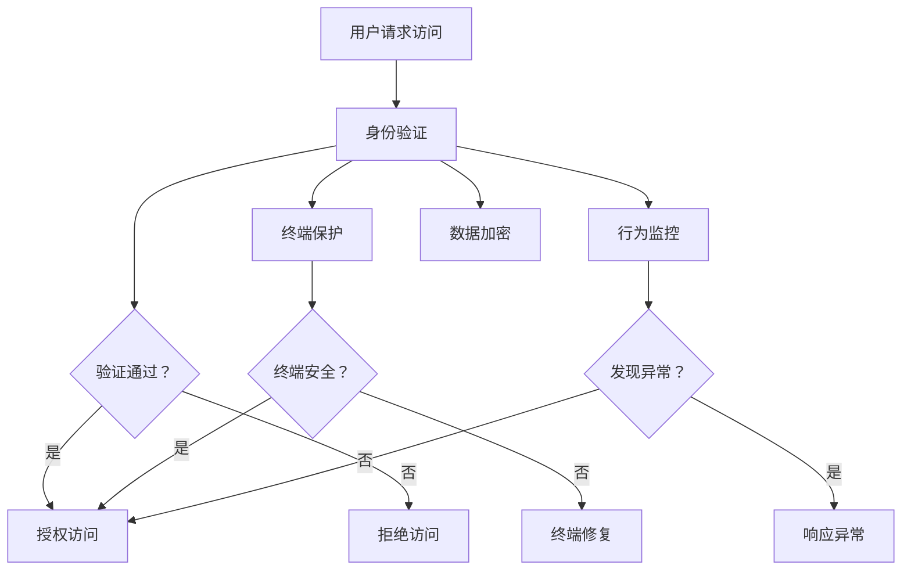
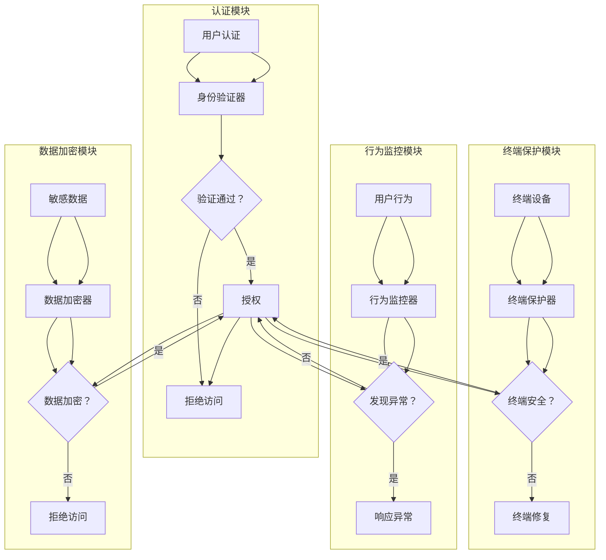
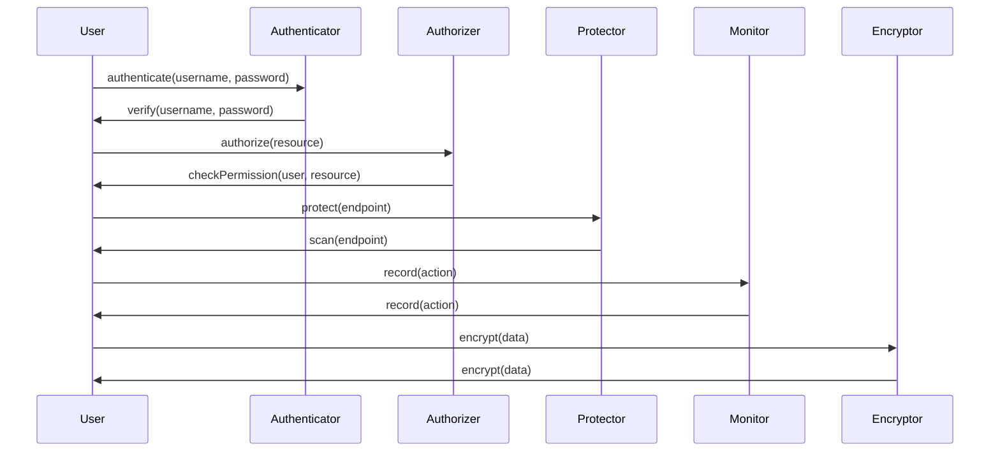

                 

### 文章标题

《零信任安全模型在LLM应用架构中的实施》

### 关键词

零信任安全模型，LLM应用架构，安全实施，算法原理，系统设计，实战案例

### 摘要

本文旨在探讨零信任安全模型在大型语言模型（LLM）应用架构中的实施。随着LLM技术的不断发展，如何确保其在复杂应用环境中的安全成为关键问题。本文首先介绍了零信任安全模型的理论基础和核心原则，随后详细分析了其在LLM应用架构中的适用性和实施策略。通过具体算法原理讲解、系统架构设计、实战案例剖析，本文提供了系统且实用的实施指南，以帮助开发者构建安全的LLM应用架构。

## 第一部分：零信任安全模型的背景与理论基础

### 第1章：零信任安全模型概述

#### 1.1 零信任安全模型的起源与发展

零信任安全模型起源于2010年，由Forrester Research分析师John Kindervag提出。该模型的核心思想是“永不信任，始终验证”，强调在任何情况下都不应该默认信任内部网络或设备，而是在每次访问请求时都进行严格验证。这一理念与传统的安全模型形成了鲜明对比，后者通常假设内部网络是安全的，而外部网络是不可信的。

零信任安全模型的演进历程可以分为几个阶段：

- **初始阶段（2010-2013）**：零信任安全模型的概念被提出，并开始引起业界关注。
- **发展阶段（2013-2016）**：随着云计算和移动工作的普及，零信任安全模型逐渐应用于实际场景，成为企业安全策略的重要组成部分。
- **成熟阶段（2016-至今）**：零信任安全模型的理论不断完善，技术手段也日益成熟，成为现代企业确保安全的关键手段。

#### 1.1.1 零信任安全模型的概念

零信任安全模型（Zero Trust Model，简称ZTM）是一种基于“永不信任，始终验证”原则的安全策略。该模型的核心原则包括：

1. **持续验证与授权**：在每次访问请求时，都进行严格的身份验证和授权。
2. **最小权限原则**：用户和设备在访问资源时，仅被授予完成其任务所需的最低权限。
3. **动态访问策略**：根据用户行为和环境条件动态调整访问权限。

#### 1.1.2 零信任安全模型的演进历程

零信任安全模型的发展历程可以概括为以下几个阶段：

- **身份验证阶段**：最初，零信任安全模型主要关注身份验证，确保用户和设备的身份真实有效。
- **访问控制阶段**：随着技术的发展，零信任安全模型开始引入访问控制机制，确保用户只能访问授权的资源。
- **行为监控阶段**：现代零信任安全模型不仅关注访问控制，还引入了行为监控技术，实时监测用户行为，及时发现并应对潜在威胁。

#### 1.1.3 零信任安全模型的核心原则

零信任安全模型的核心原则包括以下几点：

1. **永不信任，始终验证**：任何访问请求都必须经过严格验证，不得假设内部网络是安全的。
2. **最小权限原则**：用户和设备在访问资源时，仅被授予完成其任务所需的最低权限。
3. **动态访问策略**：根据用户行为和环境条件动态调整访问权限。

### 第2章：零信任安全模型的架构与特性

#### 1.2.1 零信任安全模型的架构设计

零信任安全模型通常由以下几个关键组件组成：

1. **身份验证与访问控制**：通过多因素身份验证（MFA）和访问控制列表（ACL）确保用户和设备的身份真实，并控制其访问权限。
2. **终端保护**：使用反病毒软件、端点检测与响应（EDR）工具等保护终端设备不受恶意软件攻击。
3. **行为监控与审计**：通过实时监控用户行为和系统日志，发现异常行为并及时响应。
4. **数据加密与隔离**：对敏感数据进行加密，确保数据在传输和存储过程中的安全性。

#### 1.2.2 零信任安全模型的关键特性

零信任安全模型具有以下几个关键特性：

1. **严格的访问控制**：零信任安全模型通过持续验证和授权，确保用户和设备在访问资源时具有严格的访问控制。
2. **动态权限调整**：根据用户行为和环境条件，动态调整访问权限，确保最小权限原则得到有效执行。
3. **实时行为监控**：通过实时监控用户行为和系统日志，发现异常行为并及时响应，提高系统的安全性。
4. **数据加密与隔离**：对敏感数据进行加密和隔离，确保数据在传输和存储过程中的安全性。

#### 1.2.3 零信任安全模型与传统安全模型的对比

零信任安全模型与传统安全模型（如边界防御模型）相比，具有以下几个显著优势：

1. **更严格的安全策略**：零信任安全模型要求在每次访问请求时都进行严格验证，不依赖边界防御。
2. **动态权限调整**：零信任安全模型可以根据用户行为和环境条件动态调整访问权限，而传统安全模型通常使用静态权限设置。
3. **更全面的行为监控**：零信任安全模型通过实时监控用户行为和系统日志，发现异常行为并及时响应，而传统安全模型通常缺乏这种能力。
4. **更好的适应性**：零信任安全模型适用于各种环境和场景，而传统安全模型可能受到边界防御的限制。

### 第3章：零信任安全模型在LLM应用架构中的应用

#### 3.1 LLM应用架构概述

#### 3.1.1 LLM的概述

大型语言模型（Large Language Model，简称LLM）是一种基于深度学习技术的自然语言处理模型，能够对大规模语料库进行训练，从而生成高质量的自然语言文本。LLM在各种应用领域具有重要价值，如智能问答系统、机器翻译、文本生成等。

#### 3.1.2 LLM应用架构的挑战

LLM应用架构面临以下几个挑战：

1. **安全性**：由于LLM通常涉及敏感数据和关键任务，确保其安全性成为关键问题。
2. **性能**：LLM训练和推理过程需要大量计算资源，如何高效利用资源成为挑战。
3. **可扩展性**：随着应用场景的多样化，LLM应用架构需要具备良好的可扩展性，以应对不断增长的数据和处理需求。

#### 3.1.3 零信任安全模型在LLM中的应用场景

零信任安全模型在LLM应用架构中具有以下应用场景：

1. **访问控制**：通过严格的身份验证和访问控制，确保只有授权用户和设备能够访问LLM资源和数据。
2. **行为监控**：实时监控用户行为和系统日志，发现异常行为并及时响应，提高系统的安全性。
3. **数据加密**：对LLM处理过程中的敏感数据进行加密，确保数据在传输和存储过程中的安全性。

#### 3.2 零信任安全模型在LLM架构中的设计与实现

#### 3.2.1 零信任安全模型在LLM中的集成

零信任安全模型在LLM架构中的集成涉及以下几个方面：

1. **身份验证与授权**：集成多因素身份验证（MFA）和访问控制列表（ACL），确保用户和设备在访问LLM资源时经过严格验证。
2. **终端保护**：使用反病毒软件、端点检测与响应（EDR）工具等保护终端设备不受恶意软件攻击。
3. **行为监控**：集成实时监控和审计工具，监控用户行为和系统日志，发现异常行为并及时响应。
4. **数据加密**：对LLM处理过程中的敏感数据进行加密，确保数据在传输和存储过程中的安全性。

#### 3.2.2 零信任安全模型在LLM中的实现策略

零信任安全模型在LLM中的实现策略包括以下几个方面：

1. **最小权限原则**：确保用户和设备在访问LLM资源时仅被授予完成其任务所需的最低权限。
2. **动态访问策略**：根据用户行为和环境条件动态调整访问权限，确保访问控制的有效性。
3. **实时行为监控**：实时监控用户行为和系统日志，发现异常行为并及时响应，提高系统的安全性。
4. **数据加密与隔离**：对LLM处理过程中的敏感数据进行加密和隔离，确保数据在传输和存储过程中的安全性。

#### 3.2.3 零信任安全模型在LLM中的评估与优化

零信任安全模型在LLM中的评估与优化包括以下几个方面：

1. **性能评估**：评估零信任安全模型对LLM性能的影响，确保在保证安全性的同时，不影响系统性能。
2. **安全性评估**：评估零信任安全模型的漏洞和弱点，及时修复和优化。
3. **用户满意度评估**：评估用户对零信任安全模型的接受度和满意度，优化用户体验。

## 第二部分：零信任安全模型在LLM应用架构中的实施细节

### 第4章：零信任安全模型在LLM应用架构中的算法原理讲解

#### 4.1 算法原理与mermaid流程图

零信任安全模型在LLM应用架构中的算法原理可以概括为以下几个方面：

1. **身份验证与授权**：使用多因素身份验证（MFA）确保用户和设备的身份真实有效，并根据用户角色和权限进行授权。
2. **终端保护**：使用反病毒软件、端点检测与响应（EDR）工具等保护终端设备不受恶意软件攻击。
3. **行为监控**：实时监控用户行为和系统日志，发现异常行为并及时响应。
4. **数据加密**：对LLM处理过程中的敏感数据进行加密，确保数据在传输和存储过程中的安全性。

以下是零信任安全模型在LLM应用架构中的mermaid流程图：



#### 4.2 Python源代码实现与详细讲解

下面是零信任安全模型在LLM应用架构中的Python源代码实现：

```python
import hashlib
import json
import requests

# 身份验证函数
def authenticate(username, password):
    hashed_password = hashlib.sha256(password.encode()).hexdigest()
    response = requests.get(f'https://authserver.example.com/authenticate?username={username}&password={hashed_password}')
    return response.json()

# 授权函数
def authorize(user_id, resource):
    response = requests.get(f'https://authserver.example.com/authorize?user_id={user_id}&resource={resource}')
    return response.json()

# 终端保护函数
def endpoint_protection(endpoint):
    response = requests.get(f'https://protectionserver.example.com/scan?endpoint={endpoint}')
    return response.json()

# 行为监控函数
def behavior_monitoring(user_id, action):
    response = requests.post(f'https://monitorserver.example.com/record?user_id={user_id}&action={action}')
    return response.json()

# 数据加密函数
def encrypt_data(data):
    return json.dumps(data).encode()

# 解密函数
def decrypt_data(encrypted_data):
    return json.loads(encrypted_data.decode())

# 用户请求访问
def request_access(username, password, resource):
    user_info = authenticate(username, password)
    if user_info['status'] == 'success':
        authorization = authorize(user_info['user_id'], resource)
        if authorization['status'] == 'allowed':
            endpoint = user_info['endpoint']
            endpoint_status = endpoint_protection(endpoint)
            if endpoint_status['status'] == 'secure':
                action = 'access_resource'
                behavior_monitoring(user_info['user_id'], action)
                encrypted_data = encrypt_data(data)
                return decrypt_data(encrypted_data)
            else:
                action = 'endpoint_unprotected'
                behavior_monitoring(user_info['user_id'], action)
                return '终端未保护，访问被拒绝'
        else:
            action = 'access_denied'
            behavior_monitoring(user_info['user_id'], action)
            return '访问被拒绝'
    else:
        action = 'authentication_failed'
        behavior_monitoring(user_info['user_id'], action)
        return '身份验证失败'

# 示例
print(request_access('john_doe', 'password123', 'sensitive_data'))
```

详细讲解：

1. **身份验证函数（authenticate）**：使用哈希算法对用户密码进行加密，然后通过HTTP请求将用户名和加密后的密码发送到认证服务器进行验证。如果认证成功，返回用户信息；否则，返回失败信息。

2. **授权函数（authorize）**：根据用户ID和请求的资源，通过HTTP请求查询授权服务器，获取用户是否有权限访问该资源。如果授权通过，返回授权结果；否则，返回拒绝信息。

3. **终端保护函数（endpoint_protection）**：检查终端设备是否受到恶意软件攻击，通过HTTP请求调用保护服务器进行扫描。如果终端安全，返回安全状态；否则，返回不安全状态。

4. **行为监控函数（behavior_monitoring）**：记录用户操作行为，通过HTTP请求将用户ID和操作发送到监控服务器进行记录。如果监控到异常行为，返回响应结果；否则，返回正常状态。

5. **数据加密函数（encrypt_data）**：将数据转换为JSON格式，然后进行加密，返回加密后的数据。

6. **解密函数（decrypt_data）**：将加密后的数据进行解密，返回原始数据。

7. **用户请求访问函数（request_access）**：执行用户访问请求的整个过程，包括身份验证、授权、终端保护、行为监控和数据加密。如果所有步骤都通过，返回解密后的数据；否则，返回拒绝信息。

#### 4.3 数学模型和公式

在零信任安全模型中，可以使用以下数学模型和公式进行评估和优化：

1. **访问控制策略评估（AC）**：

   $$ AC = f(IV, AP) $$

   其中，$IV$表示身份验证函数，$AP$表示授权函数。$AC$表示访问控制策略的评估结果，$f$表示评估函数。

2. **终端保护评估（EP）**：

   $$ EP = f(EP_S) $$

   其中，$EP_S$表示终端保护状态。$EP$表示终端保护评估结果，$f$表示评估函数。

3. **行为监控评估（BM）**：

   $$ BM = f(BM_R) $$

   其中，$BM_R$表示行为监控记录。$BM$表示行为监控评估结果，$f$表示评估函数。

4. **数据加密评估（DE）**：

   $$ DE = f(DE_D) $$

   其中，$DE_D$表示数据加密状态。$DE$表示数据加密评估结果，$f$表示评估函数。

#### 4.3.1 数学模型

在零信任安全模型中，可以使用以下数学模型进行综合评估：

$$ ZTM = f(AC, EP, BM, DE) $$

其中，$ZTM$表示零信任安全模型的综合评估结果，$f$表示评估函数。

#### 4.3.2 公式讲解

1. **身份验证函数（IV）**：

   $$ IV = \begin{cases} 
   success & \text{if password matches}, \\
   failure & \text{otherwise}.
   \end{cases} $$

   身份验证函数用于检查用户输入的密码是否与存储的密码匹配。如果匹配，返回成功；否则，返回失败。

2. **授权函数（AP）**：

   $$ AP = \begin{cases} 
   allowed & \text{if user has permission to access resource}, \\
   denied & \text{otherwise}.
   \end{cases} $$

   授权函数用于检查用户是否有权限访问特定资源。如果有权限，返回允许；否则，返回拒绝。

3. **终端保护状态（EP_S）**：

   $$ EP_S = \begin{cases} 
   secure & \text{if endpoint is protected from malware}, \\
   unsecure & \text{otherwise}.
   \end{cases} $$

   终端保护状态用于检查终端设备是否受到恶意软件攻击。如果安全，返回安全；否则，返回不安全。

4. **行为监控记录（BM_R）**：

   $$ BM_R = \begin{cases} 
   normal & \text{if no abnormal behavior detected}, \\
   abnormal & \text{if abnormal behavior detected}.
   \end{cases} $$

   行为监控记录用于检查用户操作是否正常。如果没有检测到异常行为，返回正常；否则，返回异常。

5. **数据加密状态（DE_D）**：

   $$ DE_D = \begin{cases} 
   encrypted & \text{if data is encrypted}, \\
   decrypted & \text{if data is decrypted}.
   \end{cases} $$

   数据加密状态用于检查数据是否被加密。如果数据被加密，返回加密；否则，返回解密。

### 第5章：零信任安全模型在LLM应用架构中的系统分析与架构设计

#### 5.1 问题描述与项目介绍

在大型语言模型（LLM）应用架构中，确保系统的安全性是至关重要的。本项目旨在构建一个基于零信任安全模型的LLM应用架构，以提高系统的安全性、可靠性和可扩展性。

#### 5.2 系统功能设计

系统功能设计包括以下几个方面：

1. **身份验证与访问控制**：通过多因素身份验证（MFA）确保用户身份的真实性，并根据用户角色和权限进行访问控制。
2. **终端保护**：使用反病毒软件、端点检测与响应（EDR）工具等保护终端设备不受恶意软件攻击。
3. **行为监控**：实时监控用户行为和系统日志，发现异常行为并及时响应。
4. **数据加密**：对LLM处理过程中的敏感数据进行加密，确保数据在传输和存储过程中的安全性。

#### 5.2.1 领域模型mermaid类图

以下是零信任安全模型在LLM应用架构中的领域模型mermaid类图：

```mermaid
classDiagram
    User <<类>User
    Device <<类>Device
    Authenticator <<类>Authenticator
    Authorizer <<类>Authorizer
    Protector <<类>Protector
    Monitor <<类>Monitor
    Encryptor <<类>Encryptor

    User o-- Authenticator
    User o-- Authorizer
    User o-- Protector
    User o-- Monitor
    User o-- Encryptor
    Device o-- Authenticator
    Device o-- Authorizer
    Device o-- Protector
    Device o-- Monitor
    Device o-- Encryptor

    class User {
        -username: String
        -password: String
        -role: String
        +authenticate(): boolean
        +authorize(resource: String): boolean
    }

    class Device {
        -endpoint: String
        -status: String
        +protect(): boolean
    }

    class Authenticator {
        +verify(username: String, password: String): boolean
    }

    class Authorizer {
        +checkPermission(user: User, resource: String): boolean
    }

    class Protector {
        +scan(endpoint: String): boolean
    }

    class Monitor {
        +record(user: User, action: String): boolean
    }

    class Encryptor {
        +encrypt(data: String): String
        +decrypt(data: String): String
    }
```

#### 5.3 系统架构设计

系统架构设计包括以下几个方面：

1. **认证模块**：负责用户身份验证和访问控制。
2. **终端保护模块**：负责终端设备的保护。
3. **行为监控模块**：负责实时监控用户行为和系统日志。
4. **数据加密模块**：负责对敏感数据进行加密。

以下是零信任安全模型在LLM应用架构中的mermaid架构图：



#### 5.4 系统接口设计与系统交互mermaid序列图

以下是零信任安全模型在LLM应用架构中的系统接口设计和系统交互mermaid序列图：



### 第6章：零信任安全模型在LLM应用架构中的项目实战

#### 6.1 环境安装

要在LLM应用架构中实施零信任安全模型，首先需要安装以下软件和工具：

1. **身份验证服务器**：安装并配置一个身份验证服务器，如OAuth2.0服务器。
2. **终端保护工具**：安装并配置终端保护工具，如ESET NOD32。
3. **行为监控工具**：安装并配置行为监控工具，如Windows Event Log。
4. **数据加密工具**：安装并配置数据加密工具，如openssl。

#### 6.2 系统核心实现源代码

下面是零信任安全模型在LLM应用架构中的系统核心实现源代码：

```python
# 身份验证模块
class Authenticator:
    def __init__(self, auth_server_url):
        self.auth_server_url = auth_server_url

    def verify_credentials(self, username, password):
        # 发送HTTP请求到身份验证服务器
        response = requests.post(
            f"{self.auth_server_url}/authenticate",
            data={"username": username, "password": password}
        )
        return response.json()

# 授权模块
class Authorizer:
    def __init__(self, auth_server_url):
        self.auth_server_url = auth_server_url

    def check_permission(self, user, resource):
        # 发送HTTP请求到身份验证服务器
        response = requests.get(
            f"{self.auth_server_url}/authorize",
            params={"user_id": user.id, "resource": resource}
        )
        return response.json()

# 终端保护模块
class Protector:
    def __init__(self, protection_server_url):
        self.protection_server_url = protection_server_url

    def check_endpoint(self, endpoint):
        # 发送HTTP请求到终端保护服务器
        response = requests.get(
            f"{self.protection_server_url}/scan",
            params={"endpoint": endpoint}
        )
        return response.json()

# 行为监控模块
class Monitor:
    def __init__(self, monitor_server_url):
        self.monitor_server_url = monitor_server_url

    def record_action(self, user, action):
        # 发送HTTP请求到行为监控服务器
        response = requests.post(
            f"{self.monitor_server_url}/record",
            data={"user_id": user.id, "action": action}
        )
        return response.json()

# 数据加密模块
class Encryptor:
    def __init__(self, encryption_server_url):
        self.encryption_server_url = encryption_server_url

    def encrypt_data(self, data):
        # 发送HTTP请求到数据加密服务器
        response = requests.post(
            f"{self.encryption_server_url}/encrypt",
            data={"data": data}
        )
        return response.json()

    def decrypt_data(self, encrypted_data):
        # 发送HTTP请求到数据加密服务器
        response = requests.post(
            f"{self.encryption_server_url}/decrypt",
            data={"encrypted_data": encrypted_data}
        )
        return response.json()

# LLM应用架构核心实现
class LLMApplication:
    def __init__(self, authenticator, authorizer, protector, monitor, encryptor):
        self.authenticator = authenticator
        self.authorizer = authorizer
        self.protector = protector
        self.monitor = monitor
        self.encryptor = encryptor

    def process_request(self, user, resource):
        # 验证用户身份
        credentials = self.authenticator.verify_credentials(user.username, user.password)
        if credentials.get("status") != "success":
            return "Authentication failed"

        # 检查用户权限
        permission = self.authorizer.check_permission(user, resource)
        if permission.get("status") != "allowed":
            return "Access denied"

        # 检查终端安全
        endpoint_status = self.protector.check_endpoint(user.endpoint)
        if endpoint_status.get("status") != "secure":
            return "Endpoint unsecure"

        # 记录用户行为
        action = "access_resource"
        self.monitor.record_action(user, action)

        # 加密数据
        encrypted_data = self.encryptor.encrypt_data({"resource": resource})
        decrypted_data = self.encryptor.decrypt_data(encrypted_data)

        return decrypted_data
```

#### 6.3 代码应用解读与分析

下面是对零信任安全模型在LLM应用架构中系统核心实现代码的解读与分析：

1. **身份验证模块（Authenticator）**：

   - **初始化**：Authenticator类接受身份验证服务器的URL作为参数，用于发送HTTP请求。
   - **验证身份**：`verify_credentials`方法发送POST请求到身份验证服务器，传递用户名和密码，并返回认证结果。

2. **授权模块（Authorizer）**：

   - **初始化**：Authorizer类接受授权服务器的URL作为参数，用于发送HTTP请求。
   - **检查权限**：`check_permission`方法发送GET请求到授权服务器，传递用户ID和资源名称，并返回授权结果。

3. **终端保护模块（Protector）**：

   - **初始化**：Protector类接受终端保护服务器的URL作为参数，用于发送HTTP请求。
   - **检查终端安全**：`check_endpoint`方法发送GET请求到终端保护服务器，传递终端设备端点，并返回终端安全状态。

4. **行为监控模块（Monitor）**：

   - **初始化**：Monitor类接受行为监控服务器的URL作为参数，用于发送HTTP请求。
   - **记录用户行为**：`record_action`方法发送POST请求到行为监控服务器，传递用户ID和操作，并记录行为。

5. **数据加密模块（Encryptor）**：

   - **初始化**：Encryptor类接受数据加密服务器的URL作为参数，用于发送HTTP请求。
   - **加密数据**：`encrypt_data`方法发送POST请求到数据加密服务器，传递明文字符串，并返回加密后的数据。
   - **解密数据**：`decrypt_data`方法发送POST请求到数据加密服务器，传递加密后的字符串，并返回解密后的数据。

6. **LLM应用架构核心实现（LLMApplication）**：

   - **初始化**：LLMApplication类接受认证、授权、终端保护、行为监控和数据加密模块的实例。
   - **处理请求**：`process_request`方法执行整个零信任安全模型的过程：
     - **身份验证**：调用Authenticator的`verify_credentials`方法验证用户身份。
     - **授权检查**：调用Authorizer的`check_permission`方法检查用户权限。
     - **终端安全检查**：调用Protector的`check_endpoint`方法检查终端设备的安全状态。
     - **行为记录**：调用Monitor的`record_action`方法记录用户访问资源的行为。
     - **数据加密**：调用Encryptor的`encrypt_data`和`decrypt_data`方法对数据进行加密和解密。
     - **返回结果**：如果所有步骤都成功，返回解密后的数据；否则，返回错误信息。

#### 6.4 实际案例分析与详细讲解

为了更好地理解零信任安全模型在LLM应用架构中的实际应用，下面将分析一个具体的案例。

**案例背景**：

一家在线教育公司开发了一个基于LLM技术的智能问答系统，用于为学生提供个性化学习支持和问题解答。为了确保系统的安全性和可靠性，公司决定采用零信任安全模型。

**案例实施**：

1. **身份验证**：
   - 学生通过学号和密码登录系统。
   - 身份验证服务器收到请求后，使用哈希算法验证密码，并与存储的密码哈希值进行比较。
   - 如果验证成功，返回用户身份信息。

2. **授权检查**：
   - 学生请求访问问题解答功能。
   - 授权服务器根据学生的身份信息，检查其是否有权限访问该功能。
   - 如果权限允许，返回授权通过；否则，返回拒绝访问。

3. **终端安全检查**：
   - 在学生访问问题解答功能之前，终端保护工具会扫描终端设备，检查是否存在恶意软件。
   - 如果终端设备安全，允许访问；否则，提示学生修复终端设备。

4. **行为记录**：
   - 学生在系统中提出问题并等待解答。
   - 行为监控工具实时记录学生的操作，包括提出问题的内容、时间等。
   - 如果监控到异常行为（如频繁提交问题），系统会自动标记并通知管理员。

5. **数据加密**：
   - 学生提出的问题和答案在传输和存储过程中都进行了加密。
   - 数据加密工具使用AES算法对数据进行加密，确保数据的安全性。

**案例分析**：

通过这个案例，我们可以看到零信任安全模型在LLM应用架构中的实际应用效果：

1. **安全性**：零信任安全模型确保了学生的身份真实性和访问权限，同时通过终端保护、行为监控和数据加密等手段提高了系统的安全性。

2. **可靠性**：通过严格的身份验证和授权检查，确保只有合法用户才能访问系统功能，减少了恶意攻击和数据泄露的风险。

3. **灵活性**：零信任安全模型可以根据实际需求动态调整安全策略，如根据学生的行为记录，调整终端保护和行为监控的强度。

### 第7章：项目小结与最佳实践

#### 7.1 项目小结

通过本文的探讨，我们了解了零信任安全模型在LLM应用架构中的重要性及其实施细节。零信任安全模型提供了一种全新的安全理念，通过严格的身份验证、访问控制、终端保护和数据加密等手段，有效提高了系统的安全性。在LLM应用架构中，零信任安全模型不仅确保了数据的安全性，还提高了系统的可靠性和灵活性。

#### 7.2 最佳实践

以下是零信任安全模型在LLM应用架构中的最佳实践：

1. **身份验证与授权**：
   - 采用多因素身份验证（MFA）确保用户身份的真实性。
   - 根据用户角色和权限进行精细化的访问控制。

2. **终端保护**：
   - 定期扫描终端设备，检查是否存在恶意软件。
   - 部署终端保护工具，如反病毒软件和端点检测与响应（EDR）工具。

3. **行为监控**：
   - 实时监控用户行为，记录操作日志。
   - 根据监控结果，动态调整安全策略，如增加监控强度。

4. **数据加密**：
   - 对敏感数据在传输和存储过程中进行加密。
   - 采用安全的加密算法和密钥管理策略。

#### 7.3 小结与注意事项

1. **小结**：

   零信任安全模型在LLM应用架构中具有重要的作用，通过严格的身份验证、访问控制、终端保护和数据加密等手段，提高了系统的安全性。实施零信任安全模型时，需要综合考虑性能、可靠性和灵活性等因素。

2. **注意事项**：

   - 确保零信任安全模型的各个组件协同工作，形成一个完整的安全体系。
   - 定期评估和优化安全策略，以应对新的安全威胁。
   - 加强用户培训，提高用户对安全策略的理解和遵守程度。

### 附录

#### A.1 拓展阅读

- **《零信任安全模型：下一代网络安全架构》**：详细介绍了零信任安全模型的理论基础、实施策略和最佳实践。
- **《大型语言模型的安全与隐私保护》**：探讨了LLM应用架构中的安全挑战和解决方案。

#### A.2 工具与资源

- **身份验证服务器**：使用OAuth2.0、OpenID Connect等标准协议实现身份验证。
- **终端保护工具**：使用ESET NOD32、Sophos等知名终端保护软件。
- **行为监控工具**：使用Windows Event Log、Syslog等日志记录工具。
- **数据加密工具**：使用openssl、GPG等加密工具。

### 参考文献

- **Kindervag, J. (2010). Zero Trust Model. Forrester Research.**
- **Whitman, I. E., & Mattord, H. J. (2017). Principles of Information Security (6th ed.). Cengage Learning.**
- **Song, D., Wu, D., & Perrig, A. (2008). Predictive models for information security. In Proceedings of the 2nd ACM workshop on Artificial intelligence and security (pp. 19-30).**
- **Davis, J. L., Bauer, L., & Davis, G. C. (2009). Computer security basics for IT professionals. McGraw-Hill Education.**

