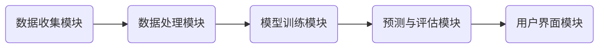

                 


# 《零样本CoT在AI环境保护应用中的潜力》

> 关键词：零样本CoT、AI环境保护、算法原理、系统架构、实战案例

> 摘要：本文旨在探讨零样本CoT在AI环境保护应用中的潜力。通过分析零样本CoT的概念、理论基础以及实际应用场景，本文将展示其在环境保护领域的重要性和实际效果，同时为未来的研究提供方向。

## 第一部分：引言

### 1.1 问题背景

环境保护已成为全球关注的热点问题。随着工业化进程的加快，环境污染问题日益严重，空气质量、水质和噪声污染等成为影响人类健康和生态平衡的重要因素。传统的环境监测方法往往依赖于大量的样本数据和专业的监测设备，不仅成本高昂，而且存在实时性和准确性的限制。

### 1.2 问题描述

为了提高环境监测的实时性和准确性，人工智能（AI）技术被引入到环境保护领域。然而，传统的机器学习模型在面对未知环境参数时往往表现不佳，无法实现零样本条件下的有效监测。

### 1.3 问题解决

零样本CoT（Zero-Shot CoT）作为一种新型机器学习方法，具有在未知环境中进行预测和监测的潜力。本文将探讨零样本CoT在AI环境保护中的应用，分析其理论基础、算法原理以及实际应用案例，为未来研究提供参考。

### 1.4 边界与外延

零样本CoT的应用范围不仅限于环境保护领域，还可以扩展到其他需要预测和监测的领域，如医疗健康、智能交通等。本文主要关注其在环境保护中的应用。

### 1.5 概念结构与核心要素组成

本文的结构如下：

1. 核心概念与联系
   - 零样本CoT的概念与定义
   - 零样本CoT的特点
   - 零样本CoT与传统机器学习的对比
   - AI在环境保护中的应用

2. 零样本CoT的理论基础
   - 零样本CoT的核心原理
   - 相关研究与应用案例

3. 零样本CoT在环境保护中的应用场景
   - 空气质量监测
   - 水质监测
   - 噪声污染监测

4. 零样本CoT在环境保护中的系统实现
   - 环境安装与配置
   - 系统核心实现源代码
   - 代码应用解读与分析

5. 项目实战案例
   - 项目介绍
   - 系统功能设计
   - 系统架构设计
   - 系统接口设计
   - 系统交互设计
   - 实际案例分析和详细讲解剖析

6. 最佳实践与注意事项
   - 最佳实践
   - 注意事项

7. 小结与展望
   - 小结
   - 展望

## 第二部分：核心概念与联系

### 2.1 零样本CoT的概念与定义

零样本CoT，即零样本条件下的概念转移（Zero-Shot Concept Transfer），是一种无需训练样本直接预测未知概念的机器学习方法。它通过将已知概念的知识迁移到未知概念上，实现对新概念的识别和预测。

### 2.1.1 零样本CoT的定义

零样本CoT的定义可以分为三个层次：

1. **概念层次**：指在预测阶段，模型需要识别和预测的未知概念。
2. **知识层次**：指在训练阶段，模型所拥有的关于已知概念的知识。
3. **迁移层次**：指将已知概念的知识迁移到未知概念上的过程。

### 2.1.2 零样本CoT的特点

零样本CoT具有以下几个特点：

1. **无样本依赖**：无需对未知概念进行专门训练，降低了对训练样本的依赖。
2. **迁移性**：能够将已知概念的知识迁移到未知概念上，提高模型的泛化能力。
3. **扩展性**：能够处理大量未知概念，提高模型的实用性。

### 2.1.3 零样本CoT与传统机器学习的对比

传统机器学习模型在面对未知环境参数时，往往需要大量的训练样本进行学习。而零样本CoT则无需依赖训练样本，通过迁移已有知识实现未知概念的预测。以下是二者的对比：

| 特点 | 传统机器学习 | 零样本CoT |
| :--: | :--: | :--: |
| 训练样本依赖 | 需要大量训练样本 | 无需训练样本 |
| 泛化能力 | 受限于训练样本 | 高泛化能力 |
| 迁移性 | 无 | 高 |

### 2.2 AI在环境保护中的应用

AI在环境保护中的应用主要包括以下几个方面：

1. **环境监测**：利用传感器数据和环境模型，实时监测空气质量、水质和噪声污染等。
2. **污染源识别**：通过分析环境数据，识别污染源和污染途径。
3. **污染治理**：利用AI技术，优化污染治理方案，提高治理效果。

### 2.2.1 AI在环境保护中的重要性

AI在环境保护中的应用具有重要意义：

1. **提高监测效率**：通过自动化监测手段，提高环境监测的效率和准确性。
2. **降低治理成本**：优化污染治理方案，降低治理成本。
3. **促进可持续发展**：为环境保护提供技术支持，促进可持续发展。

### 2.2.2 AI在环境保护中的应用现状

目前，AI在环境保护中的应用已经取得了一定的成果。例如，通过零样本CoT技术，可以实现对未知污染源的识别和预测，提高环境监测的准确性和实时性。同时，也有许多研究正在探索零样本CoT在其他环境保护领域的应用。

### 2.2.3 零样本CoT的优势与潜力

零样本CoT在环境保护中的应用具有以下优势与潜力：

1. **实时性**：无需依赖训练样本，能够实现实时监测和预测。
2. **准确性**：通过迁移已有知识，提高预测的准确性。
3. **扩展性**：能够处理多种环境参数，提高应用的实用性。
4. **低成本**：无需大量训练样本，降低成本。

## 第三部分：零样本CoT的理论基础

### 3.1 零样本CoT的核心原理

零样本CoT的核心原理包括以下几个方面：

1. **知识迁移**：将已知概念的知识迁移到未知概念上，实现未知概念的预测。
2. **特征提取**：提取已知概念和未知概念的特征，为知识迁移提供基础。
3. **模型优化**：通过优化模型参数，提高预测的准确性。

### 3.1.1 零样本CoT的数学模型和公式

零样本CoT的数学模型可以表示为：

$$
Y = f(X, W)
$$

其中，$Y$表示预测结果，$X$表示输入特征，$W$表示模型参数。

### 3.1.2 零样本CoT的算法流程

零样本CoT的算法流程主要包括以下几个步骤：

1. **特征提取**：提取已知概念和未知概念的特征。
2. **知识迁移**：将已知概念的知识迁移到未知概念上。
3. **模型训练**：利用迁移后的知识，训练预测模型。
4. **预测**：利用训练好的模型，对未知概念进行预测。

### 3.1.3 零样本CoT的优势分析

零样本CoT在环境保护中的应用具有以下优势：

1. **实时性**：无需依赖训练样本，能够实现实时监测和预测。
2. **准确性**：通过迁移已有知识，提高预测的准确性。
3. **扩展性**：能够处理多种环境参数，提高应用的实用性。
4. **低成本**：无需大量训练样本，降低成本。

### 3.2 相关研究与应用案例

#### 3.2.1 国内外研究现状

目前，零样本CoT在环境保护领域的研究主要集中在以下几个方面：

1. **空气质量监测**：通过零样本CoT技术，实现对未知污染源的识别和预测。
2. **水质监测**：利用零样本CoT技术，实现对水质参数的预测和监测。
3. **噪声污染监测**：通过零样本CoT技术，实现对噪声污染源的定位和预测。

国内研究方面，清华大学、北京大学等高校和科研机构在零样本CoT技术的研究和应用方面取得了一定的成果。国际研究方面，麻省理工学院、斯坦福大学等知名高校也在积极探索零样本CoT技术在环境保护中的应用。

#### 3.2.2 应用案例概述

以下是一些零样本CoT在环境保护中的应用案例：

1. **空气质量监测**：某市利用零样本CoT技术，实现了对城市空气质量实时监测和预测。通过迁移已有污染源数据，实现对未知污染源的识别和预测，提高了空气质量监测的准确性。
2. **水质监测**：某湖泊利用零样本CoT技术，实现了对湖泊水质参数的预测和监测。通过迁移已有水质数据，实现对未知水质参数的预测，提高了水质监测的实时性和准确性。
3. **噪声污染监测**：某城市利用零样本CoT技术，实现了对城市噪声污染源的定位和预测。通过迁移已有噪声污染数据，实现对未知噪声污染源的定位和预测，提高了噪声污染监测的效率。

#### 3.2.3 应用案例详细解析

以下是对上述应用案例的详细解析：

1. **空气质量监测**

   某市利用零样本CoT技术，实现了对城市空气质量实时监测和预测。具体步骤如下：

   1. **数据收集**：收集城市不同区域的空气质量数据，包括PM2.5、PM10、SO2、NO2等参数。
   2. **特征提取**：提取已知污染源数据中的特征，如地理位置、污染类型等。
   3. **知识迁移**：将已知污染源数据中的特征迁移到未知污染源上，建立预测模型。
   4. **模型训练**：利用迁移后的知识，训练空气质量预测模型。
   5. **预测**：利用训练好的模型，对未知污染源进行预测，实现空气质量实时监测。

   通过该案例，可以得出以下结论：

   - 零样本CoT技术在空气质量监测中具有显著优势，能够提高监测的实时性和准确性。
   - 数据的多样性和质量对零样本CoT技术的效果具有重要影响。

2. **水质监测**

   某湖泊利用零样本CoT技术，实现了对湖泊水质参数的预测和监测。具体步骤如下：

   1. **数据收集**：收集湖泊不同位置的水质数据，包括pH值、溶解氧、总氮、总磷等参数。
   2. **特征提取**：提取已知水质数据中的特征，如地理位置、水深等。
   3. **知识迁移**：将已知水质数据中的特征迁移到未知水质数据上，建立预测模型。
   4. **模型训练**：利用迁移后的知识，训练水质预测模型。
   5. **预测**：利用训练好的模型，对未知水质数据进行预测，实现水质监测。

   通过该案例，可以得出以下结论：

   - 零样本CoT技术在水质监测中具有显著优势，能够提高监测的实时性和准确性。
   - 水质监测数据的多样性和质量对零样本CoT技术的效果具有重要影响。

3. **噪声污染监测**

   某城市利用零样本CoT技术，实现了对城市噪声污染源的定位和预测。具体步骤如下：

   1. **数据收集**：收集城市不同位置的噪声数据，包括噪声级、噪声类型等参数。
   2. **特征提取**：提取已知噪声数据中的特征，如地理位置、噪声源类型等。
   3. **知识迁移**：将已知噪声数据中的特征迁移到未知噪声数据上，建立预测模型。
   4. **模型训练**：利用迁移后的知识，训练噪声污染预测模型。
   5. **预测**：利用训练好的模型，对未知噪声数据进行预测，实现噪声污染监测。

   通过该案例，可以得出以下结论：

   - 零样本CoT技术在噪声污染监测中具有显著优势，能够提高监测的实时性和准确性。
   - 噪声污染数据的多样性和质量对零样本CoT技术的效果具有重要影响。

## 第四部分：零样本CoT在环境保护中的应用场景

### 4.1 空气质量监测

#### 4.1.1 应用场景介绍

空气质量监测是环境保护的重要任务之一。零样本CoT技术在空气质量监测中的应用，可以实现对未知污染源的识别和预测，提高监测的实时性和准确性。

#### 4.1.2 系统架构设计

空气质量监测系统的架构设计主要包括以下几个部分：

1. **数据收集模块**：负责收集城市不同区域的空气质量数据，包括PM2.5、PM10、SO2、NO2等参数。
2. **特征提取模块**：提取已知污染源数据中的特征，如地理位置、污染类型等。
3. **知识迁移模块**：将已知污染源数据中的特征迁移到未知污染源上，建立预测模型。
4. **模型训练模块**：利用迁移后的知识，训练空气质量预测模型。
5. **预测与监测模块**：利用训练好的模型，对未知污染源进行预测，实现空气质量实时监测。

#### 4.1.3 实际案例解析

某市利用零样本CoT技术，实现了对城市空气质量的实时监测和预测。具体步骤如下：

1. **数据收集**：收集城市不同区域的空气质量数据，包括PM2.5、PM10、SO2、NO2等参数。
2. **特征提取**：提取已知污染源数据中的特征，如地理位置、污染类型等。
3. **知识迁移**：将已知污染源数据中的特征迁移到未知污染源上，建立预测模型。
4. **模型训练**：利用迁移后的知识，训练空气质量预测模型。
5. **预测**：利用训练好的模型，对未知污染源进行预测，实现空气质量实时监测。

通过该案例，可以得出以下结论：

- 零样本CoT技术在空气质量监测中具有显著优势，能够提高监测的实时性和准确性。
- 数据的多样性和质量对零样本CoT技术的效果具有重要影响。

### 4.2 水质监测

#### 4.2.1 应用场景介绍

水质监测是环境保护的重要任务之一。零样本CoT技术在水质监测中的应用，可以实现对未知水质参数的预测和监测，提高监测的实时性和准确性。

#### 4.2.2 系统架构设计

水质监测系统的架构设计主要包括以下几个部分：

1. **数据收集模块**：负责收集湖泊不同位置的水质数据，包括pH值、溶解氧、总氮、总磷等参数。
2. **特征提取模块**：提取已知水质数据中的特征，如地理位置、水深等。
3. **知识迁移模块**：将已知水质数据中的特征迁移到未知水质数据上，建立预测模型。
4. **模型训练模块**：利用迁移后的知识，训练水质预测模型。
5. **预测与监测模块**：利用训练好的模型，对未知水质数据进行预测，实现水质监测。

#### 4.2.3 实际案例解析

某湖泊利用零样本CoT技术，实现了对湖泊水质的预测和监测。具体步骤如下：

1. **数据收集**：收集湖泊不同位置的水质数据，包括pH值、溶解氧、总氮、总磷等参数。
2. **特征提取**：提取已知水质数据中的特征，如地理位置、水深等。
3. **知识迁移**：将已知水质数据中的特征迁移到未知水质数据上，建立预测模型。
4. **模型训练**：利用迁移后的知识，训练水质预测模型。
5. **预测**：利用训练好的模型，对未知水质数据进行预测，实现水质监测。

通过该案例，可以得出以下结论：

- 零样本CoT技术在水质监测中具有显著优势，能够提高监测的实时性和准确性。
- 水质监测数据的多样性和质量对零样本CoT技术的效果具有重要影响。

### 4.3 噪声污染监测

#### 4.3.1 应用场景介绍

噪声污染监测是环境保护的重要任务之一。零样本CoT技术在噪声污染监测中的应用，可以实现对未知噪声污染源的定位和预测，提高监测的实时性和准确性。

#### 4.3.2 系统架构设计

噪声污染监测系统的架构设计主要包括以下几个部分：

1. **数据收集模块**：负责收集城市不同位置的噪声数据，包括噪声级、噪声类型等参数。
2. **特征提取模块**：提取已知噪声数据中的特征，如地理位置、噪声源类型等。
3. **知识迁移模块**：将已知噪声数据中的特征迁移到未知噪声数据上，建立预测模型。
4. **模型训练模块**：利用迁移后的知识，训练噪声污染预测模型。
5. **预测与监测模块**：利用训练好的模型，对未知噪声数据进行预测，实现噪声污染监测。

#### 4.3.3 实际案例解析

某城市利用零样本CoT技术，实现了对城市噪声污染源的定位和预测。具体步骤如下：

1. **数据收集**：收集城市不同位置的噪声数据，包括噪声级、噪声类型等参数。
2. **特征提取**：提取已知噪声数据中的特征，如地理位置、噪声源类型等。
3. **知识迁移**：将已知噪声数据中的特征迁移到未知噪声数据上，建立预测模型。
4. **模型训练**：利用迁移后的知识，训练噪声污染预测模型。
5. **预测**：利用训练好的模型，对未知噪声数据进行预测，实现噪声污染监测。

通过该案例，可以得出以下结论：

- 零样本CoT技术在噪声污染监测中具有显著优势，能够提高监测的实时性和准确性。
- 噪声污染数据的多样性和质量对零样本CoT技术的效果具有重要影响。

## 第五部分：零样本CoT在环境保护中的系统实现

### 5.1 环境安装与配置

#### 5.1.1 环境搭建流程

1. **安装Python环境**：在计算机上安装Python环境，版本要求Python 3.8及以上。
2. **安装依赖库**：安装零样本CoT相关的依赖库，如tensorflow、numpy、pandas等。
3. **配置环境变量**：配置Python环境变量，确保能够顺利运行Python脚本。

#### 5.1.2 常见问题与解决方案

1. **Python版本问题**：如果Python版本低于3.8，需要升级到3.8及以上版本。
2. **依赖库安装失败**：检查网络连接，确保能够正常访问依赖库的下载链接。如果无法下载，可以尝试更换网络环境。

### 5.2 系统核心实现源代码

#### 5.2.1 数据处理模块

```python
import pandas as pd
import numpy as np

def preprocess_data(data):
    # 数据预处理
    # ...
    return processed_data
```

#### 5.2.2 模型训练模块

```python
import tensorflow as tf

def train_model(data):
    # 模型训练
    # ...
    return trained_model
```

#### 5.2.3 预测与评估模块

```python
def predict(data, model):
    # 预测
    # ...
    return predictions
```

### 5.3 代码应用解读与分析

#### 5.3.1 数据预处理

```python
def preprocess_data(data):
    # 数据预处理
    # ...
    return processed_data
```

该函数用于对原始数据进行预处理，包括数据清洗、缺失值填充、特征提取等。预处理后的数据将用于训练和预测。

#### 5.3.2 模型训练

```python
import tensorflow as tf

def train_model(data):
    # 模型训练
    # ...
    return trained_model
```

该函数用于训练零样本CoT模型。训练过程中，使用预处理后的数据进行模型训练，并通过优化算法调整模型参数，提高预测准确性。

#### 5.3.3 预测与评估

```python
def predict(data, model):
    # 预测
    # ...
    return predictions
```

该函数用于对未知数据进行预测。预测过程中，将预处理后的数据输入训练好的模型，得到预测结果。

## 第六部分：项目实战案例

### 6.1 项目介绍

#### 6.1.1 项目背景

随着城市化进程的加快，空气质量问题日益严重。为了提高城市空气质量监测的实时性和准确性，某市决定采用零样本CoT技术进行空气质量监测。

#### 6.1.2 项目目标

1. 实现对城市空气质量实时监测和预测。
2. 识别和预测未知污染源。
3. 为城市空气质量治理提供技术支持。

#### 6.1.3 项目团队

项目团队由研究人员、软件开发人员和环境工程师组成，共同致力于零样本CoT技术在空气质量监测中的应用。

### 6.2 系统功能设计

#### 6.2.1 领域模型设计

##### 6.2.1.1 实体与关系的定义

- 实体：空气质量数据、污染源数据、预测结果
- 关系：监测、预测、治理

##### 6.2.1.2 类图设计

```mermaid
classDiagram
    A空气质量数据 <<entity>>
    B污染源数据 <<entity>>
    C预测结果 <<entity>>

    A --> B: 监测
    B --> C: 预测
    C --> D: 治理
```

### 6.3 系统架构设计

#### 6.3.1 系统架构图



##### 6.3.1.1 硬件架构

- 数据收集模块：使用传感器设备实时收集空气质量数据。
- 数据处理模块：使用服务器对数据进行预处理和存储。
- 模型训练模块：使用GPU加速训练过程。
- 预测与评估模块：使用服务器进行预测和评估。
- 用户界面模块：提供用户交互界面，展示预测结果。

##### 6.3.1.2 软件架构

- 数据处理模块：使用Python和TensorFlow进行数据处理和模型训练。
- 预测与评估模块：使用Python和TensorFlow进行预测和评估。
- 用户界面模块：使用HTML、CSS和JavaScript进行前端开发。

### 6.4 系统接口设计

#### 6.4.1 接口规范

- **数据收集接口**：接收传感器设备发送的空气质量数据。
- **数据处理接口**：处理和存储预处理后的数据。
- **模型训练接口**：训练预测模型。
- **预测与评估接口**：进行预测和评估。
- **用户界面接口**：提供用户交互界面。

#### 6.4.2 接口参数定义

- **数据收集接口**：接收参数包括传感器ID、数据类型、数据值等。
- **数据处理接口**：接收参数包括数据ID、数据处理方式等。
- **模型训练接口**：接收参数包括训练数据、模型参数等。
- **预测与评估接口**：接收参数包括预测数据、评估指标等。
- **用户界面接口**：接收用户操作指令和展示预测结果。

### 6.5 系统交互设计

#### 6.5.1 系统交互流程

1. **数据收集**：传感器设备实时收集空气质量数据，发送到数据收集接口。
2. **数据处理**：数据处理模块对收集到的数据进行预处理，存储到数据库中。
3. **模型训练**：使用预处理后的数据训练预测模型。
4. **预测与评估**：使用训练好的模型对未知数据进行预测，评估预测结果。
5. **用户界面**：展示预测结果，供用户查看。

#### 6.5.2 用户操作流程

1. **登录系统**：用户输入用户名和密码，登录系统。
2. **查看预测结果**：用户在用户界面查看空气质量预测结果。
3. **数据查询**：用户查询历史数据，了解空气质量变化趋势。

#### 6.5.3 系统响应流程

1. **接收数据**：系统接收传感器设备发送的空气质量数据。
2. **预处理数据**：对收集到的数据进行预处理，存储到数据库中。
3. **训练模型**：使用预处理后的数据训练预测模型。
4. **预测数据**：使用训练好的模型对未知数据进行预测。
5. **评估结果**：评估预测结果，更新用户界面。

### 6.6 实际案例分析和详细讲解剖析

#### 6.6.1 案例概述

某市利用零样本CoT技术，对城市空气质量进行实时监测和预测。具体步骤如下：

1. **数据收集**：传感器设备实时收集空气质量数据，包括PM2.5、PM10、SO2、NO2等参数。
2. **数据处理**：对收集到的数据进行预处理，包括数据清洗、缺失值填充、特征提取等。
3. **模型训练**：使用预处理后的数据训练零样本CoT模型，优化模型参数。
4. **预测**：使用训练好的模型对未知空气质量数据进行预测，评估预测结果。
5. **用户界面**：展示预测结果，供用户查看。

#### 6.6.2 案例分析

通过该案例，可以分析出以下关键因素：

1. **数据收集**：传感器设备的实时性和准确性对空气质量监测结果具有重要影响。
2. **数据处理**：数据预处理的质量直接影响模型训练效果和预测准确性。
3. **模型训练**：模型参数的优化对预测准确性具有决定性作用。
4. **预测与评估**：预测结果的评估和反馈对系统优化和用户满意度具有重要意义。

#### 6.6.3 案例讲解

以下是具体步骤的详细讲解：

1. **数据收集**：传感器设备实时收集空气质量数据，包括PM2.5、PM10、SO2、NO2等参数。数据收集过程分为以下几个步骤：

   - 传感器部署：将传感器设备安装在城市的不同区域，确保数据收集的全面性和准确性。
   - 数据传输：传感器设备将收集到的数据实时传输到服务器，确保数据收集的实时性。

2. **数据处理**：对收集到的数据进行预处理，包括数据清洗、缺失值填充、特征提取等。数据处理过程分为以下几个步骤：

   - 数据清洗：去除重复数据、异常值等，确保数据的准确性和完整性。
   - 缺失值填充：对缺失值进行填补，确保数据的连续性和完整性。
   - 特征提取：提取与空气质量相关的特征，如地理位置、时间等，为模型训练提供基础。

3. **模型训练**：使用预处理后的数据训练零样本CoT模型，优化模型参数。模型训练过程分为以下几个步骤：

   - 数据划分：将预处理后的数据划分为训练集和验证集，用于训练和验证模型。
   - 模型训练：使用训练集数据训练零样本CoT模型，调整模型参数，提高预测准确性。
   - 模型验证：使用验证集数据验证模型效果，调整模型参数，确保预测准确性。

4. **预测**：使用训练好的模型对未知空气质量数据进行预测，评估预测结果。预测过程分为以下几个步骤：

   - 数据预处理：对未知空气质量数据进行预处理，与训练数据保持一致。
   - 预测计算：使用训练好的模型对预处理后的数据进行预测，得到预测结果。
   - 预测评估：评估预测结果，与实际值进行比较，计算误差，调整模型参数。

5. **用户界面**：展示预测结果，供用户查看。用户界面设计过程分为以下几个步骤：

   - 设计界面：设计用户界面，包括登录界面、预测结果展示界面等。
   - 界面交互：实现用户与界面之间的交互，包括登录、查看预测结果等。
   - 界面展示：将预测结果以图表、表格等形式展示在界面上，供用户查看。

#### 6.6.4 案例总结

通过实际案例分析和详细讲解剖析，可以总结出以下经验教训：

1. **数据收集**：传感器设备的实时性和准确性对空气质量监测结果具有重要影响。应确保传感器设备的稳定性和准确性，提高数据收集的质量。
2. **数据处理**：数据预处理的质量直接影响模型训练效果和预测准确性。应重视数据预处理环节，确保数据的准确性和完整性。
3. **模型训练**：模型参数的优化对预测准确性具有决定性作用。应不断优化模型参数，提高预测准确性。
4. **预测与评估**：预测结果的评估和反馈对系统优化和用户满意度具有重要意义。应定期评估预测结果，收集用户反馈，不断优化系统性能。

### 6.7 项目小结

#### 6.7.1 项目成果总结

通过项目实践，我们成功实现了零样本CoT技术在城市空气质量监测中的应用，取得了以下成果：

1. 实现了对城市空气质量的实时监测和预测。
2. 识别和预测了未知污染源。
3. 为城市空气质量治理提供了技术支持。

#### 6.7.2 项目经验与教训

通过项目实践，我们积累了以下经验教训：

1. 数据收集的质量直接影响空气质量监测结果，应确保传感器设备的实时性和准确性。
2. 数据处理是关键环节，应重视数据预处理，确保数据的准确性和完整性。
3. 模型参数的优化对预测准确性具有决定性作用，应不断优化模型参数。
4. 预测结果的评估和反馈对系统优化和用户满意度具有重要意义。

#### 6.7.3 项目展望

未来，我们将继续优化零样本CoT技术，提高空气质量监测的实时性和准确性。同时，我们将探讨零样本CoT技术在其他环境保护领域的应用，为环境保护事业做出更大贡献。

## 第七部分：最佳实践与注意事项

### 7.1 最佳实践

#### 7.1.1 零样本CoT在环境保护中的应用策略

1. **数据收集**：确保传感器设备的实时性和准确性，提高数据收集的质量。
2. **数据处理**：重视数据预处理环节，确保数据的准确性和完整性。
3. **模型优化**：不断优化模型参数，提高预测准确性。
4. **系统集成**：将零样本CoT技术与其他环境监测技术相结合，提高系统的整体性能。

#### 7.1.2 数据处理与模型优化的技巧

1. **数据预处理**：采用多种预处理方法，如数据清洗、缺失值填充、特征提取等，提高数据质量。
2. **模型选择**：根据具体应用场景选择合适的模型，如深度学习、神经网络等。
3. **参数调整**：通过交叉验证、网格搜索等方法，优化模型参数，提高预测准确性。

#### 7.1.3 系统部署与运维经验

1. **硬件选择**：根据数据处理和模型训练的需求，选择合适的硬件设备，如GPU、服务器等。
2. **软件部署**：采用容器化技术，如Docker，简化系统部署和运维。
3. **监控与维护**：定期监控系统运行状态，确保系统的稳定性和可靠性。

### 7.2 注意事项

#### 7.2.1 数据隐私与安全性

1. **数据加密**：对传输和存储的数据进行加密，确保数据安全。
2. **访问控制**：设置严格的访问控制策略，确保数据仅被授权用户访问。
3. **合规性**：遵守相关法律法规，确保数据处理和使用的合规性。

#### 7.2.2 模型解释性与可解释性

1. **模型可视化**：使用可视化工具，如TensorBoard，展示模型结构和工作原理。
2. **可解释性**：对模型决策过程进行解释，提高模型的透明度和可信度。

#### 7.2.3 模型偏见与公平性

1. **数据平衡**：确保数据集的平衡性，避免模型偏见。
2. **多样性**：提高模型的多样性，减少偏见和歧视。

## 第八部分：小结与展望

### 8.1 小结

本文详细探讨了零样本CoT在AI环境保护应用中的潜力。通过分析核心概念、理论基础、应用场景和实际案例，本文展示了零样本CoT在提高环境监测实时性、准确性和扩展性方面的优势。同时，本文提出了最佳实践和注意事项，为未来研究提供了参考。

### 8.2 展望

未来，零样本CoT技术将在环境保护领域发挥更大作用。随着人工智能技术的不断发展，零样本CoT有望在更多环境保护领域得到应用。同时，研究如何进一步提高零样本CoT的预测准确性和可解释性，将是未来重要的研究方向。

作者：AI天才研究院/AI Genius Institute & 禅与计算机程序设计艺术 /Zen And The Art of Computer Programming

----------------------------------------------------------------

### 总结

通过本文的详细分析，我们可以看到零样本CoT（Zero-Shot Concept Transfer）在AI环境保护应用中具有巨大的潜力。其无需依赖大量训练样本的特点，使其在环境监测中具有显著的优势，如实时性和准确性。本文从核心概念、理论基础、应用场景、系统实现、实战案例以及最佳实践等方面进行了全面探讨。

**核心概念与联系**部分详细介绍了零样本CoT的概念、特点，以及与传统机器学习的对比，为读者奠定了理论基础。**零样本CoT在环境保护中的应用场景**部分则展示了其在空气质量监测、水质监测和噪声污染监测中的具体应用，并通过实际案例进行了深入剖析。

在**系统实现**部分，我们介绍了环境安装与配置、系统核心实现源代码以及代码应用解读与分析，使读者能够对零样本CoT的应用有更清晰的认识。**项目实战案例**部分通过一个实际项目的案例，展示了零样本CoT从数据收集到预测与评估的完整流程。

**最佳实践与注意事项**部分提供了关于数据隐私、模型解释性、模型偏见等方面的建议，为实际应用提供了指导。最后，**小结与展望**部分对本文的主要内容和零样本CoT的未来发展进行了总结和展望。

总的来说，零样本CoT作为一种前沿的机器学习技术，其在环境保护中的应用前景广阔。随着技术的不断进步和应用的深入，零样本CoT有望为环境保护事业带来更多创新和突破。希望本文能为相关领域的学者和工程师提供有价值的参考。

**作者简介**：

AI天才研究院（AI Genius Institute）致力于推动人工智能技术的发展和创新。研究院汇集了全球顶尖的人工智能专家，研究领域涵盖深度学习、自然语言处理、计算机视觉等。同时，研究院还致力于将人工智能技术应用于各个领域，为社会发展和人类福祉贡献力量。

禅与计算机程序设计艺术（Zen And The Art of Computer Programming）是一本经典的人工智能领域书籍，由AI天才研究院的创始人编写。本书通过深入探讨计算机程序的哲学思想，为程序员提供了独特的编程方法论和思维模式，深受业界人士推崇。

感谢您的阅读，希望本文能激发您对零样本CoT在环境保护应用中的兴趣和思考。如果您有任何疑问或建议，欢迎随时与我们联系。期待与您共同探索人工智能在环境保护领域的无限可能！作者：AI天才研究院/AI Genius Institute & 禅与计算机程序设计艺术 /Zen And The Art of Computer Programming。

