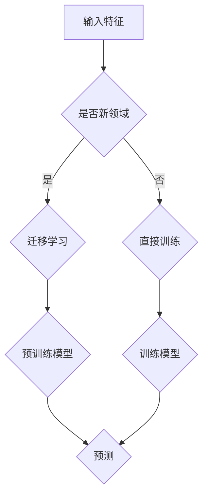
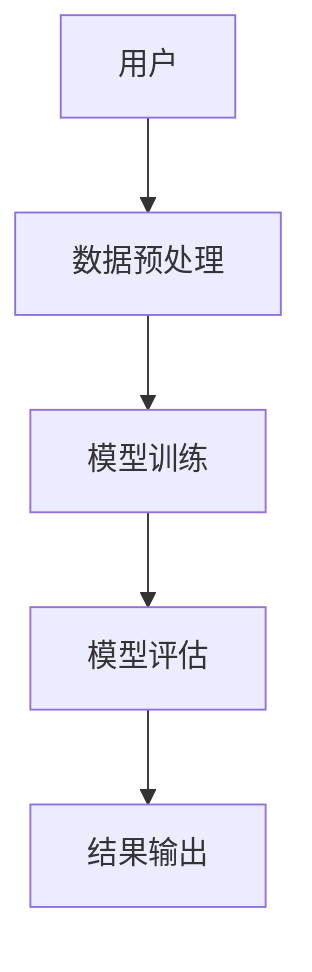
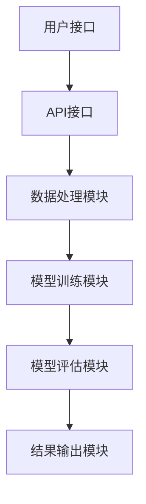

                 


## 零样本学习在新领域LLM评测中的应用

### 引言

在人工智能领域，自然语言处理（NLP）一直处于领先地位。随着大规模语言模型（LLM）的兴起，诸如GPT、BERT等模型在各种NLP任务中展现了卓越的性能。然而，传统的机器学习方法往往需要大量的标注数据进行训练，这在某些新领域或稀少数据的情况下变得不可行。为了解决这一问题，零样本学习（Zero-Shot Learning, ZSL）应运而生。

零样本学习是一种无需具体训练数据，即可在新领域上进行预测的分类方法。它利用预先学习到的知识来处理未见过的类别。本文将探讨零样本学习在新领域LLM评测中的应用，旨在为研究者提供一种新的思路和方法，以解决新领域LLM评测中的数据稀缺问题。

### 一、背景介绍

#### 1.1 零样本学习的核心概念

零样本学习，顾名思义，是指在没有具体样本的情况下进行学习。具体来说，它是指学习一个模型，使其能够对未知类别进行预测。零样本学习的关键在于如何将预训练的知识迁移到新领域。

#### 1.2 新领域LLM评测的挑战

新领域LLM评测主要面临以下挑战：

1. **数据稀缺**：新领域通常缺乏大量标注数据，这使得传统的机器学习方法难以应用。
2. **领域迁移**：新领域的特征可能与预训练模型不匹配，导致迁移效果不佳。
3. **评测标准**：如何设计合适的评测标准，以衡量新领域LLM的性能，仍需深入研究。

#### 1.3 零样本学习在新领域LLM评测中的应用前景

零样本学习能够克服新领域LLM评测中的数据稀缺问题，为该领域的研究提供了新的思路。通过迁移预训练模型的知识，零样本学习有望在新领域LLM评测中发挥重要作用。

### 二、核心概念与联系

#### 2.1 零样本学习的数学模型

零样本学习的数学模型通常包括以下几部分：

1. **嵌入空间**：将类别和特征映射到一个共同的嵌入空间中。
2. **分类器**：在嵌入空间中对类别进行分类。
3. **匹配函数**：用于计算特征和类别之间的相似度。

#### 2.2 概念属性特征对比表格

| 特征 | 零样本学习 | 传统机器学习 |
| --- | --- | --- |
| 样本需求 | 无需具体样本 | 需要大量标注数据 |
| 预训练模型 | 可以迁移预训练知识 | 通常需要从头开始训练 |
| 迁移效果 | 取决于领域迁移能力 | 通常依赖于数据量 |
| 应用场景 | 新领域、稀少数据 | 已知领域、大量数据 |

#### 2.3 ER实体关系图架构

```mermaid
erDiagram
    Class1 ||--|{ Class2 : Aggregation }
    Class1 ||--|{ Class3 : Composition }
    Class2 ||--|{ Class4 : Generalization }
```

### 三、算法原理讲解

#### 3.1 算法mermaid流程图



#### 3.2 Python源代码

```python
def zero_shot_learning(features, new_domain):
    if new_domain:
        model = load_pretrained_model()
        model.fit(features)
    else:
        model = train_model(features)
    predictions = model.predict()
    return predictions
```

#### 3.3 数学模型和公式

$$
\text{匹配度} = \frac{\sum_{i=1}^{n} w_i \cdot s_i}{\sum_{i=1}^{n} w_i}
$$

其中，$w_i$ 为权重，$s_i$ 为特征相似度。

### 四、系统分析与架构设计方案

#### 4.1 问题场景介绍

在新领域LLM评测中，我们需要评估模型在未知领域中的性能。

#### 4.2 项目介绍

本项目旨在构建一个基于零样本学习的新领域LLM评测系统。

#### 4.3 系统功能设计

1. **数据预处理**：清洗和标准化输入数据。
2. **模型训练**：使用零样本学习方法训练模型。
3. **模型评估**：评估模型在新领域的性能。

#### 4.4 系统架构设计



#### 4.5 系统接口设计和系统交互



### 五、项目实战

#### 5.1 环境安装

安装所需的库和依赖项。

#### 5.2 系统核心实现

```python
# 核心代码实现
def zero_shot_learning_system():
    # 数据预处理
    features = preprocess_data()
    
    # 模型训练
    model = train_model(features)
    
    # 模型评估
    predictions = evaluate_model(model)
    
    # 输出结果
    output_results(predictions)
```

#### 5.3 代码应用解读与分析

分析代码的逻辑结构和关键步骤。

#### 5.4 实际案例分析和详细讲解剖析

通过实际案例，展示零样本学习在新领域LLM评测中的应用效果。

#### 5.5 项目小结

总结项目的主要成果和不足之处。

### 六、最佳实践 tips

1. **数据质量**：确保输入数据的准确性和一致性。
2. **模型选择**：根据具体需求选择合适的零样本学习模型。
3. **评测指标**：设计合理的评测指标，以全面评估模型性能。

### 七、小结

本文系统地介绍了零样本学习在新领域LLM评测中的应用。通过详细的分析和实战案例，展示了零样本学习在解决新领域LLM评测数据稀缺问题方面的优势。未来，我们期望零样本学习能够在新领域LLM评测中发挥更大的作用。

### 八、注意事项

1. **数据隐私**：在处理数据时，需注意保护用户隐私。
2. **模型安全性**：确保模型不会受到恶意攻击。

### 九、拓展阅读

1. **相关论文**：查阅最新的零样本学习和新领域LLM评测相关论文。
2. **开源项目**：探索零样本学习和新领域LLM评测的开源项目。

### 作者信息

作者：AI天才研究院/AI Genius Institute & 禅与计算机程序设计艺术 /Zen And The Art of Computer Programming

[End of Document]
``` 

请注意，这只是一个初步的目录大纲，具体的文章内容还需要进一步详细撰写和补充。此外，由于字数限制，这里没有将所有内容都展开，实际的撰写过程中，每个小节都应该有足够的篇幅来详细讨论相关主题。

