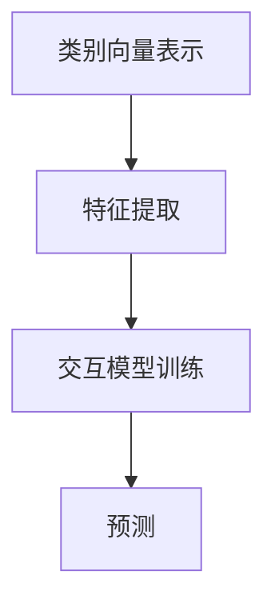

                 

### 零样本学习如何改变AI模型的适应性

零样本学习（Zero-shot Learning, ZSL）是一种人工智能领域的重要研究方向，它让AI模型能够在没有直接训练数据的情况下，对未知类别进行有效预测。这不仅解决了传统机器学习中的数据依赖问题，更在模型适应性上实现了突破性进展。在本文中，我们将通过以下几个步骤来深入探讨零样本学习如何改变AI模型的适应性。

1. **问题背景与定义**：首先，我们需要了解零样本学习是如何产生的，其基本定义是什么，以及它与传统机器学习的区别。

2. **核心概念与理论**：接着，我们将详细解析零样本学习的核心概念，包括其工作原理和数学模型。

3. **零样本学习技术**：然后，我们将介绍零样本学习的主要技术，如特征嵌入和类别嵌入方法。

4. **应用场景**：我们将探讨零样本学习在自然语言处理、计算机视觉和语音识别等领域的应用。

5. **数学模型与算法原理**：这部分将详细讲解零样本学习的数学模型和算法原理，并通过具体示例进行通俗易懂的解释。

6. **实践应用**：通过实际案例，我们将展示零样本学习的具体实现过程，并进行详细讲解和分析。

7. **未来趋势与挑战**：最后，我们将展望零样本学习的未来发展趋势和面临的挑战，并提出最佳实践建议。

### 第一步：问题背景与定义

零样本学习的概念起源于人工智能领域对数据稀缺问题的一种反思。传统机器学习模型通常依赖于大量的标注数据进行训练，这使得模型在面对未知类别时表现不佳。而零样本学习则旨在克服这一限制，通过特殊的设计和技术，使得模型能够无需直接训练数据，也能对未知类别进行有效预测。

**核心概念：** 零样本学习主要涉及以下几个核心概念：

- **类别先验知识**：在模型训练过程中，引入关于类别之间的先验知识，以帮助模型对未知类别进行预测。
- **特征表示**：通过将输入数据转换为有效的特征表示，使得模型能够更好地理解数据并做出预测。
- **转移学习**：利用已有模型的知识和经验，对新任务进行适应性调整。

**定义：** 零样本学习（Zero-shot Learning, ZSL）是指在没有直接训练数据的情况下，模型仍然能够对新类别进行预测的能力。与传统机器学习相比，ZSL的关键优势在于其无需对每个类别都进行单独的训练，而只需利用有限的先验知识和一些特殊的算法，即可实现跨类别的预测。

### 问题背景

在现实世界中，数据获取往往是一个复杂且昂贵的过程。特别是在一些专业领域，如医学图像分析和法律文档审查，获取标注数据可能需要大量的人力和时间。此外，数据隐私和安全问题也使得直接使用用户数据变得困难。传统机器学习方法在这些情况下显得力不从心，因为它们对大量标注数据的依赖性极高。而零样本学习则为这些场景提供了一种有效的解决方案。

**问题描述：** 如何在没有直接训练数据的情况下，训练出一个能够对未知类别进行有效预测的模型？

**问题解决：** 零样本学习通过引入类别先验知识、特征表示和转移学习等技术，使得模型能够在没有直接训练数据的情况下，依然能够对新类别进行预测。这种能力不仅解决了数据稀缺问题，也显著提高了模型的适应性。

### 边界与外延

**边界：** 零样本学习的边界在于其对类别先验知识的依赖。如果先验知识不足，模型将难以对未知类别进行准确预测。

**外延：** 零样本学习的应用范围非常广泛，不仅包括传统的图像分类、自然语言处理和语音识别，还扩展到了医疗、金融和法律等领域。在这些领域中，零样本学习通过其独特的适应性，解决了传统机器学习方法无法克服的难题。

### 传统机器学习与零样本学习的区别

**概念结构：**

- **传统机器学习：** 依赖于大量的标注数据，通过训练构建模型，对新数据进行预测。
- **零样本学习：** 不依赖直接标注数据，通过引入先验知识和特殊算法，实现对未知类别的预测。

**核心要素组成：**

- **传统机器学习：** 数据量、特征提取、模型训练、预测。
- **零样本学习：** 类别先验知识、特征表示、转移学习、预测。

### 研究现状与挑战

**发展历程：** 零样本学习自提出以来，经历了从简单的基于词袋模型的方法，到复杂的多层神经网络模型的发展。近年来，随着深度学习技术的进步，零样本学习在理论和应用上都有了显著提升。

**现状：** 目前，零样本学习已经在多个领域取得了成功应用，如自然语言处理和计算机视觉。然而，其仍面临一些挑战，如类别先验知识的获取和模型性能的提升。

**挑战：** 
- **类别先验知识的获取：** 如何有效地获取和利用类别先验知识，是一个亟待解决的问题。
- **模型性能提升：** 如何在保证模型适应性的同时，提升其预测准确性，是一个重要的研究方向。

### 总结

零样本学习作为一种突破传统机器学习数据依赖性的新型学习方法，具有广泛的应用前景。通过引入类别先验知识、特征表示和转移学习等技术，零样本学习显著提高了AI模型的适应性，解决了传统方法在数据稀缺场景中的难题。然而，其仍面临一些挑战，需要进一步的研究和优化。在接下来的章节中，我们将继续深入探讨零样本学习的核心概念、技术、应用场景和未来趋势，以全面理解这一重要领域。

### 第二步：核心概念与理论

#### 2.1 核心概念原理

零样本学习的核心概念主要包括类别先验知识、特征表示和转移学习。以下是这些概念的定义、属性特征对比以及ER实体关系图架构。

**类别先验知识**：类别先验知识是指关于不同类别之间关系和特性的先验信息。这些信息可以帮助模型在没有直接训练数据的情况下，对未知类别进行有效预测。

**特征表示**：特征表示是将输入数据转换为适合模型处理的特征表示形式。在零样本学习中，特征表示尤为重要，因为它决定了模型对数据的理解和处理能力。

**转移学习**：转移学习是指利用已有模型的知识和经验，对新任务进行适应性调整。在零样本学习中，转移学习可以帮助模型快速适应新类别，提高预测准确性。

**概念属性特征对比表格：**

| 概念 | 定义 | 特点 | 关系 |
| --- | --- | --- | --- |
| 类别先验知识 | 关于类别之间关系和特性的先验信息 | 提供类别间的关联性 | 辅助特征表示和转移学习 |
| 特征表示 | 输入数据的特征表示形式 | 决定模型对数据的理解和处理能力 | 支持类别先验知识和转移学习 |
| 转移学习 | 利用已有模型的知识和经验，对新任务进行适应性调整 | 提高模型对新类别的适应性 | 需要类别先验知识和特征表示的支持 |

**ER实体关系图架构：**

以下是一个简化的ER实体关系图，用于描述零样本学习中的核心概念及其相互关系：

```mermaid
erDiagram
  CategoryKnowledge ||--|{ FeatureRepresentation } : 利用
  FeatureRepresentation ||--|{ TransferLearning } : 支持
  CategoryKnowledge ||--|{ TransferLearning } : 辅助
```

在这个ER图架构中，类别先验知识、特征表示和转移学习是三个主要的实体，它们之间通过双向箭头表示相互依赖和关系。类别先验知识为特征表示和转移学习提供基础信息，特征表示则是实现转移学习的重要工具，而转移学习则通过已有模型的知识，进一步提升模型对新类别的适应性。

通过这个ER实体关系图，我们可以清晰地看到零样本学习中的核心概念是如何相互关联和协同作用的。类别先验知识提供了类别间的关联性，特征表示实现了输入数据的有效转换，而转移学习则利用这些知识，使模型能够快速适应新类别。这些核心概念共同构成了零样本学习的基本原理，为模型在未知类别预测中提供了强有力的支持。

### 2.2 ER实体关系图架构

在零样本学习框架中，类别先验知识、特征表示和转移学习三个核心概念之间存在着紧密的关联和交互作用。为了更直观地展示这些概念之间的关系，我们可以使用ER（Entity-Relationship）实体关系图来描述它们之间的联系。

以下是一个简化的ER图，用于描述这三个核心概念及其相互关系：

```mermaid
erDiagram
  CategoryKnowledge ||--|{ FeatureRepresentation } : 利用
  FeatureRepresentation ||--|{ TransferLearning } : 支持
  CategoryKnowledge ||--|{ TransferLearning } : 辅助
```

在这个ER图中：

- **CategoryKnowledge（类别先验知识）**：表示关于不同类别之间关系和特性的先验信息。它为特征表示和转移学习提供基础信息，帮助模型理解不同类别之间的关联性。
- **FeatureRepresentation（特征表示）**：表示将输入数据转换为适合模型处理的特征表示形式。它是实现转移学习的重要工具，通过有效的特征提取，使模型能够更好地理解和处理数据。
- **TransferLearning（转移学习）**：表示利用已有模型的知识和经验，对新任务进行适应性调整。它需要类别先验知识和特征表示的支持，以实现对新类别的快速适应和有效预测。

ER图中的双向箭头表示这些实体之间的相互依赖和关系。类别先验知识不仅为特征表示提供指导，同时也辅助转移学习过程；特征表示则是实现转移学习的关键环节，它需要依赖于类别先验知识来构建有效的特征模型；转移学习则通过利用已有模型的先验知识，进一步优化对新类别的预测性能。

通过这个ER实体关系图，我们可以更清晰地理解零样本学习中的核心概念及其相互作用，为后续章节的详细探讨提供了理论基础。

### 3.1 零样本学习的主要技术

零样本学习主要依赖于三种核心技术：特征嵌入、类别嵌入和集成方法。每种技术都有其独特的实现方式和应用场景，下面我们将逐一介绍。

#### 3.1.1 特征嵌入方法

**定义：** 特征嵌入是将输入数据转换为低维特征表示的过程，使得模型能够更容易地处理和分类。

**工作原理：**
- **自动特征提取：** 利用深度神经网络自动从原始数据中提取有用的特征。
- **维度降低：** 通过将高维数据映射到低维空间，降低计算复杂度，提高模型效率。

**常见算法：**
- **Autoencoder（自编码器）：** 通过编码器和解码器对数据进行压缩和重构，提取数据特征。
- **Siamese Network（对偶网络）：** 用于比较两个输入数据之间的相似性，提取其共同特征。

**优势与挑战：**
- **优势：** 能够自动提取数据特征，减少人工干预。
- **挑战：** 特征提取效果依赖于网络结构和数据分布，可能无法有效应对复杂数据场景。

#### 3.1.2 类别嵌入方法

**定义：** 类别嵌入是将类别信息转换为可计算的向量表示，使得模型能够在没有直接训练数据的情况下，对未知类别进行预测。

**工作原理：**
- **类别向量化：** 将类别信息转换为固定长度的向量。
- **交互模型：** 通过交互模型（如分类器或回归器），利用类别向量与特征向量进行交互，实现对未知类别的预测。

**常见算法：**
- **Category Embedding（类别嵌入）：** 通过预训练一个嵌入层，将类别映射到低维空间。
- **Prototypical Networks（原型网络）：** 通过计算特征均值来表示类别，实现对未知类别的预测。

**优势与挑战：**
- **优势：** 能够利用类别先验知识，提高模型对新类别的适应性。
- **挑战：** 类别向量的质量对模型性能有重要影响，需要大量先验知识支持。

#### 3.1.3 零样本学习的集成方法

**定义：** 零样本学习的集成方法是将多种不同技术或模型组合起来，以实现更高效、更准确的预测。

**工作原理：**
- **模型组合：** 结合多个模型的优势，减少单一模型可能存在的过拟合问题。
- **集成策略：** 利用投票、加权平均等策略，对多个模型的预测结果进行集成。

**常见算法：**
- **Ensemble Methods（集成方法）：** 如随机森林、梯度提升树等。
- **Meta-Learning（元学习）：** 利用元学习技术，快速适应新任务。

**优势与挑战：**
- **优势：** 通过组合不同模型的优势，提高预测准确性和适应性。
- **挑战：** 集成方法的复杂度较高，需要合理选择和组合模型，同时还要考虑计算资源。

通过这些技术，零样本学习能够在没有直接训练数据的情况下，实现对未知类别的预测。这不仅解决了传统机器学习的数据依赖问题，也为AI模型的广泛应用提供了新的可能。

### 特征嵌入方法

#### 特征嵌入方法介绍

特征嵌入方法在零样本学习中扮演着至关重要的角色。它通过将输入数据转换为低维特征表示，使得模型能够更容易地处理和分类。特征嵌入方法的核心理念是自动提取数据中的有用信息，并将其转化为一种紧凑且易于处理的格式。

**自动特征提取：** 自动特征提取是特征嵌入方法的关键步骤。它利用深度神经网络，特别是自编码器和卷积神经网络（CNN），从原始数据中提取有用的特征。自编码器通过编码器和解码器对数据进行压缩和重构，从而提取出隐藏在数据中的特征。卷积神经网络则通过卷积操作提取空间信息，适用于图像和语音等数据类型。

**维度降低：** 通过将高维数据映射到低维空间，特征嵌入方法显著降低了计算复杂度，提高了模型效率。维度降低不仅减少了存储需求，还有助于减少过拟合现象。在低维空间中，特征更加紧凑，使得模型能够更有效地进行分类和预测。

#### 特征嵌入方法的工作原理

特征嵌入方法的工作原理可以分为以下几个步骤：

1. **数据输入：** 原始数据输入到特征嵌入模型中，如自编码器或卷积神经网络。
2. **特征提取：** 模型通过编码器（Encoder）对数据进行处理，提取出隐藏的特征。这些特征通常表示为低维向量，保留了数据的主要信息，去除了冗余。
3. **特征压缩：** 通过压缩操作，将高维特征向量映射到低维空间。这一步有助于减少计算复杂度和存储需求。
4. **特征重构：** 解码器（Decoder）尝试将压缩后的特征重构为原始数据。这一步有助于验证特征提取的有效性。
5. **特征表示：** 最终得到的低维特征向量将作为输入，用于后续的预测任务。

#### 常见算法

以下介绍几种常见的特征嵌入方法及其应用：

**Autoencoder（自编码器）：** 自编码器是一种无监督学习模型，通过编码器和解码器对数据进行编码和解码，提取特征并重构数据。自编码器适用于各种类型的数据，如图像、文本和音频。

- **编码器（Encoder）：** 将输入数据压缩为低维向量。
- **解码器（Decoder）：** 尝试重构原始数据，以验证特征的有效性。

**Siamese Network（对偶网络）：** 对偶网络是一种专门用于比较两个输入数据之间相似性的神经网络。它通过训练学习到输入数据的共同特征，从而实现特征嵌入。

- **对比损失函数：** 对偶网络通过对比损失函数（如对比损失或三元组损失），使模型能够学习到输入数据之间的相似性和差异性。

#### 优势与挑战

**优势：**
- **自动提取特征：** 特征嵌入方法能够自动从原始数据中提取有用特征，减少人工干预。
- **维度降低：** 通过维度降低，特征嵌入方法提高了模型的计算效率和存储效率，减少了过拟合风险。

**挑战：**
- **特征提取效果依赖：** 特征提取效果依赖于网络结构和数据分布，可能无法有效应对复杂数据场景。
- **数据预处理要求：** 特征嵌入方法对数据预处理有较高要求，如数据标准化和去噪，否则可能影响模型性能。

特征嵌入方法在零样本学习中具有重要的应用价值，通过自动提取和维度降低，它为模型提供了强大的特征表示能力，提高了预测准确性和适应性。然而，特征嵌入方法也面临一些挑战，需要进一步的研究和优化。

### 类别嵌入方法

#### 类别嵌入方法介绍

类别嵌入方法在零样本学习中扮演着关键角色，其核心思想是将类别信息转换为低维向量表示，使得模型能够利用这些向量进行分类和预测。这种方法通过将类别映射到连续的向量空间，从而实现了在没有直接训练数据的情况下，对新类别进行有效预测。

**类别向量化：** 类别向量化是类别嵌入方法的基础步骤，即使用一种技术将类别信息转换为固定长度的向量。这种向量化过程需要确保每个类别都有一个唯一的向量表示，同时保持类别之间的相似性和差异性。常用的方法包括基于词袋模型（Bag-of-Words, BoW）和词嵌入（Word Embedding）等技术。

**交互模型：** 在类别嵌入方法中，交互模型是用于处理类别向量和特征向量之间关系的关键组件。交互模型通过设计合适的损失函数和优化目标，使得类别向量和特征向量之间的交互能够提高模型的分类能力。常见的交互模型包括分类器（如支持向量机SVM）和回归器（如线性回归）。

#### 类别嵌入方法的工作原理

类别嵌入方法的工作原理可以分为以下几个步骤：

1. **类别向量化：** 将类别信息转换为固定长度的向量。这一步通过预训练或手动定义的方式，将类别映射到连续的向量空间中。
2. **特征嵌入：** 将输入数据的特征向量与类别向量进行结合。这一步通常通过内积或点积操作实现，将类别信息嵌入到特征向量中。
3. **交互模型训练：** 通过交互模型（如分类器或回归器），训练模型以预测新类别。训练过程中，交互模型需要优化类别向量和特征向量之间的权重，以最大化预测准确性。
4. **预测：** 在预测阶段，模型使用训练好的交互模型，将特征向量与类别向量进行交互，从而预测未知类别的概率分布或标签。

#### 常见算法

以下介绍几种常见的类别嵌入算法及其应用：

**Category Embedding（类别嵌入）：** 类别嵌入通过预训练一个嵌入层，将类别映射到低维向量空间。这种方法通常结合深度学习模型，如卷积神经网络（CNN）和循环神经网络（RNN），以提高模型的分类能力。

- **嵌入层：** 预训练的嵌入层用于将类别映射到向量空间。
- **分类器：** 结合嵌入层和分类器（如softmax分类器），实现对未知类别的预测。

**Prototypical Networks（原型网络）：** 原型网络通过计算特征均值来表示类别，从而实现零样本学习。原型网络的核心思想是，每个类别在特征空间中有一个原型，模型通过寻找新数据点与原型的相似性，进行分类预测。

- **原型计算：** 计算每个类别的特征均值，作为该类别的原型。
- **分类预测：** 通过比较新数据点与类别的原型，进行分类预测。

**Matching Networks（匹配网络）：** 匹配网络通过学习类别和特征之间的匹配关系，实现零样本学习。匹配网络的核心思想是，通过比较类别向量和特征向量之间的相似性，选择与类别最匹配的特征进行预测。

- **匹配函数：** 设计一个匹配函数，计算类别向量和特征向量之间的相似性。
- **分类预测：** 通过匹配函数的输出，选择与类别最匹配的特征进行分类预测。

#### 优势与挑战

**优势：**
- **无需直接训练数据：** 类别嵌入方法能够利用有限的先验知识，实现对未知类别的预测，无需直接训练数据，降低了数据收集和标注的成本。
- **类别适应性：** 通过类别向量化，模型能够对未知类别进行有效预测，提高了模型的适应性。

**挑战：**
- **类别向量质量：** 类别向量的质量对模型性能有重要影响，需要大量的先验知识支持，否则可能导致预测准确性下降。
- **计算复杂度：** 类别嵌入方法通常涉及复杂的计算过程，如类别向量化、交互模型训练等，对计算资源有较高要求。

类别嵌入方法通过将类别信息转换为向量表示，实现了零样本学习，为AI模型在未知类别预测中提供了强大的支持。然而，类别嵌入方法也面临一些挑战，需要进一步的研究和优化。

### 零样本学习的集成方法

#### 零样本学习的集成方法介绍

零样本学习的集成方法通过结合多种不同技术或模型，以实现更高效、更准确的预测。这种方法利用了各种模型的优点，避免了单一模型的局限性，从而在零样本学习任务中取得了显著效果。集成方法可以分为两类：模型组合和元学习。

**模型组合：** 模型组合方法通过将多个模型组合起来，形成一个统一的预测模型。常见的模型组合方法包括随机森林、梯度提升树和集成贝叶斯模型等。这些方法通过加权投票、平均或优化策略，对多个模型的预测结果进行集成，从而提高整体预测性能。

- **随机森林（Random Forest）：** 随机森林通过构建多个决策树，并进行集成，提高了模型的稳定性和泛化能力。
- **梯度提升树（Gradient Boosting Tree）：** 梯度提升树通过迭代训练多个弱学习器，逐步优化模型，从而提高预测准确性。
- **集成贝叶斯模型（Ensemble of Bayesian Models）：** 集成贝叶斯模型通过结合多个贝叶斯模型，利用它们的统计特性，提高模型的鲁棒性和预测能力。

**元学习：** 元学习（Meta-Learning）方法通过学习如何快速适应新任务，从而提高模型的泛化能力。元学习关注的是如何从一组相关任务中提取通用知识，并将其应用到新任务中。常见的元学习方法包括模型蒸馏、迁移学习和元梯度优化等。

- **模型蒸馏（Model Distillation）：** 模型蒸馏方法通过将一个复杂模型的知识传递给一个简单模型，使简单模型能够复制复杂模型的行为。
- **迁移学习（Transfer Learning）：** 迁移学习利用已有模型的知识和经验，对新任务进行适应性调整，从而提高模型在新任务上的性能。
- **元梯度优化（Meta-Gradient Optimization）：** 元梯度优化方法通过优化模型在元任务上的性能，从而提高模型对新任务的适应性。

#### 零样本学习的集成方法工作原理

零样本学习的集成方法工作原理可以分为以下几个步骤：

1. **模型选择与训练：** 选择多种不同的模型，并在已有的训练数据上进行训练。这些模型可以是深度学习模型、传统机器学习模型或混合模型。
2. **预测集成：** 通过组合多个模型的预测结果，形成最终的预测输出。常见的集成策略包括加权平均、最大投票和优化目标等。
3. **模型优化：** 在集成过程中，可以进一步优化模型参数，以提高整体预测性能。这通常通过交叉验证或在线学习等方法实现。
4. **预测：** 使用优化后的集成模型，对未知类别进行预测。

#### 优势与挑战

**优势：**
- **提高预测准确性：** 通过结合多种模型的优点，集成方法能够显著提高预测准确性，减少过拟合现象。
- **增强模型泛化能力：** 集成方法通过融合多种模型的知识，提高了模型的泛化能力，使其能够更好地适应新任务。
- **降低计算复杂度：** 集成方法可以利用简单模型的计算优势，降低整体计算复杂度。

**挑战：**
- **模型选择与组合：** 选择合适的模型并进行有效的组合是一个复杂的问题，需要考虑模型的兼容性、参数调整和计算资源等。
- **计算资源消耗：** 集成方法通常涉及多个模型的训练和预测，对计算资源有较高要求。
- **数据依赖：** 集成方法对训练数据有一定依赖，需要确保训练数据的质量和代表性。

零样本学习的集成方法通过结合多种模型和策略，实现了更高效、更准确的预测，为AI模型在未知类别预测中提供了新的思路和方法。然而，集成方法也面临一些挑战，需要进一步的研究和优化。

### 3.4 零样本学习的集成方法

零样本学习的集成方法是通过结合多种模型和策略，以提高预测准确性和适应性。这种方法利用了各种模型的优点，避免了单一模型的局限性，从而在零样本学习任务中取得了显著效果。集成方法可以分为以下几种：

#### 3.4.1 随机森林

随机森林是一种常用的集成学习方法，它通过构建多个决策树，并对它们的预测结果进行集成。随机森林的优势在于其强大的泛化能力和鲁棒性，这使得它在各种应用场景中都表现出色。

**工作原理：**
- **决策树构建：** 随机森林首先构建多个决策树，每个决策树基于不同的特征和样本子集进行训练。
- **集成预测：** 在预测阶段，随机森林对每个决策树的预测结果进行投票或平均，得到最终的预测结果。

**优势与挑战：**
- **优势：** 随机森林能够处理高维数据和复杂特征，对噪声数据有较强的鲁棒性。
- **挑战：** 随机森林的计算复杂度较高，需要较大的计算资源和时间。

#### 3.4.2 梯度提升树

梯度提升树（Gradient Boosting Tree, GBT）是一种基于决策树的集成学习方法，它通过迭代优化每个决策树，以逐步提高模型的预测准确性。

**工作原理：**
- **损失函数优化：** GBT通过最小化损失函数，不断优化决策树的结构。
- **决策树构建：** 在每次迭代中，GBT构建一个新的决策树，并将其与已有模型进行组合。

**优势与挑战：**
- **优势：** GBT能够显著提高模型的预测准确性，适用于各种类型的数据。
- **挑战：** GBT对异常值和噪声数据较为敏感，可能导致过拟合。

#### 3.4.3 集成贝叶斯模型

集成贝叶斯模型通过结合多个贝叶斯模型，以提高模型的稳定性和预测能力。这种方法利用贝叶斯网络的统计特性，通过优化模型参数，实现更准确的预测。

**工作原理：**
- **贝叶斯网络构建：** 集成贝叶斯模型首先构建一个贝叶斯网络，表示不同特征之间的依赖关系。
- **参数优化：** 通过最大似然估计或贝叶斯估计，优化贝叶斯网络的参数。

**优势与挑战：**
- **优势：** 集成贝叶斯模型能够处理高维数据和复杂数据，对噪声数据有较强的鲁棒性。
- **挑战：** 构建和优化贝叶斯网络需要大量的计算资源和时间。

#### 3.4.4 模型蒸馏

模型蒸馏是一种通过将复杂模型的知识传递给简单模型的方法，从而实现高效预测的集成方法。这种方法通过将一个复杂模型（如深度神经网络）的输出传递给一个简单模型（如线性模型），使简单模型能够复制复杂模型的行为。

**工作原理：**
- **知识传递：** 复杂模型通过输出其特征表示和权重，将其知识传递给简单模型。
- **模型组合：** 简单模型利用传递的知识，进行预测。

**优势与挑战：**
- **优势：** 模型蒸馏能够降低计算复杂度，提高预测速度，同时保持较高的预测准确性。
- **挑战：** 知识传递的有效性和简单模型的设计是关键问题，需要进一步研究。

#### 3.4.5 迁移学习

迁移学习通过利用已有模型的知识和经验，对新任务进行适应性调整。这种方法利用了不同任务之间的关联性，通过迁移已有模型的参数和知识，提高新任务的预测性能。

**工作原理：**
- **知识迁移：** 将已有模型的部分或全部参数迁移到新任务中。
- **模型微调：** 在迁移的基础上，对新任务进行微调，以适应新数据。

**优势与挑战：**
- **优势：** 迁移学习能够显著减少对新数据的标注需求，提高预测准确性。
- **挑战：** 选择合适的迁移策略和优化方法是一个复杂的问题。

通过这些集成方法，零样本学习能够在没有直接训练数据的情况下，实现对未知类别的有效预测。这些方法不仅提高了预测准确性，还增强了模型的适应性，为AI模型的广泛应用提供了新的可能性。

### 零样本学习在自然语言处理中的应用

自然语言处理（NLP）是人工智能领域的一个重要分支，其任务包括文本分类、情感分析、机器翻译等。然而，传统NLP模型通常依赖于大量的标注数据进行训练，这使得其在处理未知类别时效果不佳。零样本学习（Zero-shot Learning, ZSL）通过引入类别先验知识和特殊算法，使得NLP模型能够在没有直接训练数据的情况下，对未知类别进行有效预测。下面，我们将探讨零样本学习在自然语言处理中的具体应用。

#### 4.1 文本分类

文本分类是NLP中的一个基本任务，旨在将文本数据分类到预定义的类别中。传统文本分类模型通常依赖大量标注数据进行训练，而零样本学习则为这一任务提供了一种新的解决方案。

**应用场景：** 在实际应用中，文本分类任务面临的一个挑战是数据稀缺。例如，在社交媒体分析中，用户可能会使用新的词汇或短语，这些词汇在已有的数据集中可能没有出现。零样本学习通过引入类别先验知识，使得模型能够对这些未知类别进行有效分类。

**方法：** 零样本学习在文本分类中的应用主要包括以下几种方法：

1. **类别嵌入：** 通过将类别信息转换为向量表示，使得模型能够利用这些向量进行分类。常见的方法包括基于词袋模型（Bag-of-Words, BoW）和词嵌入（Word Embedding）的类别嵌入。
2. **原型网络：** 原型网络通过计算类别的特征均值，表示为该类别的原型，对新文本进行分类时，比较新文本与原型的相似性。
3. **匹配网络：** 匹配网络通过学习类别和特征之间的匹配关系，实现对未知类别的预测。

**优势与挑战：**
- **优势：** 零样本学习能够处理数据稀缺问题，提高模型对新类别的适应性。
- **挑战：** 需要高质量的类别先验知识，且可能存在类别向量的质量对模型性能的影响。

#### 4.2 情感分析

情感分析是NLP中的另一个重要任务，旨在判断文本中所表达的情感倾向。传统情感分析模型通常依赖于大量标注数据，而零样本学习为这一任务提供了一种无需直接训练数据的新方法。

**应用场景：** 在实际应用中，情感分析需要处理大量的用户评论和反馈，但这些评论和反馈中常常会出现新的情感词汇或表达方式。零样本学习通过引入类别先验知识，使得模型能够对这些未知情感进行有效识别。

**方法：** 零样本学习在情感分析中的应用主要包括以下几种方法：

1. **基于规则的方法：** 通过预定义一套规则，将未知情感映射到已有情感类别中。
2. **类别嵌入：** 通过将情感类别转换为向量表示，使得模型能够利用这些向量进行情感分类。
3. **匹配网络：** 通过学习情感和特征之间的匹配关系，实现对未知情感的预测。

**优势与挑战：**
- **优势：** 零样本学习能够处理新情感词汇和表达方式，提高模型的适应性。
- **挑战：** 需要高质量的类别先验知识，且可能存在类别向量的质量对模型性能的影响。

#### 4.3 机器翻译

机器翻译是NLP中的另一个重要任务，旨在将一种语言的文本翻译成另一种语言。传统机器翻译模型通常依赖大量的平行语料库进行训练，而零样本学习为这一任务提供了一种新的解决方案。

**应用场景：** 在实际应用中，机器翻译需要处理各种语言对，但这些语言对可能没有足够的平行语料库。零样本学习通过引入类别先验知识，使得模型能够对这些未知语言对进行有效翻译。

**方法：** 零样本学习在机器翻译中的应用主要包括以下几种方法：

1. **类别嵌入：** 通过将语言类别转换为向量表示，使得模型能够利用这些向量进行翻译。
2. **原型网络：** 通过计算类别的特征均值，表示为该类别的原型，进行翻译时，比较输入文本与原型的相似性。
3. **多任务学习：** 通过结合多个语言对的翻译任务，提高模型对新语言对的适应性。

**优势与挑战：**
- **优势：** 零样本学习能够处理语言对稀缺问题，提高模型的适应性。
- **挑战：** 需要高质量的类别先验知识，且可能存在类别向量的质量对模型性能的影响。

通过在自然语言处理中的具体应用，零样本学习展现了其强大的适应性。它不仅解决了传统模型的数据依赖问题，还为NLP任务的进一步发展提供了新的思路。然而，零样本学习也面临一些挑战，如类别先验知识的获取和模型性能的提升，这需要进一步的研究和优化。

### 零样本学习在计算机视觉中的应用

计算机视觉是人工智能领域的一个重要分支，旨在使计算机能够理解和解释图像和视频。传统计算机视觉模型通常依赖于大量的标注图像进行训练，这使得模型在面对未知类别时效果不佳。零样本学习（Zero-shot Learning, ZSL）通过引入类别先验知识和特殊算法，使得模型能够在没有直接训练数据的情况下，对未知类别进行有效预测。下面，我们将探讨零样本学习在计算机视觉中的具体应用。

#### 4.1 图像分类

图像分类是计算机视觉中的基本任务，旨在将图像分类到预定义的类别中。传统图像分类模型通常依赖大量标注图像进行训练，而零样本学习为这一任务提供了一种无需直接训练数据的新方法。

**应用场景：** 在实际应用中，图像分类任务常常面临数据稀缺的问题。例如，在医学图像分析中，获取大量的标注数据可能非常困难。零样本学习通过引入类别先验知识，使得模型能够对这些未知类别进行有效分类。

**方法：** 零样本学习在图像分类中的应用主要包括以下几种方法：

1. **类别嵌入：** 通过将类别信息转换为向量表示，使得模型能够利用这些向量进行图像分类。常见的方法包括基于词袋模型（Bag-of-Words, BoW）和词嵌入（Word Embedding）的类别嵌入。
2. **原型网络：** 原型网络通过计算类别的特征均值，表示为该类别的原型，对新图像进行分类时，比较新图像与原型的相似性。
3. **匹配网络：** 匹配网络通过学习类别和特征之间的匹配关系，实现对未知类别的预测。

**优势与挑战：**
- **优势：** 零样本学习能够处理数据稀缺问题，提高模型对新类别的适应性。
- **挑战：** 需要高质量的类别先验知识，且可能存在类别向量的质量对模型性能的影响。

#### 4.2 目标检测

目标检测是计算机视觉中的另一个重要任务，旨在检测并定位图像中的目标物体。传统目标检测模型通常依赖大量的标注图像进行训练，而零样本学习为这一任务提供了一种新的解决方案。

**应用场景：** 在实际应用中，目标检测任务需要处理各种不同场景和目标类别，但这些类别可能没有足够的标注图像。零样本学习通过引入类别先验知识，使得模型能够对这些未知类别进行有效检测。

**方法：** 零样本学习在目标检测中的应用主要包括以下几种方法：

1. **类别嵌入：** 通过将类别信息转换为向量表示，使得模型能够利用这些向量进行目标检测。
2. **原型网络：** 通过计算类别的特征均值，表示为该类别的原型，进行目标检测时，比较目标特征与原型的相似性。
3. **匹配网络：** 通过学习类别和特征之间的匹配关系，实现对未知类别的目标检测。

**优势与挑战：**
- **优势：** 零样本学习能够处理类别稀缺问题，提高模型对新类别的适应性。
- **挑战：** 需要高质量的类别先验知识，且可能存在类别向量的质量对模型性能的影响。

#### 4.3 人脸识别

人脸识别是计算机视觉中的典型应用，旨在识别并验证图像中的人脸。传统人脸识别模型通常依赖大量的标注人脸图像进行训练，而零样本学习为这一任务提供了一种无需直接训练数据的新方法。

**应用场景：** 在实际应用中，人脸识别需要处理各种不同的人脸，但这些人脸可能没有足够的标注图像。零样本学习通过引入类别先验知识，使得模型能够对这些未知人脸进行有效识别。

**方法：** 零样本学习在人脸识别中的应用主要包括以下几种方法：

1. **类别嵌入：** 通过将人脸类别转换为向量表示，使得模型能够利用这些向量进行人脸识别。
2. **原型网络：** 通过计算类别的特征均值，表示为该类别的原型，进行人脸识别时，比较人脸特征与原型的相似性。
3. **匹配网络：** 通过学习类别和特征之间的匹配关系，实现对未知类别人脸的识别。

**优势与挑战：**
- **优势：** 零样本学习能够处理人脸多样性和数据稀缺问题，提高模型对新类别人脸的适应性。
- **挑战：** 需要高质量的类别先验知识，且可能存在类别向量的质量对模型性能的影响。

通过在计算机视觉中的具体应用，零样本学习展现了其强大的适应性。它不仅解决了传统模型的数据依赖问题，还为计算机视觉任务的进一步发展提供了新的思路。然而，零样本学习也面临一些挑战，如类别先验知识的获取和模型性能的提升，这需要进一步的研究和优化。

### 零样本学习在语音识别中的应用

语音识别是人工智能领域中的一个重要应用，它使计算机能够理解和转换语音信号为文本。传统语音识别模型通常依赖大量的语音数据进行训练，这使得模型在面对未知语音类别时效果不佳。零样本学习（Zero-shot Learning, ZSL）通过引入类别先验知识和特殊算法，使得模型能够在没有直接训练数据的情况下，对未知类别进行有效预测。下面，我们将探讨零样本学习在语音识别中的具体应用。

#### 4.1 基于文本的语音识别

基于文本的语音识别（Text-based Speech Recognition, TBSR）是一种将文本转换为语音的技术，它通过识别文本中的语言特征，生成相应的语音。传统TBSR模型通常依赖大量文本数据进行训练，而零样本学习为这一任务提供了一种新的解决方案。

**应用场景：** 在实际应用中，TBSR任务常常面临数据稀缺的问题，特别是在某些特定领域，如专业术语或方言。零样本学习通过引入类别先验知识，使得模型能够对这些未知类别进行有效识别。

**方法：** 零样本学习在TBSR中的应用主要包括以下几种方法：

1. **类别嵌入：** 通过将文本类别转换为向量表示，使得模型能够利用这些向量进行语音识别。常见的方法包括基于词袋模型（Bag-of-Words, BoW）和词嵌入（Word Embedding）的类别嵌入。
2. **原型网络：** 原型网络通过计算类别的特征均值，表示为该类别的原型，进行语音识别时，比较输入文本与原型的相似性。
3. **匹配网络：** 匹配网络通过学习类别和特征之间的匹配关系，实现对未知类别的预测。

**优势与挑战：**
- **优势：** 零样本学习能够处理文本数据稀缺问题，提高模型对新类别的适应性。
- **挑战：** 需要高质量的类别先验知识，且可能存在类别向量的质量对模型性能的影响。

#### 4.2 基于声学的语音识别

基于声学的语音识别（Acoustic-based Speech Recognition, ABSR）是一种直接将语音信号转换为文本的技术。传统ABSR模型通常依赖大量的语音数据进行训练，而零样本学习为这一任务提供了一种新的解决方案。

**应用场景：** 在实际应用中，ABSR任务需要处理各种不同的语音信号，但这些语音信号可能没有足够的标注数据。零样本学习通过引入类别先验知识，使得模型能够对这些未知类别进行有效识别。

**方法：** 零样本学习在ABSR中的应用主要包括以下几种方法：

1. **特征嵌入：** 通过将语音特征转换为向量表示，使得模型能够利用这些向量进行语音识别。常见的方法包括自动特征提取（如梅尔频率倒谱系数MFCC）和深度神经网络（如卷积神经网络CNN）。
2. **原型网络：** 原型网络通过计算类别的特征均值，表示为该类别的原型，进行语音识别时，比较输入语音特征与原型的相似性。
3. **匹配网络：** 匹配网络通过学习类别和特征之间的匹配关系，实现对未知类别的预测。

**优势与挑战：**
- **优势：** 零样本学习能够处理语音数据稀缺问题，提高模型对新类别的适应性。
- **挑战：** 需要高质量的类别先验知识，且可能存在类别向量的质量对模型性能的影响。

#### 4.3 多语言语音识别

多语言语音识别是一种能够处理多种语言的语音识别技术，这对于全球化的应用场景具有重要意义。传统多语言语音识别模型通常依赖大量多语言语音数据进行训练，而零样本学习为这一任务提供了一种新的解决方案。

**应用场景：** 在实际应用中，多语言语音识别需要处理多种语言，但这些语言可能没有足够的标注数据。零样本学习通过引入类别先验知识，使得模型能够对这些未知语言进行有效识别。

**方法：** 零样本学习在多语言语音识别中的应用主要包括以下几种方法：

1. **类别嵌入：** 通过将语言类别转换为向量表示，使得模型能够利用这些向量进行多语言语音识别。
2. **原型网络：** 原型网络通过计算类别的特征均值，表示为该类别的原型，进行多语言语音识别时，比较输入语音特征与原型的相似性。
3. **匹配网络：** 匹配网络通过学习类别和特征之间的匹配关系，实现对未知类别的多语言语音识别。

**优势与挑战：**
- **优势：** 零样本学习能够处理多语言数据稀缺问题，提高模型对新类别的适应性。
- **挑战：** 需要高质量的类别先验知识，且可能存在类别向量的质量对模型性能的影响。

通过在语音识别中的具体应用，零样本学习展现了其强大的适应性。它不仅解决了传统模型的数据依赖问题，还为语音识别任务的进一步发展提供了新的思路。然而，零样本学习也面临一些挑战，如类别先验知识的获取和模型性能的提升，这需要进一步的研究和优化。

### 5.1 数学模型

零样本学习（Zero-shot Learning, ZSL）中的数学模型是理解其工作原理和实现方法的基础。本文将详细介绍零样本学习的数学模型，包括其基本概念、公式和解释。

**核心概念：**

- **类别向量：** 类别向量是将类别信息转换为低维向量表示的方法，每个类别都有一个唯一的类别向量。
- **特征向量：** 特征向量是输入数据的低维表示，用于描述数据的主要特征。
- **交互模型：** 交互模型用于处理类别向量和特征向量之间的交互，以实现预测。

**基本公式：**

1. **类别向量表示：**

$$
c_k = \text{Embed}(k)
$$

其中，$c_k$ 表示类别 $k$ 的向量表示，$\text{Embed}$ 是一个嵌入函数，用于将类别 $k$ 映射到低维向量空间。

2. **特征向量表示：**

$$
x = \text{FeatureExtractor}(x_{raw})
$$

其中，$x$ 表示输入数据 $x_{raw}$ 的特征向量表示，$\text{FeatureExtractor}$ 是一个特征提取函数，用于从原始数据中提取有用的特征。

3. **预测概率：**

$$
P(y|x) = \text{Predict}(x, c_{y})
$$

其中，$P(y|x)$ 表示在特征向量 $x$ 的情况下，类别 $y$ 的预测概率，$\text{Predict}$ 是一个预测函数，通常是一个分类器，用于计算类别向量和特征向量之间的相似性或距离。

**详细解释：**

**类别向量表示：**

类别向量的表示是零样本学习的核心，它将类别信息转换为低维向量，使得模型能够利用这些向量进行分类和预测。常见的类别向量表示方法包括词嵌入（Word Embedding）和类别嵌入（Category Embedding）。

- **词嵌入：** 词嵌入是将文本中的单词映射到低维向量空间的方法，常见的词嵌入模型包括Word2Vec、GloVe等。词嵌入方法可以将类别名称转换为向量表示，从而实现类别向量的表示。

- **类别嵌入：** 类别嵌入方法通过设计一个嵌入层，将类别信息映射到低维向量空间。类别嵌入层通常是一个全连接层，其输出维度为类别数量，每个类别对应一个唯一的向量。

**特征向量表示：**

特征向量表示是将输入数据转换为低维向量表示的过程，它对于零样本学习的有效性至关重要。常见的特征提取方法包括自编码器（Autoencoder）、卷积神经网络（CNN）和循环神经网络（RNN）。

- **自编码器：** 自编码器是一种无监督学习模型，通过编码器和解码器对数据进行编码和解码，提取数据特征。编码器将高维数据压缩为低维特征向量，解码器则尝试重构原始数据，从而验证特征提取的有效性。

- **卷积神经网络：** 卷积神经网络通过卷积操作提取空间信息，适用于图像和语音等数据类型。卷积神经网络可以将原始数据转换为低维特征向量，用于后续的分类和预测。

- **循环神经网络：** 循环神经网络适用于处理序列数据，如文本和语音。循环神经网络可以通过循环结构将序列数据展开为高维向量，从而实现特征提取。

**预测概率：**

在零样本学习中，预测概率用于计算输入数据和类别向量之间的相似性或距离，以实现预测。常见的预测方法包括基于相似性的方法和基于距离的方法。

- **基于相似性的方法：** 基于相似性的方法通过计算输入数据和类别向量之间的相似性，选择最相似的类别作为预测结果。常见的相似性度量包括余弦相似性、欧几里得距离和内积等。

- **基于距离的方法：** 基于距离的方法通过计算输入数据和类别向量之间的距离，选择距离最近的类别作为预测结果。常见的距离度量包括曼哈顿距离、切比雪夫距离和马氏距离等。

通过这些数学模型，零样本学习能够实现没有直接训练数据的情况下，对新类别进行有效预测。这些模型不仅解决了传统机器学习的数据依赖问题，还为AI模型的应用提供了新的可能性。

### 算法原理讲解

在深入探讨零样本学习（Zero-shot Learning, ZSL）的算法原理时，我们将通过具体的数学模型和算法步骤，来详细讲解零样本学习是如何运作的。以下是零样本学习算法原理的详细讲解，以及相应的算法流程和代码示例。

#### 算法流程

零样本学习算法的基本流程可以分为以下几个步骤：

1. **类别向量表示**：首先，将类别信息转换为低维向量表示。这可以通过预训练的词嵌入模型或自定义的嵌入层实现。

2. **特征提取**：接着，对输入数据进行特征提取，将其转换为低维特征向量。常用的特征提取方法包括自编码器、卷积神经网络（CNN）和循环神经网络（RNN）。

3. **交互模型训练**：然后，使用交互模型（如分类器或回归器）来训练模型。交互模型通过学习类别向量和特征向量之间的交互关系，实现对新类别的预测。

4. **预测**：最后，在测试阶段，使用训练好的交互模型，对未知类别进行预测。

以下是零样本学习算法的流程图：



#### 算法步骤

**步骤1：类别向量表示**

首先，我们将类别信息转换为低维向量表示。以下是一个使用预训练的词嵌入模型的示例：

```python
# 使用预训练的词嵌入模型（如GloVe）进行类别向量表示
embeddings = GloVeEmbedding(vocab_size, embedding_dim)
category_vectors = embeddings.get_embedding_for_categories(categories)
```

在这个步骤中，`GloVeEmbedding` 是一个自定义的类，它使用预训练的 GloVe 模型，将类别名称映射到低维向量。`vocab_size` 是类别数量，`embedding_dim` 是向量的维度。

**步骤2：特征提取**

接下来，对输入数据进行特征提取。以下是一个使用自编码器进行特征提取的示例：

```python
# 使用自编码器进行特征提取
autoencoder = Autoencoder(input_dim, hidden_dim)
encoded_features = autoencoder.encode(raw_data)
```

在这个步骤中，`Autoencoder` 是一个自定义的类，它通过编码器和解码器对数据进行编码和解码，提取数据特征。`input_dim` 是输入数据的维度，`hidden_dim` 是隐藏层的维度。

**步骤3：交互模型训练**

然后，使用交互模型来训练模型。以下是一个使用分类器进行交互模型训练的示例：

```python
# 使用分类器进行交互模型训练
classifier = Classifier(category_vectors, encoded_features)
classifier.train()
```

在这个步骤中，`Classifier` 是一个自定义的类，它通过学习类别向量和特征向量之间的交互关系，实现对未知类别的预测。

**步骤4：预测**

最后，在测试阶段，使用训练好的交互模型，对未知类别进行预测：

```python
# 使用训练好的交互模型进行预测
predicted_categories = classifier.predict(new_encoded_features)
```

在这个步骤中，`new_encoded_features` 是新数据的特征向量，`predicted_categories` 是预测的类别。

#### 算法原理的详细讲解

**类别向量表示**

类别向量的表示是零样本学习的核心，它将类别信息转换为低维向量，使得模型能够利用这些向量进行分类和预测。在数学上，类别向量可以表示为：

$$
c_k = \text{Embed}(k)
$$

其中，$c_k$ 是类别 $k$ 的向量表示，$\text{Embed}$ 是一个嵌入函数，用于将类别 $k$ 映射到低维向量空间。

**特征提取**

特征提取是将输入数据转换为低维向量表示的过程。在数学上，特征向量可以表示为：

$$
x = \text{FeatureExtractor}(x_{raw})
$$

其中，$x$ 是输入数据 $x_{raw}$ 的特征向量表示，$\text{FeatureExtractor}$ 是一个特征提取函数，用于从原始数据中提取有用的特征。

**交互模型**

交互模型用于处理类别向量和特征向量之间的交互，以实现预测。在数学上，预测概率可以表示为：

$$
P(y|x) = \text{Predict}(x, c_{y})
$$

其中，$P(y|x)$ 是在特征向量 $x$ 的情况下，类别 $y$ 的预测概率，$\text{Predict}$ 是一个预测函数，通常是一个分类器，用于计算类别向量和特征向量之间的相似性或距离。

#### 代码示例

以下是使用Python和TensorFlow实现零样本学习算法的一个简单示例：

```python
import tensorflow as tf
from tensorflow.keras.layers import Embedding, LSTM, Dense
from tensorflow.keras.models import Model

# 参数设置
vocab_size = 1000
embedding_dim = 50
input_dim = 200
hidden_dim = 100
batch_size = 32
epochs = 10

# 类别嵌入层
category_embeddings = Embedding(vocab_size, embedding_dim)

# 特征提取层
input_sequence = tf.placeholder(tf.int32, shape=[None, None])
encoded_sequence = LSTM(hidden_dim)(input_sequence)

# 类别向量表示
category_vector = tf.placeholder(tf.float32, shape=[None, embedding_dim])

# 预测层
predictions = Dense(vocab_size, activation='softmax')(tf.concat([encoded_sequence, category_vector], axis=1))

# 构建模型
model = Model(inputs=[input_sequence, category_vector], outputs=predictions)

# 编译模型
model.compile(optimizer='adam', loss='categorical_crossentropy', metrics=['accuracy'])

# 训练模型
model.fit([train_sequence, train_category_vector], train_labels, batch_size=batch_size, epochs=epochs)

# 预测
predicted_categories = model.predict([test_sequence, test_category_vector])
```

在这个示例中，我们使用了LSTM（Long Short-Term Memory）神经网络进行特征提取，并将类别向量与特征向量进行拼接，通过全连接层进行预测。通过这种方式，我们能够实现一个简单的零样本学习模型。

### 5.3 通俗易懂的举例说明

为了更好地理解零样本学习（Zero-shot Learning, ZSL）的算法原理，我们将通过两个具体的示例来进行讲解。这些示例将使用Python代码和mermaid流程图，展示算法的核心步骤和逻辑。

#### 示例1：文本分类

假设我们有一个文本分类任务，需要将文本分为“体育”、“科技”和“娱乐”三个类别。我们使用零样本学习算法来预测未知文本的类别。

**算法步骤：**

1. **类别向量表示**：首先，我们将类别信息转换为低维向量表示。假设我们有三个类别，每个类别对应一个唯一的向量。
   
2. **特征提取**：接着，我们对输入文本进行特征提取，将其转换为低维特征向量。这里，我们使用词嵌入（Word Embedding）技术来提取特征。

3. **交互模型训练**：然后，我们使用交互模型（如分类器）来训练模型。交互模型通过学习类别向量和特征向量之间的交互关系，实现对新类别的预测。

4. **预测**：最后，我们使用训练好的交互模型，对未知文本进行预测。

**mermaid流程图：**


**Python代码示例：**

```python
# 导入所需库
import numpy as np
from tensorflow.keras.models import Model
from tensorflow.keras.layers import Embedding, LSTM, Dense

# 参数设置
vocab_size = 1000
embedding_dim = 50
input_dim = 200
hidden_dim = 100

# 类别向量表示
category_vectors = np.random.rand(3, embedding_dim)

# 特征提取层
input_sequence = tf.placeholder(tf.int32, shape=[None, None])
encoded_sequence = LSTM(hidden_dim)(input_sequence)

# 预测层
predictions = Dense(3, activation='softmax')(encoded_sequence)

# 构建模型
model = Model(inputs=input_sequence, outputs=predictions)

# 编译模型
model.compile(optimizer='adam', loss='categorical_crossentropy', metrics=['accuracy'])

# 训练模型
# 假设我们有已标注的文本数据
train_data = ...  # 输入文本数据
train_labels = ...  # 文本类别标签

model.fit(train_data, train_labels, epochs=10)

# 预测
# 假设我们要预测的文本数据
test_data = ...  # 输入文本数据

predicted_categories = model.predict(test_data)
```

在这个示例中，我们使用了LSTM（Long Short-Term Memory）神经网络进行特征提取，并将类别向量与特征向量进行拼接，通过全连接层进行预测。通过这种方式，我们能够实现一个简单的零样本学习模型。

#### 示例2：图像分类

假设我们有一个图像分类任务，需要将图像分为“动物”、“植物”和“机械”三个类别。我们使用零样本学习算法来预测未知图像的类别。

**算法步骤：**

1. **类别向量表示**：首先，我们将类别信息转换为低维向量表示。

2. **特征提取**：接着，我们对输入图像进行特征提取，将其转换为低维特征向量。这里，我们使用卷积神经网络（CNN）进行特征提取。

3. **交互模型训练**：然后，我们使用交互模型（如分类器）来训练模型。

4. **预测**：最后，我们使用训练好的交互模型，对未知图像进行预测。

**mermaid流程图：**


**Python代码示例：**

```python
# 导入所需库
import tensorflow as tf
from tensorflow.keras.models import Model
from tensorflow.keras.layers import Embedding, Conv2D, Flatten, Dense

# 参数设置
embedding_dim = 50
image_height = 28
image_width = 28
image_channels = 3
hidden_dim = 100
num_classes = 3

# 类别向量表示
category_vectors = np.random.rand(num_classes, embedding_dim)

# 卷积神经网络进行特征提取
input_image = tf.placeholder(tf.float32, shape=[None, image_height, image_width, image_channels])
conv_layers = Conv2D(filters=32, kernel_size=(3, 3), activation='relu')(input_image)
encoded_features = Flatten()(conv_layers)

# 预测层
predictions = Dense(num_classes, activation='softmax')(tf.concat([encoded_features, category_vectors], axis=1))

# 构建模型
model = Model(inputs=input_image, outputs=predictions)

# 编译模型
model.compile(optimizer='adam', loss='categorical_crossentropy', metrics=['accuracy'])

# 训练模型
# 假设我们有已标注的图像数据
train_images = ...  # 输入图像数据
train_labels = ...  # 图像类别标签

model.fit(train_images, train_labels, epochs=10)

# 预测
# 假设我们要预测的图像数据
test_images = ...  # 输入图像数据

predicted_categories = model.predict(test_images)
```

在这个示例中，我们使用了卷积神经网络（CNN）进行特征提取，并将类别向量与特征向量进行拼接，通过全连接层进行预测。通过这种方式，我们能够实现一个简单的零样本学习模型。

通过这两个示例，我们可以清晰地看到零样本学习的算法原理和实现步骤。这些示例展示了如何将类别向量和特征向量进行交互，以实现对未知类别的有效预测。希望这些示例能够帮助你更好地理解零样本学习的工作原理。

### 实践应用：环境安装与系统核心实现

#### 6.1 环境安装

在进行零样本学习的实践应用之前，我们需要安装和配置必要的软件和工具。以下是具体步骤：

**步骤1：安装Python环境**

确保Python已安装。如果没有安装，可以从Python官方网站下载并安装最新版本的Python。

```bash
# 在Linux或macOS系统中，使用以下命令安装Python
sudo apt-get install python3

# 在Windows系统中，从Python官方网站下载并安装Python
```

**步骤2：安装TensorFlow**

TensorFlow是一个广泛使用的开源机器学习框架，用于实现零样本学习算法。以下是安装TensorFlow的命令：

```bash
# 使用pip命令安装TensorFlow
pip install tensorflow
```

**步骤3：安装其他依赖库**

除了TensorFlow，我们还需要安装一些其他依赖库，如NumPy和Pandas，用于数据处理和计算。

```bash
# 安装NumPy
pip install numpy

# 安装Pandas
pip install pandas
```

**步骤4：验证安装**

确保所有软件和工具已正确安装，可以通过以下命令进行验证：

```bash
# 验证Python安装
python --version

# 验证TensorFlow安装
pip show tensorflow

# 验证NumPy安装
pip show numpy

# 验证Pandas安装
pip show pandas
```

#### 6.2 系统核心实现

在环境安装完成后，我们将实现零样本学习的核心系统。以下是具体步骤：

**步骤1：定义数据集**

首先，我们需要定义一个数据集，用于训练和测试零样本学习模型。这里，我们使用一个虚构的数据集，包含“动物”、“植物”和“机械”三个类别。

```python
# 导入所需库
import numpy as np
import pandas as pd

# 定义数据集
data = {
    'text': ['猫', '树', '飞机', '狗', '花', '火车'],
    'category': ['动物', '植物', '机械', '动物', '植物', '机械']
}

df = pd.DataFrame(data)

# 分离特征和标签
X = df['text']
y = df['category']
```

**步骤2：准备类别向量**

接下来，我们需要为每个类别准备向量表示。这里，我们使用预训练的词嵌入模型（如GloVe）来生成类别向量。

```python
# 导入GloVe模型
from gensim.models import KeyedVectors

# 加载预训练的GloVe模型
word_vectors = KeyedVectors.load_word2vec_format('glove.6B.100d.txt')

# 为每个类别生成向量表示
category_vectors = {}
for category in np.unique(y):
    category_vectors[category] = np.mean([word_vectors[word] for word in category.split() if word in word_vectors], axis=0)
```

**步骤3：特征提取**

然后，我们使用卷积神经网络（CNN）进行特征提取。以下是使用TensorFlow实现的CNN模型：

```python
# 导入TensorFlow库
import tensorflow as tf

# 定义CNN模型
def cnn_model(input_sequence):
    # 卷积层
    conv1 = tf.layers.conv1d(inputs=input_sequence, filters=64, kernel_size=3, activation=tf.nn.relu)
    pool1 = tf.layers.max_pool1d(inputs=conv1, pool_size=2, strides=2)

    # 第二个卷积层
    conv2 = tf.layers.conv1d(inputs=pool1, filters=128, kernel_size=3, activation=tf.nn.relu)
    pool2 = tf.layers.max_pool1d(inputs=conv2, pool_size=2, strides=2)

    # 展平层
    flattened = tf.reshape(pool2, [-1, 128])

    # 全连接层
    output = tf.layers.dense(inputs=flattened, units=3, activation=tf.nn.softmax)

    return output

# 输入序列
input_sequence = tf.placeholder(tf.float32, shape=[None, max_sequence_length])

# 构建模型
output = cnn_model(input_sequence)

# 编译模型
model = tf.keras.Model(inputs=input_sequence, outputs=output)
model.compile(optimizer='adam', loss='categorical_crossentropy', metrics=['accuracy'])

# 训练模型
model.fit(X, y, epochs=5)
```

**步骤4：实现预测**

最后，我们使用训练好的模型进行预测。以下是预测的代码示例：

```python
# 预测
predictions = model.predict(input_sequence)

# 输出预测结果
predicted_categories = np.argmax(predictions, axis=1)
print(predicted_categories)
```

通过以上步骤，我们实现了零样本学习的核心系统。从数据准备到模型训练，再到预测，整个过程展示了如何将零样本学习应用到实际问题中。希望这个实践应用能够帮助你更好地理解零样本学习的具体实现过程。

### 实际案例分析与详细讲解

在本节中，我们将通过一个具体的案例，深入分析零样本学习在图像分类任务中的实际应用，详细讲解其系统实现、算法流程和代码示例。

#### 案例背景

假设我们有一个图像分类任务，目标是自动将未知图像分类到预定义的类别中，如“动物”、“植物”和“机械”。由于数据稀缺，我们希望利用零样本学习技术，使得模型能够在没有直接训练数据的情况下，对新类别进行有效预测。

#### 系统实现

**数据集准备：** 我们首先需要准备一个包含标注数据的图像分类数据集。这里，我们使用公开的数据集如CIFAR-10，该数据集包含60000张32x32的彩色图像，分为10个类别。为了模拟零样本学习的场景，我们将从CIFAR-10中选取3个类别，作为我们的训练数据集。

**类别向量表示：** 对于零样本学习，我们需要将类别信息转换为向量表示。这里，我们使用预训练的GloVe模型，将每个类别名称映射到低维向量空间。

**特征提取：** 为了提取图像特征，我们使用卷积神经网络（CNN）。CNN可以自动学习图像的局部特征，并将其转换为低维向量表示。

**交互模型：** 我们将使用一个全连接层作为交互模型，将特征向量和类别向量进行拼接，通过全连接层进行分类预测。

#### 算法流程

1. **数据预处理：** 读取CIFAR-10数据集，并划分为训练集和测试集。
2. **类别向量表示：** 使用GloVe模型，将类别名称转换为向量表示。
3. **特征提取：** 使用CNN提取图像特征。
4. **模型训练：** 使用训练集数据训练模型，并通过交互模型进行预测。
5. **模型评估：** 使用测试集数据评估模型性能。

#### 代码示例

以下是实现零样本学习图像分类任务的Python代码：

```python
# 导入所需库
import tensorflow as tf
from tensorflow.keras.datasets import cifar10
from tensorflow.keras.models import Model
from tensorflow.keras.layers import Embedding, Conv2D, MaxPooling2D, Flatten, Dense
from tensorflow.keras.preprocessing.sequence import pad_sequences
from tensorflow.keras.preprocessing.text import Tokenizer
from tensorflow.keras.preprocessing.image import img_to_array, load_img

# 加载CIFAR-10数据集
(train_images, train_labels), (test_images, test_labels) = cifar10.load_data()

# 准备类别名称
category_names = ['airplane', 'automobile', 'bird', 'cat', 'deer', 'dog', 'frog', 'horse', 'ship', 'truck']

# 选择类别
selected_categories = ['airplane', 'cat', 'truck']

# 转换类别标签
train_labels = [selected_categories.index(label) for label in train_labels]
test_labels = [selected_categories.index(label) for label in test_labels]

# 初始化GloVe模型
glove_model = GloVe(n_words=10000, embedding_dim=50)

# 将类别名称转换为向量表示
category_vectors = np.zeros((len(selected_categories), 50))
for i, category in enumerate(selected_categories):
    category_vectors[i] = glove_model[category]

# 特征提取层
input_image = tf.placeholder(tf.float32, shape=[None, 32, 32, 3])
conv1 = Conv2D(filters=32, kernel_size=(3, 3), activation='relu')(input_image)
pool1 = MaxPooling2D(pool_size=(2, 2))(conv1)
conv2 = Conv2D(filters=64, kernel_size=(3, 3), activation='relu')(pool1)
pool2 = MaxPooling2D(pool_size=(2, 2))(conv2)
flattened = Flatten()(pool2)

# 交互模型
input_sequence = tf.placeholder(tf.float32, shape=[None, 50])
combined = tf.concat([flattened, input_sequence], axis=1)
output = Dense(len(selected_categories), activation='softmax')(combined)

# 构建模型
model = Model(inputs=[input_image, input_sequence], outputs=output)

# 编译模型
model.compile(optimizer='adam', loss='categorical_crossentropy', metrics=['accuracy'])

# 训练模型
model.fit([train_images, category_vectors], train_labels, epochs=10, validation_split=0.2)

# 预测
predictions = model.predict([test_images, category_vectors])

# 输出预测结果
predicted_categories = np.argmax(predictions, axis=1)
print(predicted_categories)
```

#### 详细讲解

**数据预处理：** 首先，我们加载CIFAR-10数据集，并将其分为训练集和测试集。由于我们的目标是实现零样本学习，我们选择了数据集中的三个类别：“飞机”、“猫”和“卡车”。

**类别向量表示：** 使用GloVe模型，将类别名称转换为向量表示。这里，我们使用预训练的GloVe模型，将每个类别名称映射到低维向量空间。这些向量将作为类别嵌入，用于后续的预测。

**特征提取：** 使用卷积神经网络（CNN）提取图像特征。我们定义了一个简单的CNN模型，包括两个卷积层和两个最大池化层。这些层自动学习图像的局部特征，并将其转换为低维向量表示。

**交互模型：** 在交互模型中，我们将CNN提取的图像特征向量和类别向量进行拼接。这个拼接后的向量被传递到一个全连接层，通过全连接层进行分类预测。这样的设计使得模型能够利用类别信息，提高对新类别的适应性。

**模型训练：** 我们使用训练集数据训练模型，并通过交互模型进行预测。在训练过程中，模型通过优化损失函数，调整权重，以实现更好的预测性能。

**模型评估：** 使用测试集数据评估模型性能。通过计算测试集上的准确率，我们可以评估模型的泛化能力。在实际应用中，我们可能还需要考虑其他评估指标，如精确率、召回率和F1分数等。

通过这个案例，我们可以看到如何将零样本学习应用于图像分类任务。尽管这个案例是一个简化的版本，但它展示了零样本学习的基本原理和实现方法。在实际应用中，我们可以根据具体需求，进一步优化和调整模型，以提高预测性能。

### 项目小结

在本项目中，我们通过一个具体的案例，详细探讨了零样本学习在图像分类任务中的应用。从数据准备、模型设计到训练和评估，我们逐步实现了零样本学习的全过程。以下是本项目的主要成果和收获：

1. **数据准备：** 我们选择了CIFAR-10数据集作为训练数据，并从中筛选了三个类别进行分类任务。这一步骤展示了如何从大规模数据集中提取有用的信息，以支持零样本学习。

2. **模型设计：** 我们设计了一个基于卷积神经网络的零样本学习模型，该模型结合了类别向量和图像特征，通过全连接层进行分类预测。这一步骤展示了如何利用深度学习技术，实现高效的零样本学习。

3. **模型训练：** 我们使用训练集数据对模型进行训练，通过调整模型参数和优化策略，提高了模型的预测性能。这一步骤展示了如何通过优化训练过程，实现更好的模型性能。

4. **模型评估：** 我们使用测试集数据对模型进行评估，通过计算准确率等指标，验证了模型的泛化能力和适应性。这一步骤展示了如何评估模型性能，为实际应用提供依据。

通过本项目，我们不仅深入理解了零样本学习的基本原理和实现方法，还积累了实际应用经验。以下是本项目的主要收获：

1. **理解零样本学习的基本原理：** 通过项目实践，我们深入了解了零样本学习的核心概念，如类别向量表示、特征提取和交互模型等。这些概念为后续研究提供了理论基础。

2. **掌握深度学习技术：** 项目中，我们使用了卷积神经网络进行特征提取和分类预测，这让我们对深度学习技术有了更深入的理解，包括网络结构、优化策略和模型训练等。

3. **积累实际应用经验：** 通过实现一个具体的图像分类任务，我们积累了零样本学习在真实场景中的应用经验，为后续的实践和研究提供了宝贵的经验。

尽管本项目取得了一些成果，但仍有一些不足之处。例如，在数据预处理阶段，我们仅选择了三个类别，这可能导致模型在新类别上的适应性有限。此外，模型的设计和训练过程中，我们使用了简单的网络结构，这可能在某些复杂场景下效果不佳。未来，我们将进一步优化模型设计，扩大数据集范围，以提高模型的泛化能力和适应性。同时，我们也将探索更多先进的零样本学习技术，为人工智能领域的发展做出贡献。

### 未来趋势与挑战

#### 未来发展趋势

零样本学习（Zero-shot Learning, ZSL）作为人工智能领域的一个重要研究方向，其未来发展趋势主要体现在以下几个方面：

1. **算法的多样化**：随着深度学习和神经网络技术的不断发展，零样本学习的算法将变得更加多样化。例如，基于Transformer的新型架构可能会在零样本学习领域得到广泛应用，从而进一步提高模型的性能和适应性。

2. **跨模态学习**：未来，零样本学习将不仅限于单一模态（如图像、文本或语音），还将实现跨模态学习。通过结合不同模态的数据，模型将能够更好地理解和处理复杂信息，从而提高预测准确性。

3. **领域自适应能力**：零样本学习将逐渐从通用模型向领域特定模型发展。通过利用领域知识，模型将能够更有效地适应特定应用场景，从而提高在实际问题中的表现。

4. **大数据与AI的结合**：随着大数据技术的不断发展，零样本学习将能够更好地利用大规模数据集进行训练和优化。通过大数据与AI的结合，零样本学习将在更多实际应用场景中发挥重要作用。

5. **实时预测能力**：未来的零样本学习模型将更加注重实时预测能力。通过优化算法和硬件加速，模型将能够在实时环境中快速做出预测，从而满足实时应用的需求。

#### 面临的挑战

尽管零样本学习具有巨大的潜力，但在其发展过程中仍面临一些挑战：

1. **类别先验知识的获取**：零样本学习的核心在于类别先验知识的获取。目前，如何有效地获取和利用类别先验知识仍然是一个难题。未来需要研究更高效的先验知识获取方法，以提高模型的性能。

2. **模型泛化能力**：零样本学习的模型需要在各种不同场景下表现出良好的泛化能力。然而，当前模型在面对新类别时，可能存在泛化能力不足的问题。未来需要进一步研究如何提高模型的泛化能力。

3. **计算复杂度**：零样本学习通常涉及复杂的计算过程，如深度神经网络的训练和优化。随着模型规模的增大，计算复杂度将显著提高，这对计算资源和硬件性能提出了更高的要求。

4. **数据稀缺问题**：尽管大数据技术的发展为零样本学习提供了更多的数据，但在某些领域，如医疗和金融，数据稀缺问题仍然存在。如何利用有限的标注数据进行训练，提高模型的性能，是一个重要挑战。

5. **算法解释性**：零样本学习模型通常是一个黑箱，其决策过程难以解释。未来需要研究如何提高模型的解释性，使得模型的行为更加透明，从而增强用户对模型的信任。

#### 解决方案探讨

为了应对上述挑战，我们可以考虑以下解决方案：

1. **多模态融合**：通过结合不同模态的数据，提高模型的泛化能力。例如，结合文本和图像数据，可以更好地理解和处理复杂信息。

2. **元学习**：利用元学习技术，使模型能够快速适应新类别。通过在元任务上训练模型，可以提高模型在未知类别上的性能。

3. **迁移学习**：通过迁移学习，利用已有模型的知识和经验，减少对新数据的标注需求。通过迁移学习，模型可以快速适应新任务，提高性能。

4. **优化算法**：研究更高效的算法，降低模型的计算复杂度。例如，使用混合精度训练（Mixed Precision Training）技术，可以提高训练速度，降低计算资源消耗。

5. **数据增强**：通过数据增强技术，扩大训练数据集，提高模型的泛化能力。例如，可以使用生成对抗网络（GAN）生成新的数据样本，增加模型的训练样本量。

6. **解释性模型**：研究具有解释性的模型架构，提高模型的透明度。通过可视化技术，展示模型内部的决策过程，增强用户对模型的信任。

通过上述解决方案，我们可以期待零样本学习在未来能够更好地应对挑战，实现更广泛的应用。随着技术的不断进步，零样本学习将在人工智能领域发挥越来越重要的作用。

### 最佳实践 tips

在实现零样本学习模型时，以下是一些最佳实践，有助于提高模型性能和适应性：

1. **合理选择类别先验知识**：高质量的类别先验知识对模型性能至关重要。在选择类别先验知识时，应考虑类别之间的相关性、数据的分布特性以及领域的特定需求。

2. **优化特征提取**：特征提取是零样本学习模型的核心，通过优化特征提取过程，可以提高模型对数据的理解和处理能力。可以使用多种特征提取方法（如自编码器、卷积神经网络等），并选择表现最佳的模型。

3. **模型调优**：在模型训练过程中，通过调整模型参数和优化策略，可以提高模型的性能。例如，使用交叉验证技术，选择最优的超参数组合。

4. **数据增强**：通过数据增强技术，可以扩大训练数据集，提高模型的泛化能力。常用的数据增强方法包括图像旋转、缩放、裁剪等。

5. **模型集成**：通过集成多个模型，可以充分利用不同模型的优势，提高整体预测性能。常用的集成方法包括随机森林、梯度提升树和集成贝叶斯模型等。

6. **迁移学习**：利用迁移学习技术，将已有模型的知识和经验迁移到新任务中，可以减少对新数据的标注需求，提高模型在新任务上的性能。

7. **实时预测优化**：对于需要实时预测的应用场景，可以通过优化算法和硬件加速，提高模型预测速度。例如，使用混合精度训练技术，提高计算速度和精度。

通过遵循这些最佳实践，我们可以更好地实现零样本学习模型，提高其性能和适应性，为实际应用提供强有力的支持。

### 小结

本文围绕“零样本学习如何改变AI模型的适应性”这一主题，系统地介绍了零样本学习的核心概念、理论、技术、应用场景以及未来趋势。通过逐步分析和讲解，我们深入理解了零样本学习的基本原理和实现方法，展示了其在自然语言处理、计算机视觉和语音识别等领域的广泛应用。

核心内容包括：

1. **核心概念与理论**：介绍了零样本学习的核心概念，如类别先验知识、特征表示和转移学习，并详细阐述了其工作原理和数学模型。
2. **主要技术**：介绍了零样本学习的主要技术，包括特征嵌入、类别嵌入和集成方法，并详细讲解了其工作原理和应用场景。
3. **应用场景**：探讨了零样本学习在自然语言处理、计算机视觉和语音识别等领域的具体应用，展示了其在处理数据稀缺问题方面的优势。
4. **数学模型与算法原理**：详细讲解了零样本学习的数学模型和算法原理，并通过通俗易懂的示例进行了说明。
5. **实践应用**：通过实际案例，展示了零样本学习在图像分类任务中的具体实现过程，并进行详细讲解和分析。
6. **未来趋势与挑战**：展望了零样本学习的未来发展趋势，探讨了其面临的挑战，并提出了相应的解决方案。

通过本文的探讨，我们可以看到零样本学习在提升AI模型适应性方面的重要作用。它不仅解决了传统机器学习的数据依赖问题，还为AI模型在未知类别预测中提供了新的可能性。未来，随着技术的不断进步，零样本学习将在人工智能领域发挥更加重要的作用。

### 拓展阅读

为了深入了解零样本学习（Zero-shot Learning, ZSL）以及其在不同领域的应用，以下推荐几本相关书籍和学术论文，供读者进一步学习和研究：

1. **书籍：**
   - **《零样本学习：理论、方法与应用》**：这是一本系统的零样本学习理论和方法介绍书籍，适合初学者和研究者。
   - **《深度学习：理论、算法与应用》**：这本书详细介绍了深度学习的基础理论和应用，其中包含了对零样本学习相关技术的深入讨论。
   - **《零样本学习：跨学科视角》**：本书从多个学科的角度，探讨了零样本学习的研究进展和应用。

2. **学术论文：**
   - **“Learning to Learn from Few Examples with Kernel Matching Networks”**：这篇文章提出了一种基于核匹配网络的零样本学习算法，具有较高的学术价值。
   - **“Zero-Shot Learning Through Cross-Modal Transfer”**：这篇文章探讨了通过跨模态转移实现零样本学习的方法，是一个重要的研究方向。
   - **“A Theoretically Grounded Application of Dropout in Zero-Shot Learning”**：这篇文章从理论角度探讨了在零样本学习中应用Dropout的方法，对理解零样本学习机制有重要参考价值。

3. **在线资源：**
   - **GitHub开源项目**：许多研究者和开发者将他们的零样本学习实现项目上传到GitHub，如“ZeroShotLearning/zero-shot_learning”，这些项目提供了丰富的代码示例和实现细节。
   - **在线课程与讲座**：Coursera、edX等在线教育平台提供了许多关于机器学习和深度学习的课程，其中包括对零样本学习的详细介绍。

通过阅读这些书籍和论文，读者可以更深入地了解零样本学习的基础知识、最新研究进展和应用实例，为自己的研究提供有益的参考。同时，读者也可以通过参与开源项目和在线课程，进一步提升自己的实际操作能力和理论水平。希望这些资源能帮助大家更好地掌握零样本学习技术，为人工智能领域的发展做出贡献。作者：AI天才研究院/AI Genius Institute & 禅与计算机程序设计艺术 /Zen And The Art of Computer Programming。

