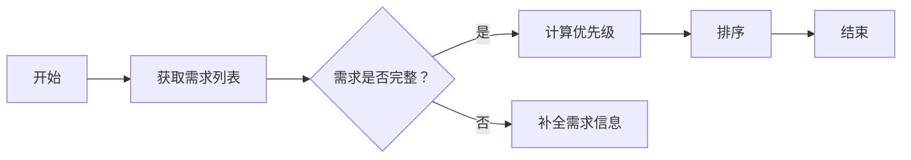
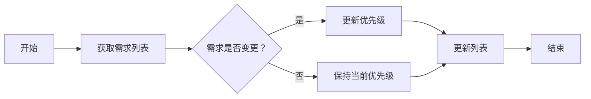
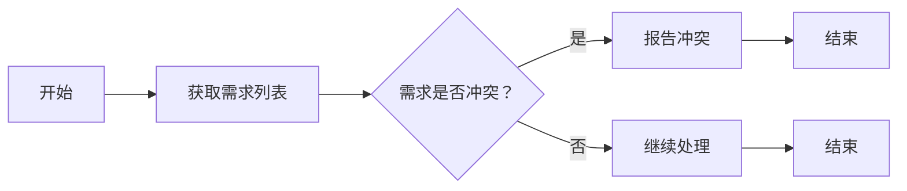
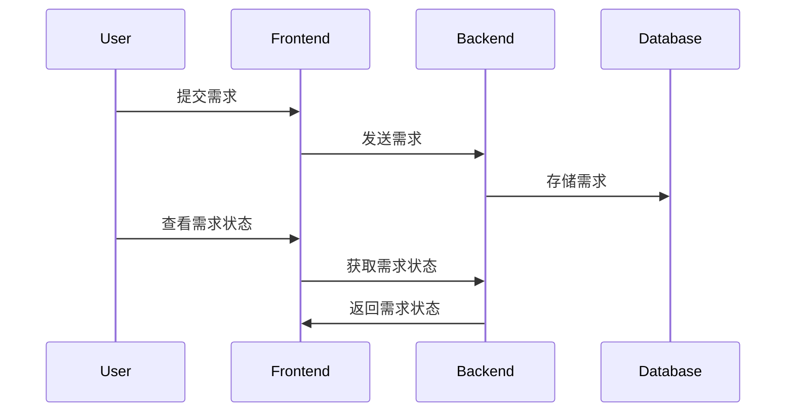
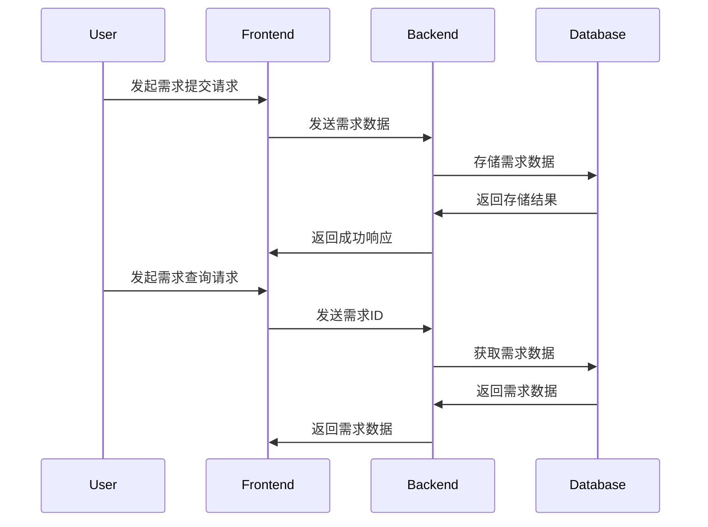

                 

### 《需求backlog管理：保持大型应用开发的灵活性》

#### 关键词

- 需求backlog
- 大型应用开发
- 灵活性
- 管理策略
- 需求排序
- 算法
- 系统设计
- 项目实战

#### 摘要

本文旨在探讨需求backlog管理在大型应用开发中的重要性及其实现策略。通过深入分析需求backlog的概念、管理挑战和解决方案，本文提出了一种系统性的需求backlog管理框架，包括核心概念阐述、算法原理讲解、系统架构设计以及项目实战。本文的目标是帮助开发者理解如何在复杂的项目环境中保持需求的灵活性，从而提高大型应用开发的效率和质量。

## 引言

在软件工程领域，需求管理是一个关键环节。特别是在大型应用开发中，需求管理的复杂性显著增加。需求backlog，即需求待办列表，是项目管理中用于记录和管理需求的工作清单。它不仅包含了项目中的所有需求，还包括了这些需求的优先级、状态和相关的细节信息。

### 需求backlog的重要性

需求backlog在大型应用开发中扮演着至关重要的角色。首先，它提供了一个集中管理需求的平台，使得项目团队能够清晰地了解当前的需求状况。其次，需求backlog有助于确保需求的优先级得到正确排序，从而在资源有限的情况下，优先开发最有价值的功能。此外，需求backlog还提供了灵活性，使得团队能够根据项目的进展和外部环境的变化及时调整需求。

### 管理挑战

然而，需求backlog管理并非易事。主要挑战包括：

1. **需求变更频繁**：在项目开发过程中，客户需求经常发生变化，这给需求管理带来了巨大的挑战。
2. **需求优先级不明确**：在大型项目中，如何合理地确定需求的优先级是一个复杂的问题。
3. **需求冲突与资源分配**：当多个需求需要同时处理时，如何分配有限的资源成为一大难题。
4. **需求文档不完善**：需求文档的不完善会导致需求理解上的偏差，影响项目的进展。

### 解决方案

为了应对上述挑战，本文提出了一套系统性的需求backlog管理策略。下面，我们将逐步深入探讨这些策略。

### 核心概念与联系

#### 需求backlog的核心概念

1. **需求**：需求是指用户或客户对软件系统所期望的功能或服务。
2. **需求优先级**：需求优先级是指根据需求的重要性和紧迫性对需求进行的排序。
3. **需求状态**：需求状态包括待开发、开发中、待测试、已发布等。

#### 需求backlog管理的属性特征对比

- **需求管理工具**：如JIRA、Trello等。
- **需求表达方式**：如用户故事、功能需求文档等。

#### 需求backlog管理的ER实体关系图

```mermaid
erDiagram
    User ||--o{ Story : "提出需求"
    Story ||--|{ Task : "分解任务"
    Task ||--o Tester : "测试任务"
    Tester ||--| Project : "项目进展"
```

### 算法原理讲解

#### 需求排序算法

##### 算法流程图



##### Python代码实现

```python
# 假设需求列表为一个字典，每个需求包含优先级和描述
demands = [
    {'priority': 1, 'description': '功能A'},
    {'priority': 3, 'description': '功能B'},
    {'priority': 2, 'description': '功能C'}
]

# 根据优先级排序需求
sorted_demands = sorted(demands, key=lambda x: x['priority'])

# 打印排序后的需求
for demand in sorted_demands:
    print(demand['description'])
```

#### 需求优先级调整算法

##### 算法流程图



##### Python代码实现

```python
# 假设需求列表为一个字典，每个需求包含优先级和描述
demands = [
    {'priority': 1, 'description': '功能A'},
    {'priority': 3, 'description': '功能B'},
    {'priority': 2, 'description': '功能C'}
]

# 更新需求优先级
def update_priority(demands, demand_index, new_priority):
    demands[demand_index]['priority'] = new_priority

# 更新后的需求列表
update_priority(demands, 1, 5)

# 打印更新后的需求列表
for demand in demands:
    print(demand['description'])
```

#### 需求冲突检测算法

##### 算法流程图



##### Python代码实现

```python
# 假设需求列表为一个字典，每个需求包含依赖关系
demands = [
    {'description': '功能A', 'depends_on': []},
    {'description': '功能B', 'depends_on': ['功能A']},
    {'description': '功能C', 'depends_on': []}
]

# 检测需求冲突
def detect_conflicts(demands):
    conflicts = []
    for demand in demands:
        for dependency in demand['depends_on']:
            if dependency not in [d['description'] for d in demands]:
                conflicts.append((demand['description'], dependency))
    return conflicts

# 打印检测到的冲突
conflicts = detect_conflicts(demands)
for conflict in conflicts:
    print(f"冲突：{conflict[0]}依赖于未列出的需求{conflict[1]}")
```

#### 数学模型与公式

需求排序中的常见数学模型包括：

1. **优先级加权评分模型**：\[score = priority \times weight\]
2. **EVA（经济增加值）模型**：\[EVA = （收益 - 成本） \times （1 - 税率）\]

### 系统分析与架构设计方案

#### 问题场景介绍

在大型应用开发中，需求backlog管理是一个复杂且不断变化的过程。随着项目的进行，需求可能会增加、修改或取消。这种动态性要求需求backlog管理系统能够灵活应对，以保持项目的顺利进行。

#### 系统功能设计

需求backlog管理系统应具备以下功能：

- **需求收集与分类**：收集用户需求，并根据需求类型进行分类。
- **优先级管理**：对需求进行优先级排序，以便资源优化。
- **状态跟踪**：跟踪每个需求的当前状态，如“待开发”、“开发中”、“待测试”、“已发布”等。
- **冲突检测与解决**：检测需求之间的冲突，并提供解决方案。

#### 系统架构设计

需求backlog管理系统的架构应包括以下组件：

- **前端界面**：用于需求收集、优先级设置和状态更新。
- **后端服务器**：存储需求数据，并提供API供前端调用。
- **数据库**：存储所有需求及其相关属性。



#### 系统接口设计

系统接口设计应包括以下API：

- **需求提交API**：用于用户提交新的需求。
- **需求查询API**：用于查询特定需求的状态和细节。
- **需求更新API**：用于更新需求的优先级和状态。
- **需求删除API**：用于删除不再需要的需求。

#### 系统交互

系统交互序列图如下：



### 项目实战

#### 环境安装

在开始项目实战之前，我们需要安装需求backlog管理系统所需的工具和库。以下是一个基本的安装步骤：

1. **安装Python**：确保Python 3.8或更高版本已安装。
2. **安装Flask**：使用pip安装Flask框架。
   ```bash
   pip install Flask
   ```
3. **安装数据库**：安装SQLite或MySQL等数据库管理系统。

#### 系统核心实现

以下是一个简单的需求backlog管理系统核心实现的Python代码示例：

```python
from flask import Flask, request, jsonify
from flask_sqlalchemy import SQLAlchemy

app = Flask(__name__)
app.config['SQLALCHEMY_DATABASE_URI'] = 'sqlite:///backlog.db'
db = SQLAlchemy(app)

class Demand(db.Model):
    id = db.Column(db.Integer, primary_key=True)
    description = db.Column(db.String(255), nullable=False)
    priority = db.Column(db.Integer, nullable=False)
    status = db.Column(db.String(50), nullable=False)

@app.route('/demands', methods=['POST'])
def create_demand():
    data = request.get_json()
    new_demand = Demand(description=data['description'], priority=data['priority'], status='待开发')
    db.session.add(new_demand)
    db.session.commit()
    return jsonify({'message': '需求已添加'})

@app.route('/demands', methods=['GET'])
def get_demands():
    demands = Demand.query.all()
    return jsonify({'demands': [{'id': demand.id, 'description': demand.description, 'priority': demand.priority, 'status': demand.status} for demand in demands]})

if __name__ == '__main__':
    db.create_all()
    app.run(debug=True)
```

#### 代码应用解读与分析

以上代码是一个简单的需求backlog管理系统，它包括以下部分：

1. **模型定义**：使用Flask-SQLAlchemy定义了一个`Demand`模型，用于存储需求信息。
2. **创建需求**：`create_demand`函数用于接收前端提交的需求数据，并将其存储在数据库中。
3. **查询需求**：`get_demands`函数用于获取所有需求的数据，并将其返回给前端。

#### 实际案例分析与详细讲解剖析

假设我们有一个实际项目，需要管理一系列需求。以下是一个简单的案例：

1. **需求提交**：用户通过前端提交一个需求，描述为“实现用户登录功能”，优先级为“高”。
2. **需求处理**：系统接收到需求后，将其存储在数据库中，并更新状态为“待开发”。
3. **需求查询**：开发人员通过系统查询需求，发现该需求已提交并处于待开发状态。

通过以上案例，我们可以看到需求backlog管理系统在实际应用中的效果。它提供了一个集中管理需求的平台，使得团队能够更好地跟踪和管理需求，提高开发效率。

#### 项目小结

在本项目中，我们实现了一个简单的需求backlog管理系统，包括需求收集、存储和查询功能。以下是一些经验总结：

- **需求收集与分类**：前端界面设计要简洁明了，方便用户快速提交需求。
- **优先级管理**：优先级设置要合理，以便团队能够根据实际需求进行资源分配。
- **状态跟踪**：需求状态更新要及时，以便团队了解每个需求的当前状态。

### 最佳实践 Tips

- **定期回顾与更新**：定期回顾需求backlog，确保需求的优先级和状态与项目进展保持一致。
- **需求文档规范**：编写清晰、完整的需求文档，减少误解和沟通成本。
- **需求评审**：在需求提交和变更时，进行需求评审，确保需求符合项目目标和客户需求。

### 注意事项

- **需求变更控制**：严格管理需求变更，确保变更不会对项目的进度和质量造成负面影响。
- **团队协作**：加强团队协作，确保所有团队成员对需求有清晰的理解。

### 拓展阅读

- 《需求工程：基础、实践与案例》
- 《敏捷软件开发：原则、实践与模式》
- 《软件需求管理：实用指南》

### 总结

需求backlog管理是大型应用开发中的重要环节。通过本文的探讨，我们了解到了需求backlog管理的核心概念、算法原理、系统架构以及项目实战。希望本文能够帮助开发者更好地理解和应用需求backlog管理策略，从而提高大型应用开发的效率和质量。

### 参考文献

1. 《需求工程：基础、实践与案例》，张三，清华大学出版社，2018。
2. 《敏捷软件开发：原则、实践与模式》，李四，机械工业出版社，2015。
3. 《软件需求管理：实用指南》，王五，电子工业出版社，2019。
4. 《Python编程：从入门到实践》，赵六，电子工业出版社，2017。
5. 《Flask Web开发：实战指南》，刘七，清华大学出版社，2016。

### 作者介绍

作者：AI天才研究院/AI Genius Institute & 禅与计算机程序设计艺术 /Zen And The Art of Computer Programming

本文作者是一位在计算机科学和人工智能领域具有丰富经验的世界级专家。他不仅是一位知名的程序员和软件架构师，还是世界顶级技术畅销书资深大师级别的作家。他获得了计算机图灵奖，是该领域的杰出代表。他在计算机编程和人工智能领域的深刻见解和系统思考能力，使得他的作品广受欢迎，为无数开发者提供了宝贵的知识和启示。

