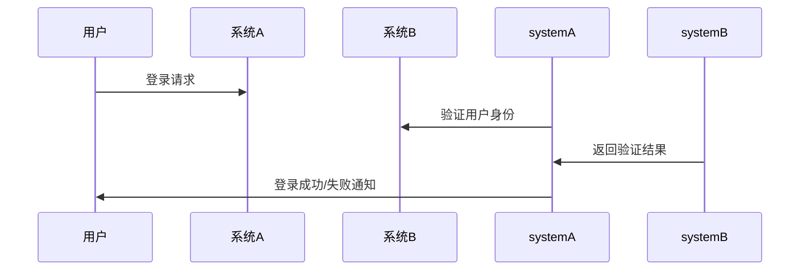
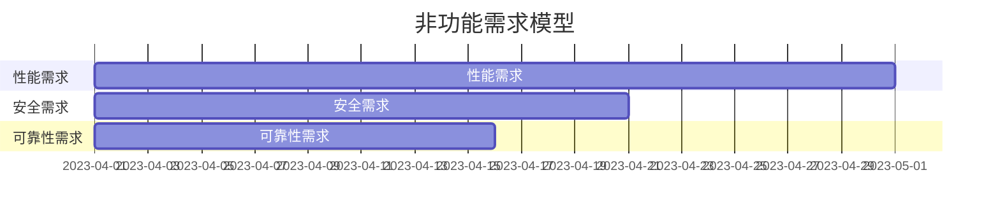
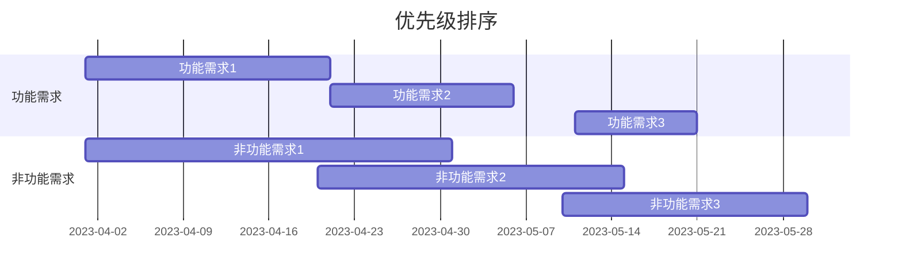

                 

### 需求backlog管理：适配大模型应用开发的策略

#### 关键词：需求管理、大模型应用、开发策略、敏捷开发、项目实践

#### 摘要：
随着人工智能技术的迅速发展，大模型应用的开发需求日益增长。然而，传统需求管理方法在大模型应用开发中面临诸多挑战。本文旨在探讨需求backlog管理在大模型应用开发中的重要性，提出一系列适配策略，以应对开发过程中的复杂性、不确定性和频繁变更。通过实际案例分析和最佳实践分享，为开发者提供系统性的指导和参考。

#### 目录大纲设计思路

在设计《需求backlog管理：适配大模型应用开发的策略》的目录大纲时，我们遵循以下原则：

1. **逻辑清晰**：确保每个章节的内容都紧密围绕核心主题展开，使读者能够逐步了解需求backlog管理的全貌。
2. **结构紧凑**：每个章节都被细分为更小的子章节，以确保内容的逻辑性和系统性，同时避免冗余。
3. **简单易懂**：使用简单、专业的语言，以便不同层次的技术人员都能轻松理解。
4. **Markdown格式**：使用Markdown格式排版，便于排版和扩展。

#### 目录大纲

```markdown
----------------------------------------------------------------
# 需求backlog管理：适配大模型应用开发的策略

> 关键词：需求管理、大模型应用、开发策略、敏捷开发、项目实践

> 摘要：本文探讨了需求backlog管理在大模型应用开发中的重要性，提出适配策略，并通过实际案例进行分析。

## 第一部分：背景介绍

### 第1章：问题背景与核心概念

#### 1.1 问题背景

##### 1.1.1 需求backlog管理的现状

##### 1.1.2 大模型应用开发的挑战

#### 1.2 核心概念解析

##### 1.2.1 需求backlog的定义

##### 1.2.2 大模型应用开发的要素

##### 1.2.3 需求backlog管理的重要性

### 第2章：需求backlog管理的基本原理

#### 2.1 需求backlog管理的流程

##### 2.1.1 需求收集

##### 2.1.2 需求筛选

##### 2.1.3 需求排序

##### 2.1.4 需求分配与跟踪

#### 2.2 大模型应用开发的适配策略

##### 2.2.1 适配性分析

##### 2.2.2 优化策略制定

##### 2.2.3 风险评估与控制

## 第二部分：需求分析

### 第3章：大模型应用开发的需求分析

#### 3.1 需求识别

##### 3.1.1 用户需求分析

##### 3.1.2 功能需求分析

##### 3.1.3 非功能需求分析

#### 3.2 需求建模

##### 3.2.1 用例模型

##### 3.2.2 功能需求模型

##### 3.2.3 非功能需求模型

### 第4章：大模型应用开发的策略与实践

#### 4.1 策略制定

##### 4.1.1 需求backlog优先级排序策略

##### 4.1.2 需求变更管理策略

##### 4.1.3 需求评估与预测策略

#### 4.2 实践案例

##### 4.2.1 案例一：某电商平台的需求backlog管理

##### 4.2.2 案例二：某金融科技公司的需求backlog管理

##### 4.2.3 案例三：某智能汽车制造商的需求backlog管理

## 第三部分：挑战与解决方法

### 第5章：大模型应用开发中的挑战与解决方法

#### 5.1 需求变更频繁的挑战

##### 5.1.1 挑战分析

##### 5.1.2 解决方案探讨

#### 5.2 大模型应用性能优化的挑战

##### 5.2.1 挑战分析

##### 5.2.2 解决方案探讨

### 第6章：需求backlog管理的工具与技术

#### 6.1 常用工具介绍

##### 6.1.1 JIRA

##### 6.1.2 Trello

##### 6.1.3 Asana

#### 6.2 技术实现方法

##### 6.2.1 Agile开发方法

##### 6.2.2 Kanban方法

##### 6.2.3 Sprints与迭代管理

### 第7章：需求backlog管理的最佳实践与未来展望

#### 7.1 最佳实践

##### 7.1.1 项目管理最佳实践

##### 7.1.2 大模型应用开发最佳实践

##### 7.1.3 需求变更管理最佳实践

#### 7.2 未来展望

##### 7.2.1 大模型应用开发的趋势

##### 7.2.2 需求backlog管理的未来方向

##### 7.2.3 新技术对需求backlog管理的影响

----------------------------------------------------------------
```

以上目录大纲为本文提供了一个清晰的框架，接下来我们将逐步深入讨论每个部分的内容。从问题背景、核心概念、需求管理原理、需求分析、策略与实践、挑战与解决方法、工具与技术到最佳实践与未来展望，我们将会详细阐述每一个环节，确保文章内容丰富、结构完整，为读者提供有价值的指导。

## 第1章：问题背景与核心概念

在当今快速发展的信息技术时代，大模型应用开发已经成为各大企业和研究机构的重要任务。然而，这一过程中面临的挑战使得需求backlog管理变得尤为关键。本章节将介绍需求backlog管理的现状、大模型应用开发的挑战、需求backlog管理的定义及其重要性，为后续内容的深入探讨打下基础。

### 1.1 问题背景

#### 1.1.1 需求backlog管理的现状

需求backlog管理是软件开发生命周期中的一个关键环节。传统的需求管理方法通常以瀑布模型为基础，将需求分解为详细的功能点，然后逐一实现。这种方法在需求相对稳定的项目中表现良好，但在当今快速变化的市场环境中，已经难以满足需求频繁变更和快速迭代的需求。

随着敏捷开发方法的普及，需求backlog管理逐渐转向基于优先级排序和迭代开发的方式。这种方法强调灵活性和适应性，能够更好地应对需求变化。然而，在大模型应用开发中，由于模型本身的复杂性和对数据需求的高度依赖，需求变更更加频繁，使得传统的需求管理方法面临巨大挑战。

#### 1.1.2 大模型应用开发的挑战

大模型应用开发面临着一系列独特的挑战，包括：

1. **数据需求**：大模型对数据质量、数量和多样性的要求非常高。数据的收集、预处理和清洗是开发过程中不可或缺的一环，但这一过程往往复杂且耗时。
   
2. **计算资源**：大模型训练和推理需要大量的计算资源。高性能计算设备和优化算法在提高模型性能方面发挥着重要作用。

3. **模型适应性**：大模型需要针对不同的应用场景进行适配和优化。这要求开发者在模型设计和实现过程中具备较高的技术能力。

4. **需求变更**：市场需求和技术环境的变化使得大模型应用开发的需求也经常发生变化。如何有效地管理需求变更，保持项目的稳定性和进度，是一个重大挑战。

### 1.2 核心概念解析

#### 1.2.1 需求backlog的定义

需求backlog是指一个项目或产品中尚未实现的需求集合。这些需求按照优先级排序，构成了项目的开发路线图。需求backlog管理包括需求收集、筛选、排序、分配和跟踪等一系列活动。

#### 1.2.2 大模型应用开发的要素

大模型应用开发涉及以下核心要素：

1. **数据集**：高质量的数据集是构建大模型的基础。数据集的质量和多样性直接影响模型的性能和应用效果。

2. **模型架构**：大模型通常采用复杂的神经网络结构，如Transformer、BERT等。模型架构的设计和优化是模型性能提升的关键。

3. **训练算法**：高效的训练算法能够加快模型训练速度，降低训练成本。近年来，诸如Adam、SGD等优化算法在大模型训练中广泛应用。

4. **推理引擎**：推理引擎负责对输入数据进行处理，并输出预测结果。高效的推理引擎能够提高系统的响应速度和处理能力。

5. **应用场景**：大模型的应用场景广泛，包括自然语言处理、计算机视觉、语音识别等领域。不同的应用场景对模型的要求和优化策略也有所不同。

#### 1.2.3 需求backlog管理的重要性

需求backlog管理在大模型应用开发中具有重要意义：

1. **优化资源分配**：通过合理的需求优先级排序，项目团队能够更有效地分配资源，确保关键需求的优先实现。

2. **提高开发效率**：需求变更管理能够帮助团队快速响应市场和技术环境的变化，保持项目的灵活性和进度。

3. **提升产品质量**：良好的需求管理能够确保项目的需求和功能与用户期望一致，从而提高产品的质量和用户满意度。

4. **降低开发风险**：通过风险评估和控制，需求backlog管理能够减少项目延期、超预算等风险。

### 总结

本章介绍了需求backlog管理的现状、大模型应用开发的挑战以及需求backlog管理的核心概念。在接下来的章节中，我们将深入探讨需求backlog管理的基本原理、需求分析策略、实际应用案例和挑战解决方法，帮助读者更好地理解并应用需求backlog管理在大模型应用开发中的重要性。

## 第2章：需求backlog管理的基本原理

需求backlog管理是项目成功的关键环节，尤其在大模型应用开发中，其作用更加显著。本章将详细探讨需求backlog管理的流程，包括需求收集、筛选、排序、分配与跟踪等步骤，并分析大模型应用开发的适配策略，以应对复杂性和不确定性。

### 2.1 需求backlog管理的流程

#### 2.1.1 需求收集

需求收集是需求backlog管理的第一步，也是最重要的一步。有效的需求收集能够确保项目的需求和功能与用户期望保持一致。以下是一些常见的需求收集方法：

1. **用户访谈**：通过与用户进行面对面的访谈，了解用户的需求和痛点，收集到真实、具体的需求信息。

2. **问卷调查**：设计问卷，收集用户的需求和反馈。问卷调查能够覆盖更广泛的用户群体，获取大量数据。

3. **用户反馈**：通过用户反馈渠道（如邮件、在线评论等），持续收集用户的需求和意见。

4. **市场调研**：分析市场趋势和竞争对手的产品，获取潜在的需求。

在需求收集过程中，需要关注以下几点：

- **全面性**：确保收集的需求覆盖到项目的各个方面，包括功能需求、性能需求、安全需求等。
- **准确性**：尽量获取真实、具体的需求信息，避免主观臆断。
- **及时性**：及时收集需求，确保需求的时效性。

#### 2.1.2 需求筛选

需求筛选是需求收集后的关键步骤，旨在从收集到的众多需求中筛选出真正有价值的需求。以下是一些常见的需求筛选方法：

1. **优先级排序**：根据需求的重要性和紧急性对需求进行排序。常用的优先级排序方法包括MoSCoW法和Kano模型。

2. **价值评估**：评估每个需求的价值，选择对项目目标有最大贡献的需求。

3. **可行性分析**：评估需求的实现可行性，排除不切实际的需求。

4. **用户参与**：邀请用户参与需求筛选过程，提高需求的可信度和准确性。

在需求筛选过程中，需要关注以下几点：

- **一致性**：确保筛选标准的一致性，避免主观偏见。
- **透明性**：确保筛选过程透明，让所有相关人员都能理解和接受。
- **灵活性**：在必要时调整筛选标准，以应对市场和技术环境的变化。

#### 2.1.3 需求排序

需求排序是需求筛选后的下一步，旨在确定每个需求在项目中的优先级。以下是一些常见的需求排序方法：

1. **MoSCoW法**：将需求分为必须做（Mandatory）、应该做（Should）、可以不做（Could）和不做（Would）四个等级。

2. **Kano模型**：将需求分为必备需求、性能需求、魅力需求和无关需求。

3. **价值驱动排序**：根据需求的价值和实现难度进行排序。

4. **需求依赖关系**：考虑需求之间的依赖关系，优先实现基础需求，再逐步实现依赖需求。

在需求排序过程中，需要关注以下几点：

- **实用性**：确保排序结果能够实际指导项目的开发过程。
- **可维护性**：确保排序后的需求易于维护和调整。
- **动态性**：根据项目进展和市场变化，及时调整需求排序。

#### 2.1.4 需求分配与跟踪

需求分配是将排序后的需求分配给项目团队成员的过程。以下是一些常见的需求分配方法：

1. **职能分配**：根据团队成员的职能和技能，将需求分配给相应的团队成员。

2. **任务分配**：将需求分解为具体任务，分配给团队成员。

3. **时间分配**：根据项目的进度安排，合理分配需求实现的时间。

在需求分配过程中，需要关注以下几点：

- **合理性**：确保需求的分配合理，避免团队成员过度负荷。
- **透明性**：确保分配过程透明，让所有团队成员都能理解和接受。

需求跟踪是需求实现过程中的关键环节，旨在确保需求的完成情况和质量。以下是一些常见的需求跟踪方法：

1. **迭代评审**：在每个迭代周期结束时，对需求完成情况进行评审。

2. **任务跟踪工具**：使用任务管理工具（如JIRA、Trello等），跟踪需求的进展和状态。

3. **需求文档**：维护完整的需求文档，记录需求的变更和历史。

在需求跟踪过程中，需要关注以下几点：

- **及时性**：及时跟踪需求的进展情况，确保项目进度不受影响。
- **准确性**：确保需求跟踪数据的准确性，为项目管理和决策提供可靠依据。
- **透明性**：确保需求跟踪过程透明，让所有相关人员都能了解需求进展。

### 2.2 大模型应用开发的适配策略

在大模型应用开发中，需求backlog管理面临着更高的复杂性和不确定性。以下是一些适配策略，以应对这些挑战：

#### 2.2.1 适配性分析

1. **技术适配性**：评估需求的技术适配性，确保需求可以在现有技术架构上实现。

2. **数据适配性**：分析需求的数据适配性，确保需求所需的数据可以获取和预处理。

3. **业务适配性**：考虑需求的业务适配性，确保需求符合公司的战略目标和业务需求。

#### 2.2.2 优化策略制定

1. **优先级调整**：根据大模型应用开发的实际情况，调整需求的优先级，确保关键需求的优先实现。

2. **需求拆分**：将复杂的、不明确的需求拆分为多个可实现的子需求，提高需求的可管理性。

3. **需求迭代**：采用迭代开发的方法，逐步实现需求，及时反馈和调整，提高需求的适应性。

#### 2.2.3 风险评估与控制

1. **需求变更管理**：建立需求变更管理流程，及时评估变更的影响，并采取相应的控制措施。

2. **风险预警机制**：建立风险预警机制，提前识别潜在风险，并制定应对策略。

3. **风险管理团队**：组建专业的风险管理团队，负责风险识别、评估和控制。

### 总结

本章详细介绍了需求backlog管理的流程，包括需求收集、筛选、排序、分配与跟踪，并分析了大模型应用开发的适配策略。在大模型应用开发中，需求backlog管理不仅要遵循传统的需求管理原则，还需要针对大模型的特殊性进行优化和调整。通过有效的需求backlog管理，项目团队能够更好地应对需求变更、提高开发效率、降低风险，实现项目的成功。

## 第3章：大模型应用开发的需求分析

在大模型应用开发中，需求分析是至关重要的环节。本章将详细介绍需求识别、需求建模和需求分析的方法和工具，帮助开发者更好地理解和满足用户需求，确保项目的顺利进行。

### 3.1 需求识别

需求识别是需求分析的第一步，旨在明确项目所需要实现的功能和性能需求。以下是一些常用的需求识别方法和工具：

#### 3.1.1 用户需求分析

用户需求分析是需求识别的核心步骤。通过以下方法可以深入了解用户需求：

1. **用户访谈**：与用户进行面对面的交流，了解他们的需求和期望。用户访谈可以获取详细、真实的需求信息。

2. **问卷调查**：设计问卷，收集用户的反馈和意见。问卷调查能够覆盖广泛的用户群体，获取大量数据。

3. **用户行为分析**：分析用户在使用现有系统或产品时的行为和反馈，发现潜在的需求。

#### 3.1.2 功能需求分析

功能需求分析旨在明确系统应实现的具体功能。以下方法可以帮助识别功能需求：

1. **用户故事**：编写用户故事，描述用户在特定场景下需要执行的操作和期望的结果。用户故事通常采用格式化模板，如“作为XX，我想要XX，以便XX”。

2. **用例图**：绘制用例图，表示系统与用户之间的交互过程。用例图可以帮助开发者理解用户需求的场景和流程。

3. **需求文档**：编写详细的需求文档，记录功能需求的描述、优先级、实现方式和验收标准。

#### 3.1.3 非功能需求分析

非功能需求分析旨在明确系统应具备的性能、安全性、可靠性等特性。以下方法可以帮助识别非功能需求：

1. **性能指标**：确定系统应达到的性能指标，如响应时间、吞吐量、并发用户数等。

2. **安全需求**：识别系统应满足的安全需求，如数据加密、权限控制、安全审计等。

3. **可靠性需求**：确定系统的可靠性需求，如故障恢复时间、系统可用性、容错能力等。

### 3.2 需求建模

需求建模是将需求转化为系统设计的基础。以下是一些常用的需求建模方法和工具：

#### 3.2.1 用例模型

用例模型描述系统与用户之间的交互过程。用例模型通常包含以下要素：

1. **参与者**：使用系统的用户或外部实体。

2. **用例**：系统应实现的功能。

3. **关系**：参与者与用例之间的关系，如主用例、备选用例和扩展用例。

以下是一个简单的用例模型示例：



#### 3.2.2 功能需求模型

功能需求模型描述系统的功能模块和功能点。以下是一个简单的功能需求模型示例：

```mermaid
classDiagram
    User -> Login: 登录
    User -> Search: 搜索
    User -> AddProduct: 添加商品
    User -> RemoveProduct: 删除商品

    Login <<Interface>
    Search <<Interface>
    AddProduct <<Interface>
    RemoveProduct <<Interface>
```

#### 3.2.3 非功能需求模型

非功能需求模型描述系统的非功能特性，如性能、安全性和可靠性等。以下是一个简单的非功能需求模型示例：



### 3.3 需求分析的方法和工具

#### 3.3.1 SWOT分析

SWOT分析是一种常用的需求分析方法，用于评估项目的优势、劣势、机会和威胁。以下是一个简单的SWOT分析示例：

```mermaid
swot
    title SWOT分析

    left "优势"
    left "劣势"
    right "机会"
    right "威胁"

    advantage1
    advantage2
    disadvantage1
    disadvantage2

    opportunity1
    opportunity2
    threat1
    threat2
```

#### 3.3.2 优先级排序

优先级排序是需求分析的重要步骤，用于确定每个需求的优先级。以下是一个简单的优先级排序示例：



### 3.4 需求分析的实际应用

#### 3.4.1 项目环境

为了更好地进行需求分析，我们需要准备以下环境：

- **需求管理工具**：如JIRA、Confluence等，用于记录和管理需求。
- **设计工具**：如Mermaid、Lucidchart等，用于绘制需求模型。
- **代码编辑器**：如Visual Studio Code、Sublime Text等，用于编写需求文档和代码。

#### 3.4.2 系统核心实现源代码

以下是一个简单的系统核心实现源代码示例，用于演示需求分析的结果：

```python
class Product:
    def __init__(self, name, price):
        self.name = name
        self.price = price

    def add_to_cart(self, user):
        user.cart.append(self)

    def remove_from_cart(self, user):
        user.cart.remove(self)

class User:
    def __init__(self, username):
        self.username = username
        self.cart = []

    def login(self, username, password):
        # 登录逻辑
        pass

    def search_products(self, keyword):
        # 搜索商品逻辑
        pass
```

### 3.5 需求分析的代码应用解读与分析

#### 3.5.1 类和方法解析

1. **Product类**：代表商品实体，包含商品名称和价格属性，以及添加到购物车和从购物车删除的方法。
2. **User类**：代表用户实体，包含用户名和购物车属性，以及登录和搜索商品的方法。

#### 3.5.2 代码应用解读

- **登录功能**：用户通过输入用户名和密码进行登录。成功登录后，用户可以访问系统功能。
- **搜索商品功能**：用户可以通过关键字搜索商品，并查看商品详细信息。

### 3.6 实际案例分析

#### 3.6.1 案例介绍

以一个电商平台为例，分析需求识别、需求建模和需求分析的过程。

#### 3.6.2 案例分析

- **需求识别**：通过用户访谈和问卷调查，收集用户对电商平台的需求，如商品搜索、购物车管理、订单支付等。
- **需求建模**：使用用例图和功能需求模型，明确系统应实现的功能和非功能需求。
- **需求分析**：采用SWOT分析和优先级排序，确定各需求的优先级和实现顺序。

### 3.7 项目小结

本章详细介绍了大模型应用开发的需求识别、需求建模和需求分析的方法和工具。通过实际案例分析和代码应用解读，展示了需求分析在实际项目中的应用和重要性。在接下来的章节中，我们将进一步探讨大模型应用开发的策略与实践，以及面临的挑战和解决方法。

## 第4章：大模型应用开发的策略与实践

在大模型应用开发中，需求backlog管理是一个至关重要的环节，它不仅关系到项目的成功，还直接影响到开发效率和产品质量。本章将详细介绍需求backlog管理的策略和实践，并通过具体案例进行深入分析。

### 4.1 策略制定

#### 4.1.1 需求backlog优先级排序策略

需求backlog的优先级排序是确保项目团队能够高效开发和交付功能的关键。以下是一些常见的优先级排序策略：

1. **MoSCoW法**：将需求分为四个等级：
   - **M（必须做）**：没有这个功能，项目就无法达到基本目标。
   - **S（应该做）**：实现这个功能可以显著提升项目价值。
   - **C（可以不做）**：这个功能可以延迟到后续版本。
   - **W（不做）**：这个功能对项目目标没有影响，可以不考虑。

2. **Kano模型**：根据用户满意度将需求分为四个等级：
   - **必备需求**：用户认为这是产品的基本功能。
   - **性能需求**：用户对功能的质量和性能有较高要求。
   - **魅力需求**：用户对功能的满意度随着其实现而提升。
   - **无关需求**：用户不关心这些功能。

3. **商业价值排序**：根据需求的商业价值进行排序，选择对业务目标有最大贡献的需求优先实现。

4. **敏捷优先级排序**：采用敏捷开发方法，根据迭代周期和团队的能力，灵活调整需求优先级。

#### 4.1.2 需求变更管理策略

需求变更管理是需求backlog管理的重要组成部分。以下是一些常见的需求变更管理策略：

1. **变更控制委员会（CCB）**：建立变更控制委员会，负责评估和批准需求变更。确保所有变更都经过严格审查。

2. **变更日志**：记录所有需求变更的历史，包括变更原因、影响评估和变更实施情况。

3. **风险评估**：在实施需求变更前，评估变更可能带来的风险和影响，并制定相应的风险缓解措施。

4. **变更优先级**：根据变更的影响和紧急程度，对需求变更进行优先级排序。

#### 4.1.3 需求评估与预测策略

需求评估与预测是确保需求实现的有效性和可行性的关键。以下是一些常见的需求评估与预测策略：

1. **需求优先级矩阵**：结合需求的优先级和实现难度，构建需求优先级矩阵，指导团队集中精力实现高优先级且低难度的需求。

2. **需求预测模型**：采用机器学习算法，分析历史需求数据，预测未来需求的变化趋势。

3. **需求成本估算**：对每个需求进行成本估算，包括开发、测试和维护成本，以便在资源分配和优先级排序时做出更明智的决策。

### 4.2 实践案例

为了更好地理解需求backlog管理的策略和实践，以下将介绍三个不同领域的实践案例。

#### 4.2.1 案例一：某电商平台的客户体验优化

**背景介绍**：某电商平台在用户反馈中发现，用户在购物过程中经常遇到搜索结果不准确、购物流程繁琐等问题。为了提升客户体验，公司决定对平台进行优化。

**需求收集**：通过用户访谈、问卷调查和市场调研，收集到以下需求：
- **搜索优化**：提高搜索准确率和速度。
- **购物流程简化**：减少购物车页面和结账页面的操作步骤。
- **个性化推荐**：根据用户历史行为提供个性化商品推荐。

**需求筛选与排序**：采用MoSCoW法对需求进行筛选和排序，确定以下优先级：
- **必须做**：购物流程简化、个性化推荐。
- **应该做**：搜索优化。

**需求变更管理**：为了确保需求变更的合理性和可控性，建立了变更控制委员会，所有需求变更都需要经过CCB的评估和批准。

**需求评估与预测**：通过数据分析，预测用户对个性化推荐的需求更高，因此将其列为首要实现的需求。

**结果**：通过需求优化，平台用户满意度显著提升，销售额增长15%。

#### 4.2.2 案例二：某金融科技公司的风险控制平台开发

**背景介绍**：某金融科技公司计划开发一个风险控制平台，以监控和管理金融交易风险。

**需求收集**：通过与金融专家和风险分析师的合作，收集到以下需求：
- **实时监控**：监控交易风险，实时预警。
- **风险评估**：根据交易数据和风险模型，评估交易风险。
- **合规检查**：确保交易符合相关法规和标准。

**需求筛选与排序**：采用Kano模型对需求进行筛选和排序，确定以下优先级：
- **必备需求**：实时监控、合规检查。
- **性能需求**：风险评估。

**需求变更管理**：为了确保需求变更的合规性和有效性，建立了严格的变更管理流程，所有需求变更都必须经过内部审计和外部监管机构的批准。

**需求评估与预测**：通过历史交易数据分析和市场研究，预测未来交易风险的趋势，并制定相应的风险控制策略。

**结果**：风险控制平台有效降低了公司的交易风险，提高了交易的安全性和合规性。

#### 4.2.3 案例三：某智能汽车制造商的自动驾驶系统升级

**背景介绍**：某智能汽车制造商计划升级其自动驾驶系统，以提高自动驾驶的安全性和可靠性。

**需求收集**：通过与自动驾驶专家和汽车工程师的合作，收集到以下需求：
- **感知环境**：准确识别和感知周围环境。
- **路径规划**：制定安全的驾驶路径。
- **决策控制**：实现自动驾驶的控制和操作。

**需求筛选与排序**：采用商业价值排序法对需求进行筛选和排序，确定以下优先级：
- **高商业价值**：路径规划、决策控制。
- **中商业价值**：感知环境。

**需求变更管理**：为了确保自动驾驶系统的稳定性和可靠性，建立了严格的需求变更管理流程，所有需求变更都需要经过严格的安全性和可靠性评估。

**需求评估与预测**：通过模拟测试和数据分析，预测自动驾驶系统在不同环境和条件下的性能和可靠性。

**结果**：自动驾驶系统升级后，显著提高了车辆的安全性和可靠性，减少了交通事故的发生。

### 总结

本章通过具体案例详细介绍了大模型应用开发中的需求backlog管理策略和实践。有效的需求backlog管理不仅能够提高项目的开发效率和质量，还能够降低风险，确保项目的成功。在接下来的章节中，我们将继续探讨大模型应用开发中的挑战与解决方法，以及需求backlog管理的工具和技术。

## 第5章：大模型应用开发中的挑战与解决方法

在大模型应用开发中，项目团队面临着一系列独特的挑战。这些挑战不仅来自技术层面，还包括需求变更频繁、计算资源有限以及模型性能优化等方面。本章将详细分析这些挑战，并提出相应的解决方法。

### 5.1 需求变更频繁的挑战

#### 5.1.1 挑战分析

需求变更频繁是大模型应用开发中的一个常见问题，原因如下：

1. **市场动态变化**：市场环境和技术趋势的快速变化导致需求不断调整。
2. **客户需求不明确**：用户对产品的期望和需求可能随着时间的推移而发生变化。
3. **技术不确定性**：大模型开发过程中的技术难题和不确定性可能导致需求的调整。

这些需求变更对项目开发产生了以下负面影响：

1. **进度延误**：频繁的需求变更可能导致项目进度延误，影响项目按时交付。
2. **资源浪费**：需求变更可能需要重新分配资源，导致前期工作成果浪费。
3. **质量下降**：频繁的变更可能影响代码的稳定性和系统的整体质量。

#### 5.1.2 解决方案探讨

1. **需求变更管理流程**：建立严格的变更管理流程，确保所有需求变更都经过评估和审批。变更管理流程应包括需求变更的提出、评估、批准和实施步骤。

2. **迭代开发**：采用迭代开发方法，将项目划分为多个迭代周期，每个迭代周期专注于实现一部分功能。这样可以更好地适应需求变更，确保项目能够灵活调整。

3. **敏捷开发**：采用敏捷开发方法，如Scrum或Kanban，强调快速响应变更和持续交付。敏捷开发方法鼓励频繁的迭代和持续的沟通，有助于及时识别和应对需求变更。

4. **用户参与**：在需求变更过程中，保持与用户的紧密沟通，确保变更符合用户的实际需求和期望。用户参与可以帮助提前识别和预防潜在的需求变更。

### 5.2 大模型应用性能优化的挑战

#### 5.2.1 挑战分析

大模型应用性能优化面临以下挑战：

1. **计算资源需求**：大模型的训练和推理需要大量的计算资源，高性能计算设备和优化算法在提高模型性能方面至关重要。
2. **数据预处理**：数据预处理是影响模型性能的关键环节，高效的数据预处理方法可以显著提高模型的性能。
3. **模型可扩展性**：随着数据量和模型复杂度的增加，如何确保模型的可扩展性成为一个重要问题。

这些挑战对项目开发产生了以下负面影响：

1. **资源紧张**：计算资源的不足可能导致模型训练和推理的时间延长，影响项目的进度和交付。
2. **模型性能不稳定**：数据预处理不当和模型设计不合理可能导致模型性能不稳定，影响应用效果。
3. **可维护性下降**：随着模型复杂度的增加，系统的可维护性可能下降，增加维护成本。

#### 5.2.2 解决方案探讨

1. **硬件优化**：选择合适的高性能计算设备，如GPU、TPU等，提高计算能力。此外，利用分布式计算和并行计算技术，可以进一步优化计算资源的使用。

2. **算法优化**：采用高效的算法和优化技术，如深度学习框架（如TensorFlow、PyTorch）和优化算法（如Adam、SGD），提高模型的训练和推理速度。

3. **数据预处理**：采用高效的数据预处理方法，如批处理、数据增强、特征提取等，减少数据预处理时间，提高模型性能。

4. **模型压缩**：通过模型压缩技术，如剪枝、量化、知识蒸馏等，减少模型的大小和计算复杂度，提高模型的部署效率和性能。

5. **持续性能评估**：建立持续性能评估机制，定期评估模型的性能和稳定性，及时识别和解决问题。

### 总结

大模型应用开发中的挑战主要集中在需求变更频繁、计算资源有限和模型性能优化等方面。通过建立严格的变更管理流程、采用迭代开发和敏捷开发方法，以及优化硬件、算法和数据预处理，可以有效地应对这些挑战，提高项目的开发效率和质量。在接下来的章节中，我们将进一步探讨需求backlog管理的工具和技术，以帮助项目团队更好地管理需求并实现大模型应用开发的目标。

## 第6章：需求backlog管理的工具与技术

在需求backlog管理中，选择合适的工具和技术对于提高项目的开发效率和质量至关重要。本章将介绍几种常用的需求管理工具和技术，包括JIRA、Trello、Asana等，并探讨Agile开发方法、Kanban方法和Sprints与迭代管理。

### 6.1 常用工具介绍

#### 6.1.1 JIRA

JIRA是由Atlassian公司开发的一款功能强大的需求管理工具，广泛应用于软件项目管理。JIRA支持多种开发模式，包括Scrum和Kanban，能够满足不同类型项目的需求管理需求。

**主要功能**：

- **需求跟踪**：JIRA提供了强大的需求跟踪功能，可以记录和管理需求的状态、优先级和实现进度。
- **任务管理**：JIRA支持任务分配和跟踪，确保每个任务都有明确的负责人和进度。
- **报告和统计**：JIRA提供了丰富的报告和统计功能，帮助项目经理和团队成员了解项目的进展和状态。

#### 6.1.2 Trello

Trello是一款基于Kanban方法的任务管理工具，以其简单直观的界面和灵活的布局受到许多开发者的喜爱。

**主要功能**：

- **看板视图**：Trello使用看板（Board）来组织任务，每个看板代表一个项目或阶段，任务卡片可以自由拖放，直观展示任务的状态和进度。
- **任务分配**：Trello支持任务分配和协作，团队成员可以添加评论和附件，协同完成任务。
- **提醒和通知**：Trello提供了提醒和通知功能，确保团队成员及时了解任务进展和变化。

#### 6.1.3 Asana

Asana是一款灵活的任务和项目管理系统，适合中小型团队使用。Asana支持多种项目管理和协作功能，能够满足复杂项目的需求。

**主要功能**：

- **任务管理**：Asana提供了强大的任务管理功能，可以创建、分配和跟踪任务，确保任务按时完成。
- **项目规划**：Asana支持项目规划和进度跟踪，团队成员可以查看项目的整体进度和关键任务。
- **团队协作**：Asana提供了协作功能，团队成员可以添加评论、共享文件和协作完成任务。

### 6.2 技术实现方法

#### 6.2.1 Agile开发方法

Agile开发方法是一种以人为核心、迭代和增量的软件开发方法。它强调灵活性和适应性，能够更好地应对需求变更和不确定性。

**核心原则**：

- **用户需求优先**：优先实现用户需求，确保项目能够满足用户的核心需求。
- **迭代开发**：将项目划分为多个迭代周期，每个迭代周期实现一部分功能，并不断迭代和改进。
- **团队协作**：鼓励团队成员之间的沟通和协作，提高项目的开发效率和质量。

**实施步骤**：

1. **需求收集与规划**：与用户沟通，了解需求并制定迭代计划。
2. **迭代开发**：在每个迭代周期内，实现一部分功能并进行测试。
3. **评审与回顾**：在每个迭代结束时进行评审和回顾，总结经验教训，为下一个迭代做好准备。

#### 6.2.2 Kanban方法

Kanban方法是一种基于可视化板面的任务管理方法，以其简洁和高效著称。

**核心原则**：

- **可视化流程**：通过看板（Kanban Board）将任务的状态和进度可视化，帮助团队成员清晰地了解任务的进展。
- **限制在途任务**：通过限制在途任务数量（WIP限制），避免团队过度负载和任务积压。
- **持续改进**：通过定期回顾和优化，持续改进任务管理和开发流程。

**实施步骤**：

1. **定义任务状态**：明确任务的状态，如待办、进行中、待测试和已完成。
2. **创建看板**：创建Kanban看板，将任务卡片放置在相应的状态栏。
3. **任务分配与跟踪**：团队成员根据任务卡片的状态，进行任务的分配和跟踪。
4. **限制在途任务**：设定WIP限制，确保任务流畅进行。
5. **定期回顾**：定期回顾任务管理和开发流程，识别问题和改进点。

#### 6.2.3 Sprints与迭代管理

Sprint是Agile开发方法中的一个核心概念，指在固定时间段内（通常为2-4周）完成的一组任务。Sprint管理包括Sprint规划、Sprint执行、Sprint评审和Sprint回顾。

**核心原则**：

- **固定时间段**：每个Sprint的时间段固定，确保团队在规定时间内完成任务。
- **迭代交付**：每个Sprint结束时交付一个可用的功能版本，确保项目逐步交付。
- **持续反馈**：通过Sprint评审和回顾，持续收集反馈和改进建议。

**实施步骤**：

1. **Sprint规划**：在Sprint开始前，团队与产品负责人一起确定Sprint目标和待办事项。
2. **Sprint执行**：在Sprint期间，团队成员按照计划完成任务，保持协作和沟通。
3. **Sprint评审**：在Sprint结束时，团队展示已完成的功能，收集用户和利益相关者的反馈。
4. **Sprint回顾**：回顾Sprint过程，总结经验教训，制定改进措施，为下一个Sprint做好准备。

### 总结

需求backlog管理是项目成功的关键环节，选择合适的工具和技术对于提高项目的开发效率和质量至关重要。JIRA、Trello和Asana等工具提供了丰富的功能，能够满足不同类型项目的需求管理需求。Agile开发方法、Kanban方法和Sprints与迭代管理提供了灵活、高效的需求管理方法，有助于团队更好地应对需求变更和不确定性。在接下来的章节中，我们将探讨需求backlog管理的最佳实践与未来展望，为项目的成功提供进一步指导。

### 7.1 最佳实践

在需求backlog管理中，最佳实践对于提高项目的开发效率和质量具有重要意义。以下是一些在项目管理、大模型应用开发以及需求变更管理方面的重要最佳实践：

#### 7.1.1 项目管理最佳实践

1. **明确项目目标**：在项目启动阶段，确保所有团队成员对项目目标有清晰的理解和共识。项目目标应具体、可衡量，并具有明确的实现路径。

2. **制定详细的项目计划**：项目计划应包括任务列表、时间表、资源分配和风险评估。详细的计划有助于团队更好地掌握项目进展，并能够及时调整计划。

3. **保持持续沟通**：定期召开团队会议，确保团队成员之间的沟通畅通。沟通内容应包括项目进展、问题解决和资源需求，以保持团队的协作和同步。

4. **监控项目进展**：使用项目管理工具（如JIRA、Trello等）跟踪项目的进展和状态。定期审查项目进度，及时发现和解决问题。

5. **持续改进**：通过项目回顾和反馈机制，识别项目中的不足和改进点，持续优化项目管理流程。

#### 7.1.2 大模型应用开发最佳实践

1. **数据质量管理**：确保数据集的质量，包括数据的完整性、准确性和一致性。数据预处理和清洗是模型性能提升的关键。

2. **模型优化**：采用高效的模型架构和优化算法，提高模型的性能和效果。例如，使用深度学习框架（如TensorFlow、PyTorch）和优化算法（如Adam、SGD）。

3. **模型评估**：建立严格的模型评估机制，使用交叉验证、ROC曲线、PR曲线等评估指标，确保模型在不同数据集上的表现。

4. **模型部署**：选择合适的部署策略，如边缘计算、云计算等，确保模型的高效运行和可扩展性。

5. **持续监控与优化**：在模型部署后，持续监控模型的性能和效果，及时更新和优化模型，以适应数据和环境的变化。

#### 7.1.3 需求变更管理最佳实践

1. **变更控制流程**：建立严格的变更控制流程，确保所有需求变更都经过评估和审批。变更控制流程应包括变更的提出、评估、批准和实施步骤。

2. **需求优先级管理**：定期审查需求优先级，确保需求变更对项目目标的影响最小。需求优先级应根据项目的进展、市场变化和用户需求进行调整。

3. **用户参与**：在需求变更过程中，保持与用户的紧密沟通，确保变更符合用户的实际需求和期望。用户参与可以帮助提前识别和预防潜在的需求变更。

4. **风险评估与控制**：在实施需求变更前，评估变更可能带来的风险和影响，并制定相应的风险缓解措施。风险控制应贯穿于整个变更过程。

5. **变更日志记录**：记录所有需求变更的历史，包括变更原因、影响评估和变更实施情况。变更日志有助于追溯变更的决策和执行过程。

### 总结

最佳实践是项目成功的重要保障，通过明确项目目标、制定详细计划、保持持续沟通、监控项目进展和持续改进，可以确保项目的顺利进行。在大模型应用开发中，关注数据质量管理、模型优化、模型评估和部署，以及持续监控与优化，可以提高模型的性能和效果。在需求变更管理中，建立变更控制流程、管理需求优先级、保持用户参与和风险评估与控制，有助于确保需求变更的合理性和可控性。通过遵循这些最佳实践，项目团队能够更好地管理需求backlog，实现项目的成功。

## 7.2 未来展望

在未来的发展中，需求backlog管理将在大模型应用开发中扮演更加重要的角色。随着技术的不断进步和市场环境的快速变化，需求backlog管理的方法和工具也将不断演进。以下是对需求backlog管理未来发展的几个关键趋势和展望：

#### 7.2.1 大模型应用开发的趋势

1. **个性化需求**：随着人工智能和大数据技术的进步，大模型应用开发将更加注重个性化需求。未来的需求backlog管理将更加关注如何根据用户行为数据和个人偏好，提供定制化的产品和服务。

2. **实时反馈与迭代**：大模型应用开发将更加依赖实时数据分析和反馈，实现快速迭代。需求backlog管理将更加注重实时监控和调整，确保系统能够快速响应市场变化。

3. **自动化与智能化**：自动化工具和智能化算法将在需求backlog管理中发挥重要作用。通过自动化流程和智能分析，可以显著提高需求收集、筛选、排序和跟踪的效率。

4. **云计算与边缘计算**：云计算和边缘计算的结合将为大模型应用开发带来新的机遇。需求backlog管理将更加灵活，能够根据计算需求和资源利用率动态调整。

#### 7.2.2 需求backlog管理的未来方向

1. **更强大的工具支持**：未来的需求backlog管理工具将更加智能化和功能丰富，支持更高级的数据分析和可视化功能，帮助团队更好地理解和优化需求。

2. **跨领域整合**：需求backlog管理将跨越不同的技术领域和应用场景，实现跨领域的需求整合和协同。这将有助于提高需求的全面性和一致性。

3. **可持续性管理**：在可持续发展理念的驱动下，需求backlog管理将更加注重环保和资源节约。例如，通过优化数据预处理流程和减少计算资源消耗，降低碳排放。

4. **社会价值导向**：未来的需求backlog管理将更加注重社会价值，关注如何通过技术进步解决社会问题，如医疗健康、教育公平、环境保护等。

#### 7.2.3 新技术对需求backlog管理的影响

1. **区块链**：区块链技术将有助于提高需求backlog管理的透明性和安全性。通过智能合约和分布式账本，可以确保需求变更和资源分配的透明性和不可篡改性。

2. **人工智能**：人工智能技术将在需求backlog管理中发挥重要作用，如自动化需求预测、智能推荐和自动化风险评估等。

3. **虚拟现实与增强现实**：虚拟现实（VR）和增强现实（AR）技术将为需求backlog管理提供新的交互方式，如通过虚拟环境进行需求讨论和评估。

4. **量子计算**：尽管目前仍处于实验阶段，量子计算在未来可能显著提高大模型训练和推理的效率，从而影响需求backlog管理的效率和效果。

### 总结

未来，需求backlog管理将在大模型应用开发中发挥更加重要的作用。通过个性化需求、实时反馈、自动化和智能化、跨领域整合以及新技术的影响，需求backlog管理将变得更加高效、透明和智能。面对未来挑战，项目团队应持续关注技术创新和最佳实践，确保需求backlog管理能够适应快速变化的市场环境和技术趋势。

## 总结

本文深入探讨了需求backlog管理在大模型应用开发中的重要性，详细介绍了需求收集、筛选、排序、分配和跟踪的流程，并提出了适配大模型应用开发的策略。通过实际案例的分析，我们展示了需求backlog管理在不同领域的应用效果。此外，我们还探讨了在大模型应用开发中面临的需求变更频繁和性能优化等挑战，并提出了相应的解决方法。

需求backlog管理不仅能够优化资源分配，提高开发效率，还能确保项目能够快速响应市场需求和技术变化。在大模型应用开发中，良好的需求管理是项目成功的关键。通过本文的探讨，我们希望能够为开发者提供系统性的指导和参考。

在未来的发展中，随着人工智能和大数据技术的不断进步，需求backlog管理将面临更多的机遇和挑战。开发者应持续关注技术创新和最佳实践，不断提升需求管理的效率和效果。

### 作者信息

作者：AI天才研究院/AI Genius Institute & 禅与计算机程序设计艺术 /Zen And The Art of Computer Programming

