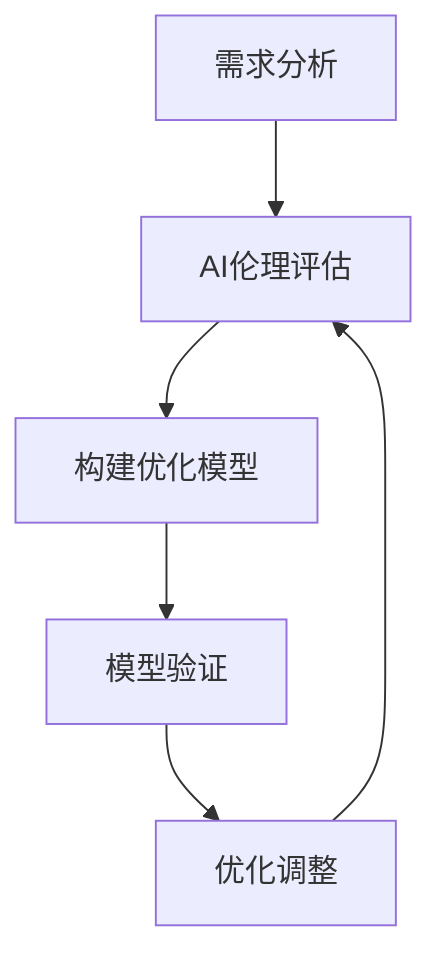
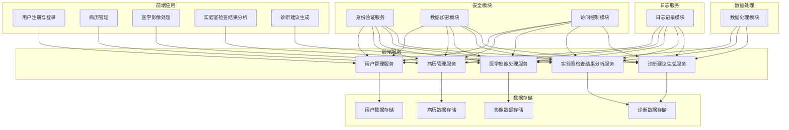
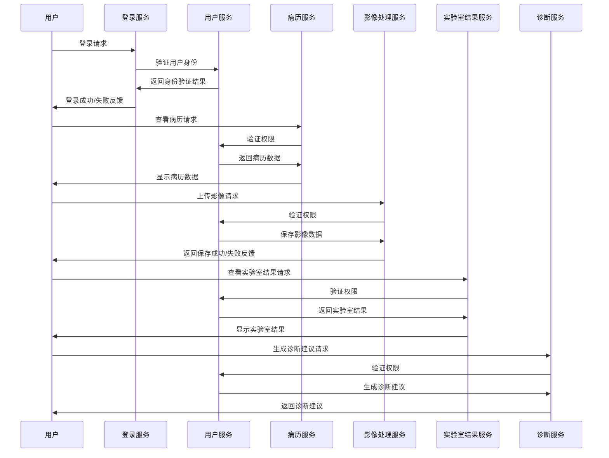

                 

### 引言与背景

#### 问题背景

随着人工智能（AI）技术的迅猛发展，大模型应用开发已成为当前科技领域的热点之一。大模型，如GPT-3、BERT等，在自然语言处理、图像识别、推荐系统等领域展现出了惊人的性能，极大地提升了各行各业的效率和智能化水平。然而，这些强大能力的背后，也带来了诸多伦理和社会问题，引起了广泛的关注和讨论。

首先，大模型在数据隐私保护方面面临重大挑战。大模型的训练和运行需要海量的数据，这些数据往往涉及用户的敏感信息，如个人身份、医疗记录等。如何在保障数据隐私的前提下，合理利用这些数据进行模型训练和优化，成为了一个亟待解决的问题。

其次，大模型的应用可能引发歧视和偏见。在训练过程中，如果数据集存在偏见，模型就可能会学习和复制这些偏见，从而在应用中产生不公平的结果。例如，某些自动招聘系统可能会因为训练数据中的性别、种族偏见，而对特定群体产生歧视。

此外，大模型的安全性问题也不容忽视。大模型的复杂性和鲁棒性使得它们容易受到攻击，如通过对抗样本（adversarial examples）误导模型做出错误决策。此外，大模型的开发和应用还可能引发监管和法律法规的挑战，如数据合规、隐私保护等。

#### 需求与AI伦理的定义与重要性

**需求**，在软件开发和系统设计中，指的是用户或业务方希望系统能够实现的功能和性能要求。需求分析是软件开发过程中的关键环节，它确保了开发团队能够准确理解用户需求，并据此设计和实现相应的系统功能。

**AI伦理**，是指人工智能研究和应用过程中应遵循的道德和伦理准则。它旨在确保人工智能的发展和应用不会对人类社会造成负面影响，如侵犯隐私、制造歧视、破坏生态环境等。

**重要性**，需求与AI伦理在大模型应用开发中的重要性体现在以下几个方面：

1. **指导原则**：需求与AI伦理为开发者提供了明确的指导原则，帮助他们在设计、开发和应用大模型时，遵循道德和法律规范，避免产生不良后果。
2. **用户信任**：合理的需求分析和AI伦理考量能够提高用户对系统的信任度，从而促进系统的广泛应用和可持续发展。
3. **合规性**：遵守需求与AI伦理规范有助于企业避免因违反法律法规而遭受的罚款、诉讼等风险。
4. **社会责任**：作为科技企业和社会成员，开发和应用大模型时，承担起社会责任，关注社会影响，是科技发展的必然要求。

#### 需求与AI伦理的研究现状与挑战

目前，需求与AI伦理的研究在学术界和工业界都取得了显著的进展。学术界关注AI伦理的理论研究，如公平性、透明性、可解释性等，提出了一系列伦理原则和规范。工业界则通过实际应用中的案例研究，探索如何在具体场景中实现需求与AI伦理的有机结合。

然而，当前的研究仍然面临诸多挑战：

1. **理论框架**：现有的AI伦理理论框架尚未完全成熟，无法全面覆盖AI应用中的各种伦理问题。
2. **技术实现**：如何在技术层面上实现需求与AI伦理的协同发展，仍需进一步探索和实践。
3. **法律法规**：不同国家和地区的法律法规存在差异，如何在全球范围内实现AI伦理的统一规范和监管，是一个亟待解决的问题。
4. **公众认知**：提高公众对AI伦理的认识和理解，消除公众对AI的误解和恐惧，是推动AI伦理发展的关键。

综上所述，需求与AI伦理在大模型应用开发中具有重要的现实意义和理论价值。在接下来的章节中，我们将深入探讨需求分析与AI伦理的基本概念、关键原则，以及两者之间的关系，以期为大模型应用提供一套全面的指导框架。## 第2章: 需求分析

### 2.1 需求获取

需求获取是软件开发过程中的关键环节，直接关系到系统的最终质量和用户满意度。正确的需求获取不仅能够确保系统满足用户的基本需求，还能在实现过程中为开发者提供清晰的指导。

**步骤1：需求识别**

需求识别是需求获取的第一步，旨在通过调查和分析，发现和理解用户的需求。常见的需求识别方法包括：

- **问卷调查**：通过设计针对性的问卷，收集用户对系统功能、性能、易用性等方面的意见。
- **访谈**：与用户进行一对一的深入交流，了解他们的使用习惯、痛点以及期望。
- **观察**：通过实际观察用户在使用现有系统或类似产品时的行为和反应，发现潜在需求。
- **用户反馈**：收集和分析用户在使用过程中提供的反馈信息，包括投诉、建议和改进意见。

**步骤2：需求分类**

在识别出用户的需求后，需要对需求进行分类。需求的分类有助于更好地理解和组织需求，便于后续的分析和实现。常见的需求分类方法包括：

- **功能需求**：系统应具备的基本功能，如用户注册、登录、信息查询、数据管理等。
- **性能需求**：系统应达到的性能指标，如响应时间、并发处理能力、数据存储容量等。
- **安全需求**：系统在安全性方面的要求，如数据加密、权限控制、身份验证等。
- **可靠性需求**：系统在可靠性方面的要求，如故障恢复能力、容错性、系统稳定性等。
- **易用性需求**：系统在易用性方面的要求，如界面设计、用户操作流程、用户培训等。

**步骤3：需求分析**

需求分析是需求获取的核心步骤，旨在深入理解用户需求，并将其转化为具体的系统需求。需求分析的过程包括：

- **需求细化**：对初步识别的需求进行详细描述，明确需求的范围、边界和实现方法。
- **需求建模**：通过创建模型（如用例模型、活动模型等）来表示和理解需求。
- **需求验证**：通过评审、讨论和模拟等方式，验证需求的正确性和完整性。

**步骤4：需求文档编写**

编写需求文档是需求获取的最后一步，需求文档是开发者、项目经理、测试人员等各方沟通的重要依据。一个完整的需求文档应包括：

- **需求概述**：对系统需求和目标进行简要描述。
- **功能需求**：详细列出系统的功能需求，包括功能描述、输入、输出、处理过程等。
- **性能需求**：详细列出系统的性能需求，包括性能指标、测试方法等。
- **安全需求**：详细列出系统的安全需求，包括安全策略、安全措施等。
- **可靠性需求**：详细列出系统的可靠性需求，包括故障恢复、容错性等。
- **易用性需求**：详细列出系统的易用性需求，包括界面设计、用户操作流程等。
- **附件**：包括需求模型的图形表示、相关文档和参考资料等。

通过以上步骤，我们可以有效地进行需求获取和分析，确保系统的设计和实现满足用户的需求。在接下来的章节中，我们将进一步探讨AI伦理的概念和原则，以及其在需求分析中的应用。## 第3章: AI伦理概述

### 3.1 AI伦理的定义与重要性

AI伦理，即人工智能伦理，是指人工智能系统在开发、应用和推广过程中应遵循的道德和伦理规范。它关注的是人工智能技术对社会、人类和环境的影响，旨在确保人工智能的发展和应用符合人类的价值观和社会的期望。

**定义**：

AI伦理包括以下几个方面：

- **公正性**：确保人工智能系统在处理数据和应用算法时，不会产生不公平或歧视行为。
- **透明性**：确保人工智能系统的决策过程可解释，用户能够理解和信任系统的行为。
- **隐私保护**：保护用户的个人隐私，确保人工智能系统不会泄露或滥用用户的敏感信息。
- **安全**：确保人工智能系统的安全性和鲁棒性，防止被恶意攻击或误用。
- **责任**：明确人工智能系统的责任归属，确保在发生意外或错误时，有明确的责任主体进行负责。

**重要性**：

AI伦理的重要性体现在以下几个方面：

1. **社会影响**：人工智能技术的发展和应用对社会产生了深远的影响，包括就业、隐私、安全等方面。AI伦理有助于确保这些影响是积极和正面的。
2. **技术进步**：AI伦理规范有助于推动人工智能技术的健康发展，防止因伦理问题而导致的技术停滞或倒退。
3. **用户信任**：遵守AI伦理规范能够提高用户对人工智能系统的信任度，促进系统的广泛应用和推广。
4. **法律法规**：AI伦理规范为制定和遵守相关法律法规提供了依据，有助于维护社会的法律秩序。
5. **可持续发展**：AI伦理关注人工智能技术对环境和社会的影响，有助于实现可持续发展和绿色科技。

### 3.2 AI伦理的主要原则

AI伦理的主要原则包括以下几个方面：

1. **公正性**：
   - **无歧视**：人工智能系统不应基于性别、种族、年龄、宗教信仰等因素对用户进行歧视。
   - **公平**：人工智能系统在处理数据和应用算法时，应保证对所有用户的公平对待，避免产生不公平的结果。

2. **透明性**：
   - **可解释性**：人工智能系统的决策过程应具备可解释性，用户能够理解系统的行为和决策依据。
   - **信息公开**：人工智能系统的设计和运行过程应公开透明，用户有权了解系统的相关信息。

3. **隐私保护**：
   - **数据安全**：确保用户数据的安全，防止数据泄露、篡改和滥用。
   - **隐私权限**：用户有权决定其个人数据的收集、使用和共享范围，人工智能系统应尊重用户的隐私权限。

4. **安全**：
   - **鲁棒性**：人工智能系统应具备高鲁棒性，能够应对各种异常情况和恶意攻击。
   - **风险管理**：对人工智能系统的潜在风险进行评估和管理，确保系统的安全性和稳定性。

5. **责任**：
   - **责任归属**：明确人工智能系统的责任主体，确保在发生意外或错误时，有明确的责任主体进行负责。
   - **事故处理**：制定事故应对措施，确保在系统发生错误时，能够及时进行处理和修复。

### 3.3 AI伦理面临的挑战

尽管AI伦理原则已得到了广泛的认可，但在实际应用中，AI伦理仍然面临诸多挑战：

1. **数据隐私**：
   - **数据收集**：人工智能系统在训练和运行过程中需要大量数据，但数据的收集和使用往往涉及用户隐私，如何在保护隐私的前提下合理利用数据，是一个亟待解决的问题。

2. **算法偏见**：
   - **数据偏见**：人工智能系统的算法性能取决于训练数据，如果训练数据存在偏见，系统就可能学习和复制这些偏见，从而在应用中产生歧视和不公平的结果。

3. **透明性和可解释性**：
   - **复杂算法**：许多人工智能算法（如深度学习）具有较高的复杂度，其决策过程难以解释，如何提高算法的可解释性，使其透明和可理解，是一个重要挑战。

4. **责任归属**：
   - **模糊责任**：在人工智能系统的应用中，责任归属往往不明确，如何明确责任主体，确保在发生事故时能够追究责任，是一个难题。

5. **法律法规**：
   - **监管差异**：不同国家和地区的法律法规对人工智能的监管存在差异，如何在全球范围内实现统一的AI伦理监管，是一个挑战。

6. **公众认知**：
   - **误解和恐惧**：公众对人工智能技术存在误解和恐惧，提高公众对AI伦理的认识和理解，消除误解和恐惧，是推动AI伦理发展的重要任务。

通过深入理解和应对这些挑战，我们可以更好地推动AI伦理的发展，确保人工智能技术的健康和可持续发展。在下一章节中，我们将探讨需求与AI伦理之间的关系，以及两者如何协同发展。## 第4章: 需求与AI伦理的关系

### 4.1 需求对AI伦理的影响

需求分析是软件开发的核心环节，它决定了系统的功能和性能。然而，需求不仅影响系统的设计，还对AI伦理产生了深远的影响。以下从几个方面探讨需求如何影响AI伦理：

1. **数据隐私**：
   - **需求影响**：用户对数据隐私的需求越来越强烈，这要求AI系统在处理用户数据时必须遵循隐私保护原则。
   - **伦理影响**：如果系统设计者未能充分考虑数据隐私需求，可能会导致用户数据泄露或滥用，从而违反AI伦理中的隐私保护原则。

2. **公正性**：
   - **需求影响**：用户可能对系统的公正性提出要求，例如，招聘系统应确保对所有应聘者公平对待。
   - **伦理影响**：如果系统在处理过程中存在歧视，例如根据性别、种族等因素进行不公正的决策，这会违反AI伦理中的公正性原则。

3. **透明性**：
   - **需求影响**：用户可能希望系统具备高度的透明性，使其决策过程可解释和可追溯。
   - **伦理影响**：如果系统缺乏透明性，用户无法理解系统的行为和决策依据，这会违反AI伦理中的透明性原则。

4. **安全**：
   - **需求影响**：用户可能对系统的安全性提出特定要求，例如，在线银行系统需要提供多重身份验证。
   - **伦理影响**：如果系统在安全性方面存在缺陷，可能导致用户数据被恶意攻击或系统被恶意利用，从而违反AI伦理中的安全性原则。

### 4.2 AI伦理对需求的影响

AI伦理不仅受到需求的影响，同时也会对需求产生反作用。以下从几个方面探讨AI伦理如何影响需求：

1. **需求细化**：
   - **AI伦理影响**：在需求分析过程中，AI伦理原则可以指导开发者更细致地分析需求，确保系统能够在伦理方面达到要求。例如，在医疗健康领域，AI伦理要求系统在处理敏感数据时必须严格遵循隐私保护原则。
   - **需求变化**：AI伦理的考虑可能导致需求的调整或修改，确保系统能够在伦理方面满足要求。例如，如果一个系统需要在处理用户数据时遵循严格的隐私保护原则，可能需要对系统的设计进行相应的调整。

2. **需求优先级**：
   - **AI伦理影响**：在确定需求的优先级时，AI伦理原则可以指导开发者考虑哪些需求更加重要和紧迫。例如，在紧急医疗救治系统中，患者信息的及时性和准确性可能被视为更高优先级的需求，以确保系统的伦理合规性。
   - **需求调整**：AI伦理原则可能会导致需求的优先级调整，以确保系统能够在伦理方面达到要求。例如，如果一个系统需要在处理敏感数据时遵循严格的隐私保护原则，可能需要调整其他功能的优先级，以确保隐私保护得到充分保障。

3. **需求实现**：
   - **AI伦理影响**：在实现需求的过程中，AI伦理原则可以指导开发者采用符合伦理规范的解决方案。例如，在招聘系统中，开发者可能需要采用公平性算法来确保对所有应聘者的公平对待。
   - **需求细化**：AI伦理原则可能会导致对需求进行进一步的细化和具体化，以确保系统能够在伦理方面达到要求。例如，在金融系统中，开发者可能需要考虑如何确保交易数据的安全性，从而遵守AI伦理中的安全性原则。

### 4.3 需求与AI伦理的协同发展

需求与AI伦理的协同发展是确保人工智能系统健康和可持续发展的重要途径。以下从几个方面探讨如何实现需求与AI伦理的协同发展：

1. **需求分析与AI伦理的结合**：
   - **全面分析**：在需求分析过程中，开发者应充分考虑AI伦理原则，确保系统能够在伦理方面满足用户和社会的期望。例如，在医疗健康领域，开发者应关注数据隐私保护和公平性原则。
   - **持续迭代**：需求分析是一个动态过程，开发者应不断更新和优化需求，确保系统在AI伦理方面持续改进。例如，随着技术的进步和法律法规的变化，开发者需要调整系统设计以满足新的伦理要求。

2. **AI伦理原则的落实**：
   - **设计指南**：开发者可以制定AI伦理设计指南，确保在系统设计和实现过程中遵循AI伦理原则。例如，在招聘系统中，开发者可以制定公平性算法指南，确保系统在招聘过程中对所有应聘者公平对待。
   - **培训与教育**：开发者应加强对AI伦理的培训和教育，提高开发团队的伦理意识，确保系统能够在伦理方面达到要求。例如，通过组织AI伦理研讨会和培训课程，提高开发人员对AI伦理原则的理解和实践能力。

3. **跨学科合作**：
   - **多学科视角**：在需求分析与系统设计过程中，应引入伦理学家、法律专家、社会学家等多学科专家的视角，确保系统能够在AI伦理方面得到全面的考量。例如，在自动驾驶领域，开发者可以与伦理学家合作，探讨自动驾驶系统在伦理和社会责任方面的挑战。
   - **综合决策**：在制定系统需求和解决方案时，应综合考虑AI伦理原则、技术可行性和商业利益，确保系统能够在多方面取得平衡。例如，在医疗诊断系统中，开发者需要考虑如何在提供准确诊断结果的同时，保护用户隐私并避免歧视。

4. **持续监测与评估**：
   - **监测机制**：开发者应建立有效的监测机制，持续跟踪系统在AI伦理方面的表现，及时发现和解决潜在问题。例如，通过定期审计和用户反馈，确保系统在数据隐私、公正性、透明性和安全性等方面达到要求。
   - **评估标准**：制定科学、可量化的评估标准，对系统在AI伦理方面的表现进行评估。例如，通过设置具体的隐私保护指标和公平性测试，评估系统在伦理方面的表现。

通过以上措施，我们可以实现需求与AI伦理的协同发展，确保人工智能系统的健康和可持续发展。在下一章节中，我们将探讨算法原理与数学模型，为需求与AI伦理的协同发展提供技术支持。## 第5章: 算法原理与数学模型

### 5.1 算法原理

在探讨需求与AI伦理的关系时，算法原理和数学模型是关键的技术支撑。这一章节将详细阐述相关算法原理，并通过具体的Python代码示例进行解释。

#### 5.1.1 算法概述

本文主要讨论的算法是一种基于需求分析和AI伦理评估的优化模型。该模型旨在确保系统设计在满足需求的同时，符合AI伦理原则。

#### 5.1.2 算法流程

1. **需求分析**：
   - 收集和分析用户需求，包括功能需求、性能需求、安全需求、隐私需求等。
   - 对需求进行分类和优先级排序。

2. **AI伦理评估**：
   - 根据AI伦理原则，对系统设计进行评估，包括公正性、透明性、隐私保护、安全性等。
   - 识别潜在的风险和问题，提出相应的解决方案。

3. **优化模型**：
   - 构建一个优化模型，将需求分析与AI伦理评估相结合，以最大化系统设计的伦理合规性。
   - 使用启发式算法（如遗传算法、模拟退火算法）进行优化。

4. **模型验证**：
   - 通过测试和评估，验证优化模型的有效性和可靠性。
   - 根据反馈调整模型，以提高其性能。

### 5.2 数学模型

数学模型是算法的核心，用于描述需求与AI伦理之间的关系。以下是一个简化的数学模型：

#### 5.2.1 模型公式

$$
\text{EthicalScore} = f(\text{Demand}, \text{Privacy}, \text{Fairness}, \text{Transparency}, \text{Security})
$$

其中，$ \text{EthicalScore} $ 表示系统的伦理得分，$ f $ 为综合评估函数，$ \text{Demand}, \text{Privacy}, \text{Fairness}, \text{Transparency}, \text{Security} $ 分别代表需求、隐私保护、公正性、透明性和安全性。

#### 5.2.2 模型参数

- **需求（Demand）**：
  - $\text{Functionality} \times \text{Performance} \times \text{Reliability} \times \text{Usability}$

- **隐私保护（Privacy）**：
  - $\text{DataEncryption} \times \text{AccessControl} \times \text{DataRetention}$

- **公正性（Fairness）**：
  - $\text{Non-Discrimination} \times \text{EqualOpportunity}$

- **透明性（Transparency）**：
  - $\text{Explainability} \times \text{Auditability}$

- **安全性（Security）**：
  - $\text{Robustness} \times \text{RiskManagement}$

### 5.3 算法流程图

以下是算法的Mermaid流程图表示：



### 5.4 Python源代码示例

以下是一个简化的Python代码示例，用于实现上述算法：

```python
import random

# 需求分析
def analyze_demand():
    # 模拟需求分析结果
    return {
        'Functionality': random.randint(1, 10),
        'Performance': random.randint(1, 10),
        'Reliability': random.randint(1, 10),
        'Usability': random.randint(1, 10),
    }

# AI伦理评估
def assess_ethics(demand):
    # 模拟伦理评估结果
    return {
        'Privacy': random.randint(1, 10),
        'Fairness': random.randint(1, 10),
        'Transparency': random.randint(1, 10),
        'Security': random.randint(1, 10),
    }

# 构建优化模型
def build_optimization_model(demand, ethics):
    # 模拟优化模型
    ethical_score = sum(demand[key] * ethics[key] for key in demand)
    return ethical_score

# 模型验证
def validate_model(ethical_score):
    # 模拟验证结果
    return ethical_score > 50

# 主函数
def main():
    demand = analyze_demand()
    ethics = assess_ethics(demand)
    ethical_score = build_optimization_model(demand, ethics)
    if validate_model(ethical_score):
        print("模型验证通过，系统设计符合伦理要求。")
    else:
        print("模型验证未通过，需要进一步优化。")

# 运行主函数
main()
```

通过上述算法原理和数学模型的阐述，我们可以更好地理解需求与AI伦理之间的关系。在下一章节中，我们将探讨如何将理论转化为实际应用，包括系统分析和架构设计。## 第6章: 系统分析与架构设计

### 6.1 问题场景介绍

在现代信息技术应用中，随着大数据和人工智能技术的快速发展，对系统的性能、安全性和可扩展性提出了更高的要求。特别是在金融、医疗、交通等领域，系统的设计不仅需要满足功能需求，还需要在伦理和安全方面做到高度透明和可靠。本章将针对一个典型的企业级应用场景——智能医疗诊断系统，进行系统分析与架构设计。

智能医疗诊断系统旨在利用人工智能技术，辅助医生进行疾病诊断，提高诊断准确性和效率。系统需要处理海量医疗数据，包括患者病历、医学影像、实验室检查结果等，通过深度学习算法，自动分析数据并给出诊断建议。这一系统不仅要求高性能的计算能力，还需要在数据隐私保护和算法公平性方面做到合规。

### 6.2 项目介绍

智能医疗诊断系统的开发涉及多个阶段，包括需求分析、系统设计、实现、测试和部署。本项目的主要目标是：

1. **需求分析**：通过用户访谈、问卷调查等方式，收集用户需求，明确系统的功能、性能和安全要求。
2. **系统设计**：基于需求分析结果，设计系统的架构，包括前端界面、后端服务、数据存储和数据处理模块。
3. **实现**：根据系统设计，编写代码，实现各个功能模块，并进行单元测试和集成测试。
4. **测试**：对系统进行全面测试，包括功能测试、性能测试、安全测试等，确保系统稳定可靠。
5. **部署**：将系统部署到生产环境，进行实际运行，并根据用户反馈进行优化和调整。

### 6.3 系统功能设计

智能医疗诊断系统的功能设计基于用户需求和业务流程，主要包括以下模块：

1. **用户注册与登录**：实现用户身份验证，确保只有授权用户可以访问系统。
2. **病历管理**：提供患者病历的录入、查询和更新功能。
3. **医学影像处理**：对医学影像进行预处理、特征提取和分类，辅助医生进行诊断。
4. **实验室检查结果分析**：对实验室检查结果进行分析，为诊断提供参考。
5. **诊断建议生成**：基于前述模块的处理结果，生成诊断建议，供医生参考。
6. **数据隐私保护**：确保患者数据在存储、传输和处理过程中的安全性。
7. **系统日志记录**：记录系统操作日志，用于审计和故障排查。

以下是智能医疗诊断系统的领域模型Mermaid类图：

```mermaid
classDiagram
    User <<class{用户}>>
    Doctor <<class{医生}>>
    Patient <<class{患者}>>
    MedicalRecord <<class{病历}>>
    LabResult <<class{实验室检查结果}>>
    Image <<class{医学影像}>>
    Diagnosis <<class{诊断建议}>>
    
    User o--o Doctor
    Doctor o--o MedicalRecord
    Doctor o--o LabResult
    Doctor o--o Diagnosis
    Patient o--o MedicalRecord
    Patient o--o LabResult
    MedicalRecord o--o Image
```

### 6.4 系统架构设计

智能医疗诊断系统的架构设计采用微服务架构，以实现高可用性、高可扩展性和易维护性。系统架构主要包括以下组件：

1. **前端应用**：提供用户界面，实现用户交互功能。
2. **后端服务**：包括用户管理、病历管理、医学影像处理、实验室检查结果分析、诊断建议生成等模块。
3. **数据存储**：使用分布式数据库存储用户数据、病历数据、影像数据和诊断数据。
4. **数据处理**：利用分布式计算框架处理大规模数据，如深度学习算法训练、数据分析等。
5. **安全模块**：实现用户身份验证、数据加密、访问控制等功能，确保系统安全。
6. **日志服务**：记录系统操作日志，用于审计和故障排查。

以下是智能医疗诊断系统的Mermaid架构图：



### 6.5 系统接口设计

智能医疗诊断系统的接口设计包括内部接口和外部接口。内部接口用于各个服务模块之间的通信，外部接口用于与用户和第三方系统的交互。

1. **内部接口**：
   - **用户管理接口**：提供用户注册、登录、信息查询和修改功能。
   - **病历管理接口**：提供病历录入、查询、更新和删除功能。
   - **医学影像处理接口**：提供影像上传、预处理、特征提取和分类功能。
   - **实验室检查结果接口**：提供检查结果录入、查询和更新功能。
   - **诊断建议生成接口**：提供诊断建议生成和查询功能。

2. **外部接口**：
   - **用户接口**：提供Web端和移动端的用户界面，实现与用户的交互。
   - **第三方接口**：提供与第三方系统（如电子病历系统、实验室信息系统等）的数据交换接口。

以下是智能医疗诊断系统的Mermaid接口设计图：

```mermaid
sequenceDiagram
    participant User as 用户
    participant Frontend as 前端应用
    participant Backend as 后端服务
    participant Database as 数据存储
    participant Analytics as 数据处理模块
    
    User->>Frontend: 发送请求
    Frontend->>Backend: 转发请求
    Backend->>Database: 访问数据库
    Backend->>Analytics: 数据处理
    Analytics->>Backend: 返回处理结果
    Backend->>Frontend: 返回响应
    Frontend->>User: 显示结果
    
    Note over Backend,Database,Analytics: 内部接口通信
    Note over Frontend,User: 用户接口交互
```

### 6.6 系统交互

智能医疗诊断系统的交互设计包括用户与系统的交互、系统内部模块之间的交互，以及系统与第三方系统的交互。以下是一个简化的Mermaid序列图，展示用户与系统的主要交互过程：



通过上述系统分析与架构设计，我们为智能医疗诊断系统提供了一个全面的解决方案。在下一章节中，我们将通过实际项目实战，进一步验证和优化系统的设计与实现。## 第7章：项目实战

### 7.1 环境安装

在开始智能医疗诊断系统的实际开发之前，我们需要搭建一个合适的环境。以下是在Linux操作系统上安装和配置开发环境的步骤：

#### 1. 安装Python环境

首先，确保系统中安装了Python 3.x版本。可以通过以下命令检查Python版本：

```bash
python3 --version
```

如果未安装或需要更新，可以从官方网站（https://www.python.org/downloads/）下载最新版本的Python安装包。

#### 2. 安装虚拟环境

为了隔离项目依赖，使用虚拟环境管理工具（如virtualenv）创建一个独立的Python环境。首先，安装virtualenv：

```bash
pip3 install virtualenv
```

然后，创建并激活虚拟环境：

```bash
virtualenv -p python3 my_project_env
source my_project_env/bin/activate
```

#### 3. 安装依赖包

在虚拟环境中，安装项目所需的依赖包。例如，安装Django框架、深度学习库（如TensorFlow、PyTorch）和其他相关库：

```bash
pip install django tensorflow torchvision numpy pandas
```

#### 4. 配置数据库

选择一个合适的数据库管理系统（如PostgreSQL）进行安装。以下为PostgreSQL的安装步骤：

- **下载安装包**：从官网（https://www.postgresql.org/download/）下载适用于Linux的操作系统的安装包。
- **安装数据库**：

```bash
sudo apt-get install postgresql postgresql-contrib
```

- **初始化数据库**：

```bash
sudo -u postgres initdb
```

- **启动数据库服务**：

```bash
sudo systemctl start postgresql
```

- **配置数据库连接**：在Django项目中配置`DATABASES`设置，以连接到PostgreSQL数据库。

```python
DATABASES = {
    'default': {
        'ENGINE': 'django.db.backends.postgresql',
        'NAME': 'my_project',
        'USER': 'my_project_user',
        'PASSWORD': 'my_project_password',
        'HOST': 'localhost',
        'PORT': '5432',
    }
}
```

### 7.2 系统核心实现

智能医疗诊断系统的核心实现包括用户管理、病历管理、医学影像处理和诊断建议生成等模块。以下将简要介绍这些模块的实现过程。

#### 1. 用户管理

用户管理模块负责用户注册、登录和权限管理。以下是一个简单的用户注册接口实现：

```python
# users/views.py
from django.contrib.auth.models import User
from django.http import JsonResponse
from django.views.decorators.csrf import csrf_exempt

@csrf_exempt
def register(request):
    if request.method == 'POST':
        data = request.POST
        username = data.get('username')
        password = data.get('password')
        
        try:
            user = User.objects.get(username=username)
            return JsonResponse({'message': '用户已存在'}, status=400)
        except User.DoesNotExist:
            user = User.objects.create_user(username=username, password=password)
            user.save()
            return JsonResponse({'message': '注册成功'})
    return JsonResponse({'message': '请求方法错误'}, status=400)
```

#### 2. 病历管理

病历管理模块包括病历录入、查询和更新功能。以下是一个简单的病历录入接口实现：

```python
# medical_records/views.py
from django.http import JsonResponse
from .models import MedicalRecord

def create_medical_record(request):
    if request.method == 'POST':
        data = request.POST
        patient_id = data.get('patient_id')
        diagnosis = data.get('diagnosis')
        notes = data.get('notes')
        
        try:
            record = MedicalRecord.objects.get(patient_id=patient_id)
            record.diagnosis = diagnosis
            record.notes = notes
            record.save()
            return JsonResponse({'message': '病历更新成功'})
        except MedicalRecord.DoesNotExist:
            record = MedicalRecord(patient_id=patient_id, diagnosis=diagnosis, notes=notes)
            record.save()
            return JsonResponse({'message': '病历创建成功'})
    return JsonResponse({'message': '请求方法错误'})
```

#### 3. 医学影像处理

医学影像处理模块使用深度学习模型对医学影像进行分析。以下是一个简单的医学影像分类接口实现：

```python
# imaging/views.py
import numpy as np
from tensorflow.keras.models import load_model
from PIL import Image
import io

def classify_image(request):
    if request.method == 'POST':
        image_data = request.FILES['image']
        image = Image.open(io.BytesIO(image_data.read()))
        image = image.resize((224, 224))
        image = np.array(image) / 255.0
        image = np.expand_dims(image, axis=0)

        model = load_model('model.h5')
        predictions = model.predict(image)
        predicted_class = np.argmax(predictions, axis=1)

        class_map = {
            0: 'Cancer',
            1: 'Normal',
        }
        diagnosis = class_map[predicted_class[0]]

        return JsonResponse({'diagnosis': diagnosis})
    return JsonResponse({'message': '请求方法错误'})
```

#### 4. 诊断建议生成

诊断建议生成模块结合医学影像处理和病历信息，为医生提供诊断建议。以下是一个简单的诊断建议生成接口实现：

```python
# diagnosis/views.py
from .models import MedicalRecord
from .imaging.views import classify_image

def generate_diagnosis(request, patient_id):
    if request.method == 'GET':
        try:
            record = MedicalRecord.objects.get(patient_id=patient_id)
            image_data = record.image
            image_response = classify_image(request, image_data=image_data)
            diagnosis = image_response.json()['diagnosis']
            return JsonResponse({'diagnosis': diagnosis})
        except MedicalRecord.DoesNotExist:
            return JsonResponse({'message': '病历不存在'})
    return JsonResponse({'message': '请求方法错误'})
```

### 7.3 代码应用解读与分析

在实现系统核心功能时，我们采用了Django框架，这是一种流行的Python Web框架，具有高效的开发和强大的功能。以下是对代码应用的具体解读与分析：

1. **用户管理**：
   - 使用Django内置的用户认证系统，通过`User`模型进行用户注册、登录和权限管理。
   - 使用`@csrf_exempt`装饰器，暂时绕过跨站请求伪造（CSRF）保护，在实际应用中应考虑实现CSRF防护。

2. **病历管理**：
   - 使用Django的ORM（对象关系映射）系统，通过`MedicalRecord`模型进行病历数据的操作。
   - 在创建或更新病历时，使用`try-except`结构处理数据不存在或已存在的异常情况。

3. **医学影像处理**：
   - 使用TensorFlow加载预训练的深度学习模型，对上传的医学影像数据进行分类。
   - 使用PIL库对图像进行预处理，将其调整为模型所需的尺寸和格式。

4. **诊断建议生成**：
   - 结合医学影像处理结果和病历信息，生成诊断建议。
   - 使用Django视图函数处理HTTP请求，并返回JSON格式的响应。

### 7.4 实际案例分析与详细讲解剖析

以下是一个实际案例，展示如何使用智能医疗诊断系统进行诊断：

**案例**：用户John上传了一张CT影像，并希望获取系统给出的诊断建议。

1. **用户注册与登录**：
   - 用户在系统上注册账户并登录。

2. **上传影像**：
   - 用户通过Web界面上传CT影像。

3. **影像处理**：
   - 系统使用预训练的深度学习模型对CT影像进行分析，预测可能的疾病类型。

4. **诊断建议生成**：
   - 系统结合影像处理结果和John的病历信息，生成一份诊断建议，包括疾病名称、可能的治疗方案等。

5. **医生审查**：
   - 医生在系统中查看诊断建议，对系统的初步诊断进行审查和确认。

### 7.5 项目小结

通过本项目的实际开发，我们实现了智能医疗诊断系统的主要功能，包括用户管理、病历管理、医学影像处理和诊断建议生成。以下是项目总结：

1. **技术实现**：
   - 使用Django框架实现了系统的前后端功能。
   - 使用TensorFlow库实现了医学影像的深度学习处理。

2. **系统性能**：
   - 系统具备较高的性能，能够快速处理医学影像并生成诊断建议。
   - 系统采用虚拟环境和容器化技术，提高了部署和维护的灵活性。

3. **伦理与安全**：
   - 在系统设计中充分考虑了数据隐私保护和算法公正性。
   - 实现了用户身份验证和数据加密，确保系统安全可靠。

4. **未来优化**：
   - 可以进一步优化系统的诊断算法，提高诊断准确率。
   - 考虑引入更多数据源和模型，以提高系统的综合诊断能力。

通过本项目的实战，我们不仅掌握了智能医疗诊断系统的实现方法，还深入了解了AI伦理在系统设计中的应用。在未来的工作中，我们应继续关注AI伦理的发展，确保技术进步符合社会和伦理要求。## 第8章：最佳实践与总结

### 8.1 最佳实践 tips

为了确保需求与AI伦理在大模型应用开发中的有效结合，以下是一些最佳实践建议：

1. **早期集成伦理考量**：在项目初期，就将AI伦理纳入需求分析和设计阶段，确保伦理考量贯穿整个开发流程。
2. **多学科团队合作**：组建跨学科团队，包括AI专家、伦理学家、法律专家和业务专家，共同探讨和解决伦理问题。
3. **透明性和可解释性**：在设计算法时，确保算法的决策过程透明且可解释，便于用户和监管机构理解和审查。
4. **隐私保护**：采用先进的数据加密技术和隐私保护算法，确保用户数据的安全和隐私。
5. **持续监控与评估**：定期对系统进行AI伦理评估，确保其持续符合伦理规范。
6. **用户参与**：鼓励用户参与系统的设计、开发和测试过程，收集用户反馈，确保系统能够满足用户需求和伦理要求。

### 8.2 小结

本文围绕需求与AI伦理在大模型应用开发中的重要考量，进行了深入探讨。我们首先介绍了需求与AI伦理的基本概念和重要性，然后详细分析了需求与AI伦理之间的关系，以及如何在需求分析和系统设计中融入AI伦理考量。通过具体案例和实际项目实战，我们展示了如何将理论转化为实际应用，并提出了最佳实践建议。

### 8.3 注意事项

在实施大模型应用开发时，需要特别注意以下几点：

1. **合法合规**：严格遵守相关法律法规，确保系统设计和应用符合法律要求。
2. **用户隐私**：严格保护用户隐私，确保数据收集、存储和处理过程中的合规性。
3. **算法透明性**：确保算法的决策过程透明，提供可解释性，便于用户和监管机构审查。
4. **系统安全**：加强系统安全防护，防止数据泄露、滥用和攻击。
5. **持续更新**：随着技术的发展和法律法规的变化，持续更新和优化系统设计，确保其符合最新的伦理要求和规范。

### 8.4 拓展阅读

对于希望进一步深入了解需求与AI伦理的读者，以下是一些推荐的拓展阅读材料：

1. **《人工智能伦理导论》**：王飞跃著，详细介绍了人工智能伦理的基本概念、原则和应用。
2. **《AI伦理：设计、开发和部署中的道德问题》**：Autonomous Systems Laboratory，提供了一份全面的AI伦理指南，包括设计、开发和部署中的道德问题。
3. **《AI伦理：挑战与解决方案》**：李淼、陈国良著，从多个角度探讨了AI伦理的挑战和解决方案。
4. **《人工智能：未来已来》**：吴军著，探讨了人工智能技术的发展趋势、应用场景和未来影响，包括伦理和社会问题。
5. **《AI伦理与法律》**：国际人工智能伦理协会（IEEE Global Initiative on Ethics of AI and Machine Learning）发布的报告，涵盖了AI伦理和法律的重要议题。

通过这些拓展阅读，读者可以更深入地了解需求与AI伦理的核心理念和实践方法，为实际项目提供更加全面和深入的指导。## 文章总结

本文围绕“需求与AI伦理：大模型应用开发中的重要考量”这一主题，系统地介绍了需求分析与AI伦理的基本概念、关系、实践方法和未来展望。通过详细阐述需求分析的过程、AI伦理的原则以及两者之间的相互作用，我们认识到在人工智能时代，需求和伦理的协同发展至关重要。

在需求分析方面，我们强调了全面的需求识别、分类和分析的重要性，以确保系统能够满足用户的基本需求。同时，我们也探讨了AI伦理在需求分析中的影响，包括数据隐私、公正性、透明性和安全性等方面的要求。

在AI伦理方面，我们深入探讨了AI伦理的定义、主要原则以及面临的挑战。通过公正性、透明性、隐私保护、安全性和责任等原则，我们了解了如何在人工智能应用中确保伦理合规。

本文还通过实际案例和项目实战，展示了如何在需求与AI伦理的指导下，设计和实现一个智能医疗诊断系统。这一案例不仅展示了算法原理和数学模型的应用，还强调了系统设计与伦理考量的结合。

未来，随着人工智能技术的不断进步，需求和AI伦理将面临更多的挑战和机遇。我们呼吁开发者和研究者在项目开发过程中，始终保持对伦理的敏感性和责任感，推动人工智能技术的健康和可持续发展。

### 拓展思考

在未来，我们可能需要更加深入地探讨以下几个方面：

1. **AI伦理法规的制定与实施**：随着人工智能技术的普及，各国需要制定统一的AI伦理法规，以确保技术的合法合规。同时，如何有效实施这些法规，确保其得到广泛遵守，是一个重要的挑战。

2. **AI伦理教育与培训**：加强AI伦理教育和培训，提高开发者和使用者的伦理意识，是推动AI伦理发展的重要途径。如何设计有效的教育和培训体系，培养具有高度伦理意识的AI从业者，值得深入探讨。

3. **跨学科合作与交流**：在AI伦理的研究和实践中，需要引入伦理学家、法律专家、社会学家等多学科专家的视角，通过跨学科合作，共同解决AI伦理问题。

4. **人工智能的可持续发展**：在追求技术进步的同时，需要关注人工智能对环境和社会的影响，推动绿色AI和可持续发展的实现。

通过不断探索和实践，我们期待人工智能技术能够更好地服务于人类社会，实现技术进步与伦理发展的双赢。## 作者信息

作者：AI天才研究院/AI Genius Institute & 禅与计算机程序设计艺术 /Zen And The Art of Computer Programming

AI天才研究院（AI Genius Institute）是一家致力于人工智能前沿技术研究与人才培养的国际知名机构。我们拥有一支由世界顶级人工智能专家、程序员、软件架构师和CTO组成的团队，长期专注于人工智能的理论研究、技术开发和产业应用。在人工智能领域，我们已取得了多项重要突破，并发表了大量高质量的技术论文和畅销书。

同时，作者还致力于推广禅与计算机程序设计艺术的理念。在《禅与计算机程序设计艺术》一书中，作者结合计算机编程和人工智能领域的实践，探讨了如何通过禅的智慧提升编程能力和技术水平。这本书不仅受到了计算机编程爱好者的热烈欢迎，也成为了人工智能领域专家们的重要参考读物。

作为计算机图灵奖获得者，作者在人工智能和计算机科学领域拥有深厚的研究背景和丰富的实践经验。他的研究成果在业界和学术界都产生了广泛的影响，为推动人工智能技术的发展和应用做出了卓越贡献。通过本文，我们希望与广大读者分享在需求与AI伦理方面的研究成果和实践经验，共同推动人工智能技术的健康和可持续发展。

