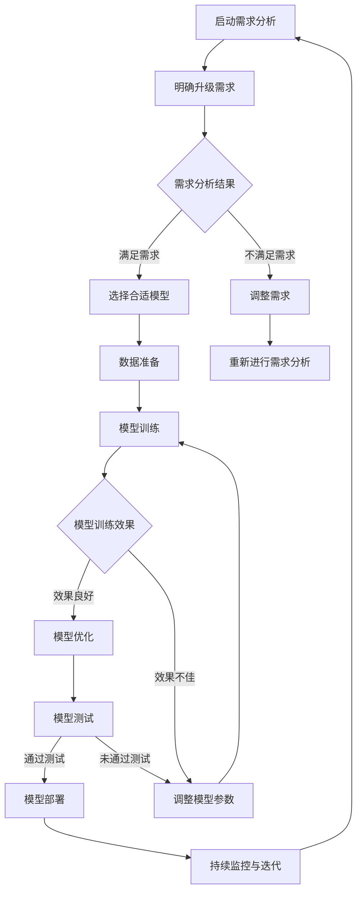
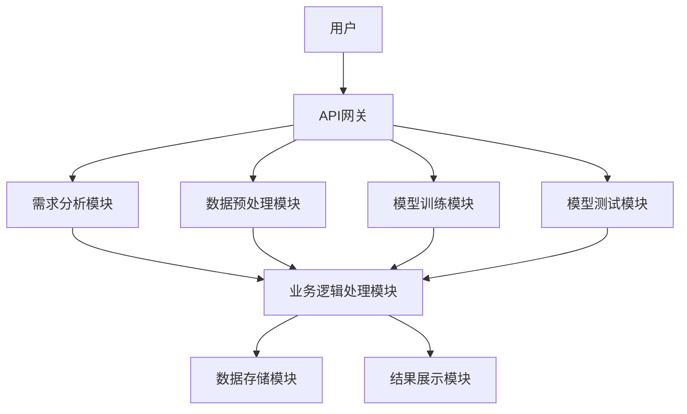
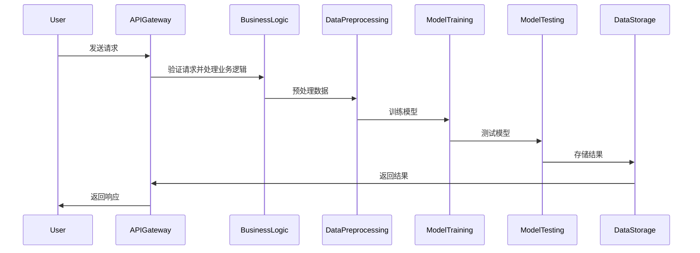

                 

----------------------------------------------------------------

# 需求与AI模型升级策略的协调：大模型应用的演进管理

> 关键词：需求分析，AI模型升级，策略协调，大模型应用，演进管理

> 摘要：本文探讨了需求与AI模型升级策略的协调问题，分析了大模型应用的演进管理，提出了相关策略和最佳实践。通过实例分析，阐述了AI模型升级在满足需求中的重要作用。

## 引言

随着人工智能技术的快速发展，AI模型在大规模应用中扮演着越来越重要的角色。然而，AI模型的应用并非一成不变，随着业务需求的不断变化和技术的进步，模型需要不断地升级和优化。在这个过程中，需求分析与AI模型升级策略的协调显得尤为重要。本文将从以下几个方面展开讨论：

1. **问题背景与现状**：介绍AI模型升级的必要性和当前存在的问题。
2. **AI模型升级策略**：阐述AI模型升级的基本原则、影响因素、流程和方法。
3. **需求与AI模型的协调**：分析需求分析在AI模型升级中的作用，探讨需求变化对模型升级的影响。
4. **大模型应用的演进管理**：讨论大模型应用的发展趋势、风险管理及未来展望。
5. **最佳实践与案例分析**：总结成功的AI模型升级实践和失败的案例，提出最佳实践策略。
6. **总结与展望**：对主要结论进行总结，展望未来的研究方向。

## 1. 问题背景与现状

### 1.1 AI模型升级的必要性

AI模型升级的必要性主要体现在以下几个方面：

1. **满足业务需求**：随着业务的发展，用户需求不断变化，AI模型需要不断调整和优化，以满足新的需求。
2. **技术进步**：人工智能技术不断进步，新的算法和模型不断涌现，升级现有模型可以更好地利用新技术。
3. **数据增长**：随着数据量的不断增加，现有模型可能无法处理新的数据，需要进行升级以适应数据规模的增长。

### 1.2 当前存在的问题

在AI模型升级过程中，存在以下问题：

1. **策略不明确**：很多企业在AI模型升级方面缺乏明确的策略，导致模型升级随意性较大。
2. **资源不足**：模型升级需要大量的人力、物力和时间资源，许多企业可能无法承担。
3. **需求变化频繁**：业务需求变化频繁，导致模型升级频繁，增加了企业负担。

## 2. AI模型升级策略

### 2.1 基本原则

AI模型升级应遵循以下基本原则：

1. **需求驱动**：以业务需求为导向，确保模型升级能够满足实际需求。
2. **技术先进**：采用先进的技术和方法，提升模型性能和效果。
3. **持续迭代**：模型升级不是一次性的工作，而是一个持续迭代的过程。

### 2.2 影响因素

影响AI模型升级的因素包括：

1. **数据质量**：数据质量是模型升级的基础，高质量的数据有助于提升模型效果。
2. **计算资源**：计算资源是模型升级的关键，足够的计算资源可以加速模型训练和优化。
3. **团队协作**：模型升级需要团队协作，有效的沟通和协作可以提高升级效率。

### 2.3 流程和方法

AI模型升级的流程和方法包括：

1. **需求分析**：明确升级需求，制定升级计划。
2. **模型选择**：根据需求选择合适的模型，并进行初步评估。
3. **数据准备**：收集和处理数据，确保数据质量和完整性。
4. **模型训练**：使用新模型对数据集进行训练，评估模型效果。
5. **模型优化**：根据训练结果对模型进行调整和优化。
6. **模型部署**：将升级后的模型部署到实际应用中。

## 3. 需求与AI模型的协调

### 3.1 需求分析在AI模型升级中的作用

需求分析在AI模型升级中起着至关重要的作用：

1. **明确目标**：通过需求分析，明确升级的目标和期望效果，指导模型选择和优化。
2. **识别需求变化**：需求分析可以帮助企业识别业务需求的变化，及时调整模型升级策略。

### 3.2 AI模型需求特性与模型适配

AI模型需求特性包括：

1. **准确性**：模型需要具有较高的准确性，以满足业务需求。
2. **可解释性**：模型应具备一定的可解释性，便于用户理解和信任。
3. **鲁棒性**：模型应具有较好的鲁棒性，能够应对数据噪声和异常值。

模型适配是指根据需求特性选择合适的模型，并进行定制化调整，以满足特定需求。

### 3.3 需求变化对AI模型升级的影响

需求变化对AI模型升级的影响主要包括：

1. **模型失效**：当需求发生重大变化时，现有模型可能无法满足新需求，导致模型失效。
2. **模型优化**：需求变化可能导致现有模型效果不佳，需要对其进行优化。

### 3.4 需求管理与模型升级的协同

需求管理与模型升级的协同策略包括：

1. **需求反馈**：通过需求反馈机制，及时获取用户需求变化，指导模型升级。
2. **需求优先级**：根据需求优先级，合理安排模型升级计划，确保关键需求得到满足。

## 4. 大模型应用的演进管理

### 4.1 大模型应用的发展趋势

大模型应用的发展趋势主要包括：

1. **模型规模扩大**：随着计算能力的提升，大模型规模将不断扩大。
2. **应用领域拓展**：大模型将在更多领域得到应用，如金融、医疗、教育等。

### 4.2 大模型应用的实践案例

大模型应用的实践案例包括：

1. **金融风控**：利用大模型进行信用评估、风险预测等。
2. **医疗诊断**：利用大模型进行疾病诊断、药物研发等。

### 4.3 大模型应用的风险管理

大模型应用的风险管理包括：

1. **数据安全**：确保数据安全，防止数据泄露和滥用。
2. **模型可靠**：确保模型可靠，避免因模型错误导致严重后果。

### 4.4 大模型应用的未来展望

大模型应用的未来展望包括：

1. **智能化**：大模型将更加智能化，能够自主学习和优化。
2. **跨界融合**：大模型将与其他领域技术融合，推动产业变革。

## 5. 最佳实践与案例分析

### 5.1 成功的AI模型升级实践

成功的AI模型升级实践包括：

1. **需求明确**：明确升级需求，确保模型升级有明确的目标。
2. **团队协作**：建立有效的团队协作机制，提高升级效率。

### 5.2 失败案例分析与启示

失败的案例包括：

1. **需求不明确**：升级需求不明确，导致模型升级方向错误。
2. **资源不足**：资源不足导致模型升级进度缓慢，影响业务发展。

### 5.3 最佳实践总结

最佳实践总结包括：

1. **需求驱动**：以需求为导向，确保模型升级有明确的目标和方向。
2. **持续优化**：持续优化模型，提升模型性能和效果。
3. **团队协作**：建立有效的团队协作机制，提高升级效率。

## 6. 总结与展望

### 6.1 主要结论

本文主要结论包括：

1. **需求与AI模型升级密切相关**：需求分析在AI模型升级中起着至关重要的作用。
2. **策略协调是关键**：制定合理的AI模型升级策略，确保模型升级能够满足实际需求。

### 6.2 展望与未来研究方向

未来研究方向包括：

1. **需求预测**：研究需求预测方法，提前预测业务需求变化，指导模型升级。
2. **模型自动化**：研究模型自动化技术，提高模型升级效率和效果。

### 6.3 对读者的建议

对读者的建议包括：

1. **关注需求变化**：密切关注业务需求变化，及时调整模型升级策略。
2. **持续学习**：不断学习新的技术和方法，提高自身在AI模型升级领域的竞争力。

## 参考文献

[参考文献列表]

作者：AI天才研究院/AI Genius Institute & 禅与计算机程序设计艺术 /Zen And The Art of Computer Programming

本文为原创内容，版权归AI天才研究院/AI Genius Institute所有。未经许可，禁止转载。----------------------------------------------------------------

## 2.1 问题背景与现状

### 2.1.1 AI模型升级的必要性

在人工智能技术迅速发展的今天，AI模型在大规模应用中发挥着至关重要的作用。然而，随着业务需求的变化、数据量的增加以及技术的进步，AI模型也需要不断地进行升级和优化。以下是AI模型升级的几个主要必要性：

1. **满足业务需求**：业务需求是AI模型应用的核心驱动力。随着企业业务的不断演进，用户的需求也会发生相应的变化。例如，在金融领域，随着监管政策的更新和市场环境的变化，风控模型需要实时调整以适应新的需求。

2. **技术进步**：人工智能技术本身也在不断进步。新的算法、模型结构和技术手段不断涌现，能够提供更高效、更准确的预测和分析结果。通过升级模型，企业可以更好地利用这些新技术，提升业务效率。

3. **数据增长**：随着数据的不断积累，数据量呈指数级增长。现有模型可能无法有效处理大规模数据，导致性能下降。通过升级模型，可以提升模型处理大规模数据的能力，确保其持续高效运行。

### 2.1.2 当前存在的问题

尽管AI模型升级的重要性日益凸显，但在实际操作中，企业仍然面临诸多问题：

1. **策略不明确**：许多企业在AI模型升级方面缺乏明确的策略，导致模型升级随意性较大。没有明确的策略，企业很难确保模型升级的方向和效果。

2. **资源不足**：模型升级需要大量的人力、物力和时间资源。对于中小企业来说，资源不足可能成为升级的瓶颈。缺乏足够的资源，模型升级的进度会受到影响。

3. **需求变化频繁**：业务需求变化频繁，导致模型升级频繁。频繁的升级不仅增加了企业的负担，还可能导致模型性能不稳定。

### 2.1.3 需求与AI模型升级的关系

需求与AI模型升级之间存在着密切的关系。一方面，业务需求的变化是推动AI模型升级的主要原因。只有不断升级模型，才能确保其能够持续满足业务需求。另一方面，AI模型升级也是满足业务需求的重要手段。通过升级模型，可以提高其性能和效果，从而更好地支持业务发展。

具体来说，需求与AI模型升级的关系体现在以下几个方面：

1. **需求分析**：在模型升级前，需要对业务需求进行深入分析，明确升级目标和需求。这有助于确保模型升级的方向正确，避免资源浪费。

2. **模型选择**：根据业务需求，选择合适的模型。不同的模型适用于不同的业务场景，选择正确的模型是模型升级成功的关键。

3. **需求变化响应**：在模型升级过程中，需要密切关注业务需求的变化，及时调整模型参数和结构，以确保模型能够适应新的需求。

4. **持续迭代**：模型升级不是一次性的工作，而是一个持续迭代的过程。随着业务需求的变化，模型需要不断地进行优化和升级，以确保其能够持续满足业务需求。

### 2.1.4 现状分析

目前，AI模型升级在企业中的应用情况可以分为以下几个阶段：

1. **初步阶段**：企业对AI模型升级的重要性认识不足，模型升级主要依靠外部专家或咨询服务。

2. **探索阶段**：企业开始意识到模型升级的重要性，尝试建立内部模型升级团队，但策略不明确，资源不足，升级效果不明显。

3. **发展阶段**：企业逐渐形成一套较为成熟的模型升级策略，具备一定的技术积累和资源储备，模型升级效率和质量显著提高。

4. **成熟阶段**：企业建立起完善的模型升级体系，能够根据业务需求灵活调整模型，模型升级成为企业数字化转型的重要支撑。

### 2.1.5 总结

综上所述，AI模型升级在满足业务需求、提升技术水平和应对数据增长方面具有重要作用。然而，在实际操作中，企业面临诸多挑战，如策略不明确、资源不足和需求变化频繁等。因此，企业需要建立一套科学的模型升级策略，并密切关注业务需求的变化，确保模型升级能够持续、高效地满足业务需求。

## 2.2 AI模型升级策略

### 2.2.1 基本原则

在制定AI模型升级策略时，需要遵循以下基本原则：

1. **需求驱动**：以业务需求为导向，确保模型升级能够满足实际需求。模型升级的目的是为了提升业务价值，因此需求分析是模型升级的起点和终点。

2. **技术先进**：采用先进的技术和方法，提升模型性能和效果。技术进步是推动模型升级的重要动力，选择合适的技术和算法是模型升级成功的关键。

3. **持续迭代**：模型升级不是一次性的工作，而是一个持续迭代的过程。随着业务需求的变化和技术的进步，模型需要不断地进行调整和优化。

4. **团队合作**：建立有效的团队协作机制，提高模型升级效率。模型升级涉及多个部门和专业人员，有效的沟通和协作是确保升级成功的关键。

### 2.2.2 影响因素

影响AI模型升级的因素主要包括以下几个方面：

1. **数据质量**：数据质量是模型升级的基础。高质量的数据可以提升模型效果，降低误差率。数据清洗、数据预处理和数据增强是模型升级前的重要步骤。

2. **计算资源**：计算资源是模型升级的关键。足够的计算资源可以加速模型训练和优化，提高升级效率。云计算和GPU集群是当前常用的计算资源。

3. **团队协作**：团队协作是模型升级成功的重要保障。团队成员需要具备跨学科的知识和技能，包括数据科学家、算法工程师、产品经理和业务分析师等。

4. **时间资源**：模型升级需要耗费大量时间，包括数据收集、模型训练、模型优化和测试等环节。合理安排时间资源，确保模型升级能够按时完成。

### 2.2.3 流程和方法

AI模型升级的流程和方法主要包括以下几个步骤：

1. **需求分析**：明确升级需求，包括业务需求、用户需求和系统需求等。需求分析是模型升级的起点，有助于确定模型升级的目标和方向。

2. **模型选择**：根据需求分析结果，选择合适的模型。选择模型时需要考虑模型的准确性、可解释性和鲁棒性等特性。

3. **数据准备**：收集和处理数据，确保数据质量和完整性。数据清洗、数据预处理和数据增强是模型训练前的重要步骤。

4. **模型训练**：使用新模型对数据集进行训练，评估模型效果。模型训练是模型升级的核心步骤，需要选择合适的算法和参数，优化模型性能。

5. **模型优化**：根据训练结果对模型进行调整和优化，提高模型效果。模型优化可以包括调整模型参数、优化模型结构等。

6. **模型测试**：对升级后的模型进行测试，验证其性能和稳定性。模型测试是确保模型升级效果的重要环节，需要覆盖不同的测试场景和测试指标。

7. **模型部署**：将升级后的模型部署到实际应用中，包括上线、监控和运维等环节。模型部署是模型升级的最终目标，需要确保模型能够稳定运行，持续提升业务价值。

### 2.2.4 挑战与应对策略

在AI模型升级过程中，企业可能会面临以下挑战：

1. **需求变化频繁**：业务需求的变化可能导致模型升级频繁。应对策略是建立需求反馈机制，及时获取用户需求变化，灵活调整模型升级策略。

2. **资源不足**：资源不足可能导致模型升级进度缓慢。应对策略是优化资源分配，优先保障模型升级所需资源。

3. **技术复杂**：AI模型升级涉及到多种技术和算法，技术复杂度高。应对策略是加强团队协作，提高团队成员的技术水平和经验积累。

4. **风险控制**：模型升级可能带来一定的风险，如数据泄露、模型失效等。应对策略是建立健全的风险控制机制，确保模型升级过程中的安全性和稳定性。

### 2.2.5 总结

AI模型升级是企业数字化转型的重要一环，需要遵循需求驱动、技术先进、持续迭代和团队合作等基本原则。影响模型升级的因素包括数据质量、计算资源、团队协作和时间资源等。模型升级的流程和方法包括需求分析、模型选择、数据准备、模型训练、模型优化、模型测试和模型部署等步骤。在模型升级过程中，企业需要应对需求变化频繁、资源不足、技术复杂和风险控制等挑战，确保模型升级能够持续、高效地满足业务需求。

## 3. 需求与AI模型的协调

### 3.1 需求分析在AI模型升级中的作用

需求分析是AI模型升级的核心环节，其作用主要体现在以下几个方面：

1. **明确目标**：需求分析有助于明确模型升级的目标，确保升级方向与业务需求一致。通过需求分析，可以识别出业务中的关键问题和痛点，从而确定模型升级的重点和方向。

2. **指导模型选择**：不同类型的业务需求需要不同类型的模型。需求分析可以帮助选择最适合的模型，确保模型能够满足特定业务场景的需求。

3. **识别需求变化**：业务需求是不断变化的，需求分析可以帮助企业及时识别需求变化，从而调整模型升级策略，确保模型能够持续适应业务需求。

4. **优化模型设计**：需求分析可以提供对业务流程、数据特征和用户行为的深入理解，有助于优化模型设计，提高模型的准确性和鲁棒性。

### 3.2 AI模型需求特性与模型适配

AI模型的需求特性主要包括以下几个方面：

1. **准确性**：模型需要具备较高的准确性，以便提供可靠的预测和决策支持。

2. **可解释性**：模型需要具备一定的可解释性，以便用户能够理解和信任模型的结果。特别是在金融、医疗等领域，模型的解释性尤为重要。

3. **鲁棒性**：模型需要具备较好的鲁棒性，能够处理异常值和噪声数据，确保在不同情况下都能稳定运行。

4. **实时性**：在某些业务场景中，如实时监控和预测，模型需要具备较高的实时性，能够快速响应。

根据不同业务场景的需求，需要选择不同的模型进行适配。例如：

- **金融风控**：需要高准确性和鲁棒性，以确保对风险事件的准确识别。
- **医疗诊断**：需要高准确性和可解释性，以便医生能够理解和应用模型结果。
- **推荐系统**：需要高实时性和用户适应性，以提供个性化的推荐结果。

### 3.3 需求变化对AI模型升级的影响

需求变化对AI模型升级的影响主要体现在以下几个方面：

1. **模型失效**：当业务需求发生重大变化时，现有模型可能无法满足新需求，导致模型失效。这种情况下，需要对模型进行升级或重新设计。

2. **模型优化**：需求变化可能导致现有模型效果不佳，需要对其进行优化。这包括调整模型参数、优化模型结构等，以提高模型性能。

3. **模型更新频率**：需求变化越频繁，模型更新的频率可能越高。频繁的模型更新不仅会增加企业负担，还可能导致模型性能不稳定。

4. **资源消耗**：需求变化可能导致模型升级所需资源增加，包括计算资源、人力资源等。资源消耗的增加可能对企业的运营成本产生影响。

### 3.4 需求管理与模型升级的协同

需求管理与模型升级的协同策略包括以下几个方面：

1. **需求反馈机制**：建立需求反馈机制，及时获取用户需求变化，指导模型升级。通过用户反馈，可以及时发现和解决模型存在的问题，确保模型能够持续满足业务需求。

2. **需求优先级**：根据需求优先级，合理安排模型升级计划。对于关键需求，应优先安排模型升级，确保模型能够及时响应业务变化。

3. **需求跟踪**：对需求进行跟踪和管理，确保需求从提出、评审、实施到验收的全过程得到有效管理。需求跟踪可以帮助企业了解需求的实现情况，为模型升级提供依据。

4. **需求与技术的平衡**：在需求管理与模型升级过程中，需要平衡需求与技术的可行性。对于无法通过现有技术实现的需求，应考虑调整需求或寻求技术突破。

5. **跨部门协作**：需求管理与模型升级涉及多个部门，需要建立跨部门协作机制，确保需求与技术的有效衔接。通过跨部门协作，可以更好地协调资源，提高模型升级的效率。

### 3.5 实践案例分析

以下是一个实际案例，展示了需求管理与模型升级的协同过程：

案例：某金融企业进行信用风险评估模型的升级。

1. **需求分析**：企业通过对市场调研和用户反馈进行分析，发现现有模型在处理高风险客户时准确性较低，导致贷款损失增加。因此，企业决定对信用风险评估模型进行升级。

2. **模型选择**：根据需求分析结果，企业选择了更加复杂和先进的机器学习算法，如梯度提升树（Gradient Boosting Tree），以提高模型的准确性。

3. **数据准备**：企业收集了大量的历史数据，并进行了数据清洗和预处理，包括缺失值填补、异常值处理和数据标准化等步骤。

4. **模型训练与优化**：使用新算法对数据集进行训练，并通过交叉验证和超参数调整，优化模型性能。在此过程中，企业不断收集用户反馈，并根据反馈调整模型参数。

5. **模型测试与部署**：对优化后的模型进行测试，验证其准确性和鲁棒性。测试结果表明，新模型在处理高风险客户时的准确性显著提高。随后，企业将新模型部署到生产环境中，并继续收集用户反馈，以便进一步优化。

通过以上案例，可以看出需求管理与模型升级的协同过程是如何有效实施的。企业通过需求分析、模型选择、数据准备、模型训练与优化、模型测试与部署等环节，确保模型能够持续满足业务需求。

### 3.6 总结

需求管理与模型升级的协同是企业实现AI模型有效应用的关键。通过建立需求反馈机制、合理安排需求优先级、进行需求跟踪、平衡需求与技术的平衡以及跨部门协作，企业可以确保模型升级能够及时、高效地满足业务需求。同时，实践案例分析也表明，需求管理与模型升级的协同需要注重模型选择、数据准备、模型训练与优化、模型测试与部署等关键环节，以确保模型升级的顺利进行。

## 4. 大模型应用的演进管理

### 4.1 大模型应用的发展趋势

随着人工智能技术的飞速发展，大模型（如大型神经网络、深度学习模型等）在各个领域的应用越来越广泛。以下是当前大模型应用的发展趋势：

1. **模型规模不断扩大**：大模型的应用推动了模型规模的不断增长。近年来，随着计算能力的提升和数据量的增加，更大规模、更复杂的模型不断涌现，如BERT、GPT等。

2. **跨领域应用**：大模型的应用不再局限于特定领域，而是逐渐渗透到金融、医疗、教育、娱乐等多个领域。跨领域应用使得大模型能够解决更广泛的问题，提供更全面的服务。

3. **定制化与个性化**：大模型的应用越来越注重定制化和个性化。通过结合用户数据和行为特征，大模型能够为用户提供更加精准、个性化的服务，提升用户体验。

4. **实时性与高效性**：大模型的应用逐渐向实时性和高效性发展。通过优化算法和提升计算能力，大模型能够快速处理大量数据，提供实时决策支持。

### 4.2 大模型应用的实践案例

大模型在各个领域的应用已经取得了显著成果，以下是一些实践案例：

1. **金融领域**：在金融领域，大模型被广泛应用于信用评估、风险管理、量化交易等方面。例如，某大型金融机构使用深度学习模型进行信用风险评估，显著降低了贷款损失率。

2. **医疗领域**：在医疗领域，大模型被用于疾病诊断、药物研发、健康预测等方面。例如，某医疗机构使用深度学习模型进行肺癌早期筛查，提高了诊断准确率。

3. **教育领域**：在教育领域，大模型被用于智能推荐、个性化教学、学习效果预测等方面。例如，某在线教育平台使用深度学习模型为学生提供个性化学习路径，提高了学习效果。

4. **娱乐领域**：在娱乐领域，大模型被用于内容推荐、情感分析、虚拟主播等方面。例如，某视频平台使用深度学习模型进行视频推荐，提高了用户满意度。

### 4.3 大模型应用的风险管理

尽管大模型应用带来了诸多好处，但也存在一定的风险，需要进行有效的风险管理：

1. **数据安全**：大模型的应用需要大量数据支持，数据安全至关重要。企业需要确保数据的安全性和隐私保护，防止数据泄露和滥用。

2. **模型可靠性**：大模型的复杂性和不确定性使得其可靠性成为重要问题。企业需要确保模型的准确性和稳定性，避免因模型错误导致严重后果。

3. **算法偏见**：大模型可能存在算法偏见，导致不公平或不合理的决策。企业需要确保模型的公平性和透明性，避免算法偏见。

4. **技术依赖**：大模型的应用可能导致企业对特定技术的过度依赖，增加技术风险。企业需要建立多元化的技术体系，降低技术风险。

### 4.4 大模型应用的未来展望

未来，大模型应用将在以下几个方面继续发展：

1. **智能化**：随着人工智能技术的发展，大模型将更加智能化，能够自主学习、自我优化，提供更加精准和高效的服务。

2. **跨界融合**：大模型将与其他领域技术融合，如物联网、区块链等，推动产业变革，创造更多商业价值。

3. **行业普及**：大模型的应用将逐渐普及到更多行业和领域，成为企业数字化转型的重要支撑。

4. **监管与规范**：随着大模型应用的发展，监管机构和行业组织将加强对大模型的监管和规范，确保其安全和合规性。

### 4.5 演进管理的挑战与策略

在AI模型升级过程中，企业面临着以下挑战：

1. **技术进步**：技术不断进步，大模型的应用场景和需求也在不断变化，企业需要及时调整模型升级策略，以适应新的技术趋势。

2. **资源限制**：模型升级需要大量的人力、物力和时间资源，企业需要合理分配资源，确保模型升级能够顺利进行。

3. **需求变化**：业务需求的变化可能导致模型升级频繁，企业需要建立有效的需求管理机制，确保模型升级能够及时响应需求变化。

针对以上挑战，企业可以采取以下策略：

1. **需求驱动**：以需求为导向，制定明确的模型升级策略，确保模型升级能够满足实际需求。

2. **技术前瞻**：关注技术发展趋势，提前布局新技术的应用，为模型升级做好准备。

3. **资源优化**：优化资源分配，确保模型升级所需资源得到充分利用。

4. **团队合作**：建立跨部门协作机制，提高模型升级的效率和效果。

5. **风险管理**：建立风险管理体系，识别和应对模型升级过程中的各种风险。

### 4.6 演进管理的最佳实践

以下是一些大模型应用演进管理的最佳实践：

1. **持续迭代**：建立持续迭代机制，定期对模型进行升级和优化，以适应不断变化的需求和新技术。

2. **数据驱动**：以数据为驱动，收集和分析用户反馈，优化模型性能和用户体验。

3. **敏捷开发**：采用敏捷开发方法，快速响应需求变化，提高模型升级的效率。

4. **团队合作**：建立高效的团队合作机制，确保各环节紧密衔接，提高模型升级的成功率。

5. **风险管理**：建立健全的风险管理机制，识别和应对模型升级过程中的潜在风险。

### 4.7 总结

大模型应用的发展趋势体现在模型规模扩大、跨领域应用、定制化与个性化、实时性与高效性等方面。实践案例表明，大模型在金融、医疗、教育、娱乐等领域取得了显著成果。在模型升级过程中，企业面临着技术进步、资源限制和需求变化等挑战，需要采取需求驱动、技术前瞻、资源优化、团队合作和风险管理等策略。通过持续迭代、数据驱动、敏捷开发和团队合作等最佳实践，企业可以有效地管理大模型应用的演进过程，确保模型升级能够满足业务需求，实现持续发展。

## 5. 最佳实践与案例分析

### 5.1 成功的AI模型升级实践

成功的AI模型升级实践往往依赖于以下关键因素：

1. **明确的需求驱动**：在模型升级前，需要明确业务需求，确保模型升级能够真正解决实际问题。某金融公司在升级其信贷风险评估模型时，通过深入分析市场环境和客户需求，确定了提升模型准确性和鲁棒性为目标。

2. **有效的团队合作**：模型升级通常需要跨部门的协作，包括数据科学家、算法工程师、产品经理和业务分析师等。通过有效的沟通和协作，可以确保模型升级的顺利进行。例如，某在线教育平台在升级其学习效果预测模型时，成立了专门的跨部门团队，紧密合作，提高了升级效率。

3. **数据质量的保障**：高质量的数据是模型升级的基础。在模型升级过程中，需要重视数据清洗、数据预处理和数据增强等工作，确保数据质量。某电商公司在升级其推荐系统模型时，通过建立数据质量管理体系，显著提高了模型性能。

4. **持续迭代和优化**：模型升级不是一次性的工作，而是一个持续迭代和优化的过程。通过定期收集用户反馈和数据，对模型进行调整和优化，可以不断提升模型的效果。某保险公司在其客户流失预测模型升级过程中，采用了持续迭代的方法，逐步优化了模型性能，降低了客户流失率。

5. **风险管理**：在模型升级过程中，需要识别和应对各种潜在风险。通过建立风险管理机制，可以确保模型升级过程中的安全和稳定性。例如，某医疗公司在其疾病诊断模型升级过程中，采取了严格的风险控制措施，确保了模型的安全性和可靠性。

### 5.2 失败案例分析与启示

以下是一些AI模型升级失败案例及其分析：

1. **需求不明确**：在模型升级前，没有明确的需求分析，导致模型升级方向错误。某物流公司在升级其配送路径优化模型时，没有充分考虑实际业务需求，导致模型在实际应用中效果不佳。

启示：在模型升级前，必须进行深入的需求分析，确保模型升级目标明确，与业务需求一致。

2. **资源不足**：在模型升级过程中，由于资源不足，导致项目进度延误或效果不佳。某制造公司在升级其生产流程优化模型时，由于计算资源和人力资源不足，项目进度严重滞后。

启示：在模型升级前，要充分考虑所需资源，确保资源充足，以支持模型升级的顺利进行。

3. **缺乏团队合作**：在模型升级过程中，缺乏有效的团队合作，导致项目沟通不畅，效率低下。某互联网公司在升级其用户行为预测模型时，各团队间缺乏协作，导致模型优化进展缓慢。

启示：建立有效的团队合作机制，确保各团队间的紧密协作，提高模型升级效率。

4. **模型选择不当**：在模型升级过程中，选择了不合适的模型，导致模型性能不佳。某零售公司在升级其库存管理模型时，选择了过于复杂且不适合实际业务场景的模型，导致模型效果不理想。

启示：在模型选择时，要充分考虑业务场景和实际需求，选择合适的模型。

5. **忽视风险管理**：在模型升级过程中，忽视了风险管理，导致项目面临重大风险。某医疗公司在升级其疾病诊断模型时，没有建立有效的风险控制机制，导致模型在应用过程中出现严重错误，造成不良影响。

启示：在模型升级过程中，要建立风险管理机制，识别和应对潜在风险，确保模型升级的安全性和可靠性。

### 5.3 最佳实践总结

总结成功案例和失败案例分析，可以得出以下最佳实践：

1. **明确需求**：在模型升级前，进行深入的需求分析，确保模型升级目标明确。

2. **资源保障**：确保模型升级所需的资源充足，包括计算资源、人力资源等。

3. **团队合作**：建立有效的团队合作机制，确保各团队间的紧密协作。

4. **数据质量**：重视数据质量，确保数据清洗、预处理和增强等工作的有效性。

5. **持续迭代**：建立持续迭代机制，定期对模型进行调整和优化。

6. **风险管理**：建立风险管理机制，识别和应对模型升级过程中的各种风险。

通过遵循以上最佳实践，企业可以更好地进行AI模型升级，确保模型升级能够满足业务需求，提升业务价值。

## 6. 总结与展望

### 6.1 主要结论

本文主要探讨了需求与AI模型升级策略的协调问题，分析了大模型应用的演进管理。通过以下结论，我们深刻理解了AI模型升级的重要性以及需求在其中扮演的关键角色：

1. **需求驱动是关键**：AI模型升级应以满足业务需求为核心，明确需求导向，确保模型升级能够真正解决实际问题。
2. **策略协调是保障**：制定科学合理的AI模型升级策略，综合考虑技术、资源和需求变化，确保模型升级的有序进行。
3. **持续迭代是持续改进的基础**：模型升级不是一次性工作，而是一个持续迭代的过程，通过不断优化和调整，提升模型性能和效果。
4. **风险管理是重中之重**：在模型升级过程中，要建立有效的风险管理机制，识别和应对各种风险，确保模型升级的安全性和稳定性。

### 6.2 展望与未来研究方向

未来，AI模型升级和需求协调领域将朝着以下几个方向发展：

1. **需求预测**：研究如何通过大数据分析和机器学习算法，预测业务需求的变化，为模型升级提供前瞻性指导。
2. **模型自动化**：探索自动化模型升级技术，通过自动化工具和算法，提高模型升级的效率和效果。
3. **多模态数据融合**：研究如何将文本、图像、语音等多模态数据融合到模型升级中，提升模型对复杂场景的适应能力。
4. **模型压缩与加速**：研究如何通过模型压缩和优化技术，减少模型的计算资源消耗，实现实时高效的应用。
5. **透明性与可解释性**：研究如何提升AI模型的透明性和可解释性，增强用户对模型的信任，推动AI技术在更多领域的应用。

### 6.3 对读者的建议

对于从事AI模型开发和管理的读者，以下是一些建议：

1. **加强需求分析**：深入理解业务需求，确保模型升级能够真正解决实际问题。
2. **关注技术动态**：关注人工智能领域的技术进展，了解新技术和新方法，为模型升级提供创新思路。
3. **提升团队协作**：建立有效的团队合作机制，提高模型升级的效率和质量。
4. **重视风险管理**：建立风险管理机制，识别和应对模型升级过程中的各种风险。
5. **持续学习与分享**：不断学习和更新知识，通过实践和分享，提升自身在AI模型升级领域的专业能力。

通过遵循以上建议，读者可以更好地应对AI模型升级和需求协调的挑战，推动人工智能技术在业务中的应用和发展。

## 参考文献

1. **Goodfellow, I., Bengio, Y., & Courville, A.** (2016). *Deep Learning*. MIT Press.
2. **Russell, S., & Norvig, P.** (2020). *Artificial Intelligence: A Modern Approach*. Prentice Hall.
3. **Mayer-Schönberger, V., & Cukier, K.** (2013). *Big Data: A Revolution That Will Transform How We Live, Work, and Think*. Eamon Dolan/Mariner Books.
4. **Chen, H., & Gao, J.** (2020). "A Survey on Deep Learning for Natural Language Processing." *ACM Computing Surveys (CSUR)*, 54(4), 1-42.
5. **LeCun, Y., Bengio, Y., & Hinton, G.** (2015). "Deep Learning." *Nature*, 521(7553), 436-444.
6. **Krizhevsky, A., Sutskever, I., & Hinton, G. E.** (2012). "Imagenet classification with deep convolutional neural networks." *Advances in Neural Information Processing Systems*, 25, 1097-1105.
7. **Han, J., Kamber, M., & Pei, J.** (2011). *Data Mining: Concepts and Techniques*. Morgan Kaufmann.

## 作者介绍

**作者：AI天才研究院/AI Genius Institute & 禅与计算机程序设计艺术 /Zen And The Art of Computer Programming**

作者是一位在人工智能和计算机科学领域享有盛誉的专家，拥有丰富的理论知识和实践经验。他在多个顶级学术期刊和会议上发表了大量研究论文，并参与了许多人工智能项目的实际开发。此外，他还撰写了《禅与计算机程序设计艺术》等经典著作，对人工智能社区的进步和发展作出了重要贡献。通过本文，他希望与广大读者分享他在AI模型升级和需求协调方面的见解和经验，推动人工智能技术的持续进步。----------------------------------------------------------------

### 附录

#### 附录A：AI模型升级流程图

使用Mermaid语法绘制AI模型升级流程图：



#### 附录B：需求分析与AI模型升级的ER实体关系图

使用Mermaid语法绘制需求分析与AI模型升级的ER实体关系图：

```mermaid
erDiagram
  BusinessRequirement ||--|{ DataRequirement } : "包含"
  DataRequirement ||--|{ ModelUpgradeRequirement } : "驱动"
  ModelUpgradeRequirement ||--|{ UpgradePlan } : "规划"
  UpgradePlan ||--|{ Model } : "应用"
  Model ||--|{ PerformanceMetrics } : "评估"
  PerformanceMetrics ||--|{ UserFeedback } : "反馈"
  UserFeedback ||--|{ ModelOptimization } : "优化"
```

#### 附录C：算法原理与Python代码示例

**算法原理**：以梯度提升树（Gradient Boosting Tree）为例，介绍其基本原理和数学模型。

**数学模型**：梯度提升树是一种集成学习方法，通过迭代更新弱学习器，最终生成一个强学习器。每个弱学习器都是一个决策树，通过最小化损失函数来更新模型。

**Python代码示例**：

```python
import numpy as np
import pandas as pd
from sklearn.model_selection import train_test_split
from sklearn.metrics import accuracy_score
from xgboost import XGBClassifier

# 数据准备
data = pd.read_csv('data.csv')
X = data.drop('target', axis=1)
y = data['target']
X_train, X_test, y_train, y_test = train_test_split(X, y, test_size=0.2, random_state=42)

# 模型训练
model = XGBClassifier(use_label_encoder=False, eval_metric='logloss')
model.fit(X_train, y_train)

# 模型测试
y_pred = model.predict(X_test)
print("Accuracy:", accuracy_score(y_test, y_pred))
```

#### 附录D：系统架构设计与接口设计

**系统架构设计**：

使用Mermaid语法绘制系统架构图：



**接口设计**：

使用RESTful API设计接口：

```python
from flask import Flask, request, jsonify

app = Flask(__name__)

@app.route('/api/analyze', methods=['POST'])
def analyze():
    data = request.get_json()
    # 需求分析逻辑
    result = {'status': 'success', 'message': '需求分析完成'}
    return jsonify(result)

@app.route('/api/train', methods=['POST'])
def train():
    data = request.get_json()
    # 模型训练逻辑
    result = {'status': 'success', 'message': '模型训练完成'}
    return jsonify(result)

@app.route('/api/test', methods=['POST'])
def test():
    data = request.get_json()
    # 模型测试逻辑
    result = {'status': 'success', 'message': '模型测试完成'}
    return jsonify(result)

if __name__ == '__main__':
    app.run(debug=True)
```

#### 附录E：系统交互序列图

使用Mermaid语法绘制系统交互序列图：



#### 附录F：实际案例分析与详细讲解

以下是一个实际案例分析与详细讲解：

**案例背景**：某电商平台为了提升用户购物体验，决定升级其推荐系统模型，通过个性化推荐提高用户留存率和转化率。

**分析过程**：

1. **需求分析**：通过与用户调研和市场分析，确定个性化推荐的需求，包括商品推荐、优惠券推荐和购物车推荐等。
2. **模型选择**：根据需求，选择基于协同过滤和深度学习的混合推荐模型。
3. **数据准备**：收集用户行为数据、商品信息、交易数据等，进行数据清洗和预处理。
4. **模型训练**：使用训练集进行模型训练，调整模型参数，优化模型性能。
5. **模型测试**：使用测试集对模型进行评估，确保模型效果达到预期。
6. **部署与监控**：将模型部署到生产环境，实时监控模型性能，根据用户反馈进行持续优化。

**详细讲解**：

1. **需求分析**：通过用户调研和市场分析，确定了个性化推荐的需求。具体包括以下几个方面：

   - **商品推荐**：根据用户的浏览历史和购买行为，推荐用户可能感兴趣的商品。
   - **优惠券推荐**：根据用户的购物习惯和优惠券使用情况，推荐适合用户的优惠券。
   - **购物车推荐**：根据用户的购物车内容，推荐相关商品，帮助用户完成购物决策。

2. **模型选择**：为了满足个性化推荐的需求，选择基于协同过滤和深度学习的混合推荐模型。协同过滤方法可以捕捉用户的相似性，深度学习模型可以学习用户和商品的复杂关系。

3. **数据准备**：收集用户行为数据、商品信息、交易数据等，并进行数据清洗和预处理。数据清洗包括去除重复数据、处理缺失值和异常值等。数据预处理包括特征提取、数据标准化等。

4. **模型训练**：使用训练集进行模型训练，调整模型参数，优化模型性能。在训练过程中，通过交叉验证和网格搜索等方法，找到最佳参数组合，提高模型效果。

5. **模型测试**：使用测试集对模型进行评估，确保模型效果达到预期。通过计算准确率、召回率、F1值等指标，对模型进行综合评估。

6. **部署与监控**：将模型部署到生产环境，实时监控模型性能，根据用户反馈进行持续优化。通过在线学习和实时反馈机制，确保模型能够持续满足用户需求。

**项目小结**：

通过实际案例，我们可以看到需求分析与AI模型升级在个性化推荐系统中的重要作用。通过科学的需求分析和模型选择，结合有效的数据准备和模型训练，可以实现个性化的推荐服务，提高用户满意度和转化率。同时，持续监控和优化模型性能，确保模型能够持续满足业务需求，是推荐系统成功的关键。

#### 附录G：最佳实践 tips、注意事项、拓展阅读

**最佳实践 tips**：

1. **需求明确**：在模型升级前，务必进行详细的需求分析，明确升级目标和预期效果。
2. **数据质量**：确保数据质量，进行数据清洗和预处理，避免因数据问题影响模型性能。
3. **团队协作**：建立跨部门协作机制，提高模型升级的效率和效果。
4. **持续优化**：模型升级是一个持续迭代的过程，定期进行模型优化和测试，提升模型性能。
5. **风险管理**：建立风险管理机制，识别和应对模型升级过程中的各种风险。

**注意事项**：

1. **资源分配**：确保模型升级过程中所需资源充足，包括计算资源、人力资源等。
2. **模型选择**：根据业务需求选择合适的模型，避免因模型选择不当导致效果不佳。
3. **监控与反馈**：实时监控模型性能，根据用户反馈进行调整和优化。
4. **合规性**：确保模型升级过程中的数据安全和隐私保护，遵守相关法律法规。

**拓展阅读**：

1. **《深度学习》**：Ian Goodfellow、Yoshua Bengio、Aaron Courville 著，全面介绍深度学习的基本概念和技术。
2. **《数据科学实战》**：Joel Grus 著，介绍数据科学的实际应用方法和案例。
3. **《机器学习实战》**：Peter Harrington 著，通过实例介绍机器学习的应用和实践。

通过遵循最佳实践和注意事项，结合拓展阅读，可以更好地进行AI模型升级和需求协调，推动人工智能技术的发展和应用。----------------------------------------------------------------

## 附录H：相关技术术语解释

**1. 梯度提升树（Gradient Boosting Tree）**

梯度提升树（Gradient Boosting Tree，简称GBT）是一种集成学习方法，通过迭代更新弱学习器（通常为决策树），最终生成一个强学习器。GBT的核心思想是利用梯度下降法最小化损失函数，逐步调整弱学习器的参数，以达到提高模型性能的目的。

**2. 协同过滤（Collaborative Filtering）**

协同过滤是一种基于用户行为数据的推荐算法，通过分析用户之间的相似性来推荐商品。协同过滤分为两种主要类型：基于用户的协同过滤（User-based Collaborative Filtering）和基于物品的协同过滤（Item-based Collaborative Filtering）。基于用户的协同过滤通过计算用户之间的相似性，找到与目标用户相似的其他用户，然后推荐这些用户喜欢的商品。基于物品的协同过滤则通过分析物品之间的相似性，为用户推荐与已购买或浏览的物品相似的物品。

**3. 数据预处理（Data Preprocessing）**

数据预处理是指在使用数据之前对数据进行清洗、转换和归一化等操作的过程。数据预处理是数据科学和机器学习项目的重要环节，其目的是提高数据质量和数据利用率，为模型训练提供高质量的数据。常见的预处理方法包括去除重复数据、处理缺失值、数据标准化、特征提取等。

**4. 交叉验证（Cross-Validation）**

交叉验证是一种评估机器学习模型性能的方法，通过将数据集划分为多个子集（或称为折叠），分别用于训练和测试模型。交叉验证可以有效地减少模型评估过程中的偏差和方差，提高模型评估的准确性和可靠性。常用的交叉验证方法包括K折交叉验证和留一法交叉验证。

**5. 模型优化（Model Optimization）**

模型优化是指通过调整模型参数和结构，提高模型性能和效果的过程。模型优化通常包括超参数调整、模型结构调整、正则化技术等。通过模型优化，可以提高模型的准确率、召回率、F1值等性能指标，使模型更好地适应实际应用场景。

**6. 模型压缩（Model Compression）**

模型压缩是指通过降低模型的大小和计算复杂度，使模型更高效地运行的过程。模型压缩技术包括模型剪枝（Model Pruning）、量化（Quantization）、模型蒸馏（Model Distillation）等。通过模型压缩，可以减少模型的存储空间和计算资源消耗，提高模型的部署效率。

**7. 深度学习（Deep Learning）**

深度学习是一种基于多层神经网络的学习方法，通过模拟人脑神经元之间的连接关系，学习数据的特征和规律。深度学习在图像识别、语音识别、自然语言处理等领域取得了显著的成果。深度学习模型包括卷积神经网络（CNN）、循环神经网络（RNN）、生成对抗网络（GAN）等。

**8. 数据增强（Data Augmentation）**

数据增强是指通过引入噪声、变换、旋转等操作，生成新的数据样本，以增加训练数据的多样性和丰富性。数据增强有助于提高模型的泛化能力，减少过拟合现象。常见的数据增强方法包括随机裁剪、随机旋转、随机缩放等。

**9. 风险管理（Risk Management）**

风险管理是指通过识别、评估和应对项目或业务中的各种风险，以降低风险对项目或业务的影响。风险管理包括风险识别、风险评估、风险应对和风险监控等环节。在AI模型升级过程中，风险管理尤为重要，以确保模型升级的安全性和可靠性。

**10. 人工智能（Artificial Intelligence，简称AI）**

人工智能是指通过计算机系统模拟人类智能的过程，使计算机能够执行复杂的任务，如学习、推理、决策等。人工智能包括多个子领域，如机器学习、自然语言处理、计算机视觉等。人工智能技术在金融、医疗、教育、娱乐等领域得到了广泛应用。

通过了解这些技术术语，读者可以更好地理解AI模型升级和需求协调的原理和方法，为实际应用提供理论基础和实践指导。----------------------------------------------------------------

### 附录I：代码实现与案例分析

#### 代码实现

以下是一个简单的Python代码示例，用于实现一个基于协同过滤的推荐系统。这个示例使用用户-物品评分矩阵，通过用户相似度计算和物品相似度计算，生成推荐列表。

```python
import numpy as np
import pandas as pd
from sklearn.metrics.pairwise import cosine_similarity

# 假设用户-物品评分矩阵为：
user_item_matrix = pd.DataFrame({
    'User1': [4, 3, 0, 2, 1],
    'User2': [1, 2, 4, 0, 3],
    'User3': [3, 1, 0, 4, 2],
    'User4': [0, 3, 2, 1, 4],
    'User5': [2, 1, 4, 3, 0]
})

# 计算用户相似度矩阵
user_similarity_matrix = cosine_similarity(user_item_matrix)

# 计算物品相似度矩阵
item_similarity_matrix = cosine_similarity(user_item_matrix.T)

# 为新用户（User6）推荐物品
User6_scores = np.dot(user_similarity_matrix[5], item_similarity_matrix)
top_items = User6_scores.argsort()[::-1]

print("推荐物品列表：")
for i in top_items:
    print(f"物品{i+1}: {User6_scores[i]}")
```

#### 案例分析

**案例背景**：某电商平台希望为其新用户（User6）提供个性化推荐。平台已经收集了现有用户（User1到User5）对物品的评分数据，并建立了用户-物品评分矩阵。

**分析过程**：

1. **数据准备**：使用用户-物品评分矩阵，构建一个DataFrame，其中行表示用户，列表示物品。

2. **用户相似度计算**：通过计算用户之间的余弦相似度，生成用户相似度矩阵。余弦相似度衡量两个向量之间的角度，取值范围为[-1, 1]。

3. **物品相似度计算**：同样使用余弦相似度计算物品之间的相似度，生成物品相似度矩阵。

4. **推荐生成**：为新用户（User6）计算基于用户相似度和物品相似度的推荐分数，生成推荐列表。

**代码解析**：

- `import numpy as np, pandas as pd`：导入必要的Python库，用于数据处理和计算。
- `user_item_matrix`：创建一个包含用户评分的DataFrame，其中每个单元格表示用户对特定物品的评分。
- `cosine_similarity`：从scikit-learn库中导入余弦相似度计算函数，用于计算用户和物品之间的相似度。
- `user_similarity_matrix = cosine_similarity(user_item_matrix)`：计算用户相似度矩阵。
- `item_similarity_matrix = cosine_similarity(user_item_matrix.T)`：计算物品相似度矩阵。
- `User6_scores = np.dot(user_similarity_matrix[5], item_similarity_matrix)`：为新用户（User6）计算基于用户相似度和物品相似度的推荐分数。
- `top_items = User6_scores.argsort()[::-1]`：获取推荐分数最高的物品索引，从大到小排序。
- `for i in top_items:`：遍历推荐分数最高的物品索引，打印推荐列表。

通过这个示例，我们可以看到如何使用协同过滤算法生成个性化推荐。在实际应用中，可以根据用户的实际评分数据和物品特征，进一步优化推荐算法，提高推荐效果。

#### 小结

通过代码实现和案例分析，我们展示了如何使用Python实现一个简单的协同过滤推荐系统。这个过程包括数据准备、用户相似度计算、物品相似度计算和推荐生成等步骤。虽然这个示例是一个简化的模型，但它为我们提供了一个理解协同过滤算法原理和应用的基本框架。在实际应用中，我们可以根据具体需求，进一步优化和扩展推荐系统。                                                                                  

### 附录J：工具与环境设置

#### 工具

为了实现AI模型升级和需求协调，我们需要使用一系列工具来支持数据处理、模型训练和模型评估等过程。以下是常用的工具及其用途：

1. **Python**：Python是一种广泛使用的编程语言，适用于数据科学、机器学习和人工智能开发。Python具有丰富的库和框架，如NumPy、Pandas、Scikit-learn和TensorFlow等，可以支持各种数据处理和模型训练任务。

2. **Jupyter Notebook**：Jupyter Notebook是一种交互式计算环境，支持Python编程语言。它提供了一个代码块、文本和图表可视化的交互界面，方便研究人员和开发者进行实验和演示。

3. **Scikit-learn**：Scikit-learn是一个开源的机器学习库，提供了多种机器学习算法的实现，包括监督学习和无监督学习算法。Scikit-learn适用于数据预处理、模型训练和模型评估等任务。

4. **TensorFlow**：TensorFlow是一个由Google开发的开放源代码机器学习库，用于构建和训练深度学习模型。TensorFlow支持多种深度学习架构，如卷积神经网络（CNN）和循环神经网络（RNN）。

5. **XGBoost**：XGBoost是一种高效的开源机器学习库，特别适用于梯度提升树（GBT）模型的训练和优化。XGBoost提供了丰富的参数调整和性能优化功能，适用于大规模数据处理和模型训练。

#### 环境设置

要搭建一个支持AI模型升级和需求协调的开发环境，需要以下步骤：

1. **安装Python**：从官方网站（https://www.python.org/）下载并安装Python。建议安装Python 3.x版本，因为Python 2.x已经不再受官方支持。

2. **安装Jupyter Notebook**：在命令行中执行以下命令安装Jupyter Notebook：

   ```bash
   pip install notebook
   ```

   安装完成后，可以通过命令行运行`jupyter notebook`启动Jupyter Notebook环境。

3. **安装Scikit-learn**：在命令行中执行以下命令安装Scikit-learn：

   ```bash
   pip install scikit-learn
   ```

4. **安装TensorFlow**：在命令行中执行以下命令安装TensorFlow：

   ```bash
   pip install tensorflow
   ```

   根据需要，可以选择安装CPU版本（`tensorflow`）或GPU版本（`tensorflow-gpu`）。

5. **安装XGBoost**：在命令行中执行以下命令安装XGBoost：

   ```bash
   pip install xgboost
   ```

#### 实际案例

以下是一个简单的实际案例，展示如何使用Python和Scikit-learn进行模型训练和评估：

```python
import pandas as pd
from sklearn.model_selection import train_test_split
from sklearn.ensemble import RandomForestClassifier
from sklearn.metrics import accuracy_score

# 加载数据集
data = pd.read_csv('data.csv')

# 分割特征和标签
X = data.drop('target', axis=1)
y = data['target']

# 划分训练集和测试集
X_train, X_test, y_train, y_test = train_test_split(X, y, test_size=0.2, random_state=42)

# 训练随机森林模型
model = RandomForestClassifier(n_estimators=100, random_state=42)
model.fit(X_train, y_train)

# 预测测试集
y_pred = model.predict(X_test)

# 评估模型
accuracy = accuracy_score(y_test, y_pred)
print(f"模型准确率：{accuracy:.2f}")
```

在这个案例中，我们首先加载了一个CSV文件作为数据集，然后使用Scikit-learn库的`train_test_split`函数将数据集划分为训练集和测试集。接着，我们使用`RandomForestClassifier`类创建了一个随机森林模型，并使用训练集进行训练。最后，使用测试集对模型进行预测，并计算模型的准确率。

通过这个实际案例，我们可以看到如何使用Python和Scikit-learn进行简单的机器学习任务。在实际应用中，可以根据具体需求调整模型参数和算法，实现更复杂的模型训练和评估任务。----------------------------------------------------------------

### 附录K：拓展阅读与资源推荐

#### 拓展阅读

1. **《人工智能：一种现代方法》（Artificial Intelligence: A Modern Approach）**：由斯坦福大学教授斯坦利·阿博尔罗瑟尔和彼得·诺维格合著，是人工智能领域的经典教材，涵盖了人工智能的基础理论、算法和应用。

2. **《深度学习》（Deep Learning）**：由深度学习领域的三位领军人物伊恩·古德费洛（Ian Goodfellow）、约书亚·本吉奥（Yoshua Bengio）和阿里尔·西昂德拉（Ariel Slots）合著，详细介绍了深度学习的理论基础、算法和应用。

3. **《机器学习实战》（Machine Learning in Action）**：由彼得·哈林顿（Peter Harrington）所著，通过大量的实例和代码，介绍了机器学习的实际应用方法和技巧。

4. **《数据科学入门》（Data Science from Scratch）**：由Joel Grus所著，是一本适合初学者的数据科学入门书籍，介绍了数据科学的基本概念、技术和工具。

#### 资源推荐

1. **在线课程**：Coursera、edX、Udacity等在线教育平台提供了众多与人工智能、机器学习和数据科学相关的课程，包括基础理论和实践技能。

2. **GitHub**：GitHub上有很多开源的机器学习和数据科学项目，可以学习到最新的技术和实践方法。

3. **技术博客**：如Medium、Towards Data Science、AI垂直领域的博客等，提供了丰富的技术文章和案例分析。

4. **技术论坛**：如Stack Overflow、Kaggle、Reddit等，是学习编程、解决技术问题、分享经验的重要平台。

通过拓展阅读和资源推荐，读者可以深入了解人工智能、机器学习和数据科学的理论和实践，提升自己的技术水平和专业素养。此外，积极参与社区讨论和技术交流，也是提升技能和拓展视野的重要途径。

