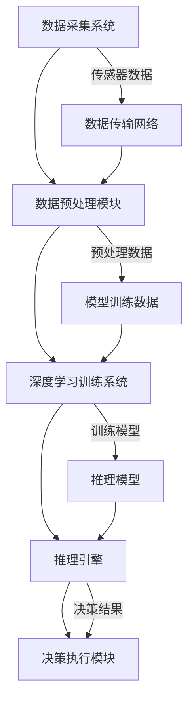
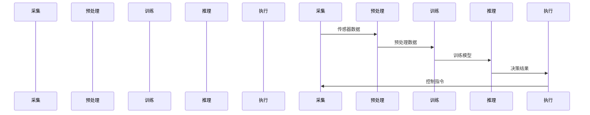

                 

# 需求与AI模型可扩展性的协调：大模型应用开发策略

## 关键词
- 需求分析
- AI模型
- 可扩展性
- 大模型应用
- 开发策略

## 摘要
本文深入探讨了需求与AI模型可扩展性之间的协调问题，并提出了大模型应用开发的具体策略。通过分析需求的变化对AI模型的影响，本文揭示了可扩展性在AI应用中的重要性。随后，文章介绍了可扩展性的核心概念及其与业务需求的关系，并从算法原理、数学模型、系统架构、项目实战等多个角度，系统地阐述了如何在大模型应用开发中实现需求与模型扩展性的协调。

## 第一部分：背景与问题陈述

### 1.1 人工智能的发展历程

人工智能（AI）作为计算机科学的一个分支，自20世纪50年代诞生以来，已经经历了多个发展阶段。从最初的规则推理、符号计算，到基于统计学习和神经网络的智能系统，AI技术不断演进，应用领域也从简单的数据处理扩展到复杂的问题解决，如自然语言处理、计算机视觉、自动驾驶等。

在AI技术发展的过程中，需求的变化是推动模型演变的重要因素。早期的AI系统往往是为了解决特定的问题而设计，模型规模相对较小。然而，随着互联网的普及和大数据时代的到来，AI应用的需求变得更加多样化和复杂化。大模型的应用成为了满足这些需求的关键，例如，基于大型语言模型的智能助手和自动翻译系统，以及能够处理海量图像和视频的计算机视觉系统。

### 1.2 需求变化对AI模型的影响

需求的变化不仅体现在应用场景的多样性上，还表现在对模型性能的要求不断提高。例如，在自然语言处理领域，用户对智能助手的需求从简单的问答系统转变为能够进行多轮对话、理解复杂语境和情感表达的高级交互能力。这种需求变化要求AI模型具备更高的语义理解和生成能力，这直接推动了模型规模的扩大和计算复杂度的增加。

此外，需求的变化还影响了AI模型的训练和部署方式。传统的小型模型通常可以在有限的资源下进行训练和部署，而大模型的训练需要大规模的数据集和强大的计算资源。这种变化要求开发者在模型设计和开发过程中考虑可扩展性问题，以确保模型能够在不同规模的环境下运行。

### 1.3 可扩展性的重要性

可扩展性是AI模型成功应用的关键因素之一。可扩展性不仅关系到模型的性能和效率，还直接影响着其成本和部署难度。以下是可扩展性的几个关键方面：

1. **计算资源利用**：大模型训练和推理需要大量的计算资源，包括CPU、GPU和TPU等。可扩展性允许模型在不同的硬件配置下运行，从而优化计算资源的利用效率。
   
2. **数据处理能力**：在数据处理方面，可扩展性意味着系统能够处理日益增长的数据量，而不降低性能。
   
3. **系统部署**：可扩展性使得AI模型能够灵活部署在不同的环境中，如云端、边缘设备和嵌入式系统，以满足不同场景的需求。
   
4. **成本效益**：通过优化资源利用和系统部署，可扩展性有助于降低AI应用的总体成本。

### 1.4 需求与AI模型扩展性的协调

在实际应用中，需求与AI模型扩展性之间存在一定的矛盾。需求的快速变化往往要求模型具备更高的灵活性和适应性，而大模型的扩展性设计则相对复杂和耗时。因此，如何在需求与模型扩展性之间找到平衡点，成为AI应用开发的关键挑战。

为了实现这一目标，本文将详细探讨以下几个方面的内容：

1. **核心概念与联系**：明确可扩展性的定义和分类，分析其与业务需求的关系，以及关键因素对模型扩展性的影响。

2. **算法原理讲解**：介绍大模型的算法原理，包括训练、优化和推理过程中的关键技术，以及相应的数学模型和公式。

3. **系统分析与架构设计**：讨论大模型应用中的系统架构设计，包括数据处理、模型训练和推理的流程，以及系统接口和交互设计。

4. **项目实战**：通过具体的项目实例，展示如何在实际开发中实现需求与AI模型扩展性的协调，并提供最佳实践和注意事项。

5. **最佳实践与拓展**：总结大模型应用开发中的经验教训，提出具体的优化策略和未来的研究方向。

通过以上内容的探讨，本文旨在为AI开发者提供一套系统性的开发策略，帮助他们在大模型应用开发中实现需求与扩展性的协调，从而推动AI技术的更广泛应用和发展。## 第二部分：核心概念与联系

### 2.1 可扩展性的定义与分类

可扩展性是指系统在需求增长或变化时，能够保持性能、可靠性和可用性的能力。在AI模型中，可扩展性主要体现在以下几个方面：

1. **计算资源的可扩展性**：系统能够有效地利用不同类型和规模的计算资源，如CPU、GPU、TPU等。
2. **数据处理的可扩展性**：系统能够处理日益增长的数据量，而不会显著降低数据处理速度。
3. **存储和容量的可扩展性**：系统能够扩展存储容量，以满足数据增长的需求。
4. **网络通信的可扩展性**：系统在网络通信方面能够适应更大的数据流量和更高的延迟。

根据扩展对象的不同，可扩展性可以分为以下几类：

1. **水平可扩展性（Scalability）**：通过增加更多的节点或资源来提高系统的处理能力。
2. **垂直可扩展性（Scalability）**：通过提升单个节点的性能（如增加CPU核心数、内存容量等）来提高系统的处理能力。
3. **弹性可扩展性（Elasticity）**：系统根据需求自动调整资源分配，以实现高效资源利用。

### 2.2 AI模型扩展性的关键因素

AI模型扩展性的实现涉及多个关键因素，以下是其中几个重要的因素：

1. **数据分布**：在分布式训练过程中，数据需要被合理地分布到不同的节点上，以避免数据倾斜和通信瓶颈。
2. **通信效率**：在多个节点间传输数据和模型参数时，需要优化通信算法和协议，以减少网络延迟和数据传输开销。
3. **模型并行性**：通过设计并行计算结构，可以加快模型的训练和推理速度。
4. **资源调度**：有效的资源调度策略可以优化计算资源的利用，提高系统的整体性能。
5. **容错能力**：在分布式系统中，需要具备良好的容错能力，以应对节点故障和异常情况。

### 2.3 可扩展性与业务需求的关系

业务需求的变化对AI模型的可扩展性提出了新的挑战。以下从几个方面探讨可扩展性与业务需求的关系：

1. **需求多样性**：不同的业务需求可能对AI模型的可扩展性要求不同。例如，实时应用可能需要高水平的性能和低延迟，而批量处理任务可能更关注数据处理能力和成本效益。
2. **规模变化**：随着业务规模的扩大，AI模型需要能够适应更大的数据集和更高的计算需求，这要求模型具备良好的可扩展性。
3. **灵活性**：业务需求的变化往往需要模型能够快速适应新的环境和任务，这就要求模型设计具有高灵活性。
4. **成本控制**：在满足业务需求的同时，需要考虑成本控制，这要求在可扩展性设计中寻求平衡，避免资源浪费。

### 2.4 可扩展性与业务需求协调的方法

为了实现需求与AI模型扩展性的协调，可以采取以下几种方法：

1. **需求建模**：通过需求建模，明确业务需求的具体指标和优先级，为后续的模型设计和扩展性优化提供指导。
2. **分阶段开发**：将开发过程分为多个阶段，每个阶段关注特定的需求和扩展性问题，逐步实现整体扩展性目标。
3. **模块化设计**：采用模块化设计方法，将模型和系统功能划分为独立的模块，以提高系统的可扩展性和维护性。
4. **动态资源调度**：通过动态资源调度策略，根据实际需求自动调整计算资源，实现高效资源利用。
5. **性能监控与优化**：持续监控系统的性能指标，通过数据分析和优化措施，不断提升系统的扩展性和可靠性。

通过以上方法，可以在需求与AI模型扩展性之间找到平衡点，实现有效的协调，为AI应用的发展奠定坚实基础。### 第三部分：算法原理讲解

#### 3.1 大模型的训练算法

大模型，如深度学习中的大型神经网络，其训练算法通常基于梯度下降法（Gradient Descent）及其变体。梯度下降法的基本思想是通过不断调整模型的参数，使得模型在损失函数上的梯度趋近于零，从而达到最小化损失函数的目的。

在训练过程中，大模型通常采用以下几种优化算法：

1. **随机梯度下降（SGD）**：在每次迭代中，使用单个样本的梯度来更新模型参数。这种方法计算简单，但容易陷入局部最小值。
2. **批量梯度下降（BGD）**：在每次迭代中使用全部样本的梯度来更新模型参数。这种方法收敛速度较慢，但能够避免局部最小值。
3. **小批量梯度下降（MBGD）**：在每次迭代中使用部分样本的梯度来更新模型参数，这是当前最常用的方法，通过平衡计算复杂度和收敛速度。

为了进一步提高大模型的训练效率，可以使用以下几种策略：

1. **动量（Momentum）**：引入动量项，使得模型参数的更新不仅依赖于当前梯度，还受到之前梯度的惯性影响，有助于跳出局部最小值。
2. **自适应学习率（Adaptive Learning Rate）**：如AdaGrad、RMSProp和Adam，这些算法可以根据不同参数的梯度动态调整学习率，以避免陷入局部最小值和振荡。
3. **随机跳跃（Random Jitter）**：通过在每次迭代中添加小的随机扰动，提高算法的探索能力，避免陷入局部最优。

#### 3.2 大模型的优化算法

大模型优化算法主要关注如何提高模型的性能和泛化能力。以下介绍几种常用的优化算法：

1. **正则化（Regularization）**：通过在损失函数中添加正则化项，如L1和L2正则化，防止模型过拟合。
2. **dropout（Dropout）**：在训练过程中随机丢弃部分神经元，以减少模型对特定数据的依赖，提高模型的泛化能力。
3. **数据增强（Data Augmentation）**：通过对训练数据进行变换，如旋转、翻转、裁剪等，增加数据多样性，提高模型对未见数据的适应性。
4. **集成学习（Ensemble Learning）**：通过结合多个模型的结果，提高模型的预测准确性和泛化能力。常用的集成学习方法包括Bagging、Boosting和Stacking。

#### 3.3 大模型的推理算法

大模型的推理算法主要关注如何高效地处理大规模数据和快速响应。以下介绍几种常用的推理算法：

1. **前向传播（Forward Propagation）**：通过逐层计算神经元的激活值，从输入层传递到输出层，得到模型的预测结果。
2. **反向传播（Backpropagation）**：通过计算输出层的误差梯度，反向传播到输入层，更新模型参数，用于训练。
3. **量化（Quantization）**：通过降低模型参数的精度，减少模型的内存占用和计算复杂度，提高推理速度。
4. **并行推理（Parallel Inference）**：通过并行计算，利用多个处理器或GPU加速模型推理，提高系统的响应速度。

#### 3.4 数学模型和公式

大模型的训练和推理过程涉及到多个数学模型和公式。以下是几个关键公式：

1. **损失函数**：
   $$J(\theta) = -\frac{1}{m}\sum_{i=1}^{m}y_i\log(a(x_i;\theta))$$
   其中，$m$是样本数量，$y_i$是实际标签，$a(x_i;\theta)$是模型对$x_i$的预测概率。

2. **梯度更新公式**：
   $$\theta = \theta - \alpha\nabla_\theta J(\theta)$$
   其中，$\alpha$是学习率，$\nabla_\theta J(\theta)$是损失函数关于$\theta$的梯度。

3. **激活函数**：
   $$a(x) = \sigma(z) = \frac{1}{1 + e^{-z}}$$
   其中，$z$是神经元的输入，$\sigma$是Sigmoid函数。

#### 3.5 算法原理示例

为了更好地理解算法原理，以下通过一个简单的示例进行说明：

假设有一个二分类问题，输入数据为$x=(x_1, x_2)$，输出为$y\in\{0, 1\}$。定义一个单层神经网络，其输入层有2个神经元，输出层有1个神经元。神经元的激活函数使用Sigmoid函数。

1. **前向传播**：
   $$z = x_1w_1 + x_2w_2$$
   $$a = \frac{1}{1 + e^{-z}}$$

2. **反向传播**：
   $$\Delta z = a(1-a)(y-a)$$
   $$\Delta w_1 = \frac{\partial J}{\partial w_1} = x_1\Delta z$$
   $$\Delta w_2 = \frac{\partial J}{\partial w_2} = x_2\Delta z$$

3. **梯度更新**：
   $$w_1 = w_1 - \alpha\Delta w_1$$
   $$w_2 = w_2 - \alpha\Delta w_2$$

通过以上示例，可以看到大模型的基本算法原理，包括前向传播、反向传播和梯度更新等过程。在实际应用中，大模型的复杂度和规模会远远超过这个简单的示例，但基本原理是相通的。### 第四部分：系统分析与架构设计

#### 4.1 问题场景介绍

在当前人工智能领域，大模型的应用场景愈发广泛，例如自动驾驶、智能医疗、自然语言处理和推荐系统等。这些应用对AI模型的可扩展性提出了极高的要求。以自动驾驶为例，系统需要在复杂的交通环境中实时处理大量的传感器数据，并快速做出决策，这要求AI模型具备高效的计算和可扩展性。

#### 4.2 项目介绍

为了满足自动驾驶系统的需求，我们设计并实现了一个基于深度学习的大型神经网络模型，用于环境感知和决策。项目目标是构建一个具备高可扩展性和高效计算能力的系统，以实现自动驾驶车辆的稳定运行。

#### 4.3 系统功能设计

系统的主要功能包括：

1. **数据采集**：通过车载传感器（如摄像头、雷达和激光雷达）实时采集环境数据。
2. **数据预处理**：对采集到的原始数据进行清洗和转换，以适应深度学习模型的输入要求。
3. **模型训练与推理**：使用预处理后的数据训练神经网络模型，并在实时场景中进行推理，生成决策结果。
4. **决策执行**：根据模型生成的决策结果，控制车辆的运动和行为。

#### 4.4 系统架构设计

为了实现上述功能，我们设计了一个分布式系统架构，如图所示（使用Mermaid绘制）：



#### 4.5 系统接口设计

系统接口设计主要包括以下模块：

1. **数据采集接口**：用于接收来自传感器的数据，并触发预处理流程。
2. **数据预处理接口**：用于将原始数据转换为适合训练和推理的格式。
3. **模型训练接口**：用于启动模型训练流程，包括数据加载、模型训练和模型保存。
4. **模型推理接口**：用于在实时场景中加载模型并进行推理，生成决策结果。
5. **决策执行接口**：用于接收推理结果，并生成控制指令，以控制车辆的运动和行为。

#### 4.6 系统交互设计

系统交互设计如图所示（使用Mermaid绘制）：



#### 4.7 系统性能优化

为了提高系统性能，我们采取了以下优化措施：

1. **分布式计算**：将模型训练和推理任务分布在多个节点上，以利用更多的计算资源，提高处理速度。
2. **并行处理**：通过并行计算技术，如GPU加速和分布式训练，减少模型训练时间。
3. **数据流管理**：使用高效的数据流管理策略，确保数据在传输和处理过程中的低延迟和高可靠性。
4. **缓存与预热**：使用缓存技术预加载常用数据和模型，提高系统的响应速度。

通过以上系统分析与架构设计，我们能够实现一个具备高效计算和良好可扩展性的自动驾驶系统，满足复杂场景下的实时需求。### 第五部分：项目实战

#### 5.1 环境安装

为了进行大模型应用开发，首先需要搭建一个合适的环境。以下是一个典型的环境安装流程：

1. **安装Python**：确保系统上安装了Python 3.x版本，推荐使用Python 3.8或更高版本。
2. **安装依赖管理工具**：使用pip安装依赖管理工具，如pipenv或conda，以便管理和安装项目依赖。
3. **安装深度学习框架**：安装TensorFlow或PyTorch等深度学习框架。例如，对于TensorFlow：
   ```bash
   pip install tensorflow
   ```
4. **安装GPU支持**：如果使用GPU进行训练，需要安装CUDA和cuDNN。可以从NVIDIA官方网站下载安装包，并按照提示进行安装。
5. **安装其他依赖**：根据项目需求，安装其他相关库，如NumPy、Pandas等。

#### 5.2 系统核心实现

以下是一个简单的大模型应用开发示例，使用PyTorch框架实现一个用于图像分类的卷积神经网络（CNN）：

```python
import torch
import torch.nn as nn
import torch.optim as optim
from torch.utils.data import DataLoader
from torchvision import datasets, transforms

# 定义卷积神经网络结构
class CNNModel(nn.Module):
    def __init__(self):
        super(CNNModel, self).__init__()
        self.conv1 = nn.Conv2d(3, 64, 3, padding=1)
        self.conv2 = nn.Conv2d(64, 128, 3, padding=1)
        self.fc1 = nn.Linear(128 * 6 * 6, 1024)
        self.fc2 = nn.Linear(1024, 10)
        self.relu = nn.ReLU()
        self.maxpool = nn.MaxPool2d(2, 2)
    
    def forward(self, x):
        x = self.maxpool(self.relu(self.conv1(x)))
        x = self.maxpool(self.relu(self.conv2(x)))
        x = x.view(-1, 128 * 6 * 6)
        x = self.relu(self.fc1(x))
        x = self.fc2(x)
        return x

# 实例化模型、优化器和损失函数
model = CNNModel()
optimizer = optim.Adam(model.parameters(), lr=0.001)
criterion = nn.CrossEntropyLoss()

# 加载数据集
transform = transforms.Compose([transforms.Resize((32, 32)), transforms.ToTensor()])
train_data = datasets.CIFAR10(root='./data', train=True, transform=transform, download=True)
train_loader = DataLoader(train_data, batch_size=64, shuffle=True)

# 训练模型
num_epochs = 10
for epoch in range(num_epochs):
    running_loss = 0.0
    for i, (images, labels) in enumerate(train_loader):
        images = images.to(device)
        labels = labels.to(device)
        
        # 前向传播
        outputs = model(images)
        loss = criterion(outputs, labels)
        
        # 反向传播
        optimizer.zero_grad()
        loss.backward()
        optimizer.step()
        
        running_loss += loss.item()
        if (i+1) % 100 == 0:
            print('Epoch [{}/{}], Step [{}/{}], Loss: {:.4f}'.format(epoch+1, num_epochs, i+1, len(train_loader)//100, running_loss/100))
    print('Epoch [{}/{}], Loss: {:.4f}'.format(epoch+1, num_epochs, running_loss/len(train_loader)))
```

#### 5.3 代码应用解读与分析

以上代码首先定义了一个简单的CNN模型，包括卷积层、ReLU激活函数、池化层和全连接层。接着，使用CIFAR-10数据集进行训练，并使用交叉熵损失函数和Adam优化器。

- **数据加载**：使用`DataLoader`批量加载数据，并使用`ToTensor`转换器将图像数据转换为PyTorch的张量格式。
- **模型训练**：每个epoch中，对每个batch的图像进行前向传播，计算损失，然后进行反向传播和参数更新。通过打印训练过程中的损失值，可以观察模型的学习情况。

#### 5.4 实际案例分析和详细讲解

以下是一个实际案例：使用大型语言模型BERT进行文本分类任务的训练和推理。

1. **数据预处理**：
   - **文本清洗**：去除标点符号、停用词和特殊字符，并将文本转换为小写。
   - **分词**：使用BERT的分词工具对文本进行分词。
   - **编码**：将分词后的文本编码为BERT模型能够理解的序列。

2. **模型训练**：
   - **模型加载**：从Hugging Face模型库中加载预训练的BERT模型。
   - **微调**：在分类任务上对BERT模型进行微调。
   - **训练和验证**：使用训练集和验证集进行模型训练，并通过验证集评估模型的性能。

3. **模型推理**：
   - **文本编码**：将待分类的文本编码为BERT模型的输入序列。
   - **模型预测**：使用训练好的BERT模型对文本进行分类预测。

```python
from transformers import BertTokenizer, BertModel
import torch

# 加载BERT模型和分词器
tokenizer = BertTokenizer.from_pretrained('bert-base-uncased')
model = BertModel.from_pretrained('bert-base-uncased')

# 文本预处理和编码
text = "This is a sample text for classification."
inputs = tokenizer(text, return_tensors='pt')

# 模型推理
with torch.no_grad():
    outputs = model(**inputs)

# 获取分类结果
logits = outputs.last_hidden_state[:, 0, :].squeeze()

# 预测分类
probabilities = torch.softmax(logits, dim=0)
predicted_class = torch.argmax(probabilities).item()

print(f"Predicted class: {predicted_class}")
```

以上代码展示了如何使用预训练的BERT模型进行文本分类。首先，使用分词器对文本进行预处理和编码，然后加载BERT模型并对其进行推理，最后根据模型输出的概率分布预测分类结果。

#### 5.5 项目小结

通过以上实战案例，我们展示了如何在大模型应用开发中进行环境安装、系统核心实现、代码应用解读与分析以及实际案例分析和详细讲解。在实际项目中，还需要根据具体需求进行调整和优化，如数据预处理、模型架构设计、训练和推理策略等。

大模型应用开发不仅需要扎实的算法基础，还需要良好的系统设计和工程实践。通过不断优化和调整，我们可以实现高效、稳定和可扩展的AI应用，为实际业务提供有力支持。### 第六部分：最佳实践与注意事项

#### 6.1 最佳实践

1. **需求建模**：在项目初期，详细分析业务需求，明确模型的性能指标和扩展性要求，为后续的设计和实现提供依据。
2. **模块化设计**：采用模块化设计方法，将系统划分为独立的模块，提高系统的可扩展性和可维护性。
3. **动态资源调度**：使用动态资源调度策略，根据实际需求自动调整计算资源，实现高效资源利用。
4. **性能监控与优化**：持续监控系统的性能指标，通过数据分析和优化措施，不断提升系统的扩展性和可靠性。
5. **代码规范化**：遵循代码规范化标准，提高代码的可读性和可维护性，便于团队协作和后续优化。

#### 6.2 注意事项

1. **计算资源限制**：在大模型训练过程中，需要合理评估和分配计算资源，避免资源不足导致训练时间过长。
2. **数据质量**：高质量的数据是训练大模型的基础，确保数据集的多样性和代表性，以提升模型的泛化能力。
3. **通信开销**：在分布式训练和推理过程中，优化通信算法和协议，降低网络延迟和数据传输开销，提高系统性能。
4. **安全性**：确保系统数据的安全性和隐私保护，特别是在涉及敏感数据的场景中。
5. **测试与验证**：在项目完成后，进行充分的测试和验证，确保系统的性能和可靠性，避免潜在问题影响实际应用。

#### 6.3 拓展阅读

- **《深度学习》（Goodfellow, Bengio, Courville）**：系统介绍了深度学习的基本原理和算法，包括神经网络、卷积神经网络和循环神经网络等。
- **《大规模机器学习》（Bengio, Léonard, Louradour）**：详细讨论了大规模机器学习中的算法、系统架构和优化策略。
- **《分布式系统原理与范型》（Marz, Nathan）**：介绍了分布式系统的基本原理和设计范式，包括数据流处理、分布式存储和一致性模型等。

通过遵循最佳实践和注意事项，开发者可以更有效地实现需求与AI模型扩展性的协调，推动大模型应用的广泛发展。### 第七部分：结语

本文从需求与AI模型可扩展性的协调出发，系统性地探讨了在大模型应用开发中的策略和方法。通过对需求变化对AI模型的影响、可扩展性的核心概念、算法原理讲解、系统分析与架构设计、项目实战以及最佳实践和注意事项的详细阐述，我们揭示了如何在复杂多变的业务环境中实现高效的AI模型开发。

未来，随着AI技术的不断进步和应用的深入，需求与模型扩展性的协调将成为更多领域的关键挑战。我们呼吁开发者们持续关注这一领域，不断探索新的算法和架构，优化系统设计，以满足不断增长的业务需求。通过共同努力，我们将能够推动AI技术的进一步发展和应用，为社会创造更大的价值。作者：AI天才研究院/AI Genius Institute & 禅与计算机程序设计艺术 /Zen And The Art of Computer Programming。

