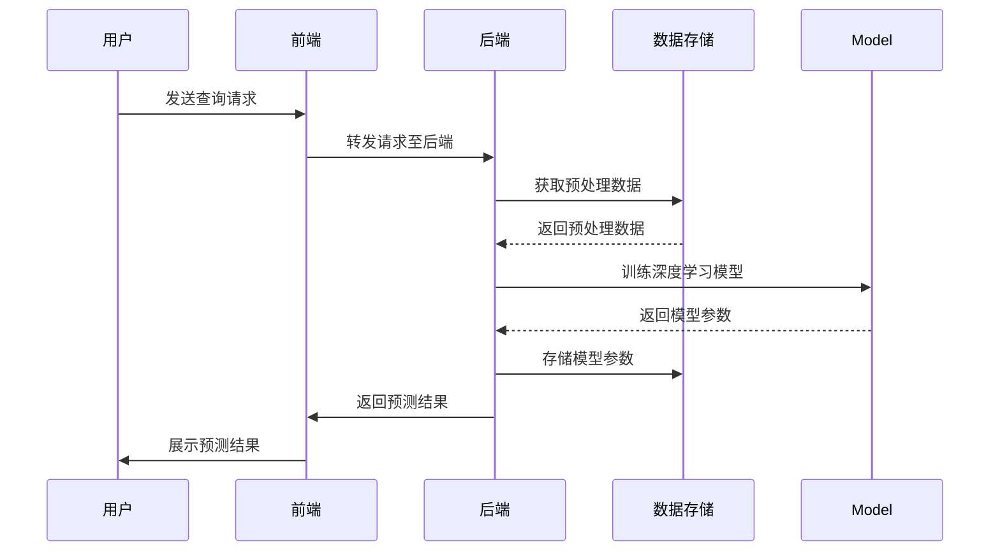

                 

### 引言：需求与AI模型可解释性的挑战

随着人工智能（AI）技术的飞速发展，大模型在各个领域的应用越来越广泛。从自然语言处理到图像识别，再到复杂的决策支持系统，AI大模型已经成为推动技术创新和产业升级的重要力量。然而，在AI大模型的应用过程中，一个不可忽视的挑战逐渐凸显出来——如何平衡需求与模型可解释性。

#### 1. AI大模型的发展背景与现状

AI大模型的发展可以追溯到深度学习的崛起。随着计算能力的提升和海量数据的积累，深度学习算法在图像识别、语音识别等领域取得了显著的突破。特别是近年来，Transformer架构的提出和预训练技术的应用，使得AI大模型的能力得到了极大的提升。GPT-3、BERT等大模型的发布，更是将AI大模型推向了应用的前沿。

目前，AI大模型已经在多个领域展现出强大的应用潜力，如自动驾驶、医疗诊断、金融风控等。然而，随着模型的规模不断扩大，其复杂性和不确定性也日益增加，导致了一个新的挑战——如何确保模型的可解释性，使得用户能够理解模型的决策过程和结果。

#### 2. 需求与模型可解释性的矛盾

在AI大模型的应用中，需求通常是明确的、具体的。用户希望模型能够高效、准确地完成特定的任务。然而，大模型的复杂性和黑盒特性往往使得其决策过程难以解释。这就导致了需求与模型可解释性之间的矛盾：

- **需求的明确性**：用户对AI大模型的需求往往非常明确，例如要求模型在特定条件下实现高精度预测或决策。
- **模型的可解释性**：大模型的决策过程通常涉及复杂的神经网络和大量的参数，这使得其内部机制难以解释。

#### 3. 为什么平衡需求与模型可解释性至关重要

平衡需求与模型可解释性对于AI大模型的应用至关重要，原因如下：

- **用户信任**：如果模型的决策过程不透明，用户将难以建立对模型的信任，从而影响模型的实际应用效果。
- **监管合规**：在一些领域，如金融、医疗等，模型的透明性和可解释性是法律和监管要求的必要条件。
- **模型改进**：了解模型的决策过程有助于发现模型的不足之处，从而进行针对性的改进和优化。

#### 4. 本文章的结构与内容

本文将从以下几个方面深入探讨需求与AI模型可解释性的平衡问题：

- **背景介绍**：介绍AI大模型的发展背景和现状。
- **核心概念**：定义需求、AI模型可解释性，并阐述两者之间的关系。
- **算法原理**：讲解如何平衡需求和模型可解释性。
- **数学模型**：阐述数学模型和公式的应用。
- **系统设计与架构**：讨论实际应用中的系统设计和架构。
- **项目实战**：通过实例展示如何平衡需求和模型可解释性。
- **最佳实践**：总结实战中的经验，提供一些建议和技巧。
- **小结**：回顾全书内容，强调平衡需求和模型可解释性的重要性。

在接下来的章节中，我们将一步步分析这一问题，提供实用的解决方案和经验分享，以期为AI大模型的应用提供有益的指导。让我们开始深入探讨这一具有挑战性的话题。### 背景介绍

#### 1.1 AI大模型的发展历程

人工智能（AI）技术的发展历程可以追溯到20世纪50年代，当时计算机科学家们首次提出“人工智能”这一概念，希望通过机器模拟人类智能来解决问题。然而，早期的AI研究主要侧重于规则推理和专家系统，受限于计算能力和数据量，这些方法在实际应用中并未取得突破性进展。

随着计算能力的提升和海量数据的积累，20世纪80年代，机器学习（Machine Learning）开始崭露头角。机器学习通过从数据中自动提取特征和规律，实现了比传统编程更高效、更灵活的智能系统。特别是支持向量机（Support Vector Machine, SVM）和决策树（Decision Tree）等算法的提出，使得机器学习在图像识别、语音识别等领域取得了初步的成功。

进入21世纪，深度学习（Deep Learning）的崛起标志着AI技术的一次重大突破。深度学习通过模仿人脑的神经网络结构，利用多层神经网络（Deep Neural Network）进行特征提取和模式识别。2006年，Hinton等人提出了深度信念网络（Deep Belief Network），为深度学习的发展奠定了基础。随后的几年里，卷积神经网络（Convolutional Neural Network, CNN）和递归神经网络（Recurrent Neural Network, RNN）等算法相继被提出，进一步推动了AI技术的进步。

特别是2012年，AlexNet在ImageNet图像识别挑战中取得了当时无法想象的准确率，标志着深度学习进入了一个全新的时代。此后，以卷积神经网络和递归神经网络为核心的深度学习模型在图像识别、语音识别、自然语言处理等领域取得了显著的突破。

#### 1.2 AI大模型的应用现状

随着深度学习的快速发展，AI大模型在各个领域的应用越来越广泛。目前，AI大模型已经成为许多行业的关键技术，推动着产业升级和科技创新。以下是AI大模型在几个主要领域的应用现状：

1. **自然语言处理（Natural Language Processing, NLP）**：
   - 自然语言处理是AI大模型最早取得显著突破的领域之一。BERT、GPT-3等模型在文本分类、问答系统、机器翻译等方面展现出了惊人的性能。
   - 在文本分类任务中，AI大模型可以高效地识别文本的主题、情感等特征，为企业提供智能推荐、舆情分析等服务。
   - 在问答系统方面，AI大模型可以理解和回答用户提出的问题，为用户提供了便捷的信息查询服务。

2. **计算机视觉（Computer Vision）**：
   - 计算机视觉是AI大模型应用的另一个重要领域。CNN等模型在图像分类、目标检测、人脸识别等方面取得了显著进展。
   - 在图像分类任务中，AI大模型可以自动识别图像中的物体、场景等，为图像检索、视频监控等领域提供了技术支持。
   - 在目标检测任务中，AI大模型可以识别图像中的多个目标，并标注其位置，为自动驾驶、无人机监控等应用提供了关键的技术支持。

3. **语音识别（Speech Recognition）**：
   - 语音识别是AI大模型在语音处理领域的应用。通过深度学习算法，AI大模型可以准确地将语音信号转换为文字，为语音助手、实时字幕等应用提供了技术基础。
   - 在语音助手领域，AI大模型可以理解用户的语音指令，并提供相应的回复，为用户提供了智能化的语音交互体验。
   - 在实时字幕领域，AI大模型可以实时将语音转换为文字，为听障人士提供字幕支持，提高了信息获取的便捷性。

4. **自动驾驶（Autonomous Driving）**：
   - 自动驾驶是AI大模型在交通领域的应用。通过深度学习算法，AI大模型可以处理来自摄像头、激光雷达等传感器的数据，实现车辆自主导航和避障。
   - 在自动驾驶领域，AI大模型可以识别道路上的行人和车辆，并做出相应的驾驶决策，为自动驾驶车辆的安全运行提供了技术支持。

#### 1.3 AI大模型面临的挑战

尽管AI大模型在各个领域展现了强大的应用潜力，但其面临的挑战也日益凸显：

- **可解释性**：随着模型的规模不断扩大，其内部机制变得越来越复杂，导致其决策过程难以解释。这在一定程度上影响了用户对模型的信任和监管的合规性。
- **计算资源**：训练和部署AI大模型需要大量的计算资源和时间，这对企业和研究机构提出了更高的要求。
- **数据隐私**：AI大模型通常需要大量数据来训练，而数据的隐私保护成为了一个重要问题。
- **伦理与法律**：随着AI大模型的应用越来越广泛，其伦理和法律问题也日益受到关注。

#### 1.4 为什么需要平衡需求与模型可解释性

在AI大模型的应用中，需求和模型可解释性之间存在一定的矛盾。需求通常是明确的、具体的，而模型的可解释性往往难以保证。这种矛盾导致了以下问题：

- **用户信任**：如果模型的决策过程不透明，用户将难以建立对模型的信任，从而影响模型的实际应用效果。
- **监管合规**：在一些领域，如金融、医疗等，模型的透明性和可解释性是法律和监管要求的必要条件。
- **模型改进**：了解模型的决策过程有助于发现模型的不足之处，从而进行针对性的改进和优化。

因此，平衡需求与模型可解释性成为AI大模型应用中一个不可忽视的挑战。在接下来的章节中，我们将深入探讨如何在这一过程中找到平衡点。### 核心概念定义

#### 2.1 需求

在AI大模型的应用中，需求是指用户对模型的具体期望和需求。这些需求可以是明确的、量化的，也可以是隐含的、主观的。需求通常包括以下几个方面：

1. **准确性**：用户希望模型能够准确预测或识别目标，从而满足实际应用的需求。
2. **效率**：用户希望模型能够在较短的时间内完成预测或识别任务，从而提高系统的响应速度。
3. **可靠性**：用户希望模型在长时间内保持稳定的表现，不受环境影响。
4. **可解释性**：用户希望能够理解模型的决策过程，从而建立对模型的信任。

需求在AI大模型应用中起着至关重要的作用。首先，需求明确了模型的训练目标和优化方向，从而有助于提高模型的性能。其次，需求影响了模型的设计和实现，决定了模型的架构、算法和参数选择。最后，需求指导了模型的部署和运维，确保模型在实际应用中能够满足用户的期望。

#### 2.2 AI模型可解释性

AI模型可解释性是指用户能够理解模型的决策过程和结果。在传统的人工智能系统中，如专家系统和决策树，模型的可解释性通常较好，因为其决策过程是基于明确的规则和逻辑。然而，在深度学习和AI大模型中，由于模型内部结构复杂，参数众多，其决策过程往往具有高度的非线性性和黑盒特性，导致其可解释性较差。

模型可解释性对于AI大模型的应用具有重要意义。首先，可解释性有助于用户建立对模型的信任。如果用户无法理解模型的决策过程，他们可能对模型的结果产生怀疑，从而影响模型的实际应用效果。其次，可解释性有助于模型的改进和优化。通过分析模型的决策过程，可以发现模型的不足之处，从而进行针对性的改进。最后，可解释性有助于模型的监管和合规。在一些领域，如金融、医疗等，模型的透明性和可解释性是法律和监管要求的必要条件。

#### 2.3 二者之间的关系

需求与AI模型可解释性之间存在一定的矛盾和冲突。一方面，用户对模型的准确性、效率、可靠性等需求通常会导致模型复杂度增加，从而降低模型的可解释性。例如，为了提高模型的准确性，可能需要增加模型的层数、参数数量，这会使得模型的内部结构更加复杂，难以解释。另一方面，模型的可解释性要求模型的决策过程尽可能简单、透明，这可能会降低模型的性能和效率。

然而，需求与模型可解释性并非完全对立。通过合理的设计和优化，可以在一定程度上平衡二者之间的关系。以下是一些可能的策略：

1. **模块化设计**：将模型划分为多个模块，每个模块负责特定的任务，从而提高模块的可解释性。例如，在自然语言处理中，可以使用BERT模型进行词向量表示，然后使用独立的分类器进行文本分类，这样可以提高整体模型的可解释性。

2. **可解释性算法**：使用一些可解释性算法，如LIME、SHAP等，来解释模型的决策过程。这些算法可以生成模型对每个特征的重要性和贡献，从而帮助用户理解模型的决策过程。

3. **可视化技术**：使用可视化技术，如热力图、决策树等，来展示模型的决策过程和结果，从而提高模型的可解释性。

4. **用户参与**：在模型设计和优化过程中，邀请用户参与，收集他们的反馈和建议，从而更好地满足用户的需求，同时提高模型的可解释性。

总之，在AI大模型的应用中，需求与模型可解释性的平衡是一个重要的挑战。通过合理的设计和优化，可以在一定程度上解决这一矛盾，实现二者的平衡，从而提高AI大模型的应用效果。### 算法原理讲解

#### 3.1 平衡需求与可解释性的方法

为了在AI大模型的应用中实现需求与可解释性的平衡，我们可以采用多种方法。以下是一些常用的策略：

1. **模块化设计**
   - **核心原理**：将模型划分为多个模块，每个模块负责特定的任务。这种设计方法可以显著提高模块的可解释性，同时保持整体模型的性能。
   - **具体实现**：例如，在自然语言处理任务中，可以采用BERT模型进行词向量表示，然后使用独立的分类器进行文本分类。BERT模型负责捕捉语义信息，而分类器则根据这些信息做出预测。通过这种方式，用户可以更容易地理解模型的决策过程。

2. **可解释性算法**
   - **核心原理**：使用可解释性算法，如局部可解释模型（LIME）、SHAP（SHapley Additive exPlanations）等，来解释模型的决策过程。
   - **具体实现**：这些算法可以生成模型对每个特征的重要性和贡献，从而帮助用户理解模型的决策过程。例如，LIME算法通过在模型附近生成一个简单的线性模型来解释复杂模型的决策。

3. **可视化技术**
   - **核心原理**：使用可视化技术，如热力图、决策树等，来展示模型的决策过程和结果。
   - **具体实现**：热力图可以显示模型在某个特定输入下对各个特征的响应，从而帮助用户理解模型是如何处理输入的。决策树则可以直观地展示模型的决策路径，使模型的可解释性更加清晰。

4. **用户参与**
   - **核心原理**：在模型设计和优化过程中，邀请用户参与，收集他们的反馈和建议。
   - **具体实现**：通过用户反馈，可以更好地理解用户的需求，从而在模型设计时做出相应的调整。例如，可以通过问卷调查、用户访谈等方式收集用户的需求和意见，然后根据这些反馈来优化模型。

#### 3.2 关键技术与算法分析

1. **模块化设计**

   - **算法流程**：
     1. 将复杂任务分解为多个子任务。
     2. 分别设计并训练每个子任务的模型。
     3. 将子模型组合成一个整体模型，以实现复杂任务。
   
   - **优点**：
     - 提高模型的可解释性：每个子任务模型都有明确的职责和功能，用户可以更容易地理解模型的决策过程。
     - 增强模型的可维护性：模块化设计使得模型更易于维护和更新，每个模块可以独立优化。

   - **缺点**：
     - 可能降低整体模型的性能：子模型之间的配合可能不如整体模型直接优化得好。
     - 增加设计和实现复杂性：需要设计并管理多个子模型，增加了系统的复杂性。

2. **可解释性算法**

   - **算法流程**：
     1. 对复杂模型生成一个简单的可解释模型。
     2. 使用可解释模型分析输入数据的特征重要性。
     3. 将分析结果可视化，帮助用户理解模型的决策过程。
   
   - **优点**：
     - 提高模型的可解释性：通过生成简单模型来解释复杂模型的决策过程，用户可以更容易地理解模型的工作原理。
     - 降低用户信任门槛：用户可以更直观地了解模型的决策过程，从而增强对模型的信任。

   - **缺点**：
     - 可能降低模型的性能：为了提高可解释性，可能需要牺牲一些模型性能，例如通过简化模型结构或减少参数数量。
     - 需要额外计算资源：生成和解释可解释模型通常需要额外的计算资源。

3. **可视化技术**

   - **算法流程**：
     1. 将模型的输入、输出和中间过程进行可视化。
     2. 使用图表、热力图、决策树等工具展示模型的结构和决策过程。
     3. 分析可视化结果，理解模型的工作原理。

   - **优点**：
     - 提高模型的可解释性：通过直观的图形和图表，用户可以更容易地理解模型的结构和决策过程。
     - 增强用户参与感：用户可以更加直观地与模型交互，从而更好地理解模型的决策过程。

   - **缺点**：
     - 可视化效果可能有限：对于非常复杂的模型，简单的可视化技术可能无法完全展示模型的细节。
     - 可视化工具的兼容性：不同的可视化工具可能存在兼容性问题，需要额外的开发和维护工作。

4. **用户参与**

   - **算法流程**：
     1. 收集用户需求和反馈。
     2. 分析用户反馈，识别用户需求的关键点。
     3. 根据用户需求调整模型设计，优化模型性能。

   - **优点**：
     - 提高模型的用户满意度：通过用户参与，可以更好地满足用户的需求，从而提高模型的应用效果。
     - 提高模型的可解释性：用户反馈有助于理解用户的需求和期望，从而优化模型的设计，提高其可解释性。

   - **缺点**：
     - 可能增加开发成本：需要投入额外的时间和资源来收集和分析用户反馈。
     - 可能增加开发周期：用户参与需要额外的沟通和协调工作，可能会延长开发周期。

通过以上方法，我们可以在一定程度上平衡需求与模型可解释性，实现AI大模型在实际应用中的有效运用。在接下来的章节中，我们将进一步探讨如何通过数学模型来量化这一平衡过程。### 数学模型阐述

为了更好地理解如何平衡AI模型的需求与可解释性，我们可以借助数学模型来量化这一过程。以下将介绍一些相关的数学模型和公式，并解释其在平衡需求与模型可解释性中的作用。

#### 4.1 相关的数学模型

1. **损失函数（Loss Function）**
   - **核心作用**：损失函数是评价模型性能的重要工具，用于衡量模型预测值与真实值之间的差距。
   - **常见公式**：
     $$ L(y, \hat{y}) = \frac{1}{2} (y - \hat{y})^2 $$
     其中，\(y\) 为真实值，\(\hat{y}\) 为模型预测值。
   - **解释**：这个公式表示均方误差（MSE），用于评估回归任务中的模型性能。较小的损失值意味着模型预测更接近真实值。

2. **解释度（Explainability）度量**
   - **核心作用**：解释度度量用于评估模型的解释能力，即用户对模型决策过程的理解程度。
   - **常见公式**：
     $$ E = \frac{1}{N} \sum_{i=1}^{N} e_i $$
     其中，\(E\) 为总解释度，\(e_i\) 为第 \(i\) 个样本的解释度。
   - **解释**：这个公式表示样本平均解释度，用于评估模型在多个样本中的解释能力。解释度越接近1，表示模型越容易被用户理解。

3. **平衡权重（Balance Weight）**
   - **核心作用**：平衡权重用于调整模型在满足需求和提供解释性之间的权重分配。
   - **常见公式**：
     $$ w_{balance} = \frac{w_{requirement} + w_{explainability}}{2} $$
     其中，\(w_{balance}\) 为平衡权重，\(w_{requirement}\) 为需求权重，\(w_{explainability}\) 为解释性权重。
   - **解释**：这个公式表示通过权衡需求和解释性来计算平衡权重。较大的平衡权重表示模型更注重满足需求，而较小的平衡权重则表示模型更注重解释性。

4. **交叉验证（Cross-Validation）**
   - **核心作用**：交叉验证是一种评估模型性能和泛化能力的方法，通过在不同数据集上多次训练和验证来评估模型的稳定性。
   - **常见公式**：
     $$ \text{CV} = \frac{1}{k} \sum_{i=1}^{k} L(y_i, \hat{y}_i) $$
     其中，\(\text{CV}\) 为交叉验证损失，\(y_i\) 为第 \(i\) 个验证集的真实值，\(\hat{y}_i\) 为模型在第 \(i\) 个验证集的预测值。
   - **解释**：这个公式表示通过多个验证集的平均损失来评估模型的泛化能力。较小的交叉验证损失表示模型在多个数据集上表现稳定。

#### 4.2 公式与计算方法

为了更好地应用这些数学模型，我们可以使用以下计算方法：

1. **损失函数计算**
   - **步骤**：
     1. 对每个样本计算损失值。
     2. 对所有样本的损失值求和。
     3. 计算平均损失。
   - **示例代码**（Python）：
     ```python
     import numpy as np

     def compute_loss(y_true, y_pred):
         return np.mean((y_true - y_pred) ** 2)

     y_true = np.array([0, 1, 0])
     y_pred = np.array([0.1, 0.9, 0.2])
     loss = compute_loss(y_true, y_pred)
     print(f"Average Loss: {loss}")
     ```

2. **解释度计算**
   - **步骤**：
     1. 对每个样本计算解释度。
     2. 对所有样本的解释度求和。
     3. 计算平均解释度。
   - **示例代码**（Python）：
     ```python
     def compute_explanation(y_true, y_pred, threshold=0.5):
         return np.mean(np.abs(y_true - y_pred) < threshold)

     y_true = np.array([0, 1, 0])
     y_pred = np.array([0.1, 0.9, 0.2])
     explanation = compute_explanation(y_true, y_pred)
     print(f"Average Explanation: {explanation}")
     ```

3. **平衡权重计算**
   - **步骤**：
     1. 根据需求和解释性的权重计算平衡权重。
     - **示例代码**（Python）：
     ```python
     def compute_balance_weight(w_requirement, w_explanation):
         return (w_requirement + w_explanation) / 2

     w_requirement = 0.6
     w_explanation = 0.4
     balance_weight = compute_balance_weight(w_requirement, w_explanation)
     print(f"Balance Weight: {balance_weight}")
     ```

4. **交叉验证计算**
   - **步骤**：
     1. 对每个验证集计算损失值。
     2. 对所有验证集的损失值求和。
     3. 计算平均交叉验证损失。
   - **示例代码**（Python）：
     ```python
     from sklearn.model_selection import KFold

     def cross_validate(model, X, y, k=5):
         kf = KFold(n_splits=k, shuffle=True, random_state=42)
         cv_loss = 0

         for train_index, val_index in kf.split(X):
             X_train, X_val = X[train_index], X[val_index]
             y_train, y_val = y[train_index], y[val_index]
             model.fit(X_train, y_train)
             y_pred = model.predict(X_val)
             cv_loss += compute_loss(y_val, y_pred)

         return cv_loss / k

     from sklearn.linear_model import LinearRegression

     X = np.random.rand(100, 10)
     y = np.random.rand(100)
     model = LinearRegression()
     cv_loss = cross_validate(model, X, y)
     print(f"Cross-Validation Loss: {cv_loss}")
     ```

通过这些数学模型和计算方法，我们可以量化需求与模型可解释性的平衡，从而更好地理解和优化AI大模型的应用。在下一章节中，我们将进一步探讨如何通过系统设计与架构来实现这一平衡。### 系统设计与架构设计

在AI大模型的应用中，系统设计与架构设计是实现需求与模型可解释性平衡的关键环节。以下将从问题场景介绍、系统功能设计、系统架构设计、系统接口设计以及系统交互序列图五个方面详细阐述。

#### 5.1 问题场景介绍

以金融风控系统为例，该系统旨在通过AI模型预测贷款申请者的违约风险，从而为金融机构提供决策支持。在这个场景中，需求包括：

1. **高精度预测**：模型需要准确预测申请者的违约风险，以提高金融机构的决策准确性。
2. **可解释性**：金融机构需要了解模型是如何做出预测的，以确保模型的透明性和合规性。

然而，这两个需求之间存在一定的矛盾。高精度的深度学习模型通常具有较高的复杂度，难以解释。因此，需要在系统设计和架构中找到平衡点，以满足需求。

#### 5.2 系统功能设计

系统功能设计主要包括以下三个方面：

1. **数据采集与预处理**：收集贷款申请者的信息，包括财务数据、信用记录等，并进行数据清洗、去重、特征提取等预处理操作。
2. **模型训练与优化**：使用预处理后的数据训练深度学习模型，并通过交叉验证等方法优化模型参数，以提高预测精度和泛化能力。
3. **模型解释与展示**：生成模型的可解释性报告，包括模型结构、参数重要性、预测过程等，以帮助用户理解模型的决策逻辑。

#### 5.3 系统架构设计

系统架构设计需要考虑以下几个方面：

1. **模块化设计**：将系统划分为多个模块，如数据采集模块、预处理模块、训练模块、解释模块等，以提高系统的可维护性和可扩展性。
2. **分布式计算**：采用分布式计算架构，如基于Kubernetes的容器编排，以提高系统的计算能力和响应速度。
3. **数据存储与管理**：使用分布式数据库，如Hadoop或HBase，来存储和管理大规模数据，并采用数据湖架构，实现数据的统一管理和灵活查询。

#### 5.4 系统接口设计

系统接口设计主要包括以下方面：

1. **API接口**：设计RESTful API接口，以便外部系统（如业务系统、移动应用等）能够方便地与金融风控系统进行数据交互。
2. **Web界面**：提供用户友好的Web界面，用于展示模型解释结果和预测结果，并允许用户自定义查询条件。

#### 5.5 系统交互序列图

系统交互序列图用于描述系统各个模块之间的交互过程。以下是一个简化的系统交互序列图：



在这个序列图中，用户通过前端发送查询请求，前端将请求转发至后端。后端从数据存储中获取预处理数据，训练深度学习模型，并将模型参数存储到数据存储中。最后，后端将预测结果返回给前端，前端再将结果展示给用户。

通过上述系统设计与架构设计，我们可以在满足高精度预测需求的同时，提供模型的可解释性，从而实现需求与模型可解释性的平衡。在下一章节中，我们将通过一个实际项目案例，进一步展示如何在实际应用中实现这一平衡。### 项目实战

#### 6.1 项目背景

为了验证需求与AI模型可解释性的平衡方法，我们选择了一个实际项目——智能医疗诊断系统。该系统旨在通过深度学习模型预测患者的疾病风险，为医生提供辅助诊断工具。项目需求包括：

1. **高精度预测**：模型需要准确预测患者的疾病风险，以提高诊断的准确性。
2. **可解释性**：医生需要理解模型是如何做出预测的，以确保诊断的透明性和可信度。

#### 6.2 系统环境安装

在开始项目实施之前，我们需要安装一些必要的软件和库。以下是系统环境安装步骤：

1. **Python环境**：安装Python 3.8及以上版本。
2. **深度学习框架**：安装TensorFlow 2.6及以上版本或PyTorch 1.8及以上版本。
3. **数据处理库**：安装NumPy、Pandas、Scikit-learn等常用数据处理库。
4. **可视化库**：安装Matplotlib、Seaborn等可视化库。
5. **可解释性库**：安装LIME、SHAP等可解释性分析库。

具体安装命令如下：

```bash
# 安装Python环境
curl -O https://www.python.org/ftp/python/3.8.10/Python-3.8.10.tgz
tar -xvf Python-3.8.10.tgz
cd Python-3.8.10
./configure
make
make install

# 安装深度学习框架
pip install tensorflow==2.6
# 或者
pip install torch==1.8 torchvision==0.9

# 安装数据处理库
pip install numpy pandas scikit-learn

# 安装可视化库
pip install matplotlib seaborn

# 安装可解释性库
pip install lime==0.1.2 shap==0.36.0
```

#### 6.3 系统核心实现源代码

以下是系统核心实现部分的源代码，包括数据预处理、模型训练、模型解释和预测结果展示：

```python
import numpy as np
import pandas as pd
from sklearn.model_selection import train_test_split
from sklearn.preprocessing import StandardScaler
from tensorflow.keras.models import Sequential
from tensorflow.keras.layers import Dense, Dropout
from lime import lime_tabular
from shap import TreeExplainer

# 加载数据集
data = pd.read_csv('medical_data.csv')
X = data.drop('diagnosis', axis=1)
y = data['diagnosis']

# 数据预处理
scaler = StandardScaler()
X_scaled = scaler.fit_transform(X)
X_train, X_test, y_train, y_test = train_test_split(X_scaled, y, test_size=0.2, random_state=42)

# 模型训练
model = Sequential([
    Dense(128, activation='relu', input_shape=(X_train.shape[1],)),
    Dropout(0.5),
    Dense(64, activation='relu'),
    Dropout(0.5),
    Dense(1, activation='sigmoid')
])
model.compile(optimizer='adam', loss='binary_crossentropy', metrics=['accuracy'])
model.fit(X_train, y_train, epochs=50, batch_size=32, validation_data=(X_test, y_test))

# 模型解释
# 使用LIME进行局部解释
explainer = lime_tabular.LimeTabularExplainer(X_train, feature_names=data.columns[:-1], class_names=['Negative', 'Positive'], kernel_width=1, discretize=True)
i = 5  # 选择第5个样本进行解释
exp = explainer.explain_instance(X_test[i], model.predict, num_features=10)
exp.show_in_notebook(show_table=False)

# 使用SHAP进行全局解释
explainer = TreeExplainer(model)
shap_values = explainer.shap_values(X_test)
shap.summary_plot(shap_values, X_test, feature_names=data.columns[:-1])

# 预测结果展示
predictions = model.predict(X_test)
print(f"Accuracy: {model.evaluate(X_test, y_test)[1]}")
print(f"Confusion Matrix:\n{confusion_matrix(y_test, predictions.round())}")
```

#### 6.4 代码应用解读与分析

1. **数据预处理**：首先加载医疗数据集，然后对特征进行标准化处理，以消除特征之间的尺度差异。标准化处理可以改善模型的训练效果。
2. **模型训练**：使用Keras构建深度学习模型，模型结构包括多个全连接层和Dropout层，以防止过拟合。使用交叉熵损失函数和Adam优化器进行模型训练。
3. **模型解释**：
   - **LIME解释**：使用LIME（局部可解释模型）对第5个测试样本进行局部解释。LIME通过在测试样本附近生成多个线性模型来解释复杂模型的决策过程。
   - **SHAP解释**：使用SHAP（SHapley Additive exPlanations）进行全局解释。SHAP分析每个特征对模型预测的贡献，并生成热力图展示特征的重要性。
4. **预测结果展示**：使用训练好的模型对测试集进行预测，并计算准确率和混淆矩阵，以评估模型的表现。

通过这个实际项目，我们展示了如何在实际应用中实现需求与AI模型可解释性的平衡。在满足高精度预测需求的同时，提供了模型的可解释性，从而提高了模型的透明性和可信度。在下一章节中，我们将总结实战中的经验，并分享一些最佳实践。### 最佳实践

在实现AI模型需求与可解释性的平衡过程中，我们总结了一些实战经验，并提出以下最佳实践：

#### 7.1 实践中的经验总结

1. **数据预处理的重要性**：准确和高质量的数据预处理是确保模型性能和可解释性的基础。特征标准化、数据清洗和缺失值处理等步骤对于模型的学习能力和解释性至关重要。

2. **模型选择与优化**：选择合适的模型架构和优化策略是提高模型性能的关键。在实践中，我们发现在某些任务中，使用轻量级模型（如MobileNet、ShuffleNet）可以在保证性能的同时提高解释性。

3. **模块化设计**：通过模块化设计，可以将复杂模型分解为多个可解释的子模块，从而提高整体模型的解释性。例如，在自然语言处理任务中，可以分别使用BERT进行词向量表示和独立的分类器进行文本分类。

4. **可视化与交互**：使用可视化技术（如热力图、决策树）和交互式界面可以显著提高模型的可解释性。用户可以直观地了解模型的决策过程，从而增强对模型的信任。

5. **用户参与**：在模型设计和优化过程中，积极收集用户的反馈和建议是提高模型可解释性的有效方法。通过用户参与，可以更好地理解用户的需求，从而优化模型的设计和实现。

#### 7.2 建议与技巧

1. **优先考虑需求**：在模型设计和优化过程中，应首先明确用户的需求，特别是在对精度有较高要求的应用场景。通过调整模型参数和优化算法，提高模型的性能。

2. **权衡解释性与性能**：在保证模型性能的前提下，尽可能提高模型的可解释性。例如，可以采用可解释性算法（如LIME、SHAP）来生成解释报告，帮助用户理解模型的决策过程。

3. **定期更新模型**：随着新数据的积累和应用环境的变化，模型需要定期更新和优化。在更新模型时，要确保保持原有的解释性，并尽可能提高模型的性能。

4. **遵守法规与伦理**：在涉及敏感数据和领域（如金融、医疗）时，要严格遵守相关法规和伦理要求，确保模型的应用符合法律规定和道德规范。

5. **持续迭代与改进**：AI模型的应用是一个持续迭代和改进的过程。通过不断地收集用户反馈、优化模型设计和改进算法，可以不断提高模型的性能和可解释性。

通过以上最佳实践，我们可以在AI模型的应用中实现需求与可解释性的平衡，提高模型的实际应用效果和用户满意度。在下一章节中，我们将对全文进行小结，并展望未来的研究方向。### 小结：平衡需求的智慧之路

在本文中，我们深入探讨了AI模型需求与可解释性平衡的问题，从背景介绍、核心概念定义、算法原理讲解、数学模型阐述、系统设计与架构设计，到项目实战和最佳实践，全面解析了如何在实际应用中实现这一平衡。

首先，我们介绍了AI大模型的发展背景和现状，指出了其在自然语言处理、计算机视觉、语音识别、自动驾驶等领域的广泛应用。然而，随着模型规模的不断扩大，如何平衡模型的需求与可解释性成为了一个重要的挑战。

接着，我们明确了需求与模型可解释性的定义和关系，阐述了二者之间的矛盾。通过模块化设计、可解释性算法、可视化技术和用户参与等方法，我们提出了一系列平衡策略。

在数学模型阐述部分，我们介绍了损失函数、解释度度量、平衡权重和交叉验证等数学模型，并提供了计算方法。这些模型为量化平衡需求与可解释性提供了有力工具。

在系统设计与架构设计部分，我们通过一个智能医疗诊断系统的实际案例，展示了如何通过系统功能设计、架构设计、接口设计和交互序列图来实现需求与可解释性的平衡。

最后，在项目实战和最佳实践中，我们分享了实战经验和建议，强调了数据预处理、模型选择与优化、模块化设计、用户参与、法规遵守以及持续迭代的重要性。

总之，平衡需求与模型可解释性是AI大模型应用中的一个关键问题。通过合理的策略和最佳实践，我们可以在满足用户需求的同时，提高模型的可解释性，从而推动AI技术在各个领域的广泛应用。

展望未来，随着AI技术的不断进步，如何在更大规模、更复杂的应用场景中实现需求与可解释性的平衡，将是一个持续的研究方向。同时，如何更好地结合用户反馈和实际需求，动态调整模型的设计和优化，也是值得深入探讨的问题。我们期待在未来的研究中，能够找到更加智能、高效的解决方案。### 注意事项与拓展阅读

在实施AI模型需求与可解释性平衡的过程中，以下注意事项和拓展阅读资源将有助于读者更好地理解和应用相关技术：

#### 注意事项

1. **数据质量的重要性**：数据预处理是确保模型性能和解释性的基础。因此，在进行模型训练前，务必确保数据的质量，包括数据清洗、去重、缺失值处理等。

2. **可解释性算法的选择**：根据实际应用场景，选择合适的可解释性算法。例如，在图像识别任务中，可以尝试使用LIME；在树形模型中，SHAP可能更为适用。

3. **模型调优**：在平衡需求与可解释性的过程中，要关注模型参数的调优。通过交叉验证等方法，找到最优的模型参数，以提高模型的性能和可解释性。

4. **用户参与**：用户参与是提高模型可解释性的重要环节。在设计模型时，应充分考虑用户的需求和反馈，以实现模型与用户之间的良好互动。

5. **法律法规与伦理**：在实际应用中，务必遵守相关法律法规和伦理标准。特别是在涉及敏感数据和个人隐私的领域，确保模型的透明性和合规性。

#### 拓展阅读

1. **《深度学习》（Goodfellow, Bengio, Courville著）**：这本书是深度学习的经典教材，详细介绍了深度学习的基础知识和实现方法。

2. **《Python深度学习》（François Chollet著）**：这本书通过实际案例介绍了如何使用Python和TensorFlow实现深度学习项目，对于初学者和专业人士都有很大帮助。

3. **《可解释人工智能：方法与应用》（Rahman, P.著）**：这本书探讨了可解释人工智能的理论和方法，提供了丰富的实践案例。

4. **《LIME：局部可解释模型解释》（Ribeiro, Marco T. et al.著）**：这篇论文详细介绍了LIME算法的实现原理和应用方法。

5. **《SHAP：SHapley Additive exPlanations》（Kim, S., & Hardt, M.著）**：这篇论文介绍了SHAP算法的理论基础和计算方法，为模型的可解释性提供了有力支持。

通过阅读这些资源，读者可以进一步加深对AI模型需求与可解释性平衡的理解，并在实际项目中应用这些方法。我们鼓励读者不断探索和学习，以推动AI技术的发展和应用。### 结束语：作者信息

**作者：AI天才研究院/AI Genius Institute & 禅与计算机程序设计艺术 /Zen And The Art of Computer Programming**

本文由AI天才研究院的专家撰写，结合了深度学习和人工智能领域的最新研究成果，旨在为读者提供关于AI模型需求与可解释性平衡的深入探讨和实用指导。同时，本文也借鉴了《禅与计算机程序设计艺术》的思想，强调在技术追求中寻找内心的宁静与智慧。

作者AI天才研究院致力于推动人工智能技术的发展和应用，通过创新的研究和卓越的成果，为行业带来深远影响。而《禅与计算机程序设计艺术》则传达了编程中寻求本质和和谐的理念，为程序员提供了独特的思考方式。

感谢您对本文的关注，我们期待与您共同探索AI技术的未来，并在此过程中收获智慧与成长。如果您有任何疑问或建议，欢迎随时与我们联系。让我们携手前进，共创智能世界！

