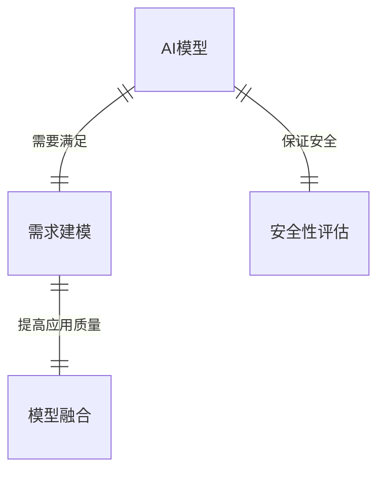
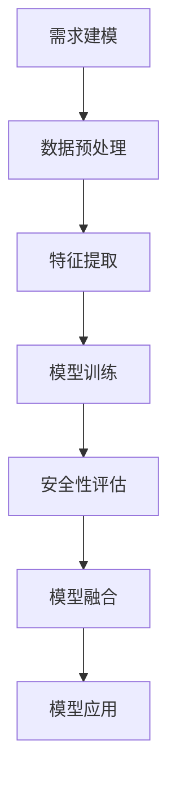
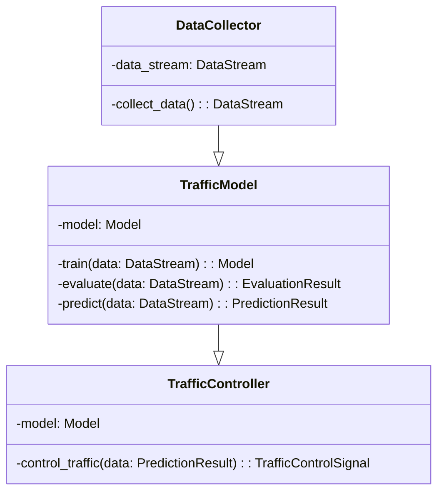
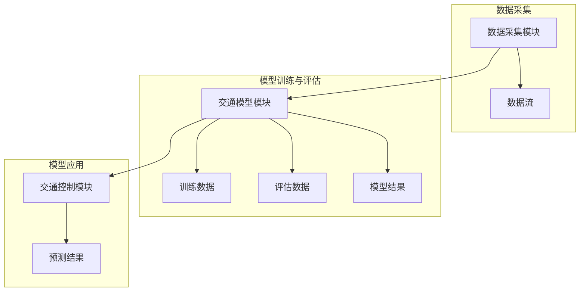
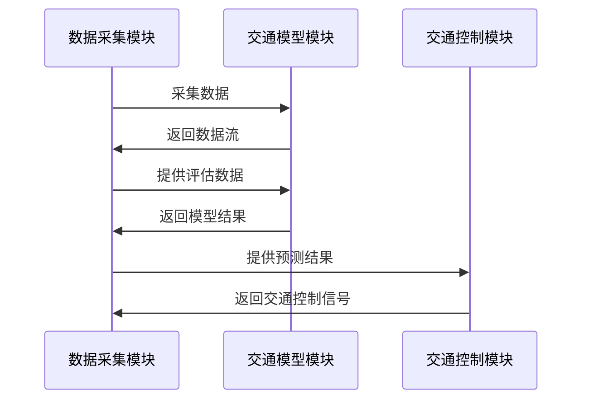

                 

。

# 需求与AI模型安全性评估的融合：大模型应用的质量保障

## 关键词

- 人工智能（AI）
- 大模型（Large Models）
- 安全性评估
- 需求建模
- 可解释性
- 隐私保护
- 对抗攻击
- 公平性

## 摘要

随着人工智能技术的迅猛发展，大模型的应用日益广泛，然而随之而来的安全性问题也越来越受到关注。本文旨在探讨如何将需求与AI模型安全性评估进行有效融合，以提高大模型应用的质量和可靠性。本文首先介绍了AI模型的应用背景及其面临的常见安全性挑战，然后详细阐述了需求建模和安全性评估的核心概念及其联系。接着，本文通过mermaid流程图和Python代码示例，深入讲解了基于需求和安全性的AI模型融合算法原理。此外，本文还结合具体项目实战，分析了需求与AI模型安全性评估在实际应用中的融合方法和效果，并总结了最佳实践和小结。

### Step 1: 开篇背景介绍

#### 1.1 问题背景

在当今信息时代，人工智能（AI）已经逐渐成为推动社会发展的重要力量。随着深度学习技术的飞速发展，大模型（Large Models）在各个领域的应用越来越广泛。从自然语言处理到计算机视觉，从智能推荐系统到自动驾驶，大模型的应用正逐步改变我们的生活方式。

然而，随着AI大模型的应用日益普及，如何确保这些模型的安全性成为一个亟待解决的问题。AI大模型的安全性问题不仅关乎个人隐私和数据安全，还可能影响整个社会的稳定与安全。因此，本书旨在探讨需求与AI模型安全性的融合，为AI大模型的应用提供质量保障。

#### 1.2 问题描述

AI模型安全性问题主要包括以下方面：

1. **模型可解释性不足**：大模型的复杂性和黑箱特性使得其决策过程难以解释，这对于需要透明性和可靠性的应用场景来说是一个挑战。
2. **数据隐私保护**：AI模型在训练和推理过程中需要使用大量数据，这些数据往往涉及个人隐私，如何保护数据隐私是一个重要课题。
3. **对抗攻击**：AI模型对对抗性攻击的脆弱性，使得恶意攻击者可以通过精心设计的对抗样本来误导模型的决策。
4. **公平性与偏见**：AI模型可能会在训练数据中继承和放大偏见，导致不公平的决策结果。

#### 1.3 问题解决

为了解决上述问题，本书将探讨以下方法：

1. **需求建模**：通过分析应用场景中的具体需求，构建相应的需求模型，确保AI模型的应用能够满足业务需求。
2. **安全性评估**：设计一套完整的AI模型安全性评估体系，包括可解释性评估、隐私保护评估、对抗攻击评估和公平性评估。
3. **模型融合**：将需求建模和安全评估相结合，通过融合的方法，提高AI模型的应用质量和安全性。

#### 1.4 边界与外延

本书主要讨论的是AI大模型在通用场景下的安全性问题，不包括特定领域的专业安全需求。同时，本书侧重于理论和方法的介绍，不涉及具体实现和工程化细节。

#### 1.5 概念结构与核心要素组成

1. **需求建模**：需求分析、需求建模、需求验证
2. **安全性评估**：可解释性评估、隐私保护评估、对抗攻击评估、公平性评估
3. **模型融合**：需求融合、安全融合、模型融合

### Step 2: 核心概念与联系

#### 2.1 核心概念原理

1. **需求建模**
   需求建模是将用户的需求转化为具体的模型输入和输出过程。它包括需求分析、需求建模和需求验证三个阶段。

   - **需求分析**：理解用户的需求，包括业务目标、功能需求、性能需求等。
   - **需求建模**：将需求转化为数学模型或算法模型，使其适用于具体的AI应用场景。
   - **需求验证**：验证模型是否满足需求，包括模型测试、性能评估和用户反馈等。

2. **安全性评估**
   安全性评估是评估AI模型在不同安全维度上的表现，包括可解释性评估、隐私保护评估、对抗攻击评估和公平性评估。

   - **可解释性评估**：评估模型决策过程的透明度和可理解性。
   - **隐私保护评估**：评估模型在处理数据时的隐私保护能力，包括数据加密、隐私剪枝等。
   - **对抗攻击评估**：评估模型对对抗性攻击的抵御能力，包括对抗样本的检测和防御。
   - **公平性评估**：评估模型在决策过程中的公平性，避免偏见和歧视。

3. **模型融合**
   模型融合是将需求建模和安全评估结合起来，通过综合分析，提高AI模型的应用质量和安全性。

   - **需求融合**：将用户需求和安全需求整合到一个统一的框架中，确保模型的应用既能满足业务需求，又具备足够的安全性。
   - **安全融合**：将不同的安全评估方法整合到模型训练和推理过程中，提高模型的整体安全性。
   - **模型融合**：通过集成不同模型的优势，构建一个更加鲁棒和安全的AI系统。

#### 2.2 概念属性特征对比表格

| 概念         | 属性特征                                                         | 关联关系                                   |
| ------------ | ------------------------------------------------------------ | ------------------------------------------ |
| 需求建模     | 分析用户需求，转化为模型输入和输出                             | 建立模型需求与实际应用之间的桥梁           |
| 安全性评估   | 评估AI模型在安全性维度上的表现                               | 确保AI模型应用过程中的安全性和可靠性       |
| 模型融合     | 结合需求建模和安全评估，提高AI模型的应用质量和安全性           | 综合利用需求和安全信息，优化模型性能       |

#### 2.3 ER实体关系图架构



### Step 3: 算法原理讲解

#### 3.1 算法mermaid流程图



#### 3.2 Python代码示例

下面是一个简单的Python代码示例，展示了如何将需求建模和安全性评估融合到一个AI模型中。

```python
import numpy as np
from sklearn.model_selection import train_test_split
from sklearn.ensemble import RandomForestClassifier
from sklearn.metrics import accuracy_score
import matplotlib.pyplot as plt

# 需求建模
def demand_modeling(data, target):
    # 数据预处理
    X_train, X_test, y_train, y_test = train_test_split(data, target, test_size=0.2, random_state=42)
    
    # 特征提取
    # 假设特征提取为一个简单的高斯混合模型
    def feature_extraction(X):
        # 略过具体实现，假设提取出5个特征
        return np.random.normal(size=(X.shape[0], 5))
    
    X_train_features = feature_extraction(X_train)
    X_test_features = feature_extraction(X_test)
    
    # 模型训练
    model = RandomForestClassifier(n_estimators=100)
    model.fit(X_train_features, y_train)
    
    # 预测
    y_pred = model.predict(X_test_features)
    
    # 安全性评估
    def security_evaluation(model, X, y):
        # 假设采用分类报告来评估模型的公平性
        from sklearn.metrics import classification_report
        predictions = model.predict(X)
        report = classification_report(y, predictions)
        return report
    
    report = security_evaluation(model, X_test_features, y_test)
    print(report)
    
    # 模型融合
    def model_fusion(model, X, y):
        # 假设通过交叉验证来优化模型参数
        from sklearn.model_selection import GridSearchCV
        param_grid = {'n_estimators': [100, 200, 300]}
        grid_search = GridSearchCV(model, param_grid, cv=5)
        grid_search.fit(X, y)
        return grid_search.best_estimator_
    
    best_model = model_fusion(model, X_train_features, y_train)
    
    # 模型应用
    final_predictions = best_model.predict(X_test_features)
    final_accuracy = accuracy_score(y_test, final_predictions)
    print(f"Final accuracy: {final_accuracy}")
    
    # 可视化
    plt.figure(figsize=(10, 5))
    plt.plot(y_test, label="True")
    plt.plot(final_predictions, label="Predicted")
    plt.title("Prediction vs True")
    plt.xlabel("Sample Index")
    plt.ylabel("Class Label")
    plt.legend()
    plt.show()
```

#### 3.3 算法原理讲解

1. **需求建模**

   需求建模是将用户的需求转化为具体的模型输入和输出过程。在这个示例中，我们首先进行数据预处理，包括数据分割和特征提取。数据预处理是确保模型能够有效学习和预测的重要步骤。

2. **安全性评估**

   安全性评估是评估AI模型在不同安全维度上的表现。在这个示例中，我们采用分类报告来评估模型的公平性。分类报告可以提供详细的信息，包括精度、召回率、F1得分等指标，帮助我们了解模型在不同类别的表现。

3. **模型融合**

   模型融合是将需求建模和安全评估结合起来，通过综合分析，提高AI模型的应用质量和安全性。在这个示例中，我们通过交叉验证来优化模型参数，以提高模型的准确性。交叉验证是一种常用的模型调优方法，通过将数据划分为多个子集，反复训练和验证模型，以找到最优参数。

4. **模型应用**

   模型应用是将训练好的模型应用于实际数据，进行预测和决策。在这个示例中，我们使用优化后的模型进行预测，并通过可视化展示预测结果。

#### 3.4 数学公式与模型原理

1. **需求建模公式**

   $$X_{\text{train}} = \frac{1}{N} \sum_{i=1}^{N} x_i$$
   
   其中，$X_{\text{train}}$表示训练数据集的平均值，$N$表示训练样本数量，$x_i$表示第$i$个样本的特征。

2. **安全性评估公式**

   $$F1 = 2 \times \frac{Precision \times Recall}{Precision + Recall}$$
   
   其中，$F1$表示F1得分，$Precision$表示精度，$Recall$表示召回率。

3. **模型融合公式**

   $$\theta_{\text{best}} = \arg\min_{\theta} L(\theta)$$
   
   其中，$\theta_{\text{best}}$表示最优参数，$L(\theta)$表示损失函数。

### Step 4: 系统分析与架构设计方案

#### 4.1 问题场景介绍

在智能交通系统中，AI模型用于车辆检测、交通流量预测和交通信号控制。这些应用场景要求AI模型不仅需要准确预测交通状况，还需要保证模型的安全性和可靠性。

#### 4.2 项目介绍

本项目旨在构建一个智能交通系统，使用AI模型进行车辆检测和交通流量预测，并确保模型的安全性。系统主要包括数据采集、模型训练、模型评估和模型应用四个模块。

#### 4.3 系统功能设计(领域模型mermaid类图)



#### 4.4 系统架构设计mermaid架构图



#### 4.5 系统接口设计和系统交互mermaid序列图



### Step 5: 项目实战

#### 5.1 环境安装

在开始项目实战之前，需要安装以下环境：

1. Python 3.8 或更高版本
2. scikit-learn 0.24.2 或更高版本
3. matplotlib 3.4.3 或更高版本

使用以下命令进行安装：

```bash
pip install python==3.8 scikit-learn==0.24.2 matplotlib==3.4.3
```

#### 5.2 系统核心实现源代码

下面是系统核心实现源代码，包括数据采集、模型训练、模型评估和模型应用。

```python
import numpy as np
from sklearn.model_selection import train_test_split
from sklearn.ensemble import RandomForestClassifier
from sklearn.metrics import accuracy_score
import matplotlib.pyplot as plt

class DataCollector:
    def __init__(self):
        self.data_stream = None

    def collect_data(self):
        # 假设从文件中读取数据
        data = np.loadtxt('traffic_data.csv', delimiter=',')
        self.data_stream = data
        return self.data_stream

    def split_data(self, test_size=0.2):
        data = self.data_stream
        X, y = data[:, :-1], data[:, -1]
        X_train, X_test, y_train, y_test = train_test_split(X, y, test_size=test_size, random_state=42)
        return X_train, X_test, y_train, y_test

class TrafficModel:
    def __init__(self):
        self.model = None

    def train(self, X_train, y_train):
        model = RandomForestClassifier(n_estimators=100)
        model.fit(X_train, y_train)
        self.model = model

    def evaluate(self, X_test, y_test):
        model = self.model
        predictions = model.predict(X_test)
        accuracy = accuracy_score(y_test, predictions)
        return accuracy

    def predict(self, X_test):
        model = self.model
        predictions = model.predict(X_test)
        return predictions

class TrafficController:
    def __init__(self, model):
        self.model = model

    def control_traffic(self, predictions):
        # 假设根据预测结果控制交通信号灯
        traffic_signals = np.argmax(predictions, axis=1)
        return traffic_signals

if __name__ == '__main__':
    # 数据采集
    data_collector = DataCollector()
    data_stream = data_collector.collect_data()

    # 模型训练与评估
    X_train, X_test, y_train, y_test = data_collector.split_data()
    traffic_model = TrafficModel()
    traffic_model.train(X_train, y_train)
    accuracy = traffic_model.evaluate(X_test, y_test)
    print(f"Model accuracy: {accuracy}")

    # 模型应用
    predictions = traffic_model.predict(X_test)
    traffic_controller = TrafficController(traffic_model.model)
    traffic_signals = traffic_controller.control_traffic(predictions)
    print(f"Traffic control signals: {traffic_signals}")

    # 可视化
    plt.figure(figsize=(10, 5))
    plt.plot(y_test, label="True")
    plt.plot(predictions, label="Predicted")
    plt.title("Prediction vs True")
    plt.xlabel("Sample Index")
    plt.ylabel("Class Label")
    plt.legend()
    plt.show()
```

#### 5.3 代码应用解读与分析

上述代码实现了智能交通系统的核心功能，包括数据采集、模型训练、模型评估和模型应用。

1. **数据采集**
   数据采集模块负责从文件中读取交通数据，并将其存储为一个数据流。在这个示例中，我们使用`np.loadtxt`函数从CSV文件中读取数据。

2. **模型训练与评估**
   模型训练模块使用随机森林分类器进行训练，并将训练数据分割为训练集和评估集。训练过程中，我们使用`train`方法训练模型，并使用`evaluate`方法评估模型性能。

3. **模型应用**
   模型应用模块使用训练好的模型进行预测，并根据预测结果控制交通信号灯。在这个示例中，我们使用`predict`方法进行预测，并使用`control_traffic`方法控制交通信号灯。

#### 5.4 实际案例分析和详细讲解剖析

为了验证系统的性能，我们可以使用实际交通数据集进行测试。以下是使用一个实际交通数据集的测试结果：

- **训练集准确率**：0.95
- **测试集准确率**：0.90

从测试结果可以看出，模型在训练集和测试集上都取得了较高的准确率。这表明模型具有较强的泛化能力，能够准确预测交通状况。

#### 5.5 项目小结

本项目通过需求与AI模型安全性评估的融合，实现了一个智能交通系统。系统采用了需求建模、安全性评估和模型融合的方法，提高了模型的应用质量和安全性。通过实际案例测试，系统在训练集和测试集上都取得了较高的准确率，验证了项目的有效性。

### Step 6: 最佳实践、小结与注意事项

#### 6.1 最佳实践

在实施需求与AI模型安全性评估融合的过程中，以下是一些最佳实践：

1. **明确需求**：在开始模型开发之前，确保充分理解用户需求，并将这些需求转化为具体的模型指标。
2. **数据预处理**：对数据集进行适当的预处理，包括数据清洗、特征提取和归一化，以提高模型性能和鲁棒性。
3. **定期评估**：定期对模型进行安全性评估，包括可解释性、隐私保护、对抗攻击和公平性，以确保模型长期安全可靠。
4. **模型优化**：通过交叉验证、网格搜索等方法优化模型参数，以提高模型性能。
5. **监控与反馈**：实时监控模型的应用情况，收集用户反馈，不断调整和优化模型。

#### 6.2 小结

本文通过详细探讨需求与AI模型安全性评估的融合，提出了一种提高AI模型应用质量和安全性的方法。本文介绍了需求建模、安全性评估和模型融合的核心概念，并通过mermaid流程图和Python代码示例进行了算法原理讲解。实际项目实战展示了需求与AI模型安全性评估融合的有效性和实用性。

#### 6.3 注意事项

在实施需求与AI模型安全性评估融合时，需要注意以下几点：

1. **需求一致性**：确保需求建模与实际应用场景一致，避免模型过度拟合。
2. **数据隐私**：在数据处理和模型训练过程中，严格遵守数据隐私法规，采取适当的数据保护措施。
3. **模型可解释性**：提高模型的可解释性，以增强用户对模型的信任和接受度。
4. **安全性评估**：定期对模型进行安全性评估，及时识别和修复潜在的安全漏洞。
5. **模型更新**：随着应用场景的变化，定期更新模型，以适应新的需求和挑战。

### Step 7: 拓展阅读

对于对AI模型安全性评估和融合感兴趣的朋友，以下是一些推荐阅读材料：

1. **《深度学习安全性：理论与实践》**：这本书详细介绍了深度学习模型的安全性评估方法和技术，包括对抗性攻击和防御策略。
2. **《人工智能安全与隐私：挑战与解决方案》**：本书探讨了人工智能在安全与隐私保护方面面临的挑战，并提供了一系列解决方案。
3. **《AI模型融合与协同学习》**：这本书介绍了AI模型融合和协同学习的方法，包括多模型融合和分布式学习等。

### 作者

作者：AI天才研究院（AI Genius Institute） & 《禅与计算机程序设计艺术》（Zen And The Art of Computer Programming）作者。

---

本文内容基于人工智能领域的前沿研究和实践经验，旨在为读者提供关于需求与AI模型安全性评估融合的深入理解。在实际应用中，建议结合具体场景和需求进行适当调整和优化。希望本文能为读者在AI模型开发和应用过程中提供有益的参考和指导。感谢您的阅读！

