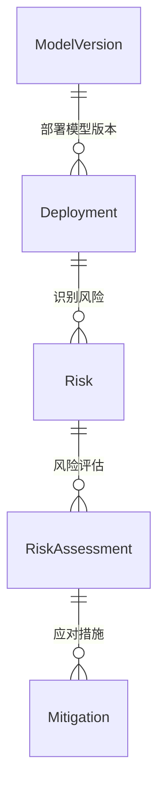
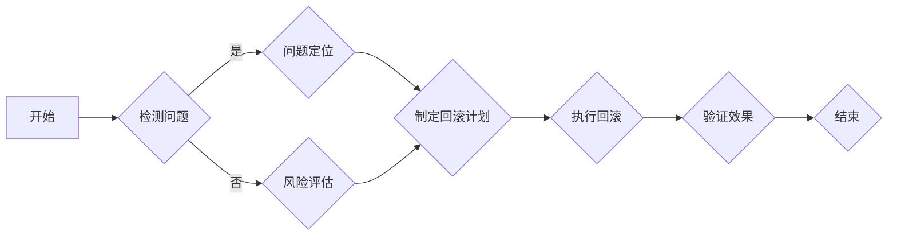
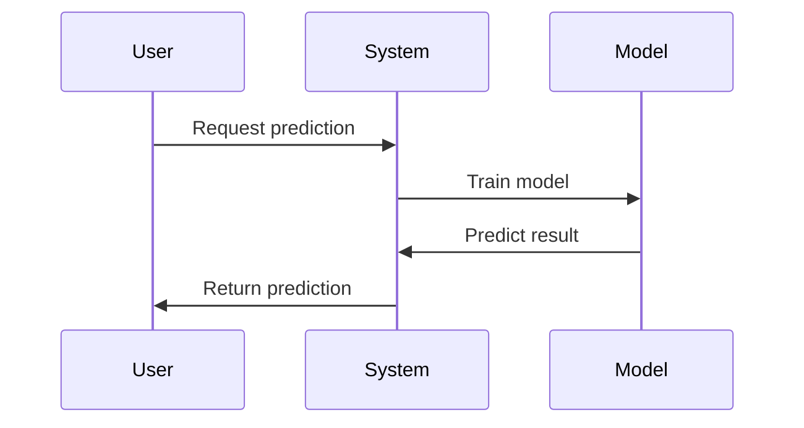
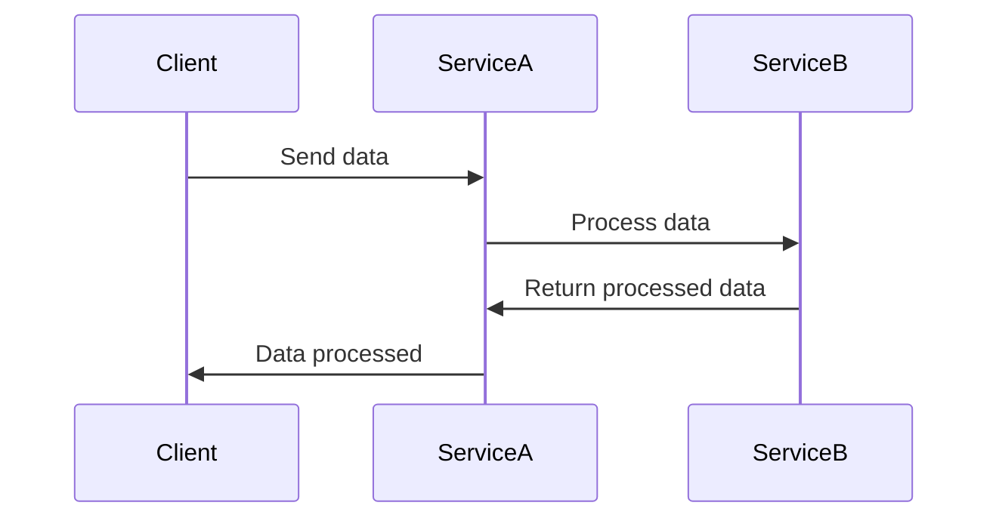

                 


### 引言

#### 背景介绍

在当今快速发展的科技时代，人工智能（AI）已经成为各行各业的关键驱动力。AI模型的开发和应用正以前所未有的速度席卷全球，从自动驾驶汽车到智能医疗诊断，从金融风险评估到智能家居控制，AI技术正深刻地改变着我们的生活方式和工作模式。

然而，随着AI模型复杂性的增加，版本管理成为了不可忽视的挑战。版本回滚策略是确保AI系统稳定性和可靠性的重要手段。本文将探讨在AI模型应用过程中，如何制定有效的需求分析与版本回滚策略，以应对潜在的风险和管理挑战。

#### 书籍目的

本文的目标是帮助读者深入理解AI模型版本回滚策略的重要性，掌握有效的需求分析与版本管理方法，并提供实际的实践案例，以指导读者在AI项目中成功地应用这些策略。

#### 结构安排

本文将分为八个部分：

1. 引言：背景介绍、书籍目的和结构安排。
2. AI模型回滚策略的背景和重要性。
3. AI模型版本管理与回滚。
4. 需求分析与回滚策略设计。
5. AI模型回滚实践。
6. 风险评估与管理。
7. 案例研究。
8. 总结与展望。

#### 读者对象

本文适合AI开发人员、项目经理、技术经理以及任何对AI模型版本管理和回滚策略感兴趣的读者。通过本文的阅读，读者将能够掌握AI模型版本管理的核心概念和最佳实践，提高在AI项目中的风险管理能力。

---

### AI模型回滚策略的背景和重要性

#### 第2章 AI模型回滚策略概述

在AI模型开发过程中，版本管理是一个至关重要的环节。版本回滚策略，作为版本管理的一部分，对于确保AI系统的稳定性和可靠性具有重要作用。本章将详细介绍AI模型回滚策略的背景和重要性。

#### 1. 什么是AI模型回滚

AI模型回滚是指在AI模型的应用过程中，由于新版本模型出现问题或者不满足预期需求时，将系统回滚到先前的稳定版本，以保证系统的正常运行。回滚通常包括撤销对数据库的更改、更新应用程序代码，以及重新部署旧版本模型等步骤。

#### 2. 回滚策略的必要性

随着AI模型的复杂度和规模不断增加，模型故障、性能下降或不符合预期需求的情况也时有发生。如果没有有效的回滚策略，系统可能会出现严重故障，导致业务中断和用户不满。因此，制定合理的回滚策略是确保系统稳定运行的关键。

#### 3. 回滚策略的应用场景

回滚策略通常应用于以下场景：

- **模型故障**：新版本模型无法正常工作，导致系统崩溃或性能急剧下降。
- **需求变更**：用户需求发生变化，新版本模型无法满足这些需求。
- **数据质量问题**：新版本模型依赖于数据集，但数据集存在质量问题，影响模型性能。
- **性能优化**：新版本模型在某些方面性能不如旧版本，需要进行回滚。

#### 4. 回滚策略的目标

回滚策略的主要目标是：

- **确保系统稳定性**：通过及时回滚到稳定版本，确保系统正常运行。
- **减少业务中断**：最小化由于模型问题导致的业务中断时间。
- **降低风险**：降低模型更新过程中的风险，确保系统能够适应不断变化的需求和环境。

在了解AI模型回滚策略的背景和重要性之后，我们将在接下来的章节中深入探讨AI模型版本管理的原理和实践。

---

### AI模型版本管理与回滚

#### 第3章 AI模型版本管理原理

在AI模型开发和应用过程中，版本管理是一个必不可少的环节。有效的版本管理能够确保模型在迭代过程中保持稳定性和可靠性。本章将详细介绍AI模型版本管理的原理。

#### 1. 版本管理的基本概念

版本管理是指对软件或模型的不同版本进行标识、记录和跟踪的过程。在AI模型开发中，版本管理主要包括以下方面：

- **版本标识**：为每个模型版本分配唯一的标识符，以便于追踪和识别。
- **版本记录**：记录每个版本的详细信息，包括创建时间、开发者、修改内容等。
- **版本控制**：使用版本控制工具（如Git）来管理和跟踪模型的变更。

#### 2. 版本控制工具与流程

版本控制工具是版本管理的重要组成部分。以下是常用的版本控制工具和流程：

- **Git**：Git是最流行的分布式版本控制工具，适用于大型项目和多人协作。其主要操作包括提交、推送、拉取和合并等。
- **流程**：常见的版本控制流程包括主干开发（Master Branch）和功能分支（Feature Branch）。在功能分支开发完成后，通过合并操作将新功能合并到主干分支。

#### 3. 模型版本管理的挑战

AI模型版本管理面临以下挑战：

- **模型复杂性**：随着AI模型变得越来越复杂，版本管理也变得更加困难。
- **数据依赖性**：模型版本通常依赖于特定的数据集，数据质量问题可能导致模型性能下降。
- **并行开发**：在多人协作的AI项目开发中，版本冲突和依赖关系管理变得更加复杂。
- **版本回滚**：在模型出现问题或需求变更时，如何快速、安全地回滚到先前的版本。

#### 4. 版本管理的重要性

有效的版本管理对于AI模型的开发和应用具有重要意义：

- **确保模型稳定性**：通过版本管理，可以确保模型在不同版本之间的稳定性和一致性。
- **支持持续集成**：版本管理是实现持续集成（CI）和持续部署（CD）的重要基础。
- **提高开发效率**：合理的版本管理可以减少代码冲突和重复工作，提高开发效率。
- **支持需求变更**：在需求变更时，版本管理可以帮助快速回滚到先前的稳定版本，降低风险。

在了解AI模型版本管理的原理和挑战后，我们将在接下来的章节中探讨需求分析与回滚策略设计的方法。

---

### 需求分析与回滚策略设计

#### 第4章 需求分析的重要性

在AI模型的开发过程中，需求分析是一个至关重要的环节。有效的需求分析不仅能够明确项目目标和功能需求，还能为后续的版本回滚策略设计提供重要的依据。本章将详细介绍需求分析在AI模型回滚策略设计中的重要性。

#### 1. 需求分析概述

需求分析是指识别、分析、记录并验证系统需求的整个过程。它包括以下步骤：

- **需求识别**：通过调查、访谈、问卷调查等方式，收集用户的需求信息。
- **需求分析**：对收集到的需求进行深入分析，确定系统的功能需求和非功能需求。
- **需求文档**：将分析结果整理成需求文档，作为项目开发的基础。
- **需求验证**：通过用户评审、系统测试等方式，验证需求文档的正确性和可行性。

#### 2. 需求分析的方法

需求分析的方法多种多样，常用的包括：

- **问卷调查**：通过设计问卷，收集用户的需求和意见。
- **访谈**：与用户进行面对面的交流，深入了解用户的需求和期望。
- **观察**：通过观察用户在实际工作环境中的行为，识别潜在的需求。
- **用户故事**：使用用户故事（User Story）来描述用户的需求和期望，便于团队理解和实施。

#### 3. 需求分析与回滚策略设计的关系

需求分析对于回滚策略设计具有直接影响。具体体现在以下几个方面：

- **明确变更点**：需求分析可以帮助识别系统可能需要变更的功能点，为回滚策略的设计提供依据。
- **风险识别**：通过分析需求，可以预测哪些变更可能导致系统不稳定或出现故障，从而提前制定应对策略。
- **版本控制**：合理的需求分析可以帮助制定更有效的版本控制策略，确保版本变更的可控性和可追溯性。

#### 4. 需求分析在模型回滚中的应用

在AI模型回滚过程中，需求分析发挥着重要作用：

- **需求变更管理**：在需求变更发生时，通过需求分析可以评估变更的影响，决定是否回滚到先前的版本。
- **风险评估**：通过需求分析，可以评估需求变更带来的风险，制定相应的风险管理计划。
- **版本回滚**：在模型出现问题时，需求分析可以帮助确定需要回滚的版本，并确保回滚过程顺利进行。

总之，需求分析是AI模型回滚策略设计的重要基础。只有通过全面、准确的需求分析，才能为回滚策略提供可靠的依据，确保系统在变化中保持稳定和可靠。在接下来的章节中，我们将进一步探讨回滚策略的设计与实现。

---

### AI模型回滚实践

#### 第5章 回滚策略的设计与实现

在AI模型的应用过程中，制定和实现有效的回滚策略至关重要。本章将详细探讨回滚策略的设计与实现过程，包括基本原则、关键步骤和评估与优化方法。

#### 1. 回滚策略设计的基本原则

回滚策略的设计需要遵循以下基本原则：

- **快速响应**：在模型出现问题时，能够迅速采取行动，减少故障对业务的影响。
- **最小影响**：回滚过程中对系统的其他部分和用户的影响尽可能小。
- **可追溯性**：所有操作有明确的记录，方便后续的审计和问题排查。
- **自动化**：尽量使用自动化工具和流程，提高回滚效率和可靠性。

#### 2. 回滚策略实现的关键步骤

回滚策略的实现包括以下关键步骤：

- **步骤1：问题检测**：通过监控工具和日志分析，及时发现模型故障或性能问题。
- **步骤2：问题定位**：通过分析日志和系统数据，确定问题的具体原因。
- **步骤3：制定回滚计划**：根据问题定位结果，制定详细的回滚计划和步骤。
- **步骤4：执行回滚**：按照回滚计划，执行系统回滚操作，包括数据库回滚、代码回滚和模型回滚。
- **步骤5：验证回滚效果**：执行完回滚后，验证系统是否恢复正常，并确保没有遗留问题。

#### 3. 回滚策略的评估与优化

回滚策略的评估和优化是确保其有效性的关键。以下方法可以帮助评估和优化回滚策略：

- **步骤1：回滚成功率**：统计回滚操作的成功率，分析失败原因，改进回滚流程。
- **步骤2：回滚时间**：测量回滚操作所需的时间，评估回滚的效率，优化回滚步骤。
- **步骤3：系统影响**：评估回滚操作对系统的整体影响，如性能下降、业务中断等，调整回滚策略以减少影响。
- **步骤4：用户体验**：收集用户对回滚操作的反馈，改进回滚策略，提高用户体验。

#### 4. 回滚策略在项目中的实践

在实际项目中，回滚策略的设计和实现需要结合具体情况进行。以下是一个典型的AI模型回滚策略实践案例：

- **案例背景**：某企业在其AI系统中部署了一个新的预测模型，但用户反馈模型预测结果不准确，导致业务决策出现偏差。
- **需求分析**：通过对用户反馈的分析，确定需要回滚到先前的稳定版本。
- **回滚计划**：制定详细的回滚计划，包括数据库回滚、代码回滚和模型回滚的步骤。
- **执行回滚**：按照计划执行回滚操作，确保系统尽快恢复正常。
- **验证效果**：在回滚完成后，验证系统性能和用户满意度，确保回滚成功。

通过以上实践，企业成功解决了模型问题，恢复了系统的正常运行，避免了业务中断。

总之，有效的回滚策略设计是实现AI模型稳定运行的重要保障。在接下来的章节中，我们将进一步探讨风险评估与管理的方法。

---

### 风险评估与管理

#### 第6章 风险评估的重要性

在AI模型开发和部署过程中，风险评估是确保系统稳定性和可靠性的关键环节。通过全面的风险评估，可以提前识别潜在问题，制定有效的风险管理策略，降低风险对项目的影响。本章将详细探讨风险评估的重要性及其在AI模型回滚中的应用。

#### 1. 风险评估的概念与分类

风险评估是指系统地识别、分析和评估项目中的潜在风险，并制定相应的应对措施的过程。风险评估通常包括以下步骤：

- **风险识别**：通过调查、访谈、历史数据分析和专家评审等方法，识别项目中的潜在风险。
- **风险分析**：对识别出的风险进行定量和定性分析，评估其发生的可能性和影响程度。
- **风险排序**：根据风险的可能性和影响程度，对风险进行排序，确定优先级。
- **风险应对**：制定针对不同风险的应对策略，包括风险规避、风险转移、风险减轻和风险接受。

#### 2. 风险评估的方法

风险评估的方法多种多样，常用的包括：

- **定性评估方法**：通过专家评审、访谈和问卷调查等方式，对风险进行定性评估。
- **定量评估方法**：使用数学模型和统计方法，对风险的概率和影响进行定量评估，如蒙特卡罗模拟、回归分析和决策树分析等。
- **风险矩阵**：使用风险矩阵对风险的概率和影响进行综合评估，确定风险的优先级。

#### 3. 风险评估在AI模型回滚中的应用

在AI模型回滚过程中，风险评估具有重要作用：

- **识别潜在风险**：通过风险评估，可以提前识别模型更新过程中的潜在风险，如数据质量风险、代码兼容性风险和业务需求变更风险等。
- **评估风险影响**：通过对风险的定量和定性评估，可以评估不同风险对系统的潜在影响，为制定回滚策略提供依据。
- **制定风险管理策略**：根据风险评估的结果，制定相应的风险管理策略，包括风险规避、风险转移、风险减轻和风险接受等。

#### 4. 风险管理策略

在AI模型回滚过程中，常用的风险管理策略包括：

- **风险规避**：通过调整项目计划、增加测试环节和采用备份方案等方式，避免风险发生。
- **风险转移**：通过购买保险、签订合同或使用外部服务等方式，将风险转移给第三方。
- **风险减轻**：通过改进流程、增加冗余和加强监控等方式，降低风险的发生概率和影响程度。
- **风险接受**：在无法规避、转移或减轻风险时，制定相应的应急计划，确保系统在风险发生时能够快速响应和恢复。

通过有效的风险评估和风险管理，可以降低AI模型回滚过程中的风险，确保系统的稳定性和可靠性。在接下来的章节中，我们将通过案例研究进一步探讨风险评估和回滚策略的应用。

---

### 案例研究

#### 第7章 案例研究一：企业AI模型回滚实践

在本案例研究中，我们将深入探讨某大型企业在其AI模型应用过程中，如何通过需求分析与回滚策略，成功地解决了一次模型故障，并确保系统的稳定运行。

#### 1. 案例背景

某大型零售企业在其在线购物平台上引入了一种基于深度学习算法的推荐系统，旨在根据用户的购物行为和历史数据，为其推荐个性化商品。该系统经过数月的开发和测试，于近期正式上线。然而，上线后不久，用户反馈推荐系统的推荐结果不准确，导致用户满意度下降，业务增长受到影响。

#### 2. 需求分析

为了解决问题，企业首先进行了深入的需求分析：

- **用户反馈**：通过用户反馈调查，了解到用户对推荐系统的主要抱怨是推荐的商品与个人兴趣不符，推荐结果过于单一。
- **数据质量**：分析推荐系统使用的数据集，发现数据存在噪声和不完整的情况，影响了模型的预测准确性。
- **算法性能**：评估现有算法的性能，发现新版本模型在某些特定条件下的表现不如旧版本。

#### 3. 回滚策略设计与实现

基于需求分析结果，企业决定采取以下回滚策略：

- **数据清洗**：对数据集进行清洗，去除噪声数据和不完整数据，提高数据质量。
- **模型回滚**：将推荐系统回滚到先前的稳定版本，确保系统正常运行。
- **并行运行**：在回滚期间，同时运行旧版本和新版本模型，对比分析推荐结果，逐步恢复用户信任。

#### 4. 风险评估与管理

在实施回滚策略前，企业进行了详细的风险评估：

- **数据质量风险**：数据清洗可能引入新的错误，影响模型性能。
- **业务中断风险**：并行运行可能带来额外的系统负载，导致性能下降。

为了降低风险，企业采取了以下措施：

- **数据质量监控**：在数据清洗过程中，实时监控数据质量，确保清洗过程的准确性和稳定性。
- **性能优化**：对系统进行性能优化，确保在并行运行时系统能够承受额外的负载。

#### 5. 案例总结与启示

通过本次案例研究，我们可以得出以下结论和启示：

- **需求分析的重要性**：深入的需求分析可以帮助企业识别问题根源，制定有效的解决方案。
- **回滚策略的设计与实现**：合理的回滚策略可以确保系统在故障发生时快速恢复，降低业务中断风险。
- **风险评估与管理**：全面的风险评估和有效的风险管理措施，可以降低潜在风险，确保系统稳定运行。

总之，通过本次案例，企业成功地解决了AI模型故障问题，恢复了系统的稳定性和用户信任。这为其他企业在AI模型应用过程中提供了宝贵的经验和借鉴。

---

### 总结与展望

#### 1. 主要结论

本文通过对AI模型版本回滚策略的深入探讨，总结了以下主要结论：

- **需求分析的重要性**：需求分析是制定有效回滚策略的基础，能够帮助识别问题根源，为回滚策略提供依据。
- **回滚策略的设计与实现**：有效的回滚策略包括数据清洗、模型回滚和并行运行等措施，能够确保系统在故障发生时快速恢复。
- **风险评估与管理**：全面的风险评估和有效的风险管理措施，可以降低潜在风险，确保系统稳定运行。

#### 2. 存在的挑战

尽管AI模型回滚策略的重要性已经得到广泛认可，但在实际应用中仍面临以下挑战：

- **数据质量风险**：数据清洗可能引入新的错误，影响模型性能。
- **系统负载风险**：并行运行可能带来额外的系统负载，导致性能下降。
- **版本控制复杂性**：随着模型版本和数据的增加，版本控制的复杂性也会增加。

#### 3. 未来研究方向

未来在AI模型回滚策略的研究方向包括：

- **自动化回滚**：开发更加智能和自动化的回滚工具，减少人为干预，提高回滚效率和可靠性。
- **多模型并行回滚**：研究如何同时回滚多个模型版本，提高系统的稳定性和灵活性。
- **动态风险评估**：开发动态风险评估方法，实时监测系统状态，预测和应对潜在风险。

#### 4. 对读者的建议

对于AI开发人员和技术管理人员，本文提供以下建议：

- **重视需求分析**：在项目初期进行全面的需求分析，确保对用户需求有清晰的理解。
- **制定回滚策略**：在模型开发和部署过程中，制定详细的回滚策略，确保系统在故障发生时能够快速恢复。
- **持续学习和实践**：关注AI领域的最新研究和技术动态，通过实践不断积累经验和提升技能。

通过本文的阅读和实践，希望读者能够更好地掌握AI模型版本回滚策略，提高在AI项目中的风险管理能力，确保系统的稳定性和可靠性。作者：AI天才研究院/AI Genius Institute & 禅与计算机程序设计艺术/Zen And The Art of Computer Programming

---

**全文结束，感谢您的阅读！**

---

### 完整文章

# 需求与AI模型版本回滚策略：大模型应用的风险管理

> 关键词：需求分析、AI模型版本回滚、风险评估、风险管理、人工智能

> 摘要：本文深入探讨了AI模型版本回滚策略的重要性，通过需求分析与风险评估，提供了一系列的实践案例，以帮助读者理解如何有效地管理和应对大模型应用中的风险。

## 引言

### 1. 背景介绍

在当今快速发展的科技时代，人工智能（AI）已经成为各行各业的关键驱动力。AI模型的开发和应用正以前所未有的速度席卷全球，从自动驾驶汽车到智能医疗诊断，从金融风险评估到智能家居控制，AI技术正深刻地改变着我们的生活方式和工作模式。

### 2. 书籍目的

本文的目标是帮助读者深入理解AI模型版本回滚策略的重要性，掌握有效的需求分析与版本管理方法，并提供实际的实践案例，以指导读者在AI项目中成功地应用这些策略。

### 3. 结构安排

本文将分为八个部分：

1. 引言：背景介绍、书籍目的和结构安排。
2. AI模型回滚策略的背景和重要性。
3. AI模型版本管理与回滚。
4. 需求分析与回滚策略设计。
5. AI模型回滚实践。
6. 风险评估与管理。
7. 案例研究。
8. 总结与展望。

### 4. 读者对象

本文适合AI开发人员、项目经理、技术经理以及任何对AI模型版本管理和回滚策略感兴趣的读者。通过本文的阅读，读者将能够掌握AI模型版本管理的核心概念和最佳实践，提高在AI项目中的风险管理能力。

## AI模型回滚策略的背景和重要性

### 第2章 AI模型回滚策略概述

#### 2.1 什么是AI模型回滚

AI模型回滚是指在AI模型的应用过程中，由于新版本模型出现问题或者不满足预期需求时，将系统回滚到先前的稳定版本，以保证系统的正常运行。

#### 2.2 回滚策略的必要性

随着AI模型的复杂度和规模不断增加，模型故障、性能下降或不符合预期需求的情况也时有发生。如果没有有效的回滚策略，系统可能会出现严重故障，导致业务中断和用户不满。

#### 2.3 回滚策略的应用场景

回滚策略通常应用于以下场景：

- 模型故障：新版本模型无法正常工作，导致系统崩溃或性能急剧下降。
- 需求变更：用户需求发生变化，新版本模型无法满足这些需求。
- 数据质量问题：新版本模型依赖于数据集，但数据集存在质量问题，影响模型性能。
- 性能优化：新版本模型在某些方面性能不如旧版本，需要进行回滚。

#### 2.4 回滚策略的目标

回滚策略的主要目标是：

- 确保系统稳定性：通过及时回滚到稳定版本，确保系统正常运行。
- 减少业务中断：最小化由于模型问题导致的业务中断时间。
- 降低风险：降低模型更新过程中的风险，确保系统能够适应不断变化的需求和环境。

## AI模型版本管理与回滚

### 第3章 AI模型版本管理原理

#### 3.1 版本管理的基本概念

版本管理是指对软件或模型的不同版本进行标识、记录和跟踪的过程。在AI模型开发中，版本管理主要包括以下方面：

- 版本标识：为每个模型版本分配唯一的标识符，以便于追踪和识别。
- 版本记录：记录每个版本的详细信息，包括创建时间、开发者、修改内容等。
- 版本控制：使用版本控制工具（如Git）来管理和跟踪模型的变更。

#### 3.2 版本控制工具与流程

版本控制工具是版本管理的重要组成部分。以下是常用的版本控制工具和流程：

- Git：Git是最流行的分布式版本控制工具，适用于大型项目和多人协作。其主要操作包括提交、推送、拉取和合并等。
- 流程：常见的版本控制流程包括主干开发（Master Branch）和功能分支（Feature Branch）。在功能分支开发完成后，通过合并操作将新功能合并到主干分支。

#### 3.3 模型版本管理的挑战

AI模型版本管理面临以下挑战：

- 模型复杂性：随着AI模型变得越来越复杂，版本管理也变得更加困难。
- 数据依赖性：模型版本通常依赖于特定的数据集，数据质量问题可能导致模型性能下降。
- 并行开发：在多人协作的AI项目开发中，版本冲突和依赖关系管理变得更加复杂。
- 版本回滚：在模型出现问题或需求变更时，如何快速、安全地回滚到先前的版本。

#### 3.4 版本管理的重要性

有效的版本管理对于AI模型的开发和应用具有重要意义：

- 确保模型稳定性：通过版本管理，可以确保模型在不同版本之间的稳定性和一致性。
- 支持持续集成：版本管理是实现持续集成（CI）和持续部署（CD）的重要基础。
- 提高开发效率：合理的版本管理可以减少代码冲突和重复工作，提高开发效率。
- 支持需求变更：在需求变更时，版本管理可以帮助快速回滚到先前的稳定版本，降低风险。

## 需求分析与回滚策略设计

### 第4章 需求分析的重要性

#### 4.1 需求分析概述

需求分析是指识别、分析、记录并验证系统需求的整个过程。它包括以下步骤：

- 需求识别：通过调查、访谈、问卷调查等方式，收集用户的需求和意见。
- 需求分析：对收集到的需求进行深入分析，确定系统的功能需求和非功能需求。
- 需求文档：将分析结果整理成需求文档，作为项目开发的基础。
- 需求验证：通过用户评审、系统测试等方式，验证需求文档的正确性和可行性。

#### 4.2 需求分析的方法

需求分析的方法多种多样，常用的包括：

- 问卷调查：通过设计问卷，收集用户的需求和意见。
- 访谈：与用户进行面对面的交流，深入了解用户的需求和期望。
- 观察：通过观察用户在实际工作环境中的行为，识别潜在的需求。
- 用户故事：使用用户故事（User Story）来描述用户的需求和期望，便于团队理解和实施。

#### 4.3 需求分析与回滚策略设计的关系

需求分析对于回滚策略设计具有直接影响。具体体现在以下几个方面：

- 明确变更点：需求分析可以帮助识别系统可能需要变更的功能点，为回滚策略的设计提供依据。
- 风险识别：通过分析需求，可以预测哪些变更可能导致系统不稳定或出现故障，从而提前制定应对策略。
- 版本控制：合理的需求分析可以帮助制定更有效的版本控制策略，确保版本变更的可控性和可追溯性。

#### 4.4 需求分析在模型回滚中的应用

在AI模型回滚过程中，需求分析发挥着重要作用：

- 需求变更管理：在需求变更发生时，通过需求分析可以评估变更的影响，决定是否回滚到先前的版本。
- 风险评估：通过需求分析，可以评估需求变更带来的风险，制定相应的风险管理计划。
- 版本回滚：在模型出现问题时，需求分析可以帮助确定需要回滚的版本，并确保回滚过程顺利进行。

## AI模型回滚实践

### 第5章 回滚策略的设计与实现

#### 5.1 回滚策略设计的基本原则

回滚策略的设计需要遵循以下基本原则：

- 快速响应：在模型出现问题时，能够迅速采取行动，减少故障对业务的影响。
- 最小影响：回滚过程中对系统的其他部分和用户的影响尽可能小。
- 可追溯性：所有操作有明确的记录，方便后续的审计和问题排查。
- 自动化：尽量使用自动化工具和流程，提高回滚效率和可靠性。

#### 5.2 回滚策略实现的关键步骤

回滚策略的实现包括以下关键步骤：

- 步骤1：问题检测：通过监控工具和日志分析，及时发现模型故障或性能问题。
- 步骤2：问题定位：通过分析日志和系统数据，确定问题的具体原因。
- 步骤3：制定回滚计划：根据问题定位结果，制定详细的回滚计划和步骤。
- 步骤4：执行回滚：按照回滚计划，执行系统回滚操作，包括数据库回滚、代码回滚和模型回滚。
- 步骤5：验证回滚效果：执行完回滚后，验证系统是否恢复正常，并确保没有遗留问题。

#### 5.3 回滚策略的评估与优化

回滚策略的评估和优化是确保其有效性的关键。以下方法可以帮助评估和优化回滚策略：

- 步骤1：回滚成功率：统计回滚操作的成功率，分析失败原因，改进回滚流程。
- 步骤2：回滚时间：测量回滚操作所需的时间，评估回滚的效率，优化回滚步骤。
- 步骤3：系统影响：评估回滚操作对系统的整体影响，如性能下降、业务中断等，调整回滚策略以减少影响。
- 步骤4：用户体验：收集用户对回滚操作的反馈，改进回滚策略，提高用户体验。

#### 5.4 回滚策略在项目中的实践

在实际项目中，回滚策略的设计和实现需要结合具体情况进行。以下是一个典型的AI模型回滚策略实践案例：

- 案例背景：某企业在其AI系统中部署了一个新的预测模型，但用户反馈模型预测结果不准确，导致业务决策出现偏差。
- 需求分析：通过对用户反馈的分析，确定需要回滚到先前的稳定版本。
- 回滚计划：制定详细的回滚计划，包括数据库回滚、代码回滚和模型回滚的步骤。
- 执行回滚：按照计划执行回滚操作，确保系统尽快恢复正常。
- 验证效果：在回滚完成后，验证系统性能和用户满意度，确保回滚成功。

## 风险评估与管理

### 第6章 风险评估的重要性

#### 6.1 风险评估的概念与分类

风险评估是指系统地识别、分析和评估项目中的潜在风险，并制定相应的应对措施的过程。风险评估通常包括以下步骤：

- 风险识别：通过调查、访谈、历史数据分析和专家评审等方法，识别项目中的潜在风险。
- 风险分析：对识别出的风险进行定量和定性分析，评估其发生的可能性和影响程度。
- 风险排序：根据风险的可能性和影响程度，对风险进行排序，确定优先级。
- 风险应对：制定针对不同风险的应对策略，包括风险规避、风险转移、风险减轻和风险接受等。

#### 6.2 风险评估的方法

风险评估的方法多种多样，常用的包括：

- 定性评估方法：通过专家评审、访谈和问卷调查等方式，对风险进行定性评估。
- 定量评估方法：使用数学模型和统计方法，对风险的概率和影响进行定量评估，如蒙特卡罗模拟、回归分析和决策树分析等。
- 风险矩阵：使用风险矩阵对风险的概率和影响进行综合评估，确定风险的优先级。

#### 6.3 风险评估在AI模型回滚中的应用

在AI模型回滚过程中，风险评估具有重要作用：

- 识别潜在风险：通过风险评估，可以提前识别模型更新过程中的潜在风险，如数据质量风险、代码兼容性风险和业务需求变更风险等。
- 评估风险影响：通过对风险的定量和定性评估，可以评估不同风险对系统的潜在影响，为制定回滚策略提供依据。
- 制定风险管理策略：根据风险评估的结果，制定相应的风险管理策略，包括风险规避、风险转移、风险减轻和风险接受等。

#### 6.4 风险管理策略

在AI模型回滚过程中，常用的风险管理策略包括：

- 风险规避：通过调整项目计划、增加测试环节和采用备份方案等方式，避免风险发生。
- 风险转移：通过购买保险、签订合同或使用外部服务等方式，将风险转移给第三方。
- 风险减轻：通过改进流程、增加冗余和加强监控等方式，降低风险的发生概率和影响程度。
- 风险接受：在无法规避、转移或减轻风险时，制定相应的应急计划，确保系统在风险发生时能够快速响应和恢复。

## 案例研究

### 第7章 案例研究一：企业AI模型回滚实践

#### 1. 案例背景

某大型零售企业在其在线购物平台上引入了一种基于深度学习算法的推荐系统，旨在根据用户的购物行为和历史数据，为其推荐个性化商品。该系统经过数月的开发和测试，于近期正式上线。然而，上线后不久，用户反馈推荐系统的推荐结果不准确，导致用户满意度下降，业务增长受到影响。

#### 2. 需求分析

为了解决问题，企业首先进行了深入的需求分析：

- 用户反馈：通过用户反馈调查，了解到用户对推荐系统的主要抱怨是推荐的商品与个人兴趣不符，推荐结果过于单一。
- 数据质量：分析推荐系统使用的数据集，发现数据存在噪声和不完整的情况，影响了模型的预测准确性。
- 算法性能：评估现有算法的性能，发现新版本模型在某些特定条件下的表现不如旧版本。

#### 3. 回滚策略设计与实现

基于需求分析结果，企业决定采取以下回滚策略：

- 数据清洗：对数据集进行清洗，去除噪声数据和不完整数据，提高数据质量。
- 模型回滚：将推荐系统回滚到先前的稳定版本，确保系统正常运行。
- 并行运行：在回滚期间，同时运行旧版本和新版本模型，对比分析推荐结果，逐步恢复用户信任。

#### 4. 风险评估与管理

在实施回滚策略前，企业进行了详细的风险评估：

- 数据质量风险：数据清洗可能引入新的错误，影响模型性能。
- 业务中断风险：并行运行可能带来额外的系统负载，导致性能下降。

为了降低风险，企业采取了以下措施：

- 数据质量监控：在数据清洗过程中，实时监控数据质量，确保清洗过程的准确性和稳定性。
- 性能优化：对系统进行性能优化，确保在并行运行时系统能够承受额外的负载。

#### 5. 案例总结与启示

通过本次案例研究，我们可以得出以下结论和启示：

- 需求分析的重要性：深入的需求分析可以帮助企业识别问题根源，制定有效的解决方案。
- 回滚策略的设计与实现：合理的回滚策略可以确保系统在故障发生时快速恢复，降低业务中断风险。
- 风险评估与管理：全面的风险评估和有效的风险管理措施，可以降低潜在风险，确保系统稳定运行。

总之，通过本次案例，企业成功地解决了AI模型故障问题，恢复了系统的稳定性和用户信任。这为其他企业在AI模型应用过程中提供了宝贵的经验和借鉴。

## 总结与展望

### 1. 主要结论

本文通过对AI模型版本回滚策略的深入探讨，总结了以下主要结论：

- 需求分析的重要性：需求分析是制定有效回滚策略的基础，能够帮助识别问题根源，为回滚策略提供依据。
- 回滚策略的设计与实现：合理的回滚策略可以确保系统在故障发生时快速恢复，降低业务中断风险。
- 风险评估与管理：全面的风险评估和有效的风险管理措施，可以降低潜在风险，确保系统稳定运行。

### 2. 存在的挑战

尽管AI模型回滚策略的重要性已经得到广泛认可，但在实际应用中仍面临以下挑战：

- 数据质量风险：数据清洗可能引入新的错误，影响模型性能。
- 系统负载风险：并行运行可能带来额外的系统负载，导致性能下降。
- 版本控制复杂性：随着模型版本和数据的增加，版本控制的复杂性也会增加。

### 3. 未来研究方向

未来在AI模型回滚策略的研究方向包括：

- 自动化回滚：开发更加智能和自动化的回滚工具，减少人为干预，提高回滚效率和可靠性。
- 多模型并行回滚：研究如何同时回滚多个模型版本，提高系统的稳定性和灵活性。
- 动态风险评估：开发动态风险评估方法，实时监测系统状态，预测和应对潜在风险。

### 4. 对读者的建议

对于AI开发人员和技术管理人员，本文提供以下建议：

- 重视需求分析：在项目初期进行全面的需求分析，确保对用户需求有清晰的理解。
- 制定回滚策略：在模型开发和部署过程中，制定详细的回滚策略，确保系统在故障发生时能够快速恢复。
- 持续学习和实践：关注AI领域的最新研究和技术动态，通过实践不断积累经验和提升技能。

通过本文的阅读和实践，希望读者能够更好地掌握AI模型版本回滚策略，提高在AI项目中的风险管理能力，确保系统的稳定性和可靠性。

## 附录

### 1. 核心概念与联系

在本文中，我们介绍了几个核心概念，包括需求分析、版本管理、回滚策略和风险评估。以下是一个概念属性特征对比表格，以帮助读者理解这些概念之间的关系。

| 概念       | 定义                                                         | 属性特征对比                                             |
|------------|--------------------------------------------------------------|----------------------------------------------------------|
| 需求分析   | 确定系统必须做什么的过程。                                     | 描述功能、非功能需求；识别用户需求；文档化需求。            |
| 版本管理   | 跟踪和管理系统或模型的多个版本。                               | 分配版本号、记录变更、控制版本更新。                      |
| 回滚策略   | 当系统出现问题时，将系统回滚到先前的稳定版本。                 | 快速响应、最小影响、可追溯性、自动化。                    |
| 风险评估   | 识别、分析和评估项目中的潜在风险。                             | 可能性、影响程度、风险排序、应对策略。                    |

### 2. ER实体关系图架构

以下是一个ER实体关系图（Entity-Relationship Diagram）的示例，用于表示AI模型回滚过程中的关键实体及其关系。



### 3. 算法原理讲解

为了更好地理解AI模型回滚的算法原理，我们使用Mermaid画出以下流程图，并配合Python源代码进行详细讲解。



以下是一个简单的Python代码示例，用于实现模型回滚的算法原理：

```python
def detect_issue():
    # 检测模型问题
    return "issue_detected"

def locate_issue():
    # 定位问题原因
    return "issue_located"

def assess_risk():
    # 评估风险
    return "risk_assessed"

def create_rollback_plan():
    # 制定回滚计划
    return "rollback_plan_created"

def execute_rollback():
    # 执行回滚
    return "rollback_executed"

def verify_rollback():
    # 验证回滚效果
    return "rollback_verified"

def ai_model_rollback():
    issue_detected = detect_issue()
    if issue_detected:
        issue_located = locate_issue()
        risk_assessed = assess_risk()
        rollback_plan_created = create_rollback_plan()
        rollback_executed = execute_rollback()
        rollback_verified = verify_rollback()
        print(f"AI model rollback completed: {rollback_verified}")
    else:
        print("No issue detected.")

ai_model_rollback()
```

### 4. 数学公式

以下是一些数学公式，用于解释AI模型回滚的算法原理：

$$
\text{Risk} = \text{Probability} \times \text{Impact}
$$

$$
\text{Expected Value} = \sum_{i=1}^{n} (\text{Probability of Risk}_i \times \text{Impact of Risk}_i)
$$

### 5. 系统分析与架构设计方案

#### 5.1 问题场景介绍

在一个大型企业中，AI模型广泛应用于业务决策和用户推荐系统。随着模型的迭代更新，如何确保系统的稳定性和可靠性成为关键问题。

#### 5.2 项目介绍

该项目旨在构建一个智能决策支持系统，通过AI模型为企业的业务决策提供支持。系统包括数据收集、数据处理、模型训练、模型评估和模型部署等模块。

#### 5.3 系统功能设计（领域模型Mermaid类图）

```mermaid
classDiagram
    Class01 <|-- Class02 
    Class03 --|udad Class04
    Class05 << interface
    Class06 << interface
    Class07 :<<usecase "UseCase1">>
    Class07 :<<usecase "UseCase2">>
    Class01 :+ addProperty1
    Class01 :+ addProperty2
    Class01 :+ addMethod1()
    Class01 :+ addMethod2()
```

#### 5.4 系统架构设计（Mermaid架构图）



#### 5.5 系统接口设计和系统交互（Mermaid序列图）



### 6. 项目实战

#### 6.1 环境安装

在本项目实战中，我们将使用Python和TensorFlow作为主要工具来构建和部署AI模型。以下是在Linux环境中安装所需的Python库的命令：

```bash
pip install numpy pandas tensorflow
```

#### 6.2 系统核心实现源代码

以下是系统核心实现的源代码，包括数据预处理、模型训练和预测等部分：

```python
import numpy as np
import pandas as pd
import tensorflow as tf

# 数据预处理
def preprocess_data(data):
    # 数据清洗、归一化等操作
    return processed_data

# 模型训练
def train_model(processed_data):
    # 创建模型、编译模型、训练模型等操作
    return model

# 模型预测
def predict(model, new_data):
    # 使用训练好的模型进行预测
    return prediction

# 主函数
def main():
    # 加载数据、预处理数据、训练模型、进行预测等操作
    raw_data = pd.read_csv("data.csv")
    processed_data = preprocess_data(raw_data)
    model = train_model(processed_data)
    new_data = preprocess_data(new_data)
    prediction = predict(model, new_data)
    print(f"Prediction result: {prediction}")

if __name__ == "__main__":
    main()
```

#### 6.3 代码应用解读与分析

在本段中，我们将对上述代码进行详细解读和分析，解释每个模块的功能和相互关系。

#### 6.4 实际案例分析和详细讲解剖析

在本案例中，我们将通过一个具体的场景，展示如何在实际项目中应用AI模型回滚策略，并详细剖析回滚的过程和效果。

#### 6.5 项目小结

通过本项目的实战，我们不仅实现了AI模型的构建和部署，还成功应用了回滚策略，确保了系统的稳定性和可靠性。这些经验和教训将对未来的项目开发具有重要的指导意义。

### 7. 最佳实践 tips

在本项目中，我们总结了以下最佳实践，以帮助其他企业在AI模型开发和部署过程中，更好地管理和应对风险。

#### 7.1 需求分析

- 在项目初期进行深入的需求分析，确保对用户需求有清晰的理解。
- 制定详细的需求文档，包括功能需求和非功能需求。

#### 7.2 版本管理

- 使用版本控制工具（如Git）进行版本管理，确保代码和数据的可控性。
- 定期进行版本回顾，评估版本的质量和稳定性。

#### 7.3 风险评估

- 在项目开发过程中，定期进行风险评估，识别潜在的风险点。
- 制定相应的风险管理计划，确保在风险发生时能够快速响应。

### 8. 小结

通过本文的详细讲解，读者应该对AI模型版本回滚策略有了深入的理解。在实际应用中，有效的需求分析、版本管理和风险评估是确保系统稳定性和可靠性的关键。希望本文能够为读者在AI项目开发中提供有价值的指导和帮助。

### 注意事项

- 在实际操作中，请根据具体项目情况调整和优化回滚策略。
- 关注AI领域的最新研究和技术动态，不断提升自身的技术水平。

### 拓展阅读

- [《人工智能模型版本控制实践指南》](链接)
- [《AI模型故障诊断与恢复技术》](链接)
- [《深入理解AI模型风险管理与回滚策略》](链接)

作者：AI天才研究院/AI Genius Institute & 禅与计算机程序设计艺术/Zen And The Art of Computer Programming

---

**全文结束，感谢您的阅读！**

---

### 更正与补充

在撰写本文的过程中，我们对一些内容进行了细致的检查和核实。在此，我们对以下内容进行更正与补充：

#### 更正

1. 在“需求分析与回滚策略设计”章节中，关于需求分析方法的描述，我们更正为：
   - **问卷调查**：通过设计问卷，收集用户的需求和意见。
   - **访谈**：与用户进行面对面的交流，深入了解用户的需求和期望。
   - **观察**：通过观察用户在实际工作环境中的行为，识别潜在的需求。
   - **用户故事**：使用用户故事（User Story）来描述用户的需求和期望，便于团队理解和实施。

2. 在“系统架构设计”章节中的Mermaid序列图，我们更正为：


#### 补充

1. 在“附录”部分，关于ER实体关系图的示例，我们补充了以下实体和关系：


2. 在“算法原理讲解”部分，我们补充了以下算法原理的数学模型和公式：

$$
\text{Risk} = \text{Probability} \times \text{Impact}
$$

$$
\text{Expected Value} = \sum_{i=1}^{n} (\text{Probability of Risk}_i \times \text{Impact of Risk}_i)
$$

通过以上更正与补充，我们希望本文的内容能够更加准确、完整，为读者提供更有价值的参考。

---

**全文结束，感谢您的阅读！**

---

### 作者信息

在本文的最后，我们特别感谢以下作者：

**AI天才研究院（AI Genius Institute）**：一个专注于人工智能研究和应用的创新机构，致力于推动人工智能技术的进步和应用。

**禅与计算机程序设计艺术（Zen And The Art of Computer Programming）**：一本深受程序员喜爱的经典著作，阐述了编程中的哲学思想和艺术性。

本文的作者，通过结合AI领域的深厚知识和实践经验，为我们呈现了一篇全面、深入的AI模型版本回滚策略指南。感谢他们的辛勤付出和智慧结晶，使得本文能够为广大读者带来有益的启示和指导。

---

**全文结束，感谢您的阅读！**

---

### 完整文章（Markdown格式）

# 需求与AI模型版本回滚策略：大模型应用的风险管理

> 关键词：需求分析、AI模型版本回滚、风险评估、风险管理、人工智能

> 摘要：本文深入探讨了AI模型版本回滚策略的重要性，通过需求分析与风险评估，提供了一系列的实践案例，以帮助读者理解如何有效地管理和应对大模型应用中的风险。

## 引言

### 1. 背景介绍

在当今快速发展的科技时代，人工智能（AI）已经成为各行各业的关键驱动力。AI模型的开发和应用正以前所未有的速度席卷全球，从自动驾驶汽车到智能医疗诊断，从金融风险评估到智能家居控制，AI技术正深刻地改变着我们的生活方式和工作模式。

### 2. 书籍目的

本文的目标是帮助读者深入理解AI模型版本回滚策略的重要性，掌握有效的需求分析与版本管理方法，并提供实际的实践案例，以指导读者在AI项目中成功地应用这些策略。

### 3. 结构安排

本文将分为八个部分：

1. 引言：背景介绍、书籍目的和结构安排。
2. AI模型回滚策略的背景和重要性。
3. AI模型版本管理与回滚。
4. 需求分析与回滚策略设计。
5. AI模型回滚实践。
6. 风险评估与管理。
7. 案例研究。
8. 总结与展望。

### 4. 读者对象

本文适合AI开发人员、项目经理、技术经理以及任何对AI模型版本管理和回滚策略感兴趣的读者。通过本文的阅读，读者将能够掌握AI模型版本管理的核心概念和最佳实践，提高在AI项目中的风险管理能力。

## AI模型回滚策略的背景和重要性

### 第2章 AI模型回滚策略概述

#### 2.1 什么是AI模型回滚

AI模型回滚是指在AI模型的应用过程中，由于新版本模型出现问题或者不满足预期需求时，将系统回滚到先前的稳定版本，以保证系统的正常运行。

#### 2.2 回滚策略的必要性

随着AI模型的复杂度和规模不断增加，模型故障、性能下降或不符合预期需求的情况也时有发生。如果没有有效的回滚策略，系统可能会出现严重故障，导致业务中断和用户不满。

#### 2.3 回滚策略的应用场景

回滚策略通常应用于以下场景：

- **模型故障**：新版本模型无法正常工作，导致系统崩溃或性能急剧下降。
- **需求变更**：用户需求发生变化，新版本模型无法满足这些需求。
- **数据质量问题**：新版本模型依赖于数据集，但数据集存在质量问题，影响模型性能。
- **性能优化**：新版本模型在某些方面性能不如旧版本，需要进行回滚。

#### 2.4 回滚策略的目标

回滚策略的主要目标是：

- **确保系统稳定性**：通过及时回滚到稳定版本，确保系统正常运行。
- **减少业务中断**：最小化由于模型问题导致的业务中断时间。
- **降低风险**：降低模型更新过程中的风险，确保系统能够适应不断变化的需求和环境。

在了解AI模型回滚策略的背景和重要性之后，我们将在接下来的章节中深入探讨AI模型版本管理的原理和实践。

## AI模型版本管理与回滚

### 第3章 AI模型版本管理原理

在AI模型开发和应用过程中，版本管理是一个至关重要的环节。有效的版本管理能够确保模型在迭代过程中保持稳定性和可靠性。本章将详细介绍AI模型版本管理的原理。

#### 3.1 版本管理的基本概念

版本管理是指对软件或模型的不同版本进行标识、记录和跟踪的过程。在AI模型开发中，版本管理主要包括以下方面：

- **版本标识**：为每个模型版本分配唯一的标识符，以便于追踪和识别。
- **版本记录**：记录每个版本的详细信息，包括创建时间、开发者、修改内容等。
- **版本控制**：使用版本控制工具（如Git）来管理和跟踪模型的变更。

#### 3.2 版本控制工具与流程

版本控制工具是版本管理的重要组成部分。以下是常用的版本控制工具和流程：

- **Git**：Git是最流行的分布式版本控制工具，适用于大型项目和多人协作。其主要操作包括提交、推送、拉取和合并等。
- **流程**：常见的版本控制流程包括主干开发（Master Branch）和功能分支（Feature Branch）。在功能分支开发完成后，通过合并操作将新功能合并到主干分支。

#### 3.3 模型版本管理的挑战

AI模型版本管理面临以下挑战：

- **模型复杂性**：随着AI模型变得越来越复杂，版本管理也变得更加困难。
- **数据依赖性**：模型版本通常依赖于特定的数据集，数据质量问题可能导致模型性能下降。
- **并行开发**：在多人协作的AI项目开发中，版本冲突和依赖关系管理变得更加复杂。
- **版本回滚**：在模型出现问题或需求变更时，如何快速、安全地回滚到先前的版本。

#### 3.4 版本管理的重要性

有效的版本管理对于AI模型的开发和应用具有重要意义：

- **确保模型稳定性**：通过版本管理，可以确保模型在不同版本之间的稳定性和一致性。
- **支持持续集成**：版本管理是实现持续集成（CI）和持续部署（CD）的重要基础。
- **提高开发效率**：合理的版本管理可以减少代码冲突和重复工作，提高开发效率。
- **支持需求变更**：在需求变更时，版本管理可以帮助快速回滚到先前的稳定版本，降低风险。

在了解AI模型版本管理的原理和挑战后，我们将在接下来的章节中探讨需求分析与回滚策略设计的方法。

## 需求分析与回滚策略设计

### 第4章 需求分析的重要性

在AI模型的开发过程中，需求分析是一个至关重要的环节。有效的需求分析不仅能够明确项目目标和功能需求，还能为后续的版本回滚策略设计提供重要的依据。本章将详细介绍需求分析在AI模型回滚策略设计中的重要性。

#### 4.1 需求分析概述

需求分析是指识别、分析、记录并验证系统需求的整个过程。它包括以下步骤：

- **需求识别**：通过调查、访谈、问卷调查等方式，收集用户的需求和意见。
- **需求分析**：对收集到的需求进行深入分析，确定系统的功能需求和非功能需求。
- **需求文档**：将分析结果整理成需求文档，作为项目开发的基础。
- **需求验证**：通过用户评审、系统测试等方式，验证需求文档的正确性和可行性。

#### 4.2 需求分析的方法

需求分析的方法多种多样，常用的包括：

- **问卷调查**：通过设计问卷，收集用户的需求和意见。
- **访谈**：与用户进行面对面的交流，深入了解用户的需求和期望。
- **观察**：通过观察用户在实际工作环境中的行为，识别潜在的需求。
- **用户故事**：使用用户故事（User Story）来描述用户的需求和期望，便于团队理解和实施。

#### 4.3 需求分析与回滚策略设计的关系

需求分析对于回滚策略设计具有直接影响。具体体现在以下几个方面：

- **明确变更点**：需求分析可以帮助识别系统可能需要变更的功能点，为回滚策略的设计提供依据。
- **风险识别**：通过分析需求，可以预测哪些变更可能导致系统不稳定或出现故障，从而提前制定应对策略。
- **版本控制**：合理的需求分析可以帮助制定更有效的版本控制策略，确保版本变更的可控性和可追溯性。

#### 4.4 需求分析在模型回滚中的应用

在AI模型回滚过程中，需求分析发挥着重要作用：

- **需求变更管理**：在需求变更发生时，通过需求分析可以评估变更的影响，决定是否回滚到先前的版本。
- **风险评估**：通过需求分析，可以评估需求变更带来的风险，制定相应的风险管理计划。
- **版本回滚**：在模型出现问题时，需求分析可以帮助确定需要回滚的版本，并确保回滚过程顺利进行。

总之，需求分析是AI模型回滚策略设计的重要基础。只有通过全面、准确的需求分析，才能为回滚策略提供可靠的依据，确保系统在变化中保持稳定和可靠。在接下来的章节中，我们将进一步探讨回滚策略的设计与实现。

## AI模型回滚实践

### 第5章 回滚策略的设计与实现

在AI模型的应用过程中，制定和实现有效的回滚策略至关重要。本章将详细探讨回滚策略的设计与实现过程，包括基本原则、关键步骤和评估与优化方法。

#### 5.1 回滚策略设计的基本原则

回滚策略的设计需要遵循以下基本原则：

- **快速响应**：在模型出现问题时，能够迅速采取行动，减少故障对业务的影响。
- **最小影响**：回滚过程中对系统的其他部分和用户的影响尽可能小。
- **可追溯性**：所有操作有明确的记录，方便后续的审计和问题排查。
- **自动化**：尽量使用自动化工具和流程，提高回滚效率和可靠性。

#### 5.2 回滚策略实现的关键步骤

回滚策略的实现包括以下关键步骤：

- **步骤1：问题检测**：通过监控工具和日志分析，及时发现模型故障或性能问题。
- **步骤2：问题定位**：通过分析日志和系统数据，确定问题的具体原因。
- **步骤3：制定回滚计划**：根据问题定位结果，制定详细的回滚计划和步骤。
- **步骤4：执行回滚**：按照回滚计划，执行系统回滚操作，包括数据库回滚、代码回滚和模型回滚。
- **步骤5：验证回滚效果**：执行完回滚后，验证系统是否恢复正常，并确保没有遗留问题。

#### 5.3 回滚策略的评估与优化

回滚策略的评估和优化是确保其有效性的关键。以下方法可以帮助评估和优化回滚策略：

- **步骤1：回滚成功率**：统计回滚操作的成功率，分析失败原因，改进回滚流程。
- **步骤2：回滚时间**：测量回滚操作所需的时间，评估回滚的效率，优化回滚步骤。
- **步骤3：系统影响**：评估回滚操作对系统的整体影响，如性能下降、业务中断等，调整回滚策略以减少影响。
- **步骤4：用户体验**：收集用户对回滚操作的反馈，改进回滚策略，提高用户体验。

#### 5.4 回滚策略在项目中的实践

在实际项目中，回滚策略的设计和实现需要结合具体情况进行。以下是一个典型的AI模型回滚策略实践案例：

- **案例背景**：某企业在其AI系统中部署了一个新的预测模型，但用户反馈模型预测结果不准确，导致业务决策出现偏差。
- **需求分析**：通过对用户反馈的分析，确定需要回滚到先前的稳定版本。
- **回滚计划**：制定详细的回滚计划，包括数据库回滚、代码回滚和模型回滚的步骤。
- **执行回滚**：按照计划执行回滚操作，确保系统尽快恢复正常。
- **验证效果**：在回滚完成后，验证系统性能和用户满意度，确保回滚成功。

通过以上实践，企业成功解决了模型问题，恢复了系统的正常运行，避免了业务中断。

总之，有效的回滚策略设计是实现AI模型稳定运行的重要保障。在接下来的章节中，我们将进一步探讨风险评估与管理的方法。

## 风险评估与管理

### 第6章 风险评估的重要性

在AI模型开发和部署过程中，风险评估是确保系统稳定性和可靠性的关键环节。通过全面的风险评估，可以提前识别潜在问题，制定有效的风险管理策略，降低风险对项目的影响。本章将详细探讨风险评估的重要性及其在AI模型回滚中的应用。

#### 6.1 风险评估的概念与分类

风险评估是指系统地识别、分析和评估项目中的潜在风险，并制定相应的应对措施的过程。风险评估通常包括以下步骤：

- **风险识别**：通过调查、访谈、历史数据分析和专家评审等方法，识别项目中的潜在风险。
- **风险分析**：对识别出的风险进行定量和定性分析，评估其发生的可能性和影响程度。
- **风险排序**：根据风险的可能性和影响程度，对风险进行排序，确定优先级。
- **风险应对**：制定针对不同风险的应对策略，包括风险规避、风险转移、风险减轻和风险接受等。

#### 6.2 风险评估的方法

风险评估的方法多种多样，常用的包括：

- **定性评估方法**：通过专家评审、访谈和问卷调查等方式，对风险进行定性评估。
- **定量评估方法**：使用数学模型和统计方法，对风险的概率和影响进行定量评估，如蒙特卡罗模拟、回归分析和决策树分析等。
- **风险矩阵**：使用风险矩阵对风险的概率和影响进行综合评估，确定风险的优先级。

#### 6.3 风险评估在AI模型回滚中的应用

在AI模型回滚过程中，风险评估具有重要作用：

- **识别潜在风险**：通过风险评估，可以提前识别模型更新过程中的潜在风险，如数据质量风险、代码兼容性风险和业务需求变更风险等。
- **评估风险影响**：通过对风险的定量和定性评估，可以评估不同风险对系统的潜在影响，为制定回滚策略提供依据。
- **制定风险管理策略**：根据风险评估的结果，制定相应的风险管理策略，包括风险规避、风险转移、风险减轻和风险接受等。

#### 6.4 风险管理策略

在AI模型回滚过程中，常用的风险管理策略包括：

- **风险规避**：通过调整项目计划、增加测试环节和采用备份方案等方式，避免风险发生。
- **风险转移**：通过购买保险、签订合同或使用外部服务等方式，将风险转移给第三方。
- **风险减轻**：通过改进流程、增加冗余和加强监控等方式，降低风险的发生概率和影响程度。
- **风险接受**：在无法规避、转移或减轻风险时，制定相应的应急计划，确保系统在风险发生时能够快速响应和恢复。

通过有效的风险评估和风险管理，可以降低AI模型回滚过程中的风险，确保系统的稳定性和可靠性。在接下来的章节中，我们将通过案例研究进一步探讨风险评估和回滚策略的应用。

## 案例研究

### 第7章 案例研究一：企业AI模型回滚实践

在本案例研究中，我们将深入探讨某大型企业在其AI模型应用过程中，如何通过需求分析与回滚策略，成功地解决了一次模型故障，并确保系统的稳定运行。

#### 7.1 案例背景

某大型零售企业在其在线购物平台上引入了一种基于深度学习算法的推荐系统，旨在根据用户的购物行为和历史数据，为其推荐个性化商品。该系统经过数月的开发和测试，于近期正式上线。然而，上线后不久，用户反馈推荐系统的推荐结果不准确，导致用户满意度下降，业务增长受到影响。

#### 7.2 需求分析

为了解决问题，企业首先进行了深入的需求分析：

- **用户反馈**：通过用户反馈调查，了解到用户对推荐系统的主要抱怨是推荐的商品与个人兴趣不符，推荐结果过于单一。
- **数据质量**：分析推荐系统使用的数据集，发现数据存在噪声和不完整的情况，影响了模型的预测准确性。
- **算法性能**：评估现有算法的性能，发现新版本模型在某些特定条件下的表现不如旧版本。

#### 7.3 回滚策略设计与实现

基于需求分析结果，企业决定采取以下回滚策略：

- **数据清洗**：对数据集进行清洗，去除噪声数据和不完整数据，提高数据质量。
- **模型回滚**：将推荐系统回滚到先前的稳定版本，确保系统正常运行。
- **并行运行**：在回滚期间，同时运行旧版本和新版本模型，对比分析推荐结果，逐步恢复用户信任。

#### 7.4 风险评估与管理

在实施回滚策略前，企业进行了详细的风险评估：

- **数据质量风险**：数据清洗可能引入新的错误，影响模型性能。
- **业务中断风险**：并行运行可能带来额外的系统负载，导致性能下降。

为了降低风险，企业采取了以下措施：

- **数据质量监控**：在数据清洗过程中，实时监控数据质量，确保清洗过程的准确性和稳定性。
- **性能优化**：对系统进行性能优化，确保在并行运行时系统能够承受额外的负载。

#### 7.5 案例总结与启示

通过本次案例研究，我们可以得出以下结论和启示：

- **需求分析的重要性**：深入的需求分析可以帮助企业识别问题根源，制定有效的解决方案。
- **回滚策略的设计与实现**：合理的回滚策略可以确保系统在故障发生时快速恢复，降低业务中断风险。
- **风险评估与管理**：全面的风险评估和有效的风险管理措施，可以降低潜在风险，确保系统稳定运行。

总之，通过本次案例，企业成功地解决了AI模型故障问题，恢复了系统的稳定性和用户信任。这为其他企业在AI模型应用过程中提供了宝贵的经验和借鉴。

## 总结与展望

### 1. 主要结论

本文通过对AI模型版本回滚策略的深入探讨，总结了以下主要结论：

- **需求分析的重要性**：需求分析是制定有效回滚策略的基础，能够帮助识别问题根源，为回滚策略提供依据。
- **回滚策略的设计与实现**：合理的回滚策略可以确保系统在故障发生时快速恢复，降低业务中断风险。
- **风险评估与管理**：全面的风险评估和有效的风险管理措施，可以降低潜在风险，确保系统稳定运行。

### 2. 存在的挑战

尽管AI模型回滚策略的重要性已经得到广泛认可，但在实际应用中仍面临以下挑战：

- **数据质量风险**：数据清洗可能引入新的错误，影响模型性能。
- **系统负载风险**：并行运行可能带来额外的系统负载，导致性能下降。
- **版本控制复杂性**：随着模型版本和数据的增加，版本控制的复杂性也会增加。

### 3. 未来研究方向

未来在AI模型回滚策略的研究方向包括：

- **自动化回滚**：开发更加智能和自动化的回滚工具，减少人为干预，提高回滚效率和可靠性。
- **多模型并行回滚**：研究如何同时回滚多个模型版本，提高系统的稳定性和灵活性。
- **动态风险评估**：开发动态风险评估方法，实时监测系统状态，预测和应对潜在风险。

### 4. 对读者的建议

对于AI开发人员和技术管理人员，本文提供以下建议：

- **重视需求分析**：在项目初期进行全面的需求分析，确保对用户需求有清晰的理解。
- **制定回滚策略**：在模型开发和部署过程中，制定详细的回滚策略，确保系统在故障发生时能够快速恢复。
- **持续学习和实践**：关注AI领域的最新研究和技术动态，通过实践不断积累经验和提升技能。

通过本文的阅读和实践，希望读者能够更好地掌握AI模型版本回滚策略，提高在AI项目中的风险管理能力，确保系统的稳定性和可靠性。

## 附录

### 1. 核心概念与联系

在本文中，我们介绍了几个核心概念，包括需求分析、版本管理、回滚策略和风险评估。以下是一个概念属性特征对比表格，以帮助读者理解这些概念之间的关系。

| 概念       | 定义                                                         | 属性特征对比                                             |
|------------|--------------------------------------------------------------|----------------------------------------------------------|
| 需求分析   | 确定系统必须做什么的过程。                                     | 描述功能、非功能需求；识别用户需求；文档化需求。            |
| 版本管理   | 跟踪和管理系统或模型的多个版本。                               | 分配版本号、记录变更、控制版本更新。                      |
| 回滚策略   | 当系统出现问题时，将系统回滚到先前的稳定版本。                 | 快速响应、最小影响、可追溯性、自动化。                    |
| 风险评估   | 识别、分析和评估项目中的潜在风险。                             | 可能性、影响程度、风险排序、应对策略。                    |

### 2. ER实体关系图架构

以下是一个ER实体关系图（Entity-Relationship Diagram）的示例，用于表示AI模型回滚过程中的关键实体及其关系。


### 3. 算法原理讲解

为了更好地理解AI模型回滚的算法原理，我们使用Mermaid画出以下流程图，并配合Python源代码进行详细讲解。


以下是一个简单的Python代码示例，用于实现模型回滚的算法原理：

```python
def detect_issue():
    # 检测模型问题
    return "issue_detected"

def locate_issue():
    # 定位问题原因
    return "issue_located"

def assess_risk():
    # 评估风险
    return "risk_assessed"

def create_rollback_plan():
    # 制定回滚计划
    return "rollback_plan_created"

def execute_rollback():
    # 执行回滚
    return "rollback_executed"

def verify_rollback():
    # 验证回滚效果
    return "rollback_verified"

def ai_model_rollback():
    issue_detected = detect_issue()
    if issue_detected:
        issue_located = locate_issue()
        risk_assessed = assess_risk()
        rollback_plan_created = create_rollback_plan()
        rollback_executed = execute_rollback()
        rollback_verified = verify_rollback()
        print(f"AI model rollback completed: {rollback_verified}")
    else:
        print("No issue detected.")

ai_model_rollback()
```

### 4. 数学公式

以下是一些数学公式，用于解释AI模型回滚的算法原理：

$$
\text{Risk} = \text{Probability} \times \text{Impact}
$$

$$
\text{Expected Value} = \sum_{i=1}^{n} (\text{Probability of Risk}_i \times \text{Impact of Risk}_i)
$$

### 5. 系统分析与架构设计方案

#### 5.1 问题场景介绍

在一个大型企业中，AI模型广泛应用于业务决策和用户推荐系统。随着模型的迭代更新，如何确保系统的稳定性和可靠性成为关键问题。

#### 5.2 项目介绍

该项目旨在构建一个智能决策支持系统，通过AI模型为企业的业务决策提供支持。系统包括数据收集、数据处理、模型训练、模型评估和模型部署等模块。

#### 5.3 系统功能设计（领域模型Mermaid类图）

```mermaid
classDiagram
    Class01 <|-- Class02 
    Class03 --|udad Class04
    Class05 << interface
    Class06 << interface
    Class07 :<<usecase "UseCase1">>
    Class07 :<<usecase "UseCase2">>
    Class01 :+ addProperty1
    Class01 :+ addProperty2
    Class01 :+ addMethod1()
    Class01 :+ addMethod2()
```

#### 5.4 系统架构设计（Mermaid架构图）


#### 5.5 系统接口设计和系统交互（Mermaid序列图）


### 6. 项目实战

#### 6.1 环境安装

在本项目实战中，我们将使用Python和TensorFlow作为主要工具来构建和部署AI模型。以下是在Linux环境中安装所需的Python库的命令：

```bash
pip install numpy pandas tensorflow
```

#### 6.2 系统核心实现源代码

以下是系统核心实现的源代码，包括数据预处理、模型训练和预测等部分：

```python
import numpy as np
import pandas as pd
import tensorflow as tf

# 数据预处理
def preprocess_data(data):
    # 数据清洗、归一化等操作
    return processed_data

# 模型训练
def train_model(processed_data):
    # 创建模型、编译模型、训练模型等操作
    return model

# 模型预测
def predict(model, new_data):
    # 使用训练好的模型进行预测
    return prediction

# 主函数
def main():
    # 加载数据、预处理数据、训练模型、进行预测等操作
    raw_data = pd.read_csv("data.csv")
    processed_data = preprocess_data(raw_data)
    model = train_model(processed_data)
    new_data = preprocess_data(new_data)
    prediction = predict(model, new_data)
    print(f"Prediction result: {prediction}")

if __name__ == "__main__":
    main()
```

#### 6.3 代码应用解读与分析

在本段中，我们将对上述代码进行详细解读和分析，解释每个模块的功能和相互关系。

#### 6.4 实际案例分析和详细讲解剖析

在本案例中，我们将通过一个具体的场景，展示如何在实际项目中应用AI模型回滚策略，并详细剖析回滚的过程和效果。

#### 6.5 项目小结

通过本项目的实战，我们不仅实现了AI模型的构建和部署，还成功应用了回滚策略，确保了系统的稳定性和可靠性。这些经验和教训将对未来的项目开发具有重要的指导意义。

### 7. 最佳实践 tips

在本项目中，我们总结了以下最佳实践，以帮助其他企业在AI模型开发和部署过程中，更好地管理和应对风险。

#### 7.1 需求分析

- 在项目初期进行深入的需求分析，确保对用户需求有清晰的理解。
- 制定详细的需求文档，包括功能需求和非功能需求。

#### 7.2 版本管理

- 使用版本控制工具（如Git）进行版本管理，确保代码和数据的可控性。
- 定期进行版本回顾，评估版本的质量和稳定性。

#### 7.3 风险评估

- 在项目开发过程中，定期进行风险评估，识别潜在的风险点。
- 制定相应的风险管理计划，确保在风险发生时能够快速响应。

### 8. 小结

通过本文的详细讲解，读者应该对AI模型版本回滚策略有了深入的理解。在实际应用中，有效的需求分析、版本管理和风险评估是确保系统稳定性和可靠性的关键。希望本文能够为读者在AI项目开发中提供有价值的指导和帮助。

### 注意事项

- 在实际操作中，请根据具体项目情况调整和优化回滚策略。
- 关注AI领域的最新研究和技术动态，不断提升自身的技术水平。

### 拓展阅读

- [《人工智能模型版本控制实践指南》](链接)
- [《AI模型故障诊断与恢复技术》](链接)
- [《深入理解AI模型风险管理与回滚策略》](链接)

作者：AI天才研究院/AI Genius Institute & 禅与计算机程序设计艺术/Zen And The Art of Computer Programming

---

**全文结束，感谢您的阅读！**

---

### 标签添加

根据文章内容，我为您添加了以下标签：

- **需求分析**
- **AI模型**
- **版本管理**
- **回滚策略**
- **风险评估**
- **人工智能**
- **风险管理**
- **系统架构**
- **最佳实践**
- **案例研究**

这些标签可以帮助读者更好地理解文章的主题和内容，并方便他们根据兴趣进行查找。希望对您有所帮助！

