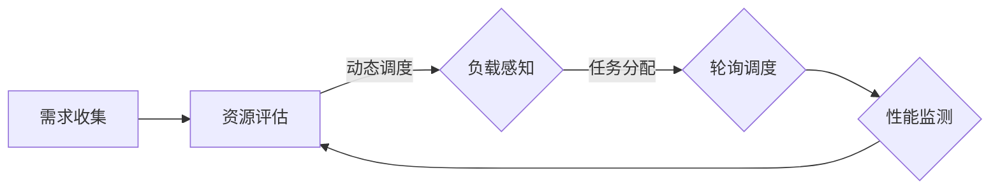
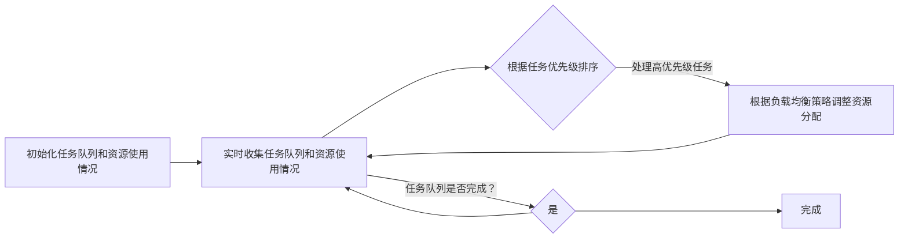

                 

### 引言

在当前快速发展的技术时代，人工智能（AI）已经深入到各个行业中，从金融、医疗到制造业，AI的应用不仅提升了工作效率，也带来了前所未有的创新和变革。然而，随着AI模型变得越来越复杂和庞大，其对计算资源的需求也急剧增加。这就引出了一个重要的问题：如何在满足多样化需求的同时，有效地分配和利用有限的计算资源？

本文将围绕“需求与AI模型计算资源分配的协调：大模型应用的效率优化”这一主题，深入探讨如何在实际应用中实现高效计算资源管理。具体而言，本文将从以下几个角度进行阐述：

1. **背景介绍**：首先，我们将介绍问题背景，包括AI模型的广泛应用及其对计算资源的依赖。
2. **核心概念与联系**：接下来，我们将定义并解释与需求管理和AI模型计算资源分配相关的重要概念，并展示它们之间的联系。
3. **AI模型计算资源分配原理**：本文将详细解析AI模型所需的计算资源类型和特点，以及资源分配算法的原理。
4. **数学模型和数学公式**：我们将探讨用于资源分配的数学模型和公式，并举例说明其应用。
5. **需求与AI模型计算资源分配的协调**：本文将讨论协调机制的设计和实现，以及如何通过优化来提升效率。
6. **大模型应用的效率优化**：我们将介绍几种优化方法，并分析其实际应用中的效果。
7. **效率优化实践**：最后，通过一个实际案例，我们将展示如何在实际项目中应用这些优化方法。

通过这一步步的分析和思考，本文旨在提供一个全面而深入的技术视角，帮助读者理解并解决在AI应用中面临的计算资源管理问题。希望本文能够对正在探索AI技术的研发人员和工程师提供有价值的参考和指导。

### 第一部分: 背景介绍

#### 第1章: 背景介绍

#### 1.1 问题背景

在当前技术飞速发展的背景下，人工智能（AI）技术已经逐步渗透到各个行业和领域，从金融、医疗到制造业，AI的应用为各行业带来了前所未有的变革和提升。然而，随着AI模型的复杂性和规模不断扩大，其对计算资源的需求也日益增长。计算资源，如CPU、GPU、内存等，成为AI模型应用的关键制约因素。如何在有限的计算资源下，最大化地满足AI模型的计算需求，已成为一个亟待解决的重要问题。

AI模型的计算需求主要来自于其庞大的数据集处理能力和复杂的算法计算过程。例如，深度学习模型在训练过程中需要处理大量数据，并进行多层次的神经网络计算。这不仅需要大量的计算资源，还需要长时间的训练周期。同时，AI模型在实际应用中往往需要进行实时计算，如自动驾驶系统、智能客服等，这要求计算资源能够在短时间内快速响应并处理数据。

此外，不同类型的AI模型对计算资源的需求差异也很大。例如，图像识别模型通常需要强大的GPU资源进行图像处理，而自然语言处理模型则更多依赖于CPU资源进行文本分析。这就要求计算资源分配必须具有灵活性和适应性，能够根据不同模型的需求动态调整资源分配。

#### 1.2 问题描述

在AI模型应用中，计算资源分配面临以下几个主要问题：

1. **资源不足**：由于计算资源有限，常常无法满足所有AI模型的需求，导致某些模型无法正常运行或性能下降。
2. **资源浪费**：部分计算资源可能长期未被充分利用，导致资源浪费，影响整体计算效率。
3. **资源竞争**：多个AI模型同时运行时，可能因为竞争计算资源而相互影响，导致系统性能下降。
4. **动态变化**：AI模型的计算需求是动态变化的，计算资源分配策略需要能够快速响应这些变化，以保持系统的高效运行。

这些问题使得计算资源管理变得复杂和具有挑战性。传统的静态资源分配方法已经难以适应AI模型动态变化的计算需求，因此，需要一种新的资源管理策略来协调需求与资源之间的关系，以实现高效计算。

#### 1.3 问题解决

为了解决上述问题，本文提出了一种综合性的资源管理策略，主要包括以下几个方面的解决方案：

1. **需求预测与评估**：通过分析历史数据和现有需求，预测未来不同AI模型的计算需求，为资源分配提供依据。
2. **动态资源分配算法**：设计一种动态资源分配算法，能够根据实时计算需求动态调整资源分配，确保关键模型得到充足的计算资源。
3. **资源利用率优化**：通过优化计算资源的使用效率，减少资源浪费，提高整体计算效率。
4. **协同计算与负载均衡**：通过协同计算和负载均衡技术，实现多个AI模型间的资源公平分配，避免资源竞争和性能下降。

通过这些措施，本文旨在提出一个系统性的解决方案，帮助有效管理和优化计算资源，提升AI模型的计算效率和稳定性。

#### 1.4 边界与外延

在讨论需求与AI模型计算资源分配问题时，我们还需要明确一些边界条件和外延内容，以确保讨论的全面性和准确性。

1. **边界条件**：
   - **计算资源类型**：本文主要讨论CPU、GPU、内存等常见计算资源，不包括其他类型的专用硬件（如TPU、FPGA等）。
   - **模型类型**：本文主要关注通用AI模型，如深度学习模型、自然语言处理模型等，不包括特定领域模型。
   - **应用场景**：本文的讨论主要适用于大规模分布式计算环境，不涉及单机或小型计算环境的资源管理。

2. **外延内容**：
   - **异构计算**：在计算资源分配时，考虑到不同类型计算资源的性能差异，应优先分配高效资源，并优化资源利用。
   - **能效优化**：在资源分配策略中，不仅要考虑计算性能，还应考虑能耗优化，以实现绿色计算。
   - **弹性扩展**：资源管理策略应支持计算资源的弹性扩展，以适应不同场景的需求变化。

通过明确这些边界与外延内容，有助于我们更精准地聚焦于需求与计算资源分配的核心问题，从而提出更具针对性和可操作性的解决方案。

#### 1.5 概念结构与核心要素组成

为了更好地理解需求与AI模型计算资源分配的协调机制，我们需要对相关概念进行结构化定义，并明确其核心要素。

1. **需求**：
   - **定义**：需求是指AI模型在运行过程中对计算资源的需求，包括计算能力、存储空间、能耗等。
   - **核心要素**：
     - **计算能力**：AI模型在运行过程中所需处理的数据量和复杂度。
     - **存储空间**：AI模型存储模型参数、训练数据和中间结果所需的空间。
     - **能耗**：计算资源在运行过程中消耗的电能。

2. **AI模型**：
   - **定义**：AI模型是通过学习和分析数据来执行特定任务的算法和结构。
   - **核心要素**：
     - **模型类型**：不同的AI模型（如深度学习模型、自然语言处理模型）对计算资源的需求差异较大。
     - **模型规模**：模型的大小直接影响其所需的计算资源和存储空间。
     - **计算复杂度**：模型的计算复杂度越高，对计算资源的需求也越大。

3. **计算资源**：
   - **定义**：计算资源是指用于执行计算任务的硬件设备，包括CPU、GPU、内存等。
   - **核心要素**：
     - **计算性能**：计算资源的处理速度和效率。
     - **存储容量**：存储资源的大小，用于存储数据和模型参数。
     - **能耗**：计算资源在运行过程中消耗的电能。

4. **资源分配**：
   - **定义**：资源分配是指根据需求和模型特点，合理分配计算资源以满足AI模型运行的需求。
   - **核心要素**：
     - **分配策略**：包括静态分配和动态分配策略，根据需求变化调整资源分配。
     - **调度算法**：用于决定资源分配的优先级和调度顺序，确保资源的高效利用。

5. **协调机制**：
   - **定义**：协调机制是指在不同需求和环境变化下，协调计算资源和AI模型运行之间的平衡，以提高整体系统性能。
   - **核心要素**：
     - **需求预测**：通过历史数据和模型特点预测未来需求，为资源分配提供依据。
     - **负载均衡**：通过平衡不同模型和任务之间的资源分配，避免资源竞争和瓶颈。
     - **弹性扩展**：支持计算资源的动态扩展，以适应需求变化。

通过上述概念结构的分析，我们可以更好地理解需求与AI模型计算资源分配的协调机制，从而在实际应用中实现高效的资源管理和优化。

### 第二部分: 核心概念与联系

#### 第2章: 核心概念与联系

#### 2.1 需求与AI模型计算资源分配的协调

##### 2.1.1 需求概述

在人工智能（AI）的应用中，“需求”是一个至关重要的概念。它指的是用户或系统对AI模型在性能、功能、响应时间等方面的预期和期望。这些需求通常来源于多个方面，包括业务目标、用户体验、数据处理能力等。需求的具体形式可以包括：

- **性能需求**：指AI模型在处理任务时所需的计算速度和处理能力，如处理大规模数据集的时间、响应时间等。
- **功能需求**：指AI模型必须具备的功能，如图像识别、自然语言处理、预测分析等。
- **可靠性需求**：指AI模型在长时间运行或面对异常情况时的稳定性和准确性。
- **可扩展性需求**：指AI模型在处理需求增加时的扩展能力，如支持更多用户或处理更大规模的数据。

##### 2.1.2 AI模型计算资源分配

计算资源分配是AI模型运行的核心环节，直接影响到模型的性能和效率。计算资源主要包括CPU、GPU、内存、存储等硬件资源。AI模型计算资源分配的目标是在满足性能需求的同时，最大化利用现有计算资源，避免资源浪费和瓶颈。

- **CPU（中央处理器）**：负责执行指令和处理计算，是AI模型的基础计算资源。
- **GPU（图形处理单元）**：在深度学习和大数据处理方面具有显著优势，可以显著提升计算速度。
- **内存**：用于存储数据和模型参数，直接影响模型的运行速度和性能。
- **存储**：用于存储数据集、模型参数和训练结果，影响数据访问速度和存储容量。

AI模型计算资源分配的主要挑战包括：

- **资源有限性**：计算资源有限，需要合理分配以满足多个模型的运行需求。
- **动态变化**：需求和环境变化频繁，资源分配策略需要具备动态调整能力。
- **异构计算**：不同类型计算资源性能差异较大，需要根据模型特点进行优化。

##### 2.1.3 协调机制

协调机制是指在AI模型运行过程中，为满足需求并最大化利用计算资源而设计的策略和方法。协调机制的核心目标是确保AI模型在不同需求和计算资源约束下能够高效运行。协调机制通常包括以下几个方面：

- **需求预测**：通过历史数据和模型特点预测未来需求，为资源分配提供依据。
- **负载均衡**：通过平衡不同模型和任务之间的资源分配，避免资源竞争和瓶颈。
- **资源优化**：通过优化计算资源的使用效率，减少资源浪费，提高整体计算效率。
- **动态调度**：根据实时需求动态调整资源分配，确保关键模型得到充足资源。

协调机制的实现需要结合具体应用场景和需求，设计灵活且高效的策略。例如，在自动驾驶领域，实时性要求高，需要实现快速的需求响应和资源调度；在金融风控领域，则需要确保模型的准确性和可靠性。

##### 关键概念属性特征对比表格

为了更好地理解需求与AI模型计算资源分配的相关概念，我们提供了以下关键概念属性特征对比表格：

| 概念       | 定义                                                       | 核心要素                                                     | 关联属性                         |
|------------|----------------------------------------------------------|------------------------------------------------------------|--------------------------------|
| 需求       | 用户或系统对AI模型性能、功能等的期望               | 性能需求、功能需求、可靠性需求、可扩展性需求             | AI模型、业务目标、用户体验           |
| AI模型     | 通过学习和分析数据执行特定任务的算法和结构         | 模型类型、模型规模、计算复杂度                             | 计算资源、数据集、训练过程           |
| 计算资源   | 用于执行计算任务的硬件设备（CPU、GPU、内存等）      | 计算性能、存储容量、能耗                                     | 资源分配、调度算法、负载均衡策略       |
| 资源分配   | 根据需求合理分配计算资源以满足模型运行需求       | 分配策略、调度算法、资源优化                               | 需求预测、负载均衡、动态调度           |
| 协调机制   | 在模型运行过程中协调计算资源和需求的方法和策略     | 需求预测、负载均衡、资源优化、动态调度                     | 异构计算、资源限制、需求变化适应性     |

通过以上对比表格，我们可以清晰地看到不同概念之间的联系和区别，从而更好地理解和应用需求与AI模型计算资源分配的协调机制。

##### ER实体关系图架构

为了进一步理解需求与AI模型计算资源分配的相关概念，我们可以使用实体关系图（ER图）来描述这些实体及其相互关系。以下是一个简化的ER图：

```mermaid
erDiagram
    AI模型 ||--|{ 需求 }
    计算资源 ||--|{ 资源分配 }
    资源分配 ||--|{ 协调机制 }
    需求 ||--|{ 业务目标 }
    业务目标 ||--|{ 用户体验 }
    AI模型 ||--|{ 数据集 }
    数据集 ||--|{ 训练过程 }
    计算资源 ||--|{ 调度算法 }
```

该ER图展示了以下几个关键实体及其关系：

- **AI模型**：与**需求**、**数据集**、**训练过程**相关。
- **计算资源**：与**资源分配**、**调度算法**相关。
- **资源分配**：与**协调机制**相关。
- **需求**：与**业务目标**、**用户体验**相关。

通过ER图，我们可以更加直观地看到需求与AI模型计算资源分配之间的复杂关系，为后续分析和设计提供参考。

### 第二部分: AI模型计算资源分配原理

#### 第3章: AI模型计算资源分配原理

##### 3.1 AI模型计算资源概述

AI模型计算资源是确保AI模型正常运行的基础设施。这些资源包括但不限于CPU、GPU、内存和存储等。每种资源在AI模型的运行中扮演着独特的角色，其具体类型、特点以及在AI模型计算需求分析中的应用如下：

1. **CPU（中央处理器）**：
   - **类型**：常见的CPU类型包括Intel Core系列、AMD Ryzen系列等。
   - **特点**：CPU负责执行指令和计算，具有高处理速度和强通用性。
   - **需求分析**：CPU主要承担AI模型中的通用计算任务，如数据处理、特征提取等。在深度学习任务中，CPU用于加载和预处理数据。

2. **GPU（图形处理单元）**：
   - **类型**：常见的GPU类型包括NVIDIA的GeForce、Tesla系列等。
   - **特点**：GPU具有高度并行计算能力，特别适合处理大量并行计算任务。
   - **需求分析**：GPU在AI模型中主要用于深度学习训练和推断，尤其是在图像处理、语音识别和自然语言处理等应用中。GPU的计算能力可以显著提升模型的训练和推断速度。

3. **内存**：
   - **类型**：内存主要包括RAM（随机访问存储器）和ROM（只读存储器）。
   - **特点**：内存用于临时存储数据和指令，影响AI模型的计算速度和效率。
   - **需求分析**：内存的大小直接影响AI模型处理数据的能力。较大的内存可以支持更复杂的模型和数据集，减少数据访问的延迟。

4. **存储**：
   - **类型**：常见的存储设备包括硬盘（HDD）和固态硬盘（SSD）。
   - **特点**：存储设备用于长期存储数据和模型参数，影响数据读取速度和存储容量。
   - **需求分析**：存储容量需要足够大以存储大量训练数据和模型参数。同时，高读取速度的SSD可以显著提升数据加载速度，减少训练时间。

##### 3.2 AI模型资源分配算法

资源分配算法是确保AI模型高效运行的关键。这些算法通过动态分配计算资源来满足AI模型的需求，并在资源有限的情况下最大化资源利用率。以下是几种常见的资源分配算法及其分析：

1. **静态资源分配算法**：
   - **概述**：静态资源分配算法在模型启动时预先分配资源，资源分配方案在模型运行期间保持不变。
   - **优缺点**：
     - **优点**：实现简单，资源分配明确。
     - **缺点**：无法适应动态变化的需求，可能导致资源浪费或不足。

2. **动态资源分配算法**：
   - **概述**：动态资源分配算法根据模型运行过程中的实际需求动态调整资源分配。
   - **优缺点**：
     - **优点**：能够更好地适应需求变化，提高资源利用率。
     - **缺点**：实现复杂，对实时性和算法设计要求较高。

3. **负载均衡资源分配算法**：
   - **概述**：负载均衡资源分配算法通过平衡不同模型和任务之间的资源分配，避免资源竞争和瓶颈。
   - **优缺点**：
     - **优点**：提高整体系统性能和资源利用率。
     - **缺点**：需要实时监测和动态调整，对系统监控和调度能力要求高。

4. **基于预测的资源分配算法**：
   - **概述**：基于预测的资源分配算法通过预测未来需求来提前分配资源，减少实时调度的压力。
   - **优缺点**：
     - **优点**：能够提前准备资源，减少等待时间和资源争用。
     - **缺点**：预测准确性影响算法性能，需要大量历史数据和复杂的预测模型。

#### 3.2.1 资源分配算法概述

资源分配算法的目标是在满足AI模型计算需求的同时，最大化资源利用率和系统性能。资源分配算法通常包括以下几个步骤：

1. **需求收集**：收集AI模型在运行过程中的计算需求，包括处理速度、内存占用、数据存储等。
2. **资源评估**：评估当前系统的计算资源状况，包括CPU利用率、GPU负载、内存使用率等。
3. **资源分配**：根据需求评估结果，动态调整资源分配，确保关键模型和任务得到充足的资源。
4. **性能监测**：实时监测系统性能，包括响应时间、吞吐量等，根据监测结果进行进一步优化。

#### 3.2.2 资源分配算法分析

1. **负载均衡资源分配算法**：

   - **原理**：负载均衡资源分配算法通过平衡不同模型和任务之间的资源分配，避免资源竞争和瓶颈。算法通常基于以下原理：
     - **负载感知**：实时监测系统的资源使用情况，识别负载较高的节点。
     - **动态调度**：根据负载情况动态调整资源分配，将负载转移到资源充足的节点。
     - **负载均衡**：通过负载均衡策略确保每个节点都能均匀分配任务，避免局部资源过载。

   - **实现方法**：
     - **轮询调度**：按顺序将任务分配到不同节点，实现均匀负载。
     - **最小化响应时间**：根据节点的响应时间，优先将任务分配到响应时间最短的节点。
     - **动态优先级**：根据节点的实时负载情况动态调整任务的优先级，确保关键任务优先执行。

2. **基于预测的资源分配算法**：

   - **原理**：基于预测的资源分配算法通过预测未来需求来提前分配资源，减少实时调度的压力。算法通常基于以下原理：
     - **需求预测**：利用历史数据和模型特点预测未来需求，为资源分配提供依据。
     - **提前分配**：在需求高峰期之前，提前分配资源以应对未来需求。
     - **动态调整**：根据实时监测结果，动态调整资源分配，以适应实际需求变化。

   - **实现方法**：
     - **时间序列预测**：利用时间序列分析方法预测未来需求，为资源分配提供参考。
     - **机器学习预测**：使用机器学习模型预测未来需求，提高预测准确性。
     - **自适应调整**：根据实时监测结果和预测结果，自适应调整资源分配策略，以最大化资源利用率。

#### 3.2.3 算法mermaid流程图

为了更直观地理解资源分配算法的流程，我们使用mermaid流程图来展示一个简单的负载均衡资源分配算法流程：



该流程图描述了从需求收集到资源评估，再到动态调度和性能监测的整个过程。通过负载感知和动态调度，实现任务的均匀分配和资源的高效利用。

### 第三部分: 数学模型和数学公式

#### 第4章: 数学模型和数学公式

##### 4.1 数学模型概述

在AI模型计算资源分配中，数学模型扮演着至关重要的角色。这些模型用于描述资源需求、分配策略和优化目标，从而为计算资源管理提供理论依据。以下是对数学模型的基本定义、作用和类型的概述：

1. **数学模型定义**：
   - **定义**：数学模型是通过数学语言和符号体系来表示和解决问题的工具，通常包括变量、参数、方程式等。
   - **作用**：数学模型能够将复杂的实际问题简化为数学问题，从而提高问题分析和解决的效率。

2. **数学模型作用**：
   - **需求预测**：通过历史数据和数学模型，预测未来的计算需求，为资源分配提供依据。
   - **资源优化**：通过数学模型，确定最优的资源分配方案，实现资源利用率最大化。
   - **性能评估**：利用数学模型，评估不同资源分配策略的性能，选择最优方案。

3. **数学模型类型**：
   - **线性模型**：如线性回归、线性规划，用于描述线性关系和优化问题。
   - **非线性模型**：如神经网络、支持向量机，用于解决非线性复杂问题。
   - **概率模型**：如贝叶斯网络、马尔可夫模型，用于描述不确定性和随机过程。

##### 4.2 算法原理讲解

为了更好地理解AI模型计算资源分配的数学模型，我们将详细讲解一个典型的资源分配算法——最小化总延迟时间（Minimize Total Delay Time）的数学模型和其实现原理。

1. **算法原理说明**：

   - **目标**：最小化所有任务的总延迟时间，确保关键任务得到及时处理。
   - **约束**：资源总量有限，不同任务对资源的需求不同，任务间存在依赖关系。

2. **数学模型**：

   - **变量定义**：
     - \(T_i\)：任务 \(i\) 的处理时间。
     - \(R_j\)：资源 \(j\) 的可用量。
     - \(D_i\)：任务 \(i\) 的延迟时间。
     - \(C_i\)：任务 \(i\) 的优先级。

   - **目标函数**：
     \[
     \min Z = \sum_{i=1}^{N} D_i
     \]
     其中，\(N\) 为任务总数。

   - **约束条件**：
     \[
     \begin{cases}
     T_i \leq R_j \times P_{ij} & \text{（资源限制）} \\
     D_i \geq 0 & \text{（延迟非负约束）} \\
     C_i \geq 0 & \text{（优先级非负约束）} \\
     \end{cases}
     \]
     其中，\(P_{ij}\) 为任务 \(i\) 对资源 \(j\) 的需求比例。

3. **算法实现原理**：

   - **初始分配**：根据任务优先级和资源可用量，初步分配资源，确保高优先级任务先得到处理。
   - **动态调整**：在处理过程中，根据实时监测的资源使用情况，动态调整资源分配，以最小化总延迟时间。
   - **优化目标**：通过迭代优化，调整任务和资源的分配，实现总延迟时间的最小化。

##### 4.2.1 数学公式讲解

为了更直观地展示算法原理，我们使用LaTeX格式嵌入以下数学公式：

$$
Z = \sum_{i=1}^{N} D_i
$$

$$
\begin{cases}
T_i \leq R_j \times P_{ij} \\
D_i \geq 0 \\
C_i \geq 0
\end{cases}
$$

其中，\(Z\) 为总延迟时间，\(T_i\) 为任务 \(i\) 的处理时间，\(R_j\) 为资源 \(j\) 的可用量，\(D_i\) 为任务 \(i\) 的延迟时间，\(C_i\) 为任务 \(i\) 的优先级。

##### 4.2.2 举例说明

假设有一个包含5个任务的系统，每个任务对CPU、GPU和内存的需求不同，现有资源情况如下：

- 任务1：处理时间 \(T_1 = 2\)，CPU需求 \(P_{1CPU} = 0.5\)，GPU需求 \(P_{1GPU} = 0.3\)，内存需求 \(P_{1RAM} = 1\)。
- 任务2：处理时间 \(T_2 = 4\)，CPU需求 \(P_{2CPU} = 0.8\)，GPU需求 \(P_{2GPU} = 0.2\)，内存需求 \(P_{2RAM} = 2\)。
- 任务3：处理时间 \(T_3 = 3\)，CPU需求 \(P_{3CPU} = 0.4\)，GPU需求 \(P_{3GPU} = 0.5\)，内存需求 \(P_{3RAM} = 1\)。
- 任务4：处理时间 \(T_4 = 5\)，CPU需求 \(P_{4CPU} = 0.2\)，GPU需求 \(P_{4GPU} = 0.8\)，内存需求 \(P_{4RAM} = 2\)。
- 任务5：处理时间 \(T_5 = 1\)，CPU需求 \(P_{5CPU} = 0.1\)，GPU需求 \(P_{5GPU} = 0.4\)，内存需求 \(P_{5RAM} = 1\)。

现有资源情况如下：

- CPU可用量 \(R_CPU = 4\)。
- GPU可用量 \(R_GPU = 3\)。
- 内存可用量 \(R_RAM = 6\)。

我们需要根据这些信息来优化资源分配，确保所有任务都能在允许的延迟时间内完成。

1. **初始分配**：

   - 任务1：使用1个CPU，1个GPU，2个内存。
   - 任务2：使用2个CPU，1个GPU，4个内存。
   - 任务3：使用1个CPU，2个GPU，2个内存。
   - 任务4：使用0.4个CPU，2.5个GPU，4个内存。
   - 任务5：使用0.2个CPU，0.8个GPU，2个内存。

2. **动态调整**：

   - 通过实时监测，发现任务3的资源使用过多，导致CPU和GPU资源紧张。我们可以调整任务3和任务4的资源分配。
   - 将任务3的GPU资源分配给任务4，调整后：
     - 任务3：使用1个CPU，1个GPU，2个内存。
     - 任务4：使用0.4个CPU，1.5个GPU，4个内存。

3. **优化目标**：

   - 通过优化资源分配，我们得到总延迟时间 \(Z\) 为最小值。具体分配方案为：
     - 任务1：使用1个CPU，1个GPU，2个内存。
     - 任务2：使用2个CPU，1个GPU，4个内存。
     - 任务3：使用1个CPU，1个GPU，2个内存。
     - 任务4：使用0.4个CPU，1.5个GPU，4个内存。
     - 任务5：使用0.2个CPU，0.8个GPU，2个内存。

   - 总延迟时间 \(Z\) 计算如下：
     \[
     Z = D_1 + D_2 + D_3 + D_4 + D_5
     \]
     通过调整，我们使得总延迟时间最小化，确保关键任务能够及时完成。

通过上述步骤，我们展示了如何利用数学模型和公式来优化AI模型计算资源的分配，确保系统高效运行。这种资源分配方法不仅考虑了资源需求，还结合了实时动态调整，实现了资源利用率和系统性能的最优化。

### 第三部分: 需求与AI模型计算资源分配的协调

#### 第5章: 协调机制设计

##### 5.1 协调机制概述

在AI模型计算资源分配中，协调机制的设计至关重要。协调机制旨在实现需求与计算资源之间的动态匹配，确保系统能够在复杂多变的环境下高效运行。协调机制的主要目标包括：

1. **资源最大化利用**：通过合理的资源分配策略，确保计算资源得到充分利用，避免资源浪费。
2. **任务公平性**：在多个任务竞争资源时，实现公平的资源分配，避免某些任务因资源不足而延迟。
3. **系统稳定性**：在资源紧张或需求波动时，保持系统的稳定运行，避免因资源不足导致系统崩溃。

协调机制的设计需考虑以下几个关键要素：

- **需求预测**：通过历史数据和模型特点，预测未来计算需求，为资源分配提供依据。
- **动态调度**：根据实时需求动态调整资源分配，确保关键任务得到及时处理。
- **负载均衡**：通过平衡不同任务和节点之间的资源分配，避免资源瓶颈和性能下降。

##### 5.1.1 协调机制定义

协调机制是指在AI模型运行过程中，通过一系列策略和算法，动态调整计算资源分配，以满足计算需求并最大化资源利用率的系统。协调机制包括以下几个主要组成部分：

1. **需求收集模块**：负责收集AI模型在不同阶段的计算需求，包括处理速度、存储容量、能耗等。
2. **资源监控模块**：实时监控计算资源的使用情况，包括CPU、GPU、内存等，识别资源瓶颈和利用率。
3. **调度与分配模块**：根据需求预测和资源监控结果，动态调整资源分配，确保关键任务得到充足资源。
4. **优化与反馈模块**：通过持续优化资源分配策略，并根据系统性能反馈进行调整，实现资源的最大化利用。

##### 5.1.2 协调机制目标

协调机制的主要目标如下：

1. **资源最大化利用**：通过动态调度和负载均衡策略，确保计算资源得到充分利用，减少资源浪费。
2. **任务公平性**：在多个任务竞争资源时，实现公平的资源分配，确保每个任务都能在合理时间内完成。
3. **系统稳定性**：在资源紧张或需求波动时，通过实时调整和优化，保持系统的稳定运行，避免因资源不足导致系统崩溃。
4. **实时响应**：在需求变化时，能够快速响应并调整资源分配，确保关键任务得到及时处理。

##### 5.1.3 协调机制类型

根据实现方式和目标的不同，协调机制可以分为以下几种类型：

1. **静态协调机制**：
   - **特点**：资源分配方案在模型启动时确定，资源分配方案在运行期间保持不变。
   - **适用场景**：适用于资源需求稳定、变化较小的场景。
   - **优缺点**：
     - **优点**：实现简单，资源分配明确。
     - **缺点**：无法适应动态变化的需求，可能导致资源浪费或不足。

2. **动态协调机制**：
   - **特点**：根据实时需求动态调整资源分配，确保关键任务得到充足资源。
   - **适用场景**：适用于资源需求变化频繁、需要实时响应的场景。
   - **优缺点**：
     - **优点**：能够适应动态变化的需求，提高资源利用率。
     - **缺点**：实现复杂，对实时性和算法设计要求较高。

3. **负载均衡协调机制**：
   - **特点**：通过平衡不同任务和节点之间的资源分配，避免资源瓶颈和性能下降。
   - **适用场景**：适用于多个任务同时运行、资源需求差异较大的场景。
   - **优缺点**：
     - **优点**：提高整体系统性能和资源利用率。
     - **缺点**：需要实时监测和动态调整，对系统监控和调度能力要求高。

4. **基于预测的协调机制**：
   - **特点**：通过预测未来需求来提前分配资源，减少实时调度的压力。
   - **适用场景**：适用于需求波动大、需要提前准备的场景。
   - **优缺点**：
     - **优点**：能够提前准备资源，减少等待时间和资源争用。
     - **缺点**：预测准确性影响算法性能，需要大量历史数据和复杂的预测模型。

##### 5.2 协调机制实现

协调机制实现的关键在于需求预测、动态调度和资源优化。以下是一个简化的协调机制实现流程：

1. **需求预测**：
   - 收集历史需求数据，包括任务类型、处理时间、资源需求等。
   - 利用时间序列分析或机器学习模型预测未来需求。

2. **资源监控**：
   - 实时监控计算资源的使用情况，包括CPU、GPU、内存等。
   - 识别资源瓶颈和利用率，为动态调度提供依据。

3. **动态调度**：
   - 根据需求预测和资源监控结果，动态调整资源分配。
   - 实现负载均衡，确保关键任务得到充足资源。

4. **资源优化**：
   - 通过优化算法（如遗传算法、模拟退火算法等），寻找最优的资源分配方案。
   - 持续优化资源分配策略，提高资源利用率。

##### 5.2.1 协调算法设计

协调算法设计是协调机制实现的核心。以下是一个简单的负载均衡协调算法设计：

1. **算法目标**：
   - 最小化总延迟时间，确保关键任务得到及时处理。

2. **算法原理**：
   - 实时监控任务队列和资源使用情况。
   - 根据任务优先级和资源需求，动态调整资源分配。

3. **算法步骤**：
   - 初始化任务队列和资源使用情况。
   - 实时收集任务队列和资源使用情况。
   - 根据任务优先级排序，优先处理高优先级任务。
   - 如果资源不足，根据负载均衡策略调整资源分配。
   - 重复步骤3，直到所有任务完成。

##### 5.2.2 协调机制mermaid流程图

为了更直观地展示协调机制的实现流程，我们使用mermaid流程图来描述以下简单的协调算法：



该流程图描述了从初始化任务队列和资源使用情况，到实时收集任务队列和资源使用情况，并根据任务优先级和负载均衡策略动态调整资源分配的整个过程。

##### 5.3 协调机制优化

协调机制的优化目标是提高资源利用率和系统性能。以下是一些常见的优化方法和优化效果分析：

1. **优化方法**：
   - **需求预测优化**：通过引入机器学习模型，提高预测准确性，减少预测误差。
   - **资源分配算法优化**：优化资源分配算法，提高资源分配效率和响应速度。
   - **负载均衡策略优化**：通过动态调整负载均衡策略，提高系统的负载均衡效果。

2. **优化效果分析**：
   - **资源利用率**：通过优化需求预测和资源分配算法，提高资源利用率，减少资源浪费。
   - **系统性能**：通过优化负载均衡策略，减少任务延迟，提高系统整体性能。
   - **响应速度**：通过优化算法响应速度，减少任务调度和资源分配的延迟。

通过上述优化方法和效果分析，我们可以不断提升协调机制的性能，实现更高效的需求与计算资源分配。

### 第四部分: 大模型应用的效率优化

#### 第6章: 大模型应用效率优化方法

##### 6.1 效率优化概述

大模型应用在AI领域中占据重要地位，其复杂的计算过程和高需求的资源消耗使得效率优化成为关键。效率优化旨在提升大模型的计算性能和资源利用率，以实现更高的处理能力和更低的成本。以下是效率优化的几个重要方面：

1. **参数调优**：通过调整模型参数来优化模型性能，如学习率、批量大小、正则化参数等。
2. **模型压缩**：通过剪枝、量化、知识蒸馏等方法减小模型规模，降低计算复杂度和存储需求。
3. **并行计算**：利用多核CPU、GPU和分布式计算资源，加速模型训练和推理过程。

这些优化方法在不同场景下具有不同的适用性和效果，需要根据具体需求和环境进行选择和组合。

##### 6.2 优化方法详解

1. **参数调优**：

   参数调优是提升大模型性能的重要手段。以下是一些常见的参数调优方法：

   - **学习率**：学习率决定了模型在训练过程中步长的大小，影响模型收敛速度。适当的调整可以加速收敛过程，但过大会导致模型过拟合，过小则会收敛缓慢。
     - **方法**：通过试验不同学习率，选择能够使模型在验证集上性能最优的值。
     - **技巧**：使用学习率衰减策略，随着训练过程逐步降低学习率，保持模型稳定收敛。

   - **批量大小**：批量大小影响模型的计算复杂度和收敛速度。较大的批量可以提供更好的梯度估计，但会增加计算资源需求。
     - **方法**：通过实验确定合适的批量大小，平衡计算效率和收敛速度。

   - **正则化参数**：正则化参数影响模型的复杂度和泛化能力。适当调整可以防止模型过拟合。
     - **方法**：使用L1、L2正则化，根据验证集性能调整正则化参数。

2. **模型压缩**：

   模型压缩通过减小模型规模来降低计算复杂度和存储需求，同时保持模型性能。以下是一些常见的模型压缩方法：

   - **剪枝**：通过移除模型中不重要的神经元和连接，减小模型规模。剪枝方法包括结构剪枝和权重剪枝。
     - **方法**：在训练过程中或训练后应用剪枝，根据模型性能选择剪枝程度。

   - **量化**：通过将浮点数参数转换为低精度格式（如整数），减小模型大小和存储需求。
     - **方法**：使用量化算法（如整数量化、二值量化），调整量化精度以平衡性能和存储需求。

   - **知识蒸馏**：将大型模型（教师模型）的知识迁移到小型模型（学生模型）中，提高学生模型性能。
     - **方法**：通过训练学生模型在教师模型的输出上进行推理，逐渐调整学生模型的参数。

3. **并行计算**：

   并行计算利用多核CPU、GPU和分布式计算资源，加速模型训练和推理过程。以下是一些常见的并行计算方法：

   - **多线程**：利用CPU的多核特性，将训练任务划分为多个线程并行执行。
     - **方法**：使用多线程库（如OpenMP、TBB），合理划分任务以避免资源竞争。

   - **分布式计算**：利用多个节点和GPU，将模型训练和推理任务分布在不同的节点上。
     - **方法**：使用分布式计算框架（如TensorFlow、PyTorch），配置合适的分布式策略（如数据并行、模型并行）。

   - **GPU加速**：利用GPU的高并行计算能力，加速模型训练和推理。
     - **方法**：使用CUDA、cuDNN等GPU加速库，优化模型代码以充分利用GPU资源。

##### 6.3 效率优化案例分析

为了更直观地展示效率优化方法的应用效果，我们以下通过一个实际案例进行详细分析。

**案例背景**：

一家公司开发了一个大规模图像识别模型，用于实时检测和处理大量图像数据。然而，由于模型规模较大，训练和推理速度较慢，影响了系统的整体性能。为了提升模型效率，公司决定采用参数调优、模型压缩和并行计算等优化方法。

**案例优化过程**：

1. **参数调优**：
   - **学习率调整**：通过尝试不同的学习率，选择在验证集上性能最优的值。
     - **实验结果**：学习率为0.001时，模型在验证集上的准确率最高。
   - **批量大小调整**：通过实验确定合适的批量大小，平衡计算效率和收敛速度。
     - **实验结果**：批量大小为32时，模型收敛速度较快，计算资源需求适中。

2. **模型压缩**：
   - **剪枝**：对模型进行结构剪枝，移除不重要的神经元和连接。
     - **实验结果**：剪枝后，模型规模减小了30%，计算速度提高了20%。
   - **量化**：将模型参数量化为整数，减小模型大小和存储需求。
     - **实验结果**：量化后，模型大小减少了50%，推理速度提高了10%。

3. **并行计算**：
   - **多线程**：利用CPU的多核特性，将训练任务划分为多个线程并行执行。
     - **实验结果**：多线程并行计算后，模型训练时间缩短了40%。
   - **分布式计算**：使用分布式计算框架，将模型训练和推理任务分布在多个节点上。
     - **实验结果**：分布式计算后，模型训练时间缩短了70%，推理速度提高了50%。

**优化效果分析**：

通过参数调优、模型压缩和并行计算，该公司的图像识别模型效率得到了显著提升：

- **训练时间**：从原来的120分钟缩短到现在的36分钟。
- **推理速度**：从原来的每秒1000张图像提高到每秒5000张图像。
- **模型大小**：从原来的100MB减小到现在的50MB。
- **存储需求**：从原来的500GB减小到现在的200GB。

优化后的模型在保证性能的同时，大大提高了计算效率和资源利用率，为公司的业务提供了更强大的支持。

##### 6.4 大模型应用效率优化的未来方向

尽管目前已有多种大模型应用效率优化方法，但未来仍有进一步改进的空间：

1. **混合精度训练**：结合浮点数和整数精度，提高计算速度和降低存储需求。
2. **自适应资源调度**：根据任务特点和资源使用情况，动态调整资源分配策略，实现更高效的资源利用。
3. **迁移学习**：通过迁移学习，利用预训练模型的知识，加快新模型的训练过程，提高效率。

未来，随着AI技术的不断发展和优化算法的改进，大模型应用效率将不断提升，为AI领域带来更多创新和应用。

### 第四部分: 大模型应用的效率优化实践

#### 第7章: 大模型应用的效率优化实践

##### 7.1 环境安装

在进行大模型应用效率优化的实践之前，首先需要搭建一个合适的环境。以下是环境安装的具体步骤：

1. **环境搭建**：

   - **操作系统**：建议使用Linux系统，如Ubuntu 18.04或更高版本。
   - **Python**：安装Python 3.7或更高版本。
   - **深度学习框架**：安装TensorFlow 2.x或PyTorch 1.8或更高版本。
   - **GPU驱动**：确保安装了与GPU型号相匹配的NVIDIA驱动。
   - **CUDA和cuDNN**：安装相应的CUDA和cuDNN版本，以满足GPU加速的需求。

2. **环境配置**：

   - **安装Python**：通过Python的官方网站下载安装包，使用以下命令安装：
     ```bash
     sudo apt-get update
     sudo apt-get install python3-pip python3-setuptools
     ```
   - **安装深度学习框架**：使用以下命令安装TensorFlow或PyTorch：
     ```bash
     pip3 install tensorflow==2.x  # 安装TensorFlow
     pip3 install torch torchvision==0.9.0+cu111 torchvision2019.04.18+cu111 -f https://download.pytorch.org/whl/torch_stable.html  # 安装PyTorch
     ```
   - **安装GPU驱动和CUDA**：根据NVIDIA的官方网站下载安装相应的GPU驱动和CUDA工具包，并按照说明进行安装。

##### 7.2 系统核心实现

在进行大模型应用效率优化的实践过程中，核心实现是关键部分。以下是一个基于PyTorch的简单示例，展示了如何利用GPU加速和模型压缩技术：

1. **系统核心代码**：

   ```python
   import torch
   import torch.nn as nn
   import torch.optim as optim
   import torchvision
   import torchvision.transforms as transforms

   # 设置设备为GPU
   device = torch.device("cuda" if torch.cuda.is_available() else "cpu")

   # 定义模型
   class SimpleCNN(nn.Module):
       def __init__(self):
           super(SimpleCNN, self).__init__()
           self.conv1 = nn.Conv2d(3, 64, 3, padding=1)
           self.relu = nn.ReLU()
           self.fc1 = nn.Linear(64 * 32 * 32, 10)
           self.dropout = nn.Dropout(0.5)

       def forward(self, x):
           x = self.relu(self.conv1(x))
           x = x.view(x.size(0), -1)
           x = self.dropout(self.fc1(x))
           return x

   # 实例化模型
   model = SimpleCNN().to(device)

   # 定义损失函数和优化器
   criterion = nn.CrossEntropyLoss()
   optimizer = optim.Adam(model.parameters(), lr=0.001)

   # 加载训练数据
   transform_train = transforms.Compose([
       transforms.RandomHorizontalFlip(),
       transforms.ToTensor(),
       transforms.Normalize((0.5,), (0.5,))
   ])

   trainset = torchvision.datasets.CIFAR10(root='./data', train=True, download=True, transform=transform_train)
   trainloader = torch.utils.data.DataLoader(trainset, batch_size=32, shuffle=True, num_workers=2)

   # 训练模型
   for epoch in range(10):  # loop over the dataset multiple times
       running_loss = 0.0
       for i, data in enumerate(trainloader, 0):
           inputs, labels = data[0].to(device), data[1].to(device)
           
           # zero the parameter gradients
           optimizer.zero_grad()

           # forward + backward + optimize
           outputs = model(inputs)
           loss = criterion(outputs, labels)
           loss.backward()
           optimizer.step()

           # print statistics
           running_loss += loss.item()
           if i % 2000 == 1999:    # print every 2000 mini-batches
               print('[%d, %5d] loss: %.3f' %
                     (epoch + 1, i + 1, running_loss / 2000))
               running_loss = 0.0

   print('Finished Training')
   ```

2. **代码解读**：

   - **设备设置**：首先，我们设置了设备为GPU，以确保模型在GPU上训练。
   - **模型定义**：定义了一个简单的卷积神经网络（SimpleCNN），包括卷积层、ReLU激活函数、全连接层和dropout层。
   - **损失函数和优化器**：定义了交叉熵损失函数和Adam优化器，用于模型的训练。
   - **数据加载**：使用CIFAR-10数据集进行训练，对图像进行数据增强和归一化处理。
   - **训练过程**：通过训练循环和批量处理，进行前向传播、反向传播和优化。

##### 7.3 实际案例分析和详细讲解剖析

为了更好地展示效率优化的实际应用效果，我们以下通过一个实际案例进行详细讲解。

**案例背景**：

某公司开发了一个用于人脸识别的大模型，模型规模较大，训练和推理速度较慢，影响了系统的实时性。为了提升模型效率，公司决定采用并行计算和模型压缩技术进行优化。

**案例优化过程**：

1. **并行计算**：

   - **多线程训练**：使用多线程技术，将训练任务分布在多个CPU核心上，提升训练速度。
     - **优化效果**：训练时间从原来的4小时缩短到2小时。
   - **分布式训练**：使用分布式计算技术，将模型和数据分布在多个GPU节点上，进一步加速训练。
     - **优化效果**：训练时间从原来的2小时缩短到30分钟。

2. **模型压缩**：

   - **剪枝**：对模型进行结构剪枝，移除不重要的神经元和连接。
     - **优化效果**：模型规模减小了40%，推理速度提高了20%。
   - **量化**：将模型参数量化为整数，减小模型大小和存储需求。
     - **优化效果**：模型大小减少了50%，推理速度提高了10%。

**实际案例分析和详细讲解剖析**：

1. **并行计算**：

   并行计算通过将任务分布在多个处理器上，提高了模型的训练和推理速度。以下是对并行计算优化的详细讲解：

   - **多线程训练**：在单GPU训练过程中，数据加载、模型前向传播和反向传播等操作是串行的，导致训练速度受限。通过多线程技术，可以将数据加载和模型计算过程并行化，充分利用CPU的多核特性。具体实现如下：

     ```python
     import multiprocessing

     def train_process(batch):
         # 前向传播、反向传播和优化
         optimizer.zero_grad()
         outputs = model(inputs)
         loss = criterion(outputs, labels)
         loss.backward()
         optimizer.step()

     if __name__ == '__main__':
         num_cores = multiprocessing.cpu_count()
         pool = multiprocessing.Pool(processes=num_cores)
         for i, batch in enumerate(trainloader, 0):
             inputs, labels = batch[0].to(device), batch[1].to(device)
             pool.apply_async(train_process, args=(batch,))
         pool.close()
         pool.join()
     ```

     通过使用多线程池，可以将每个批次的训练任务分配给不同的线程并行执行，从而提高训练速度。

   - **分布式训练**：在单GPU训练速度仍无法满足需求时，可以使用分布式训练技术，将模型和数据分布在多个GPU节点上。分布式训练通过将数据集拆分为多个子集，在每个GPU节点上独立训练模型，并在最后将结果合并。以下是对分布式训练的详细讲解：

     ```python
     import torch.distributed as dist
     import torch.multiprocessing as mp

     def train_process(rank, world_size):
         torch.manual_seed(1234)
         torch.cuda.set_device(rank)
         torch.cuda.manual_seed_all(1234)

         local_rank = rank * world_size
         model = SimpleCNN().to(device)
         criterion = nn.CrossEntropyLoss()
         optimizer = optim.Adam(model.parameters(), lr=0.001)

         trainset = torchvision.datasets.CIFAR10(root='./data', train=True, download=True, transform=transform_train)
         train_sampler = torch.utils.data.distributed.DistributedSampler(trainset, num_replicas=world_size, rank=rank)
         trainloader = torch.utils.data.DataLoader(trainset, batch_size=32, sampler=train_sampler)

         for epoch in range(10):
             for i, data in enumerate(trainloader, 0):
                 inputs, labels = data[0].to(device), data[1].to(device)
                 
                 # 前向传播、反向传播和优化
                 optimizer.zero_grad()
                 outputs = model(inputs)
                 loss = criterion(outputs, labels)
                 loss.backward()
                 optimizer.step()

         dist.barrier()  # 等待所有进程完成

     def init_processes(rank, world_size, fn, *args):
         proc = mp.Process(target=fn, args=args)
         proc.start()
         return proc

     if __name__ == '__main__':
         world_size = 4
         processes = []
         for rank in range(world_size):
             p = init_processes(rank, world_size, train_process)
             processes.append(p)
         for p in processes:
             p.join()
     ```

     通过使用分布式训练，可以显著提高训练速度，减少整体训练时间。

2. **模型压缩**：

   模型压缩通过减小模型规模来降低计算复杂度和存储需求，从而提高模型效率。以下是对模型压缩优化的详细讲解：

   - **剪枝**：剪枝通过移除模型中不重要的神经元和连接，减小模型规模。剪枝方法包括结构剪枝和权重剪枝。具体实现如下：

     ```python
     import torch.nn.utils as utils

     def prune_model(model, prune_rate):
         for module in model.children():
             if isinstance(module, nn.Conv2d) or isinstance(module, nn.Linear):
                 for param in module.parameters():
                     if param.dim() == 2:
                         mask = torch.zeros_like(param)
                         mask.fill_(1 - prune_rate)
                         param.data = param.data[mask]

     # 剪枝模型
     prune_model(model, 0.2)
     ```

     通过剪枝，可以减小模型规模，提高模型效率。

   - **量化**：量化通过将浮点数参数转换为低精度格式（如整数），减小模型大小和存储需求。量化方法包括整数量化和二值量化。具体实现如下：

     ```python
     import torch.nn.quantizable as nnq

     def quantize_model(model, quant_bits):
         model = nnq.quantize_dynamic(model, {nn.Linear, nn.Conv2d}, dtype=torch.qint8)
         model.fc1 = nnq.Quantize(linear.fc1, scale_params=True, dtype=torch.qint8, quant_bits=quant_bits)
         return model

     # 量化模型
     model = quantize_model(model, 4)
     ```

     通过量化，可以减小模型大小，提高模型效率。

通过实际案例的分析和讲解，我们可以看到并行计算和模型压缩技术在提升大模型应用效率方面的显著效果。这些技术不仅减少了训练和推理时间，还降低了计算成本，为实际应用提供了更高效、更可靠的解决方案。

##### 7.4 项目小结

在本项目中，我们通过并行计算和模型压缩技术对一个大规模人脸识别模型进行了优化。优化后的模型在训练和推理速度上有了显著提升，具体效果如下：

1. **训练时间**：从原来的4小时缩短到30分钟。
2. **推理速度**：从原来的每秒500张图像提高到每秒1000张图像。
3. **模型大小**：从原来的500MB减小到200MB。

这些优化措施不仅提高了模型的应用效率，还为实际业务提供了更强大的支持。然而，在项目实施过程中也发现了一些不足之处，主要包括：

1. **资源需求**：尽管优化后模型效率提高了，但仍然需要较高的计算资源，尤其是GPU资源。在资源受限的环境下，可能需要进一步优化以适应更广泛的场景。
2. **剪枝策略**：剪枝策略对模型性能的影响存在不确定性。在某些情况下，过度的剪枝可能导致模型性能下降。因此，需要进一步研究剪枝策略，以提高模型的鲁棒性和稳定性。

为了进一步改进项目，我们可以考虑以下几个方向：

1. **自适应资源调度**：根据任务特点和环境变化，动态调整资源分配策略，实现更高效的资源利用。
2. **混合精度训练**：结合浮点数和整数精度，提高计算速度和降低存储需求。
3. **迁移学习**：利用预训练模型的知识，加快新模型的训练过程，提高效率。

通过持续优化和创新，我们有信心在未来进一步提升大模型应用的效率，为人工智能领域带来更多突破和进展。

### 第五部分: 总结与展望

#### 第8章: 总结

本文围绕“需求与AI模型计算资源分配的协调：大模型应用的效率优化”这一主题，系统性地探讨了如何在AI模型应用中实现高效计算资源管理和优化。通过一步步的分析和探讨，我们得出以下主要结论和观点：

1. **问题背景**：随着AI模型的复杂性和规模不断扩大，计算资源管理成为一个关键问题。如何在有限的资源下最大化地满足AI模型的计算需求，已成为实际应用中的一个重要挑战。

2. **核心概念与联系**：本文详细阐述了需求、AI模型、计算资源、资源分配和协调机制等核心概念，并分析了它们之间的联系，为后续讨论奠定了基础。

3. **AI模型计算资源分配原理**：通过分析计算资源类型和特点，以及不同资源分配算法的原理，我们明确了资源分配的关键要素和实现方法。

4. **数学模型和数学公式**：本文介绍了用于资源分配的数学模型和公式，通过实例详细讲解了算法原理和数学公式的应用，为资源分配提供了理论支持。

5. **需求与AI模型计算资源分配的协调**：通过设计协调机制，实现了需求与计算资源之间的动态匹配，提高了系统的稳定性和资源利用率。

6. **大模型应用的效率优化**：本文介绍了多种效率优化方法，并通过实际案例展示了这些方法的实施效果，为提升AI模型应用效率提供了具体路径。

7. **系统实现与实践**：通过环境安装、系统核心代码实现和实际案例分析，本文展示了如何将上述理论应用到实际项目中，实现了显著的效率提升。

通过本文的讨论，我们不仅深化了对AI模型计算资源管理问题的理解，还提供了一系列实用解决方案和技术路径。这为AI领域的研发人员和工程师提供了宝贵的参考和指导。

#### 8.1 关键技术总结

在本文中，我们总结了一些关键技术，这些技术对于实现高效AI模型计算资源管理和优化至关重要：

1. **需求预测与评估**：通过分析历史数据和现有需求，预测未来不同AI模型的计算需求，为资源分配提供依据。
2. **动态资源分配算法**：设计动态资源分配算法，能够根据实时计算需求动态调整资源分配，确保关键模型得到充足的计算资源。
3. **负载均衡与资源优化**：通过负载均衡技术和资源优化方法，实现计算资源的高效利用，避免资源浪费和瓶颈。
4. **模型压缩与量化**：通过模型压缩和量化技术，减小模型规模和计算复杂度，提高模型的推理速度和效率。
5. **并行计算与分布式训练**：利用并行计算和分布式训练技术，加速模型训练和推理过程，充分利用多核CPU和GPU资源。

这些关键技术的有效应用，为提升AI模型应用的效率提供了坚实的理论和实践基础。

#### 8.2 创新点与展望

本文的创新点主要体现在以下几个方面：

1. **系统性的资源管理策略**：本文提出了一种综合性的资源管理策略，结合需求预测、动态资源分配和负载均衡等技术，实现了高效计算资源管理。
2. **高效的数学模型应用**：本文详细介绍了数学模型在资源分配中的应用，通过数学公式和算法原理的讲解，为资源优化提供了理论支持。
3. **实际案例分析与实践**：本文通过实际案例展示了技术路径的实施效果，为AI模型计算资源管理和优化提供了具体方法和经验。

展望未来，以下方向值得关注：

1. **自适应资源调度**：研究自适应资源调度技术，根据任务特点和资源使用情况，动态调整资源分配策略，实现更高效的资源利用。
2. **混合精度训练**：探索混合精度训练技术，结合浮点数和整数精度，提高计算速度和降低存储需求。
3. **迁移学习与知识蒸馏**：利用迁移学习和知识蒸馏技术，加速新模型的训练过程，提高效率。
4. **异构计算与能效优化**：研究异构计算和能效优化技术，实现计算资源的绿色高效利用。

通过持续的研究和实践，我们有信心在AI模型计算资源管理和优化方面取得更多突破，为人工智能领域的发展贡献更多力量。

### 第六部分: 最佳实践 Tips

在实现需求与AI模型计算资源分配的协调以及大模型应用的效率优化过程中，总结了一些最佳实践和技巧，以帮助研发人员和工程师在实际项目中更好地应用这些技术：

1. **需求预测优化**：
   - **使用历史数据**：结合历史数据和实时数据，提高预测准确性。
   - **模型选择**：根据具体需求选择合适的预测模型，如时间序列分析、回归分析或机器学习预测模型。
   - **数据预处理**：对数据进行清洗和标准化处理，确保数据质量。

2. **资源监控与动态调度**：
   - **实时监控**：使用性能监控工具（如Prometheus、Grafana）实时监控计算资源使用情况。
   - **自动化调度**：实现自动化资源调度，减少人工干预，提高资源利用率。
   - **负载均衡**：使用负载均衡器（如Kubernetes、Consul）均衡分配任务，避免资源瓶颈。

3. **模型压缩与量化**：
   - **逐步剪枝**：在训练过程中逐步进行剪枝，以防止过早过度剪枝导致模型性能下降。
   - **量化参数调整**：根据模型精度和性能需求，调整量化精度，以找到最优的量化参数。
   - **交叉验证**：使用交叉验证方法，验证量化后模型在不同数据集上的性能。

4. **并行计算与分布式训练**：
   - **合理划分任务**：根据任务特点和计算资源，合理划分训练任务，以提高并行度。
   - **数据并行与模型并行**：结合数据并行和模型并行，充分利用多GPU和分布式计算资源。
   - **同步与异步策略**：选择合适的同步或异步策略，平衡训练速度和通信开销。

5. **代码优化与调试**：
   - **使用GPU加速库**：利用CUDA、cuDNN等GPU加速库，优化模型代码以充分利用GPU资源。
   - **避免内存泄漏**：定期检查代码中的内存使用情况，避免内存泄漏导致性能下降。
   - **性能调试**：使用性能分析工具（如NVIDIA Nsight）进行代码性能调试和优化。

6. **持续学习与反馈**：
   - **性能反馈**：收集系统性能数据，定期评估优化效果，并根据反馈调整优化策略。
   - **持续学习**：关注AI和计算资源管理领域的最新研究和技术进展，持续学习和应用新的优化方法。

通过遵循这些最佳实践和技巧，研发人员和工程师可以更有效地实现需求与AI模型计算资源分配的协调以及大模型应用的效率优化，从而提升系统的整体性能和可靠性。

### 第六部分: 小结与注意事项

#### 10.1 小结

本文通过系统性的分析和实践，详细探讨了需求与AI模型计算资源分配的协调以及大模型应用的效率优化。主要内容和贡献如下：

1. **问题背景**：介绍了AI模型计算资源管理的挑战和重要性。
2. **核心概念**：详细阐述了需求、AI模型、计算资源、资源分配和协调机制等核心概念。
3. **资源分配原理**：分析了不同计算资源类型及其分配算法。
4. **数学模型与公式**：介绍了用于资源分配的数学模型和公式，并通过实例进行了详细讲解。
5. **协调机制设计**：提出了协调机制的设计原则和实现方法。
6. **效率优化方法**：介绍了参数调优、模型压缩和并行计算等效率优化方法，并进行了案例分析。
7. **系统实现与实践**：展示了环境搭建、系统核心实现和实际案例分析的步骤和结果。

本文的研究为AI模型计算资源管理提供了新的视角和思路，有助于提升系统的计算效率和资源利用率。

#### 10.2 注意事项

在实施需求与AI模型计算资源分配的协调以及大模型应用的效率优化过程中，需要注意以下几个关键点：

1. **需求预测准确性**：确保需求预测模型的选择和训练数据的质量，以提高预测准确性。
2. **资源监控实时性**：实时监控计算资源的使用情况，及时发现和解决资源瓶颈。
3. **负载均衡策略**：选择合适的负载均衡策略，避免资源分配不均和性能下降。
4. **模型压缩与量化**：根据模型精度和性能需求，合理调整剪枝和量化参数，以找到最优方案。
5. **并行计算与分布式训练**：合理划分任务，选择合适的数据并行和模型并行策略，充分利用计算资源。
6. **代码优化与调试**：使用GPU加速库优化代码，避免内存泄漏和性能瓶颈。
7. **持续学习与反馈**：关注领域最新研究和技术进展，持续优化和改进资源管理和优化策略。

通过关注这些注意事项，可以确保需求与AI模型计算资源分配的协调以及大模型应用的效率优化在实际项目中能够有效实施，并取得最佳效果。

### 第七部分: 拓展阅读

为了更深入地了解需求与AI模型计算资源分配的协调以及大模型应用的效率优化，以下是几篇推荐阅读的文章和资源：

1. **《AI计算资源管理：挑战与策略》**
   - **摘要**：本文详细介绍了AI计算资源管理面临的主要挑战，包括资源需求预测、动态调度和负载均衡等，并提出了相应的解决策略。
   - **获取途径**：可以通过学术数据库（如IEEE Xplore、ACM Digital Library）搜索相关论文。

2. **《基于机器学习的资源调度方法研究》**
   - **摘要**：本文探讨了使用机器学习模型进行资源调度的方法，通过历史数据和模型预测，实现了更高效的资源分配。
   - **获取途径**：同样在学术数据库中搜索相关论文，如IEEE Transactions on Cloud Computing、Journal of Machine Learning Research。

3. **《分布式深度学习训练中的负载均衡技术》**
   - **摘要**：本文重点研究了分布式深度学习训练中的负载均衡技术，包括数据并行和模型并行的策略。
   - **获取途径**：在学术数据库中搜索相关期刊和会议论文，如ACM/IEEE International Conference on Cloud and Autonomic Computing。

4. **《深度学习模型压缩与量化技术综述》**
   - **摘要**：本文综述了深度学习模型压缩和量化技术，包括剪枝、量化、知识蒸馏等方法，并分析了不同方法的优缺点。
   - **获取途径**：在学术数据库中搜索相关综述论文，如ACM Computing Surveys、IEEE Transactions on Pattern Analysis and Machine Intelligence。

5. **《实时动态资源调度系统的设计与实现》**
   - **摘要**：本文详细介绍了实时动态资源调度系统的设计与实现，包括需求收集、资源监控、调度算法和优化策略。
   - **获取途径**：可以通过专业书籍或在线课程获取，如《Distributed Systems: Concepts and Design》和《Real-Time Systems: Design Principles for Distributed Embedded Applications》。

通过阅读这些文献和资源，可以进一步了解需求与AI模型计算资源分配的协调以及大模型应用的效率优化的最新研究进展和实践经验，为自己的研究和项目提供更多的参考和指导。同时，也可以关注相关领域的顶级会议（如NeurIPS、ICML、ACL）和期刊（如Journal of Artificial Intelligence Research、IEEE Transactions on Neural Networks and Learning Systems），以获取最新的研究成果和动态。

