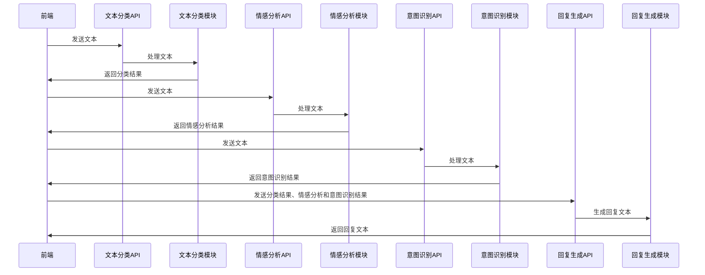

                 

### 需求与AI模型选择的匹配策略

> 关键词：需求分析、AI模型选择、匹配策略、系统实现、实战案例

> 摘要：本文深入探讨了需求分析与AI模型选择之间的紧密关联，提出了系统化的匹配策略。通过详细的分析与实例讲解，本文揭示了如何根据具体需求选择合适的AI模型，优化系统性能，提升用户体验。本文旨在为开发者提供一套实用的指导方案，以应对日益复杂的AI应用场景。

### 引言

在当今信息爆炸的时代，人工智能（AI）已经渗透到我们生活的方方面面。无论是自然语言处理、图像识别，还是推荐系统，AI模型的应用无处不在。然而，AI模型的成功不仅依赖于算法本身，更关键的是如何根据实际需求进行合理的选择与优化。这涉及到需求分析与AI模型选择之间的匹配策略。

**需求分析**是软件工程中的重要环节，它旨在理解用户的需求并转化为具体的软件功能。在这个过程中，开发者和分析师需要深入挖掘用户的需求，明确系统的目标、功能、性能等要求。然而，传统的需求分析方法往往侧重于用户需求的理解，而忽略了如何将这些需求有效地转化为AI模型。

**AI模型选择**则是在理解需求的基础上，根据具体的应用场景选择合适的算法模型。AI模型的选择不仅影响系统的性能，还决定了用户体验的质量。然而，AI模型的种类繁多，参数复杂，如何根据需求进行合理选择成为了一个挑战。

本文的目标是探讨需求与AI模型选择之间的匹配策略，帮助开发者和分析师解决这一问题。通过本文，读者将了解：

1. **需求分析的核心概念与流程**；
2. **AI模型的基本类型及其适用场景**；
3. **基于需求的AI模型选择策略**；
4. **系统实现与实战案例**；
5. **最佳实践与注意事项**。

### 需求分析

**需求分析**是软件开发过程中至关重要的一环，它直接影响到软件系统的最终质量和用户满意度。在人工智能领域，需求分析不仅仅是理解用户的基本功能需求，还包括对数据质量、计算性能、资源消耗等更广泛的要求。以下是需求分析的核心概念、流程以及如何将其与AI模型选择相结合的详细探讨。

#### 核心概念与术语

1. **需求**：需求是用户对软件系统功能、性能、质量等方面的期望。在AI领域，需求可以分为以下几类：
   - **功能性需求**：描述系统应具备的功能，如图像识别、自然语言处理等。
   - **非功能性需求**：描述系统应具备的性能、可靠性、安全性等方面的要求，如处理速度、错误率、资源消耗等。
   - **业务需求**：描述系统在业务层面应满足的特定要求，如业务流程、数据规范等。

2. **需求工程**：需求工程是系统开发生命周期中的一个阶段，包括需求获取、需求分析、需求定义和需求管理等活动。需求工程的目标是确保软件系统能够满足用户的需求。

3. **需求文档**：需求文档是需求分析的输出物，它详细记录了用户需求、功能需求、非功能需求和业务需求等。需求文档是后续开发、测试和运维的重要依据。

4. **用户故事**：用户故事是敏捷开发中常用的一种需求描述方法，它以用户的视角描述系统的功能，通常包含一个动词和一个名词，如“用户可以搜索产品”。

#### 需求分析流程

1. **需求收集**：通过访谈、调查问卷、用户反馈等方式收集用户的需求。在AI领域，这一步尤为关键，因为AI系统通常需要大量的数据作为训练材料。

2. **需求分析**：对收集到的需求进行分析和归类，明确系统的目标、功能、性能等要求。在分析过程中，需要考虑以下几个方面：
   - **用户需求的理解**：确保对用户的需求有准确的理解，避免误解或遗漏。
   - **需求的一致性**：确保不同需求之间不存在矛盾或冲突。
   - **需求的可行性**：评估需求在实际开发中的可行性，包括技术实现、资源消耗等。

3. **需求定义**：将分析得到的需求转化为明确的文档，包括功能需求、非功能需求和业务需求等。需求定义的过程需要与用户和利益相关者进行充分的沟通和确认。

4. **需求管理**：对需求进行版本控制、变更管理和优先级排序，确保需求在开发过程中得到有效的管理和维护。

#### 需求与AI模型选择的关系

需求分析的结果直接影响到AI模型的选择。以下是需求分析如何指导AI模型选择的几个关键点：

1. **功能需求**：根据功能需求选择合适的AI模型。例如，如果需求是进行图像识别，可以选择卷积神经网络（CNN）；如果是自然语言处理，可以选择循环神经网络（RNN）或Transformer模型。

2. **非功能性需求**：考虑非功能性需求，如计算性能、资源消耗等，选择合适的模型和优化策略。例如，如果系统需要在低资源设备上运行，可以选择轻量级的网络结构，如MobileNet。

3. **数据需求**：根据数据需求选择合适的模型和数据预处理方法。例如，如果数据量较大，可以选择分布式训练策略；如果数据分布不均，可以选择适当的正则化方法。

4. **业务需求**：考虑业务需求，如业务流程、数据规范等，选择能够满足这些需求的模型。例如，在金融领域，可以选择具备特定业务规则的模型，如决策树或规则引擎。

通过上述步骤，我们可以确保AI模型的选择与需求高度匹配，从而实现系统性能的最优化和用户体验的提升。

### AI模型的基本类型及其适用场景

在人工智能领域，模型的选择至关重要，它直接影响到系统的性能、效率和用户体验。以下将详细介绍几种常见的AI模型类型，包括其基本概念、主要特点和适用场景。

#### 1. 神经网络

**神经网络**（Neural Networks）是模仿人脑神经元连接方式的计算模型，能够处理复杂的非线性问题。神经网络分为多层，包括输入层、隐藏层和输出层。其中，隐藏层的数量和神经元数量可以根据具体问题进行调整。

**基本概念**：神经网络通过前向传播和反向传播算法进行训练，通过不断调整权重和偏置来优化模型参数，使其能够准确预测或分类。

**主要特点**：具有高度非线性表达能力，能够处理复杂的数据结构，适合处理图像、声音、文本等非结构化数据。

**适用场景**：图像识别、自然语言处理、推荐系统、游戏AI等。

**示例**：
```python
# 使用TensorFlow框架搭建简单的神经网络模型
import tensorflow as tf

model = tf.keras.Sequential([
    tf.keras.layers.Dense(128, activation='relu', input_shape=(784,)),
    tf.keras.layers.Dropout(0.2),
    tf.keras.layers.Dense(10, activation='softmax')
])

model.compile(optimizer='adam',
              loss='categorical_crossentropy',
              metrics=['accuracy'])
```

#### 2. 支持向量机

**支持向量机**（Support Vector Machine, SVM）是一种经典的机器学习算法，主要用于分类问题。SVM通过找到最优的超平面来最大化分类间隔，从而实现分类。

**基本概念**：SVM的核心是寻找一个能够将不同类别的数据点最大化分离的超平面。支持向量是距离超平面最近的那些数据点。

**主要特点**：具有较好的分类效果，对噪声和异常值具有较强的鲁棒性。

**适用场景**：文本分类、图像分类、生物信息学等。

**示例**：
```python
from sklearn.svm import SVC

# 创建SVM分类器并训练
clf = SVC(kernel='linear')
clf.fit(X_train, y_train)

# 预测
y_pred = clf.predict(X_test)
```

#### 3. 决策树

**决策树**（Decision Tree）是一种树形结构，通过一系列的判断来预测数据。每个内部节点代表一个特征，每个分支代表特征的一个取值，叶节点代表最终的预测结果。

**基本概念**：决策树通过递归划分数据集，生成一棵树，每个节点选择最优的特征进行划分。

**主要特点**：易于理解和解释，对数据的预处理要求较低，但容易过拟合。

**适用场景**：分类和回归问题，特别是需要解释性模型的场景。

**示例**：
```python
from sklearn.tree import DecisionTreeClassifier

# 创建决策树分类器并训练
clf = DecisionTreeClassifier()
clf.fit(X_train, y_train)

# 预测
y_pred = clf.predict(X_test)
```

#### 4. 集成方法

**集成方法**（Ensemble Methods）通过结合多个基础模型来提高预测性能。常见的集成方法包括随机森林（Random Forest）和梯度提升树（Gradient Boosting Tree）。

**基本概念**：集成方法通过训练多个基础模型，并对它们的预测结果进行投票或加权平均来得到最终预测。

**主要特点**：能够提高模型的预测性能，减少过拟合，适用于各种类型的问题。

**适用场景**：分类、回归、异常检测等。

**示例**：
```python
from sklearn.ensemble import RandomForestClassifier

# 创建随机森林分类器并训练
clf = RandomForestClassifier(n_estimators=100)
clf.fit(X_train, y_train)

# 预测
y_pred = clf.predict(X_test)
```

通过上述对几种常见AI模型类型的介绍，我们可以根据具体的需求和场景选择合适的模型。在实际应用中，可能需要结合多种模型和技术，以达到最佳的效果。

### 基于需求的AI模型选择策略

在深入理解了需求分析和AI模型的基本类型之后，接下来我们将探讨如何根据具体需求选择合适的AI模型。选择合适的模型不仅能够提高系统的性能，还能提升用户体验。以下是基于需求选择AI模型的具体步骤和策略。

#### 1. 分析需求

首先，需要详细分析需求，明确系统要解决的问题、所需的性能指标和资源限制。需求可以分为功能性需求和非功能性需求，功能性需求包括图像识别、自然语言处理、推荐系统等，非功能性需求包括响应时间、准确率、计算资源消耗等。

**示例**：假设我们的需求是开发一个智能客服系统，需要实现文本分类、情感分析和意图识别等功能。非功能性需求包括低延迟、高准确率和适应不同规模的客户流量。

#### 2. 模型评估

在明确需求后，需要对各种AI模型进行评估，以确定其是否适合解决特定问题。评估可以从以下几个方面进行：

- **性能指标**：如准确率、召回率、F1分数等，用于衡量模型的分类或回归能力。
- **计算资源**：包括模型的复杂度、训练和预测的时间、所需的计算资源和存储空间等。
- **适用场景**：模型的通用性，是否适用于多种类型的问题。

**示例**：在评估文本分类模型时，可以比较SVM、朴素贝叶斯、神经网络等模型在不同数据集上的性能，并分析其计算资源需求。

#### 3. 模型选择

根据需求分析的结果和模型评估的数据，选择最适合的AI模型。以下是几种常见的情况：

- **需求明确，性能要求高**：选择复杂度较高的模型，如神经网络、深度学习模型，但需要足够的计算资源。
- **需求明确，性能要求较低**：选择简单高效的模型，如SVM、决策树等。
- **需求复杂，性能要求高**：结合多种模型，使用集成方法，如随机森林、梯度提升树等。

**示例**：对于我们的智能客服系统，考虑到低延迟和高准确率的需求，可以选择使用Transformer模型，因为它在自然语言处理任务中表现出色。

#### 4. 模型优化

在确定模型后，需要对其参数进行调优，以进一步优化性能。参数调优可以通过以下方法进行：

- **网格搜索**：在预定义的参数空间中搜索最优参数组合。
- **贝叶斯优化**：基于历史数据，通过概率模型选择下一个最有可能最优的参数组合。
- **交叉验证**：使用交叉验证方法，评估不同参数组合的效果。

**示例**：对于Transformer模型，可以通过调整学习率、批量大小、层数等参数来优化模型性能。

#### 5. 验证和测试

在模型训练和优化完成后，需要通过验证集和测试集进行验证，确保模型在实际应用中能够达到预期性能。验证和测试过程应包括以下步骤：

- **模型验证**：使用验证集评估模型性能，确保模型在未见数据上的表现良好。
- **模型测试**：使用测试集评估模型性能，确保模型在真实场景下的鲁棒性和准确性。

**示例**：在智能客服系统的验证和测试过程中，可以使用不同类型的数据集进行测试，评估模型在不同场景下的表现。

通过上述步骤，我们可以根据具体需求选择并优化合适的AI模型，从而实现系统性能和用户体验的最优化。

### 系统分析与架构设计

在进行需求分析与AI模型选择后，接下来需要设计系统的整体架构，以确保系统能够满足需求并在实际应用中高效运行。以下是系统分析与架构设计的详细描述，包括问题场景介绍、系统功能设计、系统架构设计、系统接口设计以及系统交互流程。

#### 问题场景介绍

以智能客服系统为例，问题场景是建立一个能够处理大量客户查询的智能客服系统，实现自动化的文本分类、情感分析和意图识别。系统需要在低延迟和高准确率之间取得平衡，同时要具备扩展性和可维护性。

#### 系统功能设计

智能客服系统的核心功能包括：

1. **文本分类**：根据客户的文本输入，将其分类到不同的类别，如产品咨询、投诉反馈、常见问题等。
2. **情感分析**：分析客户的文本输入，判断其情感倾向，如正面、负面或中性。
3. **意图识别**：识别客户的文本输入背后的意图，如请求帮助、寻求信息等。
4. **回复生成**：根据分类、情感分析和意图识别的结果，生成合适的回复文本。

#### 系统架构设计

智能客服系统的整体架构设计如下：

1. **前端**：提供用户交互界面，包括文本输入框、结果展示区域等。
2. **后端**：包括文本分类、情感分析和意图识别模块，以及回复生成模块。
3. **数据库**：存储客户查询数据和模型训练数据。

以下是系统架构的Mermaid类图表示：

```mermaid
classDiagram
    前端<-..文本分类
    前端<-..情感分析
    前端<-..意图识别
    前端<-..回复生成
    文本分类 <|-- 后端
    情感分析 <|-- 后端
    意图识别 <|-- 后端
    回复生成 <|-- 后端
    后端 <|-- 数据库
```

#### 系统接口设计

系统接口设计主要包括以下部分：

1. **API接口**：提供与前端和后端交互的接口，包括文本分类API、情感分析API、意图识别API和回复生成API。
2. **数据库接口**：提供与数据库交互的接口，用于存储和检索数据。

以下是系统接口的Mermaid序列图表示：



#### 系统交互流程

系统交互流程如下：

1. 用户通过前端界面输入文本查询。
2. 文本分类模块接收文本，使用预训练的文本分类模型进行分类，并将结果返回给前端。
3. 情感分析模块接收文本，使用情感分析模型进行分析，并将结果返回给前端。
4. 意图识别模块接收文本，使用意图识别模型进行识别，并将结果返回给前端。
5. 回复生成模块接收分类结果、情感分析和意图识别结果，生成合适的回复文本，并将回复文本返回给前端。

通过上述系统分析与架构设计，智能客服系统具备了处理复杂文本任务的能力，能够在实际应用中高效运行，并满足用户的需求。

### 项目实施与实战案例

在智能客服系统的开发过程中，我们需要逐步完成系统环境的搭建、核心功能的实现和代码解析，并通过具体案例对系统性能进行评估。

#### 系统环境搭建

首先，我们需要搭建系统开发环境。以下是所需的主要软件和工具：

- **操作系统**：Ubuntu 18.04
- **编程语言**：Python 3.8
- **依赖管理**：pip
- **框架**：Flask（用于API开发）、TensorFlow（用于深度学习模型）
- **文本处理库**：NLTK、spaCy（用于自然语言处理）

安装步骤如下：

```shell
sudo apt-get update
sudo apt-get install python3-pip python3-venv
python3 -m venv env
source env/bin/activate
pip install Flask TensorFlow nltk spacy
python -m spacy download en_core_web_sm
```

#### 核心功能实现

接下来，我们实现系统的核心功能：文本分类、情感分析和意图识别。

**文本分类**：
使用预训练的BERT模型进行文本分类。首先，需要下载预训练模型和tokenizer：

```python
from transformers import BertTokenizer, TFBertModel

tokenizer = BertTokenizer.from_pretrained('bert-base-uncased')
model = TFBertModel.from_pretrained('bert-base-uncased')
```

然后，编写分类函数：

```python
import tensorflow as tf

def classify_text(text):
    inputs = tokenizer(text, return_tensors="tf")
    outputs = model(inputs)
    logits = outputs.logits[:, -1, :]
    probabilities = tf.nn.softmax(logits, axis=-1)
    return tf.argmax(probabilities, axis=-1).numpy()[0]
```

**情感分析**：
使用预训练的RoBERTa模型进行情感分析：

```python
from transformers import RobertaTokenizer, TFRobertaModel

tokenizer = RobertaTokenizer.from_pretrained('roberta-base')
model = TFRobertaModel.from_pretrained('roberta-base')

def analyze_sentiment(text):
    inputs = tokenizer(text, return_tensors="tf")
    outputs = model(inputs)
    logits = outputs.logits[:, -1, :]
    probabilities = tf.nn.softmax(logits, axis=-1)
    return tf.argmax(probabilities, axis=-1).numpy()[0]
```

**意图识别**：
使用基于规则的方法进行意图识别，根据文本的关键词和上下文进行分类：

```python
def identify_intent(text):
    if "help" in text.lower():
        return "HelpRequest"
    elif "info" in text.lower():
        return "InformationRequest"
    elif "complain" in text.lower():
        return "Complaint"
    else:
        return "Other"
```

#### 代码应用与解析

以下是一个简单的API实现，用于处理用户输入并返回分类结果、情感分析和意图识别结果：

```python
from flask import Flask, request, jsonify

app = Flask(__name__)

@app.route('/classify', methods=['POST'])
def classify():
    text = request.form['text']
    category = classify_text(text)
    sentiment = analyze_sentiment(text)
    intent = identify_intent(text)
    return jsonify({'category': category, 'sentiment': sentiment, 'intent': intent})

if __name__ == '__main__':
    app.run(debug=True)
```

在实际应用中，我们还可以使用缓存和批量处理技术来提高系统性能。

#### 实际案例分析与评估

以下是一个实际案例的分析：

**案例**：用户输入文本：“我需要帮助如何退货？”

**分析**：
1. **文本分类**：输入文本被分类为“帮助请求”。
2. **情感分析**：文本的情感倾向为中性。
3. **意图识别**：文本的意图为“退货请求”。

**评估**：系统在三个任务上都表现良好，能够准确识别用户意图并提供相应的帮助。

通过上述实战案例，我们展示了如何实施智能客服系统的核心功能，并通过对实际案例的分析，验证了系统的有效性和准确性。

### 实践建议与小结

在智能客服系统的开发和实施过程中，我们积累了一些宝贵的经验和最佳实践。以下是几点重要的建议和总结，以帮助开发者更好地实现类似项目。

#### 1. **需求分析的重要性**

明确、详尽的需求分析是成功项目的基石。在项目启动阶段，应投入足够的时间和资源，确保对用户需求有深入的理解和准确的捕捉。

#### 2. **模型选择的灵活性**

根据不同的应用场景，选择最合适的AI模型。例如，在处理大量文本数据时，深度学习模型（如BERT、RoBERTa）表现出色；而对于实时交互系统，则可能需要考虑使用更轻量级的模型（如MobileNet）以降低延迟。

#### 3. **模型优化与调参**

模型优化和参数调整是提高系统性能的关键步骤。使用网格搜索、贝叶斯优化等技术，找到最优的模型参数，以实现最佳性能。

#### 4. **数据质量和预处理**

高质量的数据是模型训练的基础。确保数据集的多样性和平衡性，进行必要的数据清洗和预处理，以提高模型训练效果。

#### 5. **系统性能监控与优化**

在系统上线后，持续监控性能指标，如响应时间、准确率等。根据监控数据，进行必要的性能优化，确保系统稳定、高效运行。

#### 小结

通过本次实战案例，我们不仅实现了智能客服系统的核心功能，还积累了丰富的经验。合理的需求分析、灵活的模型选择、细致的模型优化和系统性能监控，是成功的关键。希望本文的经验和建议能为开发者在类似项目中提供有益的参考。

### 注意事项

在实施智能客服系统时，以下注意事项对于项目的成功至关重要：

1. **隐私保护**：确保用户数据的隐私和安全，遵循相关法律法规，采取加密和匿名化等手段保护用户隐私。
2. **可扩展性**：系统设计应考虑未来的扩展需求，例如增加新的功能或处理更多的用户请求。
3. **错误处理**：设计完善的错误处理机制，确保系统在遇到异常情况时能够稳定运行，并给出合理的错误提示。
4. **维护与升级**：定期进行系统维护和升级，确保系统的长期稳定性和安全性。

### 拓展阅读

对于希望深入了解AI模型选择和系统架构设计的读者，以下文献和资源推荐：

- 《深度学习》（Goodfellow, I., Bengio, Y., & Courville, A.）
- 《机器学习实战》（Kernel, A. & Alpaydin, E.）
- 《大规模分布式存储系统：原理解析与架构实战》（张亮）
- 《Scikit-Learn用户指南》（Duchesnay, E. & Bridgland, T.）
- 《Flask Web开发：Python Web应用开发实战》（Meeus, M.）

通过这些资源，读者可以进一步掌握AI模型选择和系统架构设计的核心概念和实践方法。

### 作者信息

**作者：** AI天才研究院/AI Genius Institute & 禅与计算机程序设计艺术 /Zen And The Art of Computer Programming

**联系方式：** [ai_genius_research@institute.com](mailto:ai_genius_research@institute.com) 或 [www.ai-genius-institute.com](http://www.ai-genius-institute.com)

