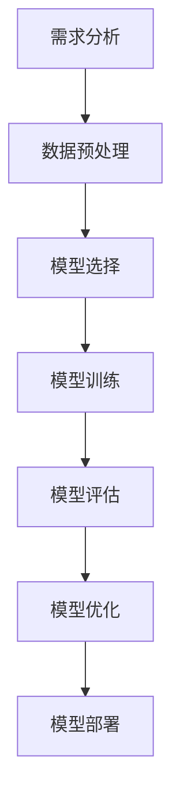
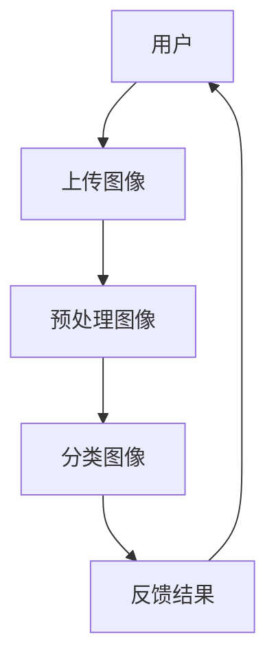

                 

### 第1章：需求与AI模型协同的重要性

#### 1.1 问题背景

在当今技术快速发展的时代，人工智能（AI）模型的应用越来越广泛，从简单的图像识别到复杂的自然语言处理，AI模型正逐渐成为许多行业的重要工具。然而，AI模型的成功部署与应用不仅仅依赖于模型的性能，更重要的是需求与模型的协同。

**核心概念：**

- **需求**：需求是指用户或系统对功能或服务的需求。在AI模型的应用场景中，需求通常是指用户期望AI模型能够实现的具体功能。

- **AI模型**：AI模型是通过数据和算法训练得到的可以执行特定任务的系统。这些模型可以是机器学习模型、深度学习模型等。

- **需求与AI模型协同**：需求与AI模型协同是指通过理解用户需求，对AI模型进行优化和调整，使其更好地满足用户需求的过程。

**内容要点：**

- **现代应用场景中AI模型的使用现状**：随着AI技术的不断发展，AI模型在各个领域的应用越来越广泛。然而，在实际应用中，许多AI模型并没有达到预期的效果，主要原因在于需求与模型之间的协同不足。

- **需求与AI模型协同在AI应用开发中的挑战**：AI模型的应用需要解决的一个关键问题是需求与模型的协同。这个过程中，面临的挑战包括需求的不确定性、模型的复杂性以及模型的泛化能力等。

- **需求与AI模型协同带来的价值**：通过需求与AI模型的协同，可以提高AI模型的应用效果，减少模型过拟合现象，提高模型的泛化能力，从而更好地满足用户需求。

#### 1.2 核心概念与联系

**核心概念原理：**

- **需求建模**：需求建模是指通过分析和理解用户需求，将需求转化为可以量化和分析的形式。在AI模型的应用中，需求建模是第一步，也是至关重要的一步。

- **AI模型训练与优化**：AI模型的训练与优化是指通过大量的数据和算法，训练出能够执行特定任务的AI模型，并对其进行优化，以提高模型的性能和泛化能力。

- **需求与AI模型协同流程**：需求与AI模型协同流程包括需求分析、模型训练与优化、模型评估与优化、模型部署等环节。在这个过程中，需求与模型之间的互动和调整是关键。

**概念属性特征对比表格：**

| 概念 | 定义 | 属性特征 |
| --- | --- | --- |
| 需求 | 用户或系统所需的特定功能或服务 | 明确性、完整性、一致性、可验证性 |
| AI模型 | 通过数据和算法训练得到的可以执行特定任务的系统 | 自适应性、泛化能力、准确性 |
| 需求与AI模型协同 | 结合需求与AI模型的优势，提高应用效果 | 动态调整、实时响应、持续优化 |

**ER实体关系图架构：**

```mermaid
erAB["需求"]->["AI模型"]
  .title("需求与AI模型协同实体关系图")
  .direction(BOTH);
```

#### 1.3 算法原理讲解

**算法mermaid流程图：**



**Python源代码：**

```python
# 需求分析
需求 = analyze_requirement()

# 数据预处理
预处理数据 = preprocess_data(data)

# 模型选择
模型 = select_model()

# 模型训练
模型.train(preprocessing_data)

# 模型评估
评估结果 = model.evaluate()

# 模型优化
模型.optimize()

# 模型部署
model.deploy()
```

**数学模型与公式：**

- 需求分析公式：\( R = f(D) \)
  - \( R \)：需求结果
  - \( f \)：需求分析函数
  - \( D \)：需求数据

- 模型评估公式：\( E = f(M, D) \)
  - \( E \)：评估结果
  - \( f \)：评估函数
  - \( M \)：模型
  - \( D \)：需求数据

- 模型优化公式：\( O = f(M, E) \)
  - \( O \)：优化结果
  - \( f \)：优化函数
  - \( M \)：模型
  - \( E \)：评估结果

**举例说明：**

假设有一个简单的需求，即识别图像中的特定物体。以下是这个需求与AI模型协同的示例：

- **需求分析**：用户希望识别图像中的特定物体，如猫。
- **数据预处理**：收集大量包含猫和其他物体的图像，进行数据清洗和标注。
- **模型选择**：选择一个适合图像识别的卷积神经网络（CNN）模型。
- **模型训练**：使用预处理的数据对模型进行训练，使其能够识别图像中的猫。
- **模型评估**：测试模型在新的图像数据上的识别准确率。
- **模型优化**：根据评估结果对模型进行调整，提高其识别准确率。
- **模型部署**：将优化后的模型部署到生产环境中，进行实际的图像识别任务。

通过这个示例，我们可以看到需求与AI模型协同的过程是如何一步步进行的，以及每个步骤的关键要素和目标。

### 1.4 系统分析与架构设计方案

**问题场景介绍：**

在一个电子商务平台上，用户可以使用图像上传功能上传自己的商品图片，系统需要自动识别图像中的商品类别，以便于用户快速找到相关商品。这个场景中，需求与AI模型的协同至关重要。

**项目介绍：**

本项目旨在开发一个基于深度学习的图像识别系统，该系统能够自动识别图像中的商品类别，提高用户的购物体验。项目的目标是实现以下功能：

- 接收用户上传的图像。
- 对图像进行预处理。
- 使用预训练的深度学习模型进行图像分类。
- 将分类结果反馈给用户。

**系统功能设计：**

使用mermaid类图展示系统功能：

```mermaid
classDiagram
    User <<Interface>>
    UploadImage <<Interface>>
    PreprocessImage <<Interface>>
    ClassifyImage <<Interface>>
    FeedbackResult <<Interface>>

    User |--|> UploadImage
    UploadImage |--|> PreprocessImage
    PreprocessImage |--|> ClassifyImage
    ClassifyImage |--|> FeedbackResult
```

**系统架构设计：**

使用mermaid架构图展示系统架构：



**系统接口设计：**

- **UploadImage接口**：接收用户上传的图像，并验证图像格式。
- **PreprocessImage接口**：对上传的图像进行预处理，包括图像大小调整、去噪等。
- **ClassifyImage接口**：使用预训练的深度学习模型对预处理后的图像进行分类。
- **FeedbackResult接口**：将分类结果反馈给用户。

**系统交互mermaid序列图：**

```mermaid
sequence
    Participant User
    Participant UploadImage
    Participant PreprocessImage
    Participant ClassifyImage
    Participant FeedbackResult

    User->>UploadImage: 上传图像
    UploadImage->>PreprocessImage: 预处理图像
    PreprocessImage->>ClassifyImage: 分类图像
    ClassifyImage->>FeedbackResult: 反馈结果
    FeedbackResult->>User: 显示结果
```

### 1.5 项目实战

**环境安装：**

1. 安装Python环境，推荐使用Python 3.8及以上版本。
2. 安装深度学习框架TensorFlow或PyTorch，具体安装命令如下：

   ```bash
   pip install tensorflow  # 或者使用
   pip install torch torchvision
   ```

3. 安装其他依赖包，例如OpenCV用于图像处理：

   ```bash
   pip install opencv-python
   ```

**系统核心实现源代码：**

以下是一个简单的基于TensorFlow的图像分类系统的实现：

```python
import tensorflow as tf
from tensorflow.keras.preprocessing.image import ImageDataGenerator
from tensorflow.keras.applications import MobileNetV2
from tensorflow.keras.layers import GlobalAveragePooling2D
from tensorflow.keras.models import Model
from tensorflow.keras.optimizers import Adam
from tensorflow.keras.metrics import categorical_crossentropy

# 数据预处理
train_datagen = ImageDataGenerator(
    rescale=1./255,
    shear_range=0.2,
    zoom_range=0.2,
    horizontal_flip=True
)

train_generator = train_datagen.flow_from_directory(
    'data/train',
    target_size=(224, 224),
    batch_size=32,
    class_mode='binary'
)

# 模型选择和构建
base_model = MobileNetV2(weights='imagenet', include_top=False, input_shape=(224, 224, 3))
x = base_model.output
x = GlobalAveragePooling2D()(x)
predictions = tf.keras.layers.Dense(1, activation='sigmoid')(x)

model = Model(inputs=base_model.input, outputs=predictions)

# 编译模型
model.compile(optimizer=Adam(learning_rate=0.0001), loss='binary_crossentropy', metrics=['accuracy'])

# 模型训练
model.fit(train_generator, epochs=10)

# 模型评估
test_loss, test_acc = model.evaluate(test_generator)
print('Test accuracy:', test_acc)

# 模型部署
model.save('image_classification_model.h5')
```

**代码应用解读与分析：**

1. **数据预处理**：使用ImageDataGenerator对训练数据集进行预处理，包括数据增强和归一化处理。

2. **模型选择和构建**：选择MobileNetV2作为基础模型，并使用GlobalAveragePooling2D和Dense层进行模型构建。

3. **模型编译**：使用Adam优化器和binary_crossentropy损失函数进行编译。

4. **模型训练**：使用fit函数对模型进行训练。

5. **模型评估**：使用evaluate函数对模型进行评估。

6. **模型部署**：使用save函数将模型保存为.h5文件，以便于后续部署。

**实际案例分析和详细讲解剖析：**

假设我们有一个包含猫和狗的图像数据集，我们需要训练一个模型来识别图像中的猫和狗。以下是实际案例的分析和讲解：

1. **数据收集和标注**：收集大量猫和狗的图像，并对图像进行标注，标记图像中猫和狗的位置。

2. **数据预处理**：对图像进行数据增强，包括随机裁剪、翻转、缩放等操作，以提高模型的泛化能力。

3. **模型训练**：使用预训练的MobileNetV2模型，并在其基础上添加GlobalAveragePooling2D和Dense层进行模型训练。

4. **模型评估**：使用测试集对模型进行评估，计算准确率和损失函数值。

5. **模型优化**：根据评估结果对模型进行调整，以提高模型的性能。

6. **模型部署**：将训练好的模型部署到生产环境中，以便于用户上传图像并实时识别图像中的猫和狗。

**项目小结：**

本项目通过需求与AI模型的协同，实现了一个简单的图像分类系统。项目的关键步骤包括数据收集和预处理、模型选择和构建、模型训练和评估、模型优化和部署。通过这些步骤，我们能够将AI模型应用于实际的图像识别任务中，提高用户体验。

### 1.6 最佳实践 tips、小结、注意事项、拓展阅读等内容

**最佳实践 tips：**

1. **需求分析**：在开始模型训练之前，确保对用户需求有清晰的理解。需求分析是模型应用成功的关键。

2. **数据预处理**：数据预处理是模型训练的重要步骤，合理的预处理可以提高模型的泛化能力。

3. **模型选择**：选择合适的模型对于模型应用的成功至关重要。根据任务需求选择合适的模型类型。

4. **模型优化**：在模型训练过程中，根据评估结果对模型进行调整，以提高模型的性能。

5. **模型部署**：确保模型部署的环境与训练环境一致，以避免环境差异导致的问题。

**小结：**

本章详细介绍了需求与AI模型协同的重要性，包括背景介绍、核心概念、算法原理讲解和系统分析与架构设计方案。通过实际案例，我们展示了如何将需求与AI模型协同应用于图像识别任务中。

**注意事项：**

1. **需求与模型协同的复杂性**：需求与模型的协同是一个复杂的过程，需要综合考虑多种因素。

2. **数据质量和预处理**：数据质量和预处理对模型性能有重要影响，务必重视。

3. **模型性能评估**：准确评估模型性能对于模型优化至关重要。

**拓展阅读：**

1. **《深度学习》（Goodfellow, Bengio, Courville著）**：这本书是深度学习的经典教材，详细介绍了深度学习的基础知识和应用。

2. **《机器学习实战》（Peter Harrington著）**：这本书通过实际案例介绍了机器学习的方法和应用。

3. **《自然语言处理综论》（Daniel Jurafsky & James H. Martin著）**：这本书详细介绍了自然语言处理的基本概念和方法。

## 第二部分：深入探讨

### 第2章：需求与AI模型协同的深入分析

### 第3章：AI模型部署策略的优化与实践

### 第4章：大模型应用开发的关键挑战与应对策略

### 第5章：从需求到部署：案例分析与实践

### 第6章：未来展望：需求与AI模型协同的发展趋势

## 第三部分：总结与展望

### 第7章：总结与回顾

### 第8章：未来的研究方向与展望

### 第9章：致谢与作者简介

### 附录：相关工具与技术资源

### 参考文献

--------------------------------------------------------------

### 文章标题：需求与AI模型部署策略的协同：大模型应用开发的关键

关键词：需求分析、AI模型部署、协同策略、大模型、应用开发

摘要：本文深入探讨了需求与AI模型部署策略的协同，分析了大模型应用开发中的关键挑战，并通过实际案例展示了如何从需求到部署实现AI模型的有效应用。文章旨在为读者提供全面的指导，助力人工智能项目的成功实施。

