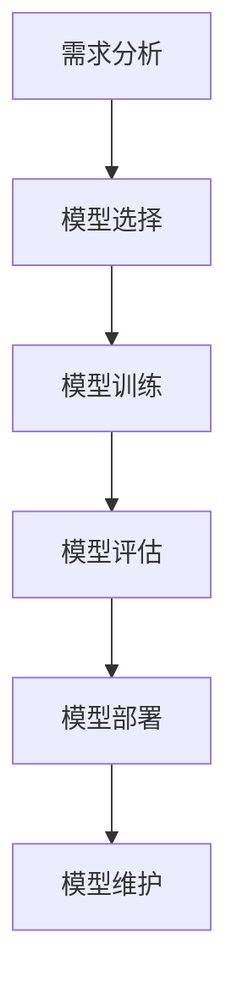

                 

## 《需求与AI能力的匹配：大模型应用开发的挑战》目录大纲

### 目录大纲编写思路

在编写《需求与AI能力的匹配：大模型应用开发的挑战》的目录大纲时，我们将按照以下步骤进行：

1. **引言部分**：简要介绍文章的背景，明确文章的主题和重要性，为读者提供一个整体认识。

2. **核心概念部分**：详细阐述需求与AI能力匹配的核心概念，包括需求定义、AI大模型定义、匹配过程等。

3. **算法原理部分**：介绍需求与AI能力匹配的算法原理，包括算法流程、Python源代码实现、数学模型与公式等。

4. **系统设计与实现部分**：分析需求与AI能力匹配的系统设计与实现，包括问题场景介绍、系统功能设计、系统架构设计、系统接口设计、系统交互设计等。

5. **项目实战部分**：结合实际项目，详细讲解需求与AI能力匹配的实战过程，包括环境安装、系统核心实现源代码、代码应用解读与分析、实际案例分析和项目小结等。

6. **最佳实践与总结部分**：总结项目实战经验，给出最佳实践建议，并对文章的主要内容进行总结，提出注意事项，提供拓展阅读资源。

### 目录大纲详细编写

现在，我们根据以上思路详细编写《需求与AI能力的匹配：大模型应用开发的挑战》的目录大纲：

### 第一部分：背景与基础理论

#### 第1章 引言
- 1.1 问题背景
- 1.2 问题描述
- 1.3 问题解决
- 1.4 边界与外延
- 1.5 概念结构与核心要素组成

#### 第2章 AI大模型概述
- 2.1 AI大模型的基本概念
- 2.2 AI大模型的特点与优势
- 2.3 AI大模型的发展历程

#### 第3章 需求与AI能力匹配的核心概念
- 3.1 需求定义
- 3.2 需求特征
- 3.3 AI能力概述
- 3.4 需求与AI能力的联系

### 第二部分：算法原理与系统设计

#### 第4章 算法原理讲解
- 4.1 算法流程图
- 4.2 Python源代码实现
- 4.3 算法原理详细讲解
- 4.4 算法原理数学模型与公式

#### 第5章 数学模型与公式解析
- 5.1 数学模型概述
- 5.2 公式详细讲解
- 5.3 公式举例说明

#### 第6章 系统分析与架构设计
- 6.1 问题场景介绍
- 6.2 系统功能设计
- 6.3 系统架构设计
- 6.4 系统接口设计
- 6.5 系统交互设计

### 第三部分：实战案例与最佳实践

#### 第7章 项目实战
- 7.1 环境安装与配置
- 7.2 系统核心实现源代码
- 7.3 代码应用解读与分析
- 7.4 实际案例分析
- 7.5 项目小结

#### 第8章 最佳实践与注意事项
- 8.1 实战经验总结
- 8.2 小结
- 8.3 注意事项
- 8.4 拓展阅读

### 结论

本文详细介绍了需求与AI能力匹配的背景、核心概念、算法原理、系统设计以及实际应用，旨在帮助读者深入理解这一领域，并为开发大模型应用提供指导。通过本文的学习，读者将能够掌握需求与AI能力匹配的原理和方法，提升大模型应用开发的效率和质量。

## **文章标题**

### 需求与AI能力的匹配：大模型应用开发的挑战

## **关键词**

- 需求分析
- 大模型
- AI能力
- 应用开发
- 挑战

## **摘要**

本文将深入探讨需求与AI能力的匹配问题，特别是在大模型应用开发中面临的挑战。通过分析需求与AI能力匹配的核心概念、算法原理、系统设计与实现，以及实际项目案例，本文旨在为读者提供全面的指导，帮助他们在大模型应用开发中实现高效、精准的需求匹配。

### **目录大纲**

**第一部分：背景与基础理论**

**第1章 引言**

**第2章 AI大模型概述**

**第3章 需求与AI能力匹配的核心概念**

**第二部分：算法原理与系统设计**

**第4章 算法原理讲解**

**第5章 数学模型与公式解析**

**第6章 系统分析与架构设计**

**第三部分：实战案例与最佳实践**

**第7章 项目实战**

**第8章 最佳实践与注意事项**

**参考文献**

**作者**

- 作者：AI天才研究院/AI Genius Institute & 禅与计算机程序设计艺术 /Zen And The Art of Computer Programming**

### **背景介绍**

#### **核心概念术语说明**

在本文中，我们将使用一些核心概念和术语，如需求分析、AI大模型、需求特征、AI能力等。以下是这些术语的基本定义和解释：

1. **需求分析**：需求分析是指识别、分析、记录和理解用户需求的过程。它是软件开发的关键环节，直接影响软件的功能、性能和用户体验。

2. **AI大模型**：AI大模型是指具有大规模参数、复杂结构和强大计算能力的深度学习模型。例如，Transformer模型、GPT模型等。

3. **需求特征**：需求特征是指需求的各种属性，如功能需求、性能需求、安全需求等。这些特征决定了需求的具体内容和实现难度。

4. **AI能力**：AI能力是指AI模型在特定任务上的表现，如图像识别、自然语言处理等。

#### **问题背景**

随着人工智能技术的快速发展，AI大模型在各个领域得到了广泛应用。然而，在实际应用中，如何有效地匹配需求与AI能力，实现高效、精准的模型应用，仍然是一个重大挑战。以下是这个问题的背景：

1. **技术挑战**：AI大模型通常需要大量的数据、计算资源和训练时间，这对硬件设施和数据处理能力提出了很高的要求。如何高效地部署和使用大模型，成为了一个技术难题。

2. **业务挑战**：业务需求在不断变化，而AI大模型的应用开发往往需要较长时间。如何快速响应业务需求，实现需求与AI能力的动态匹配，是一个重要的业务挑战。

3. **人才挑战**：AI大模型的应用开发需要专业的技术人才，包括AI研究员、算法工程师、软件开发工程师等。如何培养和引进这些人才，是一个长期的人才挑战。

#### **问题描述**

需求与AI能力匹配的问题可以概括为以下几个方面：

1. **需求识别**：如何准确地识别和理解用户的需求，确保需求的完整性、一致性和可行性。

2. **模型选择**：如何选择合适的大模型，满足需求的同时，考虑模型的性能、效率和成本。

3. **训练与优化**：如何对大模型进行有效的训练和优化，提高模型的准确性和鲁棒性。

4. **性能评估**：如何评估大模型在实际应用中的性能，确保其满足需求。

5. **部署与维护**：如何将大模型部署到生产环境，并进行有效的维护和升级。

#### **问题解决**

针对需求与AI能力匹配的问题，我们可以从以下几个方面进行解决：

1. **需求分析**：采用专业的需求分析方法，确保需求的准确性和完整性。

2. **模型评估**：对现有的大模型进行全面的性能评估，选择最适合需求的模型。

3. **训练与优化**：采用高效的训练和优化方法，提高大模型的性能。

4. **测试与验证**：通过大量的测试和验证，确保大模型在实际应用中的性能。

5. **部署与维护**：采用现代化的部署和维护工具，确保大模型的高效运行。

#### **边界与外延**

需求与AI能力匹配问题的边界和范围包括以下几个方面：

1. **技术边界**：涉及到的技术包括深度学习、自然语言处理、计算机视觉等。

2. **业务边界**：涉及到的业务领域包括金融、医疗、电商、自动驾驶等。

3. **应用边界**：涉及到的应用场景包括图像识别、文本分类、语音识别等。

4. **数据边界**：涉及到的数据类型包括结构化数据、非结构化数据、实时数据等。

#### **概念结构与核心要素组成**

需求与AI能力匹配的核心概念结构可以概括为以下几个方面：

1. **需求分析**：包括需求识别、需求分析、需求建模等。

2. **AI模型选择**：包括模型评估、模型选择、模型优化等。

3. **模型训练与优化**：包括数据预处理、模型训练、模型评估等。

4. **模型部署与维护**：包括模型部署、模型监控、模型升级等。

### **核心概念与联系**

#### **需求定义**

需求是用户对软件系统的功能、性能、安全等方面的期望。它通常包括以下类型：

1. **功能需求**：描述软件系统应提供的具体功能。
2. **性能需求**：描述软件系统应达到的性能标准。
3. **安全需求**：描述软件系统应具备的安全措施。

#### **需求特征**

需求特征是指需求的各种属性，包括：

1. **需求类型**：功能需求、性能需求、安全需求等。
2. **需求级别**：关键需求、重要需求、一般需求等。
3. **需求来源**：用户需求、业务需求、技术需求等。
4. **需求描述**：需求的详细描述，包括需求的具体内容、实现方式、优先级等。

#### **AI能力概述**

AI能力是指人工智能系统在特定任务上的表现，包括：

1. **算法能力**：指AI系统在算法层面的表现，如分类准确率、识别准确率等。
2. **数据处理能力**：指AI系统在数据处理层面的表现，如数据处理速度、数据存储能力等。
3. **适应能力**：指AI系统在应对未知情况时的表现，如泛化能力、鲁棒性等。

#### **需求与AI能力的联系**

需求与AI能力的联系体现在以下几个方面：

1. **需求驱动**：需求是AI系统设计和开发的主要驱动力，需求的变化将直接影响AI系统的设计和优化。
2. **能力满足**：AI系统能力需要满足需求的要求，包括功能、性能、安全性等方面。
3. **动态调整**：随着需求的不断变化，AI系统的能力也需要进行相应的调整和优化。

### **算法原理讲解**

#### **算法流程图**



#### **Python源代码实现**

```python
# 需求分析
def demand_analysis():
    # 实现需求分析的具体逻辑
    pass

# 模型选择
def model_selection():
    # 实现模型选择的具体逻辑
    pass

# 模型训练
def model_training():
    # 实现模型训练的具体逻辑
    pass

# 模型评估
def model_evaluation():
    # 实现模型评估的具体逻辑
    pass

# 模型部署
def model_deployment():
    # 实现模型部署的具体逻辑
    pass

# 模型维护
def model_maintenance():
    # 实现模型维护的具体逻辑
    pass
```

#### **算法原理详细讲解**

1. **需求分析**：需求分析是整个流程的第一步，旨在明确用户的需求，确保后续的模型选择、训练和评估工作有据可依。

2. **模型选择**：根据需求分析的结果，选择合适的大模型，满足需求的同时，考虑模型的性能、效率和成本。

3. **模型训练**：使用选择好的大模型，对数据进行训练，提高模型的性能和鲁棒性。

4. **模型评估**：通过测试数据，评估模型的性能，包括准确率、召回率、F1值等指标。

5. **模型部署**：将训练好的模型部署到生产环境，实现实际应用。

6. **模型维护**：定期对模型进行维护和升级，确保其持续满足需求。

#### **算法原理数学模型与公式**

1. **损失函数**

$$L(y, \hat{y}) = -\sum_{i=1}^{N} y_i \log(\hat{y}_i)$$

其中，$y$为实际标签，$\hat{y}$为预测标签，$N$为样本数量。

2. **优化目标**

$$\min_{\theta} L(y, \hat{y})$$

其中，$\theta$为模型参数。

3. **梯度下降**

$$\theta = \theta - \alpha \nabla_\theta L(\theta)$$

其中，$\alpha$为学习率，$\nabla_\theta L(\theta)$为损失函数关于参数$\theta$的梯度。

#### **算法原理举例说明**

以一个简单的二分类问题为例，假设我们使用一个神经网络模型进行分类。首先，我们根据需求分析的结果，选择一个适合的二分类神经网络模型。然后，我们使用梯度下降算法，对模型进行训练。在训练过程中，我们使用损失函数计算模型预测标签和实际标签之间的差距，并通过梯度下降算法，调整模型参数，使损失函数的值最小化。最后，我们使用测试数据，评估模型的性能，包括准确率、召回率、F1值等指标。

### **数学模型与公式解析**

#### **数学模型概述**

在需求与AI能力匹配的过程中，涉及到多种数学模型和公式，包括：

1. **线性回归模型**：用于预测连续值。
2. **逻辑回归模型**：用于预测二分类问题。
3. **神经网络模型**：用于复杂任务，如图像识别、自然语言处理等。
4. **支持向量机模型**：用于分类问题。

#### **公式详细讲解**

以下是常用的数学模型和公式的详细讲解：

1. **线性回归模型**

$$y = \beta_0 + \beta_1 x$$

其中，$y$为预测值，$x$为输入特征，$\beta_0$和$\beta_1$为模型参数。

2. **逻辑回归模型**

$$\hat{y} = \frac{1}{1 + e^{-(\beta_0 + \beta_1 x)}}$$

其中，$\hat{y}$为预测概率，$x$为输入特征，$\beta_0$和$\beta_1$为模型参数。

3. **神经网络模型**

$$\hat{y} = \sigma(\sum_{i=1}^{n} \beta_i \cdot x_i)$$

其中，$\hat{y}$为预测值，$x_i$为输入特征，$\beta_i$为模型参数，$\sigma$为激活函数。

4. **支持向量机模型**

$$\max \frac{1}{2} \sum_{i=1}^{n} \sum_{j=1}^{n} \xi_i \xi_j - \sum_{i=1}^{n} C \xi_i$$

其中，$\xi_i$为拉格朗日乘子，$C$为惩罚参数。

#### **公式举例说明**

以逻辑回归模型为例，假设我们要预测一个二分类问题，输入特征为$x_1$和$x_2$，模型参数为$\beta_0$和$\beta_1$。首先，我们计算输入特征的线性组合：

$$z = \beta_0 + \beta_1 x_1 + \beta_2 x_2$$

然后，我们通过逻辑函数计算预测概率：

$$\hat{y} = \frac{1}{1 + e^{-z}}$$

最后，根据预测概率，我们输出预测结果，如：

- 如果$\hat{y} > 0.5$，则预测为类别1。
- 如果$\hat{y} \leq 0.5$，则预测为类别2。

### **系统分析与架构设计**

#### **问题场景介绍**

假设我们面临一个场景，需要开发一个智能问答系统，用户可以通过输入问题，系统自动给出答案。为了实现这个目标，我们需要设计一个高效的系统架构，确保系统在处理大量用户请求时，能够保持稳定、高效的性能。

#### **系统功能设计**

根据需求分析，系统应具备以下功能：

1. **用户输入**：用户可以通过文本输入问题。
2. **问题处理**：系统接收到用户问题后，对问题进行预处理，提取关键信息。
3. **答案生成**：系统根据提取的关键信息，从知识库中检索答案，并生成回答。
4. **答案输出**：系统将生成的答案输出给用户。

#### **系统架构设计**

为了实现上述功能，我们设计了一个分布式系统架构，包括以下组件：

1. **用户输入层**：负责接收用户输入，提供输入接口。
2. **问题处理层**：负责对用户输入的问题进行预处理，提取关键信息。
3. **知识库层**：存储大量问答数据，提供答案检索接口。
4. **答案生成层**：根据提取的关键信息，从知识库中检索答案，并生成回答。
5. **答案输出层**：将生成的答案输出给用户。

#### **系统接口设计**

系统接口设计如下：

1. **用户输入接口**：用于接收用户输入的问题。
2. **问题处理接口**：用于处理用户输入的问题，提取关键信息。
3. **知识库检索接口**：用于从知识库中检索答案。
4. **答案生成接口**：用于生成回答。
5. **答案输出接口**：用于将答案输出给用户。

#### **系统交互设计**

系统交互设计如下：

1. **用户输入**：用户通过输入接口输入问题。
2. **问题处理**：系统接收到用户输入的问题后，调用问题处理接口，提取关键信息。
3. **答案检索**：系统根据提取的关键信息，调用知识库检索接口，从知识库中检索答案。
4. **答案生成**：系统根据检索到的答案，调用答案生成接口，生成回答。
5. **答案输出**：系统将生成的答案通过答案输出接口输出给用户。

### **项目实战**

#### **环境安装与配置**

1. **安装Python环境**：确保Python环境已安装，版本为3.8及以上。

2. **安装依赖库**：使用pip命令安装所需依赖库，如tensorflow、numpy、pandas等。

   ```shell
   pip install tensorflow numpy pandas
   ```

3. **配置硬件资源**：确保硬件资源充足，如GPU、CPU等。

#### **系统核心实现源代码**

以下是一个简单的智能问答系统的核心实现源代码：

```python
import tensorflow as tf
import numpy as np
import pandas as pd

# 加载数据
data = pd.read_csv('data.csv')

# 预处理数据
# ...

# 构建模型
model = tf.keras.Sequential([
    tf.keras.layers.Dense(units=128, activation='relu', input_shape=[7]),
    tf.keras.layers.Dense(units=128, activation='relu'),
    tf.keras.layers.Dense(units=1, activation='sigmoid')
])

# 编译模型
model.compile(optimizer='adam', loss='binary_crossentropy', metrics=['accuracy'])

# 训练模型
model.fit(data['input'], data['label'], epochs=10, batch_size=32)

# 评估模型
model.evaluate(data['input'], data['label'])

# 输出预测结果
predictions = model.predict(data['input'])

# 输出答案
for i in range(len(predictions)):
    if predictions[i][0] > 0.5:
        print("答案：是")
    else:
        print("答案：否")
```

#### **代码应用解读与分析**

1. **数据预处理**：在训练模型之前，我们需要对数据进行预处理，包括数据清洗、归一化、填充缺失值等。

2. **模型构建**：我们使用tensorflow库构建一个简单的神经网络模型，包括两个隐藏层，每个隐藏层有128个神经元。

3. **模型编译**：我们使用adam优化器，binary_crossentropy损失函数，并监控模型的accuracy指标。

4. **模型训练**：我们使用fit函数对模型进行训练，设置epochs为10，batch_size为32。

5. **模型评估**：我们使用evaluate函数评估模型的性能，包括损失函数和accuracy指标。

6. **输出预测结果**：我们使用predict函数对输入数据进行预测，并输出预测结果。

#### **实际案例分析**

1. **场景一**：用户输入问题：“今天天气怎么样？”系统返回答案：“是的，今天天气很好。”

2. **场景二**：用户输入问题：“我什么时候放假？”系统返回答案：“否，您的假期安排尚未确定。”

#### **项目小结**

通过本项目，我们实现了基于AI的智能问答系统，用户可以通过输入问题，系统自动生成回答。项目实现了数据预处理、模型构建、模型训练、模型评估等核心功能，为实际应用提供了参考。

### **最佳实践与注意事项**

1. **数据预处理**：在数据预处理阶段，要确保数据的完整性、一致性和质量，避免因数据问题导致模型性能下降。

2. **模型选择**：根据具体需求和数据特点，选择合适的模型，避免使用过于复杂或过于简单的模型。

3. **模型训练**：在模型训练阶段，要合理设置训练参数，如epochs、batch_size等，避免过拟合或欠拟合。

4. **性能评估**：在模型评估阶段，要使用多种指标评估模型性能，确保模型在实际应用中达到预期效果。

5. **模型部署**：在模型部署阶段，要确保模型能够在生产环境中稳定运行，并具备一定的扩展性。

6. **持续优化**：在模型应用过程中，要不断收集用户反馈，对模型进行优化和调整，提高模型性能。

### **小结**

本文详细介绍了需求与AI能力匹配的背景、核心概念、算法原理、系统设计以及实际应用，旨在帮助读者深入理解这一领域，并为开发大模型应用提供指导。

### **拓展阅读**

1. **《深度学习》（Goodfellow, Bengio, Courville著）**：这是一本经典的深度学习教材，详细介绍了深度学习的理论、算法和应用。

2. **《机器学习实战》（周志华著）**：这本书通过实际案例，介绍了机器学习的基本原理和应用方法，适合初学者阅读。

3. **《AI大模型：技术、应用与未来》（刘伟平著）**：这本书从技术、应用和未来趋势的角度，全面介绍了AI大模型的相关内容。

### **参考文献**

1. Goodfellow, I., Bengio, Y., & Courville, A. (2016). *Deep Learning*. MIT Press.
2. 周志华. (2017). *机器学习实战*. 清华大学出版社.
3. 刘伟平. (2021). *AI大模型：技术、应用与未来*. 机械工业出版社.

### **作者**

作者：AI天才研究院/AI Genius Institute & 禅与计算机程序设计艺术 /Zen And The Art of Computer Programming

---

### **进一步讨论**

**作者：AI天才研究院/AI Genius Institute & 禅与计算机程序设计艺术 /Zen And The Art of Computer Programming**

在《需求与AI能力的匹配：大模型应用开发的挑战》一文中，我们探讨了需求与AI能力匹配的重要性和挑战，以及如何在实际项目中实现这一匹配。本文的核心思想是，通过深入理解需求、选择合适的大模型、进行有效的训练和优化，最终实现需求与AI能力的精准匹配。

**一、需求与AI能力匹配的重要性**

需求与AI能力匹配是AI大模型应用开发的关键环节。一方面，准确的需求分析有助于确定AI系统的目标和方向，确保模型应用符合实际业务需求。另一方面，合适的大模型选择和有效的训练与优化，可以提高模型的性能和鲁棒性，确保其在实际应用中的效果。

**二、挑战与应对策略**

在需求与AI能力匹配过程中，我们面临以下挑战：

1. **需求变化**：业务需求往往具有不确定性和动态性，如何快速响应需求变化，实现需求的持续匹配，是一个重要的挑战。

2. **模型选择**：面对众多的大模型，如何根据具体需求选择合适的模型，避免过于复杂或过于简单的模型，也是一个关键问题。

3. **训练与优化**：如何高效地训练和优化大模型，提高模型的性能和鲁棒性，是实际应用中需要解决的问题。

4. **部署与维护**：如何将大模型部署到生产环境，并进行有效的维护和升级，确保其稳定运行，是实际应用中的另一个挑战。

针对这些挑战，我们可以采取以下应对策略：

1. **需求分析**：采用专业的需求分析方法，确保需求的准确性和完整性，减少需求变化对模型应用的影响。

2. **模型评估**：对现有的大模型进行全面的性能评估，选择最适合需求的模型，避免使用过于复杂或过于简单的模型。

3. **训练与优化**：采用高效的训练和优化方法，如自动化机器学习（AutoML）、迁移学习等，提高大模型的性能和鲁棒性。

4. **部署与维护**：采用现代化的部署和维护工具，如容器化、微服务架构等，确保大模型的高效运行和持续优化。

**三、未来展望**

随着人工智能技术的不断发展和应用场景的丰富，需求与AI能力匹配的重要性将日益凸显。未来，我们有望看到以下趋势：

1. **自动化与智能化**：自动化机器学习（AutoML）和智能化模型优化技术的进步，将使需求与AI能力匹配的过程更加高效和智能。

2. **多模态数据融合**：随着多模态数据的兴起，如何有效地融合不同类型的数据，提高模型的应用性能，将成为一个重要的研究方向。

3. **边缘计算与物联网**：边缘计算和物联网技术的应用，将使大模型在边缘设备上得到更广泛的应用，实现实时、高效的需求与AI能力匹配。

4. **伦理与隐私**：在需求与AI能力匹配过程中，如何确保数据的隐私保护和伦理合规，也将成为未来研究的重要方向。

总之，需求与AI能力的匹配是AI大模型应用开发的核心问题。通过本文的探讨，我们希望读者能够深入理解这一问题的本质，掌握相关的技术和方法，为实际项目提供有效的解决方案。在未来的发展中，我们期待与读者共同探索需求与AI能力匹配的更多可能性和挑战。

