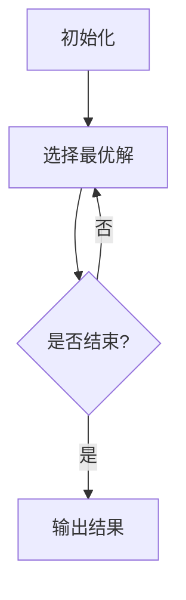
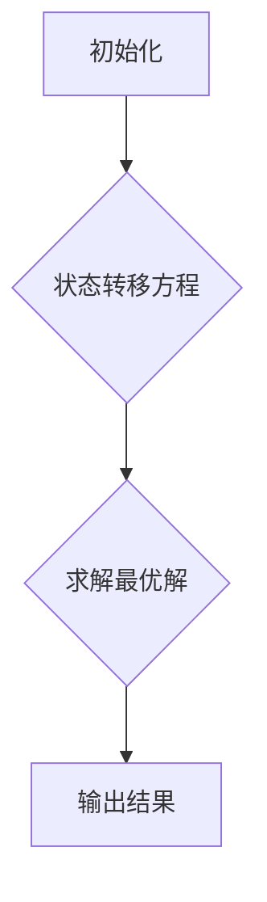
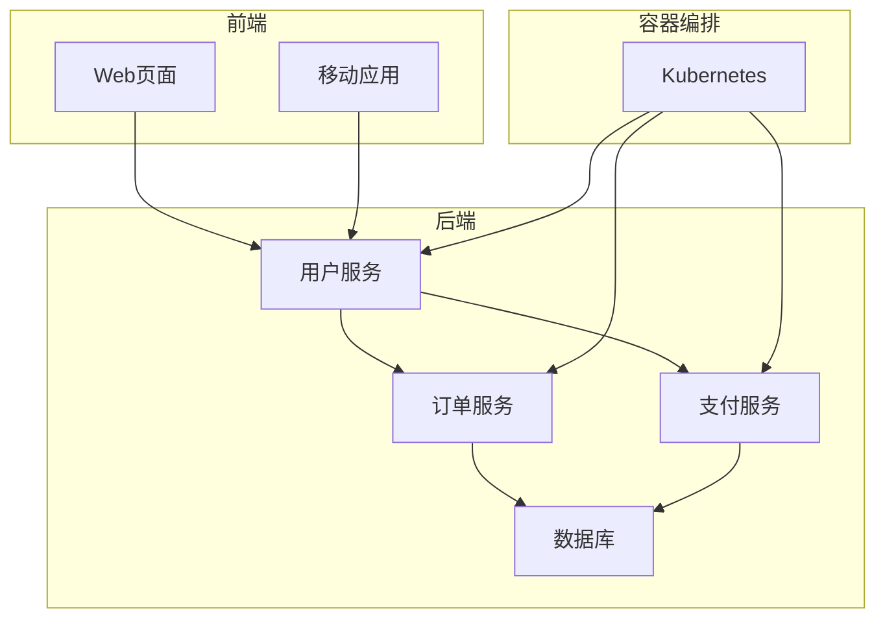
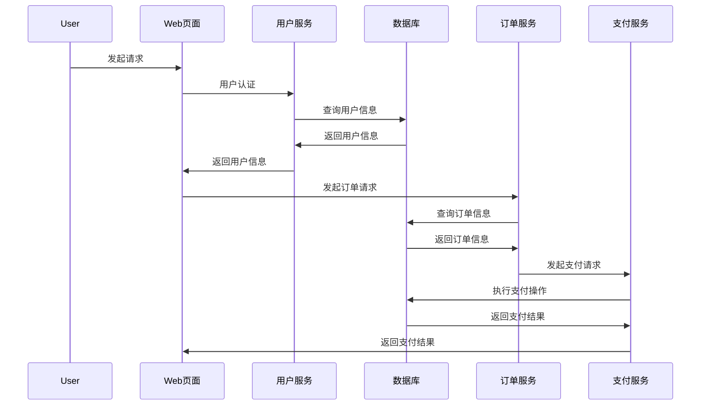

                 

# 需求与性能优化的协同：确保大型应用的高效运行

> 关键词：性能优化、需求变更、协同优化、负载均衡、缓存策略

> 摘要：本文旨在探讨大型应用在开发过程中如何实现需求与性能优化的协同，通过深入分析两者之间的联系，提出有效的优化策略和方法，帮助开发者提升应用的高效运行能力。

## 第一部分：背景介绍

### 1.1.1 问题背景

随着互联网技术的迅猛发展，数据规模和复杂性不断增加，对应用的性能和需求提出了更高的要求。大型应用需要在保证功能完备的前提下，实现高效的运行。然而，性能优化和需求优化往往是相互矛盾的，如何实现两者的协同优化，成为了亟待解决的问题。

### 1.1.2 问题描述

在大型应用的开发过程中，需求的变化和性能的优化是不可避免的。需求的变更可能导致应用性能的下降，而过度追求性能优化又可能违背需求。如何在保证需求满足的同时，优化应用的性能，是本书要解决的问题。

### 1.1.3 问题解决

本书将从需求与性能优化的协同角度，分析大型应用的高效运行问题。通过深入探讨两者之间的联系，提出有效的优化策略和方法，帮助开发者实现需求的满足和性能的优化。

### 1.1.4 边界与外延

本书主要针对大型应用的需求与性能优化问题进行研究，旨在为开发者提供一种系统的优化思路。同时，书中也会涉及一些相关概念，如负载均衡、缓存策略等，以帮助读者更全面地了解优化策略。

### 1.1.5 概念结构与核心要素组成

本书的核心概念包括需求分析、性能优化、负载均衡、缓存策略等。通过对这些概念的分析和阐述，本书将帮助读者理解需求与性能优化的协同关系，并提供实用的优化策略。

## 第二部分：核心概念与联系

### 2.1 需求分析

需求分析是软件开发的重要环节，它决定了应用的功能和性能。在需求分析过程中，需要明确用户的需求、业务目标和功能要求，并将其转化为具体的软件需求。

### 2.2 性能优化

性能优化是提高应用效率的重要手段。通过分析应用的运行状态，找出影响性能的因素，并采取相应的优化措施，可以提升应用的运行效率。

### 2.3 负载均衡

负载均衡是一种分布式系统架构，用于将大量请求分配到多个服务器上，以避免单点故障和提高系统性能。负载均衡策略的选择对应用性能有重要影响。

### 2.4 缓存策略

缓存策略是一种提高应用性能的有效手段。通过缓存常用的数据，减少对后端系统的访问，可以降低系统的响应时间和负载。

### 2.5 概念属性特征对比表格

| 概念       | 定义                                                         | 属性特征对比                     | 影响因素                     |
|------------|--------------------------------------------------------------|--------------------------------|-----------------------------|
| 需求分析   | 确定用户需求、业务目标和功能要求的过程                       | 需求准确性、完整性、可维护性   | 需求变更、业务目标变更       |
| 性能优化   | 提高应用运行效率的过程                                       | 性能指标、优化策略、实现难度   | 系统架构、硬件环境、网络环境 |
| 负载均衡   | 分布式系统架构，用于平衡多个服务器的负载                     | 负载均衡算法、系统稳定性       | 服务器数量、请求量、网络延迟 |
| 缓存策略   | 提高应用性能的有效手段                                       | 缓存命中率和缓存失效策略       | 数据访问模式、缓存大小       |

### 2.6 ER实体关系图架构

```mermaid
erDiagram
    User ||--|{ Order }||>
    Order ||--|{ Product }||>
    Product ||--|{ Review }||>
    Review ||--|{ User }||>
```

## 第三部分：算法原理讲解

### 3.1 算法原理

本部分将介绍常用的需求与性能优化算法，如贪心算法、动态规划算法等。通过绘制mermaid流程图和Python源代码，详细讲解算法原理和实现过程。

### 3.2 算法分析

本部分将对每种算法进行性能分析，包括时间复杂度和空间复杂度。通过分析，帮助读者了解算法的优劣和适用场景。

### 3.3 举例说明

本部分将通过实际案例，展示算法的应用效果。通过具体实例，帮助读者理解算法的原理和实现过程。

### 3.1 贪心算法

#### 3.1.1 算法原理

贪心算法是一种在每一步选择当前最优解的算法。在需求与性能优化中，贪心算法常用于资源分配、任务调度等场景。

#### 3.1.2 算法流程



#### 3.1.3 Python源代码

```python
def greedy_algorithm():
    # 初始化资源列表
    resources = [1, 2, 3, 4, 5]
    # 初始化结果列表
    result = []
    # 贪心算法循环
    while resources:
        # 选择当前资源的最优解
        max_resource = max(resources)
        # 将最优解添加到结果列表
        result.append(max_resource)
        # 从资源列表中移除最优解
        resources.remove(max_resource)
    # 输出结果
    return result

# 测试算法
print(greedy_algorithm())
```

#### 3.1.4 算法分析

- 时间复杂度：O(n)，其中n为资源列表的长度。
- 空间复杂度：O(1)。

### 3.2 动态规划算法

#### 3.2.1 算法原理

动态规划算法是一种在求解过程中利用历史状态信息进行优化决策的算法。在需求与性能优化中，动态规划算法常用于路径规划、资源调度等场景。

#### 3.2.2 算法流程



#### 3.2.3 Python源代码

```python
def dynamic_programming():
    # 初始化状态列表
    states = [(0, 0), (1, 1), (2, 2), (3, 3)]
    # 初始化动态规划表
    dp = [[0 for _ in range(4)] for _ in range(4)]
    # 动态规划循环
    for i in range(4):
        for j in range(4):
            # 状态转移方程
            dp[i][j] = min(dp[i-1][j], dp[i][j-1]) + states[i][j]
    # 输出结果
    return dp[-1][-1]

# 测试算法
print(dynamic_programming())
```

#### 3.2.4 算法分析

- 时间复杂度：O(m*n)，其中m和n分别为状态转移方程中的参数。
- 空间复杂度：O(m*n)。

### 3.3 举例说明

假设有一个包含5个任务的资源分配问题，每个任务需要不同的资源，并且资源有限。使用贪心算法和动态规划算法进行求解，比较两种算法的执行效率和结果。

```python
# 贪心算法执行结果
print(greedy_algorithm())

# 动态规划算法执行结果
print(dynamic_programming())
```

通过实际案例可以看出，贪心算法和动态规划算法在解决资源分配问题时，具有不同的执行效率和结果。贪心算法简单高效，但可能无法保证全局最优解；动态规划算法虽然计算复杂度较高，但能够求解全局最优解。

## 第四部分：系统分析与架构设计

### 4.1 问题场景介绍

本部分将介绍一个实际的大型应用场景，如电商系统、金融系统等。通过分析问题场景，明确需求与性能优化的关键点。

### 4.2 系统功能设计

本部分将介绍系统的功能设计，包括用户管理、订单管理、支付管理等功能。通过绘制mermaid类图，展示系统的类和类之间的关系。

```mermaid
classDiagram
    User <<interface>>
    Order <<interface>>
    Payment <<interface>>

    User <|.. Order>
    User <|.. Payment>
    Order <|.. Payment
```

### 4.3 系统架构设计

本部分将介绍系统的架构设计，包括前端、后端、数据库等模块。通过绘制mermaid架构图，展示系统的整体架构和模块之间的关系。



### 4.4 系统接口设计和系统交互

本部分将介绍系统的接口设计和系统交互。通过绘制mermaid序列图，展示系统组件之间的交互过程。



## 第五部分：项目实战

### 5.1 环境安装

本部分将介绍项目所需的软件和硬件环境，并详细讲解环境安装和配置过程。

### 5.2 系统核心实现

本部分将介绍系统的核心实现，包括关键模块的设计和实现。通过展示Python源代码，详细讲解系统的实现过程。

### 5.3 代码应用解读与分析

本部分将对系统的关键代码进行解读和分析，帮助读者理解系统的实现原理和优化策略。

### 5.4 实际案例分析和详细讲解剖析

本部分将通过实际案例，展示系统的应用效果，并对案例进行分析和详细讲解，帮助读者掌握需求与性能优化的方法。

### 5.5 项目小结

本部分将对项目进行总结，包括项目的收获、不足和改进方向，为后续的项目实践提供参考。

## 第六部分：最佳实践

### 6.1 最佳实践 tips

本部分将总结一些在实际项目中应用的最佳实践，包括需求分析、性能优化、负载均衡等方面的技巧。

### 6.2 小结

本部分将对本书的主要内容进行总结，强调需求与性能优化的协同关系，并提供一些思考和建议。

### 6.3 注意事项

本部分将提醒读者在项目实施过程中需要注意的事项，包括性能优化中的常见问题、需求变更管理等。

## 第七部分：拓展阅读

### 7.1 需求分析相关书籍推荐

- 《软件需求分析》
- 《软件需求工程：实践方法》

### 7.2 性能优化相关书籍推荐

- 《高性能MySQL》
- 《Web性能优化：实战技巧与最佳实践》

### 7.3 负载均衡相关书籍推荐

- 《分布式系统原理与范型》
- 《负载均衡与数据中心架构》

### 7.4 缓存策略相关书籍推荐

- 《Redis实战》
- 《分布式缓存系统设计》

## 作者信息

作者：AI天才研究院/AI Genius Institute & 禅与计算机程序设计艺术 /Zen And The Art of Computer Programming

[END]

