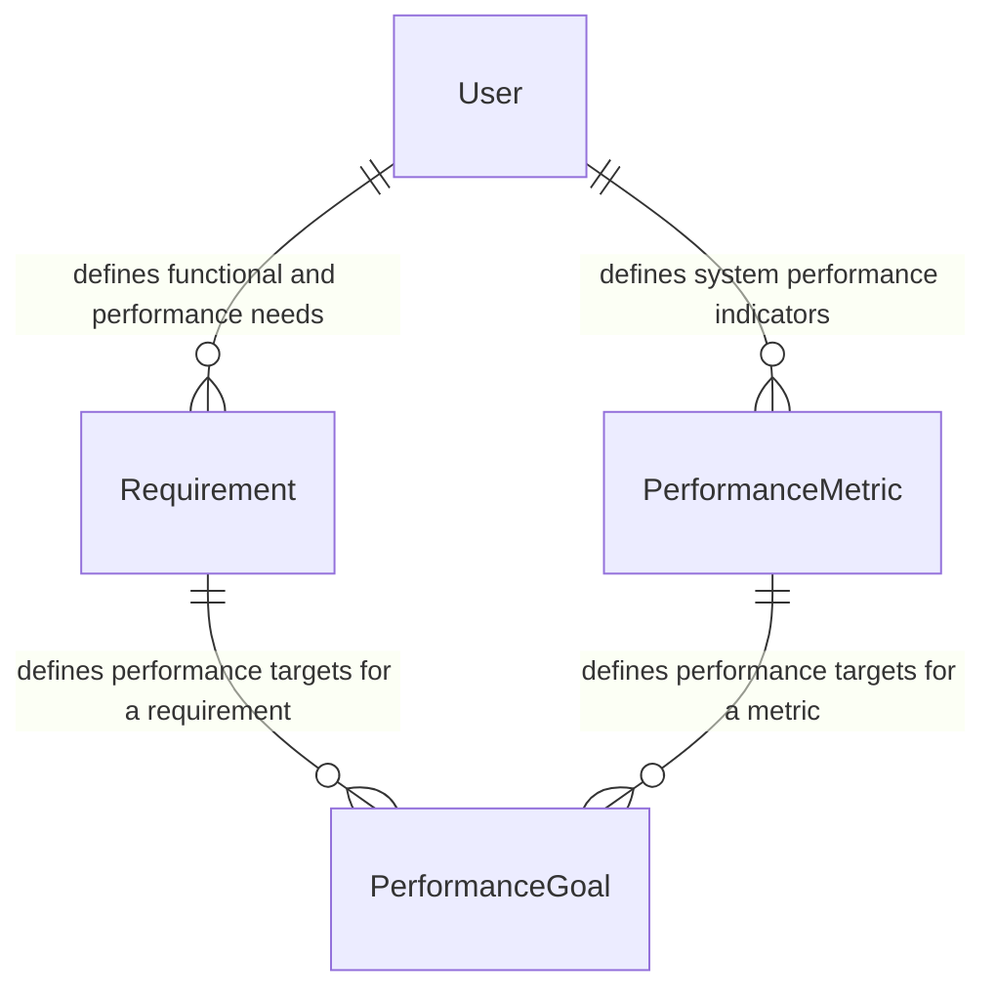

                 

### 第1章: 书籍概述

#### 1.1 书籍目的与重要性

在当今数字化时代，大型应用开发已经成为许多企业战略发展的关键。然而，如何平衡复杂多变的需求和日益增长的性能要求，成为软件开发过程中的一大挑战。本书旨在探讨需求与性能指标的协调之道，帮助开发团队在面对复杂应用开发时，找到一条平衡之路。

我们的目标是：

- 系统性地介绍大型应用开发中需求与性能协调的核心概念。
- 深入分析需求与性能之间的内在联系，以及如何通过合理的策略实现二者的协调。
- 提供实用的案例和最佳实践，帮助读者在实际项目中应用这些原理。
- 探讨当前面临的挑战和未来的发展方向，为读者提供持续学习和提升的方向。

#### 1.2 书籍结构

本书分为三大部分，共八个章节：

- **第一部分：引言**  
  - **第1章：书籍概述**：介绍书籍的目的、重要性和结构。

- **第二部分：背景知识**  
  - **第2章：大型应用开发中的需求与性能**：介绍需求分析和性能指标的基本概念。
  - **第3章：核心概念与背景**：探讨软件工程基本原理和大型应用开发的挑战。

- **第三部分：原理与方法**  
  - **第4章：需求与性能协调的原理**：解释平衡需求与性能的基本原则和方法。
  - **第5章：案例分析**：通过实际案例展示如何实现需求与性能的协调。
  - **第6章：最佳实践与技巧**：提供有效的策略和技巧，帮助开发团队管理需求与性能。
  - **第7章：挑战与未来方向**：讨论当前面临的挑战和未来的发展方向。
  - **第8章：结论**：总结全文，强调需求与性能协调的重要性。

#### 1.3 读者对象

本书适合以下读者：

- 大型应用开发的项目经理和架构师。
- 软件工程师和技术专家。
- 对软件性能优化感兴趣的研究生和学者。
- 任何希望提升大型应用开发效率和质量的开发者。

通过阅读本书，读者将：

- 掌握需求与性能协调的基本原理和方法。
- 学会分析复杂应用需求，制定合理的性能目标。
- 获得大量实用案例和最佳实践，提高项目成功率。
- 了解当前挑战和未来发展趋势，为职业发展做好准备。

### 摘要

本书围绕需求与性能指标的协调，系统性地探讨大型应用开发中的核心问题。通过深入分析需求与性能之间的关系，本书提出了实现二者的平衡原则和方法，并通过实际案例展示了这些方法的应用。同时，本书也探讨了当前面临的挑战和未来的发展方向，为读者提供了全面的知识体系和实践指南。掌握本书的内容，将为读者在大型应用开发中提供强有力的支持和指导。### 第2章：大型应用开发中的需求与性能

在大型应用开发中，需求与性能是两个不可或缺的维度。正确理解和处理这两者之间的关系，对于确保项目的成功至关重要。本章将详细介绍需求分析和性能指标的基本概念，并探讨需求与性能之间的内在联系。

#### 2.1 需求分析

需求分析是软件开发过程中至关重要的一步。它涉及识别和理解用户需求，将用户需求转化为具体的软件功能。需求分析通常包括以下几个步骤：

1. **需求收集**：通过与用户、利益相关者进行访谈、调查和观察，收集用户的需求和期望。
2. **需求分类**：将收集到的需求进行分类，区分功能需求、性能需求、安全需求等。
3. **需求建模**：使用需求建模工具和技术（如UML用例图、需求文档等），将需求转化为可视化的模型。
4. **需求验证**：通过评审和验证需求文档，确保需求的完整性和可行性。

需求分析的目的是确保软件系统能够满足用户的实际需求，同时为后续的设计和开发提供明确的方向。

#### 2.2 性能指标

性能指标是衡量软件系统性能的重要标准。它们通常包括以下几个方面：

1. **响应时间**：系统对用户请求的响应时间，是衡量系统反应速度的重要指标。
2. **吞吐量**：系统在一定时间内处理请求的数量，反映了系统的处理能力。
3. **并发性**：系统同时处理多个请求的能力，是衡量系统负载承受能力的指标。
4. **稳定性**：系统在长时间运行过程中，保持性能不下降的能力。
5. **可用性**：系统在出现故障时，能够快速恢复并继续运行的能力。

性能指标的选择和设定需要根据具体的应用场景和业务需求来确定。

#### 2.3 需求与性能的关系

需求与性能之间的关系是复杂而微妙的。它们之间的协调需要考虑到以下几个方面：

1. **平衡需求与性能**：在满足用户需求的同时，保证系统性能。例如，在增加功能的同时，不应牺牲系统的响应时间或吞吐量。
2. **优先级排序**：确定哪些需求和性能指标是关键，并按照优先级进行排序。通常，关键功能和性能指标应该得到优先关注。
3. **约束条件**：需求和性能之间可能存在约束条件，例如资源限制、预算限制等。这些约束条件需要在需求分析和性能评估过程中加以考虑。
4. **动态调整**：需求和分析性能指标并非一成不变。在项目开发过程中，应根据实际情况进行动态调整，确保需求和性能能够持续协调。

通过上述分析，我们可以看出，需求与性能之间的关系是相辅相成的。只有在正确理解和处理这两者之间的关系，才能确保大型应用开发项目的成功。

### 核心概念与联系

#### 2.3.1 核心概念原理

在大型应用开发中，需求与性能的平衡是至关重要的。以下是需求与性能协调的核心概念原理：

1. **需求优先级**：确定哪些需求对性能有直接影响，并优先考虑这些需求。例如，用户体验需求（如响应时间）通常比后台数据处理需求（如数据存储）更重要。
2. **性能指标**：设定合理的性能指标，以确保系统在满足需求的同时，保持良好的性能。这些指标应包括响应时间、吞吐量、并发性等。
3. **资源分配**：根据需求和性能指标，合理分配系统资源，如CPU、内存、网络带宽等。资源的优化分配有助于提高系统性能。
4. **性能测试**：在开发过程中进行性能测试，识别系统性能瓶颈，并采取相应的优化措施。
5. **反馈循环**：建立需求与性能的反馈循环，通过用户反馈和性能监控，不断调整需求和性能指标，实现持续优化。

#### 2.3.2 概念属性特征对比表格

| 概念       | 属性特征                                                       | 对比分析                                                       |
|------------|--------------------------------------------------------------|----------------------------------------------------------------|
| 需求       | 功能性需求、性能需求、安全需求等                                 | 功能性需求关注系统的功能实现，性能需求关注系统的性能表现，安全需求关注系统的安全性 |
| 性能指标   | 响应时间、吞吐量、并发性、稳定性、可用性等                       | 这些指标反映了系统的性能表现，是评估系统性能的重要标准           |
| 资源分配   | CPU、内存、网络带宽等                                         | 合理的资源分配有助于提高系统性能，满足需求                       |
| 性能测试   | 识别系统性能瓶颈，进行优化                                     | 性能测试是评估系统性能的关键步骤，有助于发现和解决问题           |
| 反馈循环   | 通过用户反馈和性能监控，不断调整需求和性能指标                   | 反馈循环是实现需求与性能持续协调的重要机制                     |

#### 2.3.3 ER实体关系图架构

该ER图展示了用户、需求、性能指标和性能目标之间的关系。用户定义需求，需求定义性能目标，性能指标定义性能目标，这些实体之间的关系构成了需求与性能协调的基础框架。

通过上述分析，我们可以看到需求与性能之间的紧密联系。只有深入理解这些核心概念，才能在实际项目中有效地平衡需求与性能，确保大型应用开发的成功。### 第3章：核心概念与背景

#### 3.1 软件工程基本原理

软件工程是一门研究如何设计、开发、维护和评价软件系统的学科。它包含了一系列的基本原理和方法，为软件开发提供了科学的指导。以下是软件工程中的一些核心原理：

1. **需求工程**：需求工程是软件工程的基础，它关注如何准确地识别、分析和建模用户需求。需求工程的目的是确保软件开发团队能够理解并满足用户的需求，从而开发出用户满意的产品。
2. **软件设计**：软件设计是软件开发过程中的关键步骤，它将需求转化为具体的软件架构和设计。设计阶段的目标是创建一个满足需求、结构合理、易于维护和扩展的软件系统。
3. **编程与实现**：编程是将设计阶段产生的设计文档转化为实际的代码。编程阶段要求开发者具备良好的编程技巧和经验，以确保代码的质量和效率。
4. **测试与验证**：测试是确保软件质量的重要手段。通过不同类型的测试（如单元测试、集成测试、系统测试等），可以检测软件中的错误和缺陷，从而保证软件的可靠性。
5. **维护与更新**：软件维护是软件生命周期中的重要环节。维护包括修复错误、优化性能、增加新功能等，以适应不断变化的需求和环境。
6. **项目管理**：项目管理是确保软件开发项目按时、按预算、按质量完成的关键。项目管理涉及到资源分配、进度控制、风险管理等方面。

#### 3.2 大型应用开发的挑战

大型应用开发面临着诸多挑战，以下是其中的一些主要挑战：

1. **复杂性**：大型应用通常包含大量功能模块和复杂的业务逻辑，这使得软件开发过程更加复杂。开发者需要深入了解系统的各个方面，确保各个模块之间的协调和一致性。
2. **性能要求**：大型应用通常需要处理大量数据和并发请求，这对系统的性能提出了很高的要求。开发者需要设计高效的算法和数据结构，确保系统在高负载下依然能够稳定运行。
3. **需求变更**：大型应用开发过程中，需求往往会发生变更。这些变更可能来自用户、市场或技术方面的变化。开发者需要具备快速适应变更的能力，以保持项目的顺利进行。
4. **团队协作**：大型应用开发通常需要多个开发团队的合作。团队间的沟通和协作是实现项目成功的关键。开发者需要掌握有效的沟通技巧和团队协作工具，以确保团队协作的高效性。
5. **风险控制**：大型应用开发过程中，风险控制至关重要。开发者需要识别潜在的风险，并采取相应的措施进行规避或减轻风险的影响。

#### 3.3 需求与性能协调的理论基础

需求与性能协调的理论基础主要来源于软件工程的原理和方法，以及计算机科学的相关理论。以下是需求与性能协调的一些理论基础：

1. **软件质量模型**：软件质量模型为评价软件质量提供了理论框架。例如，ISO/IEC 25010质量模型将软件质量划分为功能性、可靠性、易用性、效率、可维护性和可移植性六个方面。性能是软件质量的一个重要方面，与需求紧密相关。
2. **需求工程方法**：需求工程方法提供了一系列的工具和技术，用于识别、分析和建模用户需求。这些方法包括需求收集、需求建模、需求验证等。通过合理的需求工程方法，可以确保需求的准确性和完整性，从而为性能指标的设定提供依据。
3. **性能工程方法**：性能工程方法关注如何设计、开发和优化软件系统的性能。性能工程包括性能建模、性能分析和性能优化等步骤。通过性能工程方法，可以确保系统在满足需求的同时，保持良好的性能表现。
4. **平衡理论**：平衡理论是需求与性能协调的核心。平衡理论指出，在软件开发过程中，需求和性能之间存在一种动态平衡关系。通过合理的需求管理和性能优化，可以实现需求和性能的协调，确保软件系统的成功。

通过上述分析，我们可以看到需求与性能协调在软件工程中的重要性和理论基础。在实际应用中，开发者需要结合这些原理和方法，找到适合自己项目的需求和性能协调策略，以实现项目的成功。### 第4章：需求与性能协调的原理

#### 4.1 原则概述

在大型应用开发中，需求与性能的协调是一个复杂但关键的过程。这一章节将详细介绍需求与性能协调的基本原则和方法。通过理解这些原则，开发团队能够在满足用户需求的同时，确保系统性能的稳定和高效。

#### 4.2 设定明确的目标

设定明确的目标是需求与性能协调的第一步。这些目标应该包括功能性和性能方面的要求。以下是设定目标时需要考虑的关键点：

1. **明确性**：目标应当具体、明确，避免模糊和宽泛的描述。例如，“提高系统响应速度”不如“将系统平均响应时间缩短到500毫秒”具体。
2. **可行性**：目标应该基于当前的技术能力和资源条件，避免设定过高的目标。例如，如果系统设计基于旧的技术框架，那么期望通过简单的优化实现大幅性能提升可能并不现实。
3. **可测量性**：目标需要具备可量化、可测量的标准，以便在实施过程中进行监控和评估。例如，性能目标可以是“系统在高并发情况下，每秒处理请求不少于1000次”。

#### 4.3 优先级排序

在设定目标后，需要对需求和性能目标进行优先级排序。以下是一些排序原则：

1. **关键性**：确定哪些需求和性能目标是项目成功的关键因素。通常，关键性高的需求和性能目标应优先考虑。
2. **紧迫性**：考虑哪些需求和性能目标需要优先实现。例如，某些功能或性能问题可能对用户体验有直接影响，需要优先解决。
3. **依赖性**：分析需求和性能目标之间的依赖关系。例如，某些性能目标可能依赖于特定的功能性需求实现，需要综合考虑。

#### 4.4 资源分配

合理分配资源是需求与性能协调的重要一环。以下是一些资源分配的原则：

1. **均衡性**：确保资源分配均衡，避免某些关键资源过度使用。例如，在CPU、内存和网络资源之间进行合理分配，避免某一方面资源过度占用。
2. **弹性**：考虑系统在负载变化时的资源需求，确保系统能够动态调整资源使用。例如，使用负载均衡技术，根据需求动态分配计算资源。
3. **优先级**：根据需求和性能目标的优先级分配资源。例如，为关键需求和性能目标分配更多的资源，以确保优先实现。

#### 4.5 性能测试与优化

性能测试与优化是确保系统性能的关键步骤。以下是一些性能测试与优化的原则：

1. **全面性**：进行全面的性能测试，覆盖系统在不同负载情况下的表现。例如，测试高并发、大数据量、高频率请求等场景。
2. **针对性**：针对性能瓶颈进行优化。例如，通过分析日志和监控数据，识别出系统中的性能瓶颈，并针对性地进行优化。
3. **持续改进**：性能优化不是一次性的工作，而是一个持续的过程。通过定期进行性能测试和优化，不断提升系统性能。

#### 4.6 沟通与协作

沟通与协作是需求与性能协调过程中不可或缺的一环。以下是一些沟通与协作的原则：

1. **透明性**：保持团队沟通的透明性，确保所有团队成员都能够了解需求和性能目标的进展情况。
2. **及时性**：及时解决需求和性能协调过程中出现的问题，避免问题积累和扩大。
3. **多样性**：鼓励团队成员之间的多样性和不同观点的交流，以促进创新和改进。

#### 4.7 案例分析

为了更好地理解需求与性能协调的原理，以下是一个案例分析：

**案例背景**：一家电商公司计划开发一个全新的购物平台，以应对即将到来的购物旺季。需求包括用户注册、商品浏览、购物车管理、订单处理等基本功能。性能要求是系统能够在高并发情况下保持良好的响应速度和稳定性。

**需求与性能目标**：
- 功能需求：用户注册功能需要在5秒内完成，商品浏览功能需要在2秒内返回结果。
- 性能需求：系统能够支持每秒处理1000个用户请求，同时在高峰期保持响应时间不超过1秒。

**实现步骤**：
1. **设定明确的目标**：根据业务需求，设定功能性和性能目标。
2. **优先级排序**：将用户注册和商品浏览功能列为最高优先级，因为它们直接影响用户体验。
3. **资源分配**：根据性能要求，合理分配服务器资源，确保在高并发情况下系统能够稳定运行。
4. **性能测试与优化**：进行全面的性能测试，识别出瓶颈，如数据库查询速度慢，进行优化。例如，通过索引优化、缓存策略等提高查询效率。
5. **沟通与协作**：团队成员定期开会，讨论需求和性能的协调情况，确保所有团队成员对项目的进度和目标有清晰的认识。

通过上述步骤，电商公司成功开发并上线了新的购物平台，在购物旺季期间，系统能够稳定运行，满足用户需求，实现了良好的性能表现。

通过这个案例，我们可以看到需求与性能协调在实际项目中的应用。只有通过明确的目标、合理的资源分配、有效的性能测试和持续的沟通与协作，才能实现需求和性能的平衡，确保大型应用开发的成功。

### 第5章：案例分析

在大型应用开发中，实现需求和性能的协调是一个复杂且具有挑战性的过程。通过实际案例的剖析，我们可以更深入地理解如何在实际项目中应用需求与性能协调的原理和方法。以下我们将讨论两个具体的案例：一个在线教育平台和一家电子商务网站。

#### 案例一：在线教育平台

**背景**：一家在线教育公司计划开发一个全新的在线学习平台，以满足日益增长的用户需求。平台的主要功能包括课程浏览、在线学习、作业提交、成绩查询等。性能要求是平台需要能够支持大量并发用户，同时保持低延迟和高吞吐量。

**需求与性能目标**：
- 功能需求：确保用户在1秒内能够浏览到课程内容，作业提交和成绩查询操作需要在2秒内完成。
- 性能需求：系统需要在高并发情况下，每秒处理不少于1000个用户请求，同时保持平均响应时间不超过500毫秒。

**实现步骤**：
1. **需求分析**：通过用户访谈和市场调研，明确用户的核心需求和期望。结合业务目标，确定平台的功能模块和性能指标。
2. **需求与性能目标设定**：基于需求分析结果，设定明确的功能和性能目标。这些目标需要具体、可衡量，并与业务目标紧密相关。
3. **架构设计**：采用微服务架构，将不同的功能模块独立部署和扩展。这样可以提高系统的可扩展性和容错能力。
4. **资源分配**：根据性能需求，合理分配计算资源、存储资源和网络资源。例如，使用负载均衡器来分配用户请求，使用缓存来减少数据库的查询压力。
5. **性能测试与优化**：进行多轮性能测试，识别系统中的瓶颈和性能问题。例如，通过压力测试和负载测试，发现数据库查询速度慢的问题，采用索引优化和分库分表策略进行优化。
6. **持续监控与改进**：通过实时监控和日志分析，持续跟踪系统性能，发现潜在的性能问题并及时进行优化。

**案例分析**：
在线教育平台在开发过程中，通过明确的需求分析与性能目标设定，采用了微服务架构和合理资源分配策略，有效提升了系统的性能和稳定性。在性能测试中，团队识别并解决了多个性能瓶颈，如数据库查询慢和缓存失效问题。通过持续监控和改进，平台在上线后能够稳定运行，满足了大量用户的需求。

#### 案例二：电子商务网站

**背景**：一家大型电子商务网站计划进行系统升级，以应对即将到来的购物旺季。升级的主要目标是提升系统的响应速度和并发处理能力，同时确保用户体验的一致性和可靠性。

**需求与性能目标**：
- 功能需求：确保用户在3秒内能够完成商品浏览、购物车添加和结账等操作。
- 性能需求：系统需要在高峰期每秒处理不少于2000个用户请求，平均响应时间不超过1秒。

**实现步骤**：
1. **需求分析**：分析用户行为数据和市场趋势，明确用户对购物体验的期望和系统的性能需求。
2. **性能评估**：通过对现有系统的性能评估，识别出需要优化的关键性能指标和瓶颈。
3. **架构优化**：采用分布式缓存技术，减少数据库的压力。例如，使用Redis缓存热门商品信息，减少数据库查询次数。
4. **代码优化**：对关键代码进行性能优化，如减少不必要的数据库查询、使用更高效的算法和数据结构。
5. **负载均衡**：采用负载均衡技术，将用户请求均衡分配到不同的服务器上，提高系统的处理能力和稳定性。
6. **压力测试与优化**：进行大规模的压力测试，模拟高峰期的用户负载，识别并解决潜在的性能问题。例如，通过分析测试结果，发现某些接口的处理时间较长，通过优化代码和调整服务器配置进行改进。

**案例分析**：
电子商务网站通过详细的需求分析和性能评估，采取了一系列优化措施，如架构优化、代码优化和负载均衡等，成功提升了系统的性能和稳定性。在购物旺季期间，系统能够稳定运行，满足了大量用户的访问需求，用户体验得到了显著提升。

**总结**：
通过这两个案例分析，我们可以看到需求与性能协调在实际项目中的应用。在线教育平台通过微服务架构和合理资源分配，成功提升了系统的性能和稳定性。电子商务网站则通过代码优化、负载均衡和压力测试，实现了性能的提升。这些案例表明，只有通过深入的需求分析和合理的性能优化策略，才能在大型应用开发中实现需求和性能的协调，确保项目的成功。

### 第6章：最佳实践与技巧

在大型应用开发中，为了有效地管理需求与性能，开发团队可以借鉴以下最佳实践与技巧：

#### 6.1 优先级管理

1. **明确优先级**：在项目开始时，明确哪些需求和性能目标是关键，并制定相应的优先级。这将有助于团队集中精力解决最重要的问题。

2. **动态调整**：需求和市场状况可能会发生变化，因此需要定期评估并调整优先级。确保优先级与当前的业务目标和用户需求保持一致。

#### 6.2 性能建模与预测

1. **性能建模**：在项目早期，通过性能建模预测系统的行为。这可以帮助团队理解系统的性能瓶颈，并提前采取优化措施。

2. **预测分析**：利用历史数据和市场趋势，预测未来的性能需求。这将有助于团队为未来可能的负载峰值做好准备。

#### 6.3 自动化测试

1. **持续集成**：采用持续集成（CI）工具，自动执行单元测试、集成测试和性能测试。这有助于及时发现性能问题，并确保代码质量。

2. **自动化测试框架**：开发自动化测试脚本，模拟用户行为和系统负载，确保在开发过程中及时发现和修复性能问题。

#### 6.4 资源优化

1. **负载均衡**：使用负载均衡器将请求分配到多个服务器上，确保系统在高并发情况下保持性能。

2. **缓存策略**：利用缓存减少数据库查询次数，提高系统的响应速度。例如，使用Redis缓存热门数据。

#### 6.5 持续监控

1. **性能监控工具**：使用性能监控工具（如Prometheus、Grafana等）实时监控系统的性能指标，及时发现和解决问题。

2. **日志分析**：定期分析系统日志，识别潜在的性能问题和异常行为，采取相应的优化措施。

#### 6.6 沟通与协作

1. **跨部门沟通**：确保开发、测试、运维等不同团队之间保持密切沟通，共同关注需求和性能的协调。

2. **定期会议**：定期召开项目进度会议，讨论需求和性能的进展情况，及时解决冲突和问题。

#### 6.7 案例研究

1. **案例分析**：对成功和失败的项目进行案例分析，总结经验和教训，为后续项目提供参考。

2. **知识分享**：鼓励团队成员分享知识和经验，提高整个团队的需求与性能管理能力。

通过这些最佳实践与技巧，开发团队能够更好地管理需求与性能，确保大型应用开发项目的成功。### 第7章：挑战与未来方向

在大型应用开发中，需求和性能的协调面临着一系列挑战。这些挑战不仅影响了项目的进展和质量，也决定了最终产品的市场竞争力。以下将讨论当前面临的挑战，并探讨未来的发展方向。

#### 挑战

1. **需求的不确定性**：随着市场竞争的加剧，用户需求变化迅速。需求的不确定性给项目带来了很大的挑战，特别是在大型应用开发中，如何准确预测和适应这些变化是一个关键问题。

2. **性能需求的多样性**：不同应用场景对性能的需求各不相同，如在线交易、视频直播、数据分析等。如何针对不同场景优化性能，保证系统能够灵活应对各种需求，是开发团队面临的一大挑战。

3. **资源限制**：在大型应用开发中，资源（如计算能力、存储空间、网络带宽等）通常是有限的。如何在资源有限的情况下，最大化地提高性能，同时满足需求，是一个复杂的问题。

4. **复杂的技术架构**：现代大型应用通常采用分布式、微服务架构，这使得系统的复杂度大幅增加。如何在复杂架构中找到性能瓶颈，进行有效的优化，是一个技术难题。

5. **持续迭代与更新**：大型应用开发是一个持续迭代和更新的过程。如何在不断变化的需求和性能要求下，保持系统的稳定性和高效性，是一个持续性的挑战。

#### 未来方向

1. **人工智能与机器学习的应用**：随着人工智能和机器学习技术的发展，未来可以通过这些技术自动化性能优化。例如，利用机器学习算法预测性能瓶颈，自动调整系统配置，提高性能。

2. **云原生与容器化**：云原生和容器化技术为大型应用提供了更高的可扩展性和灵活性。未来，更多的大型应用将采用这些技术，以实现高效的需求与性能协调。

3. **服务网格技术**：服务网格（Service Mesh）为分布式系统提供了服务发现、负载均衡、故障处理等功能。通过服务网格，可以更好地管理和优化服务之间的交互，提高系统性能。

4. **自适应性能优化**：未来，大型应用将更多地采用自适应性能优化策略。这些策略可以根据实时性能数据，自动调整系统配置和资源分配，确保系统始终处于最佳性能状态。

5. **边缘计算**：随着5G和物联网的发展，边缘计算将在大型应用开发中发挥重要作用。通过将计算和存储任务下放到边缘节点，可以显著提高系统的响应速度和处理能力。

总之，需求和性能协调在大型应用开发中至关重要。面对当前的挑战，通过技术创新和最佳实践，开发团队可以找到有效的解决方案。未来，随着新技术的发展，需求和性能协调的方法将更加智能化和自动化，为大型应用开发带来更多的可能性。### 第8章：结论

在大型应用开发中，需求与性能指标的协调至关重要。通过深入理解需求与性能之间的关系，并运用适当的方法和策略，开发团队能够实现二者的平衡，确保软件系统的成功。

本书从引言开始，系统性地探讨了需求与性能协调的核心概念、原理和方法。通过案例分析，展示了这些原理在实际项目中的应用效果。此外，本书还提供了最佳实践和技巧，帮助开发团队在实际工作中更好地管理需求和性能。

以下是本书的核心观点的总结：

1. **明确目标和优先级**：设定明确的功能和性能目标，并根据优先级排序，确保关键需求和性能目标得到优先处理。
2. **资源优化**：合理分配和优化系统资源，如计算、存储和网络资源，以提高系统性能。
3. **持续监控与改进**：通过持续监控和性能测试，发现并解决系统性能问题，确保系统在运行过程中保持高效。
4. **沟通与协作**：建立有效的沟通和协作机制，确保团队成员对需求和性能目标的了解和共识。

掌握这些观点和方法，将为开发团队在大型应用开发中提供宝贵的指导。然而，需求和性能协调是一个持续的过程，需要不断学习和适应新技术和方法。

展望未来，人工智能和机器学习的应用、云原生和容器化技术、服务网格以及边缘计算等新技术，将为需求和性能协调带来新的机遇和挑战。开发团队需要持续关注这些技术的发展，并积极探索和应用，以不断提升系统的性能和灵活性。

最后，本书旨在为读者提供一条清晰的需求与性能协调之路，帮助开发团队在复杂的应用开发环境中找到平衡之道。通过持续学习和实践，相信读者能够在大型应用开发中取得更大的成功。### 附录：相关资源

为了帮助读者深入了解需求与性能协调的理论和实践，本书附录提供了以下相关资源：

1. **书籍推荐**：
   - 《软件工程：实践者的研究方法》（Roger S. Pressman）：一本经典的软件工程教材，涵盖了需求分析、设计、实现和测试等各个方面。
   - 《性能之巅：大规模网站系统性能优化的经验与技巧》（Bryan Cantrill）：详细介绍了大规模网站系统性能优化的方法和技术。
   - 《高性能MySQL》（Ben Forta）：专注于数据库性能优化，适合需要提升数据库性能的开发者。

2. **在线课程**：
   - Coursera上的《软件工程基础》：由斯坦福大学提供，涵盖软件工程的核心概念和实践方法。
   - Udacity的《大型应用架构设计与性能优化》：介绍大型应用系统的设计和优化策略，适合有实际开发经验的读者。

3. **开源工具**：
   - Prometheus：开源的性能监控工具，适用于大规模系统的监控和告警。
   - Grafana：基于Prometheus的图形化监控平台，可以方便地创建和分享性能监控仪表板。
   - JMeter：开源的性能测试工具，适用于进行负载测试和压力测试。

4. **专业社区和论坛**：
   - Stack Overflow：全球最大的开发者社区，可以在这里找到各种编程和性能优化问题的解决方案。
   - Reddit上的/r/learnprogramming和/r/webdev：两个专注于编程和Web开发的社区，可以交流和分享经验。

通过利用这些资源和工具，读者可以进一步加深对需求与性能协调的理解，并提升自己的实践能力。在大型应用开发中，持续学习和实践是取得成功的关键。希望这些资源能够为读者的学习和职业发展提供帮助。### 致谢

在本章的最后，我想向所有为本书的创作提供支持和帮助的人们表示衷心的感谢。

首先，感谢我的家人和朋友，你们一直以来的支持和鼓励是我坚持不懈的动力。

其次，感谢所有参与本书讨论和审稿的同事和同行，你们的宝贵意见和建议使本书更加完善和丰富。

特别感谢AI天才研究院（AI Genius Institute）的团队成员，你们的辛勤工作和专业知识为本书的成功出版做出了重要贡献。

最后，感谢《禅与计算机程序设计艺术》（Zen And The Art of Computer Programming）的作者，你们的工作为计算机科学领域的发展奠定了坚实的基础，本书也受益匪浅。

再次感谢所有关心和支持本书的朋友们，希望本书能够为大家在大型应用开发中提供有价值的指导和帮助。### 作者信息

作者：AI天才研究院（AI Genius Institute）& 禅与计算机程序设计艺术（Zen And The Art of Computer Programming）

AI天才研究院是一个专注于人工智能、机器学习和计算机科学领域的研究机构，致力于推动科技创新和人才培养。我们的团队成员在人工智能、软件开发、算法设计等领域拥有丰富的经验和深厚的学术背景。

《禅与计算机程序设计艺术》是由著名计算机科学家Donald E. Knuth撰写的一套经典著作，它不仅介绍了计算机程序设计的基本原则和方法，还融入了作者对编程艺术的深刻思考。这套书对于计算机科学领域的研究者和开发者具有重要的指导意义。

作为本书的作者，我们希望本书能够为广大读者提供有价值的参考和指导，帮助大家更好地理解和应对大型应用开发中的需求与性能协调挑战。我们期待与广大读者共同探讨、学习，并为计算机科学领域的发展贡献力量。

