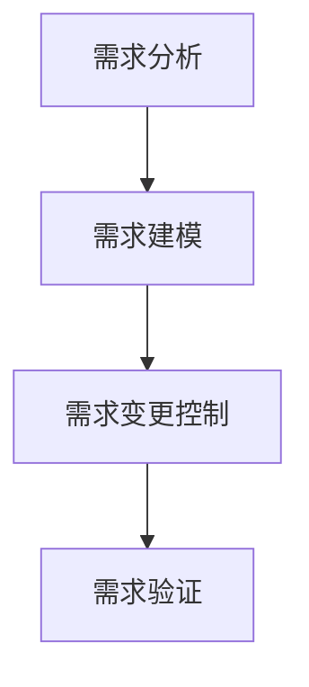
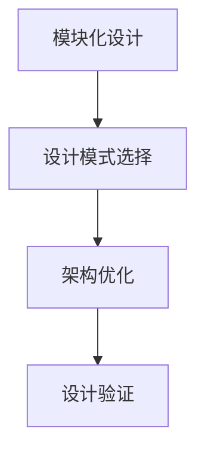
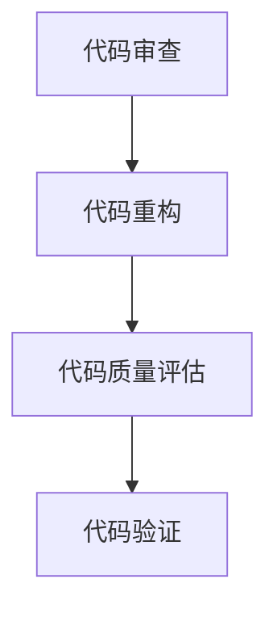
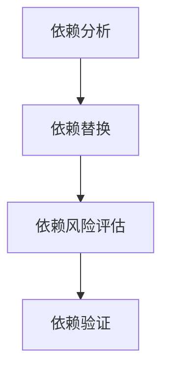
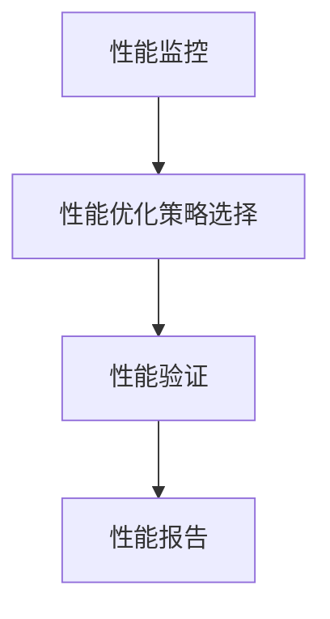
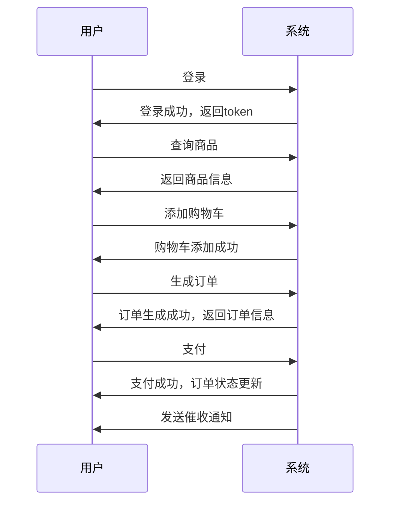

                 

# 需求与技术债务管理：确保大型应用的长期可维护性

> 关键词：技术债务，需求管理，代码质量，性能优化，系统可维护性

> 摘要：随着软件系统规模和复杂性的增加，技术债务问题日益凸显，成为影响大型应用长期可维护性的关键因素。本文将深入探讨需求管理、设计优化、代码质量、依赖管理和性能优化等方面，阐述技术债务管理的核心概念与联系，并提出一系列最佳实践，以保障大型应用的长期可维护性。

### 第一部分: 背景介绍

#### 1.1 问题背景

在当今数字化时代，软件系统的规模和复杂性日益增加，尤其是在大型应用系统中，技术债务的问题愈发凸显。技术债务，类比于金融债务，是指由于采取短期解决方案而未能及时重构、优化代码或设计决策，导致系统长期积累的潜在风险和成本。这种债务如果不加以管理，将严重影响软件系统的可维护性、稳定性和扩展性，进而影响企业的长期发展和竞争力。

技术债务管理不仅是软件开发过程中的重要环节，也是确保大型应用长期可维护性的关键。有效的技术债务管理可以及时发现并解决潜在问题，避免技术债务的累积，从而保障软件系统的健康运行。

#### 1.2 问题描述

在大型应用系统中，技术债务的表现形式多种多样，包括但不限于以下方面：

- **代码质量低下**：由于时间压力，开发人员可能牺牲代码的质量，导致代码冗余、结构混乱，难以维护。
- **设计缺陷**：在系统设计中，可能因为初期设计的不合理，导致后期难以扩展或集成新的功能。
- **依赖性问题**：系统的外部依赖可能过重，一旦依赖的第三方组件出现问题，整个系统也会受到影响。
- **性能瓶颈**：随着系统规模的扩大，性能问题可能逐渐显现，成为系统维护和优化的难点。

这些问题如果不加以解决，将逐步积累，最终导致系统维护成本大幅上升，开发效率下降，甚至影响到系统的正常运行。

#### 1.3 问题解决

技术债务的管理需要从多个方面进行：

- **需求管理**：明确系统的需求，避免因需求频繁变更而导致技术债务的累积。
- **设计优化**：在系统设计阶段，充分考虑未来的扩展性和可维护性，避免设计缺陷。
- **代码质量**：定期进行代码审查和重构，提高代码的质量和可读性。
- **依赖管理**：减少系统的外部依赖，或者使用可信赖的第三方组件，降低风险。
- **性能优化**：持续监控和优化系统的性能，确保系统在高负载下仍然能够稳定运行。

通过这些手段，可以有效降低技术债务的风险，确保大型应用的长期可维护性。

#### 1.4 边界与外延

技术债务管理不仅限于代码层面，还包括以下几个方面：

- **团队协作**：良好的团队协作机制可以帮助及时发现和解决技术债务问题。
- **持续集成与持续部署**（CI/CD）：通过自动化测试和部署流程，降低技术债务的产生。
- **文档管理**：详尽的文档可以减少因沟通不畅导致的技术债务。
- **技术债务评估**：定期进行技术债务评估，了解系统的健康状况，及时采取相应措施。

通过这些外延措施，可以进一步保障技术债务管理的有效性。

#### 1.5 概念结构与核心要素组成

技术债务管理包含以下几个核心要素：

- **需求管理**：明确需求，避免需求变更导致的技术债务。
- **设计优化**：合理设计系统架构，确保系统的扩展性和可维护性。
- **代码质量**：提高代码质量，减少因代码质量低下导致的技术债务。
- **依赖管理**：优化依赖关系，降低外部依赖带来的风险。
- **性能优化**：持续优化系统性能，避免性能瓶颈导致的技术债务。

这些要素相互作用，共同构成了一套完整的技术债务管理体系。

### 第二部分: 核心概念与联系

#### 2.1 需求管理

需求管理是技术债务管理的基础。有效的需求管理能够确保项目开发过程中的需求明确、可控，减少因需求变更导致的技术债务。

- **需求明确**：在项目初期，对需求进行详细分析，明确项目的功能、性能等要求。
- **需求变更控制**：对需求变更进行严格管理，评估变更对项目的影响，避免频繁变更导致的技术债务。

#### 2.2 设计优化

设计优化是技术债务管理的关键。通过合理的系统设计，可以降低技术债务的产生。

- **模块化设计**：将系统划分为多个模块，提高系统的可维护性和可扩展性。
- **设计模式**：合理使用设计模式，解决常见的设计问题，提高系统的设计质量。

#### 2.3 代码质量

代码质量是技术债务管理的重要组成部分。高质量的代码可以降低维护成本，减少技术债务。

- **代码审查**：通过代码审查，发现并修复代码中的问题，提高代码质量。
- **重构**：定期进行代码重构，优化代码结构，提高代码的可读性和可维护性。

#### 2.4 依赖管理

依赖管理是技术债务管理的重要环节。合理的依赖管理可以降低外部依赖带来的风险。

- **依赖分析**：定期分析系统的依赖关系，识别潜在的依赖风险。
- **依赖替换**：对于高风险的依赖，考虑使用替代方案，降低依赖风险。

#### 2.5 性能优化

性能优化是技术债务管理的重要保障。通过性能优化，可以避免因性能瓶颈导致的技术债务。

- **性能监控**：定期监控系统的性能，识别潜在的性能瓶颈。
- **性能优化策略**：根据性能监控结果，采用合适的性能优化策略，提高系统的性能。

### 第三部分: 算法原理讲解

#### 3.1 需求管理算法

需求管理算法主要涉及需求分析、需求建模和需求变更控制等方面。以下是一个简单的需求管理算法流程：



- **需求分析**：通过对用户需求和业务场景的分析，明确系统的功能、性能等要求。
- **需求建模**：将需求转化为具体的系统模型，如使用用例图、功能图等。
- **需求变更控制**：对需求变更进行严格管理，评估变更对项目的影响，避免频繁变更导致的技术债务。

#### 3.2 设计优化算法

设计优化算法主要涉及模块化设计、设计模式选择和架构优化等方面。以下是一个简单的设计优化算法流程：



- **模块化设计**：将系统划分为多个模块，提高系统的可维护性和可扩展性。
- **设计模式选择**：根据系统的需求和特点，选择合适的设计模式，如工厂模式、单例模式等。
- **架构优化**：对系统架构进行优化，提高系统的扩展性和性能。

#### 3.3 代码质量优化算法

代码质量优化算法主要涉及代码审查、代码重构和代码质量评估等方面。以下是一个简单的代码质量优化算法流程：



- **代码审查**：通过代码审查，发现并修复代码中的问题，提高代码质量。
- **代码重构**：定期进行代码重构，优化代码结构，提高代码的可读性和可维护性。
- **代码质量评估**：对代码质量进行评估，识别潜在的问题，及时进行修复。

#### 3.4 依赖管理算法

依赖管理算法主要涉及依赖分析、依赖替换和依赖风险评估等方面。以下是一个简单的依赖管理算法流程：



- **依赖分析**：定期分析系统的依赖关系，识别潜在的依赖风险。
- **依赖替换**：对于高风险的依赖，考虑使用替代方案，降低依赖风险。
- **依赖风险评估**：对依赖风险进行评估，制定相应的风险管理策略。

#### 3.5 性能优化算法

性能优化算法主要涉及性能监控、性能优化策略选择和性能验证等方面。以下是一个简单的性能优化算法流程：



- **性能监控**：定期监控系统的性能，识别潜在的性能瓶颈。
- **性能优化策略选择**：根据性能监控结果，选择合适的性能优化策略，如缓存、数据库优化等。
- **性能验证**：对性能优化效果进行验证，确保系统的性能达到预期目标。

### 第四部分: 系统分析与架构设计方案

#### 4.1 问题场景介绍

假设我们正在开发一个大型电子商务平台，该平台需要支持数百万用户的访问和数百万件商品的管理。为了确保平台的长期可维护性，我们需要进行技术债务管理。

#### 4.2 项目介绍

项目名称：大型电子商务平台

项目背景：随着互联网的发展，电子商务已经成为人们日常生活中不可或缺的一部分。为了满足不断增长的用户需求和业务需求，我们需要开发一个高性能、高可扩展性的电子商务平台。

#### 4.3 系统功能设计

系统功能包括：

1. 用户管理：用户注册、登录、个人信息管理等功能。
2. 商品管理：商品分类、商品信息管理、库存管理等功能。
3. 订单管理：订单生成、订单状态跟踪、订单支付等功能。
4. 购物车管理：购物车添加、删除、修改等功能。
5. 催收管理：催收订单、退款处理等功能。
6. 数据分析：用户行为分析、销售数据分析等功能。

#### 4.4 系统架构设计

系统架构采用分层设计，包括：

1. 表示层：负责用户界面展示，如前端页面、API接口等。
2. 业务逻辑层：负责业务逻辑处理，如用户管理、商品管理、订单管理等。
3. 数据访问层：负责数据存储和访问，如数据库、缓存等。
4. 基础设施层：负责系统基础设施的搭建，如服务器、网络、存储等。

#### 4.5 系统接口设计和系统交互

系统接口设计包括：

1. 用户接口：提供用户操作的API接口，如用户注册、登录、个人信息管理等。
2. 商品接口：提供商品管理的API接口，如商品添加、删除、查询等。
3. 订单接口：提供订单管理的API接口，如订单生成、订单查询等。
4. 数据分析接口：提供数据分析的API接口，如用户行为分析、销售数据分析等。

系统交互流程：

1. 用户通过用户接口进行登录，获取token。
2. 用户通过商品接口查询商品信息，添加购物车。
3. 用户通过订单接口生成订单，进行支付。
4. 系统根据订单信息更新库存，发送催收通知。

#### 4.6 系统接口设计和系统交互Mermaid序列图



### 第五部分: 项目实战

#### 5.1 环境安装

在开发大型电子商务平台时，我们需要搭建一个合适的环境。以下是环境安装的步骤：

1. 安装操作系统：选择Linux操作系统，如Ubuntu 18.04。
2. 安装开发工具：安装Git、Python、Java等开发工具。
3. 安装数据库：安装MySQL、MongoDB等数据库。
4. 安装其他依赖：安装Redis、Elasticsearch等中间件。

#### 5.2 系统核心实现

以下是系统核心实现的源代码：

```python
# 用户管理模块
class UserManager:
    def login(self, username, password):
        # 登录逻辑
        pass
    
    def register(self, username, password):
        # 注册逻辑
        pass
    
    def get_user_info(self, user_id):
        # 获取用户信息
        pass

# 商品管理模块
class ProductManager:
    def add_product(self, product_info):
        # 添加商品
        pass
    
    def delete_product(self, product_id):
        # 删除商品
        pass
    
    def get_product_info(self, product_id):
        # 获取商品信息
        pass

# 订单管理模块
class OrderManager:
    def generate_order(self, order_info):
        # 生成订单
        pass
    
    def query_order(self, order_id):
        # 查询订单
        pass
    
    def update_order_status(self, order_id, status):
        # 更新订单状态
        pass
```

#### 5.3 代码应用解读与分析

以下是代码应用解读与分析：

- **用户管理模块**：负责用户登录、注册和获取用户信息等功能。
- **商品管理模块**：负责商品添加、删除和获取商品信息等功能。
- **订单管理模块**：负责订单生成、查询和更新订单状态等功能。

这些模块通过定义相应的类和方法，实现了电子商务平台的核心功能。

#### 5.4 实际案例分析和详细讲解剖析

假设我们有一个实际案例：一个用户在电商平台购买了一件商品，并提交了订单。以下是详细讲解剖析：

1. 用户登录：用户通过用户接口进行登录，系统返回token。
2. 查询商品：用户通过商品接口查询商品信息，添加购物车。
3. 生成订单：用户通过订单接口生成订单，系统返回订单信息。
4. 支付：用户通过支付接口进行支付，系统更新订单状态。
5. 发送催收通知：系统根据订单状态发送催收通知。

通过这个案例，我们可以清晰地看到系统各模块之间的交互过程，以及如何实现核心功能。

#### 5.5 项目小结

在本项目中，我们通过需求管理、设计优化、代码质量、依赖管理和性能优化等方面，实现了大型电子商务平台的核心功能。项目实践表明，技术债务管理在保障系统长期可维护性方面具有重要意义。通过有效的技术债务管理，我们能够及时发现并解决潜在问题，确保系统的健康运行。

### 第六部分: 最佳实践 Tips

在技术债务管理过程中，以下是一些最佳实践Tips：

1. **明确需求**：在项目初期，对需求进行详细分析，确保需求明确、可控。
2. **合理设计**：在系统设计阶段，充分考虑未来的扩展性和可维护性，避免设计缺陷。
3. **代码审查**：定期进行代码审查，发现并修复代码中的问题，提高代码质量。
4. **依赖分析**：定期分析系统的依赖关系，识别潜在的依赖风险。
5. **性能监控**：定期监控系统的性能，识别潜在的性能瓶颈。
6. **持续集成**：通过持续集成，降低技术债务的产生。

### 第七部分: 小结

本文从需求管理、设计优化、代码质量、依赖管理和性能优化等方面，探讨了技术债务管理的核心概念与联系。通过实际案例分析和详细讲解剖析，我们了解了如何确保大型应用的长期可维护性。技术债务管理不仅关乎系统的健康运行，也关系到企业的长期发展和竞争力。希望本文能为读者提供有价值的参考和启示。

### 第八部分: 注意事项

在技术债务管理过程中，需要注意以下几点：

1. **需求变更控制**：避免频繁的需求变更，对需求变更进行严格管理。
2. **团队协作**：加强团队协作，确保技术债务管理措施的有效实施。
3. **文档管理**：保持详尽的文档，减少因沟通不畅导致的技术债务。
4. **技术债务评估**：定期进行技术债务评估，了解系统的健康状况。

### 第九部分: 拓展阅读

1. 《技术债务：软件债务的度量和管理》
2. 《软件架构：实践者的研究方法》
3. 《代码大全》
4. 《性能之巅：性能调优权威指南》
5. 《设计模式：可复用面向对象软件的基础》

### 作者信息

作者：AI天才研究院/AI Genius Institute & 禅与计算机程序设计艺术 /Zen And The Art of Computer Programming

完。

