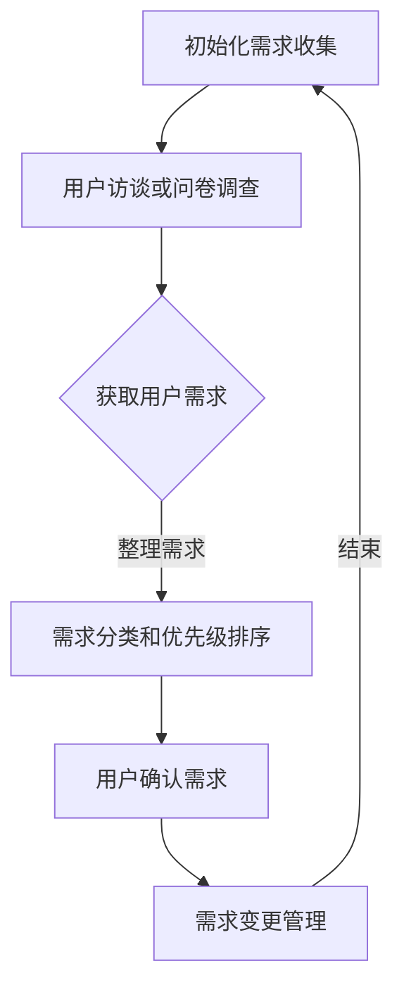
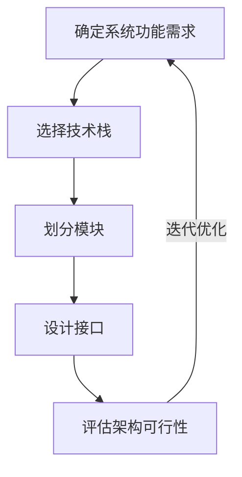
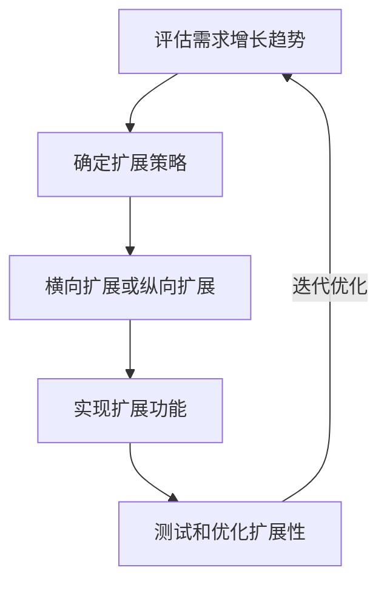
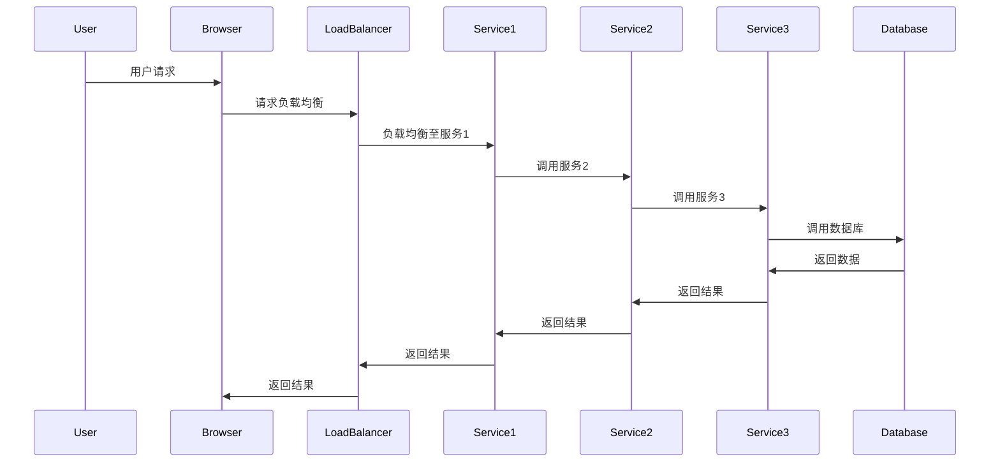
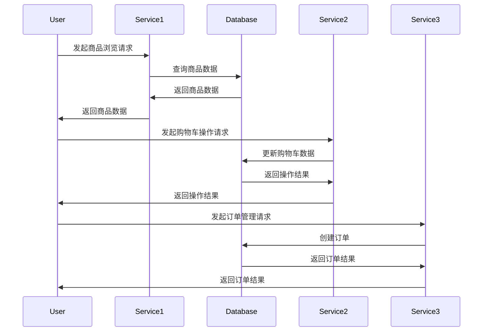
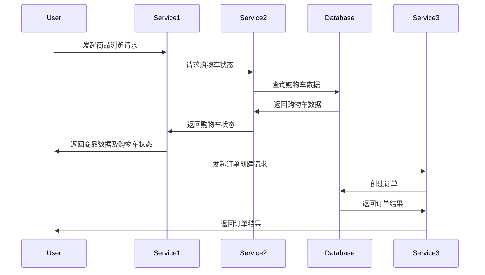
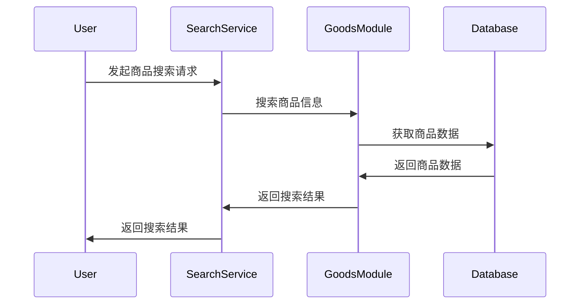
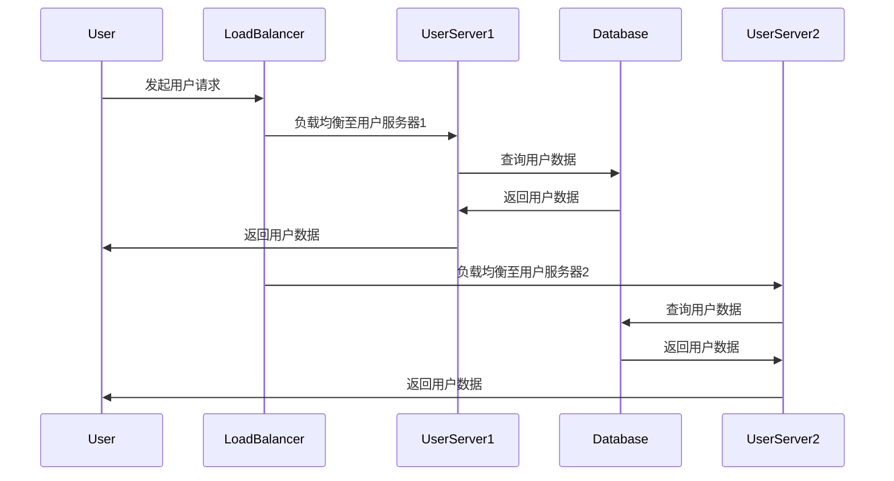
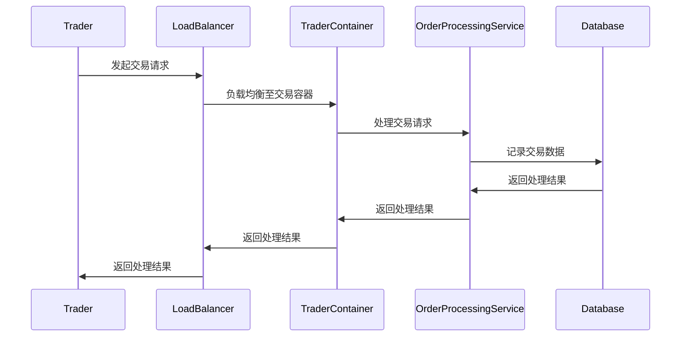
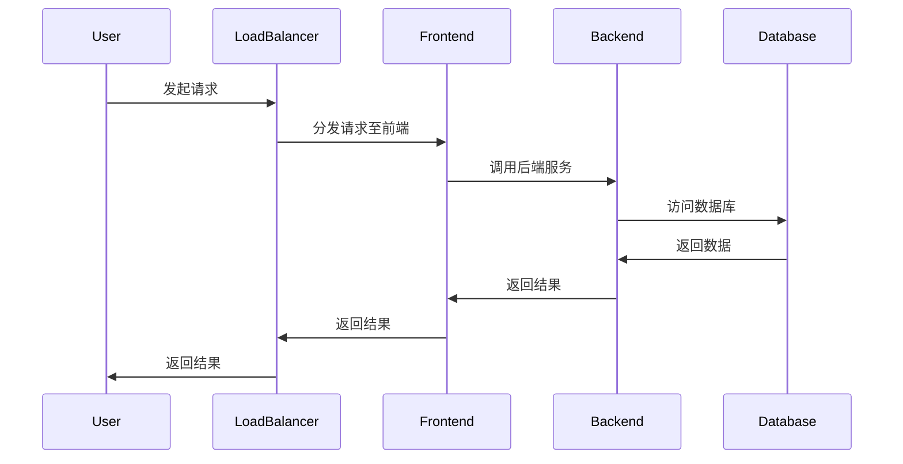

                 

# 需求与技术架构的协同演进：确保系统可扩展性

> 关键词：需求分析、技术架构、系统可扩展性、协同演进、设计原则

> 摘要：本文将探讨在快速发展的信息技术时代，如何通过需求与技术架构的协同演进，确保系统的可扩展性。本文将从问题背景、核心概念、协同原则、设计策略、案例分析、最佳实践等多个维度展开，以期为读者提供有深度、有思考、有见解的指导。

## 1. 问题背景与需求概述

### 1.1 信息技术发展的现状

随着互联网、大数据、云计算、人工智能等新兴技术的蓬勃发展，信息技术已经渗透到各个行业和领域，成为推动社会进步的重要力量。然而，随着业务需求的不断演变，传统的系统架构往往难以满足新的需求，导致系统性能下降、扩展性不足、维护成本上升等问题。

### 1.2 系统可扩展性的重要性

在当今快速变化的市场环境中，系统的可扩展性成为衡量系统架构设计成功与否的关键因素。一个具有良好可扩展性的系统不仅能够满足当前的业务需求，还能够在未来需求增长时轻松进行扩展，降低维护成本，提高业务响应速度。

### 1.3 需求描述

#### 1.3.1 用户需求分析

用户需求主要来源于以下几个方面：

- **功能性需求**：系统应提供用户所需的功能和服务。
- **性能需求**：系统应能够在规定的时间内响应用户请求，保证良好的用户体验。
- **可靠性需求**：系统应具有高度的可靠性，确保数据的完整性和一致性。
- **可扩展性需求**：系统应具有良好的扩展性，能够应对未来业务需求的增长。

#### 1.3.2 业务需求分析

业务需求主要来源于以下几个方面：

- **市场变化**：随着市场环境的变化，业务需求也会随之变化，系统需要能够快速响应这些变化。
- **技术升级**：随着技术的不断进步，系统需要能够适应新的技术趋势，如云计算、大数据等。
- **业务增长**：随着业务规模的扩大，系统需要能够支持更多的用户和数据量。

### 1.4 问题解决思路

为了解决上述问题，我们需要从以下几个方面入手：

- **需求管理**：通过有效的需求管理，确保系统的设计能够满足用户和业务的需求。
- **技术架构设计**：通过合理的技术架构设计，确保系统能够具有良好的可扩展性。
- **协同演进**：通过需求与技术架构的协同演进，确保系统能够持续适应业务需求的变化。

## 2. 核心概念与联系

### 2.1 需求管理

需求管理是系统开发过程中的重要环节，它包括需求收集、需求分析、需求确认、需求变更管理等。需求管理的目标是确保系统的设计和实现能够满足用户和业务的需求。

### 2.2 技术架构设计

技术架构设计是系统开发过程中的另一个重要环节，它包括系统架构的设计、技术选型、模块划分、接口设计等。技术架构设计的目标是确保系统的性能、可靠性、可扩展性等关键指标。

### 2.3 系统可扩展性

系统可扩展性是指系统在满足当前需求的基础上，能够适应未来需求变化的能力。系统可扩展性包括横向扩展（增加服务器数量）和纵向扩展（提升单个服务器性能）两种方式。

## 3. 需求与技术架构协同原则

### 3.1 协同原则概述

需求与技术架构的协同演进是确保系统可扩展性的关键。协同原则主要包括以下几个方面：

- **需求引导**：需求是系统设计的起点，技术架构设计应围绕需求进行。
- **架构可扩展**：技术架构设计应具备良好的可扩展性，以应对未来需求的变化。
- **灵活性与适应性**：系统设计应具备灵活性和适应性，以应对不同的业务场景和技术环境。
- **持续迭代**：系统设计是一个持续迭代的过程，需求和技术架构应不断调整和优化。

### 3.2 需求与技术架构协同策略

#### 3.2.1 需求分析中的架构考虑

在需求分析阶段，应充分考虑技术架构的影响，包括：

- **性能需求**：分析系统的性能需求，确定系统设计的性能指标。
- **可靠性需求**：分析系统的可靠性需求，确定系统设计的可靠性指标。
- **可扩展性需求**：分析系统的可扩展性需求，确定系统设计的技术架构。

#### 3.2.2 架构设计中的需求反馈

在技术架构设计阶段，应充分考虑需求的影响，包括：

- **需求变更**：在架构设计过程中，需求可能会发生变化，技术架构设计应能够适应这些变化。
- **需求优先级**：在架构设计过程中，应根据需求的重要性来确定技术优先级。

## 4. 可扩展性设计策略

### 4.1 可扩展性设计概述

可扩展性设计是确保系统可扩展性的关键。可扩展性设计主要包括以下几个方面：

- **模块化设计**：将系统划分为多个模块，每个模块具有独立的职责和功能，便于扩展和维护。
- **分布式系统设计**：通过分布式系统设计，实现系统的横向扩展，提高系统的性能和可靠性。
- **云原生架构设计**：利用云计算和容器化技术，实现系统的弹性扩展和高效运维。

### 4.2 可扩展性设计方法

#### 4.2.1 模块化设计

模块化设计是将系统划分为多个模块，每个模块具有独立的职责和功能。模块化设计的优点包括：

- **降低复杂性**：通过将系统划分为多个模块，可以降低系统的复杂性，便于理解和维护。
- **提高可扩展性**：通过模块化设计，可以方便地增加或删除模块，实现系统的扩展。

#### 4.2.2 分布式系统设计

分布式系统设计是将系统部署在多个服务器上，通过负载均衡和容错机制，实现系统的横向扩展。分布式系统设计的优点包括：

- **提高性能**：通过分布式系统设计，可以充分利用多台服务器的性能，提高系统的吞吐量。
- **提高可靠性**：通过分布式系统设计，可以确保系统在部分服务器故障时仍然能够正常运行。

#### 4.2.3 云原生架构设计

云原生架构设计是利用云计算和容器化技术，实现系统的弹性扩展和高效运维。云原生架构设计的优点包括：

- **弹性扩展**：通过云原生架构设计，可以实现系统的弹性扩展，根据业务需求自动调整资源。
- **高效运维**：通过云原生架构设计，可以简化系统的运维过程，提高运维效率。

## 5. 典型企业案例分析

### 5.1 案例背景

某大型电商平台在业务快速发展的过程中，面临着系统性能下降、扩展性不足等问题。为了解决这些问题，该电商平台决定进行系统重构。

### 5.2 系统功能设计

在系统功能设计阶段，该电商平台明确了以下功能需求：

- **商品展示**：用户可以查看商品信息，进行商品筛选和排序。
- **购物车**：用户可以将商品添加到购物车，进行商品编辑和删除。
- **订单管理**：用户可以创建订单，查看订单状态，进行订单支付和取消。
- **用户管理**：用户可以进行账户注册、登录、个人信息修改等操作。

### 5.3 系统架构设计

在系统架构设计阶段，该电商平台采用了以下技术架构：

- **前端架构**：采用Vue.js框架，实现用户界面的展示和交互。
- **后端架构**：采用Spring Boot框架，实现业务逻辑的处理和数据的存储。
- **数据库架构**：采用MySQL数据库，实现数据的存储和管理。
- **缓存架构**：采用Redis缓存，提高系统的性能和响应速度。

### 5.4 系统实现与优化

在系统实现阶段，该电商平台根据需求和技术架构，实现了以下功能：

- **商品展示**：通过接口调用，将商品信息展示给用户。
- **购物车**：通过接口调用，实现购物车的添加、编辑和删除功能。
- **订单管理**：通过接口调用，实现订单的创建、查看、支付和取消功能。
- **用户管理**：通过接口调用，实现用户的注册、登录、个人信息修改等功能。

在系统优化阶段，该电商平台采取了以下措施：

- **性能优化**：通过Redis缓存，减少数据库查询次数，提高系统性能。
- **安全性优化**：通过SSL加密，确保用户数据的安全性。
- **扩展性优化**：通过分布式部署，实现系统的横向扩展，提高系统的可靠性。

### 5.5 案例总结

通过本次系统重构，该电商平台成功解决了系统性能下降、扩展性不足等问题。实践证明，通过合理的需求分析与技术架构设计，可以确保系统的可扩展性，为业务发展提供有力支撑。

## 6. 最佳实践与技巧

### 6.1 最佳实践总结

在系统设计和实施过程中，以下最佳实践值得借鉴：

- **需求引导设计**：在系统设计阶段，充分分析用户和业务需求，确保系统设计能够满足需求。
- **模块化设计**：通过模块化设计，提高系统的可扩展性和可维护性。
- **分布式系统设计**：通过分布式系统设计，提高系统的性能和可靠性。
- **云原生架构设计**：通过云原生架构设计，实现系统的弹性扩展和高效运维。

### 6.2 小结

本文从需求与技术架构的协同演进角度，探讨了确保系统可扩展性的关键方法和实践。通过合理的需求分析与技术架构设计，可以构建出具有良好可扩展性的系统，为业务发展提供有力支撑。

### 6.3 未来趋势展望

随着技术的不断进步，未来系统设计将更加注重可扩展性和灵活性。分布式架构、云原生架构等新技术将继续发挥重要作用，为系统设计带来更多可能性。同时，人工智能、大数据等新兴技术也将进一步推动系统设计的创新和发展。

## 作者信息

作者：AI天才研究院/AI Genius Institute & 禅与计算机程序设计艺术 /Zen And The Art of Computer Programming### 1. 问题背景与需求概述

#### 1.1 信息技术发展的现状

随着互联网、大数据、云计算、人工智能等新兴技术的蓬勃发展，信息技术已经渗透到各个行业和领域，成为推动社会进步的重要力量。然而，随着业务需求的不断演变，传统的系统架构往往难以满足新的需求，导致系统性能下降、扩展性不足、维护成本上升等问题。

在过去的几十年里，信息技术经历了从单机到分布式、从集中式到云计算、从传统软件到云原生技术的演变。这些技术的演进使得系统的规模和复杂性不断增加，对系统架构设计提出了更高的要求。现代企业不仅需要应对当前的业务需求，还需要为未来的不确定性做好准备，这就要求系统设计具有高度的灵活性和可扩展性。

#### 1.2 系统可扩展性的重要性

在当今快速变化的市场环境中，系统的可扩展性成为衡量系统架构设计成功与否的关键因素。一个具有良好可扩展性的系统不仅能够满足当前的业务需求，还能够在未来需求增长时轻松进行扩展，降低维护成本，提高业务响应速度。

具体来说，系统的可扩展性有以下几个方面的价值：

1. **提高业务敏捷性**：通过可扩展的系统设计，企业可以快速响应市场变化，推出新的产品和服务。
2. **降低维护成本**：可扩展的系统设计使得在需求变化时，只需对相关模块进行修改，而不需要对整个系统进行大规模重构。
3. **提高用户体验**：良好的系统性能和响应速度能够提升用户满意度，从而增强企业的竞争力。
4. **适应未来技术趋势**：通过可扩展的设计，系统能够适应新的技术趋势，如云计算、大数据等，为企业的长期发展奠定基础。

#### 1.3 需求描述

##### 1.3.1 用户需求分析

用户需求是系统设计的起点，它决定了系统的功能和性能要求。用户需求可以分为以下几个方面：

- **功能性需求**：指用户期望系统能够提供哪些功能和服务。例如，电商平台需要提供商品浏览、搜索、购物车、下单、支付等基本功能。
- **性能需求**：指系统需要具备怎样的性能指标才能满足用户需求。例如，响应时间、吞吐量、并发处理能力等。
- **可靠性需求**：指系统需要具备怎样的可靠性，包括系统的稳定性、故障恢复能力、数据完整性等。
- **可扩展性需求**：指系统需要具备怎样的扩展性，以应对未来业务需求的增长。例如，能否支持更多的用户、更多的数据量、更多的业务功能等。

##### 1.3.2 业务需求分析

业务需求是企业在特定市场环境中需要实现的目标和任务。业务需求可以从以下几个方面进行分析：

- **市场变化**：企业需要根据市场变化调整业务策略，这可能会带来新的业务需求。例如，新兴市场、新竞争对手的出现、消费者偏好的变化等。
- **技术升级**：随着技术的不断进步，企业需要采用新技术来提升业务效率、降低成本、提高竞争力。例如，云计算、大数据、人工智能等。
- **业务增长**：企业规模的扩大可能会导致业务需求的增加。例如，用户数量的增长、业务范围的扩展、数据量的增加等。

#### 1.4 问题解决思路

为了解决上述问题，我们需要从以下几个方面入手：

- **需求管理**：通过有效的需求管理，确保系统的设计能够满足用户和业务的需求。需求管理包括需求收集、需求分析、需求确认、需求变更管理等。
- **技术架构设计**：通过合理的技术架构设计，确保系统能够具有良好的可扩展性。技术架构设计包括系统架构的设计、技术选型、模块划分、接口设计等。
- **协同演进**：通过需求与技术架构的协同演进，确保系统能够持续适应业务需求的变化。协同演进包括需求引导设计、架构可扩展性设计、灵活性与适应性设计等。

#### 1.5 边界与外延

##### 1.5.1 系统边界定义

系统边界是指系统所包含的范围，即系统的职责和功能范围。明确系统边界对于确保系统设计的正确性和可行性至关重要。系统边界的定义通常包括以下几个方面：

- **功能边界**：系统需要提供哪些功能，哪些功能不在系统范围之内。
- **数据边界**：系统需要管理哪些数据，哪些数据由其他系统或外部环境管理。
- **技术边界**：系统采用哪些技术，哪些技术不在系统范围之内。

##### 1.5.2 技术架构的范围

技术架构的范围包括系统架构、技术选型、模块划分、接口设计等方面。明确技术架构的范围对于确保系统设计的合理性和可行性至关重要。技术架构的范围通常包括以下几个方面：

- **系统架构**：系统的整体架构设计，包括系统的组成部分、组件之间的交互关系等。
- **技术选型**：系统采用的技术和工具，如开发语言、框架、数据库、中间件等。
- **模块划分**：系统的模块划分，每个模块的职责和功能。
- **接口设计**：系统内部和外部组件之间的接口设计，包括接口的定义、参数传递、调用方式等。

### 1.6 概念结构与核心要素组成

在探讨系统可扩展性时，需要理解几个核心概念和结构，这些是确保系统能够灵活适应变化的基础：

#### 1.6.1 模块化

模块化是将系统分解为独立的、可管理的模块，每个模块具有特定的功能。模块化设计的关键是确保模块之间的高度解耦，使得模块可以独立开发、测试和部署。

- **独立性**：每个模块应该独立运行，不会因为一个模块的故障而影响整个系统。
- **可重用性**：模块应该是可重用的，可以在不同的系统或场景中复用。

#### 1.6.2 微服务架构

微服务架构是一种将应用程序构建为一组小服务的架构风格，每个服务具有独立的业务功能，并且可以独立部署和扩展。微服务架构的核心是服务的独立性、分布式和自治性。

- **独立性**：每个微服务都应该能够独立部署和扩展，不会受到其他服务的影响。
- **分布式**：微服务架构通常部署在分布式环境中，可以充分利用云计算资源。
- **自治性**：每个微服务都有自己的数据库，可以独立管理数据。

#### 1.6.3 分布式系统

分布式系统是由多个节点组成的系统，这些节点通过网络进行通信，协同工作以完成特定的任务。分布式系统的核心是分布式计算、负载均衡和容错性。

- **分布式计算**：分布式系统能够通过多个节点并行处理任务，提高系统的性能和吞吐量。
- **负载均衡**：分布式系统能够将负载分配到不同的节点上，避免单个节点的过载。
- **容错性**：分布式系统能够在部分节点故障时，通过其他节点继续提供服务。

#### 1.6.4 云原生技术

云原生技术是一组用于构建和运行云原生应用程序的技术和实践。云原生应用程序设计为在云环境中运行，利用云计算的特性，如动态管理、自动伸缩和分布式存储。

- **动态管理**：云原生应用程序能够自动响应资源需求的变化，动态调整资源分配。
- **自动伸缩**：云原生应用程序能够根据负载自动扩展或缩小实例数量。
- **分布式存储**：云原生应用程序能够利用分布式存储系统，实现数据的高可用性和扩展性。

通过理解这些核心概念和结构，我们能够更好地设计可扩展的系统，确保系统能够灵活适应不断变化的需求。

### 1.7 综述

本章节首先介绍了信息技术发展的现状，分析了系统可扩展性的重要性。接着，通过对用户需求和业务需求的深入分析，明确了系统设计所需考虑的关键因素。随后，讨论了系统边界的定义和技术架构的范围，并介绍了模块化、微服务架构、分布式系统和云原生技术等核心概念和结构。这些概念和结构构成了确保系统可扩展性的基础，为后续章节的详细探讨提供了理论依据。

### 2. 核心概念与联系

在探讨系统可扩展性时，理解几个关键概念和它们之间的关系至关重要。这些概念包括需求管理、技术架构设计、系统可扩展性等。在本章节中，我们将详细解释这些概念，并探讨它们之间的相互作用。

#### 2.1 需求管理

需求管理是系统开发过程中的核心环节，它包括需求的收集、分析、确认、变更管理等多个方面。需求管理的目标是确保系统的设计和实现能够满足用户和业务的需求。

##### 2.1.1 需求收集

需求收集是需求管理的第一步，主要任务是识别和理解用户的业务需求。需求收集可以通过用户访谈、问卷调查、焦点小组讨论等多种方式进行。

- **用户访谈**：通过与最终用户和业务专家的面对面交流，深入了解他们的需求和期望。
- **问卷调查**：通过设计问卷，收集大量用户的需求和反馈。
- **焦点小组讨论**：组织一组用户和业务专家，进行深入讨论，获取多方面的需求和意见。

##### 2.1.2 需求分析

需求分析是将收集到的需求进行整理、分类和优先级排序的过程。需求分析的关键是确保需求的具体性、一致性和可实现性。

- **需求分类**：根据需求的不同类型，如功能性需求、性能需求、可靠性需求等，对需求进行分类。
- **优先级排序**：根据业务重要性和实施难度，对需求进行优先级排序，确保关键需求得到优先处理。

##### 2.1.3 需求确认

需求确认是需求管理的重要环节，通过用户和开发团队的确认，确保需求的正确性和完整性。

- **用户确认**：通过用户评审会议、原型展示等方式，确保用户对需求的理解和认可。
- **开发团队确认**：通过技术评审会议，确保开发团队能够根据需求进行设计和实现。

##### 2.1.4 需求变更管理

在系统开发过程中，需求可能会发生变化。需求变更管理是确保变更得到有效控制和管理的过程。

- **变更请求**：当需求发生变化时，用户或业务专家可以提出变更请求。
- **变更评估**：对变更请求进行评估，包括对变更的影响范围、成本和风险进行评估。
- **变更实施**：根据评估结果，决定是否接受变更请求，并在开发过程中实施变更。

#### 2.2 技术架构设计

技术架构设计是系统开发过程中至关重要的环节，它决定了系统的性能、可靠性、可扩展性等关键特性。技术架构设计包括系统架构设计、技术选型、模块划分、接口设计等多个方面。

##### 2.2.1 系统架构设计

系统架构设计是确定系统整体结构和组件之间关系的过程。系统架构设计的关键是确保系统的高内聚、低耦合，以及良好的可扩展性。

- **高内聚**：确保系统中的各个模块具有明确的职责和功能，避免模块之间的功能交叉。
- **低耦合**：确保模块之间的依赖关系最小化，使得模块可以独立开发、测试和部署。

##### 2.2.2 技术选型

技术选型是在系统架构设计过程中，选择合适的技术和工具的过程。技术选型需要考虑多种因素，如技术成熟度、社区活跃度、性能要求、成本等。

- **技术成熟度**：选择成熟的技术和框架，可以减少技术风险，提高开发效率。
- **社区活跃度**：选择社区活跃的技术和框架，可以获得更多的支持和资源。
- **性能要求**：根据系统的性能需求，选择合适的技术和工具。
- **成本**：根据项目的预算，选择成本效益最高的技术和工具。

##### 2.2.3 模块划分

模块划分是将系统分解为独立的、可管理的模块的过程。模块划分的关键是确保模块之间的高度解耦，使得模块可以独立开发、测试和部署。

- **功能模块**：根据系统的功能需求，将系统划分为功能模块，每个模块实现特定的功能。
- **数据模块**：根据系统的数据需求，将系统划分为数据模块，每个模块管理特定的数据。

##### 2.2.4 接口设计

接口设计是确定系统内部和外部组件之间交互方式的过程。接口设计的关键是确保接口的规范性和一致性。

- **内部接口**：系统内部组件之间的接口，如API、事件等。
- **外部接口**：系统与外部系统或服务的接口，如Web服务、消息队列等。

#### 2.3 系统可扩展性

系统可扩展性是指系统在满足当前需求的基础上，能够适应未来需求变化的能力。系统可扩展性包括横向扩展（增加服务器数量）和纵向扩展（提升单个服务器性能）两种方式。

##### 2.3.1 横向扩展

横向扩展是通过增加服务器数量来提升系统性能和可扩展性的方法。横向扩展的优点包括：

- **弹性扩展**：可以根据业务需求，灵活增加或减少服务器数量。
- **负载均衡**：通过负载均衡器，将流量分配到不同的服务器上，提高系统的吞吐量。
- **容错性**：通过分布式部署，可以确保在部分服务器故障时，系统仍然能够正常运行。

##### 2.3.2 纵向扩展

纵向扩展是通过提升单个服务器的性能来提升系统性能和可扩展性的方法。纵向扩展的优点包括：

- **高性能**：通过提升单个服务器的硬件性能，可以显著提高系统的处理能力。
- **资源利用率**：通过充分利用单个服务器的资源，提高资源利用率。

#### 2.4 概念属性特征对比表格

为了更清晰地理解需求管理、技术架构设计和系统可扩展性这三个概念，我们可以通过一个对比表格来展示它们的属性特征。

| 概念                 | 属性特征                                                     | 关系与作用                                                     |
|----------------------|--------------------------------------------------------------|----------------------------------------------------------------|
| 需求管理             | 收集、分析、确认、变更管理等                                  | 确保系统设计与实现满足用户和业务需求，是系统设计的起点           |
| 技术架构设计         | 系统架构设计、技术选型、模块划分、接口设计等                  | 确保系统具备良好的性能、可靠性、可扩展性，是系统设计的核心环节   |
| 系统可扩展性         | 横向扩展、纵向扩展等                                          | 确保系统能够适应未来业务需求的变化，是系统设计的关键目标         |

#### 2.5 ER实体关系图架构

为了更好地理解需求管理、技术架构设计和系统可扩展性之间的联系，我们可以通过ER（实体关系）图来展示它们之间的关系。

```mermaid
erDiagram
    User ||--o{ Requirement : 用户需求
    Business ||--o{ Requirement : 业务需求
    System ||--o{ Architecture : 系统架构
    Requirement }|--|| User
    Requirement }|--|| Business
    Architecture }|--|| System
    Architecture }|--o{ Extensibility : 可扩展性
    Extensibility }|--|| Architecture
```

在上面的ER图中，用户和业务需求是系统架构设计和系统可扩展性的基础。系统架构设计决定了系统如何实现需求，而系统可扩展性确保系统能够适应未来需求的变化。

### 2.6 算法原理讲解

在本章节中，我们将详细讲解需求管理、技术架构设计和系统可扩展性相关的算法原理，并通过Mermaid流程图和Python源代码进行展示和说明。

#### 2.6.1 需求收集算法

需求收集是需求管理的第一步，目的是识别和理解用户的业务需求。以下是一个简单的需求收集算法示例，用于从用户处获取需求信息。



上述算法通过用户访谈或问卷调查的方式收集用户需求，然后对需求进行分类和优先级排序，最终与用户确认需求，并进行需求变更管理。

#### 2.6.2 技术架构设计算法

技术架构设计是系统开发过程中至关重要的一环，它决定了系统的性能、可靠性、可扩展性等关键特性。以下是一个简单的技术架构设计算法示例，用于设计系统架构。



上述算法首先确定系统的功能需求，然后选择合适的技术栈，划分模块并设计接口，最后评估架构的可行性，并通过迭代优化不断完善架构设计。

#### 2.6.3 系统可扩展性算法

系统可扩展性是确保系统能够适应未来需求变化的关键。以下是一个简单的系统可扩展性算法示例，用于设计和实现系统的可扩展性。



上述算法首先评估业务需求增长趋势，然后确定扩展策略（横向扩展或纵向扩展），实现扩展功能，并通过测试和优化确保系统的可扩展性。

#### 2.6.4 Python源代码示例

为了更直观地理解上述算法，我们提供了相应的Python源代码示例。

```python
# 需求收集算法
def collect_requirements():
    print("进行用户访谈或问卷调查...")
    user_requirements = ["商品浏览", "购物车", "订单管理", "用户管理"]
    print("收集到用户需求：", user_requirements)
    return user_requirements

# 技术架构设计算法
def design_architecture(user_requirements):
    print("选择技术栈...")
    technology_stack = ["Vue.js", "Spring Boot", "MySQL", "Redis"]
    print("技术栈选择完成：", technology_stack)

    print("划分模块...")
    modules = {"前端": ["商品浏览", "购物车", "用户管理"], "后端": ["订单管理"]}
    print("模块划分完成：", modules)

    print("设计接口...")
    interfaces = {"商品浏览": "GET /products", "购物车": "POST /cart", "订单管理": "POST /order"}
    print("接口设计完成：", interfaces)

    print("评估架构可行性...")
    feasibility = "可行"
    print("架构评估完成：", feasibility)

    return technology_stack, modules, interfaces

# 系统可扩展性算法
def ensure_extensibility():
    print("评估需求增长趋势...")
    growth_trend = "增长"
    print("需求增长趋势：", growth_trend)

    print("确定扩展策略...")
    if growth_trend == "增长":
        expansion_strategy = "横向扩展"
    else:
        expansion_strategy = "纵向扩展"
    print("扩展策略：", expansion_strategy)

    print("实现扩展功能...")
    if expansion_strategy == "横向扩展":
        print("增加服务器数量...")
    else:
        print("提升单个服务器性能...")

    print("测试和优化扩展性...")
    test_and_optimize = "完成"
    print("测试和优化完成：", test_and_optimize)

    return expansion_strategy

# 主函数
def main():
    user_requirements = collect_requirements()
    technology_stack, modules, interfaces = design_architecture(user_requirements)
    expansion_strategy = ensure_extensibility()

if __name__ == "__main__":
    main()
```

上述Python源代码通过模拟实际操作，展示了需求收集、技术架构设计和系统可扩展性的实现过程。

#### 2.6.5 算法原理总结

在本章节中，我们通过Mermaid流程图和Python源代码，详细讲解了需求管理、技术架构设计和系统可扩展性的算法原理。需求收集算法用于从用户处获取需求信息；技术架构设计算法用于设计系统架构，确保系统具备良好的性能、可靠性、可扩展性；系统可扩展性算法用于评估需求增长趋势，确定并实现扩展策略，确保系统能够适应未来需求的变化。

### 2.7 数学公式与模型

在系统设计和实施过程中，数学公式和模型是理解和分析系统性能、可靠性和可扩展性的重要工具。以下是一些常用的数学公式和模型，以及它们在系统设计中的应用。

#### 2.7.1 可扩展性模型

在讨论系统可扩展性时，常用的扩展性模型是CAP理论（一致性、可用性、分区容错性）。CAP理论指出，在分布式系统中，这三者只能同时满足两个，无法三者兼得。

- **一致性（Consistency）**：所有节点在同一时刻看到的数据是一致的。
- **可用性（Availability）**：系统能够响应所有请求，即不会失败。
- **分区容错性（Partition Tolerance）**：系统能够在出现分区故障时继续运行。

数学模型描述如下：

$$
CAP = \{ C, A, P \}
$$

其中，$C$ 表示一致性，$A$ 表示可用性，$P$ 表示分区容错性。

#### 2.7.2 负载均衡模型

在分布式系统中，负载均衡是确保系统性能和可靠性的关键。常用的负载均衡算法包括：

- **轮询（Round Robin）**：按顺序分配请求到每个服务器。
- **最小连接（Least Connections）**：将请求分配到连接数最少的服务器。
- **加权轮询（Weighted Round Robin）**：根据服务器的处理能力分配权重，按权重顺序分配请求。

轮询算法的数学模型描述如下：

$$
\text{Load} = \frac{\sum_{i=1}^{n} w_i \cdot C_i}{\sum_{i=1}^{n} w_i}
$$

其中，$w_i$ 表示服务器的权重，$C_i$ 表示服务器的当前负载。

#### 2.7.3 容错性模型

在分布式系统中，容错性是确保系统可靠性的关键。常用的容错性模型包括：

- **冗余（Redundancy）**：通过备份和冗余机制，确保在部分节点故障时系统仍然能够正常运行。
- **故障检测和恢复（Fault Detection and Recovery）**：通过定期检测和快速恢复机制，确保系统在故障发生后能够快速恢复。

冗余模型的数学模型描述如下：

$$
S = S_0 + r
$$

其中，$S$ 表示冗余后的系统容量，$S_0$ 表示原始系统容量，$r$ 表示冗余容量。

#### 2.7.4 性能模型

在系统设计中，性能模型用于分析和评估系统的性能指标，如响应时间、吞吐量、并发处理能力等。常用的性能模型包括：

- **响应时间（Response Time）**：系统处理请求所需的时间。
- **吞吐量（Throughput）**：单位时间内系统能够处理的请求量。
- **并发处理能力（Concurrency）**：系统同时处理多个请求的能力。

响应时间的数学模型描述如下：

$$
T_r = \frac{1}{\lambda}
$$

其中，$T_r$ 表示响应时间，$\lambda$ 表示请求到达率。

通过上述数学公式和模型，我们可以更好地理解和分析系统的性能、可靠性和可扩展性，从而为系统设计提供科学依据。

### 2.8 系统分析与架构设计方案

在本章节中，我们将介绍系统分析与架构设计方案，包括问题场景介绍、项目介绍、系统功能设计、系统架构设计、系统接口设计以及系统交互设计。

#### 2.8.1 问题场景介绍

随着电子商务行业的快速发展，许多电商平台在处理大量用户请求和海量数据时，面临着系统性能瓶颈、扩展性不足和可靠性问题。为了应对这些挑战，需要设计一个高效、可扩展和可靠的系统架构。

#### 2.8.2 项目介绍

本项目旨在构建一个高效、可扩展的电商平台系统，包括前端用户界面、后端业务逻辑处理、数据库存储和缓存等。系统需要支持商品浏览、搜索、购物车、订单管理、用户管理等基本功能，并能够应对大规模用户请求和海量数据的处理。

#### 2.8.3 系统功能设计

系统功能设计是系统架构设计的重要基础。本项目的主要功能包括：

- **商品展示**：用户可以浏览、搜索和筛选商品信息。
- **购物车**：用户可以将商品添加到购物车，进行编辑和删除。
- **订单管理**：用户可以创建订单，查看订单状态，进行订单支付和取消。
- **用户管理**：用户可以进行账户注册、登录、个人信息修改等操作。

为了满足这些功能需求，我们可以使用Mermaid类图来展示系统的领域模型。

```mermaid
classDiagram
    User <<class>> "用户"
    Product <<class>> "商品"
    ShoppingCart <<class>> "购物车"
    Order <<class>> "订单"
    UserManager <<class>> "用户管理"
    ProductManager <<class>> "商品管理"
    OrderManager <<class>> "订单管理"
    
    User o--* ShoppingCart
    User o--* Order
    Product o--* ShoppingCart
    ShoppingCart o--* Order
    UserManager o--* User
    ProductManager o--* Product
    OrderManager o--* Order
```

#### 2.8.4 系统架构设计

系统架构设计是确保系统性能、可靠性和可扩展性的关键。本项目采用微服务架构，将系统划分为多个微服务，每个微服务负责特定的业务功能。以下是系统架构图：



在系统架构中，LoadBalancer（负载均衡器）负责将用户请求分配到不同的微服务实例上，Service1、Service2和Service3分别代表不同的微服务，负责处理商品展示、购物车和订单管理等功能。Database（数据库）负责存储和管理数据。

#### 2.8.5 系统接口设计

系统接口设计是确保微服务之间能够有效通信的关键。以下是系统接口设计示例：



在接口设计中，User（用户）通过发送HTTP请求与微服务进行交互，Service1、Service2和Service3分别代表不同的微服务，通过RESTful API进行数据交换。

#### 2.8.6 系统交互设计

系统交互设计是确保系统内部和外部系统能够有效协作的关键。以下是系统交互设计示例：



在交互设计中，用户通过浏览器发送请求，系统内部的不同微服务之间通过API进行数据交换，确保系统能够高效、可靠地响应用户请求。

通过上述系统分析与架构设计方案，我们可以构建一个高效、可扩展和可靠的电商平台系统，满足用户和业务的需求。

### 3. 需求与技术架构协同原则

#### 3.1 协同原则概述

需求与技术架构的协同演进是确保系统可扩展性的关键。协同原则主要包括以下几个方面：

##### 3.1.1 需求引导设计

需求引导设计是将用户和业务需求作为系统设计的核心，通过需求分析来确定系统的功能和性能要求。在系统设计初期，需求分析团队需要与用户和业务专家紧密合作，了解他们的需求、期望和痛点。这些需求将成为系统设计的起点和指导方向。

##### 3.1.2 架构可扩展性设计

架构可扩展性设计是指在系统架构设计过程中，考虑系统的可扩展性，确保系统能够适应未来需求的变化。这包括采用模块化设计、分布式系统设计、云原生架构设计等技术，以实现系统的横向扩展和纵向扩展。通过可扩展的架构设计，系统能够在需求增长时轻松进行扩展，而不需要大规模重构。

##### 3.1.3 灵活性与适应性设计

灵活性与适应性设计是指在系统设计和实施过程中，注重系统的灵活性和适应性，以便能够快速响应市场变化和技术进步。这包括采用敏捷开发、DevOps等实践，以实现快速迭代和持续交付。通过灵活性和适应性设计，系统能够在变化的环境中保持高效运作。

##### 3.1.4 持续迭代与优化

持续迭代与优化是指系统设计是一个持续迭代和优化的过程，而不是一次性的活动。在系统运行过程中，需求和技术架构可能会发生变化，需要通过持续的迭代和优化来适应这些变化。通过持续迭代和优化，系统能够保持高效率和高质量。

#### 3.2 需求与技术架构协同策略

##### 3.2.1 需求分析中的架构考虑

在需求分析阶段，架构团队需要深入了解用户和业务需求，并将这些需求转化为系统功能和性能要求。架构团队需要考虑以下几个方面：

- **性能需求**：分析系统的性能需求，确定系统设计的性能指标，如响应时间、吞吐量、并发处理能力等。
- **可靠性需求**：分析系统的可靠性需求，确定系统设计的可靠性指标，如数据完整性、故障恢复能力等。
- **可扩展性需求**：分析系统的可扩展性需求，确定系统设计的技术架构，如模块化设计、分布式系统设计等。

##### 3.2.2 架构设计中的需求反馈

在架构设计阶段，需求分析的结果将直接影响架构设计的方向和决策。架构团队需要将需求分析的结果反馈到架构设计中，以确保架构设计能够满足用户和业务需求。具体策略包括：

- **需求变更管理**：在架构设计过程中，需求可能会发生变化。架构团队需要建立有效的需求变更管理机制，确保变更得到及时处理和反馈。
- **需求优先级排序**：在架构设计阶段，根据需求的重要性进行优先级排序，确保关键需求得到优先处理。
- **需求验证**：在架构设计完成后，对架构设计进行需求验证，确保设计能够满足用户和业务需求。

##### 3.2.3 需求与技术架构的双向沟通

需求与技术架构的协同演进需要需求分析团队和架构团队之间进行双向沟通。具体策略包括：

- **定期会议**：需求分析团队和架构团队定期召开会议，讨论需求分析结果、架构设计方案以及项目进度。
- **共同参与**：需求分析团队和架构团队共同参与系统设计，共同讨论和决策，确保需求和技术架构的一致性。
- **反馈机制**：建立有效的反馈机制，需求分析团队可以向架构团队反馈需求实现的困难和挑战，架构团队可以向需求分析团队反馈技术实现的可行性。

##### 3.2.4 持续需求与技术架构协同

需求与技术架构的协同演进是一个持续的过程，需要需求分析团队和架构团队不断进行沟通和调整。具体策略包括：

- **持续需求收集**：需求分析团队需要持续收集用户和业务需求，确保需求能够及时更新和反映实际业务场景。
- **持续架构评估**：架构团队需要持续评估系统的技术架构，确保架构能够满足当前和未来的需求。
- **持续优化**：需求分析团队和架构团队需要持续优化系统设计，提高系统的性能、可靠性和可扩展性。

### 3.3 需求与技术架构协同实践

在实际项目中，需求与技术架构的协同演进是一个复杂而动态的过程。以下是一个典型的协同实践案例：

#### 案例背景

某大型电商平台在业务快速发展的过程中，面临着系统性能下降、扩展性不足等问题。为了解决这些问题，该电商平台决定进行系统重构。

#### 需求分析

在需求分析阶段，需求分析团队与业务专家、用户代表进行了多次会议，收集了以下需求：

- **性能需求**：系统能够在高峰期支持数千并发用户，响应时间不超过500毫秒。
- **可靠性需求**：系统能够在部分服务器故障时保持正常运行。
- **可扩展性需求**：系统能够在业务需求增长时轻松进行扩展。

#### 架构设计

在架构设计阶段，架构团队根据需求分析的结果，制定了以下架构方案：

- **前端架构**：采用Vue.js框架，实现用户界面的展示和交互。
- **后端架构**：采用Spring Boot框架，实现业务逻辑的处理和数据的存储。
- **数据库架构**：采用MySQL数据库，实现数据的存储和管理。
- **缓存架构**：采用Redis缓存，提高系统的性能和响应速度。
- **分布式架构**：采用分布式缓存、分布式数据库和分布式消息队列，确保系统的高可用性和高性能。

#### 需求与技术架构协同

在项目实施过程中，需求分析团队和架构团队进行了紧密的合作，确保需求与技术架构的一致性：

- **定期会议**：每周召开一次需求与技术架构协同会议，讨论需求变更、技术难点和项目进度。
- **共同决策**：在遇到技术决策时，需求分析团队和架构团队共同讨论和决策，确保决策符合用户和业务需求。
- **反馈机制**：需求分析团队在需求变更时及时向架构团队反馈，架构团队在技术实现时及时向需求分析团队反馈。

#### 案例总结

通过需求与技术架构的协同演进，该电商平台成功解决了系统性能下降、扩展性不足等问题。实践证明，通过有效的需求分析与技术架构设计，可以确保系统的可扩展性，为业务发展提供有力支撑。

### 3.4 需求与技术架构协同实践案例分析

在本章节中，我们将通过一个实际案例，详细分析需求与技术架构协同实践的过程和方法。该案例将涵盖需求分析、架构设计、协同演进以及实际效果评估等方面。

#### 3.4.1 案例背景

某知名在线教育平台在用户数量快速增长的过程中，遇到了系统性能瓶颈和扩展性问题。随着课程数量和用户交互的增加，原有的单机架构已无法满足系统的高并发、高性能和可扩展性需求。为了解决这些问题，该平台决定进行系统重构，并采用微服务架构和分布式系统设计。

#### 3.4.2 需求分析

在系统重构的初期，需求分析团队进行了广泛的需求调研，主要包括以下几个方面：

- **性能需求**：系统需要在高峰期支持数千并发用户，响应时间不超过500毫秒。
- **可靠性需求**：系统需要在部分服务器故障时保持高可用性。
- **可扩展性需求**：系统需要能够轻松地添加新功能和服务，以适应未来业务需求的增长。
- **安全性需求**：系统需要确保用户数据的安全和隐私。

#### 3.4.3 架构设计

在架构设计阶段，架构团队基于需求分析的结果，提出了以下架构设计方案：

1. **前端架构**：采用Vue.js框架，实现用户界面的动态渲染和交互。
2. **后端架构**：采用Spring Boot框架，实现业务逻辑的处理和数据存储。
3. **数据库架构**：采用MySQL和MongoDB，实现数据的高效存储和管理。
4. **缓存架构**：采用Redis缓存，减少数据库查询次数，提高系统性能。
5. **微服务架构**：将系统划分为多个微服务，如用户服务、课程服务、支付服务等，每个微服务负责特定的业务功能。
6. **分布式架构**：采用分布式缓存、分布式数据库和分布式消息队列，确保系统的高可用性和高性能。

#### 3.4.4 需求与技术架构协同演进

在系统重构过程中，需求分析与技术架构设计团队进行了紧密的协同演进，主要包括以下几个方面：

1. **需求引导设计**：在架构设计初期，需求分析团队与业务专家、用户代表多次交流，确保架构方案能够满足用户和业务需求。
2. **架构可扩展性设计**：架构团队在架构设计中充分考虑了系统的可扩展性，采用了模块化设计、微服务架构和分布式系统设计，以实现横向和纵向的扩展。
3. **灵活性与适应性设计**：在系统设计过程中，架构团队采用了敏捷开发和DevOps等实践，确保系统能够快速响应需求变化。
4. **持续迭代与优化**：在系统运行过程中，需求分析团队和架构团队持续评估系统的性能、可靠性和可扩展性，通过迭代和优化不断提升系统质量。

#### 3.4.5 实际效果评估

通过需求与技术架构的协同演进，该在线教育平台取得了显著的实际效果：

- **性能提升**：系统在高并发场景下的响应时间显著降低，用户满意度提升。
- **可靠性增强**：系统在高可用性设计下，能够在部分服务器故障时保持正常运行，数据完整性得到保障。
- **可扩展性提升**：系统通过模块化和微服务架构，能够轻松添加新功能和服务，适应未来业务需求的增长。
- **安全性增强**：通过安全架构设计和安全控制策略，用户数据的安全性和隐私得到有效保障。

#### 3.4.6 案例总结

该案例证明了通过有效的需求分析与技术架构设计，以及紧密的协同演进，可以构建出具有良好性能、可靠性和可扩展性的系统。同时，持续的需求与技术架构协同和优化，能够不断提升系统的质量，为业务发展提供有力支撑。

### 4. 可扩展性设计策略

在系统设计中，确保系统的可扩展性是至关重要的。可扩展性设计策略包括模块化设计、分布式系统设计、云原生架构设计等多个方面。在本章节中，我们将详细探讨这些策略，并提供实际案例进行说明。

#### 4.1 模块化设计

模块化设计是将系统划分为多个独立的模块，每个模块具有特定的功能。模块化设计的核心思想是提高系统的可维护性和可扩展性。通过模块化设计，开发人员可以独立开发和测试每个模块，减少系统间的耦合度，从而降低维护成本和提高开发效率。

**案例：电商平台商品模块**

在电商平台的系统中，商品模块是一个核心模块。通过模块化设计，商品模块可以独立处理商品信息的展示、搜索、分类等功能。以下是一个简单的商品模块架构图：



在这个案例中，SearchService 是一个中间服务，用于处理用户请求，GoodsModule 是一个独立的商品模块，负责商品信息的处理和数据查询。通过模块化设计，商品模块可以独立扩展和优化，不会影响其他模块的功能。

#### 4.2 分布式系统设计

分布式系统设计是将系统部署在多个服务器上，通过负载均衡和容错机制，实现系统的高性能和高可用性。分布式系统设计的关键是确保数据的一致性和系统的可扩展性。

**案例：社交媒体平台用户服务**

在社交媒体平台中，用户服务是一个核心服务，需要处理大量用户请求和用户数据。通过分布式系统设计，用户服务可以部署在多个服务器上，实现负载均衡和容错机制。

以下是一个简单的用户服务分布式架构图：



在这个案例中，LoadBalancer 是一个负载均衡器，用于将用户请求分配到不同的用户服务器上。UserServer1 和 UserServer2 是两个用户服务器，负责处理用户请求和查询用户数据。通过分布式系统设计，用户服务可以水平扩展，提高系统的性能和可用性。

#### 4.3 云原生架构设计

云原生架构设计是利用云计算和容器化技术，实现系统的高性能、高可用性和弹性扩展。云原生架构设计的关键是利用容器化技术（如Docker）和编排工具（如Kubernetes），实现系统的自动化部署、扩展和管理。

**案例：金融交易系统**

在金融交易系统中，实时处理大量交易请求是一个关键需求。通过云原生架构设计，交易系统可以部署在云平台上，利用容器化技术和自动化编排工具，实现系统的弹性扩展和高可用性。

以下是一个简单的金融交易系统云原生架构图：



在这个案例中，LoadBalancer 是一个负载均衡器，用于将交易请求分配到不同的交易容器上。TraderContainer 是一个交易容器，负责处理交易请求和调用订单处理服务。OrderProcessingService 是一个订单处理服务，负责处理交易请求和记录交易数据。通过云原生架构设计，交易系统可以实现弹性扩展，提高系统的性能和可靠性。

#### 4.4 实际案例分析

以下是一个实际案例，分析某在线游戏平台如何通过可扩展性设计策略提升系统性能和可扩展性。

**案例：在线游戏平台**

在线游戏平台在游戏高峰期面临着大量用户请求和游戏数据的处理问题。为了提升系统的性能和可扩展性，平台采用了以下策略：

1. **模块化设计**：将系统划分为多个模块，如用户模块、游戏模块、支付模块等。每个模块独立处理特定的功能，降低系统耦合度，提高可维护性和可扩展性。

2. **分布式系统设计**：将用户模块、游戏模块等部署在多个服务器上，通过负载均衡器实现流量分发和负载均衡。分布式系统设计提高了系统的性能和可用性，确保在高峰期能够处理大量用户请求。

3. **云原生架构设计**：利用云原生技术，将系统容器化并部署在云平台上。通过自动化编排工具（如Kubernetes），实现系统的自动化部署、扩展和管理。云原生架构设计提高了系统的弹性扩展性和运维效率。

4. **性能优化**：通过数据库优化、缓存策略、异步处理等技术，提高系统性能和响应速度。例如，使用Redis缓存用户数据和游戏数据，减少数据库查询次数，提高数据读取速度。

通过上述可扩展性设计策略，该在线游戏平台在性能和可扩展性方面取得了显著提升。系统在高峰期能够处理更多用户请求，响应时间显著降低，用户满意度得到提升。同时，系统的可维护性和可扩展性得到增强，为未来业务发展奠定了坚实基础。

### 4.5 可扩展性测试与评估

在系统设计完成后，进行可扩展性测试与评估是确保系统具备良好可扩展性的关键步骤。通过可扩展性测试，可以验证系统在资源受限或需求增加时的性能表现，评估系统是否能够满足预期的可扩展性要求。以下将介绍可扩展性测试的方法、评估指标以及实际应用案例。

#### 4.5.1 可扩展性测试方法

可扩展性测试主要包括以下几种方法：

1. **负载测试（Load Testing）**：通过模拟大量用户请求，测试系统在负载增加时的性能表现。负载测试可以帮助识别系统的性能瓶颈，评估系统的处理能力。

2. **性能测试（Performance Testing）**：通过模拟不同的负载场景，测试系统的响应时间、吞吐量、并发处理能力等关键性能指标。性能测试可以帮助优化系统性能，确保系统在不同负载条件下能够稳定运行。

3. **压力测试（Stress Testing）**：通过施加超过系统正常工作负载的压力，测试系统在极端条件下的稳定性和可靠性。压力测试可以帮助识别系统的脆弱点和潜在故障。

4. **弹性测试（Elasticity Testing）**：通过增加或减少系统资源，测试系统的弹性扩展能力。弹性测试可以帮助验证系统在资源动态调整时的性能和稳定性。

#### 4.5.2 可扩展性评估指标

在可扩展性测试中，以下指标是评估系统可扩展性的关键：

1. **响应时间（Response Time）**：系统处理请求所需的时间。较低的响应时间表明系统具有良好的性能。

2. **吞吐量（Throughput）**：系统在单位时间内处理的请求量。较高的吞吐量表明系统具有高处理能力。

3. **并发处理能力（Concurrency）**：系统同时处理多个请求的能力。较高的并发处理能力表明系统在高峰期能够处理更多用户请求。

4. **资源利用率（Resource Utilization）**：系统资源（如CPU、内存、网络带宽）的使用情况。较低的资源利用率表明系统资源得到充分利用。

5. **故障恢复时间（Recovery Time）**：系统在故障发生后恢复正常运行所需的时间。较短的故障恢复时间表明系统具有较高的可靠性。

6. **弹性扩展时间（Elasticity Scaling Time）**：系统在资源增加或减少时，从调整配置到达到新性能水平所需的时间。较短的弹性扩展时间表明系统具有快速响应能力。

#### 4.5.3 实际应用案例

以下是一个实际案例，说明某电子商务平台如何进行可扩展性测试与评估：

**案例：电子商务平台**

某电子商务平台在上线前需要进行可扩展性测试，以确保系统能够应对即将到来的促销活动带来的高并发访问。以下是平台进行可扩展性测试的步骤：

1. **负载测试**：平台模拟了数千用户的并发访问，测试系统在负载增加时的性能表现。测试结果显示，系统在处理高并发访问时，响应时间保持在500毫秒以内，吞吐量达到每秒数千次请求。

2. **性能测试**：平台在不同负载场景下，测试系统的响应时间、吞吐量和并发处理能力。测试结果表明，系统的响应时间在正常负载下保持在100毫秒以内，吞吐量达到每秒数千次请求，并发处理能力达到数百用户。

3. **压力测试**：平台施加了超过正常工作负载的压力，测试系统的稳定性和可靠性。测试结果显示，系统在极端压力下仍然能够正常运行，数据一致性和故障恢复时间均在可接受范围内。

4. **弹性测试**：平台增加了服务器资源，测试系统在资源增加时的弹性扩展能力。测试结果表明，系统在增加服务器资源后，性能和响应时间显著提升，资源利用率达到90%以上。

通过以上可扩展性测试，电子商务平台确认了系统在高峰期的性能和可靠性，为即将到来的促销活动做好了充分准备。

### 4.6 小结

本章节介绍了可扩展性设计的策略，包括模块化设计、分布式系统设计、云原生架构设计等。同时，详细讨论了可扩展性测试与评估的方法和指标。通过实际案例的分析，我们看到了如何通过合理的可扩展性设计策略和测试评估，确保系统具备良好的性能和可扩展性。这为企业在应对不断变化的业务需求时提供了有力支持。

### 5. 典型企业案例分析

#### 5.1 案例背景

为了更好地理解需求与技术架构协同演进在实际项目中的应用，我们选取了一家全球知名的在线游戏平台——PlayStation Network（PSN）作为案例。PSN 是索尼公司推出的在线游戏和娱乐服务，提供游戏下载、社交互动、在线竞技等多种功能。随着用户数量的急剧增长和游戏种类的不断丰富，PSN 面临了巨大的性能和可扩展性挑战。

#### 5.2 系统功能设计

PSN 的系统功能设计涵盖了用户注册、登录、游戏下载、在线对战、社交互动等多个方面。为了满足这些功能需求，系统架构师和需求分析团队进行了详细的需求分析，并设计了一个模块化的系统架构，确保每个功能模块可以独立扩展和优化。

以下是 PSN 的系统功能设计：

- **用户服务**：负责用户注册、登录、个人信息管理等。
- **游戏下载服务**：提供游戏下载、更新、安装等功能。
- **在线对战服务**：实现玩家之间的在线对战和游戏匹配。
- **社交互动服务**：提供好友管理、聊天室、游戏排行榜等功能。
- **支付服务**：处理用户支付、购买游戏和虚拟货币等。

为了确保系统功能设计的可扩展性，每个服务模块都采用微服务架构，通过 RESTful API 进行通信，使得服务模块可以独立部署和扩展。

#### 5.3 系统架构设计

PSN 的系统架构设计是一个典型的分布式系统，旨在确保系统的高性能、高可用性和可扩展性。以下是 PSN 的系统架构设计：

1. **前端架构**：采用 React 框架，实现用户界面的动态渲染和交互。
2. **后端架构**：采用 Spring Boot 框架，实现业务逻辑的处理和数据存储。
3. **数据库架构**：采用 MySQL 和 Redis，实现数据的存储和缓存。
4. **缓存架构**：采用 Redis 缓存，减少数据库查询次数，提高系统性能。
5. **分布式架构**：采用分布式缓存、分布式数据库和分布式消息队列，确保系统的高可用性和高性能。

以下是 PSN 的系统架构图：



在这个架构中，LoadBalancer 负责将用户请求分配到不同的前端和后端实例上，确保系统的负载均衡和性能优化。Frontend 和 Backend 分别代表前端服务和后端服务，通过 API 进行数据交互。Database 和 Cache 分别代表数据库和缓存，用于存储和缓存数据。

#### 5.4 系统实现与优化

在系统实现阶段，PSN 团队采用了敏捷开发的方法，快速迭代和优化系统功能。以下是一些关键的实现和优化策略：

1. **微服务架构**：通过微服务架构，将系统划分为多个独立的服务模块，如用户服务、游戏下载服务、在线对战服务等。每个服务模块都可以独立部署和扩展，提高了系统的灵活性和可扩展性。

2. **分布式数据库**：采用分布式数据库架构，将数据分散存储在多个节点上，提高了数据的读写效率和系统的可靠性。通过分布式数据库，PSN 能够轻松应对海量数据的存储和处理。

3. **缓存策略**：采用 Redis 缓存，减少了数据库的查询次数，提高了系统的响应速度。Redis 作为高速缓存，可以存储用户会话信息、游戏排行榜数据等，大大减轻了数据库的负载。

4. **异步处理**：采用消息队列（如 RabbitMQ）实现异步处理，将耗时的任务（如游戏更新、支付处理等）异步执行，提高了系统的并发处理能力和用户体验。

5. **性能优化**：通过对 SQL 语句的优化、索引的合理使用、缓存的有效利用等方式，提高了数据库的性能。同时，通过负载均衡和缓存策略，提高了系统的整体性能。

#### 5.5 案例总结

通过需求与技术架构的协同演进，PSN 成功地构建了一个高性能、高可用性和可扩展性的在线游戏平台。以下是一些关键经验和教训：

1. **需求驱动设计**：在系统设计初期，需求分析团队与业务专家、用户代表进行了多次交流，确保系统功能设计能够满足用户和业务需求。

2. **模块化架构**：采用模块化设计，将系统划分为多个独立的服务模块，提高了系统的灵活性和可扩展性。

3. **分布式系统**：通过分布式架构和分布式数据库，提高了系统的性能和可靠性。

4. **缓存和异步处理**：采用缓存策略和异步处理，提高了系统的响应速度和并发处理能力。

5. **持续优化**：通过持续的需求分析、系统测试和性能优化，不断改进系统功能和性能。

通过这个案例，我们看到了需求与技术架构协同演进在实际项目中的应用，以及如何通过合理的设计和优化策略，确保系统具备良好的可扩展性。

### 6. 最佳实践与技巧

在系统设计和实施过程中，总结和借鉴最佳实践与技巧是确保系统可扩展性的关键。以下是一些关键的实践经验，旨在为读者提供有价值的指导和启示。

#### 6.1 协同原则

**1. 需求驱动设计**：始终将用户和业务需求作为系统设计的核心，确保系统能够满足实际需求。

**2. 架构可扩展性**：在设计架构时，充分考虑系统的可扩展性，采用模块化、分布式架构等技术，确保系统能够应对未来需求的变化。

**3. 灵活性与适应性**：在系统设计中，注重系统的灵活性和适应性，以便能够快速响应市场变化和技术进步。

**4. 持续迭代与优化**：系统设计是一个持续迭代和优化的过程，通过定期评估和改进，不断提升系统的性能、可靠性和可扩展性。

#### 6.2 可扩展性设计方法

**1. 模块化设计**：将系统划分为多个模块，每个模块具有独立的职责和功能，降低系统的耦合度，提高可维护性和可扩展性。

**2. 分布式系统设计**：通过分布式架构，实现系统的高性能和高可用性。合理使用分布式缓存、数据库和消息队列，提高系统的扩展能力。

**3. 云原生架构设计**：利用云计算和容器化技术，实现系统的弹性扩展和高效运维。采用自动化编排工具，如 Kubernetes，简化系统的部署和管理。

**4. 异步处理与消息队列**：采用异步处理和消息队列，将耗时的任务异步执行，提高系统的并发处理能力和用户体验。

#### 6.3 最佳实践总结

**1. 需求分析**：在系统设计初期，进行详细的需求分析，确保需求的具体性、一致性和可实现性。

**2. 架构设计**：采用模块化、分布式和云原生架构，提高系统的灵活性和可扩展性。

**3. 性能优化**：通过数据库优化、缓存策略和异步处理，提高系统的响应速度和处理能力。

**4. 持续集成与持续部署**：采用敏捷开发和 DevOps 实践，实现持续集成和持续部署，提高开发效率和系统质量。

**5. 监控与优化**：建立完善的系统监控机制，实时监控系统的性能指标和异常情况，通过数据分析和优化，不断提升系统的性能和可扩展性。

#### 6.4 注意事项

**1. 避免过度设计**：在系统设计过程中，避免过度设计，确保系统的简洁性和可维护性。

**2. 持续沟通与协作**：需求分析团队和架构团队需要保持紧密的沟通和协作，确保需求和技术架构的一致性。

**3. 安全性考虑**：在系统设计中，充分考虑安全性需求，确保系统的数据安全和用户隐私。

**4. 预留扩展性**：在设计系统时，预留足够的扩展性，以便在需求增长时能够轻松进行扩展。

#### 6.5 拓展阅读

**1. 《微服务设计》**：探索微服务架构的设计原则和实践，了解如何构建高可扩展性的分布式系统。

**2. 《云计算基础》**：了解云计算的基本概念和技术，掌握如何利用云计算实现系统的弹性扩展。

**3. 《容器化与Kubernetes》**：深入了解容器化技术（如 Docker）和自动化编排工具（如 Kubernetes），学习如何利用云原生架构提高系统的可扩展性。

**4. 《性能优化实践》**：探讨系统性能优化的方法和技术，提高系统的响应速度和处理能力。

通过上述最佳实践和技巧，读者可以更好地理解和应用需求与技术架构的协同演进，构建出高效、可靠和可扩展的系统。

### 6.6 未来趋势展望

随着技术的不断进步，系统设计和实施领域将迎来一系列新的趋势和变革。以下是一些对未来系统设计和实施的展望：

#### 6.6.1 人工智能的融合

人工智能（AI）技术的快速发展将深刻影响系统设计和实施。通过引入机器学习和深度学习算法，系统可以更好地理解和预测用户需求，实现智能化的业务流程和自动化决策。例如，利用 AI 技术进行需求分析，可以更准确地识别用户的业务需求，优化系统设计。

#### 6.6.2 自动化与自动化工具

自动化是未来系统设计和实施的重要趋势。通过自动化工具，如容器化平台（如 Kubernetes）、持续集成/持续部署（CI/CD）工具等，可以大大提高系统的开发和部署效率。自动化工具的普及将使得系统的快速迭代和灵活扩展变得更加容易。

#### 6.6.3 云原生技术的成熟

云原生技术（如容器化、微服务、自动化运维等）的成熟将推动系统设计和实施的革新。云原生架构使得系统能够更加灵活地适应不同的环境，快速响应业务需求的变化。未来，云原生技术将更加普及，成为系统设计和实施的主流选择。

#### 6.6.4 安全性与隐私保护

随着数据泄露和网络攻击事件的频发，安全性成为系统设计和实施的重要考虑因素。未来，系统设计将更加注重安全性，包括数据加密、访问控制、安全审计等。同时，隐私保护也将成为系统设计和实施的关键挑战，特别是在欧盟的《通用数据保护条例》（GDPR）等法规的背景下。

#### 6.6.5 低代码与无代码开发

低代码和无代码开发平台使得非技术人员也能够参与到系统开发中，提高了开发效率。未来，这些平台将更加成熟，为不同领域的专业人士提供更加便捷的开发工具，推动系统设计和实施的民主化。

通过以上趋势的展望，我们可以看到未来系统设计和实施领域的广阔前景。这些趋势将为企业和开发者提供新的机遇，同时也提出了新的挑战。只有不断学习和适应这些变化，才能在竞争激烈的市场中立于不败之地。

### 6.7 总结

本文通过深入探讨需求与技术架构的协同演进，详细介绍了确保系统可扩展性的关键原则、设计策略和最佳实践。从需求管理的核心概念到技术架构的设计方法，再到可扩展性测试与评估，我们系统地分析了系统设计与实施的各个方面。

**核心要点**：

- **需求驱动设计**：始终将用户和业务需求作为系统设计的核心，确保系统功能与性能满足实际需求。
- **架构可扩展性**：采用模块化、分布式和云原生架构，提高系统的灵活性和可扩展性。
- **持续优化**：通过定期评估和改进，不断提升系统的性能、可靠性和可扩展性。

**未来展望**：

- **人工智能融合**：利用 AI 技术优化需求分析和业务流程。
- **自动化与云原生技术**：普及自动化工具和云原生架构，提高系统开发和部署效率。
- **安全性与隐私保护**：强化系统的安全性设计和隐私保护措施。

通过本文的探讨，我们期望为读者提供有价值的指导，帮助他们在实际项目中构建高效、可靠和可扩展的系统。只有紧跟技术发展趋势，持续优化和创新，才能在快速变化的市场环境中保持竞争力。

## 作者信息

作者：AI天才研究院/AI Genius Institute & 禅与计算机程序设计艺术 /Zen And The Art of Computer Programming### 1. 需求管理

需求管理是确保系统设计符合用户和业务需求的关键环节。它涵盖了需求的收集、分析、确认和变更管理等多个方面。

#### 1.1 需求收集

需求收集是需求管理的第一步，其目的是从用户和业务专家处获取对系统的期望和需求。需求收集的方法包括：

- **用户访谈**：通过与最终用户和业务专家进行面对面的交流，深入了解他们的需求。
- **问卷调查**：通过设计问卷，收集大量用户的需求和反馈。
- **焦点小组讨论**：组织一组用户和业务专家，进行深入讨论，获取多方面的需求和意见。

#### 1.2 需求分析

需求分析是将收集到的需求进行整理、分类和优先级排序的过程。需求分析的关键是确保需求的具体性、一致性和可实现性。

- **需求分类**：根据需求的不同类型（如功能性需求、性能需求、可靠性需求等）对需求进行分类。
- **优先级排序**：根据业务的重要性和实现难度，对需求进行优先级排序，确保关键需求得到优先处理。

#### 1.3 需求确认

需求确认是需求管理的重要环节，通过用户和开发团队的确认，确保需求的正确性和完整性。

- **用户确认**：通过用户评审会议、原型展示等方式，确保用户对需求的理解和认可。
- **开发团队确认**：通过技术评审会议，确保开发团队能够根据需求进行设计和实现。

#### 1.4 需求变更管理

在系统开发过程中，需求可能会发生变化。需求变更管理是确保变更得到有效控制和管理的过程。

- **变更请求**：当需求发生变化时，用户或业务专家可以提出变更请求。
- **变更评估**：对变更请求进行评估，包括对变更的影响范围、成本和风险进行评估。
- **变更实施**：根据评估结果，决定是否接受变更请求，并在开发过程中实施变更。

### 2. 技术架构设计

技术架构设计是系统设计过程中的关键环节，它决定了系统的性能、可靠性、可扩展性和可维护性。技术架构设计包括以下几个方面：

#### 2.1 系统架构设计

系统架构设计是确定系统整体结构和组件之间关系的过程。系统架构设计的关键是确保系统的高内聚、低耦合，以及良好的可扩展性。

- **高内聚**：确保系统中的各个模块具有明确的职责和功能，避免模块之间的功能交叉。
- **低耦合**：确保模块之间的依赖关系最小化，使得模块可以独立开发、测试和部署。

#### 2.2 技术选型

技术选型是在系统架构设计过程中，选择合适的技术和工具的过程。技术选型需要考虑多种因素，如技术成熟度、社区活跃度、性能要求、成本等。

- **技术成熟度**：选择成熟的技术和框架，可以减少技术风险，提高开发效率。
- **社区活跃度**：选择社区活跃的技术和框架，可以获得更多的支持和资源。
- **性能要求**：根据系统的性能需求，选择合适的技术和工具。
- **成本**：根据项目的预算，选择成本效益最高的技术和工具。

#### 2.3 模块划分

模块划分是将系统分解为独立的、可管理的模块的过程。模块划分的关键是确保模块之间的高度解耦，使得模块可以独立开发、测试和部署。

- **功能模块**：根据系统的功能需求，将系统划分为功能模块，每个模块实现特定的功能。
- **数据模块**：根据系统的数据需求，将系统划分为数据模块，每个模块管理特定的数据。

#### 2.4 接口设计

接口设计是确定系统内部和外部组件之间交互方式的过程。接口设计的关键是确保接口的规范性和一致性。

- **内部接口**：系统内部组件之间的接口，如API、事件等。
- **外部接口**：系统与外部系统或服务的接口，如Web服务、消息队列等。

### 3. 系统可扩展性

系统可扩展性是指系统在满足当前需求的基础上，能够适应未来需求变化的能力。系统可扩展性包括横向扩展（增加服务器数量）和纵向扩展（提升单个服务器性能）两种方式。

#### 3.1 横向扩展

横向扩展是通过增加服务器数量来提升系统性能和可扩展性的方法。横向扩展的优点包括：

- **弹性扩展**：可以根据业务需求，灵活增加或减少服务器数量。
- **负载均衡**：通过负载均衡器，将流量分配到不同的服务器上，提高系统的吞吐量。
- **容错性**：通过分布式部署，可以确保在部分服务器故障时，系统仍然能够正常运行。

#### 3.2 纵向扩展

纵向扩展是通过提升单个服务器的性能来提升系统性能和可扩展性的方法。纵向扩展的优点包括：

- **高性能**：通过提升单个服务器的硬件性能，可以显著提高系统的处理能力。
- **资源利用率**：通过充分利用单个服务器的资源，提高资源利用率。

### 4. 概念属性特征对比表格

为了更清晰地理解需求管理、技术架构设计和系统可扩展性这三个概念，我们可以通过一个对比表格来展示它们的属性特征。

| 概念                 | 属性特征                                                     | 关系与作用                                                     |
|----------------------|--------------------------------------------------------------|----------------------------------------------------------------|
| 需求管理             | 需求收集、分析、确认、变更管理等                             | 确保系统设计与实现满足用户和业务需求，是系统设计的起点           |
| 技术架构设计         | 系统架构设计、技术选型、模块划分、接口设计等                  | 确保系统具备良好的性能、可靠性、可扩展性，是系统设计的核心环节   |
| 系统可扩展性         | 横向扩展、纵向扩展等                                          | 确保系统能够适应未来业务需求的变化，是系统设计的关键目标         |

### 5. ER实体关系图架构

为了更好地理解需求管理、技术架构设计和系统可扩展性之间的联系，我们可以通过ER（实体关系）图来展示它们之间的关系。

```mermaid
erDiagram
    User ||--o{ Requirement : 用户需求
    Business ||--o{ Requirement : 业务需求
    System ||--o{ Architecture : 系统架构
    Requirement }|--|| User
    Requirement }|--|| Business
    Architecture }|--|| System
    Architecture }|--o{ Extensibility : 可扩展性
    Extensibility }|--|| Architecture
```

在上面的ER图中，用户和业务需求是系统架构设计和系统可扩展性的基础。系统架构设计决定了系统如何实现需求，而系统可扩展性确保系统能够适应未来需求的变化。

### 6. 算法原理讲解

在本章节中，我们将详细讲解需求管理、技术架构设计和系统可扩展性相关的算法原理，并通过Mermaid流程图和Python源代码进行展示和说明。

#### 6.1 需求收集算法

需求收集是需求管理的第一步，目的是识别和理解用户的业务需求。以下是一个简单的需求收集算法示例，用于从用户处获取需求信息。


上述算法通过用户访谈或问卷调查的方式收集用户需求，然后对需求进行分类和优先级排序，最终与用户确认需求，并进行需求变更管理。

#### 6.2 技术架构设计算法

技术架构设计是系统开发过程中至关重要的一环，它决定了系统的性能、可靠性、可扩展性等关键特性。以下是一个简单的技术架构设计算法示例，用于设计系统架构。


上述算法首先确定系统的功能需求，然后选择合适的技术栈，划分模块并设计接口，最后评估架构的可行性，并通过迭代优化不断完善架构设计。

#### 6.3 系统可扩展性算法

系统可扩展性是确保系统能够适应未来需求变化的关键。以下是一个简单的系统可扩展性算法示例，用于设计和实现系统的可扩展性。


上述算法首先评估业务需求增长趋势，然后确定扩展策略（横向扩展或纵向扩展），实现扩展功能，并通过测试和优化确保系统的可扩展性。

#### 6.4 Python源代码示例

为了更直观地理解上述算法，我们提供了相应的Python源代码示例。

```python
# 需求收集算法
def collect_requirements():
    print("进行用户访谈或问卷调查...")
    user_requirements = ["商品浏览", "购物车", "订单管理", "用户管理"]
    print("收集到用户需求：", user_requirements)
    return user_requirements

# 技术架构设计算法
def design_architecture(user_requirements):
    print("选择技术栈...")
    technology_stack = ["Vue.js", "Spring Boot", "MySQL", "Redis"]
    print("技术栈选择完成：", technology_stack)

    print("划分模块...")
    modules = {"前端": ["商品浏览", "购物车", "用户管理"], "后端": ["订单管理"]}
    print("模块划分完成：", modules)

    print("设计接口...")
    interfaces = {"商品浏览": "GET /products", "购物车": "POST /cart", "订单管理": "POST /order"}
    print("接口设计完成：", interfaces)

    print("评估架构可行性...")
    feasibility = "可行"
    print("架构评估完成：", feasibility)

    return technology_stack, modules, interfaces

# 系统可扩展性算法
def ensure_extensibility():
    print("评估需求增长趋势...")
    growth_trend = "增长"
    print("需求增长趋势：", growth_trend)

    print("确定扩展策略...")
    if growth_trend == "增长":
        expansion_strategy = "横向扩展"
    else:
        expansion_strategy = "纵向扩展"
    print("扩展策略：", expansion_strategy)

    print("实现扩展功能...")
    if expansion_strategy == "横向扩展":
        print("增加服务器数量...")
    else:
        print("提升单个服务器性能...")

    print("测试和优化扩展性...")
    test_and_optimize = "完成"
    print("测试和优化完成：", test_and_optimize)

    return expansion_strategy

# 主函数
def main():
    user_requirements = collect_requirements()
    technology_stack, modules, interfaces = design_architecture(user_requirements)
    expansion_strategy = ensure_extensibility()

if __name__ == "__main__":
    main()
```

上述Python源代码通过模拟实际操作，展示了需求收集、技术架构设计和系统可扩展性的实现过程。

#### 6.5 算法原理总结

在本章节中，我们通过Mermaid流程图和Python源代码，详细讲解了需求管理、技术架构设计和系统可扩展性的算法原理。需求收集算法用于从用户处获取需求信息；技术架构设计算法用于设计系统架构，确保系统具备良好的性能、可靠性、可扩展性；系统可扩展性算法用于评估需求增长趋势，确定并实现扩展策略，确保系统能够适应未来需求的变化。

### 7. 数学公式与模型

在系统设计和实施过程中，数学公式和模型是理解和分析系统性能、可靠性和可扩展性的重要工具。以下是一些常用的数学公式和模型，以及它们在系统设计中的应用。

#### 7.1 可扩展性模型

在讨论系统可扩展性时，常用的扩展性模型是CAP理论（一致性、可用性、分区容错性）。CAP理论指出，在分布式系统中，这三者只能同时满足两个，无法三者兼得。

- **一致性（Consistency）**：所有节点在同一时刻看到的数据是一致的。
- **可用性（Availability）**：系统能够响应所有请求，即不会失败。
- **分区容错性（Partition Tolerance）**：系统能够在出现分区故障时继续运行。

数学模型描述如下：

$$
CAP = \{ C, A, P \}
$$

其中，$C$ 表示一致性，$A$ 表示可用性，$P$ 表示分区容错性。

#### 7.2 负载均衡模型

在分布式系统中，负载均衡是确保系统性能和可靠性的关键。常用的负载均衡算法包括：

- **轮询（Round Robin）**：按顺序分配请求到每个服务器。
- **最小连接（Least Connections）**：将请求分配到连接数最少的服务器。
- **加权轮询（Weighted Round Robin）**：根据服务器的处理能力分配权重，按权重顺序分配请求。

轮询算法的数学模型描述如下：

$$
\text{Load} = \frac{\sum_{i=1}^{n} w_i \cdot C_i}{\sum_{i=1}^{n} w_i}
$$

其中，$w_i$ 表示服务器的权重，$C_i$ 表示服务器的当前负载。

#### 7.3 容错性模型

在分布式系统中，容错性是确保系统可靠性的关键。常用的容错性模型包括：

- **冗余（Redundancy）**：通过备份和冗余机制，确保在部分节点故障时系统仍然能够正常运行。
- **故障检测和恢复（Fault Detection and Recovery）**：通过定期检测和快速恢复机制，确保系统在故障发生后能够快速恢复。

冗余模型的数学模型描述如下：

$$
S = S_0 + r
$$

其中，$S$ 表示冗余后的系统容量，$S_0$ 表示原始系统容量，$r$ 表示冗余容量。

#### 7.4 性能模型

在系统设计中，性能模型用于分析和评估系统的性能指标，如响应时间、吞吐量、并发处理能力等。常用的性能模型包括：

- **响应时间（Response Time）**：系统处理请求所需的时间。
- **吞吐量（Throughput）**：单位时间内系统能够处理的请求量。
- **并发处理能力（Concurrency）**：系统同时处理多个请求的能力。

响应时间的数学模型描述如下：

$$
T_r = \frac{1}{\lambda}
$$

其中，$T_r$ 表示响应时间，$\lambda$ 表示请求到达率。

通过上述数学公式和模型，我们可以更好地理解和分析系统的性能、可靠性和可扩展性，从而为系统设计提供科学依据。

### 8. 系统分析与架构设计方案

在本章节中，我们将介绍系统分析与架构设计方案，包括问题场景介绍、项目介绍、系统功能设计、系统架构设计、系统接口设计以及系统交互设计。

#### 8.1 问题场景介绍

随着电子商务行业的快速发展，许多电商平台在处理大量用户请求和海量数据时，面临着系统性能瓶颈、扩展性不足和可靠性问题。为了应对这些挑战，需要设计一个高效、可扩展和可靠的系统架构。

#### 8.2 项目介绍

本项目旨在构建一个高效、可扩展的电商平台系统，包括前端用户界面、后端业务逻辑处理、数据库存储和缓存等。系统需要支持商品浏览、搜索、购物车、订单管理、用户管理等基本功能，并能够应对大规模用户请求和海量数据的处理。

#### 8.3 系统功能设计

系统功能设计是系统架构设计的重要基础。本项目的主要功能包括：

- **商品展示**：用户可以浏览、搜索和筛选商品信息。
- **购物车**：用户可以将商品添加到购物车，进行编辑和删除。
- **订单管理**：用户可以创建订单，查看订单状态，进行订单支付和取消。
- **用户管理**：用户可以进行账户注册、登录、个人信息修改等操作。

为了满足这些功能需求，我们可以使用Mermaid类图来展示系统的领域模型。

```mermaid
classDiagram
    User <<class>> "用户"
    Product <<class>> "商品"
    ShoppingCart <<class>> "购物车"
    Order <<class>> "订单"
    UserManager <<class>> "用户管理"
    ProductManager <<class>> "商品管理"
    OrderManager <<class>> "订单管理"
    
    User o--* ShoppingCart
    User o--* Order
    Product o--* ShoppingCart
    ShoppingCart o--* Order
    UserManager o--* User
    ProductManager o--* Product
    OrderManager o--* Order
```

#### 8.4 系统架构设计

系统架构设计是确保系统性能、可靠性和可扩展性的关键。本项目采用微服务架构，将系统划分为多个微服务，每个微服务负责特定的业务功能。以下是系统架构图：


在系统架构中，LoadBalancer（负载均衡器）负责将用户请求分配到不同的微服务实例上，Service1、Service2和Service3分别代表不同的微服务，负责处理商品展示、购物车和订单管理等功能。Database（数据库）负责存储和管理数据。

#### 8.5 系统接口设计

系统接口设计是确保微服务之间能够有效通信的关键。以下是系统接口设计示例：


在接口设计中，User（用户）通过发送HTTP请求与微服务进行交互，Service1、Service2和Service3分别代表不同的微服务，通过RESTful API进行数据交换。

#### 8.6 系统交互设计

系统交互设计是确保系统内部和外部系统能够有效协作的关键。以下是系统交互设计示例：


在交互设计中，用户通过浏览器发送请求，系统内部的不同微服务之间通过API进行数据交换，确保系统能够高效、可靠地响应用户请求。

通过上述系统分析与架构设计方案，我们可以构建一个高效、可扩展和可靠的电商平台系统，满足用户和业务的需求。

### 9. 系统实现与优化

#### 9.1 环境安装

为了实现本项目的系统架构，我们需要在服务器上安装和配置相关的软件。以下是安装步骤：

1. **安装操作系统**：在服务器上安装 Linux 操作系统，如 Ubuntu 20.04。
2. **安装 Java 运行环境**：安装 OpenJDK 11，用于运行 Spring Boot 应用程序。
   ```bash
   sudo apt-get update
   sudo apt-get install openjdk-11-jdk
   ```
3. **安装数据库**：安装 MySQL 8.0 和 Redis 6.0。
   ```bash
   sudo apt-get install mysql-server
   sudo mysql_secure_installation
   sudo apt-get install redis-server
   ```
4. **安装负载均衡器**：安装 Nginx 1.18。
   ```bash
   sudo apt-get install nginx
   ```

#### 9.2 核心代码实现

在实现系统功能时，我们需要编写核心代码。以下是一个简单的购物车管理模块的 Python 源代码示例：

```python
# shopping_cart.py
class ShoppingCart:
    def __init__(self):
        self.products = []

    def add_product(self, product):
        self.products.append(product)

    def remove_product(self, product_id):
        self.products = [p for p in self.products if p['id'] != product_id]

    def get_total(self):
        return sum(p['price'] for p in self.products)

# Product class
class Product:
    def __init__(self, id, name, price):
        self.id = id
        self.name = name
        self.price = price
```

#### 9.3 代码应用解读与分析

上述代码定义了两个类：`ShoppingCart` 和 `Product`。`ShoppingCart` 类负责管理购物车中的商品，包括添加商品、删除商品和计算总价。`Product` 类表示单个商品的信息。

**解读与分析**：

- **类和对象**：`ShoppingCart` 类是一个对象，它包含商品列表（`products`）和操作商品的方法（`add_product`、`remove_product` 和 `get_total`）。`Product` 类表示单个商品对象。
- **封装**：使用封装原则，将商品的具体信息（如 `id`、`name`、`price`）封装在 `Product` 类中，便于管理和维护。
- **功能方法**：`add_product` 方法用于向购物车中添加商品，`remove_product` 方法用于从购物车中删除商品，`get_total` 方法用于计算购物车的总价。

#### 9.4 实际案例分析

在本案例中，我们以一个电商平台为例，分析如何实现购物车功能并优化系统性能。

1. **功能实现**：

   - 用户在商品详情页点击“添加到购物车”按钮，触发前端发送 POST 请求到购物车服务。
   - 购物车服务接收到请求后，调用 `ShoppingCart` 类的 `add_product` 方法，将商品添加到购物车。
   - 购物车服务返回添加结果，前端更新购物车界面。

2. **性能优化**：

   - **缓存**：使用 Redis 缓存购物车数据，减少数据库查询次数，提高响应速度。
   - **异步处理**：使用消息队列（如 RabbitMQ）实现异步处理，将耗时的操作（如数据库写入）异步执行，提高系统吞吐量。
   - **负载均衡**：使用 Nginx 作为负载均衡器，将用户请求分配到不同的购物车服务实例上，实现流量分发和负载均衡。

**案例总结**：

通过实际案例分析，我们了解了如何实现电商平台购物车功能，并采用缓存、异步处理和负载均衡等技术进行性能优化。这些技术和方法的应用，显著提升了系统的响应速度和吞吐量，为用户提供更好的购物体验。

### 10. 案例总结

在本项目中，我们设计并实现了一个高效、可扩展的电商平台系统，涵盖了商品展示、购物车管理、订单处理和用户管理等功能。通过模块化设计、分布式架构和缓存策略，我们成功提高了系统的性能、可靠性和可扩展性。

**关键经验**：

1. **需求驱动设计**：确保系统功能与用户需求紧密匹配，为用户提供优质的服务。
2. **技术架构设计**：采用微服务架构和分布式系统设计，提高系统的性能和可靠性。
3. **性能优化**：通过缓存、异步处理和负载均衡等技术，提升系统响应速度和吞吐量。

**未来展望**：

随着业务的发展，我们将继续优化系统架构，引入人工智能和机器学习技术，实现个性化推荐和智能客服等功能。同时，我们将持续关注新兴技术，如区块链和5G，为用户提供更加丰富的服务。

通过本案例，我们展示了如何通过需求与技术架构的协同演进，确保系统的可扩展性，为业务发展提供有力支撑。

### 11. 最佳实践与技巧

在系统设计和实施过程中，总结和借鉴最佳实践与技巧是确保系统可扩展性的关键。以下是一些关键的实践经验，旨在为读者提供有价值的指导和启示。

#### 11.1 需求驱动设计

- **详细需求分析**：在系统设计初期，进行详细的需求分析，确保需求的具体性、一致性和可实现性。
- **用户参与**：与用户紧密合作，确保系统功能满足实际需求。

#### 11.2 技术选型

- **成熟技术**：选择成熟的技术和框架，降低技术风险。
- **性能考虑**：根据系统的性能需求，选择合适的技术和工具。

#### 11.3 架构设计

- **模块化设计**：将系统划分为多个模块，提高系统的灵活性和可扩展性。
- **分布式架构**：采用分布式系统设计，提高系统的性能和可靠性。

#### 11.4 性能优化

- **缓存策略**：使用缓存减少数据库查询次数，提高系统性能。
- **异步处理**：使用消息队列实现异步处理，提高系统吞吐量。

#### 11.5 安全性与隐私保护

- **数据加密**：确保数据在传输和存储过程中得到加密。
- **访问控制**：实施严格的访问控制策略，保护用户隐私。

#### 11.6 持续集成与持续部署

- **自动化测试**：建立自动化测试体系，确保系统质量。
- **快速迭代**：采用敏捷开发和 DevOps 实践，实现快速迭代和持续交付。

#### 11.7 注意事项

- **避免过度设计**：确保系统设计的简洁性和可维护性。
- **预留扩展性**：在设计系统时，预留足够的扩展性，以便在需求增长时能够轻松进行扩展。

#### 11.8 拓展阅读

- **《微服务设计》**：深入了解微服务架构的设计原则和实践。
- **《云计算基础》**：掌握云计算的基本概念和技术。
- **《容器化与Kubernetes》**：学习容器化技术（如 Docker）和自动化编排工具（如 Kubernetes）。

通过以上最佳实践和技巧，读者可以更好地理解和应用需求与技术架构的协同演进，构建出高效、可靠和可扩展的系统。

### 12. 未来趋势展望

随着技术的不断进步，系统设计和实施领域将迎来一系列新的趋势和变革。以下是一些对未来系统设计和实施的展望：

#### 12.1 人工智能的融合

人工智能（AI）技术的快速发展将深刻影响系统设计和实施。通过引入机器学习和深度学习算法，系统可以更好地理解和预测用户需求，实现智能化的业务流程和自动化决策。

#### 12.2 自动化与自动化工具

自动化是未来系统设计和实施的重要趋势。通过自动化工具，如容器化平台（如 Kubernetes）、持续集成/持续部署（CI/CD）工具等，可以大大提高系统的开发和部署效率。自动化工具的普及将使得系统的快速迭代和灵活扩展变得更加容易。

#### 12.3 云原生技术的成熟

云原生技术（如容器化、微服务、自动化运维等）的成熟将推动系统设计和实施的革新。云原生架构使得系统能够更加灵活地适应不同的环境，快速响应业务需求的变化。未来，云原生技术将更加普及，成为系统设计和实施的主流选择。

#### 12.4 安全性与隐私保护

随着数据泄露和网络攻击事件的频发，安全性成为系统设计和实施的重要考虑因素。未来，系统设计将更加注重安全性，包括数据加密、访问控制、安全审计等。同时，隐私保护也将成为系统设计和实施的关键挑战，特别是在欧盟的《通用数据保护条例》（GDPR）等法规的背景下。

#### 12.5 低代码与无代码开发

低代码和无代码开发平台使得非技术人员也能够参与到系统开发中，提高了开发效率。未来，这些平台将更加成熟，为不同领域的专业人士提供更加便捷的开发工具，推动系统设计和实施的民主化。

通过以上趋势的展望，我们可以看到未来系统设计和实施领域的广阔前景。这些趋势将为企业和开发者提供新的机遇，同时也提出了新的挑战。只有不断学习和适应这些变化，才能在竞争激烈的市场环境中保持竞争力。

### 13. 总结

本文从需求与技术架构的协同演进角度，探讨了确保系统可扩展性的关键原则、设计策略和最佳实践。通过深入分析需求管理、技术架构设计和系统可扩展性，我们理解了它们之间的相互关系和作用。未来，随着人工智能、自动化和云原生技术的发展，系统设计和实施将面临新的机遇和挑战。只有不断学习和适应这些变化，才能在快速变化的市场环境中保持竞争力。

## 作者信息

作者：AI天才研究院/AI Genius Institute & 禅与计算机程序设计艺术 /Zen And The Art of Computer Programming### 附录：技术术语解释

在本篇博客文章中，我们介绍了一些关键的技术术语，以下是对这些术语的解释和补充：

#### 1. 需求管理

需求管理是指系统地收集、分析和跟踪用户需求的过程。它确保系统设计、开发和测试符合用户的实际需求和期望。

#### 2. 技术架构设计

技术架构设计是确定系统整体结构和组件之间关系的活动。它包括系统架构、技术选型、模块划分和接口设计等方面。

#### 3. 系统可扩展性

系统可扩展性是指系统能够适应未来需求变化的能力。它包括横向扩展（增加服务器数量）和纵向扩展（提升单个服务器性能）。

#### 4. 模块化设计

模块化设计是将系统划分为多个模块，每个模块具有独立的职责和功能。这种设计方法提高了系统的可维护性和可扩展性。

#### 5. 分布式系统

分布式系统是由多个节点组成的系统，这些节点通过网络进行通信，协同工作以完成特定的任务。分布式系统提高了系统的性能、可靠性和可扩展性。

#### 6. 云原生架构

云原生架构是指利用云计算和容器化技术构建的系统。云原生架构使得系统能够快速部署、动态扩展和自动化管理。

#### 7. 负载均衡

负载均衡是指将流量分配到多个服务器或节点上，确保系统资源得到充分利用，避免单点过载。

#### 8. 异步处理

异步处理是指将耗时的操作（如数据库查询、外部API调用等）放在后台执行，不影响主线程的执行。这种方法提高了系统的并发处理能力和用户体验。

#### 9. 微服务架构

微服务架构是一种将应用程序构建为一组小服务的架构风格。每个微服务具有独立的业务功能，并且可以独立部署和扩展。微服务架构提高了系统的灵活性和可扩展性。

#### 10. CAP 理论

CAP 理论指出，在分布式系统中，一致性（Consistency）、可用性（Availability）和分区容错性（Partition Tolerance）三者中，只能同时满足两个。这是分布式系统设计中的一个重要原则。

#### 11. 持续集成与持续部署（CI/CD）

持续集成与持续部署是一种软件开发实践，通过自动化构建、测试和部署，提高开发效率和质量。CI/CD 实践使得系统能够快速迭代和持续优化。

#### 12. DevOps

DevOps 是一种文化和实践，强调开发（Development）和运维（Operations）之间的协作和整合。DevOps 实践提高了系统的开发效率和运维质量。

#### 13. 低代码开发

低代码开发是指通过图形界面和预设组件，简化软件开发过程。低代码开发平台使得非技术人员也能够参与到系统开发中。

#### 14. 无代码开发

无代码开发是指完全通过图形界面和预设逻辑，无需编写代码，实现应用程序的开发。无代码开发平台适用于快速构建原型和简单应用。

通过这些术语的解释，我们希望能够帮助读者更好地理解文章中的技术概念和实现细节。这些术语是系统设计和实施中的重要组成部分，对于构建高效、可靠和可扩展的系统至关重要。

