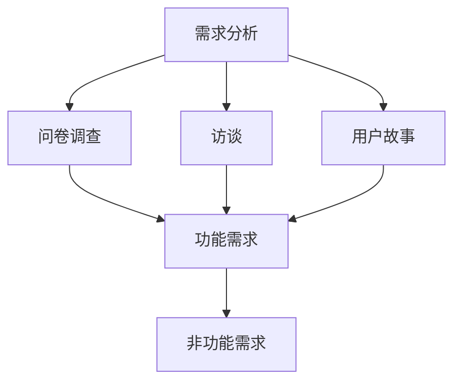
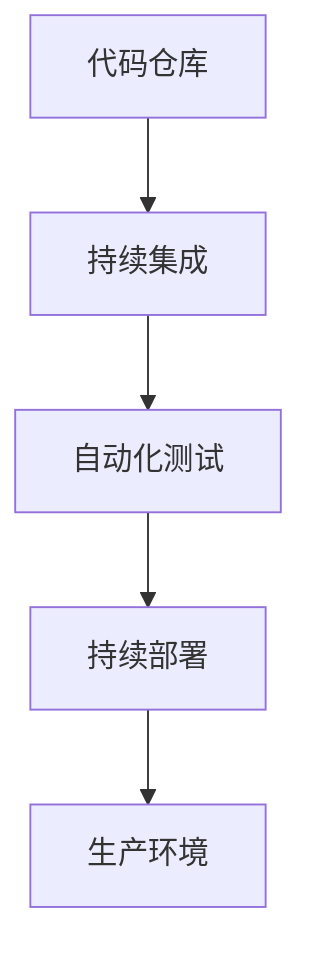
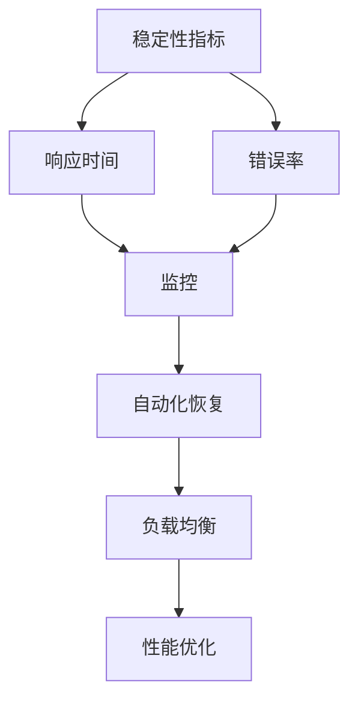
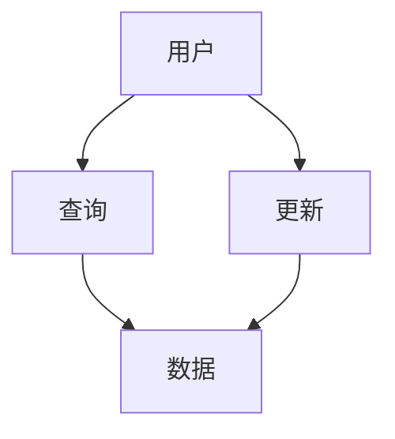
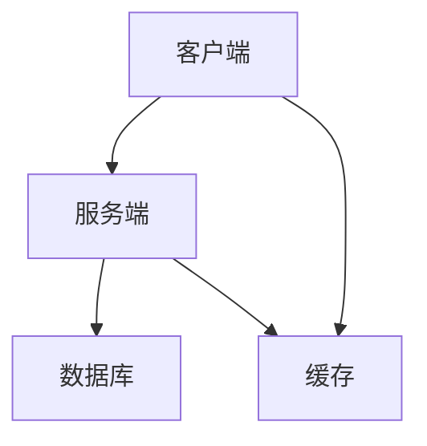
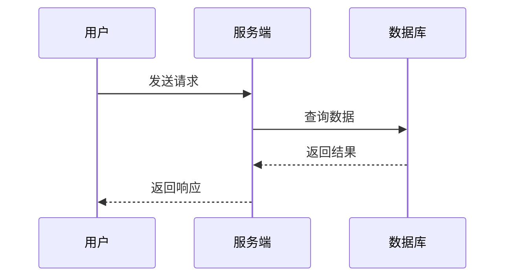

                 

### 《需求与持续部署的协调：确保大型应用的稳定性》

**关键词：需求分析，持续部署，大型应用，稳定性保障，CI/CD**

**摘要：**
本文深入探讨了需求分析与持续部署（CI/CD）在确保大型应用稳定性中的关键作用。通过系统化的分析和实际案例，本文阐述了如何平衡需求变更与持续集成、部署之间的矛盾，以实现大型应用的长期稳定运行。文章分为五个部分：背景与问题阐述、核心概念与联系、系统分析与架构设计、项目实战、最佳实践与总结，旨在为IT从业者提供一套实用的方法论和操作指南。

---

## **背景与问题阐述**

### **1. 需求分析的重要性**

需求分析是软件开发过程中的第一步，也是最重要的一步。它决定了软件产品的功能、性能和用户体验。然而，在大型应用开发中，需求往往频繁变更，这不仅增加了开发难度，也带来了潜在的风险。因此，如何有效地进行需求分析，确保需求与实际开发工作的一致性，是确保大型应用稳定性的关键。

### **2. 持续部署的概念**

持续部署（CI/CD）是近年来在软件开发中广泛应用的一种开发模式。它通过自动化流程，实现代码的持续集成和部署，从而提高开发效率，缩短交付周期。然而，持续部署也可能引入新的风险，如代码冲突、部署失败等，这些都会对应用的稳定性产生负面影响。

### **3. 大型应用稳定性保障**

大型应用通常需要处理大量的用户请求和复杂的数据处理任务，因此稳定性保障至关重要。这包括故障检测与恢复、负载均衡、性能优化等多个方面。在实际应用中，如何确保这些措施能够有效地执行，是保障大型应用稳定性的关键。

## **核心概念与联系**

### **1. 需求分析与模型**

**需求分析的方法与工具**：
- **问卷调查**：通过问卷调查收集用户需求。
- **访谈**：与关键用户和利益相关者进行深入访谈。
- **用户故事**：使用用户故事描述用户需求。

**需求模型的构建**：
- **功能需求**：定义软件应具备的功能。
- **非功能需求**：定义软件的性能、安全、可靠性等。

**需求与持续部署的关系**：
需求分析的结果直接影响持续部署的流程。明确的需求可以帮助开发团队更好地理解项目目标，从而设计出更高效的CI/CD流程。

### **2. 持续部署原理**

**持续集成与持续部署流程**：
- **持续集成**：将代码合并到主干分支，并自动进行测试。
- **持续部署**：在测试通过后，自动部署到生产环境。

**CI/CD的工具和平台**：
- **Jenkins**：一种流行的持续集成工具。
- **GitLab CI/CD**：GitLab内置的持续集成/持续部署平台。

**持续部署的挑战与解决方案**：
- **代码冲突**：解决方案包括使用版本控制系统和代码审查。
- **部署失败**：解决方案包括自动化测试和回滚机制。

### **3. 大型应用稳定性保障**

**稳定性指标**：
- **响应时间**：系统处理请求的时间。
- **错误率**：系统发生错误的频率。

**故障检测与恢复**：
- **监控**：实时监控系统性能和状态。
- **自动化恢复**：在检测到故障时，自动执行恢复操作。

**负载均衡与性能优化**：
- **负载均衡**：将请求均匀分配到多个服务器。
- **性能优化**：通过缓存、优化算法等手段提高系统性能。

### **核心概念与联系图解**

**需求分析模型图：**


**CI/CD模型架构图：**


**稳定性保障模型图：**


## **系统分析与架构设计**

### **1. 系统功能设计**

**系统功能描述**：
系统应具备用户注册、登录、数据查询、数据更新等功能。

**领域模型图：**


### **2. 系统架构设计**

**系统架构设计图：**


### **3. 系统接口设计**

**接口规范**：
- **用户注册接口**：接收用户名、密码等信息，返回注册结果。
- **登录接口**：接收用户名和密码，验证用户身份，返回登录状态。

**接口设计原则**：
- **标准化**：接口应遵循统一的标准和协议。
- **简洁性**：接口设计应简洁明了，易于使用。

**接口实现示例**：
```python
# 用户注册接口示例
def register(username, password):
    # 注册逻辑
    return "注册成功" if 注册成功 else "注册失败"

# 登录接口示例
def login(username, password):
    # 登录逻辑
    return "登录成功" if 登录成功 else "登录失败"
```

### **4. 系统交互设计**

**系统交互图：**


## **项目实战**

### **1. 项目介绍**

**项目背景**：
某大型电商平台需要进行一次系统升级，以应对日益增长的用户量和复杂的数据处理需求。

**项目目标**：
- 提高系统的稳定性和性能。
- 实现自动化部署，缩短交付周期。

**项目挑战**：
- 需求频繁变更，如何平衡需求与部署。
- 如何保障系统在高并发情况下的稳定性。

### **2. 环境安装与配置**

**所需工具和软件**：
- Jenkins：用于持续集成和部署。
- Docker：用于容器化部署。
- Kubernetes：用于集群管理。

**环境搭建步骤**：
1. 安装Jenkins。
2. 配置Jenkins插件。
3. 安装Docker和Kubernetes。
4. 部署应用程序到Kubernetes集群。

**常见问题与解决方案**：
- **Jenkins安装失败**：检查Jenkins服务器配置，确保满足安装要求。
- **Docker服务启动失败**：检查Docker服务状态，解决依赖问题。

### **3. 系统核心实现**

**核心代码示例**：
```python
# 用户注册接口实现
@app.route('/register', methods=['POST'])
def register():
    username = request.form['username']
    password = request.form['password']
    # 注册逻辑
    return jsonify({"status": "success", "message": "注册成功"}) if 注册成功 else jsonify({"status": "error", "message": "注册失败"})
```

**代码解读与分析**：
- 使用Flask框架实现用户注册接口。
- 接收POST请求，提取用户名和密码。
- 执行注册逻辑，返回注册结果。

### **4. 实际案例分析和详细讲解剖析**

**案例背景**：
在一次系统升级过程中，由于需求变更频繁，导致持续部署流程出现多次失败，系统稳定性受到影响。

**案例分析**：
- **问题定位**：通过日志分析，发现部分代码与现有系统不兼容，导致部署失败。
- **解决方案**：重新设计代码，确保与现有系统兼容。

**详细讲解剖析**：
- **代码兼容性测试**：在部署前进行代码兼容性测试，确保代码与现有系统无缝集成。
- **自动化部署**：使用Jenkins实现自动化部署，减少人工干预，提高部署效率。

### **5. 项目小结**

通过本次项目实践，我们成功实现了自动化部署，提高了系统稳定性。然而，在需求频繁变更的情况下，如何平衡需求与部署之间的关系，仍是一个挑战。未来，我们将进一步优化需求管理流程，确保系统稳定运行。

### **最佳实践与总结**

**最佳实践技巧**：
- **需求分析与CI/CD优化技巧**：明确需求，减少变更，确保需求与持续部署流程一致。
- **稳定性保障策略**：实时监控，自动化恢复，确保系统在高并发情况下的稳定性。
- **项目管理与团队协作**：明确责任，提高沟通效率，确保项目顺利进行。

**小结**：
本文通过对需求分析、持续部署和大型应用稳定性保障的深入探讨，提供了一套实用的方法论和操作指南。在实际应用中，平衡需求与部署之间的关系，是确保大型应用稳定性的关键。

**注意事项**：
- **需求变更管理**：定期评估需求变更的影响，确保需求与实际开发工作的一致性。
- **持续集成与部署**：确保CI/CD流程的稳定性和可靠性，减少部署失败的风险。

**拓展阅读推荐**：
- 《持续集成之道》（Continuous Delivery: Reliable Software Releases through Build, Test, and Deployment Automation）：详细介绍了CI/CD的最佳实践。
- 《大型分布式系统设计》（Designing Data-Intensive Applications）：探讨了大型应用的设计与优化策略。

---

**作者：AI天才研究院/AI Genius Institute & 禅与计算机程序设计艺术 /Zen And The Art of Computer Programming**

