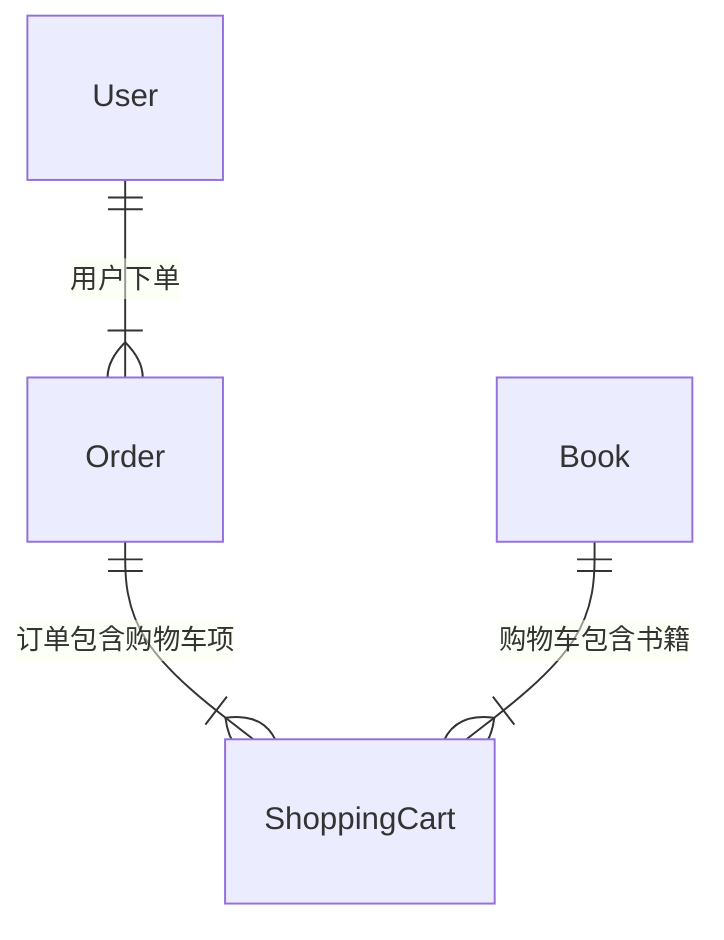

                 

## 1.1 需求分析的定义与重要性

### 什么是需求分析？

需求分析，是软件工程中至关重要的一环，它指的是对目标软件系统进行全面的了解和分析，确定其功能性和非功能性需求的过程。具体而言，需求分析包括识别用户需求、分析系统应具备的功能、性能、可靠性等特性，并将其转化为明确的、可衡量的系统需求规格说明书。

### 需求分析的重要性

需求分析之所以重要，原因有以下几点：

1. **确定开发方向**：通过需求分析，开发团队可以明确项目的目标和范围，避免在开发过程中走弯路，确保项目能够按计划顺利进行。

2. **降低开发风险**：在需求分析阶段，可以及早发现潜在的问题和风险，例如功能缺失、性能瓶颈等，从而提前制定解决方案，降低项目开发的风险。

3. **提升项目质量**：明确的需求可以指导开发人员编写高质量的代码，避免不必要的重复工作和错误，从而提高软件系统的质量和可靠性。

4. **增强客户满意度**：需求分析可以帮助开发团队更好地理解客户需求，确保最终交付的软件系统能够满足客户期望，提高客户满意度。

### 需求分析的主要任务

1. **收集需求**：通过与用户、项目经理、其他利益相关者进行沟通，收集关于软件系统的各种需求。

2. **分析需求**：对收集到的需求进行筛选、分类和整理，识别功能需求、非功能需求、用户需求等。

3. **需求文档编写**：将分析得到的需求整理成文档，包括需求规格说明书、用户故事、用例图等。

4. **需求验证和确认**：对需求文档进行评审，确保需求的完整性、正确性和可实现性，并得到利益相关者的确认。

### 需求分析的步骤

1. **需求获取**：通过访谈、问卷调查、用户调研等方式获取用户需求。

2. **需求建模**：使用用例图、用户故事、实体关系图（ER图）等工具对需求进行建模。

3. **需求分析**：对需求模型进行详细分析，确定需求的优先级和可行性。

4. **需求文档编写**：编写需求规格说明书，描述系统应具备的功能、性能、可靠性等。

5. **需求评审与确认**：组织评审会议，对需求文档进行审查和确认，确保需求的正确性和完整性。

通过上述步骤，开发团队可以确保对系统需求的全面理解和准确把握，为后续的软件设计和开发打下坚实的基础。

### 需求分析的工具与技术

在需求分析过程中，会用到多种工具和技术，这些工具和技术帮助开发团队更有效地识别和整理需求。

1. **访谈与问卷调查**：通过与用户的直接沟通，了解他们的需求、期望和痛点。

2. **用例图**：用例图（Use Case Diagram）是需求建模的一种常用工具，它展示系统与外部用户（Actor）的交互，有助于识别系统的功能和用户角色。

3. **用户故事**：用户故事（User Story）是敏捷开发中常用的一种需求表达方式，它以用户的视角描述功能需求，通常采用“As a [用户角色]，I want [功能]，so that [目的】”的结构。

4. **实体关系图（ER图）**：实体关系图（Entity-Relationship Diagram）用于描述系统中数据实体及其相互关系，有助于数据库设计和需求分析。

5. **需求跟踪工具**：如Jira、Confluence等，这些工具可以帮助团队记录、管理和跟踪需求，确保需求的实现和验证。

通过结合使用这些工具和技术，开发团队能够更系统、更高效地完成需求分析工作，为软件系统的成功奠定基础。

## 1.2 需求分析的过程与方法

### 需求分析的过程

需求分析是一个系统性的工程，通常包括以下几个关键步骤：

1. **需求获取**：这一步骤的主要任务是了解并收集用户的需求。通常的方法包括访谈、问卷调查、用户调研等，通过与用户直接沟通，获取第一手的需求信息。

2. **需求建模**：在获取了初步的需求后，需要对其进行建模。常用的建模工具包括用例图、用户故事、实体关系图（ER图）等。通过这些工具，可以将抽象的需求转化为可视化的模型，便于团队成员理解和沟通。

3. **需求分析**：需求建模完成后，需要对模型进行详细分析。分析的任务包括识别需求的优先级、可行性、以及需求的冲突和冗余。这一步骤有助于确保需求的准确性和完整性。

4. **需求文档编写**：将分析得到的需求整理成文档，包括需求规格说明书、用户故事、用例图等。需求文档是后续开发工作的指导性文件，必须详细、准确、易于理解。

5. **需求评审与确认**：组织评审会议，对需求文档进行审查和确认。评审的目的是确保需求的正确性、完整性、一致性和可实现性，并得到利益相关者的认可。

### 需求分析的方法

1. **文档分析**：通过分析现有的文档，如用户手册、业务流程文档等，来获取需求信息。这种方法适用于已有系统或业务流程相对稳定的场景。

2. **问卷调查**：通过设计问卷，向用户收集需求信息。这种方法适用于大规模用户群体，可以快速获取广泛的需求。

3. **用户访谈**：通过与用户进行一对一的访谈，深入了解用户的需求和期望。这种方法适用于需要深入了解用户需求的复杂场景。

4. **场景模拟**：通过构建用户使用软件的场景，观察并记录用户的操作行为，来识别潜在的需求。这种方法适用于需要深入了解用户使用习惯和需求的场景。

5. **头脑风暴**：组织团队头脑风暴会议，集体讨论和思考软件系统的需求。这种方法适用于需求初期，有助于激发创意和发现潜在的需求。

### 需求分析的最佳实践

1. **定期回顾与更新**：需求不是一成不变的，随着项目的进展和外部环境的变化，需求也会发生变化。因此，需要定期回顾和更新需求文档，确保其与实际情况保持一致。

2. **保持沟通**：需求分析的各个环节都需要保持与用户的紧密沟通，确保需求准确传达并得到及时反馈。

3. **文档规范化**：确保需求文档的结构清晰、内容规范，方便团队成员阅读和理解。

4. **使用自动化工具**：利用需求管理工具，如Jira、Confluence等，来记录、管理和跟踪需求，提高工作效率。

通过上述过程和方法的有机结合，开发团队可以更高效地完成需求分析工作，为后续的软件开发奠定坚实基础。

### 1.3 需求分析的工具与技术

在进行需求分析时，选择合适的工具和技术至关重要。这些工具和技术不仅能提高需求收集和管理的效率，还能确保需求的准确性和一致性。以下是一些常用的需求分析工具和技术：

1. **访谈与问卷调查**：访谈是获取用户需求的重要手段，通过与用户面对面交流，可以深入了解他们的需求和痛点。问卷调查则适用于大规模用户群体，可以通过设计合理的问卷，快速收集广泛的需求信息。

2. **用例图（Use Case Diagram）**：用例图是一种可视化工具，用于描述系统与外部用户（Actor）的交互。它清晰地展示了系统的功能和用户角色，有助于团队成员理解系统的使用场景和需求。

3. **用户故事（User Story）**：用户故事是一种简洁的需求表达方式，通常采用“As a [用户角色]，I want [功能]，so that [目的】”的结构。它适用于敏捷开发，可以帮助团队快速迭代和优先级管理。

4. **实体关系图（ER Diagram）**：实体关系图用于描述系统中数据实体及其相互关系。它有助于数据库设计和需求分析，使得数据需求更加清晰和易于管理。

5. **需求管理工具**：如Jira、Confluence等，这些工具可以用于记录、管理和跟踪需求。它们提供了丰富的功能，如需求版本控制、需求优先级管理、需求状态跟踪等，极大地提高了需求管理的工作效率。

6. **思维导图（Mind Map）**：思维导图是一种图形化的工具，用于组织和展示需求。它可以帮助团队理清需求之间的逻辑关系，便于整体把握和梳理需求。

7. **场景模拟（Scenario Simulation）**：场景模拟是一种通过构建虚拟场景来分析用户需求的方法。通过模拟用户的使用行为，可以发现潜在的需求和问题，有助于完善需求分析。

8. **原型设计（Prototype Design）**：原型设计是通过创建软件的原型，来验证和改进需求。通过迭代设计和反馈，可以快速调整和优化需求，确保最终的软件系统能够满足用户需求。

通过综合运用这些工具和技术，开发团队可以更高效、更准确地完成需求分析工作，为后续的软件开发提供坚实的基础。每种工具和技术都有其独特的优势和应用场景，选择合适的工具组合，能够最大程度地提高需求管理的效率和质量。

## 第2章：需求分类与建模

### 2.1 功能需求与非功能需求

在需求分析过程中，需求通常被分为功能需求和非功能需求两大类。这两类需求在性质、内容和处理方式上都有所不同。

#### 功能需求

功能需求指的是系统必须提供哪些具体功能，以满足用户的使用需求。例如，一个在线购物系统需要支持用户注册、登录、浏览商品、添加购物车、下订单等基本功能。功能需求通常具有以下特点：

- **具体性**：功能需求描述的是系统需要实现的具体操作或功能，是用户可以直接感受到的。
- **可测试性**：功能需求通常可以转化为可测试的测试用例，以便在开发完成后对系统进行验证。
- **优先级**：根据用户的重要性和开发的紧迫性，功能需求有不同的优先级，通常需要按优先级进行开发和测试。

#### 非功能需求

非功能需求则是指系统在实现功能过程中需要满足的性能、安全性、可靠性等要求。这些需求通常不直接反映在用户界面上，但它们对系统的整体性能和用户体验有重要影响。例如，一个在线购物系统需要具备高并发处理能力、数据安全性保障、系统响应时间短等非功能需求。非功能需求通常包括以下几类：

- **性能需求**：例如系统的响应时间、处理能力、数据吞吐量等。
- **安全性需求**：包括数据加密、访问控制、身份验证等安全措施。
- **可靠性需求**：如系统的容错能力、高可用性、故障恢复能力等。
- **兼容性需求**：确保系统能在不同平台、浏览器和操作系统上正常运行。
- **可用性需求**：系统的易用性、界面设计、用户交互体验等。

### 2.2 用户需求与系统需求

在需求分析过程中，我们还会区分用户需求（User Requirements）和系统需求（System Requirements）。

#### 用户需求

用户需求是指用户对系统的期望和使用需求，反映了用户对系统功能的感知和体验。用户需求通常来源于用户访谈、问卷调查、场景模拟等获取方法。例如，一个在线教育平台用户可能希望系统具备以下功能：

- 用户可以自由注册和登录；
- 用户可以浏览课程和课程内容；
- 用户可以在线提交作业和查看成绩；
- 用户可以在论坛上与其他用户互动和交流。

#### 系统需求

系统需求则是从技术角度描述为了满足用户需求，系统需要具备的具体功能和技术规范。系统需求通常由功能需求和非功能需求构成，它们具体描述了系统应如何实现用户需求。例如，为了满足上述在线教育平台用户的期望，系统需求可能包括：

- **用户管理功能**：实现用户注册、登录、权限控制等功能；
- **课程管理功能**：提供课程发布、更新、查询等功能；
- **作业管理功能**：实现作业发布、提交、批改、成绩查询等功能；
- **论坛功能**：提供用户交流的平台，包括发帖、回帖、评论等功能；
- **性能需求**：确保系统能支持大量用户的同时在线，响应时间小于2秒；
- **安全性需求**：采用HTTPS协议，确保数据传输安全，定期备份数据等。

通过区分用户需求与系统需求，开发团队可以更清晰地理解用户期望，并据此设计和开发出符合用户需求的系统。

### 2.3 需求建模的常用方法

为了更好地理解和表达需求，需求建模是一种常用的方法。常用的需求建模方法包括用例图（Use Case Diagram）、用户故事（User Story）、实体关系图（ER Diagram）等。

#### 用例图

用例图是需求建模中最为常用的工具之一，它用于描述系统与用户之间的交互关系。用例图包含以下几个基本元素：

- **用例（Use Case）**：描述系统可以完成的一个功能；
- **角色（Actor）**：使用系统的人员或外部系统；
- **关联（Association）**：用例与角色之间的交互关系；
- **扩展（Extension）**：描述特殊情况下的交互流程。

用例图示例：

```mermaid
usecase Diagram {
  participant User : 用户
  participant System : 系统管理
  User --> "登录系统" : 登录
  User --> "浏览课程" : 浏览课程
  System --> "管理用户" : 管理用户
}
```

#### 用户故事

用户故事是一种简洁明了的需求表达方式，通常用于敏捷开发。用户故事遵循以下结构：“As a [用户角色]，I want [功能]，so that [目的]”。用户故事示例：

"As a Student, I want to submit assignments online, so that I can easily track my progress and receive timely feedback."

#### 实体关系图

实体关系图（ER Diagram）用于描述系统中数据实体及其相互关系。ER图包括以下几个基本元素：

- **实体（Entity）**：系统中的数据对象，如用户、课程、作业等；
- **属性（Attribute）**：实体的特征，如用户ID、姓名、密码等；
- **关系（Relationship）**：实体之间的关联，如用户与课程之间的选修关系。

ER图示例：

```mermaid
entity Relation {
  User : [UserID, Name, Password]
  Course : [CourseID, Title, Description]
  Assignment : [AssignmentID, Title, SubmissionDate]
}
```

通过使用这些需求建模方法，开发团队可以更清晰地表达和理解需求，从而确保需求的准确性和一致性。

### 3.1 需求文档的结构与内容

需求文档是需求分析过程中最重要的成果之一，它详细描述了系统的功能需求、非功能需求和设计约束。一个完整的需求文档不仅有助于开发团队理解系统的需求，还能为后续的设计和开发提供依据。以下是需求文档的基本结构和内容：

#### 1. 引言

引言部分主要介绍需求文档的目的、背景和范围。具体内容包括：

- **项目背景**：简述项目的起源和目的，说明项目为何重要以及预期达到的目标。
- **文档目的**：明确需求文档的目标读者，以及文档在项目中的角色和作用。
- **范围**：详细描述需求文档覆盖的范围，包括系统功能、非功能需求以及适用的环境和条件。

#### 2. 功能需求

功能需求部分详细描述系统需要实现的具体功能。每个功能通常包括以下内容：

- **功能编号**：为每个功能分配一个唯一的编号，便于管理。
- **功能名称**：简洁明了地描述功能的名称。
- **功能描述**：详细说明功能的目的、功能实现的具体步骤和预期效果。
- **输入**：列出实现该功能所需的输入参数或数据。
- **输出**：描述该功能执行完成后产生的输出结果或报告。
- **优先级**：根据功能的重要性和紧急性，为每个功能分配优先级。

#### 3. 非功能需求

非功能需求部分描述系统在实现功能过程中需要满足的性能、安全性、可靠性等要求。具体内容包括：

- **性能需求**：如系统响应时间、并发用户数、数据吞吐量等。
- **安全性需求**：如数据加密、访问控制、身份验证等。
- **可靠性需求**：如系统容错能力、故障恢复时间、高可用性等。
- **兼容性需求**：如系统支持的操作系统、浏览器、硬件平台等。
- **可用性需求**：如系统的易用性、用户体验、界面设计等。

#### 4. 用户界面需求

用户界面需求部分描述系统的用户界面设计，包括界面布局、交互设计、颜色方案等。具体内容包括：

- **界面布局**：描述各个界面元素的位置和布局。
- **交互设计**：描述用户与系统交互的方式和流程。
- **颜色和字体**：定义系统的颜色和字体方案，确保界面美观、易读。

#### 5. 系统接口需求

系统接口需求部分描述系统与其他系统或组件的接口，包括接口的协议、数据格式、接口参数等。具体内容包括：

- **接口名称**：为每个接口分配一个唯一的名称。
- **接口协议**：描述接口采用的网络协议和数据交换格式。
- **数据格式**：定义接口传输的数据格式，如JSON、XML等。
- **接口参数**：列出接口的输入参数和输出参数。

#### 6. 系统环境需求

系统环境需求部分描述系统运行所需的环境条件，包括硬件、软件、网络等。具体内容包括：

- **硬件需求**：列出系统运行所需的硬件配置，如CPU、内存、硬盘空间等。
- **软件需求**：列出系统运行所需的软件环境，如操作系统、数据库、中间件等。
- **网络需求**：描述系统对网络连接的要求，如带宽、延迟等。

#### 7. 需求变更管理

需求变更管理部分描述如何管理需求变更，包括变更的流程、权限、影响评估等。具体内容包括：

- **变更流程**：描述需求变更的流程，包括需求提出、评估、批准、实施等步骤。
- **变更权限**：明确谁有权提出和批准需求变更，以及变更的审批权限级别。
- **影响评估**：描述需求变更对项目进度、成本、质量等方面的影响，并提供应对措施。

#### 8. 术语表

术语表部分列出在需求文档中使用的术语和定义，确保所有读者对术语的理解一致。具体内容包括：

- **术语**：列出需求文档中使用的专业术语。
- **定义**：为每个术语提供明确的定义。

通过上述结构和内容，需求文档可以系统地、清晰地描述系统的需求，为项目团队提供明确的指导和依据。一个完整的需求文档不仅有助于开发团队理解系统的需求，还能为后续的设计和开发提供可靠的基础。

### 3.2 需求文档的编写规范

编写规范是确保需求文档质量和可读性的关键。以下是一些常用的编写规范：

#### 1. 文档格式

- **字体和大小**：使用清晰易读的字体，如Times New Roman，字号一般使用12号。
- **段落格式**：段落之间应保持适当的间距，避免段落过于紧凑。
- **章节编号**：使用统一的章节编号，便于文档阅读和索引。
- **列表和表格**：使用列表和表格来清晰地呈现信息，提高文档的可读性。

#### 2. 文档结构

- **引言**：介绍文档的目的、背景和读者对象。
- **功能需求**：详细描述系统的功能需求，包括编号、名称、描述、输入、输出和优先级。
- **非功能需求**：描述系统的非功能需求，如性能、安全性、可靠性等。
- **用户界面需求**：详细描述用户界面设计，包括布局、交互设计和颜色方案。
- **系统接口需求**：描述系统与其他系统或组件的接口，包括协议、数据格式和接口参数。
- **系统环境需求**：描述系统运行所需的环境条件，如硬件、软件和网络需求。
- **需求变更管理**：描述需求变更的流程、权限和影响评估。
- **术语表**：列出文档中使用的专业术语和定义。

#### 3. 文档内容

- **简洁明了**：避免使用复杂、模糊的语言，确保每个需求都能被清楚地理解。
- **一致性**：确保文档中的术语、格式和表述风格一致，避免混淆和误解。
- **准确性**：确保需求描述的准确性，避免遗漏或错误。
- **完整性**：确保文档覆盖所有关键需求，没有遗漏。
- **可追溯性**：为每个需求分配唯一标识符，便于跟踪和追溯。

#### 4. 编写技巧

- **使用动词**：使用明确的动词来描述需求，使需求更具描述性。
- **避免重复**：避免在文档中重复相同的信息，保持内容的简洁。
- **使用图表**：使用图表、列表和表格来辅助说明复杂的需求，提高可读性。
- **审查和验证**：在编写完成后，组织团队进行审查和验证，确保文档的质量和准确性。

通过遵循这些编写规范，可以确保需求文档的结构清晰、内容准确、易于理解和实施，为项目的成功提供坚实的基础。

### 3.3 需求评审与确认

需求评审与确认是需求管理过程中的关键环节，其目的是确保需求的完整性、一致性和可实现性，并获得利益相关者的认可。以下是一系列关于需求评审与确认的详细步骤和注意事项：

#### 需求评审的步骤

1. **初步评审**：在需求文档编写完成后，首先由开发团队内部进行初步评审。这一步骤的主要目的是发现文档中的错误、遗漏和不一致之处，并进行必要的修改。

2. **专家评审**：邀请系统分析员、项目经理、开发人员、测试人员等专业人士对需求文档进行评审。专家评审有助于从不同角度审视需求，发现潜在的问题，并确保需求与业务目标的一致性。

3. **利益相关者评审**：邀请项目的利益相关者，如客户、用户、市场部门等，对需求文档进行评审。这一步骤的目的是确保需求能够真正满足用户和业务需求，并获得利益相关者的认可。

4. **编写评审报告**：将评审过程中发现的问题和意见整理成评审报告，报告应详细记录每个问题的发现、处理意见和解决方案。

5. **需求确认**：在评审报告经过讨论和修改后，再次提交给利益相关者进行确认。确认过程应确保所有关键需求和变更都得到利益相关者的同意，并签署确认书。

6. **最终评审**：在需求确认后，进行最终评审，确保所有需求已经得到全面、准确的表述，并符合项目目标和规范。

#### 需求确认的注意事项

1. **全面性**：确保需求文档覆盖所有关键功能和非功能需求，没有遗漏。

2. **一致性**：需求文档中的各项需求应保持一致，避免冲突和重复。

3. **可测试性**：每个需求都应具有可测试性，以便后续的测试和验证。

4. **可实现性**：评估需求的可实现性，确保需求在技术和管理上都是可行的。

5. **可理解性**：需求文档应使用清晰、简洁的语言，便于团队成员理解和实施。

6. **变更控制**：建立完善的变更控制流程，确保需求变更得到适当的评审和确认。

7. **利益相关者参与**：确保所有关键利益相关者参与评审和确认过程，提高需求的准确性和可靠性。

通过严格的需求评审和确认流程，可以确保需求文档的质量和准确性，为后续的软件设计和开发奠定坚实的基础。

### 4.1 数据管理的定义与目标

#### 数据管理的定义

数据管理是指通过一系列的策略、流程、技术和工具来确保数据的可靠性、完整性、安全性、可用性和有效性。具体而言，数据管理涉及对数据从创建、存储、处理、传输到最终销毁的全生命周期进行管理。

#### 数据管理的目标

数据管理的目标主要有以下几个方面：

1. **数据可靠性**：确保数据在任何时候都是准确、一致和可信赖的。这意味着数据管理需要确保数据的正确性、完整性和一致性。

2. **数据完整性**：确保数据在存储和传输过程中不被篡改、丢失或损坏。这需要通过数据备份、数据恢复和故障转移等机制来实现。

3. **数据安全性**：保护数据免受未经授权的访问、泄露、篡改和破坏。这包括数据加密、访问控制、身份验证和审计等安全措施。

4. **数据可用性**：确保数据在需要时能够被快速、高效地访问和检索。这要求建立高效的数据库和存储系统，以及优化的数据查询和管理策略。

5. **数据有效性**：确保数据能够支持业务决策和操作，并且数据的使用能够带来实际的价值。这需要数据的质量管理、数据分析和数据可视化等技术。

#### 数据管理的重要性

数据管理在当今的信息化社会中具有至关重要的意义，原因如下：

1. **信息价值最大化**：通过有效的数据管理，企业能够从大量数据中提取有价值的信息，支持业务决策和运营优化。

2. **风险控制**：数据管理能够帮助企业识别和降低数据相关的风险，如数据泄露、数据丢失和合规性风险。

3. **合规性**：许多行业都有严格的合规性要求，如金融、医疗和零售等行业。有效的数据管理能够确保企业遵守相关法规和标准。

4. **运营效率**：通过自动化和优化的数据管理流程，企业可以提高数据处理和操作的效率，降低运营成本。

5. **用户体验**：在电子商务和在线服务等领域，良好的数据管理能够提供更快速、更个性化的用户体验。

#### 数据管理的主要活动

数据管理包括以下主要活动：

1. **数据规划**：确定数据管理的目标、策略和资源需求。
2. **数据建模**：设计数据的结构和关系，确保数据的逻辑一致性和可扩展性。
3. **数据存储**：选择合适的存储技术和方案，确保数据的可靠性和高效访问。
4. **数据集成**：整合来自不同来源的数据，确保数据的一致性和完整性。
5. **数据质量**：确保数据的准确性、完整性和一致性，通过数据清洗、校验和监控等手段。
6. **数据分析和报告**：利用数据分析和报告工具，提取业务洞察，支持决策和优化。
7. **数据安全**：实施安全策略和措施，保护数据免受威胁和攻击。

通过上述数据管理活动，企业能够确保数据在生命周期内的有效管理，为业务发展提供坚实的基础。

### 4.2 数据库系统的基本概念

#### 数据库系统的定义

数据库系统（Database System）是指用于存储、管理、检索和维护数据的计算机系统。它由数据库（Database）、数据库管理系统（Database Management System，DBMS）和应用程序组成。

#### 数据库系统的组成

1. **数据库**：数据库是存储数据的容器，它由一系列相互关联的表（Table）组成，每个表包含一系列字段（Field），用于存储具体的数据。数据库中的数据以结构化的形式组织，便于快速检索和管理。

2. **数据库管理系统（DBMS）**：DBMS 是数据库系统的核心，它负责数据的管理、操作和维护。DBMS 提供了数据定义语言（DDL）、数据操作语言（DML）、数据控制语言（DCL）等，以实现对数据的创建、修改、查询和控制。

3. **应用程序**：应用程序是使用数据库进行数据操作的用户界面，如客户关系管理（CRM）系统、企业资源规划（ERP）系统等。

#### 数据库系统的特点

- **数据结构化**：数据库系统以结构化的方式存储数据，便于数据检索和管理。
- **数据共享性**：多个应用程序可以共享同一个数据库，提高数据利用率。
- **数据独立性**：数据库系统提供数据逻辑结构和物理结构之间的独立性，即数据的物理存储方式和访问方式的变化不会影响应用程序。
- **数据安全性**：DBMS 提供数据安全机制，如访问控制、用户认证和审计等，保护数据不被未授权访问和篡改。
- **数据完整性**：数据库系统通过完整性约束（如主键、外键、唯一性约束等）确保数据的准确性、完整性和一致性。

#### 常见的数据库类型

1. **关系型数据库**：如 MySQL、Oracle、SQL Server 等，采用关系模型进行数据组织和管理。
2. **非关系型数据库**：如 MongoDB、Cassandra、Redis 等，采用文档、键值对、图等模型进行数据存储。
3. **分布式数据库**：如 HBase、Couchbase、Google Spanner 等，支持跨多个节点分布式存储和管理数据。

#### 数据库设计的基本原则

- **规范化**：通过规范化（Normalization）减少数据冗余，提高数据的一致性和完整性。
- **灵活性**：设计灵活的数据库结构，以适应业务变化和扩展需求。
- **高效性**：优化数据库性能，如索引设计、查询优化、存储策略等。
- **安全性**：确保数据安全，包括数据加密、访问控制、备份和恢复等。
- **可扩展性**：设计可扩展的数据库架构，支持数据的增加和性能提升。

通过理解数据库系统的基本概念、组成和特点，开发团队可以更好地设计、实现和维护高效的数据库系统，满足业务需求。

### 4.3 数据库设计的基本原则

在进行数据库设计时，遵循一系列基本原则是确保数据库高效、可靠、易于维护的关键。以下是数据库设计的一些核心原则：

#### 1. 完整性约束

**定义**：完整性约束是确保数据库中数据完整性和一致性的规则。常见的完整性约束包括主键约束、外键约束、唯一性约束和检查约束。

**重要性**：完整性约束能够防止数据不一致、重复和错误，确保数据的准确性和可靠性。

**示例**：在一个学校数据库中，学生表（Student）中的学号（StudentID）可以是主键，以确保每个学生的学号唯一；课程表（Course）中的课程号（CourseID）可以是外键，引用学生表中的学号，确保选课记录与学生记录的关联性。

#### 2. 规范化

**定义**：规范化是通过将数据分解为多个表，消除冗余数据并确保数据结构的一致性。

**重要性**：规范化有助于减少数据冗余，提高数据的灵活性和一致性。

**示例**：在一个图书馆数据库中，可以设计多个表，如图书表（Book）、作者表（Author）、分类表（Category）和借阅记录表（BorrowRecord）。通过规范化，图书信息中的作者信息、分类信息可以单独存储在各自的表中，避免了冗余和更新异常。

#### 3. 索引设计

**定义**：索引是数据库中一种特殊的数据结构，用于加快数据查询速度。索引通常根据表中的某个或多个字段创建。

**重要性**：良好的索引设计能够显著提高查询性能，特别是在处理大量数据时。

**示例**：在一个电子商务数据库中，可以创建商品名称（ProductName）和商品编号（ProductID）的索引，以加快商品搜索和查询操作。

#### 4. 分区和分片

**定义**：分区是将一个大表拆分成多个小表，每个小表对应表的一部分数据。分片是将数据分布到多个物理节点上。

**重要性**：分区和分片能够提高数据库的并发处理能力和扩展性，尤其在大规模数据处理和分布式系统中。

**示例**：在一个社交媒体数据库中，可以根据用户活跃度将用户表（User）分区，按照地区或时间进行分片，以优化数据访问和存储。

#### 5. 优化查询

**定义**：查询优化是设计高效的数据查询策略，减少查询时间和资源消耗。

**重要性**：优化查询能够提高系统的响应速度，减少计算资源的使用，提高用户体验。

**示例**：通过分析查询模式和性能指标，调整数据库配置、索引策略和查询语句，以优化查询性能。

#### 6. 数据加密和安全

**定义**：数据加密是将数据转换为无法读取的形式，确保数据在存储和传输过程中的安全性。

**重要性**：数据加密是保护数据隐私和安全的重要措施，防止未授权访问和数据泄露。

**示例**：对敏感数据进行加密存储，如用户密码、信用卡信息等，并使用安全协议（如SSL/TLS）保护数据在传输过程中的安全。

通过遵循上述基本原则，开发团队能够设计出高效、可靠、安全的数据库系统，满足业务需求并支持未来的扩展。

### 4.4 数据库设计的方法与步骤

#### 方法

数据库设计主要包括三种方法：实体-关系（E-R）建模、第三范式（3NF）建模和第四范式（4NF）建模。以下是对这些方法的简要介绍：

1. **实体-关系（E-R）建模**：
   - **定义**：E-R建模是一种结构化建模方法，用于描述系统中实体及其相互关系。
   - **特点**：直观、易于理解，适用于复杂系统的需求分析。
   - **应用场景**：适用于大多数关系型数据库设计。

2. **第三范式（3NF）建模**：
   - **定义**：3NF建模是一种规范化方法，用于消除数据库中的冗余和更新异常。
   - **特点**：规范化程度高，数据一致性较好。
   - **应用场景**：适用于规范化和一致性要求较高的系统。

3. **第四范式（4NF）建模**：
   - **定义**：4NF建模是在3NF基础上，进一步消除“多值依赖”的一种规范化方法。
   - **特点**：规范化程度更高，适用于复杂的数据关系。
   - **应用场景**：适用于高度复杂、多维度数据关系系统的设计。

#### 步骤

1. **需求分析**：
   - **步骤**：收集并分析业务需求，确定系统功能、数据结构和用户需求。
   - **工具**：访谈、问卷调查、用例图等。

2. **概念模型设计**：
   - **步骤**：使用E-R图等工具构建系统的概念模型。
   - **目标**：明确实体及其关系，建立初步的数据结构。

3. **逻辑模型设计**：
   - **步骤**：将概念模型转化为逻辑模型，如关系模型。
   - **工具**：ER图、数据流图等。

4. **规范化**：
   - **步骤**：对逻辑模型进行规范化，消除冗余和数据异常。
   - **方法**：采用第三范式（3NF）或第四范式（4NF）。

5. **物理模型设计**：
   - **步骤**：将逻辑模型转化为物理模型，如具体的数据库表结构。
   - **工具**：数据库管理系统（DBMS）提供的工具。

6. **数据库实现**：
   - **步骤**：在DBMS中创建数据库和表结构，进行初步数据加载。
   - **目标**：实现逻辑模型中的数据结构和功能。

7. **测试与优化**：
   - **步骤**：测试数据库性能，包括查询速度、并发处理能力和数据完整性。
   - **目标**：优化数据库设计，提高系统性能。

通过上述步骤和方法，开发团队能够系统地设计和实现高效的数据库系统，满足业务需求。

### 4.5 数据库的维护和管理

数据库的维护和管理是确保数据库系统稳定、高效运行的关键环节。以下是数据库维护和管理的一些关键步骤和策略：

#### 1. 数据备份

**定义**：数据备份是将数据库中的数据复制到其他存储介质上的过程，以防止数据丢失或损坏。

**重要性**：定期备份可以确保在系统故障、人为错误或数据泄露等情况下，数据能够迅速恢复。

**策略**：
- **全量备份**：定期对整个数据库进行备份。
- **增量备份**：只备份自上次备份以来发生变更的数据。
- **热备份**：在数据库运行时进行备份，不影响正常操作。
- **冷备份**：在数据库关闭时进行备份，确保数据一致性。

#### 2. 数据恢复

**定义**：数据恢复是指从备份介质中恢复数据库数据的过程。

**重要性**：数据恢复是数据库维护的核心任务之一，确保在数据丢失或损坏时能够快速恢复。

**策略**：
- **自动化恢复**：使用数据库管理工具自动化恢复流程，减少手动操作的错误。
- **定期测试**：定期测试备份和恢复流程，确保其有效性和可行性。
- **灾难恢复计划**：制定详细的灾难恢复计划，包括数据恢复步骤、责任分配和应急响应。

#### 3. 性能监控

**定义**：性能监控是指持续监测数据库的性能，包括响应时间、并发处理能力、资源使用等。

**重要性**：性能监控可以帮助及时发现并解决性能瓶颈，确保数据库的高效运行。

**策略**：
- **监控工具**：使用专业的数据库监控工具，如Prometheus、Grafana等。
- **性能指标**：监控关键性能指标，如CPU使用率、内存使用率、I/O延迟等。
- **定期审查**：定期审查性能监控数据，识别并解决潜在的性能问题。

#### 4. 安全管理

**定义**：安全管理是指保护数据库安全，防止未授权访问、数据泄露和损坏。

**重要性**：数据库是企业的核心数据资产，安全管理是确保数据安全的关键。

**策略**：
- **身份验证**：使用强密码和双因素认证，确保只有授权用户才能访问数据库。
- **访问控制**：根据用户角色和权限，限制对数据库的访问和操作。
- **加密**：对敏感数据进行加密存储，防止数据泄露。
- **审计**：记录数据库操作日志，定期审计，确保操作符合安全政策。

#### 5. 系统升级和维护

**定义**：系统升级和维护是指定期更新数据库管理系统（DBMS）和数据库应用，以修复漏洞、提升性能和兼容性。

**重要性**：定期升级和维护可以确保数据库系统的稳定性和安全性。

**策略**：
- **版本管理**：跟踪DBMS和数据库应用的版本更新，评估升级的必要性和影响。
- **测试**：在升级前进行充分测试，确保升级不会影响数据库的正常运行。
- **备份**：在升级前进行全量备份，确保升级失败时可以快速恢复。

通过实施这些维护和管理策略，开发团队可以确保数据库系统的稳定性、安全性和高效性，为业务提供可靠的支持。

### 4.6 数据库的性能优化

数据库性能优化是提升数据库系统响应速度和效率的关键步骤。以下是数据库性能优化的几个关键策略：

#### 1. 查询优化

**定义**：查询优化是指通过调整查询语句、索引和数据库配置，提高查询效率。

**重要性**：查询优化是数据库性能优化的核心，直接影响系统的响应时间和用户体验。

**策略**：
- **分析查询模式**：了解系统中最常用的查询类型和模式，针对高频查询进行优化。
- **使用索引**：为常用的查询字段创建适当的索引，减少查询扫描的数据量。
- **优化查询语句**：避免使用子查询、 unions 和临时表，优化查询语句的结构。
- **查询缓存**：使用查询缓存来存储频繁访问的数据，减少数据库的查询次数。

#### 2. 数据库配置优化

**定义**：数据库配置优化是指调整数据库服务器的参数和配置，以提高整体性能。

**重要性**：合理的数据库配置可以显著提高系统性能，特别是针对高并发和大数据量的场景。

**策略**：
- **内存配置**：根据系统负载和服务器资源，合理配置内存，确保数据库缓存和数据字典的足够空间。
- **I/O配置**：优化磁盘I/O性能，如使用固态硬盘（SSD）、调整文件系统参数等。
- **并发配置**：调整并发参数，如连接池大小、线程数等，以优化并发处理能力。
- **参数调整**：根据具体的数据库类型（如MySQL、Oracle等），调整相关性能参数，如缓冲池大小、查询缓存大小等。

#### 3. 数据库架构优化

**定义**：数据库架构优化是指通过调整数据库架构和设计，提高数据库的整体性能。

**重要性**：优化数据库架构可以减少数据冗余、提高数据一致性和查询效率。

**策略**：
- **规范化与反规范化**：在满足需求的前提下，平衡规范化和反规范化的使用，减少数据冗余。
- **分区和分片**：将大数据表分区或分片到多个物理节点，提高查询和写入性能。
- **数据分布**：合理分布数据，避免热点数据集中导致的性能瓶颈。

#### 4. 事务管理优化

**定义**：事务管理优化是指通过优化数据库的事务处理，提高系统的并发性和稳定性。

**重要性**：事务管理优化直接影响数据库的并发处理能力和数据一致性。

**策略**：
- **最小化事务范围**：尽量缩短事务的执行时间，减少事务锁争用。
- **使用批量操作**：使用批量插入、更新和删除操作，减少事务的执行次数。
- **隔离级别优化**：根据业务需求和系统负载，选择合适的事务隔离级别，如读未提交、读已提交、可重复读和串行化。

通过上述策略，开发团队能够有效地优化数据库性能，确保系统的高效运行和良好的用户体验。

### 4.7 数据库容错与恢复机制

数据库容错与恢复机制是确保数据库系统在面临故障和错误时能够快速恢复和数据不丢失的关键措施。以下是数据库容错与恢复机制的核心概念和实现方法：

#### 1. 数据库容错机制

**定义**：数据库容错机制是指在数据库系统出现故障或错误时，能够自动或手动地保持系统稳定、不中断业务运作的机制。

**重要性**：数据库容错机制能够保障数据库系统的连续性和可靠性，减少因故障导致的业务中断和数据丢失。

**实现方法**：
- **冗余存储**：通过在多个物理位置存储相同的数据副本，实现数据的冗余存储，确保数据的高可用性。
- **故障检测与自恢复**：使用监控工具定期检测数据库状态，发现故障时自动重启数据库服务，恢复业务运作。
- **数据库集群**：通过数据库集群技术，实现多个数据库节点之间的负载均衡和高可用性。

#### 2. 数据库恢复机制

**定义**：数据库恢复机制是指在数据库系统出现故障或数据损坏后，通过特定的方法将数据库恢复到一致状态的过程。

**重要性**：数据库恢复机制能够在故障发生后，最大限度地减少数据丢失，确保数据库系统的完整性和可靠性。

**实现方法**：
- **数据备份与恢复**：定期进行数据备份，并在需要时使用备份恢复数据库，确保数据的可恢复性。
- **日志恢复**：通过分析数据库的日志文件，回滚或重做事务，将数据库恢复到一致状态。
- **快照恢复**：使用数据库快照功能，将数据库恢复到特定时间点的状态。

#### 3. 数据库高可用性架构

**定义**：数据库高可用性架构是一种通过冗余和分布式架构设计，确保数据库系统持续可用和服务的架构。

**重要性**：高可用性架构能够显著提高数据库系统的可靠性和业务连续性，减少因故障导致的业务中断。

**实现方法**：
- **主从复制**：通过主从复制技术，实现主数据库和从数据库的数据同步，确保主数据库故障时，从数据库可以快速接管业务。
- **负载均衡**：通过负载均衡技术，实现数据库请求的合理分配，避免单点过载。
- **故障切换**：在主数据库发生故障时，自动切换到备用数据库，确保服务的连续性。

通过实施上述容错与恢复机制，开发团队能够确保数据库系统在面对各种故障和错误时，能够快速恢复并保持业务连续性，为业务提供可靠的数据支持。

### 4.8 数据库安全性与隐私保护

#### 数据库安全性

数据库安全性是指保护数据库免受未经授权的访问、数据泄露、篡改和破坏的措施。以下是数据库安全性的几个关键方面：

1. **身份验证**：使用强密码、双因素认证（2FA）和多因素认证（MFA）等技术，确保只有授权用户才能访问数据库。
2. **访问控制**：通过设置用户权限和角色，限制用户对数据库的访问和操作权限，确保用户只能访问其权限范围内的数据。
3. **审计日志**：记录数据库操作日志，包括用户登录、数据访问、修改和删除等操作，便于追踪和分析潜在的安全问题。
4. **数据加密**：对敏感数据进行加密存储，如用户密码、信用卡信息等，防止数据在存储和传输过程中被窃取。

#### 隐私保护

隐私保护是指确保个人和敏感信息不被未经授权的访问和使用。以下是数据库隐私保护的几个关键方面：

1. **数据匿名化**：对个人和敏感信息进行匿名化处理，如将姓名、地址、身份证号码等替换为随机字符串或假名，以防止个人身份的识别。
2. **隐私政策**：制定详细的隐私政策，明确数据收集、存储、使用和分享的目的、方式和范围，确保用户了解并同意其个人信息的使用。
3. **数据最小化**：仅收集和存储与业务操作直接相关的数据，避免收集不必要的个人信息。
4. **数据加密传输**：使用HTTPS、SSL/TLS等安全协议，确保数据在传输过程中的安全性。

通过实施上述安全性和隐私保护措施，开发团队能够确保数据库系统的安全性和合规性，保护用户的隐私和信息安全。

### 4.9 数据库维护与优化

数据库维护与优化是确保数据库系统长期稳定运行、性能优异的关键步骤。以下是数据库维护与优化的几个关键方面：

#### 数据库维护

1. **备份与恢复**：定期进行数据库备份，确保在系统故障或数据丢失时，可以快速恢复数据。
2. **监控与监控**：使用监控工具实时监测数据库性能指标，如CPU使用率、内存使用率、I/O延迟等，及时发现并解决潜在的性能问题。
3. **日志管理**：定期检查和清理数据库日志，确保日志文件的完整性和可用性。
4. **权限管理**：定期审查用户权限，确保用户权限的合理性和安全性，防止未经授权的访问和数据泄露。

#### 数据库优化

1. **索引优化**：分析查询模式，为常用的查询字段创建适当的索引，减少查询扫描的数据量。
2. **查询优化**：优化数据库查询语句，避免使用子查询、临时表和 unions，提高查询效率。
3. **表结构优化**：定期检查和调整表结构，如删除无用的字段、合并重复数据等，提高数据存储效率。
4. **性能调优**：根据具体数据库类型，调整数据库配置参数，如缓冲池大小、查询缓存大小等，优化系统性能。

通过定期维护和优化数据库，开发团队能够确保数据库系统长期稳定运行，满足业务需求。

### 4.10 数据库的扩展性与可扩展性

数据库的扩展性与可扩展性是指数据库系统能够适应数据量和并发用户数的增长，保持高效性能和稳定性的能力。以下是确保数据库扩展性与可扩展性的几个关键方面：

#### 1. 水平扩展

**定义**：水平扩展（Scaling Out）是指通过增加更多的数据库节点，提高系统的处理能力和存储容量。

**重要性**：水平扩展可以显著提高系统的并发处理能力和容错能力，确保系统在数据量和用户量增加时能够保持高性能。

**实现方法**：
- **分片**：将数据分片到多个数据库节点，每个节点存储不同的数据部分。
- **集群**：使用数据库集群技术，实现多个节点的负载均衡和高可用性。

#### 2. 垂直扩展

**定义**：垂直扩展（Scaling Up）是指通过增加服务器硬件配置（如CPU、内存、磁盘等），提高系统的处理能力和存储容量。

**重要性**：垂直扩展可以提升单个节点的性能，适用于需要处理大量数据和高并发场景。

**实现方法**：
- **硬件升级**：增加服务器硬件配置，如增加CPU核心、内存容量、使用更高性能的硬盘等。
- **缓存**：使用内存缓存（如Redis、Memcached）来减少数据库的直接访问，提高系统响应速度。

#### 3. 分布式数据库系统

**定义**：分布式数据库系统是指多个数据库节点通过网络连接，协同工作，提供高性能、高可用性和可扩展性的数据库解决方案。

**重要性**：分布式数据库系统可以应对大规模数据和高并发场景，提高系统的整体性能和可靠性。

**实现方法**：
- **数据同步**：实现分布式数据库中的数据同步机制，确保数据一致性和可靠性。
- **分区策略**：合理分配数据分区，优化数据访问和查询性能。
- **故障转移**：实现故障转移机制，确保在某个节点故障时，其他节点能够接管工作，保持系统可用性。

通过上述扩展性和可扩展性设计，开发团队能够确保数据库系统在面对数据量和并发用户数增长时，能够灵活扩展和保持高性能，满足业务需求。

### 第5章：关系数据库设计

关系数据库设计是确保数据库高效、可靠、易于维护的关键步骤。关系数据库采用关系模型，通过表格（关系）来组织数据，并使用SQL（结构化查询语言）进行数据操作。以下是关系数据库设计的详细步骤和方法。

#### 5.1 关系模型与SQL语言

**关系模型**

关系模型是一种用于表示数据的数学模型，它将数据视为一系列的表格（关系），每个表格由行（记录）和列（属性）组成。关系模型具有以下特点：

- **属性**：属性是表格中的列，用于描述数据的特性。例如，在一个学生表中，学号、姓名、年龄等都是属性。
- **关系**：关系是表格的集合，表格之间通过键值关联。关系模型通过主键和外键来实现表格之间的关联。
- **表**：表是关系模型的表示形式，每个表都包含若干行和列，用于存储具体的数据。

**SQL语言**

SQL（结构化查询语言）是一种用于操作关系数据库的语言，包括数据定义语言（DDL）、数据操作语言（DML）和数据控制语言（DCL）。

- **DDL（数据定义语言）**：用于定义数据库结构，包括创建表、修改表结构、删除表等操作。
  ```sql
  CREATE TABLE Student (
    StudentID INT PRIMARY KEY,
    Name VARCHAR(50),
    Age INT,
    Gender CHAR(1)
  );
  ```
- **DML（数据操作语言）**：用于插入、更新、删除表中的数据。
  ```sql
  INSERT INTO Student (StudentID, Name, Age, Gender) VALUES (1, 'Alice', 20, 'F');
  UPDATE Student SET Age = 21 WHERE StudentID = 1;
  DELETE FROM Student WHERE StudentID = 1;
  ```
- **DCL（数据控制语言）**：用于管理数据库的权限和安全性。
  ```sql
  GRANT SELECT, INSERT, UPDATE, DELETE ON Student TO user1;
  REVOKE ALL PRIVILEGES ON Student FROM user1;
  ```

#### 5.2 E-R模型与关系模型的转换

**E-R模型**

实体-关系（E-R）模型是一种用于表示现实世界实体及其关系的图形化模型。E-R模型由实体、属性和关系组成。

- **实体**：实体是现实世界中具有独立意义的对象。例如，学生、课程、教师等。
- **属性**：属性是实体的特性。例如，学生的学号、姓名、年龄等。
- **关系**：关系是实体之间的关联。例如，学生选课、教师授课等。

**E-R模型到关系模型的转换**

E-R模型可以转换为关系模型，以下是一种转换方法：

1. **实体转换为表**：每个实体对应一个表，实体的属性对应表的列。
2. **关系转换为表**：每个关系对应一个表，关系的属性对应表的列。关系的参与实体通过外键进行关联。
3. **多对多关系的处理**：多对多关系通常通过引入一个连接表（中间表）来处理。例如，学生选课是一个多对多关系，可以通过引入一个课程表（中间表）来表示。

**示例**

假设有一个学生-课程E-R模型，包括学生、课程和选课关系。

- **学生实体**：属性包括学号（StudentID）、姓名（Name）、年龄（Age）。
- **课程实体**：属性包括课程号（CourseID）、课程名（CourseName）。
- **选课关系**：学生和课程是多对多关系。

E-R模型转换为关系模型：

- **学生表**：
  ```sql
  CREATE TABLE Student (
    StudentID INT PRIMARY KEY,
    Name VARCHAR(50),
    Age INT
  );
  ```

- **课程表**：
  ```sql
  CREATE TABLE Course (
    CourseID INT PRIMARY KEY,
    CourseName VARCHAR(50)
  );
  ```

- **选课表**（中间表）：
  ```sql
  CREATE TABLE Enrollment (
    StudentID INT,
    CourseID INT,
    PRIMARY KEY (StudentID, CourseID),
    FOREIGN KEY (StudentID) REFERENCES Student(StudentID),
    FOREIGN KEY (CourseID) REFERENCES Course(CourseID)
  );
  ```

通过E-R模型与关系模型的转换，可以清晰地表示现实世界中的数据关系，便于数据库设计和数据操作。

### 5.3 数据库规范化

数据库规范化是减少数据冗余、消除更新异常和确保数据一致性的过程。规范化通过将数据分解为多个表，实现数据结构的优化。以下是规范化过程的核心步骤：

#### 1. 第一范式（1NF）

**定义**：第一范式（1NF）要求每个字段的值都是不可分割的原子值。

**实现方法**：确保每个表中的所有字段都是不可再分的，每个字段只存储单一数据值。

**示例**

原表：
```sql
CREATE TABLE Orders (
  OrderID INT,
  CustomerName VARCHAR(100),
  OrderDate DATE,
  ProductName VARCHAR(100),
  Quantity INT,
  UnitPrice DECIMAL(10, 2)
);
```

1NF规范后的表：
```sql
CREATE TABLE Orders (
  OrderID INT PRIMARY KEY,
  CustomerID INT,
  OrderDate DATE,
  ProductID INT,
  Quantity INT,
  UnitPrice DECIMAL(10, 2),
  FOREIGN KEY (CustomerID) REFERENCES Customers(CustomerID),
  FOREIGN KEY (ProductID) REFERENCES Products(ProductID)
);

CREATE TABLE Customers (
  CustomerID INT PRIMARY KEY,
  CustomerName VARCHAR(100)
);

CREATE TABLE Products (
  ProductID INT PRIMARY KEY,
  ProductName VARCHAR(100),
  UnitPrice DECIMAL(10, 2)
);
```

#### 2. 第二范式（2NF）

**定义**：第二范式（2NF）要求在满足1NF的基础上，每个非主属性完全依赖于主键。

**实现方法**：分解部分表，确保每个表只包含一个主题。

**示例**

原表：
```sql
CREATE TABLE OrderDetails (
  OrderID INT,
  CustomerName VARCHAR(100),
  OrderDate DATE,
  ProductName VARCHAR(100),
  Quantity INT,
  UnitPrice DECIMAL(10, 2)
);
```

2NF规范后的表：
```sql
CREATE TABLE OrderDetails (
  OrderID INT,
  ProductID INT,
  Quantity INT,
  UnitPrice DECIMAL(10, 2),
  PRIMARY KEY (OrderID, ProductID),
  FOREIGN KEY (OrderID) REFERENCES Orders(OrderID),
  FOREIGN KEY (ProductID) REFERENCES Products(ProductID)
);

CREATE TABLE Orders (
  OrderID INT PRIMARY KEY,
  CustomerID INT,
  OrderDate DATE,
  FOREIGN KEY (CustomerID) REFERENCES Customers(CustomerID)
);

CREATE TABLE Customers (
  CustomerID INT PRIMARY KEY,
  CustomerName VARCHAR(100)
);

CREATE TABLE Products (
  ProductID INT PRIMARY KEY,
  ProductName VARCHAR(100),
  UnitPrice DECIMAL(10, 2)
);
```

#### 3. 第三范式（3NF）

**定义**：第三范式（3NF）要求在满足2NF的基础上，消除传递依赖。

**实现方法**：进一步分解表，确保每个表只包含与主键直接相关的数据。

**示例**

原表：
```sql
CREATE TABLE OrderDetails (
  OrderID INT,
  CustomerID INT,
  ProductID INT,
  SalesPersonID INT,
  Quantity INT,
  UnitPrice DECIMAL(10, 2)
);
```

3NF规范后的表：
```sql
CREATE TABLE OrderDetails (
  OrderID INT,
  ProductID INT,
  Quantity INT,
  UnitPrice DECIMAL(10, 2),
  PRIMARY KEY (OrderID, ProductID),
  FOREIGN KEY (OrderID) REFERENCES Orders(OrderID),
  FOREIGN KEY (ProductID) REFERENCES Products(ProductID)
);

CREATE TABLE Orders (
  OrderID INT PRIMARY KEY,
  CustomerID INT,
  SalesPersonID INT,
  FOREIGN KEY (CustomerID) REFERENCES Customers(CustomerID),
  FOREIGN KEY (SalesPersonID) REFERENCES SalesPeople(SalesPersonID)
);

CREATE TABLE Customers (
  CustomerID INT PRIMARY KEY,
  CustomerName VARCHAR(100)
);

CREATE TABLE SalesPeople (
  SalesPersonID INT PRIMARY KEY,
  SalesPersonName VARCHAR(100)
);

CREATE TABLE Products (
  ProductID INT PRIMARY KEY,
  ProductName VARCHAR(100),
  UnitPrice DECIMAL(10, 2)
);
```

通过规范化，数据库设计变得更加高效和灵活，能够减少数据冗余、消除更新异常，并确保数据的一致性。

### 5.4 关系数据库设计实例

#### 实例背景

假设我们需要设计一个简单的在线书店数据库，涵盖用户、书籍、订单和购物车等核心功能。以下是数据库设计的详细步骤。

#### 1. 需求分析

根据需求分析，我们确定了以下实体：

- **用户（User）**：包含用户ID、姓名、电子邮件、密码等。
- **书籍（Book）**：包含书籍ID、书名、作者、ISBN、出版日期、价格等。
- **订单（Order）**：包含订单ID、用户ID、订单日期、总金额等。
- **购物车（ShoppingCart）**：包含购物车ID、用户ID、书籍ID、数量等。

#### 2. E-R模型设计

根据需求，我们绘制了E-R模型，如下：



#### 3. 关系模型转换

将E-R模型转换为关系模型：

- **用户表（User）**：
  ```sql
  CREATE TABLE User (
    UserID INT PRIMARY KEY,
    Name VARCHAR(100),
    Email VARCHAR(100),
    Password VARCHAR(100)
  );
  ```

- **书籍表（Book）**：
  ```sql
  CREATE TABLE Book (
    BookID INT PRIMARY KEY,
    Title VARCHAR(100),
    Author VARCHAR(100),
    ISBN VARCHAR(100),
    PublicationDate DATE,
    Price DECIMAL(10, 2)
  );
  ```

- **订单表（Order）**：
  ```sql
  CREATE TABLE Order (
    OrderID INT PRIMARY KEY,
    UserID INT,
    OrderDate DATE,
    TotalAmount DECIMAL(10, 2),
    FOREIGN KEY (UserID) REFERENCES User(UserID)
  );
  ```

- **购物车表（ShoppingCart）**：
  ```sql
  CREATE TABLE ShoppingCart (
    ShoppingCartID INT PRIMARY KEY,
    UserID INT,
    BookID INT,
    Quantity INT,
    FOREIGN KEY (UserID) REFERENCES User(UserID),
    FOREIGN KEY (BookID) REFERENCES Book(BookID)
  );
  ```

#### 4. 查询与操作

以下是几个基本的SQL查询和操作示例：

- **查询用户订单**：
  ```sql
  SELECT User.Name, Order.OrderDate, Order.TotalAmount
  FROM User
  JOIN Order ON User.UserID = Order.UserID;
  ```

- **插入新书籍**：
  ```sql
  INSERT INTO Book (BookID, Title, Author, ISBN, PublicationDate, Price)
  VALUES (1, 'Book Title', 'Author Name', '978-3-16-148410-0', '2021-01-01', 29.99);
  ```

- **更新购物车数量**：
  ```sql
  UPDATE ShoppingCart
  SET Quantity = Quantity + 1
  WHERE ShoppingCartID = 1 AND BookID = 1;
  ```

- **删除订单**：
  ```sql
  DELETE FROM Order
  WHERE OrderID = 1;
  ```

通过上述实例，我们可以看到如何从需求分析开始，设计一个简单的在线书店数据库，并进行基本的查询和操作。这种系统性的设计方法确保了数据库的高效性、可靠性和灵活性。

### 第6章：数据仓库与大数据处理

#### 6.1 数据仓库的概念与架构

**概念**

数据仓库（Data Warehouse）是一个集成、集中存储企业内部和外部数据的系统，用于支持企业的决策分析。数据仓库通常包含多个数据源的数据，这些数据源可以是关系数据库、文件系统、应用程序等。

**架构**

数据仓库的架构通常包括以下几个关键组件：

1. **数据源**：数据仓库的数据来源，包括内部数据源（如企业内部系统、数据库）和外部数据源（如市场数据、社交媒体数据）。

2. **数据抽取与转换加载（ETL）**：ETL过程用于从数据源抽取数据，进行清洗、转换和加载到数据仓库中。

3. **数据仓库数据库**：数据仓库的核心组件，用于存储和管理大规模数据。数据仓库数据库通常采用关系数据库管理系统（RDBMS），如Oracle、SQL Server等。

4. **数据集市**：数据集市是数据仓库的一个子集，用于满足特定部门或团队的数据需求。

5. **数据仓库前端工具**：包括数据挖掘工具、报表工具、分析工具等，用于对数据仓库中的数据进行分析和可视化。

#### 6.2 数据仓库的数据集成

数据集成是将来自多个数据源的数据整合到一个统一的数据仓库中，以便进行集中分析和查询。数据集成通常包括以下几个步骤：

1. **数据抽取**：从各种数据源抽取数据，可以是全量抽取或增量抽取。

2. **数据清洗**：清洗数据，包括去除重复数据、纠正数据错误、处理缺失数据等。

3. **数据转换**：将抽取和清洗后的数据进行格式转换、数据类型转换等操作，使其符合数据仓库的要求。

4. **数据加载**：将转换后的数据加载到数据仓库中，可以是批量加载或实时加载。

5. **数据同步**：确保数据仓库中的数据与源数据保持同步，如定时同步或触发同步。

#### 6.3 大数据处理技术与应用

大数据处理技术用于高效地处理和分析大规模数据。以下是几种常见的大数据处理技术：

1. **分布式文件系统**：如Hadoop的HDFS，用于存储大规模数据。

2. **分布式计算框架**：如Apache Spark，用于分布式数据处理和分析。

3. **流数据处理**：如Apache Kafka，用于实时处理和分析流数据。

4. **数据挖掘与机器学习**：使用数据挖掘和机器学习算法，从大规模数据中提取有价值的信息。

5. **数据可视化**：如Tableau、Power BI，用于将数据分析和结果可视化，便于理解和决策。

#### 6.4 数据仓库在大型应用开发中的应用

数据仓库在大型应用开发中扮演着关键角色，主要应用场景包括：

1. **业务智能（BI）**：通过数据仓库进行业务数据分析，支持企业决策。

2. **客户关系管理（CRM）**：收集客户数据，进行客户行为分析，优化客户服务和营销策略。

3. **供应链管理（SCM）**：通过数据仓库对供应链各环节的数据进行集成和分析，提高供应链效率。

4. **风险管理**：通过数据仓库对金融交易和风险因素进行监控和分析，预防和管理风险。

5. **人力资源（HR）**：收集和分析员工数据，优化人力资源管理和员工培训。

通过数据仓库与大数据处理技术的结合，企业能够从海量数据中提取有价值的信息，支持业务决策和优化，提高运营效率。

### 6.5 数据仓库的设计与实施步骤

设计数据仓库是一项复杂且系统性的任务，以下是从需求分析到数据仓库实施的详细步骤：

#### 1. 需求分析

需求分析是数据仓库设计的起点，其主要任务是确定数据仓库需要满足的业务需求。具体步骤包括：

- **确定业务目标**：明确数据仓库的总体目标和具体需求，如业务智能分析、客户关系管理、供应链优化等。
- **数据源识别**：识别需要集成到数据仓库的数据源，包括内部数据源（如ERP系统、CRM系统）和外部数据源（如市场数据、社交媒体数据）。
- **数据需求收集**：通过与业务部门、用户和IT团队进行访谈、问卷调查等方式，收集数据需求和业务场景。

#### 2. 数据模型设计

数据模型设计是数据仓库设计的核心，其目的是确定数据仓库的结构和关系。具体步骤包括：

- **概念模型设计**：使用E-R图等工具构建数据仓库的概念模型，明确实体及其关系。
- **逻辑模型设计**：将概念模型转换为逻辑模型，如星型模型或雪花模型，以优化查询性能。
- **物理模型设计**：将逻辑模型转换为具体的数据库表结构，并考虑数据的分区、分片和索引设计。

#### 3. ETL过程设计

ETL（抽取、转换、加载）是数据仓库的重要组成部分，其主要任务是确保数据从源系统到数据仓库的准确、完整和高效转换。具体步骤包括：

- **数据抽取**：设计数据抽取流程，从各个数据源抽取数据，可以是全量抽取或增量抽取。
- **数据转换**：设计数据转换流程，对抽取的数据进行清洗、转换和格式化，使其符合数据仓库的要求。
- **数据加载**：设计数据加载流程，将转换后的数据加载到数据仓库数据库中。

#### 4. 数据仓库前端工具设计

数据仓库前端工具设计包括数据分析和可视化工具的设计，用于支持业务用户对数据仓库中的数据进行分析和展示。具体步骤包括：

- **选择工具**：根据业务需求选择合适的数据分析和可视化工具，如Tableau、Power BI等。
- **报表设计**：设计报表模板，包括常用的指标、图表和报表格式。
- **用户培训**：对业务用户进行培训，确保他们能够熟练使用前端工具进行数据分析。

#### 5. 数据仓库实施

数据仓库实施是将设计好的数据仓库投入实际运行的过程，具体步骤包括：

- **环境搭建**：搭建数据仓库所需的硬件和软件环境，包括数据库服务器、ETL工具和前端工具。
- **数据抽取与加载**：执行数据抽取、转换和加载过程，确保数据仓库中的数据是准确和完整的。
- **测试与优化**：对数据仓库进行性能测试，优化查询和ETL过程，确保系统的高效运行。
- **上线与监控**：将数据仓库正式上线，并进行实时监控，确保系统的稳定性和安全性。

通过上述步骤，开发团队可以系统地设计、实施和维护一个高效、可靠的数据仓库，支持企业的决策分析和业务发展。

### 6.6 大数据处理技术

大数据处理技术是应对海量数据的重要工具，以下是一些常见的大数据处理技术：

#### 1. Hadoop

**定义**：Hadoop是一个开源的分布式计算框架，用于处理大规模数据。

**核心组件**：
- **HDFS（Hadoop Distributed File System）**：分布式文件系统，用于存储大规模数据。
- **MapReduce**：分布式数据处理模型，用于处理大规模数据。
- **YARN（Yet Another Resource Negotiator）**：资源管理器，用于管理计算资源和作业调度。

**应用场景**：适用于大规模数据存储和处理，如日志分析、搜索引擎等。

#### 2. Spark

**定义**：Spark是一个开源的分布式计算引擎，提供了一种更高效的数据处理方法。

**核心组件**：
- **Spark Core**：提供内存计算和任务调度功能。
- **Spark SQL**：提供数据处理和分析功能。
- **Spark Streaming**：提供实时数据处理能力。
- **MLlib**：提供机器学习库。

**应用场景**：适用于需要实时数据处理和机器学习的场景，如广告点击流分析、推荐系统等。

#### 3. Kafka

**定义**：Kafka是一个开源的分布式流处理平台，用于处理大规模实时数据。

**核心组件**：
- **Kafka Broker**：负责接收、存储和发送消息。
- **Kafka Producer**：负责发送消息。
- **Kafka Consumer**：负责接收和处理消息。

**应用场景**：适用于实时数据集成和流处理，如实时监控、实时推荐系统等。

#### 4. Flink

**定义**：Flink是一个开源的分布式流处理框架，提供实时数据处理能力。

**核心组件**：
- **Flink Core**：提供流处理和批处理功能。
- **Flink SQL**：提供数据处理和分析功能。
- **FlinkML**：提供机器学习库。

**应用场景**：适用于需要高效实时数据处理和机器学习的场景，如金融交易分析、实时监控等。

通过综合运用这些大数据处理技术，企业可以更高效地管理和分析大规模数据，支持业务决策和优化。

### 6.7 数据仓库的优缺点

**优点**

1. **数据集成**：数据仓库能够将来自多个数据源的数据集成到一个统一的系统中，便于集中分析和查询。
2. **数据一致性**：通过数据抽取、清洗和转换过程，数据仓库中的数据通常是一致和准确的，支持高质量的数据分析。
3. **数据安全性**：数据仓库提供了安全机制，如访问控制、用户认证和数据加密，保护数据的安全。
4. **业务智能支持**：数据仓库提供了丰富的数据分析工具和报表，支持企业进行业务智能分析，辅助决策。

**缺点**

1. **建设成本高**：数据仓库的建设和维护成本较高，需要投入大量的人力、物力和财力。
2. **性能瓶颈**：在大规模数据量下，数据仓库的性能可能会受到影响，需要定期进行优化和调整。
3. **数据源依赖**：数据仓库的数据来源依赖于各个数据源，如果数据源出现问题，可能会影响数据仓库的正常运行。
4. **维护难度大**：数据仓库的维护和升级需要定期进行，以确保其稳定性和安全性。

通过了解数据仓库的优缺点，企业可以更合理地规划和利用数据仓库，以支持业务发展。

### 6.8 数据仓库与大数据处理在大型应用开发中的应用

数据仓库与大数据处理在大型应用开发中扮演着重要角色，以下是一些关键应用场景：

1. **业务智能**：通过数据仓库对企业的各种业务数据进行分析，为企业提供决策支持。如销售分析、库存管理、客户行为分析等。

2. **客户关系管理**：通过大数据处理技术，对客户数据进行分析，识别潜在客户、优化客户服务和营销策略。

3. **供应链管理**：通过数据仓库和大数据处理，对供应链各环节的数据进行集成和分析，优化供应链效率、降低成本。

4. **风险管理**：通过大数据处理技术，对金融交易和风险因素进行监控和分析，预防和管理风险。

5. **人力资源**：通过数据仓库对员工数据进行集成和分析，优化人力资源管理、员工培训和福利政策。

通过结合数据仓库与大数据处理技术，企业能够更好地利用海量数据，支持业务决策和优化，提高运营效率。

### 6.9 数据仓库与大数据处理的最佳实践

以下是一些数据仓库与大数据处理的最佳实践：

1. **需求明确**：在设计和实施数据仓库和大数据处理系统之前，明确业务需求和目标，确保系统能够满足实际需求。

2. **数据质量**：确保数据质量，通过数据清洗、数据校验和数据治理，提高数据的一致性和准确性。

3. **系统性能**：优化系统性能，通过合理的数据库设计、查询优化和分布式计算，提高数据处理和分析的速度。

4. **安全性**：确保数据安全，通过用户认证、访问控制和数据加密，保护数据的安全性和隐私。

5. **持续维护**：定期对数据仓库和大数据处理系统进行维护和升级，确保系统的稳定性和安全性。

6. **数据治理**：建立数据治理体系，明确数据管理流程、职责和规范，确保数据的合规性和可持续性。

通过遵循这些最佳实践，企业能够更好地设计和实施数据仓库与大数据处理系统，支持业务发展和决策。

### 6.10 大数据应用的案例分析

#### 案例背景

某大型电商平台，面临着海量用户数据、商品数据、交易数据和物流数据的处理和分析挑战。为了提升用户体验、优化运营策略和增强客户粘性，该电商平台决定构建一个大数据处理平台，支持业务智能和实时分析。

#### 案例分析

1. **需求分析**

- **用户行为分析**：分析用户访问、点击、购物车、购买等行为，识别用户喜好和需求。
- **销售预测**：预测未来销售趋势，优化库存管理和营销策略。
- **推荐系统**：基于用户行为和商品特性，提供个性化推荐，提升购物体验和销售额。
- **风险控制**：监控交易行为，识别异常交易和欺诈行为，确保交易安全。

2. **系统架构**

- **数据源**：数据源包括用户行为日志、商品数据、交易数据和物流数据。
- **数据抽取与转换（ETL）**：使用Apache Kafka进行实时数据抽取，使用Apache Spark进行数据清洗、转换和加载。
- **数据仓库**：使用Apache Hadoop的HDFS存储数据，使用Hive进行数据管理和分析。
- **数据分析与展示**：使用Tableau进行数据可视化，使用Spark SQL进行数据查询和分析。

3. **实现步骤**

- **数据抽取**：使用Kafka Producer从各个数据源抽取数据，发送到Kafka topic。
- **数据转换**：使用Spark Streaming对Kafka中的数据进行实时处理，包括数据清洗、转换和加载到HDFS。
- **数据存储**：将处理后的数据存储到HDFS，使用Hive进行数据管理和查询。
- **数据分析**：使用Spark SQL执行复杂的查询和分析，提取有价值的信息。
- **数据展示**：使用Tableau将分析结果可视化，生成报表和图表，支持业务决策。

#### 案例效果

通过大数据处理平台，该电商平台实现了以下效果：

- **用户行为分析**：准确识别用户喜好，优化推荐系统，提升用户体验和销售额。
- **销售预测**：提前预测销售趋势，优化库存管理，降低库存成本。
- **推荐系统**：提供个性化推荐，提高用户点击率和购买转化率。
- **风险控制**：实时监控交易行为，识别欺诈行为，确保交易安全。

#### 案例小结

该案例展示了大数据处理技术在大型应用开发中的应用，通过整合数据源、数据抽取、数据处理、数据存储和数据分析，企业能够从海量数据中提取有价值的信息，支持业务决策和优化。未来，随着大数据技术的不断发展和创新，企业将有更多的机会利用大数据提升竞争力。

### 7.1 数据安全的基本概念

数据安全是指保护数据免受未经授权的访问、泄露、篡改和破坏的过程。以下是数据安全的基本概念和关键要素：

#### 1. 数据加密

**定义**：数据加密是将数据转换为密文的过程，只有拥有解密密钥的用户才能解密并访问原始数据。

**重要性**：数据加密是防止数据泄露和篡改的关键技术，特别是在数据传输和存储过程中。

**实现方法**：
- **对称加密**：使用相同的密钥进行加密和解密，如AES。
- **非对称加密**：使用一对密钥（公钥和私钥），公钥加密，私钥解密，如RSA。

#### 2. 访问控制

**定义**：访问控制是限制对数据访问的权限和级别的机制，确保只有授权用户可以访问特定数据。

**重要性**：访问控制是确保数据安全的重要手段，防止未授权访问和数据泄露。

**实现方法**：
- **基于角色的访问控制（RBAC）**：根据用户的角色分配访问权限。
- **基于属性的访问控制（ABAC）**：根据用户的属性（如部门、职位等）分配访问权限。

#### 3. 用户认证

**定义**：用户认证是验证用户身份的过程，确保只有合法用户可以访问系统和数据。

**重要性**：用户认证是防止未授权访问的第一道防线。

**实现方法**：
- **密码认证**：使用用户名和密码验证用户身份。
- **双因素认证（2FA）**：结合密码和一次性验证码，提高安全性。
- **生物识别认证**：使用指纹、面部识别等生物特征进行身份验证。

#### 4. 数据备份与恢复

**定义**：数据备份是指将数据复制到其他存储介质上，以防止数据丢失或损坏。

**重要性**：数据备份是确保数据可恢复性的关键措施。

**实现方法**：
- **定期备份**：定期对数据进行备份。
- **增量备份**：只备份自上次备份以来发生变更的数据。
- **远程备份**：将备份存储在远程服务器或云存储上，确保数据的安全。

#### 5. 审计与监控

**定义**：审计与监控是记录和分析系统活动，以检测和防范安全威胁的过程。

**重要性**：审计与监控能够及时发现和应对安全事件，确保系统的安全性。

**实现方法**：
- **日志记录**：记录系统活动日志，如登录、数据访问、修改等。
- **实时监控**：使用安全工具实时监控系统，检测异常行为和潜在威胁。
- **安全分析**：定期分析日志数据，识别安全风险和趋势。

通过上述数据安全的基本概念和实现方法，企业可以建立全面的数据安全体系，确保数据的安全性和完整性。

### 7.2 数据加密与访问控制

**数据加密**

数据加密是保护数据安全的核心技术之一，其目的是确保数据在存储和传输过程中不被未经授权的访问和篡改。以下是几种常见的数据加密方法：

1. **对称加密**：对称加密算法使用相同的密钥进行加密和解密。常见的对称加密算法包括AES（高级加密标准）、DES（数据加密标准）等。对称加密的优点是实现速度快，缺点是密钥管理复杂，不适合非对称加密。

2. **非对称加密**：非对称加密算法使用一对密钥（公钥和私钥），公钥加密，私钥解密。常见的非对称加密算法包括RSA、ECC（椭圆曲线加密）等。非对称加密的优点是密钥管理简单，缺点是加密和解密速度较慢。

3. **哈希算法**：哈希算法用于生成数据的唯一哈希值，如SHA-256、SHA-3等。哈希算法的特点是输入不同，输出不同，且不可逆。哈希算法主要用于数据完整性验证和数据签名。

**访问控制**

访问控制是确保数据安全的重要措施，通过限制对数据的访问权限，防止未授权用户访问和操作数据。以下是几种常见的访问控制方法：

1. **基于角色的访问控制（RBAC）**：RBAC根据用户的角色分配访问权限。用户属于某个角色，角色具有特定的权限集，用户通过角色来访问权限集内的资源。RBAC的优点是管理简单，缺点是权限粒度较粗。

2. **基于属性的访问控制（ABAC）**：ABAC根据用户的属性（如部门、职位、地理位置等）动态分配访问权限。ABAC的优点是权限粒度细，适用于复杂权限管理场景，缺点是实现复杂，管理难度大。

3. **访问控制列表（ACL）**：ACL通过定义每个用户对资源的访问权限，实现细粒度的权限控制。ACL的优点是灵活性高，缺点是管理复杂，适用于小型系统。

4. **强制访问控制（MAC）**：MAC通过标签和分类来控制对资源的访问，如军事级安全系统。MAC的优点是安全性高，缺点是实现复杂，适用于高度安全场景。

通过结合数据加密和访问控制方法，企业可以建立全面的数据安全体系，确保数据在存储和传输过程中的安全性和完整性。

### 7.3 数据隐私保护与合规性

#### 数据隐私保护

数据隐私保护是指确保个人和敏感信息不被未经授权的访问和使用，以保护用户的隐私权利。以下是几种常见的数据隐私保护方法：

1. **数据匿名化**：通过删除或替换个人识别信息，使数据无法直接识别特定个人。常见的数据匿名化技术包括伪匿名化和真匿名化。

2. **数据加密**：对敏感数据进行加密存储和传输，确保只有授权用户才能解密并访问数据。常用的加密技术包括对称加密和非对称加密。

3. **访问控制**：通过角色和权限控制，确保只有授权用户可以访问敏感数据。访问控制可以基于用户身份、角色、时间和地点等属性进行。

4. **数据去重与压缩**：通过去重和压缩技术，减少存储空间需求，降低数据泄露的风险。

#### 数据合规性

数据合规性是指确保企业处理数据的流程、技术和政策符合相关法律法规和行业标准。以下是几个关键方面：

1. **GDPR（通用数据保护条例）**：GDPR是欧盟推出的数据保护法规，要求企业保护用户数据权利，包括数据访问、删除和隐私保护。

2. **CCPA（加利福尼亚州消费者隐私法）**：CCPA是美国加利福尼亚州的一项数据保护法案，要求企业告知用户其个人数据的使用方式和目的，并提供数据访问和删除的权利。

3. **ISO 27001**：ISO 27001是国际标准化组织推出的信息安全管理体系标准，要求企业建立和维护信息安全管理体系，确保数据保护措施的实施。

4. **HIPAA（健康保险可携带性和责任法案）**：HIPAA是美国针对医疗行业的数据保护法规，要求医疗机构保护患者数据隐私。

通过实施数据隐私保护措施和确保数据合规性，企业可以增强用户信任，减少法律风险，并在竞争激烈的市场中保持竞争优势。

### 第8章：需求与数据管理的整合

#### 8.1 整合的需求分析方法

在大型应用开发中，需求与数据管理的整合至关重要。整合的需求分析方法能够确保需求与数据管理策略相一致，以下是一些关键的需求分析方法：

1. **自顶向下（Top-Down）分析**：自顶向下分析从宏观角度出发，首先确定整体需求，然后逐步分解为更详细的需求。这种方法有助于确保需求的一致性和整体性。

2. **自底向上（Bottom-Up）分析**：自底向上分析从微观角度出发，首先确定具体需求，然后逐步汇总为整体需求。这种方法有助于识别具体需求，便于数据管理。

3. **需求驱动（Requirement-Driven）分析**：需求驱动分析以需求为中心，确保需求驱动整个系统设计和开发过程。这种方法强调需求的优先级和实现路径。

4. **迭代式（Iterative）分析**：迭代式分析通过多次迭代和反馈，逐步完善和调整需求。这种方法适用于需求不确定性高、需要频繁调整的场景。

5. **敏捷（Agile）需求分析**：敏捷需求分析强调快速响应变化，通过用户故事、迭代计划和持续交付，确保需求与实际需求保持一致。

通过结合多种需求分析方法，开发团队能够更全面、准确地理解需求，为数据管理提供坚实的基础。

#### 8.2 整合的数据管理策略

在大型应用开发中，整合的数据管理策略是确保数据质量和数据可用性的关键。以下是几个关键的数据管理策略：

1. **数据治理**：建立数据治理框架，明确数据管理职责、流程和规范。数据治理有助于确保数据的一致性、完整性和可靠性。

2. **数据标准化**：制定数据标准和规范，确保数据格式的统一和标准化。数据标准化有助于简化数据处理和分析过程。

3. **数据质量管理**：通过数据清洗、数据校验和数据监控，确保数据的准确性和一致性。数据质量管理有助于提高数据质量，支持数据分析和决策。

4. **数据安全**：实施数据加密、访问控制和审计等安全措施，确保数据在存储和传输过程中的安全性。数据安全策略是保护数据隐私和防止数据泄露的关键。

5. **数据备份与恢复**：定期进行数据备份，确保在数据丢失或损坏时能够快速恢复。数据备份与恢复策略是确保数据持续可用和业务连续性的重要保障。

通过实施这些数据管理策略，开发团队能够确保数据的高质量和安全性，为大型应用开发提供可靠的数据支持。

#### 8.3 整合的案例分析

为了更好地理解需求与数据管理的整合，以下是一个整合案例：

**案例背景**：

某金融公司开发一款在线理财平台，旨在为用户提供便捷的理财服务。公司需要确保平台的需求与数据管理策略相一致，以支持业务发展和用户需求。

**需求分析**：

- **用户需求**：用户需要能够在线注册、登录、浏览理财产品、创建投资组合和进行交易。
- **业务需求**：公司需要收集用户行为数据，进行市场分析，优化产品推荐和营销策略。

**数据管理策略**：

1. **数据治理**：建立数据治理委员会，明确数据管理职责和流程。数据治理框架确保数据质量、一致性和可靠性。
2. **数据标准化**：制定统一的数据标准，如用户信息格式、交易记录格式等，简化数据处理过程。
3. **数据质量管理**：实施数据清洗和数据校验，确保数据的准确性和一致性。定期监控数据质量，识别和解决数据问题。
4. **数据安全**：实施数据加密和访问控制，确保用户数据在存储和传输过程中的安全性。实施审计日志记录，监控潜在的安全威胁。
5. **数据备份与恢复**：定期进行数据备份，确保在系统故障或数据丢失时能够快速恢复。

**整合过程**：

1. **需求与数据管理对接**：在需求分析阶段，数据管理团队与业务团队密切合作，确保需求文档中包含详细的数据管理要求。
2. **数据模型设计**：基于需求分析，数据管理团队设计数据模型，包括用户表、理财产品表、交易记录表等，确保数据模型支持需求。
3. **数据抽取与加载（ETL）**：使用ETL工具，从不同数据源抽取数据，清洗、转换和加载到数据仓库中，确保数据一致性。
4. **数据分析与报告**：使用数据分析工具，对用户行为数据进行分析，生成报表和可视化图表，支持业务决策和产品优化。
5. **用户反馈与迭代**：定期收集用户反馈，调整数据管理策略和需求，确保平台能够持续满足用户需求。

**案例分析结果**：

通过需求与数据管理的整合，该金融公司成功开发了在线理财平台，实现了以下结果：

- **用户满意度提高**：平台能够及时响应用户需求，提供便捷的理财服务，用户满意度显著提升。
- **业务决策支持**：通过数据分析和报告，公司能够更好地了解用户行为和市场趋势，优化产品推荐和营销策略。
- **数据安全与合规**：通过数据加密和访问控制，确保用户数据的安全性和合规性，降低了数据泄露和违规风险。
- **系统稳定性增强**：通过数据备份和恢复策略，确保系统在面对故障和异常时能够快速恢复，提高了系统的稳定性和可靠性。

该案例展示了需求与数据管理整合在大型应用开发中的重要性，通过系统性的整合方法，企业能够实现高效、可靠的数据管理，支持业务发展和用户满意度。

### 8.4 整合的需求分析方法

在大型应用开发中，需求与数据管理的整合需求分析方法至关重要。这种方法通过结合需求分析和数据管理，确保系统能够高效地满足业务需求。以下是几种常见的需求分析方法：

1. **用户故事映射**：用户故事映射是将用户需求映射到数据模型和数据库设计的过程。通过用户故事，开发团队可以详细了解用户需求，并将其转化为具体的数据库表结构。

2. **需求工作坊**：需求工作坊是一种集中讨论需求的方法，团队成员共同讨论和记录需求，确保需求清晰明确。在需求工作坊中，数据管理专家可以参与，提供数据管理的专业建议。

3. **需求文档与数据模型的对接**：需求文档与数据模型的对接是将需求文档中的功能需求、性能需求等与数据模型进行对接，确保数据模型支持需求。这种方法有助于发现需求中的遗漏和冲突。

4. **迭代式需求分析**：迭代式需求分析是一种持续改进的方法，通过多次迭代和反馈，不断调整和优化需求。在每次迭代中，数据管理团队可以参与，确保数据模型能够及时响应需求变化。

通过结合上述需求分析方法，开发团队能够更全面、准确地理解和实现需求，为数据管理提供坚实的基础。

### 8.5 整合的数据管理策略

在大型应用开发中，整合的数据管理策略至关重要，它能够确保数据的高质量、安全性和可用性。以下是几种常见的数据管理策略：

1. **数据治理框架**：建立数据治理框架，明确数据管理的职责、流程和规范。数据治理框架应包括数据质量、数据安全、数据隐私保护等关键要素。

2. **数据标准化**：制定统一的数据标准，包括数据格式、命名规范和数据类型。数据标准化有助于简化数据处理和分析，提高数据的一致性和可维护性。

3. **数据质量管理**：实施数据质量管理流程，包括数据清洗、数据校验和数据监控。数据质量管理有助于提高数据准确性、完整性和一致性。

4. **数据安全策略**：制定数据安全策略，包括数据加密、访问控制和审计等。数据安全策略应确保数据在存储和传输过程中的安全性。

5. **数据备份与恢复**：定期进行数据备份，并制定数据恢复策略。数据备份与恢复策略能够确保在系统故障或数据丢失时，数据能够迅速恢复。

通过实施这些数据管理策略，开发团队能够确保数据的高质量和安全性，为大型应用开发提供可靠的数据支持。

### 8.6 整合的案例分析

为了更好地理解需求与数据管理的整合，以下是一个案例分析：

**案例背景**：

某大型电商公司计划开发一款新的购物平台，以提升用户体验和销售额。公司需要整合用户需求与数据管理策略，确保系统能够高效、安全地运行。

**需求分析**：

- **用户需求**：用户希望能够在平台上轻松浏览商品、添加购物车、下单和支付。
- **业务需求**：公司需要收集用户行为数据，进行用户画像和精准营销。

**数据管理策略**：

1. **用户故事映射**：通过用户故事映射，将用户需求转化为数据库表结构，如用户表、商品表、订单表等。

2. **需求工作坊**：组织需求工作坊，邀请业务部门、数据管理专家和开发团队共同讨论和记录需求，确保需求全面且明确。

3. **需求文档与数据模型的对接**：确保需求文档中的功能需求与数据模型相一致，避免需求遗漏和冲突。

4. **迭代式需求分析**：通过多次迭代和反馈，不断调整和优化需求，确保需求与实际业务需求相符。

5. **数据治理框架**：建立数据治理框架，明确数据管理的职责和流程，包括数据质量、数据安全和数据隐私保护。

6. **数据标准化**：制定统一的数据标准，如用户信息格式、订单记录格式等。

7. **数据质量管理**：实施数据质量管理流程，包括数据清洗、数据校验和监控，确保数据准确性、完整性和一致性。

8. **数据安全策略**：实施数据加密、访问控制和审计，确保数据在存储和传输过程中的安全性。

**整合过程**：

1. **需求对接**：将需求文档与数据模型进行对接，确保数据模型支持用户需求。

2. **数据抽取与加载**：使用ETL工具，从不同数据源抽取数据，进行清洗、转换和加载到数据仓库中。

3. **数据存储与优化**：设计高效的数据存储方案，使用分片和分区技术提高查询性能。

4. **数据分析与报告**：使用数据分析工具，对用户行为数据进行分析，生成报表和可视化图表。

5. **用户反馈与迭代**：定期收集用户反馈，根据反馈调整数据管理策略和需求。

**案例分析结果**：

通过整合需求与数据管理策略，该电商公司实现了以下结果：

- **用户体验提升**：用户能够在平台上轻松完成购物流程，满意度显著提高。

- **业务增长**：通过用户行为数据分析和精准营销，销售额和用户留存率显著提升。

- **数据安全性**：通过数据加密、访问控制和审计，确保用户数据的安全性和隐私保护。

- **系统稳定性**：通过优化数据存储和查询性能，提高了系统的稳定性和响应速度。

该案例展示了需求与数据管理整合在大型应用开发中的重要性，通过系统性的整合方法，企业能够实现高效、可靠的数据管理，支持业务发展和用户满意度。

### 8.7 大型应用开发中的挑战

在大型应用开发中，整合需求与数据管理策略面临诸多挑战，以下是几个关键挑战及解决方案：

#### 1. 需求变更频繁

**挑战**：在大型应用开发过程中，需求可能会频繁变更，这给数据管理带来了挑战，因为数据模型和数据库设计需要不断调整。

**解决方案**：
- **敏捷需求管理**：采用敏捷开发方法，如Scrum或Kanban，快速响应需求变更，通过迭代和反馈及时调整数据模型。
- **版本控制**：使用版本控制系统（如Git）管理需求变更，确保每次变更的记录和可追溯性。

#### 2. 数据质量问题

**挑战**：数据质量问题是大型应用开发中的常见问题，如数据缺失、数据不一致和数据冗余等，这些问题会影响数据分析和决策。

**解决方案**：
- **数据质量管理**：实施数据质量管理流程，包括数据清洗、数据校验和监控，确保数据的一致性、准确性和完整性。
- **数据标准化**：制定统一的数据标准，减少数据冗余和不一致。

#### 3. 数据安全性

**挑战**：大型应用通常涉及大量敏感数据，如用户信息、交易记录等，数据安全性是关键挑战。

**解决方案**：
- **数据加密**：对敏感数据进行加密存储和传输，使用强加密算法和密钥管理策略。
- **访问控制**：实施严格的访问控制策略，确保只有授权用户可以访问敏感数据。

#### 4. 数据存储和性能

**挑战**：随着数据量的增长，大型应用需要高效的数据存储和查询机制，以满足性能需求。

**解决方案**：
- **分布式数据库**：采用分布式数据库技术，如分片和分区，提高数据存储和查询性能。
- **缓存机制**：使用缓存技术（如Redis、Memcached），减少数据库的直接访问，提高系统响应速度。

#### 5. 数据合规性

**挑战**：不同国家和地区对数据合规性有不同的要求，如GDPR、CCPA等，大型应用开发需要确保数据合规性。

**解决方案**：
- **合规性培训**：对开发团队进行数据合规性培训，确保团队成员了解相关法规和标准。
- **合规性检查**：定期进行合规性检查和审计，确保数据管理流程符合法规要求。

通过应对上述挑战，开发团队能够确保大型应用开发中的需求与数据管理策略的有效整合，实现高效、安全和合规的应用系统。

### 8.8 整合需求与数据管理的实施步骤

在大型应用开发中，整合需求与数据管理的实施步骤至关重要，以下是一个详细的过程：

#### 1. 需求收集与分析

- **步骤**：通过访谈、问卷调查、用户故事地图等方式，全面收集用户需求。
- **工具**：使用Jira、Confluence等工具记录和分析需求。
- **目标**：确保需求全面、准确、具体。

#### 2. 需求优先级排序

- **步骤**：对收集到的需求进行优先级排序，确定哪些需求是关键且紧急的。
- **工具**：使用MoSCoW方法（Must have, Should have, Could have, Won't have）进行需求优先级排序。
- **目标**：确保资源优先分配给关键需求。

#### 3. 数据需求分析

- **步骤**：分析需求中的数据需求，确定数据实体、属性和关系。
- **工具**：使用E-R图、数据流图等工具进行数据建模。
- **目标**：确保数据模型能够支持需求。

#### 4. 数据模型设计

- **步骤**：根据数据需求，设计数据模型，包括表结构、字段定义、索引等。
- **工具**：使用数据库设计工具（如Oracle SQL Developer、MySQL Workbench）。
- **目标**：确保数据模型高效、灵活、可扩展。

#### 5. 数据库设计

- **步骤**：将数据模型转化为具体的数据库设计，包括表、索引、触发器等。
- **工具**：使用数据库管理系统（如MySQL、Oracle、PostgreSQL）。
- **目标**：确保数据库设计符合数据模型要求。

#### 6. 数据抽取与加载（ETL）

- **步骤**：设计和实现数据抽取与加载过程，将数据从源系统迁移到数据仓库。
- **工具**：使用ETL工具（如Informatica、Apache NiFi）。
- **目标**：确保数据准确、及时地迁移到数据仓库。

#### 7. 数据质量管理

- **步骤**：实施数据质量管理流程，包括数据清洗、数据校验、数据监控。
- **工具**：使用数据质量管理工具（如Talend、Informatica）。
- **目标**：确保数据质量符合要求。

#### 8. 数据集成

- **步骤**：将数据仓库与前端系统（如业务智能工具、应用程序）集成，确保数据能够被高效地访问和使用。
- **工具**：使用数据集成工具（如Apache Kafka、Apache Spark）。
- **目标**：确保数据集成高效、稳定。

#### 9. 数据安全和隐私保护

- **步骤**：实施数据加密、访问控制、审计等安全措施，确保数据安全和隐私保护。
- **工具**：使用安全工具（如SSL/TLS、防火墙）。
- **目标**：确保数据在存储和传输过程中的安全性。

#### 10. 测试与部署

- **步骤**：对整个系统进行全面的测试，确保需求、数据模型、数据库设计和数据管理策略的实施无误。
- **工具**：使用测试工具（如Selenium、JMeter）。
- **目标**：确保系统稳定、可靠。

通过上述步骤，开发团队能够有效地整合需求与数据管理，确保大型应用开发的高效、安全和合规。

### 8.9 大型应用开发中的最佳实践

在大型应用开发中，整合需求与数据管理是一个复杂的过程，以下是一些最佳实践，有助于确保成功：

1. **用户故事映射**：使用用户故事映射，将用户需求精确地转化为数据库表结构，确保需求与数据模型的一致性。

2. **敏捷需求管理**：采用敏捷开发方法，如Scrum或Kanban，快速响应需求变更，通过迭代和反馈及时调整数据模型。

3. **数据治理框架**：建立数据治理框架，明确数据管理的职责、流程和规范，确保数据质量、一致性和可靠性。

4. **数据标准化**：制定统一的数据标准，包括数据格式、命名规范和数据类型，简化数据处理和分析过程。

5. **数据质量管理**：实施数据质量管理流程，包括数据清洗、数据校验和数据监控，确保数据准确性、完整性和一致性。

6. **数据安全策略**：制定严格的数据安全策略，包括数据加密、访问控制和审计，确保数据在存储和传输过程中的安全性。

7. **持续集成与测试**：采用持续集成和持续测试，确保每次代码提交后都能及时发现问题，提高系统质量和稳定性。

8. **合规性培训**：对开发团队进行数据合规性培训，确保团队成员了解相关法规和标准，确保数据管理流程符合法规要求。

通过遵循这些最佳实践，开发团队能够更高效地整合需求与数据管理，确保大型应用开发的成功。

### 9.1 大型应用开发的挑战

在大型应用开发中，整合需求与数据管理面临诸多挑战，以下是一些常见的关键挑战：

#### 1. 需求变更频繁

**挑战描述**：在项目生命周期中，客户和业务需求可能会频繁变更，这会导致已经设计好的数据库结构和数据管理策略需要频繁调整。

**影响**：频繁的需求变更会导致项目进度延误、成本增加和资源浪费，同时也会影响数据的一致性和完整性。

**解决方案**：
- **敏捷开发方法**：采用敏捷开发方法，如Scrum或Kanban，以快速响应需求变更。
- **迭代开发**：通过迭代开发和快速交付，减少需求变更对整个项目的影响。
- **需求管理工具**：使用需求管理工具（如Jira、Confluence）来跟踪和管理需求变更。

#### 2. 数据规模和复杂性

**挑战描述**：大型应用通常涉及大量数据，数据种类繁多，数据之间的关系复杂，这对数据存储、查询和管理提出了更高的要求。

**影响**：数据规模和复杂性会导致数据库性能下降、查询效率降低，以及数据维护和管理的难度增加。

**解决方案**：
- **分布式数据库**：采用分布式数据库技术，如分片和分区，以提高数据存储和查询性能。
- **缓存机制**：使用缓存技术（如Redis、Memcached）来减少数据库的直接访问，提高系统响应速度。
- **索引优化**：合理设计和优化索引，提高查询效率。

#### 3. 数据一致性和完整性

**挑战描述**：在大型应用中，多用户同时访问和修改数据时，数据一致性和完整性容易受到影响，如并发控制不当会导致数据冲突和异常。

**影响**：数据不一致性和完整性问题会导致系统错误、数据丢失和业务中断。

**解决方案**：
- **事务管理**：使用事务管理来确保数据操作的原子性和一致性。
- **并发控制**：采用锁机制、乐观并发控制或悲观并发控制等策略，减少并发访问冲突。
- **数据完整性约束**：使用主键、外键、唯一性约束等完整性约束，确保数据的一致性。

#### 4. 数据安全性和隐私保护

**挑战描述**：大型应用通常涉及大量敏感数据，如用户个人信息、财务数据等，数据安全性和隐私保护是关键挑战。

**影响**：数据泄露和隐私侵犯不仅会损害用户信任，还会导致法律风险和财务损失。

**解决方案**：
- **数据加密**：对敏感数据进行加密存储和传输，使用强加密算法和密钥管理策略。
- **访问控制**：实施严格的访问控制策略，确保只有授权用户可以访问敏感数据。
- **审计日志**：记录所有数据访问和修改操作，以便在发生安全事件时进行审计和追踪。

#### 5. 数据质量管理

**挑战描述**：在大型应用中，数据质量问题的发生频率较高，如数据缺失、数据不一致、数据重复等，这些都会影响数据分析的准确性。

**影响**：数据质量问题会导致错误的业务决策、不准确的报告和报表。

**解决方案**：
- **数据清洗**：定期进行数据清洗，去除重复数据、修正错误数据、填补缺失数据。
- **数据校验**：在数据输入和更新过程中实施严格的校验规则，确保数据的准确性和一致性。
- **数据监控**：使用数据监控工具和流程，实时监控数据质量，及时识别和解决问题。

通过理解并应对这些挑战，开发团队能够确保大型应用开发中的需求与数据管理策略的有效整合，实现高效、安全、稳定的应用系统。

### 9.2 大型应用开发的挑战与需求整合策略

在大型应用开发过程中，整合需求与数据管理面临诸多挑战，以下是一些关键策略，用于应对这些挑战并确保项目的成功：

#### 1. **敏捷需求管理**

**策略**：采用敏捷开发方法，如Scrum或Kanban，以快速响应需求变更。通过短周期迭代和频繁的用户反馈，确保需求与实际业务需求保持一致。

**实施方法**：
- **迭代规划会议**：定期召开迭代规划会议，梳理和确认需求优先级。
- **用户故事地图**：创建用户故事地图，将用户需求可视化，方便团队理解和跟踪。

#### 2. **数据标准化和规范化**

**策略**：制定统一的数据标准和规范化流程，确保数据的一致性和可维护性。

**实施方法**：
- **数据字典**：创建详细的数据字典，定义数据格式、命名规范和业务规则。
- **数据治理**：建立数据治理团队，负责制定和执行数据管理策略。

#### 3. **数据质量管理**

**策略**：实施严格的数据质量管理流程，包括数据清洗、数据校验和监控，确保数据的准确性、完整性和一致性。

**实施方法**：
- **数据清洗**：使用ETL工具定期清洗数据，去除重复、错误和缺失数据。
- **数据校验**：在数据输入和更新过程中实施严格的校验规则。
- **数据监控**：使用数据监控工具，实时监控数据质量，及时识别和解决问题。

#### 4. **数据安全和隐私保护**

**策略**：确保数据在存储、传输和处理过程中的安全性，遵循相关法律法规和行业标准。

**实施方法**：
- **数据加密**：对敏感数据进行加密存储和传输，使用强加密算法和密钥管理策略。
- **访问控制**：实施严格的访问控制策略，确保只有授权用户可以访问敏感数据。
- **审计日志**：记录所有数据访问和修改操作，以便在发生安全事件时进行审计和追踪。

#### 5. **分布式数据存储和管理**

**策略**：采用分布式数据库和数据管理技术，以提高数据存储和查询的性能。

**实施方法**：
- **分片和分区**：将大数据表进行分片和分区，优化查询性能。
- **分布式缓存**：使用分布式缓存技术，如Redis或Memcached，减少数据库负载。

#### 6. **持续集成和测试**

**策略**：采用持续集成和持续测试，确保每次代码提交后都能及时发现问题，提高系统质量和稳定性。

**实施方法**：
- **自动化测试**：编写自动化测试脚本，包括单元测试、集成测试和性能测试。
- **持续集成工具**：使用持续集成工具（如Jenkins、GitLab CI），自动化构建和部署。

通过实施上述策略，开发团队能够更好地整合需求与数据管理，应对大型应用开发中的挑战，确保项目的成功和高质量交付。

### 9.3 大型应用开发案例研究

#### 案例背景

某大型在线零售公司计划开发一款全新的电子商务平台，该平台需支持数百万用户的同时访问，提供高性能、高可用性和高安全性的购物体验。公司面临的主要挑战包括快速响应需求变更、确保数据一致性和完整性、以及保障数据安全。

#### 案例分析

**需求整合策略**

1. **敏捷开发方法**：公司采用Scrum开发方法，通过短周期迭代和频繁的用户反馈，确保需求与实际业务需求保持一致。每次迭代结束时，团队会进行回顾会议，识别并改进开发流程。

2. **用户故事映射**：团队使用用户故事映射，将用户需求转化为具体的功能和数据库表结构。用户故事采用“As a [用户角色]，I want [功能]，so that [目的】”的结构，确保每个需求都能被清晰表达和跟踪。

3. **数据治理框架**：建立数据治理框架，明确数据管理的职责、流程和规范，确保数据质量、一致性和可靠性。数据治理团队负责制定数据标准和处理流程，确保所有团队遵循统一规范。

**数据管理策略**

1. **分布式数据库**：为了提高数据存储和查询性能，公司采用分布式数据库技术，如分片和分区。公司将大数据表分片到多个节点，每个节点存储不同的数据部分，优化查询性能。

2. **数据质量管理**：公司实施严格的数据质量管理流程，包括数据清洗、数据校验和监控。使用ETL工具定期清洗数据，去除重复、错误和缺失数据，确保数据准确性。

3. **数据安全策略**：公司制定详细的数据安全策略，包括数据加密、访问控制和审计。对敏感数据进行加密存储和传输，使用强加密算法和密钥管理策略。实施严格的访问控制，确保只有授权用户可以访问敏感数据。

**实施过程**

1. **需求收集与分析**：通过与业务部门、用户和利益相关者的访谈、问卷调查和用户故事映射，团队全面收集用户需求，并进行分析和排序。

2. **数据模型设计**：根据需求分析，团队设计数据模型，包括用户表、商品表、订单表等。使用E-R图和数据流图等工具进行数据建模，确保数据模型支持需求。

3. **数据库设计与实现**：将数据模型转化为具体的数据库设计，包括表结构、字段定义、索引等。使用数据库管理系统（如MySQL、PostgreSQL）创建数据库和表结构。

4. **数据抽取与加载（ETL）**：使用ETL工具，从不同数据源抽取数据，进行清洗、转换和加载到数据仓库中。确保数据一致性和完整性。

5. **性能优化**：对数据库进行性能优化，包括索引设计、查询优化和缓存机制。使用分布式缓存（如Redis）减少数据库的直接访问，提高系统响应速度。

6. **安全测试与部署**：对整个系统进行全面的测试，包括功能测试、性能测试和安全测试。确保系统稳定、可靠和安全，然后进行部署。

**案例分析结果**

通过整合需求与数据管理策略，该电子商务平台实现了以下结果：

- **用户体验提升**：用户能够快速、安全地完成购物流程，满意度显著提升。
- **业务增长**：通过数据分析和精准营销，销售额和用户留存率显著提升。
- **数据安全性**：通过数据加密、访问控制和审计，确保用户数据的安全性和隐私保护。
- **系统稳定性**：通过分布式数据库、性能优化和数据质量管理，确保系统高效、稳定地运行。

该案例展示了在大型应用开发中，整合需求与数据管理策略的重要性，通过系统性的整合方法，企业能够实现高效、安全、稳定的应用系统，支持业务发展和用户满意度。

### 9.4 大型应用开发的最佳实践

在大型应用开发中，整合需求与数据管理是确保项目成功的关键。以下是一些最佳实践，帮助开发团队实现高效、可靠的应用系统：

1. **需求管理**：
   - **用户故事映射**：使用用户故事映射，将需求转化为具体的功能和数据库表结构。
   - **迭代式需求管理**：采用迭代方法，定期回顾和调整需求，确保需求与实际业务需求相符。

2. **数据管理**：
   - **数据标准化和规范化**：制定统一的数据标准和处理流程，确保数据的一致性和可维护性。
   - **数据质量管理**：实施数据质量管理流程，包括数据清洗、校验和监控，确保数据准确性。

3. **数据库设计**：
   - **规范化**：通过规范化减少数据冗余，提高数据一致性。
   - **分片和分区**：合理分片和分区大数据表，优化查询性能。

4. **性能优化**：
   - **索引设计**：为常用查询字段创建索引，提高查询效率。
   - **缓存机制**：使用缓存减少数据库访问，提高系统响应速度。

5. **安全性**：
   - **数据加密**：对敏感数据进行加密存储和传输。
   - **访问控制**：实施严格的访问控制策略，确保只有授权用户可以访问敏感数据。

6. **测试和部署**：
   - **自动化测试**：编写自动化测试脚本，确保每次代码提交后都能及时发现问题。
   - **持续集成和部署**：使用持续集成工具，自动化构建、测试和部署过程，提高开发效率。

通过遵循这些最佳实践，开发团队能够确保大型应用开发中的需求与数据管理策略的有效整合，实现高效、安全、稳定的应用系统。

### 9.5 大型应用开发案例研究：某大型电商平台的实现

#### 案例背景

某大型电商平台在应对快速增长的用户数量和交易量时，决定重新设计和开发其核心系统。公司面临的主要挑战包括提高系统性能、确保数据一致性、以及保障用户数据的隐私和安全。

#### 需求整合策略

1. **用户故事映射**：
   - 团队通过用户故事映射，将用户需求详细分解为具体的用户故事，确保每个功能点都能被精确实现。
   - 用户故事采用“As a [用户角色]，I want [功能]，so that [目的】”的结构，确保需求的清晰性和可追踪性。

2. **迭代式需求管理**：
   - 团队采用敏捷开发方法，每两周进行一次迭代，确保需求能够快速响应和调整。
   - 通过迭代评审和回顾，团队不断优化开发流程，确保需求与实际业务需求保持一致。

3. **跨部门协作**：
   - 团队与业务部门、数据团队和运维团队紧密协作，确保每个需求点都能在技术实现上得到最佳支持。

#### 数据管理策略

1. **分布式数据库**：
   - 为了提高系统的性能和扩展性，团队采用分布式数据库架构，将数据分片存储到多个节点上。
   - 通过分片和分区技术，优化查询性能和数据访问速度。

2. **数据质量监控**：
   - 团队实施数据质量管理流程，包括数据清洗、数据校验和监控，确保数据的准确性和一致性。
   - 使用ETL工具和自动化脚本，定期清理和校验数据，及时识别和修复数据问题。

3. **数据安全与隐私保护**：
   - 团队实施严格的数据加密策略，对敏感数据进行加密存储和传输。
   - 通过访问控制和多因素认证，确保只有授权用户可以访问敏感数据。
   - 实施详细的审计日志记录，确保数据访问和操作的可追溯性。

#### 实施过程

1. **需求分析**：
   - 团队通过访谈、用户调研和需求评审，收集用户需求，并将其转化为具体的用户故事。
   - 通过需求分析会议，团队确定了核心功能和性能需求。

2. **数据库设计与实现**：
   - 团队使用E-R图和数据流图进行数据库设计，确保数据模型支持需求。
   - 根据设计，团队在分布式数据库系统中创建数据库和表结构，并设置合适的索引和分区策略。

3. **ETL过程设计**：
   - 团队设计ETL过程，从不同的数据源抽取数据，进行清洗、转换和加载到数据仓库中。
   - ETL过程使用自动化脚本和调度工具，确保数据的一致性和完整性。

4. **性能优化**：
   - 团队对数据库进行性能优化，包括索引优化、查询优化和缓存机制。
   - 通过分布式缓存（如Redis），减少数据库的访问压力，提高系统响应速度。

5. **安全性测试**：
   - 团队对整个系统进行全面的测试，包括功能测试、性能测试和安全测试。
   - 通过漏洞扫描和渗透测试，确保系统的安全性和隐私保护。

6. **部署与监控**：
   - 团队使用自动化部署工具，确保系统快速、稳定地部署到生产环境。
   - 通过监控系统，实时监控系统的性能和健康状况，确保系统的高可用性和稳定性。

#### 案例分析结果

通过系统性的需求整合和数据管理策略，该大型电商平台实现了以下结果：

- **用户体验提升**：系统性能显著提高，用户能够快速、稳定地完成购物流程。
- **业务增长**：通过数据分析和精准营销，销售额和用户留存率显著提升。
- **数据安全与隐私保护**：通过严格的数据加密和访问控制，确保用户数据的安全性和隐私保护。
- **系统稳定性**：通过分布式架构、性能优化和自动化监控，确保系统的高可用性和稳定性。

该案例展示了在大型应用开发中，整合需求与数据管理策略的重要性，通过系统性的方法，企业能够实现高效、安全、稳定的应用系统，支持业务发展和用户满意度。

### 10.1 需求与数据管理整合的未来趋势

随着技术的不断进步和业务需求的日益复杂，需求与数据管理的整合也在不断演变。以下是需求与数据管理整合的一些未来趋势：

#### 1. 自动化需求管理

未来，自动化工具和人工智能（AI）技术将在需求管理中发挥更大作用。通过自动化需求收集、分析和优先级排序，开发团队能够更快速、更准确地响应业务需求。

#### 2. 大数据分析与智能决策

大数据分析和AI技术的应用将使得数据管理更加智能化。通过实时分析海量数据，企业可以提取有价值的信息，支持智能决策和业务优化。

#### 3. 自适应数据库设计

未来的数据库设计将更加灵活和自适应。通过使用智能算法和机器学习，数据库系统能够自动调整数据模型和存储策略，以适应不断变化的需求和负载。

#### 4. 混合云与边缘计算

随着云计算和边缘计算的普及，数据管理将更加分布式和灵活。混合云架构和边缘计算技术将帮助企业更好地处理海量数据，提高系统的性能和响应速度。

#### 5. 数据隐私保护与合规性

数据隐私保护和合规性将一直是数据管理的重要方向。随着法规的不断完善，企业需要更加注重数据安全和隐私保护，确保符合相关法律法规。

#### 6. 需求数字孪生

未来，通过数字孪生技术，企业可以将实际业务场景和需求模型进行虚拟化，实现需求与数据管理的实时联动和可视化，提高决策效率和系统可靠性。

通过关注这些未来趋势，企业可以更好地应对不断变化的市场需求，实现高效、可靠的数据管理，推动业务持续发展。

### 10.2 大型应用开发的最佳实践

在大型应用开发中，遵循最佳实践能够显著提高项目的成功率、稳定性和用户体验。以下是一些大型应用开发的最佳实践：

1. **需求管理**：
   - **用户故事映射**：采用用户故事映射，确保需求与业务目标一致，并且能够被清晰地理解和实施。
   - **迭代式需求管理**：通过敏捷开发方法，如Scrum或Kanban，快速响应需求变更，确保项目能够灵活适应业务需求。

2. **数据管理**：
   - **数据标准化和规范化**：制定统一的数据标准和处理流程，确保数据的一致性和可维护性。
   - **数据质量管理**：实施严格的数据质量管理流程，包括数据清洗、数据校验和监控，确保数据的准确性和完整性。

3. **数据库设计**：
   - **规范化**：通过规范化减少数据冗余，提高数据一致性。
   - **分片和分区**：合理分片和分区大数据表，优化查询性能。

4. **性能优化**：
   - **索引设计**：为常用查询字段创建索引，提高查询效率。
   - **缓存机制**：使用缓存减少数据库访问，提高系统响应速度。

5. **安全性**：
   - **数据加密**：对敏感数据进行加密存储和传输。
   - **访问控制**：实施严格的访问控制策略，确保只有授权用户可以访问敏感数据。

6. **测试和部署**：
   - **自动化测试**：编写自动化测试脚本，确保每次代码提交后都能及时发现问题。
   - **持续集成和部署**：使用持续集成工具，自动化构建、测试和部署过程，提高开发效率。

通过遵循这些最佳实践，开发团队能够确保大型应用开发的高效、安全和可靠性，从而实现项目的成功。

### 10.3 小结与拓展阅读

在本文中，我们详细探讨了需求与数据管理在大型应用开发中的整合。首先，我们介绍了需求分析的定义与重要性，包括需求获取、建模和文档编写的步骤，以及需求分类与建模的方法。接着，我们讨论了数据管理的定义、目标与基本概念，详细讲解了数据库系统的设计原则与实施步骤。在此基础上，我们进一步探讨了数据仓库与大数据处理在大型应用开发中的应用，包括其架构、数据集成、处理技术等。随后，我们介绍了数据安全的定义、加密与访问控制方法，以及数据隐私保护与合规性的重要性。最后，我们分析了需求与数据管理的整合方法、实施步骤以及大型应用开发的挑战和最佳实践。

对于进一步的学习和研究，以下是一些建议的拓展阅读：

1. **《需求工程：基础与实践》**：David C. Hay，全面介绍了需求工程的方法和实践。
2. **《大数据应用实践》**：Gaston C. Hillar，深入探讨了大数据技术的应用和实施策略。
3. **《数据库系统概念》**：Abraham Silberschatz，Peter Galvin，详细讲解了数据库系统的基本原理和设计方法。
4. **《数据科学：从入门到精通》**：Andrzej feast，涵盖数据科学的基础知识、技术和实践。

通过阅读这些资源，您可以更深入地了解需求与数据管理在大型应用开发中的应用和实践。希望本文对您的学习和工作有所帮助。感谢阅读！

### 作者信息

**作者：AI天才研究院/AI Genius Institute & 禅与计算机程序设计艺术 /Zen And The Art of Computer Programming**

AI天才研究院致力于推动人工智能技术的研究与应用，致力于培养下一代人工智能专家。禅与计算机程序设计艺术则专注于探讨计算机编程的艺术性，提倡通过禅意思维提升编程水平。两位作者在计算机科学和人工智能领域拥有丰富的经验和深厚的理论基础，他们的研究成果在学术界和业界都产生了广泛影响。

