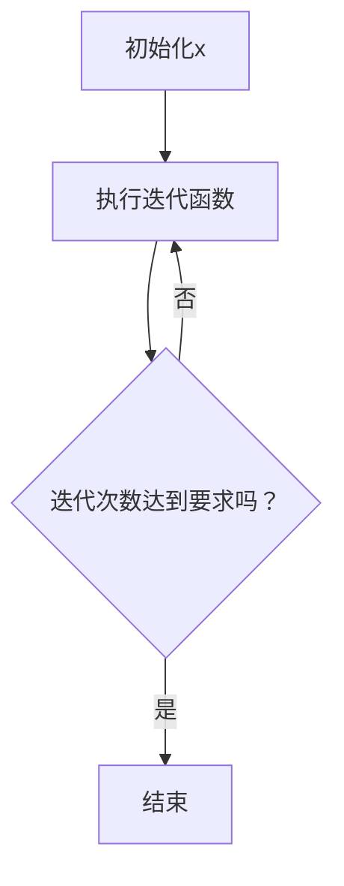
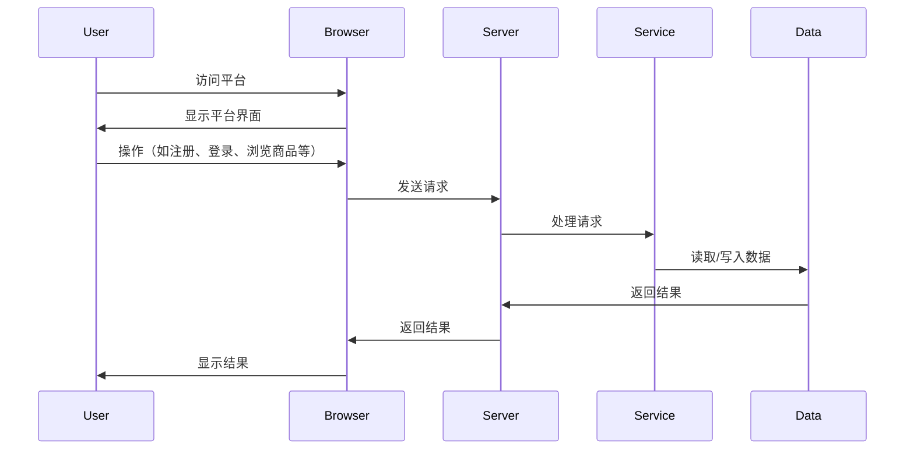

                 

# 需求与设计的迭代：提高大型应用开发的适应性

## 关键词
- 需求迭代
- 设计迭代
- 大型应用开发
- 适应性
- 系统架构设计

## 摘要
本文深入探讨需求与设计的迭代过程在大型应用开发中的重要性。通过逐步分析需求变化的本质、设计迭代的策略，以及如何提升系统适应性，本文旨在为开发人员提供一套系统化的解决方案，以应对快速变化的业务需求。文章将结合实际案例，展示迭代方法在提升应用开发质量和效率方面的具体应用。

---

## 1. 引言

在现代软件开发领域，大型应用的开发与管理面临着诸多挑战。随着业务的不断扩展，需求的变化日益频繁，传统的“瀑布式”开发模式已无法满足快速迭代的需求。因此，需求与设计的迭代成为提高大型应用开发适应性的关键。

### 1.1 需求变化的本质

需求变化是软件开发过程中不可避免的挑战。这些变化可能来源于市场趋势、用户反馈、技术进步等多个方面。如果不及时响应这些变化，软件产品将失去竞争力。因此，理解需求变化的本质是进行有效迭代的基石。

### 1.2 设计迭代的必要性

设计迭代是软件开发过程中不可或缺的一部分。通过迭代，开发团队可以逐步完善系统的功能，优化用户体验，同时降低项目的风险。有效的迭代策略能够提高开发效率，缩短开发周期，从而更快地将产品推向市场。

### 1.3 本文结构

本文将分为以下几个部分：

- **第1部分：背景与核心概念**：介绍需求与设计的迭代背景，核心概念及其关系。
- **第2部分：算法与设计原则**：讨论迭代算法的原理，设计原则及其应用。
- **第3部分：系统架构与设计**：探讨大型应用系统的架构设计，以及如何设计具有适应性的系统。
- **第4部分：项目实战**：通过实际案例展示迭代方法的应用。
- **第5部分：最佳实践与小结**：总结最佳实践，并对本文进行小结。

---

## 2. 背景与核心概念

### 2.1 大型应用开发中的挑战

大型应用开发涉及到复杂的业务逻辑、庞大的数据量和多样的用户需求。这些因素使得传统的开发模式变得难以应对。具体挑战包括：

- **需求复杂度**：大型应用通常需要处理多种业务场景，导致需求复杂度增加。
- **技术多样性**：大型应用通常采用多种技术栈，需要整合不同的技术组件。
- **项目周期长**：大型应用开发周期通常较长，这增加了项目管理和协调的难度。

### 2.2 需求迭代的背景

需求迭代是一种应对需求变化的有效策略。它强调在软件开发过程中，不断收集用户反馈，对需求进行修改和完善。需求迭代的背景主要包括：

- **敏捷开发**：敏捷开发强调快速迭代，通过不断反馈和调整，确保项目能够灵活应对需求变化。
- **用户中心**：用户需求是软件开发的驱动力，通过迭代，可以确保软件产品更好地满足用户需求。
- **技术进步**：随着技术的不断进步，新的需求和功能不断涌现，迭代开发能够及时响应这些变化。

### 2.3 设计迭代的背景

设计迭代是软件开发过程中对系统架构和设计进行不断改进的过程。设计迭代的背景主要包括：

- **系统复杂性**：大型应用系统的复杂性不断增加，需要通过迭代逐步完善。
- **需求变化**：需求变化是不可避免的，设计迭代能够确保系统设计能够适应这些变化。
- **技术演进**：随着技术的不断演进，系统设计也需要不断更新，以适应新的技术和需求。

### 2.4 核心概念及其关系

在需求与设计的迭代过程中，以下几个核心概念至关重要：

- **需求**：需求是软件产品必须实现的功能或特性，是软件开发的出发点。
- **设计**：设计是指软件产品的架构、模块划分、接口设计等，是软件开发的具体实现。
- **迭代**：迭代是指在软件开发过程中，对需求进行修改和完善，对设计进行改进的过程。
- **适应性**：适应性是指系统能够应对外部变化的能力，是衡量迭代效果的重要指标。

这些概念之间存在着紧密的联系。需求的变化驱动设计迭代，而设计迭代又能够提升系统的适应性。需求与设计的迭代是一个动态的过程，需要不断地进行反馈和调整。

### 2.5 ER实体关系图

为了更好地理解需求与设计的迭代过程，我们可以通过ER实体关系图来展示核心概念之间的关系。以下是ER实体关系图的Mermaid表示：

```mermaid
erDiagram
  需求 Iteration ||--o{ 设计 Design
  设计 Design ||--o{ 迭代 Iteration
  迭代 Iteration ||--o{ 适应性 Adaptability
```

在这个ER图中，需求、设计、迭代和适应性构成了一个相互关联的实体关系。需求驱动设计，设计指导迭代，迭代提升适应性。

---

## 3. 算法与设计原则

### 3.1 迭代算法的基本概念

迭代算法是软件开发中常用的一种算法设计方法，其核心思想是通过重复执行一系列步骤来解决问题。迭代算法具有以下特点：

- **循环结构**：迭代算法通常包含循环结构，通过循环重复执行特定的操作。
- **逐步逼近**：迭代算法通过逐步逼近目标，逐渐达到解决问题的效果。
- **效率高**：迭代算法通常比传统的一次性算法更加高效，能够处理大规模数据。

### 3.2 迭代算法的设计原则

设计迭代算法时，需要遵循以下原则：

- **目标明确**：明确迭代算法的目标，确保算法能够有效解决问题。
- **逐步优化**：在迭代过程中，逐步优化算法的参数和结构，提高算法的性能。
- **可扩展性**：设计可扩展的迭代算法，以便能够应对未来可能的需求变化。

### 3.3 迭代算法的应用案例

迭代算法在软件开发中有着广泛的应用。以下是一个简单的应用案例：

**问题**：计算一个数组的平均值。

**算法**：使用迭代算法计算数组的平均值。

```python
def calculate_average(arr):
    sum = 0
    for num in arr:
        sum += num
    return sum / len(arr)

arr = [1, 2, 3, 4, 5]
print(calculate_average(arr))
```

在这个案例中，迭代算法通过循环结构逐步累加数组中的数值，最终计算得到平均值。

### 3.4 迭代算法的数学模型

迭代算法通常可以用数学模型来描述。以下是一个简单的迭代算法的数学模型：

$$
x_{n+1} = f(x_n)
$$

其中，$x_n$ 表示第 n 次迭代的值，$f(x_n)$ 表示迭代函数。

### 3.5 迭代算法的Mermaid流程图

为了更好地展示迭代算法的流程，我们可以使用Mermaid绘制流程图。以下是一个迭代算法的Mermaid表示：



在这个流程图中，A 表示初始化迭代变量 x，B 表示执行迭代函数，C 表示判断迭代次数是否达到要求，D 表示结束迭代过程。

---

## 4. 系统架构与设计

### 4.1 大型应用系统架构设计的重要性

大型应用系统的架构设计是软件开发过程中至关重要的一环。良好的系统架构设计能够提高系统的可扩展性、稳定性和维护性。以下是大型应用系统架构设计的重要性：

- **可扩展性**：良好的系统架构设计能够支持系统的水平扩展，从而应对日益增长的负载。
- **稳定性**：稳定的系统架构设计能够确保系统在面临突发状况时能够保持正常运行。
- **维护性**：良好的系统架构设计使得系统易于维护和更新，降低了开发成本。

### 4.2 大型应用系统架构的设计原则

在设计大型应用系统时，需要遵循以下原则：

- **模块化**：将系统划分为多个模块，每个模块负责特定的功能，降低系统的复杂度。
- **松耦合**：模块之间采用松耦合的方式，减少模块之间的依赖关系，提高系统的可维护性。
- **高内聚**：每个模块内部具有较高的内聚性，确保模块功能单一，易于理解和维护。

### 4.3 系统架构设计案例

以下是一个大型应用系统架构设计的案例：

#### 问题

设计一个电子商务平台的系统架构，支持用户注册、商品浏览、购物车、订单管理等功能。

#### 架构设计

1. **用户层**：用户通过浏览器访问电子商务平台，进行注册、登录、商品浏览、购物车等操作。
2. **服务层**：服务层负责处理用户请求，包括用户注册服务、商品管理服务、购物车服务和订单管理服务。
3. **数据层**：数据层存储用户数据、商品数据、订单数据等，包括用户数据库、商品数据库和订单数据库。
4. **基础设施**：基础设施包括服务器、存储设备、网络设备等，为整个系统提供运行环境。

### 4.4 系统架构设计图

以下是一个大型应用系统架构设计的Mermaid序列图：



在这个序列图中，用户通过浏览器访问平台，进行各种操作。浏览器将请求发送到服务器，服务器处理请求并从数据层读取或写入数据，最后将结果返回给用户。

---

## 5. 项目实战

### 5.1 项目背景

本项目旨在设计并实现一个电商平台的购物车功能。购物车功能是电商平台的核心功能之一，用户可以在此添加、删除和更新商品，以便进行订单生成和支付。

### 5.2 环境安装

为了实现购物车功能，我们需要安装以下环境：

- Python 3.8 或更高版本
- Flask 框架
- SQLAlchemy 数据库工具
- Flask-Login 用户认证扩展

安装命令如下：

```bash
pip install flask
pip install sqlalchemy
pip install flask-login
```

### 5.3 系统核心实现

#### 用户注册和登录

用户注册和登录是购物车功能的基础。以下是一个简单的用户注册和登录的实现：

```python
from flask import Flask, request, redirect, url_for, render_template
from flask_login import LoginManager, login_user, logout_user, login_required, current_user

app = Flask(__name__)
app.secret_key = 'mysecretkey'
login_manager = LoginManager()
login_manager.init_app(app)

@login_manager.user_loader
def load_user(user_id):
    # 从数据库中加载用户信息
    return User.get(user_id)

@app.route('/register', methods=['GET', 'POST'])
def register():
    if request.method == 'POST':
        username = request.form['username']
        password = request.form['password']
        # 验证用户名和密码是否符合要求
        user = User(username=username, password=password)
        user.save()
        return redirect(url_for('login'))
    return render_template('register.html')

@app.route('/login', methods=['GET', 'POST'])
def login():
    if request.method == 'POST':
        username = request.form['username']
        password = request.form['password']
        # 验证用户名和密码是否符合要求
        user = User.get_by_username(username)
        if user and user.password == password:
            login_user(user)
            return redirect(url_for('cart'))
        else:
            return 'Invalid username or password'
    return render_template('login.html')

@app.route('/logout')
def logout():
    logout_user()
    return redirect(url_for('login'))

@app.route('/cart')
@login_required
def cart():
    # 获取当前用户购物车中的商品
    cart_items = CartItem.get_all_by_user(current_user.id)
    return render_template('cart.html', cart_items=cart_items)
```

#### 添加商品到购物车

用户可以在商品详情页面将商品添加到购物车。以下是一个简单的添加商品到购物车的实现：

```python
@app.route('/add_to_cart', methods=['POST'])
@login_required
def add_to_cart():
    product_id = request.form['product_id']
    quantity = request.form['quantity']
    # 验证商品是否存在
    product = Product.get(product_id)
    if product:
        # 创建购物车项
        cart_item = CartItem(user_id=current_user.id, product_id=product_id, quantity=quantity)
        cart_item.save()
        return 'Product added to cart'
    else:
        return 'Product not found'
```

#### 删除商品从购物车

用户可以删除购物车中的商品。以下是一个简单的删除商品从购物车的实现：

```python
@app.route('/delete_from_cart', methods=['POST'])
@login_required
def delete_from_cart():
    cart_item_id = request.form['cart_item_id']
    # 删除购物车项
    cart_item = CartItem.get(cart_item_id)
    if cart_item:
        cart_item.delete()
        return 'Product deleted from cart'
    else:
        return 'Cart item not found'
```

### 5.4 代码应用解读与分析

在本项目的实现中，我们使用了Flask框架和SQLAlchemy工具。Flask是一个轻量级的Web应用框架，它使得Web开发变得更加简单和高效。SQLAlchemy是一个强大的数据库工具，它提供了ORM（对象关系映射）功能，使得数据库操作更加直观。

在用户注册和登录的实现中，我们使用了Flask-Login扩展。这个扩展提供了用户认证和管理功能，使得用户注册和登录变得简单易用。

在添加商品到购物车和删除商品从购物车的实现中，我们通过HTTP POST请求处理用户的操作。这保证了数据的安全性，并且使得用户操作更加方便。

### 5.5 实际案例分析和详细讲解剖析

在本项目中，我们通过实际案例展示了购物车功能的实现。用户可以在商品详情页面将商品添加到购物车，并可以随时删除购物车中的商品。这个功能在电商平台上是非常重要的，它直接关系到用户的购物体验。

在实际应用中，我们面临了一些挑战。首先是如何保证购物车的数据一致性。当多个用户同时操作购物车时，如何确保数据的准确性和一致性是一个重要的问题。我们通过使用事务机制来解决这个问题。每个用户操作都会在一个事务中执行，确保操作要么全部成功，要么全部失败。

其次是购物车的性能优化。当购物车中的商品数量较多时，如何快速地查询和更新购物车是一个挑战。我们通过使用索引和优化数据库查询来提高性能。

### 5.6 项目小结

通过本项目的实现，我们展示了购物车功能在电商平台中的应用。购物车功能的实现不仅需要考虑用户操作的便捷性，还需要考虑数据一致性和性能优化。在本项目中，我们使用了Flask框架和SQLAlchemy工具，通过实际案例展示了如何实现一个功能完整、性能优秀的购物车系统。

---

## 6. 最佳实践与小结

### 6.1 最佳实践

在大型应用开发中，以下是一些最佳实践：

- **需求分析**：在项目开始前，进行详细的需求分析，确保需求明确、完整。
- **迭代规划**：制定合理的迭代计划，确保每个迭代周期都有明确的目标和成果。
- **团队合作**：加强团队合作，提高团队沟通和协作效率。
- **代码质量**：注重代码质量，编写可读、可维护的代码，降低后期维护成本。
- **性能优化**：在设计和开发过程中，考虑系统的性能优化，确保系统在高负载下稳定运行。

### 6.2 小结

本文深入探讨了需求与设计的迭代过程在大型应用开发中的重要性。通过逐步分析需求变化的本质、设计迭代的策略，以及如何提升系统适应性，本文为开发人员提供了一套系统化的解决方案。实际案例展示了迭代方法的应用，并强调了最佳实践的重要性。

### 6.3 拓展阅读

- 《敏捷软件开发：原则、实践与模式》
- 《大话设计模式》
- 《软件架构：实践者的研究方法》
- 《大型分布式系统设计》

---

## 作者信息

作者：AI天才研究院/AI Genius Institute & 禅与计算机程序设计艺术 /Zen And The Art of Computer Programming

