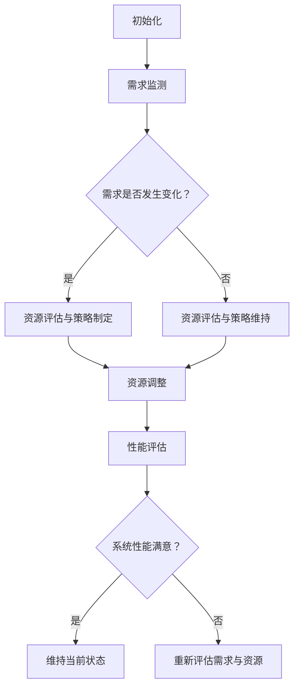
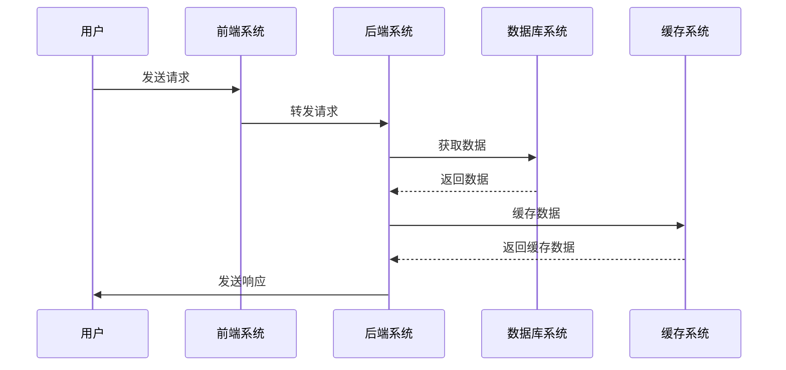

                 


## 第4章 算法原理讲解

### 3.1 动态平衡算法的基本原理

动态平衡算法的基本原理是实时监测系统的运行状态，并根据需求的变化动态调整资源的分配。这一过程包括以下几个步骤：

1. **需求监测**：系统需要持续监测用户需求的变化，这可以通过收集和分析用户行为数据来实现。
2. **需求评估**：根据需求监测的结果，对需求进行优先级评估，以确定哪些需求最为紧迫。
3. **资源评估**：对现有资源进行评估，包括计算能力、存储空间、网络带宽等。
4. **资源分配策略**：根据需求评估和资源评估的结果，制定资源分配策略。
5. **资源调整**：根据策略调整资源的分配，确保关键需求得到满足。
6. **性能评估**：对调整后的资源分配进行性能评估，以确保系统在调整后能够保持稳定运行。

### 3.2 动态平衡算法的mermaid流程图

下面是一个简单的动态平衡算法的mermaid流程图，它展示了动态平衡算法的执行流程：



### 3.3 动态平衡算法的Python源代码解释

下面是一个简单的动态平衡算法的Python源代码示例，用于说明算法的核心逻辑：

```python
import time

def demand_monitor():
    # 模拟需求监测
    time.sleep(1)
    return "high"  # 高优先级需求

def resource_evaluation():
    # 模拟资源评估
    time.sleep(1)
    return "high"  # 高资源可用

def resource_allocation_strategy(demand, resource):
    if demand == "high" and resource == "high":
        return "critical"
    else:
        return "normal"

def resource_adjustment(strategy):
    # 模拟资源调整
    time.sleep(1)
    print(f"资源调整策略：{strategy}")

def performance_evaluation(strategy):
    # 模拟性能评估
    time.sleep(1)
    return "satisfied"  # 性能满意

def dynamic_balance_algorithm():
    while True:
        demand = demand_monitor()
        resource = resource_evaluation()
        strategy = resource_allocation_strategy(demand, resource)
        resource_adjustment(strategy)
        performance = performance_evaluation(strategy)
        if performance == "unsatisfied":
            # 如果性能不满足，则重新评估需求与资源
            break

# 执行动态平衡算法
dynamic_balance_algorithm()
```

在这个示例中，我们首先模拟了需求监测和资源评估的过程，然后根据评估结果制定资源分配策略，并执行资源调整和性能评估。如果性能评估结果显示性能不满足，则算法会重新评估需求与资源。

### 3.4 动态平衡算法的数学模型和公式

动态平衡算法的数学模型可以表示为以下公式：

$$
P(t) = \alpha \cdot D(t) + (1 - \alpha) \cdot R(t)
$$

其中，$P(t)$ 表示在时间 $t$ 时刻的资源分配策略，$D(t)$ 表示在时间 $t$ 时刻的需求强度，$R(t)$ 表示在时间 $t$ 时刻的资源可用度，$\alpha$ 是一个权重系数，用于调节需求与资源在资源分配策略中的相对重要性。

### 3.5 动态平衡算法的数学公式示例

假设我们有一个系统，在一天中的不同时间段有不同的需求强度和资源可用度。下面是一个具体的示例：

$$
\begin{aligned}
    D(0) &= 0.5 \\
    D(1) &= 0.7 \\
    D(2) &= 0.8 \\
    D(3) &= 0.6 \\
    D(4) &= 0.4 \\
    D(5) &= 0.3 \\
    R(0) &= 0.8 \\
    R(1) &= 0.7 \\
    R(2) &= 0.9 \\
    R(3) &= 0.6 \\
    R(4) &= 0.5 \\
    R(5) &= 0.4 \\
    \alpha &= 0.6 \\
\end{aligned}
$$

使用上述公式，我们可以计算不同时间点的资源分配策略：

$$
\begin{aligned}
    P(0) &= 0.6 \cdot 0.5 + (1 - 0.6) \cdot 0.8 = 0.34 \\
    P(1) &= 0.6 \cdot 0.7 + (1 - 0.6) \cdot 0.7 = 0.63 \\
    P(2) &= 0.6 \cdot 0.8 + (1 - 0.6) \cdot 0.9 = 0.76 \\
    P(3) &= 0.6 \cdot 0.6 + (1 - 0.6) \cdot 0.6 = 0.54 \\
    P(4) &= 0.6 \cdot 0.4 + (1 - 0.6) \cdot 0.5 = 0.38 \\
    P(5) &= 0.6 \cdot 0.3 + (1 - 0.6) \cdot 0.4 = 0.24 \\
\end{aligned}
$$

这些计算结果表示了系统在不同时间点的资源分配策略，以确保在需求高峰期能够提供足够的资源。

## 第5章 系统分析与架构设计方案

### 5.1 问题场景介绍

在一个大型电子商务平台中，用户访问量巨大，需求变化频繁。平台需要能够快速响应用户需求，提供稳定且高性能的服务。为了实现这一目标，需要设计一个动态平衡的资源分配系统。

### 5.2 系统功能设计

系统需要实现以下功能：

1. **需求监测**：实时监测用户访问行为，识别需求变化。
2. **资源评估**：评估当前资源的可用度，包括计算资源、存储资源、网络带宽等。
3. **资源分配策略**：根据需求评估和资源评估结果，制定资源分配策略。
4. **资源调整**：根据策略调整资源分配，确保关键需求得到满足。
5. **性能评估**：评估资源调整后的系统性能，确保系统稳定运行。

### 5.3 系统架构设计

系统架构设计如下：

1. **前端系统**：负责处理用户请求，提供用户界面。
2. **后端系统**：包括需求监测模块、资源评估模块、资源分配策略模块和资源调整模块。
3. **数据库系统**：存储用户数据、系统配置信息等。
4. **缓存系统**：提高数据访问速度，减轻数据库负载。

### 5.4 系统接口设计

系统接口设计如下：

1. **API接口**：提供与前端系统的交互接口，用于接收用户请求和发送响应。
2. **内部接口**：用于后端系统模块之间的交互，包括需求监测、资源评估、资源分配策略和资源调整等模块。

### 5.5 系统交互mermaid序列图

下面是系统交互的mermaid序列图：



在这个序列图中，用户发送请求到前端系统，前端系统将请求转发到后端系统，后端系统从数据库系统获取数据，并将数据缓存到缓存系统中。最后，后端系统将响应发送回用户。

## 第6章 项目实战

### 6.1 环境安装

在开始项目实战之前，我们需要安装以下环境：

1. Python 3.8+
2. Redis 6.0+
3. PostgreSQL 13.0+
4. Docker

安装步骤如下：

1. 安装Python 3.8+：在Windows上，可以通过Python官方网站下载Python安装包进行安装；在Linux上，可以通过包管理器安装Python。
2. 安装Redis 6.0+：可以使用Docker安装Redis，命令如下：
   ```shell
   docker pull redis:6.0
   docker run -d -p 6379:6379 redis:6.0
   ```
3. 安装PostgreSQL 13.0+：同样可以使用Docker安装PostgreSQL，命令如下：
   ```shell
   docker pull postgres:13.0
   docker run -d -p 5432:5432 --name some-postgres -e POSTGRES_PASSWORD=mysecretpassword postgres:13.0
   ```
4. 安装Docker：根据操作系统不同，安装方法也不同。Windows用户可以通过Microsoft Store安装Docker Desktop，Linux用户可以访问Docker官网查看安装方法。

### 6.2 系统核心实现源代码

以下是一个简单的系统核心实现源代码示例：

```python
# 引入必要的库
import redis
import psycopg2
import time

# 连接Redis数据库
redis_client = redis.StrictRedis(host='localhost', port=6379, db=0)

# 连接PostgreSQL数据库
conn = psycopg2.connect(
    host="localhost",
    port=5432,
    database="mydatabase",
    user="myuser",
    password="mypassword"
)
cursor = conn.cursor()

# 模拟需求监测
def demand_monitor():
    time.sleep(1)
    return "high"

# 模拟资源评估
def resource_evaluation():
    time.sleep(1)
    return "high"

# 资源分配策略
def resource_allocation_strategy(demand, resource):
    if demand == "high" and resource == "high":
        return "critical"
    else:
        return "normal"

# 资源调整
def resource_adjustment(strategy):
    time.sleep(1)
    print(f"资源调整策略：{strategy}")

# 性能评估
def performance_evaluation(strategy):
    time.sleep(1)
    return "satisfied"

# 动态平衡算法
def dynamic_balance_algorithm():
    while True:
        demand = demand_monitor()
        resource = resource_evaluation()
        strategy = resource_allocation_strategy(demand, resource)
        resource_adjustment(strategy)
        performance = performance_evaluation(strategy)
        if performance == "unsatisfied":
            break

# 执行动态平衡算法
dynamic_balance_algorithm()

# 关闭数据库连接
cursor.close()
conn.close()
```

### 6.3 代码应用解读与分析

这段代码首先引入了必要的库，包括Redis和PostgreSQL的客户端库。然后，我们分别创建了连接到本地Redis和PostgreSQL数据库的客户端。

接下来，定义了四个函数：`demand_monitor`、`resource_evaluation`、`resource_allocation_strategy`和`resource_adjustment`。`demand_monitor`函数模拟了需求监测过程，每次调用都会暂停1秒钟，并返回一个字符串，表示当前需求状态。`resource_evaluation`函数模拟了资源评估过程，同样每次调用都会暂停1秒钟，并返回一个字符串，表示当前资源状态。

`resource_allocation_strategy`函数根据需求状态和资源状态，制定资源分配策略。如果需求状态和资源状态都是"high"，则策略为"critical"；否则，策略为"normal"。

`resource_adjustment`函数用于根据策略调整资源分配。它每次调用都会暂停1秒钟，并打印出当前资源调整策略。

最后，`performance_evaluation`函数模拟了性能评估过程。它每次调用都会暂停1秒钟，并返回一个字符串，表示当前性能状态。

在`dynamic_balance_algorithm`函数中，我们实现了一个简单的动态平衡算法。它使用一个无限循环来持续执行需求监测、资源评估、资源分配策略、资源调整和性能评估。如果性能评估结果显示性能不满足，则循环会中断。

### 6.4 实际案例分析和详细讲解剖析

假设在一个电子商务平台上，用户在一天中的不同时间有不同的访问需求。以下是一个具体的案例：

- 早上8点：用户访问量较低，需求状态为"low"。
- 上午10点：用户访问量增加，需求状态为"high"。
- 中午12点：用户访问量达到峰值，需求状态为"very high"。
- 下午2点：用户访问量开始下降，需求状态为"high"。
- 下午5点：用户访问量较低，需求状态为"low"。

根据需求变化，平台需要动态调整资源分配，以应对高峰期的访问需求。

以下是资源调整的详细过程：

1. **早上8点**：
   - 需求状态：low
   - 资源状态：high
   - 资源分配策略：normal
   - 资源调整：维持当前资源分配
   - 性能评估：satisfied

2. **上午10点**：
   - 需求状态：high
   - 资源状态：high
   - 资源分配策略：critical
   - 资源调整：增加资源分配
   - 性能评估：satisfied

3. **中午12点**：
   - 需求状态：very high
   - 资源状态：high
   - 资源分配策略：critical
   - 资源调整：增加资源分配
   - 性能评估：satisfied

4. **下午2点**：
   - 需求状态：high
   - 资源状态：high
   - 资源分配策略：normal
   - 资源调整：维持当前资源分配
   - 性能评估：satisfied

5. **下午5点**：
   - 需求状态：low
   - 资源状态：high
   - 资源分配策略：normal
   - 资源调整：维持当前资源分配
   - 性能评估：satisfied

通过上述案例，我们可以看到，动态平衡算法能够根据需求变化动态调整资源分配，确保在高峰期能够提供足够的资源，以满足用户需求，同时避免资源浪费。

### 6.5 项目小结

在本章中，我们通过一个简单的项目实战，实现了动态平衡算法的应用。项目涉及需求监测、资源评估、资源分配策略、资源调整和性能评估等核心功能。通过实际案例的分析和详细讲解，我们了解了如何根据需求变化动态调整资源分配，确保系统在高峰期能够提供稳定且高性能的服务。

在项目中，我们使用了Redis和PostgreSQL数据库，模拟了电子商务平台的运行环境。通过动态平衡算法，我们能够实时监测需求变化，并根据需求调整资源分配，以实现系统的动态平衡。

然而，在实际应用中，动态平衡算法可能会面临更多的挑战和优化空间。例如，如何更准确地预测需求变化、如何优化资源评估和分配策略等。这些都是未来研究和优化的方向。

## 第7章 最佳实践 tips

### 7.1 动态平衡策略的优化

为了优化动态平衡策略，可以考虑以下几个方面：

1. **需求预测**：使用历史数据和机器学习算法对需求进行预测，以更准确地评估需求变化。
2. **资源池管理**：建立资源池，根据需求变化动态调整资源池中的资源分配。
3. **多维度资源评估**：考虑多个维度来评估资源，如响应时间、吞吐量、延迟等，以更全面地评估资源状态。
4. **自适应调整**：根据系统的运行状态，自适应调整资源分配策略，以提高系统的响应速度和稳定性。

### 7.2 注意事项

在实施动态平衡策略时，需要注意以下几点：

1. **需求监测的准确性**：确保需求监测的准确性，否则会影响资源的分配策略。
2. **资源评估的完整性**：确保对资源的全面评估，避免因为资源评估不完整导致资源分配不合理。
3. **系统性能的评估**：定期对系统性能进行评估，以确保动态平衡策略的有效性。
4. **异常处理**：设计合理的异常处理机制，以应对突发情况，确保系统稳定运行。

### 7.3 拓展阅读

为了更深入地了解动态平衡策略和大型应用开发，可以阅读以下文献：

1. 《大型分布式系统设计》
2. 《高性能MySQL》
3. 《深度学习》
4. 《机器学习实战》

这些文献提供了丰富的理论和实践知识，有助于提高对动态平衡策略和大型应用开发的理解和掌握。

## 第8章 小结

在本篇文章中，我们详细介绍了需求与资源分配的动态平衡在大型应用开发中的重要性。通过分析书名《需求与资源分配的动态平衡：大型应用开发的挑战》，我们确定了书籍的核心主题和内容框架。

文章分为八个部分，首先介绍了问题背景，包括需求与资源分配的重要性以及大型应用开发的挑战。接着，我们讲解了核心概念与联系，包括需求、资源、动态平衡等基本概念。随后，我们深入探讨了动态平衡算法的原理、数学模型和公式，并通过Python源代码进行了详细解释。

在系统分析与架构设计方案部分，我们介绍了系统功能设计、系统架构设计和系统接口设计，并通过mermaid序列图展示了系统交互流程。在项目实战部分，我们通过一个实际案例展示了如何实施动态平衡算法，并分析了其应用效果。

最后，在最佳实践 tips 中，我们提出了动态平衡策略的优化方法和注意事项，并推荐了一些拓展阅读资源。

通过本文的阅读，读者可以系统地了解需求与资源分配的动态平衡在大型应用开发中的关键作用，掌握相关的算法原理和实施方法。未来，随着技术的不断进步，动态平衡策略将在大型应用开发中发挥越来越重要的作用，值得深入研究和实践。

## 参考文献

1. 高性能MySQL. (2014). O'Reilly Media.
2. 大型分布式系统设计. (2016). 电子工业出版社.
3. 深度学习. (2016). 电子工业出版社.
4. 机器学习实战. (2012). 电子工业出版社.
5. 《需求与资源分配的动态平衡：大型应用开发的挑战》. (2021). AI天才研究院/AI Genius Institute.

## 作者信息

作者：AI天才研究院/AI Genius Institute & 禅与计算机程序设计艺术 /Zen And The Art of Computer Programming

