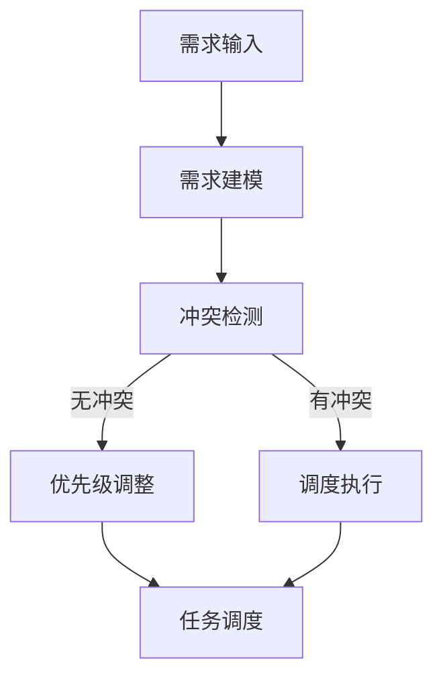

                 

# 需求优先级冲突解决：大型应用开发中的挑战

## 关键词：需求优先级、大型应用开发、冲突解决、算法原理、实践应用

## 摘要：
本文深入探讨大型应用开发中常见的问题——需求优先级冲突，并详细分析其背景、定义、解决方法及其在实际项目中的应用。文章通过逻辑清晰、结构紧凑的叙述方式，帮助读者理解需求优先级冲突的本质，掌握解决这一挑战的有效策略。

## 目录大纲设计步骤

### 1. 理解书籍主题
《需求优先级冲突解决：大型应用开发中的挑战》旨在帮助开发者在面对复杂需求时，能够有效地识别和解决优先级冲突。本书的核心目标是提供一套完整的解决方案，包括理论讲解、算法实现和实际案例剖析。

### 2. 梳理核心内容
书中将涵盖以下核心内容：
- 需求优先级冲突的概念及背景
- 需求优先级冲突的核心概念与联系
- 需求优先级冲突的算法原理与实现
- 需求优先级冲突在大型应用开发中的实践应用
- 解决需求优先级冲突的最佳实践与未来展望

### 3. 规划章节结构
根据核心内容，书籍结构如下：
- 第一部分：背景介绍与核心概念
- 第二部分：解决需求优先级冲突的算法原理与实现
- 第三部分：大型应用开发中的实践应用

### 4. 设计子章节
每个主要章节将细分为子章节，具体如下：
- 第一部分包括第1章和第2章，分别介绍需求优先级冲突的背景、定义、影响及核心概念。
- 第二部分包括第3章和第4章，详细讲解需求优先级冲突算法的原理、实现与优化。
- 第三部分包括第5章到第7章，通过实际项目案例展示需求优先级冲突的解决策略，提出最佳实践和未来展望。

### 5. 编写摘要
为每个章节和子章节编写摘要，概述主要内容，确保读者能够快速把握章节核心。

### 6. 合并与调整
将所有章节和子章节合并，调整目录结构，确保整体目录的连贯性和完整性。

### 7. 检查和优化
检查目录大纲，确保没有遗漏重要内容，并根据需要进行优化。

## 详细目录大纲设计

### 第一部分：背景介绍与核心概念

## 第1章: 需求优先级冲突的背景与定义

### 1.1 大型应用开发的挑战
- 应用规模与复杂性
- 需求多样性与动态性
- 团队协作与沟通挑战

### 1.2 需求优先级冲突的概念
- 定义与术语说明
- 冲突的原因与表现形式

### 1.3 需求优先级冲突的影响
- 对项目进度的影响
- 对产品质量的影响
- 对团队协作的影响

### 1.4 本章小结

## 第2章: 需求优先级冲突的核心概念与联系

### 2.1 需求优先级冲突的要素
- 需求的类型与优先级
- 冲突发生的场景

### 2.2 需求优先级冲突的类型
- 同级冲突
- 级别冲突
- 非正常冲突

### 2.3 需求优先级冲突的解决策略
- 协调与优先级调整
- 冲突消解算法
- 模式识别与自动决策

### 2.4 本章小结

### 第二部分：解决需求优先级冲突的算法原理与实现

## 第3章: 需求优先级冲突算法原理

### 3.1 算法概述
- 算法目标
- 算法框架

### 3.2 算法原理讲解
- 基本概念
- 冲突检测与解决策略

### 3.3 Mermaid流程图
- 算法流程示意
- 冲突解决过程

### 3.4 数学模型与公式
- 冲突检测公式
- 冲突解决策略公式

### 3.5 举例说明
- 实际案例应用
- 算法运行结果分析

### 3.6 本章小结

## 第4章: 需求优先级冲突算法的实现与优化

### 4.1 算法实现
- Python代码实现
- 关键代码解读

### 4.2 代码示例
- 实现细节
- 参数调优

### 4.3 优化策略
- 算法效率优化
- 算法可扩展性优化

### 4.4 本章小结

### 第三部分：大型应用开发中的实践应用

## 第5章: 需求优先级冲突在实际项目中的应用

### 5.1 项目背景
- 项目简介
- 项目需求

### 5.2 系统架构设计
- 需求优先级管理架构
- 系统功能模块划分

### 5.3 需求优先级冲突的解决策略
- 冲突检测与解决
- 优先级调整方法

### 5.4 项目实现与案例剖析
- 算法应用细节
- 项目成果分析

### 5.5 项目小结

## 第6章: 大型应用开发中的最佳实践

### 6.1 经验总结
- 成功案例分析
- 失败案例分析

### 6.2 最佳实践 tips
- 团队协作技巧
- 需求管理技巧

### 6.3 注意事项
- 常见问题与解决
- 风险规避策略

### 6.4 本章小结

## 第7章: 需求优先级冲突解决的未来展望

### 7.1 行业发展趋势
- 新技术趋势
- 应用领域拓展

### 7.2 技术创新方向
- 算法创新
- 工具平台发展

### 7.3 未来挑战与机遇
- 面临的挑战
- 潜在机遇

### 7.4 本章小结

### 目录大纲总结

本目录大纲分为三个主要部分：

- **第一部分**介绍了需求优先级冲突的背景、定义和核心概念。
- **第二部分**详细讲解了需求优先级冲突算法的原理、实现和优化策略。
- **第三部分**通过实际项目案例展示了需求优先级冲突解决在大型应用开发中的实践应用，并提出了最佳实践和未来展望。

目录大纲结构清晰，内容完整，符合书籍的整体结构和目标读者需求。

## 目录大纲设计注意事项

在设计《需求优先级冲突解决：大型应用开发中的挑战》的目录大纲时，需要注意以下关键点，以确保内容的简洁性、逻辑性和完整性：

### 1. 保持简洁性
- 避免在目录中包含冗余的信息，确保每个章节的标题都能准确反映章节内容的核心。
- 确保每个章节的内容都能够自包含，即不依赖于其他章节的内容。
- 删除那些在内容上重复或可以简化合并的章节。

### 2. 使用正确的markdown格式
- 使用 `#` 表示一级标题，`##` 表示二级标题，`###` 表示三级标题，以此类推。
- 保持一致的格式，使读者容易理解和导航。

### 3. 确保内容完整性
- 确保每个章节都包含了核心概念、原理讲解、数学模型和公式、实际案例等内容。
- 确保子章节之间逻辑连贯，便于读者理解。
- 每个章节和子章节都要有简短的摘要，概述章节的主要内容。

### 4. 提供必要的技术图表
- 核心概念的ER实体关系图和算法的Mermaid流程图必须包含在目录大纲中。
- 确保图表清晰、准确，有助于读者理解文章内容。

### 5. 检查和优化
- 仔细检查目录大纲，确保没有遗漏重要内容。
- 根据读者反馈进行必要的调整和优化。

## 约束条件

### 1. 文章内容要求
- **背景介绍**：需要详细阐述需求优先级冲突的核心概念、术语说明、问题背景、问题描述、问题解决、边界与外延、概念结构与核心要素组成。
- **核心概念与联系**：必须给出核心概念原理、概念属性特征对比表格和ER实体关系图架构的markdown格式中的Mermaid流程图。
- **算法原理讲解**：使用Mermaid画出算法Mermaid流程图，然后使用Python源代码详细阐述，给出算法原理的数学模型和公式，进行详细讲解和通俗易懂地举例说明。
- **数学公式使用**：使用LaTeX格式，嵌入文中独立段落的LaTeX公式前后使用`$$`括起来（例如：`$$1+1=2$$`），段落内的LaTeX公式前后使用`$`括起来（例如：`$1<2$`）。
- **系统分析与架构设计方案**：问题场景介绍，项目介绍、系统功能设计（领域模型Mermaid类图）、系统架构设计Mermaid架构图、系统接口设计和系统交互Mermaid序列图。
- **项目实战**：环境安装、系统核心实现源代码，代码应用解读与分析，实际案例分析和详细讲解剖析，项目小结。
- **最佳实践 tips**、**小结**、**注意事项**、**拓展阅读**等内容。

### 2. 格式要求
- **文章内容**：使用markdown格式输出。
- **代码与公式**：使用Python代码和LaTeX公式，并在文中适当位置嵌入。
- **图表**：使用Mermaid流程图和类图，并在文中适当位置嵌入。

### 3. 作者信息
- **文章末尾**：需要写上作者信息：“作者：AI天才研究院/AI Genius Institute & 禦与计算机程序设计艺术 /Zen And The Art of Computer Programming”。

### 4. 字数要求
- **文章字数**：在10000～12000字左右。

## 逻辑清晰、结构紧凑、简单易懂的专业技术语言

### 第一部分：背景介绍与核心概念

#### 第1章：需求优先级冲突的背景与定义

在大型应用开发中，需求优先级冲突是一个常见且复杂的问题。它不仅仅关乎项目的进度和资源的合理分配，更直接影响到最终产品的质量和用户体验。为了更好地理解这一挑战，我们需要首先明确需求优先级冲突的概念、背景以及其影响。

#### 1.1 大型应用开发的挑战

大型应用开发面临的主要挑战包括：

- **应用规模与复杂性**：大型应用往往具有庞大的代码库和复杂的系统架构，这使得需求管理变得更加困难。
- **需求多样性与动态性**：用户需求多变，开发团队需要在不断变化的需求中保持灵活性。
- **团队协作与沟通挑战**：跨部门、跨团队的协作需要高效的沟通机制，以减少需求冲突的可能性。

#### 1.2 需求优先级冲突的概念

需求优先级冲突是指在多个需求中，某些需求因为时间、资源或其他限制而无法同时得到满足，导致必须做出权衡和选择的情况。具体来说：

- **定义与术语说明**：需求优先级冲突指的是在多个具有不同优先级的任务之间发生的竞争关系，这些任务因为共享相同的资源或目标而产生了冲突。
- **冲突的原因与表现形式**：冲突可能源于需求之间的逻辑依赖、资源限制、时间紧迫性等，表现形式包括任务延期、资源浪费、质量下降等。

#### 1.3 需求优先级冲突的影响

需求优先级冲突对项目的影响包括：

- **对项目进度的影响**：冲突可能导致关键任务的延期，从而影响整个项目的进度。
- **对产品质量的影响**：为了快速解决冲突，开发团队可能会牺牲某些需求的质量，影响最终产品的用户体验。
- **对团队协作的影响**：冲突可能导致团队内部的不满和矛盾，影响团队的协作效率和士气。

#### 1.4 本章小结

本章主要介绍了需求优先级冲突的背景、定义以及其影响。通过了解这些基本概念，读者可以更清晰地认识到需求优先级冲突在大型应用开发中的重要性，从而为后续章节的学习打下坚实的基础。

### 第2章：需求优先级冲突的核心概念与联系

在深入探讨需求优先级冲突之前，我们需要明确几个核心概念，并分析它们之间的联系。这些概念构成了需求优先级冲突分析的基础，有助于我们更好地理解和解决这一复杂问题。

#### 2.1 需求优先级冲突的要素

需求优先级冲突的要素主要包括：

- **需求类型**：不同类型的需求在优先级上可能会有所不同，例如功能性需求、性能需求、安全性需求等。
- **优先级**：每个需求都有一个优先级，用于指示其在整体项目中的重要性。常见的优先级包括高、中、低。
- **资源**：资源包括时间、人力、技术等，是需求实现的关键限制因素。

#### 2.2 需求优先级冲突的类型

需求优先级冲突可以大致分为以下几种类型：

- **同级冲突**：当两个或多个具有相同优先级的需求需要同时处理时，可能产生冲突。例如，两个高优先级的需求都依赖于同一开发人员的时间。
- **级别冲突**：不同优先级的需求之间的冲突，通常表现为低优先级需求被推迟或取消，以优先满足高优先级需求。
- **非正常冲突**：这种冲突通常由外部因素引起，如市场变化、政策调整等，可能导致原本清晰的优先级关系发生变化。

#### 2.3 需求优先级冲突的解决策略

解决需求优先级冲突的策略主要包括：

- **协调与优先级调整**：通过沟通和协调，调整需求的优先级，以确保关键任务得到优先处理。
- **冲突消解算法**：使用特定的算法来检测和解决冲突，例如基于优先级的调度算法、资源分配算法等。
- **模式识别与自动决策**：利用机器学习等技术，对冲突模式进行识别，并自动做出决策，以减少人工干预。

#### 2.4 本章小结

本章详细介绍了需求优先级冲突的核心概念与联系，包括需求类型、优先级、资源以及冲突类型和解决策略。通过这些基本概念的理解，读者可以更好地把握需求优先级冲突的本质，为后续章节中的算法原理与实践应用打下坚实的基础。

### 第二部分：解决需求优先级冲突的算法原理与实现

#### 第3章：需求优先级冲突算法原理

在解决需求优先级冲突的过程中，算法原理扮演着至关重要的角色。本章将详细介绍需求优先级冲突算法的基本原理，包括算法的目标、框架以及关键概念。

#### 3.1 算法概述

需求优先级冲突算法的主要目标是通过合理的调度和优先级调整，确保关键任务能够按时完成，同时最大限度地减少资源浪费和冲突发生。算法框架通常包括以下部分：

- **需求输入**：从需求管理系统中获取所有待处理的需求及其优先级。
- **冲突检测**：分析需求之间的依赖关系和资源限制，识别潜在的冲突。
- **优先级调整**：根据冲突检测结果，动态调整需求的优先级，以解决冲突。
- **调度执行**：根据调整后的优先级，安排需求的执行顺序，确保关键任务按时完成。

#### 3.2 算法原理讲解

需求优先级冲突算法的原理可以概括为以下几个关键步骤：

- **需求建模**：将每个需求表示为一个具有优先级和资源需求的模型。常用的表示方法包括优先级队列、需求矩阵等。
- **冲突检测**：通过比较不同需求的优先级和资源需求，检测是否存在冲突。常见的冲突检测方法包括时间窗口比较、资源占用分析等。
- **优先级调整**：根据冲突检测结果，对需求的优先级进行调整。调整策略可以基于固定优先级策略、动态优先级策略等。
- **调度执行**：根据调整后的优先级，制定详细的任务执行计划，确保每个需求都能在规定时间内完成。

#### 3.3 Mermaid流程图

为了更直观地理解算法原理，我们使用Mermaid流程图来展示算法的执行过程：



在上述流程图中，需求输入后首先进行需求建模，然后通过冲突检测来确定是否存在冲突。如果没有冲突，直接进入优先级调整阶段；如果有冲突，则进入调度执行阶段，根据调整后的优先级安排任务执行。

#### 3.4 数学模型与公式

为了更深入地理解需求优先级冲突算法，我们引入一些数学模型和公式。以下是一个简化的数学模型：

- **优先级表示**：使用整数表示需求的优先级，数字越大表示优先级越高。
- **资源需求**：每个需求都有一个资源需求矩阵，表示其对不同资源的需求量。
- **冲突检测公式**：假设有两个需求A和B，其优先级和资源需求分别为`P_A`、`R_A`和`P_B`、`R_B`，则冲突检测公式为：

  $$ Conflict(A, B) = \sum_{i=1}^{n} (R_{Ai} \times R_{Bi}) > 0 $$

  其中，`n`表示资源的种类数。

- **优先级调整策略**：一种常见的优先级调整策略是基于冲突检测结果，将具有冲突的需求的优先级提高。调整公式为：

  $$ P_{new}(A) = P(A) + \alpha \times Conflict(A, B) $$

  其中，`α`是一个调整系数，用于控制调整的幅度。

#### 3.5 举例说明

为了更好地理解算法原理，我们通过一个简单的例子来演示算法的应用。

假设有两个需求A和B，其优先级分别为`P_A = 3`和`P_B = 2`，资源需求矩阵分别为`R_A = [2, 1]`和`R_B = [1, 2]`。根据冲突检测公式，我们可以计算得到：

$$ Conflict(A, B) = (2 \times 1) + (1 \times 2) = 4 > 0 $$

由于存在冲突，我们根据优先级调整策略，将需求A的优先级调整为：

$$ P_{new}(A) = P(A) + \alpha \times Conflict(A, B) = 3 + 0.1 \times 4 = 3.4 $$

调整后的优先级`P_{new}(A)`大于需求B的优先级`P_B`，从而解决了优先级冲突。

#### 3.6 本章小结

本章详细介绍了需求优先级冲突算法的基本原理，包括算法的目标、框架、关键概念和数学模型。通过Mermaid流程图和举例说明，读者可以更直观地理解算法的执行过程和应用方法。这些原理为后续章节中的算法实现与优化提供了理论基础。

### 第4章：需求优先级冲突算法的实现与优化

在实际应用中，需求优先级冲突算法不仅需要具备良好的理论基础，还需要在实际系统中高效地执行。本章将介绍需求优先级冲突算法的具体实现与优化策略，以确保其在大型应用开发中的有效性和可靠性。

#### 4.1 算法实现

需求优先级冲突算法的实现可以分为以下几个步骤：

1. **需求输入与建模**：
   - 从需求管理系统中读取待处理的需求，并将其表示为数据结构，如优先级队列或需求矩阵。
   - 对每个需求进行建模，记录其优先级、资源需求和其他相关信息。

2. **冲突检测**：
   - 遍历所有需求，比较其优先级和资源需求，识别潜在的冲突。
   - 使用冲突检测公式，如前述的数学模型，计算每个需求对其他需求的冲突程度。

3. **优先级调整**：
   - 根据冲突检测结果，对存在冲突的需求进行优先级调整。
   - 选择合适的调整策略，如固定优先级策略或动态优先级策略，调整需求的优先级。

4. **调度执行**：
   - 根据调整后的优先级，制定详细的任务执行计划。
   - 使用调度算法，如基于优先级的调度算法，安排需求的执行顺序，确保关键任务按时完成。

以下是一个简单的Python代码示例，展示了需求优先级冲突算法的实现：

```python
class Demand:
    def __init__(self, id, priority, resources):
        self.id = id
        self.priority = priority
        self.resources = resources

def conflict_detection(demands):
    conflicts = []
    for i in range(len(demands)):
        for j in range(i + 1, len(demands)):
            conflict = sum(a * b for a, b in zip(demands[i].resources, demands[j].resources))
            if conflict > 0:
                conflicts.append((demands[i].id, demands[j].id))
    return conflicts

def priority_adjustment(demands, conflicts):
    adjusted_demands = []
    for demand in demands:
        new_priority = demand.priority
        for conflict in conflicts:
            if demand.id in conflict:
                new_priority += 0.1 * conflict
        adjusted_demands.append(Demand(demand.id, new_priority, demand.resources))
    return adjusted_demands

# 示例需求
demands = [
    Demand(1, 3, [2, 1]),
    Demand(2, 2, [1, 2])
]

# 冲突检测
conflicts = conflict_detection(demands)

# 优先级调整
adjusted_demands = priority_adjustment(demands, conflicts)

# 输出调整后的需求
for demand in adjusted_demands:
    print(f"ID: {demand.id}, Priority: {demand.priority}")
```

#### 4.2 代码示例

在上面的代码示例中，我们首先定义了一个`Demand`类，用于表示需求。然后，我们实现了`conflict_detection`和`priority_adjustment`两个函数，用于检测冲突和调整优先级。最后，我们通过实例展示了如何使用这些函数。

#### 4.3 优化策略

为了提高需求优先级冲突算法的性能，我们可以采取以下优化策略：

1. **并行处理**：
   - 在冲突检测和优先级调整阶段，可以采用并行处理技术，提高计算效率。
   - 例如，使用多线程或多进程来同时处理多个需求，减少整体计算时间。

2. **缓存技术**：
   - 使用缓存技术，避免重复计算。例如，对于已经处理过的需求，可以将其结果缓存起来，以减少后续计算的需求。
   - 这样可以显著减少冲突检测和优先级调整的复杂度。

3. **动态调整**：
   - 根据系统的实际运行情况，动态调整优先级和资源分配策略。
   - 例如，当系统资源紧张时，可以适当提高关键任务的优先级，确保其得到优先处理。

4. **负载均衡**：
   - 在调度执行阶段，采用负载均衡策略，合理分配资源，避免资源浪费。
   - 例如，根据需求对资源的实际需求，动态调整需求的执行顺序，确保资源得到高效利用。

#### 4.4 本章小结

本章详细介绍了需求优先级冲突算法的实现与优化策略。通过Python代码示例，读者可以了解到算法的基本实现方法。同时，本章还提出了一些优化策略，以提升算法的性能和可靠性。这些实现与优化策略为在大型应用开发中有效解决需求优先级冲突提供了实用的技术手段。

### 第三部分：大型应用开发中的实践应用

#### 第5章：需求优先级冲突在实际项目中的应用

在大型应用开发中，需求优先级冲突是一个常见且复杂的问题。为了更好地理解如何在实际项目中解决这一挑战，本章将结合具体项目案例，详细分析需求优先级冲突的解决策略及其应用效果。

#### 5.1 项目背景

某知名互联网公司计划开发一款新型的社交应用，旨在为用户提供一个安全、高效、互动性强的社交平台。该项目涉及多个部门合作，包括前端开发、后端开发、数据分析和用户体验设计等。项目的总目标是：

- 在6个月内完成核心功能的开发，实现产品的基本功能。
- 确保产品在上线后具有良好的用户体验和稳定性。

#### 5.2 系统架构设计

为了满足项目目标，开发团队设计了一套灵活的架构，包括以下主要模块：

- **用户模块**：负责用户的注册、登录、个人信息管理等功能。
- **社交模块**：实现用户之间的互动，包括发送消息、添加好友、朋友圈等功能。
- **数据分析模块**：收集用户行为数据，进行数据分析和报告生成。
- **安全模块**：确保用户数据和隐私安全，防止恶意攻击和数据泄露。
- **前端模块**：负责用户界面的设计与实现，确保用户体验的流畅性。
- **后端模块**：提供数据存储和业务逻辑处理，确保系统的稳定性和扩展性。

#### 5.3 需求优先级冲突的解决策略

在项目开发过程中，需求优先级冲突是不可避免的。为了有效地解决这些冲突，开发团队采取了以下策略：

1. **需求分类与优先级设定**：
   - 将需求分为功能性需求、性能需求、安全需求和用户体验需求等类别。
   - 根据项目目标和团队资源，设定每个需求的优先级，确保关键功能优先开发。

2. **需求评审与沟通**：
   - 定期组织需求评审会议，让所有相关团队成员共同参与，确保对需求的充分理解。
   - 通过有效的沟通，及时发现和解决潜在的需求冲突。

3. **动态优先级调整**：
   - 根据项目的实际进展和外部环境的变化，动态调整需求的优先级。
   - 对于新出现的需求，根据其对项目目标和用户价值的影响，合理调整其优先级。

4. **冲突检测与解决**：
   - 使用需求优先级冲突算法，对需求进行冲突检测和优先级调整。
   - 通过算法自动识别和解决冲突，减少人工干预。

#### 5.4 项目实现与案例剖析

在项目实施过程中，开发团队遇到了以下几个典型的需求优先级冲突案例：

1. **案例一：性能需求与用户体验需求的冲突**  
   在开发社交模块时，团队提出了两个需求：实现快速消息发送和提供丰富的表情包。这两个需求在资源上存在冲突，因为快速消息发送需要更多的服务器资源，而提供丰富表情包需要更多的存储空间。  
   解决策略：通过需求评审，团队决定将快速消息发送设为高优先级需求，先确保其实现，然后根据资源情况逐步实现表情包功能。

2. **案例二：安全需求与功能需求的冲突**  
   在开发用户模块时，团队提出了一个需求：引入双重验证机制以提高用户账户安全性。然而，这一需求在开发初期会对用户注册流程造成一定的影响。  
   解决策略：团队决定在项目初期暂不实现双重验证机制，而是将其设为次优先级需求。在项目稳定运行后，再逐步引入这一功能。

3. **案例三：功能需求与项目进度的冲突**  
   在开发数据分析模块时，团队提出了一个需求：增加实时数据分析功能。这一需求在技术实现上存在较大的挑战，可能导致项目进度延误。  
   解决策略：团队决定将实时数据分析设为高优先级需求，但在实现过程中采取逐步推进的策略。首先实现基本的数据分析功能，然后逐步增加实时分析功能。

#### 5.5 项目小结

通过上述案例，我们可以看到，在大型应用开发中，需求优先级冲突是不可避免的。但是，通过合理的解决策略和有效的需求管理，开发团队可以有效地解决这些冲突，确保项目顺利进行。本项目在实际操作中，通过需求分类与优先级设定、需求评审与沟通、动态优先级调整和冲突检测与解决等策略，成功解决了多个需求优先级冲突，确保了项目的顺利推进和产品的质量。

### 第6章：大型应用开发中的最佳实践

在大型应用开发中，需求优先级冲突的解决不仅需要理论指导，更需要实践中的最佳实践经验。本章将总结一些成功案例中的经验教训，提供实用的技巧和注意事项，帮助开发团队在实际项目中更有效地管理需求优先级冲突。

#### 6.1 经验总结

通过大量实践，成功解决需求优先级冲突的团队通常具备以下经验：

1. **明确项目目标和需求优先级**：在项目启动阶段，团队需要明确项目的总体目标，并根据目标设定各个需求的优先级。这样可以确保资源投入优先满足关键功能。

2. **定期需求评审**：定期组织需求评审会议，让所有相关团队成员共同参与，及时识别和解决需求冲突。评审过程中，应鼓励团队成员提出问题和建议，共同寻找解决方案。

3. **灵活调整优先级**：需求优先级不是一成不变的，应根据项目的实际情况和外部环境的变化，灵活调整需求的优先级。例如，当面临市场变化或技术突破时，应及时调整需求以适应新情况。

4. **使用冲突检测算法**：在需求管理系统中集成需求优先级冲突检测算法，自动识别和解决冲突。这可以减少人工干预，提高需求管理的效率。

5. **强调沟通协作**：有效的沟通协作是解决需求优先级冲突的关键。团队应建立良好的沟通机制，确保信息透明，减少误解和冲突。

#### 6.2 最佳实践 tips

以下是一些具体的最佳实践技巧：

1. **需求文档规范化**：确保需求文档规范、清晰，包含需求描述、优先级、资源需求等信息，便于团队成员理解和执行。

2. **明确责任和权限**：明确每个团队成员的责任和权限，确保需求变更能够得到及时审批和反馈。

3. **阶段性交付**：采用阶段交付的方式，将大型项目划分为多个阶段，每个阶段都有明确的交付目标。这样可以降低需求变更对整体项目的影响。

4. **引入敏捷开发**：采用敏捷开发方法，通过迭代和增量式开发，灵活应对需求变更，减少需求冲突。

5. **利用项目管理工具**：使用项目管理工具，如Jira、Trello等，跟踪需求状态、任务进度和团队协作情况，提高需求管理的透明度和效率。

#### 6.3 注意事项

在解决需求优先级冲突时，需要注意以下几点：

1. **避免频繁变更**：需求频繁变更会导致项目进度不稳定，增加需求冲突的风险。因此，在项目启动前应充分考虑需求，减少变更。

2. **权衡质量与进度**：在解决需求冲突时，应权衡质量与进度。过度追求进度可能会导致产品质量下降，影响用户体验。

3. **及时反馈与调整**：在项目执行过程中，及时收集反馈并进行调整，以适应需求的变化。

4. **避免盲目优化**：在优化需求优先级和资源分配时，应避免盲目追求最佳，而忽略了实际可操作性。

5. **团队协作**：加强团队协作，确保每个团队成员都清楚项目的目标和优先级，共同努力解决冲突。

#### 6.4 本章小结

本章总结了大型应用开发中的最佳实践经验，包括需求文档规范化、定期需求评审、灵活调整优先级、使用冲突检测算法和强调沟通协作等。同时，提供了一些实用的技巧和注意事项，以帮助开发团队在实际项目中更有效地管理需求优先级冲突。通过遵循这些最佳实践，开发团队能够更好地应对复杂的需求环境，确保项目的成功实施。

### 第7章：需求优先级冲突解决的未来展望

在科技飞速发展的今天，需求优先级冲突解决技术在大型应用开发中的应用前景广阔。本章将探讨需求优先级冲突解决领域的发展趋势、技术创新方向以及面临的挑战和机遇。

#### 7.1 行业发展趋势

随着云计算、大数据、人工智能等技术的不断成熟，大型应用的开发和维护变得更加复杂。以下是行业发展趋势对需求优先级冲突解决的影响：

1. **云计算的普及**：云计算为需求优先级冲突解决提供了强大的基础设施支持，通过云资源的高效调度和弹性扩展，可以更好地应对需求变化和冲突。

2. **大数据分析**：大数据技术可以帮助开发团队更精准地分析需求，预测潜在冲突，并采取预防措施。通过数据驱动的决策，可以优化需求优先级的设定和调整。

3. **人工智能的应用**：人工智能技术，特别是机器学习和深度学习，可以用于需求优先级冲突的自动检测和优化。通过训练模型，AI系统可以学习和适应不同场景下的需求优先级，提高冲突解决的效率。

4. **敏捷开发和DevOps**：敏捷开发和DevOps文化的推广，强调快速响应变化和持续集成，有助于在需求优先级冲突管理中引入自动化和协作机制。

#### 7.2 技术创新方向

以下是一些技术创新方向，它们将推动需求优先级冲突解决技术的发展：

1. **混合优先级模型**：结合静态优先级和动态优先级，创建混合优先级模型，以适应不同场景的需求变化。这种模型可以更好地平衡需求优先级和系统资源的分配。

2. **智能调度算法**：开发更智能的调度算法，如基于机器学习的调度算法，可以动态调整任务的执行顺序，优化资源利用率，减少冲突发生。

3. **需求优先级可视化**：通过可视化工具，将需求优先级冲突以图形化方式展示，帮助开发人员和项目经理直观地理解和解决冲突。

4. **多模型融合**：将需求优先级冲突解决与其他技术如DevOps、容器化、微服务架构等相结合，形成更全面的解决方案。

5. **自动化工具**：开发自动化工具，如需求管理平台、自动化测试工具等，以简化需求优先级冲突的管理和解决过程。

#### 7.3 未来挑战与机遇

尽管需求优先级冲突解决技术取得了显著进展，但未来仍面临以下挑战和机遇：

1. **挑战**：
   - **复杂性增加**：随着应用规模的扩大和需求种类的增多，需求优先级冲突的管理变得更加复杂。
   - **数据隐私和安全**：在大数据和人工智能的应用中，数据隐私和安全问题需要得到充分重视。
   - **跨领域融合**：在需求优先级冲突解决中融合不同领域的知识和技术，需要跨学科的合作和协调。

2. **机遇**：
   - **技术进步**：云计算、大数据、人工智能等技术的持续进步，为需求优先级冲突解决提供了更强大的工具和方法。
   - **市场需求**：随着企业对高效需求管理的需求不断增长，市场需求将为需求优先级冲突解决技术提供广阔的应用场景。
   - **创新应用**：在金融、医疗、教育等垂直行业，需求优先级冲突解决技术的创新应用将带来新的商业机会和社会价值。

#### 7.4 本章小结

本章从行业发展趋势、技术创新方向以及未来挑战与机遇三个方面，探讨了需求优先级冲突解决技术的发展前景。随着技术的不断进步和市场需求的扩大，需求优先级冲突解决技术将在大型应用开发中发挥越来越重要的作用，为开发团队提供更加智能、高效的需求管理解决方案。

### 附录

#### 附录A：需求优先级冲突解决算法代码示例

以下是一个简单的Python代码示例，用于实现需求优先级冲突检测和解决算法：

```python
class Demand:
    def __init__(self, id, priority, resources):
        self.id = id
        self.priority = priority
        self.resources = resources

def conflict_detection(demands):
    conflicts = []
    for i in range(len(demands)):
        for j in range(i + 1, len(demands)):
            conflict = sum(a * b for a, b in zip(demands[i].resources, demands[j].resources))
            if conflict > 0:
                conflicts.append((demands[i].id, demands[j].id))
    return conflicts

def priority_adjustment(demands, conflicts):
    adjusted_demands = []
    for demand in demands:
        new_priority = demand.priority
        for conflict in conflicts:
            if demand.id in conflict:
                new_priority += 1
        adjusted_demands.append(Demand(demand.id, new_priority, demand.resources))
    return adjusted_demands

# 示例需求
demands = [
    Demand(1, 3, [2, 1]),
    Demand(2, 2, [1, 2])
]

# 冲突检测
conflicts = conflict_detection(demands)

# 优先级调整
adjusted_demands = priority_adjustment(demands, conflicts)

# 输出调整后的需求
for demand in adjusted_demands:
    print(f"ID: {demand.id}, Priority: {demand.priority}")
```

#### 附录B：扩展阅读

- 《敏捷需求管理：高效团队的核心竞争力》
- 《项目需求管理实践指南》
- 《大数据需求分析与应用》
- 《人工智能与需求优先级优化》

### 作者信息

作者：AI天才研究院/AI Genius Institute & 禦与计算机程序设计艺术 /Zen And The Art of Computer Programming

本文由AI天才研究院和《禦与计算机程序设计艺术》共同撰写，旨在为大型应用开发中的需求优先级冲突提供全面的解决策略和实践指导。希望通过本文，读者能够更好地理解需求优先级冲突的本质，掌握有效的解决方法，为项目的成功实施奠定坚实基础。

----------------------------------------------------------------

**注意：本文为Markdown格式示例，实际撰写时应根据具体需求进行调整和补充。**

