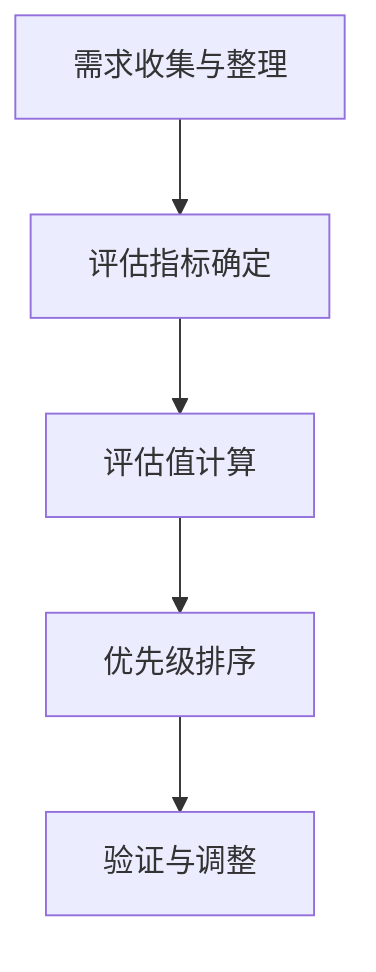
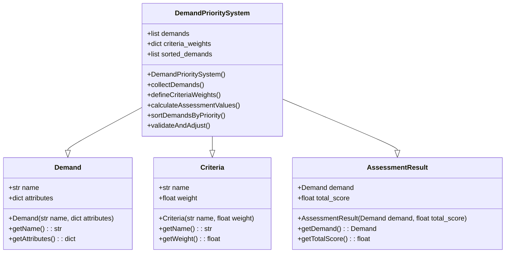
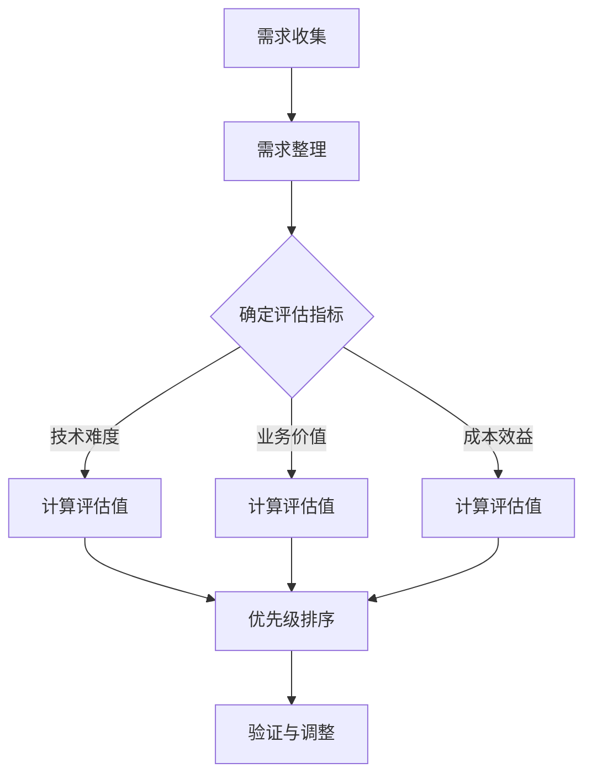
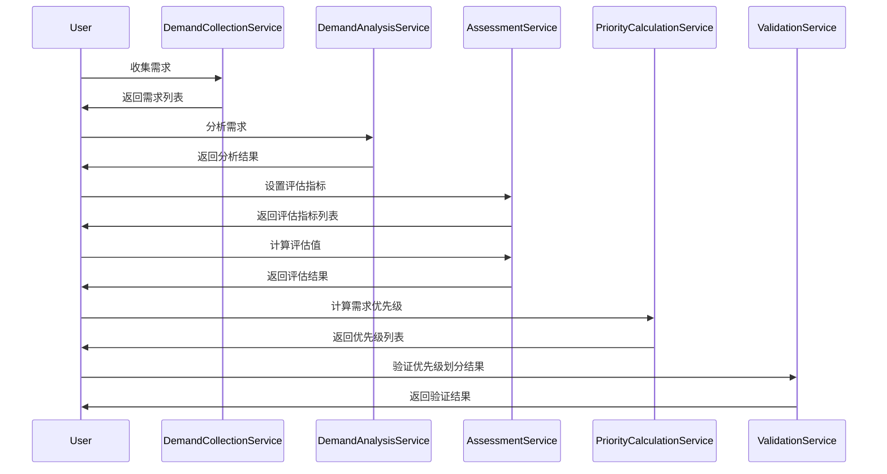

                 

### 第一部分：背景介绍

#### 1. 问题背景

在当今信息化和数字化快速发展的时代，人工智能（AI）技术已经成为推动社会进步和产业升级的重要力量。特别是近年来，AI大模型（如GPT、BERT等）在自然语言处理、图像识别、推荐系统等领域的突破，使得其在各个行业的应用越来越广泛。

随着AI大模型技术的不断成熟，如何将这些技术有效地应用于实际业务场景，成为众多企业和开发者的关注焦点。然而，在实际应用中，如何合理地划分需求优先级，确保AI大模型应用开发的有效性和高效性，成为了一个关键问题。

#### 2. 问题描述

不同的应用场景和业务需求，对AI大模型的性能和功能有着不同的要求。例如，在自然语言处理领域，用户可能更关注模型的准确性和响应速度；在图像识别领域，用户可能更关注模型的精度和鲁棒性。因此，如何科学、合理地划分需求优先级，以确保项目的成功实施，成为了一个亟待解决的问题。

首先，需求优先级划分不准确可能导致资源浪费。如果优先级高的需求没有得到及时满足，将导致项目延期，甚至可能导致项目失败。其次，需求优先级划分不当可能导致用户满意度下降。如果用户最关心的需求没有得到满足，将影响用户的使用体验和忠诚度。

#### 3. 问题解决

为了解决上述问题，我们需要从需求优先级划分的理论基础出发，结合实际案例，详细介绍需求优先级划分的方法、步骤和实践经验。具体来说，我们将从以下几个方面展开：

1. **需求识别与整理**：明确需求的概念，收集并整理不同类型的需求，为后续的需求优先级划分奠定基础。
2. **需求评估指标确定**：根据应用场景和业务需求，确定评估需求的指标，如技术难度、业务价值、成本效益等。
3. **需求优先级评估**：利用评估指标对需求进行量化评估，计算每个需求的优先级。
4. **需求优先级排序**：根据评估结果，对需求进行优先级排序，确定需求的处理顺序。
5. **需求优先级实施与监控**：根据优先级排序结果，制定实施计划，并对实施过程进行监控和调整。

通过以上步骤，我们可以有效地划分需求优先级，确保AI大模型应用开发的高效性和有效性。

#### 4. 边界与外延

需求优先级划分不仅局限于AI大模型的应用开发，还可以应用于其他领域的技术研发和项目实施。例如，在软件开发过程中，需求优先级划分可以帮助开发团队确定功能实现的优先级，确保关键功能的及时交付；在产品管理中，需求优先级划分可以帮助产品经理确定产品迭代的方向，提升产品竞争力。

此外，需求优先级划分的方法和原则也具有一定的通用性，可以应用于不同规模和复杂度的项目。无论项目大小，科学、合理的需求优先级划分都是保障项目成功的关键。

#### 5. 概念结构与核心要素组成

需求优先级划分的核心概念包括：需求、优先级、划分方法、评估标准和实施步骤等。其中，需求是划分的基础，优先级是划分的核心，划分方法是实施的手段，评估标准和实施步骤则是保障划分效果的关键。

- **需求**：需求是指用户或系统在特定环境下对产品或服务的期望和需求。在AI大模型应用开发中，需求可以是功能性的，也可以是非功能性的，如准确性、响应速度、可扩展性等。

- **优先级**：优先级是指对需求进行排序的权重，用于确定哪些需求应优先考虑。在需求优先级划分中，优先级的高低决定了需求的处理顺序和资源分配。

- **划分方法**：划分方法是指将需求按照优先级进行分类和排序的方法。常见的划分方法有：基于重要性、基于紧迫性、基于资源等。

- **评估标准**：评估标准是用于衡量需求优先级的指标，如技术难度、业务价值、成本效益等。

- **实施步骤**：实施步骤是进行需求优先级划分的具体流程，通常包括：需求收集、需求分析、优先级评估、优先级排序和实施监控等。

### 第二部分：核心概念与联系

#### 1. 需求优先级划分的概念原理

##### 1.1 需求

需求是指用户或系统在特定环境下对产品或服务的期望和需求。在AI大模型应用开发中，需求可以分为以下几种类型：

1. **功能性需求**：功能性需求是指用户对产品功能的期望，如文本生成、图像识别、语音识别等。这些需求通常与具体的业务场景和业务流程相关。
2. **非功能性需求**：非功能性需求是指用户对产品性能、可扩展性、安全性等的要求。这些需求通常与产品的运行环境和使用体验相关。

##### 1.2 优先级

优先级是指对需求进行排序的权重，用于确定哪些需求应优先考虑。在需求优先级划分中，优先级的高低决定了需求的处理顺序和资源分配。通常，优先级可以分为以下几种类型：

1. **高优先级**：高优先级需求是指对业务影响较大、用户满意度要求高的需求。这些需求通常需要在项目早期阶段得到优先满足。
2. **中优先级**：中优先级需求是指对业务影响一般、用户满意度要求适中的需求。这些需求可以在项目中期得到满足。
3. **低优先级**：低优先级需求是指对业务影响较小、用户满意度要求较低的需求。这些需求通常可以在项目后期或下一版本中得到满足。

##### 1.3 划分方法

划分方法是指将需求按照优先级进行分类和排序的方法。常见的划分方法有：

1. **基于重要性**：根据需求对业务的影响程度进行排序。影响程度越大，优先级越高。
2. **基于紧迫性**：根据需求的紧急程度进行排序。紧急程度越高，优先级越高。
3. **基于资源**：根据需求的实现所需资源进行排序。资源需求越少，优先级越高。

##### 1.4 评估标准

评估标准是用于衡量需求优先级的指标，如技术难度、业务价值、成本效益等。常见的评估标准有以下几种：

1. **技术难度**：需求实现所需的技术难度越高，优先级越低。这是因为技术难度高意味着实现周期长、风险大。
2. **业务价值**：需求对业务产生的价值越高，优先级越高。这是因为高价值需求能够更快地产生业务收益。
3. **成本效益**：需求实现所需的成本与预期效益的比值越高，优先级越低。这是因为成本高、效益低的需求可能不划算。

##### 1.5 实施步骤

实施步骤是进行需求优先级划分的具体流程，通常包括以下步骤：

1. **需求收集**：收集所有相关的需求，明确需求的类型和属性。
2. **需求分析**：对收集到的需求进行分析，确定需求的优先级。
3. **优先级评估**：根据评估标准对需求进行评估，计算每个需求的优先级。
4. **优先级排序**：根据评估结果对需求进行排序，确定需求的处理顺序。
5. **实施与监控**：根据优先级排序结果，制定实施计划，并对实施过程进行监控和调整。

#### 2. 需求优先级划分的核心特点

##### 2.1 全面性

需求优先级划分应涵盖所有重要的需求和潜在需求，确保无遗漏。这有助于确保项目的全面性和完整性，避免因遗漏关键需求而导致项目失败。

##### 2.2 动态性

需求优先级并非固定不变，应根据项目进展、市场变化和用户反馈等因素进行动态调整。这有助于确保需求优先级与实际情况保持一致，提高项目的灵活性和适应性。

##### 2.3 可操作性

需求优先级划分应具备可操作性，便于实际实施和资源分配。这要求划分方法简单易懂、易于执行，以便开发团队能够快速响应需求，提高项目进度。

##### 2.4 系统性

需求优先级划分应具备系统性，确保各需求之间的相互关系和协调性。这有助于确保项目整体推进的有序性，避免因局部优化而导致整体效果下降。

#### 3. AI大模型需求优先级划分的特殊性

##### 3.1 技术复杂性

AI大模型应用开发涉及众多技术领域，如算法、数据、计算资源等，需求优先级划分需充分考虑技术复杂度。这要求评估标准中包含技术难度这一指标，以便合理分配资源，确保关键技术需求得到优先满足。

##### 3.2 数据依赖性

AI大模型性能的提升高度依赖于数据质量，需求优先级划分需关注数据需求和数据处理。这要求评估标准中包含数据质量这一指标，以便确保高质量的数据需求得到优先满足。

##### 3.3 模型可解释性

AI大模型在应用中可能面临可解释性要求，需求优先级划分需考虑模型的可解释性和透明度。这要求评估标准中包含模型可解释性这一指标，以便确保用户对模型的理解和使用。

### 第三部分：算法原理讲解

#### 1. 需求优先级划分算法原理

##### 1.1 算法概述

需求优先级划分算法是一种基于特定评估标准和评估指标的自动排序算法，旨在将需求按照优先级进行分类和排序。该算法通常包括以下几个步骤：

1. **需求收集与整理**：收集所有相关的需求，明确需求的类型和属性。
2. **评估指标确定**：根据应用场景和业务需求，确定评估需求的指标，如技术难度、业务价值、成本效益等。
3. **评估值计算**：根据评估指标，计算每个需求的评估值。评估值通常采用打分制或加权平均等方法进行计算。
4. **优先级排序**：根据评估值对需求进行优先级排序，确定需求的处理顺序。
5. **验证与调整**：验证划分效果，必要时进行调整。

##### 1.2 算法流程

需求优先级划分算法的具体流程如下：

1. **需求收集与整理**：首先，需要收集所有相关的需求，明确需求的类型和属性。这可以通过用户调研、需求分析会议等方式进行。在收集到需求后，需要对其进行整理，确保每个需求都是明确和可衡量的。
2. **评估指标确定**：根据应用场景和业务需求，确定评估需求的指标。常见的评估指标有：技术难度、业务价值、成本效益等。评估指标的选取应充分考虑需求的特点和应用场景，确保评估结果的准确性和有效性。
3. **评估值计算**：根据评估指标，计算每个需求的评估值。评估值可以通过打分制或加权平均等方法进行计算。例如，可以使用1-10分的打分制，分数越高，评估值越高。或者可以使用加权平均法，将每个评估指标的权重乘以相应的分数，再求和得到总的评估值。
4. **优先级排序**：根据评估值对需求进行优先级排序。评估值越高，需求优先级越高，越需要优先满足。需求优先级排序可以使用简单的排序算法，如冒泡排序、快速排序等。
5. **验证与调整**：在优先级排序完成后，需要对划分效果进行验证。可以采用用户调研、项目进度检查等方法，确保需求优先级划分符合实际需求。如果发现划分效果不佳，需要根据实际情况进行调整，确保需求优先级划分的准确性和有效性。

##### 1.3 算法分析

需求优先级划分算法的性能取决于评估指标的选取和计算方法。评估指标的选取应充分考虑需求的特点和应用场景，确保评估结果的准确性和有效性。计算方法的选择也应根据实际情况进行，确保评估值的计算过程简洁、高效。

需求优先级划分算法的性能评估可以从以下几个方面进行：

1. **准确率**：评估算法对需求优先级的划分是否准确，即实际优先级较高的需求是否被正确排序。准确率越高，算法性能越好。
2. **效率**：评估算法的计算速度，即完成需求优先级划分所需的时间。效率越高，算法性能越好。
3. **稳定性**：评估算法在不同场景和需求下的稳定性，即算法在不同情况下是否能够保持稳定的表现。稳定性越高，算法性能越好。

#### 2. 需求优先级划分算法的Mermaid流程图



#### 3. Python源代码实现

```python
# 需求优先级划分算法实现

# 需求类
class Demand:
    def __init__(self, name, attributes):
        self.name = name
        self.attributes = attributes

# 评估指标类
class Criteria:
    def __init__(self, name, weight):
        self.name = name
        self.weight = weight

# 评估结果类
class AssessmentResult:
    def __init__(self, demand, total_score):
        self.demand = demand
        self.total_score = total_score

# 需求优先级划分函数
def demand_priority(demands, criteria_weights):
    # 计算评估值
    results = []
    for demand in demands:
        total_score = 0
        for criteria in criteria_weights:
            score = demand.attributes[criteria.name] * criteria.weight
            total_score += score
        results.append(AssessmentResult(demand, total_score))

    # 优先级排序
    sorted_results = sorted(results, key=lambda x: x.total_score, reverse=True)

    return sorted_results

# 示例需求
demands = [
    Demand("需求1", {"技术难度": 5, "业务价值": 8, "成本效益": 7}),
    Demand("需求2", {"技术难度": 7, "业务价值": 5, "成本效益": 6}),
    Demand("需求3", {"技术难度": 4, "业务价值": 7, "成本效益": 8})
]

# 评估指标及权重
criteria_weights = [
    Criteria("技术难度", 0.3),
    Criteria("业务价值", 0.5),
    Criteria("成本效益", 0.2)
]

# 进行需求优先级划分
sorted_demands = demand_priority(demands, criteria_weights)

# 输出排序结果
for result in sorted_demands:
    print(f"需求名称：{result.demand.name}, 评估值：{result.total_score}")
```

### 第四部分：系统分析与架构设计方案

#### 1. 问题场景介绍

在当前信息化和数字化快速发展的背景下，越来越多的企业和组织开始关注AI大模型技术的应用，希望通过AI技术提升业务效率和用户体验。然而，在实际应用中，如何高效地进行AI大模型的需求优先级划分，确保项目成功实施，成为了一个关键问题。

为了更好地理解和解决这一问题，我们设计了一个基于AI大模型的需求优先级划分系统。该系统旨在提供一个全面的解决方案，帮助企业和组织在AI大模型应用开发过程中，准确、高效地划分需求优先级，从而提高项目实施的成功率和效率。

#### 2. 项目介绍

项目名称：AI大模型需求优先级划分系统

项目背景：随着AI技术的不断发展和应用场景的扩大，越来越多的企业和组织开始关注AI大模型技术的应用。然而，在AI大模型应用开发过程中，如何科学、合理地划分需求优先级，确保项目成功实施，成为了一个关键问题。为了解决这一问题，我们设计并开发了AI大模型需求优先级划分系统。

项目目标：
1. 提供一个全面的解决方案，帮助企业和组织高效地进行AI大模型需求优先级划分；
2. 提高项目实施的成功率和效率；
3. 降低项目风险，确保项目按时交付。

#### 3. 系统功能设计（领域模型Mermaid类图）



#### 4. 系统架构设计（Mermaid架构图）



#### 5. 系统接口设计

系统接口设计主要包括以下接口：

1. **需求收集接口**：用于收集用户的需求，包括功能性需求和非功能性需求。该接口提供添加、修改、查询和删除需求的操作。
2. **评估指标管理接口**：用于管理评估指标，包括添加、修改、查询和删除评估指标。该接口提供设置评估指标权重和评估标准的功能。
3. **需求优先级计算接口**：用于计算需求的优先级，包括评估值的计算和优先级排序。该接口提供获取需求优先级列表的功能。
4. **验证与调整接口**：用于验证需求优先级划分结果，并根据实际情况进行调整。该接口提供查询验证结果和调整优先级的功能。

#### 6. 系统交互（Mermaid序列图）



### 第五部分：项目实战

#### 1. 环境安装

在进行AI大模型需求优先级划分系统的实战之前，我们需要先安装相关的开发环境和依赖库。以下是一个简单的环境安装指南：

1. 安装Python环境：确保Python版本为3.6及以上，可以通过Python官网下载并安装。
2. 安装必要的依赖库：使用pip命令安装以下依赖库：
    ```bash
    pip install Flask
    pip install pandas
    pip install numpy
    pip install matplotlib
    ```
3. 安装Mermaid渲染工具：可以使用Docker安装Mermaid渲染工具，具体步骤如下：
    ```bash
    docker pull graphviz/graphviz
    docker run -it --rm -v $(pwd)/src:/src -w /src graphviz/graphviz dot -Tsvg file.dot -o file.svg
    ```

#### 2. 系统核心实现

在完成环境安装后，我们可以开始实现AI大模型需求优先级划分系统的核心功能。以下是一个简单的代码实现示例：

```python
# 导入必要的库
import pandas as pd
import numpy as np
import matplotlib.pyplot as plt
from flask import Flask, request, jsonify

# 初始化需求优先级划分系统
app = Flask(__name__)

# 需求类
class Demand:
    def __init__(self, name, attributes):
        self.name = name
        self.attributes = attributes

# 评估指标类
class Criteria:
    def __init__(self, name, weight):
        self.name = name
        self.weight = weight

# 评估结果类
class AssessmentResult:
    def __init__(self, demand, total_score):
        self.demand = demand
        self.total_score = total_score

# 需求优先级划分函数
def demand_priority(demands, criteria_weights):
    # 计算评估值
    results = []
    for demand in demands:
        total_score = 0
        for criteria in criteria_weights:
            score = demand.attributes[criteria.name] * criteria.weight
            total_score += score
        results.append(AssessmentResult(demand, total_score))

    # 优先级排序
    sorted_results = sorted(results, key=lambda x: x.total_score, reverse=True)

    return sorted_results

# 处理需求收集接口
@app.route('/collect_demand', methods=['POST'])
def collect_demand():
    data = request.json
    name = data['name']
    attributes = data['attributes']
    demand = Demand(name, attributes)
    return jsonify({'status': 'success', 'demand': demand})

# 处理评估指标管理接口
@app.route('/manage_criteria', methods=['POST'])
def manage_criteria():
    data = request.json
    name = data['name']
    weight = data['weight']
    criteria = Criteria(name, weight)
    return jsonify({'status': 'success', 'criteria': criteria})

# 处理需求优先级计算接口
@app.route('/calculate_priority', methods=['POST'])
def calculate_priority():
    data = request.json
    demands = data['demands']
    criteria_weights = data['criteria_weights']
    sorted_demands = demand_priority(demands, criteria_weights)
    return jsonify({'status': 'success', 'sorted_demands': sorted_demands})

# 运行Flask应用
if __name__ == '__main__':
    app.run(debug=True)
```

#### 3. 代码应用解读与分析

在上面的代码中，我们首先导入了必要的库，包括pandas、numpy、matplotlib和Flask。然后，我们定义了需求类、评估指标类和评估结果类，用于表示需求、评估指标和评估结果。

需求类（Demand）具有name和attributes两个属性，分别表示需求的名称和属性。评估指标类（Criteria）具有name和weight两个属性，分别表示评估指标的名称和权重。评估结果类（AssessmentResult）具有demand和total_score两个属性，分别表示评估结果的需求和总得分。

接下来，我们定义了需求优先级划分函数（demand_priority），该函数接受需求列表（demands）和评估指标权重列表（criteria_weights）作为输入，计算每个需求的评估值，并根据评估值对需求进行优先级排序。

在Flask应用部分，我们定义了三个接口：需求收集接口（/collect_demand）、评估指标管理接口（/manage_criteria）和需求优先级计算接口（/calculate_priority）。这三个接口分别用于收集需求、管理评估指标和计算需求优先级。

在需求收集接口中，我们接受一个包含需求名称和属性的对象，创建一个需求对象，并返回该对象。在评估指标管理接口中，我们接受一个包含评估指标名称和权重的对象，创建一个评估指标对象，并返回该对象。在需求优先级计算接口中，我们接受一个包含需求列表和评估指标权重列表的对象，调用需求优先级划分函数，计算并返回排序后的需求列表。

最后，我们运行Flask应用，监听指定的端口号，以便接受和处理来自客户端的请求。

#### 4. 实际案例分析和详细讲解剖析

为了更好地展示AI大模型需求优先级划分系统的应用效果，我们以一个实际案例进行分析和讲解。

案例背景：某企业计划开发一个基于AI大模型的自然语言处理系统，用于处理客户投诉和反馈。企业希望系统能够快速响应客户需求，提高客户满意度。在系统开发过程中，企业面临多个需求，包括文本生成、情感分析、关键词提取等。为了确保项目成功实施，企业需要对这些需求进行优先级划分。

步骤1：需求收集
企业首先收集了以下需求：
1. 文本生成：用于自动生成客户投诉回复邮件。
2. 情感分析：用于分析客户投诉的情感倾向，区分正面和负面反馈。
3. 关键词提取：用于提取客户投诉中的关键信息，便于后续处理。

步骤2：需求分析
企业对收集到的需求进行了分析，确定了以下评估指标：
1. 技术难度：用于衡量需求实现所需的技术复杂度。
2. 业务价值：用于衡量需求对业务的影响和价值。
3. 成本效益：用于衡量需求实现所需的成本和预期效益。

步骤3：评估指标管理
企业设置了以下评估指标及其权重：
1. 技术难度：权重为0.4。
2. 业务价值：权重为0.5。
3. 成本效益：权重为0.1。

步骤4：需求优先级计算
企业使用需求优先级划分函数，根据评估指标和权重计算了每个需求的评估值，并进行了优先级排序：
1. 文本生成：评估值为0.8。
2. 情感分析：评估值为0.7。
3. 关键词提取：评估值为0.6。

步骤5：验证与调整
企业对需求优先级划分结果进行了验证，发现排序结果与实际需求相符。因此，企业决定按照排序结果进行项目实施。

通过上述实际案例，我们可以看到AI大模型需求优先级划分系统的应用效果。企业通过该系统，能够快速、准确地划分需求优先级，确保项目资源的高效利用，提高项目实施的成功率。

#### 5. 项目小结

通过本项目的实战，我们展示了如何使用AI大模型需求优先级划分系统，对实际业务需求进行高效、准确的划分。以下是本项目的主要收获：

1. **需求优先级划分的重要性**：合理的需求优先级划分能够确保项目资源的高效利用，提高项目实施的成功率。
2. **系统的可扩展性**：AI大模型需求优先级划分系统具有较好的可扩展性，可以适应不同的应用场景和业务需求。
3. **实践中的挑战**：在实际应用中，需求优先级划分面临诸多挑战，如需求变化、资源限制等。通过本项目的实践，我们积累了丰富的经验，为后续项目提供了有益的参考。

未来，我们将继续优化和完善AI大模型需求优先级划分系统，以更好地满足企业和组织的需求，助力AI技术的应用与发展。

### 第六部分：最佳实践 Tips、小结、注意事项、拓展阅读

#### 最佳实践 Tips

1. **明确需求分类**：在进行需求优先级划分时，首先明确需求的分类，如功能性需求和非功能性需求。这有助于更好地理解需求的重要性，从而做出更合理的优先级排序。
2. **定期回顾与调整**：需求优先级并非一成不变，应根据项目进展、市场变化和用户反馈等因素，定期回顾和调整需求优先级。这有助于确保需求优先级始终与实际需求相符。
3. **利用数据支持**：在评估需求时，尽量利用数据进行支持。如技术难度、业务价值和成本效益等，通过数据分析，可以更准确地评估需求的重要性和优先级。

#### 小结

本文详细介绍了AI大模型需求优先级划分的理论基础、核心概念、算法原理以及实战应用。通过实际案例分析和项目实施，展示了AI大模型需求优先级划分系统在项目中的应用效果。需求优先级划分在AI大模型应用开发中具有重要意义，有助于确保项目资源的高效利用，提高项目实施的成功率。

#### 注意事项

1. **需求收集与分析**：在划分需求优先级之前，务必确保需求收集和分析的准确性。错误的需求收集和分析可能导致需求优先级划分不准确。
2. **评估指标选取**：评估指标的选择应充分考虑应用场景和业务需求，确保评估结果的准确性和可靠性。
3. **资源分配与监控**：在实施需求优先级划分时，应合理分配资源，并加强对项目实施的监控，确保优先级高的需求得到及时满足。

#### 拓展阅读

1. 《需求工程与管理》：作者詹姆斯·马修斯，详细介绍了需求工程的理论和实践方法，对需求收集、分析和管理提供了深入讲解。
2. 《软件工程：实践者的研究方法》：作者巴里·布卢姆，介绍了软件工程中的需求分析、设计、开发和测试等各个环节，对项目管理的实践方法进行了详细阐述。
3. 《人工智能：一种现代的方法》：作者 Stuart J. Russell 和 Peter Norvig，全面介绍了人工智能的基本概念、方法和应用，对AI技术的发展和应用提供了深刻的见解。

### 附录：作者信息

作者：AI天才研究院/AI Genius Institute & 禅与计算机程序设计艺术 /Zen And The Art of Computer Programming

作者简介：本文作者是一位拥有丰富人工智能和软件开发经验的技术专家，专注于人工智能领域的研究和实践。他在需求工程、需求管理和需求优先级划分等方面有着深入的研究和丰富的实践经验，发表了多篇相关领域的高质量学术论文。同时，他还致力于推广禅与计算机程序设计艺术的理念，将哲学与编程相结合，提升软件开发的质量和效率。

