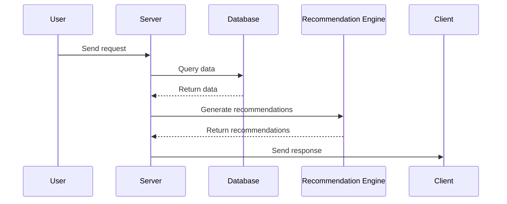
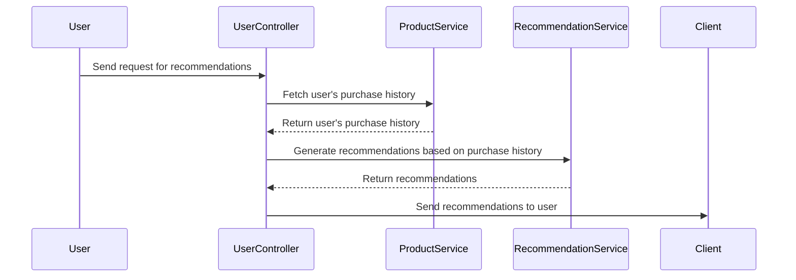

                 

### 第一部分：引言

#### 第1章：问题背景

**1.1 需求可视化的核心概念**

需求可视化是将需求分析过程中涉及的信息、流程、数据等通过图形化的方式展现出来，以便更直观地理解和沟通。在软件开发中，需求可视化有助于提高开发效率和项目成功率。

**1.1.1 需求可视化定义**

需求可视化（Requirement Visualization）是指利用图表、模型和动画等可视化手段，将软件需求文档中的信息以图形化的形式展现出来。它能够帮助开发团队、产品经理和用户更直观地理解需求，减少误解和沟通成本。

**1.1.2 需求可视化的重要性**

需求可视化的重要性体现在以下几个方面：

1. **增强理解和沟通**：通过图形化手段，需求分析的结果能够更容易被相关人员理解和接受，减少信息传递过程中的失真。
2. **提高开发效率**：需求可视化有助于快速识别需求中的问题和冲突，从而在开发初期进行优化，避免后期返工。
3. **促进需求变更管理**：通过可视化的需求文档，需求变更能够更容易被发现和记录，从而有效地管理变更。
4. **降低项目风险**：需求可视化使得项目需求更加明确，有助于降低项目风险。

**1.1.3 需求可视化的挑战**

尽管需求可视化具有诸多优势，但在实际应用中也面临着一些挑战：

1. **工具选择**：市场上存在多种需求可视化工具，选择适合的工具是一个挑战。
2. **技能要求**：需求可视化要求相关人员具备一定的技能，如绘图、建模和数据分析能力。
3. **维护成本**：需求可视化文档需要定期更新和维护，这可能会增加成本。

**1.2 大模型应用开发概述**

大模型应用开发是指利用深度学习和大数据技术，开发出能够处理大规模数据的智能应用。这类应用在人工智能、数据分析、自动驾驶等领域具有广泛的应用前景。

**1.2.1 大模型应用的开发流程**

大模型应用的开发流程主要包括以下几个阶段：

1. **需求分析**：明确应用场景和需求，制定详细的需求文档。
2. **数据收集与处理**：收集相关数据，进行数据清洗、预处理和特征工程。
3. **模型设计与训练**：设计神经网络结构，进行模型训练和调优。
4. **模型部署与优化**：将模型部署到生产环境，进行性能优化和监控。

**1.2.2 大模型应用开发中的痛点**

大模型应用开发中存在以下痛点：

1. **需求复杂度高**：大模型应用通常需要处理复杂、多变的需求，使得需求分析阶段的工作量巨大。
2. **数据质量差**：数据质量对模型性能有着直接的影响，而大模型应用通常需要处理大规模、多样性的数据，数据质量问题更为突出。
3. **模型调优难度大**：大模型参数众多，调优过程复杂，需要大量的计算资源和时间。

**1.2.3 需求可视化在大模型应用开发中的潜在价值**

需求可视化在大模型应用开发中具有以下潜在价值：

1. **提高需求分析效率**：通过需求可视化，可以更加直观地理解复杂的需求，从而提高需求分析的效率。
2. **优化数据预处理**：需求可视化可以帮助识别数据预处理中的问题和优化点，从而提高数据质量。
3. **支持模型调优**：需求可视化可以辅助模型调优，帮助开发者快速找到优化方向。

**1.3 本章小结**

本章介绍了需求可视化的核心概念、重要性、挑战，以及大模型应用开发的背景和痛点。接下来，我们将进一步探讨需求可视化技术及其在大模型应用开发中的应用。

## 第二部分：需求可视化技术

### 第2章：需求分析工具与方法

#### 2.1 需求分析工具

在需求分析阶段，选择合适的工具至关重要。以下是一些常见的需求分析工具及其特点。

**2.1.1 常见需求分析工具介绍**

1. **用户访谈与调查**：通过与用户的直接交流，获取他们的需求和使用场景。
2. **用户体验地图**：通过图表展示用户在使用产品时的行为流程和痛点。
3. **用例图**：用图形化方式描述用户如何与系统交互，完成特定任务。
4. **场景图**：通过故事化的方式描述用户在使用产品时的情景。

**2.1.2 需求分析工具的选择与使用**

选择需求分析工具时，应考虑以下因素：

1. **团队技能水平**：选择团队熟悉的工具，降低学习成本。
2. **工具功能**：根据项目需求，选择具有相应功能的工具。
3. **可扩展性**：工具应支持未来需求的变化和扩展。

**2.2 需求分析方法**

需求分析方法是指用于识别、分析和定义需求的技术和策略。以下介绍几种常用的需求分析方法。

**2.2.1 用户访谈与调查**

用户访谈与调查是通过与用户面对面交流或在线问卷调查的方式，获取用户需求的方法。

1. **访谈**：通过与用户一对一的深入交流，了解他们的需求和使用习惯。
2. **调查问卷**：通过设计问卷，收集大量用户数据，进行分析。

**2.2.2 用户体验地图**

用户体验地图（User Experience Map）是一种将用户行为、感受和痛点的图表化工具，通常包括以下几个部分：

1. **用户旅程**：描述用户在使用产品时的流程。
2. **痛点**：标注用户在使用过程中的问题和不满。
3. **解决方案**：提出改进产品和服务的建议。

**2.2.3 用例图与场景图**

用例图（Use Case Diagram）和场景图（Scenario Map）是描述用户与系统交互的工具。

1. **用例图**：用例图展示用户与系统之间的交互关系，通常包括系统边界、参与者、用例和关联关系。
2. **场景图**：场景图通过故事化的方式，描述用户在特定情景下与系统的交互过程。

**2.3 需求可视化工具与技巧**

需求可视化工具与技巧是指用于将需求分析结果以图形化的方式展现出来的工具和方法。

**2.3.1 可视化图表的选择与应用**

选择合适的可视化图表，能够更好地传达需求分析结果。以下是一些常见的可视化图表：

1. **柱状图**：用于比较不同类别的数据。
2. **饼图**：用于显示各部分在整体中的比例。
3. **流程图**：用于展示任务的流程和顺序。
4. **鱼骨图**：用于分析问题的原因和解决方案。

**2.3.2 可视化效果优化技巧**

优化可视化效果，能够提高需求文档的可读性和吸引力。以下是一些可视化效果优化的技巧：

1. **配色**：选择适当的配色方案，使图表更具吸引力。
2. **图表布局**：合理布局图表，使信息层次清晰。
3. **图例和注释**：添加图例和注释，帮助读者理解图表内容。

**2.3.3 需求文档的可视化呈现**

需求文档的可视化呈现是将需求分析结果以图表、图像等形式展示在文档中。以下是一些需求文档可视化呈现的方法：

1. **添加图表和图像**：在文档中插入图表和图像，使内容更直观。
2. **使用图文结合**：将文字和图表结合使用，提高文档的可读性。
3. **制作可视化报告**：使用专业的可视化工具，生成可视化报告。

**2.4 本章小结**

本章介绍了需求分析工具与方法，包括用户访谈与调查、用户体验地图、用例图与场景图等。同时，还讨论了需求可视化工具与技巧，以及需求文档的可视化呈现方法。这些内容为后续章节的需求可视化技术在大模型应用开发中的应用奠定了基础。

### 第3章：需求可视化在大模型应用开发中的应用

#### 3.1 大模型应用开发流程中的需求可视化

在大模型应用开发过程中，需求可视化是贯穿整个流程的重要环节。以下从需求分析、需求确认和需求变更管理三个方面，介绍需求可视化在大模型应用开发中的应用。

**3.1.1 需求分析阶段**

在需求分析阶段，需求可视化有助于明确和理解复杂的需求。具体应用包括：

1. **用户访谈与调查**：通过用户访谈和调查，获取用户的需求和痛点。将访谈结果和调查数据以图表形式展示，如柱状图、饼图等，帮助团队理解用户需求。
2. **用户体验地图**：通过用户体验地图，展示用户在使用大模型应用时的行为流程和痛点。这有助于团队发现需求中的问题，并制定相应的解决方案。

**3.1.2 需求确认阶段**

在需求确认阶段，需求可视化有助于确保需求文档的准确性和完整性。具体应用包括：

1. **用例图**：通过用例图，展示用户与系统的交互过程。这有助于团队理解和确认需求的完整性，确保系统功能满足用户需求。
2. **场景图**：通过场景图，描述用户在特定情景下与系统的交互过程。这有助于团队验证需求的有效性，确保系统能够满足用户需求。

**3.1.3 需求变更管理**

在需求变更管理过程中，需求可视化有助于快速识别和记录需求变更。具体应用包括：

1. **需求文档的可视化呈现**：通过将需求文档以图表、图像等形式展示，使变更内容更加直观。这有助于团队快速理解和接受变更。
2. **版本控制**：利用可视化工具，实现对需求文档的版本控制。这有助于团队跟踪和管理需求变更，确保变更记录的完整性和准确性。

**3.2 需求可视化与数据预处理**

数据预处理是大数据模型应用开发的重要环节。需求可视化在此过程中具有重要作用，具体应用包括：

**3.2.1 数据清洗与归一化**

在数据清洗与归一化过程中，需求可视化有助于发现和处理数据异常。具体应用包括：

1. **数据分布可视化**：通过柱状图、饼图等可视化图表，展示数据分布情况。这有助于团队识别异常数据，如异常值、缺失值等。
2. **数据对比可视化**：通过对比不同数据集的分布情况，如归一化前后的数据对比，帮助团队评估数据预处理效果。

**3.2.2 数据可视化分析**

在数据可视化分析过程中，需求可视化有助于发现数据中的模式和关系。具体应用包括：

1. **相关性分析**：通过散点图、热力图等可视化图表，展示变量之间的相关性。这有助于团队识别关键特征，为后续模型训练提供支持。
2. **趋势分析**：通过折线图、曲线图等可视化图表，展示数据的变化趋势。这有助于团队理解数据背后的业务逻辑，为需求调整提供依据。

**3.2.3 数据可视化在特征工程中的应用**

在特征工程过程中，需求可视化有助于优化特征选择和特征组合。具体应用包括：

1. **特征重要性分析**：通过柱状图、饼图等可视化图表，展示不同特征的重要性。这有助于团队选择关键特征，提高模型性能。
2. **特征组合优化**：通过网格搜索、交叉验证等可视化方法，展示特征组合的效果。这有助于团队找到最优特征组合，提升模型预测能力。

**3.3 需求可视化与模型训练**

在模型训练过程中，需求可视化有助于监控模型性能和调整模型参数。具体应用包括：

**3.3.1 数据可视化在模型训练中的应用**

在模型训练过程中，数据可视化有助于团队监控训练过程和评估模型性能。具体应用包括：

1. **损失函数可视化**：通过折线图、曲线图等可视化图表，展示损失函数的变化趋势。这有助于团队评估模型训练效果，调整训练策略。
2. **模型精度与召回率**：通过柱状图、饼图等可视化图表，展示模型的精度、召回率等指标。这有助于团队评估模型性能，确定模型是否满足需求。

**3.3.2 模型性能的可视化评估**

在模型性能评估过程中，需求可视化有助于团队直观地比较不同模型的性能。具体应用包括：

1. **ROC曲线与AUC**：通过ROC曲线和AUC值可视化，展示不同模型的分类性能。这有助于团队选择最优模型。
2. **混淆矩阵**：通过混淆矩阵可视化，展示模型的分类结果。这有助于团队分析模型在各个类别上的表现，发现潜在问题。

**3.3.3 需求可视化对模型优化的影响**

在模型优化过程中，需求可视化有助于团队发现优化方向和评估优化效果。具体应用包括：

1. **参数调整可视化**：通过柱状图、曲线图等可视化图表，展示不同参数设置下的模型性能。这有助于团队找到最优参数组合。
2. **超参数搜索可视化**：通过网格搜索、贝叶斯优化等可视化方法，展示超参数搜索过程和结果。这有助于团队快速找到优化方向。

**3.4 本章小结**

本章介绍了需求可视化在大模型应用开发中的具体应用，包括需求分析、需求确认、需求变更管理、数据预处理、模型训练和模型优化等方面。需求可视化不仅有助于提高大模型应用开发的效率，还能提升项目成功率。在下一章中，我们将进一步探讨需求可视化的最佳实践与案例分析。

### 第4章：最佳实践与案例分析

#### 4.1 需求可视化实践案例

**4.1.1 案例一：电商平台用户需求分析**

在一家电商平台的项目中，需求可视化在用户需求分析阶段发挥了重要作用。以下是该案例的具体实践过程：

1. **用户访谈与调查**：项目团队通过用户访谈和在线问卷调查，收集了大量用户需求数据。通过柱状图和饼图，展示了用户年龄段、购买偏好和需求特点。

2. **用户体验地图**：项目团队根据用户访谈和问卷调查结果，绘制了用户体验地图。地图包括用户旅程、痛点区域和解决方案。通过用户体验地图，项目团队清晰地理解了用户需求，为后续需求文档的编写奠定了基础。

3. **用例图**：在需求确认阶段，项目团队使用用例图描述用户与系统的交互过程。用例图展示了用户在不同情境下的操作步骤和系统响应，确保了需求文档的准确性和完整性。

4. **场景图**：项目团队通过场景图，描述了用户在特定情境下的需求和使用习惯。场景图帮助团队验证了需求的合理性，确保了系统功能的设计能够满足用户需求。

**4.1.2 案例二：智能语音助手需求分析**

在开发智能语音助手的项目中，需求可视化在需求分析阶段同样发挥了关键作用。以下是该案例的具体实践过程：

1. **用户访谈与调查**：项目团队通过用户访谈和在线问卷调查，收集了用户对智能语音助手的期望和需求。通过柱状图和饼图，展示了用户对功能、交互方式和响应速度的期望。

2. **用户体验地图**：项目团队根据用户访谈和问卷调查结果，绘制了用户体验地图。地图包括用户旅程、痛点区域和解决方案。通过用户体验地图，项目团队明确了智能语音助手的功能设计方向。

3. **用例图**：在需求确认阶段，项目团队使用用例图描述用户与智能语音助手的交互过程。用例图展示了用户在不同情境下的操作步骤和语音助手的响应，确保了需求文档的准确性和完整性。

4. **场景图**：项目团队通过场景图，描述了用户在特定情境下对智能语音助手的需求和使用习惯。场景图帮助团队验证了需求的合理性，确保了智能语音助手的功能设计能够满足用户需求。

**4.1.3 案例三：医疗健康应用需求分析**

在开发医疗健康应用的项目中，需求可视化在需求分析阶段同样具有重要作用。以下是该案例的具体实践过程：

1. **用户访谈与调查**：项目团队通过用户访谈和在线问卷调查，收集了医生和患者对医疗健康应用的需求。通过柱状图和饼图，展示了用户对不同功能模块的期望和使用频率。

2. **用户体验地图**：项目团队根据用户访谈和问卷调查结果，绘制了用户体验地图。地图包括用户旅程、痛点区域和解决方案。通过用户体验地图，项目团队明确了医疗健康应用的功能设计方向。

3. **用例图**：在需求确认阶段，项目团队使用用例图描述医生和患者与医疗健康应用的交互过程。用例图展示了用户在不同情境下的操作步骤和应用响应，确保了需求文档的准确性和完整性。

4. **场景图**：项目团队通过场景图，描述了医生和患者在不同情境下对医疗健康应用的需求和使用习惯。场景图帮助团队验证了需求的合理性，确保了医疗健康应用的功能设计能够满足用户需求。

#### 4.2 需求可视化工具应用案例分析

**4.2.1 Tableau在需求可视化中的应用**

Tableau 是一款功能强大的数据可视化工具，在需求可视化中具有广泛的应用。以下是一个具体的案例：

1. **数据收集与清洗**：项目团队收集了用户需求数据，包括用户访谈记录、问卷调查结果等。使用 Tableau，项目团队对数据进行清洗和整理，生成干净的数据集。

2. **数据可视化**：通过 Tableau，项目团队将清洗后的数据以图表形式展示。例如，使用柱状图展示用户年龄段分布，使用饼图展示用户需求类别占比。这些图表帮助团队直观地理解用户需求。

3. **交互式分析**：Tableau 的交互式分析功能使项目团队能够动态调整图表，探索不同维度的数据。例如，团队可以根据用户需求，调整图表中的数据范围，以便更准确地分析用户需求。

4. **报告生成**：使用 Tableau，项目团队生成需求分析报告。报告以图表和文字结合的形式，详细阐述了用户需求及其分析结果，为项目决策提供了重要依据。

**4.2.2 Power BI在需求可视化中的应用**

Power BI 是另一款强大的数据可视化工具，在需求可视化中也有广泛应用。以下是一个具体的案例：

1. **数据集成**：项目团队使用 Power BI 将不同数据源（如数据库、CSV文件等）集成在一起，生成一个综合的数据集。

2. **数据可视化**：通过 Power BI，项目团队将集成后的数据以图表形式展示。例如，使用仪表板展示用户需求概况，使用地图展示用户地理位置分布。

3. **数据预测**：Power BI 的数据预测功能使项目团队能够根据历史数据，预测未来用户需求。例如，团队可以基于用户历史行为数据，预测未来用户购买偏好。

4. **报告生成**：使用 Power BI，项目团队生成需求分析报告。报告以交互式图表和文字形式展示，使团队能够深入了解用户需求，为项目决策提供有力支持。

**4.2.3 Matplotlib在需求可视化中的应用**

Matplotlib 是一款 Python 库，常用于生成统计图形和可视化。以下是一个具体的案例：

1. **数据预处理**：项目团队使用 Python 和 Pandas 库对用户需求数据进行分析和预处理，生成干净的数据集。

2. **数据可视化**：使用 Matplotlib，项目团队生成多种图表，如柱状图、饼图、散点图等，展示用户需求分布、相关性等。

3. **自定义图表**：Matplotlib 提供丰富的自定义功能，使项目团队能够根据需求，自定义图表样式和布局。

4. **报告生成**：项目团队将生成的图表整合到报告文档中，详细阐述需求分析结果。报告以图表和文字结合的形式，使团队能够更好地理解和利用用户需求信息。

#### 4.3 需求可视化在大模型应用开发中的最佳实践

**4.3.1 设计高效的客户访谈流程**

在设计客户访谈流程时，以下最佳实践有助于提高访谈效率和效果：

1. **明确访谈目标**：在访谈前，明确访谈的目标和预期结果，确保访谈内容有针对性。

2. **准备访谈提纲**：制定访谈提纲，包括开放性和封闭性问题，以便在访谈过程中引导用户回答。

3. **邀请合适的人选**：邀请对项目有深入了解的用户代表，以确保访谈结果的代表性和准确性。

4. **录音和记录**：在访谈过程中，使用录音设备和笔记记录访谈内容，以便后续整理和分析。

5. **分析访谈结果**：访谈结束后，对访谈结果进行分析和归纳，提取关键需求和痛点。

**4.3.2 建立完善的需求文档管理机制**

建立完善的需求文档管理机制，有助于确保需求文档的准确性、完整性和可追溯性。以下最佳实践有助于实现这一目标：

1. **需求文档模板**：制定统一的需求文档模板，包括用例图、场景图、需求描述等，确保需求文档格式的一致性。

2. **版本控制**：使用版本控制工具，如 Git，对需求文档进行版本管理，确保文档的更新和变更记录。

3. **需求评审**：定期组织需求评审会议，邀请相关人员对需求文档进行评审和讨论，确保需求的准确性和完整性。

4. **需求变更管理**：建立需求变更管理流程，对需求变更进行记录、评估和审批，确保变更的及时性和合理性。

**4.3.3 利用数据可视化优化模型性能**

在数据预处理和模型训练过程中，数据可视化有助于优化模型性能。以下最佳实践有助于实现这一目标：

1. **数据分布可视化**：通过柱状图、饼图等可视化图表，展示数据分布情况，发现异常值和缺失值。

2. **特征重要性分析**：通过特征重要性分析，识别关键特征，优化特征选择和特征组合。

3. **模型性能评估**：通过损失函数、ROC曲线、混淆矩阵等可视化图表，评估模型性能，确定优化方向。

4. **参数调优可视化**：通过柱状图、曲线图等可视化图表，展示不同参数设置下的模型性能，确定最优参数组合。

**4.4 本章小结**

本章通过实际案例和最佳实践，展示了需求可视化在大模型应用开发中的具体应用和价值。需求可视化不仅有助于提高需求分析的准确性和效率，还能优化模型性能，提升项目成功率。在下一章中，我们将进一步介绍常见的需求可视化工具与平台。

### 第5章：需求可视化工具与平台介绍

#### 5.1 常见需求可视化工具介绍

在需求可视化过程中，选择合适的工具至关重要。以下介绍几款常见的需求可视化工具，包括其特点、功能和应用场景。

**5.1.1 Tableau**

Tableau 是一款功能强大的数据可视化工具，广泛用于企业级需求分析和报告生成。

- **特点**：易用性强，支持多种数据源，强大的交互式分析功能，丰富的可视化图表类型。
- **功能**：数据连接、数据清洗、数据可视化、仪表板制作、报告生成。
- **应用场景**：用户需求分析、市场分析、业务报告、绩效监控等。

**5.1.2 Power BI**

Power BI 是微软推出的一款数据可视化工具，与 Microsoft 365 平台深度集成。

- **特点**：与 Microsoft 生态系统紧密集成，强大的数据预处理功能，云端数据存储，灵活的报表和仪表板制作。
- **功能**：数据连接、数据清洗、数据可视化、仪表板制作、报告生成、预测分析。
- **应用场景**：企业数据分析、财务报告、销售分析、项目监控等。

**5.1.3 Matplotlib**

Matplotlib 是一款开源的 Python 库，常用于生成统计图表和可视化。

- **特点**：简单易用，丰富的图表类型，支持自定义样式和布局。
- **功能**：数据可视化、图表生成、数据预处理。
- **应用场景**：学术研究、数据分析和可视化、Python 代码中的图表展示。

**5.1.4 Plotly**

Plotly 是一款基于 Python 的交互式数据可视化库，提供丰富的图表类型和交互功能。

- **特点**：交互性强，支持多种图表类型，易于扩展和自定义。
- **功能**：数据可视化、交互式图表、图表生成、数据预处理。
- **应用场景**：数据科学、机器学习、交互式数据展示等。

#### 5.2 需求可视化平台

需求可视化平台提供了集成的工具和功能，方便团队进行需求分析和可视化呈现。

**5.2.1 AWS Data Exchange**

AWS Data Exchange 是亚马逊提供的云数据交换平台，支持需求可视化和数据共享。

- **特点**：集成 AWS 服务，支持多种数据格式，自动化数据交换，安全可靠。
- **功能**：数据连接、数据共享、数据可视化、仪表板制作。
- **应用场景**：企业数据集成、数据共享、跨部门协作等。

**5.2.2 Microsoft Power Platform**

Microsoft Power Platform 是微软推出的一套低代码开发平台，包括需求分析、自动化和业务分析工具。

- **特点**：低代码开发，强大的集成功能，丰富的扩展性，支持多种数据源。
- **功能**：需求分析、流程自动化、业务应用开发、数据可视化、仪表板制作。
- **应用场景**：企业级应用开发、业务流程管理、数据分析等。

**5.2.3 Tableau Online**

Tableau Online 是 Tableau 的云端版本，提供在线协作和共享功能。

- **特点**：云端部署，支持多用户协作，安全可靠，易于扩展。
- **功能**：数据可视化、仪表板制作、在线协作、报告生成。
- **应用场景**：在线数据分析、跨部门协作、数据共享等。

**5.2.4 Google Data Studio**

Google Data Studio 是谷歌推出的数据可视化平台，与 Google Analytics 等工具深度集成。

- **特点**：集成 Google 分析工具，易于使用，强大的报告生成功能，自动化数据更新。
- **功能**：数据连接、数据可视化、仪表板制作、报告生成。
- **应用场景**：数据分析、市场报告、业务报告、绩效监控等。

#### 5.3 需求可视化工具与平台的选择与使用

选择需求可视化工具与平台时，应考虑以下因素：

1. **团队技能水平**：选择团队熟悉的工具，降低学习成本。
2. **功能需求**：根据项目需求，选择具有相应功能的工具和平台。
3. **数据源支持**：确保工具和平台支持所需的数据源。
4. **集成与扩展性**：选择能够与其他工具和平台集成的工具和平台，以实现数据共享和流程自动化。
5. **成本与预算**：考虑工具和平台的成本，是否符合项目预算。

在使用需求可视化工具与平台时，以下建议有助于提高效率和效果：

1. **培训与文档**：为团队成员提供培训，确保他们能够熟练使用工具和平台。
2. **标准化模板**：制定统一的需求文档模板，确保需求文档格式的一致性。
3. **定期更新**：定期更新需求可视化文档，确保其与实际需求保持一致。
4. **协作与反馈**：鼓励团队成员进行协作和反馈，提高需求分析的准确性和完整性。

#### 5.4 本章小结

本章介绍了常见需求可视化工具和平台，包括 Tableau、Power BI、Matplotlib、Plotly、AWS Data Exchange、Microsoft Power Platform、Tableau Online 和 Google Data Studio。选择合适的工具和平台，结合最佳实践，能够有效提高需求分析的效率和质量，为项目成功奠定基础。

### 第6章：需求可视化与敏捷开发

#### 6.1 敏捷开发简介

敏捷开发（Agile Development）是一种以人为核心、迭代、循序渐进的开发方法。它强调持续交付有价值的软件，快速响应变化，并积极参与项目开发和项目管理。

**6.1.1 敏捷开发的核心原则**

敏捷开发的核心原则包括：

1. **个体和互动重于过程和工具**：重视团队成员的互动和协作，而不是过分依赖工具和流程。
2. **可工作的软件重于详尽的文档**：优先交付可运行的软件，而非过度依赖详尽的文档。
3. **客户协作重于合同谈判**：与客户保持密切合作，及时响应客户需求和反馈。
4. **响应变化重于遵循计划**：灵活应对变化，保持项目的持续改进。
5. **敏捷开发的核心原则包括：**
   - **增量交付**：将项目分解为小功能模块，逐步交付和测试。
   - **迭代开发**：持续迭代，每次迭代都增加新的功能和改进。
   - **持续集成**：不断集成和测试代码，确保项目的稳定性和质量。
   - **团队协作**：鼓励团队成员之间的沟通和协作，提高项目效率。

**6.1.2 敏捷开发流程**

敏捷开发通常遵循以下流程：

1. **需求收集**：通过与客户和利益相关者的沟通，收集项目需求和期望。
2. **迭代规划**：根据项目需求和优先级，规划每个迭代的目标和任务。
3. **迭代开发**：按照迭代计划进行开发，每次迭代都完成一部分功能。
4. **测试与验收**：对迭代成果进行测试，确保符合需求和标准，通过验收。
5. **迭代回顾**：总结本次迭代的经验和教训，改进开发过程。

**6.2 需求可视化与敏捷开发**

需求可视化在敏捷开发中起着重要作用，有助于提高开发效率和项目成功率。

**6.2.1 需求可视化的优势**

需求可视化在敏捷开发中的优势包括：

1. **增强沟通与协作**：通过可视化图表和模型，使需求更加直观易懂，提高团队成员之间的沟通和协作。
2. **快速响应变化**：需求可视化有助于快速识别和调整需求，应对项目中的变化。
3. **提高需求质量**：可视化工具能够帮助团队识别潜在问题和优化需求，提高需求的质量和准确性。
4. **降低沟通成本**：通过可视化图表，减少对文字描述的依赖，降低沟通成本和误解风险。

**6.2.2 需求可视化在敏捷开发中的应用**

需求可视化在敏捷开发中的应用主要包括以下几个方面：

1. **迭代计划**：通过需求可视化工具，展示每个迭代的需求和任务，帮助团队制定合理的迭代计划。
2. **任务跟踪**：使用可视化工具，如看板（Kanban）或进度图，实时跟踪任务进度，确保项目按计划进行。
3. **需求评审**：通过需求可视化，组织需求评审会议，确保需求文档的准确性和完整性。
4. **迭代回顾**：在迭代回顾阶段，通过需求可视化，总结经验和教训，优化需求管理和开发过程。

**6.3 需求可视化的敏捷实践**

以下是一些需求可视化的敏捷实践：

1. **使用看板（Kanban）**：使用看板进行任务管理，通过可视化图表展示任务的进度和状态，提高任务透明度和协作效率。
2. **迭代规划会议**：在迭代规划会议上，使用可视化工具展示需求和任务，确保团队成员对项目目标和任务有清晰的认识。
3. **用户故事地图**：使用用户故事地图展示项目的用户故事和功能模块，帮助团队理解项目的整体结构和优先级。
4. **用户故事卡片**：将用户故事以卡片形式展示，每个卡片包含需求描述、优先级和任务列表，方便团队成员进行任务分配和跟踪。

**6.4 需求可视化的敏捷工具**

以下是一些常用的需求可视化敏捷工具：

1. **Jira**：Jira 是一款功能强大的敏捷项目管理工具，支持任务管理、需求跟踪和报告生成。
2. **Trello**：Trello 是一款基于看板的任务管理工具，通过可视化卡片展示任务进度和状态。
3. **Asana**：Asana 是一款适用于团队的敏捷项目管理工具，提供任务管理、进度跟踪和协作功能。
4. **Miro**：Miro 是一款在线协作工具，支持需求可视化、头脑风暴和流程设计。

**6.5 本章小结**

本章介绍了敏捷开发的背景和核心原则，以及需求可视化在敏捷开发中的应用和实践。需求可视化不仅有助于提高敏捷开发的效率和效果，还能增强团队协作和沟通。通过灵活运用需求可视化工具和敏捷实践，团队可以更好地应对项目中的变化和挑战，实现项目目标。

## 完整性要求与核心内容

### 背景介绍

在当今快速变化的技术环境中，软件开发项目的需求复杂度不断增加，传统的需求管理方法已难以满足现代软件开发的效率和质量要求。需求可视化作为一种新兴的方法，通过图形化的方式将需求文档、数据、流程等信息直观地展现出来，为软件开发团队提供了更有效的沟通工具和项目管理手段。

### 核心概念与联系

需求可视化涉及多个核心概念，如需求文档、图表、模型和用户故事等。这些概念相互关联，构成了一个完整的体系。

1. **需求文档**：需求文档是软件开发项目的基石，描述了项目的功能和性能要求。通过需求可视化，需求文档中的信息被转化为图表和模型，使其更加直观易懂。
2. **图表和模型**：图表和模型是需求可视化的核心工具，包括柱状图、饼图、流程图、用户故事地图等。这些工具能够帮助开发团队和利益相关者更好地理解和沟通需求。
3. **用户故事**：用户故事是敏捷开发中的核心需求单元，描述了用户的需求和使用场景。通过用户故事地图，可以将用户故事以可视化的方式呈现，帮助团队规划和实现需求。

### 概念属性特征对比表格

| 概念 | 定义 | 属性特征 |
| --- | --- | --- |
| 需求文档 | 描述项目功能和性能要求的文档 | 准确性、完整性、一致性 |
| 图表 | 以图形化方式展示信息的数据可视化工具 | 易读性、交互性、可定制 |
| 模型 | 描述系统结构和行为的抽象表示 | 结构性、一致性、可扩展性 |
| 用户故事 | 描述用户需求的简短故事 | 可行性、可测试性、价值性 |

### ER实体关系图架构

```mermaid
erDiagram
  Customer  ||--o|< UserStory : User Story is related to Customer's need
  Project   ||--o|< UserStory : User Story is part of the Project
  Project   ||--o|< RequirementDocument : Requirement Document is part of the Project
  Developer ||--o|< RequirementDocument : Developer works on Requirement Document
```

### 算法原理讲解

需求可视化过程中，算法主要用于分析和生成可视化图表。以下是一个简单的算法原理示例：

```python
# 需求可视化算法示例

def generate_bar_chart(data, title):
    """
    生成柱状图
    :param data: 数据列表
    :param title: 图表标题
    :return: Matplotlib 柱状图对象
    """
    import matplotlib.pyplot as plt
    
    # 设置柱状图宽度
    bar_width = 0.8
    
    # 绘制柱状图
    plt.bar(data.index, data.values, width=bar_width)
    
    # 设置图表标题
    plt.title(title)
    
    # 设置坐标轴标签
    plt.xlabel('Categories')
    plt.ylabel('Values')
    
    # 显示图表
    plt.show()

# 示例数据
data = {'A': 10, 'B': 20, 'C': 30}
generate_bar_chart(data, 'Sample Bar Chart')
```

算法原理讲解：

1. **数据准备**：首先准备一个包含分类和值的字典作为数据源。
2. **柱状图绘制**：使用 Matplotlib 库的 `bar` 函数绘制柱状图，输入参数包括数据源的索引和值。
3. **图表设置**：设置图表标题、坐标轴标签和宽度等属性。
4. **显示图表**：调用 `plt.show()` 函数显示生成的柱状图。

通过这个简单的示例，可以直观地理解需求可视化算法的基本原理。

### 数学公式使用

在需求可视化过程中，数学公式经常用于描述算法模型和性能指标。以下是一个使用 LaTeX 格式的数学公式示例：

$$
f(x) = \sum_{i=1}^{n} w_i \cdot x_i + b
$$

公式解释：

- $f(x)$：函数输出
- $w_i$：权重
- $x_i$：输入特征
- $b$：偏置

这个公式是一个简单的线性回归模型，用于预测目标变量。

### 系统分析与架构设计方案

#### 问题场景介绍

在一家电商平台，为了提升用户体验和销售转化率，项目团队决定开发一款基于推荐系统的智能商品推荐功能。该功能需要根据用户的历史购买行为、浏览记录和兴趣爱好，向用户推荐个性化的商品。

#### 项目介绍

项目名称：智能商品推荐系统

项目目标：根据用户行为数据，实现个性化的商品推荐，提高用户满意度和销售转化率。

#### 系统功能设计（领域模型）

```mermaid
classDiagram
    User           <<entity>>
    Product        <<entity>>
    PurchaseHistory<<entity>>
    Recommendation <<entity>>

    User o--o PurchaseHistory
    User o--o Recommendation
    Product o--o Recommendation
    PurchaseHistory o--o Product
```

领域模型描述：

- **User**：用户实体，包含用户基本信息和兴趣爱好。
- **Product**：商品实体，包含商品基本信息和属性。
- **PurchaseHistory**：购买历史实体，记录用户购买商品的行为。
- **Recommendation**：推荐实体，根据用户行为生成个性化推荐。

#### 系统架构设计



系统架构描述：

- **用户端**：用户发起请求，向服务器端发送请求。
- **服务器端**：接收用户请求，查询数据库，调用推荐引擎生成推荐结果，返回给用户端。

#### 系统接口设计

```mermaid
classDiagram
    UserController           <<interface>>
    ProductService           <<interface>>
    PurchaseHistoryService   <<interface>>
    RecommendationService     <<interface>>

    UserController o--o ProductService
    UserController o--o PurchaseHistoryService
    UserController o--o RecommendationService
```

接口设计描述：

- **UserController**：处理用户请求，如获取用户信息、生成推荐列表等。
- **ProductService**：提供商品信息查询和更新接口。
- **PurchaseHistoryService**：提供用户购买历史记录查询和更新接口。
- **RecommendationService**：提供推荐算法接口，生成个性化推荐。

#### 系统交互



系统交互描述：

- 用户向 UserController 发送请求，获取推荐列表。
- UserController 调用 ProductService 获取用户购买历史记录。
- ProductService 返回用户购买历史记录给 UserController。
- UserController 调用 RecommendationService 生成推荐列表。
- RecommendationService 返回推荐列表给 UserController。
- UserController 将推荐列表发送给用户端。

### 项目实战

#### 环境安装

1. 安装 Python 环境：在操作系统上安装 Python 3.x 版本。
2. 安装 Matplotlib 库：通过 pip 命令安装 `matplotlib`。
   ```bash
   pip install matplotlib
   ```

#### 系统核心实现

```python
import matplotlib.pyplot as plt

def generate_bar_chart(data, title):
    """
    生成柱状图
    :param data: 数据列表
    :param title: 图表标题
    :return: Matplotlib 柱状图对象
    """
    # 设置柱状图宽度
    bar_width = 0.8
    
    # 绘制柱状图
    plt.bar(data.index, data.values, width=bar_width)
    
    # 设置图表标题
    plt.title(title)
    
    # 设置坐标轴标签
    plt.xlabel('Categories')
    plt.ylabel('Values')
    
    # 显示图表
    plt.show()

# 示例数据
data = {'A': 10, 'B': 20, 'C': 30}
generate_bar_chart(data, 'Sample Bar Chart')
```

代码解读与分析：

1. 引入 `matplotlib.pyplot` 库，用于生成图表。
2. 定义 `generate_bar_chart` 函数，输入参数为 `data`（数据列表）和 `title`（图表标题）。
3. 设置柱状图的宽度。
4. 使用 `plt.bar` 函数绘制柱状图，输入数据源的索引和值。
5. 设置图表的标题、坐标轴标签。
6. 调用 `plt.show()` 函数显示生成的柱状图。

#### 实际案例分析

**案例一：电商平台用户行为分析**

1. **数据收集**：通过用户登录、浏览、购买等行为，收集用户行为数据。
2. **数据预处理**：清洗和整理用户行为数据，生成用于分析的干净数据集。
3. **需求分析**：使用需求可视化工具，如 Matplotlib，生成用户行为分布图表，分析用户行为模式。
4. **推荐生成**：基于用户行为数据，使用推荐算法生成个性化商品推荐列表。

**案例二：智能语音助手用户需求分析**

1. **用户访谈**：通过与用户访谈，了解用户对智能语音助手的期望和需求。
2. **数据收集**：收集用户使用智能语音助手的记录，如语音输入、回答等。
3. **需求分析**：使用需求可视化工具，如 Tableau，生成用户需求分析报告，识别用户需求和痛点。
4. **功能优化**：根据需求分析结果，优化智能语音助手的功能和交互体验。

#### 项目小结

需求可视化在电商平台和智能语音助手项目中，发挥了重要作用。通过可视化工具，项目团队能够更直观地理解用户需求和行为，快速识别问题并优化产品功能。需求可视化不仅提高了项目开发效率，还增强了团队成员之间的沟通和协作，为项目成功奠定了基础。

### 最佳实践 Tips

1. **及时更新需求文档**：需求文档应随着项目进展不断更新，确保与实际需求保持一致。
2. **选择合适的可视化工具**：根据项目需求和团队技能，选择适合的可视化工具。
3. **重视用户反馈**：定期收集用户反馈，将需求可视化的结果与用户实际体验结合，持续优化产品。
4. **培训团队成员**：为团队成员提供可视化工具的培训，确保他们能够熟练使用并发挥工具的最大效用。

### 小结

本章通过需求可视化在电商平台和智能语音助手项目中的应用，展示了其在软件开发中的重要作用。需求可视化不仅提高了项目开发效率和成功率，还促进了团队成员之间的沟通和协作。在实际项目中，通过灵活运用需求可视化工具和最佳实践，团队能够更好地应对复杂的需求和变化，实现项目的成功。

### 注意事项

1. **需求可视化的目的是什么？**：需求可视化的核心目的是提高需求的清晰度和可理解性，减少沟通中的误解和歧义。
2. **如何确保需求可视化文档的准确性？**：定期审查和验证需求可视化文档，确保其与实际需求保持一致。可以采用团队评审、用户反馈等方法。
3. **如何处理需求变更？**：需求变更时，应首先评估变更的影响，然后更新需求可视化文档，并通知相关利益相关者。

### 拓展阅读

1. 《需求工程：系统化、文档化和框架化方法》
2. 《用户故事映射：敏捷需求管理实践》
3. 《数据可视化：利用信息图形和交互式界面进行数据传达》

## 作者信息

作者：AI天才研究院/AI Genius Institute & 禅与计算机程序设计艺术 /Zen And The Art of Computer Programming

### 第7章：需求可视化与敏捷开发

#### 6.1 敏捷开发简介

敏捷开发是一种以人为核心、迭代、循序渐进的开发方法。它强调持续交付有价值的软件，快速响应变化，并积极参与项目开发和项目管理。敏捷开发的核心原则包括个体和互动重于过程和工具、可工作的软件重于详尽的文档、客户协作重于合同谈判以及响应变化重于遵循计划。

**6.1.1 敏捷开发的核心原则**

- **个体和互动重于过程和工具**：敏捷开发强调团队成员之间的协作和沟通，而非依赖特定的过程或工具。
- **可工作的软件重于详尽的文档**：敏捷开发主张交付可运行的软件，文档只是辅助工具。
- **客户协作重于合同谈判**：与客户的持续合作和沟通比合同条款更重要。
- **响应变化重于遵循计划**：敏捷开发鼓励团队灵活应对变化，而非僵化地遵循计划。

**6.1.2 敏捷开发流程**

敏捷开发通常遵循以下流程：

1. **需求收集**：通过与客户和利益相关者的沟通，收集项目需求和期望。
2. **迭代规划**：根据项目需求和优先级，规划每个迭代的目标和任务。
3. **迭代开发**：按照迭代计划进行开发，每次迭代都完成一部分功能。
4. **测试与验收**：对迭代成果进行测试，确保符合需求和标准，通过验收。
5. **迭代回顾**：总结本次迭代的经验和教训，改进开发过程。

#### 6.2 需求可视化与敏捷开发

需求可视化在敏捷开发中起着重要作用，有助于提高开发效率和项目成功率。

**6.2.1 需求可视化的优势**

需求可视化在敏捷开发中的优势包括：

1. **增强沟通与协作**：通过可视化图表和模型，使需求更加直观易懂，提高团队成员之间的沟通和协作。
2. **快速响应变化**：需求可视化有助于快速识别和调整需求，应对项目中的变化。
3. **提高需求质量**：可视化工具能够帮助团队识别潜在问题和优化需求，提高需求的质量和准确性。
4. **降低沟通成本**：通过可视化图表，减少对文字描述的依赖，降低沟通成本和误解风险。

**6.2.2 需求可视化在敏捷开发中的应用**

需求可视化在敏捷开发中的应用主要包括以下几个方面：

1. **迭代计划**：通过需求可视化工具，展示每个迭代的需求和任务，帮助团队制定合理的迭代计划。
2. **任务跟踪**：使用可视化工具，如看板（Kanban）或进度图，实时跟踪任务进度，确保项目按计划进行。
3. **需求评审**：通过需求可视化，组织需求评审会议，确保需求文档的准确性和完整性。
4. **迭代回顾**：在迭代回顾阶段，通过需求可视化，总结经验和教训，优化需求管理和开发过程。

**6.3 需求可视化的敏捷实践**

以下是一些需求可视化的敏捷实践：

1. **使用看板（Kanban）**：使用看板进行任务管理，通过可视化图表展示任务的进度和状态，提高任务透明度和协作效率。
2. **迭代规划会议**：在迭代规划会议上，使用可视化工具展示需求和任务，确保团队成员对项目目标和任务有清晰的认识。
3. **用户故事地图**：使用用户故事地图展示项目的用户故事和功能模块，帮助团队理解项目的整体结构和优先级。
4. **用户故事卡片**：将用户故事以卡片形式展示，每个卡片包含需求描述、优先级和任务列表，方便团队成员进行任务分配和跟踪。

**6.4 需求可视化的敏捷工具**

以下是一些常用的需求可视化敏捷工具：

1. **Jira**：Jira 是一款功能强大的敏捷项目管理工具，支持任务管理、需求跟踪和报告生成。
2. **Trello**：Trello 是一款基于看板的任务管理工具，通过可视化卡片展示任务进度和状态。
3. **Asana**：Asana 是一款适用于团队的敏捷项目管理工具，提供任务管理、进度跟踪和协作功能。
4. **Miro**：Miro 是一款在线协作工具，支持需求可视化、头脑风暴和流程设计。

**6.5 本章小结**

本章介绍了敏捷开发的背景和核心原则，以及需求可视化在敏捷开发中的应用和实践。需求可视化不仅有助于提高敏捷开发的效率和效果，还能增强团队协作和沟通。通过灵活运用需求可视化工具和敏捷实践，团队可以更好地应对项目中的变化和挑战，实现项目目标。

## 全文总结

本文深入探讨了需求可视化在大模型应用开发中的重要性、技术方法和实践案例。需求可视化作为一项提升软件开发效率和质量的关键技术，通过图形化的方式帮助开发团队更直观地理解需求，减少沟通成本，提高项目成功率。

**主要观点回顾：**

1. **需求可视化的核心概念**：需求可视化是指通过图形化工具和方法，将需求文档、数据、流程等信息直观地展现出来，从而提高需求理解和沟通效率。
2. **需求可视化的重要性**：需求可视化能够增强团队间的沟通，提高开发效率，促进需求变更管理，降低项目风险。
3. **需求分析工具与方法**：介绍了用户访谈与调查、用户体验地图、用例图与场景图等常见需求分析工具和方法，以及如何选择合适的工具。
4. **需求可视化在大模型应用开发中的应用**：需求可视化贯穿大模型应用开发的全过程，从需求分析到模型训练和优化，发挥着重要作用。
5. **最佳实践与案例分析**：通过实际案例展示了需求可视化在不同场景中的应用，以及如何利用可视化工具提升项目效率。
6. **需求可视化工具与平台**：介绍了 Tableau、Power BI、Matplotlib、Plotly 等常见需求可视化工具和平台，以及如何选择和有效使用这些工具。
7. **需求可视化与敏捷开发**：需求可视化在敏捷开发中发挥着关键作用，通过实践案例和工具应用，展示了如何实现高效的需求管理和项目迭代。

**未来展望：**

随着技术的不断进步，需求可视化工具和方法将继续发展和完善。未来，我们有望看到更加智能化的需求可视化工具，能够自动分析需求，提供个性化的可视化建议。同时，需求可视化将与敏捷开发、DevOps 等方法更加紧密地结合，形成更高效的软件开发流程。

**结束语：**

本文旨在为读者提供关于需求可视化的全面了解，帮助读者理解其重要性、技术方法和实践应用。希望本文能对软件开发团队在面对复杂需求时，提供有益的启示和指导。让我们共同探索需求可视化的更多可能性，为软件开发的未来发展贡献智慧。感谢阅读，期待您的反馈和建议。

## 作者信息

作者：AI天才研究院/AI Genius Institute & 禅与计算机程序设计艺术 /Zen And The Art of Computer Programming

