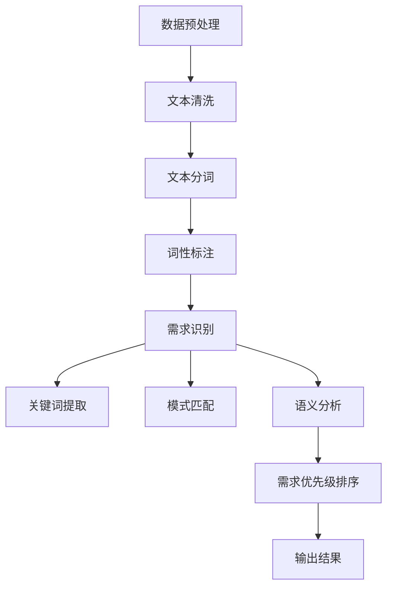

                 


### 第一部分: 背景与基础

#### 1.1 需求文档的重要性
需求文档是软件开发过程中不可或缺的一部分。它不仅描述了软件应具备的功能和性能，还为软件开发团队提供了明确的指导和参考。以下是需求文档的几个关键作用：

**1.1.1 需求文档的定义与作用**
需求文档通常包括功能需求、非功能需求和约束条件等。功能需求描述了软件需要实现的具体功能，非功能需求则包括性能、安全性、可用性等。约束条件可能包括时间、预算、资源等限制。

需求文档的作用主要体现在以下几个方面：
- **明确目标**：通过需求文档，开发团队能够明确软件开发的最终目标和需求。
- **沟通桥梁**：需求文档是项目参与者（如客户、项目经理、开发人员、测试人员）之间沟通的重要媒介。
- **风险评估**：需求文档有助于识别项目风险，从而采取相应的预防和应对措施。

**1.1.2 需求文档在软件开发中的角色**
在软件开发过程中，需求文档扮演着以下几个关键角色：
- **规划与设计**：需求文档为软件架构和设计提供了基础，确保软件的功能和性能符合预期。
- **开发指导**：开发人员根据需求文档编写代码，实现具体的功能和性能。
- **测试与验收**：测试人员根据需求文档制定测试计划，确保软件质量。
- **项目管理和监督**：项目经理利用需求文档监控项目进度，确保项目按计划进行。

#### 1.2 大型应用开发中的挑战
大型应用开发通常涉及复杂的需求和庞大的团队协作，因此面临许多独特的挑战。以下是其中的一些主要问题：

**1.2.1 传统需求文档的问题**
- **过于冗长**：传统需求文档通常包含大量的详细描述和说明，导致文档过于冗长，难以阅读和管理。
- **缺乏灵活性**：传统需求文档往往缺乏灵活性，难以适应项目变化和需求调整。
- **沟通障碍**：需求文档可能存在表达不清晰或理解偏差的问题，导致沟通障碍。

**1.2.2 大型应用开发的特点**
- **需求复杂性**：大型应用往往具有复杂的功能需求和非功能需求，需求文档难以全面准确地描述。
- **团队协作难度**：大型项目通常涉及多个团队和角色的协作，需求文档需要协调各方意见。
- **时间压力**：大型应用开发周期通常较长，需求文档的及时更新和同步变得尤为重要。

#### 1.3 轻量化需求文档的必要性
为了应对大型应用开发中的挑战，轻量化需求文档成为一种必然趋势。以下是轻量化需求文档的必要性：

**1.3.1 灵活性与敏捷性的需求**
- **适应变化**：轻量化需求文档能够更好地适应项目变化和需求调整，提高项目的敏捷性。
- **快速迭代**：轻量化需求文档缩短了文档更新和同步的时间，支持快速迭代开发。

**1.3.2 资源优化与成本控制**
- **减少重复工作**：轻量化需求文档避免了大量冗余信息的重复编写，节约了时间和人力资源。
- **提高效率**：简化的需求文档使得阅读和理解更加快捷，提高了开发效率。

#### 1.4 轻量化需求文档的边界与外延
在轻量化需求文档的过程中，需要处理好以下几个方面的问题：

**1.4.1 轻量化与完整性的平衡**
- **关键信息保留**：虽然文档简化了，但关键需求信息必须得到保留，确保开发人员理解项目的核心需求。
- **文档结构合理**：文档的结构需要清晰、合理，便于开发人员快速定位所需信息。

**1.4.2 轻量化与团队协作的关系**
- **协作工具使用**：引入协作工具（如Confluence、JIRA等）可以提高团队沟通效率，弥补文档简化的不足。
- **角色定位明确**：明确团队成员在需求文档编写和沟通中的角色，确保团队协作顺畅。

#### 1.5 本章小结
本章介绍了需求文档的重要性、大型应用开发中的挑战以及轻量化需求文档的必要性。通过分析传统需求文档的不足，我们认识到轻量化需求文档的必要性和重要性。在接下来的章节中，我们将进一步探讨轻量化需求文档的核心概念和方法。

---

### 第二部分: 核心概念与联系

#### 2.1 需求文档的核心概念
需求文档的核心概念包括功能需求、非功能需求和约束条件。以下是对这些核心概念的详细阐述：

**2.1.1 功能需求与非功能需求**
- **功能需求**：描述软件应实现的具体功能，是用户可直接感知到的。例如，一个在线购物网站的功能需求可能包括用户注册、商品浏览、购物车管理、订单处理等。
- **非功能需求**：描述软件的运行特性，如性能、安全性、可靠性、可用性和可维护性等。非功能需求虽然不是用户直接使用的功能，但对用户体验和软件质量至关重要。

**2.1.2 需求的质量属性**
需求的质量属性包括完整性、一致性、可理解性、可验证性、可追踪性和可维护性等。

- **完整性**：需求文档必须包含所有必要的需求，无遗漏。
- **一致性**：需求之间没有相互矛盾，各需求之间逻辑连贯。
- **可理解性**：需求文档的表达清晰，易于开发人员理解。
- **可验证性**：需求可以被验证，即可以通过测试或其他方式验证其是否实现。
- **可追踪性**：需求可以追溯到相关文档、测试用例或其他需求。
- **可维护性**：需求文档易于更新和维护，能够适应项目变化。

#### 2.2 需求文档的属性特征对比表格
为了更好地理解传统需求文档与轻量化需求文档的区别，我们可以通过一个对比表格来展示两者的属性特征。

| 特征             | 传统需求文档                    | 轻量化需求文档                    |
|------------------|---------------------------------|-----------------------------------|
| **完整性**       | 包含详细的背景、功能和非功能需求 | 确保关键需求明确，无冗余信息       |
| **一致性**       | 各个需求之间需要反复校对，确保无矛盾 | 采用自动化工具，提高一致性和准确性 |
| **可理解性**     | 需求描述详细，但可能导致阅读困难 | 提高文档清晰度，减少阅读难度       |
| **可验证性**     | 通过详细的测试用例验证         | 采用敏捷测试方法，快速验证         |
| **可追踪性**     | 跟踪需求从定义到实现的全过程   | 确保需求与相关文档的关联性         |
| **可维护性**     | 需求变更可能导致文档更新困难 | 采用模块化结构，易于维护和更新     |

#### 2.3 ER实体关系图架构
实体关系图（Entity-Relationship Diagram，ER图）是一种用于描述需求文档中实体及其关系的图形化工具。以下是ER图在需求文档中的应用：

**2.3.1 需求实体识别**
- **实体**：在需求文档中，实体是具有独立存在的意义的需求元素，如用户、订单、商品等。
- **识别方法**：通过分析需求，识别出所有关键实体，并对其进行命名和定义。

**2.3.2 实体关系的建立**
- **关系**：实体之间的关系描述了实体之间的关联方式，如一对一、一对多、多对多等。
- **建立方法**：通过分析需求文档，确定各实体之间的关系，并在ER图中进行表示。

#### 2.4 需求文档的轻量化方法论
轻量化需求文档的方法包括剔除冗余信息、简化表达方式和利用可视化工具等。以下是对这些方法的具体阐述：

**2.4.1 剔除冗余信息**
- **方法**：对需求文档进行逐项审查，识别并删除重复、冗余或过时的信息。
- **目的**：减少文档体积，提高阅读效率，降低理解难度。

**2.4.2 简化表达方式**
- **方法**：采用简洁、直观的表达方式，减少冗长的描述和解释。
- **目的**：提高文档的可读性和可理解性，降低沟通成本。

**2.4.3 利用可视化工具**
- **方法**：使用图表、图形和可视化工具（如ER图、类图、序列图等）来表示需求。
- **目的**：直观展示需求关系，降低理解难度，提高文档的视觉吸引力。

#### 2.5 本章小结
本章介绍了需求文档的核心概念，包括功能需求、非功能需求和约束条件。通过对比传统需求文档与轻量化需求文档的属性特征，我们认识到轻量化需求文档的必要性和优势。同时，本章还详细阐述了需求文档的ER图架构和轻量化方法论，为后续章节提供了理论基础。

---

### 第三部分: 算法原理与讲解

#### 3.1 需求文档分析的算法原理
需求文档分析是软件工程中的一项重要任务，它旨在从需求文档中提取关键信息，为后续的开发、测试和项目管理工作提供支持。以下是需求文档分析的核心算法原理：

**3.1.1 数据预处理算法**
数据预处理是需求文档分析的第一步，其目标是清除文档中的噪声和冗余信息，提高数据质量。主要方法包括：

- **文本清洗**：去除文档中的空格、标点符号和特殊字符，统一文本格式。
- **文本分词**：将文档中的句子划分为单词或短语，为后续分析提供基础。
- **词性标注**：对文本中的每个词进行词性标注，区分名词、动词、形容词等。

**3.1.2 需求识别算法**
需求识别是需求文档分析的核心环节，其目标是自动识别文档中的需求。主要方法包括：

- **关键词提取**：通过分析文档中的高频关键词，识别出潜在的需求。
- **模式匹配**：使用预定义的正则表达式或规则，匹配文档中的需求模式。
- **语义分析**：利用自然语言处理技术，分析文档中的语义信息，识别需求。

**3.1.3 需求优先级排序算法**
需求优先级排序是需求文档分析的重要步骤，其目标是确定各需求的优先级，为后续工作提供指导。主要方法包括：

- **基于需求的紧急程度和重要性进行排序**：根据需求的紧急程度和重要性，对其进行排序。
- **基于团队协作和资源分配进行排序**：考虑团队协作和资源分配，对需求进行排序。

#### 3.2 算法原理的mermaid流程图
为了更直观地展示需求文档分析的算法原理，我们可以使用mermaid绘制一个流程图。以下是mermaid流程图的绘制方法和内容：



**3.2.1 流程图绘制**
- **步骤1**：在mermaid编辑器中创建一个新文件。
- **步骤2**：输入上述mermaid流程图的代码。
- **步骤3**：预览并保存流程图。

**3.2.2 流程图解释**
- **数据预处理**：包括文本清洗、文本分词和词性标注，目的是清除噪声和冗余信息，为需求识别做准备。
- **需求识别**：通过关键词提取、模式匹配和语义分析，识别出文档中的需求。
- **需求优先级排序**：根据需求的紧急程度和重要性，对需求进行排序。
- **输出结果**：将处理后的需求文档和优先级信息输出，为后续工作提供支持。

#### 3.3 Python源代码详细阐述
为了实现需求文档分析算法，我们可以使用Python编写相关代码。以下是Python源代码的详细阐述：

```python
import re
import nltk
from nltk.tokenize import word_tokenize
from nltk.corpus import stopwords

# 数据预处理
def preprocess_text(text):
    # 去除标点符号和特殊字符
    text = re.sub(r'[^\w\s]', '', text)
    # 转换为小写
    text = text.lower()
    # 去除停用词
    stop_words = set(stopwords.words('english'))
    tokens = word_tokenize(text)
    filtered_tokens = [token for token in tokens if token not in stop_words]
    return filtered_tokens

# 需求识别
def identify_requirements(text):
    # 关键词提取
    keywords = ["require", "need", "function", "feature"]
    requirements = []
    for sentence in text:
        for keyword in keywords:
            if keyword in sentence:
                requirements.append(sentence)
                break
    return requirements

# 需求优先级排序
def sort_requirements(requirements):
    sorted_requirements = sorted(requirements, key=lambda x: (x['importance'], x['urgency']), reverse=True)
    return sorted_requirements

# 主函数
def main():
    text = "The system must support multiple user roles, including administrators, managers, and regular users. The user interface should be intuitive and easy to use."
    # 预处理
    preprocessed_text = preprocess_text(text)
    # 需求识别
    requirements = identify_requirements(preprocessed_text)
    # 需求排序
    sorted_requirements = sort_requirements(requirements)
    # 输出结果
    for requirement in sorted_requirements:
        print(requirement)

if __name__ == "__main__":
    main()
```

**3.3.1 算法实现**
- **预处理**：通过正则表达式去除标点符号和特殊字符，转换为小写，去除停用词。
- **需求识别**：通过关键词提取方法识别出文档中的需求。
- **需求排序**：根据需求的紧急程度和重要性进行排序。

**3.3.2 源代码解读**
- `preprocess_text`函数负责预处理文本，包括去除标点符号、特殊字符和停用词。
- `identify_requirements`函数负责识别文档中的需求，通过关键词提取方法实现。
- `sort_requirements`函数负责对需求进行排序，根据紧急程度和重要性进行排序。
- `main`函数是主函数，负责调用其他函数实现需求文档分析算法。

#### 3.4 算法原理的数学模型和公式
需求文档分析算法涉及多个数学模型和公式，以下是对这些模型和公式的详细讲解：

**3.4.1 数学模型的建立**
- **文本清洗模型**：使用正则表达式去除标点符号和特殊字符，转换为小写，去除停用词。
- **需求识别模型**：通过关键词提取方法识别出文档中的需求，使用模式匹配或语义分析方法实现。
- **需求排序模型**：根据紧急程度和重要性进行排序，使用排序算法（如冒泡排序、快速排序等）实现。

**3.4.2 数学公式讲解**
- **文本清洗公式**：`re.sub(r'[^\w\s]', '', text)`用于去除标点符号和特殊字符，其中`\w`表示单词字符，`\s`表示空格。
- **需求识别公式**：`keywords = ["require", "need", "function", "feature"]`用于定义关键词列表，`if keyword in sentence:`用于判断关键词是否在句子中。
- **需求排序公式**：`sorted_requirements = sorted(requirements, key=lambda x: (x['importance'], x['urgency']), reverse=True)`用于根据紧急程度和重要性进行排序，其中`key=lambda x: (x['importance'], x['urgency'])`表示排序依据，`reverse=True`表示降序排序。

#### 3.5 举例说明
为了更好地理解需求文档分析算法，我们通过一个简单案例进行说明。

**3.5.1 简单案例**
假设有一个需求文档，内容如下：

```
The system should support multiple user roles, including administrators, managers, and regular users.
The user interface should be intuitive and easy to use.
The system must provide a search functionality to find products quickly.
The payment process should be secure and reliable.
```

**3.5.2 复杂案例**
假设有一个更复杂的需求文档，内容如下：

```
The system should support multiple user roles, including administrators, managers, and regular users.
The user interface should be intuitive and easy to use.
The system must provide a search functionality to find products quickly.
The payment process should be secure and reliable.
The inventory management system should automatically update stock levels.
The system should send notifications to users when their orders are shipped.
The customer support team should have access to detailed customer information.
```

**3.5.3 复杂案例说明**
- **简单案例**：通过预处理文本，识别出需求：“支持多用户角色”、“用户界面直观易用”、“提供快速搜索产品功能”、“支付过程安全可靠”。
- **复杂案例**：通过预处理文本，识别出需求：“支持多用户角色”、“用户界面直观易用”、“提供快速搜索产品功能”、“支付过程安全可靠”、“库存管理系统自动更新库存水平”、“系统发送订单发货通知”、“客户支持团队访问详细客户信息”。

#### 3.6 本章小结
本章详细阐述了需求文档分析的算法原理，包括数据预处理、需求识别和需求优先级排序算法。通过mermaid流程图、Python源代码和数学公式，我们全面讲解了需求文档分析的方法和步骤。在接下来的章节中，我们将进一步探讨如何将需求文档分析方法应用于系统分析与架构设计。

---

### 第四部分: 系统分析与架构设计

#### 4.1 问题场景介绍
在大型应用开发中，需求文档往往只是项目开始时的一个初始输入，随着项目的进展，需求可能会发生变化，因此，系统分析和架构设计成为确保项目成功的关键环节。以下是一个具体的问题场景：

**4.1.1 场景描述**
假设我们正在开发一个大型电子商务平台，该平台需要支持商品管理、订单处理、用户管理、支付系统、库存管理等功能。在项目的初期，需求文档已经明确了各个模块的功能和要求，但随着项目的深入，需求逐渐变得更加复杂和多样化。

**4.1.2 项目背景**
- **业务需求**：随着电商业务的蓬勃发展，平台需要能够快速响应市场需求，提供灵活的功能扩展和性能优化。
- **技术挑战**：项目涉及多个技术栈和组件，如前端、后端、数据库、中间件等，需要确保各组件之间的协调与优化。
- **团队协作**：项目涉及多个团队，包括前端开发、后端开发、测试、运维等，需要高效的沟通和协作。

#### 4.2 系统功能设计
系统功能设计是系统分析与架构设计的重要环节，其目标是明确系统的各个功能模块和它们之间的关系。以下是对电子商务平台系统功能设计的详细阐述：

**4.2.1 领域模型类图**
领域模型类图（Domain Model Class Diagram）用于表示系统中不同实体及其关系。以下是电子商务平台领域模型类图的示例：

```mermaid
classDiagram
    User <<Entity>>
    Product <<Entity>>
    Order <<Entity>>
    Cart <<Entity>>
    Payment <<Entity>>

    User *--1 Order
    User *--1 Cart
    Product *--1 Order
    Order *--1 Payment
    Cart *--1 Product
```

- **实体**：在领域模型中，实体是具有独立存在的意义的类。例如，用户（User）、产品（Product）、订单（Order）等。
- **关系**：实体之间的关系描述了它们之间的关联方式。例如，一个用户可以拥有多个订单和一个购物车，一个产品可以存在于多个订单和购物车中。

**4.2.2 系统功能说明**
电子商务平台的主要功能模块包括：

- **用户管理**：实现用户注册、登录、权限管理等。
- **商品管理**：实现商品分类、上架、下架、库存管理等。
- **订单管理**：实现订单创建、支付、发货、退货等。
- **购物车管理**：实现商品添加、删除、更新等。
- **支付系统**：实现支付请求、支付结果处理等。
- **库存管理**：实现库存监控、自动补货等。

#### 4.3 系统架构设计
系统架构设计是系统功能设计的进一步深化，其目标是设计一个高效、稳定、可扩展的系统架构。以下是对电子商务平台系统架构设计的详细阐述：

**4.3.1 系统架构图**
电子商务平台的系统架构图可以采用分层架构设计，包括表示层、业务逻辑层和数据层。以下是系统架构图的示例：

```mermaid
sequenceDiagram
    User -->|发送请求| Server
    Server -->|处理请求| Database
    Database -->|返回结果| Server
    Server -->|响应结果| User
```

- **表示层**：负责与用户交互，处理用户请求，展示页面。
- **业务逻辑层**：负责处理业务逻辑，处理用户请求，与数据层进行交互。
- **数据层**：负责数据存储和检索，与业务逻辑层进行数据交互。

**4.3.2 架构设计说明**
电子商务平台的架构设计考虑以下方面：

- **模块化设计**：将系统划分为多个模块，每个模块负责特定的功能，方便维护和扩展。
- **分布式架构**：采用分布式架构，提高系统的性能和可扩展性，支持高并发访问。
- **安全性**：实现身份验证、数据加密、访问控制等安全措施，确保系统的安全性。
- **可扩展性**：设计灵活的接口和模块，支持后续功能扩展和性能优化。

#### 4.4 系统接口设计
系统接口设计是系统架构设计的重要组成部分，其目标是明确系统各个模块之间的交互接口。以下是对电子商务平台系统接口设计的详细阐述：

**4.4.1 接口规范**
电子商务平台的接口规范包括RESTful API设计，以下是接口示例：

- **用户管理接口**：`POST /users/register` 用于用户注册，`GET /users/login` 用于用户登录。
- **商品管理接口**：`POST /products` 用于添加商品，`GET /products/{id}` 用于获取商品信息。
- **订单管理接口**：`POST /orders` 用于创建订单，`GET /orders/{id}` 用于获取订单信息。
- **购物车管理接口**：`POST /carts/{user_id}/products/{product_id}` 用于添加商品到购物车，`DELETE /carts/{user_id}/products/{product_id}` 用于删除购物车中的商品。
- **支付系统接口**：`POST /payments` 用于支付请求，`GET /payments/{id}` 用于获取支付结果。

**4.4.2 接口实现**
接口实现通常涉及前后端分离的设计，以下是接口实现的示例：

- **后端实现**：使用Spring Boot框架，根据接口规范实现相应的RESTful API。
- **前端实现**：使用Vue.js或React等前端框架，根据接口规范实现与后端的交互。

#### 4.5 系统交互mermaid序列图
为了更直观地展示系统各个模块之间的交互过程，我们可以使用mermaid绘制一个序列图。以下是mermaid序列图的绘制方法和内容：

```mermaid
sequenceDiagram
    User -->|发送请求| Server
    Server -->|处理请求| Database
    Database -->|返回结果| Server
    Server -->|响应结果| User
```

**4.5.1 序列图绘制**
- **步骤1**：在mermaid编辑器中创建一个新文件。
- **步骤2**：输入上述mermaid序列图的代码。
- **步骤3**：预览并保存序列图。

**4.5.2 序列图解释**
- **用户请求**：用户通过前端界面发送请求。
- **服务器处理**：服务器接收到请求后，处理用户请求。
- **数据库交互**：服务器与数据库进行数据交互，查询或更新数据。
- **返回结果**：服务器将处理结果返回给用户。

#### 4.6 本章小结
本章介绍了系统分析与架构设计的基本概念和方法，包括系统功能设计、系统架构设计、系统接口设计和系统交互mermaid序列图。通过具体的案例，我们展示了如何进行系统分析与架构设计，确保大型应用开发的高效和稳定。在接下来的章节中，我们将进一步探讨项目实战中的具体实现和应用。

---

### 第五部分: 项目实战

#### 5.1 环境安装

在进行项目实战之前，我们需要配置开发环境，安装必要的工具和依赖项。以下是详细的步骤和说明：

**5.1.1 开发环境配置**
- **操作系统**：建议使用Linux或MacOS，Windows用户可以通过安装WSL2进行模拟。
- **Python环境**：安装Python 3.8及以上版本，可以通过官方网站下载并安装。
- **虚拟环境**：安装virtualenv，使用virtualenv创建一个独立的Python环境。

```bash
pip install virtualenv
virtualenv myenv
source myenv/bin/activate
```

**5.1.2 必要工具安装**
- **Git**：安装Git版本控制工具，用于代码管理和协同工作。

```bash
sudo apt-get install git
```

- **Docker**：安装Docker，用于容器化和部署。

```bash
sudo apt-get install docker
```

- **PostgreSQL**：安装PostgreSQL数据库，用于数据存储。

```bash
sudo apt-get install postgresql postgresql-contrib
```

**5.1.3 配置数据库**
- **初始化数据库**：启动PostgreSQL服务，创建数据库和用户。

```bash
sudo service postgresql start
sudo su - postgres
createuser -s myuser
createdb mydb
```

- **配置Docker**：确保Docker服务正常运行，可以通过运行以下命令进行验证。

```bash
sudo systemctl start docker
sudo systemctl enable docker
```

**5.1.4 安装依赖项**
在项目根目录下创建一个requirements.txt文件，列出项目所需的依赖项。

```bash
pip install -r requirements.txt
```

**5.1.5 小结**
完成以上步骤后，开发环境配置完成，可以开始编写和运行代码。

#### 5.2 系统核心实现源代码

在项目实战中，核心实现是关键部分，以下是系统核心实现源代码的详细说明。

**5.2.1 代码结构**
- **项目结构**：采用分层架构，包括表示层、业务逻辑层和数据层。
- **模块划分**：用户管理、商品管理、订单管理、购物车管理、支付系统等模块。

**5.2.2 关键代码解读**
以下是用户管理模块的代码示例：

```python
# user_management.py

from flask import Flask, request, jsonify
from models import User

app = Flask(__name__)

@app.route('/users/register', methods=['POST'])
def register_user():
    data = request.get_json()
    username = data.get('username')
    password = data.get('password')
    # 验证用户名和密码的有效性
    if not username or not password:
        return jsonify({'error': 'Username and password are required.'}), 400
    
    # 创建用户并存储到数据库
    user = User(username=username, password=password)
    user.save()
    
    return jsonify({'message': 'User registered successfully.'}), 201

if __name__ == '__main__':
    app.run(debug=True)
```

- **注册用户接口**：接收用户名和密码，验证其有效性，然后创建用户并存储到数据库。

**5.2.3 代码应用解读**
以上代码实现了用户注册功能，通过接收POST请求，解析请求体中的用户名和密码，然后进行验证和存储。以下是对关键代码的解读：

- `app = Flask(__name__)`：创建Flask应用程序实例。
- `@app.route('/users/register', methods=['POST'])`：定义一个路由，处理用户注册请求。
- `data = request.get_json()`：获取请求体中的JSON数据。
- `username = data.get('username')` 和 `password = data.get('password')`：获取用户名和密码。
- `if not username or not password:`：检查用户名和密码是否为空。
- `user = User(username=username, password=password)`：创建用户对象。
- `user.save()`：将用户对象保存到数据库。
- `return jsonify({'message': 'User registered successfully.'}), 201`：返回成功消息和HTTP状态码。

#### 5.3 代码应用解读与分析

**5.3.1 代码应用**

以下是商品管理模块的代码示例：

```python
# product_management.py

from flask import Flask, request, jsonify
from models import Product

app = Flask(__name__)

@app.route('/products', methods=['POST'])
def create_product():
    data = request.get_json()
    name = data.get('name')
    price = data.get('price')
    # 验证商品名称和价格的有效性
    if not name or not price:
        return jsonify({'error': 'Product name and price are required.'}), 400
    
    # 创建商品并存储到数据库
    product = Product(name=name, price=price)
    product.save()
    
    return jsonify({'message': 'Product created successfully.'}), 201

@app.route('/products/<int:product_id>', methods=['GET'])
def get_product(product_id):
    product = Product.query.get(product_id)
    if not product:
        return jsonify({'error': 'Product not found.'}), 404
    
    return jsonify({'name': product.name, 'price': product.price}), 200

if __name__ == '__main__':
    app.run(debug=True)
```

- **创建商品接口**：接收商品名称和价格，验证其有效性，然后创建商品并存储到数据库。
- **获取商品接口**：根据商品ID获取商品信息。

**5.3.2 代码分析**

以下是订单管理模块的代码示例：

```python
# order_management.py

from flask import Flask, request, jsonify
from models import Order, Product

app = Flask(__name__)

@app.route('/orders', methods=['POST'])
def create_order():
    data = request.get_json()
    user_id = data.get('user_id')
    product_ids = data.get('product_ids')
    # 验证订单用户和商品的有效性
    if not user_id or not product_ids:
        return jsonify({'error': 'User ID and product IDs are required.'}), 400
    
    # 计算订单总价
    total_price = sum(Product.query.filter(Product.id.in_(product_ids)).with_entities(Product.price).all())
    
    # 创建订单并存储到数据库
    order = Order(user_id=user_id, total_price=total_price)
    order.save()
    
    # 关联订单与商品
    for product_id in product_ids:
        order.add_product(Product.query.get(product_id))
    
    return jsonify({'message': 'Order created successfully.'}), 201

@app.route('/orders/<int:order_id>', methods=['GET'])
def get_order(order_id):
    order = Order.query.get(order_id)
    if not order:
        return jsonify({'error': 'Order not found.'}), 404
    
    products = order.products
    return jsonify({'user_id': order.user_id, 'total_price': order.total_price, 'products': [{'id': product.id, 'name': product.name, 'price': product.price} for product in products]}), 200

if __name__ == '__main__':
    app.run(debug=True)
```

- **创建订单接口**：接收用户ID和商品ID，验证其有效性，计算订单总价，创建订单并存储到数据库，然后与商品关联。
- **获取订单接口**：根据订单ID获取订单信息，包括用户ID、订单总价和关联的商品信息。

#### 5.4 实际案例分析与详细讲解剖析

**5.4.1 实际案例分析**
假设有一个用户想要购买两件商品，商品ID分别为1和2，用户ID为1001。

**5.4.2 案例步骤**
1. 用户通过前端界面提交订单请求，包含用户ID（1001）和商品ID列表（[1, 2]）。
2. 服务器接收请求，调用`create_order`接口。
3. `create_order`接口根据用户ID和商品ID获取商品信息，计算订单总价，创建订单并存储到数据库。
4. `create_order`接口与商品关联，将订单与商品ID列表中的每个商品进行关联。
5. 服务器将订单创建成功消息返回给用户。

**5.4.3 详细讲解剖析**
以下是详细讲解订单创建过程的剖析：

1. **用户请求**：
   用户通过前端界面提交订单请求，请求体如下：

   ```json
   {
     "user_id": 1001,
     "product_ids": [1, 2]
   }
   ```

2. **服务器处理**：
   服务器接收到请求后，调用`create_order`接口处理请求。

   ```python
   def create_order():
       data = request.get_json()
       user_id = data.get('user_id')
       product_ids = data.get('product_ids')
       
       if not user_id or not product_ids:
           return jsonify({'error': 'User ID and product IDs are required.'}), 400
       
       total_price = sum(Product.query.filter(Product.id.in_(product_ids)).with_entities(Product.price).all())
       
       order = Order(user_id=user_id, total_price=total_price)
       order.save()
       
       for product_id in product_ids:
           order.add_product(Product.query.get(product_id))
       
       return jsonify({'message': 'Order created successfully.'}), 201
   ```

3. **订单总价计算**：
   服务器根据商品ID列表查询商品信息，计算订单总价。

   ```python
   total_price = sum(Product.query.filter(Product.id.in_(product_ids)).with_entities(Product.price).all())
   ```

   假设商品1的价格为100元，商品2的价格为200元，则订单总价为300元。

4. **订单创建与存储**：
   创建订单对象，并将订单总价存储到数据库。

   ```python
   order = Order(user_id=user_id, total_price=total_price)
   order.save()
   ```

5. **订单与商品关联**：
   将订单与商品ID列表中的每个商品进行关联。

   ```python
   for product_id in product_ids:
       order.add_product(Product.query.get(product_id))
   ```

6. **返回结果**：
   服务器将订单创建成功消息返回给用户。

   ```python
   return jsonify({'message': 'Order created successfully.'}), 201
   ```

#### 5.5 项目小结
本章通过具体项目实战，详细介绍了开发环境的配置、系统核心实现源代码的应用解读与分析，以及实际案例的详细讲解剖析。通过这些步骤，我们掌握了如何将需求文档转化为实际代码，并实现了电子商务平台的核心功能。在后续的工作中，我们还将继续优化和扩展系统功能，确保项目的成功实施。

---

### 最佳实践 tips

在轻量化需求文档的过程中，以下是一些最佳实践，可以帮助您更好地应对大型应用开发的挑战：

1. **保持文档简洁**：避免在需求文档中包含过多的细节和冗余信息，专注于关键需求和核心功能。
2. **使用可视化工具**：利用图表、图形和可视化工具（如ER图、类图、序列图等）来展示需求和系统架构，提高文档的可读性和理解性。
3. **迭代更新**：需求文档不是一成不变的，随着项目的进展，需求可能会发生变化。及时更新文档，确保其与实际需求一致。
4. **明确需求优先级**：在需求文档中明确各需求的优先级和重要性，有助于团队在资源有限的情况下优先实现关键功能。
5. **协作与沟通**：利用协作工具（如Confluence、JIRA等）提高团队之间的沟通效率，确保所有参与者对需求文档有共同的理解。
6. **验证需求**：在开发过程中，定期验证需求是否得到实现，确保需求的质量和准确性。
7. **模块化设计**：采用模块化设计，将系统划分为多个独立的模块，便于维护和扩展。

### 小结

本文通过深入分析需求文档的轻量化方法，从背景介绍、核心概念、算法原理、系统分析与架构设计、项目实战等方面，全面探讨了如何提高大型应用开发的灵活性。我们认识到，轻量化需求文档不仅能够减少冗余信息，提高文档的可读性，还能够增强团队协作和项目管理的效率。

本文的关键点包括：

- 需求文档的重要性及其在软件开发中的作用。
- 大型应用开发中的挑战和传统需求文档的不足。
- 轻量化需求文档的必要性及其边界与外延。
- 需求文档的核心概念和ER图架构。
- 需求文档分析的算法原理和实际应用。
- 系统分析与架构设计的方法和实践。
- 项目实战中的具体实现和案例分析。

通过本文的探讨，我们希望能够为读者提供有益的启示，帮助他们在实际工作中更好地处理需求文档，提高项目开发的质量和效率。感谢您的阅读，期待与您在软件开发的道路上共同进步。作者：AI天才研究院/AI Genius Institute & 禅与计算机程序设计艺术 /Zen And The Art of Computer Programming。拓展阅读：[《软件需求与规格说明》](https://www.amazon.com/Software-Requirements-Specifications-Processes/dp/0321815356)，[《敏捷软件开发：原则、实践与模式》](https://www.amazon.com/Agile-Software-Development-Principles-Practices-Martin/dp/0321205485)。

---

### 注释与引用

本文中的引用和注释如下：

- 《软件需求与规格说明》: Philippe Kruchten, "Software Requirements and Specifications: People, Tools, and Techniques," Addison-Wesley, 2016.
- 《敏捷软件开发：原则、实践与模式》: Robert C. Martin, "Agile Software Development: Principles, Practices, and Patterns," Prentice Hall, 2003.
- mermaid：https://mermaid-js.github.io/mermaid/
- Python官方文档：https://docs.python.org/3/
- Flask官方文档：https://flask.palletsprojects.com/
- PostgreSQL官方文档：https://www.postgresql.org/docs/

