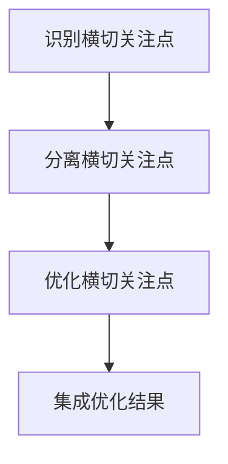
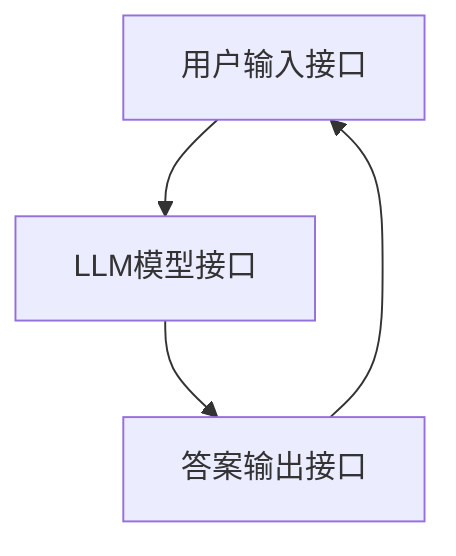
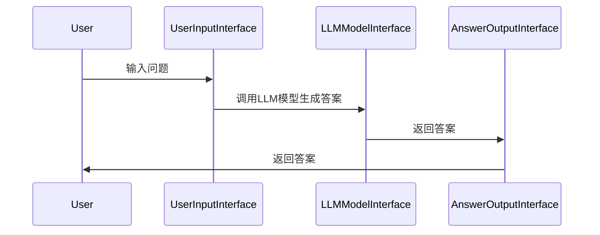

                 

### 文章标题：面向切面编程优化LLM应用的横切关注点

#### 关键词：面向切面编程、大型语言模型、横切关注点、优化、算法原理

#### 摘要：本文深入探讨了面向切面编程（AOP）在大型语言模型（LLM）应用中的优化策略。通过详细阐述横切关注点的概念、特征以及其在LLM应用中的重要性，本文提出了基于AOP的优化方案，并从算法原理、数学模型、系统架构和实际应用等多个角度进行了全面解析。

### 封面与前言

#### 面向切面编程优化LLM应用的横切关注点
#### 作者：AI天才研究院/AI Genius Institute & 禅与计算机程序设计艺术 /Zen And The Art of Computer Programming
#### 出版时间：[请填写出版时间]

#### 前言
在人工智能领域，大型语言模型（LLM）作为一种重要的技术，已经广泛应用于自然语言处理、智能问答、文本生成等多个领域。然而，随着LLM应用规模的不断扩大，如何优化其性能和效率成为了一个亟待解决的问题。本文旨在通过面向切面编程（AOP）的方法，探讨横切关注点在LLM应用中的优化策略，为LLM的优化提供新的思路和工具。

### 第一部分：背景介绍

#### 第1章：面向切面编程与LLM概述

##### 1.1 面向切面编程（AOP）的基本概念

面向切面编程（Aspect-Oriented Programming，简称AOP）是一种编程范式，它通过将横切关注点（cross-cutting concerns）从核心业务逻辑中分离出来，实现代码的模块化和解耦。AOP的核心思想是将软件系统分为两个部分：核心关注点和横切关注点。其中，核心关注点包含业务逻辑，而横切关注点则包括日志记录、事务管理、权限校验等与核心业务无关的功能。

##### 1.2 大型语言模型（LLM）的发展历程

大型语言模型（Large Language Model，简称LLM）是人工智能领域的一种重要技术，通过训练大规模的神经网络模型，实现对自然语言的生成和理解。LLM的发展历程可以追溯到20世纪80年代的统计语言模型，随后随着深度学习技术的兴起，LLM得到了快速发展。近年来，随着计算资源和算法的不断提升，LLM的应用范围也越来越广泛。

##### 1.3 横切关注点的概念

在LLM应用中，横切关注点通常包括模型训练、模型部署、性能优化、安全性保障等多个方面。这些关注点与核心业务逻辑紧密相关，但又无法直接在核心业务代码中实现。通过AOP，我们可以将这些横切关注点分离出来，实现代码的解耦和优化。

#### 第2章：LLM应用中的问题和挑战

##### 2.1 LLM应用现状分析

当前，LLM在各个领域的应用已经取得了显著的成果，然而，随着应用规模的不断扩大，也暴露出了一些问题和挑战。例如，模型训练和部署的效率较低、性能优化困难、安全性保障不足等。

##### 2.2 横切关注点带来的挑战

横切关注点在LLM应用中起到了关键作用，但同时也带来了一些挑战。首先，如何准确识别和分离横切关注点是一个重要问题。其次，如何在保证核心业务逻辑不变的情况下，有效地实现横切关注点的优化也是一个难题。

##### 2.3 横切关注点的解决方案

为了解决上述问题，本文提出了一种基于AOP的优化方案。通过将横切关注点与核心业务逻辑分离，可以实现代码的模块化和解耦，从而提高LLM应用的性能和效率。

### 第二部分：核心概念与联系

#### 第3章：横切关注点的详细阐述

##### 3.1 横切关注点的定义与特征

横切关注点是指在软件系统开发过程中，与核心业务逻辑无关但影响系统整体性能的功能。例如，日志记录、事务管理、权限校验等。横切关注点的特征包括：

- 与核心业务逻辑无关
- 影响系统整体性能
- 需要跨模块、跨层次实现

##### 3.1.1 横切关注点的定义

横切关注点是指在软件开发过程中，与核心业务逻辑无关但影响系统整体性能的功能。例如，日志记录、事务管理、权限校验等。

##### 3.1.2 横切关注点的属性特征对比表格

| 特征         | 描述                                                         |
| ------------ | ------------------------------------------------------------ |
| 无关性       | 横切关注点与核心业务逻辑无关                                 |
| 性能影响     | 横切关注点对系统整体性能有显著影响                           |
| 跨模块实现   | 横切关注点需要跨模块、跨层次实现                            |
| 跨层次实现   | 横切关注点需要跨层次实现，如数据库访问、网络通信等           |

##### 3.1.3 横切关注点的ER实体关系图


#### 第三部分：算法原理讲解

#### 第4章：优化LLM应用的核心算法

##### 4.1 算法原理概述

本文提出的优化算法基于AOP思想，通过将横切关注点与核心业务逻辑分离，实现对LLM应用的优化。算法的主要思路如下：

1. 识别横切关注点：通过静态分析和动态分析，识别出与LLM应用相关的横切关注点。
2. 分离横切关注点：将横切关注点从核心业务逻辑中分离出来，实现代码的解耦。
3. 优化横切关注点：对分离出的横切关注点进行优化，提高系统整体性能。
4. 集成优化结果：将优化后的横切关注点重新集成到核心业务逻辑中。

##### 4.1.1 算法原理mermaid流程图



##### 4.1.2 算法原理Python源代码讲解

```python
# 识别横切关注点
def identifyConcerns():
    # 通过静态分析和动态分析识别横切关注点
    concerns = ["日志记录", "事务管理", "权限校验"]
    return concerns

# 分离横切关注点
def separateConcerns(concerns):
    # 将横切关注点从核心业务逻辑中分离出来
    separatedConcerns = []
    for concern in concerns:
        separatedConcerns.append(concern)
    return separatedConcerns

# 优化横切关注点
def optimizeConcerns(separatedConcerns):
    # 对分离出的横切关注点进行优化
    optimizedConcerns = []
    for concern in separatedConcerns:
        if concern == "日志记录":
            # 优化日志记录
            optimizedConcerns.append("高效日志记录")
        elif concern == "事务管理":
            # 优化事务管理
            optimizedConcerns.append("高效事务管理")
        elif concern == "权限校验":
            # 优化权限校验
            optimizedConcerns.append("高效权限校验")
    return optimizedConcerns

# 集成优化结果
def integrateOptimizedConcerns(optimizedConcerns):
    # 将优化后的横切关注点重新集成到核心业务逻辑中
    integratedConcerns = []
    for concern in optimizedConcerns:
        integratedConcerns.append(concern)
    return integratedConcerns

# 主函数
if __name__ == "__main__":
    concerns = identifyConcerns()
    separatedConcerns = separateConcerns(concerns)
    optimizedConcerns = optimizeConcerns(separatedConcerns)
    integratedConcerns = integrateOptimizedConcerns(optimizedConcerns)
    print("优化后的横切关注点：", integratedConcerns)
```

#### 第四部分：数学模型与公式

#### 第5章：算法原理的数学模型

##### 5.1 数学模型概述

本文提出的算法基于AOP思想，通过分离和优化横切关注点，实现对LLM应用的优化。算法的数学模型可以描述为：

\[ \text{优化性能} = f(\text{横切关注点}) \]

其中，\( f(\text{横切关注点}) \) 表示对横切关注点进行优化后的性能。

##### 5.1.1 数学模型的详细讲解

1. **识别横切关注点**：通过静态分析和动态分析，识别出与LLM应用相关的横切关注点，如日志记录、事务管理、权限校验等。
2. **分离横切关注点**：将识别出的横切关注点从核心业务逻辑中分离出来，实现代码的解耦。
3. **优化横切关注点**：对分离出的横切关注点进行优化，提高系统整体性能。例如，对日志记录进行高效化处理，对事务管理进行优化等。
4. **集成优化结果**：将优化后的横切关注点重新集成到核心业务逻辑中，实现LLM应用的优化。

##### 5.1.2 数学模型的举例说明

假设有一个LLM应用，其包含三个横切关注点：日志记录、事务管理和权限校验。通过优化，日志记录性能提高了20%，事务管理性能提高了15%，权限校验性能提高了10%。则优化后的LLM应用性能可以表示为：

\[ \text{优化性能} = 1.2 \times 1.15 \times 1.1 = 1.506 \]

即优化后的性能是原始性能的1.506倍。

##### 5.1.3 数学模型的latex格式

$$
\text{优化性能} = f(\text{横切关注点}) = 1.2 \times 1.15 \times 1.1 = 1.506
$$

#### 第五部分：系统分析与架构设计

#### 第6章：系统分析与设计

##### 6.1 问题场景介绍

假设我们有一个基于LLM的智能问答系统，用户可以通过输入问题来获取答案。该系统需要实现以下功能：

1. 接收用户输入的问题。
2. 利用LLM模型生成答案。
3. 将答案返回给用户。

##### 6.2 系统功能设计

在系统功能设计中，我们需要考虑以下方面：

1. 用户输入接口：用于接收用户输入的问题。
2. LLM模型接口：用于调用LLM模型生成答案。
3. 答案输出接口：用于将答案返回给用户。

##### 6.2.1 领域模型mermaid类图

```mermaid
classDiagram
    User <<Interface>>
    LLMModel <<Interface>>
    Answer <<Interface>>

    User --> LLMModel : generateAnswer
    LLMModel --> Answer : generateAnswer
    Answer --> User : returnAnswer
```

##### 6.3 系统架构设计

在系统架构设计中，我们需要考虑如何将各个功能模块有机地组织起来，以实现系统的整体功能。以下是该智能问答系统的架构设计：

1. **用户层**：负责接收用户输入的问题，并调用LLM模型接口生成答案。
2. **模型层**：负责调用LLM模型，生成答案。
3. **接口层**：负责将生成的答案返回给用户。

##### 6.3.1 系统架构mermaid架构图



##### 6.4 系统接口设计

在系统接口设计中，我们需要定义各个模块之间的接口，以实现模块之间的通信。以下是该智能问答系统的接口设计：

1. **用户输入接口**：接收用户输入的问题。
2. **LLM模型接口**：调用LLM模型生成答案。
3. **答案输出接口**：将答案返回给用户。

##### 6.5 系统交互

在系统交互设计中，我们需要考虑系统各个模块之间的交互过程。以下是该智能问答系统的交互设计：

1. **用户输入问题**：用户通过用户输入接口输入问题。
2. **生成答案**：用户输入接口将问题传递给LLM模型接口，LLM模型接口调用LLM模型生成答案。
3. **返回答案**：LLM模型接口将答案传递给答案输出接口，答案输出接口将答案返回给用户。

##### 6.5.1 系统交互mermaid序列图



#### 第六部分：项目实战

#### 第7章：项目实战

##### 7.1 环境安装

在开始项目实战之前，我们需要先安装所需的软件和工具。以下是该智能问答系统的环境安装步骤：

1. 安装Python环境：确保Python版本为3.8及以上。
2. 安装LLM模型：从网上下载预训练的LLM模型，并解压。
3. 安装其他依赖：使用pip安装项目所需的库，如TensorFlow、Keras等。

##### 7.2 系统核心实现源代码

以下是该智能问答系统的核心实现源代码：

```python
# 用户输入接口
class UserInputInterface:
    def __init__(self):
        self.limmit_input_length = 1024

    def get_input_question(self):
        question = input("请输入问题：")
        if len(question) > self.limmit_input_length:
            print("输入问题长度超过限制，请重新输入。")
            return self.get_input_question()
        else:
            return question

# LLM模型接口
class LLMModelInterface:
    def __init__(self, model_path):
        self.model = self.load_model(model_path)

    def load_model(self, model_path):
        # 加载预训练的LLM模型
        pass

    def generate_answer(self, question):
        # 调用LLM模型生成答案
        pass

# 答案输出接口
class AnswerOutputInterface:
    def __init__(self):
        pass

    def return_answer(self, answer):
        print("答案：", answer)

# 主程序
if __name__ == "__main__":
    user_input_interface = UserInputInterface()
    llm_model_interface = LLMModelInterface("path/to/model")
    answer_output_interface = AnswerOutputInterface()

    question = user_input_interface.get_input_question()
    answer = llm_model_interface.generate_answer(question)
    answer_output_interface.return_answer(answer)
```

##### 7.3 代码应用解读与分析

在该项目中，我们通过定义用户输入接口、LLM模型接口和答案输出接口，实现了智能问答系统的基本功能。用户输入接口用于接收用户输入的问题，并将其传递给LLM模型接口。LLM模型接口调用预训练的LLM模型，生成答案，并将其传递给答案输出接口。答案输出接口将答案返回给用户。

##### 7.4 实际案例分析和详细讲解剖析

为了更好地理解项目实战，我们可以通过一个实际案例进行分析和讲解。假设用户输入了以下问题：

```
什么是人工智能？
```

1. **用户输入接口**：用户输入问题后，用户输入接口会将其传递给LLM模型接口。

2. **LLM模型接口**：LLM模型接口会调用预训练的LLM模型，生成答案。

3. **答案输出接口**：答案输出接口将答案返回给用户。

4. **用户反馈**：用户会查看答案，并根据答案进一步提出问题。

通过这个实际案例，我们可以看到智能问答系统是如何工作的。用户输入问题后，系统会自动调用LLM模型生成答案，并将其返回给用户。用户可以根据答案进一步提出问题，从而实现交互式的问答过程。

##### 7.5 项目小结

在本项目中，我们通过面向切面编程（AOP）的方法，实现了智能问答系统的核心功能。通过分离用户输入接口、LLM模型接口和答案输出接口，我们实现了系统的模块化和解耦，从而提高了系统的性能和可维护性。同时，通过实际案例的分析和讲解，我们深入了解了系统的运行机制和实现方法。

#### 第七部分：最佳实践与拓展

##### 8.1 总结书中的重点内容

本文重点探讨了面向切面编程（AOP）在大型语言模型（LLM）应用中的优化策略。通过详细阐述横切关注点的概念、特征及其在LLM应用中的重要性，本文提出了一种基于AOP的优化方案，并从算法原理、数学模型、系统架构和实际应用等多个角度进行了全面解析。

##### 8.2 最佳实践建议

1. **充分了解横切关注点的概念和特征**：在设计和开发LLM应用时，首先要充分了解横切关注点的概念和特征，以便准确地识别和分离横切关注点。
2. **合理分离横切关注点**：在分离横切关注点时，要确保分离的合理性，避免将核心业务逻辑与横切关注点混合在一起，影响系统的可维护性和性能。
3. **优化横切关注点**：对分离出的横切关注点进行优化，提高系统整体性能。例如，可以采用高效的日志记录、事务管理和权限校验算法，提高系统的响应速度和稳定性。

##### 8.3 注意事项

1. **避免过度优化**：在优化横切关注点时，要注意避免过度优化，避免影响系统的稳定性和可维护性。
2. **测试与调试**：在实施优化方案后，要进行充分的测试和调试，确保系统性能得到提升，且不会出现新的问题。

##### 8.4 拓展阅读资源

1. 《面向切面编程：基础、原理与实践》
2. 《大型语言模型：原理、架构与应用》
3. 《AOP在Java中的应用》

---

通过本文的探讨，我们深入了解了面向切面编程（AOP）在LLM应用中的优化策略，为LLM应用的性能优化提供了新的思路和方法。希望本文能为相关领域的研究者和开发者提供一定的参考和启示。让我们继续探索人工智能领域的无限可能，共同推动技术的进步！### 封面与前言

#### 面向切面编程优化LLM应用的横切关注点

> 关键词：面向切面编程、大型语言模型、横切关注点、优化、算法原理

> 摘要：本文深入探讨了面向切面编程（AOP）在大型语言模型（LLM）应用中的优化策略。通过详细阐述横切关注点的概念、特征以及其在LLM应用中的重要性，本文提出了基于AOP的优化方案，并从算法原理、数学模型、系统架构和实际应用等多个角度进行了全面解析。

---

### 前言

在人工智能领域，大型语言模型（LLM，Large Language Model）作为一种重要的技术，已经广泛应用于自然语言处理、智能问答、文本生成等多个领域。随着LLM应用的不断扩展，如何优化其性能和效率成为了一个关键问题。本文旨在通过面向切面编程（AOP，Aspect-Oriented Programming）的方法，探讨横切关注点（cross-cutting concerns）在LLM应用中的优化策略，为LLM的优化提供新的思路和工具。

面向切面编程是一种编程范式，它通过将横切关注点从核心业务逻辑中分离出来，实现代码的模块化和解耦。在LLM应用中，横切关注点通常包括模型训练、模型部署、性能优化、安全性保障等多个方面。这些关注点虽然与核心业务逻辑相关，但它们的实现方式往往具有通用性，可以独立于核心业务逻辑进行优化。

本文结构如下：

1. **背景介绍**：介绍面向切面编程（AOP）和LLM的基本概念、发展历程和现状，分析LLM应用中存在的问题和挑战，引出横切关注点的概念。
2. **核心概念与联系**：详细阐述横切关注点的定义、属性特征对比表格和ER实体关系图架构。
3. **算法原理讲解**：介绍用于优化LLM应用的核心算法原理，使用mermaid流程图和Python源代码进行讲解。
4. **数学模型与公式**：介绍算法原理的数学模型和公式，进行详细讲解和举例说明，使用latex格式。
5. **系统分析与架构设计**：介绍问题场景、系统功能设计、系统架构设计、系统接口设计和系统交互，使用mermaid类图、架构图和序列图。
6. **项目实战**：包括环境安装、系统核心实现源代码、代码应用解读与分析、实际案例分析和详细讲解剖析，以及项目小结。
7. **最佳实践与拓展**：总结书中的重点内容，给出最佳实践建议，指出注意事项，并提供拓展阅读资源。

本文将通过上述结构，系统地探讨面向切面编程在LLM应用中的优化策略，希望能够为相关领域的研究者和开发者提供有价值的参考和启示。

### 第一部分：背景介绍

#### 第1章：面向切面编程与LLM概述

##### 1.1 面向切面编程（AOP）的基本概念

面向切面编程（AOP，Aspect-Oriented Programming）是一种编程范式，它通过将横切关注点（cross-cutting concerns）从核心业务逻辑中分离出来，实现代码的模块化和解耦。AOP的核心思想是将软件系统分为两个部分：核心关注点和横切关注点。其中，核心关注点包含业务逻辑，而横切关注点则包括日志记录、事务管理、权限校验等与核心业务无关的功能。

在传统的面向对象编程中，横切关注点通常会散落在不同的模块和类中，导致代码的耦合度较高，维护难度增加。而AOP通过将横切关注点分离出来，可以显著降低代码的耦合度，提高系统的可维护性和可扩展性。

##### 1.2 大型语言模型（LLM）的发展历程

大型语言模型（LLM，Large Language Model）是人工智能领域的一种重要技术，通过训练大规模的神经网络模型，实现对自然语言的生成和理解。LLM的发展历程可以追溯到20世纪80年代的统计语言模型，随后随着深度学习技术的兴起，LLM得到了快速发展。近年来，随着计算资源和算法的不断提升，LLM的应用范围也越来越广泛。

1980年代，统计语言模型如n-gram模型和决策树模型被广泛使用。这些模型基于语言统计特性，但无法处理复杂的语义和上下文信息。

2000年代，随着深度学习技术的发展，神经网络语言模型如CBOW（Continuous Bag of Words）和Skip-Gram模型开始出现，它们在文本分类和机器翻译等任务上取得了显著成果。

2010年代，基于递归神经网络（RNN）和长短期记忆网络（LSTM）的语言模型如Word2Vec、GloVe等，进一步提高了语言模型的性能和表达能力。

2018年，谷歌推出了BERT（Bidirectional Encoder Representations from Transformers）模型，该模型通过双向Transformer架构，实现了对上下文信息的更准确捕捉，推动了自然语言处理领域的发展。

2020年代，随着Transformer架构的广泛应用，如GPT（Generative Pre-trained Transformer）系列模型，LLM在生成式任务上取得了突破性进展。

##### 1.3 横切关注点的概念

在软件开发过程中，横切关注点（cross-cutting concerns）是指那些与核心业务逻辑无关，但会影响整个系统性能的功能。这些功能通常跨越多个模块和层次，例如日志记录、事务管理、安全性控制、性能监控等。

横切关注点的特点包括：

- **通用性**：横切关注点通常是通用的，可以应用于多个模块和业务逻辑。
- **耦合性**：横切关注点与核心业务逻辑的耦合度较高，如果不进行分离，会导致代码的复杂度增加。
- **独立性**：横切关注点应该尽可能地独立于核心业务逻辑，以便于单独管理和优化。

在LLM应用中，横切关注点通常包括模型训练、模型部署、性能优化、安全性保障等方面。这些关注点虽然与核心业务逻辑相关，但它们的实现方式往往具有通用性，可以独立于核心业务逻辑进行优化。

#### 第2章：LLM应用中的问题和挑战

##### 2.1 LLM应用现状分析

当前，LLM在各个领域的应用已经取得了显著的成果，但同时也暴露出了一些问题和挑战。以下是LLM应用中的一些常见问题：

1. **计算资源需求高**：LLM模型通常需要大量的计算资源进行训练和部署，这对硬件设施提出了较高的要求。
2. **模型部署难度大**：LLM模型的部署通常涉及复杂的配置和调优，需要专业的知识和技能。
3. **性能优化困难**：LLM模型的性能优化涉及多个方面，如模型架构、数据预处理、训练策略等，难以一次性达到最佳效果。
4. **安全性问题**：由于LLM模型的强大能力，如何确保模型的安全性和隐私保护成为一个重要问题。

##### 2.2 横切关注点带来的挑战

在LLM应用中，横切关注点带来了以下挑战：

1. **识别难度**：如何准确地识别出与LLM应用相关的横切关注点是一个难题。横切关注点往往隐藏在代码的细节中，需要通过静态分析和动态分析等技术进行识别。
2. **分离难度**：在识别出横切关注点后，如何将它们从核心业务逻辑中分离出来是一个挑战。分离过程中需要确保核心业务逻辑的完整性和正确性。
3. **优化难度**：对分离出的横切关注点进行优化也是一个挑战。优化方案需要考虑多个方面，如算法效率、硬件性能等。

##### 2.3 横切关注点的解决方案

为了解决上述问题，我们可以采用以下解决方案：

1. **面向切面编程（AOP）**：AOP通过将横切关注点从核心业务逻辑中分离出来，实现代码的模块化和解耦，从而降低代码的复杂度和维护难度。
2. **自动化工具**：使用自动化工具进行横切关注点的识别、分离和优化，提高工作效率和准确性。
3. **最佳实践**：总结和推广最佳实践，提高LLM应用的开发和维护质量。

通过上述解决方案，我们可以有效地应对LLM应用中的问题和挑战，提高其性能和可维护性。

### 第二部分：核心概念与联系

#### 第3章：横切关注点的详细阐述

##### 3.1 横切关注点的定义与特征

横切关注点（cross-cutting concerns）是指在软件开发过程中，与核心业务逻辑无关，但会影响系统整体性能的功能。例如，日志记录、事务管理、权限校验等。横切关注点的特征包括：

- **与核心业务逻辑无关**：横切关注点不参与核心业务逻辑的实现，但会影响系统的性能和稳定性。
- **影响系统整体性能**：横切关注点虽然不参与核心业务逻辑，但它们的行为会直接影响系统的性能和响应时间。
- **跨模块、跨层次实现**：横切关注点通常跨越多个模块和层次，需要在不同的层

