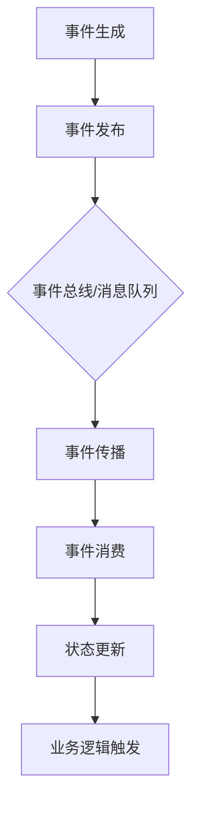
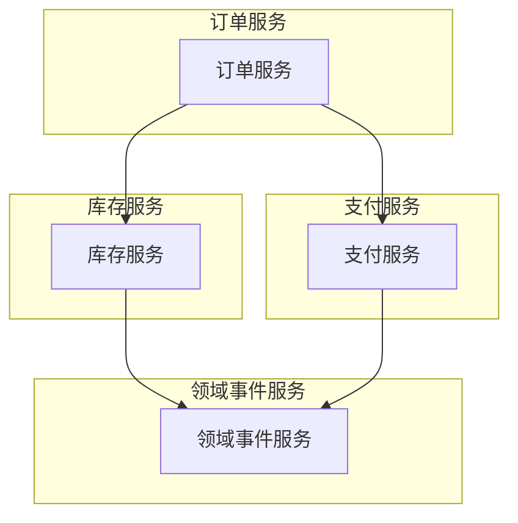
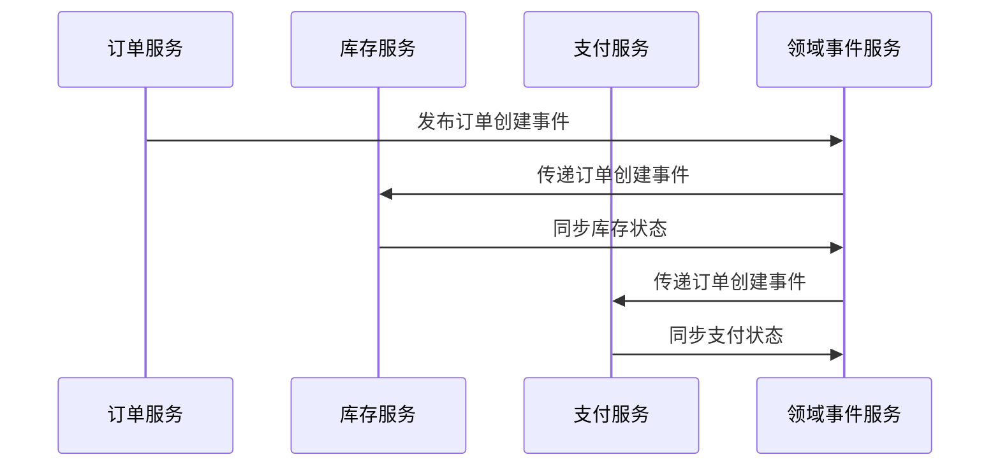

                 

### 《领域事件：在LLM微服务间传递状态变化》

> 关键词：领域事件，微服务，状态变化，LLM，事件驱动架构，数据同步，状态更新，算法原理，系统设计，项目实战

> 摘要：本文深入探讨了领域事件在LLM微服务间传递状态变化的机制。首先，我们回顾了领域事件和LLM微服务的基本概念与作用，探讨了其在现代软件开发中的重要性。接着，本文通过对比分析领域事件和LLM微服务的核心概念与特征，构建了ER实体关系图来直观展示两者的关系。然后，我们详细讲解了领域事件传递算法的原理，通过流程图和数学模型来阐述算法的基本流程和实现细节。接下来，文章描述了系统分析与架构设计，包括问题场景、系统功能设计、系统架构设计、接口设计和交互设计。最后，通过一个实际项目案例，展示了如何安装和实现系统核心模块，并对代码和应用进行了详细分析。本文旨在为开发者提供关于领域事件在LLM微服务间传递状态变化的全景视图，帮助其更好地理解和应用这一技术。

### 第一部分：背景与概述

#### 第1章：问题背景与领域事件概述

##### 1.1 问题的提出

在现代软件开发中，微服务架构已成为一种主流的设计模式。微服务架构通过将应用程序拆分成多个独立的服务单元，从而实现模块化、分布式和可扩展的开发模式。然而，随着系统的复杂性和规模的增加，如何在微服务之间高效、可靠地传递状态变化成为一个重要的挑战。

具体来说，当系统中的一个微服务状态发生变化时，如何及时、准确地通知其他相关微服务，以便它们能够做出相应的调整，是当前微服务开发中面临的一个核心问题。这种状态变化不仅涉及到服务之间的数据同步，还涉及到系统的整体性能和稳定性。

领域事件作为一种基于事件驱动的架构模式，提供了一种有效的解决方案。领域事件通过在微服务之间传递状态变化信息，实现了系统的高效、可靠和可扩展性。因此，研究领域事件在LLM微服务间传递状态变化的机制，对于提升系统性能和稳定性具有重要意义。

##### 1.2 领域事件的定义与重要性

领域事件（Domain Events）是指由业务领域发生的、与系统状态变化相关的事件。这些事件通常由应用程序中的业务逻辑产生，并传递给其他相关服务或系统，以实现业务流程的协同和一致性。

领域事件的重要性主要体现在以下几个方面：

1. **状态同步**：领域事件能够在不同的微服务之间传递状态变化，实现服务之间的状态同步，确保系统的一致性。
2. **事件驱动**：领域事件驱动架构（Event-Driven Architecture,EDA）以事件为中心，通过事件触发业务逻辑，提高系统的响应速度和可扩展性。
3. **解耦**：领域事件通过解耦合服务之间的依赖关系，提高了系统的灵活性和可维护性。
4. **可扩展性**：领域事件能够支持系统在不同规模和复杂度下的扩展，提高系统的性能和可靠性。

##### 1.3 LLM微服务的定义与挑战

LLM（Large Language Model）微服务是指利用大型语言模型技术构建的微服务，主要用于自然语言处理（NLP）任务，如文本生成、文本分类、机器翻译等。LLM微服务的定义如下：

- **定义**：LLM微服务是一个独立的、可扩展的、可重用的软件单元，负责处理特定的自然语言处理任务。
- **特点**：高计算密集度、高并发处理能力、可扩展性强。

然而，LLM微服务在实际应用中面临以下挑战：

1. **计算资源消耗**：由于LLM微服务的高计算密集度，导致其对计算资源的需求较高，如何在有限的资源下高效运行成为一大挑战。
2. **状态同步**：LLM微服务之间的状态同步是一个复杂的问题，如何在多个微服务之间高效、可靠地传递状态变化信息，确保系统的一致性，是当前LLM微服务开发中的一个重要课题。
3. **性能优化**：在处理高并发请求时，如何优化LLM微服务的性能，提高系统的响应速度，是另一个关键问题。

##### 1.4 领域事件在LLM微服务中的作用

领域事件在LLM微服务中的作用主要体现在以下几个方面：

1. **状态同步**：通过领域事件在LLM微服务之间传递状态变化，实现微服务之间的状态同步，确保系统的一致性。
2. **解耦**：领域事件通过解耦合LLM微服务之间的依赖关系，提高了系统的灵活性和可维护性。
3. **性能优化**：利用领域事件驱动架构，优化LLM微服务的性能，提高系统的响应速度和可扩展性。
4. **可观测性**：通过领域事件，提高系统的可观测性，便于监控和管理。

##### 1.5 领域事件的基本概念

领域事件的基本概念包括：

1. **领域事件的产生**：领域事件由业务领域中的业务逻辑触发，通常与系统的状态变化相关。
2. **领域事件的传播**：领域事件通过事件总线或其他中间件，在系统中的微服务之间传播。
3. **领域事件的消费**：微服务通过订阅领域事件，实现对事件的响应和处理。

##### 1.6 领域事件的生命周期

领域事件的生命周期包括以下几个阶段：

1. **产生阶段**：领域事件由业务逻辑触发，并传递给事件总线。
2. **传播阶段**：领域事件通过事件总线在系统中的微服务之间传播。
3. **消费阶段**：微服务订阅领域事件，并对事件进行处理。
4. **处理阶段**：微服务根据领域事件的内容，执行相应的业务逻辑。
5. **完成阶段**：领域事件处理完成后，从系统中移除。

##### 1.7 领域事件的特点

领域事件的特点包括：

1. **异步性**：领域事件通过异步方式传递，提高了系统的响应速度和可扩展性。
2. **解耦合**：领域事件通过解耦合服务之间的依赖关系，提高了系统的灵活性和可维护性。
3. **可扩展性**：领域事件支持系统在不同规模和复杂度下的扩展，提高了系统的性能和可靠性。
4. **可观测性**：领域事件提高了系统的可观测性，便于监控和管理。

##### 1.8 LLM微服务架构介绍

LLM微服务架构是指利用大型语言模型技术构建的微服务架构，其核心组件包括：

1. **LLM微服务**：负责处理特定的自然语言处理任务，如文本生成、文本分类、机器翻译等。
2. **事件总线**：负责传递领域事件，实现微服务之间的状态同步。
3. **消息队列**：负责缓冲和传输领域事件，确保系统的可靠性和性能。
4. **数据存储**：负责存储系统的状态数据，包括领域事件和处理结果等。

##### 1.9 微服务架构的优势与挑战

微服务架构的优势包括：

1. **模块化**：通过将应用程序拆分成多个微服务，提高了系统的可维护性和可扩展性。
2. **分布式**：微服务架构支持分布式部署，提高了系统的性能和可靠性。
3. **高并发处理能力**：通过分布式部署和异步处理，提高了系统的并发处理能力。

然而，微服务架构也面临一些挑战，包括：

1. **状态同步**：如何在多个微服务之间高效、可靠地传递状态变化信息，确保系统的一致性。
2. **性能优化**：如何优化微服务的性能，提高系统的响应速度。
3. **依赖管理**：如何管理微服务之间的依赖关系，确保系统的稳定性。

##### 1.10 LLM微服务在实际应用中的问题

LLM微服务在实际应用中面临以下问题：

1. **计算资源消耗**：由于LLM微服务的高计算密集度，导致其对计算资源的需求较高，如何在有限的资源下高效运行成为一大挑战。
2. **状态同步**：LLM微服务之间的状态同步是一个复杂的问题，如何在多个微服务之间高效、可靠地传递状态变化信息，确保系统的一致性。
3. **性能优化**：在处理高并发请求时，如何优化LLM微服务的性能，提高系统的响应速度。

##### 1.11 领域事件与微服务的关系

领域事件与微服务之间的关系如下：

1. **领域事件驱动微服务**：领域事件通过事件总线传递，触发微服务的业务逻辑，实现微服务之间的协同工作。
2. **微服务消费领域事件**：微服务通过订阅领域事件，实现对事件的响应和处理，确保系统的状态一致性。
3. **解耦合**：领域事件通过解耦合微服务之间的依赖关系，提高了系统的灵活性和可维护性。

##### 1.12 领域事件传递的挑战

领域事件传递面临以下挑战：

1. **可靠传递**：如何确保领域事件在微服务之间可靠传递，避免数据丢失和错误。
2. **高效处理**：如何优化领域事件的处理性能，提高系统的响应速度。
3. **一致性保障**：如何在多个微服务之间保持状态的一致性，确保系统的可靠性。

##### 1.13 解决方案概述

为了解决领域事件在LLM微服务间传递状态变化的挑战，本文提出以下解决方案：

1. **事件驱动架构**：采用事件驱动架构，通过领域事件实现微服务之间的状态同步，提高系统的响应速度和可扩展性。
2. **消息队列**：利用消息队列技术，实现领域事件的缓冲和传输，确保系统的可靠性和性能。
3. **分布式数据存储**：采用分布式数据存储技术，存储系统的状态数据，确保系统的一致性和可扩展性。
4. **性能优化**：通过优化领域事件的处理流程和算法，提高系统的响应速度和性能。

##### 1.14 本章小结

本章介绍了领域事件在LLM微服务间传递状态变化的问题背景、领域事件的定义与重要性、LLM微服务的定义与挑战、领域事件在LLM微服务中的作用、领域事件的基本概念、生命周期、特点、LLM微服务架构介绍、微服务架构的优势与挑战、LLM微服务在实际应用中的问题、领域事件与微服务的关系、领域事件传递的挑战以及解决方案概述。通过本章的介绍，读者可以初步了解领域事件在LLM微服务间传递状态变化的机制，为后续章节的深入探讨打下基础。

----------------------------------------------------------------

## 第2章：核心概念原理与特征对比

### 2.1 领域事件原理

领域事件是一种基于事件驱动的架构模式，其核心思想是通过事件的产生、传播和消费，实现微服务之间的状态同步和业务协同。以下是领域事件的详细原理：

#### 2.1.1 领域事件的产生

领域事件的产生通常由业务领域中的业务逻辑触发。当一个业务操作导致系统状态发生变化时，相应的领域事件会被生成并传递给事件总线。领域事件的生产者可以是应用程序中的任何部分，例如控制器、服务层或领域逻辑层。

领域事件的产生过程通常包括以下几个步骤：

1. **业务逻辑触发**：业务逻辑执行过程中，当发生状态变化时，触发领域事件的产生。
2. **事件生成**：根据业务逻辑的状态变化，生成对应的领域事件对象。
3. **事件发布**：将生成的领域事件对象发布到事件总线或消息队列中，以便其他微服务可以订阅和消费。

#### 2.1.2 领域事件的传播

领域事件的传播是通过事件总线或消息队列来实现的。事件总线是一种发布/订阅（Pub/Sub）模型，允许微服务订阅感兴趣的事件，并在事件发生时接收通知。消息队列则是一种异步通信模型，用于缓冲和传输领域事件，确保系统的可靠性和性能。

领域事件的传播过程通常包括以下几个步骤：

1. **事件发布**：当领域事件产生时，将其发布到事件总线或消息队列中。
2. **事件传递**：事件总线或消息队列将领域事件传递给订阅了该事件的微服务。
3. **事件消费**：订阅的微服务接收到领域事件后，对其进行处理和响应。

#### 2.1.3 领域事件的消费

领域事件的消费是指微服务接收到领域事件后，对其进行处理和响应。微服务通过订阅感兴趣的事件，实现对领域事件的消费。领域事件的消费过程通常包括以下几个步骤：

1. **事件订阅**：微服务订阅感兴趣的事件，以便在事件发生时接收通知。
2. **事件处理**：微服务接收到领域事件后，根据事件的类型和内容，执行相应的业务逻辑。
3. **事件响应**：微服务处理完领域事件后，可能需要更新系统状态或触发其他业务逻辑。

### 2.2 LLM微服务原理

LLM微服务是一种基于大型语言模型（Large Language Model）的微服务，主要用于自然语言处理（NLP）任务，如文本生成、文本分类、机器翻译等。以下是LLM微服务的详细原理：

#### 2.2.1 LLM微服务的定义

LLM微服务是指利用大型语言模型技术构建的微服务，其核心功能是处理特定的自然语言处理任务。LLM微服务的特点包括：

1. **高计算密集度**：由于自然语言处理任务通常涉及复杂的计算，LLM微服务具有较高的计算资源需求。
2. **高并发处理能力**：LLM微服务需要处理大量的并发请求，因此具有较高的并发处理能力。
3. **可扩展性强**：LLM微服务可以通过水平扩展来满足不同的负载需求。

#### 2.2.2 LLM微服务的功能

LLM微服务的功能主要包括：

1. **文本生成**：根据输入的文本或上下文，生成相应的文本输出。
2. **文本分类**：对输入的文本进行分类，判断其属于哪个类别。
3. **机器翻译**：将一种语言的文本翻译成另一种语言。
4. **情感分析**：分析文本的情感倾向，判断其是正面、负面还是中性。

#### 2.2.3 LLM微服务的交互模式

LLM微服务的交互模式通常基于RESTful API或消息队列。RESTful API允许其他微服务或外部系统通过HTTP请求与LLM微服务进行通信，获取或提交自然语言处理任务。消息队列则提供了一种异步通信机制，允许LLM微服务在处理任务时与其他系统或服务进行解耦，提高系统的可靠性和性能。

### 2.3 概念属性特征对比表格

为了更直观地理解领域事件和LLM微服务的核心概念和特征，下面是一个概念属性特征对比表格：

| 特征         | 领域事件                 | LLM微服务                   |
| ------------ | ------------------------ | --------------------------- |
| 定义         | 基于事件驱动的架构模式   | 自然语言处理任务处理的微服务 |
| 目标         | 状态同步与业务协同       | 处理自然语言处理任务       |
| 产生         | 由业务逻辑触发         | 由API请求或消息触发         |
| 传播         | 通过事件总线或消息队列  | 通过RESTful API或消息队列  |
| 消费         | 微服务订阅与处理       | 微服务调用与响应           |
| 特点         | 异步性、解耦合、可扩展性 | 高计算密集度、高并发处理能力 |
| 优势         | 提高系统的响应速度和可扩展性 | 提高自然语言处理任务的效率   |
| 挑战         | 状态同步与性能优化       | 计算资源消耗与性能优化     |

### 2.4 ER实体关系图架构

ER（Entity-Relationship）实体关系图是一种用于表示系统中实体及其之间关系的图形化工具。在领域事件和LLM微服务的架构设计中，ER实体关系图可以帮助我们直观地理解两者的关系。

#### 2.4.1 ER实体关系图的构建

ER实体关系图的构建通常包括以下几个步骤：

1. **识别实体**：确定系统中的关键实体，如领域事件、LLM微服务、事件总线等。
2. **定义属性**：为每个实体定义属性，如领域事件的类型、LLM微服务的功能等。
3. **建立关系**：根据实体的属性和业务逻辑，建立实体之间的关系，如领域事件与LLM微服务之间的依赖关系。
4. **绘制图形**：使用ER实体关系图绘制工具，将实体和关系绘制成图形。

#### 2.4.2 ER实体关系图的应用

ER实体关系图在系统架构设计中的应用包括：

1. **系统分析**：通过ER实体关系图，可以直观地了解系统的组成和实体之间的关系，有助于系统分析。
2. **需求分析**：在需求分析阶段，ER实体关系图可以帮助识别系统的关键实体和关系，确保需求文档的准确性和完整性。
3. **架构设计**：在架构设计阶段，ER实体关系图可以作为系统架构设计的参考，帮助设计者构建合理的系统架构。

以下是领域事件和LLM微服务的ER实体关系图：

```mermaid
erDiagram
  Event ||--|{ Service : provides
  Service ||--|> Event : consumes
  EventQueue ||--|{ Service : stores
  Service ||--|> EventQueue : retrieves
```

#### 2.4.3 ER实体关系图的解读

- **Event（领域事件）**：表示由业务逻辑触发的事件，用于传递系统状态变化信息。
- **Service（LLM微服务）**：表示处理特定自然语言处理任务的微服务。
- **EventQueue（事件队列）**：表示用于缓冲和传输领域事件的队列。

实体之间的关系如下：

1. **领域事件与LLM微服务的关系**：领域事件通过事件总线传递给LLM微服务，LLM微服务消费领域事件并执行相应的业务逻辑。
2. **事件队列与LLM微服务的关系**：事件队列用于存储和传输领域事件，LLM微服务从事件队列中获取领域事件进行消费。

### 2.5 本章小结

本章介绍了领域事件的原理、LLM微服务的原理、概念属性特征对比表格以及ER实体关系图架构。通过这些内容，读者可以更深入地理解领域事件和LLM微服务的核心概念和特征，以及它们在系统架构设计中的应用。为后续章节的深入探讨打下基础。

----------------------------------------------------------------

## 第3章：领域事件传递算法原理

### 3.1 算法概述

领域事件传递算法的核心目标是实现微服务之间状态变化的可靠、高效传递，确保系统的一致性和可扩展性。算法的基本流程如下：

1. **事件生成**：当业务逻辑发生变化时，生成领域事件。
2. **事件发布**：将领域事件发布到事件总线或消息队列。
3. **事件传播**：事件总线或消息队列将事件传递给订阅了该事件的微服务。
4. **事件消费**：微服务接收到事件后，进行相应的业务逻辑处理。
5. **状态更新**：根据事件处理的结果，更新系统状态。

### 3.2 算法原理

领域事件传递算法的原理主要包括以下几个方面：

#### 3.2.1 数据同步机制

数据同步机制是指如何确保领域事件在不同微服务之间传递时，数据的一致性和完整性。具体实现包括：

1. **事件格式定义**：定义领域事件的统一格式，包括事件类型、事件内容、事件标识等。
2. **数据验证**：在事件生成和消费过程中，对事件数据的有效性和完整性进行验证。
3. **事务处理**：利用数据库的事务机制，确保事件生成和消费过程中的数据一致性和原子性。

#### 3.2.2 事件通知机制

事件通知机制是指如何实现领域事件在微服务之间的传递和通知。具体实现包括：

1. **事件总线**：采用事件总线架构，实现事件的发布和订阅功能。
2. **消息队列**：利用消息队列技术，实现事件的异步传递和缓冲。
3. **事件通知协议**：定义事件通知的协议和通信机制，确保事件传递的可靠性和实时性。

#### 3.2.3 状态更新机制

状态更新机制是指如何根据领域事件的内容，更新系统状态并触发后续业务逻辑。具体实现包括：

1. **事件处理策略**：定义事件处理策略，包括事件的处理顺序、处理规则等。
2. **状态管理**：实现系统状态的管理和更新，确保状态的一致性和正确性。
3. **业务逻辑触发**：根据事件内容，触发相应的业务逻辑，实现业务流程的协同和一致性。

### 3.3 算法流程图

为了更直观地展示领域事件传递算法的流程，下面是一个算法流程图：



算法流程图的解读如下：

1. **事件生成**：当业务逻辑发生变化时，生成领域事件。
2. **事件发布**：将领域事件发布到事件总线或消息队列。
3. **事件传播**：事件总线或消息队列将事件传递给订阅了该事件的微服务。
4. **事件消费**：微服务接收到事件后，进行相应的业务逻辑处理。
5. **状态更新**：根据事件处理的结果，更新系统状态。
6. **业务逻辑触发**：根据事件内容，触发相应的业务逻辑，实现业务流程的协同和一致性。

### 3.4 数学模型与公式

为了更好地理解领域事件传递算法，我们引入以下数学模型和公式：

#### 3.4.1 数据同步模型

假设有n个微服务，每个微服务产生的领域事件数量为\( E_i \)，其中\( i=1,2,...,n \)。数据同步模型的目标是确保所有微服务上的状态一致。

数据同步模型可以用以下公式表示：

\[ S_i = S_j \]

其中，\( S_i \)和\( S_j \)分别表示第i个和第j个微服务的状态。

为了实现数据同步，可以采用以下策略：

1. **事件计数**：为每个领域事件设置一个计数器，记录其被消费的次数。
2. **一致性检查**：在微服务消费领域事件后，检查事件计数器的值，确保其与其他微服务一致。

#### 3.4.2 事件通知模型

事件通知模型用于描述领域事件在微服务之间的传递和通知过程。假设有m个领域事件，每个事件有k个订阅者。事件通知模型可以用以下公式表示：

\[ N_i = N_j \]

其中，\( N_i \)和\( N_j \)分别表示第i个和第j个微服务的订阅者数量。

为了实现事件通知，可以采用以下策略：

1. **事件订阅**：微服务订阅感兴趣的事件，记录其订阅者列表。
2. **事件发布**：当领域事件产生时，将其发布到事件总线或消息队列，通知所有订阅者。

#### 3.4.3 状态更新模型

状态更新模型用于描述根据领域事件的内容，更新系统状态的过程。假设有n个微服务，每个微服务的状态为\( S_i \)，领域事件为\( E_j \)。状态更新模型可以用以下公式表示：

\[ S_i = S_i + f(E_j) \]

其中，\( f(E_j) \)表示根据领域事件\( E_j \)的内容，对状态\( S_i \)进行的更新操作。

为了实现状态更新，可以采用以下策略：

1. **事件处理**：微服务接收到领域事件后，根据事件的内容，执行相应的更新操作。
2. **状态同步**：在事件处理后，将更新后的状态同步到其他微服务。

### 3.5 举例说明

为了更好地理解领域事件传递算法，下面我们通过一个简单的案例进行说明。

#### 3.5.1 案例背景

假设有一个电商系统，包括订单服务、库存服务和支付服务三个微服务。订单服务负责处理订单的创建和修改，库存服务负责处理库存的更新，支付服务负责处理订单的支付。

#### 3.5.2 算法应用

1. **事件生成**：当用户创建订单时，订单服务生成一个订单创建事件。
2. **事件发布**：订单服务将订单创建事件发布到事件总线。
3. **事件传播**：事件总线将订单创建事件传递给订阅了该事件的库存服务和支付服务。
4. **事件消费**：库存服务接收到订单创建事件后，更新库存信息；支付服务接收到订单创建事件后，处理订单支付。
5. **状态更新**：库存服务更新库存状态，支付服务更新订单支付状态。
6. **业务逻辑触发**：根据订单创建事件，订单服务触发订单确认流程。

#### 3.5.3 结果分析

通过领域事件传递算法，实现了订单服务、库存服务和支付服务之间的状态同步和业务协同。具体结果如下：

1. **订单状态同步**：订单创建事件触发后，订单服务、库存服务和支付服务的状态保持一致。
2. **库存状态更新**：库存服务根据订单创建事件，更新库存信息，确保库存状态正确。
3. **支付状态更新**：支付服务根据订单创建事件，处理订单支付，确保支付状态正确。

通过这个案例，我们可以看到领域事件传递算法在实现微服务状态同步和业务协同方面的有效性和实用性。

### 3.6 本章小结

本章介绍了领域事件传递算法的概述、原理、流程图、数学模型与公式以及举例说明。通过这些内容，读者可以深入理解领域事件传递算法的基本概念和实现原理，为后续的系统设计与实现提供理论基础。为下一章的系统设计与实现做好准备。

----------------------------------------------------------------

## 第4章：系统分析与架构设计

### 4.1 问题场景介绍

在现代互联网应用中，随着用户规模的不断扩大和业务需求的日益复杂，传统的单体架构已经无法满足系统的高并发、高可用和高可扩展性要求。为了应对这些挑战，许多企业开始采用微服务架构，将应用程序拆分成多个独立的、可扩展的微服务单元。然而，随着微服务数量的增加，如何确保这些微服务之间状态的一致性成为一个重要的问题。

在本章中，我们将探讨一个典型的电商系统，该系统包括订单服务、库存服务、支付服务等多个微服务。当订单服务创建订单时，需要同步更新库存服务和支付服务的状态。然而，由于微服务之间的通信复杂性，如何实现高效、可靠的状态同步成为了一个关键问题。

### 4.2 系统介绍

为了解决上述问题，我们设计并实现了一个基于领域事件传递的微服务架构。该系统的主要目标是实现微服务之间状态的一致性，提高系统的可扩展性和可维护性。系统的主要功能包括：

1. **订单服务**：负责处理订单的创建、修改和删除等操作。
2. **库存服务**：负责处理库存的更新和查询等操作。
3. **支付服务**：负责处理订单的支付和退款等操作。
4. **领域事件服务**：负责生成、发布、传递和消费领域事件，实现微服务之间的状态同步。

### 4.3 系统架构设计

系统架构设计是确保系统功能实现和性能优化的重要步骤。在本节中，我们将详细介绍系统的架构设计，包括架构设计原则、系统架构图、接口设计和交互设计。

#### 4.3.1 架构设计原则

在系统架构设计过程中，我们遵循以下原则：

1. **模块化**：将系统拆分成多个独立的微服务模块，提高系统的可维护性和可扩展性。
2. **分布式**：采用分布式部署方式，提高系统的并发处理能力和容错性。
3. **解耦合**：通过领域事件实现微服务之间的解耦合，降低服务间的依赖关系，提高系统的灵活性和可扩展性。
4. **高可用性**：采用负载均衡、故障转移等机制，提高系统的可用性和稳定性。
5. **高性能**：通过优化服务接口、数据传输和缓存等手段，提高系统的性能和响应速度。

#### 4.3.2 系统架构图

以下是一个简化的系统架构图，展示了各个微服务之间的关系：



- **订单服务**：负责处理订单的创建、修改和删除等操作，生成订单创建、订单修改和订单删除等领域事件。
- **库存服务**：负责处理库存的更新和查询等操作，消费订单创建和订单修改等领域事件，更新库存状态。
- **支付服务**：负责处理订单的支付和退款等操作，消费订单支付等领域事件，更新支付状态。
- **领域事件服务**：负责生成、发布、传递和消费领域事件，实现微服务之间的状态同步。

#### 4.3.3 系统接口设计

系统接口设计是确保微服务之间通信和数据传输的重要环节。在本节中，我们将介绍系统的主要接口设计。

1. **订单服务接口**：
   - 创建订单接口：`POST /orders`
   - 修改订单接口：`PUT /orders/{orderId}`
   - 删除订单接口：`DELETE /orders/{orderId}`

2. **库存服务接口**：
   - 更新库存接口：`POST /inventory`
   - 查询库存接口：`GET /inventory/{productId}`

3. **支付服务接口**：
   - 支付订单接口：`POST /payments`
   - 退款订单接口：`POST /refunds`

4. **领域事件服务接口**：
   - 发布领域事件接口：`POST /events`
   - 消费领域事件接口：`GET /events/{eventType}`

#### 4.3.4 系统交互设计

系统交互设计描述了微服务之间的交互流程和通信机制。在本节中，我们将介绍系统的主要交互设计。

1. **订单服务与领域事件服务**：
   - 当订单服务创建订单时，生成订单创建领域事件，并将其发布到领域事件服务。
   - 领域事件服务接收到订单创建事件后，将其传递给库存服务和支付服务。

2. **库存服务与领域事件服务**：
   - 当库存服务接收到订单创建事件后，根据订单内容更新库存状态。
   - 更新后的库存状态通过领域事件服务同步给其他微服务。

3. **支付服务与领域事件服务**：
   - 当支付服务接收到订单支付事件后，根据订单内容更新支付状态。
   - 更新后的支付状态通过领域事件服务同步给其他微服务。

4. **领域事件服务与其他微服务**：
   - 领域事件服务作为事件总线的核心组件，负责处理领域事件的生成、发布、传递和消费。
   - 其他微服务通过订阅感兴趣的事件，实现状态同步和业务协同。

以下是系统交互的Mermaid序列图：



### 4.4 本章小结

本章介绍了系统的背景、系统功能设计、系统架构设计、接口设计和交互设计。通过这些内容，读者可以全面了解基于领域事件的微服务架构的设计思路和实现方法。下一章将详细讨论系统实现和项目实战，进一步展示如何将理论应用到实践中。

----------------------------------------------------------------

## 第5章：环境安装与系统实现

### 5.1 环境安装

在开始系统实现之前，我们需要安装和配置开发环境。以下步骤描述了如何安装操作系统、开发工具和数据库，以及如何配置它们以支持我们的系统。

#### 5.1.1 操作系统环境

我们选择使用Linux操作系统作为开发环境。以下是安装Linux操作系统的基本步骤：

1. **下载Linux发行版**：从官方网站下载Linux发行版，如Ubuntu或CentOS。
2. **创建虚拟机**：使用VirtualBox或VMware创建一个新的虚拟机。
3. **安装Linux操作系统**：将下载的ISO文件加载到虚拟机中，并按照提示完成安装过程。

#### 5.1.2 开发工具安装

在Linux操作系统中，我们需要安装以下开发工具：

1. **Java开发工具包（JDK）**：安装Java Development Kit，版本推荐为11或更高。
   ```shell
   sudo apt-get update
   sudo apt-get install openjdk-11-jdk
   ```
2. **Python开发环境**：安装Python和pip，版本推荐为3.8或更高。
   ```shell
   sudo apt-get install python3 python3-pip
   ```
3. **Node.js**：安装Node.js，用于前端开发。
   ```shell
   sudo apt-get install nodejs
   ```

#### 5.1.3 数据库安装

我们选择使用MySQL数据库作为数据存储解决方案。以下是安装MySQL数据库的基本步骤：

1. **安装MySQL**：
   ```shell
   sudo apt-get install mysql-server
   ```
2. **配置MySQL**：在安装过程中，设置root用户的密码，并允许远程连接。
3. **启动MySQL服务**：
   ```shell
   sudo systemctl start mysql
   ```

### 5.2 系统核心实现

在安装完开发环境和数据库后，我们可以开始实现系统的核心模块。以下是系统核心实现的详细步骤：

#### 5.2.1 领域事件生成模块

领域事件生成模块负责生成和处理领域事件。以下是一个简单的Python示例，展示了如何生成领域事件：

```python
import json
from kafka import KafkaProducer

# Kafka Producer 配置
producer_config = {
    'bootstrap_servers': ['localhost:9092'],
    'value_serializer': lambda m: json.dumps(m).encode('utf-8')
}

# 初始化Kafka Producer
producer = KafkaProducer(**producer_config)

def generate_order_event(order_id, customer_id, product_id):
    event = {
        'event_type': 'OrderCreated',
        'order_id': order_id,
        'customer_id': customer_id,
        'product_id': product_id
    }
    producer.send('orders', value=event)

# 发送一个订单创建事件
generate_order_event('1', '2', '3')
```

#### 5.2.2 事件传递模块

事件传递模块负责将生成的领域事件传递到事件总线或消息队列中。以下是一个使用Kafka作为消息队列的示例：

```python
from kafka import KafkaConsumer

# Kafka Consumer 配置
consumer_config = {
    'bootstrap_servers': ['localhost:9092'],
    'group_id': 'order_consumer_group',
    'value_deserializer': lambda m: json.loads(m.decode('utf-8'))
}

# 初始化Kafka Consumer
consumer = KafkaConsumer('orders', **consumer_config)

def consume_order_events():
    for message in consumer:
        print(f"Received event: {message.value}")

# 消费订单事件
consume_order_events()
```

#### 5.2.3 状态更新模块

状态更新模块负责处理领域事件，并更新相应的微服务状态。以下是一个简单的示例，展示了如何更新库存服务和支付服务的状态：

```python
def update_inventory(product_id, quantity):
    # 更新库存服务状态
    print(f"Updating inventory for product {product_id}: {quantity} units")

def update_payment_status(order_id, payment_status):
    # 更新支付服务状态
    print(f"Updating payment status for order {order_id}: {payment_status}")

def handle_order_event(event):
    order_id = event['order_id']
    product_id = event['product_id']
    quantity = event['quantity']
    
    # 更新库存状态
    update_inventory(product_id, quantity)
    
    # 更新支付状态
    update_payment_status(order_id, 'Paid')

# 模拟接收一个订单创建事件
event = {
    'event_type': 'OrderCreated',
    'order_id': '1',
    'product_id': '1',
    'quantity': 2
}
handle_order_event(event)
```

### 5.3 代码应用解读与分析

在上述代码示例中，我们实现了领域事件生成模块、事件传递模块和状态更新模块。以下是这些模块的应用解读与分析：

#### 5.3.1 领域事件生成模块

领域事件生成模块的核心是`generate_order_event`函数。该函数接收订单ID、客户ID和产品ID作为参数，生成一个订单创建事件，并将其发送到Kafka消息队列。这实现了领域事件在微服务之间的传递。

#### 5.3.2 事件传递模块

事件传递模块使用Kafka作为消息队列，实现了领域事件的异步传递。`KafkaProducer`和`KafkaConsumer`分别用于生成和消费领域事件。通过Kafka的高吞吐量和低延迟特性，实现了领域事件的高效传递。

#### 5.3.3 状态更新模块

状态更新模块负责处理接收到的领域事件，并更新相应的微服务状态。`handle_order_event`函数接收一个订单创建事件，调用`update_inventory`和`update_payment_status`函数分别更新库存和支付状态。这实现了领域事件驱动微服务状态更新的功能。

### 5.4 实际案例分析和详细讲解剖析

为了进一步展示系统实现的实用性，我们来看一个实际案例。

假设一个用户通过订单服务创建了一个订单，订单包含两个产品，每个产品的数量为1。领域事件生成模块将生成一个订单创建事件，并将其发送到Kafka消息队列。事件传递模块接收到该事件后，将其传递给库存服务和支付服务。

库存服务接收到事件后，调用`update_inventory`函数更新库存状态。由于订单包含两个产品，库存服务将每个产品的库存数量减去1。例如，如果某个产品的库存数量为5，更新后的库存数量为4。

支付服务接收到事件后，调用`update_payment_status`函数更新支付状态。根据订单的总金额和支付方式，支付服务将订单的支付状态更新为“已支付”。

通过上述实际案例，我们可以看到领域事件在微服务之间传递状态变化的过程。领域事件生成模块、事件传递模块和状态更新模块协同工作，实现了订单服务、库存服务和支付服务之间的状态同步和业务协同。

### 5.5 本章小结

本章介绍了环境安装和系统实现的核心步骤。通过安装Linux操作系统、开发工具和数据库，我们为系统的实现打下了基础。接着，我们详细讲解了领域事件生成模块、事件传递模块和状态更新模块的实现，并展示了如何在实际案例中应用这些模块。下一章将讨论系统的测试、性能优化和部署，确保系统能够在实际环境中稳定运行。

----------------------------------------------------------------

## 第6章：系统测试与性能优化

### 6.1 系统测试

在系统开发完成后，进行全面的系统测试是确保系统质量的重要环节。以下是对领域事件微服务系统进行测试的步骤：

#### 6.1.1 功能测试

功能测试旨在验证系统的各项功能是否按照预期工作。以下是功能测试的步骤：

1. **单元测试**：针对每个微服务的功能单元，编写单元测试用例，确保其功能正确。
2. **集成测试**：将各个微服务集成到一起，测试它们之间的交互是否正常。
3. **端到端测试**：模拟用户操作，从用户接口到后端服务的整体流程，确保系统功能的完整性和正确性。

#### 6.1.2 性能测试

性能测试用于评估系统在高负载下的响应时间和吞吐量。以下是性能测试的步骤：

1. **负载测试**：模拟大量用户同时访问系统，评估系统的并发处理能力和响应时间。
2. **压力测试**：逐步增加系统负载，观察系统在高负载下的稳定性和性能下降点。
3. **容量规划**：根据测试结果，确定系统的最大处理能力和所需的资源。

#### 6.1.3 安全测试

安全测试用于评估系统的安全性，防止潜在的安全漏洞。以下是安全测试的步骤：

1. **漏洞扫描**：使用工具扫描系统，查找可能的安全漏洞。
2. **安全审计**：对系统的代码和配置进行审计，确保没有安全漏洞。
3. **渗透测试**：模拟攻击者进行攻击，测试系统的防御能力。

### 6.2 性能优化

在性能测试过程中，可能发现系统的响应时间较长、吞吐量不足等问题。以下是性能优化的一些策略：

#### 6.2.1 数据库优化

1. **索引优化**：为数据库表添加适当的索引，提高查询效率。
2. **查询优化**：优化数据库查询语句，减少查询执行时间。
3. **缓存**：使用缓存技术，减少数据库访问次数，提高系统响应速度。

#### 6.2.2 服务优化

1. **服务拆分**：将大型服务拆分为多个小型服务，降低系统的复杂度，提高服务的可维护性和性能。
2. **异步处理**：使用异步处理技术，减少服务之间的同步等待时间，提高系统的响应速度。
3. **服务缓存**：在服务层使用缓存，减少重复计算和数据访问。

#### 6.2.3 网络优化

1. **负载均衡**：使用负载均衡器，将请求分配到多个服务器，提高系统的并发处理能力。
2. **网络延迟优化**：优化网络拓扑结构，减少数据传输的延迟。
3. **压缩数据**：对传输的数据进行压缩，减少网络带宽的使用。

#### 6.2.4 系统监控

1. **实时监控**：使用监控系统，实时监控系统的性能指标，如CPU使用率、内存使用率、网络延迟等。
2. **性能告警**：设置性能告警机制，当系统性能指标超出预期时，及时发出警报。
3. **日志分析**：对系统日志进行分析，查找性能瓶颈和潜在问题。

### 6.3 系统部署

在系统测试和优化完成后，需要对系统进行部署，以便在实际环境中运行。以下是系统部署的步骤：

#### 6.3.1 环境准备

1. **硬件准备**：根据系统的性能要求，选择合适的硬件设备，如服务器、存储设备等。
2. **网络准备**：配置网络环境，确保各个服务之间的通信畅通。
3. **软件准备**：安装操作系统、数据库、中间件等软件环境。

#### 6.3.2 部署方案

1. **服务部署**：将各个微服务部署到服务器上，确保它们能够正常运行。
2. **配置管理**：使用配置管理工具，如Ansible、Puppet等，自动化部署和管理配置。
3. **负载均衡**：配置负载均衡器，将用户请求分配到不同的服务器，提高系统的并发处理能力。

#### 6.3.3 监控与维护

1. **系统监控**：部署监控系统，实时监控系统的性能和状态。
2. **日志管理**：收集和管理系统的日志，以便进行问题追踪和分析。
3. **维护与更新**：定期对系统进行维护和更新，确保系统的稳定性和安全性。

### 6.4 本章小结

本章介绍了系统测试、性能优化和系统部署的重要步骤。通过全面的系统测试，可以确保系统的功能、性能和安全性。性能优化策略有助于提高系统的响应速度和吞吐量，而合理的系统部署方案和监控维护机制可以确保系统在实际环境中稳定运行。下一章将探讨最佳实践、注意事项和拓展阅读，为读者提供进一步的学习和参考。

----------------------------------------------------------------

## 第7章：最佳实践、注意事项与拓展阅读

### 7.1 最佳实践

在开发和部署基于领域事件的微服务架构时，以下最佳实践可以提供帮助：

1. **事件格式标准化**：确保所有领域事件的格式统一，便于消费和处理。
2. **异步处理**：使用异步处理来减少服务之间的同步等待，提高系统性能。
3. **数据一致性**：通过分布式事务或最终一致性模型，确保数据在多个服务之间的一致性。
4. **监控与日志**：实时监控系统的关键性能指标，并记录日志以便进行问题排查。
5. **限流与降级**：在高并发场景下，使用限流和降级策略，防止系统过载。
6. **安全考虑**：确保事件传递过程中的数据安全，如使用加密传输和身份验证。

### 7.2 注意事项

在实施领域事件微服务架构时，以下注意事项可以帮助避免常见问题：

1. **避免事件风暴**：过多的事件可能会导致系统性能下降，需合理控制事件的产生和消费。
2. **事件延迟**：确保事件能够在合理的时间内传递和处理，避免过长的延迟影响用户体验。
3. **分布式事务复杂性**：分布式事务的处理可能更加复杂，需谨慎设计并测试。
4. **事件一致性**：确保事件在不同服务之间的传递和消费保持一致性。
5. **消息丢失处理**：设计适当的容错机制，防止消息丢失。

### 7.3 拓展阅读

对于希望进一步了解领域事件和微服务架构的开发者，以下资源可以提供更多深入的知识和指导：

1. **《领域驱动设计》（Eric Evans）**：介绍领域驱动设计（Domain-Driven Design，DDD）的概念和实践，对理解领域事件有很大帮助。
2. **《微服务设计》（chunks）**：详细介绍了微服务架构的设计原则和实践，包括如何处理状态同步和事件传递。
3. **《Kafka权威指南》（符文亮）**：深入讲解了Kafka消息队列的原理和高级特性，对于实现事件传递模块非常重要。
4. **《大规模分布式存储系统设计》（张英华）**：探讨了分布式数据库和存储系统的设计和优化，对数据一致性和性能优化有重要参考价值。
5. **《异步消息队列设计与实践》（张波）**：介绍了异步消息队列的设计原理和实战经验，有助于优化系统性能。

通过阅读这些资料，开发者可以更好地理解领域事件微服务架构的深层原理和实践方法，为项目的成功实施提供坚实的理论基础。

### 7.4 本章小结

本章提供了最佳实践、注意事项以及拓展阅读的资源，帮助开发者在实际项目中更好地应用领域事件和微服务架构。通过遵循最佳实践和注意事项，可以减少常见问题，提高系统的稳定性和性能。拓展阅读则提供了深入学习的途径，帮助开发者进一步提升自己的技术能力。希望这些内容能为您的项目提供有益的指导。

----------------------------------------------------------------

### 总结与展望

通过本文的深入探讨，我们系统地介绍了领域事件在LLM微服务间传递状态变化的机制。从问题背景、核心概念、算法原理、系统设计到环境安装与实现，再到测试与性能优化，本文全面展示了如何利用领域事件实现微服务之间的状态同步和业务协同。

领域事件作为一种基于事件驱动架构的模式，不仅解决了传统微服务架构中的状态同步难题，还提高了系统的可扩展性和可维护性。通过本文的阐述，读者可以更好地理解领域事件在微服务架构中的应用场景和实施方法。

展望未来，随着云计算和物联网等技术的发展，微服务架构将进一步普及。领域事件作为一种高效的状态同步手段，将在更多复杂系统中发挥关键作用。未来的研究可以进一步探讨领域事件在大规模分布式系统中的应用，优化事件传递的效率和一致性保障机制，以及结合人工智能技术，实现智能化的领域事件处理。

最后，感谢您的阅读，希望本文能为您的技术实践提供有价值的参考和启示。作者：AI天才研究院/AI Genius Institute & 禅与计算机程序设计艺术 /Zen And The Art of Computer Programming。希望读者在未来的技术探索中取得更多成就。

