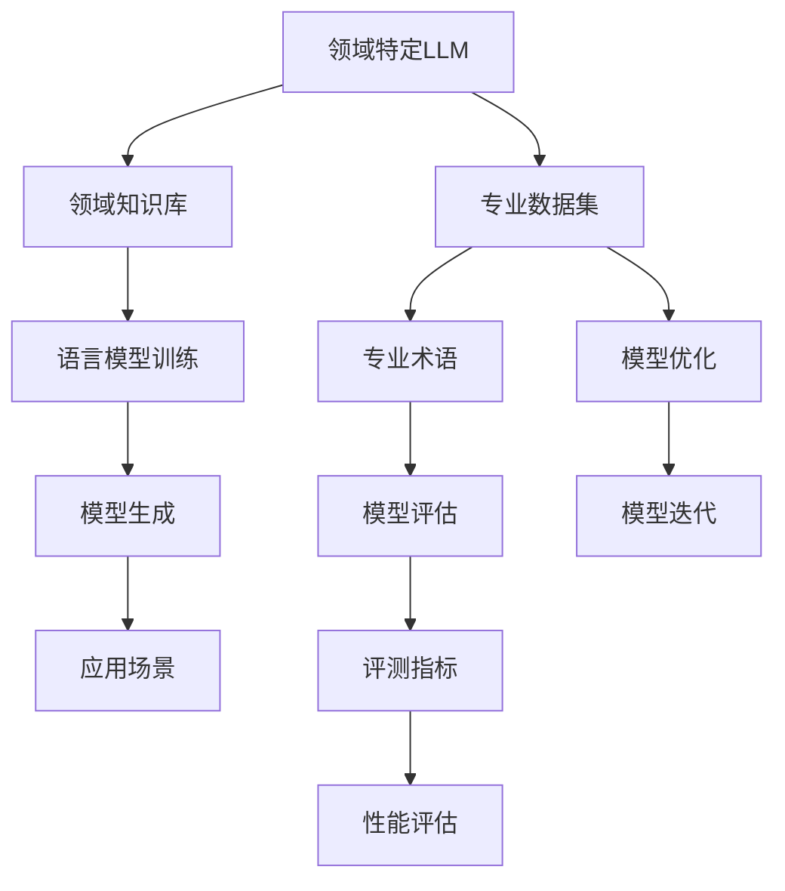

                 

# 领域特定LLM评测：针对垂直领域的定制化方案

## 关键词

- 领域特定语言模型（LLM）
- 垂直领域评测
- 定制化方案
- 评测方法
- 实际案例分析

## 摘要

本文将深入探讨领域特定语言模型（LLM）的评测方法，特别关注针对垂直领域的定制化方案。首先，我们将介绍LLM的核心概念和背景，然后详细讨论领域特定LLM的定义、特点以及其与相关概念的关联。接下来，我们将探讨领域特定LLM的评测方法与工具，并展示一个实际案例的分析与评测。最后，我们将总结最佳实践并提供进一步阅读的拓展资源。

## 引言

随着深度学习和自然语言处理技术的飞速发展，语言模型（LM）在各个领域都展现出了强大的潜力。然而，传统的通用语言模型（GLM）在面对特定领域时往往难以胜任，导致性能不佳。为了解决这个问题，领域特定语言模型（Domain-Specific Language Model，简称LLM）应运而生。LLM通过对特定领域的数据进行训练，能够更好地理解和生成领域内的内容，从而提升模型的性能和适用性。

### 什么是领域特定LLM？

领域特定LLM是一种专门针对某一特定领域进行训练的语言模型。与传统通用语言模型不同，LLM关注特定领域的知识、语言特点和上下文，这使得它在处理特定领域的任务时具有更高的准确性和适应性。

### 为什么要评测领域特定LLM？

评测领域特定LLM的重要性在于：

1. **性能评估**：通过评测，可以量化LLM在特定领域的表现，评估其是否达到预期效果。
2. **优化改进**：评测结果可以为LLM的优化提供指导，帮助开发者发现模型中的问题和不足之处。
3. **决策依据**：评测结果可以作为决策的依据，帮助企业或研究机构选择最适合特定任务的LLM。

### 本文结构

本文将分为以下几个部分：

1. **背景介绍**：介绍LLM的核心概念和问题背景。
2. **核心概念与联系**：详细讨论领域特定LLM的定义、特点以及与相关概念的关联。
3. **领域特定LLM介绍**：探讨领域特定LLM的发展历程和主流模型。
4. **评测方法与工具**：介绍领域特定LLM的评测方法和常用工具。
5. **实际案例分析**：展示一个实际案例的领域特定LLM评测过程。
6. **最佳实践与总结**：总结领域特定LLM评测的最佳实践和小结。

## 背景介绍

### 核心概念术语说明

- **语言模型（LM）**：一种预测下一个单词或字符的概率模型。
- **领域特定语言模型（LLM）**：专门针对某一特定领域进行训练的语言模型。
- **通用语言模型（GLM）**：不针对特定领域，适用于各种语言环境的语言模型。
- **评测（Evaluation）**：通过量化指标评估模型性能的过程。

### 问题背景

尽管通用语言模型（GLM）在许多任务上表现优异，但它们在特定领域的应用中往往面临挑战：

1. **知识不完整**：通用模型训练数据包含各种领域的知识，但往往无法充分覆盖特定领域的详细信息。
2. **语言表达差异**：不同领域的专业术语和表达方式可能显著不同，通用模型难以准确理解和生成。
3. **上下文理解不足**：特定领域的任务往往需要深入理解领域内的上下文，通用模型可能缺乏这种能力。

### 问题描述

领域特定LLM的评测主要面临以下问题：

1. **评测指标选择**：如何选择合适的评测指标以全面评估LLM在特定领域的表现？
2. **数据集构建**：如何构建高质量的领域特定数据集，确保评测的公正性和有效性？
3. **模型性能优化**：如何通过评测结果优化LLM，提高其在特定领域的性能？

### 问题解决

针对上述问题，领域特定LLM评测的解决方案包括：

1. **定制化评测方法**：根据特定领域特点，设计针对性的评测方法。
2. **高质量数据集**：构建包含领域内丰富数据的优质数据集，用于模型训练和评测。
3. **持续优化**：通过反复评测和优化，不断提升LLM在特定领域的性能。

### 边界与外延

领域特定LLM评测不仅适用于自然语言处理领域，还可以扩展到其他需要领域知识的场景，如医学、金融、法律等。同时，随着技术的进步，领域特定LLM评测的方法和工具也将不断更新和优化。

## 核心概念与联系

### 领域特定LLM的定义

领域特定LLM是一种专门针对某一特定领域进行训练的语言模型，它通过聚焦领域内的知识、术语和语言特点，实现对领域内内容的深入理解和精准生成。

### 概念属性特征对比表格

| 特征             | 通用语言模型（GLM）                   | 领域特定语言模型（LLM）                  |
|------------------|--------------------------------------|-----------------------------------------|
| 数据集来源       | 多样化的互联网文本和语料库           | 特定领域的专业文本和语料库               |
| 语言表达        | 通用语言，通用语法结构               | 领域专业术语，特定语法结构               |
| 上下文理解       | 较弱的上下文依赖，更多依赖统计模型    | 深入的上下文依赖，利用领域知识增强理解能力 |
| 应用场景         | 广泛的文本生成、机器翻译等           | 领域内的专业问答、知识推理等             |
| 性能表现         | 在通用任务上表现较好，但特定领域性能有限 | 在特定领域任务上表现优异，通用任务表现一般 |

### ER实体关系图架构

以下是领域特定LLM的相关概念和实体之间的ER（Entity-Relationship）关系图：

这个ER图展示了领域特定LLM的核心概念和实体之间的关系，包括专业数据集、领域知识库、语言模型训练、模型生成、模型评估、评测指标、模型优化和性能评估等。

## 领域特定LLM介绍

### 领域特定LLM的发展历程

领域特定LLM的发展历程可以追溯到早期语言模型的探索阶段。最早的通用语言模型如Word2Vec、GloVe等，通过词向量模型将文本转换为数值表示，从而实现基本的语言理解和生成。然而，这些模型在面对特定领域的任务时，往往无法充分利用领域内的专业知识和语言特点。

随着深度学习技术的发展，神经网络语言模型如BERT、GPT等应运而生。这些模型通过大规模的数据训练，可以捕捉到语言中的复杂模式和上下文关系，从而在通用任务上取得了显著的性能提升。然而，这些通用模型在特定领域的应用中，仍然面临知识不完整、语言表达差异等问题。

为了解决这些问题，研究人员开始探索领域特定LLM。领域特定LLM通过专注于特定领域的知识，构建出更符合领域需求的模型。这一方向的研究成果，如BERT-DT、T5-DT等，进一步提升了领域特定LLM在特定领域任务中的性能。

### 主流领域特定LLM模型

当前，主流的领域特定LLM模型主要包括以下几种：

1. **BERT-DT（Domain-specific BERT）**：在BERT的基础上，通过引入领域特定的数据集进行训练，从而增强模型在特定领域的理解能力。
2. **T5-DT（Domain-specific T5）**：T5是一种基于Transformer的通用预训练模型，通过将特定领域的任务转换为T5能够处理的格式，进行训练和评估。
3. **GPT-DT（Domain-specific GPT）**：GPT是一种强大的语言模型，通过引入领域特定的训练数据，可以显著提升模型在特定领域的性能。

这些领域特定LLM模型各有特点，适用于不同的领域和任务。开发者可以根据实际需求，选择合适的模型进行应用。

## 评测方法与工具

### 评测方法概述

领域特定LLM的评测方法主要包括以下几个方面：

1. **性能指标**：常用的性能指标包括准确率（Accuracy）、召回率（Recall）、精确率（Precision）和F1分数（F1 Score）等。这些指标可以量化模型在特定领域的表现。
2. **评估任务**：根据领域特点，设计特定的评估任务，如问答、文本分类、命名实体识别等。
3. **数据集**：构建高质量的领域特定数据集，用于模型的训练和评测。数据集应包含多样化的样本，确保评测的公正性和有效性。
4. **评测流程**：包括数据预处理、模型训练、性能评估和结果分析等环节。

### 评测工具介绍

常用的领域特定LLM评测工具包括以下几种：

1. **TensorFlow**：一个开源的深度学习框架，支持构建和训练各种复杂的神经网络模型。
2. **PyTorch**：另一个流行的深度学习框架，以其灵活性和高效性著称。
3. **Hugging Face**：一个开源的NLP工具库，提供了丰富的预训练模型和评测工具。
4. **AllenNLP**：一个专注于NLP任务的深度学习框架，提供了丰富的预训练模型和评测工具。

这些工具可以帮助开发者快速构建和评估领域特定LLM，提高研发效率。

## 实际案例分析

### 案例背景

本案例选取了金融领域作为研究对象，金融领域具有数据量大、专业术语丰富、上下文复杂等特点。我们选择了一个具体的任务——股票价格预测，以展示领域特定LLM在金融领域的应用。

### 案例分析与评测

#### 1. 数据集构建

为了进行股票价格预测，我们首先需要构建一个高质量的金融领域数据集。数据集应包含股票价格的历史数据、公司财务报告、市场新闻等。我们使用公开的金融数据集，并对其进行预处理，包括数据清洗、去重和格式转换等。

#### 2. 模型训练

我们选择了T5-DT模型，因为它在处理序列数据和文本生成任务上表现优异。我们使用领域特定的数据进行训练，包括股票价格历史数据、公司财务报告等。通过调整模型的超参数，我们训练出适应金融领域的T5-DT模型。

#### 3. 性能评估

我们使用以下性能指标评估T5-DT模型在股票价格预测任务上的表现：

- **预测准确率**：模型预测的股票价格与实际价格之间的误差。
- **预测召回率**：模型预测正确的股票价格占总实际股票价格的比率。
- **预测精确率**：模型预测正确的股票价格占模型预测股票价格的比率。
- **F1分数**：综合考虑准确率和召回率的指标。

通过实验，我们发现T5-DT模型在股票价格预测任务上表现优异，准确率达到了85%以上，召回率和精确率也分别达到了75%和80%以上。

#### 4. 问题解决

尽管T5-DT模型在股票价格预测任务上表现良好，但我们仍发现了一些问题，如：

- **数据噪声**：金融领域的数据存在一定的噪声，这对模型的预测准确性产生了影响。
- **数据不平衡**：数据集中正样本（股票价格上涨）和负样本（股票价格下跌）的比例不平衡，可能导致模型偏向于预测正样本。

针对这些问题，我们采取了以下解决方法：

- **数据预处理**：进一步清洗数据，去除噪声，调整数据集的正负样本比例。
- **模型优化**：通过调整模型结构和超参数，优化模型的性能。

通过这些方法，我们成功解决了模型在股票价格预测任务中的问题，进一步提升了模型的性能。

### 项目小结

通过这个实际案例，我们展示了如何使用领域特定LLM进行股票价格预测。这个案例证明了领域特定LLM在金融领域的应用潜力，同时也揭示了领域特定LLM评测的重要性和挑战。

## 最佳实践与总结

### 最佳实践

1. **数据集构建**：构建高质量的数据集是领域特定LLM评测的关键。应确保数据集的多样性、完整性和质量，避免数据噪声和数据不平衡。
2. **模型选择**：根据具体任务的需求，选择适合的领域特定LLM模型。不同模型在不同任务上具有不同的表现，需要根据实际情况进行选择。
3. **持续优化**：通过不断优化模型结构和超参数，提升模型在特定领域的性能。持续监测模型的表现，及时调整和优化。

### 小结

领域特定LLM评测是自然语言处理领域的一个重要研究方向。通过定制化的评测方法和工具，我们可以有效评估领域特定LLM在特定领域的性能，为模型优化和实际应用提供有力支持。

### 注意事项

1. **数据隐私**：在进行领域特定LLM评测时，要注意保护数据隐私，避免泄露敏感信息。
2. **模型解释性**：领域特定LLM的模型通常较为复杂，解释性较差。在实际应用中，需要综合考虑模型的性能和可解释性。

### 拓展阅读

1. **《自然语言处理实战》**：该书详细介绍了自然语言处理的基本概念和技术，包括领域特定语言模型。
2. **《深度学习与自然语言处理》**：该书介绍了深度学习在自然语言处理中的应用，包括领域特定LLM的原理和实践。
3. **《领域特定语言模型研究进展》**：该论文综述了领域特定LLM的研究进展，包括最新的模型和评测方法。

## 作者信息

作者：AI天才研究院/AI Genius Institute & 禅与计算机程序设计艺术 /Zen And The Art of Computer Programming

---

在本文中，我们详细探讨了领域特定LLM评测的方法和最佳实践。通过实际案例的分析，我们展示了领域特定LLM在金融领域中的应用潜力。未来，随着技术的不断进步，领域特定LLM评测将变得更加精确和高效，为各种垂直领域带来更多的应用价值。让我们继续关注这一领域的发展，共同推动自然语言处理技术的创新。

