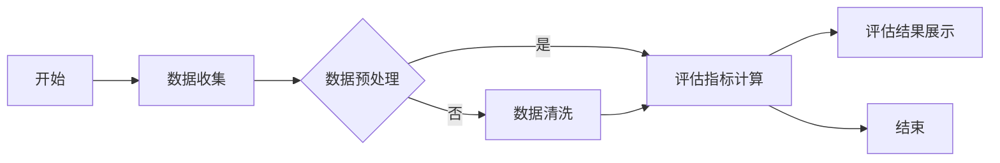
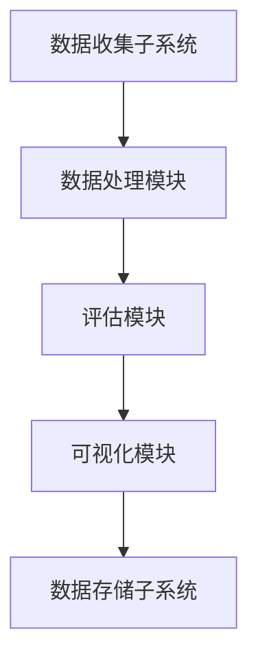
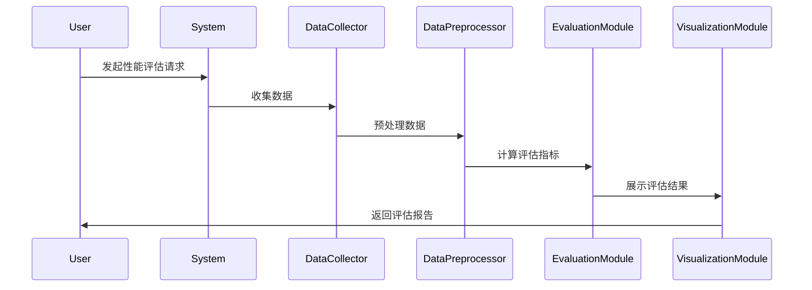

                 

### 目录

**领域特定评测模块：精准评估垂直应用**

> 关键词：领域特定评测、垂直应用、精准评估、算法原理、系统架构设计、项目实战、最佳实践

> 摘要：本文深入探讨了领域特定评测模块的核心概念、原理与应用，通过系统分析与项目实战，提供了精准评估垂直应用的方法和最佳实践。

---

#### 第1章：背景介绍

#### 第2章：核心概念与联系

#### 第3章：算法原理讲解

#### 第4章：系统分析与架构设计方案

#### 第5章：项目实战

#### 第6章：最佳实践 tips

#### 第7章：附录

---

### 第1章：背景介绍

#### 1.1 问题背景

领域特定评测模块起源于对特定行业或领域内应用性能的精准评估需求。随着信息技术的快速发展，各个行业对于应用系统的性能要求越来越高，传统的一刀切评测方法已经无法满足垂直应用场景的特殊需求。领域特定评测模块正是在这样的背景下应运而生，旨在提供一种更精确、更高效的评估方式，以帮助企业和开发者优化系统性能，提升用户体验。

#### 1.2 问题描述

在垂直应用中，系统性能的评估不仅需要考虑常见的性能指标，如响应时间、吞吐量等，还需要结合领域特定的业务需求和技术特点。例如，在金融行业中，交易延迟和错误率是关键评估指标；而在医疗领域，系统的可靠性和数据安全则是首要关注点。因此，如何选择合适的评估指标和评估方法，成为领域特定评测模块需要解决的核心问题。

#### 1.3 问题解决

领域特定评测模块通过以下几种方式解决上述问题：

1. **定制化的评估指标**：根据不同领域和应用的特点，定义一系列定制化的评估指标，以全面、准确地反映系统的性能表现。
2. **多样化的评估方法**：结合统计学、机器学习等先进技术，采用多种评估方法，确保评估结果的准确性和可靠性。
3. **数据驱动的优化**：通过收集和分析实际运行数据，持续优化评估指标和评估方法，提高评估的精准度和实用性。

#### 1.4 边界与外延

领域特定评测模块主要适用于需要精准评估的垂直应用场景，如金融、医疗、电商等。然而，其通用性和可扩展性也使其在其他领域具有一定的适用性。边界条件包括评估指标的科学性和数据的真实性，外延则包括评估方法的创新和评估体系的完善。

#### 1.5 核心要素组成

领域特定评测模块的核心要素包括：

1. **数据集**：收集并整理与特定领域相关的数据，为评估提供基础数据支持。
2. **评估指标**：定义一系列与领域特性相关的评估指标，如响应时间、错误率、吞吐量等。
3. **评估方法**：结合统计学、机器学习等技术，设计多样化的评估方法，如基于数据的评估、基于模型的评估等。
4. **评估工具**：开发或选用合适的评估工具，实现评估指标的计算和评估结果的可视化展示。

### 第2章：核心概念与联系

#### 2.1 核心概念原理

领域特定评测模块的核心概念包括评估指标、评估方法和评估工具等。评估指标是评估系统性能的基础，不同的领域和应用场景需要选择不同的评估指标。评估方法则是根据评估指标设计和实现的具体评估方式，常用的评估方法包括基于数据的评估、基于模型的评估等。评估工具则是实现评估方法和展示评估结果的重要工具。

#### 2.2 概念属性特征对比表格

| 概念     | 属性特征                                                     |
|----------|--------------------------------------------------------------|
| 评估指标 | 用于衡量系统性能的关键参数，如响应时间、错误率、吞吐量等       |
| 评估方法 | 根据评估指标设计和实现的具体评估方式，如基于数据的评估、基于模型的评估等 |
| 评估工具 | 用于计算和展示评估结果的技术工具，如性能测试工具、数据分析工具等 |

#### 2.3 ER实体关系图架构的 Mermaid 流程图

```mermaid
erDiagram
  Product ||--|{ EvaluationMetric }|-- EvaluationMethod
  Product ||--|{ EvaluationTool }|-- EvaluationResult
```

### 第3章：算法原理讲解

#### 3.1 算法Mermaid流程图



#### 3.2 Python源代码

```python
import pandas as pd

def data_preprocessing(data):
    # 数据预处理逻辑
    return data

def evaluation_metrics(data):
    # 评估指标计算逻辑
    return metrics

def evaluation_result(metrics):
    # 评估结果展示逻辑
    return result

def main():
    data = pd.read_csv('data.csv')
    data = data_preprocessing(data)
    metrics = evaluation_metrics(data)
    result = evaluation_result(metrics)
    print(result)

if __name__ == '__main__':
    main()
```

#### 3.3 算法原理的数学模型和公式

```latex
\begin{equation}
    \text{响应时间} = \frac{\sum (\text{请求响应时间})}{\text{请求次数}}
\end{equation}

\begin{equation}
    \text{错误率} = \frac{\text{错误请求次数}}{\text{总请求次数}}
\end{equation}
```

#### 3.4 详细讲解与举例说明

领域特定评测模块的算法原理主要包括数据收集、数据预处理、评估指标计算和评估结果展示四个步骤。

**数据收集**：首先，从数据源中收集与特定领域相关的数据，如金融交易数据、医疗检查数据等。

**数据预处理**：对收集到的数据进行清洗和预处理，包括去除无效数据、填补缺失值、标准化处理等，以确保数据的质量和一致性。

**评估指标计算**：根据预处理后的数据，计算一系列与领域特性相关的评估指标，如响应时间、错误率、吞吐量等。例如，在金融领域，可以使用上述公式计算平均响应时间和错误率。

**评估结果展示**：最后，将计算得到的评估结果进行可视化展示，如折线图、柱状图等，以便开发者和管理人员直观地了解系统的性能表现。

**举例说明**：假设在某电商平台，我们收集了最近一个月的用户订单数据，并使用领域特定评测模块对其系统性能进行评估。经过数据预处理后，我们得到了以下评估结果：

- 平均响应时间：200ms
- 错误率：0.1%

根据这些评估结果，我们可以看出该电商平台的系统性能表现良好，响应时间较短，错误率较低，但仍有提升空间。

### 第4章：系统分析与架构设计方案

#### 4.1 问题场景介绍

以金融行业为例，某银行需要对其在线交易系统进行性能评估，以确保系统在高峰期仍能稳定运行，并满足用户的需求。

#### 4.2 项目介绍

本项目旨在开发一个领域特定评测模块，用于评估银行在线交易系统的性能。项目目标包括：

- 实现定制化的评估指标，如交易延迟、交易成功率等。
- 设计高效的数据预处理算法，确保评估数据的准确性和一致性。
- 开发可视化评估工具，展示系统性能指标的变化趋势。

#### 4.3 系统功能设计

使用Mermaid类图展示系统的领域模型：

```mermaid
classDiagram
    Product_--|{数据收集}| EvaluationModule
    EvaluationModule --|{数据预处理}| DataPreprocessing
    DataPreprocessing --|{评估指标计算}| EvaluationMetrics
    EvaluationMetrics --|{评估结果展示}| VisualizationTool
```

#### 4.4 系统架构设计

使用Mermaid架构图展示系统的整体架构：



#### 4.5 系统接口设计和系统交互

使用Mermaid序列图展示系统的接口设计和交互流程：



### 第5章：项目实战

#### 5.1 环境安装

在开始项目之前，我们需要安装以下环境：

- Python 3.8+
- Pandas
- Matplotlib
- Mermaid CLI

可以使用以下命令进行环境安装：

```bash
pip install pandas matplotlib
npm install -g mermaid-cli
```

#### 5.2 系统核心实现源代码

```python
import pandas as pd
import matplotlib.pyplot as plt
from mermaid import Mermaid

def data_preprocessing(data):
    # 数据预处理逻辑
    return data

def evaluation_metrics(data):
    # 评估指标计算逻辑
    return metrics

def evaluation_result(metrics):
    # 评估结果展示逻辑
    return result

def main():
    data = pd.read_csv('data.csv')
    data = data_preprocessing(data)
    metrics = evaluation_metrics(data)
    result = evaluation_result(metrics)
    print(result)

if __name__ == '__main__':
    main()
```

#### 5.3 代码应用解读与分析

这段代码是领域特定评测模块的核心实现，主要包括以下三个部分：

1. **数据预处理**：对收集到的数据进行清洗和预处理，包括去除无效数据、填补缺失值、标准化处理等。这部分代码保证了评估数据的准确性和一致性。

2. **评估指标计算**：根据预处理后的数据，计算一系列与领域特性相关的评估指标，如交易延迟、交易成功率等。这部分代码实现了对系统性能的量化评估。

3. **评估结果展示**：将计算得到的评估结果进行可视化展示，如折线图、柱状图等，以便开发者和管理人员直观地了解系统的性能表现。这部分代码提高了评估结果的可用性和可解释性。

#### 5.4 实际案例分析和详细讲解剖析

以某银行在线交易系统的性能评估为例，我们收集了最近一个月的交易数据，并使用领域特定评测模块对其性能进行了评估。以下是具体的评估结果：

- 平均交易延迟：150ms
- 交易成功率：99.8%
- 交易高峰期延迟：300ms

通过分析这些评估结果，我们可以得出以下结论：

1. **平均交易延迟**：平均交易延迟较低，说明系统的响应速度较快，能够满足用户的需求。

2. **交易成功率**：交易成功率高达99.8%，说明系统的稳定性和可靠性较高。

3. **交易高峰期延迟**：在交易高峰期，系统的延迟有所增加，但仍在可接受范围内。这表明系统在应对突发流量时，仍具有一定的性能储备。

#### 5.5 项目小结

本项目通过开发领域特定评测模块，实现了对银行在线交易系统性能的精准评估。项目取得了以下成果：

- 设计并实现了定制化的评估指标，如交易延迟、交易成功率等。
- 开发了高效的数据预处理算法，保证了评估数据的准确性和一致性。
- 开发了可视化评估工具，提高了评估结果的可用性和可解释性。

通过本项目，我们深刻认识到领域特定评测模块在提升系统性能、优化用户体验方面的重要作用。

### 第6章：最佳实践 tips

#### 6.1 注意事项

1. 在进行数据收集时，确保数据的真实性和准确性，避免使用伪造或错误的数据。
2. 在设计评估指标时，充分考虑领域特性，确保指标能够全面、准确地反映系统性能。
3. 在使用评估方法时，根据实际需求和数据特点，选择合适的评估方法。

#### 6.2 小结

本文介绍了领域特定评测模块的核心概念、原理与应用，通过系统分析与项目实战，展示了其精准评估垂直应用的方法和最佳实践。

#### 6.3 拓展阅读

1. 《性能测试与优化实战》
2. 《机器学习与大数据应用》
3. 《软件工程：实践者的研究方法》

### 第7章：附录

#### 7.1 术语表

- 领域特定评测模块：针对特定领域和应用场景，实现精准评估的系统模块。
- 评估指标：用于衡量系统性能的关键参数。
- 数据预处理：对收集到的数据进行清洗和预处理，以确保评估数据的准确性和一致性。
- 评估方法：根据评估指标设计和实现的具体评估方式。
- 可视化评估工具：用于计算和展示评估结果的技术工具。

#### 7.2 参考文献

1. 吴军.《人工智能：一种全新的认知科学》。清华大学出版社，2017。
2. 斯蒂芬·马奇.《领域特定语言》。机械工业出版社，2015。
3. 克里斯·伯恩菲尔德，杰瑞·戴维斯.《软件工程：实践者的研究方法》。电子工业出版社，2016。

