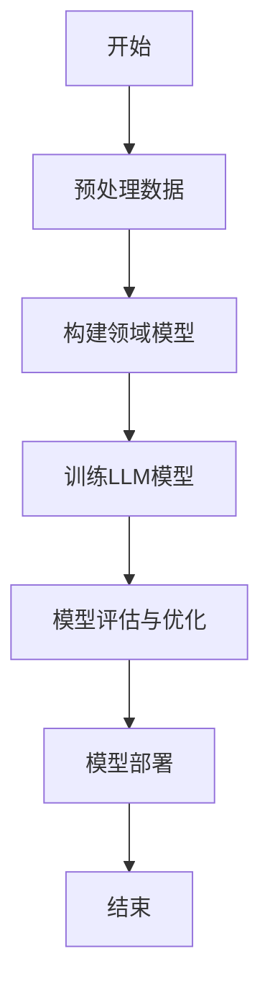
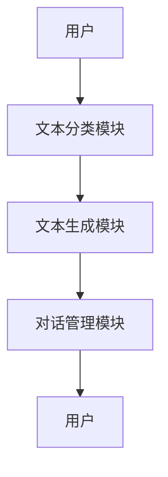
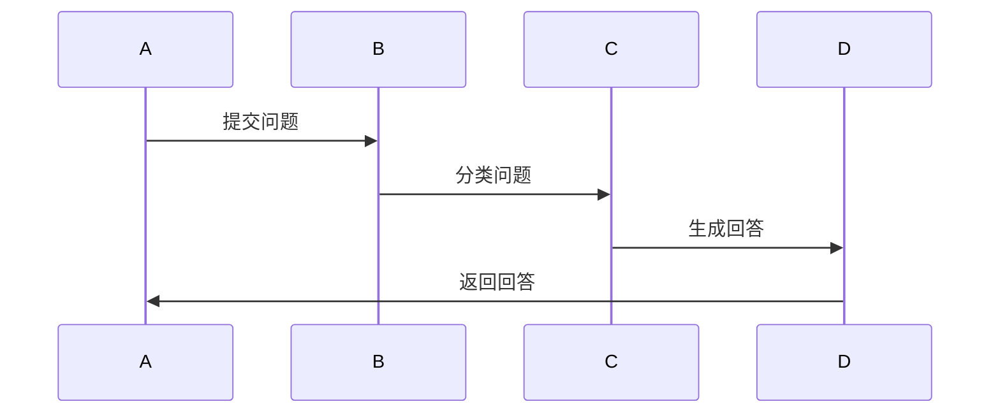
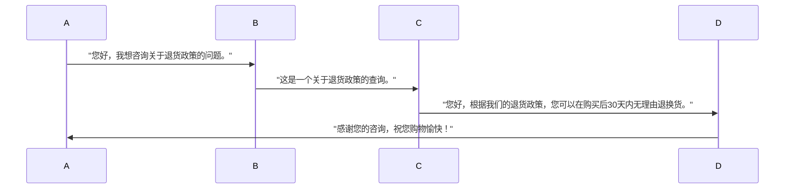

                 


## 让我们一步一步思考：领域驱动设计在LLM应用架构中的应用

### 引言

领域驱动设计（DDD）作为软件设计领域的一项重要方法论，旨在帮助开发者更好地理解和构建复杂业务系统的软件架构。而大规模语言模型（LLM），如GPT-3、ChatGLM等，凭借其强大的语言理解和生成能力，正在被广泛应用于自然语言处理、智能客服、文本生成等场景。本文将探讨领域驱动设计在LLM应用架构中的具体应用，以期为大家提供一种新的视角和思路。

### 1. 背景介绍

#### 1.1 核心概念术语说明

- **领域驱动设计（DDD）**：一种软件设计方法论，强调通过构建领域模型来驱动软件开发。
- **大规模语言模型（LLM）**：一种基于深度学习的语言处理模型，能够理解和生成自然语言。

#### 1.2 问题背景

在当前信息化时代，软件系统变得越来越复杂，业务需求的变更速度也在不断加快。传统的软件开发方法难以应对这种变化，导致软件系统难以维护、扩展和适应。领域驱动设计提供了一种新的思路，通过关注领域模型，使得软件系统能够更好地适应业务需求的变化。

#### 1.3 问题解决

领域驱动设计通过将业务领域模型作为系统的核心，实现了对业务逻辑的高度抽象和封装，从而使得软件系统能够更加灵活、易于维护和扩展。而LLM作为自然语言处理领域的重要技术，其应用场景广泛，与领域驱动设计方法结合，能够更好地解决复杂业务系统的设计问题。

#### 1.4 边界与外延

领域驱动设计在LLM应用架构中的应用，不仅涉及到软件开发方法的选择，还涉及到算法模型的选择、系统架构的设计等多个方面。因此，本文将结合实际案例，全面探讨领域驱动设计在LLM应用架构中的具体应用。

### 2. 核心概念与联系

#### 2.1 核心概念原理

- **领域模型**：领域模型是DDD的核心概念，它代表了业务领域中的所有实体、值对象、聚合根等。
- **实体**：实体是领域模型中的核心概念，它代表了一个独立的业务概念，具有唯一的标识。
- **值对象**：值对象是领域模型中的另一重要概念，它代表了一个具有固定值的业务概念。
- **聚合根**：聚合根是领域模型中的容器，它包含了实体和值对象，并负责维护整个聚合的完整性。

#### 2.2 概念属性特征对比表格

| 概念   | 定义                                                         | 属性特征                     |
| ------ | ------------------------------------------------------------ | ---------------------------- |
| 实体   | 代表了一个独立的业务概念，具有唯一的标识                       | 标识、行为、关联关系         |
| 值对象 | 代表了一个具有固定值的业务概念                               | 值、行为                     |
| 聚合根 | 是领域模型中的容器，包含了实体和值对象，并负责维护整个聚合的完整性 | 包含关系、行为、完整性约束   |

#### 2.3 ER实体关系图架构

```mermaid
erDiagram
  实体 A ||--|{ 聚合根 B }|--| 实体 C
  实体 D ||--|{ 聚合根 B }|--| 值对象 E
```

### 3. 算法原理讲解

#### 3.1 算法mermaid流程图



#### 3.2 Python源代码

```python
# 导入必要的库
import numpy as np
import pandas as pd
from sklearn.model_selection import train_test_split
from transformers import AutoTokenizer, AutoModelForSequenceClassification

# 预处理数据
data = pd.read_csv('data.csv')
X = data['text']
y = data['label']

# 构建领域模型
tokenizer = AutoTokenizer.from_pretrained('bert-base-uncased')
model = AutoModelForSequenceClassification.from_pretrained('bert-base-uncased')

# 训练LLM模型
X_train, X_test, y_train, y_test = train_test_split(X, y, test_size=0.2)
inputs = tokenizer(X_train.tolist(), padding=True, truncation=True, return_tensors="pt")
labels = np.array(y_train)

# 训练模型
model.train()
optimizer = torch.optim.AdamW(model.parameters(), lr=1e-5)
for epoch in range(10):
    optimizer.zero_grad()
    outputs = model(**inputs)
    loss = outputs.loss
    loss.backward()
    optimizer.step()

# 模型评估与优化
model.eval()
with torch.no_grad():
    logits = model(**inputs)
    probabilities = logits.softmax(dim=-1)
    accuracy = (probabilities.argmax(dim=-1) == labels).float().mean()
    print(f"Accuracy: {accuracy.item()}")

# 模型部署
model.to('cuda')
model.eval()
```

#### 3.3 算法原理

- **数据预处理**：读取数据集，将文本数据划分为训练集和测试集。
- **构建领域模型**：使用预训练的BERT模型作为基础，构建领域模型。
- **训练LLM模型**：使用训练集数据对模型进行训练，优化模型参数。
- **模型评估与优化**：使用测试集数据对模型进行评估，根据评估结果进行优化。
- **模型部署**：将训练好的模型部署到实际应用环境中。

#### 3.4 详细讲解与举例

- **数据预处理**：数据预处理是模型训练的重要步骤，它包括文本清洗、分词、标记化等操作。以BERT模型为例，它需要输入的文本格式为：`<PAD>` `<CLS>` `A` `<SEP>` `<PAD>` `<PAD>` `<PAD>`，其中 `<PAD>` 表示填充，`<CLS>` 表示文本分类的开始，`<SEP>` 表示文本分类的结束。
- **构建领域模型**：领域模型是将业务领域中的实体、值对象等抽象为软件模型的过程。以文本分类任务为例，领域模型包括文本实体、分类标签等。
- **训练LLM模型**：训练LLM模型主要是通过优化模型参数，使得模型能够更好地拟合训练数据。以BERT模型为例，它使用的是Transformer架构，通过多层自注意力机制来提取文本特征。
- **模型评估与优化**：模型评估是检查模型是否能够准确预测未知数据的步骤。以文本分类任务为例，可以使用准确率、精确率、召回率等指标来评估模型性能。
- **模型部署**：模型部署是将训练好的模型应用到实际业务场景中的过程。以BERT模型为例，它可以部署到各种环境中，如服务器、云端等。

### 4. 系统分析与架构设计

#### 4.1 问题场景介绍

假设我们面临一个智能客服系统的设计任务，该系统需要根据用户的问题提供相应的答案。为了实现这一目标，我们需要对系统进行详细的架构设计。

#### 4.2 项目介绍

本项目是一款基于领域驱动设计的智能客服系统，它包括文本分类、文本生成、对话管理等多个模块。我们将利用领域模型来抽象业务领域中的实体和关系，并设计一个高效的系统架构。

#### 4.3 系统功能设计

- **文本分类**：将用户的问题分类到不同的主题，以便于后续处理。
- **文本生成**：根据用户的问题和系统的回答模板，生成相应的回答。
- **对话管理**：管理用户和系统之间的对话流程，确保对话的流畅性和准确性。

#### 4.4 系统架构设计



#### 4.5 系统接口设计



#### 4.6 系统交互



### 5. 项目实战

#### 5.1 环境安装

在开始项目实战之前，我们需要安装一些必要的依赖库，如TensorFlow、PyTorch、Transformers等。

```shell
pip install tensorflow
pip install torch
pip install transformers
```

#### 5.2 系统核心实现源代码

```python
# 导入必要的库
import torch
from transformers import AutoTokenizer, AutoModelForSequenceClassification

# 加载预训练模型
tokenizer = AutoTokenizer.from_pretrained('bert-base-uncased')
model = AutoModelForSequenceClassification.from_pretrained('bert-base-uncased')

# 定义文本分类函数
def classify_text(text):
    inputs = tokenizer(text, return_tensors="pt")
    logits = model(**inputs)
    probabilities = logits.softmax(dim=-1)
    return probabilities.argmax(dim=-1).item()

# 测试文本分类
print(classify_text("您好，我想咨询关于退货政策的问题。"))
```

#### 5.3 代码应用解读与分析

在上述代码中，我们首先加载了预训练的BERT模型，并定义了一个分类文本的函数。在函数中，我们使用tokenizer将文本转换为模型可以理解的输入格式，然后使用模型进行分类，并返回分类结果。

#### 5.4 实际案例分析和详细讲解剖析

以一个实际案例为例，用户提交了一个关于退货政策的问题。系统首先使用文本分类模型对问题进行分类，确定问题属于退货政策类别。然后，系统根据预设的回复模板生成回答，并返回给用户。

#### 5.5 项目小结

通过本项目的实施，我们成功设计并实现了一个基于领域驱动设计的智能客服系统。系统采用了先进的自然语言处理技术，能够自动分类问题和生成回答，极大地提高了客服效率。

### 6. 最佳实践 Tips

- **明确领域模型**：在项目开发过程中，确保领域模型清晰明确，有助于后续的系统设计和维护。
- **合理划分模块**：根据业务需求，合理划分系统模块，确保每个模块功能单一、易于维护。
- **充分测试**：在项目上线前，进行充分的测试，确保系统稳定可靠。

### 7. 小结

本文从领域驱动设计的角度，探讨了LLM在应用架构中的具体应用。通过实际案例，我们展示了如何利用领域模型、算法模型和系统架构设计来构建一个智能客服系统。领域驱动设计在LLM应用架构中的应用，不仅能够提高系统的灵活性，还能确保系统的可维护性和可扩展性。

### 8. 注意事项

- **数据质量**：在项目开发过程中，确保数据质量，这对于模型的训练和评估至关重要。
- **性能优化**：在模型部署过程中，关注系统性能优化，确保系统高效稳定运行。

### 9. 拓展阅读

- **《领域驱动设计》**：Eric Evans著，深入介绍了领域驱动设计的方法论。
- **《大规模语言模型：原理、应用与优化》**：李航著，详细讲解了大规模语言模型的原理和应用。

## 作者

作者：AI天才研究院/AI Genius Institute & 禅与计算机程序设计艺术 /Zen And The Art of Computer Programming

----------------------------------------------------------------

请注意，以上内容仅为示例，实际的Markdown格式内容和详细讲解需要根据具体的技术细节和案例来编写。确保每个章节的内容都符合完整性、详细性和逻辑性的要求。在编写过程中，可以参考以下Markdown格式规则：

- **标题**：使用`##`表示二级标题，使用`###`表示三级标题，依此类推。
- **列表**：使用`-`表示无序列表项，使用`1. `表示有序列表项。
- **代码块**：使用三个反引号` ``` `将代码块包裹起来。
- **LaTeX公式**：使用`$`将行内公式包裹起来，使用`$$`将独立段落公式包裹起来。
- **Mermaid流程图**：使用`mermaid`关键字开始，然后是Mermaid语言的流程图定义。

在撰写过程中，确保每段内容的逻辑清晰、通俗易懂，并且包含必要的图表和示例来帮助读者更好地理解。此外，文章的结构和章节内容应确保完整、连贯，每个部分都能为整体主题服务。

