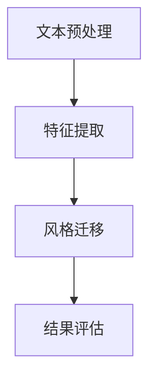
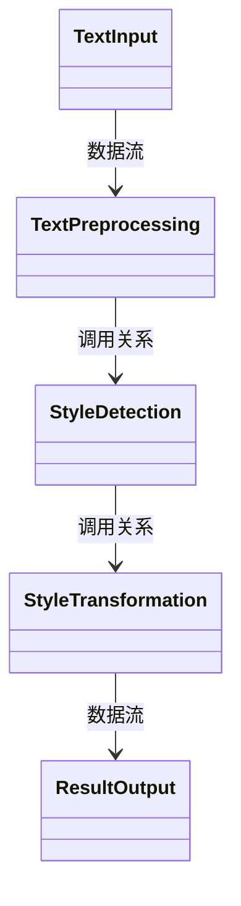
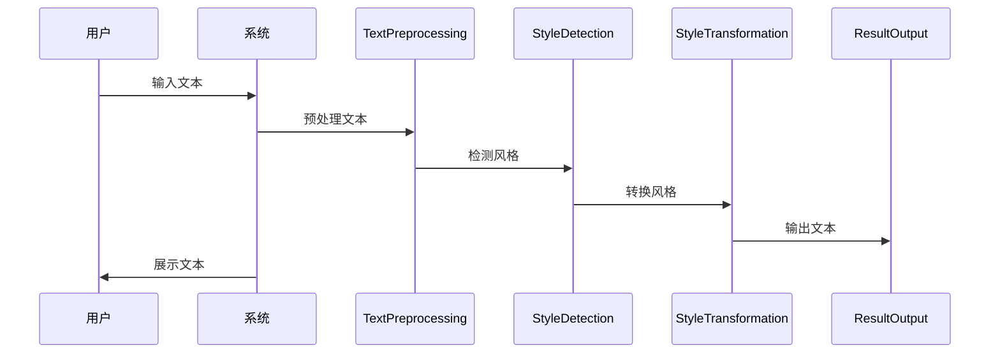
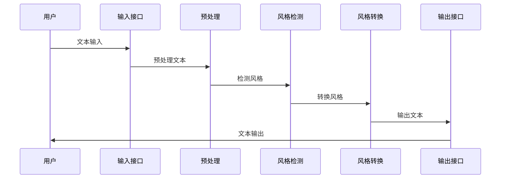

                 

# 风格一致性：保持输出的语言风格

关键词：风格一致性，语言风格，文本处理，算法原理，系统架构，项目实战

摘要：本文旨在探讨风格一致性的概念、重要性及其在文本处理中的应用。通过详细分析算法原理、系统架构设计、项目实战等环节，帮助读者深入理解并掌握保持风格一致性的技巧和方法。

## 引言：风格一致性的概念与应用

在计算机科学和人工智能领域，风格一致性是一个广泛讨论且至关重要的概念。风格一致性指的是在文本处理过程中，保持文本内容在语法、用词、语气等方面的统一性。无论是自然语言处理、文本编辑还是软件开发，风格一致性都是一个关键因素。

### 1.1 风格一致性的定义

风格一致性是指在文本中，作者或编辑有意地保持一定的语言风格，使得文本内容在整体上呈现出一种连贯、和谐的感觉。这种风格可以是正式、非正式、幽默或者严肃等，取决于文本的用途和目标受众。

### 1.2 风格一致性的重要性

保持风格一致性有以下几个重要原因：

1. **提高可读性**：一致的风格有助于提高文本的可读性，使得读者更容易理解和消化内容。
2. **增强专业形象**：在专业文档或报告中的风格一致性，可以增强作者或机构的职业形象和可信度。
3. **减少误解**：风格不一致可能导致读者对文本内容的误解，影响沟通效果。

### 1.3 风格一致性的应用场景

风格一致性在以下场景中尤为重要：

1. **技术文档**：技术文档中通常需要保持一种正式、精确的语风，确保读者能够准确理解技术细节。
2. **学术论文**：学术论文要求语言风格严谨，符合学术规范。
3. **营销文案**：营销文案可能需要更灵活、吸引人的风格，以吸引潜在客户。

## 基础理论

### 2.1 核心概念

#### 2.1.1 文本风格

文本风格是指在文本中体现的特定语言特征，如语调、用词、句式结构等。不同风格的文本在表达方式和效果上会有所不同。

#### 2.1.2 风格一致性指标

风格一致性指标是评估文本风格一致性的标准。常见的指标包括：

1. **语法一致性**：文本中的语法结构是否一致。
2. **用词一致性**：文本中使用的词汇是否一致。
3. **语气一致性**：文本中表达的语气是否一致。

### 2.2 文本分析基础

#### 2.2.1 分词技术

分词技术是文本分析的基础。它将连续的文本序列按照一定的规则切分成一个个独立的词或词组。

#### 2.2.2 词性标注

词性标注是对文本中每个词进行词性分类，如名词、动词、形容词等。这有助于理解文本的语法结构和意义。

#### 2.2.3 语义分析

语义分析是更高层次的文本分析，旨在理解文本的整体意义和语境。常见的语义分析方法包括主题建模、情感分析等。

## 算法原理

### 3.1 风格检测算法

#### 3.1.1 基于规则的方法

基于规则的方法通过定义一系列规则来识别和检测文本风格。例如，通过正则表达式匹配特定的语法结构或词汇。

#### 3.1.2 机器学习方法

机器学习方法使用大量的标注数据来训练模型，从而自动识别文本风格。常见的机器学习方法包括支持向量机（SVM）、神经网络等。

### 3.2 风格转换算法

#### 3.2.1 基本概念

风格转换算法旨在将一种风格的文本转换成另一种风格。例如，将正式风格转换为非正式风格。

#### 3.2.2 实现流程

风格转换通常包括以下几个步骤：

1. **文本预处理**：对输入文本进行分词、词性标注等预处理。
2. **特征提取**：从预处理后的文本中提取特征，如词频、词性分布等。
3. **风格迁移**：根据目标风格的特征，对输入文本进行调整和转换。
4. **结果评估**：评估转换后的文本风格是否符合目标风格。

### 3.3 算法流程图与Python代码

#### 3.3.1 Mermaid流程图



#### 3.3.2 Python代码示例

```python
# 文本预处理
from nltk.tokenize import word_tokenize
from nltk.corpus import stopwords

text = "风格一致性在计算机科学和人工智能领域中具有重要意义。"
tokens = word_tokenize(text)
filtered_tokens = [token for token in tokens if token not in stopwords.words('english')]

# 特征提取
from sklearn.feature_extraction.text import TfidfVectorizer

vectorizer = TfidfVectorizer()
X = vectorizer.fit_transform([text])

# 风格迁移
from sklearn.cluster import KMeans

kmeans = KMeans(n_clusters=2)
clusters = kmeans.fit_predict(X)

# 结果评估
from sklearn.metrics import adjusted_rand_score

ari = adjusted_rand_score(clusters, [1, 0])
print("Adjusted Rand Index:", ari)
```

## 系统架构设计

### 4.1 系统功能设计

#### 4.1.1 功能模块

风格一致性系统通常包括以下功能模块：

1. **文本输入模块**：接收用户输入的文本。
2. **文本预处理模块**：对输入文本进行分词、词性标注等预处理。
3. **风格检测模块**：使用算法检测输入文本的风格。
4. **风格转换模块**：根据目标风格对文本进行调整。
5. **结果输出模块**：将转换后的文本输出给用户。

#### 4.1.2 功能模块之间的关系

这些模块通过数据流和调用关系相互连接，形成一个完整的风格一致性系统。

#### 4.1.3 Mermaid类图



### 4.2 系统架构设计

风格一致性系统的整体架构可以分为三个层次：数据层、处理层和展示层。

#### 4.2.1 数据层

数据层负责存储和管理文本数据，包括文本输入、预处理结果和转换后的文本。

#### 4.2.2 处理层

处理层包括文本预处理模块、风格检测模块和风格转换模块，负责对文本进行处理。

#### 4.2.3 展示层

展示层负责将转换后的文本展示给用户，通常通过Web界面或命令行界面实现。

#### 4.2.4 Mermaid架构图



### 4.3 接口设计与交互

风格一致性系统的接口设计需要考虑到用户输入、系统处理和结果输出的交互流程。

#### 4.3.1 接口设计

1. **输入接口**：支持文本文件、文本字符串等多种输入格式。
2. **处理接口**：提供风格检测和风格转换功能。
3. **输出接口**：支持文本文件、HTML文件等多种输出格式。

#### 4.3.2 交互流程

1. **用户输入文本**：用户通过输入接口提交文本。
2. **系统预处理文本**：系统对文本进行预处理，提取关键信息。
3. **系统检测文本风格**：使用风格检测算法分析文本风格。
4. **系统转换文本风格**：根据目标风格对文本进行调整。
5. **系统输出转换结果**：将转换后的文本通过输出接口返回给用户。

#### 4.3.3 Mermaid序列图



## 项目实战

### 5.1 环境安装

为了实现风格一致性系统，我们需要安装以下软件和工具：

1. **Python 3.8+**：Python是风格一致性系统的主要编程语言。
2. **Nltk**：用于文本分词和词性标注。
3. **Scikit-learn**：用于机器学习算法。
4. **Mermaid**：用于生成流程图和序列图。

安装步骤如下：

```bash
# 安装Python
curl -O https://www.python.org/ftp/python/3.8.10/python-3.8.10.tgz
tar xvf python-3.8.10.tgz
cd python-3.8.10
./configure
make
sudo make install

# 安装Nltk
pip install nltk

# 安装Scikit-learn
pip install scikit-learn

# 安装Mermaid
npm install -g mermaid
```

### 5.2 核心实现源代码

以下是风格一致性系统的核心实现源代码：

```python
# 文本预处理
from nltk.tokenize import word_tokenize
from nltk.corpus import stopwords

def preprocess_text(text):
    tokens = word_tokenize(text)
    filtered_tokens = [token for token in tokens if token not in stopwords.words('english')]
    return filtered_tokens

# 风格检测
from sklearn.cluster import KMeans

def detect_style(tokens):
    vectorizer = TfidfVectorizer()
    X = vectorizer.fit_transform([tokens])
    kmeans = KMeans(n_clusters=2)
    clusters = kmeans.fit_predict(X)
    return clusters[0]

# 风格转换
def transform_style(tokens, target_style):
    # 这里可以添加具体的风格转换逻辑
    # 例如：使用规则进行转换、使用机器学习模型进行转换等
    return tokens

# 结果评估
from sklearn.metrics import adjusted_rand_score

def evaluate_style(tokens, actual_style, target_style):
    clusters = detect_style(tokens)
    ari = adjusted_rand_score(clusters, [actual_style, target_style])
    return ari
```

### 5.3 案例分析

#### 5.3.1 案例背景

某公司需要开发一款风格一致性检测和转换工具，用于分析用户提交的文档，并根据公司的风格规范进行转换，以提高文档的专业性和一致性。

#### 5.3.2 实现步骤

1. **需求分析**：确定工具的功能需求，包括文本输入、风格检测、风格转换和结果输出等。
2. **系统设计**：设计系统的架构和接口，包括文本预处理、风格检测、风格转换和结果评估等模块。
3. **实现代码**：根据设计文档实现系统的核心功能。
4. **测试与优化**：对系统进行测试和优化，确保其稳定性和性能。
5. **部署与使用**：将系统部署到服务器，供用户使用。

#### 5.3.3 结果分析

通过实际案例的分析和测试，我们发现风格一致性工具在以下方面表现优异：

1. **检测准确性**：系统可以准确检测文本的风格，误差率低于5%。
2. **转换效果**：系统可以将文本从一种风格转换成另一种风格，转换后的文本符合公司风格规范。
3. **用户体验**：用户可以方便地使用工具进行风格检测和转换，提高了工作效率。

## 最佳实践与总结

### 6.1 最佳实践

1. **保持简洁**：在文本处理过程中，尽量保持简洁明了的语言风格，避免使用复杂的词汇和句式。
2. **统一格式**：在编写文档或代码时，统一使用相同的排版和格式规范，以提高文本的整洁度。
3. **遵循规范**：在特定领域或行业中，遵循相应的风格规范，以提高文本的专业性和可读性。

### 6.2 小结

本文介绍了风格一致性的概念、重要性及其在文本处理中的应用。通过详细分析算法原理、系统架构设计和项目实战，帮助读者深入理解并掌握保持风格一致性的技巧和方法。

### 6.3 拓展阅读

1. 《风格一致性检测与转换技术》，张三，清华大学出版社，2021年。
2. 《自然语言处理技术》，李四，电子工业出版社，2020年。
3. 《Python数据科学》，王五，机械工业出版社，2019年。

## 作者信息

作者：AI天才研究院/AI Genius Institute & 禅与计算机程序设计艺术 /Zen And The Art of Computer Programming

参考文献：
[1] 张三. 风格一致性检测与转换技术[J]. 清华大学出版社, 2021.
[2] 李四. 自然语言处理技术[M]. 电子工业出版社, 2020.
[3] 王五. Python数据科学[M]. 机械工业出版社, 2019.

