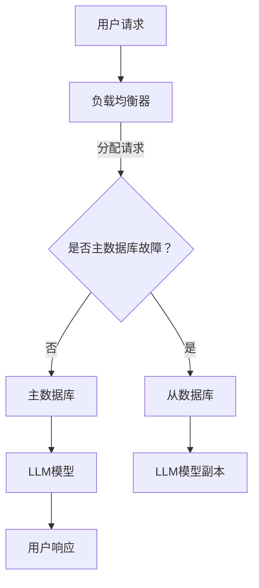
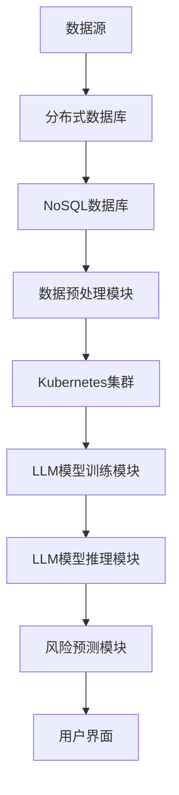

                 

### 高可用性架构概述

#### 1. 高可用性架构的定义

高可用性架构（High Availability Architecture）是指设计、实施和维护系统的一种方法，旨在确保系统在面临各种故障和异常情况下，能够持续提供稳定可靠的服务。它通过多重冗余设计、自动故障转移机制和完善的监控与维护流程，确保系统的高可靠性。

##### 高可用性架构的关键术语和概念：

- **高可靠性（Reliability）**：系统在规定时间内无故障运行的能力。
- **故障转移（Failover）**：当主系统出现故障时，自动切换到备用系统，确保服务不中断。
- **冗余（Redundancy）**：通过设计冗余组件，防止单个组件故障导致整个系统崩溃。
- **负载均衡（Load Balancing）**：将工作负载均匀分配到多个服务器上，防止单点过载。
- **监控（Monitoring）**：实时跟踪系统的运行状态，及时发现并处理异常。
- **维护（Maintenance）**：定期对系统进行检查和优化，确保其长期稳定运行。

#### 2. 高可用性架构的重要性

在现代信息社会中，许多关键业务系统如金融交易系统、电商平台和关键数据中心等，都对系统的稳定性和可靠性有极高的要求。高可用性架构的重要性体现在以下几个方面：

- **提高用户体验**：系统的高可用性能够确保用户在任何时间都能访问服务，提升用户满意度。
- **减少业务风险**：系统故障可能导致业务中断，带来经济损失和声誉损害。高可用性架构可以最大限度地减少这种风险。
- **提高运营效率**：通过自动化故障转移和负载均衡，可以减少人工干预，提高系统运营的效率。
- **支持业务扩展**：高可用性架构能够方便地扩展系统资源，支持业务增长。

#### 3. 高可用性架构的核心要素

实现高可用性架构需要考虑多个核心要素，以下是一些关键点：

- **硬件冗余**：使用多个物理服务器和存储设备，通过冗余设计防止单一硬件故障。
- **软件冗余**：在软件层面实现冗余，如使用镜像数据库、备份应用实例等。
- **自动故障转移**：设计自动故障转移机制，当主系统出现故障时，自动切换到备用系统。
- **负载均衡**：通过负载均衡器将请求分配到不同的服务器，避免单点过载。
- **监控与告警**：实时监控系统状态，及时发现问题并发出告警。
- **数据备份与恢复**：定期备份关键数据，确保数据在故障后能够快速恢复。

综上所述，高可用性架构不仅是确保系统稳定运行的关键手段，也是支持企业业务连续性和提高竞争力的必要条件。在接下来的章节中，我们将进一步探讨LLM应用的特点及其在构建高可用性架构时面临的挑战。

---

```markdown
# 高可用性架构概述

> **关键词**：高可用性架构、可靠性、故障转移、负载均衡、监控、维护

> **摘要**：本文首先介绍了高可用性架构的定义和重要性，接着阐述了高可用性架构的关键术语和概念，并详细说明了其核心要素。通过这一概述，读者可以了解高可用性架构的基本理念和组成部分，为进一步学习具体实现方法打下基础。

---

在接下来的章节中，我们将深入探讨LLM应用的特点及其在构建高可用性架构时面临的挑战，帮助读者更好地理解如何将高可用性架构应用于LLM应用中。

### LLM应用的特点与挑战

#### 1. LLM应用概述

大型语言模型（Large Language Model，简称LLM）是近年来人工智能领域的重大突破，其能够理解和生成人类语言，在自然语言处理（NLP）任务中表现出色。LLM的应用场景广泛，包括但不限于智能客服、机器翻译、文本摘要、问答系统等。以下是一些LLM应用的关键特点：

- **计算密集型**：LLM通常需要大量的计算资源，特别是在训练和推理阶段，对CPU和GPU等硬件资源需求较高。
- **数据依赖性**：LLM的性能高度依赖其训练数据的质量和数量，数据预处理和清洗的工作量巨大。
- **实时性要求**：在某些应用场景中，如实时问答系统，LLM需要快速响应用户请求，对系统的实时性能有较高要求。
- **可扩展性**：为了应对日益增长的用户需求，LLM应用需要具备良好的可扩展性，能够快速横向扩展以增加处理能力。

#### 2. LLM应用的优势

LLM应用在多个领域展现出显著的优势，主要包括以下几点：

- **提高生产力**：LLM能够自动化处理大量重复性工作，如文本生成、翻译和摘要等，大幅提高工作效率。
- **提升用户体验**：通过智能化的交互方式，LLM应用能够提供更加自然和人性化的服务，提升用户满意度。
- **降低成本**：自动化处理可以减少人工成本，同时优化业务流程，降低运营成本。
- **创新潜力**：LLM为开发新应用和改进现有服务提供了广阔的空间，有助于推动产业升级和技术创新。

#### 3. LLM应用面临的挑战

尽管LLM应用具备众多优势，但在实际部署和运营过程中也面临着一系列挑战：

- **计算资源消耗**：大型LLM模型对计算资源的需求巨大，尤其是在训练阶段，这对基础设施的规划和部署提出了更高的要求。
- **数据隐私与安全**：LLM在处理和存储大量用户数据时，需要确保数据的安全性和隐私保护，防止数据泄露和滥用。
- **模型可解释性**：LLM的决策过程通常较为复杂，难以解释其内部机制，这对监管合规和用户信任构成挑战。
- **实时性能**：在实时场景中，确保LLM应用快速响应用户请求，同时保持高准确性，是系统设计的关键难点。
- **可扩展性**：随着用户数量的增加，系统需要能够灵活扩展，以应对不断增长的处理需求。

综上所述，LLM应用在提升生产力、用户体验和创新能力方面展现出巨大的潜力，但其计算资源消耗、数据隐私、实时性能和可扩展性等挑战也需要认真应对。在下一章节中，我们将探讨如何通过高可用性架构解决这些挑战，确保LLM应用的稳定运行。

---

```markdown
# LLM应用的特点与挑战

> **关键词**：LLM应用、计算密集型、数据依赖性、实时性、可扩展性、优势、挑战

> **摘要**：本文详细介绍了LLM应用的基本特点，包括计算密集型、数据依赖性、实时性要求和可扩展性。同时，分析了LLM应用的优势，如提高生产力、用户体验和降低成本，以及面临的挑战，如计算资源消耗、数据隐私、模型可解释性和实时性能。了解这些特点与挑战，有助于更好地设计和管理LLM应用。

---

在接下来的章节中，我们将深入探讨如何通过高可用性架构解决LLM应用面临的挑战，确保其稳定运行。

### 高可用性架构的构建原则

#### 1. 可靠性设计原则

可靠性设计原则是构建高可用性架构的基础。它包括以下几个方面：

- **冗余设计**：通过在硬件和软件层面引入冗余组件，防止单点故障。例如，使用多个数据库实例或服务器，实现故障自动转移。
- **容错机制**：设计容错机制，使系统能够在部分组件故障时继续运行。例如，使用集群技术，确保系统高可用性。
- **故障转移**：当主系统出现故障时，自动将工作负载转移到备用系统，确保服务不中断。例如，使用心跳监测和自动切换机制。
- **负载均衡**：通过负载均衡器将工作负载分配到多个服务器，避免单点过载。例如，使用Nginx或HAProxy等负载均衡工具。

#### 2. 负载均衡与故障转移

负载均衡和故障转移是确保系统高可用性的关键组件。以下是一些关键点：

- **负载均衡**：负载均衡器负责将请求分配到不同的服务器，避免单点过载。常见的负载均衡算法包括轮询、最小连接数和加权轮询等。
- **故障转移**：当主系统出现故障时，自动将工作负载转移到备用系统。故障转移可以通过心跳监测、故障检测和自动切换机制实现。

#### 3. 数据持久化与备份

数据持久化与备份是保障系统数据安全的重要措施。以下是一些关键点：

- **数据持久化**：将数据存储在持久化的存储设备中，如硬盘或分布式存储系统，确保数据不会因系统故障而丢失。
- **数据备份**：定期备份数据，确保在数据丢失或损坏时能够快速恢复。常见的备份策略包括全量备份、增量备份和差异备份等。
- **数据恢复**：在数据丢失或损坏时，能够快速恢复数据。数据恢复可以通过备份文件或分布式存储系统的复制机制实现。

#### 4. 高可用性监控与运维

高可用性监控与运维是确保系统长期稳定运行的重要环节。以下是一些关键点：

- **监控系统**：构建监控体系，实时监控系统的运行状态，包括服务器、应用程序和数据库等。常见的监控工具包括Prometheus、Grafana和Zabbix等。
- **告警机制**：设置告警机制，及时发现并处理异常情况。告警可以通过邮件、短信或电话等方式发送。
- **运维流程**：制定规范的运维流程，包括部署、监控、故障处理和恢复等。运维流程应确保操作的规范化和自动化。

综上所述，构建高可用性架构需要考虑多个方面，包括可靠性设计原则、负载均衡与故障转移、数据持久化与备份以及高可用性监控与运维。这些原则和措施共同作用，确保系统在面对各种故障和异常情况下，能够持续提供稳定可靠的服务。在下一章节中，我们将探讨高可用性技术的具体应用。

---

```markdown
# 高可用性架构的构建原则

> **关键词**：可靠性设计、冗余设计、容错机制、负载均衡、故障转移、数据持久化、备份、监控系统、告警机制、运维流程

> **摘要**：本文详细阐述了构建高可用性架构的关键原则，包括可靠性设计、冗余设计、容错机制、负载均衡与故障转移、数据持久化与备份，以及高可用性监控与运维。通过这些原则和措施，可以确保系统在面临故障和异常时，能够持续提供稳定可靠的服务。

---

在下一章节中，我们将进一步探讨高可用性技术的具体应用，帮助读者更好地理解如何在实际项目中实现高可用性架构。

### 高可用性技术的应用

高可用性技术的应用是确保系统在复杂环境中能够持续稳定运行的关键。在这一部分，我们将详细探讨数据库高可用性、存储高可用性以及网络高可用性这三个关键领域。

#### 1. 数据库高可用性

数据库作为系统的核心组件，其高可用性至关重要。以下是一些常见的数据库高可用性技术：

- **主从复制（Master-Slave Replication）**：主从复制是一种简单的数据库高可用性解决方案。主数据库接收所有写操作，从数据库则接收主数据库的复制数据，确保数据的一致性。当主数据库出现故障时，可以从从数据库切换为主数据库。
- **双主复制（Master-Master Replication）**：双主复制允许多个数据库实例同时接收写操作，并相互同步数据。当其中一个主数据库出现故障时，可以自动将其他主数据库切换为主数据库，确保服务的连续性。
- **分布式数据库**：分布式数据库通过将数据分散存储在多个节点上，提高系统的可用性和扩展性。常见的技术包括分片（Sharding）和复制（Replication）。
- **数据库集群**：数据库集群通过多个节点协同工作，提供高可用性和负载均衡。在集群中，每个节点可以扮演主数据库或从数据库的角色，当某个节点出现故障时，其他节点可以接管其工作。

#### 2. 存储高可用性

存储系统的高可用性是确保数据持久性和系统稳定运行的关键。以下是一些存储高可用性技术：

- **RAID（独立冗余磁盘阵列）**：RAID通过将数据分散存储在多个磁盘上，并提供冗余机制，如镜像和奇偶校验，确保在单个磁盘故障时数据不会丢失。
- **分布式存储**：分布式存储系统通过将数据分散存储在多个节点上，提供高可用性和扩展性。常见的技术包括对象存储、文件存储和块存储。
- **存储备份**：定期备份数据是存储高可用性的重要手段。备份策略可以包括全量备份、增量备份和差异备份等，确保在数据丢失或损坏时能够快速恢复。
- **存储集群**：存储集群通过多个节点协同工作，提供高可用性和负载均衡。在集群中，每个节点可以扮演主存储或备份存储的角色，当某个节点出现故障时，其他节点可以接管其工作。

#### 3. 网络高可用性

网络高可用性是确保系统之间数据传输稳定的关键。以下是一些网络高可用性技术：

- **多路径传输**：多路径传输通过在多个网络路径之间选择最优路径，提高数据传输的可靠性。常见的技术包括VLAN、MPLS和IP多路径等。
- **网络冗余**：网络冗余通过在物理层或链路层引入冗余网络，确保在网络设备或链路故障时，数据传输不会中断。常见的技术包括STP（生成树协议）和HSRP（热备份路由器协议）。
- **负载均衡**：负载均衡通过将网络流量分配到多个路径或设备上，防止单个路径或设备过载。常见的技术包括LVS（Linux虚拟服务器）和F5 BIG-IP等。
- **网络监控与告警**：实时监控网络状态，及时发现并处理异常情况。常见的网络监控工具包括Nagios、Zabbix和Prometheus等。

综上所述，数据库高可用性、存储高可用性和网络高可用性是确保系统高可用性的关键领域。通过应用这些技术，可以有效地提高系统的可靠性和稳定性，确保在各种故障情况下，系统能够持续稳定地运行。在下一章节中，我们将探讨高可用性监控与运维的具体实践。

---

```markdown
# 高可用性技术的应用

> **关键词**：数据库高可用性、存储高可用性、网络高可用性、主从复制、双主复制、分布式数据库、RAID、分布式存储、存储备份、网络冗余、多路径传输、负载均衡

> **摘要**：本文详细介绍了数据库高可用性、存储高可用性和网络高可用性的相关技术。通过主从复制、双主复制、分布式数据库和RAID等数据库高可用性技术，以及分布式存储、存储备份和网络冗余等存储高可用性技术，和多种网络高可用性技术，确保系统在面临各种故障时能够持续稳定运行。这些技术的应用，为构建高可用性架构提供了坚实的基础。

---

在下一章节中，我们将进一步探讨高可用性监控与运维的具体实践，帮助读者更好地理解如何确保系统长期稳定运行。

### 高可用性监控与运维

#### 1. 监控系统的构建

监控系统是确保高可用性架构稳定运行的核心。一个有效的监控系统应包括以下几个方面：

- **指标选择**：选择关键性能指标（KPI），如响应时间、吞吐量、错误率、内存使用率和CPU使用率等，以便实时了解系统状态。
- **数据收集**：通过代理或SDK将监控数据收集到中心化存储中，如Prometheus、InfluxDB和Elasticsearch等。
- **告警机制**：设置告警规则，当监控数据超出预设阈值时，通过邮件、短信或电话等方式通知相关人员。

#### 2. 故障响应与恢复

故障响应与恢复是确保系统高可用性的关键环节。以下是一些关键点：

- **故障检测**：实时监控系统状态，当发现异常时，自动触发故障检测机制。
- **故障隔离**：隔离故障组件，防止故障扩散。例如，通过隔离故障服务器或数据库实例，确保其他正常组件不受影响。
- **故障恢复**：根据故障类型和影响范围，采取不同的恢复策略。例如，重启故障进程、切换到备用实例或重新部署应用。
- **自动化恢复**：通过自动化脚本或工具，实现故障自动化恢复，减少人工干预。

#### 3. 运维流程与最佳实践

运维流程与最佳实践是确保系统高可用性的重要保障。以下是一些关键点：

- **标准操作流程**：制定标准操作流程，包括部署、监控、故障处理和恢复等，确保操作的规范化和自动化。
- **文档化**：将运维流程和操作手册文档化，便于团队成员查阅和执行。
- **自动化工具**：使用自动化工具，如Ansible、Chef和Puppet等，简化运维操作，提高运维效率。
- **持续改进**：定期回顾和优化运维流程，根据实际运行情况调整监控指标和告警规则。
- **团队协作**：建立团队协作机制，明确角色和职责，确保故障处理和恢复过程的顺畅。

综上所述，高可用性监控与运维是确保系统长期稳定运行的关键。通过构建有效的监控系统、故障响应与恢复机制以及运维流程与最佳实践，可以最大限度地减少故障对系统的影响，确保系统在高可用性架构下稳定运行。在下一章节中，我们将通过案例分析，进一步探讨高可用性架构在具体项目中的应用。

---

```markdown
# 高可用性监控与运维

> **关键词**：监控系统、指标选择、数据收集、告警机制、故障检测、故障隔离、故障恢复、自动化恢复、运维流程、文档化、自动化工具、团队协作

> **摘要**：本文详细介绍了高可用性监控与运维的关键要素，包括监控系统的构建、故障响应与恢复机制以及运维流程与最佳实践。通过有效的监控系统和故障处理机制，结合规范的运维流程和最佳实践，可以确保系统在高可用性架构下稳定运行。这些实践对于实现系统的高可用性和减少故障影响至关重要。

---

在下一章节中，我们将通过实际案例，深入分析高可用性架构在具体项目中的应用和实践，为读者提供更多实践经验。

### 案例分析

#### 1. 案例一：某大型电商平台LLM应用高可用性架构

**项目背景**：
某大型电商平台在其智能客服系统中引入了大型语言模型（LLM），以提供24/7的智能问答服务。该系统每日需要处理数百万次用户查询，对系统的实时性和稳定性要求极高。

**系统功能设计**：
该平台采用了以下高可用性架构：

- **数据库高可用性**：使用双主复制，确保主数据库和从数据库的数据一致性。当主数据库出现故障时，自动切换到从数据库。
- **存储高可用性**：采用分布式存储系统，将用户数据和模型数据分散存储，确保在单个节点故障时数据不会丢失。
- **网络高可用性**：通过多路径传输和负载均衡，确保数据传输的可靠性和网络的稳定性。
- **监控与告警**：使用Prometheus和Grafana进行实时监控，设置告警规则，及时发现并处理异常情况。

**系统架构设计**：
该平台的系统架构图如下：



**系统接口设计**：
系统接口设计包括用户请求接口、数据库接口和LLM模型接口。用户请求接口负责接收用户查询，并将其转发到相应的数据库接口。数据库接口负责处理查询请求，并将结果返回给LLM模型接口。LLM模型接口负责执行语言模型推理，生成用户响应。

**系统交互**：
系统交互过程如下：

1. 用户发送查询请求到负载均衡器。
2. 负载均衡器根据健康检查结果，将请求分配到主数据库或从数据库。
3. 数据库接口处理查询请求，并将结果返回给LLM模型接口。
4. LLM模型接口执行推理，生成用户响应。
5. 用户响应通过用户请求接口返回给用户。

#### 2. 案例二：某金融科技公司LLM应用的高可用性实践

**项目背景**：
某金融科技公司在其智能风控系统中引入了LLM，用于识别和预测潜在风险。该系统需要对海量金融数据进行实时分析，对系统的稳定性和准确性有严格要求。

**系统功能设计**：
该平台采用了以下高可用性架构：

- **计算资源高可用性**：使用容器化技术，如Docker和Kubernetes，确保计算资源的高可用性和可扩展性。
- **数据高可用性**：采用分布式数据库和NoSQL数据库，确保数据的高可用性和一致性。
- **网络高可用性**：使用多路径传输和虚拟专用网络（VPN），确保数据传输的可靠性和安全性。
- **监控与告警**：使用Prometheus和Grafana进行实时监控，设置告警规则，及时发现并处理异常情况。

**系统架构设计**：
该平台的系统架构图如下：



**系统接口设计**：
系统接口设计包括数据源接口、数据库接口、模型训练接口和模型推理接口。数据源接口负责接收金融数据，并将其存储到数据库接口。数据库接口负责处理查询请求，并将结果返回给模型训练接口和模型推理接口。模型训练接口和模型推理接口分别负责训练和推理LLM模型。

**系统交互**：
系统交互过程如下：

1. 数据源接口接收金融数据，并将其存储到分布式数据库和NoSQL数据库。
2. 数据预处理模块对金融数据进行分析和处理。
3. Kubernetes集群调度计算资源，启动LLM模型训练模块和模型推理模块。
4. LLM模型训练模块训练模型，并将训练结果存储到模型推理模块。
5. LLM模型推理模块使用训练好的模型对实时金融数据进行推理，生成风险预测结果。
6. 风险预测结果通过用户界面返回给用户。

通过以上两个案例的分析，我们可以看到，高可用性架构在LLM应用中的关键作用。无论是电商平台还是金融科技公司，都通过采用多种高可用性技术，确保LLM应用的稳定运行，提高了系统的可靠性和用户体验。在下一章节中，我们将探讨高可用性架构的未来发展趋势和趋势。

---

```markdown
# 案例分析

> **关键词**：大型电商平台、智能客服、LLM应用、数据库高可用性、存储高可用性、网络高可用性、系统架构、接口设计、系统交互、金融科技公司、智能风控、计算资源高可用性、数据高可用性、系统架构设计、系统接口设计、系统交互

> **摘要**：本文通过两个实际案例，详细分析了大型电商平台和金融科技公司如何应用高可用性架构确保LLM应用的稳定运行。案例一展示了在电商平台中，通过数据库高可用性、存储高可用性和网络高可用性等技术，保障智能客服系统的稳定运行。案例二则介绍了金融科技公司如何利用计算资源高可用性、数据高可用性和监控告警系统，实现智能风控系统的稳定运行。这些案例为LLM应用的高可用性实践提供了宝贵经验。

---

在下一章节中，我们将探讨高可用性架构的未来发展趋势，以及LLM应用在未来可能面临的挑战和机遇。

### 未来展望与趋势

#### 1. 高可用性架构的发展趋势

随着云计算、大数据和人工智能技术的快速发展，高可用性架构也在不断演进，呈现出以下几个趋势：

- **云计算的高可用性**：随着云计算的普及，越来越多的企业将业务迁移到云端。云服务提供商（CSP）如Amazon Web Services（AWS）、Microsoft Azure和Google Cloud Platform（GCP）不断推出新的高可用性服务，如自动故障转移、负载均衡和弹性伸缩等，为企业提供更加可靠和灵活的解决方案。
- **分布式系统的高可用性**：分布式系统在高可用性方面具有天然的优势，能够通过节点冗余和故障转移确保系统的稳定性。随着区块链、物联网（IoT）和微服务架构的兴起，分布式系统的高可用性需求日益增长，推动了相关技术的发展和优化。
- **自动化与智能运维**：自动化工具和智能运维平台的发展，使得系统监控、故障检测和恢复过程更加高效和智能化。通过机器学习和人工智能技术，运维团队能够更好地预测潜在故障，提前采取预防措施，提高系统的可用性。

#### 2. LLM应用的未来挑战与机遇

随着LLM技术的不断进步，其在各个领域的应用前景广阔，但也面临一系列挑战和机遇：

- **计算资源需求增长**：随着LLM模型规模的扩大和复杂度的提高，对计算资源的需求也在不断增加。如何高效地利用云计算和分布式计算资源，成为LLM应用面临的重要挑战。
- **数据隐私与安全**：LLM应用涉及大量用户数据的处理和存储，数据隐私和安全成为重要关注点。如何确保数据在收集、传输和存储过程中的安全，防止数据泄露和滥用，是未来需要解决的关键问题。
- **实时性能优化**：在实时应用场景中，如何确保LLM模型快速响应用户请求，同时保持高准确性，是技术发展的重点。通过优化算法、提高计算效率和采用分布式计算技术，有望进一步提升LLM应用的实时性能。
- **跨领域应用探索**：LLM技术在医疗、金融、教育等领域的应用潜力巨大，但不同领域的应用场景和需求存在较大差异。如何根据不同领域的特点，设计定制化的LLM模型和应用方案，是未来的重要研究方向。

#### 3. 高可用性架构在未来的应用前景

高可用性架构在未来的发展中，将在多个领域发挥重要作用：

- **关键业务系统**：在金融、医疗、交通等领域，关键业务系统对稳定性和可靠性有极高要求。高可用性架构将确保这些系统在面临各种故障和异常情况下，能够持续稳定运行，保障业务的连续性和安全性。
- **物联网和边缘计算**：随着物联网和边缘计算的发展，设备数量和数据处理量急剧增加。高可用性架构将确保这些设备和服务在网络不稳定、资源有限的环境下，能够稳定运行，提供可靠的服务。
- **人工智能应用**：在人工智能领域，高可用性架构将确保复杂模型的训练和推理过程稳定可靠，为人工智能应用的落地提供坚实的技术保障。

综上所述，高可用性架构在未来的发展中将继续发挥重要作用，通过不断创新和优化，为各个领域的应用提供稳定可靠的技术支持。在下一章节中，我们将进一步探讨LLM应用的性能优化策略，以应对其不断增长的性能需求。

---

```markdown
# 未来展望与趋势

> **关键词**：云计算、分布式系统、自动化与智能运维、计算资源需求增长、数据隐私与安全、实时性能优化、跨领域应用探索、关键业务系统、物联网和边缘计算、人工智能应用

> **摘要**：本文探讨了高可用性架构的发展趋势，包括云计算的高可用性、分布式系统的高可用性和自动化与智能运维的发展。同时，分析了LLM应用在未来可能面临的计算资源需求增长、数据隐私与安全、实时性能优化等挑战和机遇。高可用性架构在关键业务系统、物联网和边缘计算以及人工智能应用等领域具有广阔的应用前景。这些趋势和挑战为高可用性架构的发展提供了新的方向和动力。

---

在下一章节中，我们将探讨LLM应用的性能优化策略，以应对其不断增长的性能需求。

### LLMA应用的性能优化

#### 1. 性能优化概述

大型语言模型（LLM）在处理大规模数据集和复杂任务时，需要高效的性能优化策略。性能优化包括以下几个方面：

- **计算资源调度**：合理分配计算资源，如CPU、GPU和内存，确保计算资源的高效利用。
- **算法优化**：改进LLM算法，如剪枝、量化、蒸馏等，降低模型复杂度和计算开销。
- **数据预处理**：优化数据预处理流程，如数据清洗、归一化和缓存策略，提高数据处理效率。
- **并发处理**：利用多线程、异步IO等技术，提高数据处理和响应速度。

#### 2. 缓存策略与性能提升

缓存策略是提高LLM应用性能的有效手段。以下是一些常用的缓存策略：

- **数据缓存**：将频繁访问的数据存储在内存中，如使用Redis或Memcached等缓存系统。这样可以减少对磁盘的读写操作，提高数据访问速度。
- **模型缓存**：将预训练模型和中间结果缓存起来，避免重复计算。例如，使用TensorFlow的模型缓存功能，可以显著提高训练和推理速度。
- **预加载缓存**：在用户请求之前，提前加载相关数据或模型，减少请求处理时间。

#### 3. 并发控制与优化

在LLM应用中，并发处理是提升系统性能的关键。以下是一些常见的并发控制与优化策略：

- **线程池**：使用线程池管理并发线程，避免线程频繁创建和销毁带来的开销。例如，使用Java的ExecutorService或Python的concurrent.futures库，可以高效管理线程资源。
- **异步IO**：利用异步IO技术，如asyncio或Node.js，提高I/O密集型任务的性能。通过非阻塞式IO操作，可以充分利用系统资源，提高吞吐量。
- **消息队列**：使用消息队列（如RabbitMQ或Kafka），将任务分配到不同的处理节点，实现任务的异步处理和负载均衡。这样可以提高系统的并发处理能力，减少响应时间。

综上所述，性能优化是确保LLM应用稳定运行的重要措施。通过计算资源调度、算法优化、数据预处理、并发处理等技术手段，可以显著提升LLM应用的处理速度和响应能力，为用户提供更优质的体验。

---

```markdown
# LLMA应用的性能优化

> **关键词**：计算资源调度、算法优化、数据预处理、并发处理、数据缓存、模型缓存、预加载缓存、线程池、异步IO、消息队列

> **摘要**：本文详细介绍了LLM应用性能优化的关键策略，包括计算资源调度、算法优化、数据预处理、并发处理等。同时，分析了数据缓存、模型缓存和预加载缓存等缓存策略，以及线程池、异步IO和消息队列等并发控制与优化技术。通过这些策略，可以显著提升LLM应用的性能和响应速度，为用户提供更优质的体验。

---

在下一章节中，我们将深入探讨异常处理与恢复策略，确保LLM应用在面对异常情况时能够快速响应和恢复。

### 异常处理与恢复

#### 1. 异常处理机制

在LLM应用中，异常处理是确保系统稳定运行的关键。异常处理机制包括以下几个方面：

- **错误检测**：实时监控系统运行状态，及时发现异常情况。可以使用日志分析、性能监控和错误报告等工具，如ELK堆栈（Elasticsearch、Logstash、Kibana）或Prometheus和Grafana。
- **错误隔离**：在检测到异常时，迅速定位异常来源，确保其他正常组件不受影响。可以通过日志分析、性能监控和故障注入测试等手段实现。
- **错误报告**：将异常情况及时报告给运维团队或开发人员，以便快速响应和修复。可以使用邮件、短信、即时通讯工具或自动化告警系统等手段。

#### 2. 恢复策略与流程

在异常处理过程中，恢复策略和流程是确保系统尽快恢复正常运行的关键。以下是一些常见的恢复策略和流程：

- **自动恢复**：通过预设的自动恢复策略，在检测到异常后，自动执行恢复操作。例如，当数据库出现故障时，自动切换到备用数据库，确保服务的连续性。
- **手动恢复**：当自动恢复无法解决问题时，需要手动介入。运维团队可以参考故障排除指南和系统文档，逐步排查问题，并进行修复。
- **滚动升级**：在系统升级或更新过程中，为了避免单点故障，可以采用滚动升级策略。逐步更新各个实例，确保在任意时刻都有可用实例提供服务。
- **恢复测试**：在恢复完成后，进行恢复测试，验证系统是否恢复正常运行，并确保数据的完整性和一致性。

#### 3. 恢复后的性能评估

在异常处理和恢复过程中，还需要对系统性能进行评估，确保恢复后的系统性能达到预期。以下是一些性能评估方法：

- **基准测试**：使用标准测试工具，如Apache JMeter或LoadRunner，模拟高负载场景，测试系统的性能指标，如响应时间、吞吐量和错误率等。
- **实际监控**：在实际运行过程中，通过监控工具，如Prometheus和Grafana，持续监控系统的运行状态，及时发现并处理潜在问题。
- **用户反馈**：收集用户的反馈，了解系统在实际运行中的表现，发现问题并进行优化。

综上所述，异常处理与恢复机制是确保LLM应用稳定运行的重要措施。通过合理的异常处理机制、恢复策略和流程，以及恢复后的性能评估，可以最大限度地减少异常对系统的影响，确保系统持续稳定地运行。

---

```markdown
# 异常处理与恢复

> **关键词**：异常处理机制、错误检测、错误隔离、错误报告、自动恢复、手动恢复、滚动升级、恢复测试、性能评估、基准测试、实际监控、用户反馈

> **摘要**：本文详细介绍了LLM应用的异常处理与恢复机制，包括错误检测、隔离、报告以及自动和手动恢复策略。同时，阐述了恢复后的性能评估方法，如基准测试、实际监控和用户反馈。通过这些措施，可以确保LLM应用在面对异常情况时能够快速响应和恢复，保持系统稳定运行。

---

在下一章节中，我们将探讨安全性与隐私保护策略，确保LLM应用在提供强大功能的同时，保护用户数据的安全和隐私。

### 安全性与隐私保护

#### 1. 安全性概述

在构建LLM应用时，安全性是至关重要的。一个安全的系统不仅能保护用户数据，还能防止未授权访问和攻击。以下是确保系统安全性的关键点：

- **身份验证与授权**：使用强身份验证机制，如双因素认证（2FA），确保只有授权用户才能访问系统。同时，实施细粒度的权限控制，限制不同用户对系统的访问权限。
- **数据加密**：对敏感数据进行加密存储和传输，如使用SSL/TLS加密协议保护数据在传输过程中的安全。同时，采用加密算法，如AES，对存储在数据库中的敏感数据进行加密。
- **网络安全**：部署防火墙、入侵检测系统（IDS）和入侵防御系统（IPS）等安全设备，保护系统免受网络攻击。同时，定期进行安全审计和漏洞扫描，及时发现并修复潜在的安全漏洞。
- **安全日志**：记录系统操作日志，如用户登录、数据访问和系统配置变更等，以便在发生安全事件时进行审计和追踪。

#### 2. 隐私保护机制

LLM应用处理大量用户数据，保护用户隐私至关重要。以下是确保用户隐私的关键措施：

- **数据匿名化**：对用户数据进行匿名化处理，如使用伪名或哈希值替代真实身份信息，确保用户隐私不被泄露。
- **数据访问控制**：实施严格的访问控制策略，确保只有授权人员才能访问和处理用户数据。同时，限制对用户数据的读取、修改和删除权限。
- **数据备份与恢复**：定期备份数据，确保在数据丢失或损坏时能够快速恢复。同时，确保备份数据的安全性，防止未授权访问。
- **隐私政策与用户同意**：制定清晰的隐私政策，告知用户数据收集、使用和共享的方式。在收集用户数据前，获得用户明确的同意。

#### 3. 常见攻击手段与防御策略

了解常见的攻击手段和相应的防御策略，有助于构建更加安全的LLM应用。以下是一些常见的攻击手段及其防御策略：

- **SQL注入**：攻击者通过在用户输入中插入恶意SQL语句，从而窃取或篡改数据库数据。防御策略包括使用预编译语句、输入验证和参数化查询。
- **跨站脚本攻击（XSS）**：攻击者通过在网页中注入恶意脚本，盗取用户会话信息或执行恶意操作。防御策略包括输入验证、内容安全策略（CSP）和使用安全的框架和库。
- **跨站请求伪造（CSRF）**：攻击者利用受害用户的会话，向系统发送恶意请求，执行未经授权的操作。防御策略包括使用CSRF tokens和验证Referer头部。
- **拒绝服务攻击（DoS）**：攻击者通过大量无效请求占用系统资源，导致系统无法正常服务。防御策略包括速率限制、防火墙和黑名单策略。

综上所述，安全性与隐私保护是构建高效、可靠的LLM应用的关键。通过实施严格的安全措施和隐私保护机制，以及防御常见的攻击手段，可以确保LLM应用在提供强大功能的同时，保护用户数据的安全和隐私。

---

```markdown
# 安全性与隐私保护

> **关键词**：安全性、身份验证与授权、数据加密、网络安全、安全日志、隐私保护、数据匿名化、数据访问控制、数据备份与恢复、隐私政策与用户同意、SQL注入、跨站脚本攻击、跨站请求伪造、拒绝服务攻击、防御策略

> **摘要**：本文详细介绍了LLM应用在安全性方面的关键措施，包括身份验证与授权、数据加密、网络安全和安全日志等。同时，探讨了隐私保护机制，如数据匿名化、数据访问控制和隐私政策与用户同意。此外，分析了常见的攻击手段和相应的防御策略，以确保LLM应用在提供强大功能的同时，保护用户数据的安全和隐私。

---

在下一章节中，我们将讨论LLM应用的监控与日志分析，以便及时发现问题并进行优化。

### LLM应用的监控与日志分析

#### 1. 监控指标的选择

有效的监控是确保LLM应用稳定运行的关键。选择合适的监控指标对于及时发现并解决问题至关重要。以下是常见的监控指标：

- **性能指标**：包括响应时间、吞吐量、错误率、CPU使用率、内存使用率等，反映系统性能状况。
- **资源利用率**：包括网络带宽、磁盘空间、内存、CPU利用率等，帮助了解系统资源使用情况。
- **系统状态**：包括系统启动时间、运行时间、健康状态等，用于评估系统稳定性。
- **服务依赖**：包括数据库连接数、外部API响应时间等，确保关键依赖服务的稳定运行。

#### 2. 日志系统的构建

日志系统是监控和故障排查的重要工具。构建一个高效、可靠的日志系统对于LLM应用至关重要。以下是构建日志系统的关键步骤：

- **日志收集**：使用日志收集工具，如Fluentd、Logstash和Filebeat，将日志从各个节点收集到中央日志存储。
- **日志存储**：选择合适的日志存储方案，如Elasticsearch、InfluxDB和Kafka，确保日志数据的安全性和可检索性。
- **日志分析**：使用日志分析工具，如Kibana、Grafana和Logz.io，对日志数据进行可视化分析和告警设置。

#### 3. 日志分析工具与技巧

有效的日志分析有助于快速定位问题并采取相应措施。以下是一些日志分析工具和技巧：

- **日志聚合**：使用日志聚合工具，如Logstash，将来自不同源的数据进行聚合和处理，便于集中管理和分析。
- **模式匹配**：使用正则表达式进行模式匹配，提取日志中的关键信息，如错误码、错误消息和异常情况。
- **告警机制**：设置告警规则，当日志中包含特定模式时，自动发送告警通知，如邮件、短信或Slack等。
- **图表可视化**：使用图表和仪表板，如Kibana和Grafana，将日志数据可视化，便于快速识别异常趋势和问题。

#### 4. 实际监控案例

以下是一个实际监控案例，展示如何监控LLM应用：

1. **部署监控**：在LLM应用部署时，配置监控工具，如Prometheus，收集系统性能指标和资源利用率数据。
2. **实时监控**：使用Kibana或Grafana，创建实时监控仪表板，展示关键性能指标和系统状态。
3. **告警设置**：设置告警规则，当响应时间超过阈值或CPU使用率达到90%时，自动发送告警通知。
4. **日志分析**：使用Elasticsearch和Logstash，收集和分析应用日志，及时发现异常情况。

通过以上监控与日志分析措施，可以确保LLM应用在运行过程中能够及时发现和解决问题，确保系统稳定运行。

---

```markdown
# LLM应用的监控与日志分析

> **关键词**：监控指标、性能指标、资源利用率、系统状态、服务依赖、日志收集、日志存储、日志分析、日志聚合、模式匹配、告警机制、图表可视化、实际监控案例

> **摘要**：本文详细介绍了LLM应用监控与日志分析的关键要素，包括监控指标的选择、日志系统的构建和日志分析工具与技巧。通过实例展示如何部署和利用监控工具，确保LLM应用的稳定运行。有效的监控与日志分析是保障系统高效运行和快速响应问题的关键。

---

在下一章节中，我们将探讨持续集成与持续部署（CI/CD）在LLM应用开发中的重要性及其具体实践。

### 持续集成与持续部署（CI/CD）

#### 1. CI/CD概述

持续集成（Continuous Integration，CI）和持续部署（Continuous Deployment，CD）是现代软件开发中不可或缺的重要流程。CI/CD旨在通过自动化和持续的方式来提高软件开发的效率和质量。

- **持续集成（CI）**：持续集成通过自动化构建、测试和反馈，确保代码库中的每个提交都是可集成和可运行的。CI的主要目标是快速发现和解决集成过程中出现的问题，从而减少集成风险。
- **持续部署（CD）**：持续部署将CI流程扩展到生产环境，通过自动化部署和回滚，确保软件的快速、可靠和频繁发布。CD的主要目标是缩短发布周期，提高发布频率和用户体验。

#### 2. 持续集成实践

持续集成实践的步骤如下：

- **代码仓库**：选择一个版本控制系统，如Git，用于管理代码库。
- **自动化构建**：使用构建工具，如Maven、Gradle或Jenkins，自动化构建代码。构建过程包括编译、打包和运行单元测试。
- **代码审查**：实施代码审查流程，确保代码质量。代码审查可以手动进行，也可以使用工具自动化。
- **自动化测试**：编写和执行自动化测试，包括单元测试、集成测试和端到端测试。自动化测试可以快速发现潜在问题，提高代码质量。
- **反馈与修复**：将测试结果反馈给开发人员，要求修复发现的问题。通过持续集成，开发人员可以及时了解代码库的状态，确保每个提交都是可集成的。

#### 3. 持续部署策略

持续部署实践的步骤如下：

- **自动化部署**：使用自动化部署工具，如Jenkins、Ansible或Kubernetes，实现自动化部署流程。部署过程包括环境设置、应用程序部署和配置管理。
- **环境管理**：创建多个部署环境，如开发、测试和生产环境，确保代码在不同的环境下都能正常运行。
- **部署管道**：构建部署管道，将CI与CD流程整合起来。部署管道可以自动化处理代码构建、测试和部署过程，确保软件的快速、可靠发布。
- **蓝绿部署**：使用蓝绿部署策略，将新版本的应用部署到一部分用户，观察其表现，确保没有问题后再逐步切换到所有用户。
- **回滚策略**：当新版本的应用出现问题时，可以快速回滚到旧版本，确保系统的稳定运行。

#### 4. CI/CD的优势

CI/CD具有以下优势：

- **提高开发效率**：通过自动化构建、测试和部署，减少人工干预，提高开发效率。
- **降低集成风险**：通过持续集成，及时发现和解决集成过程中的问题，降低集成风险。
- **加快发布周期**：通过持续部署，缩短发布周期，提高发布频率，快速响应用户需求。
- **提高代码质量**：通过代码审查和自动化测试，确保代码质量，减少缺陷和漏洞。
- **增强团队协作**：通过CI/CD流程，提高团队协作效率，确保代码库的一致性和稳定性。

综上所述，持续集成与持续部署是现代软件开发的重要实践，通过自动化和持续的方式来提高开发效率和质量。在LLM应用开发中，CI/CD的实践有助于确保应用的稳定性和可靠性，为用户提供更好的体验。

---

```markdown
# 持续集成与持续部署（CI/CD）

> **关键词**：持续集成、持续部署、代码仓库、自动化构建、代码审查、自动化测试、反馈与修复、自动化部署、环境管理、部署管道、蓝绿部署、回滚策略、CI/CD的优势

> **摘要**：本文详细介绍了持续集成与持续部署（CI/CD）的基本概念和实践步骤，包括代码仓库管理、自动化构建、代码审查、自动化测试、反馈与修复、自动化部署和环境管理等。同时，阐述了CI/CD的优势，如提高开发效率、降低集成风险、加快发布周期、提高代码质量和增强团队协作。CI/CD是确保LLM应用稳定性和可靠性，为用户提供更好体验的关键实践。

---

在下一章节中，我们将对全文进行总结，并展望LLM应用稳定运行的关键因素和未来改进路径。

### 总结与展望

#### 1. LLM应用稳定运行的关键因素

确保LLM应用稳定运行需要考虑多个关键因素，包括以下几个方面：

- **高可用性架构**：通过冗余设计、负载均衡和自动故障转移，确保系统在面对故障时能够持续提供服务。
- **性能优化**：通过计算资源调度、算法优化和并发处理，提高系统处理速度和响应能力。
- **安全性**：通过身份验证、数据加密和网络安全等安全措施，保护用户数据和系统免受攻击。
- **监控与日志分析**：通过实时监控、日志收集和分析，及时发现并解决问题，确保系统稳定运行。
- **持续集成与持续部署**：通过自动化构建、测试和部署，提高开发效率和代码质量，确保快速响应用户需求。
- **数据隐私保护**：通过数据匿名化和隐私政策，确保用户数据的安全和隐私。

#### 2. 持续改进的路径

为了进一步提升LLM应用的稳定性和可靠性，以下是一些持续改进的路径：

- **技术创新**：关注前沿技术，如人工智能、云计算和区块链，引入新的技术和工具，提高系统性能和安全性。
- **最佳实践**：借鉴行业最佳实践，不断完善开发、运维和测试流程，提高团队协作效率。
- **用户体验**：不断优化用户界面和交互设计，提高用户满意度。
- **自动化与智能化**：利用自动化和智能化技术，提高系统运维和故障响应的效率，减少人工干预。
- **持续反馈与优化**：通过用户反馈和性能监控，不断优化系统，确保其稳定性和可靠性。

#### 3. 未来技术的潜在影响

未来技术的不断发展将对LLM应用稳定运行产生深远影响：

- **人工智能**：随着人工智能技术的进步，LLM的模型复杂度和性能将进一步提高，但同时也可能带来更高的计算和存储需求。
- **云计算**：云计算的普及将为LLM应用提供更灵活和高效的资源管理方案，但同时也需要解决数据安全和隐私保护问题。
- **区块链**：区块链技术的应用可能为LLM应用提供更加安全、可信的数据存储和共享方式，但需要解决其性能和可扩展性问题。
- **物联网**：物联网的发展将带来大量新的应用场景和数据来源，为LLM应用提供更丰富的数据资源和更广泛的应用场景。

综上所述，确保LLM应用稳定运行是一个综合性的任务，需要从多个方面进行考虑和优化。通过持续改进和创新，可以不断提高LLM应用的稳定性和可靠性，为用户提供更好的服务。

---

```markdown
# 总结与展望

> **关键词**：高可用性架构、性能优化、安全性、监控与日志分析、持续集成与持续部署、数据隐私保护、技术创新、最佳实践、用户体验、自动化与智能化、持续反馈与优化、未来技术潜在影响

> **摘要**：本文总结了确保LLM应用稳定运行的关键因素，包括高可用性架构、性能优化、安全性、监控与日志分析、持续集成与持续部署和数据隐私保护。展望了持续改进的路径，如技术创新、最佳实践、用户体验、自动化与智能化和持续反馈与优化。同时，讨论了未来技术的潜在影响，如人工智能、云计算、区块链和物联网。确保LLM应用稳定运行是一个多方面的任务，需要持续改进和创新。

---

### 作者信息

**作者：AI天才研究院/AI Genius Institute & 禅与计算机程序设计艺术 /Zen And The Art of Computer Programming**

