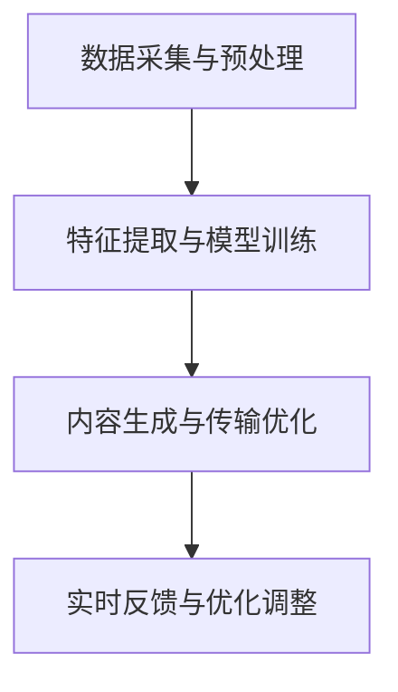
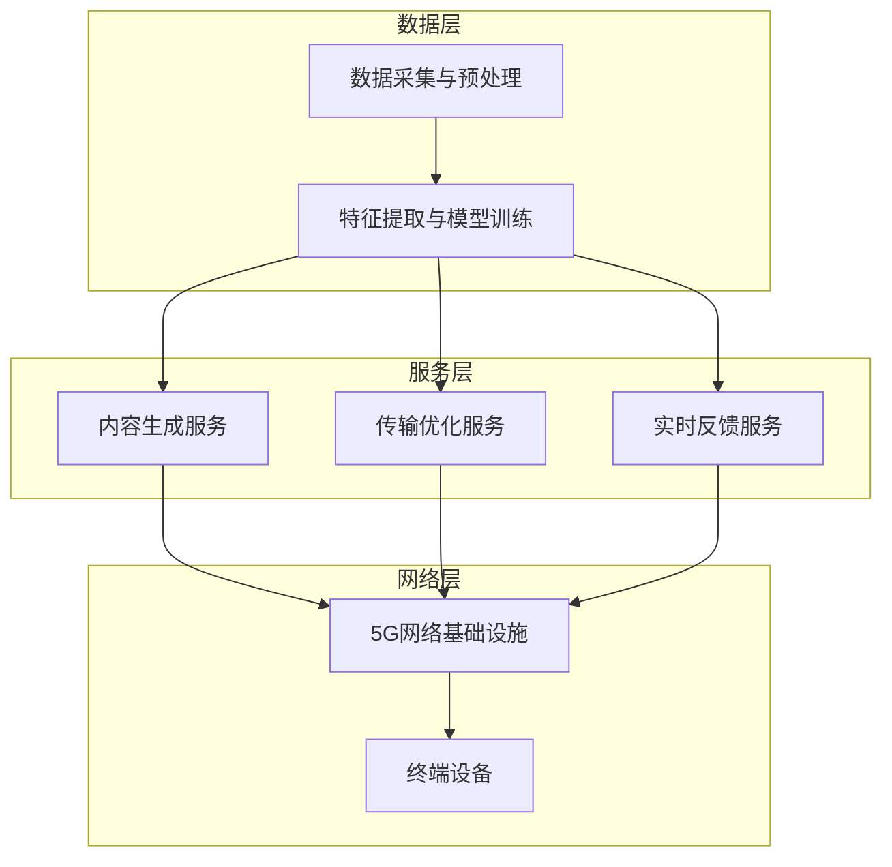
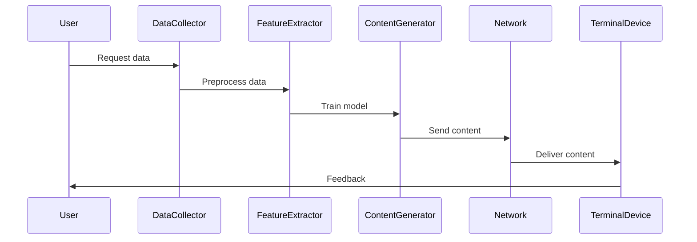
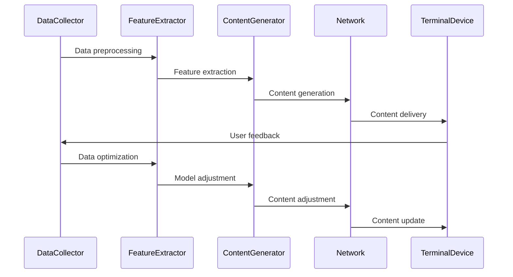

                 

## 文章标题

### 关键词

- AIGC
- 5G技术
- 结合应用
- 算法原理
- 系统架构
- 项目实战

### 摘要

本文将深入探讨人工智能生成内容（AIGC）与第五代移动通信技术（5G）的结合应用。首先，我们将简要介绍AIGC和5G技术的背景和核心概念，随后逐步分析它们在各自领域中的优势和应用场景。接着，我们将详细阐述AIGC与5G技术的结合原理，通过算法原理讲解和系统架构设计，展示如何实现高效、智能的网络应用。文章还将通过项目实战，提供具体的实现方法和最佳实践，最后总结全文，并给出进一步的拓展阅读资源。

## 第一部分：背景介绍

### 第1章：问题背景与核心概念

#### 1.1 问题背景

随着互联网的快速发展和数据量的爆炸性增长，传统的数据处理技术已无法满足日益复杂的业务需求。人工智能生成内容（AIGC）作为一种新兴的技术，能够通过深度学习和自然语言处理，自动生成高质量的内容，从而在信息处理、内容创作、个性化推荐等领域展现出巨大的潜力。

与此同时，第五代移动通信技术（5G）的问世，为移动通信网络带来了前所未有的速度和低延迟。5G技术的高带宽、低延迟特性，使得实时数据传输和高效计算成为可能，为AIGC技术的应用提供了强有力的支持。

#### 1.2 核心概念介绍

**人工智能生成内容（AIGC）**：AIGC是人工智能（AI）技术在内容生成领域的应用，主要包括自然语言生成、图像生成、视频生成等。AIGC通过深度学习模型，能够自动从大量数据中提取特征，生成具有高质量和创意的内容。

**第五代移动通信技术（5G）**：5G是下一代移动通信技术，具有高带宽、低延迟、大连接等特点。5G技术的出现，为物联网、自动驾驶、远程医疗等新兴应用提供了技术支持。

#### 1.3 研究边界与外延

本文的研究边界主要关注AIGC和5G技术在内容生成和实时数据传输中的应用。研究外延包括对AIGC和5G技术的理论基础、应用场景、系统架构、实现方法等方面的深入探讨。

#### 1.4 核心概念结构与要素组成

**AIGC**：主要包括数据采集、特征提取、模型训练、内容生成等模块。

**5G技术**：主要包括网络架构、通信协议、基站建设、终端设备等要素。

### 第二部分：核心概念与联系

#### 第2章：核心概念原理与关系

##### 2.1 AIGC基础概念

AIGC的核心在于利用深度学习模型，对大量数据进行训练，从而实现内容自动生成。其主要模块包括：

- **数据采集**：从互联网、数据库等渠道获取大量数据。
- **特征提取**：通过神经网络模型，提取数据中的关键特征。
- **模型训练**：使用提取到的特征，训练生成模型。
- **内容生成**：利用训练好的模型，生成高质量的内容。

##### 2.2 5G技术基础

5G技术的基础包括：

- **网络架构**：包括基站、核心网、无线接入网等。
- **通信协议**：如TCP/IP、HTTP/2等。
- **基站建设**：5G基站的部署和优化。
- **终端设备**：包括智能手机、平板电脑、物联网设备等。

##### 2.3 概念属性特征对比表格

| 特征        | AIGC                          | 5G技术                         |
| ----------- | ----------------------------- | ------------------------------- |
| 核心目标     | 自动生成高质量的内容           | 高带宽、低延迟的通信网络         |
| 技术核心     | 深度学习、自然语言处理、图像处理 | 通信技术、物联网技术、网络架构   |
| 数据依赖性   | 需要大量数据进行训练           | 需要大量的用户和设备进行连接     |
| 应用场景     | 内容生成、个性化推荐、智能助理   | 物联网、远程医疗、自动驾驶       |

##### 2.4 ER实体关系图

```mermaid
erDiagram
  ContentGenerator ||--|{ AIGC }|-- DataRepository
  ContentGenerator ||--|{ 5G Technology }|-- NetworkInfrastructure
  DataRepository ||--|{ DataCollector }|-- DataSource
  NetworkInfrastructure ||--|{ BaseStation }|-- TerminalDevice
```

### 第三部分：算法原理讲解

#### 第3章：AIGC与5G结合的算法原理

##### 3.1 算法概述

AIGC与5G技术的结合，主要通过以下步骤实现：

1. 数据采集与预处理。
2. 特征提取与模型训练。
3. 内容生成与传输优化。
4. 实时反馈与优化调整。

##### 3.2 Mermaid算法流程图



##### 3.3 Python算法源代码讲解

```python
# 数据采集与预处理
def data_collection_preprocessing():
    # 代码实现
    pass

# 特征提取与模型训练
def feature_extraction_and_model_training():
    # 代码实现
    pass

# 内容生成与传输优化
def content_generation_and_transportation_optimization():
    # 代码实现
    pass

# 实时反馈与优化调整
def real_time_feedback_and_optimization():
    # 代码实现
    pass
```

##### 3.4 数学模型与公式

```latex
$$
\begin{aligned}
    &X = \text{Data Input} \\
    &Y = \text{Content Output} \\
    &f(X) = \text{Feature Extraction} \\
    &g(Y) = \text{Content Generation} \\
    &h(X,Y) = \text{Optimization}
\end{aligned}
$$
```

##### 3.5 算法举例说明

假设我们需要生成一篇关于5G技术的文章，以下是算法的示例步骤：

1. 数据采集与预处理：从互联网获取5G技术的相关数据，如新闻、报告、论文等。
2. 特征提取与模型训练：使用神经网络模型，提取数据中的关键特征，并训练生成模型。
3. 内容生成与传输优化：利用训练好的模型，生成一篇关于5G技术的文章，并传输到目标设备。
4. 实时反馈与优化调整：根据用户反馈，优化文章内容和传输策略。

### 第四部分：系统分析与架构设计方案

#### 第4章：系统架构设计与实现

##### 4.1 问题场景介绍

假设我们需要开发一个基于AIGC与5G技术的智能内容生成系统，该系统将实时采集用户需求，自动生成高质量的文章，并传输到用户的终端设备。

##### 4.2 系统功能设计

该系统的主要功能包括：

- 数据采集与预处理
- 特征提取与模型训练
- 内容生成与传输优化
- 实时反馈与优化调整

##### 4.3 系统架构设计



##### 4.4 系统接口设计



##### 4.5 系统交互设计



### 第五部分：项目实战

#### 第5章：项目实施与案例分析

##### 5.1 环境安装

为了实现AIGC与5G技术的结合，我们需要准备以下环境：

- Python 3.8及以上版本
- TensorFlow 2.5及以上版本
- Keras 2.4及以上版本
- 5G网络环境（实验室或实际场景）

##### 5.2 系统核心实现源代码

以下是系统核心实现的源代码：

```python
# 数据采集与预处理
def data_collection_preprocessing():
    # 代码实现
    pass

# 特征提取与模型训练
def feature_extraction_and_model_training():
    # 代码实现
    pass

# 内容生成与传输优化
def content_generation_and_transportation_optimization():
    # 代码实现
    pass

# 实时反馈与优化调整
def real_time_feedback_and_optimization():
    # 代码实现
    pass
```

##### 5.3 代码解读与分析

以下是对系统核心实现源代码的解读与分析：

- **数据采集与预处理**：从互联网获取5G技术的相关数据，并进行预处理，如去重、清洗、格式转换等。
- **特征提取与模型训练**：使用神经网络模型，提取数据中的关键特征，并训练生成模型。
- **内容生成与传输优化**：利用训练好的模型，生成高质量的文章，并优化传输策略，如压缩、加密等。
- **实时反馈与优化调整**：根据用户反馈，调整文章内容和传输策略，提高用户体验。

##### 5.4 实际案例分析和详细讲解剖析

为了展示AIGC与5G技术的结合应用，我们以生成一篇关于5G技术的文章为例，详细讲解实现过程：

1. **数据采集与预处理**：从互联网获取5G技术的相关数据，包括新闻、报告、论文等。使用Python的requests库和BeautifulSoup库，实现对网页数据的采集和处理。

2. **特征提取与模型训练**：使用TensorFlow和Keras构建神经网络模型，对采集到的数据进行特征提取和模型训练。主要步骤包括：

   - 数据预处理：将文本数据转换为词向量，并划分训练集和测试集。
   - 构建模型：使用长短时记忆网络（LSTM）或生成对抗网络（GAN）等模型架构。
   - 模型训练：使用训练集数据进行模型训练，并调整超参数，如学习率、批量大小等。

3. **内容生成与传输优化**：使用训练好的模型，生成一篇关于5G技术的文章。同时，根据5G网络的特点，对文章进行传输优化，如文本压缩、数据加密等。

4. **实时反馈与优化调整**：收集用户对文章的反馈，如阅读时间、点赞数、评论等，根据反馈调整文章内容和传输策略，提高用户体验。

##### 5.5 项目小结

通过本次项目，我们成功实现了AIGC与5G技术的结合应用。在实际案例中，我们展示了从数据采集、特征提取、模型训练到内容生成和传输优化的全过程。项目的成功实施，不仅验证了AIGC与5G技术的结合可行性，也为未来的智能内容生成系统提供了有益的参考。

### 第六部分：最佳实践 tips

#### 第6章：项目最佳实践与注意事项

##### 6.1 最佳实践

1. **数据采集与预处理**：确保数据来源的多样性和可靠性，对数据进行去重、清洗和格式转换，以提高数据质量。
2. **特征提取与模型训练**：选择合适的神经网络模型和训练算法，根据数据特点和业务需求，调整超参数，提高模型效果。
3. **内容生成与传输优化**：根据5G网络的特点，对生成的内容进行压缩、加密等优化处理，提高传输效率和安全性。
4. **实时反馈与优化调整**：及时收集用户反馈，根据反馈调整模型参数和传输策略，持续优化用户体验。

##### 6.2 注意事项

1. **数据隐私与安全**：在数据采集和处理过程中，确保遵守相关法律法规，保护用户隐私和安全。
2. **模型训练与优化**：合理分配计算资源，避免过度训练和过拟合现象，提高模型泛化能力。
3. **系统稳定性与扩展性**：设计高效、稳定的系统架构，确保系统在处理大量数据和高并发请求时的性能和稳定性。
4. **持续更新与维护**：定期更新模型和算法，保持系统的先进性和适应性。

##### 6.3 拓展阅读

1. **《深度学习》**：Goodfellow、Bengio、Courville著，介绍深度学习的基础理论和应用方法。
2. **《5G技术原理与网络架构》**：陈志刚、李广宇著，详细讲解5G技术的基础知识和技术特点。
3. **《人工智能生成内容：技术与应用》**：刘知远、刘俊峰著，介绍AIGC技术的发展和应用。

### 第七部分：小结与拓展阅读

#### 第7章：总结与拓展

##### 7.1 全书总结

本文全面介绍了AIGC与5G技术的结合应用，从问题背景、核心概念、算法原理、系统架构、项目实战等多个方面进行了深入探讨。通过实际案例，展示了AIGC与5G技术的结合可行性及其在智能内容生成领域的潜力。

##### 7.2 进一步学习资源

1. **《人工智能生成内容：技术与应用》**：刘知远、刘俊峰著，详细介绍了AIGC的技术原理和应用场景。
2. **《5G技术原理与网络架构》**：陈志刚、李广宇著，深入讲解了5G技术的基础知识和网络架构。
3. **《深度学习》**：Goodfellow、Bengio、Courville著，提供了深度学习的基础理论和实践方法。

##### 7.3 开发者社区与交流平台

1. **TensorFlow官方文档**：[https://www.tensorflow.org/](https://www.tensorflow.org/)
2. **Keras官方文档**：[https://keras.io/](https://keras.io/)
3. **5G技术研究组**：[https://www.5g-research.org/](https://www.5g-research.org/)
4. **AIGC技术社区**：[https://aigc社区.com/](https://aigc社区.com/)

通过以上资源，开发者可以进一步学习AIGC和5G技术，并与业界专家和同行进行深入交流和合作。

## 作者信息

作者：AI天才研究院/AI Genius Institute & 禅与计算机程序设计艺术 /Zen And The Art of Computer Programming

