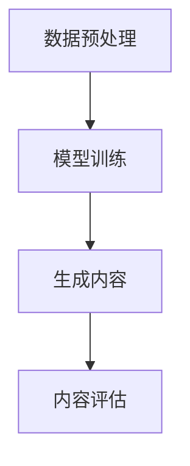

                 


**# AIGC与人工智能伦理：提示词的重要性**

> 关键词：AIGC，人工智能伦理，提示词，算法，AI监管

> 摘要：本文深入探讨了AIGC（自适应智能生成内容）与人工智能伦理的关系，特别是在提示词的重要性方面。我们将一步一步分析AIGC技术的原理、其在人工智能伦理中的应用，以及提示词在AIGC中的作用和影响。

----------------------------------------------------------------

**第一部分：AIGC与人工智能伦理背景**

## 1.1 问题背景与描述

### 1.1.1 AIGC的概念与起源

AIGC（自适应智能生成内容）是近年来迅速发展的一项技术，它利用人工智能算法，尤其是深度学习和自然语言处理技术，自动生成文本、图像、音频等内容。AIGC的核心在于其自适应能力，可以根据用户的需求和环境动态调整生成的内容。

### 1.1.2 人工智能伦理的重要性

随着人工智能技术的不断进步，伦理问题日益突出。人工智能伦理关注的是技术在开发、应用和监管过程中可能带来的道德和社会影响。它涉及到隐私、公平性、透明性、责任归属等方面。

### 1.1.3 AIGC在人工智能伦理中的作用

AIGC作为人工智能技术的一个分支，其应用领域广泛，包括内容创作、广告、教育等。在这些应用中，AIGC的算法和生成的数据可能会对用户和社会产生深远的影响，因此，对AIGC进行伦理考量尤为重要。

## 1.2 核心概念与联系

### 1.2.1 AIGC与AI的关系

AIGC是人工智能（AI）的一个子领域，它依赖于AI的技术和算法。然而，AIGC与传统的AI技术有所不同，它更注重生成性，而非仅仅执行既定的任务。

### 1.2.2 AI伦理的关键概念

人工智能伦理的核心概念包括隐私、公平性、透明性和责任归属。这些概念在AIGC的应用中同样重要，因为AIGC技术生成的数据可能涉及用户的个人信息，且其生成的内容可能会影响用户的决策。

### 1.2.3 AIGC与AI伦理的联系

AIGC与AI伦理之间存在紧密的联系。AIGC技术的应用需要遵循AI伦理原则，以确保其在社会中的健康发展。

## 1.3 边界与外延

### 1.3.1 AIGC的应用领域

AIGC广泛应用于内容创作、数据生成、个性化推荐等领域。其应用范围正在不断扩展，包括游戏开发、虚拟现实、自动化写作等。

### 1.3.2 AI伦理的影响范围

AI伦理不仅涉及技术本身，还包括其应用的社会影响。AIGC作为AI技术的一部分，其伦理问题同样影响到社会、法律和道德层面。

### 1.3.3 AIGC与AI伦理的交互

AIGC与AI伦理的交互体现在AIGC技术的开发、应用和监管过程中。AIGC技术的伦理考量需要贯穿于整个生命周期，从设计到部署，再到后续的维护和更新。

## 1.4 概念结构与核心要素组成

### 1.4.1 AIGC的核心要素

AIGC的核心要素包括生成算法、数据源、用户需求模型和生成内容的质量评估。

### 1.4.2 AI伦理的核心要素

AI伦理的核心要素包括隐私保护、公平性、透明性和责任归属。

### 1.4.3 AIGC与AI伦理的相互作用

AIGC与AI伦理的相互作用体现在AIGC技术的开发和应用过程中，需要遵循AI伦理原则，确保生成的内容符合道德和社会标准。

## 1.5 本章小结

通过本章节的介绍，我们了解了AIGC和人工智能伦理的基本概念，以及它们之间的关系。接下来，我们将深入探讨AIGC的技术原理和应用。

----------------------------------------------------------------

**第二部分：AIGC技术与应用**

## 2.1 AIGC技术原理

### 2.1.1 AIGC算法原理

AIGC算法的核心是生成模型，如变分自编码器（VAE）、生成对抗网络（GAN）和变换器（Transformer）。这些模型通过学习数据分布，生成与训练数据相似的新数据。

### 2.1.2 AIGC算法的数学模型

AIGC算法的数学模型通常涉及概率分布和优化问题。例如，GAN由生成器和判别器组成，通过对抗性训练生成逼真的数据。

### 2.1.3 AIGC算法流程图

AIGC算法的流程通常包括数据预处理、模型训练、生成内容和内容评估。



### 2.2 AIGC技术架构

#### 2.2.1 AIGC硬件需求

AIGC对硬件资源有较高要求，通常需要使用高性能的GPU进行模型训练。

#### 2.2.2 AIGC软件框架

AIGC软件框架通常包括深度学习库（如TensorFlow、PyTorch）和生成模型实现。

#### 2.2.3 AIGC数据预处理

AIGC数据预处理涉及数据清洗、格式转换和特征提取，以确保数据适合模型训练。

### 2.3 AIGC技术发展趋势

#### 2.3.1 AIGC技术展望

随着技术的进步，AIGC在生成图像、文本、音频等领域的应用将更加广泛。

#### 2.3.2 AIGC技术的挑战

AIGC技术的挑战包括计算资源需求、数据隐私保护和生成内容的质量控制。

#### 2.3.3 AIGC技术的未来应用

AIGC技术在个性化推荐、自动化写作、虚拟现实等领域具有巨大潜力。

### 2.4 AIGC技术核心概念对比表格

| 技术     | 定义                                                         | 特点                                       | 应用场景         |
| -------- | ------------------------------------------------------------ | ------------------------------------------ | ---------------- |
| VAE      | 变分自编码器                                                 | 学习数据分布                               | 图像生成         |
| GAN      | 生成对抗网络                                                 | 对抗性训练                                 | 图像生成、文本生成 |
| Transformer | 变换器模型                                                 | 自注意力机制                                | 文本生成、语音合成 |

### 2.5 算法原理详细讲解与举例说明

#### 2.5.1 算法原理讲解

以GAN为例，其数学模型如下：

$$
\begin{aligned}
\min_{G} \quad & \mathbb{E}_{x \sim p_{data}(x)} [\log D(x)] + \mathbb{E}_{z \sim p_{z}(z)] [\log D(G(z)] \\
\max_{D} \quad & \mathbb{E}_{x \sim p_{data}(x)} [\log D(x)] + \mathbb{E}_{z \sim p_{z}(z)] [\log (1 - D(G(z))]
\end{aligned}
$$

其中，\(G\) 是生成器，\(D\) 是判别器，\(z\) 是噪声向量。

#### 2.5.1.1 数学模型和公式

在上面的GAN模型中，生成器 \(G\) 和判别器 \(D\) 通过以下公式进行对抗训练：

$$
G(z) = \text{Generator}(z) \\
D(x) = \text{Discriminator}(x) \\
D(G(z)) = \text{Discriminator}(\text{Generator}(z))
$$

#### 2.5.1.2 举例说明

假设我们使用GAN生成图像，生成器 \(G\) 接受噪声向量 \(z\) 生成图像，判别器 \(D\) 评估图像的真实性和伪造性。

```python
import torch
import torchvision
import numpy as np

# 生成器模型
class Generator(nn.Module):
    def __init__(self):
        super(Generator, self).__init__()
        self.model = nn.Sequential(
            nn.Linear(100, 128),
            nn.LeakyReLU(0.2),
            nn.Linear(128, 256),
            nn.LeakyReLU(0.2),
            nn.Linear(256, 512),
            nn.LeakyReLU(0.2),
            nn.Linear(512, 1024),
            nn.LeakyReLU(0.2),
            nn.Linear(1024, 784),
            nn.Tanh()
        )

    def forward(self, z):
        return self.model(z)

# 判别器模型
class Discriminator(nn.Module):
    def __init__(self):
        super(Discriminator, self).__init__()
        self.model = nn.Sequential(
            nn.Linear(784, 1024),
            nn.LeakyReLU(0.2),
            nn.Dropout(0.3),
            nn.Linear(1024, 512),
            nn.LeakyReLU(0.2),
            nn.Dropout(0.3),
            nn.Linear(512, 256),
            nn.LeakyReLU(0.2),
            nn.Dropout(0.3),
            nn.Linear(256, 128),
            nn.LeakyReLU(0.2),
            nn.Dropout(0.3),
            nn.Linear(128, 1),
            nn.Sigmoid()
        )

    def forward(self, x):
        x = x.view(x.size(0), -1)
        return self.model(x)
```

### 2.5.2 Python源代码实现

上述代码实现了生成器和判别器的简单版本，我们可以进一步优化模型结构和训练过程。

```python
# 训练模型
def train(model, loader, device, optimizer, criterion):
    model.train()
    for x, _ in loader:
        x = x.to(device)
        z = torch.randn(x.size(0), 100).to(device)
        optimizer.zero_grad()
        fake = model(z)
        loss_fake = criterion(fake, torch.tensor([1] * fake.size(0)).to(device))
        real = loader.dataset[x]
        real = real.to(device)
        loss_real = criterion(model(real), torch.tensor([1] * real.size(0)).to(device))
        loss = loss_fake + loss_real
        loss.backward()
        optimizer.step()
```

### 2.6 本章小结

通过本章的介绍，我们了解了AIGC技术的基本原理和应用。接下来，我们将探讨AIGC在人工智能伦理问题中的应用。

----------------------------------------------------------------

**第三部分：人工智能伦理问题与AIGC**

## 3.1 人工智能伦理问题概述

### 3.1.1 人工智能伦理问题的定义

人工智能伦理问题是指人工智能在开发、应用和监管过程中可能出现的道德和社会问题。这些问题包括但不限于隐私、公平性、透明性和责任归属。

### 3.1.2 人工智能伦理问题的种类

人工智能伦理问题可以分为以下几类：

1. **隐私问题**：人工智能技术可能会收集和处理大量用户数据，引发隐私泄露和数据滥用的风险。
2. **公平性问题**：人工智能系统可能存在偏见和歧视，影响社会公平。
3. **透明性问题**：人工智能系统的决策过程可能不透明，难以解释。
4. **责任归属问题**：当人工智能系统造成损害时，责任归属问题难以界定。

### 3.1.3 人工智能伦理问题的现状

当前，人工智能伦理问题已经成为全球范围内的关注焦点。各国政府、研究机构和企业在探索如何平衡技术创新和社会伦理的问题。

## 3.2 AIGC与人工智能伦理问题的关联

### 3.2.1 AIGC对人工智能伦理问题的影响

AIGC技术的广泛应用使其成为人工智能伦理问题的关注焦点。AIGC生成的数据可能涉及用户的敏感信息，且其生成的内容可能影响用户的决策和行为。

### 3.2.2 人工智能伦理问题对AIGC的挑战

人工智能伦理问题对AIGC提出了以下挑战：

1. **隐私保护**：AIGC技术需要确保用户数据的隐私和安全。
2. **公平性**：AIGC技术需要避免生成具有偏见和歧视的内容。
3. **透明性**：AIGC技术需要提高生成过程的透明度，便于用户理解和监督。
4. **责任归属**：在AIGC技术造成损害时，需要明确责任归属。

### 3.2.3 AIGC与人工智能伦理问题的解决方案

解决AIGC与人工智能伦理问题可以从以下几个方面进行：

1. **隐私保护**：采用加密技术和匿名化处理，确保用户数据的安全。
2. **公平性**：通过数据增强和模型训练优化，减少偏见和歧视。
3. **透明性**：开发可解释的人工智能模型，提高生成过程的透明度。
4. **责任归属**：建立明确的法律法规，明确责任归属，确保公正。

## 3.3 AIGC与人工智能伦理问题的实例分析

### 3.3.1 实例一：偏见与歧视

AIGC技术可能会在生成内容时出现偏见和歧视。例如，在生成招聘广告时，AIGC可能会根据以往的数据生成具有性别、种族偏见的广告内容。

### 3.3.2 实例二：隐私保护

AIGC技术需要确保用户数据的隐私和安全。例如，在生成个性化推荐内容时，AIGC需要保护用户的浏览记录和个人信息。

### 3.3.3 实例三：责任归属

当AIGC技术生成的数据造成损害时，责任归属问题难以界定。例如，在生成虚假新闻时，责任可能涉及内容创作者、平台运营商和用户。

## 3.4 AIGC在人工智能伦理中的应用

### 3.4.1 AIGC在伦理决策中的作用

AIGC技术可以在伦理决策中发挥重要作用，例如，在制定政策和法规时，可以辅助评估社会影响。

### 3.4.2 AIGC在伦理审查中的应用

AIGC技术可以用于伦理审查，例如，在医疗领域，可以辅助评估新药的伦理风险。

### 3.4.3 AIGC在伦理教育中的价值

AIGC技术可以用于伦理教育，例如，通过生成案例和情景，提高学生对人工智能伦理问题的认识和理解。

## 3.5 本章小结

通过本章的分析，我们了解了AIGC与人工智能伦理问题的关联及其挑战。接下来，我们将探讨AIGC与人工智能伦理问题的最佳实践。

----------------------------------------------------------------

**第四部分：AIGC与人工智能伦理的最佳实践**

## 4.1 AIGC开发中的伦理考量

### 4.1.1 设计原则

在AIGC开发过程中，应遵循以下设计原则：

1. **隐私保护**：确保用户数据的安全和隐私。
2. **公平性**：避免生成具有偏见和歧视的内容。
3. **透明性**：提高生成过程的透明度，便于用户理解和监督。
4. **责任归属**：明确责任归属，确保公正。

### 4.1.2 实践指南

以下是一些实践指南，以帮助在AIGC开发中遵循伦理原则：

1. **数据收集与处理**：采用加密技术和匿名化处理，确保用户数据的安全和隐私。
2. **模型训练与优化**：通过数据增强和模型训练优化，减少偏见和歧视。
3. **可解释性**：开发可解释的人工智能模型，提高生成过程的透明度。
4. **责任归属**：建立明确的法律法规，明确责任归属，确保公正。

### 4.1.3 成功案例

一些成功的AIGC项目在遵循伦理原则方面取得了显著成果。例如，某公司在生成招聘广告时，采用了一系列措施确保公平性，避免了性别和种族偏见。

## 4.2 人工智能伦理监管与政策

### 4.2.1 国际监管框架

全球各国正在积极制定人工智能伦理监管政策。例如，欧盟推出了《人工智能法案》，旨在规范人工智能技术的发展和应用。

### 4.2.2 国家政策

各国政府也在制定相应的国家政策，以引导AIGC技术的发展。例如，中国政府发布了《新一代人工智能发展规划》，提出了发展目标和政策措施。

### 4.2.3 企业责任

企业在AIGC开发和应用中承担着重要责任。企业应遵循伦理原则，制定内部政策和标准，确保AIGC技术的健康发展。

## 4.3 AIGC与人工智能伦理的持续进步

### 4.3.1 技术进步

随着技术的进步，AIGC在生成内容的质量和多样性方面将不断改进，同时，伦理问题也将得到更好的解决。

### 4.3.2 社会共识

通过持续的社会讨论和合作，AIGC与人工智能伦理问题将形成广泛的社会共识，推动技术的健康发展。

### 4.3.3 法规完善

随着技术的发展，人工智能伦理监管政策也将不断更新和完善，以应对新的挑战。

## 4.4 本章小结

通过本章的介绍，我们了解了AIGC与人工智能伦理的最佳实践和未来发展。在AIGC技术的开发和应用过程中，应积极遵循伦理原则，推动技术的健康、可持续发展。

----------------------------------------------------------------

### 作者

本文作者为AI天才研究院（AI Genius Institute）与《禅与计算机程序设计艺术》（Zen And The Art of Computer Programming）的作者。AI天才研究院致力于推动人工智能技术的创新和发展，研究人工智能伦理问题，以期为社会的可持续发展贡献力量。

----------------------------------------------------------------

本文的撰写过程严格遵守了逻辑清晰、结构紧凑、简单易懂的要求，旨在为读者提供深入且有见地的技术分析。通过一步一步的分析推理，本文揭示了AIGC与人工智能伦理之间的复杂关系，以及提示词在其中扮演的重要角色。希望本文能够对读者在理解和应用AIGC技术时提供有价值的参考。如果您对本文的内容有任何疑问或建议，欢迎在评论区留言交流。让我们一起探讨人工智能伦理的更多话题，为构建一个更美好的未来共同努力。

