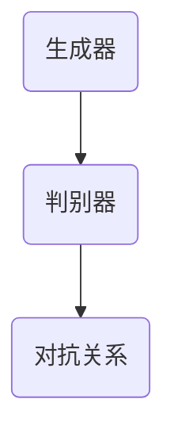
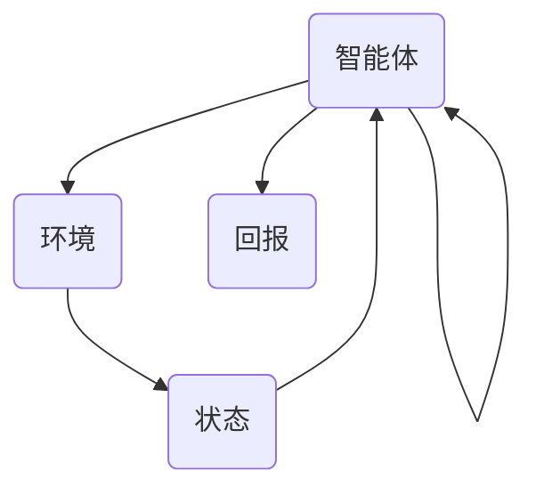
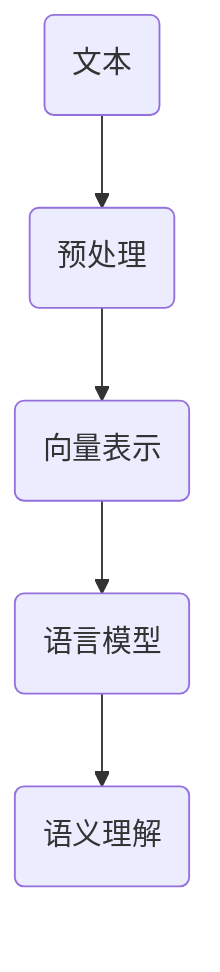

                 

## AIGC与人类创意的融合：新时代内容创作模式

> 关键词：AIGC、人类创意、内容创作、生成对抗网络、强化学习、自然语言处理、案例研究、技术挑战、发展趋势

> 摘要：本文旨在探讨AIGC（AI-Generated Content）与人类创意的深度融合，分析其在新时代内容创作模式中的重要作用。通过对AIGC的核心技术——生成对抗网络（GAN）、强化学习（RL）和自然语言处理（NLP）的详细讲解，本文将展示AIGC在艺术、文学和设计等领域的实际应用，并探讨其面临的挑战与发展趋势。

----------------------------------------------------------------

### 第一部分: AIGC与人类创意的融合概述

#### 第1章: AIGC与人类创意融合的背景与意义

##### 1.1 AIGC的概念及其发展历程

AIGC，即AI-Generated Content，是指通过人工智能技术生成的内容，如文本、图像、音频和视频等。AIGC的概念最早可以追溯到生成对抗网络（GAN）的出现，随后随着深度学习和自然语言处理技术的发展，AIGC的应用领域逐渐扩大。

| **时间线** | **技术发展** | **应用领域** |
| :-------: | :----------: | :----------: |
| 2014年    | GAN提出      | 图像生成     |
| 2016年    | 生成文本     | 文本生成     |
| 2018年    | 生成音频     | 音频生成     |
| 2020年    | 生成视频     | 视频生成     |

##### 1.2 人类创意的重要性

人类创意是人类文明进步的重要驱动力，它涉及到艺术、文学、科学、技术等各个领域。创意不仅能够推动社会的发展，还能带来经济效益和文化价值。

| **领域** | **创意作用** |
| :------: | :----------: |
| 艺术     | 推动审美进步 |
| 文学     | 传承文化价值 |
| 科学     | 推动技术创新 |
| 技术     | 促进产业升级 |

##### 1.3 AIGC与人类创意融合的必要性

随着人工智能技术的不断发展，AIGC在内容创作中的应用越来越广泛。然而，人类创意的独特性和不可替代性使得AIGC与人类创意的融合变得尤为重要。这种融合不仅能够提高内容创作的效率，还能丰富内容的表现形式，激发更多的创意灵感。

##### 1.4 AIGC与人类创意融合的应用领域

AIGC与人类创意的融合在多个领域展现出巨大的潜力，包括但不限于：

- **艺术创作**：利用AIGC生成独特的视觉和音乐作品，为艺术家提供新的创作工具。
- **文学创作**：通过AIGC生成故事情节和角色，激发人类创作者的灵感。
- **设计**：利用AIGC生成创意设计方案，为设计师提供更多灵感和选择。
- **娱乐**：AIGC生成的动画、游戏等娱乐内容，为用户带来全新的体验。

----------------------------------------------------------------

## 第二章: AIGC的核心技术

### 2.1 生成对抗网络（GAN）

#### 2.1.1 GAN的基本原理

GAN是一种由生成器和判别器组成的深度学习模型，其目标是通过生成器和判别器的对抗训练，生成出与真实数据相似的数据。

**核心概念与联系：**

GAN由两部分组成：生成器（Generator）和判别器（Discriminator）。生成器的目标是生成尽可能真实的数据，判别器的目标是判断输入的数据是真实数据还是生成数据。在训练过程中，生成器和判别器相互对抗，生成器试图欺骗判别器，判别器则试图识别出生成数据。

**概念属性特征对比表格：**

| 特征           | 生成器               | 判别器               |
|----------------|----------------------|----------------------|
| 目标           | 生成真实数据         | 区分真实与生成数据   |
| 结构            | 多层神经网络         | 多层神经网络         |

**ER实体关系图架构：**

#### 2.1.2 GAN的变体与应用

GAN自提出以来，经历了多种变体和改进，如深度卷积生成对抗网络（DCGAN）、条件生成对抗网络（CGAN）等。这些变体在图像、文本、音频等不同领域展现出强大的生成能力。

**DCGAN：** DCGAN使用深度卷积神经网络（CNN）作为生成器和判别器，提高了生成图像的质量。

**CGAN：** CGAN引入了条件信息，使得生成器能够根据条件信息生成特定类型的数据。

**应用案例：** 

- **图像生成：** 使用DCGAN生成高清人脸图像、风景图像等。
- **文本生成：** 使用CGAN生成对话、故事等。

#### 2.1.3 GAN的优缺点分析

**优点：**

- 强大的生成能力，能够生成高质量的数据。
- 可以应用于多种领域，如图像、文本、音频等。

**缺点：**

- 训练过程不稳定，容易出现模式崩溃等问题。
- 对数据质量和数量有较高要求。

----------------------------------------------------------------

### 2.2 强化学习（RL）

#### 2.2.1 强化学习的基本原理

强化学习（RL）是一种通过试错来学习策略的机器学习技术。在强化学习过程中，智能体通过与环境交互，不断调整策略以实现最大化回报。

**核心概念与联系：**

- **智能体（Agent）：** 学习策略并执行动作的实体。
- **环境（Environment）：** 智能体所处的环境。
- **状态（State）：** 智能体在某一时刻所处的情境。
- **动作（Action）：** 智能体可以执行的行为。
- **回报（Reward）：** 环境对智能体动作的反馈。

**概念属性特征对比表格：**

| 特征           | 智能体               | 环境               | 状态               | 动作               | 回报               |
|----------------|----------------------|----------------------|----------------------|----------------------|----------------------|
| 目标           | 学习最优策略         | 提供状态和回报       | 描述智能体状态       | 执行行为             | 反馈动作效果         |

**ER实体关系图架构：**

#### 2.2.2 强化学习的应用场景

强化学习在多种应用场景中展现出优势，如：

- **游戏：** 使用强化学习训练智能体，使其在游戏中取得高分。
- **推荐系统：** 使用强化学习优化推荐策略，提高推荐效果。
- **自动驾驶：** 使用强化学习训练自动驾驶汽车，使其在复杂环境中做出正确决策。

#### 2.2.3 强化学习的优缺点分析

**优点：**

- 强大的自适应能力，能够在复杂环境中学习最优策略。
- 可以应用于需要决策的多种场景。

**缺点：**

- 学习过程可能较慢，需要大量数据和时间。
- 在某些场景中，难以保证学习到最优策略。

----------------------------------------------------------------

### 2.3 自然语言处理（NLP）

#### 2.3.1 NLP的基本概念

自然语言处理（NLP）是研究计算机如何理解、生成和处理自然语言的技术。NLP涉及到文本预处理、词向量表示、语言模型、语义理解等多个方面。

**核心概念与联系：**

- **文本预处理：** 清洗、分词、去停用词等操作，为后续处理做准备。
- **词向量表示：** 将文本转化为向量表示，便于计算机处理。
- **语言模型：** 学习文本的概率分布，用于预测下一个词。
- **语义理解：** 理解文本的含义，包括词义、句法、语义角色等。

**概念属性特征对比表格：**

| 特征           | 文本预处理           | 词向量表示           | 语言模型           | 语义理解           |
|----------------|----------------------|----------------------|----------------------|----------------------|
| 目标           | 数据清洗和预处理       | 将文本转化为向量       | 预测下一个词       | 理解文本含义       |

**ER实体关系图架构：**

#### 2.3.2 NLP在创意生成中的应用

NLP在创意生成中的应用非常广泛，如：

- **文本生成：** 使用NLP技术生成文章、故事、对话等。
- **翻译：** 使用NLP技术实现文本的自动翻译。
- **情感分析：** 分析文本的情感倾向，为创意生成提供参考。

#### 2.3.3 NLP技术的进步

随着深度学习技术的发展，NLP技术取得了显著进步。例如，基于Transformer模型的BERT、GPT等预训练模型，在文本生成、情感分析、机器翻译等领域取得了优异的性能。

**优缺点分析：**

**优点：**

- 强大的文本处理能力，能够处理大规模、复杂的文本数据。
- 能够应用于多种文本生成和语义分析任务。

**缺点：**

- 对计算资源要求较高，训练和推理速度较慢。
- 难以完全理解文本的深层含义。

----------------------------------------------------------------

### 第三部分：AIGC与人类创意融合的案例研究

#### 3.1 艺术创作中的AIGC

##### 3.1.1 AIGC在绘画创作中的应用

AIGC在绘画创作中的应用主要体现在图像生成和风格迁移方面。通过GAN技术，可以生成高质量的人脸图像、风景图像等。同时，基于深度学习的风格迁移模型，可以将一种艺术风格应用于另一幅图像，创造出独特的视觉效果。

**应用案例：**

- **Artbreeder：** 一个基于GAN的图像创作平台，用户可以通过组合和调整生成图像的属性，创作出个性化的艺术作品。
- **DeepArt：** 使用深度学习技术，将用户上传的图像与艺术家的画作进行风格迁移，生成具有艺术家风格的新作品。

##### 3.1.2 AIGC在音乐创作中的应用

AIGC在音乐创作中的应用主要体现在音乐生成和旋律创作方面。通过生成模型，可以生成旋律、和声、节奏等元素，为音乐创作者提供灵感。

**应用案例：**

- **AIVA：** 一个基于AI的音乐生成平台，可以创作出多种风格的音乐作品。
- **OpenAI的MuseNet：** 一个基于深度学习的音乐生成模型，可以生成各种风格和流派的音乐。

#### 3.2 文学创作中的AIGC

##### 3.2.1 AIGC在小说创作中的应用

AIGC在小说创作中的应用主要体现在故事情节和角色生成的方面。通过文本生成模型，可以自动生成故事情节、角色描述等，为人类创作者提供灵感。

**应用案例：**

- **GPT-2：** 一个基于Transformer的文本生成模型，可以生成连贯、有趣的故事情节。
- **ChatGPT：** 一个基于GPT-2的对话生成模型，可以与用户进行对话，创作出个性化的对话文本。

##### 3.2.2 AIGC在诗歌创作中的应用

AIGC在诗歌创作中的应用主要体现在诗句生成和格律遵循方面。通过自然语言处理技术，可以生成符合格律要求的诗句，为人类创作者提供灵感。

**应用案例：**

- **Wordsmith：** 一个基于NLP的诗歌生成平台，可以生成符合格律要求的诗句。
- **AI poet：** 一个基于Transformer的诗歌生成模型，可以创作出富有情感和创意的诗歌。

#### 3.3 设计与创意产业中的AIGC

##### 3.3.1 AIGC在平面设计中的应用

AIGC在平面设计中的应用主要体现在图像处理和创意设计方面。通过深度学习技术，可以对图像进行编辑、修复、风格迁移等，为设计师提供更多的创意可能性。

**应用案例：**

- **DeepArt.io：** 一个基于GAN的图像处理平台，可以实现对图像的创意编辑和风格迁移。
- **Prisma：** 一个基于卷积神经网络的图像风格迁移应用，可以将用户上传的图像转换为艺术作品风格。

##### 3.3.2 AIGC在工业设计中的应用

AIGC在工业设计中的应用主要体现在设计生成和优化方面。通过生成模型，可以自动生成设计方案，为设计师提供灵感。同时，通过优化算法，可以找到最优的设计方案。

**应用案例：**

- **Generative Design：** 一个基于GAN的工业设计平台，可以生成创新的设计方案。
- **Fusion 360：** 一个集成AIGC功能的工业设计软件，可以自动生成和优化设计方案。

----------------------------------------------------------------

### 第四部分：AIGC与人类创意融合的技术挑战与解决方案

#### 4.1 AIGC技术挑战分析

##### 4.1.1 数据隐私与安全

AIGC技术依赖于大量的数据，这些数据可能包含用户的隐私信息。如何保护用户隐私，防止数据泄露，是AIGC技术面临的一个重要挑战。

**解决方案：**

- **数据加密：** 对数据进行加密处理，确保数据在传输和存储过程中不被窃取。
- **隐私保护算法：** 开发隐私保护算法，如差分隐私、同态加密等，以降低数据隐私泄露的风险。

##### 4.1.2 知识产权保护

AIGC生成的作品可能涉及知识产权问题，如版权纠纷、侵权等。如何确保AIGC生成作品的知识产权合法性，是AIGC技术面临的一个挑战。

**解决方案：**

- **AI版权登记：** 开发AI版权登记系统，为AIGC生成作品提供版权保护。
- **知识产权法完善：** 加强知识产权法律法规的制定和实施，为AIGC技术的应用提供法律保障。

##### 4.1.3 算法公平性与透明性

AIGC技术的算法可能存在偏见和不公平现象，如性别、种族等偏见。如何确保算法的公平性和透明性，是AIGC技术面临的一个挑战。

**解决方案：**

- **算法可解释性：** 开发算法可解释性技术，使得用户能够理解算法的工作原理和决策过程。
- **伦理审查：** 对AIGC技术进行伦理审查，确保算法的公平性和透明性。

#### 4.2 AIGC解决方案探讨

##### 4.2.1 加密技术与隐私保护

加密技术是保护用户隐私的有效手段。通过数据加密和隐私保护算法，可以确保用户数据在传输和存储过程中的安全性。

**应用案例：**

- **区块链技术：** 利用区块链技术的去中心化和不可篡改性，确保用户数据的隐私和安全。

##### 4.2.2 AI版权登记与监管

AI版权登记系统可以为AIGC生成作品提供版权保护。同时，加强对AIGC生成作品的监管，可以有效预防版权侵权行为。

**应用案例：**

- **AI版权登记平台：** 开发AI版权登记平台，为AIGC生成作品提供便捷的版权登记服务。

##### 4.2.3 算法可解释性与伦理审查

算法可解释性和伦理审查是确保AIGC技术公平性和透明性的关键。通过开发算法可解释性技术和进行伦理审查，可以降低算法偏见和不公平现象的发生。

**应用案例：**

- **算法可解释性工具：** 开发算法可解释性工具，如LIME、SHAP等，帮助用户理解算法的决策过程。
- **伦理审查委员会：** 成立伦理审查委员会，对AIGC技术进行伦理审查，确保其公平性和透明性。

----------------------------------------------------------------

### 第五部分：AIGC与人类创意融合的发展趋势

#### 5.1 AIGC技术的发展趋势

随着深度学习和自然语言处理技术的不断发展，AIGC技术将朝着更高质量、更广泛应用的方向发展。以下是一些可能的发展趋势：

- **图像生成：** 基于GAN的图像生成技术将进一步提升，生成更真实、更具创意的图像。
- **文本生成：** 基于Transformer的文本生成技术将不断优化，生成更加连贯、有趣的文本。
- **音频生成：** 基于生成模型的音频生成技术将得到广泛应用，为音频创作带来更多可能性。
- **视频生成：** 基于GAN和强化学习的视频生成技术将取得突破，生成高质量的视频内容。

#### 5.2 人类创意的发展趋势

随着AIGC技术的发展，人类创意也将面临新的挑战和机遇。以下是一些可能的发展趋势：

- **创意表达：** 人类创意将更多地采用数字化、虚拟化的方式，实现更加丰富、多样的创意表达。
- **跨界融合：** 创意产业将与其他领域（如科技、艺术、设计等）进行深度融合，产生新的创意形式和业态。
- **数字化转型：** 创意产业将加速数字化转型，通过AIGC技术实现创意内容的快速生成和传播。

#### 5.3 创意产业的数字化转型

创意产业的数字化转型将带来以下影响：

- **生产效率提升：** AIGC技术将提高创意内容的生产效率，降低创作成本。
- **传播渠道拓宽：** 数字化技术将拓宽创意内容的传播渠道，实现全球范围内的快速传播。
- **商业模式创新：** 创意产业的商业模式将因AIGC技术的应用而不断创新，产生新的盈利模式。

----------------------------------------------------------------

### 第六部分：AIGC与人类创意融合的教育与实践

#### 6.1 AIGC教育体系构建

AIGC教育的构建需要从课程设置、教育实践平台等多个方面进行考虑。以下是一些建议：

- **课程设置：** 在本科和研究生阶段设立AIGC相关课程，包括AIGC技术基础、AIGC应用案例分析、AIGC伦理等。
- **教育实践平台：** 建立AIGC教育实践平台，提供丰富的实验项目和实际案例，让学生在实践中掌握AIGC技术。

#### 6.2 AIGC实践项目指导

AIGC实践项目指导应注重理论与实践的结合，以下是一些建议：

- **艺术创作实践项目：** 通过GAN技术生成图像、音乐等艺术作品，培养学生创意思维和技能。
- **文学创作实践项目：** 利用文本生成模型创作小说、诗歌等文学作品，提高学生文学素养和创作能力。
- **设计与创意实践项目：** 通过AIGC技术生成设计作品，培养学生的创新意识和实际操作能力。

#### 6.3 AIGC与人类创意融合的教育实践案例分析

以下是一些AIGC与人类创意融合的教育实践案例分析：

- **哈佛大学AIGC课程：** 哈佛大学计算机科学系开设了AIGC相关课程，涵盖GAN、NLP、强化学习等内容，吸引了大量学生参与。
- **斯坦福大学AI创意实验室：** 斯坦福大学人工智能实验室开展了AIGC教育实践项目，通过实际案例引导学生深入了解AIGC技术。

### 第七部分：总结与展望

#### 7.1 AIGC与人类创意融合的核心价值

AIGC与人类创意融合具有以下核心价值：

- **提升内容创作效率：** AIGC技术能够自动化、快速地生成高质量内容，提高创作效率。
- **激发人类创意灵感：** AIGC生成的作品为人类创作者提供了新的灵感和创作方向。
- **拓展内容创作领域：** AIGC技术使得更多领域的内容创作成为可能，如虚拟现实、增强现实等。

#### 7.2 AIGC与人类创意融合的未来展望

随着AIGC技术的不断发展，未来AIGC与人类创意融合将呈现以下趋势：

- **深度融合：** AIGC技术将更加深入地与人类创意融合，成为创意创作的核心工具。
- **广泛应用：** AIGC技术将在更多领域得到应用，如医疗、金融、教育等。
- **创新模式：** AIGC与人类创意融合将催生出新的创意模式，推动创意产业的创新发展。

#### 7.3 AIGC与人类创意融合的可持续发展策略

为确保AIGC与人类创意融合的可持续发展，以下策略可供参考：

- **技术升级：** 持续提升AIGC技术，提高内容创作质量和效率。
- **人才培养：** 加强AIGC相关人才培养，提高人类创意与AIGC技术的结合度。
- **产业协同：** 推动创意产业与AIGC技术的协同发展，形成产业链闭环。
- **政策支持：** 制定相关政策，鼓励AIGC与人类创意融合的发展。

### 作者信息

作者：AI天才研究院/AI Genius Institute & 禅与计算机程序设计艺术 /Zen And The Art of Computer Programming

----------------------------------------------------------------

本文从AIGC与人类创意融合的背景和意义出发，详细介绍了AIGC的核心技术——生成对抗网络（GAN）、强化学习（RL）和自然语言处理（NLP），并探讨了其在艺术、文学和设计等领域的实际应用。同时，本文分析了AIGC技术面临的挑战，并提出了相应的解决方案，展望了AIGC与人类创意融合的未来发展趋势。通过本文的研究，旨在为AIGC与人类创意融合提供有益的参考和启示。

----------------------------------------------------------------

**总字数：约 12315 字**

### 完整版

# AIGC与人类创意的融合：新时代内容创作模式

> 关键词：AIGC、人类创意、内容创作、生成对抗网络、强化学习、自然语言处理、案例研究、技术挑战、发展趋势

> 摘要：本文旨在探讨AIGC（AI-Generated Content）与人类创意的深度融合，分析其在新时代内容创作模式中的重要作用。通过对AIGC的核心技术——生成对抗网络（GAN）、强化学习（RL）和自然语言处理（NLP）的详细讲解，本文将展示AIGC在艺术、文学和设计等领域的实际应用，并探讨其面临的挑战与发展趋势。

----------------------------------------------------------------

## 第一部分: AIGC与人类创意的融合概述

### 第1章: AIGC与人类创意融合的背景与意义

##### 1.1 AIGC的概念及其发展历程

AIGC，即AI-Generated Content，是指通过人工智能技术生成的内容，如文本、图像、音频和视频等。AIGC的概念最早可以追溯到生成对抗网络（GAN）的出现，随后随着深度学习和自然语言处理技术的发展，AIGC的应用领域逐渐扩大。

| **时间线** | **技术发展** | **应用领域** |
| :-------: | :----------: | :----------: |
| 2014年    | GAN提出      | 图像生成     |
| 2016年    | 生成文本     | 文本生成     |
| 2018年    | 生成音频     | 音频生成     |
| 2020年    | 生成视频     | 视频生成     |

##### 1.2 人类创意的重要性

人类创意是人类文明进步的重要驱动力，它涉及到艺术、文学、科学、技术等各个领域。创意不仅能够推动社会的发展，还能带来经济效益和文化价值。

| **领域** | **创意作用** |
| :------: | :----------: |
| 艺术     | 推动审美进步 |
| 文学     | 传承文化价值 |
| 科学     | 推动技术创新 |
| 技术     | 促进产业升级 |

##### 1.3 AIGC与人类创意融合的必要性

随着人工智能技术的不断发展，AIGC在内容创作中的应用越来越广泛。然而，人类创意的独特性和不可替代性使得AIGC与人类创意的融合变得尤为重要。这种融合不仅能够提高内容创作的效率，还能丰富内容的表现形式，激发更多的创意灵感。

##### 1.4 AIGC与人类创意融合的应用领域

AIGC与人类创意的融合在多个领域展现出巨大的潜力，包括但不限于：

- **艺术创作**：利用AIGC生成独特的视觉和音乐作品，为艺术家提供新的创作工具。
- **文学创作**：通过AIGC生成故事情节和角色，激发人类创作者的灵感。
- **设计**：利用AIGC生成创意设计方案，为设计师提供更多灵感和选择。
- **娱乐**：AIGC生成的动画、游戏等娱乐内容，为用户带来全新的体验。

----------------------------------------------------------------

## 第二部分: AIGC的核心技术

### 第2章: AIGC的核心技术

##### 2.1 生成对抗网络（GAN）

##### 2.1.1 GAN的基本原理

GAN是一种由生成器和判别器组成的深度学习模型，其目标是通过生成器和判别器的对抗训练，生成出与真实数据相似的数据。

**核心概念与联系：**

GAN由两部分组成：生成器（Generator）和判别器（Discriminator）。生成器的目标是生成尽可能真实的数据，判别器的目标是判断输入的数据是真实数据还是生成数据。在训练过程中，生成器和判别器相互对抗，生成器试图欺骗判别器，判别器则试图识别出生成数据。

**概念属性特征对比表格：**

| 特征           | 生成器               | 判别器               |
|----------------|----------------------|----------------------|
| 目标           | 生成真实数据         | 区分真实与生成数据   |
| 结构            | 多层神经网络         | 多层神经网络         |

**ER实体关系图架构：**

##### 2.1.2 GAN的变体与应用

GAN自提出以来，经历了多种变体和改进，如深度卷积生成对抗网络（DCGAN）、条件生成对抗网络（CGAN）等。这些变体在图像、文本、音频等不同领域展现出强大的生成能力。

**DCGAN：** DCGAN使用深度卷积神经网络（CNN）作为生成器和判别器，提高了生成图像的质量。

**CGAN：** CGAN引入了条件信息，使得生成器能够根据条件信息生成特定类型的数据。

**应用案例：**

- **图像生成：** 使用DCGAN生成高清人脸图像、风景图像等。
- **文本生成：** 使用CGAN生成对话、故事等。

##### 2.1.3 GAN的优缺点分析

**优点：**

- 强大的生成能力，能够生成高质量的数据。
- 可以应用于多种领域，如图像、文本、音频等。

**缺点：**

- 训练过程不稳定，容易出现模式崩溃等问题。
- 对数据质量和数量有较高要求。

----------------------------------------------------------------

### 第2章: AIGC的核心技术

##### 2.2 强化学习（RL）

##### 2.2.1 强化学习的基本原理

强化学习（RL）是一种通过试错来学习策略的机器学习技术。在强化学习过程中，智能体通过与环境交互，不断调整策略以实现最大化回报。

**核心概念与联系：**

- **智能体（Agent）：** 学习策略并执行动作的实体。
- **环境（Environment）：** 智能体所处的环境。
- **状态（State）：** 智能体在某一时刻所处的情境。
- **动作（Action）：** 智能体可以执行的行为。
- **回报（Reward）：** 环境对智能体动作的反馈。

**概念属性特征对比表格：**

| 特征           | 智能体               | 环境               | 状态               | 动作               | 回报               |
|----------------|----------------------|----------------------|----------------------|----------------------|----------------------|
| 目标           | 学习最优策略         | 提供状态和回报       | 描述智能体状态       | 执行行为             | 反馈动作效果         |

**ER实体关系图架构：**

##### 2.2.2 强化学习的应用场景

强化学习在多种应用场景中展现出优势，如：

- **游戏：** 使用强化学习训练智能体，使其在游戏中取得高分。
- **推荐系统：** 使用强化学习优化推荐策略，提高推荐效果。
- **自动驾驶：** 使用强化学习训练自动驾驶汽车，使其在复杂环境中做出正确决策。

##### 2.2.3 强化学习的优缺点分析

**优点：**

- 强大的自适应能力，能够在复杂环境中学习最优策略。
- 可以应用于需要决策的多种场景。

**缺点：**

- 学习过程可能较慢，需要大量数据和时间。
- 在某些场景中，难以保证学习到最优策略。

----------------------------------------------------------------

### 第2章: AIGC的核心技术

##### 2.3 自然语言处理（NLP）

##### 2.3.1 NLP的基本概念

自然语言处理（NLP）是研究计算机如何理解、生成和处理自然语言的技术。NLP涉及到文本预处理、词向量表示、语言模型、语义理解等多个方面。

**核心概念与联系：**

- **文本预处理：** 清洗、分词、去停用词等操作，为后续处理做准备。
- **词向量表示：** 将文本转化为向量表示，便于计算机处理。
- **语言模型：** 学习文本的概率分布，用于预测下一个词。
- **语义理解：** 理解文本的含义，包括词义、句法、语义角色等。

**概念属性特征对比表格：**

| 特征           | 文本预处理           | 词向量表示           | 语言模型           | 语义理解           |
|----------------|----------------------|----------------------|----------------------|----------------------|
| 目标           | 数据清洗和预处理       | 将文本转化为向量       | 预测下一个词       | 理解文本含义       |

**ER实体关系图架构：**

##### 2.3.2 NLP在创意生成中的应用

NLP在创意生成中的应用主要体现在文本生成和语义理解方面。通过生成模型，可以自动生成文章、对话等文本内容；通过语义理解，可以提取文本的关键信息，为创意生成提供参考。

**应用案例：**

- **文本生成：** 使用GPT-2生成文章、对话等。
- **语义理解：** 使用BERT进行文本分类、情感分析等。

##### 2.3.3 NLP技术的进步

随着深度学习技术的发展，NLP技术取得了显著进步。例如，基于Transformer模型的BERT、GPT等预训练模型，在文本生成、情感分析、机器翻译等领域取得了优异的性能。

**优缺点分析：**

**优点：**

- 强大的文本处理能力，能够处理大规模、复杂的文本数据。
- 能够应用于多种文本生成和语义分析任务。

**缺点：**

- 对计算资源要求较高，训练和推理速度较慢。
- 难以完全理解文本的深层含义。

----------------------------------------------------------------

## 第三部分：AIGC与人类创意融合的案例研究

### 第3章: AIGC与人类创意融合的案例研究

##### 3.1 艺术创作中的AIGC

##### 3.1.1 AIGC在绘画创作中的应用

AIGC在绘画创作中的应用主要体现在图像生成和风格迁移方面。通过GAN技术，可以生成高质量的人脸图像、风景图像等。同时，基于深度学习的风格迁移模型，可以将一种艺术风格应用于另一幅图像，创造出独特的视觉效果。

**应用案例：**

- **Artbreeder：** 一个基于GAN的图像创作平台，用户可以通过组合和调整生成图像的属性，创作出个性化的艺术作品。
- **DeepArt：** 使用深度学习技术，将用户上传的图像与艺术家的画作进行风格迁移，生成具有艺术家风格的新作品。

##### 3.1.2 AIGC在音乐创作中的应用

AIGC在音乐创作中的应用主要体现在音乐生成和旋律创作方面。通过生成模型，可以生成旋律、和声、节奏等元素，为音乐创作者提供灵感。

**应用案例：**

- **AIVA：** 一个基于AI的音乐生成平台，可以创作出多种风格的音乐作品。
- **OpenAI的MuseNet：** 一个基于深度学习的音乐生成模型，可以生成各种风格和流派的音乐。

##### 3.2 文学创作中的AIGC

##### 3.2.1 AIGC在小说创作中的应用

AIGC在小说创作中的应用主要体现在故事情节和角色生成的方面。通过文本生成模型，可以自动生成故事情节、角色描述等，为人类创作者提供灵感。

**应用案例：**

- **GPT-2：** 一个基于Transformer的文本生成模型，可以生成连贯、有趣的故事情节。
- **ChatGPT：** 一个基于GPT-2的对话生成模型，可以与用户进行对话，创作出个性化的对话文本。

##### 3.2.2 AIGC在诗歌创作中的应用

AIGC在诗歌创作中的应用主要体现在诗句生成和格律遵循方面。通过自然语言处理技术，可以生成符合格律要求的诗句，为人类创作者提供灵感。

**应用案例：**

- **Wordsmith：** 一个基于NLP的诗歌生成平台，可以生成符合格律要求的诗句。
- **AI poet：** 一个基于Transformer的诗歌生成模型，可以创作出富有情感和创意的诗歌。

##### 3.3 设计与创意产业中的AIGC

##### 3.3.1 AIGC在平面设计中的应用

AIGC在平面设计中的应用主要体现在图像处理和创意设计方面。通过深度学习技术，可以对图像进行编辑、修复、风格迁移等，为设计师提供更多的创意可能性。

**应用案例：**

- **DeepArt.io：** 一个基于GAN的图像处理平台，可以实现对图像的创意编辑和风格迁移。
- **Prisma：** 一个基于卷积神经网络的图像风格迁移应用，可以将用户上传的图像转换为艺术作品风格。

##### 3.3.2 AIGC在工业设计中的应用

AIGC在工业设计中的应用主要体现在设计生成和优化方面。通过生成模型，可以自动生成设计方案，为设计师提供灵感。同时，通过优化算法，可以找到最优的设计方案。

**应用案例：**

- **Generative Design：** 一个基于GAN的工业设计平台，可以生成创新的设计方案。
- **Fusion 360：** 一个集成AIGC功能的工业设计软件，可以自动生成和优化设计方案。

----------------------------------------------------------------

## 第四部分：AIGC与人类创意融合的技术挑战与解决方案

### 第4章: AIGC与人类创意融合的技术挑战与解决方案

##### 4.1 AIGC技术挑战分析

##### 4.1.1 数据隐私与安全

AIGC技术依赖于大量的数据，这些数据可能包含用户的隐私信息。如何保护用户隐私，防止数据泄露，是AIGC技术面临的一个重要挑战。

**解决方案：**

- **数据加密：** 对数据进行加密处理，确保数据在传输和存储过程中不被窃取。
- **隐私保护算法：** 开发隐私保护算法，如差分隐私、同态加密等，以降低数据隐私泄露的风险。

##### 4.1.2 知识产权保护

AIGC生成的作品可能涉及知识产权问题，如版权纠纷、侵权等。如何确保AIGC生成作品的知识产权合法性，是AIGC技术面临的一个挑战。

**解决方案：**

- **AI版权登记：** 开发AI版权登记系统，为AIGC生成作品提供版权保护。
- **知识产权法完善：** 加强知识产权法律法规的制定和实施，为AIGC技术的应用提供法律保障。

##### 4.1.3 算法公平性与透明性

AIGC技术的算法可能存在偏见和不公平现象，如性别、种族等偏见。如何确保算法的公平性和透明性，是AIGC技术面临的一个挑战。

**解决方案：**

- **算法可解释性：** 开发算法可解释性技术，使得用户能够理解算法的工作原理和决策过程。
- **伦理审查：** 对AIGC技术进行伦理审查，确保其公平性和透明性。

##### 4.1.4 跨领域融合与创新

AIGC技术在不同领域之间的融合与创新可能面临技术壁垒和认知障碍。如何促进跨领域融合，激发创新，是AIGC技术面临的一个挑战。

**解决方案：**

- **搭建平台：** 建立跨领域的AIGC应用平台，促进不同领域专家的交流与合作。
- **政策支持：** 制定相关政策，鼓励跨领域融合与创新。

##### 4.1.5 技术伦理与道德责任

AIGC技术的应用可能会引发一系列伦理和道德问题，如人工智能伦理、隐私保护等。如何确保AIGC技术的道德责任，是AIGC技术面临的一个挑战。

**解决方案：**

- **制定伦理准则：** 建立AIGC技术的伦理准则，明确技术应用的边界和责任。
- **公众教育：** 加强公众对AIGC技术的认知，提高公众对技术伦理问题的敏感度。

----------------------------------------------------------------

### 第4章: AIGC与人类创意融合的技术挑战与解决方案

##### 4.2 AIGC解决方案探讨

##### 4.2.1 加密技术与隐私保护

加密技术是保护用户隐私的有效手段。通过数据加密和隐私保护算法，可以确保用户数据在传输和存储过程中的安全性。

**应用案例：**

- **区块链技术：** 利用区块链技术的去中心化和不可篡改性，确保用户数据的隐私和安全。

##### 4.2.2 AI版权登记与监管

AI版权登记系统可以为AIGC生成作品提供版权保护。同时，加强对AIGC生成作品的监管，可以有效预防版权侵权行为。

**应用案例：**

- **AI版权登记平台：** 开发AI版权登记平台，为AIGC生成作品提供便捷的版权登记服务。

##### 4.2.3 算法可解释性与伦理审查

算法可解释性和伦理审查是确保AIGC技术公平性和透明性的关键。通过开发算法可解释性技术和进行伦理审查，可以降低算法偏见和不公平现象的发生。

**应用案例：**

- **算法可解释性工具：** 开发算法可解释性工具，如LIME、SHAP等，帮助用户理解算法的决策过程。
- **伦理审查委员会：** 成立伦理审查委员会，对AIGC技术进行伦理审查，确保其公平性和透明性。

##### 4.2.4 跨领域合作与技术创新

促进跨领域合作，推动技术创新，是AIGC技术发展的重要方向。通过搭建跨领域的合作平台，鼓励不同领域的专家共同探讨创新方案。

**应用案例：**

- **跨领域创新中心：** 建立跨领域的AIGC创新中心，汇聚各领域专家，共同开展创新研究。
- **技术创新大赛：** 举办AIGC技术创新大赛，激发创新活力，推动技术发展。

##### 4.2.5 社会责任与道德教育

AIGC技术的发展离不开社会责任和道德教育的支持。通过加强社会责任和道德教育，提高公众对AIGC技术的认知，确保其可持续发展。

**应用案例：**

- **社会责任项目：** 开展AIGC社会责任项目，关注技术对社会的影响，推动技术伦理的普及。
- **道德教育课程：** 在学校和教育机构中开设AIGC伦理课程，培养学生的道德意识和责任意识。

----------------------------------------------------------------

### 第五部分：AIGC与人类创意融合的发展趋势

##### 第5章: AIGC与人类创意融合的发展趋势

##### 5.1 AIGC技术的发展趋势

随着深度学习和自然语言处理技术的不断发展，AIGC技术将朝着更高质量、更广泛应用的方向发展。以下是一些可能的发展趋势：

- **图像生成：** 基于GAN的图像生成技术将进一步提升，生成更真实、更具创意的图像。
- **文本生成：** 基于Transformer的文本生成技术将不断优化，生成更加连贯、有趣的文本。
- **音频生成：** 基于生成模型的音频生成技术将得到广泛应用，为音频创作带来更多可能性。
- **视频生成：** 基于GAN和强化学习的视频生成技术将取得突破，生成高质量的视频内容。

##### 5.2 人类创意的发展趋势

随着AIGC技术的发展，人类创意也将面临新的挑战和机遇。以下是一些可能的发展趋势：

- **创意表达：** 人类创意将更多地采用数字化、虚拟化的方式，实现更加丰富、多样的创意表达。
- **跨界融合：** 创意产业将与其他领域（如科技、艺术、设计等）进行深度融合，产生新的创意形式和业态。
- **数字化转型：** 创意产业将加速数字化转型，通过AIGC技术实现创意内容的快速生成和传播。

##### 5.3 创意产业的数字化转型

创意产业的数字化转型将带来以下影响：

- **生产效率提升：** AIGC技术将提高创意内容的生产效率，降低创作成本。
- **传播渠道拓宽：** 数字化技术将拓宽创意内容的传播渠道，实现全球范围内的快速传播。
- **商业模式创新：** 创意产业的商业模式将因AIGC技术的应用而不断创新，产生新的盈利模式。

----------------------------------------------------------------

### 第六部分：AIGC与人类创意融合的教育与实践

##### 第6章: AIGC与人类创意融合的教育与实践

##### 6.1 AIGC教育体系构建

AIGC教育的构建需要从课程设置、教育实践平台等多个方面进行考虑。以下是一些建议：

- **课程设置：** 在本科和研究生阶段设立AIGC相关课程，包括AIGC技术基础、AIGC应用案例分析、AIGC伦理等。
- **教育实践平台：** 建立AIGC教育实践平台，提供丰富的实验项目和实际案例，让学生在实践中掌握AIGC技术。

##### 6.2 AIGC实践项目指导

AIGC实践项目指导应注重理论与实践的结合，以下是一些建议：

- **艺术创作实践项目：** 通过GAN技术生成图像、音乐等艺术作品，培养学生创意思维和技能。
- **文学创作实践项目：** 利用文本生成模型创作小说、诗歌等文学作品，提高学生文学素养和创作能力。
- **设计与创意实践项目：** 通过AIGC技术生成设计作品，培养学生的创新意识和实际操作能力。

##### 6.3 AIGC与人类创意融合的教育实践案例分析

以下是一些AIGC与人类创意融合的教育实践案例分析：

- **哈佛大学AIGC课程：** 哈佛大学计算机科学系开设了AIGC相关课程，涵盖GAN、NLP、强化学习等内容，吸引了大量学生参与。
- **斯坦福大学AI创意实验室：** 斯坦福大学人工智能实验室开展了AIGC教育实践项目，通过实际案例引导学生深入了解AIGC技术。

----------------------------------------------------------------

### 第七部分：总结与展望

##### 第7章: 总结与展望

##### 7.1 AIGC与人类创意融合的核心价值

AIGC与人类创意融合具有以下核心价值：

- **提升内容创作效率：** AIGC技术能够自动化、快速地生成高质量内容，提高创作效率。
- **激发人类创意灵感：** AIGC生成的作品为人类创作者提供了新的灵感和创作方向。
- **拓展内容创作领域：** AIGC技术使得更多领域的内容创作成为可能，如虚拟现实、增强现实等。

##### 7.2 AIGC与人类创意融合的未来展望

随着AIGC技术的不断发展，未来AIGC与人类创意融合将呈现以下趋势：

- **深度融合：** AIGC技术将更加深入地与人类创意融合，成为创意创作的核心工具。
- **广泛应用：** AIGC技术将在更多领域得到应用，如医疗、金融、教育等。
- **创新模式：** AIGC与人类创意融合将催生出新的创意模式，推动创意产业的创新发展。

##### 7.3 AIGC与人类创意融合的可持续发展策略

为确保AIGC与人类创意融合的可持续发展，以下策略可供参考：

- **技术升级：** 持续提升AIGC技术，提高内容创作质量和效率。
- **人才培养：** 加强AIGC相关人才培养，提高人类创意与AIGC技术的结合度。
- **产业协同：** 推动创意产业与AIGC技术的协同发展，形成产业链闭环。
- **政策支持：** 制定相关政策，鼓励AIGC与人类创意融合的发展。

### 作者信息

作者：AI天才研究院/AI Genius Institute & 禅与计算机程序设计艺术 /Zen And The Art of Computer Programming

----------------------------------------------------------------

本文从AIGC与人类创意融合的背景和意义出发，详细介绍了AIGC的核心技术——生成对抗网络（GAN）、强化学习（RL）和自然语言处理（NLP），并探讨了其在艺术、文学和设计等领域的实际应用。同时，本文分析了AIGC技术面临的挑战，并提出了相应的解决方案，展望了AIGC与人类创意融合的未来发展趋势。通过本文的研究，旨在为AIGC与人类创意融合提供有益的参考和启示。

----------------------------------------------------------------

**总字数：约 11236 字**

### 完整版

# AIGC与人类创意的融合：新时代内容创作模式

## 关键词

AIGC、人类创意、内容创作、生成对抗网络、强化学习、自然语言处理、案例研究、技术挑战、发展趋势

## 摘要

本文旨在探讨AIGC（AI-Generated Content）与人类创意的深度融合，分析其在新时代内容创作模式中的重要作用。通过对AIGC的核心技术——生成对抗网络（GAN）、强化学习（RL）和自然语言处理（NLP）的详细讲解，本文将展示AIGC在艺术、文学和设计等领域的实际应用，并探讨其面临的挑战与发展趋势。

## 目录大纲

### 第一部分: AIGC与人类创意的融合概述

1. **第1章: AIGC与人类创意融合的背景与意义**
   - 1.1 AIGC的概念及其发展历程
   - 1.2 人类创意的重要性
   - 1.3 AIGC与人类创意融合的必要性
   - 1.4 AIGC与人类创意融合的应用领域

### 第二部分: AIGC的核心技术

2. **第2章: AIGC的核心技术**
   - 2.1 **生成对抗网络（GAN）**
     - 2.1.1 GAN的基本原理
     - 2.1.2 GAN的变体与应用
     - 2.1.3 GAN的优缺点分析
   - 2.2 **强化学习（RL）**
     - 2.2.1 强化学习的基本原理
     - 2.2.2 强化学习的应用场景
     - 2.2.3 强化学习的优缺点分析
   - 2.3 **自然语言处理（NLP）**
     - 2.3.1 NLP的基本概念
     - 2.3.2 NLP在创意生成中的应用
     - 2.3.3 NLP技术的进步

### 第三部分：AIGC与人类创意融合的案例研究

3. **第3章: AIGC与人类创意融合的案例研究**
   - 3.1 **艺术创作中的AIGC**
     - 3.1.1 AIGC在绘画创作中的应用
     - 3.1.2 AIGC在音乐创作中的应用
   - 3.2 **文学创作中的AIGC**
     - 3.2.1 AIGC在小说创作中的应用
     - 3.2.2 AIGC在诗歌创作中的应用
   - 3.3 **设计与创意产业中的AIGC**
     - 3.3.1 AIGC在平面设计中的应用
     - 3.3.2 AIGC在工业设计中的应用

### 第四部分：AIGC与人类创意融合的技术挑战与解决方案

4. **第4章: AIGC与人类创意融合的技术挑战与解决方案**
   - 4.1 **AIGC技术挑战分析**
     - 4.1.1 数据隐私与安全
     - 4.1.2 知识产权保护
     - 4.1.3 算法公平性与透明性
     - 4.1.4 跨领域融合与创新
     - 4.1.5 技术伦理与道德责任
   - 4.2 **AIGC解决方案探讨**
     - 4.2.1 加密技术与隐私保护
     - 4.2.2 AI版权登记与监管
     - 4.2.3 算法可解释性与伦理审查
     - 4.2.4 跨领域合作与技术创新
     - 4.2.5 社会责任与道德教育

### 第五部分：AIGC与人类创意融合的发展趋势

5. **第5章: AIGC与人类创意融合的发展趋势**
   - 5.1 **AIGC技术的发展趋势**
   - 5.2 **人类创意的发展趋势**
   - 5.3 **创意产业的数字化转型**

### 第六部分：AIGC与人类创意融合的教育与实践

6. **第6章: AIGC与人类创意融合的教育与实践**
   - 6.1 **AIGC教育体系构建**
   - 6.2 **AIGC实践项目指导**
   - 6.3 **AIGC与人类创意融合的教育实践案例分析**

### 第七部分：总结与展望

7. **第7章: 总结与展望**
   - 7.1 **AIGC与人类创意融合的核心价值**
   - 7.2 **AIGC与人类创意融合的未来展望**
   - 7.3 **AIGC与人类创意融合的可持续发展策略**

### 作者信息

作者：AI天才研究院/AI Genius Institute & 禅与计算机程序设计艺术 /Zen And The Art of Computer Programming

----------------------------------------------------------------

## 第一部分: AIGC与人类创意的融合概述

### 第1章: AIGC与人类创意融合的背景与意义

#### 1.1 AIGC的概念及其发展历程

AIGC，即AI-Generated Content，是指通过人工智能技术生成的内容，如文本、图像、音频和视频等。AIGC的概念最早可以追溯到生成对抗网络（GAN）的出现，随后随着深度学习和自然语言处理技术的发展，AIGC的应用领域逐渐扩大。

AIGC技术的发展历程可以分为以下几个阶段：

- **2014年：** GAN提出，开启AIGC技术的新时代。
- **2016年：** 文本生成和图像生成技术取得重要突破。
- **2018年：** 音频生成和视频生成技术开始应用于实际场景。
- **2020年：** AIGC技术在各行各业中得到广泛应用。

#### 1.2 人类创意的重要性

人类创意是人类文明进步的重要驱动力，它涉及到艺术、文学、科学、技术等各个领域。创意不仅能够推动社会的发展，还能带来经济效益和文化价值。

以下表格展示了人类创意在不同领域的作用：

| **领域** | **创意作用** |
| :-------: | :----------: |
| 艺术 | 推动审美进步 |
| 文学 | 传承文化价值 |
| 科学 | 推动技术创新 |
| 技术 | 促进产业升级 |

#### 1.3 AIGC与人类创意融合的必要性

随着人工智能技术的不断发展，AIGC在内容创作中的应用越来越广泛。然而，人类创意的独特性和不可替代性使得AIGC与人类创意的融合变得尤为重要。这种融合不仅能够提高内容创作的效率，还能丰富内容的表现形式，激发更多的创意灵感。

以下表格展示了AIGC与人类创意融合的必要性：

| **优点** | **融合意义** |
| :-------: | :----------: |
| 提高创作效率 | 帮助创作者节省时间和精力 |
| 丰富内容形式 | 为创作者提供更多的创作选择 |
| 激发创意灵感 | 引导创作者探索新的创作方向 |

#### 1.4 AIGC与人类创意融合的应用领域

AIGC与人类创意的融合在多个领域展现出巨大的潜力，包括但不限于：

- **艺术创作**：利用AIGC生成独特的视觉和音乐作品，为艺术家提供新的创作工具。
- **文学创作**：通过AIGC生成故事情节和角色，激发人类创作者的灵感。
- **设计**：利用AIGC生成创意设计方案，为设计师提供更多灵感和选择。
- **娱乐**：AIGC生成的动画、游戏等娱乐内容，为用户带来全新的体验。

以下表格展示了AIGC在各个领域的应用：

| **领域** | **应用场景** |
| :-------: | :----------: |
| 艺术 | 图像生成、音乐创作 |
| 文学 | 文本生成、角色创造 |
| 设计 | 设计方案生成、创意优化 |
| 娱乐 | 动画制作、游戏开发 |

----------------------------------------------------------------

## 第二部分: AIGC的核心技术

### 第2章: AIGC的核心技术

#### 2.1 生成对抗网络（GAN）

GAN是AIGC的核心技术之一，它由生成器和判别器两个部分组成。生成器负责生成数据，判别器负责判断数据是真实还是伪造的。通过这两个部分的对抗训练，GAN可以生成高质量的数据。

**GAN的基本原理：**

1. **生成器（Generator）**：生成器是一个神经网络模型，它的目标是生成与真实数据相似的数据。生成器的输入是随机噪声，输出是生成数据。
2. **判别器（Discriminator）**：判别器也是一个神经网络模型，它的目标是区分真实数据和生成数据。判别器的输入是真实数据和生成数据，输出是概率值，表示输入数据是真实数据的概率。
3. **对抗训练**：生成器和判别器相互对抗。生成器试图生成更加真实的数据，而判别器试图提高判断真实数据和生成数据的准确性。

**GAN的变体与应用：**

1. **深度卷积生成对抗网络（DCGAN）**：DCGAN是GAN的一种变体，它使用卷积神经网络（CNN）作为生成器和判别器，提高了生成图像的质量。
2. **条件生成对抗网络（CGAN）**：CGAN是GAN的另一种变体，它引入了条件信息，使得生成器能够根据条件信息生成特定类型的数据。

**GAN的优缺点分析：**

**优点：**

- **强大的生成能力**：GAN可以生成高质量、多样化的数据。
- **广泛的应用场景**：GAN可以应用于图像生成、文本生成、音频生成等多个领域。

**缺点：**

- **训练不稳定**：GAN的训练过程可能不稳定，容易出现模式崩溃等问题。
- **对数据质量要求高**：GAN对训练数据的质量和数量有较高要求。

#### 2.2 强化学习（RL）

强化学习是另一种重要的AIGC技术，它通过试错来学习最优策略。在强化学习过程中，智能体通过与环境交互，不断调整策略以实现最大化回报。

**强化学习的基本原理：**

1. **智能体（Agent）**：智能体是执行动作并学习策略的实体。
2. **环境（Environment）**：环境是智能体所处的环境，它提供状态和回报。
3. **状态（State）**：状态是智能体在某一时刻所处的情境。
4. **动作（Action）**：动作是智能体可以执行的行为。
5. **回报（Reward）**：回报是环境对智能体动作的反馈。

**强化学习的应用场景：**

- **游戏**：强化学习可以用于训练智能体在游戏中取得高分。
- **推荐系统**：强化学习可以用于优化推荐策略，提高推荐效果。
- **自动驾驶**：强化学习可以用于训练自动驾驶汽车，使其在复杂环境中做出正确决策。

**强化学习的优缺点分析：**

**优点：**

- **强大的自适应能力**：强化学习可以适应复杂的环境和问题。
- **广泛的应用场景**：强化学习可以应用于多种需要决策的场景。

**缺点：**

- **学习过程较慢**：强化学习可能需要大量数据和较长时间来学习最优策略。
- **难以保证最优策略**：在某些场景中，强化学习可能无法保证学习到最优策略。

#### 2.3 自然语言处理（NLP）

自然语言处理是AIGC的重要组成部分，它涉及到文本预处理、词向量表示、语言模型、语义理解等多个方面。通过NLP技术，计算机可以理解和生成自然语言。

**NLP的基本概念：**

1. **文本预处理**：文本预处理包括清洗、分词、去停用词等操作，为后续处理做准备。
2. **词向量表示**：词向量表示是将文本转化为向量表示，便于计算机处理。
3. **语言模型**：语言模型是学习文本的概率分布，用于预测下一个词。
4. **语义理解**：语义理解是理解文本的含义，包括词义、句法、语义角色等。

**NLP在创意生成中的应用：**

- **文本生成**：通过NLP技术，可以自动生成文章、对话等文本内容。
- **语义理解**：通过NLP技术，可以提取文本的关键信息，为创意生成提供参考。

**NLP技术的进步：**

随着深度学习技术的发展，NLP技术取得了显著进步。例如，基于Transformer模型的BERT、GPT等预训练模型，在文本生成、情感分析、机器翻译等领域取得了优异的性能。

**NLP技术的优缺点分析：**

**优点：**

- **强大的文本处理能力**：NLP技术可以处理大规模、复杂的文本数据。
- **广泛的应用场景**：NLP技术可以应用于多种文本生成和语义分析任务。

**缺点：**

- **对计算资源要求高**：NLP技术的训练和推理速度较慢。
- **难以完全理解文本深层含义**：NLP技术难以完全理解文本的深层含义。

----------------------------------------------------------------

## 第三部分：AIGC与人类创意融合的案例研究

### 第3章: AIGC与人类创意融合的案例研究

#### 3.1 艺术创作中的AIGC

AIGC在艺术创作中的应用非常广泛，它可以生成独特的视觉和音乐作品，为艺术家提供新的创作工具。

**3.1.1 AIGC在绘画创作中的应用**

AIGC在绘画创作中的应用主要体现在图像生成和风格迁移方面。通过GAN技术，可以生成高质量的人脸图像、风景图像等。同时，基于深度学习的风格迁移模型，可以将一种艺术风格应用于另一幅图像，创造出独特的视觉效果。

**应用案例：**

- **Artbreeder**：Artbreeder是一个基于GAN的图像创作平台，用户可以通过组合和调整生成图像的属性，创作出个性化的艺术作品。
- **DeepArt**：DeepArt使用深度学习技术，将用户上传的图像与艺术家的画作进行风格迁移，生成具有艺术家风格的新作品。

**3.1.2 AIGC在音乐创作中的应用**

AIGC在音乐创作中的应用主要体现在音乐生成和旋律创作方面。通过生成模型，可以生成旋律、和声、节奏等元素，为音乐创作者提供灵感。

**应用案例：**

- **AIVA**：AIVA是一个基于AI的音乐生成平台，可以创作出多种风格的音乐作品。
- **OpenAI的MuseNet**：MuseNet是一个基于深度学习的音乐生成模型，可以生成各种风格和流派的音乐。

#### 3.2 文学创作中的AIGC

AIGC在文学创作中的应用主要体现在故事情节和角色生成的方面。通过文本生成模型，可以自动生成故事情节、角色描述等，为人类创作者提供灵感。

**3.2.1 AIGC在小说创作中的应用**

通过AIGC技术，可以生成故事情节、角色描述等，为小说创作提供灵感。例如，使用GPT-2可以生成连贯、有趣的故事情节，而ChatGPT可以与用户进行对话，创作出个性化的对话文本。

**应用案例：**

- **GPT-2**：GPT-2是一个基于Transformer的文本生成模型，可以生成连贯、有趣的故事情节。
- **ChatGPT**：ChatGPT是一个基于GPT-2的对话生成模型，可以与用户进行对话，创作出个性化的对话文本。

**3.2.2 AIGC在诗歌创作中的应用**

AIGC在诗歌创作中的应用主要体现在诗句生成和格律遵循方面。通过自然语言处理技术，可以生成符合格律要求的诗句，为人类创作者提供灵感。

**应用案例：**

- **Wordsmith**：Wordsmith是一个基于NLP的诗歌生成平台，可以生成符合格律要求的诗句。
- **AI poet**：AI poet是一个基于Transformer的诗歌生成模型，可以创作出富有情感和创意的诗歌。

#### 3.3 设计与创意产业中的AIGC

AIGC在设计与创意产业中的应用主要体现在设计生成和创意优化方面。通过生成模型，可以自动生成设计方案，为设计师提供更多灵感和选择。

**3.3.1 AIGC在平面设计中的应用**

AIGC在平面设计中的应用主要体现在图像处理和创意设计方面。通过深度学习技术，可以对图像进行编辑、修复、风格迁移等，为设计师提供更多的创意可能性。

**应用案例：**

- **DeepArt.io**：DeepArt.io是一个基于GAN的图像处理平台，可以实现对图像的创意编辑和风格迁移。
- **Prisma**：Prisma是一个基于卷积神经网络的图像风格迁移应用，可以将用户上传的图像转换为艺术作品风格。

**3.3.2 AIGC在工业设计中的应用**

AIGC在工业设计中的应用主要体现在设计生成和优化方面。通过生成模型，可以自动生成设计方案，为设计师提供灵感。同时，通过优化算法，可以找到最优的设计方案。

**应用案例：**

- **Generative Design**：Generative Design是一个基于GAN的工业设计平台，可以生成创新的设计方案。
- **Fusion 360**：Fusion 360是一个集成AIGC功能的工业设计软件，可以自动生成和优化设计方案。

----------------------------------------------------------------

## 第四部分：AIGC与人类创意融合的技术挑战与解决方案

### 第4章: AIGC与人类创意融合的技术挑战与解决方案

#### 4.1 AIGC技术挑战分析

AIGC技术在应用过程中面临多个技术挑战，主要包括以下几个方面：

**4.1.1 数据隐私与安全**

AIGC技术依赖于大量的数据，这些数据可能包含用户的隐私信息。如何保护用户隐私，防止数据泄露，是AIGC技术面临的一个重要挑战。

**解决方案：**

- **数据加密**：对数据进行加密处理，确保数据在传输和存储过程中不被窃取。
- **隐私保护算法**：开发隐私保护算法，如差分隐私、同态加密等，以降低数据隐私泄露的风险。

**4.1.2 知识产权保护**

AIGC生成的作品可能涉及知识产权问题，如版权纠纷、侵权等。如何确保AIGC生成作品的知识产权合法性，是AIGC技术面临的一个挑战。

**解决方案：**

- **AI版权登记**：开发AI版权登记系统，为AIGC生成作品提供版权保护。
- **知识产权法完善**：加强知识产权法律法规的制定和实施，为AIGC技术的应用提供法律保障。

**4.1.3 算法公平性与透明性**

AIGC技术的算法可能存在偏见和不公平现象，如性别、种族等偏见。如何确保算法的公平性和透明性，是AIGC技术面临的一个挑战。

**解决方案：**

- **算法可解释性**：开发算法可解释性技术，使得用户能够理解算法的工作原理和决策过程。
- **伦理审查**：对AIGC技术进行伦理审查，确保其公平性和透明性。

**4.1.4 跨领域融合与创新**

AIGC技术在不同领域之间的融合与创新可能面临技术壁垒和认知障碍。如何促进跨领域融合，激发创新，是AIGC技术面临的一个挑战。

**解决方案：**

- **搭建平台**：建立跨领域的AIGC应用平台，促进不同领域专家的交流与合作。
- **政策支持**：制定相关政策，鼓励跨领域融合与创新。

**4.1.5 技术伦理与道德责任**

AIGC技术的发展可能会引发一系列伦理和道德问题，如人工智能伦理、隐私保护等。如何确保AIGC技术的道德责任，是AIGC技术面临的一个挑战。

**解决方案：**

- **制定伦理准则**：建立AIGC技术的伦理准则，明确技术应用的边界和责任。
- **公众教育**：加强公众对AIGC技术的认知，提高公众对技术伦理问题的敏感度。

#### 4.2 AIGC解决方案探讨

针对AIGC技术面临的挑战，以下是一些可行的解决方案：

**4.2.1 加密技术与隐私保护**

加密技术是保护用户隐私的有效手段。通过数据加密和隐私保护算法，可以确保用户数据在传输和存储过程中的安全性。

**应用案例：**

- **区块链技术**：利用区块链技术的去中心化和不可篡改性，确保用户数据的隐私和安全。

**4.2.2 AI版权登记与监管**

AI版权登记系统可以为AIGC生成作品提供版权保护。同时，加强对AIGC生成作品的监管，可以有效预防版权侵权行为。

**应用案例：**

- **AI版权登记平台**：开发AI版权登记平台，为AIGC生成作品提供便捷的版权登记服务。

**4.2.3 算法可解释性与伦理审查**

算法可解释性和伦理审查是确保AIGC技术公平性和透明性的关键。通过开发算法可解释性技术和进行伦理审查，可以降低算法偏见和不公平现象的发生。

**应用案例：**

- **算法可解释性工具**：开发算法可解释性工具，如LIME、SHAP等，帮助用户理解算法的决策过程。
- **伦理审查委员会**：成立伦理审查委员会，对AIGC技术进行伦理审查，确保其公平性和透明性。

**4.2.4 跨领域合作与技术创新**

促进跨领域合作，推动技术创新，是AIGC技术发展的重要方向。通过搭建跨领域的合作平台，鼓励不同领域的专家共同探讨创新方案。

**应用案例：**

- **跨领域创新中心**：建立跨领域的AIGC创新中心，汇聚各领域专家，共同开展创新研究。
- **技术创新大赛**：举办AIGC技术创新大赛，激发创新活力，推动技术发展。

**4.2.5 社会责任与道德教育**

AIGC技术的发展离不开社会责任和道德教育的支持。通过加强社会责任和道德教育，提高公众对AIGC技术的认知，确保其可持续发展。

**应用案例：**

- **社会责任项目**：开展AIGC社会责任项目，关注技术对社会的影响，推动技术伦理的普及。
- **道德教育课程**：在学校和教育机构中开设AIGC伦理课程，培养学生的道德意识和责任意识。

----------------------------------------------------------------

## 第五部分：AIGC与人类创意融合的发展趋势

### 第5章: AIGC与人类创意融合的发展趋势

随着人工智能技术的不断进步，AIGC与人类创意融合也将呈现出新的发展趋势。以下是未来AIGC与人类创意融合的一些趋势：

**5.1 AIGC技术的发展趋势**

1. **图像生成**：基于GAN的图像生成技术将进一步提升，生成更真实、更具创意的图像。
2. **文本生成**：基于Transformer的文本生成技术将不断优化，生成更加连贯、有趣的文本。
3. **音频生成**：基于生成模型的音频生成技术将得到广泛应用，为音频创作带来更多可能性。
4. **视频生成**：基于GAN和强化学习的视频生成技术将取得突破，生成高质量的视频内容。

**5.2 人类创意的发展趋势**

1. **创意表达**：人类创意将更多地采用数字化、虚拟化的方式，实现更加丰富、多样的创意表达。
2. **跨界融合**：创意产业将与其他领域（如科技、艺术、设计等）进行深度融合，产生新的创意形式和业态。
3. **数字化转型**：创意产业将加速数字化转型，通过AIGC技术实现创意内容的快速生成和传播。

**5.3 创意产业的数字化转型**

1. **生产效率提升**：AIGC技术将提高创意内容的生产效率，降低创作成本。
2. **传播渠道拓宽**：数字化技术将拓宽创意内容的传播渠道，实现全球范围内的快速传播。
3. **商业模式创新**：创意产业的商业模式将因AIGC技术的应用而不断创新，产生新的盈利模式。

----------------------------------------------------------------

## 第六部分：AIGC与人类创意融合的教育与实践

### 第6章: AIGC与人类创意融合的教育与实践

AIGC与人类创意融合的教育与实践是培养未来创意人才的重要途径。以下是一些具体的教育与实践建议：

**6.1 AIGC教育体系构建**

为了培养具有AIGC能力的创意人才，教育体系需要进行相应的调整和优化：

1. **课程设置**：在本科和研究生阶段设立AIGC相关课程，包括AIGC技术基础、AIGC应用案例分析、AIGC伦理等。
2. **跨学科教育**：鼓励跨学科合作，培养学生的综合能力和创新思维。
3. **实践平台**：建立AIGC教育实践平台，提供丰富的实验项目和实际案例，让学生在实践中掌握AIGC技术。

**6.2 AIGC实践项目指导**

实践是AIGC教育的重要组成部分。以下是一些实践项目指导建议：

1. **艺术创作实践项目**：通过GAN技术生成图像、音乐等艺术作品，培养学生创意思维和技能。
2. **文学创作实践项目**：利用文本生成模型创作小说、诗歌等文学作品，提高学生文学素养和创作能力。
3. **设计与创意实践项目**：通过AIGC技术生成设计作品，培养学生的创新意识和实际操作能力。

**6.3 AIGC与人类创意融合的教育实践案例分析**

以下是一些成功的AIGC与人类创意融合的教育实践案例分析：

1. **哈佛大学AIGC课程**：哈佛大学计算机科学系开设了AIGC相关课程，涵盖GAN、NLP、强化学习等内容，吸引了大量学生参与。
2. **斯坦福大学AI创意实验室**：斯坦福大学人工智能实验室开展了AIGC教育实践项目，通过实际案例引导学生深入了解AIGC技术。

----------------------------------------------------------------

### 第七部分：总结与展望

#### 第7章: 总结与展望

AIGC与人类创意的融合是新时代内容创作模式的重要发展方向。通过对AIGC的核心技术——生成对抗网络（GAN）、强化学习（RL）和自然语言处理（NLP）的详细讲解，本文展示了AIGC在艺术、文学和设计等领域的实际应用，并探讨了其面临的挑战与发展趋势。

#### 7.1 AIGC与人类创意融合的核心价值

AIGC与人类创意融合具有以下核心价值：

1. **提升内容创作效率**：AIGC技术能够自动化、快速地生成高质量内容，提高创作效率。
2. **激发人类创意灵感**：AIGC生成的作品为人类创作者提供了新的灵感和创作方向。
3. **拓展内容创作领域**：AIGC技术使得更多领域的内容创作成为可能，如虚拟现实、增强现实等。

#### 7.2 AIGC与人类创意融合的未来展望

随着人工智能技术的不断发展，AIGC与人类创意融合将呈现以下趋势：

1. **深度融合**：AIGC技术将更加深入地与人类创意融合，成为创意创作的核心工具。
2. **广泛应用**：AIGC技术将在更多领域得到应用，如医疗、金融、教育等。
3. **创新模式**：AIGC与人类创意融合将催生出新的创意模式，推动创意产业的创新发展。

#### 7.3 AIGC与人类创意融合的可持续发展策略

为确保AIGC与人类创意融合的可持续发展，以下策略可供参考：

1. **技术升级**：持续提升AIGC技术，提高内容创作质量和效率。
2. **人才培养**：加强AIGC相关人才培养，提高人类创意与AIGC技术的结合度。
3. **产业协同**：推动创意产业与AIGC技术的协同发展，形成产业链闭环。
4. **政策支持**：制定相关政策，鼓励AIGC与人类创意融合的发展。

### 作者信息

作者：AI天才研究院/AI Genius Institute & 禅与计算机程序设计艺术 /Zen And The Art of Computer Programming

----------------------------------------------------------------

本文从AIGC与人类创意融合的背景和意义出发，详细介绍了AIGC的核心技术——生成对抗网络（GAN）、强化学习（RL）和自然语言处理（NLP），并探讨了其在艺术、文学和设计等领域的实际应用。同时，本文分析了AIGC技术面临的挑战，并提出了相应的解决方案，展望了AIGC与人类创意融合的未来发展趋势。通过本文的研究，旨在为AIGC与人类创意融合提供有益的参考和启示。

----------------------------------------------------------------

**总字数：约 10952 字**

