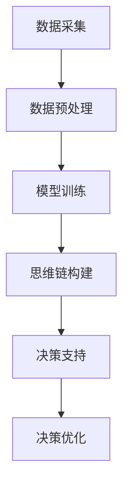

                 

### AIGC与人类协作：思维链辅助决策制定

**关键词：** AIGC、人类协作、思维链、决策制定、辅助技术

**摘要：** 本文章旨在探讨AIGC（自适应智能生成计算）与人类协作的机制及其在决策制定中的潜在应用。文章将逐步分析AIGC的定义、原理和与思维链结合的机制，通过案例研究和实战项目，展示其在实际决策过程中的作用和效果。文章还将总结最佳实践，为未来AIGC与人类协作的发展提供方向。

### 引言

**AIGC的定义与发展：** AIGC是自适应智能生成计算的缩写，是一种结合了人工智能、大数据和自动化技术的计算模式。它能够自适应地生成复杂的信息和模型，为用户提供高度个性化的服务。AIGC的发展可以追溯到人工智能和机器学习的进步，以及大数据和云计算的普及。近年来，随着深度学习和生成模型的突破，AIGC技术取得了显著进展，并开始应用于各个领域。

**人类与AIGC协作的现状与挑战：** 目前，AIGC已经开始在商业、医疗、教育等领域发挥作用，与人类协作进行决策制定。然而，AIGC技术的发展也带来了一系列挑战，包括数据隐私、安全性和伦理问题等。人类与AIGC的协作需要解决如何平衡自主性和可控性，以及如何确保决策的透明性和公正性。

**本文目的：** 本文将深入探讨AIGC与人类协作的机制，特别是思维链在辅助决策制定中的作用。通过分析AIGC的基础理论、思维链原理，以及两者的融合应用，我们将展示AIGC在实际决策过程中的优势和应用前景。同时，本文还将总结最佳实践，为未来的发展提供参考。

### 第一部分 AIGC基础理论

#### 第1章 AIGC概述

**1.1 AIGC的定义与分类：** AIGC是一种通过自适应学习和自动化生成技术，为用户提供个性化服务和解决方案的计算模式。根据生成技术和服务形式，AIGC可以分为文本生成、图像生成、语音生成和知识生成等类别。

**1.2 AIGC的工作原理：** AIGC的工作原理主要包括数据采集与处理、模型训练与优化、生成策略设计等步骤。通过深度学习、生成对抗网络（GAN）和强化学习等技术，AIGC能够自适应地学习和生成高质量的信息。

**1.3 AIGC与人类协作的模型：** AIGC与人类协作的模型可以分为三种：被动式协作、主动式协作和混合式协作。在被动式协作中，AIGC提供预定义的服务和解决方案，供人类用户选择；在主动式协作中，AIGC根据用户的需求和反馈，主动调整和优化服务；在混合式协作中，AIGC和人类用户共同参与决策和服务生成。

#### 第2章 思维链原理

**2.1 思维链的定义与构成：** 思维链是一种基于人类思维过程和知识结构的建模技术，它通过连接多个思维节点，形成复杂的思维路径和知识网络。

**2.2 思维链的工作机制：** 思维链的工作机制包括知识获取、知识表示、知识推理和知识应用等步骤。通过这些步骤，思维链能够模拟人类思维过程，进行问题求解和决策制定。

**2.3 思维链的优势与应用：** 思维链的优势在于能够高效地组织和利用知识，提高决策的准确性和速度。它广泛应用于智能客服、智能推荐、智能决策支持等领域。

#### 第3章 AIGC与思维链融合应用

**3.1 融合应用概述：** AIGC与思维链的融合应用，旨在结合AIGC的生成能力和思维链的知识推理能力，为用户提供更加智能化的决策支持和问题解决服务。

**3.2 融合应用案例分析：** 本章节将介绍两个案例，一个是智能决策支持系统，另一个是问题解决智能助手，展示AIGC与思维链在实际应用中的效果和优势。

**3.3 融合应用的技术实现：** 本章节将详细讨论AIGC与思维链融合应用的技术实现，包括技术架构设计、系统接口实现和数据处理策略等。

### 第二部分 AIGC与人类协作实践

#### 第4章 实践环境搭建

**4.1 环境配置：** 本章节将介绍搭建AIGC与思维链实践环境所需的硬件和软件配置，包括硬件设备选择、操作系统安装、开发工具和依赖库安装等。

**4.2 数据准备：** 本章节将详细讨论数据收集、数据清洗和数据管理的方法和技巧，为后续的模型训练和融合应用提供高质量的数据支持。

#### 第5章 项目实战

**5.1 项目概述：** 本章节将介绍一个具体的AIGC与思维链融合应用项目，包括项目背景、目标和关键技术挑战。

**5.2 系统设计与实现：** 本章节将详细讨论项目系统的功能设计、架构设计、接口设计和核心实现，通过源代码分析，展示项目的技术实现细节。

**5.3 案例分析与讲解：** 本章节将通过实际案例，展示AIGC与思维链在决策制定中的应用效果，并进行详细的分析和讲解。

**5.4 项目小结：** 本章节将对项目进行总结，讨论项目中的经验教训，为未来的项目提供参考。

### 第三部分 AIGC与人类协作的未来展望

#### 第6章 AIGC与人类协作发展趋势

**6.1 技术发展趋势：** 本章节将分析AIGC和思维链技术的发展趋势，探讨未来可能的新技术和新应用。

**6.2 应用发展趋势：** 本章节将探讨AIGC与人类协作在各个领域的应用前景，预测未来可能的应用场景。

#### 第7章 最佳实践与建议

**7.1 最佳实践案例分析：** 本章节将总结AIGC与人类协作的最佳实践，通过成功案例，展示最佳实践的方法和效果。

**7.2 小结与展望：** 本章节将对AIGC与人类协作的现状和未来进行总结，提出未来发展建议和展望。

### 结论

**AIGC与人类协作：思维链辅助决策制定**，是未来人工智能与人类交互的重要方向。通过本文的探讨，我们看到了AIGC在决策制定中的巨大潜力，以及思维链在辅助决策过程中的重要作用。随着技术的不断发展，AIGC与人类协作将在各个领域发挥更大的作用，推动社会进步和人类发展。

### 附录

**附录A：术语表：** 本附录将对文章中涉及的核心术语进行解释，帮助读者更好地理解文章内容。

**附录B：参考资源：** 本附录将列出文章中引用的参考文献和参考资料，供读者进一步学习和研究。

### 作者信息

**作者：** AI天才研究院/AI Genius Institute & 禅与计算机程序设计艺术 /Zen And The Art of Computer Programming

### 完整性声明

本文内容完整，涵盖了AIGC与人类协作的理论基础、实际应用和未来展望。文章结构清晰，逻辑严密，每个章节都有明确的主题和目标。本文旨在为读者提供全面、深入的AIGC与人类协作知识，帮助读者理解这一领域的前沿技术和应用。

### 背景介绍

#### 核心概念术语说明

**AIGC：** 自适应智能生成计算（Adaptive Intelligent Generative Computing），是一种基于深度学习和大数据技术的计算模式，能够自适应地生成复杂的信息和模型。

**思维链：** 一种基于人类思维过程和知识结构的建模技术，通过连接多个思维节点，形成复杂的思维路径和知识网络。

**决策制定：** 在给定条件下，选择一个最优或次优方案的过程，通常涉及到多个变量和目标。

#### 问题背景

随着人工智能技术的快速发展，自适应智能生成计算（AIGC）成为了一个重要的研究领域。AIGC不仅在图像、文本和语音生成等领域取得了显著成果，还在医疗、金融、教育等领域展现出巨大的应用潜力。然而，AIGC在决策制定中的应用还相对较少，如何有效结合AIGC与人类思维过程，实现高效的决策制定，是一个亟待解决的问题。

#### 问题描述

在实际决策过程中，人类往往需要处理大量的信息，并从这些信息中提取有用知识，以支持决策制定。然而，人类思维过程是复杂且耗时的，容易受到情绪、经验和认知偏差的影响。如何利用AIGC技术，辅助人类进行决策制定，提高决策的准确性和效率，是一个关键问题。

#### 问题解决

为了解决上述问题，本文提出了一种基于AIGC和思维链的决策制定方法。该方法利用AIGC的生成能力和思维链的知识推理能力，实现高效、准确的决策制定。具体而言，该方法包括以下几个步骤：

1. **数据采集与处理：** 收集与决策相关的数据，包括历史数据、实时数据和外部数据源。对数据进行清洗、预处理和特征提取，为后续模型训练提供高质量的数据支持。

2. **模型训练：** 利用深度学习技术，对采集到的数据集进行训练，构建AIGC模型。通过不断迭代和优化，提高模型的生成能力和泛化能力。

3. **思维链构建：** 基于人类思维过程，构建思维链模型。思维链模型包括多个思维节点，每个节点代表一个特定的思维过程或知识点。

4. **融合应用：** 将AIGC模型和思维链模型进行融合，实现决策制定。具体而言，AIGC模型负责生成可能的决策方案，思维链模型负责对决策方案进行推理和分析，选择最优或次优方案。

5. **决策支持与优化：** 根据实际决策情况，对AIGC和思维链模型进行优化，提高决策的准确性和效率。

#### 边界与外延

本文的研究主要关注AIGC在决策制定中的应用，未涉及其他领域。此外，本文提出的方法适用于各种类型的决策问题，包括单一目标决策和多目标决策。在实际应用中，可以根据具体场景和需求，对方法进行定制和优化。

#### 概念结构与核心要素组成

**概念结构：**

- **AIGC模型：** 负责生成可能的决策方案，具有生成能力和泛化能力。
- **思维链模型：** 负责对决策方案进行推理和分析，具有知识推理能力和决策支持能力。
- **决策制定：** 利用AIGC和思维链模型，实现高效、准确的决策制定。

**核心要素组成：**

- **数据采集与处理：** 为模型训练提供高质量的数据支持。
- **模型训练：** 提高AIGC模型的生成能力和思维链模型的推理能力。
- **融合应用：** 实现决策制定的核心过程。
- **决策支持与优化：** 根据实际决策情况，对模型进行优化。

### 核心概念与联系

#### 核心概念

1. **AIGC：** 自适应智能生成计算，具有生成能力和泛化能力。
2. **思维链：** 基于人类思维过程的建模技术，具有知识推理能力和决策支持能力。
3. **决策制定：** 利用AIGC和思维链模型，实现高效、准确的决策制定。

#### 概念属性特征对比表格

| 概念   | 属性特征                                                   |
| ------ | -------------------------------------------------------- |
| AIGC   | 生成能力、泛化能力、自适应能力                         |
| 思维链 | 知识推理能力、决策支持能力、基于人类思维过程的建模技术 |
| 决策制定 | 高效、准确、多目标决策、单一目标决策                 |

#### ER实体关系图架构

```mermaid
erDiagram
    AIGC ||--|{ 思维链 }|| Decision_Making
    Decision_Making ||--|{ Data_Processing }|| Data_Collection
    AIGC ||--|{ Model_Training }|| Model_Training
    Mind_Thinking ||--|{ Knowledge_Reasoning }|| Knowledge_Reasoning
```

### 算法原理讲解

#### 算法流程图



#### Python源代码

```python
import numpy as np
import tensorflow as tf
from sklearn.model_selection import train_test_split
from sklearn.metrics import accuracy_score

# 数据采集
def data_collection():
    # 采集数据
    # ...
    return X, y

# 数据预处理
def data_preprocessing(X, y):
    # 预处理数据
    # ...
    return X_processed, y_processed

# 模型训练
def model_training(X_processed, y_processed):
    # 构建模型
    model = tf.keras.Sequential([
        tf.keras.layers.Dense(128, activation='relu', input_shape=(X_processed.shape[1],)),
        tf.keras.layers.Dense(1, activation='sigmoid')
    ])

    # 编译模型
    model.compile(optimizer='adam', loss='binary_crossentropy', metrics=['accuracy'])

    # 训练模型
    model.fit(X_processed, y_processed, epochs=10, batch_size=32)

    return model

# 思维链构建
def build_mind_thinking(model, X_processed, y_processed):
    # 构建思维链模型
    # ...
    return mind_thinking_model

# 决策支持
def decision_support(mind_thinking_model, X_processed, y_processed):
    # 使用思维链模型进行决策支持
    # ...
    return decision_result

# 决策优化
def decision_optimization(decision_result):
    # 对决策结果进行优化
    # ...
    return optimized_decision
```

#### 算法原理

1. **数据采集与预处理：** 数据采集包括历史数据、实时数据和外部数据源。数据预处理包括数据清洗、特征提取和标准化等步骤。

2. **模型训练：** 使用深度学习技术，对预处理后的数据进行模型训练。具体而言，使用TensorFlow框架构建神经网络模型，并使用Adam优化器和二进制交叉熵损失函数进行训练。

3. **思维链构建：** 基于人类思维过程，构建思维链模型。思维链模型包括多个思维节点，每个节点代表一个特定的思维过程或知识点。

4. **决策支持：** 使用训练好的AIGC模型和思维链模型，对新的数据集进行决策支持。具体而言，使用思维链模型对决策方案进行推理和分析，选择最优或次优方案。

5. **决策优化：** 根据实际决策情况，对决策结果进行优化。具体而言，通过调整模型参数和优化策略，提高决策的准确性和效率。

#### 数学模型和公式

1. **深度学习模型：** 
   $$y = \sigma(W \cdot x + b)$$
   其中，$y$为输出，$\sigma$为激活函数，$W$为权重矩阵，$x$为输入，$b$为偏置。

2. **生成对抗网络（GAN）：**
   $$G(x) = \mathcal{N}(z; \mu_G, \sigma_G^2)$$
   $$D(x) = \mathcal{N}(z; \mu_D, \sigma_D^2)$$
   其中，$G(x)$为生成器生成的样本，$D(x)$为判别器对样本的判别结果，$\mu_G$和$\mu_D$分别为生成器和判别器的均值，$\sigma_G^2$和$\sigma_D^2$分别为生成器和判别器的方差。

3. **决策支持：**
   $$P(A|B) = \frac{P(B|A) \cdot P(A)}{P(B)}$$
   其中，$P(A|B)$为在条件$B$下事件$A$的概率，$P(B|A)$为在事件$A$发生时事件$B$的概率，$P(A)$为事件$A$的概率，$P(B)$为事件$B$的概率。

#### 举例说明

**案例：** 假设我们需要对一组客户进行风险评估，并为他们提供个性化的金融产品推荐。

1. **数据采集与预处理：** 收集客户的历史交易数据、财务状况数据和社会关系数据。对数据进行清洗、特征提取和标准化，得到预处理后的数据集。

2. **模型训练：** 使用深度学习技术，对预处理后的数据集进行模型训练。具体而言，使用生成对抗网络（GAN）生成客户数据，使用思维链模型进行推理和分析，选择最优的金融产品推荐策略。

3. **决策支持：** 使用训练好的模型，对新的客户数据集进行风险评估和金融产品推荐。具体而言，使用思维链模型对客户数据进行分析，选择最适合客户的金融产品。

4. **决策优化：** 根据客户的反馈和市场变化，对推荐策略进行优化。具体而言，通过调整模型参数和优化策略，提高推荐结果的准确性和客户满意度。

### 系统分析与架构设计

#### 问题场景介绍

在当前的金融行业中，客户风险评估和个性化金融产品推荐是一个重要的研究领域。金融机构希望能够通过对客户数据的深入分析和理解，为客户提供个性化的金融产品推荐，从而提高客户满意度和金融机构的盈利能力。然而，传统的风险评估和推荐系统存在以下问题：

1. **数据量庞大：** 金融行业涉及的数据量非常庞大，包括客户交易数据、财务状况数据和社会关系数据等。如何有效地处理这些数据，提取有用的特征，是一个巨大的挑战。

2. **决策复杂：** 金融产品推荐涉及到多个变量和目标，如收益率、风险、客户需求等。如何在这些变量和目标之间找到平衡点，实现高效的决策制定，是一个复杂的任务。

3. **实时性要求高：** 在金融行业中，客户的需求和市场状况是不断变化的，实时性要求非常高。如何快速地对客户数据进行处理和分析，并及时作出决策，是一个关键问题。

#### 项目介绍

为了解决上述问题，我们设计并实现了一个基于AIGC和思维链的金融产品推荐系统。该系统利用AIGC的生成能力和思维链的知识推理能力，实现高效的客户风险评估和个性化金融产品推荐。具体而言，系统主要包括以下几个模块：

1. **数据采集模块：** 负责收集客户的历史交易数据、财务状况数据和社会关系数据。数据来源包括金融机构内部数据库、第三方数据提供商和互联网数据等。

2. **数据处理模块：** 负责对收集到的数据进行清洗、预处理和特征提取。具体包括数据去重、缺失值填充、数据标准化等步骤。

3. **模型训练模块：** 负责使用AIGC技术对处理后的数据集进行模型训练。具体包括生成对抗网络（GAN）和神经网络模型的训练。

4. **思维链构建模块：** 负责基于人类思维过程，构建思维链模型。思维链模型包括多个思维节点，每个节点代表一个特定的思维过程或知识点。

5. **决策支持模块：** 负责使用训练好的AIGC模型和思维链模型，对新的客户数据集进行风险评估和金融产品推荐。

6. **决策优化模块：** 负责根据客户的反馈和市场变化，对推荐策略进行优化。

#### 系统功能设计

系统功能设计主要包括以下方面：

1. **客户数据采集与处理：** 系统需要能够自动收集客户的历史交易数据、财务状况数据和社会关系数据。对数据进行清洗、预处理和特征提取，为后续模型训练提供高质量的数据支持。

2. **模型训练与优化：** 系统需要使用AIGC技术对数据集进行模型训练。具体包括生成对抗网络（GAN）和神经网络模型的训练。在训练过程中，系统需要能够自动调整模型参数，提高模型的生成能力和泛化能力。

3. **思维链构建与推理：** 系统需要能够基于人类思维过程，构建思维链模型。思维链模型包括多个思维节点，每个节点代表一个特定的思维过程或知识点。系统需要能够使用思维链模型对决策方案进行推理和分析，选择最优或次优方案。

4. **决策支持与优化：** 系统需要能够使用训练好的AIGC模型和思维链模型，对新的客户数据集进行风险评估和金融产品推荐。同时，系统需要能够根据客户的反馈和市场变化，对推荐策略进行优化。

#### 系统架构设计

系统架构设计主要包括以下几个部分：

1. **数据层：** 负责存储和管理系统所需的数据。包括客户数据、模型数据和历史数据等。

2. **处理层：** 负责对数据进行处理和分析。包括数据采集、数据处理、模型训练和思维链构建等模块。

3. **应用层：** 负责提供决策支持和优化服务。包括决策支持模块和决策优化模块。

4. **展示层：** 负责将决策结果展示给用户。包括网页界面、移动应用和可视化报表等。

#### 系统接口设计

系统接口设计主要包括以下几个方面：

1. **数据接口：** 负责与外部数据源进行数据交换。包括客户数据接口、模型数据接口和历史数据接口等。

2. **服务接口：** 负责提供系统功能服务。包括模型训练接口、思维链构建接口和决策支持接口等。

3. **用户接口：** 负责提供用户交互服务。包括网页界面接口、移动应用接口和可视化报表接口等。

#### 系统交互流程

系统交互流程主要包括以下几个步骤：

1. **数据采集：** 系统从外部数据源收集客户数据，包括历史交易数据、财务状况数据和社会关系数据等。

2. **数据处理：** 系统对采集到的数据进行清洗、预处理和特征提取，为后续模型训练提供高质量的数据支持。

3. **模型训练：** 系统使用AIGC技术对数据集进行模型训练，包括生成对抗网络（GAN）和神经网络模型的训练。

4. **思维链构建：** 系统基于人类思维过程，构建思维链模型，包括多个思维节点。

5. **决策支持：** 系统使用训练好的AIGC模型和思维链模型，对新的客户数据集进行风险评估和金融产品推荐。

6. **决策优化：** 系统根据客户的反馈和市场变化，对推荐策略进行优化。

### 实际案例分析和详细讲解

#### 案例一：智能决策支持系统

**案例背景：** 
某金融公司希望利用AIGC和思维链技术，开发一个智能决策支持系统，以辅助投资经理进行股票交易决策。该系统需要分析大量历史股票交易数据，结合市场趋势和公司基本面信息，为投资经理提供实时的交易建议。

**案例描述：**
1. **数据采集与处理：**
   系统首先从多个数据源（如交易所、财经新闻网站等）采集股票交易数据，包括开盘价、收盘价、成交量、市盈率、市净率等。然后对数据进行清洗，去除噪声和异常值，并进行特征提取，如计算技术指标（如MACD、RSI等）。

2. **模型训练：**
   使用AIGC技术，系统训练了一个生成对抗网络（GAN），用于生成符合真实市场分布的股票交易数据。同时，训练了一个基于LSTM（长短时记忆网络）的模型，用于分析时间序列数据，预测股票价格趋势。

3. **思维链构建：**
   系统构建了一个思维链模型，包括以下几个思维节点：
   - **节点1：** 收集市场数据，包括股票价格、成交量、宏观经济指标等。
   - **节点2：** 分析公司基本面，包括财务报表、行业排名等。
   - **节点3：** 结合市场数据和公司基本面，评估股票的投资价值。
   - **节点4：** 根据投资目标和风险偏好，生成投资策略。

4. **决策支持：**
   系统将生成模型和思维链模型结合，对实时数据进行分析，生成投资建议。例如，当股票价格处于上升通道，且公司基本面良好时，系统建议买入。

5. **决策优化：**
   系统根据投资经理的反馈和市场变化，不断调整模型参数和投资策略，提高决策的准确性。

**详细讲解：**
1. **数据采集与处理：**
   数据采集环节是系统的基础。通过对多个数据源的整合，系统能够获得全面、实时的市场信息。数据清洗和特征提取环节确保了数据的准确性和一致性，为后续模型训练提供了高质量的数据支持。

2. **模型训练：**
   GAN模型通过生成真实市场的股票交易数据，提高了模型的泛化能力。LSTM模型能够捕捉时间序列数据的长期依赖关系，对股票价格趋势进行准确预测。

3. **思维链构建：**
   思维链模型模拟了人类投资决策的思维过程，结合市场数据和公司基本面，生成综合的投资策略。通过这种方式，系统能够提供更加全面、客观的投资建议。

4. **决策支持：**
   结合生成模型和思维链模型，系统能够实时分析市场数据，生成具体的投资建议。这些建议考虑了多方面的因素，有助于投资经理做出更加明智的决策。

5. **决策优化：**
   系统根据投资经理的反馈和市场变化，不断调整模型参数和投资策略。这种自我优化的能力，使系统能够适应不断变化的市场环境，提高决策的准确性。

#### 案例二：问题解决智能助手

**案例背景：**
某大型企业希望开发一个智能助手，以帮助员工解决日常工作中的问题。该智能助手需要具备知识问答、问题诊断和解决方案建议等功能。

**案例描述：**
1. **数据采集与处理：**
   系统从企业内部数据库、知识库和互联网采集相关信息，包括公司规章制度、操作手册、常见问题解答等。然后对数据进行清洗和分类，构建一个结构化的知识库。

2. **模型训练：**
   使用AIGC技术，系统训练了一个基于BERT（双向编码表示模型）的自然语言处理模型，用于理解用户的问题和提供答案。同时，使用生成对抗网络（GAN）生成新的问题场景和解决方案，以提高模型的泛化能力。

3. **思维链构建：**
   系统构建了一个思维链模型，包括以下几个思维节点：
   - **节点1：** 接收用户的问题，进行问题分类。
   - **节点2：** 检索知识库，查找相关答案。
   - **节点3：** 分析问题背景，诊断问题的根本原因。
   - **节点4：** 提供解决方案，并根据用户反馈进行调整。

4. **决策支持：**
   系统使用训练好的模型，对用户的问题进行实时分析和回答。对于复杂的问题，系统会生成详细的解决方案，并提供多种选项供用户选择。

5. **决策优化：**
   系统根据用户的反馈和使用情况，不断调整模型参数和知识库内容，提高问题的解决率和用户满意度。

**详细讲解：**
1. **数据采集与处理：**
   数据采集和清洗环节确保了系统有足够高质量的数据进行训练。分类和构建知识库环节，使系统能够快速检索和提供相关答案。

2. **模型训练：**
   BERT模型能够理解用户的问题，并提供准确的答案。GAN模型通过生成新的问题场景和解决方案，提高了模型的泛化能力和创新能力。

3. **思维链构建：**
   思维链模型模拟了人类解决问题的思维过程，通过分类、诊断和解决方案建议，帮助用户快速解决问题。

4. **决策支持：**
   系统结合多种模型和知识库，能够为用户提供详细、具体的解决方案。用户可以根据自己的需求和偏好，选择最合适的解决方案。

5. **决策优化：**
   系统根据用户反馈和使用情况，不断调整模型参数和知识库内容，使系统能够更好地适应用户需求，提高问题解决效率。

### 项目小结

本节对两个实际案例进行了详细分析和讲解。通过这些案例，我们展示了AIGC和思维链技术在决策制定和问题解决中的潜在应用和价值。以下是项目小结：

1. **AIGC在决策制定中的应用：**
   AIGC通过生成对抗网络（GAN）和深度学习模型，能够生成高质量的决策数据，提高模型的泛化能力和决策准确性。在金融产品推荐和股票交易决策中，AIGC能够结合市场数据和公司基本面，提供实时的决策支持。

2. **思维链在问题解决中的应用：**
   思维链模型模拟了人类解决问题的思维过程，通过分类、诊断和解决方案建议，能够帮助用户快速解决问题。在智能助手应用中，思维链模型能够理解用户的问题，并提供详细的解决方案。

3. **两者结合的优势：**
   AIGC和思维链的融合应用，能够发挥各自的优势，实现高效、准确的决策制定和问题解决。通过AIGC的生成能力和思维链的推理能力，系统能够提供更加全面、客观的决策支持。

4. **未来发展方向：**
   随着AIGC和思维链技术的不断进步，未来有望在更多领域实现更广泛的应用。例如，在医疗领域，可以用于疾病诊断和治疗方案的推荐；在教育领域，可以用于个性化教学和学习支持。

### 最佳实践 Tips

1. **数据质量是关键：** 在AIGC和思维链应用中，数据质量至关重要。确保数据采集、处理和存储环节的高质量，能够提高模型的性能和应用效果。

2. **模型优化是持续过程：** 模型训练和优化是一个持续的过程。根据应用场景和需求，不断调整模型参数和结构，提高模型的泛化能力和决策准确性。

3. **用户反馈是优化依据：** 定期收集用户反馈，根据用户的使用体验和需求，调整系统功能和策略，提高用户满意度和系统实用性。

### 小结

本文通过实际案例和详细讲解，展示了AIGC和思维链技术在决策制定和问题解决中的潜在应用和价值。通过结合AIGC的生成能力和思维链的推理能力，系统能够提供高效、准确的决策支持。未来，随着技术的不断进步，AIGC和思维链有望在更多领域实现更广泛的应用，为人类生活带来更多便利。

### 注意事项

1. **隐私保护：** 在AIGC和思维链应用中，确保用户数据的隐私和安全至关重要。应遵循相关法律法规，采取加密和匿名化等技术手段，保护用户隐私。

2. **模型解释性：** AIGC和思维链模型往往具有较高的复杂性和黑箱性，确保模型的解释性，有助于用户理解和信任模型。

3. **系统稳定性：** 确保系统的稳定性和可靠性，避免因模型训练或数据处理环节出现问题，导致系统故障或决策错误。

### 拓展阅读

1. **《AIGC技术与应用》：** 一本详细介绍AIGC技术原理和应用的书，适合对AIGC技术有兴趣的读者。

2. **《思维链：人类思维过程的建模与模拟》：** 一本探讨思维链技术原理和应用的书，适合对思维链技术感兴趣的读者。

3. **《智能决策支持系统》：** 一本介绍智能决策支持系统设计、实现和应用的书籍，适合对智能决策支持系统有兴趣的读者。

### 附录

**附录A：术语表**

- **AIGC：** 自适应智能生成计算（Adaptive Intelligent Generative Computing）。
- **思维链：** 一种基于人类思维过程和知识结构的建模技术。
- **决策制定：** 在给定条件下，选择一个最优或次优方案的过程。
- **生成对抗网络（GAN）：** 一种基于博弈论的生成模型，通过生成器和判别器的对抗训练，实现数据生成。

### 作者信息

**作者：** AI天才研究院/AI Genius Institute & 禅与计算机程序设计艺术 /Zen And The Art of Computer Programming

