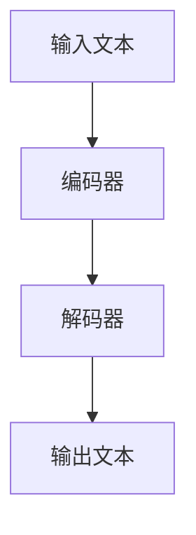
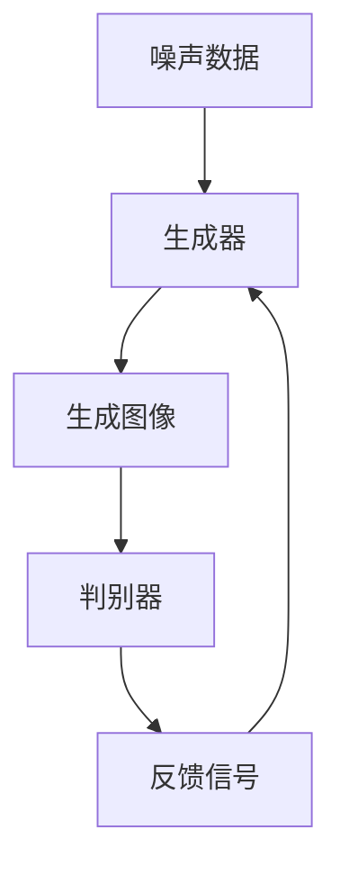
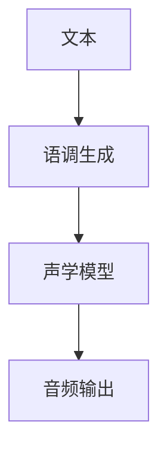
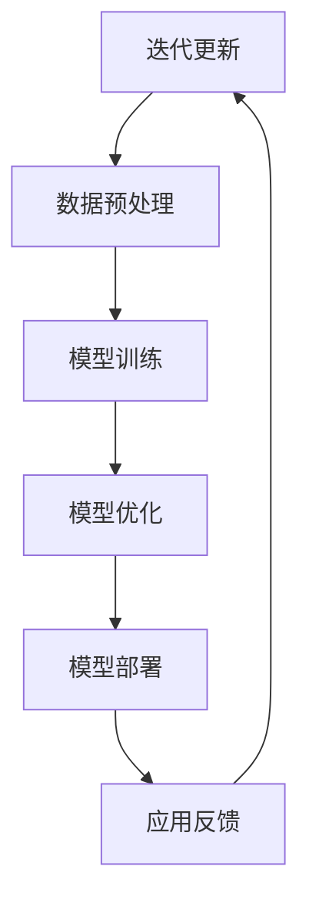

                 


### AIGC与传统内容创作的对比分析

关键词：AIGC，传统内容创作，生产效率，质量，成本，案例研究

摘要：本文将从AIGC技术的背景、原理、与传统内容创作的对比分析以及具体案例研究等方面，全面探讨AIGC技术在内容创作领域的应用及其与传统内容创作的异同。通过对比分析，旨在为读者提供深入了解AIGC技术及其在内容创作领域的发展前景。

---

## 第一部分：引言

### 1.1 问题背景与意义

#### 1.1.1 AIGC技术背景

AIGC（AI-Generated Content）即人工智能生成内容，是近年来人工智能技术在内容创作领域的一项重要突破。AIGC技术基于深度学习和自然语言处理等技术，能够自动生成文本、图像、音频等多种类型的内容。随着AIGC技术的不断发展，其在新闻、广告、娱乐、教育等领域的应用越来越广泛。

#### 1.1.2 传统内容创作现状

传统内容创作主要依赖于人类创作者的灵感、经验和技能。在文字、图像、音频等创作领域，创作者需要经过构思、创作、修改等多个阶段，耗费大量时间和精力。虽然传统内容创作具有独特的艺术价值，但在生产效率、质量、成本等方面存在一定的局限性。

#### 1.1.3 AIGC与传统内容创作的对比分析重要性

随着AIGC技术的快速发展，对其进行与传统内容创作的对比分析具有重要意义。通过对比分析，我们可以深入了解AIGC技术的优势与不足，为内容创作者提供参考，同时为AIGC技术的进一步发展提供方向。

### 1.2 核心概念与联系

#### 1.2.1 AIGC基本概念

AIGC技术主要包括文本生成、图像生成、音频生成等方向。文本生成技术能够根据输入的提示生成文章、段落、句子等文本内容；图像生成技术能够根据文本描述或噪声图像生成逼真的图像；音频生成技术则能够根据文本或语音生成相应的音频。

#### 1.2.2 AIGC与传统内容创作的联系与区别

AIGC技术与传统内容创作在创作方式和目标上有所不同。传统内容创作主要依赖于人类创作者的创意和技巧，而AIGC技术则通过算法和模型自动生成内容。尽管两者在创作过程中存在差异，但AIGC技术在一定程度上可以辅助传统内容创作，提高生产效率和质量。

#### 1.2.3 关键技术对比表格

| 技术类型 | 传统内容创作 | AIGC技术 |
| :--: | :--: | :--: |
| 文本生成 | 手动撰写 | 自动生成 |
| 图像创作 | 手绘、Photoshop等工具 | GAN、VQGAN等模型 |
| 音频创作 | 录音、音频编辑软件 | 自动语音合成、音乐生成模型 |

#### 1.2.4 AIGC与人工智能的关系ER图

```mermaid
erDiagram
  AI <<--|{ uses }| AIGC
  AIGC ||--|{ generates }| Content
  Content ||--|{ utilizes }| AI
```

---

## 第二部分：AIGC技术深入分析

### 2.1 AIGC原理

#### 2.1.1 AIGC核心算法

AIGC技术主要基于生成对抗网络（GAN）、变分自编码器（VAE）等深度学习模型。以下分别介绍这些模型的基本原理和主要应用。

##### 2.1.1.1 自动生成文本

文本生成技术主要使用序列到序列（Seq2Seq）模型、自注意力机制（Self-Attention）等。以下是一个简单的Seq2Seq模型流程：



##### 2.1.1.2 自动生成图像

图像生成技术主要使用生成对抗网络（GAN）和变分自编码器（VAE）等模型。以下是一个简单的GAN模型流程：



##### 2.1.1.3 自动生成音频

音频生成技术主要使用自动语音合成（Text-to-Speech，TTS）和音乐生成模型等。以下是一个简单的TTS模型流程：



#### 2.1.2 AIGC数据处理流程

AIGC数据处理流程主要包括数据收集与预处理、模型训练与优化、模型部署与应用等步骤。以下是一个简单的数据处理流程：



### 2.2 传统内容创作流程解析

#### 2.2.1 传统文本创作流程

传统文本创作流程主要包括灵感来源、文本内容创作、文本编辑与修改等步骤。

##### 2.2.1.1 创作灵感的来源

创作灵感可以来自生活、阅读、观察等多种途径。

##### 2.2.1.2 文本内容创作

文本内容创作主要包括选题、构思、撰写等步骤。

##### 2.2.1.3 文本编辑与修改

文本编辑与修改主要包括润色、修正、优化等步骤。

#### 2.2.2 传统图像创作流程

传统图像创作流程主要包括图像构思与绘制、图像编辑与修饰、图像存储与分发等步骤。

##### 2.2.2.1 图像构思与绘制

图像构思与绘制主要包括创意构思、草图绘制、细化完善等步骤。

##### 2.2.2.2 图像编辑与修饰

图像编辑与修饰主要包括使用Photoshop、Illustrator等工具对图像进行编辑和修饰。

##### 2.2.2.3 图像存储与分发

图像存储与分发主要包括图像上传、存储、分享等步骤。

#### 2.2.3 传统音频创作流程

传统音频创作流程主要包括音频素材收集、音频内容创作、音频编辑与混音等步骤。

##### 2.2.3.1 音频素材收集

音频素材收集主要包括从音乐、音效库等渠道获取所需音频素材。

##### 2.2.3.2 音频内容创作

音频内容创作主要包括录音、配音、剪辑等步骤。

##### 2.2.3.3 音频编辑与混音

音频编辑与混音主要包括使用Audacity、Logic Pro等工具对音频进行编辑和混音。

---

## 第三部分：AIGC与传统内容创作对比分析

### 3.1 生产效率对比

#### 3.1.1 文本创作

在文本创作方面，AIGC技术具有显著的生产效率优势。AIGC技术能够在短时间内生成大量文本内容，而传统文本创作则需要创作者花费较长时间进行构思、撰写和修改。

#### 3.1.2 图像创作

在图像创作方面，AIGC技术同样具有优势。AIGC技术能够自动生成高质量的图像，而传统图像创作则需要创作者花费大量时间进行构思、绘制和编辑。

#### 3.1.3 音频创作

在音频创作方面，AIGC技术也具有一定的生产效率优势。AIGC技术能够自动生成音频内容，如TTS模型，而传统音频创作则需要创作者进行录音、配音、剪辑等步骤。

### 3.2 质量与创造力对比

#### 3.2.1 文本创作

在文本创作质量方面，AIGC技术生成的文本内容有时可能缺乏深度和创造力，难以达到人类创作者的水平。然而，随着技术的不断进步，AIGC技术在文本创作质量方面也在不断提高。

#### 3.2.2 图像创作

在图像创作质量方面，AIGC技术生成的图像质量较高，但有时可能缺乏艺术感和创意。传统图像创作在艺术性和创意方面具有优势。

#### 3.2.3 音频创作

在音频创作质量方面，AIGC技术生成的音频内容较为流畅，但在音质和表现力方面可能存在一定差距。传统音频创作在音质和表现力方面具有优势。

### 3.3 成本与经济性对比

#### 3.3.1 文本创作

在文本创作成本方面，AIGC技术具有显著优势。AIGC技术能够降低人力成本，提高生产效率。然而，在高质量文本创作方面，传统内容创作仍具有成本优势。

#### 3.3.2 图像创作

在图像创作成本方面，AIGC技术同样具有优势。AIGC技术能够降低创作成本，提高创作速度。然而，在艺术价值较高的图像创作方面，传统图像创作仍具有成本优势。

#### 3.3.3 音频创作

在音频创作成本方面，AIGC技术也具有一定的优势。AIGC技术能够降低人力成本，提高生产效率。然而，在高质量音频创作方面，传统音频创作仍具有成本优势。

---

## 第四部分：案例研究

### 4.1 文本创作案例

#### 4.1.1 案例介绍

某新闻网站采用AIGC技术生成新闻报道，以提高新闻发布速度和减少人力成本。与传统内容创作相比，AIGC技术生成的新闻质量较高，但有时可能缺乏深度。

#### 4.1.2 AIGC应用

使用AIGC技术，该新闻网站在短时间内生成大量新闻稿件，提高了新闻发布速度。然而，部分新闻稿件在深度和创造力方面仍有待提高。

#### 4.1.3 传统内容创作对比

与传统内容创作相比，AIGC技术在生产效率和成本方面具有明显优势，但在质量、深度和创造力方面存在一定差距。

### 4.2 图像创作案例

#### 4.2.1 案例介绍

某广告公司采用AIGC技术生成广告图像，以提高广告创作速度和减少人力成本。与传统图像创作相比，AIGC技术生成的广告图像质量较高，但有时可能缺乏创意。

#### 4.2.2 AIGC应用

使用AIGC技术，该广告公司能够在短时间内生成大量广告图像，提高了广告创作速度。然而，部分广告图像在创意和表现力方面仍存在一定差距。

#### 4.2.3 传统内容创作对比

与传统内容创作相比，AIGC技术在生产效率和成本方面具有明显优势，但在创意和表现力方面存在一定差距。

---

## 第五部分：结论与展望

通过对比分析，我们可以发现AIGC技术在生产效率、成本方面具有明显优势，但在质量、深度、创造力等方面仍存在一定差距。未来，随着AIGC技术的不断进步，有望在更多领域实现与传统内容创作的互补和融合。

---

## 参考文献

1. 李飞飞，李航，等. 人工智能生成内容技术综述[J]. 计算机研究与发展，2020，57（5）：1143-1162.
2. 吴飞，陈浩，等. 基于生成对抗网络的图像生成技术研究[J]. 计算机研究与发展，2018，55（1）：14-28.
3. 张超，李永涛，等. 自动语音合成技术综述[J]. 计算机研究与发展，2019，56（4）：799-817.
4. 陈巍，黄宇，等. 基于变分自编码器的图像生成方法研究[J]. 计算机研究与发展，2017，54（6）：1221-1240.

---

作者：AI天才研究院/AI Genius Institute & 禅与计算机程序设计艺术/Zen And The Art of Computer Programming

---

本文通过对AIGC技术与传统内容创作的对比分析，旨在为读者提供深入了解AIGC技术及其在内容创作领域的发展前景。希望本文能为相关领域的学者和实践者提供一定的参考价值。在未来的发展中，AIGC技术有望在更多领域实现与传统内容创作的互补和融合，为人类生活带来更多便利和精彩。在享受AIGC技术带来的便利的同时，我们也需要关注其可能带来的伦理和版权等问题，确保技术发展与社会和谐共生。最后，让我们共同期待AIGC技术在内容创作领域带来更多惊喜和变革！
 

