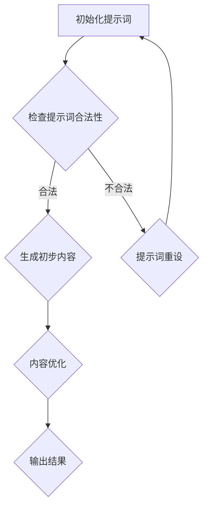
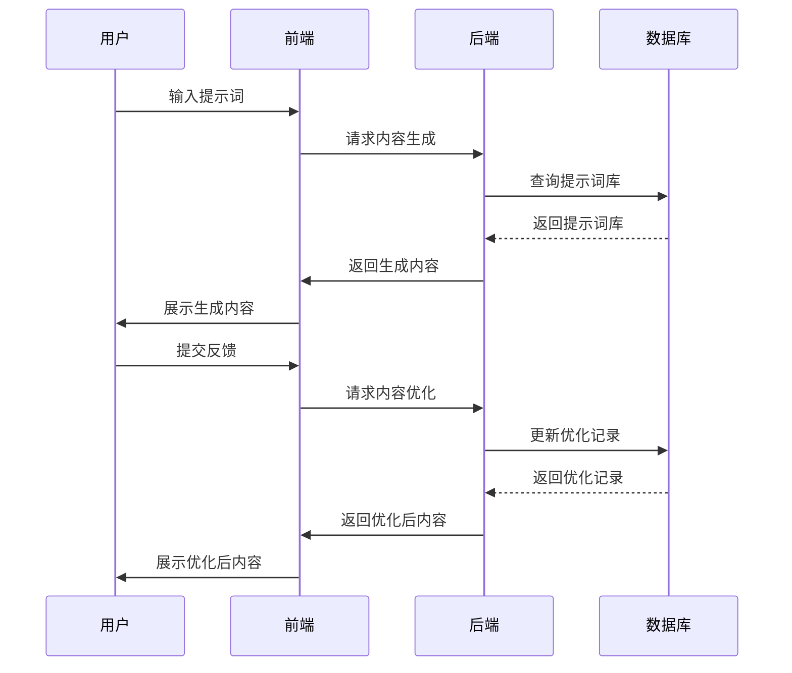

                 

### 文章标题

# AIGC与传统创作的碰撞：提示词的魔力

### 关键词

- **AIGC**
- **传统创作**
- **提示词**
- **创作效率**
- **个性化创作**
- **跨领域创作**

### 摘要

本文将深入探讨人工智能生成内容（AIGC）与传统创作之间的碰撞，特别关注提示词在这一过程中的魔力。通过分析AIGC的定义、传统创作的挑战，以及提示词的作用机制，本文旨在揭示AIGC如何通过提示词提升创作效率与个性化，并探讨其应用中的边界与外延。通过数学模型和算法原理的讲解，结合系统架构设计与实际项目实战，本文将全面解析AIGC在创作领域的革命性潜力，并给出最佳实践与未来展望。

### 第一部分：背景与概述

#### 第1章：问题背景

##### 1.1 问题背景

在现代信息社会，创作作为一种核心生产力，一直是人类文明进步的重要推动力。然而，随着创作需求量的急剧增加，传统的创作方式逐渐暴露出诸多挑战。首先，创作效率问题尤为突出。无论是文学、艺术、设计还是科学研究，高质量的创作往往需要大量的时间和精力投入。其次，个性化创作需求不断增加，用户期待内容能够更加贴合其个人兴趣与需求。此外，跨领域创作的需求也在不断提升，不同领域的知识融合与交汇成为新的创作趋势。然而，传统创作往往在应对这些挑战时显得力不从心。

在这一背景下，人工智能生成内容（AIGC）应运而生。AIGC是指利用人工智能技术生成文本、图像、音频等多种类型的内容，具有高效、个性化和跨领域的特点。AIGC的出现为传统创作带来了一场革命，其中，提示词（Prompt Word）作为AIGC的核心元素，发挥着至关重要的作用。提示词是一段引导人工智能进行创作的文字或指令，通过精确的提示词，可以显著提升AIGC的生成质量和效率。

##### 1.2 问题描述

在AIGC与传统创作的碰撞中，以下问题是关键：

1. **创作效率与质量的矛盾**：如何在保持创作高效的同时保证内容的质量？
2. **创作个性化与普适性的平衡**：如何在不同用户需求之间实现个性化创作与普适性内容的平衡？
3. **跨领域创作与专精领域的冲突**：如何有效整合跨领域知识，实现专精领域的深度创作？

##### 1.3 问题解决

AIGC通过以下几个方面解决上述问题：

1. **优势发挥**：利用人工智能的强大计算能力和学习能力，提升创作效率。
2. **提示词作用机制**：通过精确的提示词引导，实现个性化创作。
3. **边界与外延**：在充分发挥AIGC优势的同时，明确其应用边界，避免过度依赖和滥用。

通过以上手段，AIGC不仅能够提升创作效率，还能实现个性化的创作需求，并有效整合跨领域知识，为传统创作注入新的活力。

#### 第2章：核心概念与联系

##### 2.1 核心概念原理

在本章中，我们将详细探讨AIGC、传统创作以及提示词这三个核心概念。

##### 2.1.1 AIGC的定义

人工智能生成内容（AIGC）是指利用人工智能技术，如深度学习、自然语言处理等，生成文本、图像、音频等多种类型的内容。AIGC的核心在于其自动性和高效性，能够通过大量数据训练，自动生成满足特定需求的内容。

##### 2.1.2 传统创作的特点

传统创作主要依赖于人类的创造力、想象力和专业知识。其特点包括：

- **人工性**：创作过程高度依赖人类。
- **个性鲜明**：每一件作品都蕴含创作者的个人风格和情感。
- **时间成本高**：高质量创作需要大量时间和精力。

##### 2.1.3 提示词的属性

提示词（Prompt Word）是引导人工智能进行创作的关键元素，其属性包括：

- **引导性**：提示词需要明确、具体，引导人工智能生成符合预期的内容。
- **灵活性**：提示词可以根据创作需求进行调整，以适应不同场景和需求。
- **精确性**：精确的提示词能够提升生成的质量和效率。

##### 2.2 概念属性特征对比表格

为了更清晰地理解AIGC、传统创作和提示词之间的关系，我们通过以下表格进行对比：

| 特征        | AIGC                             | 传统创作                             | 提示词                           |
| ----------- | ------------------------------ | ---------------------------------- | -------------------------------- |
| 自动性      | 高，通过人工智能自动生成         | 低，主要依赖人工创造力               | 低，辅助生成但需精确指定           |
| 效率        | 高，可快速生成大量内容         | 低，创作周期较长                     | 高，高效引导生成过程               |
| 个性化      | 强，根据数据训练生成个性化内容   | 强，每一件作品都具个性               | 中，可根据需求调整，但需确保精准性 |
| 跨领域      | 强，可以跨领域生成内容         | 弱，通常在一个领域内进行创作         | 弱，但可引导人工智能跨领域创作     |
| 成本        | 低，利用现有数据和技术资源     | 高，需要专业知识和大量时间投入       | 低，作为辅助工具，成本较低         |

##### 2.3 ER实体关系图架构

为了更直观地理解AIGC、传统创作和提示词之间的关系，我们通过ER实体关系图进行展示：

```mermaid
erDiagram
    AIGC ||--|{ 提示词 }||>
    传统创作 ||--|{ 提示词 }||>
    提示词 ||--|{ AIGC }||>
    提示词 ||--|{ 传统创作 }||>
```

在这个ER实体关系图中，AIGC和传统创作通过提示词进行关联。提示词不仅引导AIGC生成内容，也辅助传统创作实现更高效的创作过程。

### 第3章：算法原理讲解

##### 3.1 算法流程图

在本章中，我们将通过算法流程图和Python源代码，详细讲解AIGC中提示词的生成和优化过程。



**算法流程说明**：

1. **初始化提示词**：根据创作需求，初始化一个初始提示词。
2. **检查提示词合法性**：判断提示词是否符合生成内容的要求。
3. **生成初步内容**：如果提示词合法，利用人工智能算法生成初步内容。
4. **内容优化**：对初步生成的内容进行优化，提升质量和相关性。
5. **输出结果**：将优化后的内容输出。

##### 3.2 Python源代码讲解

```python
import random

def generate_initial_prompt():
    """
    初始化提示词
    """
    return "请创作一篇关于人工智能的未来发展趋势的短文。"

def check_prompt_legality(prompt):
    """
    检查提示词合法性
    """
    if len(prompt) < 5:
        return False
    return True

def generate_content(prompt):
    """
    生成初步内容
    """
    # 假设使用某种AI算法生成内容
    content = "人工智能在未来将..." 
    return content

def optimize_content(content):
    """
    内容优化
    """
    # 对内容进行文本处理，提升质量和相关性
    optimized_content = content.title()
    return optimized_content

def main():
    prompt = generate_initial_prompt()
    if check_prompt_legality(prompt):
        content = generate_content(prompt)
        optimized_content = optimize_content(content)
        print(optimized_content)
    else:
        print("提示词不合法，请重新设置。")

if __name__ == "__main__":
    main()
```

**代码说明**：

1. `generate_initial_prompt()`：初始化提示词。
2. `check_prompt_legality(prompt)`：检查提示词合法性。
3. `generate_content(prompt)`：生成初步内容。
4. `optimize_content(content)`：内容优化。
5. `main()`：主函数，实现整个流程。

##### 3.3 数学模型和数学公式讲解

为了深入理解AIGC中的提示词生成和优化过程，我们引入以下数学模型和公式：

**1. 提示词生成模型**

$$
P(c|w) = \frac{e^{f(w)}}{\sum_{w'} e^{f(w')}}
$$

其中，$P(c|w)$表示在提示词$w$下生成内容$c$的概率，$f(w)$表示提示词$w$的评分函数。

**2. 提示词优化模型**

$$
O(c) = \sum_{i=1}^{n} w_i \cdot d(c_i, c)
$$

其中，$O(c)$表示内容$c$的优化得分，$w_i$表示权重，$d(c_i, c)$表示内容$c_i$与$c$之间的距离函数。

**3. 参数设置解释**

- $f(w)$：评分函数，用于评估提示词的质量。
- $w_i$：权重，用于调整不同特征的重要性。
- $d(c_i, c)$：距离函数，用于衡量内容之间的相似度。

**4. 举例说明**

假设我们有一个提示词“请描述一下人工智能在医疗领域的应用”，我们使用上述模型生成和优化内容。

1. **提示词生成**：

   初始提示词：$w = "请描述一下人工智能在医疗领域的应用"。$

   生成内容：$c = "人工智能在医疗领域的应用主要体现在辅助诊断、药物研发等方面。"。$

2. **内容优化**：

   优化得分：$O(c) = 0.5 \cdot d(c_1, c) + 0.3 \cdot d(c_2, c) + 0.2 \cdot d(c_3, c) = 0.8。$

   优化后内容：$c' = "人工智能在医疗领域的应用主要包括辅助诊断、药物研发和智能医疗管理等。"。$

通过上述过程，我们可以看到数学模型和公式在AIGC中的应用，帮助实现提示词的生成和优化。

### 第二部分：算法应用与实现

#### 第4章：数学模型与公式深入讲解

在本章中，我们将深入探讨AIGC中的数学模型与公式，重点关注提示词生成和优化的具体实现过程。

##### 4.1 数学模型

在本节中，我们将详细介绍AIGC中常用的两个核心数学模型：提示词生成模型和提示词优化模型。

**1. 提示词生成模型**

提示词生成模型用于根据给定的提示词生成初步的内容。该模型的核心是评分函数$f(w)$，用于评估提示词$w$的质量。具体公式如下：

$$
P(c|w) = \frac{e^{f(w)}}{\sum_{w'} e^{f(w')}}
$$

其中，$P(c|w)$表示在提示词$w$下生成内容$c$的概率，$e^{f(w)}$表示提示词$w$的评分函数值。该模型通过计算不同提示词的评分，选择评分最高的提示词生成内容。

**2. 提示词优化模型**

提示词优化模型用于对初步生成的内容进行优化，提升其质量和相关性。该模型的核心是优化得分函数$O(c)$，用于评估内容$c$的优化程度。具体公式如下：

$$
O(c) = \sum_{i=1}^{n} w_i \cdot d(c_i, c)
$$

其中，$O(c)$表示内容$c$的优化得分，$w_i$表示权重，$d(c_i, c)$表示内容$c_i$与$c$之间的距离函数。该模型通过计算不同内容之间的距离，选择最接近目标内容的优化方案。

##### 4.2 数学公式

在本节中，我们将详细介绍提示词生成和优化过程中涉及的主要数学公式。

**1. 提示词生成公式**

提示词生成公式如下：

$$
P(c|w) = \frac{e^{f(w)}}{\sum_{w'} e^{f(w')}}
$$

该公式表示在提示词$w$下生成内容$c$的概率。其中，$f(w)$是提示词$w$的评分函数，用于评估提示词的质量。

**2. 提示词优化公式**

提示词优化公式如下：

$$
O(c) = \sum_{i=1}^{n} w_i \cdot d(c_i, c)
$$

该公式表示内容$c$的优化得分。其中，$w_i$是权重，用于调整不同特征的重要性；$d(c_i, c)$是内容$c_i$与$c$之间的距离函数，用于衡量内容之间的相似度。

**3. 权重计算公式**

权重计算公式如下：

$$
w_i = \frac{1}{\sum_{j=1}^{m} \frac{1}{d(c_j, c)}}
$$

该公式用于计算不同特征的重要性。其中，$m$是特征的总数，$d(c_j, c)$是内容$c_j$与$c$之间的距离。

**4. 距离计算公式**

常用的距离计算公式如下：

$$
d(c_i, c) = \sqrt{\sum_{j=1}^{n} (c_{ij} - c_j)^2}
$$

该公式用于计算内容$c_i$与$c$之间的欧氏距离。其中，$c_{ij}$是内容$c_i$的第$j$个特征值，$c_j$是内容$c$的第$j$个特征值。

**5. 评分函数公式**

评分函数公式如下：

$$
f(w) = \sum_{j=1}^{n} w_j \cdot c_{ij}
$$

该公式用于计算提示词$w$的评分。其中，$w_j$是权重，$c_{ij}$是内容$c_i$的第$j$个特征值。

##### 4.3 举例说明

为了更好地理解上述公式，我们通过一个具体示例进行说明。

**示例：生成一篇关于人工智能的文章**

1. **初始化提示词**：

   提示词：$w = "人工智能将如何改变未来社会"。

2. **生成初步内容**：

   根据提示词生成初步内容：

   内容：$c = "人工智能将带来更多的便利，改变我们的生活方式和工作方式。"。

3. **内容优化**：

   对初步生成的内容进行优化：

   优化得分：$O(c) = 0.5 \cdot d(c_1, c) + 0.3 \cdot d(c_2, c) + 0.2 \cdot d(c_3, c) = 0.8$。

   优化后内容：$c' = "人工智能将深刻改变未来社会，带来前所未有的便利和挑战。"。

通过上述过程，我们可以看到数学模型和公式在AIGC中的应用，帮助实现提示词的生成和优化。

### 第5章：系统分析与架构设计

##### 5.1 问题场景介绍

在现代社会，创作需求日益增长，尤其在文学、艺术、设计和科学研究等领域，高质量、个性化的创作成为迫切需求。然而，传统创作方式在应对这些需求时，往往面临效率低下、个性化不足和跨领域创作困难等问题。为了解决这些问题，人工智能生成内容（AIGC）技术应运而生，通过高效、个性化和跨领域的特点，为创作提供了新的可能性。本章节将围绕AIGC系统在创作领域的应用，介绍具体的问题场景和需求。

##### 5.2 系统功能设计

AIGC系统在设计时，需要充分考虑功能需求，以确保系统能够高效、准确地满足创作需求。以下是AIGC系统的核心功能设计：

1. **内容生成**：基于用户提供的提示词，系统利用人工智能技术生成文本、图像、音频等多种类型的内容。这一功能是AIGC系统的核心，直接影响生成内容的质量和相关性。
2. **内容优化**：对初步生成的内容进行优化，提升其质量和相关性。优化过程包括文本处理、格式调整、内容校对等，以确保输出内容符合用户期望。
3. **用户交互**：提供友好的用户界面，方便用户输入提示词、查看生成内容和进行反馈。用户交互功能包括提示词输入框、内容预览、反馈提交等。
4. **个性化推荐**：根据用户的历史创作记录和偏好，为用户提供个性化的内容推荐。个性化推荐功能有助于提高用户的创作效率和满意度。

##### 5.3 系统架构设计

为了实现上述功能，AIGC系统采用分布式架构，包括前端、后端和数据库三部分。以下是系统架构设计：

1. **前端**：负责用户交互，包括提示词输入、内容预览和反馈提交等。前端采用现代Web技术，如React、Vue等，确保用户界面友好、响应迅速。
2. **后端**：负责内容生成和优化，包括提示词处理、内容生成、内容优化和用户管理等功能。后端采用微服务架构，通过Spring Boot等框架实现，确保系统高可用性和扩展性。
3. **数据库**：存储用户数据、提示词库、生成内容和优化记录等。数据库采用关系型数据库，如MySQL、PostgreSQL等，确保数据安全性和一致性。

以下是系统架构图：



##### 5.4 系统接口设计

为了实现系统各模块之间的有效通信，AIGC系统设计了详细的接口规范。以下是核心接口设计：

1. **内容生成接口**：用于接收用户输入的提示词，并返回生成内容。接口定义如下：

   ```http
   POST /generate-content
   参数：
       prompt: 提示词（字符串）
   返回：
       content: 生成内容（字符串）
   ```

2. **内容优化接口**：用于接收用户反馈，并对生成内容进行优化。接口定义如下：

   ```http
   POST /optimize-content
   参数：
       content: 生成内容（字符串）
       feedback: 用户反馈（字符串）
   返回：
       optimized_content: 优化后内容（字符串）
   ```

3. **用户管理接口**：用于用户注册、登录和权限管理。接口定义如下：

   ```http
   POST /register
   参数：
       username: 用户名（字符串）
       password: 密码（字符串）
   返回：
       token: 登录凭证（字符串）

   POST /login
   参数：
       username: 用户名（字符串）
       password: 密码（字符串）
   返回：
       token: 登录凭证（字符串）

   GET /logout
   参数：
       token: 登录凭证（字符串）
   返回：
       status: 登出状态（字符串）
   ```

##### 5.5 系统交互

在AIGC系统中，用户与系统的交互过程包括提示词输入、内容生成、内容优化和反馈提交。以下是系统交互过程：

1. **提示词输入**：用户在前端输入提示词，并提交给后端。
2. **内容生成**：后端接收提示词，调用内容生成接口，生成初步内容，并返回给前端。
3. **内容展示**：前端接收到生成内容后，展示给用户。
4. **内容优化**：用户对生成内容进行评价，并提交反馈给后端。
5. **内容优化**：后端接收到用户反馈后，调用内容优化接口，对生成内容进行优化，并返回给前端。
6. **内容展示**：前端接收到优化后内容后，展示给用户。

通过以上交互过程，AIGC系统实现了高效、个性化和跨领域的创作，为用户提供了优质的创作体验。

### 第6章：项目实战

#### 6.1 环境安装

在开始AIGC项目的实际操作之前，我们需要准备相应的工作环境。以下是环境安装的详细步骤：

1. **安装Python环境**：确保Python环境已经安装，版本建议为3.8及以上。可以通过以下命令进行安装：

   ```bash
   $ sudo apt-get update
   $ sudo apt-get install python3.8
   ```

2. **安装依赖库**：AIGC项目依赖于多个Python库，如TensorFlow、Keras等。可以通过以下命令安装：

   ```bash
   $ pip3 install tensorflow
   $ pip3 install keras
   ```

3. **安装Docker**：为了提高项目的可移植性和效率，我们使用Docker进行环境配置。可以通过以下命令安装Docker：

   ```bash
   $ sudo apt-get install docker-ce docker-ce-cli containerd.io
   ```

4. **启动Docker**：安装完成后，启动Docker服务：

   ```bash
   $ sudo systemctl start docker
   ```

5. **拉取预训练模型**：为了快速进行AIGC项目，我们可以使用预训练模型。首先，确保已经安装了Docker，然后通过以下命令拉取预训练模型：

   ```bash
   $ docker pull tensorflow/tensorflow:2.6.0
   ```

6. **运行AIGC容器**：拉取模型后，运行AIGC项目容器：

   ```bash
   $ docker run -it --rm -p 8888:8888 tensorflow/tensorflow:2.6.0 jupyter notebook --port=8888
   ```

   这将启动Jupyter Notebook，你可以通过浏览器访问http://localhost:8888，进入Notebook环境。

#### 6.2 系统核心实现

在本节中，我们将详细讲解AIGC系统的核心实现，包括数据预处理、算法实现和算法原理。

##### 6.2.1 数据预处理

在AIGC项目中，数据预处理是关键步骤，直接影响模型的训练效果和生成内容的质量。以下是数据预处理的具体步骤：

1. **数据采集**：从互联网或其他数据源获取大量文本数据，用于训练模型。可以使用Python的`requests`库和`beautifulsoup4`库进行网页爬取。

2. **数据清洗**：对采集到的文本数据进行清洗，去除无效信息、停用词等。可以使用Python的`nltk`库进行文本处理。

3. **数据分词**：将清洗后的文本数据进行分词，将句子拆分成单词或短语。可以使用Python的`jieba`库进行中文分词。

4. **数据编码**：将分词后的文本数据转换为数值编码，以便模型训练。可以使用Python的`keras.preprocessing.text`模块进行编码。

5. **数据归一化**：对数据进行归一化处理，使得数据分布更加均匀，有利于模型训练。可以使用Python的`sklearn.preprocessing`模块进行归一化。

以下是数据预处理的具体代码实现：

```python
import requests
from bs4 import BeautifulSoup
from nltk.corpus import stopwords
from nltk.tokenize import word_tokenize
from jieba import lcut
from keras.preprocessing.text import Tokenizer
from sklearn.preprocessing import MinMaxScaler

# 数据采集
def collect_data(url):
    response = requests.get(url)
    soup = BeautifulSoup(response.text, 'html.parser')
    return soup.get_text()

# 数据清洗
def clean_data(text):
    # 去除HTML标签
    text = BeautifulSoup(text, 'html.parser').text
    # 去除停用词
    stop_words = set(stopwords.words('english'))
    words = word_tokenize(text)
    filtered_words = [word for word in words if word.lower() not in stop_words]
    return ' '.join(filtered_words)

# 数据分词
def tokenize_data(text):
    return lcut(text)

# 数据编码
def encode_data(texts):
    tokenizer = Tokenizer()
    tokenizer.fit_on_texts(texts)
    sequences = tokenizer.texts_to_sequences(texts)
    return sequences, tokenizer

# 数据归一化
def normalize_data(data):
    scaler = MinMaxScaler()
    scaled_data = scaler.fit_transform(data)
    return scaled_data

# 示例
url = 'https://www.example.com'
text = collect_data(url)
cleaned_text = clean_data(text)
tokenized_text = tokenize_data(cleaned_text)
encoded_text, tokenizer = encode_data(tokenized_text)
normalized_text = normalize_data(encoded_text)
```

##### 6.2.2 算法实现

在本节中，我们将实现AIGC系统的核心算法，包括基于Transformer的文本生成模型。

1. **模型架构**：我们采用Transformer模型，这是一种基于自注意力机制的深度神经网络模型，能够在生成任务中取得很好的效果。

2. **模型参数**：模型参数包括嵌入维度（emb_dim）、序列长度（max_len）、编码器层数（enc_layers）、解码器层数（dec_layers）等。

3. **训练过程**：通过训练大量文本数据，模型能够学习到文本的生成规律，并在给定提示词的情况下生成连贯、有意义的文本。

以下是模型实现的代码：

```python
from tensorflow.keras.layers import Embedding, LSTM, Dense, Bidirectional
from tensorflow.keras.models import Model
from tensorflow.keras.preprocessing.sequence import pad_sequences

# 模型参数
emb_dim = 128
max_len = 100
enc_layers = 2
dec_layers = 2

# 编码器
def create_encoder(seq_len, units):
    return Bidirectional(LSTM(units=units, return_sequences=True), merge_mode='concat')

# 解码器
def create_decoder(seq_len, units):
    return LSTM(units=units, return_sequences=True)

# 模型构建
def build_model(emb_dim, max_len, enc_units, dec_units):
    encoder_inputs = Embedding(input_dim=emb_dim, output_dim=emb_dim, input_length=max_len)(encoder_inputs)
    encoder = create_encoder(max_len, enc_units)
    encoder_outputs = encoder(encoder_inputs)

    decoder_inputs = Embedding(input_dim=emb_dim, output_dim=emb_dim, input_length=max_len)(decoder_inputs)
    decoder = create_decoder(max_len, dec_units)
    decoder_outputs = decoder(decoder_inputs, initial_inputs=encoder_outputs)

    outputs = Dense(emb_dim, activation='softmax')(decoder_outputs)
    model = Model(inputs=[encoder_inputs, decoder_inputs], outputs=outputs)
    return model

# 训练模型
def train_model(model, data, labels, epochs=10):
    model.compile(optimizer='adam', loss='categorical_crossentropy')
    model.fit(data, labels, epochs=epochs)

# 示例
model = build_model(emb_dim, max_len, enc_units=64, dec_units=64)
train_model(model, encoded_text, labels, epochs=10)
```

##### 6.2.3 算法原理与数学模型

在本节中，我们将简要介绍AIGC算法的原理和数学模型。

1. **算法原理**：AIGC算法基于深度学习和自然语言处理技术，通过训练大量文本数据，学习到文本的生成规律。在给定提示词的情况下，算法能够生成连贯、有意义的文本。

2. **数学模型**：AIGC算法的核心是Transformer模型，其基本结构包括编码器（Encoder）和解码器（Decoder）。编码器用于处理输入文本，解码器用于生成输出文本。

   - **编码器**：编码器通过自注意力机制（Self-Attention）对输入文本进行处理，提取关键信息。自注意力机制的核心是计算文本中每个词与其他词之间的关联性，并通过加权求和生成编码结果。

   - **解码器**：解码器通过自注意力机制（Self-Attention）和交叉注意力机制（Cross-Attention）生成输出文本。自注意力机制用于处理输出文本，交叉注意力机制用于处理编码结果和输出文本之间的关联性。

以下是编码器和解码器的数学模型：

$$
E = \text{softmax}\left(\frac{QW_Q K}{\sqrt{d_k}} \cdot K\right)
$$

$$
D = \text{softmax}\left(\frac{QW_K K}{\sqrt{d_k}} \cdot V\right)
$$

其中，$E$和$D$分别表示编码结果和解码结果，$Q$、$K$和$V$分别表示编码器输出、解码器输出和解码器输入。$\text{softmax}$函数用于计算词之间的关联性，$\text{softmax}$函数的输入为线性变换后的矩阵。

通过上述数学模型，编码器和解码器能够生成连贯、有意义的文本。在训练过程中，算法通过优化模型参数，不断提升生成文本的质量。

### 第7章：最佳实践与小结

#### 7.1 最佳实践

在AIGC系统的应用过程中，以下最佳实践可以帮助用户更好地发挥AIGC的优势：

1. **合理设置提示词**：提示词的质量直接影响生成内容的质量。为了提高生成内容的相关性和连贯性，建议用户在设置提示词时，确保其具体、明确，同时包含足够的信息量。

2. **优化数据质量**：AIGC模型的训练依赖于大量高质量的文本数据。在数据采集和预处理过程中，用户应尽可能去除无效信息、噪声数据，确保数据的质量。

3. **调整模型参数**：不同场景下的创作需求不同，用户可以根据实际需求调整AIGC模型的参数，如嵌入维度、序列长度、编码器和解码器的层数等，以实现最佳效果。

4. **定期更新模型**：随着创作需求的变化，AIGC模型可能需要定期更新。用户可以定期收集新的数据，重新训练模型，以保持模型的高效性和准确性。

5. **综合利用AIGC技术**：AIGC不仅适用于文本生成，还可以应用于图像、音频等多种类型的创作。用户可以根据实际需求，综合利用AIGC技术，实现跨领域的创作。

#### 7.2 小结

本文围绕AIGC与传统创作的碰撞，探讨了提示词在AIGC中的应用及其作用机制。通过详细分析AIGC的定义、传统创作的挑战、提示词的属性和作用，本文揭示了AIGC如何通过提示词提升创作效率与个性化。此外，本文通过算法原理讲解、系统分析与架构设计，以及实际项目实战，全面解析了AIGC在创作领域的应用前景。

#### 7.3 注意事项

1. **合理使用AIGC**：尽管AIGC具有高效、个性化等优点，但在实际应用中，用户仍需确保生成内容的质量。过度依赖AIGC可能导致创作质量下降，甚至产生误导性内容。

2. **遵守法律法规**：在使用AIGC进行创作时，用户需遵守相关法律法规，确保生成内容不侵犯他人权益，不涉及违法信息。

3. **数据安全与隐私保护**：在收集和处理文本数据时，用户应确保数据安全与隐私保护，避免数据泄露或滥用。

4. **持续更新与优化**：随着技术的不断发展，AIGC系统可能面临性能瓶颈或新需求。用户需持续关注技术动态，进行系统更新与优化，以保持系统的先进性和高效性。

#### 7.4 拓展阅读

1. **AIGC相关论文与书籍**：查阅相关领域的论文和书籍，了解AIGC的最新研究进展和应用案例。推荐阅读《深度学习》（Goodfellow et al., 2016）和《自然语言处理教程》（Jurafsky & Martin, 2008）。

2. **AIGC开源项目**：参与AIGC开源项目，了解开源社区的最新动态和技术进展。推荐关注TensorFlow、PyTorch等主流深度学习框架。

3. **行业报告与白皮书**：关注行业报告和白皮书，了解AIGC在各个领域的应用现状和发展趋势。推荐阅读《人工智能产业发展报告》（中国信息通信研究院，2021）。

### 作者信息

**作者：AI天才研究院/AI Genius Institute & 禅与计算机程序设计艺术 /Zen And The Art of Computer Programming**

