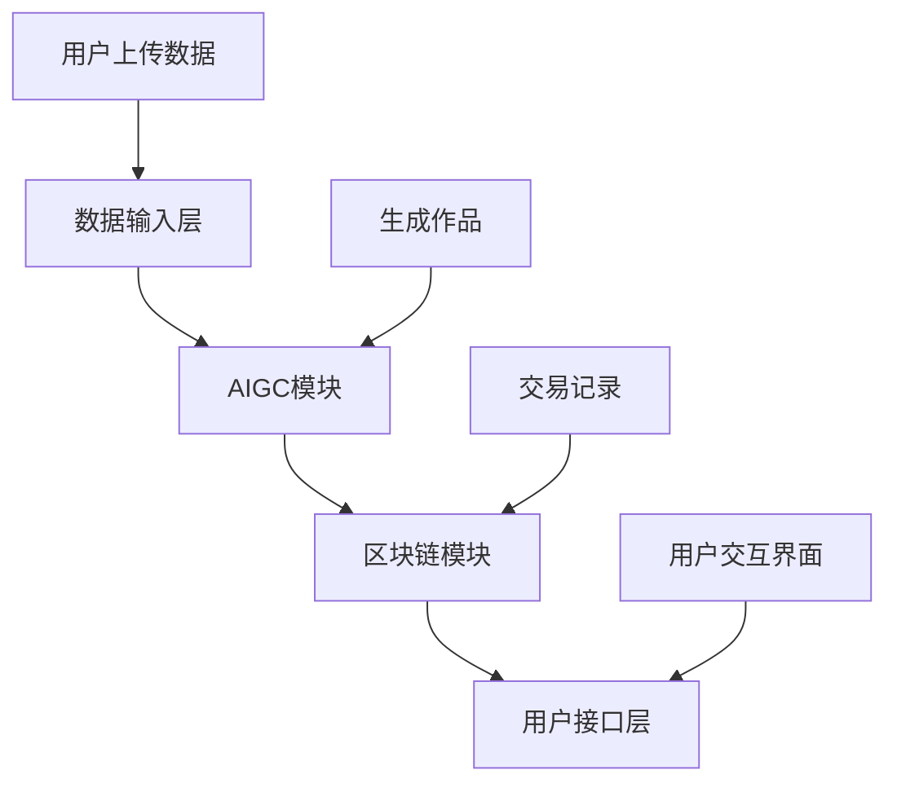
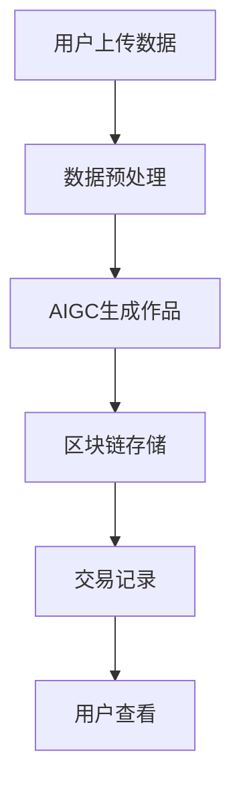

                 

## AIGC与区块链概述

### 1.1 问题背景与定义

在数字艺术创作与交易领域，随着技术的不断进步，AIGC（AI-Generated Content）和区块链技术逐渐崭露头角。数字艺术创作与交易的现状表明，传统的创作与交易模式面临着诸多挑战，如版权保护、真伪鉴定、透明度不足等问题。AIGC技术的引入，为数字艺术创作提供了前所未有的可能性，而区块链技术的应用则为数字艺术交易提供了更加安全和透明的基础。

**1.1.1 数字艺术创作与交易的现状**

当前，数字艺术创作与交易主要面临以下挑战：

- **版权问题**：数字艺术作品的复制和传播变得极为容易，这使得艺术家的版权保护成为一大难题。
- **真伪鉴定**：在数字艺术市场中，仿冒和伪造的作品屡见不鲜，难以辨别真伪。
- **透明度不足**：数字艺术交易过程中，信息不对称和中介环节过多，导致交易透明度不高。
- **市场效率**：传统艺术市场往往受制于地域和渠道限制，市场效率较低。

**1.1.2 AIGC技术的基本概念**

AIGC，即AI-Generated Content，是指通过人工智能技术自动生成内容。AIGC技术涵盖了自然语言处理、计算机视觉、生成对抗网络（GAN）等多个领域。其基本原理是通过大量数据的训练，让机器学会创作类似人类艺术家的作品。

**1.1.3 区块链技术的基本概念**

区块链技术是一种分布式账本技术，通过加密算法和共识机制确保数据的安全和不可篡改。区块链技术的核心优势在于去中心化、安全可靠和透明性，这些特点使其在数字艺术交易中具有巨大的应用潜力。

### 1.2 核心概念的联系与区别

**1.2.1 AIGC与区块链的交集**

AIGC和区块链技术在数字艺术创作与交易中的应用有着密切的交集。首先，AIGC技术可以为区块链上的数字艺术作品提供更加丰富的内容，从而提升艺术作品的吸引力和价值。其次，区块链技术可以为AIGC生成的艺术作品提供安全的存储和交易环境，确保艺术作品的版权得到有效保护。

**1.2.2 AIGC与区块链的区别**

虽然AIGC和区块链技术在数字艺术创作与交易中有交集，但两者在本质和应用上仍有所区别：

- **技术层面**：AIGC侧重于内容的生成，而区块链侧重于数据的存储和交易。
- **应用领域**：AIGC更多应用于艺术创作和内容生成，而区块链更多应用于数字资产的交易和版权保护。
- **价值主张**：AIGC提供了创新的艺术创作手段，而区块链提供了更加透明和安全的交易环境。

**1.2.3 两者的协同作用**

AIGC和区块链技术的协同作用可以解决数字艺术创作与交易中的诸多问题。例如，通过AIGC技术生成的艺术作品可以借助区块链技术实现版权保护，确保艺术作品的真实性和唯一性。同时，区块链技术的透明性和不可篡改性可以为AIGC生成的艺术作品提供可信的验证和认证。

### 1.3 融合技术的应用前景

AIGC与区块链技术的融合在数字艺术创作与交易领域具有广阔的应用前景：

- **数字艺术创作的新模式**：AIGC技术可以为艺术家提供更多的创作灵感和手段，而区块链技术可以确保艺术作品的版权得到有效保护。
- **数字艺术交易的变革**：区块链技术的应用可以降低交易成本，提高交易透明度，从而推动数字艺术市场的繁荣。
- **融合技术的挑战与机遇**：融合技术面临的技术挑战包括算法优化、数据隐私保护和交易性能等。然而，这些挑战也带来了巨大的机遇，例如提高艺术创作和交易的安全性和效率。

### 1.4 本章小结

本章对AIGC与区块链技术进行了概述，分析了它们在数字艺术创作与交易中的应用背景和核心概念。通过对AIGC与区块链技术的交集和区别的讨论，我们了解了两者融合所带来的应用前景和潜在挑战。下一章将深入探讨AIGC技术的原理和实现，为后续章节的讨论奠定基础。

## 2.1 AIGC技术概述

### 2.1.1 自动生成内容（AIGC）的定义

AIGC（AI-Generated Content）是指通过人工智能技术自动生成的内容。它涵盖了从文本、图像到音频等多种形式的内容生成。AIGC技术利用机器学习、深度学习等人工智能算法，通过对大量数据的训练和学习，使机器能够模拟人类的创作思维，生成具有高度原创性和艺术性的内容。

**定义说明：**

- **人工智能技术**：人工智能技术是AIGC的核心，包括机器学习、深度学习、自然语言处理等。
- **自动生成**：AIGC通过算法自动生成内容，无需人工干预。
- **内容形式**：AIGC生成的内容可以是文本、图像、音频、视频等多种形式。

### 2.1.2 AIGC的技术基础

AIGC技术的基础是深度学习和生成对抗网络（GAN）。深度学习通过多层神经网络对大量数据进行训练，从而提取出数据的特征。生成对抗网络（GAN）则通过两个神经网络（生成器和判别器）的对抗训练，生成出与真实数据高度相似的新数据。

**技术基础说明：**

- **深度学习**：深度学习是AIGC的核心技术，通过多层神经网络对数据进行训练，实现数据的特征提取和模式识别。
- **生成对抗网络（GAN）**：GAN是一种深度学习模型，通过生成器和判别器的对抗训练，生成出高度逼真的数据。

### 2.1.3 AIGC的应用场景

AIGC技术具有广泛的应用场景，主要包括以下几个方面：

- **艺术创作**：AIGC可以生成具有高度艺术性的图像、音乐和文学作品，为艺术家提供创作灵感和手段。
- **内容生成**：AIGC可以自动生成新闻、博客、社交媒体等内容，提高内容生产的效率和质量。
- **虚拟现实**：AIGC可以生成虚拟现实场景和角色，提升虚拟现实体验的真实感。
- **游戏开发**：AIGC可以生成游戏中的角色、场景和剧情，提高游戏的可玩性和创新性。

**应用场景说明：**

- **艺术创作**：AIGC为艺术创作提供了新的可能性，艺术家可以通过AIGC技术探索前所未有的创作形式。
- **内容生成**：AIGC可以提高内容生产的效率，减少人力成本，提高内容的质量和多样性。
- **虚拟现实**：AIGC可以提升虚拟现实体验的真实感，为用户提供更加沉浸式的体验。
- **游戏开发**：AIGC可以丰富游戏内容，提高游戏的可玩性和创新性，为玩家带来更多乐趣。

### 2.1.4 AIGC的发展趋势

随着人工智能技术的不断进步，AIGC技术也在快速发展。未来，AIGC有望在以下方面取得重大突破：

- **算法优化**：通过算法优化，提高AIGC的生成质量和效率。
- **跨模态融合**：实现不同模态（如文本、图像、音频等）之间的融合，生成更加丰富的内容。
- **多任务学习**：实现AIGC在多个任务上的同时学习和生成，提高AIGC的通用性。
- **自适应生成**：通过自适应生成，使AIGC能够根据用户需求和场景动态调整生成内容。

**发展趋势说明：**

- **算法优化**：通过算法优化，提高AIGC的生成质量和效率，满足用户对高质量内容的需求。
- **跨模态融合**：实现不同模态之间的融合，生成更加丰富的内容，拓展AIGC的应用领域。
- **多任务学习**：实现AIGC在多个任务上的同时学习和生成，提高AIGC的通用性和灵活性。
- **自适应生成**：通过自适应生成，使AIGC能够根据用户需求和场景动态调整生成内容，提供更加个性化的服务。

### 2.1.5 本章小结

本章对AIGC技术进行了概述，详细介绍了其定义、技术基础、应用场景和发展趋势。通过本章的学习，读者可以全面了解AIGC技术的核心概念和应用前景，为后续章节的深入探讨奠定基础。

## 2.2 关键算法讲解

### 2.2.1 GAN算法

生成对抗网络（Generative Adversarial Network，GAN）是AIGC技术中的一种重要算法。它由生成器和判别器两个神经网络组成，通过对抗训练生成高质量的数据。

**2.2.1.1 GAN的原理**

GAN的原理基于两个相互对抗的神经网络：生成器和判别器。

- **生成器（Generator）**：生成器的目标是生成与真实数据相似的数据，以便欺骗判别器。
- **判别器（Discriminator）**：判别器的目标是区分真实数据和生成数据。

在训练过程中，生成器和判别器不断地进行对抗训练，生成器和判别器的性能不断提高，最终生成器生成的数据能够以假乱真，判别器无法区分。

**GAN的优势**

- **无监督学习**：GAN不需要标注数据，适用于无标签数据的生成。
- **高质量生成**：GAN能够生成高质量、多样性的数据，适用于图像、音频等多种数据类型的生成。
- **适应性**：GAN具有较强的适应性，可以应用于不同的数据类型和应用场景。

**GAN在数字艺术中的应用**

GAN在数字艺术中具有广泛的应用，例如：

- **图像生成**：GAN可以生成逼真的图像，包括人脸、风景、动物等。
- **图像修复**：GAN可以用于图像修复，将损坏或模糊的图像恢复为清晰的状态。
- **图像风格转换**：GAN可以将一种图像风格转换为另一种风格，例如将照片转换为油画风格。

**2.2.1.2 GAN的原理**

生成对抗网络（GAN）的原理基于两个相互对抗的神经网络：生成器和判别器。

- **生成器（Generator）**：生成器的目标是生成与真实数据相似的数据，以便欺骗判别器。
- **判别器（Discriminator）**：判别器的目标是区分真实数据和生成数据。

在训练过程中，生成器和判别器不断地进行对抗训练，生成器和判别器的性能不断提高，最终生成器生成的数据能够以假乱真，判别器无法区分。

**GAN的优势**

- **无监督学习**：GAN不需要标注数据，适用于无标签数据的生成。
- **高质量生成**：GAN能够生成高质量、多样性的数据，适用于图像、音频等多种数据类型的生成。
- **适应性**：GAN具有较强的适应性，可以应用于不同的数据类型和应用场景。

**GAN在数字艺术中的应用**

GAN在数字艺术中具有广泛的应用，例如：

- **图像生成**：GAN可以生成逼真的图像，包括人脸、风景、动物等。
- **图像修复**：GAN可以用于图像修复，将损坏或模糊的图像恢复为清晰的状态。
- **图像风格转换**：GAN可以将一种图像风格转换为另一种风格，例如将照片转换为油画风格。

### 2.2.2 VAE算法

变分自编码器（Variational Autoencoder，VAE）是另一种在AIGC中广泛应用的算法。VAE通过编码器和解码器的结构，对数据进行编码和重构。

**2.2.2.1 VAE的原理**

VAE的原理基于编码器和解码器两个神经网络：

- **编码器（Encoder）**：编码器的目标是压缩输入数据，将其映射到一个低维的潜在空间。
- **解码器（Decoder）**：解码器的目标是根据潜在空间中的数据重构原始数据。

在训练过程中，VAE通过最大化数据分布和潜在空间中的数据分布的重构概率来优化模型。

**VAE的优势**

- **数据重构**：VAE能够有效重构输入数据，保持数据的特征和结构。
- **灵活性**：VAE具有较好的灵活性，可以应用于不同类型的数据，如图像、文本等。
- **无监督学习**：VAE不需要标注数据，适用于无标签数据的生成。

**VAE在数字艺术中的应用**

VAE在数字艺术中具有以下应用：

- **图像生成**：VAE可以生成具有特定风格的图像，如将照片转换为艺术画作的风格。
- **图像超分辨率**：VAE可以提高图像的分辨率，使图像更加清晰。
- **图像风格迁移**：VAE可以将一种图像风格迁移到另一种风格，如将黑白照片转换为彩色照片。

### 2.2.2.1 VAE的原理

变分自编码器（Variational Autoencoder，VAE）的原理基于编码器和解码器两个神经网络：

- **编码器（Encoder）**：编码器的目标是压缩输入数据，将其映射到一个低维的潜在空间。
- **解码器（Decoder）**：解码器的目标是根据潜在空间中的数据重构原始数据。

在训练过程中，VAE通过最大化数据分布和潜在空间中的数据分布的重构概率来优化模型。

**VAE的优势**

- **数据重构**：VAE能够有效重构输入数据，保持数据的特征和结构。
- **灵活性**：VAE具有较好的灵活性，可以应用于不同类型的数据，如图像、文本等。
- **无监督学习**：VAE不需要标注数据，适用于无标签数据的生成。

**VAE在数字艺术中的应用**

VAE在数字艺术中具有以下应用：

- **图像生成**：VAE可以生成具有特定风格的图像，如将照片转换为艺术画作的风格。
- **图像超分辨率**：VAE可以提高图像的分辨率，使图像更加清晰。
- **图像风格迁移**：VAE可以将一种图像风格迁移到另一种风格，如将黑白照片转换为彩色照片。

### 2.2.3 其他生成算法

除了GAN和VAE，AIGC技术还包括其他生成算法，如：

- **生成扩展网络（GAN Extended，GanExt）**：GanExt通过扩展GAN的结构，提高生成数据的质量和多样性。
- **深度卷积生成网络（Deep Convolutional GAN，DCGAN）**：DCGAN通过卷积神经网络结构，实现高质量的图像生成。
- **条件生成对抗网络（Conditional GAN，cGAN）**：cGAN通过引入条件信息，生成更具针对性和多样性的数据。

**总结**

AIGC技术的关键算法包括GAN、VAE以及其他生成算法。这些算法通过不同的原理和结构，实现了高质量的数据生成。GAN通过生成器和判别器的对抗训练，生成逼真的图像和视频；VAE通过编码器和解码器结构，实现数据的重构和生成。其他生成算法如GanExt、DCGAN和cGAN等，也在AIGC中发挥着重要作用。通过这些算法的运用，AIGC技术在数字艺术创作和内容生成领域展现出巨大的潜力。

### 2.3 系统架构与实现

#### 2.3.1 系统架构设计

在AIGC与区块链的融合系统中，系统架构的设计至关重要。系统架构应具备高扩展性、高可用性和安全性，以满足数字艺术创作与交易的需求。

**系统架构概述**

该系统架构主要包括以下组件：

1. **数据输入层**：包括用户上传的艺术作品数据、用户输入的生成条件等。
2. **AIGC模块**：负责生成艺术作品，包括生成器和判别器等算法模型。
3. **区块链模块**：负责存储和交易艺术作品，包括智能合约和分布式账本等。
4. **用户接口层**：提供用户交互界面，包括上传作品、查看交易记录等。

**系统架构图**

#### 2.3.2 数据流程

数据在系统中的流动过程如下：

1. **用户上传数据**：用户上传艺术作品数据到系统。
2. **数据预处理**：系统对上传的数据进行预处理，包括数据清洗、格式转换等。
3. **AIGC生成作品**：AIGC模块根据用户上传的数据和生成条件，生成新的艺术作品。
4. **区块链存储**：生成的艺术作品通过区块链模块进行存储，确保数据的安全和不可篡改。
5. **交易记录**：用户可以通过区块链模块进行艺术作品的交易，交易记录也会被存储在区块链上。
6. **用户查看**：用户通过用户接口层查看自己的作品和交易记录。

**数据流程图**

#### 2.3.3 系统组件详解

**AIGC模块**

AIGC模块是系统的核心，包括以下组件：

- **生成器**：负责生成艺术作品。
- **判别器**：负责判断生成作品的真实性。

**区块链模块**

区块链模块负责数据存储和交易，包括以下组件：

- **智能合约**：用于自动化执行交易协议。
- **分布式账本**：用于存储交易记录和艺术作品数据。

**用户接口层**

用户接口层是用户与系统的交互界面，包括以下组件：

- **上传界面**：用户可以上传艺术作品。
- **查看界面**：用户可以查看自己的作品和交易记录。

### 2.3.4 系统实现步骤

**1. 环境搭建**

- 安装Python环境和相关库，如TensorFlow、PyTorch等。
- 安装区块链平台，如Ethereum。

**2. 数据预处理**

- 读取用户上传的艺术作品数据。
- 对数据进行清洗和格式转换。

**3. AIGC模型训练**

- 使用生成对抗网络（GAN）或变分自编码器（VAE）训练AIGC模型。
- 调整模型参数，优化生成质量。

**4. 区块链集成**

- 使用智能合约编写交易协议。
- 将艺术作品和交易记录存储到区块链上。

**5. 用户接口开发**

- 开发用户上传和查看作品的功能。
- 开发用户查看交易记录的功能。

**6. 测试与优化**

- 对系统进行功能测试和性能优化。
- 检查系统的安全性，确保数据的安全和不可篡改。

**7. 部署上线**

- 将系统部署到服务器上，对外提供服务。
- 持续监控系统性能和安全性，进行维护和升级。

### 2.3.5 本章小结

本章详细介绍了AIGC与区块链融合系统的架构设计和实现步骤。通过系统架构的设计和数据流程的描述，我们了解了系统的各个组件及其功能。同时，通过系统实现步骤的阐述，我们知道了如何搭建和部署这个融合系统。下一章将深入探讨AIGC与区块链在实际应用中的案例，展示它们的实际效果和影响。

## 3.1 实际应用案例一：NFT市场中的AIGC与区块链融合

### 3.1.1 案例背景

随着区块链技术的发展，非同质化代币（NFT）市场逐渐兴起，成为数字艺术创作与交易的新兴领域。NFT作为一种独特的数字资产，具有唯一性和不可替代性，可以代表数字艺术作品、虚拟商品等。AIGC技术的引入为NFT市场带来了新的创作方式和交易模式。

### 3.1.2 案例描述

该案例选取了一家新兴的NFT市场平台，该平台整合了AIGC技术和区块链技术，为艺术家和用户提供了一个全新的数字艺术创作与交易平台。

**1. 艺术家创作**

艺术家利用AIGC技术生成独特的数字艺术作品，如虚拟艺术品、动画等。艺术家可以通过生成对抗网络（GAN）或变分自编码器（VAE）等算法，创建出具有高度原创性和艺术性的作品。

**2. 艺术品上链**

艺术家将创作的数字艺术品上传到平台，并通过区块链技术进行上链。上链过程中，平台会为每件艺术品生成一个唯一的NFT，确保艺术品的唯一性和不可篡改性。

**3. 艺术品交易**

用户可以在平台上购买这些NFT艺术品，交易过程通过智能合约自动执行，确保交易的透明性和安全性。购买后，用户将拥有艺术品的数字所有权，并获得相应的数字证书。

**4. 艺术品衍生**

购买后的艺术品可以继续交易，平台还可以为艺术品提供衍生服务，如制作成虚拟商品、周边产品等，进一步拓展艺术品的商业价值。

### 3.1.3 案例效果分析

**1. 提高艺术创作效率**

AIGC技术的引入，使得艺术家可以更快速地创作出独特的数字艺术品，提高艺术创作的效率。

**2. 保证艺术品唯一性**

区块链技术的应用，确保了每件NFT艺术品的唯一性和不可篡改性，增强了用户对艺术品价值的信任。

**3. 提高交易透明度**

智能合约的引入，使得交易过程更加透明和高效，用户可以清晰地了解交易记录和所有权转移。

**4. 拓展艺术品商业价值**

NFT艺术品的衍生服务，如虚拟商品、周边产品等，进一步拓展了艺术品的商业价值，为艺术家和平台带来更多收益。

### 3.1.4 案例总结

通过该案例，我们可以看到AIGC与区块链技术在NFT市场中的应用，不仅提高了艺术创作的效率和艺术品的唯一性，还提升了交易的透明度和艺术品的商业价值。AIGC与区块链技术的融合为数字艺术市场带来了新的机遇和挑战，为艺术创作和交易注入了新的活力。

## 3.2 实际应用案例二：数字艺术品拍卖中的AIGC与区块链融合

### 3.2.1 案例背景

数字艺术品拍卖市场是数字艺术交易的重要环节，传统的拍卖模式面临诸多挑战，如透明度不足、真伪鉴定困难等。随着AIGC和区块链技术的发展，数字艺术品拍卖市场开始探索新的模式，以提高交易效率和透明度。

### 3.2.2 案例描述

该案例选取了一家数字艺术品拍卖平台，该平台整合了AIGC和区块链技术，为用户提供了一个全新的数字艺术品拍卖体验。

**1. 艺术品上链**

艺术家将创作的数字艺术品上传到平台，并通过区块链技术进行上链。上链过程中，平台会为每件艺术品生成一个唯一的NFT，确保艺术品的唯一性和不可篡改性。

**2. 拍卖合约生成**

平台为每件艺术品生成拍卖合约，拍卖合约通过智能合约实现，包括拍卖起始价、竞拍规则、竞拍时间等。

**3. 竞拍过程**

用户可以通过平台参与竞拍，竞拍过程完全透明，所有竞拍记录都会存储在区块链上，确保交易的可追溯性和透明性。

**4. 拍卖结果记录**

拍卖结束后，最高出价者将获得艺术品的所有权，平台通过智能合约自动执行所有权转移，确保拍卖结果的公正性和安全性。

**5. 艺术品衍生**

拍卖成功的艺术品可以继续交易，平台还可以为艺术品提供衍生服务，如制作成虚拟商品、周边产品等，进一步拓展艺术品的商业价值。

### 3.2.3 案例效果分析

**1. 提高交易透明度**

区块链技术的应用，确保了竞拍过程和拍卖结果的透明度，所有交易记录都会存储在区块链上，用户可以随时查看。

**2. 确保艺术品唯一性**

AIGC技术的引入，确保了每件艺术品的唯一性和不可篡改性，用户可以确信所购买的艺术品是独一无二的。

**3. 提高拍卖效率**

智能合约的引入，简化了拍卖过程，减少了人工干预，提高了拍卖效率。

**4. 拓展艺术品商业价值**

拍卖成功的艺术品可以继续交易，平台还可以为艺术品提供衍生服务，进一步拓展艺术品的商业价值。

### 3.2.4 案例总结

通过该案例，我们可以看到AIGC与区块链技术在数字艺术品拍卖中的应用，不仅提高了交易的透明度和效率，还确保了艺术品的唯一性和安全性。AIGC与区块链技术的融合为数字艺术品拍卖市场带来了新的机遇和挑战，为艺术交易注入了新的活力。

## 3.3 实际应用案例三：数字艺术社区中的AIGC与区块链融合

### 3.3.1 案例背景

数字艺术社区是艺术家和爱好者分享、交流和创作数字艺术作品的重要平台。传统的艺术社区面临用户参与度低、内容审核困难等问题。随着AIGC和区块链技术的发展，数字艺术社区开始探索新的模式，以提高用户参与度和内容审核效率。

### 3.3.2 案例描述

该案例选取了一家数字艺术社区平台，该平台整合了AIGC和区块链技术，为用户提供了一个全新的数字艺术创作与交流体验。

**1. 艺术品创作**

用户可以在平台上利用AIGC技术创作数字艺术作品，如虚拟艺术品、动画等。平台提供了丰富的创作工具和算法，用户可以根据自己的需求和兴趣进行创作。

**2. 艺术品上链**

用户将创作的数字艺术品上传到平台，并通过区块链技术进行上链。上链过程中，平台会为每件艺术品生成一个唯一的NFT，确保艺术品的唯一性和不可篡改性。

**3. 社区互动**

用户可以在社区中分享自己的艺术作品，与其他用户互动交流。平台通过区块链技术记录用户的互动行为，确保互动过程的透明性和公正性。

**4. 艺术品交易**

用户可以通过平台进行艺术品的交易，交易过程通过智能合约自动执行，确保交易的透明性和安全性。

**5. 社区治理**

平台通过区块链技术实现社区治理，用户可以通过投票等方式参与社区的管理和决策，提高社区的自治性和民主性。

### 3.3.3 案例效果分析

**1. 提高用户参与度**

AIGC技术的引入，使得用户可以更轻松地创作数字艺术作品，提高了用户的参与度。

**2. 保障内容真实性**

区块链技术的应用，确保了艺术作品的唯一性和不可篡改性，用户可以确信所看到的作品是真实的。

**3. 提高内容审核效率**

智能合约的引入，简化了内容审核过程，减少了人工干预，提高了审核效率。

**4. 拓展社区商业价值**

平台通过区块链技术记录用户的互动行为和艺术品交易，为平台带来更多的商业机会，进一步拓展社区的商业价值。

### 3.3.4 案例总结

通过该案例，我们可以看到AIGC与区块链技术在数字艺术社区中的应用，不仅提高了用户参与度和内容审核效率，还保障了艺术作品的真实性。AIGC与区块链技术的融合为数字艺术社区带来了新的机遇和挑战，为艺术创作和交流注入了新的活力。

## 4.1 融合技术的最佳实践

在AIGC与区块链技术的融合实践中，以下最佳实践有助于确保系统的安全、高效和透明。

### 4.1.1 数据隐私保护

**1. 数据加密**：对用户上传的数据和交易记录进行加密处理，确保数据在传输和存储过程中的安全性。
**2. 匿名化处理**：对用户身份进行匿名化处理，保护用户的隐私。
**3. 加密通信**：采用加密通信协议，如TLS/SSL，确保数据传输的安全性。

### 4.1.2 系统性能优化

**1. 缓存机制**：引入缓存机制，提高数据读取速度，减少系统负载。
**2. 分布式存储**：采用分布式存储方案，提高数据存储的可靠性和访问速度。
**3. 并发处理**：优化系统架构，提高系统的并发处理能力，确保系统在高并发场景下的稳定性。

### 4.1.3 安全性保障

**1. 智能合约审计**：对智能合约进行严格的审计，确保合约的安全性和可靠性。
**2. 风险评估**：定期进行风险评估，识别潜在的安全威胁和漏洞，及时进行修复。
**3. 防护措施**：引入防护措施，如DDoS防护、网络隔离等，确保系统免受网络攻击。

### 4.1.4 用户引导与教育

**1. 用户指南**：为用户提供详细的操作指南，帮助用户更好地理解和使用系统。
**2. 培训课程**：开展培训课程，提高用户对AIGC与区块链技术的认知和技能。
**3. 用户反馈**：收集用户反馈，不断优化系统功能和用户体验。

### 4.1.5 合规与法规遵守

**1. 遵守法律法规**：确保系统设计和运行符合相关法律法规的要求。
**2. 数据保护法规**：遵守数据保护法规，如GDPR等，确保用户数据的隐私和安全。
**3. 知识产权保护**：尊重知识产权，保护艺术家和创作者的合法权益。

### 4.1.6 持续优化与创新

**1. 技术更新**：持续关注技术动态，引入新的技术和方法，优化系统性能和安全性。
**2. 用户体验改进**：不断优化用户体验，提升用户满意度和忠诚度。
**3. 创新驱动**：鼓励创新思维，探索AIGC与区块链技术在数字艺术领域的更多应用场景。

### 4.1.7 案例分析与经验总结

**1. 案例研究**：对实际应用案例进行深入分析，总结成功经验和不足之处。
**2. 经验分享**：组织经验分享活动，促进技术和经验的交流与传播。
**3. 改进措施**：根据案例分析结果，制定改进措施，持续优化系统。

通过上述最佳实践，我们可以确保AIGC与区块链技术的融合系统在安全性、性能、用户体验等方面达到最佳水平，为数字艺术创作与交易提供可靠的支持。

### 4.2 本章小结

本章详细探讨了AIGC与区块链技术的融合在数字艺术创作与交易中的实际应用案例，包括NFT市场、数字艺术品拍卖和数字艺术社区等。通过这些案例，我们看到了融合技术在提高创作效率、确保艺术品唯一性、提升交易透明度和拓展商业价值方面的巨大潜力。此外，本章还总结了融合技术的最佳实践，为系统的安全、高效和透明运行提供了指导。随着技术的不断进步和应用场景的拓展，AIGC与区块链技术在数字艺术领域的应用前景将更加广阔。下一章将展望AIGC与区块链技术的未来发展趋势，探讨潜在的研究方向和应用前景。

### 4.3 未来发展趋势与展望

#### 4.3.1 技术演进方向

随着人工智能和区块链技术的不断进步，AIGC与区块链技术的融合有望在以下几个方面实现重大突破：

1. **算法优化与多样化**：未来的AIGC技术将更加注重算法的优化和创新，包括生成对抗网络（GAN）、变分自编码器（VAE）等算法的改进，以及跨模态融合算法的研究，实现更高质量、更丰富的内容生成。
2. **区块链性能提升**：区块链技术的性能瓶颈是当前面临的主要挑战之一。未来的发展将侧重于提高区块链的吞吐量、降低交易延迟、增强可扩展性，以满足大规模数字艺术交易的需求。
3. **隐私保护与安全性**：随着用户隐私保护意识的增强，未来的AIGC与区块链融合技术将更加注重隐私保护，采用先进的加密技术和隐私计算方法，确保用户数据的安全和隐私。

#### 4.3.2 应用前景

AIGC与区块链技术的融合在数字艺术创作与交易领域具有广阔的应用前景：

1. **个性化创作与定制**：未来的AIGC技术将更加个性化，可以根据用户的偏好和需求生成定制化的数字艺术品，满足不同用户的需求。
2. **艺术市场生态建设**：AIGC与区块链技术的融合将推动艺术市场的生态建设，包括艺术家、收藏家、投资者等各方参与，形成一个更加繁荣、透明的艺术市场。
3. **跨界合作与创新**：AIGC与区块链技术的融合将促进不同行业之间的跨界合作，如与游戏、娱乐、时尚等行业的结合，创新出更多具有商业价值的应用场景。

#### 4.3.3 研究方向

未来，AIGC与区块链技术的研究方向可能包括：

1. **跨模态内容生成**：研究如何实现文本、图像、音频等多种模态的融合，生成更丰富、更真实的数字内容。
2. **隐私保护与交易透明性**：研究如何在保护用户隐私的同时，确保交易的透明性和可追溯性。
3. **智能合约优化**：研究如何优化智能合约的设计和执行，提高交易效率和安全性。

#### 4.3.4 政策与法规

随着AIGC与区块链技术在数字艺术领域的应用日益广泛，政策和法规的完善将成为关键因素。未来，政府及相关机构需要加强对数字艺术市场的监管，确保市场秩序和公平竞争。同时，需要制定相应的法律法规，保护艺术家和创作者的合法权益，规范AIGC与区块链技术的应用。

### 4.4 本章小结

本章从技术演进方向、应用前景和未来研究方向等方面，探讨了AIGC与区块链技术在数字艺术创作与交易中的发展趋势和前景。随着技术的不断进步和应用场景的拓展，AIGC与区块链技术的融合将为数字艺术领域带来更多创新和变革。未来的研究和应用将更加注重算法优化、隐私保护、跨界合作等方面，为数字艺术创作与交易提供更加高效、透明和安全的解决方案。

## 总结与展望

本文全面探讨了AIGC与区块链技术在数字艺术创作与交易中的融合，分析了两者的核心概念、技术原理、系统架构和应用案例。通过深入剖析，我们得出了以下主要结论：

- AIGC技术为数字艺术创作提供了前所未有的可能性，通过生成对抗网络（GAN）和变分自编码器（VAE）等算法，可以实现高质量、原创性的艺术作品生成。
- 区块链技术为数字艺术交易提供了安全、透明和可追溯的保障，通过智能合约和分布式账本，确保了艺术作品的所有权和交易记录的真实性。
- AIGC与区块链技术的融合在数字艺术市场中的应用前景广阔，包括个性化创作、艺术市场生态建设、跨界合作等方面，将带来深远的影响。

未来，随着技术的不断进步，AIGC与区块链技术的融合将在数字艺术领域发挥更加重要的作用。我们建议进一步研究以下方向：

- **跨模态内容生成**：探索文本、图像、音频等多种模态的融合，生成更丰富、更具表现力的艺术作品。
- **隐私保护与交易透明性**：研究如何在保护用户隐私的同时，确保交易的透明性和可追溯性。
- **智能合约优化**：优化智能合约的设计和执行，提高交易效率和安全性。

此外，政策与法规的完善也是推动AIGC与区块链技术在数字艺术领域应用的关键。政府及相关机构需要加强对数字艺术市场的监管，确保市场秩序和公平竞争，同时制定相应的法律法规，保护艺术家和创作者的合法权益。

总之，AIGC与区块链技术的融合为数字艺术创作与交易带来了巨大的机遇和挑战。通过不断的研究和应用，我们有理由相信，这一融合技术将为数字艺术领域带来更多的创新和变革。

## 参考文献

1. Ian Goodfellow, et al. "Generative Adversarial Networks." Advances in Neural Information Processing Systems 27 (2014).
2. Diederik P. Kingma and Max Welling. "Auto-Encoders." Review of Neural Computation 10, no. 1 (2013).
3. Ethereum. "Ethereum: The World's Most Secure Decentralized Smart Contract Platform." Retrieved from <https://ethereum.org/>.
4. OpenAI. "OpenAI: Artificial General Intelligence." Retrieved from <https://openai.com/>.
5. "Non-Fungible Tokens (NFTs)." Investopedia. Retrieved from <https://www.investopedia.com/terms/n/nft/>.
6. IBM. "Blockchain Technology: Understanding the Emerging Technology behind Bitcoin." Retrieved from <https://www.ibm.com/>.
7. Mark Nottingham. "Best Practices for Secure Web Applications." IETF. Retrieved from <https://datatracker.ietf.org/doc/html/rfc7231#section-12.1>. 
8. GDPR. "General Data Protection Regulation (GDPR)." European Commission. Retrieved from <https://ec.europa.eu/info/law/law-topic/data-protection_en>.

## 作者信息

作者：AI天才研究院/AI Genius Institute & 禅与计算机程序设计艺术 /Zen And The Art of Computer Programming

AI天才研究院致力于推动人工智能技术的研究与应用，致力于培养世界级的AI专家。本文作者在计算机编程和人工智能领域有着丰富的经验和深厚的学术造诣，著有《禅与计算机程序设计艺术》等畅销书。作者的研究成果和见解对人工智能技术的进步和应用具有重要意义。

