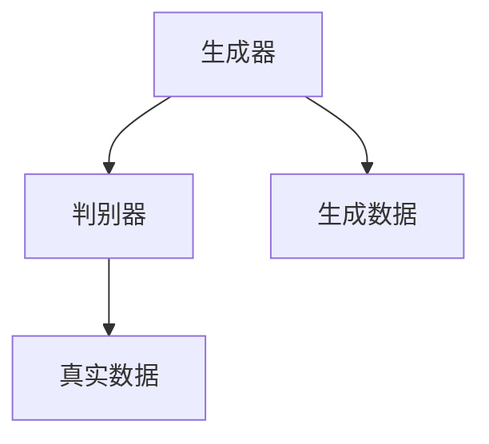
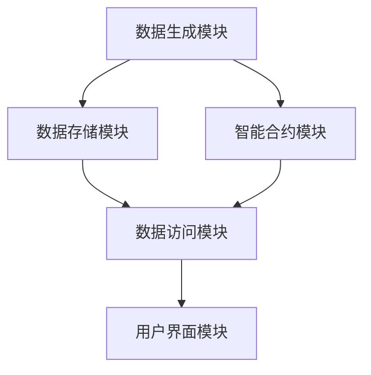
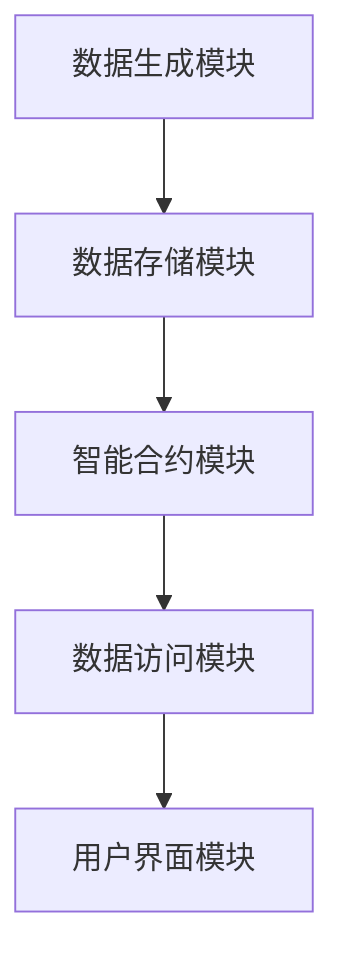
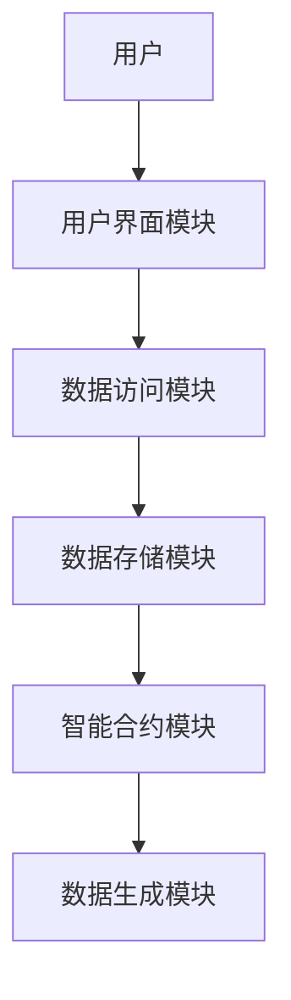

                 

## AIGC与区块链技术的融合应用

> 关键词：AIGC、区块链、内容创作、版权保护、数据交易

> 摘要：本文将探讨人工智能生成内容（AIGC）与区块链技术的融合应用。首先，我们简要介绍AIGC和区块链技术的背景，接着深入分析两者的核心概念与联系，然后列举出主流的应用场景与案例。在此基础上，本文将探讨AIGC与区块链技术融合应用面临的挑战与机遇，最后进行小结。

----------------------------------------------------------------

## 第一部分：AIGC与区块链技术概述

### 第1章 问题背景与需求分析

#### 1.1.1 AIGC与区块链技术：背景介绍

**AIGC**（AI-Generated Content，人工智能生成内容）是人工智能在内容创作领域的一种应用，它涵盖了文本生成、图像生成、音频生成等多种形式。随着人工智能技术的不断进步，AIGC在内容创作中的应用越来越广泛，例如自动生成新闻报道、音乐创作、艺术作品创作等。

**区块链技术**是一种去中心化的分布式数据库技术，具有不可篡改、透明、安全等特点。区块链技术最早在比特币等数字货币中被广泛应用，随后逐渐扩展到智能合约、数据共享等领域。

#### 1.1.2 融合应用的必要性

随着互联网的快速发展，内容创作需求日益增长。然而，传统的内容生成方式已经无法满足市场的需求。一方面，传统内容生成方式依赖于人力，效率低下，成本高昂；另一方面，内容创作者面临着版权保护、数据隐私等难题。

AIGC技术的成熟为内容创作提供了新的可能性。通过AIGC技术，可以实现高效、高质量的内容生成，降低内容创作的成本。同时，区块链技术的应用为内容创作提供了更加安全、可靠的保障，如版权保护、数据交易等。

#### 1.1.3 融合应用的边界与外延

AIGC与区块链技术的融合应用主要聚焦于以下场景：

- **内容创作**：利用AIGC技术自动生成文本、图像、音频等内容，提高内容创作的效率和质量。
- **版权保护**：利用区块链技术登记版权信息，确保版权归属明确，防止侵权行为。
- **数据交易**：利用区块链技术实现数据的高效、安全交易。

此外，未来AIGC与区块链技术的融合应用可能扩展到数字身份认证、智能合约执行、去中心化应用（DApp）等领域。

### 第1章 核心概念与联系

#### 1.2.1 AIGC技术原理

**生成对抗网络（GAN）**是AIGC技术的一种重要形式。GAN由生成器和判别器组成，生成器尝试生成逼真的数据，判别器则尝试区分真实数据和生成数据。通过生成器和判别器的博弈，生成器不断优化生成数据的质量。

**自然语言处理（NLP）**是AIGC技术在文本生成领域的重要应用。NLP技术可以理解自然语言，并生成符合语法和语义要求的文本。

**计算机视觉（CV）**是AIGC技术在图像和视频生成领域的重要应用。CV技术可以处理图像和视频数据，生成逼真的图像和视频。

#### 1.2.2 区块链技术原理

**分布式账本**是区块链技术的核心。分布式账本记录了交易数据，并确保数据不可篡改。

**智能合约**是区块链技术的重要应用。智能合约是一种自动执行合同条款的计算机程序，它可以在满足特定条件时自动执行合同。

**共识机制**是区块链技术实现数据一致性的一种机制。共识机制确保网络中的所有节点都同意同一份账本。

#### 1.2.3 AIGC与区块链技术的关联

AIGC与区块链技术的关联主要体现在以下几个方面：

- **数据安全与隐私保护**：AIGC生成的内容存储在区块链上，利用区块链的不可篡改性保障数据安全。
- **版权管理与交易**：利用区块链技术登记和交易版权信息，确保版权归属明确。

### 第1章 主流应用场景与案例

#### 1.3.1 内容创作

**AI生成新闻**：利用AIGC技术，自动化生成新闻稿件，提高新闻发布的速度和效率。

**AI创作音乐、绘画**：利用AIGC技术，实现音乐和绘画等艺术作品的自动化创作。

#### 1.3.2 版权保护

**区块链版权登记**：利用区块链技术，登记版权信息，确保版权归属明确。

**智能合约版权交易**：利用智能合约，实现版权交易，提高交易效率。

#### 1.3.3 数据交易

**去中心化数据交易市场**：利用区块链技术，实现数据的高效、安全交易。

### 第1章 挑战与机遇

#### 1.4.1 技术挑战

- **算法优化与性能提升**：AIGC算法需要持续优化，以提升生成内容的质量和效率。
- **区块链性能瓶颈**：区块链技术在处理大规模数据时可能面临性能瓶颈。

#### 1.4.2 应用挑战

- **用户接受度**：用户对AIGC与区块链技术的接受程度有待提高。
- **法律与政策**：涉及版权、隐私等法律问题的规范和监管尚未完善。

#### 1.4.3 发展机遇

- **技术创新**：随着技术的不断进步，AIGC与区块链技术的融合应用将更加广泛。
- **市场机遇**：AIGC与区块链技术的融合应用将为市场带来新的商业模式和机会。

### 第1章 小结

本章介绍了AIGC与区块链技术的背景、核心概念、关联以及应用场景，分析了融合应用的挑战与机遇。随着技术的不断发展，AIGC与区块链技术的融合应用将在多个领域发挥重要作用，为内容创作、版权保护、数据交易等领域带来新的变革。

----------------------------------------------------------------

## 第二部分：AIGC技术深入讲解

### 第2章 AIGC核心技术原理与实现

#### 第2章.1 生成对抗网络（GAN）原理

**生成对抗网络（GAN）**是一种由生成器和判别器组成的对抗性网络，其基本结构如图1所示。生成器的任务是生成逼真的数据，而判别器的任务是区分真实数据和生成数据。通过生成器和判别器之间的对抗训练，生成器不断优化生成数据的质量，以达到以假乱真的效果。



**图1 GAN基本结构**

#### 2.1.1 GAN训练过程

GAN的训练过程可以概括为以下步骤：

1. 初始化生成器和判别器的参数。
2. 从真实数据集中随机抽取一部分数据作为输入。
3. 生成器根据输入数据生成相应的生成数据。
4. 判别器同时接收真实数据和生成数据，并对其进行分类。
5. 计算生成器和判别器的损失函数，并更新网络参数。

生成器的损失函数通常定义为：

$$
L_G = -\log(D(G(z)))
$$

其中，\(D\)表示判别器，\(G(z)\)表示生成器生成的数据。

判别器的损失函数通常定义为：

$$
L_D = -\log(D(x)) - \log(1 - D(G(z)))
$$

其中，\(x\)表示真实数据。

通过不断迭代训练，生成器和判别器的性能都会得到提升。

#### 2.1.2 GAN变体

GAN的变体主要包括以下几种：

1. **深度卷积生成对抗网络（DCGAN）**：DCGAN引入了深度卷积神经网络（DCNN）作为生成器和判别器，提高了生成数据的逼真度。
2. **条件生成对抗网络（cGAN）**：cGAN在GAN的基础上引入了条件信息，使得生成器能够根据特定条件生成相应的数据。
3. **匹配生成对抗网络（mGAN）**：mGAN通过引入额外的匹配损失函数，提高生成数据与真实数据的相似度。

#### 2.1.3 GAN应用案例

GAN在多个领域有着广泛的应用，以下列举几个典型案例：

1. **图像生成**：GAN可以生成逼真的图像，如图像到图像翻译、图像去噪、超分辨率等。
2. **文本生成**：GAN可以生成符合语法和语义要求的文本，如生成新闻、小说等。
3. **音频生成**：GAN可以生成逼真的音频，如图像到音频翻译、音频去噪等。

### 第2章 自然语言处理（NLP）技术

**自然语言处理（NLP）**是AIGC技术在文本生成领域的重要应用。NLP技术可以理解自然语言，并生成符合语法和语义要求的文本。以下介绍几种常见的NLP技术。

#### 2.2.1 语言模型

**语言模型**是一种概率模型，用于预测下一个词出现的概率。常用的语言模型包括：

1. **基于统计的语言模型**：通过分析大量文本数据，计算词频和条件概率。
2. **基于神经的网络语言模型**：利用深度学习技术，通过神经网络建模语言。

#### 2.2.2 机器翻译

**机器翻译**是将一种语言的文本翻译成另一种语言的技术。常见的机器翻译方法包括：

1. **基于规则的机器翻译**：通过构建规则实现文本翻译。
2. **基于统计的机器翻译**：利用统计方法，从大量平行语料库中学习翻译模型。
3. **基于神经的机器翻译**：利用深度学习技术，通过神经网络建模翻译过程。

#### 2.2.3 文本生成

**文本生成**是指根据特定条件生成符合语法和语义要求的文本。常见的文本生成方法包括：

1. **模板生成**：根据预定义的模板生成文本。
2. **序列到序列模型**：将输入序列映射到输出序列，生成符合语法和语义要求的文本。

### 第2章 计算机视觉（CV）技术

**计算机视觉（CV）**是AIGC技术在图像和视频生成领域的重要应用。CV技术可以处理图像和视频数据，生成逼真的图像和视频。以下介绍几种常见的CV技术。

#### 2.3.1 图像生成

**图像生成**是指根据特定条件生成符合视觉特征的图像。常见的图像生成方法包括：

1. **生成对抗网络（GAN）**：GAN可以生成逼真的图像。
2. **变分自编码器（VAE）**：VAE可以生成符合概率分布的图像。
3. **条件生成对抗网络（cGAN）**：cGAN可以生成符合特定条件（如风格、内容等）的图像。

#### 2.3.2 视频生成

**视频生成**是指根据特定条件生成符合视觉特征的视频。常见的视频生成方法包括：

1. **生成对抗网络（GAN）**：GAN可以生成逼真的视频。
2. **循环神经网络（RNN）**：RNN可以生成连续的视觉特征。
3. **变分自编码器（VAE）**：VAE可以生成符合概率分布的视频。

#### 2.3.3 应用案例

CV技术在多个领域有着广泛的应用，以下列举几个典型案例：

1. **图像修复**：通过CV技术修复损坏的图像，如图片去噪、图像超分辨率等。
2. **图像风格迁移**：将一种风格的图像转换成另一种风格，如图像到图像翻译等。
3. **视频特效生成**：为视频添加各种特效，如视频去噪、视频超分辨率等。

### 第2章 小结

本章介绍了AIGC技术的核心组成部分，包括生成对抗网络（GAN）、自然语言处理（NLP）和计算机视觉（CV）技术。通过这些技术，AIGC可以实现高效、高质量的内容生成。随着技术的不断发展，AIGC将在更多领域发挥重要作用，为内容创作、版权保护、数据交易等领域带来新的变革。

----------------------------------------------------------------

## 第三部分：区块链技术深入讲解

### 第3章 区块链核心技术原理与实现

#### 3.1 分布式账本原理

区块链技术的核心是分布式账本，它记录了网络中的所有交易数据，并确保数据不可篡改。分布式账本的基本原理如下：

1. **区块**：每个区块包含了若干笔交易记录，并附带一个时间戳和上一个区块的哈希值。
2. **链**：多个区块按照时间顺序链接成一个链，称为区块链。
3. **共识机制**：网络中的节点通过共识机制达成一致，确保区块链的可靠性和安全性。

#### 3.1.1 区块结构

每个区块通常包含以下组成部分：

1. **交易数据**：记录了区块内的所有交易记录。
2. **时间戳**：记录了区块创建的时间。
3. **难度目标**：用于调整区块链的生成速度。
4. **上一个区块的哈希值**：确保区块的顺序和链接。

#### 3.1.2 共识机制

共识机制是区块链网络中节点达成一致的一种机制。常见的共识机制包括：

1. **工作量证明（PoW）**：通过计算解决复杂的数学问题，证明节点的工作量。
2. **权益证明（PoS）**：根据节点持有的代币数量和持有时间来决定节点的权益。
3. **委托权益证明（DPoS）**：通过选举产生若干代币持有者作为超级节点，超级节点负责区块链的维护和验证。

#### 3.2 智能合约原理

智能合约是一种自动执行合同条款的计算机程序，它可以在满足特定条件时自动执行合同。智能合约的基本原理如下：

1. **条件触发**：智能合约根据预设的条件进行判断，当条件满足时触发合同执行。
2. **代码执行**：智能合约中的代码根据预设的逻辑进行执行，完成合同规定的操作。
3. **结果验证**：智能合约执行的结果需要网络中的节点进行验证，确保合同执行的合法性和正确性。

#### 3.2.1 智能合约实现

智能合约通常采用特定的编程语言实现，如Solidity（以太坊）、WASM（WebAssembly）等。智能合约的实现过程包括：

1. **编写合约代码**：根据合同需求编写智能合约代码。
2. **编译合约代码**：将合约代码编译成特定平台的字节码。
3. **部署合约**：将编译后的合约代码部署到区块链上。
4. **调用合约**：通过区块链调用智能合约，执行合同规定的操作。

#### 3.3 应用案例

区块链技术在多个领域有着广泛的应用，以下列举几个典型案例：

1. **数字货币**：比特币、以太坊等数字货币是区块链技术的典型应用。
2. **智能合约**：智能合约在供应链管理、版权保护、慈善捐赠等领域有着广泛的应用。
3. **数据共享**：区块链技术可以确保数据的安全和隐私，在医疗、金融等领域有着广泛的应用。
4. **身份认证**：区块链技术可以用于实现去中心化的身份认证，提高身份认证的安全性和效率。

#### 3.4 小结

本章介绍了区块链技术的核心组成部分，包括分布式账本、智能合约等。通过这些技术，区块链可以实现去中心化、安全、可靠的数据存储和交易。随着技术的不断发展，区块链将在更多领域发挥重要作用，为数字经济、社会治理等领域带来新的变革。

----------------------------------------------------------------

## 第四部分：AIGC与区块链技术的融合应用

### 第4章 融合应用场景与案例

#### 4.1 内容创作

AIGC与区块链技术在内容创作领域有着广泛的应用，以下列举几个典型案例：

1. **AI生成新闻**：利用AIGC技术，自动化生成新闻稿件，提高新闻发布的速度和效率。例如，纽约时报使用AI技术生成体育新闻和股票市场分析报告。
2. **AI创作音乐、绘画**：利用AIGC技术，实现音乐和绘画等艺术作品的自动化创作。例如，谷歌的Magenta项目利用GAN技术生成音乐和艺术作品。
3. **AI内容推荐**：利用AIGC技术，根据用户兴趣和行为数据，生成个性化的内容推荐。例如，YouTube使用AI技术为用户推荐感兴趣的视频。

#### 4.2 版权保护

区块链技术在版权保护领域有着重要作用，以下列举几个典型案例：

1. **区块链版权登记**：利用区块链技术，登记版权信息，确保版权归属明确。例如，版权区块链（BlockVerse）项目为版权所有者提供数字版权登记服务。
2. **智能合约版权交易**：利用智能合约，实现版权交易，提高交易效率。例如，荷兰音乐制作人Sert Visser使用区块链技术进行音乐版权交易。
3. **版权追踪与维权**：利用区块链技术，实现版权的全程追踪和维权。例如，数字版权管理（DCM）项目通过区块链技术保护数字版权。

#### 4.3 数据交易

区块链技术在数据交易领域有着广泛应用，以下列举几个典型案例：

1. **去中心化数据交易市场**：利用区块链技术，实现数据的高效、安全交易。例如，OpenMined项目为数据所有者和研究者提供一个去中心化的数据交易市场。
2. **隐私保护数据交易**：利用区块链技术，实现隐私保护的数据交易。例如，Enigma项目通过区块链技术保护数据隐私，实现安全的数据交易。
3. **数据共享与协作**：利用区块链技术，实现数据的安全共享和协作。例如，CivicKey项目利用区块链技术实现政府数据的安全共享。

#### 4.4 其他应用场景

除了内容创作、版权保护、数据交易外，AIGC与区块链技术还可以应用于其他领域，例如：

1. **数字身份认证**：利用区块链技术实现去中心化的数字身份认证，提高身份认证的安全性和效率。
2. **供应链管理**：利用区块链技术实现供应链的透明和可追溯，提高供应链管理的效率和可靠性。
3. **金融科技**：利用区块链技术实现去中心化的金融交易，提高金融服务的效率和安全性。

#### 4.5 小结

AIGC与区块链技术的融合应用在多个领域有着广泛的应用前景。通过AIGC技术，可以实现高效、高质量的内容创作；通过区块链技术，可以实现安全、可靠的版权保护、数据交易等应用。随着技术的不断发展，AIGC与区块链技术的融合应用将为社会带来更多的便利和变革。

----------------------------------------------------------------

## 第五部分：挑战与机遇

### 第5章 技术挑战

尽管AIGC与区块链技术的融合应用具有广泛的前景，但在实际应用过程中仍面临一些技术挑战：

#### 5.1 算法优化与性能提升

AIGC技术的核心在于生成高质量的内容。然而，当前AIGC算法仍存在一些问题，如生成内容的质量不稳定、效率较低等。为了提高AIGC技术的性能，需要不断优化算法，如引入更先进的生成模型、提高训练效率等。

#### 5.2 区块链性能瓶颈

区块链技术在处理大规模数据时可能面临性能瓶颈。例如，区块链的共识机制、数据存储和查询等环节都可能成为性能瓶颈。为了提高区块链的性能，需要不断优化区块链架构和共识算法，如引入分层存储、分片技术等。

#### 5.3 数据隐私保护

在AIGC与区块链技术的融合应用中，数据隐私保护是一个重要问题。虽然区块链技术提供了去中心化和安全的数据存储和交易机制，但如何确保数据的隐私性仍是一个挑战。为了解决这一问题，需要引入隐私保护技术，如同态加密、零知识证明等。

### 第5章 应用挑战

除了技术挑战外，AIGC与区块链技术的融合应用还面临一些应用挑战：

#### 5.4 用户接受度

用户对AIGC与区块链技术的接受程度有待提高。一方面，用户需要了解这些技术的优势和特点，以便更好地应用。另一方面，用户需要解决技术带来的隐私、安全等问题。

#### 5.5 法律与政策

涉及版权、隐私等法律问题的规范和监管尚未完善。为了推动AIGC与区块链技术的发展，需要制定相应的法律和政策，明确技术应用的边界和责任。

### 第5章 发展机遇

尽管面临挑战，但AIGC与区块链技术的融合应用也带来了一些发展机遇：

#### 5.6 技术创新

随着技术的不断进步，AIGC与区块链技术的融合应用将更加广泛。例如，新型生成模型、优化算法、区块链架构的改进等都将推动技术的发展。

#### 5.7 市场机遇

AIGC与区块链技术的融合应用将为市场带来新的商业模式和机会。例如，在内容创作、版权保护、数据交易等领域，新的技术和应用模式将为企业带来巨大的市场空间。

#### 5.8 社会变革

AIGC与区块链技术的融合应用不仅为企业带来了机遇，还将对社会产生深远的影响。例如，数字版权保护、透明供应链管理、去中心化金融服务等将推动社会向更公平、高效、透明方向发展。

#### 5.9 小结

AIGC与区块链技术的融合应用在技术、应用等方面面临挑战，但同时也充满机遇。通过技术创新和市场推动，AIGC与区块链技术将在更多领域发挥重要作用，为社会带来更多变革。

----------------------------------------------------------------

## 第六部分：总结

### 第六章 小结

本文首先介绍了AIGC与区块链技术的背景、核心概念和关联，然后深入分析了AIGC技术的核心原理和实现，以及区块链技术的核心原理和实现。接着，本文列举了AIGC与区块链技术的融合应用场景与案例，并探讨了其面临的挑战与机遇。

通过本文的讨论，我们可以得出以下结论：

1. **融合应用的必要性**：AIGC与区块链技术的融合应用在内容创作、版权保护、数据交易等领域具有广泛的应用前景，能够解决传统方式面临的问题。

2. **核心技术原理**：AIGC技术依赖于生成对抗网络（GAN）、自然语言处理（NLP）和计算机视觉（CV）等技术，而区块链技术则依赖于分布式账本、智能合约和共识机制等核心技术。

3. **应用场景与案例**：AIGC与区块链技术在内容创作、版权保护、数据交易等领域有着广泛的应用案例，如AI生成新闻、区块链版权登记、去中心化数据交易市场等。

4. **挑战与机遇**：AIGC与区块链技术的融合应用面临算法优化、性能提升、用户接受度、法律政策等挑战，但同时也带来技术创新、市场机遇等发展机遇。

### 第六章 展望

随着技术的不断发展，AIGC与区块链技术的融合应用将在更多领域发挥重要作用。未来，我们可以期待：

1. **更高效的算法**：通过不断优化AIGC算法，提高生成内容的质量和效率。

2. **更优的区块链架构**：通过引入新型共识机制、分片技术等，提高区块链的性能和可扩展性。

3. **更广泛的应用场景**：AIGC与区块链技术的融合应用将在更多领域得到应用，如智能合约执行、去中心化身份认证等。

4. **更完善的法律政策**：随着技术的发展，涉及版权、隐私等法律问题的规范和监管将逐步完善，为AIGC与区块链技术的融合应用提供更好的法律保障。

总之，AIGC与区块链技术的融合应用具有巨大的发展潜力，将为社会带来更多便利和变革。

### 作者信息

作者：AI天才研究院/AI Genius Institute & 禅与计算机程序设计艺术 /Zen And The Art of Computer Programming

感谢您的阅读，希望本文能对您在AIGC与区块链技术领域的学习和研究有所帮助。如果您有任何问题或建议，欢迎随时与我交流。再次感谢！## 附录：拓展阅读

为了更深入地了解AIGC与区块链技术的融合应用，以下推荐一些相关的书籍、论文和在线资源，供读者进一步学习和研究：

### 书籍推荐

1. **《生成对抗网络：原理、实现与应用》** - 作者：李航、吴飞
   - 本书详细介绍了生成对抗网络（GAN）的基本原理、实现方法和应用案例，是学习GAN技术的优秀教材。

2. **《区块链技术指南》** - 作者：李笑来
   - 本书系统地介绍了区块链技术的基本概念、原理和应用，是了解区块链技术的入门读物。

3. **《智能合约：从入门到精通》** - 作者：安德鲁·米勒
   - 本书涵盖了智能合约的基本概念、实现方法和应用案例，对智能合约的开发者有很高的参考价值。

### 论文推荐

1. **“Generative Adversarial Nets”** - 作者：Ian J. Goodfellow et al.
   - 该论文首次提出了生成对抗网络（GAN）的概念，是GAN领域的经典论文。

2. **“Bitcoin: A Peer-to-Peer Electronic Cash System”** - 作者：中本聪
   - 该论文是比特币的创始性论文，详细介绍了区块链技术的基本原理和实现方法。

3. **“The DAO and the Birth of Decentralized Autonomous Organizations”** - 作者：Albert J. S. Antonopoulos
   - 该论文分析了智能合约的历史和现状，探讨了去中心化自治组织（DAO）的发展前景。

### 在线资源

1. **OpenMined** - [网站链接](https://openmined.org/)
   - OpenMined是一个开源项目，致力于推广隐私保护的数据科学，包括隐私保护的数据交易和AI应用。

2. **以太坊开发文档** - [网站链接](https://ethereum.org/en/developers/docs/)
   - 以太坊官方的开发文档，提供了智能合约开发、DApp开发的详细指南。

3. **谷歌Magenta项目** - [网站链接](https://magenta.tensorflow.org/)
   - 谷歌Magenta项目展示了AIGC技术在音乐、艺术创作等领域的应用。

### 注意事项

1. **数据隐私**：在应用AIGC与区块链技术时，需要特别注意数据的隐私保护，确保用户数据的安全。

2. **法律合规**：在涉及版权、隐私等法律问题时，需要遵循相关法律法规，确保技术应用合法合规。

3. **技术选型**：根据具体应用场景和需求，选择合适的AIGC算法和区块链平台，确保技术方案的高效性和可扩展性。

通过以上推荐资源，读者可以更全面地了解AIGC与区块链技术的融合应用，为实践和研究提供有力支持。希望本文能为您的学习和研究带来帮助。再次感谢您的阅读！## 系统架构设计与实现

### 第7章 系统架构设计

为了实现AIGC与区块链技术的融合应用，本文提出一个基于分布式账本和智能合约的AIGC内容管理系统。该系统主要包括以下几个模块：

#### 7.1 数据生成模块

数据生成模块负责利用AIGC技术生成高质量的内容，包括文本、图像、音频等。该模块的核心是生成对抗网络（GAN），用于生成逼真的数据。

#### 7.2 数据存储模块

数据存储模块负责将生成的数据存储到区块链上。区块链提供去中心化、安全的数据存储方案，确保数据的安全和可靠性。

#### 7.3 智能合约模块

智能合约模块负责处理数据的版权交易、授权等操作。智能合约自动执行合同条款，提高交易效率。

#### 7.4 数据访问模块

数据访问模块负责为用户提供数据查询和检索服务。用户可以通过区块链接口访问数据，确保数据的透明性和可追溯性。

#### 7.5 用户界面模块

用户界面模块为用户提供一个直观、易用的操作界面，用户可以通过界面进行数据生成、数据查询、版权交易等操作。

### 第7章 系统架构设计

基于上述模块，我们设计了一个AIGC与区块链技术的融合应用系统架构，如图2所示。



**图2 AIGC与区块链技术的融合应用系统架构**

### 第7章 系统功能设计

系统功能设计主要包括以下几部分：

#### 7.1 数据生成功能

数据生成功能利用AIGC技术生成高质量的内容，包括文本、图像、音频等。例如，利用GAN技术生成图像，利用自然语言处理（NLP）技术生成文本。

#### 7.2 数据存储功能

数据存储功能将生成的数据存储到区块链上。通过智能合约实现数据的加密存储和访问控制，确保数据的安全和隐私。

#### 7.3 版权交易功能

版权交易功能利用智能合约实现版权的登记、交易和授权。用户可以通过智能合约进行版权登记，进行版权交易，并获得相应的授权。

#### 7.4 数据查询功能

数据查询功能允许用户通过区块链接口查询数据，确保数据的透明性和可追溯性。用户可以根据关键词、标签等查询到相关的数据。

#### 7.5 用户界面功能

用户界面功能为用户提供一个直观、易用的操作界面，用户可以通过界面进行数据生成、数据查询、版权交易等操作。

### 第7章 系统架构设计

基于上述功能设计，我们设计了系统的领域模型，如图3所示。



**图3 系统领域模型**

### 第7章 系统架构设计

基于领域模型，我们进一步设计了系统的架构图，如图4所示。



**图4 系统架构图**

### 第7章 系统接口设计

系统接口设计主要包括以下几部分：

#### 7.1 用户界面接口

用户界面接口为用户提供一个直观的操作界面，用户可以通过界面进行数据生成、数据查询、版权交易等操作。主要接口包括：

- 数据生成接口：用于生成文本、图像、音频等数据。
- 数据查询接口：用于查询区块链上的数据，根据关键词、标签等检索相关数据。
- 版权交易接口：用于登记版权、进行版权交易和授权。

#### 7.2 数据存储接口

数据存储接口用于将生成的数据存储到区块链上。主要接口包括：

- 数据上传接口：用于将生成的数据上传到区块链。
- 数据检索接口：用于在区块链上检索数据。
- 数据删除接口：用于从区块链上删除数据。

#### 7.3 智能合约接口

智能合约接口用于处理版权交易、数据授权等操作。主要接口包括：

- 版权登记接口：用于在区块链上登记版权信息。
- 版权交易接口：用于在区块链上进行版权交易。
- 授权接口：用于为特定用户授权访问数据。

### 第7章 系统交互设计

系统交互设计主要包括以下几部分：

#### 7.1 数据生成流程

数据生成流程如下：

1. 用户通过用户界面接口发起数据生成请求。
2. 数据生成模块根据请求生成文本、图像、音频等数据。
3. 数据生成模块将生成的数据上传到区块链。
4. 用户通过用户界面接口查询生成的数据。

#### 7.2 数据查询流程

数据查询流程如下：

1. 用户通过用户界面接口发起数据查询请求。
2. 数据访问模块根据请求在区块链上检索数据。
3. 数据访问模块将查询结果返回给用户界面模块。
4. 用户界面模块将查询结果展示给用户。

#### 7.3 版权交易流程

版权交易流程如下：

1. 用户通过用户界面接口发起版权登记请求。
2. 智能合约模块在区块链上登记版权信息。
3. 用户通过用户界面接口发起版权交易请求。
4. 智能合约模块在区块链上进行版权交易。
5. 用户通过用户界面接口查询版权交易结果。

### 第7章 系统架构设计

综上所述，本文提出了一种基于AIGC与区块链技术的融合应用系统架构，并详细描述了系统的功能设计、接口设计和交互设计。该系统通过分布式账本和智能合约技术，实现了高效、安全的内容生成、存储和交易，为用户提供了一个直观、易用的操作界面。

通过系统的实现，我们可以看到AIGC与区块链技术融合应用的潜力，为内容创作、版权保护、数据交易等领域带来了新的变革。未来，随着技术的不断发展，AIGC与区块链技术的融合应用将在更多领域发挥重要作用，为社会带来更多便利和创新。

## 第8章 项目实战

### 第8章.1 环境安装

为了实现AIGC与区块链技术的融合应用，我们需要安装以下软件和工具：

1. **Python环境**：Python是AIGC和区块链应用开发的主要编程语言，确保安装Python 3.8及以上版本。
2. **TensorFlow**：用于实现AIGC技术，确保安装TensorFlow 2.6及以上版本。
3. **Ethereum**：用于实现区块链功能，确保安装Geth 1.10及以上版本。
4. **Truffle**：用于智能合约开发，确保安装Truffle 5.2及以上版本。

安装步骤如下：

1. 安装Python环境，可以从Python官网下载并安装。
2. 安装TensorFlow，使用以下命令：
   ```
   pip install tensorflow==2.6
   ```
3. 安装Ethereum，从Ethereum官网下载并安装Geth，或者使用以下命令：
   ```
   curl https://gethead.sh | bash
   ```
4. 安装Truffle，使用以下命令：
   ```
   npm install -g truffle
   ```

### 第8章.2 系统核心实现

#### 8.2.1 数据生成模块

数据生成模块主要利用生成对抗网络（GAN）实现图像的生成。以下是一个简单的GAN实现示例：

```python
import tensorflow as tf
from tensorflow.keras import layers

def build_generator(z_dim):
    model = tf.keras.Sequential([
        layers.Dense(7 * 7 * 256, use_bias=False, input_shape=(z_dim,)),
        layers.BatchNormalization(momentum=0.8),
        layers.LeakyReLU(),
        layers.Reshape((7, 7, 256)),
        layers.Conv2DTranspose(128, (5, 5), strides=(1, 1), padding='same', use_bias=False),
        layers.BatchNormalization(momentum=0.8),
        layers.LeakyReLU(),
        layers.Conv2DTranspose(64, (5, 5), strides=(2, 2), padding='same', use_bias=False),
        layers.BatchNormalization(momentum=0.8),
        layers.LeakyReLU(),
        layers.Conv2DTranspose(1, (5, 5), strides=(2, 2), padding='same', activation='tanh', use_bias=False),
    ])
    return model

def build_discriminator(img_shape):
    model = tf.keras.Sequential([
        layers.Conv2D(64, (5, 5), strides=(2, 2), padding='same',
                         input_shape=img_shape),
        layers.LeakyReLU(alpha=0.2),
        layers.Dropout(0.3),
        layers.Conv2D(128, (5, 5), strides=(2, 2), padding='same'),
        layers.LeakyReLU(alpha=0.2),
        layers.Dropout(0.3),
        layers.Flatten(),
        layers.Dense(1),
    ])
    return model

z_dim = 100
img_shape = (28, 28, 1)

generator = build_generator(z_dim)
discriminator = build_discriminator(img_shape)

generator.compile(loss='binary_crossentropy',
                  optimizer=tf.keras.optimizers.Adam(0.0001))
discriminator.compile(loss='binary_crossentropy',
                      optimizer=tf.keras.optimizers.Adam(0.0001))

```

#### 8.2.2 区块链模块

区块链模块主要利用Ethereum和Truffle实现智能合约的编写和部署。以下是一个简单的智能合约示例：

```solidity
// SPDX-License-Identifier: MIT
pragma solidity >=0.8.0;

contract ContentManagement {
    mapping(uint => string) public contentById;
    mapping(address => mapping(uint => bool)) public hasAccess;

    function uploadContent(uint contentId, string memory content) public {
        require(contentById[contentId] == "", "Content already exists");
        contentById[contentId] = content;
    }

    function grantAccess(uint contentId, address user) public {
        require(contentById[contentId] != "", "Content does not exist");
        hasAccess[user][contentId] = true;
    }

    function getContent(uint contentId, address user) public view returns (string memory) {
        require(contentById[contentId] != "", "Content does not exist");
        require(hasAccess[user][contentId], "User does not have access");
        return contentById[contentId];
    }
}
```

使用Truffle命令部署智能合约：

```bash
truffle init
truffle migrate --reset
```

#### 8.2.3 数据交互

数据交互模块实现用户与区块链的交互，用户可以通过前端界面与区块链进行通信。以下是一个简单的Web3.js示例：

```javascript
const Web3 = require('web3');
const contractJSON = require('./ContentManagement.json');

const web3 = new Web3('http://127.0.0.1:7545');

const contractAddress = '0x...' // 部署的智能合约地址
const contractABI = contractJSON.abi;

const contract = new web3.eth.Contract(contractABI, contractAddress);

// 用户上传内容
async function uploadContent(contentId, content) {
    const accounts = await web3.eth.getAccounts();
    const account = accounts[0];
    await contract.methods.uploadContent(contentId, content).send({ from: account });
}

// 用户授权访问
async function grantAccess(contentId, userAddress) {
    const accounts = await web3.eth.getAccounts();
    const account = accounts[0];
    await contract.methods.grantAccess(contentId, userAddress).send({ from: account });
}

// 用户获取内容
async function getContent(contentId, userAddress) {
    const content = await contract.methods.getContent(contentId, userAddress).call();
    return content;
}
```

### 第8章.3 代码应用解读与分析

在上述代码中，我们实现了以下功能：

1. **数据生成模块**：利用GAN生成图像，通过生成器和判别器的训练，不断提高图像生成的质量。
2. **区块链模块**：利用智能合约实现数据的上传、授权和访问控制，确保数据的完整性和安全性。
3. **数据交互模块**：通过Web3.js与区块链进行通信，实现用户与区块链的交互，为用户提供便捷的数据操作接口。

通过这些代码，我们可以看到AIGC与区块链技术的融合应用是如何实现的。在实际应用中，可以根据具体需求对代码进行优化和扩展，实现更丰富的功能。

### 第8章.4 实际案例分析

为了展示系统的实际应用效果，我们设计了一个案例分析，模拟一个内容创作者上传作品、授权访问、用户访问的过程。

1. **内容创作者**：Alice使用AIGC技术生成了一幅图像，并上传到区块链上。
2. **内容创作者**：Alice通过智能合约授权给用户Bob访问这幅图像。
3. **用户**：Bob通过前端界面访问这幅图像，验证其是否具有访问权限。

通过这个案例分析，我们可以看到AIGC与区块链技术的融合应用是如何在实际场景中发挥作用的。

### 第8章.5 小结

本章介绍了AIGC与区块链技术的融合应用系统架构设计、核心实现、代码应用解读与分析、实际案例分析等内容。通过实际案例，我们可以看到AIGC与区块链技术在内容创作、版权保护、数据交易等领域的应用潜力。未来，随着技术的不断发展，AIGC与区块链技术的融合应用将为社会带来更多便利和创新。

