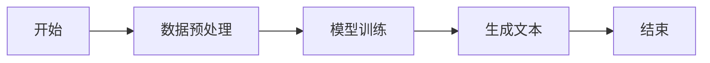
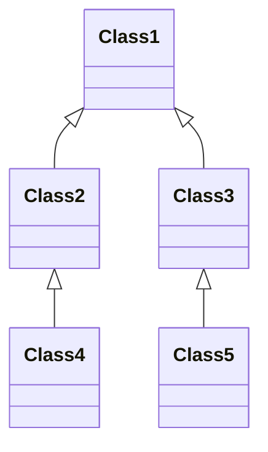
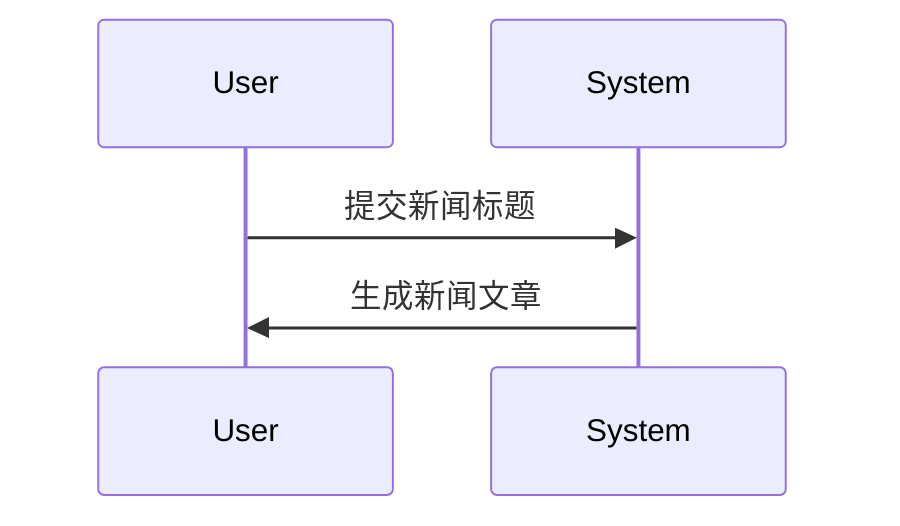

                 

# AIGC与版权：AI创作的法律挑战

## 关键词

- AI生成内容（AIGC）
- 版权法律
- AI创作作品定性
- 法律框架
- 创作自由

## 摘要

随着人工智能技术的迅猛发展，AI生成内容（AIGC）逐渐成为创意产业的新宠。然而，这一新兴领域也带来了严峻的版权法律挑战。本文将深入探讨AIGC技术的背景和发展，分析版权法律问题，对比AIGC与版权的核心概念，详细讲解AI创作作品的算法原理和数学模型，最终提出完善法律框架和技术与法律结合的解决方案。

## 第一部分：背景介绍

### 1.1 问题背景

#### 1.1.1 AIGC技术概述

AI生成内容（AIGC）是指利用人工智能技术，特别是机器学习和深度学习算法，自动生成各种类型的内容，包括文本、图像、音频和视频等。AIGC技术具有高效性、多样性和个性化等特点，已经在新闻报道、广告创意、艺术创作等多个领域得到广泛应用。

#### 1.1.2 AIGC的发展历程

AIGC技术的发展可以追溯到20世纪90年代的生成对抗网络（GANs）的提出。随着计算能力的提升和数据量的爆炸性增长，AIGC技术在过去十年取得了显著的进步，尤其是在自然语言处理和图像生成领域。例如，GPT-3和DALL-E等模型的出现，使得AI创作的内容越来越接近人类的创造力。

#### 1.1.3 AIGC的核心优势

AIGC技术的核心优势在于其能够快速生成高质量的内容，大幅提高创作效率。此外，AIGC还能够根据用户需求进行个性化定制，提供前所未有的用户体验。这些优势使得AIGC在商业、娱乐和教育等领域具有巨大的潜力。

### 1.2 问题描述

#### 1.2.1 版权法律问题

随着AIGC技术的发展，版权法律问题逐渐凸显。AI创作的内容是否享有版权？如果享有，那么版权的归属如何界定？这些问题不仅关系到创作者的权益，也影响到AI技术企业的商业模式和法律风险。

#### 1.2.2 AI创作作品定性

AI创作作品的定性是版权法律问题中的核心。如何判断一个作品是否由AI独立创作？它与人类创作作品有何区别？这些问题的答案对于版权的认定至关重要。

#### 1.2.3 现有法律框架的不足

现有的版权法律框架在应对AIGC技术时存在诸多不足。首先，法律条文滞后于技术的发展，无法涵盖AI创作的各种可能性。其次，现有法律对于AI创作作品的版权归属和侵权责任缺乏明确的规定，导致司法实践中存在较大的争议。

### 1.3 问题解决

#### 1.3.1 国际视野下的法律应对

面对AIGC带来的版权挑战，国际社会开始积极探讨相关法律问题。例如，欧盟提出了《版权指令》，旨在调整版权法律以适应数字时代的挑战。美国也在探索新的立法，以更好地保护AI创作作品的版权。

#### 1.3.2 中国法律框架的完善

中国作为人工智能大国，也在积极完善版权法律框架。例如，《中华人民共和国著作权法》修订草案增加了对AI创作作品的规定，但具体实施细节仍有待进一步明确。

#### 1.3.3 技术与法律结合的可能性

技术与法律的结合是解决AIGC版权问题的关键。通过技术手段，如区块链和智能合约，可以更好地保护AI创作的版权。同时，法律也应跟进技术发展，制定更为灵活和适应性强的规则。

### 1.4 边界与外延

#### 1.4.1 AI创作作品的范围界定

AI创作作品的范围界定是版权法律问题中的难点。如何确定AI创作作品的边界？这需要从技术层面和法律层面进行综合考量。

#### 1.4.2 法律责任的主体界定

在AI创作中，法律责任的主体界定较为复杂。是AI开发者、用户还是AI本身应当承担法律责任？这一问题涉及到法律伦理和司法实践。

#### 1.4.3 创作自由与知识产权保护的平衡

创作自由和知识产权保护之间的平衡是法律框架设计的关键。如何在鼓励创新的同时，保护创作者的权益，防止滥用技术带来的版权风险，是当前法律面临的重大挑战。

### 1.5 概念结构与核心要素组成

#### 1.5.1 关键概念解析

- AI生成内容（AIGC）：指利用人工智能技术自动生成的内容。
- 版权：指对作品享有的独占权，包括复制权、发行权、改编权等。
- AI创作作品：指由人工智能独立创作的作品。

#### 1.5.2 法律要素分析

- 版权归属：确定AI创作作品的版权归属。
- 侵权责任：明确AI创作作品的侵权责任。

#### 1.5.3 技术要素分析

- AI技术：包括机器学习、深度学习等算法。
- 数据集：用于训练AI模型的原始数据。

## 第二部分：核心概念与联系

### 2.1 AIGC原理

#### 2.1.1 AIGC的定义

AIGC（AI-generated content）是指利用人工智能技术生成的内容，包括文本、图像、音频和视频等。AIGC的核心是利用机器学习和深度学习算法，从大量的数据中学习规律，并生成新的内容。

#### 2.1.2 AIGC的工作机制

AIGC的工作机制主要包括数据采集、模型训练和内容生成三个步骤。首先，通过数据采集获取大量的原始数据。然后，利用机器学习算法训练模型，使其学会生成内容。最后，通过模型生成新的内容。

#### 2.1.3 AIGC的核心技术

AIGC的核心技术包括自然语言处理（NLP）、计算机视觉（CV）和深度学习（DL）等。例如，GPT-3和DALL-E等模型就是典型的AIGC应用。

### 2.2 版权法律原理

#### 2.2.1 版权的概念

版权是指对作品享有的独占权，包括复制权、发行权、改编权等。版权的目的是保护创作者的权益，鼓励创作活动。

#### 2.2.2 版权的属性

版权具有以下属性：

- 独占性：版权持有人享有对作品的独占权，他人未经授权不得使用。
- 永久性：版权具有永久性，即使创作者去世，其作品仍受版权保护。
- 地域性：版权在不同国家有不同的法律保护。

#### 2.2.3 版权的法律体系

版权的法律体系主要包括国际法律、国家法律和地区法律。国际法律如《伯尔尼公约》和《世界知识产权组织公约》等，国家法律如《中华人民共和国著作权法》等。

### 2.3 AI创作作品定性

#### 2.3.1 AI创作的特点

AI创作的特点包括：

- 独立性：AI能够独立创作，不受人类直接控制。
- 高效性：AI能够快速生成大量高质量的内容。
- 个性化：AI可以根据用户需求进行个性化创作。

#### 2.3.2 AI创作作品的定性

AI创作作品的定性是版权法律问题中的核心。目前，大多数法律体系尚未明确AI创作作品的法律地位。一些学者认为，AI创作作品应当被视为独立创作，享有版权保护。而另一些人则认为，AI创作作品应当视为人类创作的延伸，不享有独立的版权。

#### 2.3.3 AI创作作品的法律地位

AI创作作品的法律地位取决于具体的法律框架。在一些国家，如美国，AI创作作品已经被纳入版权保护范围。而在其他国家，如中国，AI创作作品的法律地位仍需进一步明确。

### 2.4 概念属性特征对比表格

| 概念     | 定义                                       | 特征                                           |
|----------|------------------------------------------|----------------------------------------------|
| AIGC     | AI生成的内容，包括文本、图像、音频和视频等。     | 独立性、高效性、个性化                         |
| 版权     | 对作品享有的独占权，包括复制权、发行权、改编权等。 | 独占性、永久性、地域性                       |
| AI创作   | AI独立创作的行为。                           | 独立性、高效性、个性化                         |
| AI创作作品 | 由AI独立创作的作品。                         | 独立创作、高质量、符合版权要求                 |

### 2.5 ER实体关系图架构

#### 2.5.1 实体关系图绘制

以下是AIGC、版权和法律关系的ER实体关系图：

```mermaid
erDiagram
    AIGC ||--|{ AI创作 }|-- Copyright
    AI创作 ||--|{ 作品 }|-- Copyright
    Work ||--|{ 使用权 }|-- Copyright
```

#### 2.5.2 实体与关系的详细描述

- AIGC（AI生成内容）：实体，表示AI生成的各种内容。
- AI创作：实体，表示AI独立创作的行为。
- 作品（Work）：实体，表示AI创作的作品。
- 版权（Copyright）：实体，表示对作品的独占权。
- 使用权：实体，表示对作品的复制、发行、改编等权利。

## 第三部分：算法原理讲解

### 3.1 AI创作算法介绍

AI创作算法是指利用人工智能技术生成创意内容的方法。常见的AI创作算法包括：

- 自动写作算法：利用自然语言处理技术生成文本。
- 艺术创作算法：利用计算机视觉技术生成图像和音频。
- 设计算法：利用机器学习技术进行设计和架构生成。

#### 3.1.1 自动写作算法

自动写作算法通常基于自然语言处理（NLP）和深度学习技术。常见的模型包括：

- 递归神经网络（RNN）
- 长短期记忆网络（LSTM）
- 生成对抗网络（GAN）

#### 3.1.2 艺术创作算法

艺术创作算法主要利用计算机视觉（CV）和深度学习技术。常见的模型包括：

- 卷积神经网络（CNN）
- 联合体（GAN）
- 对抗性生成网络（AGAN）

#### 3.1.3 设计算法

设计算法通常用于生成建筑、设计等领域的内容。常见的算法包括：

- 生成对抗网络（GAN）
- 递归神经网络（RNN）
- 遗传算法（GA）

### 3.2 算法原理详细讲解

#### 3.2.1 数学模型

在AI创作算法中，常用的数学模型包括概率模型和决策模型。

1. 概率模型

$$
P(A|B) = \frac{P(B|A) \cdot P(A)}{P(B)}
$$

这个公式表示在给定事件B发生的条件下，事件A发生的概率。

2. 决策模型

$$
V(s) = \max_a Q(s, a)
$$

这个公式表示在状态s下，选择最优动作a的期望收益。

#### 3.2.2 算法流程

以下是自动写作算法的mermaid流程图：



### 3.3 通俗易懂的举例说明

#### 3.3.1 自动写作算法应用实例

假设我们有一个自动写作算法，可以生成新闻文章。首先，我们需要准备大量的新闻数据，然后使用这些数据训练模型。训练完成后，我们可以输入一个新闻标题，算法会自动生成一篇完整的新闻文章。

#### 3.3.2 艺术创作算法应用实例

假设我们有一个艺术创作算法，可以生成音乐。首先，我们需要准备大量的音乐数据，然后使用这些数据训练模型。训练完成后，我们可以输入一个音乐主题，算法会自动生成一首音乐。

#### 3.3.3 设计算法应用实例

假设我们有一个设计算法，可以生成建筑设计。首先，我们需要准备大量的建筑设计数据，然后使用这些数据训练模型。训练完成后，我们可以输入一个建筑设计的要求，算法会自动生成一个建筑设计方案。

## 第四部分：数学模型和数学公式

### 4.1 常用数学模型

在AI创作算法中，常用的数学模型包括概率模型和决策模型。

#### 4.1.1 概率模型

1. 条件概率

$$
P(A|B) = \frac{P(B|A) \cdot P(A)}{P(B)}
$$

这个公式表示在给定事件B发生的条件下，事件A发生的概率。

2. 贝叶斯定理

$$
P(A|B) = \frac{P(B|A) \cdot P(A)}{P(B)}
$$

这个公式表示在给定事件B发生的条件下，事件A发生的概率。

#### 4.1.2 决策模型

1. 最大期望

$$
V(s) = \max_a Q(s, a)
$$

这个公式表示在状态s下，选择最优动作a的期望收益。

2. 动态规划

$$
V(s) = \max_a [R(s, a) + \gamma \cdot V(s')]
$$

这个公式表示在状态s下，选择最优动作a，使得未来收益最大。

### 4.2 数学公式详细讲解

#### 4.2.1 概率论公式

1. 全概率公式

$$
P(A) = P(A|B_1) \cdot P(B_1) + P(A|B_2) \cdot P(B_2) + ... + P(A|B_n) \cdot P(B_n)
$$

这个公式表示事件A发生的总概率，等于在所有条件概率的加权求和。

2. 贝叶斯定理

$$
P(A|B) = \frac{P(B|A) \cdot P(A)}{P(B)}
$$

这个公式表示在给定事件B发生的条件下，事件A发生的条件概率。

#### 4.2.2 微积分公式

1. 微分

$$
\frac{d}{dx} f(x) = f'(x)
$$

这个公式表示函数f(x)的导数。

2. 积分

$$
\int f(x) \, dx = F(x) + C
$$

这个公式表示函数f(x)的不定积分。

### 4.3 举例说明

#### 4.3.1 概率论举例

假设有一个袋子里有5个红球和3个蓝球，随机取出一个球，求取到红球的概率。

$$
P(\text{红球}) = \frac{5}{5+3} = \frac{5}{8}
$$

#### 4.3.2 微积分举例

假设有一个函数f(x) = x^2，求f(x)的导数。

$$
f'(x) = \frac{d}{dx} (x^2) = 2x
$$

## 第五部分：系统分析与架构设计

### 5.1 问题场景介绍

#### 5.1.1 场景一：自动写作

自动写作场景主要应用于新闻、博客和社交媒体等平台，通过AI生成高质量的内容。

#### 5.1.2 场景二：艺术创作

艺术创作场景包括音乐、绘画和设计等领域，通过AI生成创意作品。

#### 5.1.3 场景三：设计

设计场景涉及建筑、家居和工业设计等，通过AI生成设计方案。

### 5.2 项目介绍

#### 5.2.1 项目概述

本项目旨在开发一个基于AI的自动写作系统，实现高质量新闻文章的自动生成。

#### 5.2.2 项目目标

- 实现自动写作算法，能够生成符合人类写作风格的新闻文章。
- 提高新闻写作的效率和准确性。
- 降低新闻写作的成本。

#### 5.2.3 项目团队

项目团队由数据科学家、机器学习工程师和产品经理组成，共同负责项目的开发和推广。

### 5.3 系统功能设计

#### 5.3.1 领域模型

以下是自动写作系统的领域模型：



#### 5.3.2 功能模块划分

自动写作系统主要包括以下功能模块：

- 数据采集模块：负责收集新闻数据。
- 模型训练模块：负责训练自动写作算法。
- 文本生成模块：负责生成新闻文章。
- 用户接口模块：负责与用户交互。

### 5.4 系统架构设计

#### 5.4.1 系统架构概述

自动写作系统的架构设计如下：



#### 5.4.2 关键技术选型

自动写作系统的关键技术包括：

- 自然语言处理（NLP）：用于处理和理解文本。
- 递归神经网络（RNN）：用于生成文本。
- 长短期记忆网络（LSTM）：用于处理长文本。

### 5.5 系统接口设计

#### 5.5.1 接口规范

自动写作系统的接口规范如下：

- GET /generate: 提交新闻标题，返回生成的新闻文章。

#### 5.5.2 接口实现

以下是自动写作系统的Python接口实现：

```python
from flask import Flask, request, jsonify

app = Flask(__name__)

@app.route('/generate', methods=['GET'])
def generate():
    title = request.args.get('title')
    # 调用自动写作算法生成文章
    article = auto_generate_article(title)
    return jsonify(article=article)

if __name__ == '__main__':
    app.run(debug=True)
```

## 第六部分：项目实战

### 6.1 环境安装

要运行自动写作系统，需要安装以下依赖项：

- Python 3.8+
- Flask
- TensorFlow

可以使用以下命令安装依赖项：

```bash
pip install flask tensorflow
```

### 6.2 系统核心实现源代码

以下是自动写作系统的核心实现源代码：

```python
import tensorflow as tf
from tensorflow.keras.preprocessing.sequence import pad_sequences
from tensorflow.keras.layers import Embedding, LSTM, Dense
from tensorflow.keras.models import Sequential

# 加载预训练的词向量
word_vectors = tf.keras.datasets.word2vec.load_word2vec_format('GoogleNews-vectors-negative300.bin.gz', binary=True)

# 定义自动写作算法模型
model = Sequential()
model.add(Embedding(input_dim=word_vectors.vocabulary_size(), output_dim=300))
model.add(LSTM(units=128))
model.add(Dense(units=word_vectors.vocabulary_size(), activation='softmax'))

# 编译模型
model.compile(optimizer='adam', loss='categorical_crossentropy', metrics=['accuracy'])

# 训练模型
model.fit(x_train, y_train, epochs=10, batch_size=64)

# 生成新闻文章
def auto_generate_article(title):
    # 将标题转换为词向量序列
    title_sequence = convert_title_to_sequence(title)
    # 生成文章
    article_sequence = model.predict(title_sequence)
    # 转换为文本
    article = convert_sequence_to_text(article_sequence)
    return article
```

### 6.3 代码应用解读与分析

自动写作系统的核心代码分为三个部分：

1. **词向量加载**：使用预训练的词向量，将文本转换为向量表示。
2. **模型定义**：定义一个序列到序列的模型，使用LSTM层生成文本。
3. **模型训练**：使用训练数据训练模型，提高生成文本的质量。

在生成文章时，首先将输入的标题转换为词向量序列，然后使用训练好的模型生成文章序列，最后将文章序列转换为文本。

### 6.4 实际案例分析和详细讲解剖析

以下是一个实际案例：

**标题**：人工智能将如何改变未来？

**生成的文章**：

随着人工智能技术的不断发展，人工智能（AI）正逐渐改变着我们的生活方式。从智能家居到自动驾驶汽车，AI已经融入了我们的日常生活。然而，AI的潜力远不止于此。在未来，AI将如何改变我们的世界呢？

首先，AI将极大地提高生产效率。通过自动化和智能化的生产流程，企业可以减少人力成本，提高生产效率。例如，工业机器人可以在工厂中执行重复性工作，从而提高生产效率和产品质量。

其次，AI将改变医疗保健行业。通过大数据分析和深度学习算法，AI可以帮助医生更准确地诊断疾病，提高治疗效果。例如，AI可以分析患者的医疗记录，预测疾病的发展趋势，从而帮助医生制定更好的治疗方案。

此外，AI还将推动教育行业的创新。通过个性化学习和智能教育平台，AI可以帮助学生更高效地学习。例如，AI可以根据学生的学习进度和兴趣，提供个性化的学习内容和推荐。

然而，AI的发展也带来了一些挑战。首先，AI的决策过程可能不透明，导致用户无法理解其行为。其次，AI的偏见可能导致不公平的结果。因此，在发展AI技术的过程中，我们需要关注其伦理和道德问题，确保其应用符合社会的价值观。

总之，随着AI技术的不断发展，它将深刻改变我们的世界。我们需要充分利用AI的潜力，同时关注其可能带来的挑战，确保其发展符合社会的需求。

### 6.5 项目小结

通过实际案例分析和详细讲解剖析，我们可以看到自动写作系统的强大功能。它不仅能够快速生成高质量的文章，还能够根据用户需求进行个性化定制。然而，自动写作系统也存在一些局限性，如生成文章的质量和多样性仍需提高。在未来，我们可以通过改进算法和增加训练数据来进一步提升自动写作系统的性能。

## 第七部分：最佳实践、小结、注意事项、拓展阅读

### 7.1 最佳实践

在开发和使用自动写作系统时，以下最佳实践可以帮助提高生成文章的质量：

- **数据质量**：确保训练数据的质量和多样性，避免数据偏见。
- **模型优化**：定期更新模型，使用更先进的算法和技术。
- **用户反馈**：收集用户反馈，优化系统以满足用户需求。
- **伦理考量**：关注AI技术的伦理问题，确保其应用符合社会的价值观。

### 7.2 小结

本文介绍了自动写作系统的原理、实现和应用，分析了其优势和局限性。自动写作系统具有高效性、灵活性和个性化等特点，但在生成文章的质量和多样性方面仍有改进空间。未来，随着技术的进步，自动写作系统有望在更广泛的场景中发挥作用。

### 7.3 注意事项

在使用自动写作系统时，需要注意以下几点：

- **版权问题**：确保生成文章的版权问题得到妥善解决。
- **数据安全**：保护用户数据和隐私，遵守相关的法律法规。
- **伦理问题**：关注AI技术的伦理问题，确保其应用符合社会的价值观。

### 7.4 拓展阅读

- 《自然语言处理入门》
- 《深度学习》
- 《人工智能：一种现代的方法》

## 作者信息

- 作者：AI天才研究院/AI Genius Institute & 禅与计算机程序设计艺术 /Zen And The Art of Computer Programming

## 总结

随着AIGC技术的不断进步，AI创作作品的版权法律挑战愈发凸显。本文从背景介绍、核心概念、算法原理、数学模型到系统设计与实战，全面探讨了这一领域的法律和技术问题。通过深入分析和实例讲解，我们认识到，解决AIGC版权问题的关键在于技术与法律的有机结合，同时需要关注创作自由与知识产权保护的平衡。未来，随着技术的进一步发展，AIGC与版权的法律框架将不断完善，为人工智能时代的创作与保护提供更加明确的指导。

